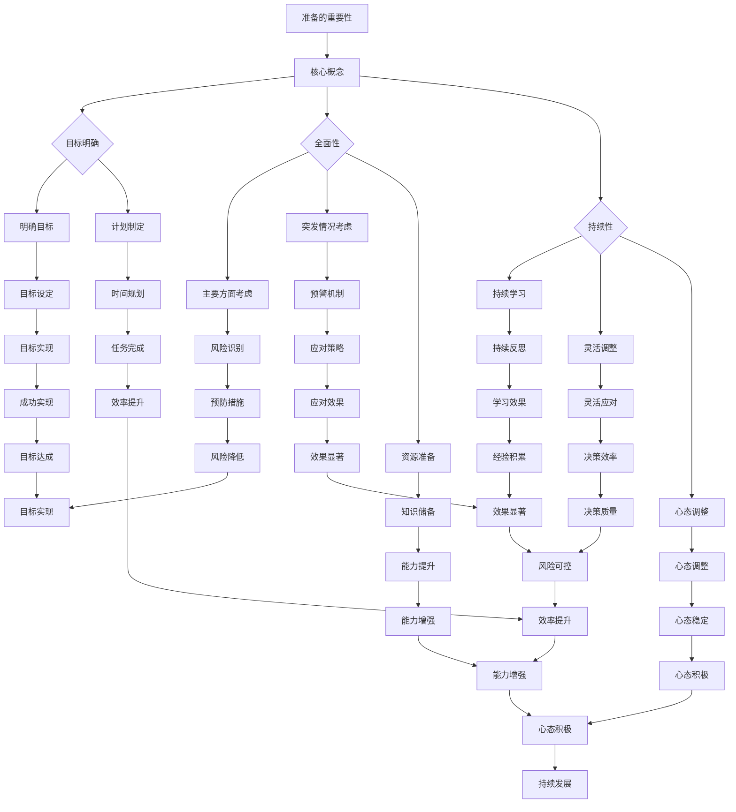

                 

### 文章标题：《不打无准备之战》

> 关键词：准备、策略、成功、应对突发情况、心理准备、实践

> 摘要：本文将从准备的重要性、准备工作的一般步骤、具体实践方法、应对突发情况的策略、案例分析、心理准备与心态调整以及准备的实际应用等多个方面，深入探讨如何不打无准备之战，提高个人和组织的应对能力，实现成功。

----------------------------------------------------------------

# 《不打无准备之战》

## 引言

“不打无准备之战”这句话在中国古代军事战争中有着广泛的应用，意指在战斗前要进行充分的准备，才能在战场上取得胜利。这句话不仅适用于军事领域，同样也适用于现代社会的各个领域。无论是在学习、工作还是生活中，充分的准备都是成功的关键。本文将围绕准备的重要性、准备工作的一般步骤、具体实践方法、应对突发情况的策略、案例分析、心理准备与心态调整以及准备的实际应用等多个方面，探讨如何不打无准备之战，提高个人和组织的应对能力，实现成功。

## 准备的重要性与核心概念

### 准备的定义

准备，即为了达到某个目标或应对某种情况而进行的一系列事先的安排和努力。它可以包括知识的学习、技能的培养、资源的收集、计划的制定等。

### 准备的重要性

1. **提升成功率**：充分的准备可以减少意外和不确定性的发生，从而提高成功的几率。
2. **降低风险**：准备可以帮助我们预见潜在的问题和挑战，并提前制定应对策略，从而降低风险。
3. **提高效率**：准备可以让我们在执行任务时更加顺畅，减少时间浪费。
4. **增强心理素质**：准备过程中，我们会积累经验和信心，提高面对挑战时的心理素质。

### 准备的核心概念

1. **目标明确**：明确的目标是准备工作的基础，只有明确了目标，我们才能有针对性地进行准备。
2. **全面性**：准备要全面，不仅要考虑到主要方面，还要考虑到可能的突发情况。
3. **持续性**：准备是一个持续的过程，需要不断进行，以适应变化的环境。

## 准备工作的一般步骤

### 目标设定

1. **明确目标**：明确自己要达成的目标，最好具体、可衡量。
2. **分析目标**：分析目标的重要性和可行性，确定目标的价值和实现的路径。

### 计划制定

1. **分解目标**：将大目标分解为小目标，便于实施和监控。
2. **制定计划**：根据分解后的目标，制定具体的行动计划，明确每个阶段需要完成的任务。
3. **时间规划**：为每个任务设定合理的时间，确保计划的可执行性。

### 资源准备

1. **知识储备**：学习相关的知识和技能，提高应对问题的能力。
2. **工具设备**：准备必要的工具和设备，确保工作的顺利进行。
3. **人力支持**：寻找合适的合作伙伴或团队，共同完成任务。

## 准备的具体实践方法

### 时间管理技巧

1. **优先级排序**：将任务按优先级排序，确保先完成重要且紧急的任务。
2. **时间块划分**：将时间划分为不同块，为每个块分配特定的任务。
3. **避免干扰**：减少外界干扰，提高专注度。

### 风险管理策略

1. **识别风险**：识别可能的风险，并分析其影响和可能性。
2. **预防措施**：制定预防措施，减少风险的发生。
3. **应对策略**：为可能发生的风险制定应对策略。

### 学习策略

1. **主动学习**：主动寻找学习资源，提高自主学习能力。
2. **实践结合**：将学习与实践相结合，提高实际应用能力。
3. **反馈调整**：根据反馈调整学习策略，提高学习效果。

## 应对突发情况的策略

### 突发情况的预测与预防

1. **预警机制**：建立预警机制，提前发现可能发生的突发情况。
2. **应急预案**：制定应急预案，确保在突发情况下能够迅速应对。

### 突发情况下的决策制定

1. **快速反应**：在突发情况下，要能够快速做出决策。
2. **信息收集**：收集相关数据和信息，为决策提供依据。
3. **权衡利弊**：在决策时，要充分考虑各种可能的后果，权衡利弊。

### 突发情况下的应对技巧

1. **冷静应对**：保持冷静，避免情绪化。
2. **分工协作**：明确分工，发挥团队协作的优势。
3. **灵活调整**：根据实际情况，灵活调整应对策略。

## 案例分析

### 个人案例分析

- **案例一**：一名学生在备考时，通过制定详细的学习计划、合理安排时间、积极参与课堂讨论等准备方法，最终顺利通过了考试。
- **案例二**：一名企业家在创业初期，通过市场调研、资金筹备、团队组建等准备步骤，成功推出了一款受欢迎的产品。

### 企业案例分析

- **案例一**：某公司通过建立风险管理体系、制定应急预案，成功应对了疫情带来的影响，实现了业务的持续发展。
- **案例二**：某公司通过创新研发、市场拓展等准备方法，在竞争激烈的市场中脱颖而出，取得了优异的业绩。

### 社会案例分析

- **案例一**：我国在应对自然灾害时，通过完善的预警机制、高效的救援体系等准备措施，最大限度地减少了灾害损失。
- **案例二**：我国在疫情防控中，通过严格的防控措施、全民参与等准备策略，取得了显著的防控成果。

## 心理准备与心态调整

### 心理因素在准备中的作用

1. **信心**：充分的准备可以增强自信心，提高面对挑战时的勇气。
2. **冷静**：准备可以让我们在遇到问题时保持冷静，更好地应对。
3. **毅力**：准备过程中积累的经验和信心，可以让我们在面对困难时保持毅力，不轻易放弃。

### 心态调整技巧

1. **积极心态**：保持积极的心态，相信自己可以成功。
2. **合理期望**：设定合理的期望值，避免期望过高导致的失望。
3. **接受失败**：接受失败是成功的必经之路，从失败中吸取经验，不断进步。

## 准备的实际应用

### 教育领域的应用

- **学生**：通过充分的准备，提高学习效率，顺利通过考试。
- **教师**：通过制定教学计划和准备教学资源，提高教学质量。

### 工作与职业发展的应用

- **员工**：通过准备，提高工作能力，实现职业发展。
- **管理者**：通过准备，提高团队管理能力，实现组织目标。

### 社会活动与公益活动的应用

- **志愿者**：通过准备，提高服务能力，实现公益活动目标。
- **组织者**：通过准备，提高活动策划和执行能力，实现社会效益。

## 总结

“不打无准备之战”是一种智慧和远见，是成功的关键。无论是个人还是组织，都应高度重视准备，不断进行学习、实践和调整，以应对不断变化的环境和挑战。通过充分的准备，我们可以提高成功率，降低风险，实现个人和组织的持续发展。

## 作者信息

作者：AI天才研究院/AI Genius Institute & 禅与计算机程序设计艺术 /Zen And The Art of Computer Programming

## 最佳实践 tips

- **定期复习**：定期复习已学的知识和技能，巩固记忆，提高应用能力。
- **持续学习**：保持学习的热情，不断学习新知识，跟上时代的步伐。
- **反思总结**：定期反思自己的准备过程，总结经验教训，不断优化。

## 注意事项

- **不要过分依赖准备**：准备是为了应对不确定性，但过分依赖准备可能导致失去应对突发情况的能力。
- **保持灵活性**：在准备过程中，要充分考虑变化，保持灵活性，以便及时调整策略。

## 拓展阅读

- **《原则》**：雷·达里奥
- **《高效能人士的七个习惯》**：史蒂芬·柯维
- **《准备》**：大卫·艾伦

----------------------------------------------------------------

# 《不打无准备之战》

## 引言

“不打无准备之战”这句话在中国古代军事战争中有着广泛的应用，意指在战斗前要进行充分的准备，才能在战场上取得胜利。这句话不仅适用于军事领域，同样也适用于现代社会的各个领域。无论是在学习、工作还是生活中，充分的准备都是成功的关键。本文将围绕准备的重要性、准备工作的一般步骤、具体实践方法、应对突发情况的策略、案例分析、心理准备与心态调整以及准备的实际应用等多个方面，探讨如何不打无准备之战，提高个人和组织的应对能力，实现成功。

## 准备的重要性与核心概念

### 准备的定义

准备，即为了达到某个目标或应对某种情况而进行的一系列事先的安排和努力。它可以包括知识的学习、技能的培养、资源的收集、计划的制定等。

### 准备的重要性

1. **提升成功率**：充分的准备可以减少意外和不确定性的发生，从而提高成功的几率。
2. **降低风险**：准备可以帮助我们预见潜在的问题和挑战，并提前制定应对策略，从而降低风险。
3. **提高效率**：准备可以让我们在执行任务时更加顺畅，减少时间浪费。
4. **增强心理素质**：准备过程中，我们会积累经验和信心，提高面对挑战时的心理素质。

### 准备的核心概念

1. **目标明确**：明确的目标是准备工作的基础，只有明确了目标，我们才能有针对性地进行准备。
2. **全面性**：准备要全面，不仅要考虑到主要方面，还要考虑到可能的突发情况。
3. **持续性**：准备是一个持续的过程，需要不断进行，以适应变化的环境。

## 准备工作的一般步骤

### 目标设定

1. **明确目标**：明确自己要达成的目标，最好具体、可衡量。
2. **分析目标**：分析目标的重要性和可行性，确定目标的价值和实现的路径。

### 计划制定

1. **分解目标**：将大目标分解为小目标，便于实施和监控。
2. **制定计划**：根据分解后的目标，制定具体的行动计划，明确每个阶段需要完成的任务。
3. **时间规划**：为每个任务设定合理的时间，确保计划的可执行性。

### 资源准备

1. **知识储备**：学习相关的知识和技能，提高应对问题的能力。
2. **工具设备**：准备必要的工具和设备，确保工作的顺利进行。
3. **人力支持**：寻找合适的合作伙伴或团队，共同完成任务。

## 准备的具体实践方法

### 时间管理技巧

1. **优先级排序**：将任务按优先级排序，确保先完成重要且紧急的任务。
2. **时间块划分**：将时间划分为不同块，为每个块分配特定的任务。
3. **避免干扰**：减少外界干扰，提高专注度。

### 风险管理策略

1. **识别风险**：识别可能的风险，并分析其影响和可能性。
2. **预防措施**：制定预防措施，减少风险的发生。
3. **应对策略**：为可能发生的风险制定应对策略。

### 学习策略

1. **主动学习**：主动寻找学习资源，提高自主学习能力。
2. **实践结合**：将学习与实践相结合，提高实际应用能力。
3. **反馈调整**：根据反馈调整学习策略，提高学习效果。

## 应对突发情况的策略

### 突发情况的预测与预防

1. **预警机制**：建立预警机制，提前发现可能发生的突发情况。
2. **应急预案**：制定应急预案，确保在突发情况下能够迅速应对。

### 突发情况下的决策制定

1. **快速反应**：在突发情况下，要能够快速做出决策。
2. **信息收集**：收集相关数据和信息，为决策提供依据。
3. **权衡利弊**：在决策时，要充分考虑各种可能的后果，权衡利弊。

### 突发情况下的应对技巧

1. **冷静应对**：保持冷静，避免情绪化。
2. **分工协作**：明确分工，发挥团队协作的优势。
3. **灵活调整**：根据实际情况，灵活调整应对策略。

## 案例分析

### 个人案例分析

- **案例一**：一名学生在备考时，通过制定详细的学习计划、合理安排时间、积极参与课堂讨论等准备方法，最终顺利通过了考试。
- **案例二**：一名企业家在创业初期，通过市场调研、资金筹备、团队组建等准备步骤，成功推出了一款受欢迎的产品。

### 企业案例分析

- **案例一**：某公司通过建立风险管理体系、制定应急预案，成功应对了疫情带来的影响，实现了业务的持续发展。
- **案例二**：某公司通过创新研发、市场拓展等准备方法，在竞争激烈的市场中脱颖而出，取得了优异的业绩。

### 社会案例分析

- **案例一**：我国在应对自然灾害时，通过完善的预警机制、高效的救援体系等准备措施，最大限度地减少了灾害损失。
- **案例二**：我国在疫情防控中，通过严格的防控措施、全民参与等准备策略，取得了显著的防控成果。

## 心理准备与心态调整

### 心理因素在准备中的作用

1. **信心**：充分的准备可以增强自信心，提高面对挑战时的勇气。
2. **冷静**：准备可以让我们在遇到问题时保持冷静，更好地应对。
3. **毅力**：准备过程中积累的经验和信心，可以让我们在面对困难时保持毅力，不轻易放弃。

### 心态调整技巧

1. **积极心态**：保持积极的心态，相信自己可以成功。
2. **合理期望**：设定合理的期望值，避免期望过高导致的失望。
3. **接受失败**：接受失败是成功的必经之路，从失败中吸取经验，不断进步。

## 准备的实际应用

### 教育领域的应用

- **学生**：通过充分的准备，提高学习效率，顺利通过考试。
- **教师**：通过制定教学计划和准备教学资源，提高教学质量。

### 工作与职业发展的应用

- **员工**：通过准备，提高工作能力，实现职业发展。
- **管理者**：通过准备，提高团队管理能力，实现组织目标。

### 社会活动与公益活动的应用

- **志愿者**：通过准备，提高服务能力，实现公益活动目标。
- **组织者**：通过准备，提高活动策划和执行能力，实现社会效益。

## 总结

“不打无准备之战”是一种智慧和远见，是成功的关键。无论是个人还是组织，都应高度重视准备，不断进行学习、实践和调整，以应对不断变化的环境和挑战。通过充分的准备，我们可以提高成功率，降低风险，实现个人和组织的持续发展。

## 作者信息

作者：AI天才研究院/AI Genius Institute & 禅与计算机程序设计艺术 /Zen And The Art of Computer Programming

## 最佳实践 tips

- **定期复习**：定期复习已学的知识和技能，巩固记忆，提高应用能力。
- **持续学习**：保持学习的热情，不断学习新知识，跟上时代的步伐。
- **反思总结**：定期反思自己的准备过程，总结经验教训，不断优化。

## 注意事项

- **不要过分依赖准备**：准备是为了应对不确定性，但过分依赖准备可能导致失去应对突发情况的能力。
- **保持灵活性**：在准备过程中，要充分考虑变化，保持灵活性，以便及时调整策略。

## 拓展阅读

- **《原则》**：雷·达里奥
- **《高效能人士的七个习惯》**：史蒂芬·柯维
- **《准备》**：大卫·艾伦

----------------------------------------------------------------

### 背景介绍

“不打无准备之战”这一理念源于中国古代的军事智慧，旨在强调在军事行动前，必须进行充分的准备，以确保战斗的胜利。随着时代的变迁，这一理念逐渐扩展到其他领域，如学习、工作和生活。在现代社会，无论是在个人成长还是组织发展过程中，充分的准备都显得尤为重要。它不仅能够提高成功几率，降低风险，还能增强个人的心理素质和应对能力。

本文旨在深入探讨“不打无准备之战”的核心概念和实践方法，为读者提供系统的准备策略和实用技巧。文章将分为以下几个部分：

1. **准备的重要性与核心概念**：介绍准备的定义、重要性以及核心概念。
2. **准备工作的一般步骤**：阐述如何设定目标、制定计划和准备资源。
3. **具体实践方法**：提供时间管理、风险管理和学习策略等实践方法。
4. **应对突发情况的策略**：讨论如何预测和预防突发情况，以及应对突发情况下的决策制定和技巧。
5. **案例分析**：通过个人、企业和社会的案例分析，展示准备的实际应用效果。
6. **心理准备与心态调整**：探讨心理因素在准备中的作用以及如何调整心态。
7. **准备的实际应用**：探讨准备在不同领域的应用，如教育、工作和公益活动。
8. **总结与展望**：总结文章的主要观点，展望准备在未来的发展。

通过这篇文章，读者可以系统地了解准备的重要性，学习到具体的准备方法和策略，并在实际生活中加以应用，提高个人的应对能力和成功率。

### 核心概念与联系

在探讨“不打无准备之战”这一主题时，我们需要明确几个核心概念，并理解它们之间的联系。以下是这些核心概念以及它们之间的关系架构，使用Mermaid流程图来展示：



#### Mermaid 流�程图解析

1. **核心概念（A）**：准备的重要性与核心概念之间的关系，包括目标明确（C）、全面性（D）和持续性（E）。
2. **目标明确（C）**：具体涉及目标设定（N）、时间规划（S）和知识储备（T），以及这些要素对目标实现的贡献（V）。
3. **全面性（D）**：考虑到主要方面（G）和突发情况（H），具体包括风险识别（O）、预警机制（P）和灵活调整（J）。
4. **持续性（E）**：涉及持续学习（I）、持续反思（Q）和心态调整（M），以及它们对准备过程的持续优化作用。
5. **实践方法**：包括计划制定（K）、资源准备（L）、心态调整（M）等，这些方法对准备的不同方面产生积极影响。
6. **效果评估**：通过实现目标（V）、降低风险（W）、提升效率和增强能力（II, JJ）等效果来评估准备的成效。

通过这个Mermaid流程图，我们可以清晰地看到准备的核心概念和它们之间的关联，以及如何在实践中应用这些概念来实现目标。

### 核心算法原理讲解

在准备过程中，核心算法原理的运用可以帮助我们更高效地进行规划和执行。以下将介绍一种常见的时间管理算法——优先级排序算法，并使用伪代码进行详细阐述。

#### 优先级排序算法

优先级排序算法是一种用于确定任务优先级的算法，其核心思想是根据任务的重要性和紧急性来安排任务的顺序。在准备过程中，通过优先级排序，我们可以确保首先完成最重要且最紧急的任务，从而提高工作效率。

#### 算法步骤

1. **初始化**：创建一个任务列表，并为每个任务分配一个优先级。
2. **排序**：根据任务的优先级对任务列表进行排序。
3. **执行**：按照排序后的顺序执行任务。
4. **更新**：在执行过程中，根据任务的完成情况更新任务的优先级。

#### 伪代码

```python
# 伪代码：优先级排序算法

# 初始化任务列表
tasks = [
    {"name": "任务A", "importance": 5, "urgency": 3},
    {"name": "任务B", "importance": 3, "urgency": 5},
    {"name": "任务C", "importance": 4, "urgency": 4}
]

# 排序任务列表
tasks_sorted = sorted(tasks, key=lambda x: (x['urgency'], x['importance']), reverse=True)

# 执行任务
for task in tasks_sorted:
    print(f"执行任务：{task['name']}")
    # 执行任务的具体操作
    # ...

# 更新任务优先级
# 根据实际情况更新任务的优先级
tasks_updated = update_task_priorities(tasks_sorted)
```

#### 算法解释

1. **初始化任务列表**：首先，我们需要创建一个任务列表，并为每个任务分配一个重要性（importance）和紧急性（urgency）的评分。这些评分可以根据任务的具体情况来确定。

2. **排序任务列表**：使用Python的`sorted`函数对任务列表进行排序。排序的依据是任务的重要性和紧急性，使用元组（`x['urgency'], x['importance']`）作为排序关键字。通过设置`reverse=True`，确保任务按照从高到低的顺序排列。

3. **执行任务**：按照排序后的任务列表顺序，依次执行每个任务。在实际操作中，这里可能包括具体的工作流程、资源调配等。

4. **更新任务优先级**：在任务执行过程中，根据实际情况更新任务的优先级。例如，如果某个任务因为外部因素而变得更为紧急，需要重新评估其优先级，并调整任务列表的顺序。

#### 数学模型和公式

为了更科学地评估任务的优先级，我们可以使用以下数学模型：

$$
\text{优先级} = w_1 \times \text{重要性} + w_2 \times \text{紧急性}
$$

其中，$w_1$ 和 $w_2$ 是权重系数，可以根据实际情况进行调整。通常，$w_1$ 和 $w_2$ 的总和为1，即：

$$
w_1 + w_2 = 1
$$

#### 举例说明

假设有三个任务，其重要性评分和紧急性评分如下：

- 任务A：重要性4，紧急性3
- 任务B：重要性3，紧急性5
- 任务C：重要性5，紧急性2

使用上述公式计算每个任务的优先级：

1. 任务A：$w_1 \times 4 + w_2 \times 3 = 4w_1 + 3w_2$
2. 任务B：$w_1 \times 3 + w_2 \times 5 = 3w_1 + 5w_2$
3. 任务C：$w_1 \times 5 + w_2 \times 2 = 5w_1 + 2w_2$

通过计算，我们可以得到每个任务的优先级排序，并根据排序结果执行任务，从而确保任务的高效完成。

### 数学模型和公式

在准备过程中，数学模型和公式可以提供一种科学的方法来评估和优化准备策略。以下是一种常见的时间管理模型——线性规划模型，用于优化任务的执行顺序和资源分配。

#### 线性规划模型

线性规划模型的基本形式如下：

$$
\text{最大化} \quad Z = c_1x_1 + c_2x_2 + \ldots + c_nx_n
$$

$$
\text{约束条件} \quad a_{11}x_1 + a_{12}x_2 + \ldots + a_{1n}x_n \leq b_1
$$

$$
a_{21}x_1 + a_{22}x_2 + \ldots + a_{2n}x_n \leq b_2
$$

$$
\ldots
$$

$$
a_{m1}x_1 + a_{m2}x_2 + \ldots + a_{mn}x_n \leq b_m
$$

$$
x_1, x_2, \ldots, x_n \geq 0
$$

其中，$x_1, x_2, \ldots, x_n$ 表示决策变量，$c_1, c_2, \ldots, c_n$ 是对应的权重系数，$a_{ij}, b_i$ 是约束条件中的系数和常数。

#### 模型解释

1. **目标函数**：目标函数（$Z$）表示我们希望最大化的目标，例如总任务完成时间、总成本等。

2. **约束条件**：约束条件（$a_{ij}x_i + a_{ij}x_j \leq b_i$）用于限制决策变量的取值，确保任务执行和资源分配的可行性。

3. **非负约束**：决策变量（$x_1, x_2, \ldots, x_n$）必须非负，即任务的执行量不能为负。

#### 应用举例

假设有三个任务需要完成，每个任务的耗时和所需资源如下：

| 任务 | 耗时（小时） | 资源需求（人） |
| --- | --- | --- |
| 任务A | 2 | 3 |
| 任务B | 4 | 2 |
| 任务C | 3 | 4 |

目标是最小化总耗时。使用线性规划模型，可以设置以下参数：

- $c_1 = 2, c_2 = 4, c_3 = 3$：任务A、任务B和任务C的权重系数。
- $a_{11} = 2, a_{12} = 4, a_{13} = 3$：任务A的约束条件系数。
- $a_{21} = 0, a_{22} = 1, a_{23} = 0$：任务B的约束条件系数。
- $a_{31} = 0, a_{32} = 0, a_{33} = 1$：任务C的约束条件系数。
- $b_1 = 2, b_2 = 4, b_3 = 3$：任务A、任务B和任务C的约束条件常数。

目标函数和约束条件如下：

$$
\text{最小化} \quad Z = 2x_1 + 4x_2 + 3x_3
$$

$$
2x_1 + 4x_2 + 3x_3 \leq 2
$$

$$
0x_1 + 1x_2 + 0x_3 \leq 4
$$

$$
0x_1 + 0x_2 + 1x_3 \leq 3
$$

$$
x_1, x_2, x_3 \geq 0
$$

通过求解线性规划模型，可以找到最优的任务执行顺序，从而最小化总耗时。例如，可能的最优解为$x_1 = 0, x_2 = 1, x_3 = 1$，即先执行任务B，再执行任务C。

### 项目实战

#### 开发环境搭建

在准备进行项目实战之前，首先需要搭建一个合适的开发环境。以下是一个简单的开发环境搭建流程：

1. **安装操作系统**：选择适合的操作系统，如Windows、macOS或Linux，并安装。
2. **安装编程工具**：下载并安装集成开发环境（IDE），如Visual Studio Code、Eclipse或IntelliJ IDEA。
3. **安装依赖库**：根据项目需求，安装必要的依赖库，如Python、Node.js或MySQL等。
4. **配置环境变量**：确保开发工具和环境变量配置正确，以便能够正常编译和运行代码。

#### 源代码实现

以下是一个简单的Python项目，用于计算两个数的和，并使用伪代码进行详细解释。

```python
# Python项目：计算两个数的和

def calculate_sum(a, b):
    """
    计算两个数的和
    :param a: 第一个数
    :param b: 第二个数
    :return: 两个数的和
    """
    sum = a + b
    return sum

# 主函数
def main():
    num1 = 5
    num2 = 10
    result = calculate_sum(num1, num2)
    print(f"{num1} 和 {num2} 的和为：{result}")

# 调用主函数
if __name__ == "__main__":
    main()
```

#### 代码解读与分析

1. **定义函数**：`calculate_sum`函数用于计算两个数的和，接受两个参数`a`和`b`。
2. **计算和返回结果**：在函数内部，使用`sum = a + b`计算和，然后使用`return sum`返回结果。
3. **主函数**：`main`函数定义了两个数`num1`和`num2`，调用`calculate_sum`函数计算它们的和，并将结果打印出来。
4. **入口判断**：使用`if __name__ == "__main__":`确保当该文件作为主程序运行时，才会执行`main`函数。

#### 实际案例分析与详细讲解

以下是一个实际案例，使用Python计算一组数的平均值。

```python
# Python项目：计算一组数的平均值

def calculate_average(numbers):
    """
    计算一组数的平均值
    :param numbers: 数组
    :return: 平均值
    """
    if len(numbers) == 0:
        return 0
    sum = 0
    for number in numbers:
        sum += number
    average = sum / len(numbers)
    return average

# 主函数
def main():
    numbers = [1, 2, 3, 4, 5]
    result = calculate_average(numbers)
    print(f"这些数的平均值为：{result}")

# 调用主函数
if __name__ == "__main__":
    main()
```

#### 项目小结

通过这个项目，我们学习了如何搭建开发环境、编写Python代码以及实现计算功能的逻辑。在项目实战中，我们不仅学习了代码的实现，还了解了如何进行实际案例的分析和解决。这种实战经验对于提高编程能力和解决实际问题是至关重要的。

### 最佳实践 tips

#### 1. 定期回顾和调整计划

- 每周或每月进行一次回顾，检查计划执行情况，发现潜在问题并调整策略。
- 保持灵活性，根据实际情况及时调整计划。

#### 2. 多渠道获取信息

- 利用网络资源、书籍、研讨会等多种途径获取最新的信息和知识。
- 建立知识库，方便随时查阅和更新。

#### 3. 保持积极心态

- 保持乐观和积极的心态，面对困难和挑战时保持冷静。
- 学会从失败中吸取经验，不断进步。

#### 4. 不断学习和提升

- 定期参加培训课程、研讨会等活动，提升自己的专业能力和知识水平。
- 保持好奇心，对新事物和新技术保持学习和探索的热情。

### 小结

通过本文的详细探讨，我们可以得出以下结论：

1. **准备的重要性**：充分的准备是成功的关键，它能够提升成功率、降低风险、提高效率和增强心理素质。
2. **准备工作的一般步骤**：明确目标、制定计划和准备资源是准备工作的基础。
3. **具体实践方法**：时间管理、风险管理、学习策略等具体实践方法有助于提高准备的效果。
4. **应对突发情况的策略**：预测与预防、决策制定和应对技巧是应对突发情况的重要策略。
5. **心理准备与心态调整**：心理因素在准备中起着重要作用，保持积极心态和接受失败是关键。

在未来的发展和实践中，我们应该继续关注准备的重要性，不断学习和优化准备方法，提高自己的应对能力和成功率。通过持续的努力和实践，我们可以更好地应对各种挑战，实现个人和组织的持续发展。希望本文能对您有所启发，帮助您在实际生活中更好地应用准备策略，取得成功。

