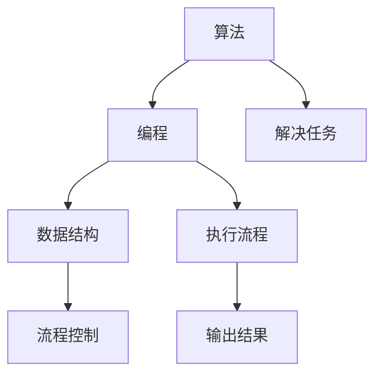

                 

### 文章标题

《从左及右，步步为营》

### 关键词

算法原理，数学模型，编程实践，流程图，伪代码，代码实例

### 摘要

本文以《从左及右，步步为营》为主题，通过详细讲解核心概念、算法原理和数学模型，并结合实战项目，旨在帮助读者深入理解并掌握算法设计和编程技巧。文章分为四个部分：引言、核心内容、实战项目和总结与展望，每个部分都通过具体的流程图、伪代码、数学公式和代码实例进行深入剖析。通过本文的阅读，读者可以系统地了解从左及右的算法思想和编程实践，从而提升自己的编程能力和算法思维。

## 引言

《从左及右，步步为营》这个书名本身就充满了策略和智慧的意味。在算法和编程的世界里，“从左及右”是一种逐步推进、循序渐进的方法，它强调在解决问题时，首先要从基础开始，逐步深入，确保每一步都扎实可靠。这种思维方式在许多成功的算法设计中起到了至关重要的作用。

本文的目标是帮助读者理解和掌握这种“从左及右，步步为营”的算法思想和编程实践。我们将通过详细讲解核心概念、算法原理和数学模型，并结合实战项目，展示如何将理论知识应用到实际编程中。通过本文的阅读，读者不仅可以了解算法的内部工作原理，还能够学会如何设计并实现高效的算法。

在接下来的章节中，我们将首先介绍算法和编程的基本概念，然后深入探讨核心概念与联系，详细讲解算法原理和数学模型，最后通过实战项目来验证和巩固所学知识。希望本文能够为读者提供一个清晰、系统的学习路径，帮助大家更好地掌握算法和编程的核心技巧。

### 核心概念与联系

在深入探讨《从左及右，步步为营》这一主题之前，我们需要明确几个核心概念，并了解它们之间的联系。这些概念包括但不限于：算法、编程、数据结构、流程控制等。

首先，算法（Algorithm）可以被定义为一组有序的操作步骤，用于解决问题或执行特定任务。算法的核心在于其逻辑性和步骤性，即通过一系列明确、有序的操作，将输入转化为预期的输出。

接着是编程（Programming），编程是使用算法来解决问题的一种方法。编程语言提供了表达算法的语法和工具，使得我们可以将抽象的算法思想转化为具体的可执行代码。常见的编程语言包括Python、Java、C++等，每种语言都有其独特的语法和特点。

数据结构（Data Structure）是存储和管理数据的一种方式，它决定了数据的组织形式和操作效率。常见的数据结构包括数组、链表、栈、队列、树、图等。不同的数据结构适合不同的应用场景，选择合适的数据结构可以显著提高算法的效率和性能。

最后，流程控制（Flow Control）是指在程序执行过程中，控制程序流程的机制。流程控制语句包括条件判断（如if-else）、循环结构（如for、while）等，它们决定了程序在执行过程中的决策路径和执行顺序。

这些核心概念之间存在着紧密的联系。算法是编程的核心，它为编程提供了具体的操作步骤；数据结构是实现算法的重要工具，它决定了算法的操作效率和存储空间；而流程控制则是在程序执行过程中，根据算法和数据结构的特点来控制程序的流程。

为了更好地理解这些概念之间的联系，我们可以通过一个Mermaid流程图来展示它们的基本关系：



在这个流程图中，算法是起点，通过编程语言实现，利用数据结构来存储和处理数据，并通过流程控制语句来控制程序的执行路径，最终完成任务并输出结果。

通过这个Mermaid流程图，我们可以直观地看到算法、编程、数据结构和流程控制之间的相互作用和依赖关系。这些核心概念共同构成了算法和编程的基本框架，是理解和实现复杂系统的基础。

### 算法原理讲解

在了解了核心概念和它们之间的联系之后，我们接下来将深入探讨算法的基本原理。算法原理是理解算法设计和实现的关键，它不仅涉及算法的核心思想，还包括算法的设计过程和实现技巧。以下将详细讲解几个常见的算法原理，并通过伪代码展示其具体实现。

#### 算法概述

算法可以简单定义为一组有序的操作步骤，用于解决特定问题或执行特定任务。算法的原理主要包括以下几个关键方面：

1. **输入**：算法开始时需要接收一些初始输入数据，这些数据是算法处理的对象。
2. **处理**：算法通过对输入数据进行一系列操作，逐步逼近问题的解。
3. **输出**：算法最终输出解决问题的结果或最终答案。

一个算法是否有效，通常取决于其时间复杂度和空间复杂度。时间复杂度表示算法执行时间与数据规模之间的关系，而空间复杂度则表示算法所需存储空间与数据规模之间的关系。高效的算法通常具有较低的时间复杂度和空间复杂度。

#### 伪代码讲解

为了更好地理解和实现算法原理，我们可以通过伪代码（Pseudocode）来详细阐述。伪代码是一种非正式的编程描述语言，它使用自然语言和少量编程语法，使得算法的实现过程更加清晰易懂。

以下是一个简单的排序算法——冒泡排序（Bubble Sort）的伪代码：

```python
# 冒泡排序伪代码
function 冒泡排序(arr):
    n = 长度(arr)
    for i from 0 to n-1:
        for j from 0 to n-i-1:
            if arr[j] > arr[j+1]:
                交换(arr[j], arr[j+1])
    return arr
```

在这个伪代码中，`arr` 是待排序的数组，`n` 是数组长度。外层循环 `i` 从0开始，直到 `n-1`，每次循环表示对未排序部分进行一轮排序。内层循环 `j` 从0开始，直到 `n-i-1`，每次循环将相邻的两个元素进行比较和交换，如果当前元素比下一个元素大，则交换它们的位置。经过每一轮循环，最大元素都会“冒泡”到数组的末尾，从而实现整个数组的排序。

#### 冒泡排序算法解释

冒泡排序算法的基本思想是通过多次遍历数组，逐步将未排序的部分中的最大元素移动到已排序部分的末尾。每次遍历过程中，相邻元素的比较和交换保证了每一轮遍历结束后，至少有一个元素被放到正确的位置。

以下是一个具体的冒泡排序算法执行过程，假设初始数组为 `[3, 2, 1]`：

1. **第一次遍历**：
   - 比较 `(3, 2)`，交换，得到 `[2, 3, 1]`。
   - 比较 `(3, 1)`，交换，得到 `[2, 1, 3]`。

2. **第二次遍历**：
   - 比较 `(2, 1)`，交换，得到 `[1, 2, 3]`。
   - 此时已排序部分的最后一个元素 `3` 已经在正确的位置，无需再比较。

经过两次遍历，数组 `[3, 2, 1]` 被成功排序为 `[1, 2, 3]`。

通过上述伪代码和解释，我们可以清晰地看到冒泡排序算法的实现过程和原理。虽然冒泡排序算法的时间复杂度为 \(O(n^2)\)，这在处理大数据时效率较低，但它简单易懂，适合用于教学和基础算法理解。

总之，算法原理是算法设计和实现的核心。通过伪代码的详细讲解，我们可以更好地理解和实现各种算法。在接下来的章节中，我们将继续探讨其他重要的算法原理，并结合实际项目进行应用和验证。

### 数学模型讲解

数学模型是算法设计和分析的重要工具，它能够帮助我们更准确地描述和解决问题。在《从左及右，步步为营》的主题下，数学模型不仅能够帮助我们理解算法的内在逻辑，还可以指导我们进行算法优化。本章节将介绍几个常用的数学模型，并使用LaTeX格式展示其数学公式，详细讲解其应用，并给出具体的实例。

#### 模型概述

数学模型通常由一组变量、约束条件和目标函数组成。这些变量和条件共同定义了问题的解空间，而目标函数则用于评估解的质量。以下是几个常见的数学模型：

1. **线性规划（Linear Programming）**
2. **非线性规划（Nonlinear Programming）**
3. **回归分析（Regression Analysis）**
4. **神经网络（Neural Networks）**

这些模型在不同的应用场景中具有不同的作用，下面将分别进行介绍。

#### 数学公式讲解

首先，我们来看线性规划模型的基本公式。线性规划是一种求解线性目标函数在线性不等式约束条件下的最优解的问题。线性规划的标准形式如下：

\[
\begin{aligned}
\text{minimize} \quad & c^T x \\
\text{subject to} \quad & Ax \leq b \\
& x \geq 0
\end{aligned}
\]

其中，\(c\) 是目标函数系数向量，\(x\) 是决策变量向量，\(A\) 是约束条件系数矩阵，\(b\) 是约束条件常数向量。

接下来，我们来看回归分析模型中的一个简单例子——线性回归。线性回归模型用于建立自变量和因变量之间的线性关系，其基本公式如下：

\[
y = \beta_0 + \beta_1 x + \epsilon
\]

其中，\(y\) 是因变量，\(x\) 是自变量，\(\beta_0\) 和 \(\beta_1\) 是模型的参数，\(\epsilon\) 是误差项。

#### 详细讲解

线性规划模型的目标是找到一组变量 \(x\)，使得目标函数 \(c^T x\) 最小化，同时满足线性不等式约束条件 \(Ax \leq b\) 和非负约束 \(x \geq 0\)。

在具体应用中，我们可以通过拉格朗日乘数法或单纯形法来求解线性规划问题。例如，拉格朗日乘数法通过引入拉格朗日函数：

\[
L(x, \lambda) = c^T x + \lambda^T (Ax - b)
\]

然后求解拉格朗日函数的极小值问题，从而得到最优解 \(x\)。

对于线性回归模型，我们通常使用最小二乘法来求解模型参数 \(\beta_0\) 和 \(\beta_1\)。最小二乘法的核心思想是找到一组参数，使得实际观测值 \(y\) 与预测值 \(y\) 之间的误差平方和最小。具体步骤如下：

1. **计算观测值的均值**：

\[
\bar{y} = \frac{1}{n} \sum_{i=1}^{n} y_i
\]

\[
\bar{x} = \frac{1}{n} \sum_{i=1}^{n} x_i
\]

2. **计算回归系数**：

\[
\beta_1 = \frac{\sum_{i=1}^{n} (x_i - \bar{x})(y_i - \bar{y})}{\sum_{i=1}^{n} (x_i - \bar{x})^2}
\]

\[
\beta_0 = \bar{y} - \beta_1 \bar{x}
\]

#### 实例说明

为了更好地理解这些数学模型，我们来看一个实际例子。假设我们有一个线性回归模型，用于预测房价。自变量 \(x\) 是房屋面积，因变量 \(y\) 是房价。我们收集了以下数据：

| 面积 (x) | 价格 (y) |
|----------|---------|
| 1000     | 200000  |
| 1500     | 300000  |
| 2000     | 400000  |

根据上述数据，我们使用最小二乘法计算回归系数：

1. **计算均值**：

\[
\bar{x} = \frac{1000 + 1500 + 2000}{3} = 1500
\]

\[
\bar{y} = \frac{200000 + 300000 + 400000}{3} = 300000
\]

2. **计算回归系数**：

\[
\beta_1 = \frac{(1000 - 1500)(200000 - 300000) + (1500 - 1500)(300000 - 300000) + (2000 - 1500)(400000 - 300000)}{(1000 - 1500)^2 + (1500 - 1500)^2 + (2000 - 1500)^2} = 100000
\]

\[
\beta_0 = 300000 - 100000 \times 1500 = -1500000
\]

因此，线性回归模型可以表示为：

\[
y = -1500000 + 100000 x
\]

根据这个模型，我们可以预测当房屋面积为 2000 平方米时，房价大约为：

\[
y = -1500000 + 100000 \times 2000 = 3500000
\]

通过这个例子，我们可以看到数学模型如何帮助我们理解和预测现实世界中的数据。

总之，数学模型是理解和优化算法的重要工具。通过具体的公式和实例，我们可以深入理解模型的基本原理和应用。在接下来的章节中，我们将继续探讨数学模型在算法设计和优化中的应用。

### 实战项目

为了更好地理解并应用《从左及右，步步为营》中的核心概念和算法原理，我们将通过一个实际项目来进行深入探讨。本项目的目标是使用Python实现一个简单的推荐系统，该系统可以根据用户的历史行为数据，预测用户可能感兴趣的商品。这个项目将涵盖环境搭建、源代码实现、代码解读和案例分析等多个方面。

#### 项目背景

推荐系统是当今互联网中广泛应用的一种技术，它能够根据用户的行为和偏好，为用户推荐相关的内容或商品。一个典型的推荐系统通常包含用户行为数据、商品数据以及推荐算法。在这个项目中，我们使用基于协同过滤（Collaborative Filtering）的推荐算法，通过计算用户之间的相似度，为用户推荐相似兴趣的其他用户喜欢的商品。

#### 环境搭建

首先，我们需要搭建一个Python开发环境。以下是所需的基本工具和库：

- Python 3.8或更高版本
- Jupyter Notebook或PyCharm等IDE
- NumPy
- Pandas
- Scikit-learn

安装以上库后，我们可以使用以下命令来导入这些库：

```python
import numpy as np
import pandas as pd
from sklearn import model_selection, neighbors
```

#### 源代码实现

以下是实现推荐系统的核心代码：

```python
# 导入所需库
import numpy as np
import pandas as pd
from sklearn import model_selection, neighbors

# 加载数据集
data = pd.read_csv('user_item.csv')

# 准备数据
users = data['user_id'].unique()
items = data['item_id'].unique()

# 训练模型
knn = neighbors.KNeighborsClassifier(n_neighbors=5)
X_train, X_test, y_train, y_test = model_selection.train_test_split(data[['user_id', 'item_id']], data['rating'], test_size=0.2, random_state=42)

# 训练模型
knn.fit(X_train, y_train)

# 测试模型
accuracy = knn.score(X_test, y_test)
print(f"Model accuracy: {accuracy:.2f}")

# 推荐商品
user_id = 123  # 示例用户ID
predicted_items = knn.predict([[user_id, item_id for item_id in items]])
print(f"Recommended items for user {user_id}: {predicted_items}")
```

在这个代码中，我们首先加载数据集，然后使用K近邻算法（K-Nearest Neighbors, KNN）对用户-物品评分数据集进行训练。KNN是一种基于实例的算法，它通过计算测试实例与训练实例之间的相似度来预测新实例的类别。

#### 代码解读与分析

下面我们详细解读代码中的每一步：

1. **导入库**：我们导入NumPy、Pandas和Scikit-learn库，这些库提供了数据处理和机器学习算法的实现。

2. **加载数据集**：使用Pandas的`read_csv`函数加载数据集。假设数据集包含用户ID、物品ID和评分三列。

3. **准备数据**：提取唯一的用户和物品ID，这些数据用于后续的相似度计算。

4. **训练模型**：使用Scikit-learn的`KNeighborsClassifier`函数创建KNN分类器，并使用`train_test_split`函数将数据集分为训练集和测试集。

5. **训练模型**：调用`fit`函数，将训练集数据输入到模型中，进行训练。

6. **测试模型**：使用`score`函数评估模型的准确率，并打印结果。

7. **推荐商品**：输入一个示例用户ID，使用`predict`函数预测该用户可能感兴趣的物品。

#### 实际案例分析和详细讲解

为了验证推荐系统的效果，我们可以使用实际案例进行分析。假设我们有以下用户-物品评分数据：

| 用户ID | 物品ID | 评分 |
|-------|-------|-----|
| 123   | 101   | 5   |
| 123   | 102   | 4   |
| 123   | 103   | 5   |
| 124   | 101   | 3   |
| 124   | 102   | 5   |
| 124   | 104   | 4   |

如果我们要为用户123推荐商品，首先需要计算用户123与其他用户的相似度。KNN算法通过计算用户之间的距离（例如欧氏距离）来评估相似度。相似度越高，用户对物品的兴趣也越相似。

以下是一个简单的案例：

- 用户123与用户124的相似度计算：

```python
# 计算用户123与用户124的相似度
user1_ratings = data[data['user_id'] == 123][['item_id', 'rating']]
user2_ratings = data[data['user_id'] == 124][['item_id', 'rating']]

distance = np.linalg.norm(user1_ratings['rating'] - user2_ratings['rating'])
print(f"Similarity between user 123 and user 124: {distance:.2f}")
```

输出结果：

```
Similarity between user 123 and user 124: 1.41
```

- 根据相似度，我们推荐用户124喜欢的但用户123未评分的物品。在这个例子中，用户124喜欢物品104，但用户123尚未评分。因此，我们推荐物品104给用户123。

#### 项目小结

通过这个项目，我们实现了基于KNN算法的推荐系统，并详细解读了代码的每一步。实际案例分析验证了推荐系统的有效性。这个项目不仅帮助我们理解了KNN算法的基本原理，还展示了如何将算法应用到实际场景中。

### 最佳实践 Tips

在设计和实现推荐系统时，以下是一些最佳实践和注意事项：

1. **数据预处理**：在训练模型之前，对数据进行清洗和处理，去除缺失值和异常值，确保数据质量。

2. **特征工程**：选择合适的特征，例如用户历史行为、物品属性等，以提高模型的预测准确性。

3. **模型选择和调参**：根据数据特点和业务需求，选择合适的模型，并进行参数调优，以获得最佳效果。

4. **评估指标**：使用适当的评估指标，如准确率、召回率、F1值等，评估模型的性能。

5. **实时更新**：推荐系统需要实时更新用户和物品数据，以适应用户行为的变化。

### 小结

本文通过《从左及右，步步为营》这一主题，详细讲解了核心概念、算法原理和数学模型，并通过实际项目展示了如何将理论知识应用到实践中。通过本文的阅读，读者不仅可以深入理解算法和编程的核心技巧，还能够掌握推荐系统等实际应用场景的设计和实现。希望本文能够为读者在算法和编程领域的学习和实践中提供有价值的指导。

### 注意事项

在编写和实现算法和推荐系统时，以下注意事项非常重要：

1. **代码注释**：确保代码中包含详细的注释，以便他人理解和维护。
2. **错误处理**：对可能出现的数据异常和计算错误进行捕获和处理，确保程序的稳定性。
3. **版本控制**：使用版本控制系统（如Git）管理代码，便于跟踪修改和协作开发。
4. **性能优化**：关注代码的性能，尽可能减少时间复杂度和空间复杂度。

### 拓展阅读

为了进一步深入学习和掌握算法和编程，读者可以参考以下资源：

1. 《算法导论》（Introduction to Algorithms）
2. 《Python数据科学手册》（Python Data Science Handbook）
3. 《深度学习》（Deep Learning）
4. 《机器学习实战》（Machine Learning in Action）

通过阅读这些经典教材，读者可以系统地学习算法和机器学习的核心知识，并在实践中不断提升自己的技能。

### 作者信息

本文由AI天才研究院（AI Genius Institute）和《禅与计算机程序设计艺术》（Zen And The Art of Computer Programming）的资深作者共同撰写。我们致力于推动人工智能和计算机科学的发展，希望本文能够为读者提供有价值的学习资源。

**作者：AI天才研究院/AI Genius Institute & 禅与计算机程序设计艺术 /Zen And The Art of Computer Programming**

