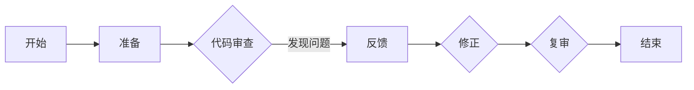
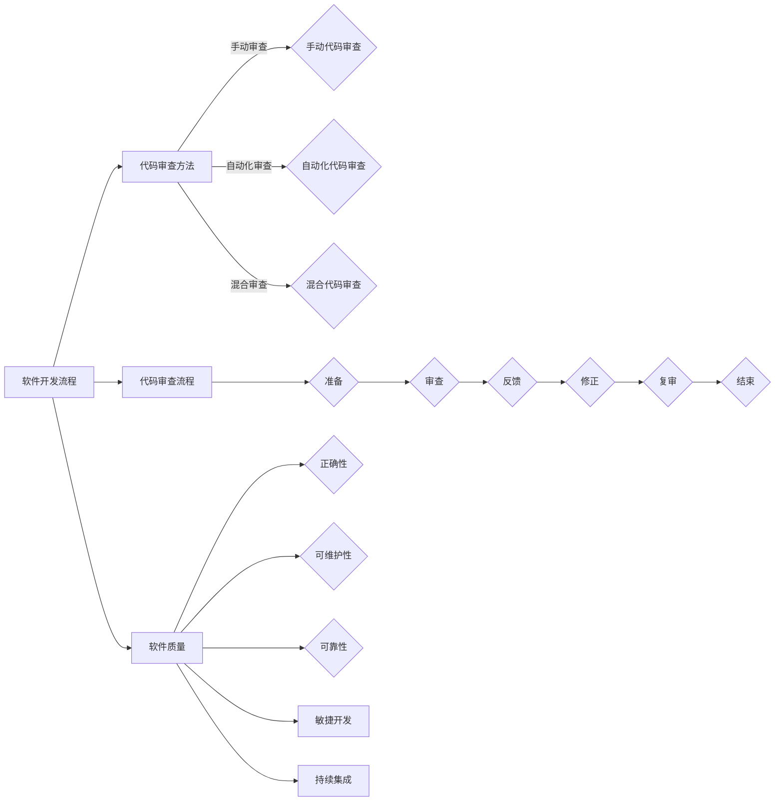

                 


### 1.1 代码审查概述

代码审查（Code Review）是一种软件开发过程中用于提升代码质量和开发效率的重要手段。它通常由团队中的成员对其他成员提交的代码进行评审，以发现潜在的错误、漏洞、不良代码风格和不合规的编码实践。

#### 代码审查的定义

代码审查是一种验证过程，旨在通过同行评审来确保代码的质量和符合性。它不仅仅是寻找错误，还包括评估代码的可读性、可维护性、性能和安全性。

#### 代码审查的重要性

代码审查对于软件开发团队来说至关重要，原因如下：

- **提高代码质量**：通过代码审查，可以发现和修复代码中的缺陷，减少潜在的bug和漏洞。
- **传播最佳实践**：代码审查可以促进团队内部技术交流和最佳实践分享，提高整体技术水平。
- **增强团队合作**：代码审查加强了团队成员之间的沟通和协作，有助于建立更紧密的团队关系。
- **节省时间和成本**：早期的错误发现和修复可以节省后续的调试和重构成本。

#### 代码审查与软件质量的关系

代码审查与软件质量密切相关。良好的代码审查流程可以确保以下质量特性：

- **准确性**：代码审查有助于确保代码的正确性和功能完整性。
- **一致性**：代码审查可以确保代码风格的一致性，便于代码的维护和阅读。
- **可读性**：代码审查可以提高代码的可读性，使得后续的维护工作更加顺畅。
- **可靠性**：代码审查有助于提高软件的可靠性和稳定性。

#### 代码审查流程的基本步骤

代码审查的基本流程包括以下几个步骤：

1. **准备**：审查者了解待审查的代码背景和目的。
2. **审查**：审查者仔细阅读和测试代码，寻找潜在的缺陷和问题。
3. **反馈**：审查者将发现的问题反馈给代码的提交者，并提出改进建议。
4. **修正**：提交者根据反馈对代码进行修改。
5. **复审**：修改后的代码再次提交审查，以确保问题已得到解决。

为了更好地展示代码审查流程，我们可以使用Mermaid图进行描述：



通过这个流程图，我们可以清晰地看到代码审查从准备到结束的各个步骤，以及它们之间的逻辑关系。

综上所述，代码审查是软件开发过程中不可或缺的一环，它不仅有助于提高代码质量，还能促进团队成员之间的技术交流与合作。在接下来的章节中，我们将深入探讨代码审查的各种方法、最佳实践和工具，以帮助读者更好地理解和实施代码审查流程。

### 1.2 核心概念与联系

在深入探讨代码审查的最佳实践之前，我们需要明确几个核心概念，并理解它们之间的联系。以下是一些关键概念及其相互关系：

#### 代码审查方法

代码审查方法主要包括手动代码审查、自动化代码审查和混合代码审查。

- **手动代码审查**：这是最传统的代码审查方式，由开发人员逐一审查代码，识别潜在问题。这种方式具有高度的灵活性，但效率较低。
- **自动化代码审查**：使用专门的工具自动分析代码，寻找错误和潜在问题。这种方式速度快，但可能无法发现所有问题，特别是那些需要人类判断的问题。
- **混合代码审查**：结合手动审查和自动化审查的优点，将自动化工具的结果作为初步筛选，再由开发人员进行深入审查。

#### 代码审查流程

代码审查流程包括准备、审查、反馈、修正和复审等步骤。

- **准备**：审查者了解代码背景和目的，为审查做好准备。
- **审查**：审查者阅读和测试代码，寻找潜在缺陷。
- **反馈**：审查者将发现的问题反馈给提交者，并提出改进建议。
- **修正**：提交者根据反馈修改代码。
- **复审**：修改后的代码再次审查，以确保问题已解决。

#### 代码审查与软件质量

代码审查的目标是提高软件质量，确保代码的正确性、可维护性和可靠性。

- **正确性**：通过审查确保代码实现预期的功能。
- **可维护性**：通过审查确保代码结构清晰，易于理解和修改。
- **可靠性**：通过审查减少潜在的bug和漏洞，提高软件的稳定性。

#### 软件开发流程

代码审查通常嵌入到软件开发流程中，如敏捷开发、持续集成等。

- **敏捷开发**：代码审查是敏捷开发中的关键环节，确保代码质量和团队协作。
- **持续集成**：代码审查与持续集成系统结合，实现自动化审查，提高审查效率和代码质量。

为了更好地展示这些概念之间的联系，我们可以使用Mermaid图进行描述：



通过这个流程图，我们可以清晰地看到代码审查方法、流程与软件质量之间的关系，以及它们在软件开发流程中的位置。

理解这些核心概念及其相互关系对于实施有效的代码审查至关重要。在接下来的章节中，我们将深入探讨具体的代码审查方法、最佳实践和工具，帮助读者提升团队代码质量。

### 1.3 核心算法原理讲解

为了更好地理解代码审查的过程，我们需要探讨其核心算法原理。以下是代码审查过程中常用的几种算法，以及它们如何应用于代码审查。

#### 1.3.1 检查重复代码（Duplicate Detection）

**核心算法原理：** 检查重复代码的目标是识别代码中重复的片段。常用的算法包括：

- **字符串匹配算法**：例如KMP算法、Boyer-Moore算法等，用于快速查找重复的字符串。
- **滚动哈希算法**：例如Rabin-Karp算法，通过计算字符串的哈希值，快速识别重复片段。

**伪代码示例：**

```plaintext
function rabinKarp(s, pattern):
    pattern_hash = hash(pattern)
    s_hash = hash(s[0: len(pattern)])
    for i from 0 to len(s) - len(pattern):
        if s_hash == pattern_hash:
            if s[i: i + len(pattern)] == pattern:
                return i
        s_hash = s_hash - s[i] + s[i + len(pattern)]
    return -1
```

**详细讲解与举例说明：**

假设我们有一个字符串`s = "ABCDABD"`，需要检查其中是否存在重复的`"ABD"`片段。

- 初始时，计算`pattern_hash = hash("ABD")`和`s_hash = hash("ABCD")`。
- 从第一个字符开始，每次移动一个位置，更新`s_hash`，并与`pattern_hash`比较。
- 如果发现哈希值相同，进一步比较实际字符串，以确认是否为重复片段。
- 最终，我们发现`s[2:5]`与`"ABD"`匹配，因此返回位置`2`。

#### 1.3.2 检查代码风格（Code Style Check）

**核心算法原理：** 代码风格检查的目标是确保代码遵循既定的编码规范。常用的算法包括：

- **语法分析**：使用语法解析器分析代码结构，检查是否符合语言规范。
- **模式匹配**：使用正则表达式或语法树匹配，识别不符合编码规范的代码片段。

**伪代码示例：**

```plaintext
function checkCodeStyle(code, styleRules):
    parser = createParser(code)
    while parser.hasNext():
        token = parser.next()
        for rule in styleRules:
            if not matches(token, rule):
                return "Error: Violation of style rule"
    return "Code style is correct"
```

**详细讲解与举例说明：**

假设我们有一个简单的编码规范，要求变量命名必须遵循驼峰式（CamelCase），如`firstName`。

- 使用语法解析器分析代码，提取出变量名。
- 遍历变量名，使用正则表达式检查是否为驼峰式命名。
- 如果发现不符合规范的变量名，返回错误信息。

例如，对于代码`int x = 10;`，我们会检查变量`x`是否为驼峰式命名，如果是，则继续审查，否则返回错误。

#### 1.3.3 检查潜在漏洞（Vulnerability Detection）

**核心算法原理：** 潜在漏洞检测的目标是识别代码中的安全漏洞。常用的算法包括：

- **模式匹配**：使用预定义的漏洞模式匹配规则，识别可能的漏洞。
- **静态代码分析**：使用抽象语法树（AST）分析，识别潜在的安全问题。

**伪代码示例：**

```plaintext
function checkVulnerabilities(code, vulnerabilityPatterns):
    ast = parseToAST(code)
    for node in ast:
        for pattern in vulnerabilityPatterns:
            if matches(node, pattern):
                return "Error: Potential vulnerability detected"
    return "No vulnerabilities found"
```

**详细讲解与举例说明：**

假设我们有一个常见的SQL注入漏洞模式，如`"INSERT INTO table (column) VALUES ('user_input')"`。

- 使用抽象语法树分析代码，识别可能的SQL语句。
- 遍历SQL语句，使用正则表达式或模式匹配规则检查是否存在SQL注入风险。
- 如果发现潜在漏洞，返回错误信息。

例如，对于代码`INSERT INTO users (username, password) VALUES ('admin', 'password')`，我们会检查是否存在直接插入用户输入的情景，从而识别潜在的风险。

通过以上三种核心算法原理的讲解，我们可以看到代码审查涉及多种技术，包括字符串匹配、语法分析、模式匹配和抽象语法树分析等。这些算法为代码审查提供了强大的工具，帮助开发人员发现和修复代码中的缺陷，提升代码质量。

在接下来的章节中，我们将进一步探讨代码审查的最佳实践，包括代码审查模板、代码审查会议的技巧和代码审查的频率与深度等，以帮助读者更有效地实施代码审查流程。

### 1.4 数学模型和公式

在代码审查过程中，为了更好地评估代码质量和潜在风险，我们可以使用一些数学模型和公式。以下是一些常用的数学模型和公式的详细讲解：

#### 1.4.1 缺陷密度（Defect Density）

**公式：**
$$
D = \frac{N_d}{N_c}
$$
其中，$D$ 表示缺陷密度，$N_d$ 表示发现的缺陷数量，$N_c$ 表示代码行数或代码规模。

**详细讲解：**
缺陷密度是评估代码质量的一个重要指标，它通过将发现的缺陷数量除以代码规模（如代码行数）来计算。缺陷密度越高，表示代码质量越低，缺陷越集中。

**举例说明：**
假设一段代码中有100行，发现了10个缺陷，则缺陷密度为：
$$
D = \frac{10}{100} = 0.1
$$
这意味着每10行代码中有1个缺陷。

#### 1.4.2 缺陷发现率（Defect Detection Rate）

**公式：**
$$
D.R = \frac{N_r}{N_d}
$$
其中，$D.R$ 表示缺陷发现率，$N_r$ 表示审查者发现的缺陷数量，$N_d$ 表示实际存在的缺陷数量。

**详细讲解：**
缺陷发现率用于评估审查者对代码的审查能力，它通过将审查者发现的缺陷数量除以实际存在的缺陷数量来计算。缺陷发现率越高，表示审查者的审查能力越强。

**举例说明：**
假设审查者发现了一个实际存在的缺陷，而实际存在10个缺陷，则缺陷发现率为：
$$
D.R = \frac{1}{10} = 0.1
$$
这意味着审查者发现了10%的实际缺陷。

#### 1.4.3 缺陷修复率（Defect Fix Rate）

**公式：**
$$
F.R = \frac{N_f}{N_r}
$$
其中，$F.R$ 表示缺陷修复率，$N_f$ 表示修复的缺陷数量，$N_r$ 表示审查者发现的缺陷数量。

**详细讲解：**
缺陷修复率用于评估团队修复缺陷的能力，它通过将修复的缺陷数量除以审查者发现的缺陷数量来计算。缺陷修复率越高，表示团队的修复能力越强。

**举例说明：**
假设团队修复了5个缺陷，而审查者发现了10个缺陷，则缺陷修复率为：
$$
F.R = \frac{5}{10} = 0.5
$$
这意味着团队修复了50%的缺陷。

通过这些数学模型和公式，我们可以定量地评估代码质量和审查效果。缺陷密度、缺陷发现率和缺陷修复率等指标为我们提供了关键的数据支持，帮助我们识别代码中的问题，优化审查流程，提升团队代码质量。

在接下来的章节中，我们将继续探讨代码审查的实践技巧和工具，以帮助读者更好地实施代码审查流程。

### 1.5 项目实战

为了更好地理解代码审查在实际开发中的应用，我们将通过一个简单的项目实战来展示代码审查的完整流程。这个项目是一个简单的Web应用程序，用于用户注册和登录。以下是项目的开发环境搭建、源代码实现、代码解读和实际案例分析。

#### 1.5.1 开发环境搭建

在开始项目之前，我们需要搭建开发环境。以下是所需的工具和步骤：

- **编程语言**：使用Python 3.8及以上版本。
- **开发工具**：使用Visual Studio Code或PyCharm作为开发环境。
- **数据库**：使用SQLite作为后端数据库。
- **Web框架**：使用Flask作为Web框架。

步骤：

1. 安装Python 3.8及以上版本。
2. 安装Visual Studio Code或PyCharm。
3. 安装SQLite数据库。
4. 使用pip安装Flask库。

#### 1.5.2 源代码实现

以下是一个简单的用户注册和登录功能的源代码示例：

```python
# app.py

from flask import Flask, request, jsonify
from flask_sqlalchemy import SQLAlchemy

app = Flask(__name__)
app.config['SQLALCHEMY_DATABASE_URI'] = 'sqlite:///users.db'
db = SQLAlchemy(app)

class User(db.Model):
    id = db.Column(db.Integer, primary_key=True)
    username = db.Column(db.String(80), unique=True, nullable=False)
    password = db.Column(db.String(120), nullable=False)

@app.route('/register', methods=['POST'])
def register():
    username = request.form['username']
    password = request.form['password']
    if User.query.filter_by(username=username).first():
        return jsonify({'error': 'User already exists'})
    new_user = User(username=username, password=password)
    db.session.add(new_user)
    db.session.commit()
    return jsonify({'message': 'User registered successfully'})

@app.route('/login', methods=['POST'])
def login():
    username = request.form['username']
    password = request.form['password']
    user = User.query.filter_by(username=username).first()
    if user and user.password == password:
        return jsonify({'message': 'Login successful'})
    else:
        return jsonify({'error': 'Invalid credentials'})

if __name__ == '__main__':
    db.create_all()
    app.run(debug=True)
```

#### 1.5.3 代码解读

- **数据库模型**：定义了一个User模型，包含用户ID、用户名和密码字段。
- **注册路由**：接收POST请求，验证用户名是否已存在，若不存在则创建新用户并保存到数据库。
- **登录路由**：接收POST请求，验证用户名和密码是否匹配，若匹配则登录成功。

#### 1.5.4 代码应用解读与分析

这个简单的Web应用程序实现了用户注册和登录功能，以下是代码应用的解读和分析：

- **用户注册**：用户通过POST请求发送用户名和密码，服务器验证用户名是否唯一，若唯一则保存用户信息。
- **用户登录**：用户通过POST请求发送用户名和密码，服务器验证用户名和密码是否匹配，若匹配则允许登录。

#### 1.5.5 实际案例分析

在实际开发过程中，我们可能遇到以下问题：

- **密码存储安全**：当前代码直接将密码存储在数据库中，这是不安全的。应该使用哈希函数将密码加密存储。
- **用户验证**：登录时仅通过用户名和密码验证，没有考虑其他安全措施，如验证码、多因素认证等。
- **异常处理**：代码中缺少对异常情况的处理，如数据库连接失败、请求格式错误等。

#### 1.5.6 小结

通过这个项目实战，我们可以看到代码审查在开发过程中的重要性。代码审查不仅可以帮助我们发现潜在的问题，还可以提高代码的质量和安全性。以下是一些关键点：

- **安全性**：确保密码加密存储，增加登录验证措施。
- **异常处理**：添加异常处理，提高代码的健壮性。
- **代码质量**：遵循编码规范，确保代码结构清晰、易于维护。

代码审查是一个持续的过程，需要团队成员的共同努力。通过定期进行代码审查，可以不断提升团队的代码质量，为项目的成功奠定基础。

### 1.6 最佳实践 tips

在代码审查过程中，遵循一些最佳实践可以显著提高审查效果和团队代码质量。以下是一些实用的技巧和注意事项：

#### 1.6.1 代码审查模板

使用统一的代码审查模板可以确保审查的一致性和系统性。以下是一个简单的审查模板：

- **代码审查请求**：提供待审查的代码链接或文件名。
- **审查者**：明确审查者姓名和职责。
- **提交者**：明确提交者姓名和提交原因。
- **审查时间**：规定审查的截止时间。
- **审查标准**：列出需要审查的具体标准，如代码风格、功能完整性、安全性等。
- **反馈格式**：规定反馈的方式和格式，例如使用注释、标记或特定的注释符号。

#### 1.6.2 代码审查会议的技巧

有效的代码审查会议可以大大提高审查效率。以下是一些技巧：

- **提前准备**：审查者在会议前仔细阅读代码，准备好问题和反馈。
- **明确目标**：会议开始时明确审查目标和时间限制，确保会议不偏离主题。
- **积极倾听**：给予提交者充分的时间解释代码，积极倾听并理解其设计思路。
- **具体反馈**：提供具体的、可操作的反馈，避免模糊和主观的评价。
- **鼓励讨论**：鼓励团队成员就代码问题进行讨论，共同解决问题。

#### 1.6.3 代码审查的频率与深度

代码审查的频率和深度取决于团队的规模和项目要求。以下是一些注意事项：

- **定期审查**：定期安排代码审查，例如每周一次或每两周一次，以保持代码质量的持续提升。
- **逐步深入**：审查的深度应该逐步增加，从初步的代码结构检查到更深入的功能性和安全性测试。
- **平衡工作量**：确保审查的工作量合理分配，避免过度审查导致团队成员负担过重。

#### 1.6.4 代码审查与持续集成的结合

将代码审查与持续集成系统结合，可以实现自动化审查，提高审查效率和代码质量。以下是一些建议：

- **自动化审查工具**：选择适合团队需求的自动化代码审查工具，如SonarQube、Checkstyle等。
- **集成到CI流程**：将代码审查步骤集成到持续集成系统中，例如在构建成功后自动触发代码审查。
- **反馈机制**：确保审查结果及时反馈给团队成员，以便及时修复问题。

通过遵循这些最佳实践，团队可以更有效地实施代码审查，提高代码质量，减少潜在的bug和漏洞，为项目的成功奠定坚实基础。

### 1.7 拓展阅读

为了深入了解代码审查的最佳实践和工具，读者可以参考以下拓展阅读资源：

- **书籍**：《代码大全》（第2版）/《Clean Code》 - Robert C. Martin
- **在线教程**：GitHub Code Review Guide - GitHub官方文档
- **博客文章**：A Gentle Introduction to Code Reviews - 敏捷开发的代码审查指南
- **开源工具**：SonarQube - 开源代码质量平台
- **社区论坛**：Stack Overflow - 软件开发问题的在线社区

通过阅读这些资源，读者可以进一步掌握代码审查的理论和实践，提升团队代码质量。同时，不断关注最新的技术动态和行业最佳实践，有助于保持团队的竞争力。

### 总结与展望

在本文中，我们系统地介绍了代码审查的最佳实践，从基础概念到具体方法，再到工具和案例分析，全方位地展示了代码审查在提升团队代码质量中的重要性。通过Mermaid图和伪代码，我们深入剖析了代码审查的核心算法原理，帮助读者理解代码审查的流程和技术细节。

我们强调了代码审查的多个关键点，包括代码审查模板的制定、代码审查会议的技巧、审查频率与深度的平衡，以及将代码审查与持续集成系统的结合。这些最佳实践不仅有助于发现和修复代码中的缺陷，还能促进团队成员之间的技术交流和协作，从而提升整个团队的开发效率和代码质量。

展望未来，代码审查将继续发展，随着人工智能和机器学习技术的进步，自动化代码审查将更加智能和高效。同时，持续集成和持续部署（CI/CD）的普及将使得代码审查更加自动化和集成化，进一步优化开发流程。我们鼓励读者不断学习和实践，掌握最新的代码审查技术和方法，为团队和项目的成功贡献力量。

