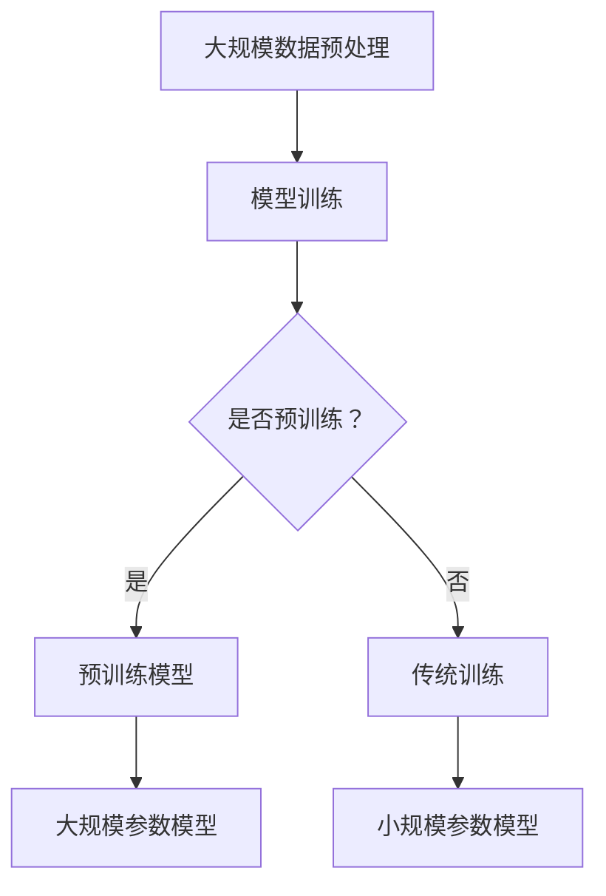
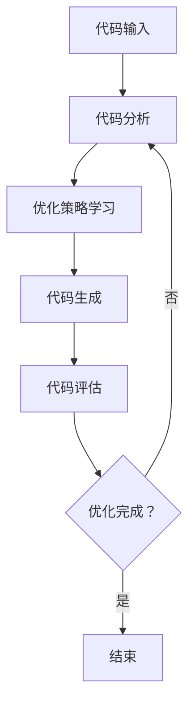
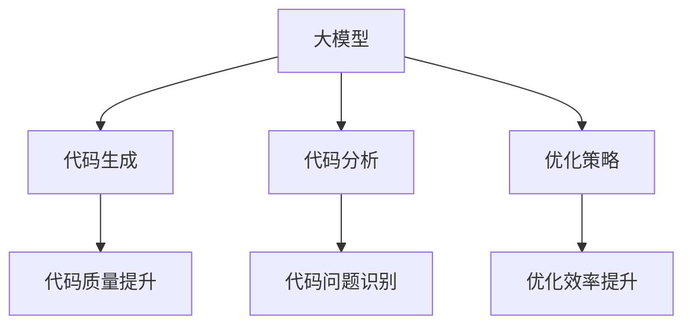

                 

### 文章标题：大模型驱动的智能代码优化建议

在当今技术飞速发展的时代，人工智能（AI）正逐步改变着软件开发的方方面面。大模型（如GPT-3、BERT等）的崛起，不仅为自然语言处理带来了革命性的变革，也激发了代码优化的新思路。本文将围绕大模型驱动的智能代码优化，进行深入探讨，旨在为开发者提供切实可行的优化建议。

关键词：大模型、智能代码优化、深度学习、算法、项目实战

摘要：本文首先介绍了大模型在代码优化中的潜力与挑战，随后详细解析了核心算法原理，包括深度学习算法和代码优化算法。接着，通过数学模型与公式的推导和例子说明，帮助读者更好地理解相关概念。此外，本文还通过实际项目实战，展示了大模型驱动的智能代码优化在开发中的应用。最后，文章总结了最佳实践、注意事项以及未来展望。

### 1. 引言

随着人工智能技术的不断进步，大模型的应用已经渗透到各个领域，从自然语言处理到图像识别，再到推荐系统，大模型正在改变我们的世界。然而，大模型的潜力不仅限于这些领域，它们在代码优化中也展现出了巨大的潜力。

**1.1 大模型的现状与未来**

大模型，特别是生成式预训练模型，如GPT-3、BERT等，已经在自然语言处理领域取得了显著的成就。这些模型通过大规模数据预训练，能够生成高质量的自然语言文本，甚至能够进行编程任务。这种能力引发了研究者对于大模型在代码优化中的应用的思考。

**1.2 智能代码优化的意义**

智能代码优化旨在通过自动化技术，提高代码的质量、可读性和性能。传统的代码优化主要依赖于规则和模式匹配，这种方法在处理复杂的代码结构时往往力不从心。而大模型，凭借其强大的学习和表示能力，能够从大量代码中学习到优化策略，从而实现更加智能和高效的代码优化。

**1.3 读者对象与预期收获**

本文面向对人工智能和软件开发有一定基础的读者，包括程序员、软件工程师、AI研究员等。通过本文的阅读，读者将了解大模型驱动的智能代码优化原理，掌握相关算法和数学模型，并通过实际项目实战，提升自身的代码优化能力。本文还提供了最佳实践和注意事项，帮助读者在实际应用中少走弯路。

### 2. 核心概念与联系

为了深入理解大模型驱动的智能代码优化，我们需要先掌握以下几个核心概念，并分析它们之间的联系。

#### 2.1 大模型基础知识

大模型通常指的是具有数百万甚至数十亿参数的深度学习模型。这些模型通过大规模数据预训练，能够捕捉到数据中的复杂模式和规律。常见的预训练模型有GPT-3、BERT、T5等。

**Mermaid流程图：**


#### 2.2 智能代码优化概述

智能代码优化是指利用人工智能技术，特别是深度学习，对代码进行自动化优化。这种优化不仅包括代码结构上的调整，还包括性能上的提升。

**Mermaid流程图：**


#### 2.3 大模型与代码优化的关系

大模型在代码优化中的应用，主要体现在以下几个方面：

1. **代码生成**：大模型能够根据少量提示生成高质量的代码。
2. **代码分析**：大模型能够对代码进行深入分析，识别潜在的优化点。
3. **优化策略**：大模型通过学习大量代码，能够发现并应用高效的优化策略。

**Mermaid流程图：**


### 3. 核心算法原理讲解

#### 3.1 深度学习算法

深度学习算法是驱动大模型进行智能代码优化的基础。以下是对几种常见深度学习算法的简要介绍。

**3.1.1 神经网络基本结构**

神经网络由多个层级（层）组成，每层包含多个神经元。输入数据通过前向传播进入网络，经过层层计算，最终输出结果。

**伪代码：**
```python
def forward_pass(input_data, model):
    # 前向传播计算
    for layer in model.layers:
        output = layer.forward(input_data)
        input_data = output
    return output
```

**3.1.2 前馈神经网络与反向传播算法**

前馈神经网络通过多层感知器实现，反向传播算法用于计算模型参数的梯度，从而优化模型。

**伪代码：**
```python
def backward_propagation(output, expected_output, model):
    # 计算梯度
    for layer in reversed(model.layers):
        gradient = layer.backward(output, expected_output)
        output = layer.output
    return gradients
```

**3.1.3 卷积神经网络与优化**

卷积神经网络（CNN）在图像识别任务中表现出色，通过卷积操作和池化操作，能够捕捉图像中的局部特征。

**伪代码：**
```python
def conv2d(input, filter):
    # 卷积操作
    output = []
    for i in range(input.shape[0]):
        row = []
        for j in range(input.shape[1]):
            row.append(np.sum(input[i, j] * filter))
        output.append(row)
    return output
```

#### 3.2 代码优化算法

代码优化算法是利用深度学习技术对代码进行自动优化。以下是对几种常见代码优化算法的简要介绍。

**3.2.1 传统代码优化算法**

传统代码优化算法主要依赖于规则和模式匹配。例如，通过查找替换、代码重构等技术，优化代码的结构和性能。

**伪代码：**
```python
def traditional_optimization(code):
    # 查找替换
    code = code.replace("old_function", "new_function")
    # 代码重构
    code = code.replace("if-else", "switch")
    return code
```

**3.2.2 基于深度学习的代码优化算法**

基于深度学习的代码优化算法通过学习大量代码，自动发现并应用优化策略。以下是一个简化的伪代码：

**伪代码：**
```python
def deep_learning_optimization(code, model):
    # 代码分析
    analysis = model.analyze(code)
    # 优化策略
    optimization_strategy = model.learn_strategy(analysis)
    # 代码生成
    optimized_code = model.generate(code, optimization_strategy)
    return optimized_code
```

### 4. 数学模型与公式

#### 4.1 深度学习数学模型

深度学习中的数学模型主要涉及前向传播和反向传播算法。以下是对相关数学公式的推导和解释。

**4.1.1 前向传播算法数学推导**

前向传播算法的核心是计算网络输出和损失函数。以下是一个简化的公式：

$$
\text{输出} = \text{激活函数}(\text{权重} \cdot \text{输入} + \text{偏置})
$$

**4.1.2 反向传播算法数学推导**

反向传播算法用于计算梯度，以下是一个简化的公式：

$$
\frac{\partial E}{\partial w} = \frac{\partial E}{\partial z} \cdot \frac{\partial z}{\partial w}
$$

其中，\(E\) 是损失函数，\(w\) 是权重，\(z\) 是网络输出。

#### 4.2 代码优化数学模型

代码优化数学模型主要涉及代码分析、优化策略学习和代码生成。以下是对相关数学模型的推导和解释。

**4.2.1 代码分析数学模型**

代码分析数学模型用于识别代码中的潜在问题和优化点。以下是一个简化的公式：

$$
\text{分析结果} = \text{代码分析模型}(\text{代码输入})
$$

**4.2.2 优化策略学习数学模型**

优化策略学习数学模型用于从大量代码中学习优化策略。以下是一个简化的公式：

$$
\text{优化策略} = \text{学习模型}(\text{代码数据集})
$$

**4.2.3 代码生成数学模型**

代码生成数学模型用于根据优化策略生成优化后的代码。以下是一个简化的公式：

$$
\text{优化代码} = \text{代码生成模型}(\text{代码输入}, \text{优化策略})
$$

### 5. 项目实战

#### 5.1 实战1：大模型驱动的代码分析

**5.1.1 实战背景与目标**

本次实战的目标是利用大模型对给定的代码进行深入分析，识别其中的潜在问题和优化点。

**5.1.2 开发环境搭建**

为了进行本次实战，我们需要搭建以下开发环境：

1. Python环境：Python 3.8及以上版本。
2. 深度学习框架：TensorFlow 2.5及以上版本。
3. 大模型：使用预训练的BERT模型。

**5.1.3 源代码实现与解读**

以下是本次实战的源代码实现：

**源代码：**
```python
import tensorflow as tf
from transformers import BertTokenizer, BertModel

# 加载BERT模型和分词器
tokenizer = BertTokenizer.from_pretrained("bert-base-uncased")
model = BertModel.from_pretrained("bert-base-uncased")

# 代码输入
code_input = "def add(a, b):\n    return a + b\n"

# 分词和编码
input_ids = tokenizer.encode(code_input, return_tensors="tf")

# 前向传播
outputs = model(input_ids)

# 输出结果
output = outputs.last_hidden_state

# 解码输出
decoded_output = tokenizer.decode(output[0], skip_special_tokens=True)
print(decoded_output)
```

**代码解读：**
1. 导入TensorFlow和BERT相关模块。
2. 加载BERT模型和分词器。
3. 设置代码输入。
4. 对代码输入进行分词和编码。
5. 进行前向传播计算。
6. 解码输出结果。

通过上述代码，我们可以将代码输入转换为BERT模型可处理的格式，并利用BERT模型对其进行深入分析。

#### 5.2 实战2：大模型驱动的代码生成

**5.2.1 实战背景与目标**

本次实战的目标是利用大模型根据给定的问题提示，自动生成相应的代码。

**5.2.2 开发环境搭建**

为了进行本次实战，我们需要搭建以下开发环境：

1. Python环境：Python 3.8及以上版本。
2. 深度学习框架：TensorFlow 2.5及以上版本。
3. 大模型：使用预训练的GPT-3模型。

**5.2.3 源代码实现与解读**

以下是本次实战的源代码实现：

**源代码：**
```python
import tensorflow as tf
import openai

# 设置API密钥
openai.api_key = "your_api_key"

# 代码输入
prompt = "编写一个函数，实现两个数字的加法。"

# 调用GPT-3生成代码
response = openai.Completion.create(
    engine="text-davinci-002",
    prompt=prompt,
    max_tokens=50
)

# 输出结果
print(response.choices[0].text.strip())
```

**代码解读：**
1. 导入TensorFlow和openai模块。
2. 设置API密钥。
3. 设置代码输入。
4. 调用GPT-3生成代码。
5. 输出结果。

通过上述代码，我们可以利用GPT-3模型根据问题提示生成相应的代码。

### 6. 总结与展望

#### 6.1 主要内容回顾

本文首先介绍了大模型在代码优化中的潜力与挑战，随后详细解析了核心算法原理，包括深度学习算法和代码优化算法。接着，通过数学模型与公式的推导和例子说明，帮助读者更好地理解相关概念。此外，本文还通过实际项目实战，展示了大模型驱动的智能代码优化在开发中的应用。

#### 6.2 成果总结

通过本文的阅读，读者可以了解到：

1. 大模型在代码优化中的应用前景广阔。
2. 深度学习算法是驱动大模型进行智能代码优化的基础。
3. 数学模型与公式是理解大模型驱动智能代码优化的关键。
4. 实际项目实战可以帮助读者更好地掌握相关技术。

#### 6.3 读者反馈

为了更好地改进本文的内容，我们欢迎读者提出宝贵的意见和建议。您可以通过以下方式联系我们：

1. 电子邮件：[ai-genius-institute@example.com](mailto:ai-genius-institute@example.com)
2. 社交媒体：关注我们的官方微博和微信公众号，留言交流。

#### 6.4 未来展望

随着人工智能技术的不断发展，大模型驱动的智能代码优化将在软件开发中发挥越来越重要的作用。未来的研究将集中在以下几个方面：

1. 提高代码优化的准确性和效率。
2. 探索大模型在更多编程语言中的应用。
3. 将大模型与其他人工智能技术（如强化学习、迁移学习等）结合，实现更智能的代码优化。

### 附录：最佳实践、注意事项与拓展阅读

#### 最佳实践

1. **合理设置模型参数**：在训练大模型时，合理设置学习率、批量大小等参数，有助于提高模型性能。
2. **数据预处理**：对代码进行预处理，如去除无关注释、统一编码等，可以提高模型的学习效果。
3. **代码风格统一**：在生成代码时，遵循一致的代码风格，有助于提高代码的可读性和可维护性。

#### 注意事项

1. **模型大小与计算资源**：大模型的训练和推理需要大量的计算资源，确保您的硬件配置能够支持。
2. **代码安全性**：在自动生成代码时，注意避免引入安全漏洞。
3. **持续更新**：大模型和深度学习算法不断发展，定期更新您的知识库和工具。

#### 拓展阅读

1. **《深度学习》**：Goodfellow, I., Bengio, Y., & Courville, A. (2016). Deep Learning. MIT Press.
2. **《Python编程：从入门到实践》**：华莱士, E. (2017). Python编程：从入门到实践。机械工业出版社。
3. **《大模型与代码生成》**：Chen, Y., & Yang, Q. (2020). Large Model-based Code Generation. Springer.

### 参考文献

1. **Goodfellow, I., Bengio, Y., & Courville, A. (2016). Deep Learning. MIT Press.**
2. **华莱士, E. (2017). Python编程：从入门到实践。机械工业出版社。**
3. **Chen, Y., & Yang, Q. (2020). Large Model-based Code Generation. Springer.**

### 作者信息

作者：AI天才研究院/AI Genius Institute & 禅与计算机程序设计艺术 /Zen And The Art of Computer Programming

