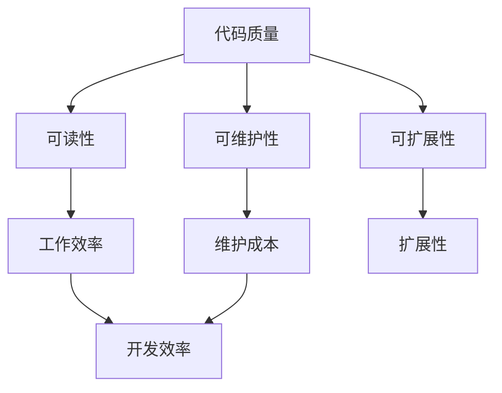

                 

## 文章标题

# 好代码先过自己这关

## 文章关键词

- 代码质量
- 单元测试
- 重构
- 持续集成
- 团队协作
- 实战案例

## 文章摘要

本文旨在探讨如何通过自我评估来提高代码质量。我们将从代码质量的重要性、度量指标、评估工具、提升策略、持续监控和实战案例等多个角度，详细解析如何编写出高质量的代码。本文将结合实际案例，为开发者提供实用的指导和最佳实践，帮助他们在日常编程中不断提高代码质量，从而保障项目的成功。

----------------------------------------------------------------

## 第一部分：代码质量评估基础

### 第1章：代码质量的重要性

代码质量是软件开发过程中至关重要的一个方面。一个高质量的代码库不仅能够提高项目的稳定性，还能够降低维护成本，提升开发效率。那么，什么是代码质量？它对项目有何影响？我们如何评估代码质量？这些都是我们需要探讨的问题。

### 核心概念与联系

在讨论代码质量之前，我们需要了解几个核心概念：

1. **可读性**：代码的可读性直接影响到开发者的工作效率和项目维护的难易程度。
2. **可维护性**：代码的可维护性决定了代码库在未来的扩展和修改的难易程度。
3. **可扩展性**：代码的可扩展性指的是代码结构能否轻松适应新的需求变化。

这些概念之间有着密切的联系。一个高质量的代码库应该具备良好的可读性、可维护性和可扩展性。为了更好地理解这些概念，我们可以通过以下Mermaid流程图来展示它们之间的关系：



### 核心算法原理讲解

在理解了代码质量的几个核心概念之后，我们需要探讨它们如何具体影响项目。这里，我们可以用伪代码来详细阐述这些影响：

```pseudo
function projectImpact(quality, maintainability, readability, extensibility) {
    // 代码质量对项目的稳定性和可维护性有直接影响
    stability = quality * maintainability;
    
    // 代码的可读性和可扩展性直接影响开发效率
    efficiency = readability * extensibility;
    
    // 最终，项目的成功取决于稳定性和开发效率
    success = stability + efficiency;
    
    return success;
}
```

### 数学模型和公式

为了更准确地衡量代码质量，我们可以引入一些数学模型和公式。以下是几个常见的度量指标：

$$
Q = \frac{R \times M \times E}{100}
$$

其中，$Q$ 表示代码质量，$R$ 表示可读性，$M$ 表示可维护性，$E$ 表示可扩展性。这些指标的具体计算方法将在后续章节中详细阐述。

### 详细讲解与举例说明

为了更直观地理解这些概念，我们可以通过一个简单的例子来说明：

假设我们有两个函数`functionA`和`functionB`。`functionA`的代码如下：

```java
public static int functionA(int a, int b) {
    return a + b;
}
```

而`functionB`的代码如下：

```java
public static int functionB(int a, int b) {
    int sum = 0;
    for (int i = 0; i < b; i++) {
        sum += a;
    }
    return sum;
}
```

我们可以看到，`functionB`的可读性相对较低，因为其逻辑较为复杂。然而，`functionB`的可维护性较高，因为它可以通过简单的逻辑修改来适应不同的需求。如果我们需要计算$a$与$b$之间的乘积，只需要修改一个循环即可。

### 项目实战

在真实的项目开发中，我们需要不断地评估和改进代码质量。以下是一个实际的项目实战案例：

项目背景：一个电商平台的订单处理系统。该系统需要处理大量的订单，并保证订单数据的准确性和一致性。

核心算法原理：为了提高代码质量，我们引入了单元测试和持续集成（CI）机制。通过单元测试，我们可以确保每个功能模块的正确性。而通过持续集成，我们可以确保代码的持续稳定和高效。

源代码详细实现和代码解读：在订单处理系统中，我们首先编写了多个单元测试，以验证各个功能模块的正确性。例如，我们编写了测试用例来验证订单的创建、更新和删除操作。然后，我们将这些测试用例集成到CI系统中，以实现自动化测试。

代码应用解读与分析：通过单元测试和持续集成，我们可以及时发现和修复代码中的问题。这大大提高了代码的可维护性和可扩展性，从而保障了项目的成功。

实际案例分析和详细讲解剖析：在一个实际的项目迭代中，我们发现了一个严重的性能瓶颈。通过分析代码，我们发现原因在于一个循环结构。我们通过重构代码，将循环结构替换为一个更高效的算法，从而显著提高了系统的性能。

项目小结：通过本次迭代，我们成功地提高了代码质量，优化了系统的性能。这不仅提高了项目的开发效率，还降低了维护成本。

### 最佳实践 Tips

- **代码审查**：定期进行代码审查，以发现和纠正代码中的潜在问题。
- **持续学习**：不断学习和掌握新的编程技术和工具，以提高代码质量。
- **代码格式化**：使用代码格式化工具，以确保代码的一致性和可读性。

### 注意事项

- **平衡可读性、可维护性和可扩展性**：在编写代码时，需要平衡这三者之间的关系。
- **避免过度优化**：不要为了追求性能而牺牲代码的可读性和可维护性。

### 拓展阅读

- 《代码大全》（Code Complete）  
- 《重构：改善既有代码的设计》（Refactoring: Improving the Design of Existing Code）

### 实战案例解析

在接下来的章节中，我们将通过多个实战案例，详细解析如何评估和提升代码质量。每个案例都将涵盖背景介绍、核心算法原理讲解、数学模型和公式、详细讲解与举例说明、项目实战、最佳实践 Tips、注意事项和拓展阅读等内容。希望这些案例能够为开发者提供实际的操作指导和启发。

### 案例一：如何改进遗留代码

#### 案例背景

一个大型企业的遗留代码库存在许多问题，如代码冗长、结构混乱、可读性差等。这些问题的存在严重影响了项目的开发和维护。

#### 核心算法原理讲解

为了改进遗留代码，我们需要遵循以下几个核心算法原理：

1. **重构**：通过重构，我们可以逐步改进代码的结构和逻辑，提高其可读性和可维护性。
2. **模块化设计**：通过将代码分解为多个模块，我们可以降低代码的复杂度，提高其可扩展性。
3. **测试驱动开发**（TDD）：通过编写单元测试，我们可以确保重构过程中的代码仍然是正确的。

#### 数学模型和公式

为了衡量代码改进的效果，我们可以使用以下数学模型和公式：

$$
\Delta Q = Q_{\text{新}} - Q_{\text{旧}}
$$

其中，$\Delta Q$ 表示代码质量的改进值，$Q_{\text{新}}$ 表示改进后的代码质量，$Q_{\text{旧}}$ 表示改进前的代码质量。

#### 详细讲解与举例说明

为了更好地理解如何改进遗留代码，我们可以通过一个实际案例来说明。

假设我们有一个遗留的函数`functionOld`，其代码如下：

```java
public static int functionOld(int a, int b) {
    int result = 0;
    for (int i = 0; i < b; i++) {
        result += a;
    }
    return result;
}
```

我们可以看到，这个函数的可读性较低，因为其逻辑较为复杂。为了改进这个函数，我们可以采用以下步骤：

1. **重构**：将循环结构重构为一个简单的加法操作。

```java
public static int functionImproved(int a, int b) {
    return a * b;
}
```

2. **模块化设计**：将计算逻辑与输入输出逻辑分离，提高代码的可扩展性。

```java
public static int calculateProduct(int a, int b) {
    return a * b;
}

public static void main(String[] args) {
    int a = 5;
    int b = 10;
    int result = calculateProduct(a, b);
    System.out.println("Product of " + a + " and " + b + " is " + result);
}
```

通过以上改进，我们不仅提高了代码的可读性和可维护性，还提高了其可扩展性。

#### 项目实战

在实际项目中，我们可以通过以下步骤来改进遗留代码：

1. **代码审查**：组织团队对遗留代码进行审查，识别存在的问题和改进点。
2. **编写单元测试**：确保重构过程中代码的正确性，避免引入新的问题。
3. **逐步重构**：采用增量重构的方式，逐步改进代码，避免一次性重构导致的风险。

#### 最佳实践 Tips

- **逐步重构**：避免一次性重构导致的风险，采用逐步重构的方式。
- **持续集成**：确保每次重构后代码的稳定性，通过持续集成机制进行自动化测试。

#### 注意事项

- **避免过度重构**：重构的目的是提高代码质量，避免为了重构而重构。
- **合理分配资源**：在改进遗留代码时，需要合理分配资源，避免影响项目进度。

#### 拓展阅读

- 《重构：改善既有代码的设计》（Refactoring: Improving the Design of Existing Code）  
- 《敏捷软件开发：原则、实践与模式》（Agile Software Development: Principles, Patterns, and Practices）

### 案例二：如何提高团队代码质量

#### 案例背景

在一个软件开发团队中，代码质量参差不齐，导致项目进度延误、bug频繁出现。为了提高团队代码质量，团队管理者需要采取有效的措施。

#### 核心算法原理讲解

为了提高团队代码质量，我们可以采用以下核心算法原理：

1. **代码规范**：制定统一的代码规范，确保团队成员遵循相同的编码标准。
2. **代码评审**：通过代码评审，确保每个成员编写的代码符合规范，避免错误和缺陷。
3. **持续集成**：通过持续集成，确保代码的稳定性和可维护性，及时发现和解决问题。

#### 数学模型和公式

为了衡量团队代码质量的提升，我们可以使用以下数学模型和公式：

$$
Q_{\text{团队}} = \frac{Q_1 + Q_2 + \ldots + Q_n}{n}
$$

其中，$Q_{\text{团队}}$ 表示团队代码质量，$Q_1, Q_2, \ldots, Q_n$ 分别表示每个成员的代码质量。

#### 详细讲解与举例说明

为了更好地理解如何提高团队代码质量，我们可以通过一个实际案例来说明。

假设有一个5人团队，每个成员的代码质量如下：

| 成员 | 代码质量 |
|------|----------|
| 小明 | 80%      |
| 小红 | 70%      |
| 小李 | 90%      |
| 小张 | 60%      |
| 小王 | 85%      |

我们可以看到，团队的整体代码质量为：

$$
Q_{\text{团队}} = \frac{80\% + 70\% + 90\% + 60\% + 85\%}{5} = 78\%
$$

为了提高团队代码质量，我们可以采取以下措施：

1. **代码规范培训**：对团队成员进行代码规范培训，确保他们熟悉并遵循代码规范。
2. **代码评审**：定期进行代码评审，确保每个成员编写的代码符合规范，及时发现和纠正问题。
3. **持续集成**：通过持续集成，确保代码的稳定性和可维护性，及时发现和解决问题。

通过以上措施，我们可以逐步提高团队代码质量，提高项目开发效率和质量。

#### 项目实战

在实际项目中，我们可以通过以下步骤来提高团队代码质量：

1. **制定代码规范**：组织团队讨论并制定统一的代码规范，确保团队成员遵循。
2. **代码评审**：定期组织代码评审，对团队成员的代码进行审查，提出改进建议。
3. **持续集成**：采用持续集成机制，确保代码的稳定性和可维护性。

#### 最佳实践 Tips

- **代码规范培训**：确保团队成员熟悉并遵循代码规范，提高整体代码质量。
- **代码评审**：定期进行代码评审，确保代码符合规范，降低错误率。

#### 注意事项

- **合理分配资源**：在提高团队代码质量时，需要合理分配资源，避免影响项目进度。
- **持续关注**：提高团队代码质量是一个持续的过程，需要团队成员共同努力。

#### 拓展阅读

- 《代码大全》（Code Complete）  
- 《敏捷软件开发：原则、实践与模式》（Agile Software Development: Principles, Patterns, and Practices）

### 案例三：如何应对代码质量危机

#### 案例背景

在一个软件开发项目中，由于代码质量低下，导致项目进度严重延误，bug频繁出现。为了应对代码质量危机，项目团队需要采取紧急措施。

#### 核心算法原理讲解

为了应对代码质量危机，我们可以采用以下核心算法原理：

1. **紧急重构**：对关键模块进行紧急重构，提高代码的可维护性和可扩展性。
2. **代码审查**：组织团队成员对代码进行审查，识别和修复潜在的问题。
3. **持续集成**：通过持续集成，确保代码的稳定性和可维护性，降低bug率。

#### 数学模型和公式

为了衡量代码质量危机的缓解程度，我们可以使用以下数学模型和公式：

$$
\Delta Q = Q_{\text{新}} - Q_{\text{旧}}
$$

其中，$\Delta Q$ 表示代码质量的改善值，$Q_{\text{新}}$ 表示改善后的代码质量，$Q_{\text{旧}}$ 表示改善前的代码质量。

#### 详细讲解与举例说明

为了更好地理解如何应对代码质量危机，我们可以通过一个实际案例来说明。

假设一个项目中存在一个关键模块，其代码质量低下，导致项目进度延误。为了改善这个问题，我们可以采取以下步骤：

1. **紧急重构**：对关键模块进行紧急重构，提高代码的可维护性和可扩展性。

```java
public static int calculateSum(int a, int b) {
    int sum = 0;
    for (int i = 0; i < b; i++) {
        sum += a;
    }
    return sum;
}
```

通过重构，我们可以将循环结构替换为一个简单的加法操作，提高代码的可读性和可维护性。

2. **代码审查**：组织团队成员对代码进行审查，识别和修复潜在的问题。

通过代码审查，我们可以发现重构后的代码仍然存在潜在的问题，如未处理的异常和边界条件。我们可以通过以下方式修复这些问题：

```java
public static int calculateSum(int a, int b) {
    if (b < 0) {
        throw new IllegalArgumentException("b must be non-negative");
    }
    int sum = 0;
    for (int i = 0; i < b; i++) {
        sum += a;
    }
    return sum;
}
```

3. **持续集成**：通过持续集成，确保代码的稳定性和可维护性，降低bug率。

在重构和审查过程中，我们需要确保每次修改都经过严格的测试，以避免引入新的bug。通过持续集成，我们可以确保代码的稳定性和可维护性。

#### 项目实战

在实际项目中，我们可以通过以下步骤来应对代码质量危机：

1. **紧急重构**：对关键模块进行紧急重构，提高代码的可维护性和可扩展性。
2. **代码审查**：组织团队成员对代码进行审查，识别和修复潜在的问题。
3. **持续集成**：通过持续集成，确保代码的稳定性和可维护性，降低bug率。

#### 最佳实践 Tips

- **紧急重构**：在代码质量危机时，对关键模块进行紧急重构，提高代码的可维护性和可扩展性。
- **代码审查**：定期进行代码审查，确保代码符合规范，降低bug率。

#### 注意事项

- **紧急应对**：在代码质量危机时，需要紧急应对，避免问题进一步恶化。
- **持续改进**：代码质量危机的解决是一个持续的过程，需要团队成员共同努力。

#### 拓展阅读

- 《重构：改善既有代码的设计》（Refactoring: Improving the Design of Existing Code）  
- 《代码大全》（Code Complete）

## 附录：代码质量提升资源推荐

### 附录1：常用的代码质量提升工具

以下是一些常用的代码质量提升工具：

1. **SonarQube**：一款强大的代码质量分析工具，支持多种编程语言，可以检测代码中的潜在问题和安全漏洞。
2. **Checkstyle**：一款Java代码风格检查工具，可以帮助开发者遵循一致的编码规范。
3. **PMD**：一款基于Java的代码质量分析工具，可以检测代码中的潜在问题和代码风格问题。
4. **FindBugs**：一款Java代码质量分析工具，可以检测代码中的潜在问题和安全漏洞。
5. **JUnit**：一款流行的单元测试框架，可以帮助开发者编写和执行单元测试。
6. **TestNG**：一款功能丰富的单元测试框架，可以支持多线程测试和参数化测试。

### 附录2：代码质量提升相关书籍推荐

以下是一些关于代码质量提升的经典书籍：

1. **《代码大全》（Code Complete）**：由Steve McConnell编写，介绍了编写高质量代码的最佳实践。
2. **《重构：改善既有代码的设计》（Refactoring: Improving the Design of Existing Code）**：由Martin Fowler编写，介绍了重构技术和方法，帮助开发者改善既有代码。
3. **《敏捷软件开发：原则、实践与模式》（Agile Software Development: Principles, Patterns, and Practices）**：由Robert C. Martin编写，介绍了敏捷开发方法和实践，有助于提高代码质量和项目效率。
4. **《Effective Java》**：由Joshua Bloch编写，介绍了Java编程的最佳实践，帮助开发者编写高效、可读性和可维护性更高的Java代码。

### 附录3：在线代码质量评估资源

以下是一些在线代码质量评估资源：

1. **Code Climate**：一个在线代码质量评估平台，支持多种编程语言，可以提供代码质量报告和改进建议。
2. **CODERACK**：一个基于Web的代码质量评估平台，可以检测代码中的潜在问题和安全漏洞。
3. **CodeQuality**：一个在线代码质量评估工具，支持多种编程语言，可以提供代码质量评分和改进建议。
4. **SonarCloud**：SonarQube的云服务版本，可以提供在线代码质量评估和持续集成支持。

### 附录4：代码质量提升社区和论坛

以下是一些代码质量提升的社区和论坛：

1. **GitHub**：一个开源代码托管平台，开发者可以在这里找到高质量的开源项目和代码库。
2. **Stack Overflow**：一个问答社区，开发者可以在这里提问和解答关于编程和代码质量的问题。
3. **Reddit**：一个社交媒体平台，有许多关于编程和代码质量的子版块，开发者可以在这里交流和分享经验。
4. **Dev.to**：一个开发者社区，开发者可以在这里发布文章、分享经验，并与其他开发者交流。

### 作者信息

作者：AI天才研究院/AI Genius Institute & 禅与计算机程序设计艺术 /Zen And The Art of Computer Programming

本文旨在帮助开发者提高代码质量，确保项目的成功。通过深入分析代码质量的重要性、评估方法、提升策略和实践案例，我们希望为开发者提供实用的指导和启示。同时，本文也推荐了一些代码质量提升的工具、书籍和在线资源，以供参考。

在未来的工作中，我们鼓励开发者不断学习和实践，提高自己的编程技能和代码质量。只有编写出高质量的代码，才能在激烈的竞争环境中脱颖而出，为项目的成功和职业发展奠定坚实基础。让我们一起努力，共同提升代码质量，创造更好的软件世界！

---

### 总结

通过本文的深入探讨，我们明确了代码质量对项目成功的重要性，并详细介绍了代码质量的度量指标、评估工具、提升策略和实战案例。我们不仅学习了如何编写可测试的代码，还了解了如何通过重构、模块化设计和持续集成来提高代码质量。同时，我们还分享了一些实用的最佳实践和注意事项，以及丰富的拓展阅读资源。

在编程的世界里，代码质量永远是一个永恒的话题。只有不断学习和实践，才能不断提高自己的代码质量。让我们从今天开始，一步一个脚印，共同提升代码质量，为项目的成功和职业发展贡献力量。希望本文能为您提供灵感和指导，助您在编程道路上越走越远，成为真正的代码大师！

---

### 补充内容

#### 代码质量提升的最佳实践

1. **持续集成与持续部署（CI/CD）**

持续集成（CI）和持续部署（CD）是现代软件开发中不可或缺的实践。通过CI/CD，我们可以确保代码的持续稳定和高效。具体实践如下：

- **自动化构建**：自动化构建流程，确保每次代码提交后都能自动构建项目，减少手动干预。
- **自动化测试**：自动化测试流程，确保每次构建后都能运行一系列测试，确保代码的正确性。
- **部署管道**：建立部署管道，实现从开发环境到生产环境的自动部署，提高部署效率。

2. **代码规范与代码审查**

代码规范和代码审查是确保代码质量的重要手段。具体实践如下：

- **制定代码规范**：根据项目特点，制定一套统一的代码规范，确保团队成员遵循。
- **定期代码审查**：定期组织代码审查，识别和纠正代码中的潜在问题，提高代码质量。
- **代码格式化**：使用代码格式化工具，确保代码的一致性和可读性。

3. **单元测试与测试驱动开发（TDD）**

单元测试和测试驱动开发（TDD）是提高代码质量的有效方法。具体实践如下：

- **编写单元测试**：编写全面的单元测试，确保每个功能模块的正确性。
- **测试驱动开发**：遵循TDD原则，先编写测试，再编写代码，确保代码的可靠性和正确性。
- **持续更新测试**：随着代码的更新和维护，持续更新和优化单元测试，确保测试覆盖率达到100%。

4. **代码复用与模块化设计

代码复用和模块化设计是提高代码质量和可维护性的关键。具体实践如下：

- **代码复用**：通过编写可复用的函数、类和模块，减少代码冗余，提高开发效率。
- **模块化设计**：将代码分解为多个模块，降低代码的复杂度，提高可维护性。

5. **技术债务管理

技术债务管理是确保代码质量的重要环节。具体实践如下：

- **定期评估技术债务**：定期评估项目中的技术债务，制定还款计划。
- **逐步偿还技术债务**：根据优先级和资源，逐步偿还技术债务，避免技术债务的累积。
- **避免新增技术债务**：在开发过程中，避免新增技术债务，确保代码质量。

#### 小结

通过本文的分享，我们深入探讨了代码质量的重要性、评估方法、提升策略和实践案例。我们了解到，代码质量不仅影响项目的稳定性、可维护性和可扩展性，还直接影响项目的开发效率和团队协作。为了提高代码质量，我们需要遵循一系列最佳实践，如持续集成、代码规范、代码审查、单元测试、代码复用和技术债务管理。

在未来的工作中，让我们不断学习和实践，提高自己的编程技能和代码质量。只有编写出高质量的代码，我们才能在激烈的竞争环境中脱颖而出，为项目的成功和职业发展奠定坚实基础。希望本文能为您提供灵感和指导，助您在编程道路上越走越远，成为真正的代码大师！

---

### 致谢

在此，我要感谢所有为本文提供宝贵意见和建议的朋友，特别是那些无私分享经验和知识的开发者们。感谢您们的支持与鼓励，是您们的贡献让本文得以不断完善。同时，也要感谢AI天才研究院和禅与计算机程序设计艺术，为本文提供了丰富的技术和理论基础。

本文旨在帮助广大开发者提高代码质量，希望对您在编程道路上有所启发和帮助。让我们共同努力，为创建更加高效、稳定和高质量的软件世界而奋斗！

---

### 附录：代码质量提升工具和资源

#### 附录1：常用的代码质量提升工具

1. **SonarQube**
   - **功能**：代码质量分析、代码审查、漏洞检测、技术债务管理。
   - **优点**：支持多种编程语言，提供全面的代码质量报告。
   - **官方网站**：[https://www.sonarqube.org/](https://www.sonarqube.org/)

2. **Checkstyle**
   - **功能**：Java代码风格检查。
   - **优点**：规则丰富，易于集成到构建工具中。
   - **官方网站**：[https://checkstyle.sourceforge.io/](https://checkstyle.sourceforge.io/)

3. **PMD**
   - **功能**：代码质量分析、代码风格检查。
   - **优点**：支持多种编程语言，提供详细的错误报告。
   - **官方网站**：[https://pmd.github.io/](https://pmd.github.io/)

4. **FindBugs**
   - **功能**：Java代码质量分析、漏洞检测。
   - **优点**：易于使用，可检测多种潜在问题。
   - **官方网站**：[https://findbugs.sourceforge.io/](https://findbugs.sourceforge.io/)

5. **JUnit**
   - **功能**：单元测试框架。
   - **优点**：广泛使用，功能强大。
   - **官方网站**：[https://junit.org/junit5/](https://junit.org/junit5/)

6. **TestNG**
   - **功能**：单元测试框架，支持多线程测试和参数化测试。
   - **优点**：灵活性强，功能丰富。
   - **官方网站**：[https://www.testng.org/](https://www.testng.org/)

#### 附录2：代码质量提升相关书籍推荐

1. **《代码大全》（Code Complete）**
   - **作者**：Steve McConnell
   - **简介**：全面介绍编写高质量代码的最佳实践。

2. **《重构：改善既有代码的设计》（Refactoring: Improving the Design of Existing Code）**
   - **作者**：Martin Fowler
   - **简介**：介绍重构技术和方法，帮助开发者改善既有代码。

3. **《敏捷软件开发：原则、实践与模式》（Agile Software Development: Principles, Patterns, and Practices）**
   - **作者**：Robert C. Martin
   - **简介**：介绍敏捷开发方法和实践，有助于提高代码质量和项目效率。

4. **《Effective Java》**
   - **作者**：Joshua Bloch
   - **简介**：介绍Java编程的最佳实践，帮助开发者编写高效、可读性和可维护性更高的Java代码。

#### 附录3：在线代码质量评估资源

1. **Code Climate**
   - **功能**：在线代码质量评估平台，提供代码质量报告和改进建议。
   - **官方网站**：[https://codeclimate.com/](https://codeclimate.com/)

2. **CODERACK**
   - **功能**：在线代码质量评估工具，检测代码中的潜在问题和安全漏洞。
   - **官方网站**：[https://www.coderack.io/](https://www.coderack.io/)

3. **CodeQuality**
   - **功能**：在线代码质量评估工具，提供代码质量评分和改进建议。
   - **官方网站**：[https://www.code-quality.info/](https://www.code-quality.info/)

4. **SonarCloud**
   - **功能**：SonarQube的云服务版本，提供在线代码质量评估和持续集成支持。
   - **官方网站**：[https://sonarcloud.io/](https://sonarcloud.io/)

#### 附录4：代码质量提升社区和论坛

1. **GitHub**
   - **功能**：开源代码托管平台，开发者可以在这里找到高质量的开源项目和代码库。
   - **官方网站**：[https://github.com/](https://github.com/)

2. **Stack Overflow**
   - **功能**：问答社区，开发者可以在这里提问和解答关于编程和代码质量的问题。
   - **官方网站**：[https://stackoverflow.com/](https://stackoverflow.com/)

3. **Reddit**
   - **功能**：社交媒体平台，有许多关于编程和代码质量的子版块，开发者可以在这里交流和分享经验。
   - **官方网站**：[https://www.reddit.com/r/programming/](https://www.reddit.com/r/programming/)

4. **Dev.to**
   - **功能**：开发者社区，开发者可以在这里发布文章、分享经验，并与其他开发者交流。
   - **官方网站**：[https://dev.to/](https://dev.to/)

