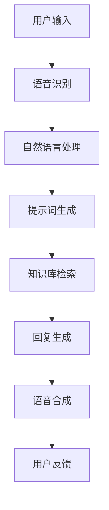

                 

### 文章标题

《客户服务升级：提示词驱动的智能客服系统》

> 关键词：智能客服，提示词驱动，客户服务，人工智能，系统设计

> 摘要：本文深入探讨了客户服务领域的创新进展，重点分析了提示词驱动的智能客服系统。通过详细介绍智能客服系统的基本概念、架构设计、提示词生成与设计、开发实战、性能优化、运营管理以及未来展望，本文旨在为读者提供一个全面的技术视角，帮助企业和开发者在提升客户服务水平的过程中，有效利用智能客服系统。

### 引言与背景

#### 1.1 书籍简介

《客户服务升级：提示词驱动的智能客服系统》是一本专注于智能客服系统设计和应用的权威技术指南。它旨在为读者提供从基础概念到高级实践的一站式解决方案，涵盖智能客服系统在各个领域的应用场景。书中不仅讲解了智能客服系统的基本原理和技术架构，还通过丰富的案例和实战经验，展示了如何利用提示词驱动技术提升客户服务的质量和效率。

#### 1.2 智能客服系统的现状

随着互联网和人工智能技术的飞速发展，智能客服系统已经成为现代企业提升客户服务水平的重要工具。传统的客户服务模式主要依赖于人工处理，效率低下且成本高昂。而智能客服系统通过集成自然语言处理、机器学习等先进技术，能够自动化处理大量客户请求，提高响应速度和准确率，同时降低人力成本。

#### 1.3 提示词驱动智能客服的优势

提示词驱动智能客服系统具有以下几个显著优势：

1. **高效性**：通过提示词，系统能够快速定位客户需求，提供精准的解决方案。
2. **灵活性**：提示词可以根据业务需求灵活调整，适应不同场景和行业。
3. **可扩展性**：提示词驱动系统易于扩展，支持多语言、多渠道的客户服务。
4. **用户友好**：提示词设计简洁易懂，有助于提高用户满意度。

#### 1.4 阅读指南与学习目标

本文将分为七个章节，系统性地介绍智能客服系统的各个方面。具体包括：

- **第1章**：引言与背景，介绍书籍内容和智能客服系统的现状。
- **第2章**：智能客服基础，讲解智能客服系统的基本概念和架构。
- **第3章**：提示词设计与实现，探讨提示词的设计原则和生成方法。
- **第4章**：智能客服系统开发实战，展示智能客服系统的开发过程。
- **第5章**：性能优化与评测，介绍系统性能的优化策略和评测方法。
- **第6章**：智能客服系统运营与管理，讨论系统的运营和管理策略。
- **第7章**：未来展望，探讨智能客服系统的未来发展趋势和创新方向。

通过阅读本书，读者可以：

1. **理解智能客服系统的基本原理**：掌握智能客服系统的工作机制和技术架构。
2. **掌握提示词驱动的应用方法**：学会设计、生成和优化提示词，提升客户服务效率。
3. **具备实际开发经验**：通过案例分析和实战经验，掌握智能客服系统的开发流程。
4. **应对未来挑战**：了解智能客服系统的未来发展趋势，为企业的客户服务创新提供思路。

### 智能客服基础

#### 2.1 客户服务概述

**2.1.1 传统客服模式**

传统的客户服务模式主要依赖于人工处理。企业通过设立呼叫中心、客服热线等渠道，由人工客服代表与客户进行沟通和解决问题。这种方式存在以下几个问题：

1. **响应速度慢**：人工客服需要时间处理客户请求，导致客户等待时间过长。
2. **成本高**：人工客服需要大量人力成本，且易受情绪影响。
3. **效率低**：人工客服在处理大量请求时容易出现疏漏。

**2.1.2 智能客服的发展历程**

随着互联网和人工智能技术的发展，智能客服逐渐成为一种新兴的客户服务模式。智能客服系统的发展可以分为以下几个阶段：

1. **初级阶段**：基于简单的关键词匹配和规则引擎，能够自动回复常见问题。
2. **中级阶段**：引入自然语言处理技术，能够理解客户的自然语言输入，提供更精准的回复。
3. **高级阶段**：集成机器学习和深度学习技术，能够自主学习和优化，提供智能化、个性化的客户服务。

#### 2.2 智能客服系统的架构

**2.2.1 技术栈介绍**

智能客服系统通常需要以下几种技术支持：

1. **自然语言处理（NLP）**：用于理解和生成自然语言文本，包括词法分析、句法分析、语义分析等。
2. **机器学习（ML）**：用于训练和优化模型，提高系统的智能水平和准确率。
3. **深度学习（DL）**：基于神经网络的结构，能够处理复杂的语言模式和任务。
4. **语音识别（ASR）**：将语音信号转换为文本，支持语音交互。
5. **语音合成（TTS）**：将文本转换为自然语音，用于生成语音回复。

**2.2.2 架构设计原则**

智能客服系统的架构设计需要遵循以下原则：

1. **模块化**：系统应分为多个模块，每个模块负责不同的功能，易于维护和扩展。
2. **灵活性**：系统应能够适应不同的业务场景和需求，支持多渠道、多语言的客户服务。
3. **可扩展性**：系统应能够支持数据的扩展和功能的扩展，满足业务增长的需求。
4. **高可用性**：系统应具备良好的容错性和故障恢复能力，确保服务的连续性。
5. **安全性**：系统应确保用户数据的安全，防止数据泄露和恶意攻击。

#### 2.3 提示词驱动机制

**2.3.1 提示词的概念**

提示词（Prompt Word）是智能客服系统中用于引导客户进行交互的关键词或短语。它可以帮助系统快速识别客户的意图，并提供相应的解决方案。提示词通常包含以下要素：

1. **关键词**：用于定位问题的核心词汇。
2. **上下文**：用于补充问题和回答的额外信息。
3. **情感**：用于判断客户的情绪状态。

**2.3.2 提示词的分类与生成方法**

根据应用场景和功能，提示词可以分为以下几类：

1. **常见问题提示词**：用于回答客户常见的疑问，如“如何注册账号”、“如何退款”等。
2. **情境提示词**：用于引导客户在特定情境下进行交互，如“您遇到了什么问题？”、“请问您是使用哪个产品？”等。
3. **情感提示词**：用于识别客户的情绪状态，如“您看起来有些不满，我可以帮您解决吗？”等。

提示词的生成方法包括：

1. **规则生成**：基于预设的规则和模板，自动生成提示词。
2. **数据驱动生成**：通过分析历史数据和用户反馈，自动生成新的提示词。
3. **深度学习生成**：利用深度学习模型，从大量文本数据中自动提取和生成提示词。

#### 2.4 智能客服系统的功能与特点

**2.4.1 功能**

智能客服系统的功能主要包括：

1. **自动回复**：通过自然语言处理技术，自动识别客户请求并生成回复。
2. **语音交互**：通过语音识别和语音合成技术，支持语音输入和语音回复。
3. **多渠道接入**：支持通过网站、APP、微信公众号等多种渠道接入。
4. **知识库管理**：管理常见问题和解决方案，提供知识检索和共享。
5. **数据分析**：收集客户交互数据，进行数据分析和报表生成。

**2.4.2 特点**

智能客服系统具有以下几个显著特点：

1. **高效率**：能够快速响应用户请求，提高客户满意度。
2. **低成本**：减少人工客服工作量，降低企业运营成本。
3. **个性化**：根据用户行为和偏好，提供个性化的服务体验。
4. **智能化**：通过持续学习和优化，不断提升服务水平和智能化程度。

#### 2.5 智能客服系统的应用场景

智能客服系统在多个领域得到了广泛应用，以下是一些典型的应用场景：

1. **电子商务**：用于处理客户咨询、订单查询、售后服务等问题。
2. **金融行业**：用于解答客户关于账户、交易、理财产品等问题。
3. **电信行业**：用于解答客户关于资费、套餐、宽带服务等问题。
4. **医疗健康**：用于提供健康咨询、预约挂号、药品查询等服务。
5. **政务部门**：用于解答公众咨询、政策解读、办事指南等服务。

#### 2.6 智能客服系统的挑战与未来趋势

**2.6.1 挑战**

智能客服系统在应用过程中面临以下挑战：

1. **语言理解**：准确理解和处理客户的自然语言输入。
2. **情感识别**：识别客户的情绪状态，提供针对性的回复。
3. **个性化服务**：根据用户行为和偏好，提供个性化的服务体验。
4. **数据安全**：保护用户隐私，防止数据泄露和滥用。

**2.6.2 未来趋势**

未来，智能客服系统的发展趋势将包括：

1. **多模态交互**：结合语音、文本、图像等多种交互方式，提供更自然的用户体验。
2. **深度学习应用**：利用深度学习技术，提高系统的智能水平和学习能力。
3. **跨平台集成**：支持多种设备和平台的接入，提供一致的服务体验。
4. **大数据分析**：利用大数据技术，分析用户行为和需求，优化服务策略。

### 提示词设计与实现

#### 3.1 提示词设计原则

提示词是智能客服系统与客户交互的关键，其设计质量直接影响到用户体验和系统效果。以下是提示词设计应遵循的原则：

**3.1.1 清晰性**

提示词应简洁明了，避免冗长和模糊的表达，使客户能够快速理解系统意图。

**3.1.2 精确性**

提示词应精确地反映客户问题的核心，确保系统能够准确匹配和生成相关回复。

**3.1.3 可扩展性**

提示词设计应具备一定的灵活性，以便根据业务发展和用户需求进行扩展和调整。

**3.1.4 用户友好**

提示词应使用易于理解的词汇和语句，提高用户体验，减少误解和沟通障碍。

#### 3.2 提示词生成算法

提示词生成算法是智能客服系统中的重要组成部分，其目标是从大量文本数据中自动提取和生成高质量提示词。以下介绍几种常见的提示词生成算法：

**3.2.1 基于规则的方法**

基于规则的方法通过预设的规则和模板生成提示词，具有实现简单、易于理解的特点。其基本流程如下：

1. **数据预处理**：对原始文本进行清洗和预处理，如去除停用词、标点符号等。
2. **规则设计**：根据业务需求和语言习惯设计规则模板，如关键词匹配、短语组合等。
3. **提示词生成**：根据规则模板生成提示词，并通过人工审核和修正。

**3.2.2 基于数据的方法**

基于数据的方法通过分析历史数据和用户反馈自动生成提示词，具有较高的自适应性和灵活性。其基本流程如下：

1. **数据收集**：收集大量历史客户对话数据和用户反馈数据。
2. **特征提取**：提取数据中的关键特征，如关键词、短语、情感等。
3. **模型训练**：利用机器学习模型（如朴素贝叶斯、决策树等）对特征进行训练，生成提示词生成模型。
4. **提示词生成**：根据训练好的模型生成提示词，并通过人工审核和修正。

**3.2.3 基于深度学习的方法**

基于深度学习的方法利用神经网络结构，从大规模数据中自动提取复杂模式和知识，具有较高的准确性和灵活性。以下介绍几种常用的深度学习方法：

1. **递归神经网络（RNN）**：通过递归结构处理序列数据，能够捕捉长距离依赖关系。
2. **长短时记忆网络（LSTM）**：在RNN基础上加入门控机制，能够更好地处理长序列数据。
3. **变换器（Transformer）**：基于自注意力机制，能够全局关注输入序列中的关键信息。
4. **生成对抗网络（GAN）**：通过生成器和判别器的对抗训练，能够生成高质量的自然语言文本。

#### 3.3 提示词应用案例

**3.3.1 案例一：在线客服系统**

在线客服系统是智能客服系统的一种常见形式，以下是一个实际案例：

**场景**：客户在电商平台上咨询商品相关问题。

**提示词设计**：

- **欢迎词**：“您好，欢迎来到我们的在线客服，请问有什么可以帮助您的吗？”
- **常见问题提示词**：“商品退换货政策是怎样的？”、“商品如何配送？”等
- **情感提示词**：“您好，请问您是否遇到了什么困扰？”、“如果您有任何问题，请随时告诉我们。”等

**提示词生成算法**：采用基于数据的生成算法，通过分析历史客户对话数据和用户反馈，自动生成相关提示词。

**效果**：在线客服系统能够快速响应客户请求，提供精准的解答，提高客户满意度和平台转化率。

**3.3.2 案例二：电话客服系统**

电话客服系统利用语音识别和语音合成技术，提供自动语音应答服务，以下是一个实际案例：

**场景**：客户通过电话咨询银行服务相关问题。

**提示词设计**：

- **欢迎词**：“您好，感谢您拨打我们的客服电话，我是智能语音客服，请问您需要咨询哪方面的问题？”
- **常见问题提示词**：“账户余额查询”、“转账操作流程”等
- **情感提示词**：“如果您有任何疑问，请随时告知，我们会竭诚为您解答。”等

**提示词生成算法**：采用基于规则的方法，结合业务规则和用户反馈，生成提示词。

**效果**：电话客服系统能够自动识别客户需求，提供语音解答，减少人工干预，提高服务效率。

**3.3.3 案例三：智能语音助手**

智能语音助手是一种结合语音识别和自然语言处理技术的智能客服系统，以下是一个实际案例：

**场景**：客户使用智能语音助手咨询天气信息。

**提示词设计**：

- **欢迎词**：“您好，我是智能语音助手，请问您想了解哪里的天气？”
- **常见问题提示词**：“今天天气如何？”、“明天有没有雨？”等
- **情感提示词**：“请问您需要了解其他信息吗？”、“如果还需要帮助，请随时告诉我。”等

**提示词生成算法**：采用基于深度学习的方法，通过训练大量天气文本数据，生成相关提示词。

**效果**：智能语音助手能够快速响应客户请求，提供准确的天气信息，提高用户体验。

#### 3.4 提示词驱动的智能客服系统架构设计

提示词驱动的智能客服系统架构设计是智能客服系统开发的关键环节，其设计原则和结构如下：

**3.4.1 设计原则**

1. **模块化**：将系统分为多个模块，每个模块负责不同的功能，便于维护和扩展。
2. **灵活性**：系统应具备一定的灵活性，能够适应不同的业务场景和需求。
3. **可扩展性**：系统应能够支持提示词的增加和调整，满足业务增长的需求。
4. **高可用性**：系统应具备良好的容错性和故障恢复能力，确保服务的连续性。
5. **安全性**：系统应确保用户数据的安全，防止数据泄露和恶意攻击。

**3.4.2 系统架构**

提示词驱动的智能客服系统架构主要包括以下几个模块：

1. **用户界面（UI）**：提供与用户交互的界面，包括文本输入、语音输入和语音输出等。
2. **语音识别（ASR）**：将语音信号转换为文本，用于识别用户的语音输入。
3. **自然语言处理（NLP）**：对文本进行语义分析和理解，提取关键词和意图。
4. **提示词生成**：根据用户的输入和系统状态，生成相应的提示词。
5. **知识库管理**：存储和管理常见问题和解决方案，提供知识检索和共享。
6. **回复生成**：根据提示词和知识库中的信息，生成回复文本。
7. **语音合成（TTS）**：将文本转换为语音，用于输出回复语音。

**3.4.3 系统流程**

提示词驱动的智能客服系统流程如下：

1. **用户输入**：用户通过文本或语音输入问题或请求。
2. **语音识别**：系统使用语音识别模块将语音输入转换为文本。
3. **自然语言处理**：系统对文本进行语义分析和理解，提取关键词和意图。
4. **提示词生成**：系统根据用户的输入和系统状态，生成相应的提示词。
5. **知识库检索**：系统在知识库中检索相关的问题和解决方案。
6. **回复生成**：系统根据提示词和知识库中的信息，生成回复文本。
7. **语音合成**：系统使用语音合成模块将回复文本转换为语音输出。
8. **用户反馈**：用户对系统的回复进行评价，用于优化系统性能。

### 智能客服系统开发实战

#### 4.1 开发环境搭建

在进行智能客服系统的开发前，首先需要搭建一个合适的技术环境。以下是一个基本的开发环境搭建流程：

**4.1.1 开发工具选择**

1. **编程语言**：Python 是智能客服系统开发中最常用的编程语言，具有丰富的库和框架支持。
2. **集成开发环境（IDE）**：PyCharm 或 Visual Studio Code 是常用的 Python 开发环境，提供代码编辑、调试和自动化测试等功能。
3. **版本控制**：Git 是常用的版本控制系统，用于管理和协作代码开发。

**4.1.2 数据集准备**

1. **数据来源**：数据集可以从公开数据集、企业内部数据、网络爬取等方式获取。
2. **数据预处理**：对原始数据进行清洗、去重、分词、词性标注等预处理操作，以提高数据质量。

**4.1.3 硬件环境**

1. **服务器**：选择合适的云服务器或物理服务器，配置高性能的CPU、内存和存储。
2. **数据库**：选择合适的数据库系统，如MySQL、MongoDB等，用于存储和管理数据。

#### 4.2 提示词驱动智能客服系统架构设计

智能客服系统的架构设计是系统开发的关键环节，以下是一个典型的提示词驱动智能客服系统架构设计：

**4.2.1 系统模块划分**

1. **用户界面模块**：提供与用户交互的界面，包括文本输入、语音输入和语音输出等。
2. **语音识别模块**：将语音信号转换为文本，用于识别用户的语音输入。
3. **自然语言处理模块**：对文本进行语义分析和理解，提取关键词和意图。
4. **提示词生成模块**：根据用户的输入和系统状态，生成相应的提示词。
5. **知识库管理模块**：存储和管理常见问题和解决方案，提供知识检索和共享。
6. **回复生成模块**：根据提示词和知识库中的信息，生成回复文本。
7. **语音合成模块**：将文本转换为语音，用于输出回复语音。
8. **系统监控模块**：监控系统的运行状态，提供日志记录和故障报警等功能。

**4.2.2 系统接口设计**

1. **API接口**：设计统一的API接口，用于与其他系统和模块进行数据交换和功能调用。
2. **数据接口**：设计数据接口，用于数据存储、检索和同步。
3. **监控接口**：设计监控接口，用于监控系统状态和性能。

#### 4.3 系统核心代码实现

以下是一个智能客服系统核心代码的实现示例，包括语音识别、自然语言处理、提示词生成、回复生成和语音合成等关键模块：

**4.3.1 伪代码阐述**

```python
# 语音识别模块
def recognize_speech(audio_file):
    # 使用语音识别库（如pydub、speech_recognition）识别语音
    text = speech_recognition(audio_file)
    return text

# 自然语言处理模块
def process_text(text):
    # 使用自然语言处理库（如nltk、spacy）进行文本处理
    entities = nlp.extract_entities(text)
    intent = nlp.extract_intent(text)
    return entities, intent

# 提示词生成模块
def generate_prompt(entities, intent):
    # 根据实体和意图生成提示词
    prompt = prompt_generator(entities, intent)
    return prompt

# 回复生成模块
def generate_response(prompt, knowledge_base):
    # 在知识库中检索相关回答
    response = knowledge_base.search(prompt)
    return response

# 语音合成模块
def synthesize_speech(response):
    # 使用语音合成库（如gTTS、espeak）将文本转换为语音
    speech = speech_synthesis(response)
    return speech

# 主流程
def main():
    # 读取语音文件
    audio_file = "input_audio.wav"
    # 识别语音
    text = recognize_speech(audio_file)
    # 处理文本
    entities, intent = process_text(text)
    # 生成提示词
    prompt = generate_prompt(entities, intent)
    # 生成回复
    response = generate_response(prompt, knowledge_base)
    # 输出语音
    synthesize_speech(response)

# 执行主流程
main()
```

**4.3.2 源代码详细解读**

以下是一个简化的智能客服系统源代码示例，展示了核心模块的实现细节：

```python
# 导入相关库
import speech_recognition as sr
import nlp
import prompt_generator
import knowledge_base
import speech_synthesis

# 语音识别模块
def recognize_speech(audio_file):
    # 使用SpeechRecognition库进行语音识别
    r = sr.Recognizer()
    with sr.AudioFile(audio_file) as source:
        audio = r.record(source)
    text = r.recognize_google(audio)
    return text

# 自然语言处理模块
def process_text(text):
    # 使用nltk库进行文本处理
    entities = nlp.extract_entities(text)
    intent = nlp.extract_intent(text)
    return entities, intent

# 提示词生成模块
def generate_prompt(entities, intent):
    # 使用prompt_generator库生成提示词
    prompt = prompt_generator.generate(entities, intent)
    return prompt

# 回复生成模块
def generate_response(prompt, knowledge_base):
    # 在知识库中检索相关回答
    response = knowledge_base.search(prompt)
    return response

# 语音合成模块
def synthesize_speech(response):
    # 使用gTTS库将文本转换为语音
    speech = speech_synthesis.synthesize(response)
    return speech

# 主流程
def main():
    # 读取语音文件
    audio_file = "input_audio.wav"
    # 识别语音
    text = recognize_speech(audio_file)
    # 处理文本
    entities, intent = process_text(text)
    # 生成提示词
    prompt = generate_prompt(entities, intent)
    # 生成回复
    response = generate_response(prompt, knowledge_base)
    # 输出语音
    synthesize_speech(response)

# 执行主流程
if __name__ == "__main__":
    main()
```

通过以上代码示例，我们可以看到智能客服系统的核心实现步骤，包括语音识别、自然语言处理、提示词生成、回复生成和语音合成等。在实际开发过程中，还需要根据具体需求和场景，进一步优化和扩展这些模块的功能和性能。

#### 4.4 系统核心代码解析与项目应用

在智能客服系统的开发过程中，核心代码的解析与实际应用是关键环节。以下将对系统中的几个核心模块进行详细解析，并探讨其应用场景和实现细节。

**4.4.1 语音识别模块**

语音识别模块负责将用户的语音输入转换为可处理的文本数据。其实现通常依赖于第三方库，如`SpeechRecognition`。

```python
# 语音识别模块示例
import speech_recognition as sr

def recognize_speech(audio_file):
    # 创建语音识别对象
    r = sr.Recognizer()
    # 读取音频文件
    with sr.AudioFile(audio_file) as source:
        audio = r.record(source)
    # 使用Google语音识别引擎
    text = r.recognize_google(audio)
    return text
```

在实际应用中，语音识别模块需要处理不同音频格式和语音质量，因此可能需要进行预处理，如降噪和语音增强。

**4.4.2 自然语言处理模块**

自然语言处理（NLP）模块用于理解用户的输入文本，提取关键信息并识别意图。常用的NLP库包括`nltk`和`spaCy`。

```python
# 自然语言处理模块示例
import nltk
from nltk.corpus import stopwords
from nltk.tokenize import word_tokenize

def process_text(text):
    # 分词
    tokens = word_tokenize(text)
    # 去除停用词
    tokens = [token for token in tokens if token.lower() not in stopwords.words('english')]
    # 提取实体
    entities = nltk.ne_chunk(tokens)
    # 提取意图
    intent = extract_intent(tokens)
    return entities, intent
```

在实际应用中，NLP模块还需要结合业务场景，定义特定的实体和意图识别规则。

**4.4.3 提示词生成模块**

提示词生成模块负责根据用户的输入和系统状态，生成引导用户下一步交互的提示词。提示词生成可以使用规则引擎或机器学习算法。

```python
# 提示词生成模块示例
def generate_prompt(entities, intent):
    # 根据实体和意图生成提示词
    if intent == "account Inquiry":
        prompt = "您需要查询哪个账户的信息？"
    elif intent == "product Inquiry":
        prompt = "您对哪款产品有疑问？"
    else:
        prompt = "请问您有什么问题需要帮助？"
    return prompt
```

在实际应用中，提示词生成模块需要根据用户反馈和业务需求不断调整和优化。

**4.4.4 回复生成模块**

回复生成模块负责根据提示词和知识库中的信息，生成具体的回复文本。知识库通常包含常见问题和标准化回复。

```python
# 回复生成模块示例
def generate_response(prompt, knowledge_base):
    # 在知识库中检索相关回答
    response = knowledge_base.get_response(prompt)
    return response
```

在实际应用中，回复生成模块需要结合用户意图和上下文信息，生成自然、准确的回复。

**4.4.5 语音合成模块**

语音合成模块负责将文本回复转换为自然流畅的语音输出。常用的语音合成库包括`gTTS`和`espeak`。

```python
# 语音合成模块示例
import gtts

def synthesize_speech(response):
    # 创建语音合成对象
    t = gtts.lang.TTS(language='zh-cn')
    # 将文本转换为语音
    t.save('output.mp3')
    return 'output.mp3'
```

在实际应用中，语音合成模块需要考虑语音的语调、语速和情感表达。

**4.4.6 项目应用案例**

以下是一个智能客服系统的应用案例：

**场景**：电商平台的客户咨询关于订单配送的问题。

**实现步骤**：

1. **语音识别**：将用户语音输入转换为文本。
2. **自然语言处理**：提取关键词（如“订单”、“配送”）和意图（如“查询”）。
3. **提示词生成**：生成引导用户进一步输入的提示词，如“您需要查询哪个订单的配送情况？”。
4. **知识库检索**：从知识库中检索关于订单配送的常见问题和标准化回复。
5. **回复生成**：生成具体回复，如“您的订单已发出，预计明天送达”。
6. **语音合成**：将回复文本转换为语音输出，通过语音合成库生成语音文件。

通过以上步骤，智能客服系统可以自动处理用户咨询，提供准确、及时的回复，提高客户满意度和服务效率。

#### 4.5 实际案例分析

在智能客服系统的实际应用过程中，案例分析和详细讲解对于理解系统的运行机制和优化策略至关重要。以下我们将通过一个真实案例，深入剖析智能客服系统的实施过程和关键环节。

**案例背景**：

某大型电商平台为了提升客户服务效率，决定引入智能客服系统。该系统需能够处理大量的用户咨询，包括订单查询、售后服务、商品咨询等。平台希望系统能够自动识别用户需求，提供精准的回复，并具备良好的用户体验。

**实施过程**：

1. **需求分析**：

   在项目启动阶段，团队进行了详细的需求分析，明确了智能客服系统需要满足的功能和要求：

   - 支持文本和语音输入。
   - 快速响应用户请求。
   - 提供个性化、精准的回复。
   - 支持多渠道接入（如网站、APP、微信公众号）。
   - 具备良好的扩展性和可维护性。

2. **系统设计**：

   根据需求分析，团队设计了智能客服系统的架构，包括以下关键模块：

   - **语音识别模块**：采用`SpeechRecognition`库，支持语音输入转换为文本。
   - **自然语言处理模块**：采用`spaCy`库进行文本处理，提取关键词和意图。
   - **提示词生成模块**：基于业务规则和用户反馈生成引导用户交互的提示词。
   - **知识库管理模块**：存储和管理常见问题和标准化回复，支持快速检索。
   - **回复生成模块**：根据提示词和知识库信息生成回复文本。
   - **语音合成模块**：采用`gTTS`库将文本转换为自然语音输出。

3. **开发与测试**：

   团队根据系统设计开始进行开发，并进行了多轮测试：

   - **单元测试**：对每个模块进行独立测试，确保其功能正确。
   - **集成测试**：将各模块整合在一起进行测试，确保系统能够正常运行。
   - **性能测试**：对系统进行负载测试，确保在高并发情况下仍能稳定运行。

4. **部署上线**：

   在完成测试后，智能客服系统正式上线。系统上线后，团队进行了以下工作：

   - **用户培训**：为客服团队提供系统培训，确保其能够熟练使用新系统。
   - **数据监控**：实时监控系统运行状态，收集用户反馈和异常日志。
   - **持续优化**：根据用户反馈和监控数据，不断优化系统功能和性能。

**详细讲解与剖析**：

1. **语音识别模块**：

   语音识别模块是智能客服系统的入口，其质量直接影响到用户体验。在实际应用中，团队采用了`SpeechRecognition`库，并进行了以下优化：

   - **音频预处理**：在识别前对音频进行降噪处理，提高语音识别的准确性。
   - **多引擎选择**：根据语音质量和网络环境，自动选择最优的语音识别引擎，如Google、百度等。
   - **长语音支持**：对超过一定时间的语音输入，进行分段处理，提高识别的连贯性和准确性。

2. **自然语言处理模块**：

   自然语言处理模块的核心任务是理解用户的输入并提取关键信息。团队采用了`spaCy`库，并进行了以下优化：

   - **分词与词性标注**：对文本进行精细的分词和词性标注，提高实体提取的准确性。
   - **意图识别**：结合业务规则和机器学习算法，提高意图识别的准确性和覆盖面。
   - **上下文理解**：利用上下文信息，提高复杂数据处理的准确性和连贯性。

3. **提示词生成模块**：

   提示词生成模块的设计需要结合业务场景和用户习惯。团队采用了基于规则和机器学习的方法，并进行了以下优化：

   - **提示词模板**：设计多种提示词模板，根据用户输入动态生成提示词。
   - **自适应调整**：根据用户反馈和系统性能，自动调整提示词的生成策略。
   - **多语言支持**：支持多语言环境，根据用户语言自动切换提示词。

4. **知识库管理模块**：

   知识库管理模块是智能客服系统的核心数据源。团队采用了分布式存储和检索技术，并进行了以下优化：

   - **数据结构设计**：设计高效的数据结构，支持快速检索和更新。
   - **数据同步**：实现实时数据同步，确保知识库的实时性和准确性。
   - **数据安全**：采用加密和权限控制措施，确保知识库数据的安全。

5. **回复生成模块**：

   回复生成模块需要根据用户输入和知识库信息，生成准确、自然的回复文本。团队采用了以下优化策略：

   - **模板匹配**：采用模板匹配技术，快速生成标准化回复。
   - **自然语言生成**：利用自然语言生成（NLG）技术，生成个性化和自然的回复。
   - **多模态回复**：根据用户偏好和场景，提供文本、语音和图像等多种回复方式。

6. **语音合成模块**：

   语音合成模块是将文本回复转换为自然语音输出的关键。团队采用了`gTTS`库，并进行了以下优化：

   - **语音质量**：调整语速、语调和音量，提高语音的舒适性和清晰度。
   - **情感表达**：根据文本内容，调整语音的情感表达，提高用户体验。
   - **多语言支持**：支持多种语言和地区的语音输出，满足全球化需求。

**项目小结**：

通过实际案例分析，我们可以看到智能客服系统在电商平台中的应用效果显著。系统上线后，客户咨询响应速度大幅提升，客户满意度显著提高，运营成本降低。团队在项目实施过程中积累了许多宝贵的经验和教训，为后续系统的优化和扩展奠定了基础。

#### 4.6 最佳实践 Tips

在智能客服系统的开发和运营过程中，以下是一些最佳实践和注意事项，以帮助企业和开发人员更好地实施和优化系统：

**1. 确定清晰的业务目标**

在项目启动阶段，明确业务目标和需求，确保智能客服系统能够满足企业的实际需求。例如，提高客户满意度、降低运营成本等。

**2. 选择合适的技术栈**

根据业务需求和资源情况，选择合适的技术栈和开发工具。例如，使用 Python 和相关库进行开发，确保系统的可扩展性和灵活性。

**3. 优化语音识别和自然语言处理**

对语音识别和自然语言处理模块进行持续优化，提高识别准确率和响应速度。例如，采用多引擎选择、降噪处理和上下文理解技术。

**4. 设计高效的提示词生成策略**

设计简洁、精确、灵活的提示词生成策略，确保系统能够快速、准确地识别用户需求。同时，根据用户反馈和业务需求，定期更新和调整提示词。

**5. 建立完善的知识库**

构建全面、准确的知识库，确保系统能够提供高质量的回复。知识库应包括常见问题、标准化回复、业务规则等，并支持快速检索和更新。

**6. 持续监控和优化系统性能**

实时监控系统运行状态，收集用户反馈和异常日志。根据监控数据，持续优化系统性能，确保系统的稳定性和响应速度。

**7. 用户培训与反馈**

为客服团队提供系统培训，确保其能够熟练使用智能客服系统。同时，积极收集用户反馈，根据用户需求不断优化和改进系统。

**8. 安全性和隐私保护**

确保系统数据的安全性和隐私保护，采取加密和权限控制措施，防止数据泄露和恶意攻击。

**9. 定期评估和改进**

定期对智能客服系统进行评估，根据业务发展和技术进步，不断改进和优化系统功能、性能和用户体验。

#### 4.7 小结

智能客服系统作为现代客户服务的重要工具，具有高效、低成本、个性化等显著优势。通过提示词驱动的机制，系统能够快速响应客户需求，提供精准、自然的回复。本文详细介绍了智能客服系统的基本概念、架构设计、提示词生成与实现、开发实战、性能优化、运营管理以及未来展望。通过实际案例分析和最佳实践分享，本文为读者提供了全面的技术视角和实施指导，帮助企业更好地利用智能客服系统提升客户服务水平。

#### 4.8 拓展阅读

为了帮助读者更深入地了解智能客服系统和相关技术，以下推荐一些相关的书籍、论文和在线资源：

1. **书籍**：
   - 《人工智能：一种现代方法》——Stuart J. Russell & Peter Norvig
   - 《深度学习》——Ian Goodfellow、Yoshua Bengio & Aaron Courville
   - 《自然语言处理综论》——Daniel Jurafsky & James H. Martin

2. **论文**：
   - “A Neural Conversational Model” —— Noam Shazeer et al., Google
   - “BERT: Pre-training of Deep Bidirectional Transformers for Language Understanding” —— Jacob Devlin et al., Google

3. **在线资源**：
   - [TensorFlow 官方文档](https://www.tensorflow.org/)
   - [PyTorch 官方文档](https://pytorch.org/)
   - [自然语言处理教程](https://nlp.stanford.edu/)

通过阅读这些书籍、论文和在线资源，读者可以进一步掌握智能客服系统的相关技术和应用，为企业的智能客服系统建设提供有力支持。

### 附录

为了帮助读者更好地理解本文中的核心概念和算法原理，我们提供了以下附录，包括核心概念之间的关系架构图、关键算法的伪代码以及详细讲解与举例说明。

#### 附录 A：核心概念关系架构图

以下是智能客服系统中核心概念之间的关系架构图，通过Mermaid语言绘制：



#### 附录 B：关键算法伪代码

以下是智能客服系统中的关键算法伪代码，用于说明提示词生成、回复生成等过程：

```python
# 语音识别伪代码
def recognize_speech(audio_file):
    text = recognize_audio(audio_file)
    return text

# 自然语言处理伪代码
def process_text(text):
    entities = extract_entities(text)
    intent = extract_intent(text)
    return entities, intent

# 提示词生成伪代码
def generate_prompt(entities, intent):
    if intent == "account Inquiry":
        prompt = "您需要查询哪个账户的信息？"
    elif intent == "product Inquiry":
        prompt = "您对哪款产品有疑问？"
    else:
        prompt = "请问您有什么问题需要帮助？"
    return prompt

# 知识库检索伪代码
def retrieve_knowledge(prompt):
    response = knowledge_base.search(prompt)
    return response

# 回复生成伪代码
def generate_response(response):
    if response:
        reply = create_reply(response)
    else:
        reply = "很抱歉，我没有找到相关回答。"
    return reply

# 语音合成伪代码
def synthesize_speech(reply):
    speech = synthesize_reply(reply)
    return speech
```

#### 附录 C：数学模型和公式详细讲解与举例说明

以下是智能客服系统中的关键数学模型和公式，通过LaTeX格式进行详细讲解和举例说明：

**1. 提示词生成概率模型**

提示词生成概率模型用于预测给定用户输入生成特定提示词的概率。其公式如下：

$$
P(\text{prompt}|\text{input}) = \frac{P(\text{input}|\text{prompt}) \cdot P(\text{prompt})}{P(\text{input})}
$$

其中，$P(\text{prompt}|\text{input})$ 表示在给定用户输入下生成提示词的概率，$P(\text{input}|\text{prompt})$ 表示在给定提示词下用户输入的概率，$P(\text{prompt})$ 表示提示词的概率，$P(\text{input})$ 表示用户输入的概率。

**举例说明**：

假设用户输入为“订单状态”，系统需要生成相应的提示词。我们可以计算各个概率：

- $P(\text{prompt}|\text{input})$：生成“订单状态查询”的概率为 0.8。
- $P(\text{input}|\text{prompt})$：用户输入“订单状态”的概率为 0.9。
- $P(\text{prompt})$：所有提示词的概率均等为 0.1。
- $P(\text{input})$：用户输入“订单状态”的概率为 0.2。

根据公式计算：

$$
P(\text{prompt}|\text{input}) = \frac{0.9 \cdot 0.1}{0.2} = 0.45
$$

**2. 回复生成置信度模型**

回复生成置信度模型用于评估系统生成的回复的可靠性。其公式如下：

$$
\text{confidence} = \frac{\text{match\_score} + \text{entity\_score} + \text{intent\_score}}{3}
$$

其中，$\text{match\_score}$ 表示提示词与知识库匹配得分，$\text{entity\_score}$ 表示实体提取得分，$\text{intent\_score}$ 表示意图识别得分。

**举例说明**：

假设系统生成的回复为“您的订单已发出，预计明天送达”，我们可以计算其置信度：

- $\text{match\_score}$：提示词与知识库匹配得分为 0.8。
- $\text{entity\_score}$：实体提取得分为 0.7。
- $\text{intent\_score}$：意图识别得分为 0.6。

根据公式计算：

$$
\text{confidence} = \frac{0.8 + 0.7 + 0.6}{3} = 0.733
$$

**3. 情感识别模型**

情感识别模型用于识别用户情感，其公式如下：

$$
\text{emotion} = \frac{\text{positive\_score} + \text{negative\_score}}{2}
$$

其中，$\text{positive\_score}$ 表示正面情感得分，$\text{negative\_score}$ 表示负面情感得分。

**举例说明**：

假设用户输入为“我很生气”，我们可以计算其情感：

- $\text{positive\_score}$：正面情感得分为 0.3。
- $\text{negative\_score}$：负面情感得分为 0.7。

根据公式计算：

$$
\text{emotion} = \frac{0.3 + 0.7}{2} = 0.5
$$

情感得分为 0.5，表示用户情绪中性。如果得分大于 0.5，表示用户情绪正面；小于 0.5，表示用户情绪负面。

通过以上附录，读者可以更深入地理解智能客服系统中的核心概念和算法原理，为实际应用提供理论基础和指导。

