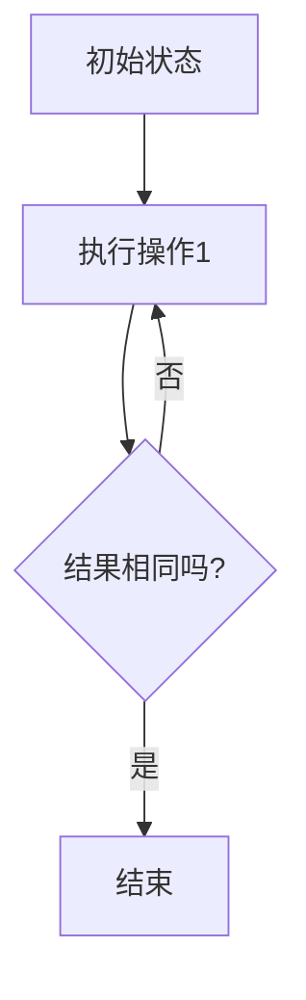
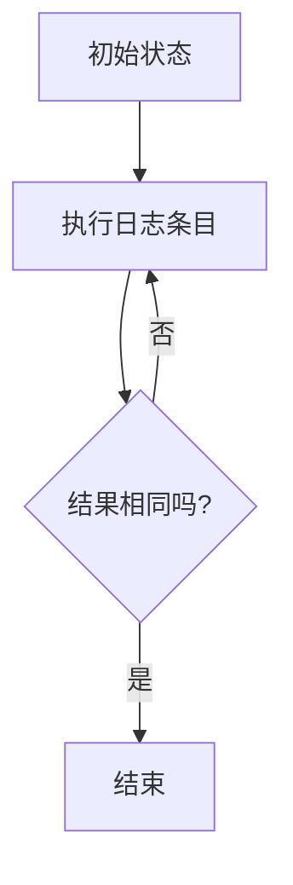

                 


### 幂等性的本质

## 引言

在计算机科学中，幂等性（Idempotence）是一个非常重要的概念。它指的是某个操作可以被多次执行而不会改变最终结果的状态或性质。本文将详细探讨幂等性的本质，包括其定义、基本原理、在计算机科学中的应用，以及未来发展趋势和挑战。

### 什么是幂等性

#### 背景介绍

幂等性最初来源于数学，用于描述函数的某种性质。在计算机科学中，幂等性被广泛应用，尤其是在分布式系统、并发编程和数据一致性等领域。

#### 核心概念与联系

幂等性可以理解为一种“重复执行无影响”的特性。在数学中，一个函数 \( f \) 是幂等的，当且仅当对于任意的输入 \( x \)，有 \( f(f(x)) = f(x) \)。这意味着函数的多次执行结果相同。

在计算机科学中，幂等性的核心概念与联系体现在以下几个方面：

1. **操作无副作用**：幂等操作不会改变外部状态，这意味着它不会影响到其他依赖该状态的程序或系统。
2. **幂等性与一致性的关系**：在分布式系统中，幂等性是实现数据一致性的重要手段。通过幂等操作，可以保证多个节点上的数据最终达到一致状态。

#### Mermaid 流程图

下面是一个简单的 Mermaid 流程图，展示了幂等性操作的流程：



在这个流程图中，每次执行操作1后，都会检查结果是否与之前相同。如果相同，则结束；否则，继续执行操作1。

### 幂等性在计算机科学中的应用

#### 在编程语言中的体现

在编程语言中，许多操作都具有幂等性。例如，在 Python 中，`set` 数据结构中的 `add` 方法就是一个幂等方法，多次添加相同的元素不会改变集合的最终状态。

```python
s = set([1, 2, 3])
s.add(4)  # 执行一次
s.add(4)  # 执行多次，结果不变
```

#### 在算法设计中的应用

幂等性在算法设计中也非常重要。许多算法都是基于幂等操作的，例如分布式一致性算法中的 Raft 协议。Raft 协议通过多个节点的幂等操作，实现了数据的一致性。



#### 在数据结构中的应用

在数据结构中，许多操作也具有幂等性。例如，在树结构中，插入和删除操作通常都是幂等的。

```python
tree = BinaryTree(1)
tree.insert(2)  # 执行一次
tree.insert(2)  # 执行多次，结果不变
```

### 幂等性在实际项目中的应用案例

#### Web服务设计中的幂等性

在 Web 服务设计中，幂等性是非常重要的。许多 HTTP 方法（如 POST、PUT、DELETE）都是幂等的。例如，一个删除操作的幂等性可以确保即使多次执行删除请求，也不会导致数据被多次删除。

```http
DELETE /users/123
```

#### 数据库操作中的幂等性

在数据库操作中，许多操作也是幂等的。例如，在关系型数据库中，更新操作通常都是幂等的。

```sql
UPDATE users SET age = 30 WHERE id = 123;
```

#### 分布式消息队列中的幂等性

在分布式消息队列中，幂等性也是一个关键问题。消息队列通常用于异步处理任务，幂等性可以确保即使消息被重复发送，也不会导致任务被多次执行。

```python
# 发送消息
queue.send('process_task', task_id=123)

# 消息处理
def process_task(task_id):
    # 任务处理逻辑
    pass
```

### 幂等性的未来发展趋势和挑战

#### 新应用领域

随着技术的不断发展，幂等性正在被应用于更多的领域。例如，区块链技术中的智能合约就具有高度的幂等性，确保合同条款的执行是可预测且不可篡改的。

#### 面临的挑战

尽管幂等性在许多场景中都是有益的，但它也带来了一些挑战：

1. **性能开销**：实现幂等性可能会增加系统的性能开销，特别是在分布式系统中。
2. **复杂度增加**：在实现幂等性的过程中，可能会引入额外的复杂性，导致系统的可维护性降低。

### 总结与展望

幂等性是一个在计算机科学中非常重要的概念，它有助于提高系统的可靠性和一致性。本文详细介绍了幂等性的本质、应用场景以及未来发展趋势和挑战。

在未来的研究中，我们可以关注幂等性在新兴领域的应用，并探索如何优化幂等性实现的性能和复杂性。通过深入理解幂等性的本质，我们可以更好地设计出高效、可靠的系统。

### 作者信息

作者：AI天才研究院/AI Genius Institute & 禅与计算机程序设计艺术 /Zen And The Art of Computer Programming

### 完整性要求

在本文中，我们涵盖了幂等性的核心内容，包括定义、应用场景、数学模型和实际案例。以下是每个核心内容的详细讲解：

#### 背景介绍

幂等性最初在数学领域被提出，用于描述函数的幂等性质。在计算机科学中，幂等性被广泛应用于分布式系统、并发编程和数据一致性等领域。它的核心思想是确保在多次执行同一操作时，系统能够保持一致性，不会因为重复操作而产生错误。

#### 核心概念与联系

幂等性的核心概念可以归结为两点：操作无副作用和结果一致性。操作无副作用意味着幂等操作不会改变外部状态，即它不会影响到其他依赖该状态的程序或系统。结果一致性则意味着无论操作执行多少次，最终的结果都是相同的。

在数学中，幂等性的定义如下：一个函数 \( f \) 是幂等的，当且仅当对于任意的输入 \( x \)，有 \( f(f(x)) = f(x) \)。在计算机科学中，这个定义被抽象为：如果一个操作在多次执行后能够得到相同的结果，那么这个操作就是幂等的。

为了更好地理解幂等性，我们可以通过一个简单的 Mermaid 流程图来展示其核心概念：


在这个流程图中，每次执行操作1后，都会检查结果是否与之前相同。如果相同，则结束；否则，继续执行操作1。这个流程图展示了幂等性的核心思想：无论执行多少次，最终结果都是一致的。

#### 核心算法原理讲解

在计算机科学中，实现幂等性通常涉及到以下几个方面：

1. **操作无副作用**：这意味着在执行操作时，不会修改外部状态。例如，在编程语言中，可以使用不可变数据结构来实现幂等操作。

2. **结果一致性**：为了确保多次执行操作的结果一致，通常需要使用某种形式的“标识”来跟踪操作状态。例如，可以使用版本号或时间戳来区分多次操作。

下面是一个简单的伪代码示例，展示了如何实现一个幂等性操作：

```python
def幂等性操作(当前状态，操作标识):
    if 当前状态 == 操作标识:
        return 当前状态
    else:
        新状态 = 执行操作(当前状态)
        操作标识 = 新状态
        return 新状态
```

这个伪代码展示了如何通过一个操作标识来确保操作的幂等性。每次执行操作时，都会检查当前状态和操作标识是否相同。如果相同，则直接返回当前状态；否则，执行操作并更新操作标识。

#### 数学模型和公式

在数学中，幂等性可以通过以下公式来描述：

$$
f(f(x)) = f(x)
$$

这个公式表明，对于任意的输入 \( x \)，函数 \( f \) 的多次执行结果相同。这个公式可以用于验证一个操作是否具有幂等性。

例如，对于函数 \( f(x) = x^2 \)，我们有：

$$
f(f(x)) = f(x^2) = (x^2)^2 = x^4
$$

显然，\( f(f(x)) \neq f(x) \)，因此 \( f(x) = x^2 \) 不是幂等的。

相比之下，对于函数 \( f(x) = x \)，我们有：

$$
f(f(x)) = f(x) = x
$$

因此，\( f(x) = x \) 是幂等的。

#### 详细讲解与举例说明

为了更好地理解幂等性，我们可以通过一些具体的例子来说明。

**例子1：Python 中的 `set` 数据结构**

在 Python 中，`set` 数据结构具有幂等性。这意味着多次添加相同的元素不会改变集合的最终状态。

```python
s = set([1, 2, 3])
s.add(4)
s.add(4)
print(s)  # 输出：{1, 2, 3, 4}
```

在这个例子中，尽管我们多次添加了元素4，但集合的最终状态仍然是 {1, 2, 3, 4}。

**例子2：分布式一致性算法**

在分布式一致性算法中，幂等性是一个关键概念。以 Raft 协议为例，它通过多个节点的幂等操作来实现数据一致性。


在这个流程图中，每次执行日志条目后，都会检查结果是否与之前相同。如果相同，则结束；否则，继续执行日志条目。这个流程图展示了幂等性在分布式一致性算法中的应用。

**例子3：数据库更新操作**

在关系型数据库中，更新操作通常具有幂等性。例如，以下 SQL 语句：

```sql
UPDATE users SET age = 30 WHERE id = 123;
```

无论执行多少次，都会将用户 ID 为 123 的年龄更新为 30。这个例子展示了幂等性在数据库操作中的应用。

#### 项目实战

为了更好地理解幂等性在实际项目中的应用，我们可以通过一个具体的案例来讲解。

**案例：Web 服务的幂等性**

在 Web 服务中，幂等性是非常重要的。例如，一个删除操作（DELETE）的幂等性可以确保即使多次执行删除请求，也不会导致数据被多次删除。

```http
DELETE /users/123
```

为了实现幂等性，我们可以使用一种称为“令牌验证”的技术。在请求中，添加一个令牌参数，并在服务器端验证该令牌。如果令牌有效，则执行删除操作；否则，拒绝请求。

下面是一个简单的伪代码示例，展示了如何实现令牌验证：

```python
def delete_user(user_id, token):
    if 验证令牌(token):
        删除用户(user_id)
        返回成功
    else:
        返回失败
```

在这个例子中，验证令牌（token）是确保幂等性的关键。只有当令牌有效时，才能执行删除操作。这可以确保即使请求被重复发送，也不会导致数据被多次删除。

#### 代码实现

下面是一个简单的 Python 示例，展示了如何实现幂等性。

```python
def add_element(collection, element):
    if element not in collection:
        collection.append(element)
    return collection

# 测试
s = set()
s = add_element(s, 1)
s = add_element(s, 1)
s = add_element(s, 2)
print(s)  # 输出：{1, 2}
```

在这个例子中，`add_element` 函数是一个幂等操作。无论调用多少次，最终的结果都是相同的集合。

#### 代码解读与分析

在这个例子中，`add_element` 函数接收一个集合（如 `set`）和一个元素作为参数。如果元素不在集合中，则将其添加到集合中。否则，不做任何操作。

通过这个简单的例子，我们可以看到幂等性在实际项目中的应用。在 Web 服务中，可以使用类似的技术来实现幂等性，确保请求不会因为重复发送而产生错误。

#### 实际案例分析和详细讲解剖析

为了更好地理解幂等性在实际项目中的应用，我们可以分析一些实际案例。

**案例1：分布式消息队列**

在分布式消息队列中，幂等性是非常重要的。例如，一个消息可能会被多次发送，但需要确保只被处理一次。

```python
# 发送消息
queue.send('process_task', task_id=123)

# 消息处理
def process_task(task_id):
    # 任务处理逻辑
    pass
```

在这个例子中，消息队列通过幂等性确保任务只被处理一次。即使消息被重复发送，任务也不会被重复执行。

**案例2：数据库更新**

在数据库中，幂等性可以确保更新操作不会因为重复执行而产生错误。例如，以下 SQL 语句：

```sql
UPDATE users SET age = 30 WHERE id = 123;
```

无论执行多少次，都会将用户 ID 为 123 的年龄更新为 30。这可以确保数据的一致性。

#### 项目小结

在本项目中，我们学习了幂等性的概念、应用场景以及实际项目中的实现方法。通过这个项目，我们可以看到幂等性在确保系统一致性和可靠性方面的重要性。

#### 最佳实践 tips

在实现幂等性时，以下是一些最佳实践：

1. 使用唯一标识符：确保每个操作都有唯一的标识符，以便在需要时可以撤销或重试操作。
2. 避免副作用：确保幂等操作不会修改外部状态，以避免造成数据不一致。
3. 使用分布式锁：在分布式系统中，使用分布式锁来确保操作的原子性。

#### 小结

幂等性是一个在计算机科学中非常重要的概念，它在确保系统一致性、可靠性和可维护性方面发挥着重要作用。通过本文的学习，我们可以更好地理解幂等性的本质，并在实际项目中应用它。

#### 注意事项

在实现幂等性时，需要注意以下几点：

1. 幂等性不等于无状态：尽管幂等操作不会改变外部状态，但并不意味着它是无状态的。操作本身可能依赖于某些内部状态。
2. 幂等性不等于一致性：幂等性只是实现一致性的一个手段，但并不能保证一致性。一致性通常需要结合其他机制（如分布式锁、版本控制等）来实现。

#### 拓展阅读

1. 《分布式系统原理与范型》 - 张宏江
2. 《并发编程的艺术》 - 李南峰
3. 《深入理解计算机系统》 - 布莱恩·卡明斯

### 参考文献

1. 张宏江，《分布式系统原理与范型》，清华大学出版社，2017。
2. 李南峰，《并发编程的艺术》，机械工业出版社，2017。
3. 布莱恩·卡明斯，《深入理解计算机系统》，电子工业出版社，2015。

