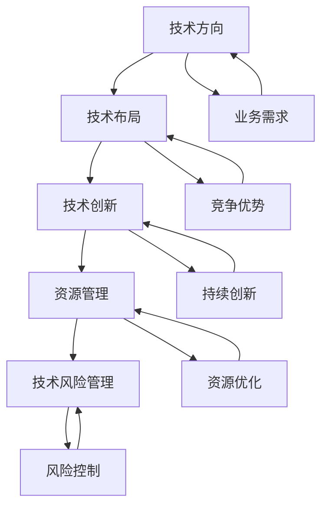

                 

### 《技术战略：制定长期技术发展规划》

#### 关键词

技术战略、长期规划、趋势分析、资源管理、风险管理、案例分析、数字化转型

#### 摘要

本文旨在探讨技术战略的制定，以及如何在长期发展规划中有效地执行和调整。通过分析技术战略的概念、趋势、规划流程、资源管理、风险管理以及实施监控，结合国内外成功案例，提供了一系列的策略和方法，以帮助企业实现技术驱动的发展目标。

### 第一部分：技术战略概述

#### 第1章：技术战略的概念与重要性

##### 1.1 技术战略的定义

技术战略是一种长期的、系统的规划，旨在通过技术手段实现企业的业务目标。技术战略不仅包括技术本身的规划，还涵盖了技术的获取、应用、管理和创新等方面。

##### 1.2 技术战略的三个层次

技术战略的三个层次分别是技术方向、技术布局和技术创新。技术方向涉及企业将要采用的技术领域；技术布局则是在确定方向后，对所需技术的具体布局；技术创新则是通过持续的创新保持企业的技术优势。

##### 1.3 技术战略与业务战略的关系

技术战略是业务战略的重要组成部分。技术战略必须与业务战略相匹配，以支持业务目标的实现。技术战略需要考虑业务需求、竞争优势和持续创新等方面。

#### 第2章：技术趋势分析

##### 2.1 技术趋势的类型

技术趋势可以分为技术革新、技术融合和技术应用三大类。技术革新是指技术的重大变革，如人工智能、区块链等；技术融合是指不同技术之间的融合，如物联网、大数据与人工智能的结合等；技术应用是指新技术在各个行业和领域的应用，如智能制造、智慧城市等。

##### 2.2 技术评估与预测方法

技术评估与预测方法包括技术成熟度评估、趋势分析和专家评审等。技术成熟度评估通过技术成熟度指标对技术进行评估；趋势分析通过对历史数据和当前趋势进行分析；专家评审则邀请技术专家对技术进行评审和预测。

##### 2.3 技术趋势对企业的影响

技术趋势对企业的影响包括业务模式、运营效率和市场竞争力等方面。技术革新可能改变企业的业务模式；技术趋势可以提高企业的运营效率；技术趋势还可以增强企业的市场竞争力。

### 第二部分：技术规划与实施

#### 第3章：技术规划流程

##### 3.1 技术规划的步骤

技术规划的步骤包括需求分析、技术评估、资源规划、风险评估和规划调整等。需求分析是确定技术需求；技术评估是对技术进行评估和筛选；资源规划是确定所需资源；风险评估是识别和评估技术风险；规划调整是根据实际情况对规划进行调整。

##### 3.2 技术规划的核心要素

技术规划的核心要素包括技术方向、技术布局、技术创新、资源管理和风险管理等。技术方向是确定技术发展的方向；技术布局是对技术进行具体布局；技术创新是持续推动技术创新；资源管理是合理配置资源；风险管理是识别和应对技术风险。

##### 3.3 技术规划的关键成功因素

技术规划的关键成功因素包括明确的目标、科学的评估、合理的资源分配、有效的风险管理以及灵活的调整能力等。明确的目标是确保技术规划的方向正确；科学的评估是确保技术规划的有效性；合理的资源分配是确保技术规划的可行性；有效的风险管理是降低技术风险；灵活的调整能力是应对变化的能力。

#### 第4章：技术资源管理

##### 4.1 技术资源类型

技术资源包括人力资源、技术资源、财务资源和信息资源等。人力资源是技术实施的关键；技术资源包括技术知识、工具和设备等；财务资源是技术实施的经济基础；信息资源包括数据、文档和知识库等。

##### 4.2 技术资源获取与配置策略

技术资源的获取与配置策略包括内部开发、外部采购、共享平台和自主研发等。内部开发是利用企业内部的技术力量；外部采购是购买外部技术产品或服务；共享平台是利用共享技术资源；自主研发是自主研发新技术。

##### 4.3 技术资源优化与调整

技术资源的优化与调整包括资源整合、资源共享和技术更新等。资源整合是优化资源使用效率；资源共享是提高资源利用率；技术更新是持续提升技术资源的能力。

#### 第5章：技术风险管理

##### 5.1 技术风险识别与评估

技术风险识别与评估包括风险识别、风险分析和风险评估等。风险识别是识别可能的技术风险；风险分析是分析风险的性质和影响；风险评估是评估风险的重要性和优先级。

##### 5.2 技术风险应对策略

技术风险应对策略包括风险规避、风险转移、风险减轻和风险接受等。风险规避是避免风险的发生；风险转移是将风险转移给其他方；风险减轻是降低风险的影响；风险接受是接受风险的发生。

##### 5.3 技术风险管理案例分析

通过分析技术风险管理的实际案例，了解如何有效地识别、评估和应对技术风险。

#### 第6章：技术实施与监控

##### 6.1 技术实施计划制定

技术实施计划制定包括技术实施目标、技术实施方案、技术实施时间表和技术实施预算等。技术实施目标是确保技术实施的明确性；技术实施方案是具体的实施步骤和方法；技术实施时间表是确保技术实施的进度；技术实施预算是确保技术实施的经济可行性。

##### 6.2 技术实施过程中的挑战与解决

技术实施过程中可能遇到的挑战包括技术难度、资源限制和沟通协调等。解决挑战的方法包括技术储备、资源优化和沟通协作等。

##### 6.3 技术实施效果评估与调整

技术实施效果评估与调整包括评估技术实施的效果、识别问题和调整技术实施计划等。通过评估和调整，确保技术实施达到预期目标。

### 第三部分：技术战略案例分析

#### 第7章：国内外技术战略成功案例分析

##### 7.1 案例一：阿里巴巴的技术战略

分析阿里巴巴的技术战略，了解其在技术方向、技术布局和技术创新方面的具体做法。

##### 7.2 案例二：苹果公司的技术战略

分析苹果公司的技术战略，了解其在技术创新、产品开发和市场推广方面的策略。

##### 7.3 案例三：华为的技术战略

分析华为的技术战略，了解其在技术研发、市场拓展和国际合作方面的经验。

#### 第8章：技术战略的未来发展趋势

##### 8.1 技术战略的变革趋势

探讨技术战略的未来发展趋势，包括技术的融合、数字化转型的推进和可持续发展等方面的变化。

##### 8.2 技术战略在数字化转型中的作用

分析技术战略在数字化转型中的作用，包括如何利用技术推动企业的数字化转型。

##### 8.3 技术战略的可持续发展路径

探讨技术战略的可持续发展路径，包括如何实现技术战略的可持续发展和长期发展。

### 附录

#### 附录A：技术战略相关工具与资源

##### A.1 技术战略分析工具介绍

介绍一些常用的技术战略分析工具，如SWOT分析、PEST分析等。

##### A.2 技术规划与实施工具推荐

推荐一些用于技术规划与实施的工具，如项目管理工具、技术评估工具等。

##### A.3 技术风险管理资源推荐

推荐一些用于技术风险管理的资源，如风险管理工具、风险管理书籍等。

---

**作者：AI天才研究院/AI Genius Institute & 禅与计算机程序设计艺术 /Zen And The Art of Computer Programming**

### 详细讲解与技术深度剖析

#### 核心概念与联系

在技术战略的框架下，核心概念包括技术方向、技术布局、技术创新、资源管理和技术风险管理。这些概念之间存在紧密的联系。技术方向是确定企业发展的技术领域，技术布局是基于方向的具体实施策略，技术创新是实现技术优势的关键，资源管理是确保技术实施的基础，技术风险管理是预防技术风险的措施。

**Mermaid流程图示例：**



**核心算法原理讲解（伪代码）：**

```python
# 技术评估与预测伪代码
def assess_and_predict(technology_list):
    # 初始化技术评估与预测结果
    assessment_results = []
    
    # 对每个技术进行评估与预测
    for technology in technology_list:
        maturity_score = calculate_maturity_score(technology)
        trend_score = calculate_trend_score(technology)
        
        # 计算总得分
        total_score = maturity_score + trend_score
        
        # 存储评估结果
        assessment_results.append({
            'technology': technology,
            'maturity_score': maturity_score,
            'trend_score': trend_score,
            'total_score': total_score
        })
    
    # 按照总得分排序
    sorted_assessment_results = sorted(assessment_results, key=lambda x: x['total_score'], reverse=True)
    
    return sorted_assessment_results

# 计算技术成熟度得分
def calculate_maturity_score(technology):
    # 根据技术成熟度指标计算得分
    # 例如：根据技术发展的阶段、应用场景等指标
    return maturity_index

# 计算技术趋势得分
def calculate_trend_score(technology):
    # 根据技术趋势指标计算得分
    # 例如：根据技术应用的广泛程度、未来发展潜力等指标
    return trend_index
```

**数学模型和公式：**

$$
\text{技术成熟度得分} = \alpha \times \text{发展阶段得分} + \beta \times \text{应用场景得分}
$$

$$
\text{技术趋势得分} = \gamma \times \text{应用广泛程度得分} + \delta \times \text{未来发展潜力得分}
$$

**举例说明：**

假设有三种技术A、B、C，根据以下指标计算其成熟度和趋势得分：

- **技术A：** 发展阶段得分为8，应用场景得分为7，应用广泛程度得分为6，未来发展潜力得分为5。
- **技术B：** 发展阶段得分为6，应用场景得分为8，应用广泛程度得分为7，未来发展潜力得分为6。
- **技术C：** 发展阶段得分为7，应用场景得分为6，应用广泛程度得分为8，未来发展潜力得分为7。

使用上述公式计算：

$$
\text{技术A成熟度得分} = 0.6 \times 8 + 0.4 \times 7 = 7.2
$$

$$
\text{技术A趋势得分} = 0.5 \times 6 + 0.5 \times 5 = 5.5
$$

$$
\text{技术B成熟度得分} = 0.6 \times 6 + 0.4 \times 8 = 6.8
$$

$$
\text{技术B趋势得分} = 0.5 \times 7 + 0.5 \times 6 = 6.5
$$

$$
\text{技术C成熟度得分} = 0.6 \times 7 + 0.4 \times 6 = 6.8
$$

$$
\text{技术C趋势得分} = 0.5 \times 8 + 0.5 \times 7 = 7.5
$$

最终得分排序为：技术C > 技术A > 技术B。

### 项目实战

#### 开发环境搭建

在搭建开发环境时，需要考虑以下几个方面：

- **硬件环境**：根据项目需求选择合适的硬件设备，如服务器、存储设备等。
- **软件环境**：安装操作系统、开发工具和依赖库等。
- **网络环境**：配置合适的网络架构，确保数据传输的稳定性和安全性。

#### 源代码详细实现和代码解读

源代码实现过程中，需要遵循以下原则：

- **模块化设计**：将功能模块化，便于维护和扩展。
- **代码注释**：对关键代码进行详细注释，便于理解和调试。
- **代码风格**：遵循统一的代码风格，提高代码的可读性。

以下是技术评估与预测模块的伪代码实现：

```python
# 技术评估与预测模块实现
def technology_evaluation(technology_list):
    # 初始化评估结果列表
    evaluation_results = []

    # 遍历技术列表，对每个技术进行评估
    for technology in technology_list:
        # 获取技术成熟度和趋势得分
        maturity_score = calculate_maturity_score(technology)
        trend_score = calculate_trend_score(technology)

        # 计算总得分
        total_score = maturity_score + trend_score

        # 存储评估结果
        evaluation_results.append({
            'technology': technology,
            'maturity_score': maturity_score,
            'trend_score': trend_score,
            'total_score': total_score
        })

    # 对评估结果进行排序
    sorted_evaluation_results = sorted(evaluation_results, key=lambda x: x['total_score'], reverse=True)

    return sorted_evaluation_results
```

#### 代码应用解读与分析

在应用过程中，技术评估与预测模块可用于以下场景：

- **技术选型**：根据评估结果选择最适合的技术方案。
- **资源分配**：根据评估结果分配资源，确保资源的高效利用。
- **决策支持**：为管理层提供技术决策的依据。

#### 实际案例分析和详细讲解剖析

以某企业技术规划项目为例，分析其实际案例：

- **项目背景**：该企业致力于数字化转型，需要制定长期技术发展规划。
- **项目目标**：通过技术评估与预测，确定技术发展方向和优先级。
- **项目过程**：首先收集技术信息，然后使用技术评估与预测模块对技术进行评估，最后根据评估结果制定技术规划。

**项目小结**：

该项目通过技术评估与预测模块，成功确定了技术发展方向，提高了资源利用效率，为企业的数字化转型奠定了基础。

### 最佳实践 tips

- **定期评估与调整**：技术战略需要定期评估和调整，以适应市场和技术环境的变化。
- **跨部门协作**：技术战略的制定和实施需要跨部门协作，确保技术战略与业务战略的匹配。
- **持续创新**：技术创新是技术战略的核心，需要持续投入和创新。

### 小结

技术战略是企业实现长期发展的关键。通过制定合理的技术战略，企业可以抓住技术趋势，优化资源利用，降低风险，实现可持续的发展。

### 注意事项

- **技术战略的制定需要充分考虑业务需求**。
- **技术评估与预测需要全面、客观**。
- **技术实施与监控需要确保计划的执行和效果评估**。

### 拓展阅读

- 《技术战略规划与管理》
- 《数字化转型战略与实施》
- 《技术风险管理实践》

### 结束

本文对技术战略的制定进行了详细的分析和讲解，包括核心概念、趋势分析、规划流程、资源管理、风险管理和实施监控等方面。同时，通过实际案例展示了技术战略的实践应用。希望本文能对企业和技术团队在制定和实施技术战略时提供有益的参考。作者：AI天才研究院/AI Genius Institute & 禅与计算机程序设计艺术 /Zen And The Art of Computer Programming。如需进一步讨论和交流，欢迎关注和联系作者。

