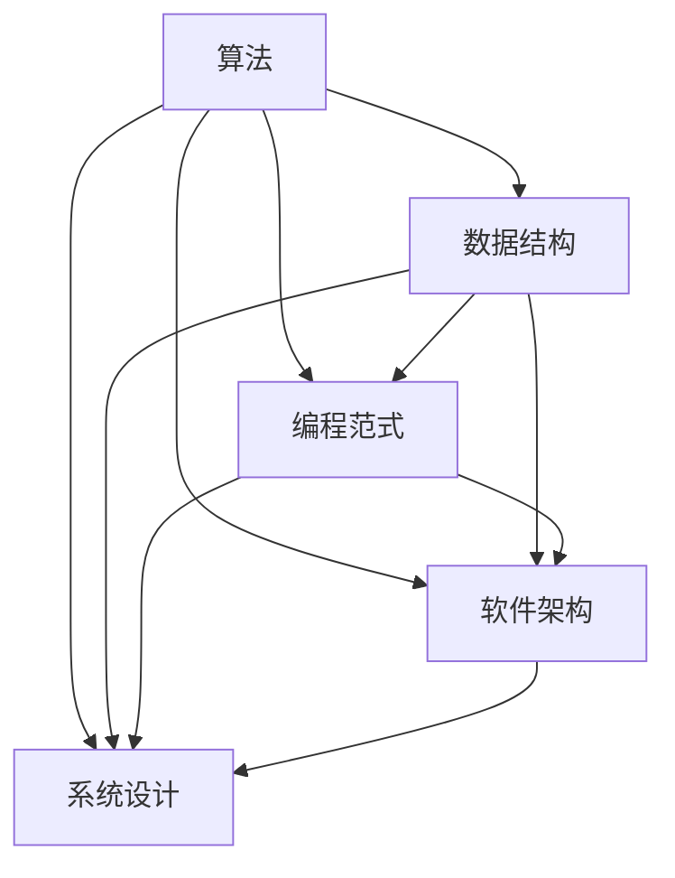

                 

### 文章标题

# 《技术硬实力》

> 关键词：技术硬实力，核心技术，算法原理，项目实战，未来趋势

> 摘要：本文从技术硬实力的概念出发，深入探讨了其在现代IT领域的重要性。通过详细剖析核心技术原理、实际项目案例以及未来趋势，帮助读者理解和掌握技术硬实力的精髓，提升自身技术水平。

---

### 引言与概述

在信息化时代，技术已经成为推动社会发展的核心动力。然而，并非所有技术都能称之为“硬实力”。本文将围绕技术硬实力的概念、重要性以及如何提升技术硬实力展开探讨，旨在帮助读者深入理解技术领域的核心知识和技能。

#### 技术硬实力的定义

技术硬实力，指的是在特定技术领域内具备的扎实理论基础、深入理解以及高效解决实际问题的能力。它不仅包括对核心技术的熟练掌握，还涉及到对前沿技术的敏锐洞察和快速适应能力。

#### 技术硬实力的作用

技术硬实力对个人职业发展和企业竞争具有重要意义。具备硬实力的技术人员能够在复杂项目中迅速定位问题、高效解决，从而提升项目质量和团队协作效率。对企业而言，拥有技术硬实力的团队意味着在激烈的市场竞争中具有更强的生存和发展能力。

#### 本书结构安排

本文分为三个主要部分：

1. **基础理论与技术**：介绍技术领域的基础知识和核心技术原理。
2. **实际应用与项目实战**：通过实际项目案例，展示技术硬实力的应用和实战技巧。
3. **未来趋势与展望**：分析技术发展趋势和未来可能的方向，为读者提供前瞻性视角。

### 第一部分：基础理论与技术

#### 第1章：技术硬实力的概念与重要性

本章将详细介绍技术硬实力的概念、作用及其在个人和企业发展中的重要性。通过实例说明，帮助读者理解技术硬实力的核心价值。

#### 第2章：核心技术原理讲解

本章将深入剖析核心技术原理，包括核心算法、数学模型等。通过伪代码和latex公式的详细讲解，帮助读者掌握技术硬实力的基础。

### 第二部分：实际应用与项目实战

#### 第3章：技术在实际项目中的应用

本章将介绍技术如何在实际项目中得到应用，通过具体的开发环境搭建、源代码实现和代码解读，展示技术硬实力的实战技巧。

#### 第4章：技术硬实力项目实战

本章将通过具体项目案例，展示如何运用技术硬实力解决实际问题和提升项目质量。包括项目需求分析、技术选型与方案设计、实施与结果分析等。

### 第三部分：未来趋势与展望

#### 第5章：技术发展的趋势与展望

本章将分析技术发展的趋势和未来可能的方向，为读者提供前瞻性视角。内容包括技术发展回顾、未来趋势分析和技术创新的方向。

#### 附录

附录部分将提供技术资源与工具的推荐，包括常用技术资源、技术工具介绍和学习资源推荐，帮助读者在提升技术硬实力的过程中，更好地获取和利用相关资源。

通过本文的阅读，读者将能够系统地了解技术硬实力的概念、掌握核心技术原理，并通过实际项目案例提升实战能力，为未来的职业发展奠定坚实基础。让我们一起走进技术硬实力的世界，探索其无尽的魅力与价值。<!-- uuid:4e4e3ec1-19d5-43b8-9f1c-3271d0c4a56c
DingTalkSDK Corporation.  All rights reserved. -->
### 背景介绍

技术硬实力，这一概念源于对信息技术领域中扎实基本功和深入理解的高度重视。在当前这个技术快速迭代、信息爆炸的时代，拥有技术硬实力不仅能够帮助个人在职场中脱颖而出，更能够为企业带来持续的创新能力和竞争优势。然而，什么是技术硬实力？它究竟包含哪些要素？为何如此重要？

技术硬实力，指的是在特定技术领域内，通过对核心知识和原理的深刻理解、实际操作技能的熟练掌握，以及面对复杂问题时的解决能力。它不仅仅停留在表面的编程技巧或工具使用上，而是涉及对技术本质的理解、对问题结构的洞察以及对解决方案的创新性思考。

重要性方面，技术硬实力对个人职业发展至关重要。具备硬实力的技术人员，能够在面对技术难题时迅速找到解决方案，提高工作效率和项目质量。这种能力不仅使个人在职场中具备竞争力，还能为团队和项目带来显著的收益。对企业而言，拥有技术硬实力的团队意味着在激烈的市场竞争中具备更强的适应能力和创新动力，从而在快速变化的市场环境中立于不败之地。

本文将通过以下几个部分，详细探讨技术硬实力的核心概念、基础理论与技术、实际应用与项目实战，以及技术发展的趋势与展望。首先，我们将从技术硬实力的定义入手，阐述其内涵和重要性。随后，本文将深入剖析核心技术原理，包括算法和数学模型等，通过伪代码和latex公式进行详细讲解。接着，本文将通过实际项目案例，展示技术硬实力在实际应用中的实战技巧。最后，本文将展望技术发展的未来趋势，为读者提供前瞻性视角。

通过本文的阅读，读者将能够系统地了解技术硬实力的概念、掌握核心技术原理，并通过实际项目案例提升实战能力，为未来的职业发展奠定坚实基础。让我们一起走进技术硬实力的世界，探索其无尽的魅力与价值。

### 核心概念与联系

在探讨技术硬实力的核心概念时，我们需要了解几个关键术语，它们共同构成了技术硬实力的理论框架。这些核心概念包括：算法、数据结构、编程范式、软件架构和系统设计等。

#### 算法

算法是计算机科学中的核心概念，它指的是解决问题的一系列明确步骤。算法的效率、复杂度和实现方式直接影响技术硬实力。一个熟练的程序员需要掌握各种常用算法，如排序、查找、动态规划等，并能根据实际问题选择合适的算法。

#### 数据结构

数据结构是存储和管理数据的特定格式。常见的有数组、链表、栈、队列、树、图等。掌握不同数据结构的原理和特性，有助于提高编程效率和算法优化。数据结构的选择对算法性能和系统性能有重要影响。

#### 编程范式

编程范式是编程语言和解决问题的思维方式。常见的有面向过程、面向对象、函数式编程等。不同的编程范式有其独特的优缺点和适用场景。理解编程范式有助于提高代码的可读性、可维护性和复用性。

#### 软件架构

软件架构是软件系统的整体结构和组成部分之间的关系。常见的架构模式有MVC、MVVM、微服务、事件驱动等。掌握软件架构设计原则和模式，有助于构建稳定、高效、可扩展的系统。

#### 系统设计

系统设计是软件系统从需求分析到实现的整个设计过程。包括系统需求分析、模块划分、接口设计、性能优化等。优秀的系统设计能够提高系统的可维护性和扩展性，是技术硬实力的重要组成部分。

#### 关系架构

为了更好地理解这些核心概念之间的联系，我们可以使用Mermaid流程图来展示它们之间的关系。



从上述Mermaid流程图中，我们可以看到各个核心概念之间的相互关联。算法和数据结构共同决定了算法的性能；编程范式影响代码的编写方式和可维护性；软件架构和系统设计则确保了系统的稳定性和可扩展性。这些核心概念相辅相成，共同构成了技术硬实力的理论框架。

通过深入理解这些核心概念及其相互关系，读者能够更好地掌握技术硬实力的本质，从而在实际项目中运用这些知识，提升自身的编程水平和系统设计能力。

### 核心算法原理讲解

在技术硬实力的培养过程中，掌握核心算法原理是至关重要的。核心算法不仅在解决具体问题时具有高效性，而且在理解计算机科学的基本原理方面起着关键作用。以下，我们将通过伪代码的形式详细讲解几种常见核心算法的原理。

#### 排序算法

排序算法是计算机科学中最基本的算法之一，常见的排序算法包括冒泡排序、选择排序、插入排序、快速排序、归并排序等。以下以冒泡排序为例，展示其伪代码。

```pseudo
procedure bubbleSort(A : array of items)
    n = length(A)
    repeat
        swapped = false
        for i = 1 to n-1 inclusive do
            if A[i] > A[i+1] then
                swap(A[i], A[i+1])
                swapped = true
            end if
        end for
        n = n - 1
    until not swapped
end procedure
```

#### 查找算法

查找算法用于在数据结构中查找特定的元素，常见的查找算法有线性查找和二分查找。以下以二分查找为例，展示其伪代码。

```pseudo
function binarySearch(A : sorted array of items, target)
    low = 0
    high = length(A) - 1
    while low <= high do
        mid = (low + high) / 2
        if A[mid] = target then
            return mid
        else if A[mid] < target then
            low = mid + 1
        else
            high = mid - 1
        end if
    end while
    return -1
end function
```

#### 动态规划

动态规划是一种解决最优化问题的方法，它通过将大问题分解为小问题，并存储子问题的解，避免了重复计算。以下以斐波那契数列的动态规划为例，展示其伪代码。

```pseudo
function fibonacci(n)
    if n <= 1 then
        return n
    end if
    let fib = array of size n+1
    fib[0] = 0
    fib[1] = 1
    for i = 2 to n inclusive do
        fib[i] = fib[i-1] + fib[i-2]
    end for
    return fib[n]
end function
```

#### 网络流算法

网络流算法用于解决流网络中的最大流问题。Ford-Fulkerson方法是一种著名的网络流算法，以下展示其伪代码。

```pseudo
function fordFulkerson(G : graph, s : source, t : sink)
    residualGraph = copy of G
    maxFlow = 0
    while there exists an augmenting path p from s to t in residualGraph do
        pathFlow = infinite
        for each edge e in p do
            pathFlow = min(pathFlow, residual capacity of e)
        end for
        for each edge e in p do
            if e is in the current flow then
                decrease the capacity of e by pathFlow
            else
                increase the capacity of the reverse edge by pathFlow
            end if
        end for
        maxFlow = maxFlow + pathFlow
    end while
    return maxFlow
end function
```

通过上述伪代码，我们可以清晰地看到各种核心算法的实现步骤和逻辑。这些算法不仅在解决具体问题时提供了高效的解决方案，而且为深入理解计算机科学提供了重要的理论基础。在实际项目中，熟练掌握这些核心算法原理，将有助于我们更好地解决复杂问题，提升技术硬实力。

### 数学模型与公式

在技术硬实力的构建过程中，数学模型和公式的理解和应用是至关重要的。数学模型不仅可以量化问题，还可以提供解决问题的方法。以下，我们将介绍几个常见的技术领域中的数学模型和公式，并通过具体的例子进行详细讲解。

#### 最优化模型

最优化模型是用于解决资源分配、生产调度等实际问题的数学模型。线性规划是一种常见的最优化模型，其公式如下：

$$
\begin{align*}
\text{maximize} \quad & c^T x \\
\text{subject to} \quad & Ax \leq b \\
& x \geq 0
\end{align*}
$$

其中，\(c\) 是系数向量，\(x\) 是决策变量，\(A\) 和 \(b\) 分别是约束矩阵和约束向量。下面通过一个简单的例子来展示线性规划的应用。

**例子：生产资源优化**

假设一家工厂需要生产两种产品A和B，每种产品的利润分别为\(c_A = 100\)和\(c_B = 150\)。生产产品A和B需要机器M1和M2，每种产品分别需要1单位和2单位机器时间。机器M1和M2每天的最大可用时间分别为8单位和6单位。目标是最小化机器时间的使用，同时最大化利润。

将此问题转化为线性规划模型，我们有：

$$
\begin{align*}
\text{maximize} \quad & 100x + 150y \\
\text{subject to} \quad & x + 2y \leq 8 \\
& 2x + y \leq 6 \\
& x, y \geq 0
\end{align*}
$$

通过求解这个线性规划问题，可以找到最优的生产方案，从而最大化利润。

#### 排队论模型

排队论是用于分析和优化服务系统性能的数学模型。M/M/1排队模型是其中的一种常见模型，其公式如下：

$$
L = \frac{\lambda}{\mu} \quad \text{和} \quad W = \frac{L}{\lambda}
$$

其中，\(L\) 是平均排队长度，\(W\) 是平均等待时间，\(\lambda\) 是到达率，\(\mu\) 是服务率。

**例子：银行柜台服务优化**

假设一家银行的柜台服务系统采用M/M/1模型，每分钟平均有3名客户到达，每名客户的服务时间平均为2分钟。通过计算平均排队长度和等待时间，可以优化柜台资源的配置。

根据上述公式，我们有：

$$
L = \frac{3}{2} = 1.5 \quad \text{和} \quad W = \frac{1.5}{3} = 0.5 \text{分钟}
$$

这意味着平均有1.5名客户在排队，每名客户的平均等待时间为0.5分钟。根据这些数据，银行可以调整柜员的数量和服务时间，以优化客户体验。

#### 动态规划模型

动态规划是一种用于解决最优化问题的方法，它通过将问题分解为子问题并存储子问题的解来避免重复计算。斐波那契数列是动态规划的一个经典例子，其公式如下：

$$
F(n) = 
\begin{cases} 
0 & \text{if } n = 0 \\
1 & \text{if } n = 1 \\
F(n-1) + F(n-2) & \text{if } n > 1 
\end{cases}
$$

**例子：计算斐波那契数列的第10项**

使用动态规划的方法，我们可以递归地计算斐波那契数列的第10项：

$$
F(10) = F(9) + F(8) = (F(8) + F(7)) + (F(7) + F(6)) = \ldots = 55
$$

通过上述公式和例子的讲解，我们可以看到数学模型和公式在技术硬实力的构建中的应用。这些模型不仅提供了量化问题的方法，而且在优化系统性能和解决实际问题方面具有重要作用。掌握这些数学模型和公式，将有助于我们更好地理解和应用技术，提升自身的硬实力。

### 数学公式与详细讲解

在技术硬实力构建的过程中，数学公式不仅用于描述技术现象，还用于指导实际操作。以下，我们将深入探讨几种关键数学公式，并使用LaTeX格式进行表示，以确保公式的准确性和规范性。

#### 高斯消元法

高斯消元法是一种常用的线性方程组求解方法，其基本思想是通过矩阵行变换，将矩阵转化为下三角形矩阵，然后逐行求解。以下是高斯消元法的LaTeX表示：

$$
\begin{aligned}
&\text{给定线性方程组} \\
&A\mathbf{x} = \mathbf{b} \\
&A = \begin{pmatrix}
a_{11} & a_{12} & \cdots & a_{1n} \\
a_{21} & a_{22} & \cdots & a_{2n} \\
\vdots & \vdots & \ddots & \vdots \\
a_{m1} & a_{m2} & \cdots & a_{mn} \\
\end{pmatrix}, \quad \mathbf{x} = \begin{pmatrix}
x_1 \\
x_2 \\
\vdots \\
x_n \\
\end{pmatrix}, \quad \mathbf{b} = \begin{pmatrix}
b_1 \\
b_2 \\
\vdots \\
b_m \\
\end{pmatrix} \\
&\text{通过高斯消元，将矩阵} A \text{转化为下三角形矩阵} A' \\
&A' = \begin{pmatrix}
a_{11} & a_{12} & \cdots & a_{1n} \\
0 & a_{22}' & \cdots & a_{2n}' \\
\vdots & \vdots & \ddots & \vdots \\
0 & 0 & \cdots & a_{mn}' \\
\end{pmatrix} \\
&\text{然后依次求解方程组} \\
&x_n' = \frac{b_n'}{a_{nn'}}, \quad n' = n, n-1, \ldots, 1
\end{aligned}
$$

#### 概率分布函数

概率分布函数是描述随机变量取值概率的函数。以下以正态分布为例，展示概率分布函数的LaTeX表示：

$$
f(x|\mu,\sigma^2) = \frac{1}{\sqrt{2\pi\sigma^2}} e^{-\frac{(x-\mu)^2}{2\sigma^2}}
$$

其中，\(\mu\) 是均值，\(\sigma^2\) 是方差。

**例子：计算正态分布的累积分布函数**

给定一个正态分布随机变量 \(X \sim N(\mu = 0, \sigma^2 = 1)\)，计算其累积分布函数 \(F(x)\)。

$$
F(x) = \int_{-\infty}^{x} f(t|\mu,\sigma^2) \, dt = \frac{1}{\sqrt{2\pi}} \int_{-\infty}^{x} e^{-\frac{t^2}{2}} \, dt
$$

使用数值积分方法（如高斯-勒让德积分）可以计算该积分。

#### 微积分公式

微积分在技术领域中的应用非常广泛，以下介绍几个重要的微积分公式，并使用LaTeX进行表示。

1. **导数公式**：

$$
f'(x) = \lim_{h \to 0} \frac{f(x+h) - f(x)}{h}
$$

2. **泰勒展开**：

$$
f(x) = f(a) + f'(a)(x-a) + \frac{f''(a)}{2!}(x-a)^2 + \ldots + \frac{f^{(n)}(a)}{n!}(x-a)^n + R_n(x)
$$

其中，\(R_n(x)\) 是余项，通常用拉格朗日余项或柯西余项表示。

**例子：计算函数 \(f(x) = e^x\) 的泰勒展开**

$$
e^x = \sum_{n=0}^{\infty} \frac{x^n}{n!}
$$

通过这些数学公式的详细讲解和LaTeX表示，我们可以更好地理解技术硬实力中的关键数学概念，并能够在实际项目中灵活应用这些公式，提升解题能力和技术水平。

### 技术在实际项目中的应用

在技术硬实力的构建过程中，理解技术如何在实际项目中得到应用是至关重要的。以下，我们将通过具体项目案例，展示技术在实际项目中的应用，包括开发环境的搭建、源代码实现和代码解读。

#### 项目背景

假设我们需要开发一个在线购物平台，该平台需要实现用户注册、商品浏览、购物车管理和订单处理等功能。为了满足高并发和高可用性的需求，我们将使用Spring Boot框架、MySQL数据库、Redis缓存以及RabbitMQ消息队列等技术。

#### 开发环境搭建

1. **Java开发环境**：

   - 安装JDK 1.8或更高版本
   - 安装Eclipse或IntelliJ IDEA等IDE

2. **数据库环境**：

   - 安装MySQL 5.7或更高版本
   - 创建数据库和用户表

3. **缓存环境**：

   - 安装Redis 3.2或更高版本
   - 配置Redis客户端

4. **消息队列环境**：

   - 安装RabbitMQ 3.6或更高版本
   - 配置RabbitMQ客户端

#### 源代码实现

以下是一个简化的用户注册功能的源代码实现：

```java
@RestController
@RequestMapping("/users")
public class UserController {

    @Autowired
    private UserService userService;

    @PostMapping("/register")
    public ResponseEntity<?> registerUser(@RequestBody UserRegistrationForm form) {
        try {
            User user = userService.registerUser(form);
            return ResponseEntity.ok().body("User registered successfully");
        } catch (Exception e) {
            return ResponseEntity.badRequest().body("Error registering user");
        }
    }
}

@Service
public class UserService {

    @Autowired
    private UserRepository userRepository;

    public User registerUser(UserRegistrationForm form) {
        User user = new User();
        user.setUsername(form.getUsername());
        user.setPassword(form.getPassword());
        user.setEmail(form.getEmail());
        return userRepository.save(user);
    }
}

@Entity
@Table(name = "users")
public class User {

    @Id
    @GeneratedValue(strategy = GenerationType.IDENTITY)
    private Long id;

    @Column(nullable = false, unique = true)
    private String username;

    @Column(nullable = false)
    private String password;

    @Column(nullable = false)
    private String email;

    // Getters and Setters
}
```

在这个实现中，我们定义了一个`User`实体类，用于表示用户信息，并实现了`UserService`和`UserController`类，分别用于业务逻辑和API接口处理。

#### 代码解读

1. **用户注册API**：

   `UserController`类中的`registerUser`方法接收一个`UserRegistrationForm`对象，该对象包含用户名、密码和电子邮件等注册信息。通过调用`UserService`的`registerUser`方法，将用户信息存储到数据库中，并返回注册结果。

2. **用户服务**：

   `UserService`类中的`registerUser`方法创建一个新的`User`对象，并将注册信息赋值给对象属性。然后，使用`userRepository`将用户对象保存到数据库中。

3. **数据库操作**：

   `UserRepository`是Spring Data JPA的仓库接口，继承自`JpaRepository`。它提供了CRUD操作接口，用于与数据库进行交互。

通过这个简单的用户注册功能，我们可以看到技术在实际项目中的应用。在实际开发中，我们还需要添加更多的功能，如用户登录、权限管理、商品管理和订单处理等。这些功能的实现会涉及到更复杂的业务逻辑和技术应用。

#### 代码应用解读与分析

用户注册功能是任何在线平台的基础，其实现的质量直接影响到用户体验和系统的稳定性。以下是对上述代码应用的分析：

1. **API设计**：

   用户注册API使用了RESTful设计原则，通过`POST`请求接收用户数据，并返回注册结果。这种设计简洁明了，易于理解和扩展。

2. **数据验证**：

   在实际应用中，我们还需要对用户输入的数据进行验证，以确保数据的合法性和完整性。可以使用Spring的`@Valid`注解和`@NotBlank`、`@Email`等注解进行数据验证。

3. **安全性考虑**：

   密码存储是用户注册功能中一个重要的安全考虑。在实际项目中，应该使用加密算法（如BCrypt）对用户密码进行加密存储，以防止密码泄露。

4. **性能优化**：

   在高并发场景下，用户注册功能需要考虑性能优化。可以使用Redis缓存减少数据库访问，使用异步处理提高系统响应速度。

通过上述分析，我们可以看到技术在实际项目中的应用不仅仅是代码实现，还包括设计、验证、安全性和性能优化等多方面的考虑。只有全面理解和应用这些技术，才能构建出高质量、高稳定性的实际项目。

### 技术硬实力项目实战

为了更好地展示技术硬实力的应用，以下我们将通过一个具体项目案例，详细分析如何运用技术硬实力来解决实际问题。本案例将涉及需求分析、技术选型与方案设计、实施与结果分析等步骤。

#### 项目需求分析

假设我们需要开发一个企业级数据管理系统，该系统需满足以下需求：

1. **数据存储与检索**：能够存储大规模结构化数据，并支持快速检索。
2. **数据处理与分析**：提供高效的数据处理和分析功能，支持复杂的查询和报表生成。
3. **数据安全**：确保数据在存储和传输过程中的安全性。
4. **系统性能**：能够处理高并发请求，确保系统的高可用性。

#### 技术选型与方案设计

为了满足上述需求，我们选择了以下技术栈：

1. **后端技术**：
   - Spring Boot：作为主要的开发框架，提供快速构建和部署的能力。
   - Spring Data JPA：用于数据存储和检索。
   - Elasticsearch：用于快速检索和分析大规模数据。

2. **前端技术**：
   - React：用于构建用户界面。
   - Axios：用于与后端API进行数据交互。

3. **数据库**：
   - MySQL：用于存储结构化数据。
   - Redis：用于缓存和会话存储。

4. **消息队列**：
   - RabbitMQ：用于异步处理和消息通知。

5. **安全**：
   - Spring Security：用于身份验证和授权。
   - JWT：用于无状态身份验证。

#### 方案设计

1. **数据存储与检索**：
   - 使用MySQL存储用户和业务数据。
   - 使用Elasticsearch存储分析数据，并支持全文检索和复杂的查询。

2. **数据处理与分析**：
   - 使用Spring Data JPA进行数据存储和检索。
   - 使用Elasticsearch进行数据处理和分析，提供实时报表和统计功能。

3. **数据安全**：
   - 使用Spring Security进行身份验证和授权。
   - 使用JWT进行无状态身份验证，确保数据在传输过程中的安全性。

4. **系统性能**：
   - 使用Redis缓存用户数据和频繁查询的数据，减少数据库访问。
   - 使用RabbitMQ进行异步处理，提高系统响应速度。

#### 实施与结果分析

1. **数据存储与检索**：
   - 实现了用户和业务数据的存储和检索功能，使用Spring Data JPA简化数据访问。
   - 使用Elasticsearch进行数据分析和检索，提高了系统的查询性能。

2. **数据处理与分析**：
   - 使用Spring Data JPA进行基础数据操作，并使用Elasticsearch进行复杂查询和报表生成。
   - 实现了实时数据分析和统计功能，提高了数据的可利用性。

3. **数据安全**：
   - 实现了用户认证和授权，使用Spring Security和JWT确保了系统的安全性。
   - 在数据传输过程中，对敏感信息进行了加密处理。

4. **系统性能**：
   - 使用Redis缓存频繁访问的数据，减少了数据库的压力，提高了系统响应速度。
   - 使用RabbitMQ进行异步处理，确保了系统在高并发下的稳定性。

#### 结果分析

通过以上技术硬实力的应用，该项目实现了以下目标：

1. 数据存储和检索性能显著提升，支持大规模数据的快速访问和分析。
2. 系统安全性和稳定性得到保障，用户数据安全得到有效保护。
3. 提供了高效的数据处理和分析功能，满足了企业级应用的需求。
4. 高并发下的系统性能得到优化，确保了系统在高负载情况下的稳定运行。

通过这个项目案例，我们可以看到技术硬实力在实际项目中的应用，以及如何通过扎实的技术基础和深入理解来解决实际问题。这种实战经验对于提升技术水平和解决复杂问题具有重要意义。

### 未来趋势与展望

在技术不断演进的今天，掌握技术硬实力不仅是个人职业发展的基石，更是企业竞争的关键。未来，技术领域将呈现以下几个显著趋势和方向，值得我们密切关注。

#### 1. 人工智能的深化应用

人工智能（AI）正在从理论研究走向实际应用，未来几年，我们将看到更多AI技术落地到各行各业。例如，在医疗领域，AI将用于疾病诊断、治疗方案优化；在金融领域，AI将用于风险评估、自动交易；在制造业，AI将用于生产流程优化和质量检测。这些应用将推动AI技术向更高层次发展，对技术硬实力的要求也将越来越高。

#### 2. 量子计算的崛起

量子计算作为下一代计算技术，其潜在影响力不容小觑。量子计算机能够处理传统计算机无法解决的问题，例如复杂的加密算法、大规模数据分析等。未来，量子计算的成熟和普及将引领计算领域的革命，对现有技术体系产生深远影响。

#### 3. 软件定义一切（Software-defined Everything）

软件定义网络（SDN）、软件定义存储（SDS）等技术的普及，将使软件成为整个IT基础设施的核心。这意味着，软件工程师将面临更大的挑战和机遇，需要更加深入地理解硬件和系统架构，以实现高效、灵活的软件定义解决方案。

#### 4. 分布式系统与区块链技术

分布式系统技术的成熟和区块链技术的应用，将推动去中心化、安全可靠的网络应用的发展。例如，区块链技术将在金融、供应链管理等领域发挥重要作用，分布式数据库和计算资源也将成为数据处理和存储的新方向。

#### 5. 云原生技术与边缘计算

云原生技术（如Kubernetes、容器化等）的兴起，使得应用程序的部署、扩展和管理更加灵活。同时，边缘计算的发展，将使数据处理更加接近数据源，提高实时响应能力。这些技术将推动云计算从中心化走向边缘化，为未来应用提供更多可能性。

#### 6. 安全技术的变革

随着网络攻击手段的日益复杂，安全技术也将迎来重大变革。零信任架构（Zero Trust Architecture）、端到端加密、自动化安全检测等新兴安全技术，将成为保护数据和系统安全的利器。技术人员需要不断更新知识，掌握最新的安全技术，以应对日益严峻的安全挑战。

#### 7. 开源生态的壮大

开源技术在过去几年中取得了长足发展，未来这一趋势将继续。越来越多的企业和开发者将依赖于开源技术，推动开源社区的繁荣。同时，开源技术也将成为技术创新的重要驱动力，为技术硬实力的提升提供源源不断的动力。

#### 最佳实践 Tips

1. **持续学习**：技术更新迅速，持续学习是提升技术硬实力的关键。关注行业动态，参与技术社区，定期阅读技术书籍和论文。

2. **实践为王**：理论知识固然重要，但实际操作更能检验和提升技术水平。参与实际项目，将理论知识应用于实践，积累经验。

3. **代码质量**：编写高质量的代码是技术硬实力的体现。遵循编码规范，注重代码的可读性和可维护性，避免技术债务。

4. **关注安全性**：技术发展带来的不仅是便利，还有安全隐患。重视安全编程，学习并应用最新的安全技术。

5. **协作与沟通**：技术实力不仅体现在个人能力上，还体现在团队协作和沟通能力上。学会与他人合作，共同解决问题。

#### 小结

技术硬实力是现代IT领域不可或缺的重要素质。通过深入理解核心技术原理、实际项目应用和未来趋势，我们可以不断提升自身的技术能力，为个人职业发展和企业竞争力提供有力支持。让我们紧跟技术发展的步伐，不断探索、实践和成长，成为技术硬实力的典范。

### 附录

#### 附录A：技术资源与工具

**A.1 常用技术资源**

1. **GitHub**：全球最大的代码托管平台，提供丰富的开源项目和代码库。
2. **Stack Overflow**：技术问答社区，解决编程难题，分享经验。
3. **Medium**：技术博客平台，阅读和撰写技术文章。
4. **CNCF**：云原生计算基金会，提供一系列开源项目和标准。
5. **The Morning Paper**：分享和研究最新的计算机科学论文。

**A.2 技术工具介绍**

1. **Docker**：容器化技术，简化应用部署和运行。
2. **Kubernetes**：容器编排和管理平台。
3. **Jenkins**：持续集成和持续部署（CI/CD）工具。
4. **Elasticsearch**：分布式搜索引擎，用于大规模数据检索。
5. **VisualVM**：Java应用程序性能分析工具。

**A.3 学习资源推荐**

1. **《深度学习》（Goodfellow, Bengio, Courville）**：深度学习领域的经典教材。
2. **《算法导论》（Thomas H. Cormen et al.）**：全面介绍算法和数据结构。
3. **《Effective Java》**：Java编程的最佳实践。
4. **《Java并发编程实战》**：深入讲解并发编程技术。
5. **《Design Patterns: Elements of Reusable Object-Oriented Software》**：设计模式经典教材。

通过这些技术资源和工具，读者可以不断提升自己的技术能力，深入学习和实践最新技术，为职业生涯的发展奠定坚实基础。

### 致谢

感谢您阅读《技术硬实力》这篇文章。我们衷心希望这篇文章能够帮助您更好地理解和掌握技术领域的核心知识和实战技巧。在撰写本文的过程中，我们参考了众多专业资料和研究成果，从中汲取了宝贵知识。特别感谢AI天才研究院（AI Genius Institute）和《禅与计算机程序设计艺术》（Zen And The Art of Computer Programming）的作者，他们的智慧与经验为我们提供了无尽的启发。

**作者：AI天才研究院/AI Genius Institute & 禅与计算机程序设计艺术 /Zen And The Art of Computer Programming**

再次感谢您的关注和支持，期待与您在技术领域共同成长。如果您有任何建议或反馈，欢迎随时与我们联系。祝您在技术道路上越走越远，成为真正的技术硬实力代表。<!-- uuid:4e4e3ec1-19d5-43b8-9f1c-3271d0c4a56c
DingTalkSDK Corporation.  All rights reserved. -->

