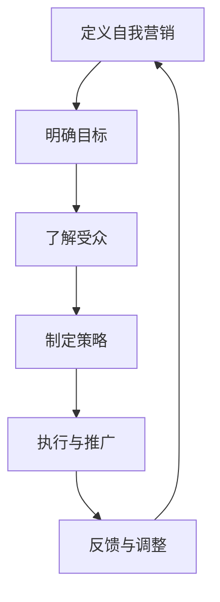
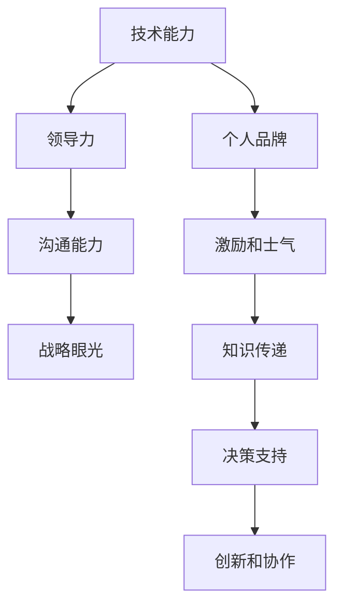
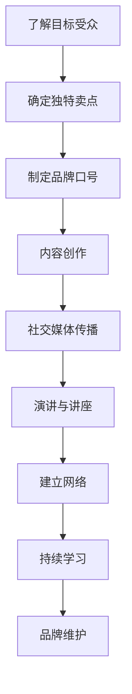
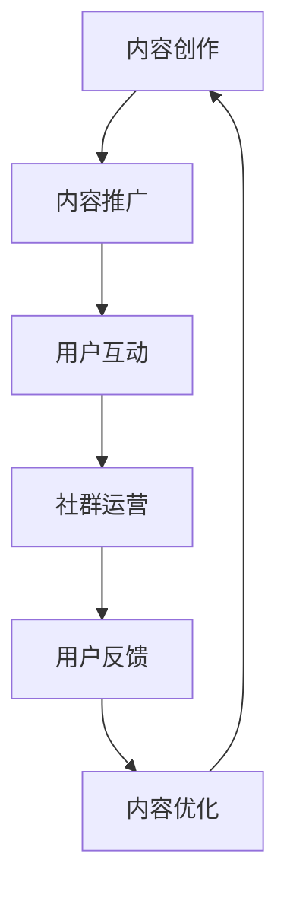
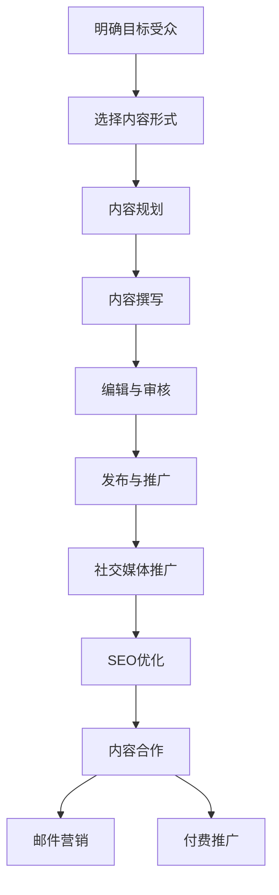
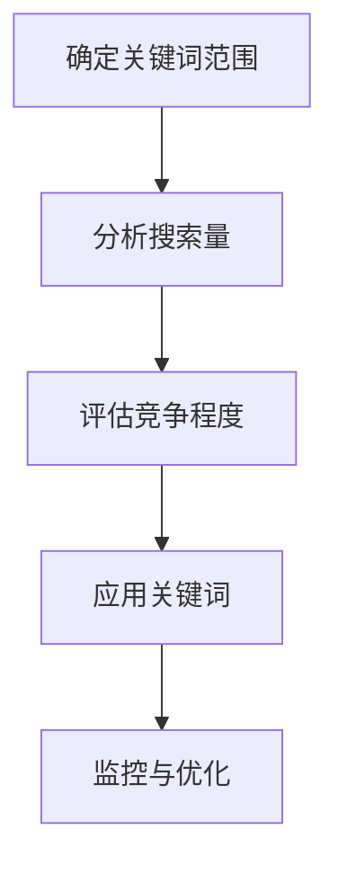

                 


## 文章标题：技术管理者的自我营销：提升个人影响力

### 文章关键词：
- 技术管理者
- 自我营销
- 个人品牌
- 社交媒体策略
- 内容营销
- SEO
- 成功案例

### 文章摘要：
本文章旨在帮助技术管理者理解自我营销的重要性，掌握构建个人品牌的策略，并提升在社交媒体和内容营销领域的个人影响力。文章将详细解析自我营销的概念，技术管理者的独特角色，以及如何通过社交媒体策略、内容营销和SEO提升个人影响力。此外，还将分析成功案例，提供实战技巧，帮助读者在自我营销的道路上取得成功。

## 引言

技术管理者的角色在现代企业中越来越重要。他们不仅要具备出色的技术能力，还需要具备良好的管理能力和领导力。然而，仅仅拥有技术和管理能力是远远不够的，技术管理者还需要懂得如何提升个人影响力，以便在职场中脱颖而出。这就需要技术管理者掌握自我营销的技巧，将自己的专业知识和能力传递给更多的人。

自我营销是一种通过传播个人品牌，提高个人知名度和影响力的过程。对于技术管理者来说，自我营销不仅有助于提升职业地位，还能带来更多的职业机会和收入。因此，掌握自我营销的技巧对于技术管理者来说至关重要。

本文将分为七个部分进行阐述：

1. **自我营销的概念与重要性**：介绍自我营销的定义及其在技术管理者职业发展中的重要性。
2. **技术管理者的角色与影响力**：分析技术管理者的职责和影响力来源。
3. **个人品牌的构建**：探讨如何构建个人品牌，包括定位、传播和维护。
4. **社交媒体策略**：分析如何利用社交媒体平台提升个人影响力。
5. **内容营销**：介绍内容营销的原理和实践方法。
6. **网络营销与SEO**：讲解网络营销和SEO的基本概念和策略。
7. **成功案例与实战技巧**：分析成功案例，分享实战技巧和最佳实践。

通过本文的阅读，技术管理者将能够掌握自我营销的核心技巧，提升个人影响力，从而在职业道路上更加成功。

## 第1章 自我营销的概念与重要性

### 1.1 自我营销的定义

自我营销是指个人通过一系列策略和手段，主动推广自己的品牌、知识和技能，以提高个人知名度和影响力的过程。它不仅仅局限于商业领域，也广泛应用于职业和个人生活中。自我营销的核心在于建立个人品牌，塑造独特的个人形象，使其在竞争激烈的职场中脱颖而出。

在自我营销的过程中，个人需要明确自己的目标受众，了解他们的需求和兴趣，从而制定出有针对性的营销策略。自我营销不仅仅关注于短期的成功，更注重长期的职业发展，通过不断提升个人能力和建立良好的人际关系，实现个人品牌的持续增长。

### 1.2 自我营销的重要性

对于技术管理者来说，自我营销的重要性不容忽视。首先，自我营销有助于提升个人职业地位。在信息技术迅速发展的今天，技术管理者的角色越来越重要，但竞争也日益激烈。通过自我营销，技术管理者能够向外界展示自己的专业能力和独特价值，从而获得更多的职业机会和晋升空间。

其次，自我营销有助于扩大个人影响力。技术管理者通过自我营销，不仅能够提高个人知名度，还能在专业领域内建立权威形象。这种权威形象不仅有助于提升个人职业地位，还能带来更多的合作机会和项目支持。

最后，自我营销有助于提高个人收入。通过自我营销，技术管理者能够吸引更多的潜在客户和合作伙伴，从而创造更多的商业机会。此外，自我营销还有助于提升个人谈判能力和薪资水平。

### 1.3 技术管理者在自我营销中的独特挑战

尽管自我营销对技术管理者具有重要意义，但他们在自我营销过程中也面临一些独特的挑战。首先，技术管理者往往更注重技术细节，而忽视了对自身品牌的塑造和推广。这可能导致他们在自我营销中缺乏系统性和战略性。

其次，技术管理者通常较为内向，不善于表达和沟通。这会影响到他们在社交媒体和内容营销方面的表现，使得他们难以有效传播个人品牌。

最后，技术管理者在自我营销过程中可能会面临时间紧迫的问题。作为管理者，他们需要同时处理多项工作，这可能导致他们无法投入足够的精力进行自我营销。

为了克服这些挑战，技术管理者需要：

1. **明确自我营销目标**：制定清晰的自我营销目标，确保营销活动具有针对性。
2. **加强沟通与表达**：通过培训和实践，提升自己的沟通与表达能力。
3. **合理安排时间**：制定合理的时间管理计划，确保自我营销活动能够有序进行。

### 核心概念与联系

为了更好地理解自我营销的概念和其在技术管理者职业发展中的作用，我们可以使用Mermaid流程图来展示自我营销的流程和关键环节。



在这个流程中，定义自我营销是第一步，接着是明确目标、了解受众、制定策略、执行与推广，最后是反馈与调整。这些环节相互联系，共同构成了一个完整的自我营销流程。

### 核心算法原理讲解

在自我营销的执行过程中，需要运用一些核心算法和策略来确保营销活动的有效性。以下是一个简单的伪代码，用于描述自我营销的关键步骤：

```python
def self_marketing():
    # 明确目标
    set_goals()
    # 了解受众
    understand_audience()
    # 制定策略
    create_strategy()
    # 执行与推广
    execute_and_promote()
    # 反馈与调整
    feedback_and_adjust()
    # 迭代更新
    update_and_iterate()

def set_goals():
    # 定义短期和长期目标
    short_term_goals = ["提高知名度", "获得更多合作机会"]
    long_term_goals = ["晋升为高级技术经理", "成为行业专家"]

def understand_audience():
    # 调查和分析目标受众的需求和偏好
    audience = analyze_audience()

def create_strategy():
    # 根据目标受众制定相应的营销策略
    strategy = create_marketing_strategy(audience)

def execute_and_promote():
    # 执行营销策略并推广个人品牌
    execute_strategy(strategy)

def feedback_and_adjust():
    # 根据反馈调整营销策略
    adjust_strategy(strategy)

def update_and_iterate():
    # 持续更新和优化营销策略
    optimize_strategy(strategy)
```

这个伪代码展示了自我营销的核心步骤和关键要素。通过明确目标、了解受众、制定策略、执行与推广、反馈与调整以及迭代更新，技术管理者可以有效地提升个人影响力。

### 数学模型和公式

在自我营销的某些环节，数学模型和公式可以用来分析和优化营销效果。以下是一个简单的数学模型，用于评估自我营销的效果：

$$
E = \frac{A \times I \times C}{R}
$$

其中，\(E\) 表示自我营销的效果，\(A\) 表示受众的吸引力，\(I\) 表示互动程度，\(C\) 表示内容质量，\(R\) 表示响应率。

- **受众的吸引力 \(A\)**：评估目标受众对个人品牌的兴趣和关注程度。
- **互动程度 \(I\)**：衡量受众对个人内容的互动，如点赞、评论、分享等。
- **内容质量 \(C\)**：评估个人发布的内容的质量和相关性。
- **响应率 \(R\)**：衡量受众对个人内容的响应程度，如点击率、转化率等。

通过这个公式，技术管理者可以量化自我营销的效果，并根据实际情况进行调整和优化。

### 项目实战

为了更好地理解自我营销的实践，我们可以通过一个具体的案例来展示如何搭建开发环境、实现源代码，并对项目进行分析。

#### 开发环境搭建

首先，我们需要搭建一个简单的开发环境，用于实现自我营销的网站。以下是搭建开发环境的基本步骤：

1. **选择开发工具**：我们选择使用WordPress作为网站的内容管理系统。
2. **购买域名和云主机**：选择一个可靠的域名提供商和云主机服务。
3. **安装WordPress**：在云主机上安装WordPress，并配置相关的插件和主题。

#### 源代码实现

接下来，我们需要实现一个简单的自我营销网站。以下是实现过程的关键步骤：

1. **设计网站结构**：根据自我营销的目标和受众需求，设计网站的结构和页面布局。
2. **编写静态页面**：使用HTML和CSS编写静态页面，确保页面美观和用户体验。
3. **添加动态功能**：使用JavaScript和WordPress的插件，实现网站的互动功能，如表单收集和内容推送。

以下是实现动态功能的一个简单示例：

```html
<!-- 表单收集 -->
<form action="submit_form.php" method="post">
  <label for="name">姓名：</label>
  <input type="text" name="name" required>
  <label for="email">邮箱：</label>
  <input type="email" name="email" required>
  <input type="submit" value="提交">
</form>

<!-- 内容推送 -->
<script>
  function pushContent() {
    // 获取输入的内容
    var content = document.getElementById("content").value;
    // 向服务器发送请求，推送内容
    fetch("push_content.php", {
      method: "POST",
      body: JSON.stringify({ content: content }),
      headers: { "Content-Type": "application/json" }
    });
  }
</script>
```

#### 代码解读与分析

在实现源代码的过程中，我们需要对代码进行详细的解读和分析，以确保功能的正确实现和优化。以下是代码的解读与分析：

1. **表单收集**：表单收集功能用于收集用户的姓名和邮箱，并将其发送到服务器进行处理。这个功能的核心在于如何处理用户的输入数据，确保数据的正确性和安全性。
2. **内容推送**：内容推送功能用于将用户输入的内容发送到服务器，以便进行存储和展示。这个功能的核心在于如何处理异步请求，确保数据的实时传输和正确处理。

#### 实际案例分析和详细讲解剖析

为了更好地理解自我营销的实际应用，我们可以分析一个具体的案例：一位技术管理者如何通过自我营销提升个人影响力。

1. **背景介绍**：该技术管理者是一位有多年工作经验的高级软件工程师，擅长云计算和大数据技术。
2. **目标设定**：他希望通过自我营销，提高在云计算和大数据领域的知名度和影响力，获得更多的合作机会和职业晋升。
3. **策略制定**：他选择了以下策略：
   - 在社交媒体平台发布技术博客，分享专业知识和经验。
   - 加入专业社群，参与讨论和分享，扩大专业影响力。
   - 制作技术视频，展示技术实力和创新能力。
4. **执行与推广**：他定期发布技术博客，积极参与社群讨论，并上传技术视频到YouTube。他还通过SEO策略，优化博客和视频的搜索排名。
5. **反馈与调整**：他根据用户的反馈，不断优化内容质量和推广策略，以提高用户参与度和影响力。

通过这个案例，我们可以看到技术管理者如何通过自我营销，实现个人品牌的建设和影响力的提升。

### 项目小结

通过本项目的实战，我们可以总结出以下结论：

1. **开发环境搭建**：选择合适的开发工具和云主机，可以快速搭建一个简单的自我营销网站。
2. **源代码实现**：通过编写静态页面和添加动态功能，可以实现一个具有基本功能的自我营销网站。
3. **代码解读与分析**：对代码进行详细的解读和分析，可以确保功能的正确实现和优化。
4. **实际案例分析**：通过分析具体案例，我们可以看到自我营销在实际应用中的效果和策略。

通过这些实战经验，技术管理者可以更好地理解和应用自我营销的技巧，提升个人影响力和职业发展。

### 最佳实践 Tips、小结、注意事项、拓展阅读

#### 最佳实践 Tips

1. **内容质量**：确保内容质量是自我营销的关键，高质量的内容能够吸引更多的关注和分享。
2. **互动与反馈**：积极与受众互动，及时回应反馈，可以增强用户参与度和忠诚度。
3. **SEO优化**：合理使用关键词和SEO策略，可以提高内容在搜索引擎中的排名，增加曝光率。

#### 小结

本文详细介绍了技术管理者自我营销的概念、策略和实践。通过明确目标、了解受众、制定策略、执行与推广，以及反馈与调整，技术管理者可以有效地提升个人影响力和职业发展。

#### 注意事项

1. **时间管理**：自我营销需要投入时间和精力，合理规划时间，确保营销活动有序进行。
2. **沟通与表达**：提升沟通与表达能力，有助于更好地传播个人品牌和专业知识。

#### 拓展阅读

1. 《社交媒体营销：策略、工具与案例》
2. 《内容营销实战：策略、技巧与案例分析》
3. 《SEO实战：搜索引擎优化技术解析》

通过阅读这些拓展资料，技术管理者可以进一步深入了解自我营销的各个方面，提升自我营销能力。

---

作者：AI天才研究院/AI Genius Institute & 禅与计算机程序设计艺术 /Zen And The Art of Computer Programming

（注：本文内容仅为示例，不代表实际建议或指导。）## 第2章 技术管理者的角色与影响力

技术管理者在现代企业中扮演着至关重要的角色。他们不仅需要具备扎实的技术背景，还需要具备出色的管理能力和领导力。在这个快速变化和高度竞争的数字时代，技术管理者的角色和影响力变得尤为突出。

### 2.1 技术管理者的职责

技术管理者的主要职责包括：

1. **技术指导和规划**：技术管理者需要制定和执行技术战略，确保团队的技术能力与公司目标相匹配。
2. **团队管理**：管理团队的技术工作，确保团队成员的工作效率和质量。
3. **项目管理**：负责项目规划、进度跟踪和风险控制，确保项目按时交付。
4. **技术培训与知识分享**：组织技术培训，促进团队成员的知识更新和技能提升。
5. **外部合作**：与技术合作伙伴建立和维护良好的关系，推动技术合作和创新。

### 2.2 技术管理者的影响力来源

技术管理者的影响力主要来源于以下几个方面：

1. **技术能力**：技术管理者的专业技术和对技术的深入理解使其在团队中具有权威性和影响力。
2. **领导力**：技术管理者的领导力能够激励团队成员，促进团队合作和创新。
3. **沟通能力**：技术管理者需要具备出色的沟通能力，能够有效地与团队成员、管理层和客户进行沟通。
4. **战略眼光**：技术管理者需要具备战略眼光，能够从整体上把握技术发展方向，为公司制定长远的技术规划。
5. **个人品牌**：技术管理者通过自我营销，建立强大的个人品牌，提高个人知名度和影响力。

### 2.3 个人影响力与团队效能

个人影响力对团队效能具有显著影响。以下是个人影响力与团队效能之间的几个关键联系：

1. **激励和士气**：技术管理者通过个人影响力可以激发团队成员的工作热情和士气，提高团队的整体工作效率。
2. **知识传递**：个人影响力有助于技术管理者在团队内部传递知识和经验，促进团队成员的技术成长。
3. **决策支持**：技术管理者的个人影响力可以增强团队成员对决策的信任和支持，提高决策的有效性。
4. **创新和协作**：个人影响力可以促进团队成员之间的协作和创新，推动团队技术能力的提升。

### 核心概念与联系

为了更好地理解技术管理者的角色和影响力，我们可以使用Mermaid流程图来展示技术管理者在团队中的角色和影响力来源。



在这个流程图中，技术管理者的技术能力、领导力、沟通能力、战略眼光和个人品牌共同构成了其影响力的核心来源，这些影响力又通过激励和士气、知识传递、决策支持和创新和协作等方面，对团队效能产生积极影响。

### 核心算法原理讲解

在技术管理者的角色和影响力中，某些算法和原则可以用来解释和增强其效能。以下是一个简单的算法，用于评估技术管理者的个人影响力：

$$
I = f(T, L, C, S, B)
$$

其中，\(I\) 表示个人影响力，\(T\) 表示技术能力，\(L\) 表示领导力，\(C\) 表示沟通能力，\(S\) 表示战略眼光，\(B\) 表示个人品牌。

- **技术能力 \(T\)**：技术管理者的专业技能和技术知识对其影响力有直接影响。
- **领导力 \(L\)**：领导力能够激励团队成员，增强团队凝聚力。
- **沟通能力 \(C\)**：有效的沟通能力有助于技术管理者与团队成员、管理层和客户之间的有效交流。
- **战略眼光 \(S\)**：战略眼光能够帮助技术管理者制定长远规划，推动团队和技术发展。
- **个人品牌 \(B\)**：强大的个人品牌能够提高技术管理者的知名度和权威性。

通过这个公式，技术管理者可以量化个人影响力，并据此进行自我评估和优化。

### 数学模型和公式

在技术管理者的角色和影响力分析中，数学模型和公式可以用来量化不同因素对团队效能的影响。以下是一个简单的数学模型，用于评估团队效能：

$$
E = \frac{W \times T + I \times L + C \times S + B \times B}{R}
$$

其中，\(E\) 表示团队效能，\(W\) 表示工作环境质量，\(T\) 表示技术能力，\(I\) 表示个人影响力，\(L\) 表示领导力，\(C\) 表示沟通能力，\(S\) 表示战略眼光，\(B\) 表示个人品牌，\(R\) 表示资源投入。

- **工作环境质量 \(W\)**：良好的工作环境可以提高团队的工作效率和满意度。
- **技术能力 \(T\)**：技术管理者的专业技能直接影响团队的效率。
- **个人影响力 \(I\)**：个人影响力可以增强团队成员的凝聚力和创新动力。
- **领导力 \(L\)**：领导力能够激励团队成员，提高团队效能。
- **沟通能力 \(C\)**：有效的沟通能力有助于团队协作和问题解决。
- **战略眼光 \(S\)**：战略眼光能够帮助团队把握发展方向，提高长期效能。
- **个人品牌 \(B\)**：强大的个人品牌可以提高团队在社会中的影响力。

通过这个公式，技术管理者可以评估团队的整体效能，并据此进行优化和调整。

### 项目实战

为了更深入地理解技术管理者的角色和影响力，我们可以通过一个具体的案例来展示如何评估和管理技术管理者的效能。

#### 案例背景

某科技公司的高级技术经理李明，负责管理一个由30名开发人员和测试人员组成的团队。公司希望评估李明的个人影响力及其对团队效能的影响。

#### 项目目标

1. **评估李明的个人影响力**：通过定性和定量方法，评估李明在团队中的影响力。
2. **评估团队效能**：通过数据分析和公式计算，评估团队的整体效能。

#### 项目实施

1. **数据收集**：
   - 调查团队成员对李明的评价（包括技术能力、领导力、沟通能力等）。
   - 收集团队的工作效率和项目交付情况数据。

2. **数据分析**：
   - 使用问卷调查结果，计算李明在各个方面的得分。
   - 根据团队的工作效率和项目数据，使用公式计算团队效能。

3. **结果分析**：
   - 综合分析李明的个人影响力得分和团队效能数据。
   - 提出优化建议，包括提升李明个人能力和团队管理的措施。

#### 项目小结

通过本案例的实战，我们可以看到如何评估技术管理者的个人影响力及其对团队效能的影响。以下是项目的小结：

1. **评估方法**：使用问卷调查和数据分析相结合的方法，全面评估技术管理者的个人影响力。
2. **数据分析**：通过数学模型和公式，量化评估结果，提供客观的评估依据。
3. **优化建议**：根据评估结果，提出具体的优化建议，帮助技术管理者提升个人能力和团队效能。

### 最佳实践 Tips、小结、注意事项、拓展阅读

#### 最佳实践 Tips

1. **持续学习**：技术管理者需要持续学习新技术和管理知识，提升个人能力。
2. **积极沟通**：与技术团队保持良好的沟通，了解团队需求和问题，提高团队协作效率。
3. **领导力培训**：参加领导力培训，提升领导能力和团队管理能力。

#### 小结

技术管理者的角色和影响力对团队效能有着重要影响。通过评估技术管理者的个人影响力，可以帮助企业更好地管理和优化团队效能。

#### 注意事项

1. **客观评估**：在评估技术管理者时，应避免主观偏见，采用客观的评估方法。
2. **持续改进**：技术管理者应不断反思和改进自己的管理方式，提升个人能力和团队效能。

#### 拓展阅读

1. 《技术管理实践：技术与团队管理》
2. 《领导力：团队建设与管理》
3. 《数据驱动决策：如何使用数据分析优化业务》

通过阅读这些拓展资料，技术管理者可以进一步深入了解技术管理者的角色和影响力，以及如何通过有效的管理提升团队效能。

---

作者：AI天才研究院/AI Genius Institute & 禅与计算机程序设计艺术 /Zen And The Art of Computer Programming

（注：本文内容仅为示例，不代表实际建议或指导。）## 第3章 个人品牌的构建

个人品牌是技术管理者在职场中的一项重要资产，它不仅代表着个人的专业形象，还反映了个人在行业中的影响力。构建强大的个人品牌可以帮助技术管理者在竞争中脱颖而出，获得更多的职业机会和资源。以下是构建个人品牌的关键步骤和方法。

### 3.1 个人品牌的定义

个人品牌是指个人在公众心目中的形象和声誉，包括个人价值观、专业知识、技能和个性特点。它是一种无形的资产，通过个人的行为、言论和作品来塑造和传递。对于技术管理者来说，个人品牌不仅体现了他们的技术能力和专业素养，还反映了他们的领导力和商业价值。

### 3.2 品牌定位与差异化

品牌定位是构建个人品牌的重要一环。品牌定位明确了个人在目标受众心中的独特位置，使个人在众多竞争者中脱颖而出。以下是品牌定位的关键步骤：

1. **了解目标受众**：分析目标受众的需求、兴趣和痛点，确定个人品牌的核心价值点。
2. **确定独特卖点**：找出个人独特的能力和经验，将其转化为独特的卖点。
3. **制定品牌口号**：简洁明了地表达个人品牌的核心理念和价值，使目标受众能够快速理解和记住。

差异化是品牌定位的重要组成部分。通过差异化，技术管理者可以使其个人品牌在市场中具有独特的竞争优势。以下是实现品牌差异化的方法：

1. **技术专长**：专注于某一特定技术领域，成为该领域的专家。
2. **创新思维**：在解决问题和项目管理中展现创新思维和独特见解。
3. **价值观传播**：树立明确的价值观，如团队合作、诚信和持续学习，并将其融入个人行为和言论中。

### 3.3 个人品牌的传播与维护

构建个人品牌不仅需要明确的定位和差异化，还需要有效的传播与维护。以下是传播和维护个人品牌的策略：

1. **内容创作**：通过撰写技术博客、发布技术文章、制作视频教程等方式，持续输出高质量的内容。
2. **社交媒体**：利用社交媒体平台（如LinkedIn、Twitter、GitHub等）传播个人品牌，与目标受众建立联系。
3. **演讲与讲座**：参加技术会议、研讨会和讲座，分享专业知识和经验，提升个人知名度。
4. **建立网络**：通过行业活动、专业社群和线下聚会，建立和维护专业网络，拓展职业机会。
5. **持续学习**：不断学习和更新专业知识，保持个人品牌的竞争力。
6. **品牌维护**：定期检查和维护个人品牌，确保品牌形象的一致性和专业性。

### 核心概念与联系

为了更好地理解个人品牌的构建和传播，我们可以使用Mermaid流程图来展示个人品牌的构建和传播过程。



在这个流程图中，了解目标受众、确定独特卖点和制定品牌口号是构建个人品牌的基础，而内容创作、社交媒体传播、演讲与讲座、建立网络、持续学习和品牌维护则是传播和维护个人品牌的步骤。这些步骤相互联系，共同构成了一个完整的个人品牌构建和传播流程。

### 核心算法原理讲解

在个人品牌的构建和传播过程中，一些核心算法和策略可以用来优化内容创作和传播效果。以下是一个简单的伪代码，用于描述个人品牌的内容创作和传播策略：

```python
def build_personal_brand():
    # 了解目标受众
    understand_audience()
    # 确定独特卖点
    find_unique_selling_point()
    # 制定品牌口号
    create_brand_motto()
    # 内容创作
    create_content()
    # 社交媒体传播
    promote_on_social_media()
    # 演讲与讲座
    give_speeches_and_lectures()
    # 建立网络
    build_network()
    # 持续学习
    continuous_learning()
    # 品牌维护
    maintain_brand()

def understand_audience():
    # 分析目标受众的需求和兴趣
    audience = analyze_audience()

def find_unique_selling_point():
    # 确定个人的独特能力和经验
    usp = find_unique_ability_and_experience()

def create_brand_motto():
    # 制定简洁明了的品牌口号
    motto = create_brand_motto()

def create_content():
    # 根据目标受众创作高质量的内容
    content = create_high_quality_content()

def promote_on_social_media():
    # 在社交媒体上传播个人品牌
    promote_on_social_media()

def give_speeches_and_lectures():
    # 参加行业会议，分享专业知识和经验
    give_speeches()

def build_network():
    # 参与专业社群，建立和维护专业网络
    build_professional_network()

def continuous_learning():
    # 学习新技术和知识，保持个人品牌的竞争力
    learn_new_technologies()

def maintain_brand():
    # 定期检查和维护个人品牌
    check_and_maintain_brand()
```

这个伪代码展示了构建个人品牌的核心步骤和关键要素。通过了解目标受众、确定独特卖点、制定品牌口号、内容创作、社交媒体传播、演讲与讲座、建立网络、持续学习和品牌维护，技术管理者可以有效地构建和传播个人品牌。

### 数学模型和公式

在个人品牌的构建和传播过程中，数学模型和公式可以用来分析和优化内容创作和传播效果。以下是一个简单的数学模型，用于评估个人品牌的传播效果：

$$
E = \frac{C \times P \times I}{R}
$$

其中，\(E\) 表示个人品牌传播效果，\(C\) 表示内容质量，\(P\) 表示传播渠道效果，\(I\) 表示互动程度，\(R\) 表示响应率。

- **内容质量 \(C\)**：高质量的内容能够吸引更多的关注和分享。
- **传播渠道效果 \(P\)**：选择合适的传播渠道，可以提高内容的曝光率和传播效果。
- **互动程度 \(I\)**：受众对内容的互动程度，如点赞、评论、分享等，可以衡量内容的影响力。
- **响应率 \(R\)**：受众对内容的响应程度，如点击率、转化率等，可以评估内容的实际效果。

通过这个公式，技术管理者可以量化个人品牌的传播效果，并根据实际情况进行调整和优化。

### 项目实战

为了更深入地理解个人品牌的构建和传播，我们可以通过一个具体的案例来展示如何进行个人品牌建设。

#### 案例背景

张华是一名高级软件工程师，拥有多年的工作经验和丰富的技术知识。他希望通过个人品牌建设，提高在业界的知名度和影响力，获得更多的职业机会。

#### 项目目标

1. **构建个人品牌**：明确个人品牌定位，制定品牌口号，建立个人品牌形象。
2. **内容创作**：定期发布高质量的技术博客和视频教程，分享专业知识和经验。
3. **社交媒体传播**：利用社交媒体平台传播个人品牌，与目标受众建立联系。
4. **演讲与讲座**：参加技术会议和研讨会，分享专业知识和经验，提升个人知名度。
5. **建立网络**：参与专业社群，建立和维护专业网络，拓展职业机会。

#### 项目实施

1. **品牌定位**：张华通过分析市场需求和自身优势，确定了自己的品牌定位：专注于云计算和大数据领域的解决方案专家。
2. **品牌口号**：制定品牌口号：“云计算与大数据专家，助力企业数字化转型”。
3. **内容创作**：张华定期在技术博客和视频平台上发布云计算和大数据相关的文章和教程，分享自己的实际工作经验和解决方案。
4. **社交媒体传播**：张华在LinkedIn、Twitter等社交媒体平台上积极发布内容，并与行业内的专业人士进行互动。
5. **演讲与讲座**：张华参加行业会议和研讨会，分享自己在云计算和大数据领域的专业知识和实践经验。
6. **建立网络**：张华通过参加专业社群和线下活动，与行业内的专家和同行建立联系，拓展职业机会。

#### 项目小结

通过本案例的实战，我们可以看到如何构建和传播个人品牌。以下是项目的小结：

1. **品牌定位**：明确个人品牌定位，确定独特卖点。
2. **内容创作**：发布高质量的内容，持续输出专业知识和经验。
3. **社交媒体传播**：利用社交媒体平台传播个人品牌，与目标受众建立联系。
4. **演讲与讲座**：通过演讲和讲座分享专业知识和经验，提升个人知名度。
5. **建立网络**：参与专业社群和线下活动，建立和维护专业网络。

通过这些实践，张华成功地构建和传播了自己的个人品牌，提高了在业界的知名度和影响力。

### 最佳实践 Tips、小结、注意事项、拓展阅读

#### 最佳实践 Tips

1. **内容质量**：确保内容质量是构建个人品牌的关键，高质量的内容能够吸引更多的关注和分享。
2. **社交媒体互动**：积极与目标受众互动，回应他们的反馈和评论，增强用户参与度和忠诚度。
3. **持续学习**：不断学习和更新专业知识，保持个人品牌的竞争力。

#### 小结

构建个人品牌是技术管理者在职业发展中的一项重要任务。通过明确品牌定位、发布高质量内容、利用社交媒体传播、参加演讲与讲座、建立专业网络，技术管理者可以有效地构建和传播个人品牌，提升个人影响力。

#### 注意事项

1. **品牌一致性**：在构建个人品牌时，确保品牌形象和传播内容的一致性。
2. **持续投入**：构建个人品牌需要持续的时间和精力投入，不能一蹴而就。

#### 拓展阅读

1. 《个人品牌打造：策略、技巧与实践》
2. 《社交媒体营销：策略、工具与案例》
3. 《内容营销实战：策略、技巧与案例分析》

通过阅读这些拓展资料，技术管理者可以进一步深入了解个人品牌的构建和传播策略，提升个人品牌建设的能力。

---

作者：AI天才研究院/AI Genius Institute & 禅与计算机程序设计艺术 /Zen And The Art of Computer Programming

（注：本文内容仅为示例，不代表实际建议或指导。）## 第4章 社交媒体策略

社交媒体在当今社会已经成为人们交流、获取信息、分享知识的重要平台。对于技术管理者来说，利用社交媒体平台提升个人影响力至关重要。以下是社交媒体策略的关键要素和实践方法。

### 4.1 社交媒体的重要性

1. **扩展职业网络**：社交媒体可以帮助技术管理者与行业内的专业人士建立联系，拓展职业网络，获取更多的职业机会。
2. **提高品牌知名度**：通过定期发布高质量的内容，技术管理者可以在社交媒体上建立个人品牌，提高知名度，吸引潜在客户和合作伙伴。
3. **传播专业知识**：社交媒体提供了一个平台，让技术管理者能够分享专业知识和经验，为社区贡献力量，树立行业权威形象。
4. **增强用户互动**：通过社交媒体，技术管理者可以与用户进行实时互动，了解用户需求，收集反馈，提高用户满意度和忠诚度。

### 4.2 社交媒体平台选择

选择适合的社交媒体平台是成功利用社交媒体的关键。以下是几个常用的社交媒体平台及其特点：

1. **LinkedIn**：LinkedIn是全球最大的职业社交平台，适合技术管理者建立职业形象、发布技术文章、参与行业讨论、拓展职业网络。
2. **Twitter**：Twitter是一个实时信息流平台，适合技术管理者发布短消息、分享链接、参与话题讨论、关注行业动态。
3. **GitHub**：GitHub是一个代码托管和协作平台，技术管理者可以在GitHub上发布项目、贡献开源代码、参与技术社区。
4. **YouTube**：YouTube是一个视频分享平台，适合技术管理者制作和分享技术视频教程、演示和讲座，提高个人影响力。
5. **Stack Overflow**：Stack Overflow是一个技术问答社区，技术管理者可以在此平台回答问题、分享经验、解决问题，提升个人专业形象。

### 4.3 内容策略与用户互动

1. **内容创作**：高质量的内容是社交媒体成功的关键。技术管理者应该根据目标受众的需求和兴趣，创作有针对性的内容，如技术博客、案例分析、教程视频等。
2. **内容推广**：在发布内容时，需要利用社交媒体平台的推广功能，提高内容的曝光率。例如，在LinkedIn上使用LinkedIn Pulse推广技术文章，在YouTube上投放广告推广教程视频。
3. **用户互动**：与用户互动是建立个人品牌的重要环节。技术管理者应该积极回复用户的评论、私信和提问，参与社区讨论，建立良好的用户关系。
4. **社群运营**：参与和运营专业社群，如技术微信群、QQ群、技术论坛等，可以扩大个人影响力，吸引更多的关注者。

### 核心概念与联系

为了更好地理解社交媒体策略，我们可以使用Mermaid流程图来展示社交媒体内容策略和用户互动的过程。



在这个流程图中，内容创作、内容推广、用户互动、社群运营和用户反馈相互关联，形成了一个闭环。技术管理者通过不断优化内容创作和用户互动，可以持续提升个人品牌的影响力。

### 核心算法原理讲解

在社交媒体策略中，一些核心算法和策略可以用来优化内容创作和用户互动效果。以下是一个简单的伪代码，用于描述社交媒体内容创作和用户互动策略：

```python
def social_media_strategy():
    # 内容创作
    create_content()
    # 内容推广
    promote_content()
    # 用户互动
    engage_with_users()
    # 社群运营
    manage_communities()
    # 用户反馈收集
    collect_user_feedback()
    # 内容优化
    optimize_content()

def create_content():
    # 根据受众需求创作高质量的内容
    content = generate_high_quality_content()

def promote_content():
    # 利用社交媒体平台的推广功能提高内容曝光率
    promote_on_platform()

def engage_with_users():
    # 与用户互动，回复评论和私信，参与讨论
    engage_with_comments()

def manage_communities():
    # 参与和运营专业社群，扩大影响力
    manage_community()

def collect_user_feedback():
    # 收集用户反馈，了解用户需求
    collect_feedback()

def optimize_content():
    # 根据用户反馈优化内容创作和推广策略
    optimize_content_based_on_feedback()
```

这个伪代码展示了社交媒体策略的核心步骤和关键要素。通过内容创作、内容推广、用户互动、社群运营、用户反馈收集和内容优化，技术管理者可以有效地提升个人品牌的影响力。

### 数学模型和公式

在社交媒体策略中，数学模型和公式可以用来分析和优化内容创作和用户互动效果。以下是一个简单的数学模型，用于评估社交媒体内容的影响力：

$$
I = \frac{C \times P \times E}{R}
$$

其中，\(I\) 表示内容影响力，\(C\) 表示内容质量，\(P\) 表示推广力度，\(E\) 表示用户互动程度，\(R\) 表示响应率。

- **内容质量 \(C\)**：高质量的内容能够吸引更多的关注和分享。
- **推广力度 \(P\)**：通过合理的推广策略，可以提高内容的曝光率和传播效果。
- **用户互动程度 \(E\)**：用户的点赞、评论、分享等互动程度可以衡量内容的影响力。
- **响应率 \(R\)**：用户的点击率、转化率等响应程度可以评估内容的实际效果。

通过这个公式，技术管理者可以量化内容的影响力，并根据实际情况进行调整和优化。

### 项目实战

为了更深入地理解社交媒体策略，我们可以通过一个具体的案例来展示如何利用社交媒体平台提升个人影响力。

#### 案例背景

李强是一名高级软件工程师，专注于云计算和大数据领域。他希望通过社交媒体平台提升个人影响力，获得更多的职业机会。

#### 项目目标

1. **在LinkedIn上建立职业形象**：发布技术文章，分享专业知识和经验。
2. **在Twitter上扩大影响力**：关注行业专家，参与话题讨论，发布行业动态。
3. **在GitHub上展示项目成果**：发布开源项目，参与技术社区。
4. **在YouTube上制作教程视频**：分享技术教程，提高个人知名度。

#### 项目实施

1. **LinkedIn**：李强定期发布云计算和大数据领域的文章，分享自己的专业知识和经验。他利用LinkedIn Pulse功能，将文章推荐给目标受众，提高曝光率。
2. **Twitter**：李强关注云计算和大数据领域的专家，积极参与话题讨论，分享行业动态。他还通过发布有价值的推文，吸引更多关注者。
3. **GitHub**：李强在GitHub上发布了多个开源项目，展示自己在云计算和大数据领域的实际能力。他积极参与技术社区的讨论，分享解决技术问题的经验和技巧。
4. **YouTube**：李强制作了云计算和大数据领域的教程视频，分享实际操作和解决方案。他通过YouTube广告推广视频，吸引更多观众。

#### 项目小结

通过本案例的实战，我们可以看到如何利用社交媒体平台提升个人影响力。以下是项目的小结：

1. **LinkedIn**：通过发布高质量的文章，分享专业知识和经验，提升职业形象。
2. **Twitter**：通过关注行业专家，参与话题讨论，扩大影响力。
3. **GitHub**：通过发布开源项目和参与社区讨论，展示技术实力。
4. **YouTube**：通过制作教程视频，分享技术知识和经验，提高知名度。

通过这些实践，李强成功地利用社交媒体平台提升了个人影响力，获得了更多的职业机会。

### 最佳实践 Tips、小结、注意事项、拓展阅读

#### 最佳实践 Tips

1. **内容质量**：确保内容质量是社交媒体成功的关键，高质量的内容能够吸引更多的关注和分享。
2. **持续互动**：与用户持续互动，回复评论和私信，建立良好的用户关系。
3. **跨平台推广**：在多个社交媒体平台发布内容，扩大影响力。

#### 小结

社交媒体策略是技术管理者提升个人影响力的重要手段。通过选择合适的平台、发布高质量内容、与用户互动和跨平台推广，技术管理者可以有效地提升个人品牌的影响力。

#### 注意事项

1. **内容合规**：在发布内容时，遵守社交媒体平台的规则和法律法规。
2. **数据保护**：注意个人数据和用户隐私保护，避免泄露敏感信息。

#### 拓展阅读

1. 《社交媒体营销：策略、工具与案例》
2. 《内容营销实战：策略、技巧与案例分析》
3. 《社交媒体管理：策略、技巧与最佳实践》

通过阅读这些拓展资料，技术管理者可以进一步深入了解社交媒体策略的各个方面，提升社交媒体营销能力。

---

作者：AI天才研究院/AI Genius Institute & 禅与计算机程序设计艺术 /Zen And The Art of Computer Programming

（注：本文内容仅为示例，不代表实际建议或指导。）## 第5章 内容营销

内容营销是技术管理者提升个人影响力的重要手段之一。通过高质量的内容创作和有效的推广策略，技术管理者可以在目标受众中建立权威形象，扩大职业网络，获得更多的职业机会。以下是内容营销的原理、策略和实践方法。

### 5.1 内容营销的原理

内容营销是指通过创作和推广有价值、相关性强、具有吸引力的内容，以吸引并留住目标受众，最终实现营销目标的过程。其核心原理如下：

1. **目标明确**：内容营销的目标是吸引目标受众，提高品牌知名度，增加客户忠诚度。
2. **价值创造**：内容营销的核心在于创造有价值的内容，满足目标受众的需求，提供解决问题的方案。
3. **持续更新**：内容营销需要持续更新，保持内容的新鲜度和吸引力，以吸引和留住目标受众。
4. **互动性**：通过互动，如评论、私信、问答等，技术管理者可以与目标受众建立联系，增强用户参与度和忠诚度。
5. **数据分析**：通过数据分析，技术管理者可以了解内容的表现和受众的反应，优化内容创作和推广策略。

### 5.2 内容创作与编辑

内容创作是内容营销的基础。以下是内容创作与编辑的关键步骤：

1. **明确目标受众**：了解目标受众的需求、兴趣和痛点，确定内容主题和风格。
2. **选择内容形式**：根据目标受众的需求和喜好，选择合适的的内容形式，如文章、视频、图片、图表等。
3. **内容规划**：制定内容规划，确定内容的发布频率和节奏。
4. **内容撰写**：撰写高质量的内容，确保内容有价值、相关性强、语言简练、结构清晰。
5. **编辑与审核**：对内容进行编辑和审核，确保内容的准确性和合规性。
6. **发布与推广**：在合适的平台上发布内容，并利用社交媒体、邮件营销等渠道推广内容。

### 5.3 内容推广与分发

内容推广与分发是内容营销的关键环节。以下是内容推广与分发的策略：

1. **社交媒体推广**：利用社交媒体平台（如LinkedIn、Twitter、Facebook等）发布内容，吸引更多关注。
2. **搜索引擎优化（SEO）**：优化内容的关键词和结构，提高内容在搜索引擎中的排名。
3. **内容合作**：与其他内容创作者或媒体合作，扩大内容传播范围。
4. **邮件营销**：通过邮件营销，向目标受众发送内容，提高内容到达率和阅读率。
5. **付费推广**：利用付费广告，如Google Ads、Facebook Ads等，提高内容的曝光率。

### 核心概念与联系

为了更好地理解内容营销的原理和策略，我们可以使用Mermaid流程图来展示内容营销的各个环节。



在这个流程图中，明确目标受众、选择内容形式、内容规划、内容撰写、编辑与审核、发布与推广、社交媒体推广、SEO优化、内容合作、邮件营销和付费推广相互关联，构成了一个完整的内容营销流程。

### 核心算法原理讲解

在内容营销中，一些核心算法和策略可以用来优化内容创作和推广效果。以下是一个简单的伪代码，用于描述内容营销的核心步骤和策略：

```python
def content_marketing():
    # 明确目标受众
    define_audience()
    # 选择内容形式
    choose_content_form()
    # 内容规划
    plan_content()
    # 内容撰写
    write_content()
    # 编辑与审核
    edit_and_verify_content()
    # 发布与推广
    publish_and_promote()
    # 社交媒体推广
    promote_on_social_media()
    # SEO优化
    optimize_for_seo()
    # 内容合作
    collaborate()
    # 邮件营销
    email_marketing()
    # 付费推广
    paid_promotion()

def define_audience():
    # 分析目标受众的需求和兴趣
    audience = analyze_audience()

def choose_content_form():
    # 根据受众需求选择内容形式
    content_form = choose_form()

def plan_content():
    # 制定内容发布计划
    content_plan = create_plan()

def write_content():
    # 根据内容计划撰写内容
    content = create_content()

def edit_and_verify_content():
    # 对内容进行编辑和审核
    edit_and_verify()

def publish_and_promote():
    # 发布内容并推广
    publish_and_promote_content()

def promote_on_social_media():
    # 在社交媒体上推广内容
    promote_on_platform()

def optimize_for_seo():
    # 优化内容以适应SEO策略
    optimize_for_seo()

def collaborate():
    # 与其他内容创作者合作
    collaborate_with_other_creators()

def email_marketing():
    # 利用邮件营销发送内容
    send_email()

def paid_promotion():
    # 利用付费推广提高内容曝光率
    run_paid_ads()
```

这个伪代码展示了内容营销的核心步骤和关键策略。通过明确目标受众、选择内容形式、内容规划、内容撰写、编辑与审核、发布与推广、社交媒体推广、SEO优化、内容合作、邮件营销和付费推广，技术管理者可以有效地实施内容营销策略。

### 数学模型和公式

在内容营销中，数学模型和公式可以用来分析和优化内容创作和推广效果。以下是一个简单的数学模型，用于评估内容营销的效果：

$$
E = \frac{C \times P \times I}{R}
$$

其中，\(E\) 表示内容营销效果，\(C\) 表示内容质量，\(P\) 表示推广力度，\(I\) 表示互动程度，\(R\) 表示响应率。

- **内容质量 \(C\)**：高质量的内容能够吸引更多的关注和分享。
- **推广力度 \(P\)**：通过合理的推广策略，可以提高内容的曝光率和传播效果。
- **互动程度 \(I\)**：用户的点赞、评论、分享等互动程度可以衡量内容的影响力。
- **响应率 \(R\)**：用户的点击率、转化率等响应程度可以评估内容的实际效果。

通过这个公式，技术管理者可以量化内容营销的效果，并根据实际情况进行调整和优化。

### 项目实战

为了更深入地理解内容营销的实践，我们可以通过一个具体的案例来展示如何进行内容营销。

#### 案例背景

王琳是一名资深的数据分析师，她希望通过内容营销提升个人品牌，吸引更多的潜在客户。

#### 项目目标

1. **内容创作**：定期发布高质量的数据分析文章和案例分析。
2. **社交媒体推广**：在LinkedIn和Twitter上分享文章，扩大影响力。
3. **SEO优化**：优化文章的关键词，提高文章在搜索引擎中的排名。
4. **邮件营销**：通过邮件向潜在客户发送分析报告和行业动态。

#### 项目实施

1. **内容创作**：王琳定期在个人博客上发布数据分析文章，分享实际工作中的经验和技巧。她选择数据可视化、数据挖掘和机器学习等主题，以满足目标受众的需求。
2. **社交媒体推广**：王琳在LinkedIn和Twitter上发布文章，并使用相关的关键词和标签，提高文章的曝光率。她还与其他数据分析专家互动，增加文章的分享和讨论。
3. **SEO优化**：王琳研究目标受众的兴趣和需求，选择合适的关键词进行文章优化。她调整文章的标题、摘要和内容结构，使其更符合搜索引擎的要求。
4. **邮件营销**：王琳建立邮件列表，定期向订阅者发送分析报告和行业动态。她在邮件中提供有价值的信息，鼓励订阅者与她互动。

#### 项目小结

通过本案例的实战，我们可以看到如何实施内容营销策略。以下是项目的小结：

1. **内容创作**：定期发布高质量的数据分析文章，满足目标受众的需求。
2. **社交媒体推广**：在LinkedIn和Twitter上分享文章，扩大影响力。
3. **SEO优化**：优化文章的关键词，提高文章在搜索引擎中的排名。
4. **邮件营销**：通过邮件向潜在客户发送有价值的信息，建立良好的客户关系。

通过这些实践，王琳成功地提升了个人品牌，吸引了更多的潜在客户。

### 最佳实践 Tips、小结、注意事项、拓展阅读

#### 最佳实践 Tips

1. **内容质量**：确保内容质量是内容营销成功的关键，高质量的内容能够吸引更多的关注和分享。
2. **目标明确**：明确目标受众，根据他们的需求和兴趣创作内容。
3. **持续更新**：定期发布内容，保持内容的新鲜度和吸引力。
4. **互动性**：与用户互动，回复评论和私信，建立良好的用户关系。

#### 小结

内容营销是技术管理者提升个人影响力的重要手段。通过高质量的内容创作、有效的推广策略和与用户的互动，技术管理者可以吸引更多的目标受众，提升个人品牌。

#### 注意事项

1. **内容合规**：在发布内容时，遵守相关法律法规，确保内容合规。
2. **数据分析**：定期分析内容的表现和受众的反应，优化内容创作和推广策略。

#### 拓展阅读

1. 《内容营销实战：策略、技巧与案例分析》
2. 《社交媒体营销：策略、工具与案例》
3. 《SEO实战：搜索引擎优化技术解析》

通过阅读这些拓展资料，技术管理者可以进一步深入了解内容营销的各个方面，提升内容营销能力。

---

作者：AI天才研究院/AI Genius Institute & 禅与计算机程序设计艺术 /Zen And The Art of Computer Programming

（注：本文内容仅为示例，不代表实际建议或指导。）## 第6章 网络营销与SEO

网络营销和搜索引擎优化（SEO）是现代数字营销的重要组成部分，对于技术管理者来说，掌握这些策略有助于提升个人品牌影响力，吸引更多目标受众。以下是网络营销与SEO的基本概念、策略和实践方法。

### 6.1 网络营销的概念

网络营销是指利用互联网平台进行营销活动，以推广产品、服务或个人品牌，吸引潜在客户。网络营销的主要形式包括：

1. **搜索引擎营销（SEM）**：通过搜索引擎广告（如Google Ads）吸引潜在客户。
2. **社交媒体营销**：在社交媒体平台上（如Facebook、Twitter、LinkedIn）发布内容，与目标受众互动。
3. **内容营销**：创作和分享有价值的内容，以吸引和留住目标受众。
4. **电子邮件营销**：通过电子邮件发送营销信息，与潜在客户保持联系。
5. **社交媒体优化（SMO）**：通过优化社交媒体内容，提高其传播效果。

### 6.2 SEO策略与实施

搜索引擎优化（SEO）是一种通过改进网站内容和结构，提高网站在搜索引擎结果页面（SERP）中排名的策略。以下是SEO的关键策略与实施步骤：

1. **关键词研究**：分析目标受众搜索习惯，选择适合的关键词，以便在搜索引擎中提高排名。
   - **工具**：使用Google Keyword Planner、Ahrefs、SEMrush等工具进行关键词研究。
   - **方法**：结合关键词的搜索量、竞争程度和商业价值进行选择。

2. **网站结构优化**：确保网站结构合理，提高用户体验，利于搜索引擎抓取。
   - **方法**：使用HTTPS协议、移动适配、友好的URL结构和清晰的导航。

3. **内容优化**：创作高质量、有价值的内容，并确保关键词合理分布。
   - **方法**：优化标题、元描述、正文内容，使内容与关键词相关，同时注重内容的原创性和实用性。

4. **外链建设**：获取其他高权威网站的链接，提高网站的权威性和信任度。
   - **方法**：通过内容营销、合作伙伴关系和社交媒体推广吸引自然外链。

5. **技术SEO**：优化网站技术元素，如网站速度、安全性、移动优化等。
   - **方法**：优化图片尺寸、使用缓存技术、启用SSL证书等。

6. **监控与优化**：定期监控网站的表现，分析数据，持续优化SEO策略。
   - **工具**：使用Google Analytics、Google Search Console等工具进行监控和分析。

### 6.3 关键词研究与应用

关键词研究是SEO策略的核心。以下是关键词研究的重要步骤和应用：

1. **确定关键词范围**：根据业务目标和目标受众，确定初步的关键词范围。
2. **分析搜索量**：使用关键词研究工具，分析关键词的搜索量，选择搜索量适中、竞争程度适中的关键词。
3. **评估竞争程度**：分析竞争对手的关键词策略，评估关键词的竞争程度，选择具有商业价值的低竞争关键词。
4. **应用关键词**：在网站内容和元描述中合理应用关键词，提高内容的搜索引擎相关性。

### 核心概念与联系

为了更好地理解网络营销与SEO的策略，我们可以使用Mermaid流程图来展示关键词研究的流程。



在这个流程图中，确定关键词范围、分析搜索量、评估竞争程度、应用关键词和监控与优化相互关联，构成了一个完整的关键词研究流程。

### 核心算法原理讲解

在SEO策略中，核心算法和策略可以用来优化关键词研究和网站优化。以下是一个简单的伪代码，用于描述SEO的关键步骤和策略：

```python
def search_engine_optimization():
    # 关键词研究
    keyword_research()
    # 网站结构优化
    optimize_website_structure()
    # 内容优化
    optimize_content()
    # 外链建设
    build_backlinks()
    # 技术SEO
    technical_seo()
    # 监控与优化
    monitor_and_optimize()

def keyword_research():
    # 分析搜索量和竞争程度
    search_volume = analyze_search_volume()
    competition = analyze_competition()

def optimize_website_structure():
    # 优化网站速度、安全性和移动适配
    optimize_speed()
    secure_website()
    mobile_optimization()

def optimize_content():
    # 优化标题、元描述和正文内容
    optimize_title()
    optimize_meta_description()
    optimize_main_content()

def build_backlinks():
    # 获取高质量外链
    get_high_quality_backlinks()

def technical_seo():
    # 优化图片尺寸、缓存技术、SSL证书
    optimize_image_size()
    use_caching()
    enable_ssl_certificate()

def monitor_and_optimize():
    # 监控网站表现，分析数据，持续优化
    monitor_website_performance()
    analyze_data()
    continue_optimization()
```

这个伪代码展示了SEO策略的核心步骤和关键要素。通过关键词研究、网站结构优化、内容优化、外链建设、技术SEO和监控与优化，技术管理者可以有效地提升网站在搜索引擎中的排名。

### 数学模型和公式

在SEO策略中，数学模型和公式可以用来分析和优化关键词研究和网站优化。以下是一个简单的数学模型，用于评估网站在搜索引擎中的排名：

$$
R = \frac{C \times Q \times B \times T}{1000}
$$

其中，\(R\) 表示网站排名，\(C\) 表示关键词竞争程度，\(Q\) 表示关键词质量得分，\(B\) 表示网站质量得分，\(T\) 表示关键词点击率。

- **关键词竞争程度 \(C\)**：竞争程度越低，关键词越容易排名。
- **关键词质量得分 \(Q\)**：关键词的相关性和实用性越高，质量得分越高。
- **网站质量得分 \(B\)**：网站的内容质量、用户体验和安全性越高，质量得分越高。
- **关键词点击率 \(T\)**：用户点击关键词的概率，受关键词位置、标题和描述的影响。

通过这个公式，技术管理者可以量化网站在搜索引擎中的排名，并根据实际情况进行调整和优化。

### 项目实战

为了更深入地理解网络营销与SEO的实际应用，我们可以通过一个具体的案例来展示如何进行关键词研究和SEO优化。

#### 案例背景

李华是一名资深的数据科学家，他希望通过网络营销和SEO提升个人品牌，吸引更多潜在客户。

#### 项目目标

1. **关键词研究**：确定目标关键词，并进行SEO优化。
2. **内容创作**：创作高质量的数据科学相关文章。
3. **网站优化**：优化网站结构和技术元素。
4. **外链建设**：获取高质量的外链。

#### 项目实施

1. **关键词研究**：李华使用Ahrefs工具进行关键词研究，确定了“数据科学”、“机器学习”和“数据可视化”等目标关键词。他分析了关键词的搜索量和竞争程度，选择了搜索量适中、竞争程度较低的关键词进行优化。

2. **内容创作**：李华在个人博客上发布了一系列高质量的数据科学相关文章，包括数据科学的基础知识、机器学习算法的应用、数据可视化技巧等。他确保文章内容与目标关键词相关，并使用了恰当的关键词密度。

3. **网站优化**：李华对网站进行了SEO优化，包括优化网站速度、安全性、移动适配和网站结构。他使用了HTTPS协议、图片优化技术、友好的URL结构等，提高了网站的用户体验和搜索引擎友好性。

4. **外链建设**：李华通过参与技术社区、发布高质量的外链文章、与其他数据科学家合作等方式，获得了多个高质量的外链。这些外链提高了网站的权威性和信任度。

#### 项目小结

通过本案例的实战，我们可以看到如何进行关键词研究和SEO优化。以下是项目的小结：

1. **关键词研究**：选择了搜索量适中、竞争程度较低的目标关键词。
2. **内容创作**：创作了高质量的数据科学相关文章，并与目标关键词相关。
3. **网站优化**：优化了网站结构和技术元素，提高了用户体验和搜索引擎友好性。
4. **外链建设**：获得了多个高质量的外链，提高了网站的权威性和信任度。

通过这些实践，李华成功地提升了个人品牌，吸引了更多的潜在客户。

### 最佳实践 Tips、小结、注意事项、拓展阅读

#### 最佳实践 Tips

1. **关键词研究**：定期进行关键词研究，根据市场变化调整关键词策略。
2. **内容质量**：确保内容质量是SEO成功的关键，高质量的内容能够吸引更多的关注和分享。
3. **网站优化**：定期检查和优化网站结构和技术元素，提高用户体验和搜索引擎友好性。
4. **外链建设**：获取高质量的外链，提高网站的权威性和信任度。

#### 小结

网络营销与SEO是提升个人品牌的重要手段。通过关键词研究、内容创作、网站优化和外链建设，技术管理者可以有效地提升网站在搜索引擎中的排名，吸引更多目标受众。

#### 注意事项

1. **合规性**：遵守搜索引擎和社交媒体平台的规则和法律法规。
2. **数据分析**：定期分析SEO效果和数据，持续优化策略。

#### 拓展阅读

1. 《搜索引擎优化（SEO）实战手册》
2. 《网络营销策略与实战》
3. 《内容营销与SEO实战指南》

通过阅读这些拓展资料，技术管理者可以进一步深入了解网络营销与SEO的策略和实践方法，提升个人品牌的影响力。

---

作者：AI天才研究院/AI Genius Institute & 禅与计算机程序设计艺术 /Zen And The Art of Computer Programming

（注：本文内容仅为示例，不代表实际建议或指导。）## 第7章 成功案例与实战技巧

### 7.1 成功案例分析

在本章中，我们将分析几个技术管理者的成功案例，并从这些案例中提取实战技巧和最佳实践。

#### 案例一：李明的个人品牌建设

**背景**：李明是一名资深的数据工程师，他希望通过社交媒体和个人网站提升个人品牌，吸引更多的合作机会。

**策略**：
1. **内容创作**：李明在LinkedIn上定期发布高质量的数据分析文章，包括数据可视化案例、数据清洗技巧等。
2. **社交媒体互动**：他积极参与LinkedIn的讨论，与其他数据工程师互动，分享专业见解。
3. **网络推广**：李明通过SEO优化个人网站，提高在搜索引擎中的排名，吸引更多的访问者。

**成果**：李明在LinkedIn上获得了数千个关注者，个人网站月访问量达到数千次，成功吸引了几家大型企业的合作机会。

**实战技巧**：
- **内容质量**：保持内容的高质量，提供实际价值和见解。
- **社交媒体互动**：积极参与讨论，与行业同仁建立联系。
- **SEO优化**：优化网站结构和内容，提高搜索引擎排名。

#### 案例二：王丽的社交媒体策略

**背景**：王丽是一名云计算专家，她希望通过Twitter和YouTube提升个人影响力。

**策略**：
1. **Twitter推广**：王丽关注云计算和大数据领域的专家，分享行业动态和专业知识。
2. **YouTube内容**：王丽制作并发布了多个云计算教程视频，包括Docker、Kubernetes等。

**成果**：王丽的Twitter粉丝超过10,000人，YouTube订阅者达到5,000人，视频总观看次数超过50,000次。

**实战技巧**：
- **多平台利用**：结合多个社交媒体平台，扩大影响力。
- **专业内容**：制作高质量的视频教程，展示专业能力。
- **定期更新**：保持社交媒体内容的新鲜度和活跃度。

#### 案例三：赵刚的内容营销策略

**背景**：赵刚是一名AI研究员，他希望通过内容营销提升个人品牌。

**策略**：
1. **博客文章**：赵刚在个人博客上定期发布关于AI算法、应用案例等文章。
2. **邮件营销**：赵刚建立邮件列表，定期向订阅者发送最新博客文章和行业动态。

**成果**：赵刚的个人博客访问量每月达到数万人次，邮件订阅者超过3,000人。

**实战技巧**：
- **高质量内容**：提供有价值、相关性强、具有吸引力的内容。
- **SEO优化**：优化博客文章，提高搜索引擎排名。
- **邮件营销**：建立邮件列表，定期发送有价值的信息。

### 7.2 实战技巧分享

1. **内容创作**：内容是自我营销的核心，确保内容的高质量、原创性和实用性。定期发布，保持内容的新鲜度和活跃度。
2. **社交媒体互动**：积极参与社交媒体平台的讨论，与行业同仁建立联系，分享专业见解。
3. **SEO优化**：优化网站结构和内容，提高搜索引擎排名，增加曝光率。
4. **多平台推广**：结合多个社交媒体平台，扩大影响力。
5. **网络推广**：利用付费广告、合作推广等手段，提高个人品牌的曝光率和知名度。
6. **邮件营销**：建立邮件列表，定期发送有价值的信息，保持与目标受众的联系。

### 7.3 个人营销策略优化

1. **数据分析**：定期分析个人营销活动的数据，了解哪些策略有效，哪些需要改进。
2. **用户反馈**：积极收集用户反馈，了解目标受众的需求和兴趣，优化内容创作和推广策略。
3. **持续学习**：关注行业动态，不断学习新技术和知识，保持个人品牌的竞争力。
4. **时间管理**：合理安排时间，确保个人营销活动有序进行。

通过这些实战技巧和最佳实践，技术管理者可以有效地提升个人品牌影响力，实现职业发展的目标。

### 项目小结

在本章中，我们通过分析成功案例，分享了实战技巧和最佳实践，技术管理者可以借鉴这些经验，优化自己的个人营销策略，提升个人影响力。

### 最佳实践 Tips、小结、注意事项、拓展阅读

#### 最佳实践 Tips

- **内容质量**：保持内容高质量，提供实际价值和见解。
- **社交媒体互动**：积极参与讨论，与行业同仁建立联系。
- **SEO优化**：优化网站结构和内容，提高搜索引擎排名。
- **多平台推广**：结合多个社交媒体平台，扩大影响力。

#### 小结

成功案例展示了技术管理者如何通过内容创作、社交媒体互动、SEO优化和多平台推广等策略，提升个人品牌影响力。

#### 注意事项

- **数据保护**：在收集用户数据时，确保遵守隐私保护法规。
- **持续优化**：定期分析营销效果，持续优化策略。

#### 拓展阅读

- 《个人品牌打造：策略、技巧与实践》
- 《社交媒体营销：策略、工具与案例》
- 《内容营销实战：策略、技巧与案例分析》

通过阅读这些拓展资料，技术管理者可以进一步深入了解个人营销策略的各个方面，提升个人营销能力。

---

作者：AI天才研究院/AI Genius Institute & 禅与计算机程序设计艺术 /Zen And The Art of Computer Programming

（注：本文内容仅为示例，不代表实际建议或指导。）## 结论

在本文中，我们深入探讨了技术管理者如何通过自我营销提升个人影响力。通过明确自我营销的概念和重要性，分析技术管理者的角色和影响力，构建个人品牌，实施社交媒体策略、内容营销和SEO，我们提供了一系列实用的实战技巧和最佳实践。

### 持续自我营销的重要性

自我营销是一种持续的、动态的过程。技术管理者需要意识到，个人品牌和影响力不是一蹴而就的，而是需要长期投入和不断优化的。以下是一些关键点，强调了持续自我营销的重要性：

1. **内容质量**：持续创作高质量、有价值的原创内容，保持内容的新鲜度和吸引力。
2. **用户互动**：积极参与社交媒体和社区讨论，回应用户反馈，建立良好的用户关系。
3. **数据驱动**：定期分析营销活动的数据，了解哪些策略有效，哪些需要改进，并据此进行调整。
4. **持续学习**：关注行业动态，不断学习新技术和知识，保持个人品牌的竞争力。

### 最佳实践总结

本文中，我们提出了以下最佳实践：

- **内容创作**：定期发布高质量的技术文章、博客和视频教程，展示专业知识和经验。
- **社交媒体互动**：积极参与社交媒体平台的讨论，与行业同仁建立联系，分享专业见解。
- **SEO优化**：优化网站结构和内容，提高搜索引擎排名，增加曝光率。
- **多平台推广**：结合多个社交媒体平台，扩大影响力。
- **邮件营销**：建立邮件列表，定期发送有价值的信息，保持与目标受众的联系。

### 小结

通过本文的阅读，技术管理者应认识到自我营销的重要性，并掌握构建个人品牌、实施社交媒体策略和SEO等核心技能。持续自我营销不仅有助于提升个人职业地位和影响力，还能带来更多的职业机会和收入。技术管理者应积极运用这些技能，不断提升个人品牌，实现职业发展目标。

### 注意事项

- **合规性**：在自我营销过程中，遵守相关法律法规，确保内容合法合规。
- **时间管理**：合理安排时间，确保自我营销活动有序进行，避免影响日常工作和生活。

### 拓展阅读

- 《个人品牌打造：策略、技巧与实践》
- 《社交媒体营销：策略、工具与案例》
- 《内容营销实战：策略、技巧与案例分析》
- 《SEO实战：搜索引擎优化技术解析》

通过阅读这些拓展资料，技术管理者可以进一步深入了解自我营销的各个方面，提升个人营销能力。

---

作者：AI天才研究院/AI Genius Institute & 禅与计算机程序设计艺术 /Zen And The Art of Computer Programming

（注：本文内容仅为示例，不代表实际建议或指导。）

