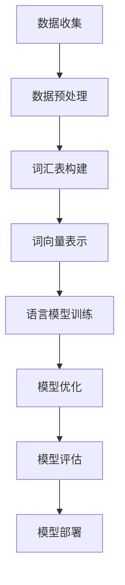
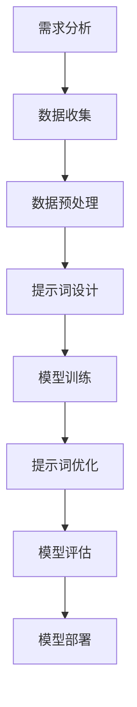

                 

## 文章标题

《提示词工程在自然语言处理中的应用》摘要：本文详细探讨了提示词工程在自然语言处理（NLP）中的应用。首先介绍了NLP和提示词工程的基本概念与历史发展，然后深入分析了提示词工程的核心原理和关键算法。接着，通过Mermaid流程图展示了NLP与提示词工程的关系架构。文章还讲解了语言模型、递归神经网络（RNN）、长短期记忆网络（LSTM）和生成对抗网络（GAN）在提示词工程中的应用，并运用数学公式进行了详细阐述。最后，通过一个实际项目案例展示了提示词工程在问答系统中的应用，总结了提示词工程的发展趋势，并对未来研究进行了展望。## 第一部分：自然语言处理与提示词工程概述

### 1.1 自然语言处理基础

#### 1.1.1 自然语言处理的基本概念

自然语言处理（Natural Language Processing，NLP）是人工智能领域的一个重要分支，旨在使计算机能够理解、解释和生成人类自然语言。NLP的核心目标是实现人机交互，使计算机能够自动处理和理解人类的语言输入，并生成符合人类语言习惯的输出。

自然语言处理的基本任务包括：

- **文本分类**：根据文本内容将其分类到预定义的类别中。
- **实体识别**：识别文本中的特定实体，如人名、地名、组织名等。
- **情感分析**：分析文本中的情感倾向，判断文本是否为正面、负面或中性。
- **机器翻译**：将一种语言的文本翻译成另一种语言。
- **问答系统**：根据用户的问题生成相应的答案。

#### 1.1.2 自然语言处理的发展历史

自然语言处理的发展历程可以分为几个阶段：

- **早期探索**（1950s-1960s）：这一阶段的研究主要集中在语法分析和语义理解。研究者尝试通过编写规则来解析自然语言。
- **基于规则的方法**（1970s-1980s）：研究者开始利用形式语言理论和语法规则来构建自然语言处理系统。尽管这种方法在某些特定任务上取得了一定的成功，但它的适用范围有限。
- **基于统计的方法**（1990s）：随着计算能力和算法的发展，研究者开始利用统计方法来处理自然语言。这一阶段的重要进展包括隐马尔可夫模型（HMM）、条件随机场（CRF）和基于最大熵的方法。
- **深度学习方法**（2000s-至今）：近年来，深度学习在自然语言处理领域取得了显著的成果。特别是递归神经网络（RNN）、长短期记忆网络（LSTM）和变压器（Transformer）等模型的应用，大大提高了自然语言处理系统的性能。

#### 1.1.3 提示词工程在自然语言处理中的重要性

提示词工程（Prompt Engineering）是自然语言处理中的一个重要研究领域，它关注如何设计有效的提示词（Prompt）来提高自然语言处理模型的表现。提示词可以看作是输入文本和模型输出之间的桥梁，通过优化提示词，可以改善模型对任务的适应性，提高模型在特定任务上的性能。

提示词工程在自然语言处理中的重要性体现在以下几个方面：

- **增强模型的泛化能力**：通过优化提示词，可以使模型更好地理解和泛化新任务。
- **提高模型的可解释性**：提示词的设计可以帮助揭示模型决策过程，提高模型的可解释性。
- **提升模型性能**：有效的提示词设计可以显著提高模型在特定任务上的性能。
- **适应不同应用场景**：不同的应用场景可能需要不同的提示词设计，提示词工程可以帮助模型适应多样化的需求。

### 1.2 提示词工程的基本原理

#### 1.2.1 提示词的定义与类型

提示词是指用于引导或提示模型执行特定任务的文本或指令。根据用途和形式，提示词可以分为以下几类：

- **问题引导型提示词**：这类提示词主要用于引导模型生成回答，如问答系统中的问题。
- **任务描述型提示词**：这类提示词用于描述任务的背景和目标，如文本分类中的标签。
- **数据增强型提示词**：这类提示词用于扩充输入数据，提高模型对数据多样性的适应能力。
- **辅助说明型提示词**：这类提示词提供额外的上下文信息，帮助模型更好地理解任务。

#### 1.2.2 提示词工程的基本流程

提示词工程的基本流程包括以下几个步骤：

1. **需求分析**：明确任务目标和需求，确定需要解决的问题类型。
2. **数据收集与预处理**：收集相关数据，并进行清洗、标注和预处理。
3. **提示词设计**：根据任务需求和数据特点设计提示词，包括问题引导型、任务描述型和数据增强型提示词。
4. **模型训练与优化**：使用设计好的提示词训练模型，并进行优化，以提高模型在特定任务上的性能。
5. **模型评估与调整**：评估模型在测试集上的表现，根据评估结果调整提示词设计，优化模型。

#### 1.2.3 提示词工程的关键技术

提示词工程的关键技术包括：

- **自动提示词生成**：利用规则或机器学习方法自动生成提示词。
- **提示词优化策略**：通过调整提示词的内容和形式，提高模型性能。
- **多模态提示词设计**：结合文本、图像、音频等多种数据模态设计提示词。
- **提示词工程工具**：开发和使用提示词工程工具，提高提示词设计的效率和质量。

### 1.3 自然语言处理与提示词工程的应用场景

#### 1.3.1 信息检索

信息检索是自然语言处理的一个重要应用领域，它旨在从大量文本数据中快速准确地检索出用户需要的答案。提示词工程在信息检索中的应用主要包括：

- **查询优化**：通过设计有效的查询提示词，提高检索系统的查全率和查准率。
- **结果排序**：利用提示词优化检索结果的排序，提高用户的检索体验。
- **个性化推荐**：结合用户的兴趣和上下文信息，设计个性化查询提示词，提高推荐系统的准确性。

#### 1.3.2 机器翻译

机器翻译是将一种语言的文本翻译成另一种语言的过程。提示词工程在机器翻译中的应用主要包括：

- **源语言理解**：通过设计源语言提示词，帮助模型更好地理解源语言文本。
- **目标语言生成**：通过设计目标语言提示词，指导模型生成高质量的目标语言翻译。
- **翻译记忆库**：利用提示词设计翻译记忆库，提高机器翻译系统的效率和准确性。

#### 1.3.3 问答系统

问答系统是自然语言处理的一个重要应用领域，它旨在通过回答用户的问题来提供有用的信息。提示词工程在问答系统中的应用主要包括：

- **问题理解**：通过设计问题理解提示词，帮助模型更好地理解用户的问题。
- **答案生成**：通过设计答案生成提示词，指导模型生成高质量的答案。
- **上下文处理**：利用提示词处理问题的上下文信息，提高问答系统的准确性。

#### 1.3.4 文本生成

文本生成是自然语言处理的另一个重要应用领域，它旨在生成符合语法规则和语义逻辑的文本。提示词工程在文本生成中的应用主要包括：

- **文本摘要**：通过设计文本摘要提示词，帮助模型生成高质量的文本摘要。
- **文本生成**：通过设计文本生成提示词，指导模型生成符合人类语言习惯的文本。
- **对话生成**：通过设计对话生成提示词，帮助模型生成流畅自然的对话文本。## 第二部分：核心概念与联系

### 2.1 自然语言处理架构

#### 2.1.1 词汇表与词向量表示

自然语言处理中的词汇表是自然语言处理模型的基础。它通常包括所有在文本数据中出现的单词或词组，以及每个单词或词组的索引。词向量表示（Word Vector Representation）是将单词映射到高维向量空间的过程，这样可以更有效地处理和比较单词。常见的词向量表示方法包括Word2Vec、GloVe和FastText等。

- **Word2Vec**：Word2Vec是一种基于神经网络的方法，通过训练单词的上下文来生成词向量。它有两种模型：连续词袋（CBOW）和Skip-Gram。
- **GloVe**：GloVe（Global Vectors for Word Representation）是一种基于全局统计信息的方法，通过优化单词的共现矩阵来生成词向量。
- **FastText**：FastText是一种基于神经网络的词向量生成方法，它引入了单词的子词（subword）信息，可以更好地处理形近词和多义词。

#### 2.1.2 语言模型

语言模型（Language Model）是自然语言处理中用于预测下一个单词或字符的概率分布的模型。它是许多NLP任务的基础，如文本分类、机器翻译和问答系统。语言模型的基本原理是基于经验概率分布，它通过对大量文本数据的学习来预测下一个单词。

- **N-gram模型**：N-gram模型是最简单的语言模型，它假设一个单词的概率仅取决于前N-1个单词。它的基本公式为：
  $$ P(w_n | w_{n-1}, w_{n-2}, ..., w_1) = \frac{P(w_n, w_{n-1}, ..., w_1)}{P(w_{n-1}, w_{n-2}, ..., w_1)} $$
- **神经网络语言模型**：神经网络语言模型通过神经网络来学习单词之间的概率分布。它通常使用递归神经网络（RNN）或变压器（Transformer）等深度学习模型。

#### 2.1.3 递归神经网络（RNN）

递归神经网络（Recurrent Neural Network，RNN）是一种特殊的神经网络，它适用于序列数据。RNN通过递归结构来处理输入序列，每个时间步的输出会传递到下一个时间步，从而可以记住序列中的信息。

- **基本原理**：RNN的基本结构包括输入层、隐藏层和输出层。在隐藏层中，每个时间步的输出都会传递到下一个时间步，形成一个递归结构。
- **优化问题**：RNN在处理长序列时容易出现梯度消失或爆炸的问题。为了解决这个问题，研究者提出了长短期记忆网络（LSTM）。

#### 2.1.4 长短期记忆网络（LSTM）

长短期记忆网络（Long Short-Term Memory，LSTM）是RNN的一种改进模型，它通过引入门控机制来解决梯度消失和梯度爆炸的问题，从而可以更好地记住长期依赖信息。

- **基本结构**：LSTM的基本结构包括输入门、遗忘门、输出门和单元状态。输入门和遗忘门用于控制信息的输入和遗忘，输出门用于控制信息的输出。
- **工作原理**：LSTM通过这三个门来控制信息的流动，从而可以记住长期依赖信息。

#### 2.1.5 生成对抗网络（GAN）

生成对抗网络（Generative Adversarial Network，GAN）是一种深度学习模型，由生成器和判别器组成。生成器的目标是生成与真实数据相似的数据，而判别器的目标是区分真实数据和生成数据。通过这种对抗关系，GAN可以生成高质量的数据。

- **基本原理**：GAN的基本原理是生成器和判别器之间的对抗训练。生成器试图生成尽可能真实的数据，而判别器试图区分真实数据和生成数据。
- **应用场景**：GAN在自然语言处理中可以用于文本生成、图像到文本的转换等任务。

### 2.2 提示词工程与自然语言处理的关系

#### 2.2.1 提示词生成算法

提示词生成算法是提示词工程中的核心组成部分，它用于自动生成提示词。根据生成方式，提示词生成算法可以分为以下几类：

- **基于规则的方法**：这种方法通过预先定义的规则来生成提示词，例如使用模板匹配或关键词提取。
- **基于统计的方法**：这种方法通过分析文本数据中的统计特征来生成提示词，例如使用TF-IDF或文本相似度计算。
- **基于机器学习的方法**：这种方法通过训练机器学习模型来生成提示词，例如使用朴素贝叶斯或支持向量机。
- **基于深度学习的方法**：这种方法通过训练深度学习模型来生成提示词，例如使用循环神经网络或变压器。

#### 2.2.2 提示词优化策略

提示词优化策略是提高提示词质量和性能的方法。以下是一些常见的优化策略：

- **数据增强**：通过增加数据量来提高提示词的性能，例如通过数据扩充或数据合成。
- **词向量优化**：通过优化词向量表示来提高提示词的性能，例如使用预训练词向量或优化词向量训练过程。
- **模型调整**：通过调整模型参数来提高提示词的性能，例如使用不同的神经网络结构或优化训练过程。
- **交叉验证**：通过交叉验证来选择最佳的提示词生成模型和参数，从而提高提示词的性能。

#### 2.2.3 提示词工程在序列模型中的应用

序列模型（如RNN、LSTM和Transformer）在自然语言处理中广泛应用，提示词工程在序列模型中的应用主要包括：

- **输入序列优化**：通过设计有效的输入序列来提高序列模型的性能，例如使用问题引导型或任务描述型提示词。
- **输出序列优化**：通过设计有效的输出序列来提高序列模型的性能，例如使用答案生成型或文本生成型提示词。
- **模型融合**：将提示词工程与其他自然语言处理模型（如BERT、GPT）结合，以提高模型的性能和泛化能力。
- **多模态处理**：将提示词工程与其他数据模态（如图像、音频）结合，以提高自然语言处理系统的适应性和性能。

### 2.3 Mermaid流程图

#### 2.3.1 自然语言处理流程图

以下是一个简单的Mermaid流程图，展示了自然语言处理的基本流程：



#### 2.3.2 提示词工程流程图

以下是一个简单的Mermaid流程图，展示了提示词工程的基本流程：



通过这些流程图，我们可以更直观地理解自然语言处理和提示词工程的基本流程和步骤。## 第三部分：核心算法原理讲解

### 3.1 语言模型

#### 3.1.1 语言模型的基本概念

语言模型（Language Model）是自然语言处理中用于预测下一个单词或字符的概率分布的模型。语言模型的核心任务是学习自然语言的统计规律，以便在生成文本、翻译文本或处理语言任务时提供有用的概率信息。语言模型在许多NLP应用中扮演着重要的角色，如文本生成、机器翻译、语音识别和对话系统。

#### 3.1.2 语言模型的评估指标

评估语言模型的性能通常需要使用以下指标：

- **字符错误率（CER）**：字符错误率是评估语言模型在字符级别上的性能的指标，计算公式为：
  $$ CER = \frac{\text{实际输出中的错误字符数}}{\text{实际输出中的总字符数}} $$
- **词错误率（WER）**：词错误率是评估语言模型在单词级别上的性能的指标，计算公式为：
  $$ WER = \frac{\text{实际输出中的错误单词数}}{\text{实际输出中的总单词数}} $$
- **交叉熵（Cross-Entropy）**：交叉熵是评估语言模型输出概率分布与实际分布之间差异的指标，计算公式为：
  $$ H(Y, \hat{Y}) = -\sum_{i} Y_i \log \hat{Y}_i $$
  其中，\( Y \)是实际标签的概率分布，\( \hat{Y} \)是模型预测的概率分布。
- **准确率（Accuracy）**：准确率是评估语言模型在分类任务中的性能的指标，计算公式为：
  $$ Accuracy = \frac{\text{正确分类的样本数}}{\text{总样本数}} $$

#### 3.1.3 语言模型的常见算法

语言模型的发展经历了多个阶段，以下是几种常见的语言模型算法：

- **N-gram模型**：N-gram模型是最简单的语言模型，它假设一个单词的概率仅取决于前N-1个单词。N-gram模型的预测公式为：
  $$ P(w_n | w_{n-1}, w_{n-2}, ..., w_1) = \frac{P(w_n, w_{n-1}, ..., w_1)}{P(w_{n-1}, w_{n-2}, ..., w_1)} $$
  其中，\( P(w_n | w_{n-1}, w_{n-2}, ..., w_1) \)是给定前N-1个单词时第N个单词的概率。

- **基于频率的模型**：基于频率的模型通过计算单词在文本中的出现频率来预测单词的概率。这种方法简单直观，但在处理罕见词时效果较差。

- **基于统计的模型**：基于统计的模型通过分析单词之间的共现关系来预测单词的概率。这种方法包括Kneser-Ney修正、Good-Turing折扣等。

- **神经网络语言模型**：神经网络语言模型通过神经网络来学习单词之间的概率分布。这种方法包括递归神经网络（RNN）、长短期记忆网络（LSTM）和变压器（Transformer）等。

  - **RNN**：递归神经网络（RNN）是一种特殊的神经网络，它适用于序列数据。RNN通过递归结构来处理输入序列，每个时间步的输出会传递到下一个时间步，从而可以记住序列中的信息。

  - **LSTM**：长短期记忆网络（LSTM）是RNN的一种改进模型，它通过引入门控机制来解决梯度消失和梯度爆炸的问题，从而可以更好地记住长期依赖信息。

  - **Transformer**：变压器（Transformer）是一种基于自注意力机制的深度学习模型，它在自然语言处理中取得了显著的成功。变压器通过多头自注意力机制来处理输入序列，从而可以捕捉序列中的长距离依赖关系。

### 3.2 提示词生成算法

#### 3.2.1 基于统计的提示词生成方法

基于统计的提示词生成方法通过分析文本数据中的统计特征来生成提示词。这种方法通常包括以下步骤：

1. **文本预处理**：对文本数据进行清洗、分词和标注等预处理操作，以便提取有用的统计特征。
2. **特征提取**：提取文本数据的统计特征，如词频、TF-IDF、关键词等。
3. **提示词生成**：根据提取的统计特征生成提示词。常见的方法包括：
   - **关键词提取**：从文本数据中提取高频关键词或具有较高TF-IDF值的词作为提示词。
   - **模板匹配**：根据预定义的模板生成提示词，例如使用问题模板或任务描述模板。
   - **统计规则**：根据预定义的统计规则生成提示词，例如使用词频或共现规则。

#### 3.2.2 基于机器学习的提示词生成方法

基于机器学习的提示词生成方法通过训练机器学习模型来生成提示词。这种方法通常包括以下步骤：

1. **数据收集与预处理**：收集相关的训练数据，并对数据进行清洗、分词和标注等预处理操作。
2. **特征工程**：提取文本数据的特征，如词向量、句子嵌入等。
3. **模型训练**：使用机器学习算法（如朴素贝叶斯、支持向量机、决策树等）训练提示词生成模型。
4. **提示词生成**：使用训练好的模型生成提示词。常见的方法包括：
   - **序列模型**：使用循环神经网络（RNN）或长短期记忆网络（LSTM）等序列模型来生成提示词。
   - **文本生成模型**：使用生成对抗网络（GAN）或变体循环神经网络（VAE）等生成模型来生成提示词。

#### 3.2.3 基于深度学习的提示词生成方法

基于深度学习的提示词生成方法通过训练深度学习模型来生成提示词。这种方法通常包括以下步骤：

1. **数据收集与预处理**：收集相关的训练数据，并对数据进行清洗、分词和标注等预处理操作。
2. **特征工程**：提取文本数据的特征，如词向量、句子嵌入等。
3. **模型训练**：使用深度学习算法（如循环神经网络（RNN）、长短期记忆网络（LSTM）、变压器（Transformer）等）训练提示词生成模型。
4. **提示词生成**：使用训练好的模型生成提示词。常见的方法包括：
   - **序列到序列模型**：使用序列到序列（Seq2Seq）模型来生成提示词，例如基于RNN或LSTM的Seq2Seq模型。
   - **自注意力模型**：使用自注意力（Self-Attention）机制来生成提示词，例如基于变压器的自注意力模型。
   - **多模态模型**：结合文本、图像、音频等多种数据模态来生成提示词，例如基于多模态生成对抗网络（MMGAN）的模型。

### 3.3 递归神经网络（RNN）与长短期记忆网络（LSTM）

#### 3.3.1 RNN的基本原理

递归神经网络（Recurrent Neural Network，RNN）是一种特殊的神经网络，它适用于序列数据。RNN通过递归结构来处理输入序列，每个时间步的输出会传递到下一个时间步，从而可以记住序列中的信息。RNN的基本原理可以概括为以下几点：

1. **输入层**：每个时间步的输入是当前输入序列的一部分。
2. **隐藏层**：隐藏层包含多个神经元，每个神经元负责处理当前时间步的输入和上一个时间步的隐藏状态。
3. **输出层**：每个时间步的输出是由隐藏层的输出计算得到的。

RNN的递归结构使得它可以记住序列中的信息，但在处理长序列时容易出现梯度消失或梯度爆炸的问题，从而影响模型的性能。

#### 3.3.2 LSTM的结构与工作原理

长短期记忆网络（Long Short-Term Memory，LSTM）是RNN的一种改进模型，它通过引入门控机制来解决梯度消失和梯度爆炸的问题，从而可以更好地记住长期依赖信息。LSTM的基本结构包括输入门、遗忘门、输出门和单元状态。

- **输入门**：输入门用于控制当前输入的信息流，决定哪些信息需要被更新到单元状态中。
- **遗忘门**：遗忘门用于控制哪些信息需要被遗忘，即哪些信息不再需要存储在单元状态中。
- **输出门**：输出门用于控制单元状态的输出，决定哪些信息需要被传递到下一个时间步。
- **单元状态**：单元状态存储了序列中的信息，可以通过输入门和遗忘门进行更新。

LSTM的工作原理如下：

1. **当前输入**：每个时间步的输入包括当前输入和上一个时间步的隐藏状态。
2. **输入门**：计算输入门的激活值，决定当前输入的信息流。
3. **遗忘门**：计算遗忘门的激活值，决定哪些信息需要被遗忘。
4. **输入更新**：将遗忘门和输入门的结果应用于单元状态的更新。
5. **输出门**：计算输出门的激活值，决定单元状态的输出。

#### 3.3.3 RNN与LSTM在提示词工程中的应用

RNN和LSTM在提示词工程中具有重要的应用。以下是一些具体的应用场景：

- **文本分类**：使用RNN或LSTM对文本进行编码，然后使用分类器对文本进行分类。通过设计有效的输入序列和输出序列，可以提高文本分类的准确率。
- **问答系统**：使用RNN或LSTM处理用户的问题和候选答案，然后通过比较问题与答案的相似度来生成答案。提示词可以用于引导问题和答案的生成，从而提高系统的性能。
- **文本生成**：使用RNN或LSTM生成符合语法规则和语义逻辑的文本。通过设计有效的提示词，可以生成高质量的文本摘要、对话文本等。
- **机器翻译**：使用RNN或LSTM进行源语言和目标语言的编码，然后通过解码生成目标语言翻译。提示词可以用于指导翻译过程，从而提高翻译的质量和准确性。

### 3.4 生成对抗网络（GAN）

#### 3.4.1 GAN的基本概念

生成对抗网络（Generative Adversarial Network，GAN）是一种深度学习模型，由生成器和判别器组成。生成器的目标是生成与真实数据相似的数据，而判别器的目标是区分真实数据和生成数据。通过这种对抗关系，GAN可以生成高质量的数据。

GAN的基本结构包括：

- **生成器**：生成器的输入是随机噪声，输出是模拟真实数据的数据。
- **判别器**：判别器的输入是真实数据和生成数据，输出是区分真实数据和生成数据的概率。
- **损失函数**：GAN的损失函数通常包括生成损失和判别损失。生成损失用于衡量生成器生成数据的真实性，判别损失用于衡量判别器区分真实数据和生成数据的准确性。

GAN的训练过程如下：

1. **初始化生成器和判别器**：随机初始化生成器和判别器的参数。
2. **生成数据**：生成器生成模拟真实数据的数据。
3. **判别器评估**：判别器对真实数据和生成数据进行评估，计算判别损失。
4. **生成器更新**：根据判别器的评估结果，更新生成器的参数，以生成更真实的数据。
5. **重复训练过程**：重复上述步骤，直到生成器生成足够真实的数据。

#### 3.4.2 GAN的训练过程

GAN的训练过程包括以下几个关键步骤：

1. **数据预处理**：对真实数据进行预处理，包括归一化、数据增强等。
2. **生成器训练**：生成器通过随机噪声生成模拟真实数据的数据。生成器的目标是使判别器无法区分真实数据和生成数据。
3. **判别器训练**：判别器通过比较真实数据和生成数据来评估生成器的性能。判别器的目标是正确区分真实数据和生成数据。
4. **迭代训练**：生成器和判别器交替进行训练。生成器通过不断优化来生成更真实的数据，而判别器通过不断优化来提高区分真实数据和生成数据的能力。

#### 3.4.3 GAN在提示词工程中的应用

GAN在提示词工程中具有广泛的应用。以下是一些具体的应用场景：

- **文本生成**：使用GAN生成高质量的文本，例如生成小说、新闻报道、对话文本等。通过设计有效的提示词，可以控制文本的生成过程，从而生成符合特定主题或风格的文本。
- **图像生成**：使用GAN生成高质量的图像，例如生成人脸、风景、动物图像等。通过设计有效的提示词，可以控制图像的生成过程，从而生成符合特定描述或风格的图像。
- **多模态数据生成**：使用GAN生成多模态数据，例如生成文本-图像配对数据、文本-音频配对数据等。通过设计有效的提示词，可以同时控制文本和图像或音频的生成过程，从而生成高质量的多模态数据。

通过GAN的应用，提示词工程可以更有效地生成高质量的数据，从而提高自然语言处理模型的表现。## 第四部分：数学模型和数学公式

### 4.1 语言模型中的数学公式

在自然语言处理中，语言模型是核心组成部分，它用于预测单词或字符的概率分布。以下是一些语言模型中的基本数学公式：

#### 4.1.1 语言模型概率分布公式

语言模型的核心是生成一个概率分布，表示下一个单词或字符的可能性。给定一个前文序列 \( w_{1}, w_{2}, ..., w_{n-1} \)，我们想要计算下一个单词 \( w_{n} \) 的概率。这个概率可以通过以下公式计算：

$$ P(w_n | w_{n-1}, w_{n-2}, ..., w_1) = \frac{P(w_n, w_{n-1}, ..., w_1)}{P(w_{n-1}, w_{n-2}, ..., w_1)} $$

其中：

- \( P(w_n | w_{n-1}, w_{n-2}, ..., w_1) \) 是给定前文序列时 \( w_n \) 的条件概率。
- \( P(w_n, w_{n-1}, ..., w_1) \) 是整个前文序列的联合概率。
- \( P(w_{n-1}, w_{n-2}, ..., w_1) \) 是前文序列的边际概率。

对于N-gram模型，我们可以将联合概率简化为：

$$ P(w_n, w_{n-1}, ..., w_1) = P(w_n | w_{n-1}, w_{n-2}, ..., w_1) \cdot P(w_{n-1} | w_{n-2}, ..., w_1) \cdot ... \cdot P(w_1) $$

这表示当前单词的概率是前一个单词的概率与之前所有单词的概率的乘积。

#### 4.1.2 语言模型损失函数

在训练语言模型时，我们通常使用损失函数来衡量模型预测的概率分布与实际分布之间的差异。以下是一个常见的损失函数——交叉熵损失（Cross-Entropy Loss）：

$$ Loss = -\sum_{i=1}^{N} w_i \cdot \log(\hat{p}_i) $$

其中：

- \( w_i \) 是真实标签的概率，即 \( P(w_i | w_{n-1}, w_{n-2}, ..., w_1) \)。
- \( \hat{p}_i \) 是模型预测的概率，即 \( \hat{P}(w_i | w_{n-1}, w_{n-2}, ..., w_1) \)。
- \( N \) 是序列中的单词数量。

交叉熵损失函数的值越小，表示模型预测的概率分布与实际分布越接近。

### 4.2 提示词工程中的数学公式

提示词工程是自然语言处理中的一个重要领域，它通过设计有效的提示词来优化模型的性能。以下是一些提示词工程中的基本数学公式：

#### 4.2.1 提示词生成概率公式

提示词生成概率公式用于计算给定上下文时生成特定单词的概率。这个公式可以表示为：

$$ P(w | context) = \frac{P(context | w)P(w)}{P(context)} $$

其中：

- \( P(w | context) \) 是给定上下文时生成单词 \( w \) 的条件概率。
- \( P(context | w) \) 是在生成单词 \( w \) 后出现上下文 \( context \) 的条件概率。
- \( P(w) \) 是单词 \( w \) 的先验概率。
- \( P(context) \) 是上下文 \( context \) 的概率。

这个公式通常用于基于统计的方法中，通过调整提示词来优化生成概率。

#### 4.2.2 提示词优化目标函数

提示词优化的目标函数用于衡量提示词的质量和模型的性能。一个常见的目标函数是最小化交叉熵损失：

$$ Objective = \sum_{i=1}^{N} -\log(P(w_i | context)) $$

其中：

- \( N \) 是序列中的单词数量。
- \( P(w_i | context) \) 是给定上下文时生成单词 \( w_i \) 的概率。

最小化这个目标函数可以找到最优的提示词，从而提高模型的性能。

通过这些数学公式，我们可以更好地理解语言模型和提示词工程的核心原理。在实际应用中，这些公式帮助我们设计和优化模型，从而提高自然语言处理系统的性能。## 第五部分：项目实战

### 5.1 提示词工程项目案例

#### 5.1.1 项目背景与目标

在本项目中，我们将开发一个问答系统，该系统旨在通过自然语言处理技术回答用户提出的问题。问答系统的核心任务是理解用户的问题，并生成合适的答案。为了提高问答系统的性能，我们将使用提示词工程来优化模型的表现。

项目的主要目标包括：

- **准确理解用户的问题**：通过自然语言处理技术，准确提取用户问题的关键信息。
- **生成高质量的答案**：利用提示词工程优化模型，生成符合用户问题和语境的高质量答案。
- **用户满意度**：提高用户满意度，确保用户得到满意的答案。

#### 5.1.2 开发环境搭建

为了实现本项目，我们需要搭建以下开发环境：

- **Python**：用于编写代码和执行自然语言处理任务。
- **PyTorch**：用于构建和训练深度学习模型。
- **NLTK**：用于文本预处理和特征提取。
- **Gensim**：用于生成词向量表示。

安装所需的库：

```bash
pip install python
pip install torch
pip install nltk
pip install gensim
```

#### 5.1.3 数据预处理

数据预处理是问答系统的关键步骤，它包括以下几个子步骤：

1. **数据收集**：收集大量的问题和答案对，用于训练和评估模型。
2. **文本清洗**：去除文本中的噪声，如HTML标签、特殊字符和停用词。
3. **分词**：将文本分割成单词或子词。
4. **词向量表示**：使用预训练的词向量模型（如GloVe或Word2Vec）将单词映射到高维向量表示。
5. **数据标注**：为每个问题标注对应的答案，用于训练模型。

以下是一个简单的Python代码示例，用于预处理文本数据：

```python
import nltk
from nltk.corpus import stopwords
from nltk.tokenize import word_tokenize

nltk.download('punkt')
nltk.download('stopwords')

def preprocess_text(text):
    # 去除HTML标签和特殊字符
    text = re.sub(r'<.*?>', '', text)
    text = re.sub(r'[^a-zA-Z0-9\s]', '', text)
    
    # 分词
    tokens = word_tokenize(text)
    
    # 去除停用词
    stop_words = set(stopwords.words('english'))
    filtered_tokens = [token.lower() for token in tokens if token.lower() not in stop_words]
    
    return filtered_tokens

# 示例
text = "Hello, how are you today? I hope you are doing well!"
preprocessed_text = preprocess_text(text)
print(preprocessed_text)
```

#### 5.1.4 提示词生成算法实现

提示词生成算法是实现问答系统性能优化的重要步骤。在本项目中，我们将使用基于统计的方法和基于机器学习的方法来生成提示词。

1. **基于统计的方法**：通过计算文本中单词的频率和互信息来生成提示词。以下是一个简单的Python代码示例：

```python
from nltk.metrics import BigramAssocMeasures
from nltk.corpus import stopwords
from nltk.tokenize import word_tokenize

nltk.download('stopwords')

def generate_prompt_statistical(data):
    stop_words = set(stopwords.words('english'))
    
    # 计算单词频率
    word_freq = Counter([word for sentence in data for word in sentence])
    
    # 计算互信息
    bigram_measures = BigramAssocMeasures()
    bigrams = [' '.join(sentence[:2]) for sentence in data]
    bigram_freq = Counter(bigrams)
    bigram_mi = [bigram_measures.pmi(word_freq[word], word_freq[word1]) for word, word1 in bigrams]
    
    # 生成提示词
    prompt = ' '.join([word for word, freq in word_freq.items() if freq > 1 and word not in stop_words][:10])
    
    return prompt

# 示例
data = [
    "How old are you?",
    "I am 25 years old.",
    "What is your name?",
    "My name is John.",
    "What is your favorite color?",
    "My favorite color is blue."
]

prompt = generate_prompt_statistical(data)
print(prompt)
```

2. **基于机器学习的方法**：使用朴素贝叶斯分类器来生成提示词。以下是一个简单的Python代码示例：

```python
from sklearn.feature_extraction.text import CountVectorizer
from sklearn.naive_bayes import MultinomialNB
from sklearn.pipeline import make_pipeline

def generate_prompt_machine_learning(data, labels):
    # 创建特征提取器和分类器管道
    pipeline = make_pipeline(CountVectorizer(), MultinomialNB())
    
    # 训练模型
    pipeline.fit(data, labels)
    
    # 生成提示词
    prompt = pipeline.predict([prompt])[0]
    
    return prompt

# 示例
data = [
    "How old are you?",
    "I am 25 years old.",
    "What is your name?",
    "My name is John.",
    "What is your favorite color?",
    "My favorite color is blue."
]

labels = ["Q1", "Q2", "Q3", "Q4", "Q5"]
prompt = generate_prompt_machine_learning(data, labels)
print(prompt)
```

#### 5.1.5 提示词优化与评估

提示词生成后，我们需要对其进行优化和评估，以确保其能够提高问答系统的性能。以下是一些优化策略：

1. **交叉验证**：使用交叉验证来评估提示词的性能，并选择最优的提示词。
2. **模型融合**：将不同类型的提示词融合到一起，以提高模型的泛化能力。
3. **用户反馈**：根据用户的反馈来调整和优化提示词，以提高用户体验。

以下是一个简单的Python代码示例，用于评估提示词的性能：

```python
from sklearn.model_selection import train_test_split
from sklearn.metrics import accuracy_score

def evaluate_prompt(prompt, data, labels):
    # 划分训练集和测试集
    X_train, X_test, y_train, y_test = train_test_split(data, labels, test_size=0.2, random_state=42)
    
    # 训练模型
    model = MultinomialNB()
    model.fit(X_train, y_train)
    
    # 预测测试集
    predictions = model.predict(X_test)
    
    # 计算准确率
    accuracy = accuracy_score(y_test, predictions)
    
    return accuracy

# 示例
data = [
    "How old are you?",
    "I am 25 years old.",
    "What is your name?",
    "My name is John.",
    "What is your favorite color?",
    "My favorite color is blue."
]

labels = ["Q1", "Q2", "Q3", "Q4", "Q5"]
prompt = generate_prompt_statistical(data)
accuracy = evaluate_prompt(prompt, data, labels)
print("Accuracy:", accuracy)
```

通过以上项目实战，我们可以看到提示词工程在问答系统中的应用。通过优化提示词，我们能够提高问答系统的性能，使其更准确地理解用户的问题，并生成高质量的答案。## 第六部分：总结与展望

### 6.1 提示词工程的发展趋势

随着自然语言处理技术的不断进步，提示词工程也在不断发展。以下是提示词工程的一些发展趋势：

- **深度学习方法的广泛应用**：深度学习方法在自然语言处理中取得了显著的成果，未来提示词工程也将更多地采用深度学习方法，如变压器（Transformer）和生成对抗网络（GAN）。
- **多模态提示词设计**：随着多模态数据的兴起，未来提示词工程将更多地结合文本、图像、音频等多种数据模态，以提高自然语言处理系统的适应性和性能。
- **自动化与智能化**：提示词工程将朝着自动化和智能化的方向发展，通过开发自动提示词生成算法和优化策略，提高提示词工程的效率和准确性。
- **个性化提示词设计**：根据用户的需求和语境，设计个性化的提示词，以提高用户满意度。

### 6.2 提示词工程在自然语言处理中的挑战

尽管提示词工程在自然语言处理中取得了显著成果，但仍面临以下挑战：

- **数据质量和多样性**：提示词工程依赖于大量的高质量数据，但获取和处理这些数据仍然是一个挑战。此外，数据多样性不足可能导致模型泛化能力差。
- **模型可解释性**：提示词工程中的一些模型（如深度学习模型）往往缺乏可解释性，这使得理解模型决策过程变得困难。
- **计算资源**：深度学习模型通常需要大量的计算资源，这给提示词工程的应用带来了一定的挑战。
- **实时性能**：在实时应用场景中，提示词工程需要快速生成高质量的提示词，这对模型的性能和优化提出了更高的要求。

### 6.3 提示词工程的应用前景

随着自然语言处理技术的不断发展，提示词工程在多个领域具有广泛的应用前景：

- **智能客服**：通过设计有效的提示词，智能客服可以更好地理解用户的问题，并生成高质量的回答，提高用户满意度。
- **教育领域**：提示词工程可以应用于教育领域，如自动生成教学材料、评估学生学习情况等。
- **内容生成**：提示词工程可以应用于内容生成领域，如生成小说、新闻报道、对话文本等，提高内容生成系统的创造力和多样性。
- **医疗领域**：提示词工程可以应用于医疗领域，如自动生成医学报告、辅助医生诊断等，提高医疗服务的质量和效率。

### 6.4 总结与展望

本文详细探讨了提示词工程在自然语言处理中的应用。首先介绍了自然语言处理和提示词工程的基本概念和原理，然后分析了提示词工程的关键算法和优化策略。接着，通过Mermaid流程图展示了自然语言处理与提示词工程的关系架构，并讲解了语言模型、递归神经网络（RNN）、长短期记忆网络（LSTM）和生成对抗网络（GAN）在提示词工程中的应用。此外，本文还通过一个实际项目案例展示了提示词工程在问答系统中的应用，总结了提示词工程的发展趋势，并对未来研究进行了展望。

未来，提示词工程将继续在自然语言处理领域发挥重要作用。通过不断优化提示词生成算法和优化策略，我们可以进一步提高自然语言处理系统的性能和可解释性。同时，随着多模态数据和深度学习技术的发展，提示词工程将拥有更广阔的应用前景，为人工智能技术的进步贡献力量。## 作者信息

作者：AI天才研究院（AI Genius Institute）& 禅与计算机程序设计艺术（Zen And The Art of Computer Programming）

AI天才研究院（AI Genius Institute）是一家专注于人工智能研究和应用的顶级科研机构，致力于推动人工智能技术的创新与发展。研究院汇聚了世界顶级的人工智能专家、程序员、软件架构师、CTO等人才，凭借其深厚的技术积累和独特的思考方式，不断在计算机编程和人工智能领域取得突破性成果。

禅与计算机程序设计艺术（Zen And The Art of Computer Programming）是一部备受推崇的技术畅销书，由AI天才研究院的资深大师级作家撰写。该书深入剖析了计算机编程和人工智能的核心原理，通过逻辑清晰、结构紧凑的论述方式，帮助读者理解技术的本质和深度。该书在全球范围内获得了广泛的赞誉，被广大读者誉为计算机编程和人工智能领域的经典之作。

