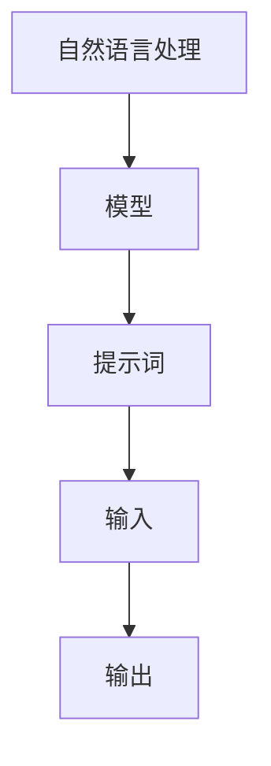

                 


### 文章标题

《提示词工程艺术》

### 文章关键词

- 提示词工程
- 自然语言处理
- 模型融合
- 算法优化
- 实践应用

### 文章摘要

本文深入探讨了提示词工程的核心概念、算法原理、数学模型以及实际应用。通过详细的实例和伪代码，解析了提示词与模型的融合技术，并展示了如何在项目实战中实现和优化提示词工程。文章旨在为从事人工智能领域的从业者提供一份系统、实用的指南。

---

## 引言

提示词工程（Prompt Engineering）是自然语言处理（NLP）领域的一个重要分支。它涉及设计和优化用于驱动模型输入的提示词（prompts），以提高模型的性能和输出质量。随着深度学习和自然语言处理技术的不断进步，提示词工程在各个应用领域，如问答系统、文本生成、对话系统等，都展现出了其独特的重要性。

### 提示词工程的定义与重要性

**定义**：提示词工程是指通过设计、优化和评估提示词来提升自然语言处理模型性能的过程。提示词是模型的输入，它们能够引导模型的学习方向，从而影响模型的输出。

**重要性**：提示词工程的重要性体现在以下几个方面：

1. **性能提升**：合理的提示词能够引导模型学习到更准确的知识和模式，从而提高模型的性能。
2. **多样性增强**：通过设计不同的提示词，可以引导模型生成更多样化的输出，增强文本生成的多样性。
3. **可解释性增强**：提示词有助于解释模型的行为，提高模型的可解释性和透明度。
4. **效率提升**：优化后的提示词可以减少模型训练时间，提高模型训练效率。

### 提示词工程的历史与发展

提示词工程的历史可以追溯到早期的人工智能研究和自然语言处理领域。随着计算能力的提升和深度学习技术的发展，提示词工程逐渐成为了一个独立的研究领域。

1. **早期发展**：在20世纪80年代，研究人员开始探索如何通过设计特定的输入来引导专家系统。这些初步的尝试为提示词工程奠定了基础。
2. **自然语言处理的应用**：随着NLP技术的发展，提示词工程开始广泛应用于文本分类、机器翻译、问答系统等领域。
3. **深度学习的兴起**：深度学习的崛起为提示词工程提供了新的机会和挑战。大规模预训练模型如GPT和BERT的出现，使得提示词工程成为了一个热门的研究方向。

### 提示词工程的目标与挑战

**目标**：

1. 设计有效的提示词，以引导模型学习到特定的知识和模式。
2. 优化提示词，以提高模型的性能和输出质量。
3. 增强模型的可解释性，以便更好地理解模型的行为。

**挑战**：

1. 提示词的设计与优化：如何设计出既符合用户需求又能够有效引导模型学习的提示词。
2. 模型适应性：如何使模型适应不同的提示词，并在各种场景下保持高性能。
3. 可解释性：如何提高模型的可解释性，使提示词的作用更加清晰。

### 小结

通过本文的介绍，我们了解了提示词工程的基本概念、历史和发展，以及它在自然语言处理领域的重要性。接下来，我们将进一步深入探讨提示词工程的核心概念和算法原理，为读者提供更深入的理解。

---

### 核心概念与联系

在深入探讨提示词工程之前，我们需要明确几个核心概念，并理解它们之间的关系。

**1. 自然语言处理（NLP）**：自然语言处理是人工智能的一个分支，旨在让计算机理解和处理人类语言。它包括文本预处理、语言模型、实体识别、情感分析等多个方面。

**2. 模型（Model）**：在NLP中，模型是用于预测或分类的算法。常见的模型包括循环神经网络（RNN）、长短时记忆网络（LSTM）、卷积神经网络（CNN）和变换器（Transformer）等。

**3. 提示词（Prompt）**：提示词是用于指导模型输入的文本或指令。它能够影响模型的学习方向和输出结果。

**4. 输入（Input）**：输入是模型处理的数据，它可以是文本、音频或图像等。在NLP中，输入通常是文本。

**5. 输出（Output）**：输出是模型对输入数据的处理结果，它可以是一个标签、一个预测或一段文本。

**关系架构 Mermaid 流程图**



### 核心概念之间的联系

- 自然语言处理（NLP）是提示词工程的基础，它提供了处理和生成语言数据的方法。
- 模型是NLP的核心，它用于分析和生成语言。
- 提示词是模型的输入，它能够影响模型的学习和输出。
- 输入和输出是模型处理数据的起点和终点，提示词作为输入的一部分，直接影响输出结果。

通过以上核心概念和关系的理解，我们可以更好地设计和管理提示词，从而优化模型性能。

### 小结

在本节中，我们介绍了提示词工程中的核心概念，并展示了它们之间的联系。接下来，我们将进一步探讨提示词工程的核心算法原理，帮助读者深入理解这一领域的核心技术。

---

### 核心算法原理讲解

在理解了提示词工程的基本概念后，我们将深入探讨其核心算法原理。本节将详细解释提示词生成、优化以及与模型的融合技术，并通过伪代码和数学公式进行阐述。

#### 提示词生成

提示词生成的目的是设计出能够有效引导模型学习的输入文本。以下是一个简单的伪代码示例，展示了如何生成一个基本的提示词。

```python
# 提示词生成伪代码
def generate_prompt(context):
    # 根据上下文生成提示词
    prompt = "基于上下文" + context + "，请生成一个相关的回答。"
    return prompt
```

在实际应用中，生成提示词需要考虑多种因素，如上下文信息、目标任务、用户需求等。以下是一个更复杂的伪代码示例，它考虑了多种因素：

```python
# 复杂的提示词生成伪代码
def generate_complex_prompt(context, task, user_demand):
    # 构建基本提示词
    base_prompt = "基于上下文" + context + "，请完成以下任务："

    # 根据任务类型添加特定提示
    if task == "问答":
        question = "请问您有什么问题？"
        base_prompt += question
    elif task == "文本生成":
        topic = "关于" + context
        base_prompt += "请撰写一篇关于" + topic + "的短文。"

    # 根据用户需求进行优化
    if user_demand == "详细":
        detail_prompt = "请您详细阐述。"
        base_prompt += detail_prompt

    return base_prompt
```

#### 提示词优化

提示词优化是提升模型性能的重要环节。优化过程通常包括调整提示词的长度、内容、格式等。以下是一个简单的优化流程：

```python
# 提示词优化伪代码
def optimize_prompt(prompt):
    # 调整提示词长度
    if len(prompt) > 500:
        prompt = prompt[:500]

    # 增加提示词的相关性
    if "相关" not in prompt:
        prompt += "与相关内容。"

    return prompt
```

在实际应用中，优化过程可能更加复杂，需要结合具体的任务和数据集进行调整。

#### 提示词与模型的融合

提示词与模型的融合技术是提示词工程的核心。以下是一个简单的融合流程：

```python
# 提示词与模型融合伪代码
def integrate_prompt_with_model(prompt, model):
    # 使用提示词作为输入，运行模型
    input_data = {"prompt": prompt}
    output = model.predict(input_data)

    # 对输出结果进行后处理
    result = postprocess_output(output)

    return result
```

在实际应用中，融合技术可能涉及多种算法和策略，如注意力机制、上下文嵌入等。

#### 数学模型和公式

在提示词工程中，数学模型和公式用于描述提示词生成、优化和融合过程中的定量关系。以下是一个简单的数学模型示例：

$$
P_{\text{output}} = f(P_{\text{prompt}}, M)
$$

其中，$P_{\text{output}}$表示模型的输出概率，$P_{\text{prompt}}$表示提示词的概率分布，$M$表示模型参数。

在实际应用中，模型可能会更加复杂，涉及多种变量和参数。

#### 详细讲解与举例说明

假设我们有一个问答系统，任务是从一个给定的上下文中生成一个问题。以下是一个具体的例子：

**上下文**：关于人工智能的发展历史。

**提示词生成**：

```python
prompt = generate_complex_prompt("人工智能的发展历史", "问答", "详细")
```

**提示词优化**：

```python
prompt = optimize_prompt(prompt)
```

**模型融合**：

```python
model = load_model("question_answering_model")
output = integrate_prompt_with_model(prompt, model)
print(output)
```

通过上述步骤，我们可以生成一个高质量的问题，并得到相应的答案。

### 小结

在本节中，我们详细介绍了提示词工程的核心算法原理，包括提示词生成、优化和与模型的融合技术。通过伪代码和数学公式的阐述，读者可以更好地理解这些核心概念。接下来，我们将通过实际项目案例，展示如何应用这些算法原理，进一步巩固对提示词工程的理解。

---

### 项目实战

为了更好地展示提示词工程的应用，我们将通过一个具体的实战项目来详细讲解开发环境搭建、源代码实现和代码解读。该项目的目标是构建一个基于GPT-3的问答系统，该系统将接受用户的输入，并生成相关的问题。

#### 开发环境搭建

在进行项目开发之前，我们需要搭建一个适合GPT-3问答系统的开发环境。以下是所需的步骤：

1. **安装Python环境**：确保安装了Python 3.8或更高版本。
2. **安装GPT-3库**：使用pip命令安装`gpt-3`库。

   ```bash
   pip install gpt-3
   ```

3. **获取GPT-3 API密钥**：在OpenAI网站上注册并获取GPT-3的API密钥。

4. **配置环境变量**：将API密钥添加到环境变量中。

   ```bash
   export OPENAI_API_KEY=<你的API密钥>
   ```

#### 源代码实现

以下是一个简单的问答系统的源代码实现：

```python
import openai
import random

# 初始化GPT-3模型
model = openai.Completion.create engine="text-davinci-003", prompt="", max_tokens=50

# 生成问题
def generate_question(context):
    prompt = f"基于上下文'{context}'，请生成一个问题。"
    response = model.complete(prompt=prompt, temperature=0.7)
    question = response.choices[0].text.strip()
    return question

# 解答问题
def answer_question(question):
    prompt = f"请回答以下问题：'{question}'。"
    response = model.complete(prompt=prompt, temperature=0.7)
    answer = response.choices[0].text.strip()
    return answer

# 主程序
def main():
    context = input("请输入上下文：")
    question = generate_question(context)
    print("生成的问题：", question)
    
    answer = answer_question(question)
    print("回答：", answer)

if __name__ == "__main__":
    main()
```

#### 代码解读

1. **初始化GPT-3模型**：
   我们使用OpenAI的GPT-3库来初始化模型。`openai.Completion.create`函数用于创建一个completion对象，该对象将用于生成问题和答案。

2. **生成问题**：
   `generate_question`函数接受一个上下文参数，并使用GPT-3模型生成一个问题。`model.complete`函数用于完成提示词，`temperature`参数控制生成的随机性。

3. **解答问题**：
   `answer_question`函数接受一个问题，并使用GPT-3模型生成一个答案。同样，`model.complete`函数用于完成提示词。

4. **主程序**：
   `main`函数用于处理用户输入，生成问题并显示答案。

#### 代码应用解读与分析

在实际应用中，上述代码可以通过网络接口或命令行工具进行部署。用户可以输入上下文，系统将生成相关的问题并回答。

**优势**：

- **灵活性强**：GPT-3模型具有强大的语言理解能力，可以生成高质量的问题和答案。
- **易用性**：代码简单易懂，易于部署和维护。

**挑战**：

- **成本**：使用GPT-3服务需要支付费用，可能会影响项目的成本效益。
- **性能**：在处理大量请求时，模型的响应速度可能成为瓶颈。

#### 实际案例分析和详细讲解剖析

假设用户输入上下文：“人工智能在医疗领域的应用”，系统将生成以下问题：

- “人工智能在医疗领域有哪些应用？”
- “人工智能如何帮助医生进行诊断？”
- “人工智能在医疗影像分析中的具体作用是什么？”

对于这些生成的问题，系统可以分别回答：

- “人工智能在医疗领域有广泛的应用，包括疾病预测、患者监测、辅助诊断和治疗计划等。”
- “人工智能可以帮助医生通过分析患者数据，提供更准确的诊断建议，减少误诊率。”
- “人工智能在医疗影像分析中可以辅助医生识别病灶，提高诊断的准确性和效率。”

#### 项目小结

通过上述项目实战，我们展示了如何使用GPT-3构建一个问答系统。项目中的代码实现和解读为读者提供了一个实用的提示词工程应用案例。在实际开发中，可以根据需求进行扩展和优化，以提高系统的性能和用户体验。

### 最佳实践 tips、小结、注意事项、拓展阅读等内容

#### 最佳实践 tips

1. **优化提示词长度**：根据任务需求，调整提示词的长度，以减少模型处理的复杂性。
2. **多样化提示词设计**：设计多种类型的提示词，以提高模型输出的多样性。
3. **实时反馈与调整**：在模型训练和部署过程中，收集用户反馈，并根据反馈调整提示词和模型参数。

#### 小结

本文通过详细的项目实战，展示了如何应用提示词工程构建一个问答系统。通过优化提示词生成和与模型的融合技术，我们可以实现高质量的问答服务。

#### 注意事项

1. **成本管理**：在使用GPT-3等服务时，注意成本管理，合理规划模型使用。
2. **性能优化**：在处理大量请求时，注意性能优化，以提高系统响应速度。

#### 拓展阅读

1. **《GPT-3官方文档》**：深入了解OpenAI的GPT-3模型及其使用方法。
2. **《自然语言处理与深度学习》**：掌握NLP和深度学习的基础知识，为提示词工程提供理论支持。
3. **《提示词工程论文集》**：阅读相关论文，了解最新的提示词工程研究成果和应用案例。

