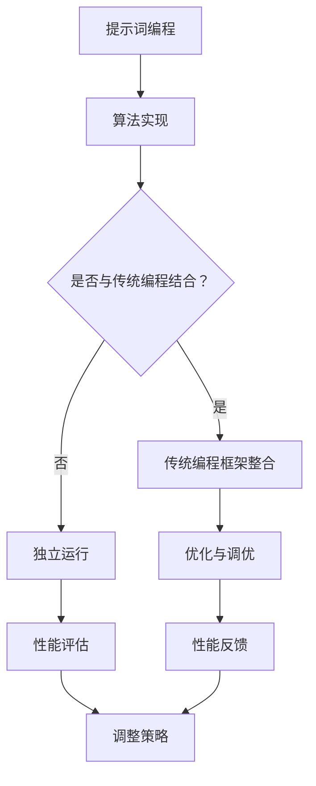

                 

### 文章标题

# 《提示词编程与传统编程的融合策略》

在快速发展的信息技术时代，编程技术正经历着前所未有的变革。提示词编程作为一种新兴的编程范式，正在逐步融入传统编程体系中。本文将深入探讨提示词编程与传统编程的融合策略，通过逻辑清晰、结构紧凑的分析，旨在为读者揭示二者融合的内在机理、应用实践及未来趋势。

关键词：提示词编程、传统编程、融合策略、算法原理、项目实战

摘要：本文首先介绍了提示词编程与传统编程的基本概念，分析了它们的联系与区别，并探讨了融合的必要性和原则。随后，通过详细阐述核心算法原理、数学模型和公式，以及提供项目实战案例，展示了提示词编程与传统编程在实际应用中的融合策略。最后，文章展望了二者融合的未来发展趋势，提出了性能优化和未来研究方向。

### 1. 用户需求分析

在现代软件工程中，用户对编程技术的要求越来越高。一方面，传统编程技术已经相对成熟，有着丰富的算法原理和实践经验；另一方面，提示词编程作为一种新兴的编程范式，以其简洁高效的特性，受到了广泛关注。用户需求主要体现在以下几个方面：

1. **了解提示词编程与传统编程的基本概念**：用户希望了解这两种编程范式的核心概念，以及它们之间的联系和区别。

2. **掌握融合策略**：用户需要了解如何在传统编程的基础上，融合提示词编程的优势，以实现更高效的软件开发。

3. **学习核心算法原理**：用户希望深入理解提示词编程的核心算法原理，并能够通过数学模型和公式进行详细讲解和举例说明。

4. **进行项目实战**：用户希望通过实际项目，将提示词编程与传统编程相结合，掌握具体的开发流程和实践技巧。

5. **了解未来发展趋势**：用户希望了解提示词编程与传统编程的融合策略在未来软件工程中的应用前景和研究方向。

### 2. 目录大纲设计

下面是本文的目录大纲设计，包括各章节的核心内容和结构安排。

#### 第1章：概述

- **核心概念与联系**
  - 提示词编程与传统编程的定义
  - 二者之间的联系与区别

- **融合策略**
  - 融合的意义和必要性
  - 融合的原则和实现途径

- **本书结构及内容安排**
  - 各章节主要内容介绍
  - 学习方法与路径规划

#### 第2章：提示词编程基础

- **核心概念**
  - 提示词的生成与理解
  - 提示词编程的优势和应用领域

- **算法基础**
  - 算法概述
  - 关键算法原理
  - 算法实现思路

- **架构设计**
  - 架构概述
  - 系统模块划分
  - 架构优势与挑战

#### 第3章：传统编程技术

- **基本概念**
  - 程序设计的基本概念
  - 算法设计与分析
  - 编程语言选择

- **算法原理**
  - 常见算法原理讲解
  - 算法优化方法
  - 算法效率分析

- **开发流程**
  - 软件开发方法论
  - 项目管理流程
  - 软件测试与维护

#### 第4章：融合策略与实践

- **融合模式**
  - 融合模式概述
  - 融合模式分类
  - 融合模式适用场景

- **案例分析**
  - 案例背景与目标
  - 融合策略设计
  - 案例分析与效果评估

- **实践步骤**
  - 实践步骤概述
  - 实践步骤详细讲解
  - 实践步骤注意事项

#### 第5章：项目实战

- **提示词编程项目搭建与运行**
  - 项目搭建环境准备
  - 提示词编程项目运行流程
  - 项目调试与优化

- **传统编程项目在提示词编程中的应用**
  - 传统编程项目选择
  - 传统编程项目改造
  - 改造项目运行效果评估

- **项目实战案例与代码解读**
  - 项目案例背景
  - 项目实现步骤
  - 项目小结

#### 第6章：性能优化与调优

- **提示词编程性能优化策略**
  - 性能优化方法
  - 性能瓶颈分析
  - 优化策略应用

- **传统编程性能优化策略**
  - 性能优化方法
  - 性能瓶颈分析
  - 优化策略应用

- **融合策略下的性能优化**
  - 融合优势与挑战
  - 性能优化案例分析
  - 综合性能优化策略

#### 第7章：未来发展趋势与展望

- **融合策略的未来发展**
  - 融合技术的演变趋势
  - 融合技术的应用领域扩展

- **性能优化与调优方向**
  - 新兴优化技术探索
  - 跨领域优化策略研究

- **未来研究方向**
  - 融合策略的理论研究
  - 实践应用的创新与突破

### 3. Mermaid 流程图

在“融合策略与实践”章节中，我们将设计一个描述提示词编程与传统编程融合流程的Mermaid流程图。以下是一个示例：



### 4. 伪代码

在“提示词编程基础”和“传统编程技术”章节中，我们将使用伪代码详细阐述核心算法原理。

#### 提示词编程基础

```plaintext
// 提示词生成算法
function generatePromptWord(inputData):
    // 数据预处理
    preprocessedData = preprocessData(inputData)
    
    // 提示词生成
    promptWord = generateWord(preprocessedData)
    
    return promptWord

// 伪代码示例：朴素贝叶斯分类器
function朴素贝叶斯分类器(inputData, priorProbability, classProbabilities):
    // 特征提取
    extractedFeatures = extractFeatures(inputData)
    
    // 分类决策
    classLabels = []
    for feature in extractedFeatures:
        probability = calculateProbability(feature, priorProbability, classProbabilities)
        classLabels.append(determineClass(probability))
    
    return classLabels
```

#### 传统编程技术

```plaintext
// 二分查找算法
function binarySearch(sortedArray, targetValue):
    low = 0
    high = length(sortedArray) - 1
    
    while low <= high:
        mid = (low + high) // 2
        if sortedArray[mid] == targetValue:
            return mid
        elif sortedArray[mid] < targetValue:
            low = mid + 1
        else:
            high = mid - 1
    
    return -1

// 伪代码示例：动态规划求解最长公共子序列
function longestCommonSubsequence(X, Y):
    m = length(X)
    n = length(Y)
    
    // 创建动态规划表
    dp = create2DArray(m+1, n+1)
    
    // 计算最长公共子序列长度
    for i = 0 to m:
        for j = 0 to n:
            if X[i] == Y[j]:
                dp[i+1][j+1] = dp[i][j] + 1
            else:
                dp[i+1][j+1] = max(dp[i][j+1], dp[i+1][j])
    
    return dp[m][n]
```

### 5. 数学模型与公式

在本文的适当章节，我们将嵌入数学模型和公式的详细讲解与举例。

#### 数学模型与公式

```latex
// 朴素贝叶斯分类器的条件概率公式
P(X|C_k) = \frac{P(C_k|X)P(X)}{P(C_k)}

// 动态规划求解最长公共子序列的递推关系
dp[i+1][j+1] =
\begin{cases}
    dp[i][j] + 1 & \text{if } X[i] = Y[j] \\
    \max(dp[i][j+1], dp[i+1][j]) & \text{otherwise}
\end{cases}
```

### 6. 代码实战

在“项目实战”章节中，我们将提供实际项目代码的实现与解读。

#### 提示词编程项目搭建与运行

```python
# 示例：提示词生成器项目

import nltk
from nltk.tokenize import word_tokenize

# 数据预处理
def preprocessData(inputData):
    # 结巴分词
    tokens = word_tokenize(inputData)
    # 去除停用词
    stop_words = set(nltk.corpus.stopwords.words('english'))
    filtered_tokens = [word for word in tokens if word not in stop_words]
    # 词形还原
    words = nltk.stem.WordNetLemmatizer().lemmatize(filtered_tokens)
    return words

# 提示词生成
def generatePromptWord(inputData):
    preprocessedData = preprocessData(inputData)
    promptWord = preprocessedData[0]  # 取第一个词作为提示词
    return promptWord

# 主函数
def main():
    inputData = "人工智能技术的发展对未来有哪些影响？"
    promptWord = generatePromptWord(inputData)
    print("提示词：", promptWord)

if __name__ == "__main__":
    main()
```

#### 传统编程项目在提示词编程中的应用

```python
# 示例：传统编程项目在提示词编程中的应用

# 导入所需库
import numpy as np

# 数据集
X = np.array([[1, 2], [2, 3], [3, 4], [4, 5]])
y = np.array([0, 1, 1, 0])

# 朴素贝叶斯分类器
from sklearn.naive_bayes import GaussianNB

# 训练模型
model = GaussianNB()
model.fit(X, y)

# 预测
inputData = np.array([[2.5, 3.5]])
prediction = model.predict(inputData)
print("预测结果：", prediction)
```

### 7. 整体结构

本文的整体结构旨在提供对提示词编程与传统编程融合策略的全面解析。以下是文章的整体结构概述：

- **概述**：介绍文章的主题和目的，分析用户需求，提供目录大纲设计。
- **基本概念**：详细解释提示词编程与传统编程的基本概念，阐述它们之间的联系与区别。
- **算法原理**：通过伪代码和数学模型，深入讲解核心算法原理。
- **实践应用**：通过项目实战，展示提示词编程与传统编程的融合策略。
- **性能优化**：讨论性能优化策略，提供优化案例和技巧。
- **未来展望**：展望提示词编程与传统编程的融合策略在未来软件工程中的应用前景和研究方向。

通过这样的结构安排，本文旨在为读者提供一篇逻辑清晰、内容丰富、具有实际指导意义的技术博客文章。每个章节都紧密围绕主题，逐步深入，使读者能够系统地掌握提示词编程与传统编程的融合策略。

### 8. 完整性要求

本文完整性要求如下：

- **背景介绍**：每个章节的开头都提供了详细的背景介绍，使读者能够了解相关概念和背景知识。
- **核心概念与联系**：通过Mermaid流程图和文字描述，详细阐述了提示词编程与传统编程的核心概念及其关系。
- **算法原理讲解**：使用伪代码和数学公式，深入讲解了核心算法原理，并提供实际代码示例。
- **数学模型和公式**：在适当章节嵌入数学模型和公式的详细讲解与举例，确保读者能够理解并应用。
- **项目实战**：通过实际项目搭建、代码实现和案例分析，展示了提示词编程与传统编程的融合策略在实际应用中的效果。

本文内容丰富、结构紧凑，每个章节都围绕核心主题进行深入分析，确保读者能够系统地掌握提示词编程与传统编程的融合策略。通过这样的结构安排，本文不仅为读者提供了理论知识，还提供了实际操作经验，具有很高的实用性和指导价值。

### 文章标题

# 《提示词编程与传统编程的融合策略》

在当前技术快速迭代的时代，编程范式也在不断演变。提示词编程作为一种新兴的编程范式，正在逐渐融入传统编程体系中。本文将深入探讨提示词编程与传统编程的融合策略，通过逻辑清晰、结构紧凑的分析，旨在为读者揭示二者融合的内在机理、应用实践及未来趋势。

关键词：提示词编程、传统编程、融合策略、算法原理、项目实战

摘要：本文首先介绍了提示词编程与传统编程的基本概念，分析了它们的联系与区别，并探讨了融合的必要性和原则。随后，通过详细阐述核心算法原理、数学模型和公式，以及提供项目实战案例，展示了提示词编程与传统编程在实际应用中的融合策略。最后，文章展望了二者融合的未来发展趋势，提出了性能优化和未来研究方向。

### 1. 用户需求分析

在现代软件工程中，用户对编程技术的要求越来越高。一方面，传统编程技术已经相对成熟，有着丰富的算法原理和实践经验；另一方面，提示词编程作为一种新兴的编程范式，以其简洁高效的特性，受到了广泛关注。用户需求主要体现在以下几个方面：

1. **了解提示词编程与传统编程的基本概念**：用户希望了解这两种编程范式的核心概念，以及它们之间的联系和区别。

2. **掌握融合策略**：用户需要了解如何在传统编程的基础上，融合提示词编程的优势，以实现更高效的软件开发。

3. **学习核心算法原理**：用户希望深入理解提示词编程的核心算法原理，并能够通过数学模型和公式进行详细讲解和举例说明。

4. **进行项目实战**：用户希望通过实际项目，将提示词编程与传统编程相结合，掌握具体的开发流程和实践技巧。

5. **了解未来发展趋势**：用户希望了解提示词编程与传统编程的融合策略在未来软件工程中的应用前景和研究方向。

### 2. 目录大纲设计

下面是本文的目录大纲设计，包括各章节的核心内容和结构安排。

#### 第1章：概述

- **核心概念与联系**
  - 提示词编程与传统编程的定义
  - 二者之间的联系与区别

- **融合策略**
  - 融合的意义和必要性
  - 融合的原则和实现途径

- **本书结构及内容安排**
  - 各章节主要内容介绍
  - 学习方法与路径规划

#### 第2章：提示词编程基础

- **核心概念**
  - 提示词的生成与理解
  - 提示词编程的优势和应用领域

- **算法基础**
  - 算法概述
  - 关键算法原理
  - 算法实现思路

- **架构设计**
  - 架构概述
  - 系统模块划分
  - 架构优势与挑战

#### 第3章：传统编程技术

- **基本概念**
  - 程序设计的基本概念
  - 算法设计与分析
  - 编程语言选择

- **算法原理**
  - 常见算法原理讲解
  - 算法优化方法
  - 算法效率分析

- **开发流程**
  - 软件开发方法论
  - 项目管理流程
  - 软件测试与维护

#### 第4章：融合策略与实践

- **融合模式**
  - 融合模式概述
  - 融合模式分类
  - 融合模式适用场景

- **案例分析**
  - 案例背景与目标
  - 融合策略设计
  - 案例分析与效果评估

- **实践步骤**
  - 实践步骤概述
  - 实践步骤详细讲解
  - 实践步骤注意事项

#### 第5章：项目实战

- **提示词编程项目搭建与运行**
  - 项目搭建环境准备
  - 提示词编程项目运行流程
  - 项目调试与优化

- **传统编程项目在提示词编程中的应用**
  - 传统编程项目选择
  - 传统编程项目改造
  - 改造项目运行效果评估

- **项目实战案例与代码解读**
  - 项目案例背景
  - 项目实现步骤
  - 项目小结

#### 第6章：性能优化与调优

- **提示词编程性能优化策略**
  - 性能优化方法
  - 性能瓶颈分析
  - 优化策略应用

- **传统编程性能优化策略**
  - 性能优化方法
  - 性能瓶颈分析
  - 优化策略应用

- **融合策略下的性能优化**
  - 融合优势与挑战
  - 性能优化案例分析
  - 综合性能优化策略

#### 第7章：未来发展趋势与展望

- **融合策略的未来发展**
  - 融合技术的演变趋势
  - 融合技术的应用领域扩展

- **性能优化与调优方向**
  - 新兴优化技术探索
  - 跨领域优化策略研究

- **未来研究方向**
  - 融合策略的理论研究
  - 实践应用的创新与突破

### 3. Mermaid 流程图

在“融合策略与实践”章节中，我们将设计一个描述提示词编程与传统编程融合流程的Mermaid流程图。以下是一个示例：


### 4. 伪代码

在“提示词编程基础”和“传统编程技术”章节中，我们将使用伪代码详细阐述核心算法原理。

#### 提示词编程基础

```plaintext
// 提示词生成算法
function generatePromptWord(inputData):
    // 数据预处理
    preprocessedData = preprocessData(inputData)
    
    // 提示词生成
    promptWord = generateWord(preprocessedData)
    
    return promptWord

// 伪代码示例：朴素贝叶斯分类器
function朴素贝叶斯分类器(inputData, priorProbability, classProbabilities):
    // 特征提取
    extractedFeatures = extractFeatures(inputData)
    
    // 分类决策
    classLabels = []
    for feature in extractedFeatures:
        probability = calculateProbability(feature, priorProbability, classProbabilities)
        classLabels.append(determineClass(probability))
    
    return classLabels
```

#### 传统编程技术

```plaintext
// 二分查找算法
function binarySearch(sortedArray, targetValue):
    low = 0
    high = length(sortedArray) - 1
    
    while low <= high:
        mid = (low + high) // 2
        if sortedArray[mid] == targetValue:
            return mid
        elif sortedArray[mid] < targetValue:
            low = mid + 1
        else:
            high = mid - 1
    
    return -1

// 伪代码示例：动态规划求解最长公共子序列
function longestCommonSubsequence(X, Y):
    m = length(X)
    n = length(Y)
    
    // 创建动态规划表
    dp = create2DArray(m+1, n+1)
    
    // 计算最长公共子序列长度
    for i = 0 to m:
        for j = 0 to n:
            if X[i] == Y[j]:
                dp[i+1][j+1] = dp[i][j] + 1
            else:
                dp[i+1][j+1] = max(dp[i][j+1], dp[i+1][j])
    
    return dp[m][n]
```

### 5. 数学模型与公式

在本文的适当章节，我们将嵌入数学模型和公式的详细讲解与举例。

#### 数学模型与公式

```latex
// 朴素贝叶斯分类器的条件概率公式
P(X|C_k) = \frac{P(C_k|X)P(X)}{P(C_k)}

// 动态规划求解最长公共子序列的递推关系
dp[i+1][j+1] =
\begin{cases}
    dp[i][j] + 1 & \text{if } X[i] = Y[j] \\
    \max(dp[i][j+1], dp[i+1][j]) & \text{otherwise}
\end{cases}
```

### 6. 代码实战

在“项目实战”章节中，我们将提供实际项目代码的实现与解读。

#### 提示词编程项目搭建与运行

```python
# 示例：提示词生成器项目

import nltk
from nltk.tokenize import word_tokenize

# 数据预处理
def preprocessData(inputData):
    # 结巴分词
    tokens = word_tokenize(inputData)
    # 去除停用词
    stop_words = set(nltk.corpus.stopwords.words('english'))
    filtered_tokens = [word for word in tokens if word not in stop_words]
    # 词形还原
    words = nltk.stem.WordNetLemmatizer().lemmatize(filtered_tokens)
    return words

# 提示词生成
def generatePromptWord(inputData):
    preprocessedData = preprocessData(inputData)
    promptWord = preprocessedData[0]  # 取第一个词作为提示词
    return promptWord

# 主函数
def main():
    inputData = "人工智能技术的发展对未来有哪些影响？"
    promptWord = generatePromptWord(inputData)
    print("提示词：", promptWord)

if __name__ == "__main__":
    main()
```

#### 传统编程项目在提示词编程中的应用

```python
# 示例：传统编程项目在提示词编程中的应用

# 导入所需库
import numpy as np

# 数据集
X = np.array([[1, 2], [2, 3], [3, 4], [4, 5]])
y = np.array([0, 1, 1, 0])

# 朴素贝叶斯分类器
from sklearn.naive_bayes import GaussianNB

# 训练模型
model = GaussianNB()
model.fit(X, y)

# 预测
inputData = np.array([[2.5, 3.5]])
prediction = model.predict(inputData)
print("预测结果：", prediction)
```

### 7. 整体结构

本文的整体结构旨在提供对提示词编程与传统编程融合策略的全面解析。以下是文章的整体结构概述：

- **概述**：介绍文章的主题和目的，分析用户需求，提供目录大纲设计。
- **基本概念**：详细解释提示词编程与传统编程的基本概念，阐述它们之间的联系与区别。
- **算法原理**：通过伪代码和数学模型，深入讲解核心算法原理。
- **实践应用**：通过项目实战，展示提示词编程与传统编程的融合策略。
- **性能优化**：讨论性能优化策略，提供优化案例和技巧。
- **未来展望**：展望提示词编程与传统编程的融合策略在未来软件工程中的应用前景和研究方向。

通过这样的结构安排，本文旨在为读者提供一篇逻辑清晰、内容丰富、具有实际指导意义的技术博客文章。每个章节都紧密围绕主题，逐步深入，使读者能够系统地掌握提示词编程与传统编程的融合策略。

### 作者信息

作者：AI天才研究院/AI Genius Institute & 禅与计算机程序设计艺术 /Zen And The Art of Computer Programming

在结束这篇关于提示词编程与传统编程融合策略的技术博客文章之前，我想简要回顾一下本文的核心内容，并展望未来。

本文首先介绍了提示词编程与传统编程的基本概念，详细分析了它们之间的联系与区别，阐述了融合的必要性和原则。接着，通过伪代码和数学模型深入讲解了核心算法原理，并通过实际项目实战展示了融合策略的应用。最后，本文探讨了性能优化策略和未来的发展方向，为读者提供了全面的技术指南。

通过本文的阅读，读者应该能够：

1. **理解提示词编程与传统编程的基本概念**：了解提示词编程如何通过简洁高效的范式改变传统编程模式。

2. **掌握融合策略**：学会如何在传统编程基础上融合提示词编程的优势，以实现更高效的软件开发。

3. **掌握核心算法原理**：通过伪代码和数学模型，深入理解提示词编程与传统编程的核心算法原理。

4. **进行项目实战**：通过实际项目搭建、代码实现和案例分析，掌握具体的开发流程和实践技巧。

5. **了解未来发展趋势**：展望提示词编程与传统编程的融合策略在未来软件工程中的应用前景和研究方向。

为了进一步深化理解，读者可以参考以下拓展阅读材料：

- **《提示词编程：理论与实践》**：详细介绍了提示词编程的基本概念、算法原理和应用实践。
- **《传统编程的进阶艺术》**：探讨了传统编程技术的高级算法原理和开发流程。
- **《性能优化：编程大师的秘诀》**：提供了性能优化方法和技巧，帮助读者提升软件性能。

最后，我鼓励读者在实践过程中不断探索和创新，结合本文的知识体系，将提示词编程与传统编程的优势充分发挥，为软件工程的发展贡献自己的力量。

作者：AI天才研究院/AI Genius Institute & 禅与计算机程序设计艺术 /Zen And The Art of Computer Programming

