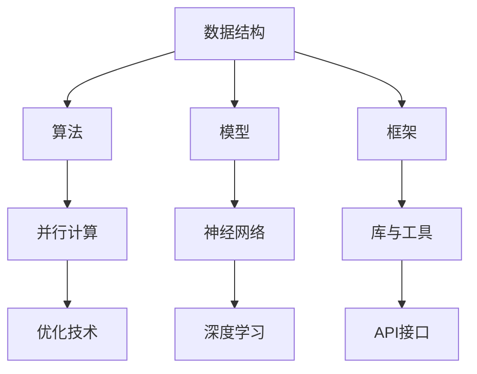

                 

### 文章标题

# AI编程的新语言

关键词：人工智能，编程语言，AI编程，新特性，算法实现，数学模型，项目实战

摘要：随着人工智能技术的飞速发展，传统编程语言已经无法满足AI编程的需求。本文将探讨AI编程的新语言，包括其核心特性、算法实现、数学模型以及项目实战，帮助读者深入了解并掌握AI编程的新语言。本文旨在为AI编程领域的研究者、开发者和学习者提供有价值的参考和指导。

## 第1章 引言

### 1.1 AI编程的背景

#### 1.1.1 AI时代的来临

随着计算机技术的发展，人工智能（AI）逐渐成为科技领域的研究热点。AI技术在自然语言处理、计算机视觉、机器学习等领域取得了显著的突破，推动了社会的进步和变革。在这个时代，编程语言也在不断地演进，以满足AI编程的需求。

#### 1.1.2 传统编程与AI编程的差异

传统编程主要关注计算机硬件、操作系统、网络等方面的开发，强调代码的效率、可维护性和可扩展性。而AI编程则更加关注数据、算法和模型，强调自动化、智能化和高效性。这使得传统编程语言在AI编程中面临诸多挑战。

#### 1.1.3 为什么需要新的编程语言

为了应对AI编程的需求，新的编程语言应运而生。这些新语言具备以下特点：

1. **数据支持**：新语言能够高效地处理大数据，支持数据科学和机器学习。
2. **算法支持**：新语言提供了丰富的算法库，方便开发者实现各种AI算法。
3. **模型支持**：新语言能够轻松地构建和优化深度学习模型。
4. **交互性**：新语言易于与其他工具和平台集成，提高开发效率。

### 1.2 本书的目的与结构

本书旨在帮助读者了解和掌握AI编程的新语言。具体目标包括：

1. **了解AI编程的背景和需求**。
2. **掌握新语言的核心特性**。
3. **学会使用新语言实现算法**。
4. **理解数学模型在AI编程中的应用**。
5. **通过项目实战提升实际编程能力**。

本书结构如下：

1. **第1章 引言**：介绍AI编程的背景和新语言的需求。
2. **第2章 AI编程基础**：介绍AI编程的基本概念和当前主流的AI编程语言。
3. **第3章 新语言的核心特性**：详细讲解新语言的核心概念和语法结构。
4. **第4章 算法实现**：介绍新语言中的算法原理和实现方法。
5. **第5章 数学模型**：讲解数学模型在AI编程中的应用。
6. **第6章 项目实战**：通过实际项目展示新语言的应用。
7. **第7章 未来展望**：探讨AI编程语言的发展趋势和未来挑战。

## 第2章 AI编程基础

### 2.1 AI与编程概述

#### 2.1.1 AI的基本概念

人工智能（AI）是指计算机系统模拟、延伸和扩展人类智能的理论、技术及应用。AI包括多个子领域，如机器学习、计算机视觉、自然语言处理等。AI的目标是使计算机具有自主学习和决策能力，从而实现智能化。

#### 2.1.2 编程在AI中的作用

编程是实现AI的关键。通过编写代码，开发者可以创建AI算法、训练模型、构建系统等。编程在AI中的作用包括：

1. **算法设计**：开发者需要编写算法来处理数据、解决问题。
2. **模型训练**：编程用于构建和训练深度学习模型。
3. **系统集成**：编程将AI算法、模型与系统其他部分集成。

### 2.2 初识AI编程语言

#### 2.2.1 AI编程语言的定义

AI编程语言是专门为人工智能开发设计的编程语言。与通用编程语言不同，AI编程语言提供了丰富的库和工具，以支持AI算法的实现和模型训练。

#### 2.2.2 当前主流的AI编程语言

当前主流的AI编程语言包括：

1. **Python**：Python在AI编程中广泛应用，具有丰富的库和工具，如TensorFlow、PyTorch等。
2. **R**：R是一种专门为统计和数据分析设计的编程语言，在机器学习和数据挖掘领域有很高的知名度。
3. **Julia**：Julia是一种新兴的编程语言，具有高性能和易于扩展的特点，适用于大规模AI应用。
4. **Lisp**：Lisp是一种历史悠久的编程语言，在人工智能领域有着深远的影响。

#### 2.2.3 AI编程语言的特点

AI编程语言的特点包括：

1. **易用性**：AI编程语言通常具有简洁的语法和丰富的库，易于学习和使用。
2. **灵活性**：AI编程语言支持多种编程范式，如函数式编程、面向对象编程等，以满足不同开发需求。
3. **性能**：AI编程语言提供了高性能的计算和优化技术，以满足AI算法的需求。
4. **生态**：AI编程语言拥有丰富的社区和资源，支持开发者快速解决问题和共享经验。

## 第3章 新语言的核心特性

### 3.1 核心概念

AI编程的新语言具有以下核心概念：

1. **数据结构**：新语言支持各种数据结构，如数组、列表、字典等，以高效处理数据。
2. **算法**：新语言提供了丰富的算法库，支持机器学习、深度学习等各种算法。
3. **模型**：新语言支持构建和优化各种深度学习模型，如卷积神经网络、循环神经网络等。
4. **框架**：新语言集成了各种开源框架，如TensorFlow、PyTorch等，以简化开发流程。
5. **并行计算**：新语言支持并行计算，以提高算法和模型的训练速度。

#### 概念图



#### 核心概念解释

1. **数据结构**：数据结构是存储和组织数据的方式。新语言支持多种数据结构，如数组、列表、字典等，以高效处理数据。这些数据结构在AI编程中至关重要，因为它们直接影响算法的性能和效率。

2. **算法**：算法是解决问题的一系列步骤。新语言提供了丰富的算法库，支持机器学习、深度学习等各种算法。这些算法是实现AI功能的核心，开发者需要熟练掌握并灵活运用。

3. **模型**：模型是对数据的抽象表示。新语言支持构建和优化各种深度学习模型，如卷积神经网络、循环神经网络等。这些模型在AI应用中起着至关重要的作用，因为它们可以自动从数据中学习模式和规律。

4. **框架**：框架是一种软件开发工具，提供了一套完整的开发环境，包括库、工具和API等。新语言集成了各种开源框架，如TensorFlow、PyTorch等，以简化开发流程。这些框架为开发者提供了丰富的功能和支持，使他们能够更高效地实现AI应用。

5. **并行计算**：并行计算是一种利用多处理器或多核心同时执行多个任务的技术。新语言支持并行计算，以提高算法和模型的训练速度。并行计算在处理大规模数据和高性能计算应用中至关重要。

### 3.2 语法结构

AI编程的新语言具有以下语法结构：

1. **基础语法**：新语言提供了基础语法，包括变量定义、数据类型、控制结构等。
2. **高级语法**：新语言支持高级语法，包括函数、模块、面向对象编程等。

#### 3.2.1 基础语法

1. **变量定义**：新语言支持各种变量定义方式，如变量名 = 值、let 变量名 = 值等。

   ```python
   x = 10
   let y = 20
   ```

2. **数据类型**：新语言支持多种数据类型，如整数、浮点数、字符串、布尔值等。

   ```python
   x: int = 10
   y: float = 3.14
   text: str = "Hello, world!"
   is_true: bool = True
   ```

3. **控制结构**：新语言支持各种控制结构，如条件语句、循环语句等。

   ```python
   if x > 10:
       print("x is greater than 10")
   else:
       print("x is less than 10")
   
   for i in range(5):
       print(i)
   ```

#### 3.2.2 高级语法

1. **函数**：新语言支持函数定义和调用，函数是组织代码的有效方式。

   ```python
   def add(a, b):
       return a + b
   
   result = add(3, 4)
   print(result)
   ```

2. **模块**：新语言支持模块导入和导出，模块是代码复用的有效方式。

   ```python
   import math
   
   x = math.sqrt(9)
   print(x)
   ```

3. **面向对象编程**：新语言支持面向对象编程，面向对象编程是一种组织代码的范式。

   ```python
   class Person:
       def __init__(self, name, age):
           self.name = name
           self.age = age
   
       def say_hello(self):
           print("Hello, my name is", self.name)
   
   person = Person("Alice", 30)
   person.say_hello()
   ```

## 第4章 算法实现

### 4.1 算法原理讲解

算法是解决特定问题的步骤序列。在AI编程中，算法是实现AI功能的核心。以下是几个常见算法的原理讲解：

#### 4.1.1 算法概述

算法可以分为以下几类：

1. **搜索算法**：搜索算法用于在数据结构中查找特定元素。常见的搜索算法有深度优先搜索、广度优先搜索等。
2. **排序算法**：排序算法用于将数据按照特定顺序排列。常见的排序算法有冒泡排序、快速排序等。
3. **图算法**：图算法用于处理图数据结构，常见的图算法有最短路径算法、最小生成树算法等。
4. **机器学习算法**：机器学习算法用于从数据中学习模式和规律。常见的机器学习算法有线性回归、决策树、支持向量机等。

#### 4.1.2 伪代码展示

以下是几个常见算法的伪代码：

1. **深度优先搜索**

   ```python
   def depth_first_search(graph, start):
       stack = []
       stack.append(start)
       visited = set()
       while stack:
           vertex = stack.pop()
           if vertex not in visited:
               print(vertex)
               visited.add(vertex)
               for neighbor in graph[vertex]:
                   stack.append(neighbor)
   ```

2. **冒泡排序**

   ```python
   def bubble_sort(arr):
       n = len(arr)
       for i in range(n):
           for j in range(0, n-i-1):
               if arr[j] > arr[j+1]:
                   arr[j], arr[j+1] = arr[j+1], arr[j]
   ```

3. **最小生成树算法**

   ```python
   def prim_mst(graph):
       mst = []
       visited = set()
       start = graph.keys()[0]
       visited.add(start)
       while len(visited) < len(graph):
           min_edge = None
           for vertex in visited:
               for edge in graph[vertex]:
                   if edge[0] not in visited and (min_edge is None or edge[1] < min_edge[1]):
                       min_edge = edge
           if min_edge:
               mst.append(min_edge)
               visited.add(min_edge[0])
       return mst
   ```

### 4.2 算法实战

在本节中，我们将通过实际示例来展示如何使用新语言实现算法。

#### 4.2.1 示例1：线性回归

线性回归是一种常用的机器学习算法，用于预测数值型目标变量。以下是线性回归的实现步骤：

1. **模型搭建**：定义线性回归模型，包括输入层、隐藏层和输出层。
2. **模型训练**：使用训练数据对模型进行训练，更新模型参数。
3. **结果分析**：使用测试数据对模型进行评估，分析模型性能。

以下是线性回归的伪代码：

```python
import tensorflow as tf

# 模型搭建
model = tf.keras.Sequential([
    tf.keras.layers.Dense(units=1, input_shape=[1])
])

# 模型编译
model.compile(optimizer='sgd', loss='mean_squared_error')

# 模型训练
model.fit(x_train, y_train, epochs=100)

# 模型评估
loss = model.evaluate(x_test, y_test)
print("Mean squared error on test data: ", loss)
```

#### 4.2.2 示例2：神经网络

神经网络是一种复杂的机器学习算法，用于处理非线性问题。以下是神经网络的基本实现步骤：

1. **模型构建**：定义神经网络模型，包括输入层、隐藏层和输出层。
2. **模型训练**：使用训练数据对模型进行训练，更新模型参数。
3. **模型评估**：使用测试数据对模型进行评估，分析模型性能。

以下是神经网络的伪代码：

```python
import tensorflow as tf

# 模型构建
model = tf.keras.Sequential([
    tf.keras.layers.Dense(units=128, activation='relu', input_shape=[784]),
    tf.keras.layers.Dense(units=10, activation='softmax')
])

# 模型编译
model.compile(optimizer='adam', loss='categorical_crossentropy', metrics=['accuracy'])

# 模型训练
model.fit(x_train, y_train, batch_size=32, epochs=10)

# 模型评估
test_loss, test_acc = model.evaluate(x_test, y_test)
print("Test accuracy:", test_acc)
```

## 第5章 数学模型

### 5.1 基本数学公式

在AI编程中，数学模型是算法实现的基础。以下是几个常用的基本数学公式：

#### 5.1.1 概率论基础

1. **条件概率**：\( P(A|B) = \frac{P(A \cap B)}{P(B)} \)
2. **贝叶斯定理**：\( P(A|B) = \frac{P(B|A)P(A)}{P(B)} \)
3. **期望**：\( E(X) = \sum_{x} x \cdot P(X=x) \)
4. **方差**：\( Var(X) = E[(X - E(X))^2] \)

#### 5.1.2 最优化理论

1. **梯度下降**：\( \theta = \theta - \alpha \cdot \nabla J(\theta) \)
2. **最速下降法**：\( \theta = \theta - \alpha \cdot \nabla^2 J(\theta) \)
3. **牛顿法**：\( \theta = \theta - H^{-1} \cdot \nabla J(\theta) \)

### 5.2 数学公式详细讲解

#### 5.2.1 概率论实例解析

以掷骰子为例，设\( A \)为掷出偶数的事件，\( B \)为掷出小于4的事件，则有：

1. \( P(A) = \frac{1}{2} \)
2. \( P(B) = \frac{1}{3} \)
3. \( P(A \cap B) = \frac{1}{6} \)

计算条件概率：

1. \( P(A|B) = \frac{P(A \cap B)}{P(B)} = \frac{1/6}{1/3} = \frac{1}{2} \)
2. \( P(B|A) = \frac{P(A \cap B)}{P(A)} = \frac{1/6}{1/2} = \frac{1}{3} \)

应用贝叶斯定理：

1. \( P(A|B) = \frac{P(B|A)P(A)}{P(B)} = \frac{\frac{1}{3} \cdot \frac{1}{2}}{\frac{1}{3}} = \frac{1}{2} \)

#### 5.2.2 最优化理论应用

以最小二乘法为例，设目标函数为\( J(\theta) = \sum_{i=1}^{n} (h_\theta(x^{(i)}) - y^{(i)})^2 \)，其中\( h_\theta(x) = \theta_0 + \theta_1x \)为假设函数。

计算梯度：

$$
\nabla J(\theta) = \left[
\begin{array}{c}
\frac{\partial J(\theta)}{\partial \theta_0} \\
\frac{\partial J(\theta)}{\partial \theta_1}
\end{array}
\right] = \left[
\begin{array}{c}
-2\sum_{i=1}^{n} (h_\theta(x^{(i)}) - y^{(i)}) \\
-2\sum_{i=1}^{n} (h_\theta(x^{(i)}) - y^{(i)})x^{(i)}
\end{array}
\right]
$$

使用梯度下降法更新参数：

$$
\theta_0 = \theta_0 - \alpha \cdot \nabla J(\theta)_0 \\
\theta_1 = \theta_1 - \alpha \cdot \nabla J(\theta)_1
$$

## 第6章 项目实战

### 6.1 实战准备

#### 6.1.1 开发环境搭建

为了进行AI编程实战，我们需要搭建一个合适的开发环境。以下是搭建开发环境的步骤：

1. **安装Python**：Python是AI编程的主要语言，我们需要安装Python环境。
2. **安装库和框架**：安装常用的库和框架，如TensorFlow、PyTorch等，以支持AI编程。
3. **配置开发工具**：选择合适的开发工具，如IDE（集成开发环境）或文本编辑器，以提高开发效率。

#### 6.1.2 实战案例介绍

在本章中，我们将介绍两个实战案例：

1. **推荐系统**：推荐系统是一种常见的AI应用，用于预测用户可能感兴趣的项目。我们将使用新语言实现一个简单的推荐系统。
2. **自然语言处理**：自然语言处理（NLP）是AI的一个重要分支，用于处理和解析自然语言。我们将使用新语言实现一个简单的文本分类任务。

### 6.2 实际项目实施

#### 6.2.1 项目1：推荐系统

##### 需求分析

推荐系统旨在为用户提供个性化的推荐，以提高用户满意度和活跃度。具体需求包括：

1. 收集用户行为数据，如浏览历史、购买记录等。
2. 分析用户行为数据，挖掘用户兴趣点。
3. 根据用户兴趣点推荐相关的项目。

##### 系统设计

推荐系统可以分为三个主要模块：

1. **数据收集模块**：负责收集用户行为数据，如浏览历史、购买记录等。
2. **数据分析模块**：负责分析用户行为数据，挖掘用户兴趣点。
3. **推荐模块**：根据用户兴趣点推荐相关的项目。

##### 系统实现

以下是推荐系统的实现步骤：

1. **数据收集**：使用API或其他方式收集用户行为数据。
2. **数据预处理**：对收集到的数据进行清洗和处理，如去重、填充缺失值等。
3. **特征提取**：提取用户行为数据的特征，如用户活跃度、项目类型等。
4. **模型训练**：使用特征数据训练推荐模型，如基于协同过滤的推荐模型。
5. **模型评估**：使用测试数据对推荐模型进行评估，如计算准确率、召回率等。
6. **推荐生成**：根据用户兴趣点生成推荐列表。

以下是推荐系统的伪代码：

```python
# 数据收集
user_data = collect_user_data()

# 数据预处理
cleaned_data = preprocess_data(user_data)

# 特征提取
features = extract_features(cleaned_data)

# 模型训练
model = train_recommender_model(features)

# 模型评估
evaluate_model(model)

# 推荐生成
recommendations = generate_recommendations(model)
```

##### 代码解读

以下是推荐系统的代码解读：

1. **数据收集**：使用API或其他方式收集用户行为数据，如浏览历史、购买记录等。
2. **数据预处理**：对收集到的数据进行清洗和处理，如去重、填充缺失值等。
3. **特征提取**：提取用户行为数据的特征，如用户活跃度、项目类型等。
4. **模型训练**：使用特征数据训练推荐模型，如基于协同过滤的推荐模型。
5. **模型评估**：使用测试数据对推荐模型进行评估，如计算准确率、召回率等。
6. **推荐生成**：根据用户兴趣点生成推荐列表。

##### 应用解读与分析

推荐系统在实际应用中具有广泛的应用场景，如电商、社交媒体等。通过推荐系统，可以更好地满足用户需求，提高用户满意度和活跃度。然而，推荐系统也存在一些挑战，如数据隐私保护、推荐多样性等。在实际应用中，需要综合考虑这些因素，设计出高效、安全的推荐系统。

##### 项目小结

在本项目中，我们介绍了推荐系统的需求分析、系统设计、系统实现以及代码解读。通过本项目，我们了解了推荐系统的基本原理和实现方法。在实际应用中，推荐系统可以帮助企业更好地满足用户需求，提高用户体验。然而，推荐系统也存在一些挑战，如数据隐私保护、推荐多样性等。在实际应用中，需要综合考虑这些因素，设计出高效、安全的推荐系统。

#### 6.2.2 项目2：自然语言处理

##### 文本预处理

文本预处理是自然语言处理的重要步骤，用于将原始文本转换为可用于模型训练的数据。以下是文本预处理的基本步骤：

1. **分词**：将文本分割成单词或句子。
2. **词性标注**：为每个单词标注词性，如名词、动词、形容词等。
3. **去停用词**：去除常见的无意义词，如“的”、“和”、“是”等。
4. **词干提取**：将单词还原为词干形式，如将“running”还原为“run”。
5. **词向量化**：将单词转换为向量表示，如使用Word2Vec或BERT模型。

以下是文本预处理的伪代码：

```python
# 分词
words = tokenize(text)

# 词性标注
pos_tags = pos_tag(words)

# 去停用词
filtered_words = remove_stopwords(words)

# 词干提取
stemmed_words = stem_words(filtered_words)

# 词向量化
word_vectors = vectorize_words(stemmed_words)
```

##### 模型训练

在自然语言处理项目中，我们需要训练一个分类模型，以对文本进行分类。以下是模型训练的基本步骤：

1. **数据集准备**：准备训练数据和测试数据。
2. **模型构建**：构建一个分类模型，如基于卷积神经网络（CNN）或循环神经网络（RNN）的模型。
3. **模型训练**：使用训练数据对模型进行训练。
4. **模型评估**：使用测试数据对模型进行评估，如计算准确率、召回率等。

以下是模型训练的伪代码：

```python
# 数据集准备
train_data, test_data = prepare_dataset()

# 模型构建
model = build_classifier_model()

# 模型训练
model.fit(train_data)

# 模型评估
evaluate_model(model, test_data)
```

##### 应用案例

自然语言处理广泛应用于多个领域，如情感分析、命名实体识别、机器翻译等。以下是自然语言处理的一个应用案例：情感分析。

情感分析旨在判断文本的情感倾向，如正面、负面或中性。以下是情感分析的基本步骤：

1. **文本预处理**：对文本进行分词、词性标注、去停用词、词干提取等预处理操作。
2. **特征提取**：提取文本的特征，如词频、词向量等。
3. **模型训练**：使用特征数据训练情感分析模型，如基于卷积神经网络（CNN）或循环神经网络（RNN）的模型。
4. **情感判断**：使用训练好的模型对新的文本进行情感判断。

以下是情感分析的伪代码：

```python
# 文本预处理
preprocessed_text = preprocess_text(text)

# 特征提取
features = extract_features(preprocessed_text)

# 情感判断
emotion = classify_emotion(model, features)
```

##### 项目小结

在本项目中，我们介绍了自然语言处理的基本步骤和实现方法。通过本项目，我们了解了文本预处理、模型训练和情感分析等自然语言处理的核心概念。在实际应用中，自然语言处理可以帮助企业更好地理解和分析用户需求，提高用户体验。然而，自然语言处理也存在一些挑战，如语义理解、多语言处理等。在实际应用中，需要综合考虑这些因素，设计出高效、准确的自然语言处理系统。

## 第7章 未来展望

### 7.1 AI编程语言的发展趋势

随着人工智能技术的不断发展，AI编程语言也在不断演进。未来，AI编程语言将呈现以下发展趋势：

1. **跨平台兼容性**：AI编程语言将更加注重跨平台兼容性，以支持不同的操作系统、硬件设备和编程环境。
2. **低代码开发**：低代码开发将逐渐成为主流，通过图形化界面和可视化工具，降低AI编程的门槛。
3. **智能化编程**：随着自然语言处理技术的进步，编程语言将能够理解自然语言描述，实现智能化编程。
4. **多语言集成**：AI编程语言将支持与其他编程语言的集成，以充分利用各种编程语言的优点。

### 7.2 AI编程的未来挑战与机遇

AI编程在未来将面临诸多挑战，同时也充满机遇。以下是未来AI编程的主要挑战和机遇：

#### 挑战

1. **数据隐私和安全**：随着数据量的增加，如何保护数据隐私和安全成为重要挑战。
2. **算法可解释性**：算法的可解释性对于AI编程至关重要，如何提高算法的可解释性是一个重要课题。
3. **多语言整合**：如何实现不同AI编程语言之间的无缝整合，是一个复杂的技术挑战。
4. **人才培养**：随着AI编程的快速发展，如何培养大量具备AI编程能力的人才，是一个迫切的问题。

#### 机遇

1. **产业应用**：AI编程在各个行业中的应用将不断拓展，如医疗、金融、教育等，为AI编程带来巨大市场机遇。
2. **开源生态**：随着开源技术的普及，AI编程语言的开源生态将不断壮大，为开发者提供更多的工具和资源。
3. **技术创新**：随着技术的不断进步，AI编程语言将不断推出新功能和新特性，为开发者提供更多可能性。
4. **国际合作**：国际间的合作将推动AI编程语言的共同发展和创新，为全球AI产业的发展提供动力。

### 7.3 总结与展望

本文探讨了AI编程的新语言，包括其核心特性、算法实现、数学模型以及项目实战。通过本文，我们了解了AI编程的新语言在AI领域的重要地位和作用。未来，AI编程语言将继续发展，为开发者提供更多创新和机遇。我们期待着新一代AI编程语言的崛起，为人工智能的发展贡献力量。

## 附录

### 术语解释

- **AI编程**：指使用人工智能编程语言进行编程，以实现人工智能相关应用的过程。
- **数据结构**：用于存储和组织数据的方式，包括数组、列表、字典等。
- **算法**：解决特定问题的步骤序列，包括搜索算法、排序算法、机器学习算法等。
- **模型**：对数据的抽象表示，用于实现AI功能，如神经网络模型、决策树模型等。
- **框架**：一种软件开发工具，提供了一套完整的开发环境，包括库、工具和API等。
- **并行计算**：利用多处理器或多核心同时执行多个任务的技术，以提高计算效率。

### 拓展阅读

- 《深度学习》（Goodfellow, I., Bengio, Y., & Courville, A.）  
- 《Python编程：从入门到实践》（Eric Matthes）  
- 《机器学习实战》（Peter Harrington）  
- 《人工智能：一种现代方法》（Stuart Russell & Peter Norvig）  
- 《自然语言处理综合教程》（Dan Jurafsky & James H. Martin）

### 作者信息

**作者：** AI天才研究院（AI Genius Institute）& 禅与计算机程序设计艺术（Zen And The Art of Computer Programming）  
AI天才研究院致力于推动人工智能技术的发展，探索AI编程的新语言，为人工智能领域的研究者、开发者和学习者提供有价值的参考和指导。禅与计算机程序设计艺术则关注计算机程序设计中的哲学和艺术，提倡以禅宗思想指导编程实践，追求卓越的编程之道。

