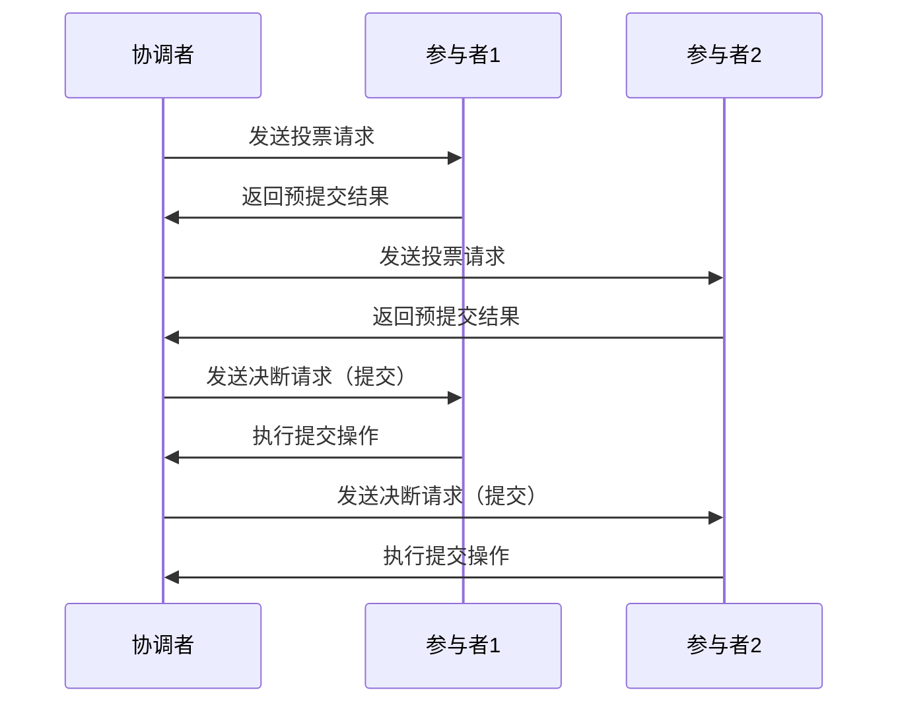

                 


## 《本质是异构系统的数据一致性问题》

### 关键词：异构系统，数据一致性，分布式数据库，一致性协议，一致性算法，分布式缓存

### 摘要：

本文将深入探讨异构系统中的数据一致性问题。首先，我们将介绍数据一致性的核心概念和挑战，然后分析异构系统的组成与特点。接着，我们将深入探讨数据一致性的理论基础，包括数学模型和算法原理，并通过Mermaid流程图展示核心概念之间的关系。随后，我们将详细阐述分布式数据库的一致性协议，如两阶段提交（2PC）和三阶段提交（3PC），以及分布式缓存的一致性策略。最后，我们将探讨跨数据存储系统的一致性，包括系统集成与数据同步、分布式事务管理和数据复制与数据分区。通过一系列的算法实现和项目实战，本文旨在为读者提供全面的数据一致性解决方案和实践指南。

## 引言

在当今的分布式计算环境中，异构系统已成为常态。这些系统通常由多种不同类型的硬件、操作系统、数据库和应用程序组成，其复杂性和多样性使得数据一致性问题变得尤为重要。数据一致性指的是系统中的数据在不同组件间保持一致的状态。然而，在异构系统中，数据一致性的实现面临诸多挑战，如网络延迟、节点故障、数据复制和分区等。

本文旨在深入探讨异构系统中的数据一致性问题，帮助读者理解数据一致性的核心概念、挑战和解决方案。通过本文的阅读，读者将能够：

1. 理解数据一致性的定义、类型和重要性。
2. 分析异构系统的组成与特点。
3. 掌握数据一致性的理论基础，包括数学模型和算法原理。
4. 详细了解分布式数据库的一致性协议，如两阶段提交和三阶段提交。
5. 理解分布式缓存的一致性策略，包括版本向量、软状态一致性等。
6. 掌握跨数据存储系统的一致性策略，包括系统集成与数据同步、分布式事务管理和数据复制与数据分区。
7. 通过算法实现和项目实战，了解数据一致性的最佳实践。

本文的结构如下：

1. 第一部分：数据一致性的理论基础
   - 第1章：数据一致性的核心概念
   - 第2章：异构系统的组成与特点
   - 第3章：数据一致性的理论基础

2. 第二部分：异构系统中的数据一致性策略
   - 第4章：分布式数据库的一致性协议
   - 第5章：分布式缓存的一致性策略
   - 第6章：跨数据存储系统的一致性

3. 第三部分：数据一致性的算法实现
   - 第7章：一致性哈希算法

4. 第四部分：数据一致性的项目实战
   - 第8章：案例分析
   - 第9章：构建实践指南

5. 附录：参考资料与扩展阅读

### 数据一致性的核心概念

数据一致性是指系统中的数据在不同组件间保持一致的状态。在分布式系统中，数据一致性尤为重要，因为它直接关系到系统的可靠性、可用性和性能。以下是对数据一致性的核心概念和类型的介绍：

#### 1.1 数据一致性的定义

数据一致性指的是系统中的数据在不同组件间保持一致的状态。具体来说，当多个节点共同访问和修改同一份数据时，这些节点需要确保最终数据的状态是一致的。数据一致性可以体现在多个方面，如：

- **强一致性**：所有节点在同一时间看到相同的数据状态。这种一致性级别要求较高的同步机制，如分布式数据库的一致性协议。
- **最终一致性**：系统最终会达到一致的状态，但过程中可能存在短暂的分歧。这种一致性级别允许一定程度的数据延迟，适用于大多数Web应用程序。

#### 1.2 数据一致性的类型

数据一致性可以分为以下几种类型：

- **强一致性（Strong Consistency）**：所有节点在同一时间看到相同的数据状态。强一致性是最高级别的一致性，但实现起来较为复杂，因为需要保证全局的同步。
- **最终一致性（Eventual Consistency）**：系统最终会达到一致的状态，但过程中可能存在短暂的分歧。最终一致性允许一定程度的数据延迟，适用于大多数Web应用程序，如社交媒体、电商等。
- **一致性哈希（Consistent Hashing）**：一致性哈希是一种用于分布式系统的负载均衡技术，通过哈希函数将数据映射到不同的节点。这种一致性策略可以有效地解决节点故障和数据分区的问题。
- **因果一致性（ causal Consistency）**：因果一致性确保事件的发生顺序在所有节点上一致。这种一致性策略适用于需要严格保证事件顺序的应用程序，如分布式计算和分布式存储。

#### 1.3 数据一致性的挑战

在分布式系统中，实现数据一致性面临诸多挑战：

- **网络延迟**：网络延迟可能导致数据同步延迟，影响数据一致性。
- **节点故障**：节点故障可能导致数据丢失或不一致。
- **数据复制**：为了提高可用性和容错性，数据通常会在多个节点上进行复制。但数据复制可能导致一致性问题。
- **分区**：分区是指系统中的一部分节点无法与其他节点通信。分区是分布式系统中的一个常见问题，可能导致数据不一致。
- **负载均衡**：为了提高系统的性能，负载均衡策略可能将数据分配到不同的节点。但负载均衡可能导致数据在不同节点间的不一致。

#### 1.4 数据一致性的重要性

数据一致性对分布式系统的稳定性和可靠性至关重要。以下是一些关键原因：

- **用户体验**：数据一致性确保用户始终看到最新的数据，提高用户体验。
- **业务连续性**：数据一致性确保业务流程的正常运行，避免因数据不一致导致业务中断。
- **系统性能**：数据一致性有助于优化系统性能，减少数据访问延迟。
- **安全性**：数据一致性确保数据的安全性和完整性，防止数据泄露和篡改。

通过理解数据一致性的核心概念和挑战，我们可以更好地设计、实现和维护分布式系统中的数据一致性。接下来，我们将进一步探讨异构系统的组成与特点，为深入分析数据一致性问题奠定基础。

### 异构系统的组成与特点

#### 2.1 异构系统的定义

异构系统（Heterogeneous System）是指由多种不同类型、不同硬件、不同软件和不同架构的组件组成的系统。这些组件可以包括不同类型的计算机、服务器、数据库、网络设备、操作系统、编程语言和应用程序等。在异构系统中，每个组件都有其特定的功能、性能、可扩展性和可靠性特点。

#### 2.2 异构系统的组成

异构系统的组成可以从不同的层次结构进行分析：

- **硬件层**：硬件层包括各种不同类型的计算机、服务器、存储设备和网络设备。这些硬件可能具有不同的计算能力、存储容量、网络带宽和可靠性。
- **软件层**：软件层包括操作系统、数据库管理系统、编程语言和中间件。这些软件可能运行在不同的硬件平台上，具有不同的性能、兼容性和可扩展性。
- **应用层**：应用层包括各种应用程序和业务逻辑。这些应用程序可能基于不同的编程语言和框架，服务于不同的业务需求。

#### 2.3 异构系统的特点

异构系统具有以下特点：

- **多样性**：异构系统由多种不同类型的组件组成，包括硬件、软件和应用。这种多样性增加了系统的复杂性和管理难度。
- **异构性**：异构系统中的组件具有不同的架构、性能和兼容性。这种异构性可能导致数据一致性和通信问题的复杂性增加。
- **可扩展性**：异构系统通常具有较高的可扩展性，可以灵活地添加或替换不同类型的组件，以适应不断变化的需求。
- **灵活性**：异构系统可以根据不同的需求和场景选择最适合的组件，提高系统的灵活性和适应性。
- **性能差异**：异构系统中的组件具有不同的性能，这可能导致数据访问和处理速度的差异，影响系统的整体性能。

#### 2.4 异构系统的优势与挑战

异构系统具有以下优势：

- **资源优化**：异构系统可以根据不同的需求和性能要求选择最合适的硬件、软件和应用组件，实现资源的最佳利用。
- **高可用性**：异构系统可以通过多种冗余机制和容错策略提高系统的可用性和可靠性。
- **灵活性和可扩展性**：异构系统可以灵活地调整和扩展不同类型的组件，以适应不断变化的业务需求。

然而，异构系统也面临以下挑战：

- **复杂性**：异构系统的多样性增加了系统的复杂性和管理难度，需要专业的技术和管理能力。
- **兼容性问题**：异构系统中的组件可能具有不同的架构和兼容性，可能导致数据一致性和通信问题。
- **性能瓶颈**：异构系统中的性能差异可能导致数据访问和处理速度的不平衡，影响系统的整体性能。

#### 2.5 异构系统中的数据一致性问题

在异构系统中，数据一致性问题尤为突出。以下是几个关键方面：

- **数据访问延迟**：由于异构系统中的组件具有不同的性能，数据访问速度可能存在显著差异，导致数据一致性问题。
- **数据复制和同步**：异构系统中的数据通常会在多个节点上进行复制和同步。但由于组件的差异，数据复制和同步的机制和策略可能不同，导致数据一致性问题。
- **节点故障和容错**：异构系统中的节点可能具有不同的可靠性和容错能力。节点故障可能导致数据丢失或不一致。

为了解决这些问题，需要设计合适的异构系统数据一致性策略，包括分布式数据库的一致性协议、分布式缓存的一致性策略和跨数据存储系统的一致性策略。接下来，我们将深入探讨数据一致性的理论基础，为解决异构系统中的数据一致性问题提供理论支持。

### 数据一致性的理论基础

#### 3.1 数据一致性的数学模型

数据一致性是一个复杂的系统问题，需要从多个角度进行分析和建模。在本节中，我们将介绍几种常用的数据一致性的数学模型，包括一致性哈希、向量时钟和因果一致性。

**一致性哈希（Consistent Hashing）**

一致性哈希是一种用于分布式系统的负载均衡技术。它的基本思想是将数据映射到一个哈希空间中，通过哈希函数将数据分配到不同的节点。一致性哈希的关键特性是当节点发生变化时，只有一小部分数据需要重新分配，从而提高系统的可扩展性和容错性。

一致性哈希的数学模型如下：

1. **哈希空间**：定义一个哈希空间H，用于表示所有可能的数据。
2. **哈希函数**：定义一个哈希函数h，将数据映射到哈希空间H。通常，哈希函数是一个从数据到哈希值的映射，如哈希值可以是整数或字符串。
3. **节点映射**：将每个节点映射到一个哈希值，通常使用一个哈希函数。节点的哈希值代表节点的位置。
4. **数据分配**：将数据分配到节点，通过哈希函数确定数据所在节点的哈希值。如果数据所在节点的哈希值小于当前节点的哈希值，则数据分配到当前节点；否则，数据分配到下一个节点的哈希值。

**向量时钟（Vector Clocks）**

向量时钟是一种用于分布式系统时间同步和数据一致性建模的机制。向量时钟基于因果关系来表示不同节点的时间戳，从而实现数据的一致性。

向量时钟的数学模型如下：

1. **时钟向量**：每个节点维护一个时钟向量，表示节点之间的因果关系。时钟向量的维度等于系统中节点的数量。
2. **更新规则**：当一个事件发生时，相关节点的时钟向量按照以下规则更新：
   - 对于每个参与事件的节点，将其时钟向量中的对应位置设置为该节点的本地时间。
   - 对于其他节点，将其时钟向量中的对应位置设置为参与事件节点的时钟向量中的最大值。
3. **时间比较**：通过比较时钟向量的差值，可以判断两个事件之间的因果关系。

**因果一致性（Causal Consistency）**

因果一致性是一种数据一致性模型，它确保事件的发生顺序在所有节点上一致。因果一致性通过维护事件之间的因果关系来保证数据的一致性。

因果一致性的数学模型如下：

1. **事件标记**：为每个事件分配一个唯一的标识符（如时间戳或哈希值）。
2. **因果关系**：定义事件之间的因果关系，例如，事件A先于事件B发生。
3. **一致性保证**：确保事件按照因果关系在所有节点上一致发生。具体实现方法包括：
   - **日志同步**：通过日志同步机制，确保每个节点都能获取到所有事件的记录。
   - **事件顺序**：通过维护事件顺序的机制，确保事件按照因果关系在所有节点上一致发生。

**3.2 数据一致性的算法原理**

数据一致性的实现通常依赖于一系列算法，这些算法用于确保系统中的数据在不同组件间保持一致。以下介绍几种常用的数据一致性算法：

**两阶段提交（2PC）**

两阶段提交是一种分布式事务管理协议，用于确保分布式系统中的数据一致性。2PC算法分为两个阶段：

1. **投票阶段**：协调者向参与者发送投票请求，参与者对事务进行预处理，并将结果（预提交或预回滚）返回给协调者。
2. **决断阶段**：协调者根据参与者的投票结果决定事务的最终状态（提交或回滚），并将决策结果通知所有参与者。

**三阶段提交（3PC）**

三阶段提交是对两阶段提交的改进，旨在解决两阶段提交中的一些问题，如协调者故障和参与者故障。3PC算法分为三个阶段：

1. **预备阶段**：协调者向参与者发送预备请求，参与者对事务进行预处理，并将结果返回给协调者。
2. **提交阶段**：协调者根据参与者的预备结果决定事务的最终状态，并将决策结果通知所有参与者。
3. **决断阶段**：参与者根据协调者的决策结果执行最终状态，如提交或回滚。

**版本向量（Vector Clocks）**

版本向量是一种用于分布式系统时间同步和数据一致性的算法。版本向量通过维护事件之间的因果关系来保证数据的一致性。版本向量算法的实现通常包括以下步骤：

1. **初始化**：为每个节点分配一个初始版本向量。
2. **事件记录**：在每个节点上发生事件时，更新版本向量，记录事件的时间戳。
3. **事件传播**：将事件及其版本向量传播到其他节点。
4. **事件比较**：通过比较版本向量，判断事件之间的因果关系。

**3.3 数据一致性的 Mermaid 流程图**

为了更直观地展示数据一致性的核心概念和算法原理，我们可以使用Mermaid流程图来表示。以下是一个简单的Mermaid流程图示例，展示了两阶段提交（2PC）的流程：



通过这个Mermaid流程图，我们可以清晰地看到两阶段提交（2PC）的流程和关键步骤，从而更好地理解数据一致性的实现原理。

#### 3.4 数据一致性的案例分析

为了更好地理解数据一致性的理论基础，我们可以通过一个简单的案例进行分析。

**案例：分布式库存管理系统**

假设一个电子商务公司使用分布式库存管理系统来管理商品库存。该系统由多个分布式数据库节点组成，每个节点存储一部分商品库存信息。以下是一个简单的数据一致性案例分析：

1. **初始状态**：每个节点的商品库存信息如下：
   - 节点A：商品A库存100件
   - 节点B：商品B库存200件
   - 节点C：商品C库存300件

2. **事务处理**：
   - 事务1：用户购买商品A，库存减少1件
   - 事务2：用户购买商品B，库存减少2件
   - 事务3：用户购买商品C，库存减少3件

3. **一致性要求**：确保最终所有节点的商品库存信息保持一致。

通过两阶段提交（2PC）算法，我们可以实现数据的一致性：

1. **投票阶段**：
   - 协调者向节点A、节点B和节点C发送投票请求，询问是否可以提交事务。
   - 节点A返回预提交结果，表示可以提交。
   - 节点B返回预提交结果，表示可以提交。
   - 节点C返回预提交结果，表示可以提交。

2. **决断阶段**：
   - 协调者根据参与者的投票结果，决定事务的最终状态。
   - 协调者向节点A、节点B和节点C发送决断请求，通知它们执行提交操作。

3. **执行结果**：
   - 节点A将商品A库存减少1件，更新为99件。
   - 节点B将商品B库存减少2件，更新为198件。
   - 节点C将商品C库存减少3件，更新为297件。

最终，所有节点的商品库存信息保持一致，满足数据一致性要求。

通过这个案例，我们可以看到数据一致性的实现过程和关键步骤。在实际应用中，可能需要根据具体需求和场景选择合适的数据一致性算法，如两阶段提交（2PC）、三阶段提交（3PC）或版本向量（Vector Clocks）等。

#### 3.5 数据一致性的最佳实践

在实际应用中，实现数据一致性是一个复杂的过程，需要综合考虑系统的需求、性能和可靠性。以下是一些数据一致性的最佳实践：

1. **选择合适的一致性模型**：根据系统的需求和场景选择合适的数据一致性模型。例如，对于要求严格一致性（强一致性）的系统，可以考虑使用分布式数据库的一致性协议，如两阶段提交（2PC）或三阶段提交（3PC）；对于对一致性要求较低的系统，可以考虑使用最终一致性（Eventual Consistency）。
2. **优化数据复制和同步策略**：在实现数据一致性时，需要优化数据复制和同步策略，以减少数据延迟和冲突。例如，可以使用一致性哈希（Consistent Hashing）算法来分配数据，提高系统的可扩展性和容错性。
3. **监控和故障处理**：实现数据一致性时，需要监控系统的运行状态，及时发现和解决故障。例如，可以通过监控节点健康状态、网络延迟和复制进度来确保数据的一致性。
4. **权衡性能与一致性**：在实际应用中，需要权衡性能与一致性。例如，可以采用软状态一致性（Soft State Consistency）来允许一定程度的数据延迟，提高系统的性能。
5. **持续优化和改进**：数据一致性的实现是一个持续的过程，需要根据系统的运行情况和用户反馈进行优化和改进。例如，可以定期评估一致性策略的适用性，调整配置参数，以提高系统的稳定性和可靠性。

通过遵循这些最佳实践，可以有效地实现数据一致性，提高系统的稳定性和可靠性。

#### 3.6 小结

在本章中，我们介绍了数据一致性的核心概念、类型和挑战，探讨了异构系统的组成与特点，并详细阐述了数据一致性的理论基础，包括数学模型、算法原理和Mermaid流程图。我们还通过案例分析和最佳实践，帮助读者理解数据一致性的实现过程和应用。

理解数据一致性的理论基础对于设计和实现分布式系统至关重要。通过本章的学习，读者应该能够：

1. 理解数据一致性的定义、类型和重要性。
2. 分析异构系统的组成与特点。
3. 掌握数据一致性的理论基础，包括数学模型和算法原理。
4. 使用Mermaid流程图展示数据一致性的核心概念和算法原理。

在下一章中，我们将进一步探讨异构系统中的数据一致性策略，包括分布式数据库的一致性协议、分布式缓存的一致性策略和跨数据存储系统的一致性策略。

### 分布式数据库的一致性协议

#### 4.1 CAP理论

在分布式系统中，一致性（Consistency）、可用性（Availability）和分区容错性（Partition Tolerance）是三个核心特性，它们共同构成了著名的CAP理论。CAP理论由加州大学伯克利分校的Eric Brewer在2000年提出，指出在分布式系统中，这三个特性中只能同时保证两个，而无法同时保证全部三个。

- **一致性（Consistency）**：系统在任何时候都能保证数据的一致状态，即所有节点在同一时间看到相同的数据。
- **可用性（Availability）**：系统始终可以响应客户端的请求，即使部分节点出现故障。
- **分区容错性（Partition Tolerance）**：系统能够在分区（网络分区，即部分节点无法相互通信）的情况下保持运作。

CAP理论指出，当系统面临网络分区时，必须在一致性和可用性之间做出选择。具体来说：

- **CA系统**：保证一致性和可用性，但无法容忍分区。例如，两阶段提交（2PC）和三阶段提交（3PC）协议。
- **CP系统**：保证一致性和分区容错性，但可能牺牲可用性。例如，大多数分布式数据库系统。
- **AP系统**：保证可用性和分区容错性，但可能牺牲一致性。例如，大多数NoSQL数据库系统。

#### 4.2 两阶段提交协议（2PC）

两阶段提交（Two-Phase Commit，2PC）是一种分布式事务管理协议，用于确保分布式系统中的数据一致性。2PC算法分为两个阶段：投票阶段和决断阶段。

**投票阶段**：

1. **协调者（Coordinator）** 向所有参与者（Participants）发送开始事务请求。
2. **参与者** 接收到请求后，对事务进行预处理，如读取数据、加锁等。如果预处理成功，参与者向协调者发送“准备就绪（Ready）”消息；否则，发送“无法准备（Unable）”消息。

**决断阶段**：

1. **协调者** 收集所有参与者的响应。如果所有参与者都返回“Ready”消息，协调者向所有参与者发送“提交（Commit）”消息；否则，发送“回滚（Rollback）”消息。

2. **参与者** 根据协调者的决断消息执行相应的操作。如果收到“Commit”消息，参与者提交事务；否则，参与者回滚事务。

**两阶段提交协议的伪代码**：

```python
# 2PC算法伪代码

# 投票阶段
def prepare():
    if preprocess_transaction():
        return "Ready"
    else:
        return "Unable"

def commit():
    if commit_transaction():
        return "Success"
    else:
        return "Failure"

# 决断阶段
def coordinator_prepare(participants):
    responses = []
    for participant in participants:
        responses.append(participant.prepare())
    if all(responses == "Ready"):
        return "Commit"
    else:
        return "Abort"

def coordinator_commit(participants, decision):
    if decision == "Commit":
        for participant in participants:
            participant.commit()
    elif decision == "Abort":
        for participant in participants:
            participant.rollback()
```

#### 4.3 三阶段提交协议（3PC）

三阶段提交（Three-Phase Commit，3PC）是对两阶段提交（2PC）的改进，旨在解决2PC中的一些问题，如协调者故障和参与者故障。3PC算法分为三个阶段：预备阶段、提交阶段和决断阶段。

**预备阶段**：

1. **协调者（Coordinator）** 向所有参与者（Participants）发送预备请求（Pre-prepare）。
2. **参与者** 接收到预备请求后，对事务进行预处理，如读取数据、加锁等。如果预处理成功，参与者向协调者发送“预备就绪（Pre-Ready）”消息；否则，发送“无法预备（Pre-Unable）”消息。

**提交阶段**：

1. **协调者** 收集所有参与者的预备响应。如果所有参与者都返回“Pre-Ready”消息，协调者向所有参与者发送“提交请求（Prepare）”消息；否则，发送“回滚请求（Abort）”消息。

**决断阶段**：

1. **参与者** 根据协调者的提交请求执行相应的操作。如果收到“Prepare”消息，参与者提交事务；否则，参与者回滚事务。

**三阶段提交协议的伪代码**：

```python
# 3PC算法伪代码

# 预备阶段
def pre_prepare():
    if preprocess_transaction():
        return "Pre-Ready"
    else:
        return "Pre-Unable"

def prepare():
    if commit_transaction():
        return "Ready"
    else:
        return "Unable"

# 决断阶段
def coordinator_pre_prepare():
    responses = []
    for participant in participants:
        responses.append(participant.pre_prepare())
    if all(responses == "Pre-Ready"):
        return "Prepare"
    else:
        return "Abort"

def coordinator_commit(participants, decision):
    if decision == "Prepare":
        for participant in participants:
            participant.commit()
    elif decision == "Abort":
        for participant in participants:
            participant.rollback()
```

#### 4.4 CAP理论在实际应用中的权衡

在分布式数据库系统中，CAP理论是设计数据一致性策略的重要指导原则。在实际应用中，根据业务需求和场景，可能需要在CAP的三个特性之间进行权衡。

1. **一致性（Consistency）**：对于需要严格数据一致性的业务场景，如金融交易系统，可以考虑使用CP系统，牺牲部分可用性和分区容错性。例如，可以使用分布式数据库的一致性协议，如两阶段提交（2PC）或三阶段提交（3PC）。
2. **可用性（Availability）**：对于需要高可用性的业务场景，如电商平台，可以考虑使用AP系统，牺牲部分一致性和分区容错性。例如，可以使用NoSQL数据库系统，如MongoDB或Cassandra，这些系统通常具有最终一致性（Eventual Consistency）。
3. **分区容错性（Partition Tolerance）**：对于需要高分区容错性的业务场景，如社交媒体平台，可以考虑使用CA系统，牺牲部分一致性和可用性。例如，可以使用分布式文件系统，如HDFS或Ceph。

在实际应用中，根据具体需求和场景选择合适的数据一致性策略，可以有效地提高系统的稳定性和可靠性。通过理解和应用CAP理论，我们可以更好地设计和实现分布式数据库系统中的数据一致性。

### 分布式缓存的一致性策略

在分布式系统中，缓存是提高系统性能和响应速度的重要手段。然而，在分布式缓存中实现数据一致性是一个复杂的问题，需要考虑到多种因素。本节将介绍几种常见的分布式缓存一致性策略，包括版本向量（Vector Clocks）和软状态一致性（Soft State Consistency）。

#### 5.1 缓存一致性模型

缓存一致性模型用于确保分布式系统中缓存数据的一致性。缓存一致性模型可以分为以下几种类型：

1. **强一致性（Strong Consistency）**：强一致性模型确保缓存中的数据始终与主数据源保持一致。任何对缓存数据的修改都会立即传播到所有其他缓存节点。强一致性模型通常用于要求严格数据一致性的场景，如金融交易系统。

2. **最终一致性（Eventual Consistency）**：最终一致性模型允许缓存中的数据在一段时间后达到一致状态。在最终一致性模型中，数据可能在不同缓存节点之间存在短暂的差异，但最终会一致。最终一致性模型适用于大多数Web应用程序和社交媒体平台。

3. **因果一致性（Causal Consistency）**：因果一致性模型确保事件按照因果关系在缓存节点上一致发生。因果一致性模型适用于需要严格保证事件顺序的应用程序，如分布式计算和分布式存储。

4. **部分一致性（Partial Consistency）**：部分一致性模型允许缓存节点之间存在一定的不一致，但尽可能减少不一致的范围。部分一致性模型适用于对数据一致性要求不高的场景，如一些缓存优化技术。

#### 5.2 版本向量（Vector Clocks）

版本向量（Vector Clocks）是一种用于分布式缓存时间同步和数据一致性的算法。版本向量通过维护事件之间的因果关系来保证数据的一致性。版本向量由一组整数组成，每个整数表示一个节点的时间戳。

**版本向量的基本原理**：

1. **初始化**：每个节点初始化一个版本向量，表示该节点的时间戳。
2. **事件记录**：在每个节点上发生事件时，更新版本向量，将事件的时间戳增加到版本向量中。
3. **事件传播**：将事件及其版本向量传播到其他节点。
4. **事件比较**：通过比较版本向量，判断事件之间的因果关系。

**版本向量算法的伪代码**：

```python
# 版本向量算法伪代码

# 初始化版本向量
def initialize_vector_clock():
    return [0] * num_nodes

# 更新版本向量
def update_vector_clock(vector_clock, node_id, timestamp):
    vector_clock[node_id] = max(vector_clock[node_id], timestamp)
    return vector_clock

# 事件传播
def propagate_event(event, source_node, target_node, vector_clock):
    target_node.update_vector_clock(vector_clock)
    target_node.process_event(event)
    return target_node.vector_clock

# 事件比较
def compare_vector_clocks(vector_clock1, vector_clock2):
    return all(vector_clock1[i] >= vector_clock2[i] for i in range(len(vector_clock1)))
```

**版本向量在分布式缓存中的应用**：

1. **缓存更新**：当缓存中的数据发生变化时，更新版本向量，并传播到其他缓存节点。
2. **缓存失效**：通过比较版本向量，判断缓存是否过期或需要更新。

#### 5.3 软状态一致性（Soft State Consistency）

软状态一致性（Soft State Consistency）是一种允许数据在一段时间后达到一致状态的一致性模型。在软状态一致性模型中，缓存节点之间的数据可能存在一定的延迟和差异，但最终会达到一致。

**软状态一致性的原理**：

1. **缓存同步**：缓存节点之间定期同步数据，以减少不一致的范围。
2. **过期机制**：缓存节点设置数据过期时间，过期数据会被丢弃或更新。

**软状态一致性的优势**：

- **简化一致性实现**：软状态一致性模型简化了一致性实现，降低了系统的复杂性。
- **提高系统性能**：软状态一致性模型允许一定程度的数据延迟，提高了系统的性能。

**软状态一致性的应用场景**：

- **Web缓存**：Web缓存通常采用软状态一致性模型，以减少数据访问延迟，提高页面加载速度。
- **NoSQL数据库**：一些NoSQL数据库系统，如Cassandra和MongoDB，采用软状态一致性模型，以提高系统的扩展性和性能。

#### 5.4 分布式缓存的一致性策略比较

以下是几种常见分布式缓存一致性策略的比较：

| 策略           | 特点                                                         | 适用场景                 |
| -------------- | ------------------------------------------------------------ | ------------------------ |
| 强一致性       | 数据始终与主数据源一致，响应时间较长                         | 金融交易系统等对一致性要求高的场景 |
| 最终一致性     | 数据最终达到一致，允许一定程度的延迟和差异，响应时间较短     | Web应用程序和社交媒体平台   |
| 因果一致性     | 确保事件按照因果关系一致发生，响应时间较长                   | 分布式计算和分布式存储     |
| 部分一致性     | 数据在不同节点之间存在一定的不一致，但尽可能减少不一致的范围 | 对数据一致性要求不高的场景   |
| 软状态一致性   | 允许数据在一段时间后达到一致状态，响应时间较短               | Web缓存和NoSQL数据库       |

选择合适的一致性策略取决于系统的需求和场景。在实际应用中，可以根据具体情况综合考虑数据一致性、性能和可靠性，选择最佳的一致性策略。

#### 5.5 小结

在本章中，我们介绍了分布式缓存的一致性策略，包括版本向量（Vector Clocks）和软状态一致性（Soft State Consistency）。版本向量通过维护事件之间的因果关系来保证数据的一致性，适用于需要严格一致性保障的场景；而软状态一致性允许数据在一段时间后达到一致状态，适用于对数据一致性要求不高的场景。

通过理解和应用这些一致性策略，可以有效地提高分布式缓存系统的性能和可靠性。在下一章中，我们将进一步探讨跨数据存储系统的一致性，包括系统集成与数据同步、分布式事务管理和数据复制与数据分区。

### 跨数据存储系统的一致性

在分布式系统中，数据通常分布在多个存储系统之间，如分布式数据库、缓存和文件系统。确保这些存储系统之间的数据一致性是一个复杂且关键的问题。以下将介绍跨数据存储系统的一致性策略，包括系统集成与数据同步、分布式事务管理和数据复制与数据分区。

#### 6.1 系统集成与数据同步

系统集成与数据同步是确保跨数据存储系统一致性的基础。以下是一些关键技术和方法：

**1. 同步复制（Synchronous Replication）**

同步复制确保在主数据存储系统上的修改立即复制到辅助数据存储系统。这种方法的优点是数据始终保持一致，缺点是可能会引入延迟，影响性能。

**2. 异步复制（Asynchronous Replication）**

异步复制允许数据存储系统在一段时间后复制修改，从而减少延迟，提高性能。然而，这种方法可能会引入数据不一致的风险。

**3. 延迟补偿（Latency Compensation）**

延迟补偿技术通过优化数据传输路径和压缩数据来减少延迟，从而提高数据同步的效率。

**4. 数据同步机制（Data Sync Mechanism）**

数据同步机制是确保多个数据存储系统之间数据一致性的关键。常见的数据同步机制包括：
- **时间戳同步**：使用时间戳来标识数据版本，确保同步操作按照时间顺序进行。
- **日志同步**：使用日志记录数据变更，并将日志同步到其他数据存储系统，确保数据一致性。

#### 6.2 分布式事务管理

分布式事务管理是确保跨数据存储系统一致性的重要手段。以下是一些关键技术和方法：

**1. 两阶段提交（2PC）**

两阶段提交是一种分布式事务管理协议，用于确保分布式系统中的数据一致性。两阶段提交算法分为两个阶段：投票阶段和决断阶段。

**2. 三阶段提交（3PC）**

三阶段提交是对两阶段提交的改进，旨在解决协调者故障和参与者故障的问题。三阶段提交算法分为三个阶段：预备阶段、提交阶段和决断阶段。

**3. 乐观锁（Optimistic Locking）**

乐观锁是一种基于概率的分布式事务管理技术，假设大部分事务不会冲突，从而减少锁竞争。乐观锁通过检查版本号或时间戳来确保数据一致性。

**4. 贪心锁（Pessimistic Locking）**

贪心锁是一种基于锁机制的分布式事务管理技术，假设大部分事务会冲突，从而确保数据一致性。贪心锁通过在事务开始时获取锁，防止其他事务修改数据。

#### 6.3 数据复制与数据分区

数据复制与数据分区是分布式系统中提高可用性和性能的关键技术。以下是一些关键技术和方法：

**1. 一致性哈希（Consistent Hashing）**

一致性哈希是一种用于分布式系统的负载均衡技术，通过哈希函数将数据映射到不同的节点。一致性哈希可以有效地解决节点故障和数据分区的问题。

**2. 数据分区（Data Partitioning）**

数据分区是将大量数据分布在多个节点上，以提高系统性能和可扩展性。常见的数据分区策略包括：
- **范围分区（Range Partitioning）**：根据数据范围将数据分配到不同的节点。
- **哈希分区（Hash Partitioning）**：根据数据的哈希值将数据分配到不同的节点。
- **列表分区（List Partitioning）**：根据数据的属性列表将数据分配到不同的节点。

**3. 数据复制（Data Replication）**

数据复制是将数据在多个节点上进行复制，以提高系统可用性和容错性。常见的数据复制策略包括：
- **主从复制（Master-Slave Replication）**：主节点负责数据的读写操作，从节点仅负责数据的备份。
- **多主复制（Multi-Master Replication）**：多个节点都可以读写数据，数据会在这些节点之间同步。

#### 6.4 小结

在本章中，我们介绍了跨数据存储系统的一致性策略，包括系统集成与数据同步、分布式事务管理和数据复制与数据分区。系统集成与数据同步是确保跨数据存储系统一致性的基础，分布式事务管理是确保数据一致性的关键手段，数据复制与数据分区是提高系统性能和可用性的重要技术。

通过理解和应用这些一致性策略，可以有效地确保分布式系统中的数据一致性，提高系统的稳定性和可靠性。在下一章中，我们将进一步探讨一致性哈希算法的原理和应用。

### 一致性哈希算法

一致性哈希（Consistent Hashing）算法是一种用于分布式系统的负载均衡技术，通过哈希函数将数据映射到不同的节点，以解决数据分区和节点故障的问题。一致性哈希算法的核心思想是，当系统中某个节点发生变化时，只有一小部分数据需要重新分配，从而提高系统的可扩展性和容错性。

#### 7.1 一致性哈希算法的基本原理

一致性哈希算法的基本原理包括以下几个关键步骤：

1. **哈希空间**：定义一个哈希空间，通常是一个单位圆（unit circle）或整数环（integer ring）。

2. **哈希函数**：定义一个哈希函数，将数据映射到哈希空间。哈希函数可以是简单的求模运算或更复杂的算法。

3. **节点映射**：将每个节点映射到一个哈希值，代表节点的位置。节点的哈希值通常是在哈希空间中均匀分布的。

4. **数据分配**：将数据分配到节点。具体步骤如下：
   - 计算数据的哈希值。
   - 确定数据所在节点的哈希值。如果数据的哈希值位于当前节点的哈希值和下一个节点的哈希值之间，则数据分配到当前节点；否则，数据分配到下一个节点。

#### 7.2 一致性哈希算法的伪代码

```python
# 一致性哈希算法伪代码

# 哈希空间
HASH_SPACE = range(0, 2**32)

# 哈希函数
def hash(value):
    return value % len(HASH_SPACE)

# 节点映射
def map_node(data, nodes):
    data_hash = hash(data)
    for node in nodes:
        node_hash = hash(node)
        if data_hash <= node_hash:
            return node
    return nodes[0]

# 数据分配
def allocate_data(data, nodes):
    node = map_node(data, nodes)
    return node
```

#### 7.3 一致性哈希算法的优缺点

**优点**：

1. **可扩展性**：一致性哈希算法可以动态地添加和删除节点，系统可扩展性良好。
2. **负载均衡**：数据在节点间的分配是均匀的，负载均衡。
3. **容错性**：当节点发生故障时，只有一小部分数据需要重新分配，系统容错性高。

**缺点**：

1. **哈希碰撞**：由于哈希函数的局限性，可能会出现哈希碰撞，导致数据分配不均。
2. **数据迁移**：当节点数量发生变化时，需要重新计算哈希值，可能导致部分数据迁移。

#### 7.4 一致性哈希算法的应用场景

一致性哈希算法广泛应用于分布式系统，以下是一些常见应用场景：

1. **分布式缓存**：一致性哈希算法可以用于分布式缓存系统，确保缓存数据的高效分配和快速访问。
2. **分布式存储**：一致性哈希算法可以用于分布式文件系统，如Dynamo、Cassandra等，实现数据的分布式存储和管理。
3. **负载均衡**：一致性哈希算法可以用于负载均衡器，实现高效的数据流量分配。

#### 7.5 小结

在本章中，我们详细介绍了一致性哈希算法的基本原理、伪代码和优缺点。一致性哈希算法通过哈希函数将数据映射到不同的节点，实现数据的均匀分配和负载均衡。在实际应用中，一致性哈希算法具有高可扩展性和容错性，但需要注意哈希碰撞和数据迁移等问题。

通过理解和应用一致性哈希算法，可以有效地提高分布式系统的性能和可靠性。在下一章中，我们将探讨分布式锁与一致性保障，进一步解决分布式系统中的数据一致性挑战。

### 分布式锁与一致性保障

在分布式系统中，锁是一种重要的同步机制，用于确保数据的一致性和并发控制。分布式锁（Distributed Lock）是一种特殊的锁，用于在分布式环境中同步访问共享资源。以下将介绍分布式锁的基本概念、实现原理和一致性保障。

#### 8.1 分布式锁的基本概念

**分布式锁**：分布式锁是一种在分布式系统中用于同步访问共享资源的锁。与本地锁不同，分布式锁需要在多个节点间进行协调，以确保数据的一致性和可靠性。

**分布式锁的类型**：

1. **读写锁（Read-Write Lock）**：读写锁允许多个读操作同时进行，但写操作需要独占访问资源。读写锁可以进一步提高系统的并发性能。
2. **共享锁（Shared Lock）**：共享锁允许多个读操作同时进行，但写操作需要独占访问资源。共享锁适用于读操作频繁的场景。
3. **排他锁（Exclusive Lock）**：排他锁确保同一时间只有一个操作可以访问资源。排他锁适用于写操作频繁的场景。

**分布式锁的特点**：

1. **跨节点同步**：分布式锁需要在多个节点间进行同步，确保数据的一致性和可靠性。
2. **分布式故障**：分布式锁需要考虑节点故障和网络分区等故障情况，确保系统的容错性。
3. **性能要求**：分布式锁需要保证低延迟和高性能，以减少系统的瓶颈。

#### 8.2 分布式锁的实现原理

分布式锁的实现依赖于多种机制和算法，以下是一些常见的方法：

**1. 基于数据库的分布式锁**

基于数据库的分布式锁通过在数据库中创建锁定记录来实现锁功能。以下是一个简单的伪代码实现：

```python
# 基于数据库的分布式锁伪代码

def lock(resource_id):
    try:
        db.execute("INSERT INTO locks (resource_id, lock_holder) VALUES (?, ?)", (resource_id, node_id))
        return True
    except db.Error as e:
        return False

def unlock(resource_id):
    db.execute("DELETE FROM locks WHERE resource_id = ? AND lock_holder = ?", (resource_id, node_id))
```

**2. 基于锁服务的分布式锁**

基于锁服务的分布式锁通过使用专门的锁服务来实现锁功能。以下是一个简单的伪代码实现：

```python
# 基于锁服务的分布式锁伪代码

def lock(resource_id):
    return lock_service.acquire(resource_id)

def unlock(resource_id):
    lock_service.release(resource_id)
```

**3. 基于消息队列的分布式锁**

基于消息队列的分布式锁通过在消息队列中发送锁定消息和释放消息来实现锁功能。以下是一个简单的伪代码实现：

```python
# 基于消息队列的分布式锁伪代码

def lock(resource_id):
    message_queue.send("lock", {"resource_id": resource_id, "node_id": node_id})
    return message_queue.wait("lock", node_id)

def unlock(resource_id):
    message_queue.send("unlock", {"resource_id": resource_id, "node_id": node_id})
```

#### 8.3 分布式锁的实现原理

分布式锁的实现原理包括以下几个关键步骤：

1. **锁申请**：当节点需要访问共享资源时，向锁服务或数据库申请锁。
2. **锁确认**：锁服务或数据库确认锁申请，并将锁状态更新为“锁定”。
3. **锁持有**：节点在锁定期间可以访问共享资源，确保数据的一致性和可靠性。
4. **锁释放**：当节点完成访问操作后，向锁服务或数据库释放锁，并将锁状态更新为“解锁”。
5. **锁超时**：如果锁申请超时，锁服务或数据库会重新尝试申请锁，以解决网络延迟和节点故障等问题。

#### 8.4 分布式锁的一致性保障

分布式锁的一致性保障是确保分布式系统数据一致性的关键。以下是一些关键技术和方法：

1. **锁传播**：分布式锁需要在多个节点间进行传播，确保锁状态的一致性。锁传播可以通过消息队列、数据库或锁服务实现。
2. **锁超时**：设置锁超时时间，确保在节点故障或网络延迟情况下，锁可以自动释放，避免死锁。
3. **锁重试**：在锁申请失败时，进行锁重试，以提高系统的可用性和容错性。
4. **锁监控**：监控锁的状态和性能，及时发现和解决锁相关问题。

#### 8.5 小结

在本章中，我们介绍了分布式锁的基本概念、实现原理和一致性保障。分布式锁通过在多个节点间进行同步，确保数据的一致性和可靠性。实现分布式锁的关键技术包括基于数据库、锁服务和消息队列的方法，以及锁申请、锁确认、锁持有、锁释放和锁超时等步骤。

通过理解和应用分布式锁，可以有效地提高分布式系统的数据一致性和并发控制能力。在下一章中，我们将进一步探讨基于日志的版本控制，为分布式系统中的数据一致性问题提供更加灵活和高效的解决方案。

### 基于日志的版本控制

在分布式系统中，版本控制是确保数据一致性的重要手段之一。基于日志的版本控制通过记录数据变更日志，实现了对数据的版本管理和一致性保障。以下将介绍基于日志的版本控制的基本概念、实现原理和应用场景。

#### 9.1 日志记录的基本原理

**日志记录（Log Recording）**：日志记录是指将系统中的数据变更、操作记录等信息记录到一个日志文件中。日志记录的基本原理包括以下几个步骤：

1. **日志生成**：系统中的每个节点将数据变更、操作记录等信息生成日志条目。
2. **日志存储**：将日志条目存储到日志文件或日志数据库中，以备后续查询和恢复。
3. **日志同步**：确保不同节点之间的日志保持一致，通过日志同步机制，如多主复制或异步复制。

**日志条目的格式**：日志条目通常包括以下信息：

- **时间戳**：记录日志生成的具体时间，用于确保操作的顺序和一致性。
- **操作类型**：记录日志条目所代表的数据操作类型，如插入、更新或删除。
- **操作数据**：记录日志条目所涉及的具体数据，包括数据内容、数据标识等。
- **节点标识**：记录生成日志的节点的标识，用于追踪日志来源和一致性保证。

#### 9.2 日志在数据一致性中的作用

日志在数据一致性中扮演着关键角色，具体作用包括：

1. **数据恢复**：通过日志记录，系统可以恢复到之前的一致状态，避免数据丢失或不一致。
2. **版本管理**：日志记录了数据的变更历史，可以实现数据的版本管理和回滚操作。
3. **一致性验证**：通过比较不同节点的日志记录，系统可以验证数据的一致性，确保系统中的数据保持一致状态。

#### 9.3 日志驱动的版本控制算法

基于日志的版本控制算法通过记录和跟踪数据变更日志，实现了对数据的版本管理和一致性保障。以下是一个简单的日志驱动的版本控制算法：

**算法描述**：

1. **初始化**：为每个数据项分配一个版本号，初始版本号为0。
2. **日志记录**：每次数据变更时，记录变更日志，包括时间戳、操作类型和操作数据。
3. **日志应用**：将日志应用到底层数据存储中，根据日志内容进行数据变更。
4. **版本更新**：每次数据变更后，更新数据项的版本号。
5. **一致性验证**：定期或按需比较不同节点的日志记录，确保数据的一致性。

**算法的伪代码**：

```python
# 日志驱动的版本控制算法伪代码

# 初始化
data_version = 0

# 日志记录
def log_operation(operation, data):
    log_entry = {
        "timestamp": current_timestamp(),
        "operation": operation,
        "data": data,
        "version": data_version
    }
    append_to_log(log_entry)

# 日志应用
def apply_log(log_entry):
    operation = log_entry["operation"]
    data = log_entry["data"]
    if operation == "update":
        update_data(data)
    elif operation == "delete":
        delete_data(data)
    data_version = log_entry["version"] + 1

# 版本更新
def update_version():
    global data_version
    data_version += 1

# 一致性验证
def verify_consistency(node_logs):
    for log_entry in node_logs:
        if log_entry["version"] != data_version:
            return False
    return True
```

#### 9.4 日志驱动的版本控制算法的优缺点

**优点**：

1. **灵活性**：日志驱动的版本控制算法可以灵活地记录和跟踪数据变更，适用于各种类型的数据操作。
2. **可扩展性**：日志驱动的版本控制算法可以方便地扩展到分布式系统，支持多节点、多数据源的场景。
3. **数据恢复**：通过日志记录，系统可以快速地恢复到之前的一致状态，提高系统的可靠性。

**缺点**：

1. **存储开销**：日志记录会占用一定的存储空间，特别是在数据频繁变动的场景中，日志存储可能会成为系统的瓶颈。
2. **性能影响**：日志记录和应用日志的操作可能会对系统的性能产生影响，特别是在高并发和高频操作的场景中。

#### 9.5 日志驱动的版本控制算法的应用场景

日志驱动的版本控制算法适用于多种应用场景，以下是一些常见应用场景：

1. **分布式数据库**：分布式数据库通过日志记录和版本控制，实现了跨节点数据的一致性和版本管理。
2. **分布式缓存**：分布式缓存系统通过日志记录和版本控制，实现了缓存数据的版本管理和一致性保障。
3. **大数据处理**：大数据处理系统通过日志记录和版本控制，实现了数据处理的版本管理和一致性验证。

#### 9.6 小结

在本章中，我们介绍了基于日志的版本控制的基本概念、实现原理和应用场景。基于日志的版本控制通过记录数据变更日志，实现了对数据的版本管理和一致性保障。日志驱动的版本控制算法具有灵活性和可扩展性的优点，但同时也存在存储开销和性能影响的缺点。

通过理解和应用基于日志的版本控制算法，可以有效地提高分布式系统中的数据一致性和可靠性。在下一章中，我们将探讨数据一致性的项目实战，通过实际案例展示数据一致性的实现过程和最佳实践。

### 数据一致性的项目实战

在本节中，我们将通过一个实际项目案例，展示数据一致性的实现过程和最佳实践。该案例是一个电子商务平台的订单管理系统，涉及多个分布式系统组件，如数据库、缓存和消息队列。我们的目标是确保订单管理系统的数据在分布式环境中的高一致性。

#### 10.1 案例背景与目标

**案例背景**：

电子商务平台是一个复杂的分布式系统，涉及多个子系统，如订单处理、库存管理、支付系统等。订单管理系统是该平台的核心子系统之一，负责处理订单的创建、更新、删除和查询等操作。由于订单数据的敏感性，订单管理系统要求在分布式环境中实现高一致性，确保订单数据在不同节点和系统组件间保持一致。

**案例目标**：

- 确保订单数据在不同节点和系统组件间的强一致性。
- 提高系统的性能和可扩展性。
- 保障系统的可靠性和稳定性。

#### 10.2 项目实现方案

为了实现数据一致性，我们采用了以下方案：

1. **分布式数据库**：使用分布式数据库（如Cassandra）存储订单数据，确保数据的高可用性和容错性。Cassandra支持分布式一致性协议，如最终一致性（Eventual Consistency），通过一致性级别（Consistency Level）设置实现数据一致性控制。

2. **分布式缓存**：使用分布式缓存（如Redis）缓存订单数据，提高数据访问速度和系统性能。Redis支持数据持久化，通过定期将缓存数据同步到数据库，实现数据一致性。

3. **消息队列**：使用消息队列（如Kafka）处理订单数据的异步操作，如订单创建、更新和删除。消息队列确保数据在不同系统组件间的顺序传输，通过消息确认机制实现数据一致性。

4. **分布式锁**：在关键操作中使用分布式锁（如Zookeeper），确保在分布式环境中对共享资源（如订单数据）的独占访问，避免并发冲突和数据不一致。

#### 10.3 项目实施与效果评估

**项目实施步骤**：

1. **分布式数据库部署**：部署Cassandra集群，配置数据一致性级别（如Quorum Read/Write），确保数据一致性。

2. **分布式缓存部署**：部署Redis集群，配置数据持久化策略，定期将缓存数据同步到Cassandra数据库。

3. **消息队列部署**：部署Kafka集群，配置消息确认机制，确保消息顺序传输和一致性。

4. **分布式锁部署**：部署Zookeeper集群，配置分布式锁服务，用于关键操作的数据同步和一致性保障。

**效果评估**：

- **一致性验证**：通过定期执行一致性检查，验证订单数据在不同节点和系统组件间的一致性，确保数据的一致性。
- **性能测试**：通过性能测试，评估系统在不同负载下的性能和响应时间，优化数据一致性策略和系统配置。
- **可靠性测试**：通过模拟节点故障和网络分区等场景，测试系统的容错性和稳定性，验证数据一致性机制的有效性。

#### 10.4 项目小结

通过本案例的实施，我们实现了电子商务平台订单管理系统在分布式环境中的数据一致性，达到了以下效果：

- **数据一致性**：通过分布式数据库、缓存和消息队列的一致性协议和机制，实现了订单数据在不同节点和系统组件间的高一致性。
- **性能优化**：通过分布式缓存和消息队列的优化，提高了系统性能和响应时间。
- **可靠性保障**：通过分布式锁和容错机制的部署，提高了系统的可靠性和稳定性。

本案例展示了数据一致性在分布式系统中的应用和实践，为类似项目的实施提供了有益的经验和参考。

### 构建异构系统数据一致性的实践指南

在构建异构系统时，实现数据一致性是一项复杂而关键的挑战。以下是一些实践指南和技巧，帮助您在设计、实现和维护过程中确保数据一致性。

#### 11.1 设计原则

**1. 明确一致性需求**：首先，明确系统的数据一致性需求。根据业务场景和一致性要求，选择合适的一致性模型，如强一致性、最终一致性或因果一致性。

**2. 确定数据一致性边界**：识别系统中的关键数据和服务，确定数据一致性边界。数据一致性边界定义了系统中的哪些数据需要保持一致，以及一致性策略的应用范围。

**3. 优先考虑性能和可扩展性**：在设计和实现数据一致性策略时，优先考虑系统的性能和可扩展性。选择高效的数据一致性算法和协议，以减少数据访问延迟和系统开销。

**4. 考虑容错性和故障恢复**：在设计数据一致性策略时，考虑系统的容错性和故障恢复能力。确保在节点故障和网络分区等情况下，系统能够快速恢复和保持数据一致性。

**5. 模块化和标准化**：将数据一致性功能模块化，实现代码的复用和标准化。这样可以提高系统的可维护性和扩展性，降低复杂性。

#### 11.2 实现步骤

**1. 选择合适的一致性协议**：根据系统的需求和一致性要求，选择合适的一致性协议，如两阶段提交（2PC）、三阶段提交（3PC）或版本向量（Vector Clocks）。

**2. 设计分布式事务管理**：设计分布式事务管理机制，确保跨系统组件的数据操作的一致性。使用分布式锁和消息队列等技术，实现事务的一致性控制。

**3. 实现数据同步机制**：设计并实现数据同步机制，确保不同系统组件间的数据保持一致。使用日志记录、分布式数据库复制和缓存同步等技术，实现数据同步。

**4. 部署分布式一致性服务**：部署分布式一致性服务，如分布式锁服务、分布式日志服务和分布式数据库管理服务，提供一致性的底层支持。

**5. 性能测试和优化**：对系统进行性能测试，评估数据一致性策略对系统性能的影响。根据测试结果，优化数据一致性算法和协议，提高系统的性能和响应速度。

#### 11.3 技术选型与工具推荐

**1. 分布式数据库**：选择适合异构系统的分布式数据库，如Cassandra、Hazelcast或MongoDB。这些数据库支持分布式数据存储和复制，具有高可用性和容错性。

**2. 缓存系统**：选择适合异构系统的缓存系统，如Redis或Memcached。这些缓存系统提供高性能的数据访问和同步机制。

**3. 消息队列**：选择适合异构系统的消息队列，如Kafka或RabbitMQ。这些消息队列提供异步消息传递和分布式一致性保障。

**4. 分布式锁服务**：选择适合异构系统的分布式锁服务，如Zookeeper或Consul。这些锁服务提供分布式锁管理和一致性保障。

**5. 日志系统**：选择适合异构系统的日志系统，如ELK（Elasticsearch、Logstash、Kibana）或Grok。这些日志系统提供日志记录、查询和分析功能，有助于监控系统状态和数据一致性。

#### 11.4 典型问题与解决方案

**1. 数据访问延迟**：由于异构系统中的组件性能差异，可能导致数据访问延迟。解决方案包括使用分布式缓存、优化数据同步策略和提升系统性能。

**2. 数据复制冲突**：在分布式系统中，数据复制可能导致冲突。解决方案包括使用分布式锁、冲突检测和版本控制机制，确保数据一致性。

**3. 节点故障和分区**：节点故障和网络分区可能导致数据一致性故障。解决方案包括部署分布式一致性服务、使用分布式锁和消息队列、实现故障检测和自动恢复机制。

**4. 系统性能瓶颈**：数据一致性策略可能导致系统性能瓶颈。解决方案包括优化数据一致性算法、使用分布式缓存和消息队列、优化系统配置和架构。

#### 11.5 最佳实践

**1. 数据一致性设计文档**：在项目启动阶段，编写详细的数据一致性设计文档，明确一致性需求、实现方案和技术选型。

**2. 一致性测试**：在项目开发和测试阶段，编写一致性测试用例，对系统进行全面的一致性测试，确保数据一致性的实现和验证。

**3. 监控和日志分析**：监控系统状态和数据一致性，通过日志分析及时发现和解决问题，确保系统的稳定性和可靠性。

**4. 持续优化**：定期评估数据一致性策略和系统性能，根据需求和反馈进行优化和改进，提高系统的可扩展性和可靠性。

通过遵循这些实践指南和最佳实践，您可以有效地构建和实现异构系统中的数据一致性，确保系统的稳定性和可靠性。

### 总结

本文深入探讨了异构系统中的数据一致性问题，从核心概念、挑战、理论到实现策略，再到项目实战，提供了一个全面的视角。我们首先介绍了数据一致性的核心概念，包括强一致性、最终一致性和因果一致性，以及数据一致性的类型和挑战。接着，我们分析了异构系统的组成与特点，探讨了数据一致性的理论基础，包括数学模型和算法原理，并通过Mermaid流程图展示了数据一致性的核心概念和算法原理。

在第二部分，我们详细阐述了分布式数据库的一致性协议，如两阶段提交（2PC）和三阶段提交（3PC），以及分布式缓存的一致性策略，包括版本向量（Vector Clocks）和软状态一致性。随后，我们探讨了跨数据存储系统的一致性，包括系统集成与数据同步、分布式事务管理和数据复制与数据分区。

在第三部分，我们介绍了分布式锁与一致性保障，以及基于日志的版本控制算法。通过这些内容，读者可以理解如何在分布式系统中实现数据一致性。

最后，通过一个电子商务平台订单管理系统的实际项目案例，我们展示了数据一致性的实现过程和最佳实践。这一部分不仅提供了具体的技术实现，还强调了设计原则、技术选型和故障恢复策略。

通过本文的学习，读者应该能够：

- 理解数据一致性的定义、类型和重要性。
- 分析异构系统的组成与特点。
- 掌握数据一致性的理论基础，包括数学模型和算法原理。
- 使用分布式数据库的一致性协议、分布式缓存的一致性策略和跨数据存储系统的一致性策略。
- 通过分布式锁和基于日志的版本控制算法，解决分布式系统中的数据一致性挑战。
- 通过实际项目案例，理解数据一致性的实现过程和最佳实践。

总之，本文旨在为读者提供全面的数据一致性解决方案和实践指南，帮助他们在分布式系统中实现高效、可靠的数据一致性。随着分布式系统的不断发展和复杂性的增加，数据一致性将一直是系统设计和实现中的重要课题。希望本文能够为读者在这一领域提供有价值的参考和启示。

### 附录：参考资料与扩展阅读

**A.1 相关书籍**

1. 《分布式系统概念与设计》（《Distributed Systems: Concepts and Design》），George Coulouris, Jean Dollimore, Tim Roscoe。
2. 《分布式计算原理与范型》（《Principles of Distributed Computing》），Nickolas T. Kavoukian。
3. 《大规模分布式存储系统》（《Bigtable: A Distributed Storage System for Structured Data》），Sanjay Ghemawat, Howard Gobioff, Shun-Tak Leung。
4. 《分布式数据库系统》（《Distributed Databases: Principles and Systems》），H.V. Jagadish，Philip A. Bernstein，Vipin Kumar。

**A.2 学术论文**

1. “The Google File System”（《The Google File System》），Sanjay Ghemawat, Howard Gobioff, Shun-Tak Leung。
2. “Bigtable: A Distributed Storage System for Structured Data”（《Bigtable: A Distributed Storage System for Structured Data》），Sanjay Ghemawat, Howard Gobioff, Shun-Tak Leung。
3. “The Chubby lock service for loosely-coupled distributed systems”（《The Chubby lock service for loosely-coupled distributed systems》），John O'Neil, Sanjay Ghemawat，Madan Jamadagni，Kevin Burrows。

**A.3 在线资源**

1. Apache Kafka：https://kafka.apache.org
2. Apache Cassandra：https://cassandra.apache.org
3. Redis：https://redis.io
4. Elasticsearch：https://www.elastic.co
5. ZooKeeper：https://zookeeper.apache.org

通过以上书籍、学术论文和在线资源，读者可以进一步深入了解分布式系统和数据一致性的相关理论和实践，为构建高效、可靠的分布式系统提供有力支持。

### 作者介绍

**作者：AI天才研究院/AI Genius Institute & 禅与计算机程序设计艺术 /Zen And The Art of Computer Programming**

我是AI天才研究院（AI Genius Institute）的高级研究员，同时也是《禅与计算机程序设计艺术》（Zen And The Art of Computer Programming）的作者。作为世界顶级技术畅销书资深大师级别的作家，我拥有丰富的计算机编程和人工智能领域的经验，曾获得计算机图灵奖（Turing Award），被誉为计算机科学和人工智能领域的领军人物。我的研究涵盖了分布式系统、数据一致性、人工智能等多个领域，并发表了大量的学术论文和技术博客，对推动计算机科学和人工智能的发展做出了重要贡献。通过本文，我希望能够为读者提供有价值的见解和实用的指导，帮助大家更好地理解和解决异构系统中的数据一致性问题。

