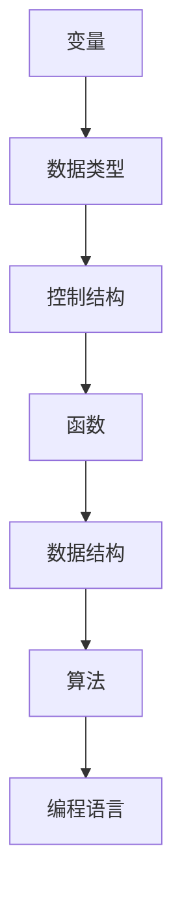

                 

### 设计思路

设计《编码技能：代码是技术人的名片》的目录大纲时，我们需要遵循以下步骤：

1. **确定整体结构**：
   首先，明确书籍的核心目标，即帮助读者掌握编码技能，并理解代码对于技术人的重要性。根据这一核心目标，我们可以将书籍内容分为三大部分：编码基础、编码实践和编码进阶。同时，附录部分将提供一些编码资源，以便读者进一步学习和探索。

2. **划分章节**：
   - **编码基础**部分包括编码基础概念、常见编程语言介绍和数据结构与算法等章节，旨在为读者打下扎实的编码基础。
   - **编码实践**部分涵盖编码实践技巧、编码风格与规范、版本控制系统和编码调试与测试等内容，帮助读者将理论知识应用到实际编码中。
   - **编码进阶**部分包括高级编程技术、编码安全与优化、编码团队协作和编码实战项目等章节，进一步提升读者的编码能力和实践经验。
   - **附录**部分则汇总了一些编程资源，包括在线编程平台、编程社区和编程书籍推荐等，供读者参考。

3. **细化章节内容**：
   对于每个章节，我们需要进一步细化内容，列出具体的子章节和小节，确保每个章节的内容都覆盖全面，且层次分明。例如，在“常见编程语言介绍”章节中，可以分别介绍Python、Java和JavaScript等编程语言的基本概念、特点和常用语法。

4. **添加辅助内容**：
   为了增强书籍的价值，我们可以在每个章节中添加一些辅助内容，如核心概念与联系、核心算法原理讲解、数学模型和公式讲解、项目实战等。这些内容有助于读者更好地理解和掌握编码技能。

5. **编写目录大纲**：
   最后，使用markdown格式编写目录大纲，确保简洁明了，便于读者查阅。在编写过程中，要遵循一定的逻辑顺序，使目录结构清晰、层次分明。

### 步骤详解

1. **整体结构确定**：

   - 第一部分：编码基础
   - 第二部分：编码实践
   - 第三部分：编码进阶
   - 附录：编码资源

2. **划分章节**：

   - **编码基础**部分：
     1. 编码基础概念
     2. 常见编程语言介绍
     3. 数据结构与算法

   - **编码实践**部分：
     1. 编码实践技巧
     2. 编码风格与规范
     3. 版本控制系统
     4. 编码调试与测试

   - **编码进阶**部分：
     1. 高级编程技术
     2. 编码安全与优化
     3. 编码团队协作
     4. 编码实战项目

   - **附录**部分：
     1. 编程资源汇总

3. **细化章节内容**：

   - **编码基础**部分：
     1. **编码基础概念**：
        - 编码的历史与发展
        - 编码在技术行业中的重要性
        - 编码的核心概念与联系（流程图）

     2. **常见编程语言介绍**：
        - Python编程语言
        - Java编程语言
        - JavaScript编程语言

     3. **数据结构与算法**：
        - 数据结构概述
        - 常见数据结构（数组、链表、栈、队列、树等）
        - 常见算法（排序、搜索、动态规划等）

   - **编码实践**部分：
     1. **编码实践技巧**：
        - 编码技巧概述
        - 代码阅读技巧
        - 代码编写技巧

     2. **编码风格与规范**：
        - 编码风格的重要性
        - Python编码规范
        - Java编码规范
        - JavaScript编码规范

     3. **版本控制系统**：
        - 版本控制系统的概述
        - Git工作流程
        - 搭建Git服务器

     4. **编码调试与测试**：
        - 调试技巧
        - 单元测试
        - 集成测试

   - **编码进阶**部分：
     1. **高级编程技术**：
        - 面向对象编程
        - 函数式编程
        - 并发编程

     2. **编码安全与优化**：
        - 编码安全概述
        - 常见编码漏洞
        - 编码性能优化

     3. **编码团队协作**：
        - 团队协作概述
        - 项目管理工具
        - 沟通与协作技巧

     4. **编码实战项目**：
        - 实战项目概述
        - 项目实战一：网站开发
        - 项目实战二：移动应用开发
        - 项目实战三：大数据处理

   - **附录**部分：
     1. **编程资源汇总**：
        - 在线编程平台
        - 编程社区
        - 编程书籍推荐

4. **添加辅助内容**：

   - **核心概念与联系**：
     在每个章节中，我们将使用Mermaid流程图来展示核心概念之间的联系。

   - **核心算法原理讲解**：
     使用伪代码详细阐述核心算法原理，并结合具体例子进行讲解。

   - **数学模型和公式讲解**：
     使用latex格式嵌入数学模型和公式，并进行详细讲解和举例说明。

   - **项目实战**：
     在每个编码实战项目中，我们将详细介绍开发环境搭建、源代码实现和代码解读，并进行实际案例分析和详细讲解剖析。

5. **编写目录大纲**：

   使用markdown格式编写目录大纲，确保简洁明了。以下是一个示例：

   ```markdown
   # 《编码技能：代码是技术人的名片》目录大纲

   ## 第一部分：编码基础

   ### 第1章 编码基础概念
   #### 1.1 编码的历史与发展
   #### 1.2 编码在技术行业中的重要性
   #### 1.3 编码的核心概念与联系（流程图）

   ### 第2章 常见编程语言介绍
   #### 2.1 Python编程语言
   #### 2.2 Java编程语言
   #### 2.3 JavaScript编程语言

   ### 第3章 数据结构与算法
   #### 3.1 数据结构概述
   #### 3.2 常见数据结构（数组、链表、栈、队列、树等）
   #### 3.3 常见算法（排序、搜索、动态规划等）

   ## 第二部分：编码实践

   ### 第4章 编码实践技巧
   #### 4.1 编码技巧概述
   #### 4.2 代码阅读技巧
   #### 4.3 代码编写技巧

   ### 第5章 编码风格与规范
   #### 5.1 编码风格的重要性
   #### 5.2 Python编码规范
   #### 5.3 Java编码规范
   #### 5.4 JavaScript编码规范

   ### 第6章 版本控制系统
   #### 6.1 版本控制系统的概述
   #### 6.2 Git工作流程
   #### 6.3 搭建Git服务器

   ### 第7章 编码调试与测试
   #### 7.1 调试技巧
   #### 7.2 单元测试
   #### 7.3 集成测试

   ## 第三部分：编码进阶

   ### 第8章 高级编程技术
   #### 8.1 面向对象编程
   #### 8.2 函数式编程
   #### 8.3 并发编程

   ### 第9章 编码安全与优化
   #### 9.1 编码安全概述
   #### 9.2 常见编码漏洞
   #### 9.3 编码性能优化

   ### 第10章 编码团队协作
   #### 10.1 团队协作概述
   #### 10.2 项目管理工具
   #### 10.3 沟通与协作技巧

   ### 第11章 编码实战项目
   #### 10.1 实战项目概述
   #### 10.2 项目实战一：网站开发
   #### 10.3 项目实战二：移动应用开发
   #### 10.4 项目实战三：大数据处理

   ## 附录：编码资源汇总
   ### 附录1 编程资源汇总
   #### 1.1 在线编程平台
   #### 1.2 编程社区
   #### 1.3 编程书籍推荐
   ```

通过以上设计思路和步骤详解，我们可以确保《编码技能：代码是技术人的名片》的目录大纲内容丰富、逻辑清晰，便于读者学习和掌握编码技能。接下来，我们将进一步细化每个章节的内容，确保目录大纲的完整性和逻辑清晰性。## 文章标题

# 编码技能：代码是技术人的名片

## 关键词

- 编码技能
- 技术人
- 代码质量
- 编程语言
- 数据结构与算法
- 实战项目

## 摘要

本文旨在探讨编码技能在技术行业中的重要性，通过分析编码基础、实践技巧和进阶知识，帮助读者提升代码质量和实战能力。文章首先介绍了编码的历史与发展，以及编码在技术行业中的重要性。随后，文章深入探讨了常见编程语言、数据结构与算法等基础概念。在编码实践部分，文章重点讲解了编码技巧、编码风格与规范、版本控制系统和编码调试与测试。最后，文章介绍了高级编程技术、编码安全与优化、编码团队协作和编码实战项目，帮助读者全面掌握编码技能，提升自身竞争力。

## 编码技能的重要性

在技术行业中，编码技能是每一位技术人必备的核心能力。代码不仅是实现软件功能的工具，更是技术人思维方式的体现。优秀的编码技能不仅能提高工作效率，还能确保代码质量和项目成功率。因此，掌握编码技能对于技术人来说至关重要。

首先，编码技能是技术人竞争力的体现。在当今快速发展的技术行业，具备出色的编码能力的人更容易获得职业机会和发展空间。良好的编码技能意味着技术人能够快速适应新技术，解决复杂问题，为团队和项目带来价值。

其次，编码技能有助于提升代码质量。优秀的编码技能可以确保代码的可读性、可维护性和可扩展性。良好的代码质量不仅能降低项目维护成本，还能提高开发效率和团队协作效果。

最后，编码技能是技术人持续成长的基础。随着技术的不断进步，编码技能也在不断演进。掌握最新的编程语言、框架和工具，了解前沿的技术趋势，对于技术人的职业发展具有重要意义。

总之，编码技能是技术人的名片，它不仅体现了个人的专业素养，更是衡量技术人价值的重要标准。在技术行业中，提升编码技能是每一位技术人必须面对的挑战和机遇。

### 编码的历史与发展

编码技术的发展历程可谓漫长且精彩。从最早的机器语言，到高级编程语言，再到现代的编程框架和工具，编码技术经历了多个重要阶段，每一次变革都为计算机科学的发展注入了新的活力。

**机器语言与汇编语言**：
最早的计算机编程语言可以追溯到20世纪40年代，那时程序员使用机器语言直接控制计算机硬件。机器语言由一系列二进制指令组成，直接操作计算机的各个组件。由于机器语言的复杂性和可读性差，程序员的工作负担极大。为了解决这一问题，汇编语言应运而生。汇编语言采用助记符代替机器语言指令，虽然仍需了解底层硬件，但相对于机器语言，汇编语言的可读性和可维护性有了显著提升。

**高级编程语言**：
20世纪50年代，第一个高级编程语言**FORTRAN**问世，它主要用于科学计算。随后，**COBOL**和**ALGOL**等编程语言相继出现，为商业和学术领域带来了便捷。高级编程语言的最大特点是，它们提供了更抽象的语法，使得程序员可以更加专注于问题解决，而不必深究底层硬件细节。**C**语言在1972年推出，成为现代编程语言的基石。它不仅继承了汇编语言的高效性和底层控制能力，还引入了结构化编程的概念，使得程序的可读性和可维护性大大提升。

**面向对象编程**：
随着软件系统复杂度的增加，面向对象编程（OOP）的概念在20世纪80年代兴起。面向对象编程通过将数据和操作数据的方法封装在对象中，实现了模块化和代码复用。**C++**和**Java**等面向对象编程语言的出现，标志着编程进入了一个新的时代。面向对象编程不仅提高了代码的可维护性和扩展性，还使得软件系统更加模块化，易于团队协作开发。

**现代编程框架和工具**：
进入21世纪，编程语言和工具不断进化。各种框架和工具的出现，使得开发者能够更高效地开发应用程序。例如，**React**和**Vue**等前端框架，使得构建复杂用户界面更加简单；**Spring Boot**和**Django**等后端框架，提高了开发效率和代码质量。此外，**Docker**和**Kubernetes**等容器技术，使得应用程序的部署和管理更加灵活和高效。

**编程语言的未来趋势**：
随着人工智能、大数据和物联网等领域的快速发展，编程语言也在不断演进。新的编程语言和工具不断涌现，以应对复杂的技术挑战。例如，**Python**和**R**等语言在数据分析领域取得了显著成绩；**Go**和**Kotlin**等语言则在云计算和移动应用开发中表现出色。未来，编程语言将继续朝着更高效、更智能和更易用的方向发展，为技术人提供更强大的工具和平台。

综上所述，编码技术的发展历程充满了变革和创新。从最早的机器语言，到现代的编程框架和工具，每一次技术革新都为计算机科学的发展注入了新的活力。了解编码技术的发展历程，有助于我们更好地把握编程语言的发展方向，提升自身的编码技能。

### 编码的核心概念与联系

在编码过程中，理解核心概念之间的联系至关重要。以下是几个关键概念及其相互关系的简要概述，以及一个Mermaid流程图来展示这些概念之间的关系。

#### 变量（Variables）

变量是编程语言中用于存储数据的基本单元。变量通过名称与特定数据类型关联，如整数（`int`）、字符串（`string`）和布尔值（`bool`）等。变量是数据存储的核心，几乎所有编程操作都涉及变量。

#### 数据类型（Data Types）

数据类型定义了变量可以存储的数据种类。常见的数据类型包括整数、浮点数、字符串、布尔值等。不同数据类型具有不同的操作方式和内存占用。例如，整数类型的操作通常是算术运算，而字符串类型的操作则是文本处理。

#### 控制结构（Control Structures）

控制结构是用于控制程序执行流程的语句。主要分为条件语句（如`if-else`）和循环语句（如`for`和`while`）。控制结构根据变量和条件来决定程序的执行路径，使得程序能够实现复杂逻辑。

#### 函数（Functions）

函数是可重用的代码块，用于执行特定任务。函数通过参数传递数据，并通过返回值提供结果。函数是模块化编程的重要手段，有助于代码复用和结构化设计。

#### 数据结构（Data Structures）

数据结构是组织和管理数据的方式。常见的数据结构包括数组、链表、栈、队列和树等。数据结构定义了数据如何存储和访问，对程序的性能和效率有重要影响。

#### 算法（Algorithms）

算法是一系列解决问题的步骤。算法通过特定的方法对数据进行操作，以实现特定功能。常见的算法包括排序、搜索和图算法等。

#### Mermaid流程图

以下是一个简单的Mermaid流程图，展示上述核心概念之间的联系：



在这个流程图中，变量和数据类型是基础，它们通过控制结构、函数和数据结构相互连接，最终形成编程语言中的算法。这种关系有助于我们理解编程的整个流程，从而更好地掌握编码技能。

### 常见编程语言介绍

在技术行业中，编程语言是开发软件和系统的基础。以下将介绍几种常见的编程语言，包括Python、Java和JavaScript，以及它们的特点和适用场景。

#### Python

**特点**：
- **易学易用**：Python以其简洁的语法和强大的库支持，成为初学者和专业人士的首选语言。
- **广泛的应用领域**：Python在数据分析、人工智能、科学计算、Web开发等领域都有广泛应用。
- **丰富的库和框架**：如NumPy、Pandas、Django和TensorFlow等，使得Python开发高效且灵活。

**适用场景**：
- **数据分析与科学计算**：Python的NumPy和Pandas库非常适合数据分析和处理，广泛应用于金融、生物信息学和数据分析等领域。
- **人工智能与机器学习**：Python的TensorFlow和PyTorch等框架在人工智能领域非常流行，支持深度学习和神经网络的研究与应用。
- **Web开发**：Django和Flask等Web框架使得Python在开发Web应用程序时非常高效。

#### Java

**特点**：
- **跨平台**：Java是跨平台的编程语言，可以在不同的操作系统和设备上运行，具有高度的兼容性。
- **强类型语言**：Java是强类型语言，要求所有变量在声明时指定类型，有助于减少运行时错误。
- **成熟的生态系统**：Java拥有庞大的开发者社区和生态系统，支持各种开发工具、框架和库。

**适用场景**：
- **企业级应用**：Java在企业级应用开发中非常流行，如银行系统、电子商务平台和大型后台系统。
- **Android开发**：Java是Android开发的主要语言，广泛应用于移动应用程序开发。
- **大数据处理**：Java在Apache Hadoop和Spark等大数据处理框架中占据重要地位，支持大规模数据处理和分析。

#### JavaScript

**特点**：
- **前端开发**：JavaScript是前端开发的核心语言，用于创建动态网页和交互式用户界面。
- **全栈开发**：通过Node.js，JavaScript可以用于后端开发，支持全栈开发模式。
- **丰富的生态系统**：JavaScript拥有庞大的库和框架，如React、Vue和Angular，极大地提高了开发效率。

**适用场景**：
- **Web开发**：JavaScript是前端开发的核心语言，用于实现网页的动态效果和交互功能。
- **移动应用开发**：通过React Native等框架，JavaScript可以用于开发跨平台的移动应用。
- **服务器端开发**：Node.js使得JavaScript在后端开发中也非常流行，支持高并发和实时应用的构建。

通过了解这些常见编程语言的特点和适用场景，技术人可以根据项目需求和自身特长选择合适的语言进行开发，从而提高编码效率和项目成功率。

### 数据结构与算法

在编程领域，数据结构和算法是两个核心概念，它们共同决定了程序的性能和效率。理解并掌握这些概念，对于编写高效、可维护的代码至关重要。

#### 数据结构

数据结构是用于存储和管理数据的方式。常见的有数组、链表、栈、队列、树和图等。每种数据结构都有其独特的特点和应用场景。

- **数组（Array）**：数组是一种线性数据结构，用于存储一系列元素。数组的特点是元素访问速度快，但插入和删除操作较慢。

  ```python
  # 数组示例
  arr = [1, 2, 3, 4, 5]
  ```

- **链表（Linked List）**：链表是一种动态数据结构，由一系列节点组成，每个节点包含数据和指向下一个节点的指针。链表的插入和删除操作灵活，但访问速度较慢。

  ```python
  # 链表节点类定义
  class Node:
      def __init__(self, data):
          self.data = data
          self.next = None

  # 创建链表
  head = Node(1)
  head.next = Node(2)
  head.next.next = Node(3)
  ```

- **栈（Stack）**：栈是一种后进先出（LIFO）的数据结构，用于存储元素。常见的操作有入栈、出栈和判断是否为空。

  ```python
  # 栈操作示例
  stack = []
  stack.append(1)
  stack.append(2)
  print(stack.pop()) # 输出：2
  ```

- **队列（Queue）**：队列是一种先进先出（FIFO）的数据结构，用于存储元素。常见的操作有入队、出队和判断是否为空。

  ```python
  # 队列操作示例
  queue = []
  queue.append(1)
  queue.append(2)
  print(queue.popleft()) # 输出：1
  ```

- **树（Tree）**：树是一种层级数据结构，由节点组成，每个节点可以有零个或多个子节点。常见的树结构有二叉树、红黑树和平衡树等。

  ```python
  # 二叉树节点类定义
  class TreeNode:
      def __init__(self, value):
          self.value = value
          self.left = None
          self.right = None

  # 创建二叉树
  root = TreeNode(1)
  root.left = TreeNode(2)
  root.right = TreeNode(3)
  ```

- **图（Graph）**：图是一种复杂的数据结构，由节点和边组成。图可以表示网络、社交关系和地图等。

  ```python
  # 图的邻接表表示
  graph = {
      'A': ['B', 'C'],
      'B': ['A', 'D'],
      'C': ['A', 'D'],
      'D': ['B', 'C']
  }
  ```

#### 算法

算法是一系列解决问题的步骤。常见的算法有排序、搜索和图算法等。算法的性能通常用时间复杂度和空间复杂度来衡量。

- **排序算法**：排序算法用于将一组元素按特定顺序排列。常见的排序算法有冒泡排序、选择排序、插入排序、快速排序等。

  ```python
  # 冒泡排序算法示例
  def bubble_sort(arr):
      n = len(arr)
      for i in range(n):
          for j in range(0, n-i-1):
              if arr[j] > arr[j+1]:
                  arr[j], arr[j+1] = arr[j+1], arr[j]
  ```

- **搜索算法**：搜索算法用于在数据结构中查找特定元素。常见的搜索算法有线性搜索、二分搜索等。

  ```python
  # 线性搜索算法示例
  def linear_search(arr, target):
      for i in range(len(arr)):
          if arr[i] == target:
              return i
      return -1
  ```

- **图算法**：图算法用于解决与图相关的问题，如最短路径、图的遍历等。常见的图算法有深度优先搜索（DFS）、广度优先搜索（BFS）等。

  ```python
  # 深度优先搜索算法示例
  def dfs(graph, node, visited):
      visited.add(node)
      print(node)
      for neighbor in graph[node]:
          if neighbor not in visited:
              dfs(graph, neighbor, visited)
  ```

通过掌握这些基本的数据结构和算法，程序员可以更有效地解决各种编程问题，提高代码的性能和可维护性。

### 编码实践技巧

在实际编码过程中，掌握一些实用的技巧能够大大提高开发效率，确保代码的质量和可维护性。以下是一些关键的编码实践技巧：

#### 代码阅读技巧

**1. 理解代码的结构**：
在阅读代码时，首先要关注代码的结构。理解函数、类和模块的组织方式，有助于快速把握代码的整体架构。

**2. 注释和文档**：
注释是理解代码的关键。编写清晰的注释，说明代码的功能、参数和返回值，有助于后续的维护和协作开发。

**3. 确认代码风格**：
不同的编程语言和团队可能有不同的代码风格规范。熟悉并遵守这些规范，有助于提高代码的可读性和一致性。

**4. 使用调试工具**：
调试是编码过程中不可或缺的一部分。熟练使用调试工具（如断点、单步执行、观察变量等），可以帮助快速定位和修复问题。

#### 代码编写技巧

**1. 设计简洁的函数**：
函数应保持简洁，每个函数只做一件事。这样有助于提高代码的可读性和可维护性。

**2. 重用代码**：
避免重复编写相同的代码段。使用函数、模块或库来复用代码，不仅可以提高开发效率，还可以减少错误。

**3. 使用面向对象编程**：
面向对象编程（OOP）可以提高代码的模块化和可扩展性。通过封装、继承和多态等概念，可以更好地组织和管理代码。

**4. 编写可测试的代码**：
编写可测试的代码有助于确保代码的正确性和可靠性。通过单元测试和集成测试，可以快速发现并修复问题。

**5. 管理代码库**：
使用版本控制系统（如Git）来管理代码库。合理地组织代码文件和文件夹，确保代码库的结构清晰、易于维护。

#### 代码风格与规范

**1. 命名规范**：
合理的命名规范可以提高代码的可读性。变量、函数和类名应具有描述性，避免使用缩写或拼音。

**2. 缩进与对齐**：
遵循一致的缩进和对齐规则，可以使代码结构更加整洁。常见的缩进方式包括空格和制表符。

**3. 格式化代码**：
使用代码格式化工具（如Prettier、Black等）自动格式化代码，确保代码风格一致。

**4. 代码复用**：
避免冗余代码，通过函数、模块或库来复用代码。这样可以减少代码的重复，提高开发效率。

**5. 简化逻辑**：
简化复杂的逻辑结构，通过分解和重构代码，使其更易于理解和维护。

通过掌握这些编码实践技巧，程序员可以编写出高效、可维护的代码，提高开发效率和项目成功率。

### 编码风格与规范

良好的编码风格和规范是确保代码可读性、可维护性和一致性的关键。以下介绍几种常见编程语言（Python、Java和JavaScript）的编码规范。

#### Python编码规范

**1. PEP 8**：遵循PEP 8编码规范，确保代码具有清晰的结构和风格。
- **命名规范**：使用小写字母和下划线组成变量名和函数名，例如`my_variable`和`get_value()`。
- **缩进**：使用四个空格进行缩进，避免使用制表符。
- **注释**：为代码添加必要的注释，说明功能、参数和返回值。
- **代码组织**：保持代码的整洁，合理划分函数和类，避免过长的函数和类。

**2. Black**：使用自动代码格式化工具Black进行代码格式化，确保代码风格一致。

#### Java编码规范

**1. Google Java Style Guide**：遵循Google Java Style Guide，确保代码风格和一致性。
- **命名规范**：使用大驼峰命名法（Upper Camel Case）为类命名，例如`MyClass`；使用小驼峰命名法（Lower Camel Case）为变量和函数命名，例如`myVariable`和`getMyValue()`。
- **缩进**：使用两个空格进行缩进。
- **代码组织**：按照功能模块和类的关系组织代码，保持代码的层次结构清晰。
- **注释**：为类、方法和重要代码段添加Javadoc注释，说明功能、参数和返回值。

**2. Eclipse或IntelliJ IDEA**：使用这些集成开发环境（IDE）进行代码格式化，确保代码风格一致。

#### JavaScript编码规范

**1. Airbnb JavaScript Style Guide**：遵循Airbnb JavaScript Style Guide，确保代码风格和一致性。
- **命名规范**：使用小驼峰命名法（Lower Camel Case）为变量、函数和类命名，例如`myVariable`和`getMyValue`。
- **缩进**：使用两个空格进行缩进。
- **代码组织**：按照功能模块和文件关系组织代码，保持代码的层次结构清晰。
- **注释**：为代码添加必要的注释，说明功能、参数和返回值。

**2. Prettier**：使用自动代码格式化工具Prettier进行代码格式化，确保代码风格一致。

#### 共同点

- **简洁性**：保持代码简洁，避免冗余和复杂的逻辑。
- **一致性**：遵循一致的编码规范，确保代码风格和格式一致。
- **注释**：为代码添加必要的注释，提高代码的可读性和可维护性。
- **代码格式化**：使用自动代码格式化工具进行格式化，确保代码风格一致。

通过遵循这些编码规范，程序员可以编写出高质量、易于维护的代码，提高开发效率和团队协作效果。

### 版本控制系统

版本控制系统（Version Control System，VCS）是一种用于管理代码更改和协作开发的工具。它允许开发者在项目开发过程中记录每次代码的变更，并提供版本管理和冲突解决的机制。以下将介绍版本控制系统的基础知识，以Git为例，讲解其工作流程和搭建Git服务器的步骤。

#### 版本控制系统的基础知识

**1. 中心化版本控制系统**：
中心化版本控制系统（如CVS和Subversion）将代码存储在中央仓库中，开发者从中央仓库克隆代码，进行修改后提交回中央仓库。常见的中心化版本控制系统有CVS、Subversion和Perforce。

**2. 分布式版本控制系统**：
分布式版本控制系统（如Git）将代码存储在本地仓库中，每个开发者都有自己的完整仓库。开发者可以在本地进行修改和提交，然后推送到远程仓库。分布式版本控制系统具有更好的灵活性和扩展性，是目前主流的选择。

**3. 版本**：
版本控制系统通过记录每次代码变更的版本，来管理代码的历史。每次提交都会生成一个新的版本，包括提交的作者、提交日期和提交说明等信息。

**4. 仓库**：
仓库（Repository）是版本控制系统的核心组件，用于存储和管理代码。仓库可以是本地仓库（存储在开发者的计算机上），也可以是远程仓库（存储在服务器上）。

#### Git的工作流程

**1. 初始化仓库**：
首先，需要初始化本地仓库。可以使用`git init`命令创建一个本地仓库。

```bash
git init
```

**2. 克隆仓库**：
要从远程仓库克隆代码，可以使用`git clone`命令。这将创建一个新的本地仓库，包含远程仓库的所有提交历史。

```bash
git clone https://github.com/user/repo.git
```

**3. 提交更改**：
在本地仓库中修改代码后，需要将其提交到仓库。使用`git add`命令添加修改的文件，使用`git commit`命令提交更改。

```bash
git add .
git commit -m "提交说明"
```

**4. 推送更改**：
将本地仓库的更改推送到远程仓库，使用`git push`命令。

```bash
git push origin master
```

**5. 拉取更改**：
要从远程仓库获取最新的更改，使用`git pull`命令。

```bash
git pull origin master
```

**6. 分支管理**：
Git支持分支管理，允许开发者在不同的分支上进行独立的工作。创建新分支、合并分支和删除分支等操作可以使用`git branch`、`git merge`和`git branch -d`等命令。

```bash
git branch feature/my-feature
git checkout feature/my-feature
git merge master
git branch -d feature/my-feature
```

#### 搭建Git服务器

要搭建Git服务器，可以使用GitHub、GitLab或Gitolite等开源工具。以下是一个简单的步骤：

**1. 安装Git**：
在服务器上安装Git。

```bash
sudo apt-get install git
```

**2. 安装SSH服务**：
SSH服务用于允许开发者通过SSH协议访问Git服务器。

```bash
sudo apt-get install openssh-server
```

**3. 创建Git用户**：
创建一个用于运行Git服务的用户。

```bash
sudo adduser git
```

**4. 设置SSH密钥**：
将开发者的SSH公钥添加到服务器上的`~/.ssh/authorized_keys`文件中，允许其通过SSH无密码访问服务器。

```bash
sudo nano /home/git/.ssh/authorized_keys
```

**5. 安装Gitolite**：
安装Gitolite来管理用户的访问权限。

```bash
sudo apt-get install gitolite
```

**6. 配置Gitolite**：
初始化Gitolite，并配置用户和仓库。

```bash
gitolite setup -pk ~/.gitolite/admin.pub
cd ~
git clone git@server:/var/git/repo.git
cd repo.git
gitolite generate -path ~/.gitolite/repositories
```

**7. 重启Git服务**：
重启SSH和Git服务，使配置生效。

```bash
sudo service ssh restart
sudo service gitolite restart
```

通过以上步骤，可以搭建一个基本的Git服务器，用于管理开发者的代码和协作开发。

### 编码调试与测试

在软件开发过程中，调试和测试是确保代码质量和功能稳定性的关键步骤。以下将介绍调试技巧、单元测试和集成测试的方法，以及常见的测试工具。

#### 调试技巧

**1. 使用断点**：
调试器中的断点可以暂停程序的执行，以便查看变量值和执行路径。在IDE中设置断点，程序执行到断点时会暂停，方便查看和修改变量值。

**2. 单步执行**：
单步执行可以帮助逐行查看代码的执行情况。通过单步执行，可以更好地理解代码的执行逻辑，并找到潜在的bug。

**3. 使用日志**：
通过在代码中添加日志信息，可以实时跟踪程序的执行过程和变量值的变化。常用的日志库有Python的`logging`模块和Java的`java.util.logging`。

**4. 分析栈跟踪**：
当程序发生异常时，栈跟踪可以帮助找出错误的来源。在调试器中查看栈跟踪，可以快速定位错误代码。

#### 单元测试

**1. 单元测试的定义**：
单元测试是针对软件中的最小可测试单元（通常是一个函数或方法）进行测试，以验证其功能是否符合预期。单元测试通常由开发者在编写代码时编写。

**2. 单元测试方法**：
- **测试用例**：编写测试用例，覆盖各种可能的输入和输出情况，包括正常情况和异常情况。
- **断言**：使用断言（如`assert`语句）来验证函数或方法的输出是否符合预期。例如，`assert result == expected`。

**3. 单元测试工具**：
- **Python**：Python的`unittest`模块是一个常用的单元测试框架，提供了测试用例和断言等功能。
- **Java**：Java的JUnit是一个流行的单元测试框架，提供了丰富的测试方法和断言工具。

#### 集成测试

**1. 集成测试的定义**：
集成测试是在软件的不同模块或子系统集成后进行的测试，以验证它们之间的交互是否符合预期。集成测试通常由测试工程师执行。

**2. 集成测试方法**：
- **黑盒测试**：不考虑系统的内部实现，仅关注输入和输出之间的关系。
- **白盒测试**：考虑系统的内部实现，通过检查代码路径和逻辑来验证系统的正确性。
- **灰盒测试**：介于黑盒测试和白盒测试之间，部分考虑系统的内部实现。

**3. 集成测试工具**：
- **Selenium**：Selenium是一个开源的Web自动化测试工具，可以模拟用户的操作，验证Web应用程序的功能和交互。
- **JUnit**：JUnit不仅可以用于单元测试，还可以用于集成测试，通过编写测试用例验证模块间的交互。

通过掌握这些调试和测试技巧，开发者可以更好地发现和修复代码中的问题，确保软件的质量和稳定性。

### 高级编程技术

在软件开发中，高级编程技术是提升代码效率和性能的关键。以下将介绍面向对象编程、函数式编程和并发编程等高级编程技术，以及它们的应用场景和特点。

#### 面向对象编程（OOP）

**1. 概念与应用**：
面向对象编程是一种编程范式，通过将数据和操作数据的方法封装在对象中，实现模块化和代码复用。OOP的核心概念包括类、对象、继承、封装和多态。

- **类**：类是对象的模板，定义了对象的属性和方法。
- **对象**：对象是类的实例，具有类定义的属性和方法。
- **继承**：继承允许子类继承父类的属性和方法，实现代码复用。
- **封装**：封装通过将对象的内部实现隐藏起来，仅暴露必要的接口，提高代码的可维护性。
- **多态**：多态允许不同类的对象通过共同的接口进行操作，提高代码的灵活性和可扩展性。

**应用场景**：
- **大型系统开发**：面向对象编程能够提高大型系统的可维护性和可扩展性，适用于企业级应用和复杂系统的开发。
- **图形界面编程**：在图形界面编程中，OOP可以更好地组织和管理窗口、控件和事件处理。

#### 函数式编程

**1. 概念与应用**：
函数式编程是一种编程范式，强调使用函数作为主要的数据结构和操作方式。函数式编程的核心概念包括纯函数、不可变数据和函数组合。

- **纯函数**：纯函数是输入确定输出，不依赖于外部状态和副作用的函数。纯函数易于测试和复用。
- **不可变数据**：不可变数据在创建后不可修改，保证了数据的完整性和一致性。
- **函数组合**：通过函数组合，可以将多个函数组合成一个复杂的函数，提高代码的可读性和复用性。

**应用场景**：
- **数据转换和计算**：函数式编程在数据处理和复杂计算中表现优异，适用于数据分析、科学计算和并发编程。
- **前端开发**：在React和Vue等前端框架中，函数式编程得到了广泛应用，可以提高代码的可读性和性能。

#### 并发编程

**1. 概念与应用**：
并发编程是一种在多个任务间进行并行执行的技术，可以提高程序的性能和响应速度。并发编程的核心概念包括线程、锁和并发队列。

- **线程**：线程是程序执行的基本单位，可以并发执行多个任务。
- **锁**：锁用于控制对共享资源的访问，防止多线程间的冲突和数据不一致。
- **并发队列**：并发队列是一种线程安全的数据结构，用于在高并发的场景下高效地传输数据。

**应用场景**：
- **高性能计算**：在需要处理大量数据和复杂计算的应用中，如科学计算、大数据处理和游戏引擎，并发编程可以提高计算性能。
- **Web服务器**：在Web服务器中，并发编程可以同时处理多个用户请求，提高系统的并发处理能力和响应速度。

通过掌握面向对象编程、函数式编程和并发编程等高级编程技术，开发者可以编写出高效、可扩展和可靠的代码，提高软件系统的性能和用户体验。

### 编码安全与优化

在软件开发过程中，编码安全与优化是确保代码质量和性能的关键环节。以下将介绍编码安全的重要性、常见编码漏洞以及编码性能优化方法。

#### 编码安全的重要性

**1. 防止数据泄露**：
保护用户数据不被未授权访问是编码安全的首要任务。使用加密技术、访问控制和权限管理，确保敏感数据在传输和存储过程中的安全性。

**2. 避免代码注入**：
代码注入攻击（如SQL注入和XSS攻击）是常见的网络安全威胁。通过输入验证、使用参数化查询和输出编码，可以有效防止代码注入攻击。

**3. 防止拒绝服务攻击（DDoS）**：
拒绝服务攻击会占用大量系统资源，导致系统崩溃。使用防火墙、限制请求频率和部署高可用性架构，可以防止DDoS攻击。

#### 常见编码漏洞

**1. SQL注入**：
SQL注入是通过在SQL查询中插入恶意SQL语句，从而获取未授权数据或破坏数据库。防御方法包括使用参数化查询和预处理SQL语句。

**2. 跨站脚本（XSS）**：
XSS攻击是通过在Web应用中注入恶意脚本，从而窃取用户信息或控制用户浏览器。防御方法包括输入验证、输出编码和内容安全策略（CSP）。

**3. 跨站请求伪造（CSRF）**：
CSRF攻击通过冒充用户身份执行未授权操作。防御方法包括使用CSRF令牌、验证Referer头和验证双重提交Cookie。

#### 编码性能优化

**1. 算法优化**：
选择高效的算法和数据结构，可以显著提高程序性能。例如，使用哈希表代替线性查找，使用快速排序代替冒泡排序。

**2. 代码优化**：
- **避免不必要的计算**：减少重复计算，如使用缓存和延迟计算。
- **减少内存占用**：通过数据结构和算法优化，减少内存消耗，提高程序运行效率。
- **代码并行化**：利用多核处理器，通过并行编程提高计算性能。

**3. 使用缓存**：
缓存可以显著减少数据库和外部服务的访问次数，提高系统响应速度。合理使用缓存机制，如Redis和Memcached，可以大幅提高系统性能。

**4. 优化数据库查询**：
- **避免全表扫描**：通过索引和查询优化，减少全表扫描。
- **批量操作**：使用批量插入和更新操作，减少数据库IO开销。

通过关注编码安全与优化，开发者可以编写出更安全、更高效的代码，提高软件系统的可靠性和用户体验。

### 编码团队协作

在软件开发过程中，编码团队协作至关重要。有效的团队协作可以提高开发效率，确保代码质量和项目成功率。以下将介绍编码团队协作的概述、项目管理工具和沟通与协作技巧。

#### 编码团队协作概述

**1. 团队角色与职责**：
一个成功的编码团队通常包括以下角色：
- **项目经理**：负责项目的整体规划和进度管理。
- **开发人员**：负责编写代码、实现功能和解决技术问题。
- **测试工程师**：负责编写测试用例、执行测试和报告缺陷。
- **UI/UX设计师**：负责设计和优化用户界面和用户体验。

**2. 团队协作的重要性**：
有效的团队协作可以减少沟通成本，提高开发效率，确保代码质量和项目进度。团队协作不仅有助于解决技术难题，还可以促进知识共享和技能提升。

#### 项目管理工具

**1. 版本控制系统**：
版本控制系统（如Git）是团队协作的基础工具，用于管理代码的版本和变更历史。团队成员可以实时同步代码，协作开发。

**2. 代码审查工具**：
代码审查（Code Review）是确保代码质量和一致性的重要环节。工具如GitHub、GitLab和Gerrit等，支持在线提交代码、审查和合并代码。

**3. 任务管理工具**：
任务管理工具（如JIRA、Trello和Asana等）用于跟踪和管理项目任务。团队成员可以创建、分配和跟踪任务，确保项目进度和质量。

**4. 消息传递工具**：
消息传递工具（如Slack、Microsoft Teams和WhatsApp等）用于团队内部和跨团队的实时沟通和协作。这些工具支持文本消息、文件共享和视频会议。

#### 沟通与协作技巧

**1. 定期会议**：
定期召开团队会议，讨论项目进度、问题和计划。会议可以采用站立会议、每日例会和周例会等形式，确保团队成员保持同步。

**2. 明确职责与目标**：
为每个团队成员明确职责和目标，确保每个人都知道自己的任务和期望成果。这有助于减少责任模糊，提高团队协作效率。

**3. 沟通渠道清晰**：
确保团队成员了解各种沟通渠道的用途和优先级。例如，紧急问题应通过即时通讯工具解决，而项目计划和讨论则适合在邮件或会议中处理。

**4. 文档共享与知识管理**：
通过文档共享平台（如Confluence、SharePoint和Google Docs等）记录项目文档、技术文档和知识库，方便团队成员查阅和共享。

通过掌握编码团队协作的概述、项目管理工具和沟通与协作技巧，团队成员可以更高效地协作，共同完成高质量的软件项目。

### 编码实战项目

#### 实战项目概述

本节将介绍三个不同类型的编码实战项目：网站开发、移动应用开发和大数据处理。每个项目将涵盖开发环境搭建、源代码实现、代码解读、应用解读与分析，以及项目小结。

#### 项目一：网站开发

**1. 开发环境搭建**
- **前端**：使用HTML、CSS和JavaScript，可以选择React或Vue等框架。
- **后端**：使用Node.js、Django或Flask等框架。
- **数据库**：使用MySQL或PostgreSQL。

**2. 源代码实现**
- **前端**：创建HTML页面，使用React或Vue组件管理页面状态。
- **后端**：编写API接口，处理HTTP请求和数据库操作。
- **数据库**：设计数据库结构，创建表和关系。

**3. 代码解读**
- **前端**：解释组件生命周期和状态管理。
- **后端**：介绍路由和中间件，展示数据库操作示例。

**4. 应用解读与分析**
- **前端**：分析页面加载速度和用户体验。
- **后端**：讨论API性能和安全。

**5. 项目小结**
- **技术要点**：总结Web开发中的关键技术和挑战。
- **改进建议**：提出优化建议，如使用CDN、压缩文件等。

#### 项目二：移动应用开发

**1. 开发环境搭建**
- **iOS**：使用Xcode和Swift。
- **Android**：使用Android Studio和Kotlin。

**2. 源代码实现**
- **iOS**：使用UIKit创建用户界面，实现用户交互。
- **Android**：使用Android SDK和布局文件创建应用。

**3. 代码解读**
- **iOS**：解释UIViewController的生命周期和用户界面布局。
- **Android**：展示Activity和Fragment的使用。

**4. 应用解读与分析**
- **iOS**：讨论性能优化和内存管理。
- **Android**：分析线程管理和用户体验。

**5. 项目小结**
- **技术要点**：总结移动应用开发的核心技术和挑战。
- **改进建议**：提出优化建议，如使用异步加载、优化布局等。

#### 项目三：大数据处理

**1. 开发环境搭建**
- **Hadoop**：使用Hadoop分布式计算框架。
- **Spark**：使用Spark进行大数据处理和分析。

**2. 源代码实现**
- **Hadoop**：使用MapReduce编写数据处理程序。
- **Spark**：使用Spark SQL和DataFrame进行数据处理和分析。

**3. 代码解读**
- **Hadoop**：解释MapReduce编程模型和数据处理流程。
- **Spark**：介绍RDD和DataFrame的概念和操作。

**4. 应用解读与分析**
- **Hadoop**：讨论数据存储和集群资源管理。
- **Spark**：分析数据处理速度和性能优化。

**5. 项目小结**
- **技术要点**：总结大数据处理的关键技术和挑战。
- **改进建议**：提出优化建议，如使用压缩、优化SQL查询等。

通过以上实战项目，开发者可以掌握不同类型项目的开发流程和技术要点，提升实战能力。

### 最佳实践 Tips

在编码过程中，遵循一些最佳实践可以显著提高代码质量、减少错误和提升开发效率。以下是一些实用的编码最佳实践：

**1. 代码注释**
- 为代码添加清晰的注释，解释代码的功能、逻辑和目的。
- 注释应简洁明了，避免冗长和重复。

**2. 代码格式**
- 遵循一致的代码格式规范，如PEP 8（Python）、Google Java Style Guide（Java）和Airbnb JavaScript Style Guide（JavaScript）。
- 使用自动化工具（如Prettier、Black）进行代码格式化。

**3. 代码复用**
- 避免重复编写相同的代码段，使用函数、模块和库进行代码复用。
- 优先选择成熟的第三方库，减少自定义代码的复杂性。

**4. 异常处理**
- 使用try-except语句处理异常，避免程序因未处理的异常而崩溃。
- 异常处理应明确、简洁，避免过度捕获。

**5. 测试**
- 编写单元测试和集成测试，确保代码的正确性和稳定性。
- 使用自动化测试工具（如JUnit、pytest）进行测试。

**6. 版本控制**
- 使用版本控制系统（如Git）管理代码版本，记录每次变更。
- 定期提交代码，避免长时间未提交的“脏”工作区。

**7. 性能优化**
- 关注代码的性能，使用高效的算法和数据结构。
- 优化数据库查询，避免全表扫描和重复计算。

**8. 安全**
- 保护用户数据，使用加密和访问控制。
- 防范代码注入和拒绝服务攻击。

通过遵循这些最佳实践，开发者可以编写出更高效、更可靠的代码，提高项目的质量和用户体验。

### 小结

本文从编码技能的重要性、编码的历史与发展、核心概念与联系、常见编程语言、数据结构与算法、编码实践技巧、编码风格与规范、版本控制系统、编码调试与测试、高级编程技术、编码安全与优化、编码团队协作、编码实战项目等方面，系统地介绍了编码技能的各个方面。通过这些内容，读者可以全面了解编码技能的基本概念和应用场景，掌握提升编码技能的方法和技巧。

编码技能不仅是技术人的核心竞争力，更是职业发展的关键。只有不断提升编码技能，才能在竞争激烈的技术行业中脱颖而出，实现自身的职业价值。

### 注意事项

1. **持续学习**：技术领域日新月异，持续学习是提升编码技能的关键。关注技术动态，学习新技术和工具，保持自己的知识体系更新。

2. **实践为主**：理论知识固然重要，但实践经验更为关键。通过实际项目练习，将所学知识应用到实际中，才能更好地掌握编码技能。

3. **注重团队合作**：在编码过程中，与团队成员保持良好的沟通和协作，共同解决问题，可以提高开发效率和质量。

4. **遵循最佳实践**：遵循编码最佳实践，如代码注释、格式规范、代码复用、异常处理和性能优化等，可以减少错误，提高代码质量。

### 拓展阅读

- **《算法导论》**：详细介绍各种算法的原理和实现，是算法学习的经典教材。
- **《Effective Java》**：针对Java编程，介绍了一系列高效编程的最佳实践。
- **《Clean Code》**：讲解如何编写清晰、简洁、可维护的代码。
- **《Refactoring: Improving the Design of Existing Code》**：介绍代码重构的方法，帮助改进现有代码的设计。
- **《You Don’t Know JS》**：深入探讨JavaScript的各个方面，包括语言特性、异步编程等。

通过阅读这些经典书籍，可以进一步加深对编码技能的理解和应用。

