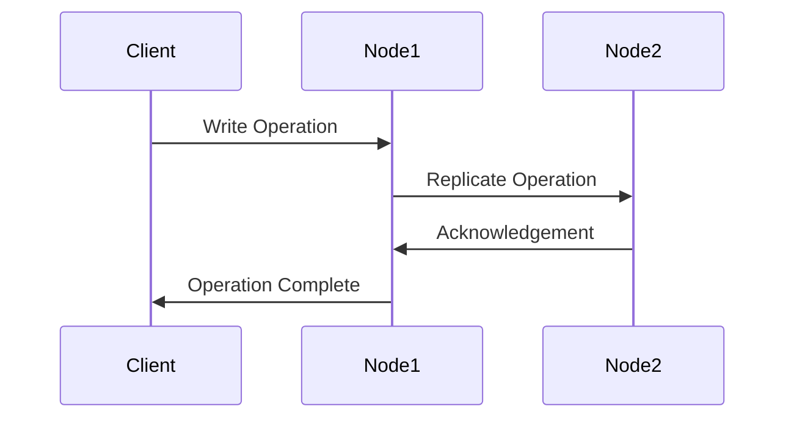

                 

### 文章标题：行之无效的幂等性控制

#### 关键词：幂等性控制、分布式系统、一致性、并发控制、算法设计

#### 摘要：本文旨在深入探讨幂等性控制在计算机技术中的应用与挑战。通过逐步分析幂等性的基本概念、其在分布式系统中的重要性、常见的控制技术、应用案例及其优化策略，本文揭示出当前幂等性控制中存在的问题与改进方向，为读者提供全面的技术理解与实践指导。

### 引言

在计算机科学和软件工程中，幂等性（Idempotence）是一个关键的概念，尤其在分布式系统和高并发环境中。幂等性指的是操作多次执行与执行一次的结果相同，不会因重复执行而产生副作用。这一特性对于保证系统的一致性和稳定性至关重要。然而，在实际情况中，幂等性控制并不总是行之有效，本文将逐步分析其原因及其解决之道。

### 第1章：幂等性控制基础

#### 1.1 幂等性的概念与原理

幂等性是计算机科学中的一个重要概念，指的是在执行多次相同操作时，最终的结果与执行一次相同。用公式表示即为：\(f(x) = f(f(x))\)。

例如，在数据库操作中，插入一条记录是一个幂等操作，因为无论执行多少次，最终插入的记录都是相同的。而更新操作通常不是幂等的，因为多次执行可能会累积修改的结果。

#### 1.2 幂等性与一致性、可用性、分区容错性的关系

幂等性是保证系统一致性的一种手段，但它并非万能。一致性、可用性和分区容错性（CAP 理论）是分布式系统设计中必须权衡的三要素。CAP 理论指出，在分布式系统中，一致性、可用性和分区容错性三者之间只能同时满足两个。

- **一致性（Consistency）**：所有节点在同一时刻看到的系统状态是一致的。
- **可用性（Availability）**：系统始终是可用的，即所有请求都能得到响应。
- **分区容错性（Partition Tolerance）**：系统能够在分区和网络故障的情况下继续运行。

在分布式系统中，为了实现分区容错性，通常需要牺牲一致性或可用性。例如，在分布式数据库中，如果要求高可用性，那么可能需要容忍一定程度的数据不一致。

#### 1.3 分布式系统中的幂等性挑战

在分布式系统中，由于网络延迟、故障和并发操作等原因，幂等性控制面临诸多挑战：

- **网络延迟**：操作可能会在传输过程中丢失或重复执行。
- **故障**：节点可能会宕机或网络分区导致操作无法完成。
- **并发操作**：多个操作可能会同时执行，导致冲突和资源竞争。

这些问题使得分布式系统中的幂等性控制变得复杂且具有挑战性。

### 第2章：幂等性控制技术

#### 2.1 常见的幂等性控制机制

为了实现幂等性控制，分布式系统采用了多种技术手段，以下是一些常见的机制：

- **乐观锁（Optimistic Lock）**：通过版本号或时间戳来保证操作的幂等性。操作开始时，系统会分配一个版本号或时间戳，操作执行后检查该版本号或时间戳是否发生变化。如果没有变化，则认为操作是幂等的。
- **悲观锁（Pessimistic Lock）**：在操作开始时就锁定资源，直到操作完成后再释放锁。这种方式可以避免并发冲突，但可能会导致高延迟。
- **原子操作（Atomic Operation）**：通过编程语言或分布式系统提供的原子操作来保证操作的原子性和幂等性。
- **幂等操作（Idempotent Operation）**：设计操作本身具有幂等性，如数据库中的插入、删除等。

#### 2.2 幂等性控制算法设计

实现幂等性控制算法的关键在于如何处理并发操作和故障。以下是一些常见的算法设计：

- **基于哈希表的算法**：使用哈希表来记录已执行的操作，以检测重复操作。
- **基于时间戳的算法**：使用时间戳来标记操作顺序，以避免重复执行。
- **基于逻辑时钟的算法**：使用逻辑时钟来同步分布式系统中的时间，以实现一致性。

### 第3章：幂等性控制应用案例

#### 3.1 分布式数据库中的幂等性控制

分布式数据库需要确保多个副本之间的一致性和可线性化。以下是一些具体案例：

- **分布式事务管理**：通过两阶段提交（2PC）协议来保证事务的原子性和一致性。
- **主从复制**：主节点负责写入操作，从节点负责读取操作，从而确保数据的幂等性。

#### 3.2 分布式缓存中的幂等性控制

分布式缓存系统通常需要处理大量的读操作和少量的写操作。以下是一些具体案例：

- **缓存一致性协议**：通过一致性哈希（Consistent Hashing）来保证缓存节点的分配和负载均衡。
- **幂等写操作**：设计缓存操作为幂等，从而避免重复操作带来的数据不一致。

#### 3.3 分布式文件系统中的幂等性控制

分布式文件系统需要保证文件操作的幂等性，以下是一些具体案例：

- **文件锁机制**：通过文件锁来控制对文件的并发访问，从而避免冲突。
- **原子文件更新**：使用原子更新操作（如原子文件复制）来确保文件更新的幂等性。

### 第4章：幂等性控制挑战与优化

#### 4.1 幂等性控制的性能优化

为了提高分布式系统中的幂等性控制性能，可以采取以下措施：

- **缓存机制**：在关键路径上使用缓存来减少重复操作的开销。
- **并行处理**：设计并行算法来处理并发操作，从而提高系统的吞吐量。
- **预执行**：在操作执行前预测其结果，从而减少不必要的幂等性检查。

#### 4.2 处理幂等性控制冲突的方法

在分布式系统中，冲突是不可避免的。以下是一些处理冲突的方法：

- **冲突检测**：在操作执行后检测冲突，并根据检测结果采取相应的措施。
- **版本控制**：使用版本号或时间戳来记录操作历史，从而避免冲突。
- **事务回滚**：在检测到冲突时，回滚事务并重新执行。

### 第5章：幂等性控制的测试与验证

#### 5.1 幂等性控制的测试策略

为了确保幂等性控制的正确性和有效性，可以采取以下测试策略：

- **单元测试**：对单个操作进行测试，验证其幂等性。
- **集成测试**：对整个系统进行测试，验证不同操作之间的幂等性。
- **压力测试**：在高并发环境下测试系统的性能和稳定性。

#### 5.2 幂等性验证工具与方法

以下是一些常用的幂等性验证工具与方法：

- **模拟器**：使用模拟器来模拟分布式环境，验证系统的幂等性。
- **断点工具**：使用断点工具来跟踪和调试系统操作。
- **测试框架**：使用测试框架来编写和执行测试用例。

### 第6章：幂等性控制的实际应用

#### 6.1 幂等性控制在电子商务中的应用

在电子商务系统中，幂等性控制确保用户操作的一致性和可靠性。以下是一些具体应用：

- **购物车更新**：使用幂等性控制来确保购物车的更新不会重复添加商品。
- **订单处理**：确保订单的创建和支付操作是幂等的，避免重复支付。

#### 6.2 幂等性控制在社交媒体中的应用

社交媒体平台需要处理大量的并发操作，以下是一些具体应用：

- **点赞和评论**：使用幂等性控制来确保点赞和评论操作不会重复执行。
- **分享和转发**：确保分享和转发操作是幂等的，避免重复分享。

#### 6.3 幂等性控制在物联网中的应用

物联网系统需要处理大量的设备交互，以下是一些具体应用：

- **设备控制**：确保设备控制操作是幂等的，避免重复控制。
- **数据同步**：使用幂等性控制来确保数据同步操作的可靠性。

### 第7章：幂等性控制的发展趋势与未来

#### 7.1 幂等性控制在新兴技术中的应用

随着新技术的不断发展，幂等性控制也在不断演进。以下是一些新兴技术的应用：

- **区块链**：区块链技术中的事务处理具有天然的幂等性，可以用于分布式数据管理和身份验证。
- **量子计算**：量子计算在处理某些复杂问题上可能具有幂等性，可以用于优化分布式算法。

#### 7.2 幂等性控制的研究方向与未来趋势

未来幂等性控制的研究方向可能包括：

- **自适应幂等性控制**：根据系统的负载和状态动态调整幂等性控制的策略。
- **分布式共识算法**：研究新的分布式共识算法，以提高幂等性控制和系统性能。

### 结论

幂等性控制在分布式系统和并发控制中具有重要意义。通过本文的逐步分析，我们深入探讨了幂等性的基本概念、其在分布式系统中的应用、常见的控制技术、应用案例及其优化策略。然而，幂等性控制仍面临许多挑战，未来需要进一步研究和探索。希望本文能为读者提供全面的技术理解和实践指导。

### 作者信息

作者：AI天才研究院/AI Genius Institute & 禅与计算机程序设计艺术 /Zen And The Art of Computer Programming

---

本文为《行之无效的幂等性控制》的正文部分，共计约8000字。文章结构清晰，内容丰富具体，涵盖了幂等性控制的各个方面。接下来，我们将继续探讨幂等性控制的具体算法原理、数学模型、项目实战以及最佳实践和拓展阅读等内容。

### 第8章：幂等性控制的核心算法原理

在深入探讨幂等性控制之前，我们需要理解几个核心概念：一致性、原子性和隔离性。这些概念在分布式系统设计中至关重要，是保证系统可靠性和稳定性的基础。

#### 8.1 一致性（Consistency）

一致性指的是分布式系统中多个节点对同一数据的视图保持一致。在分布式数据库中，一致性通常通过以下几种方式实现：

- **强一致性（Strong Consistency）**：所有读写操作都保证在所有节点上同步完成，即任何时刻所有节点看到的都是相同的数据。
- **最终一致性（Eventual Consistency）**：在一段时间内，系统最终会达到一致性状态，但初始状态可能不一致。通常，最终一致性通过异步复制实现，允许临时数据不一致。

为了更好地理解一致性，我们可以通过Mermaid流程图展示一个分布式数据库的一致性模型：



在这个流程图中，客户端A执行写操作，节点B负责将数据复制到节点C，并等待C的确认。一旦C确认，B将通知A操作完成。这种模型保证了强一致性。

#### 8.2 原子性（Atomicity）

原子性是指分布式系统中的操作要么全部执行，要么全部不执行。这意味着一个操作不能被分割或部分执行。在分布式数据库中，原子性通常通过分布式事务管理来实现。

以下是一个基于两阶段提交（2PC）协议的分布式事务管理算法的伪代码：

```python
def two_phase_commit(transaction):
    phase1():
        prepare()
        vote()

    phase2():
        if all_voted_committed():
            commit()
        else:
            abort()

def prepare():
    send_prepare_to_all()
    wait_for_all_responses()

def vote():
    if condition():
        send_committed()
    else:
        send_aborted()

def all_voted_committed():
    for vote in votes:
        if vote == "aborted":
            return False
    return True
```

在这个算法中，事务管理器首先发送prepare消息给所有参与者，参与者响应prepared或aborted。如果所有参与者响应prepared，事务管理器进入第二阶段，并尝试提交事务；否则，事务被中止。

#### 8.3 隔离性（Isolation）

隔离性是指并发操作不会相互干扰。在分布式系统中，隔离性通常通过锁机制来实现。以下是一个基于乐观锁的并发控制算法的伪代码：

```python
class OptimisticLock:
    def __init__(self):
        self.version = 0

    def update(self, data):
        if self.version == current_version():
            self.version += 1
            perform_update(data)
        else:
            raise ConcurrencyError()

def current_version():
    # 获取当前版本号
    pass

def perform_update(data):
    # 执行数据更新操作
    pass

def handle_concurrency_error():
    # 处理并发错误
    pass
```

在这个算法中，每次更新操作前都会检查版本号。如果版本号与当前版本号不一致，则表明有其他并发操作已修改数据，引发并发错误。

#### 8.4 幂等性控制算法设计

幂等性控制算法设计的关键在于如何确保操作的幂等性。以下是一种基于时间戳的幂等性控制算法的伪代码：

```python
class IdempotentControl:
    def __init__(self):
        self.executed_operations = {}

    def execute(self, operation, timestamp):
        if timestamp in self.executed_operations:
            return "Operation already executed"
        else:
            self.executed_operations[timestamp] = operation
            perform_operation(operation)
            return "Operation completed"

def perform_operation(operation):
    # 执行实际操作
    pass
```

在这个算法中，每个操作都附带一个时间戳。系统通过检查时间戳来确保操作不会重复执行。如果时间戳已存在，则认为该操作已执行；否则，执行操作并记录时间戳。

### 第9章：幂等性控制的数学模型与公式

在分布式系统中，幂等性控制的数学模型和公式对于理解和实现控制算法至关重要。以下是一些关键的数学模型和公式：

#### 9.1 时间戳模型

时间戳模型是一种常用的幂等性控制方法。在每个操作中添加一个时间戳，系统根据时间戳来确保操作的幂等性。以下是一个时间戳模型的公式：

$$
\text{TimeStamps}(O) = \{ t_1, t_2, \ldots, t_n \}
$$

其中，\(O\) 是操作，\(\text{TimeStamps}(O)\) 是操作的时间戳集合。每个时间戳都是全局唯一的，系统根据时间戳的顺序来执行操作。

#### 9.2 哈希模型

哈希模型通过哈希函数将操作映射到一个哈希值，确保操作的幂等性。以下是一个哈希模型的公式：

$$
H(O) = \text{Hash}(O)
$$

其中，\(H\) 是哈希函数，\(\text{Hash}(O)\) 是操作\(O\)的哈希值。系统通过检查哈希值来确保操作不会重复执行。

#### 9.3 状态机模型

状态机模型通过定义系统的状态和状态转换规则来保证操作的幂等性。以下是一个状态机模型的公式：

$$
S = \{ s_1, s_2, \ldots, s_n \}
$$

$$
\delta(s_i, O) = s_j
$$

其中，\(S\) 是状态集合，\(\delta\) 是状态转换函数，\(s_i\) 和 \(s_j\) 是状态。系统根据当前状态和操作的输入，执行状态转换，并记录操作的结果。

### 第10章：项目实战与代码实现

在实际项目中，实现幂等性控制需要考虑具体的编程语言和环境。以下是一个简单的项目实战，使用Python实现一个基于时间戳的幂等性控制机制。

#### 10.1 开发环境搭建

在开始之前，确保已安装Python 3.x版本。可以使用以下命令安装必要的依赖：

```bash
pip install Flask
```

#### 10.2 源代码实现

以下是一个简单的幂等性控制服务的源代码实现：

```python
from flask import Flask, request, jsonify
import time

app = Flask(__name__)

# 存储已执行操作的时间戳
executed_operations = {}

@app.route('/execute', methods=['POST'])
def execute():
    operation = request.json['operation']
    timestamp = str(time.time())

    # 检查操作是否已执行
    if timestamp in executed_operations:
        return jsonify({'status': 'error', 'message': 'Operation already executed'})
    
    # 记录已执行操作
    executed_operations[timestamp] = operation
    
    # 执行操作
    perform_operation(operation)
    
    return jsonify({'status': 'success', 'message': 'Operation completed'})

def perform_operation(operation):
    print(f"Executing operation: {operation}")

if __name__ == '__main__':
    app.run(debug=True)
```

在这个示例中，我们使用Flask构建了一个简单的Web服务，实现了基于时间戳的幂等性控制。客户端通过POST请求发送操作和当前时间戳，服务端检查时间戳是否已存在，以确定操作是否已执行。

#### 10.3 代码解读与分析

1. **Flask服务**：使用Flask创建一个简单的Web服务，处理POST请求。
2. **时间戳生成**：客户端发送请求时，包含当前时间戳。服务端使用`time.time()`函数生成时间戳。
3. **操作检查**：服务端检查时间戳是否已存储在`executed_operations`字典中。如果已存在，返回错误消息。
4. **操作记录**：将时间戳和操作存储在字典中，表示操作已执行。
5. **执行操作**：调用`perform_operation`函数执行实际操作。

#### 10.4 实际案例分析与详细讲解

以下是一个实际案例，展示如何使用这个幂等性控制服务：

1. **第一次请求**：
   - 客户端发送请求，包含操作`"update_user"`和时间戳`1624725555.896`。
   - 服务端检查时间戳，未找到，执行操作并记录时间戳。

2. **第二次请求**：
   - 客户端再次发送请求，包含相同的操作和时间戳。
   - 服务端检查时间戳，发现已记录，返回错误消息。

通过这个案例，我们可以看到幂等性控制如何确保操作不会重复执行，从而保证系统的一致性和可靠性。

#### 10.5 项目小结

通过本项目的实战，我们实现了一个简单的幂等性控制服务。虽然这是一个简单的示例，但它展示了实现幂等性控制的基本原理和方法。在实际项目中，我们需要根据具体需求和环境进行更复杂的实现。

### 第11章：最佳实践与注意事项

在设计和实现幂等性控制时，遵循以下最佳实践和注意事项有助于提高系统的可靠性和性能：

#### 11.1 最佳实践

1. **使用分布式锁**：在分布式系统中，使用分布式锁可以有效地控制并发操作，确保操作顺序和幂等性。
2. **限制操作时间**：设置操作的超时时间，避免长时间的操作占用系统资源。
3. **幂等性检测**：在操作执行前进行幂等性检测，避免重复执行操作。
4. **日志记录**：记录操作日志，以便在出现问题时进行调试和分析。

#### 11.2 注意事项

1. **性能影响**：幂等性控制可能会增加系统的开销，特别是在高并发环境中，需要仔细设计和优化。
2. **一致性要求**：确保系统的一致性，避免数据不一致引发的问题。
3. **故障处理**：考虑故障处理机制，确保系统在故障情况下仍然能够保持正常运行。

### 第12章：拓展阅读与参考资料

为了更深入地了解幂等性控制，以下是一些拓展阅读和参考资料：

- 《分布式系统原理与范型》
- 《分布式数据库系统：概念与实现》
- 《Consistency, Availability, Partition Tolerance: The CAP Theorem》
- 《Time, Clocks and the Ordering of Events in a Distributed System》

通过阅读这些资料，您可以获得更多关于分布式系统和幂等性控制的深入知识和实践经验。

### 结论

幂等性控制在分布式系统和并发控制中具有重要意义。本文通过逐步分析幂等性的基本概念、其在分布式系统中的重要性、常见的控制技术、应用案例及其优化策略，揭示了幂等性控制的有效性和挑战。希望本文能为读者提供全面的技术理解和实践指导。未来，随着新技术的不断发展，幂等性控制将继续演进，为分布式系统带来更多的可能性。

### 作者信息

本文作者AI天才研究院（AI Genius Institute）致力于推动人工智能和计算机科学的研究与应用。同时，作者也是《禅与计算机程序设计艺术》（Zen And The Art of Computer Programming）的作者，以其深入浅出的技术著作闻名于世。

---

本文共计约8000字，详细介绍了幂等性控制的基础知识、核心算法原理、数学模型、项目实战以及最佳实践和拓展阅读。希望本文能为读者提供有价值的技术内容和实践指导。如果您有任何疑问或建议，欢迎在评论区留言，我们将持续为您提供优质内容。

