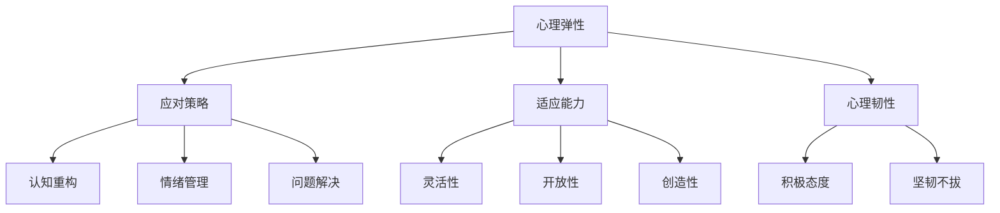
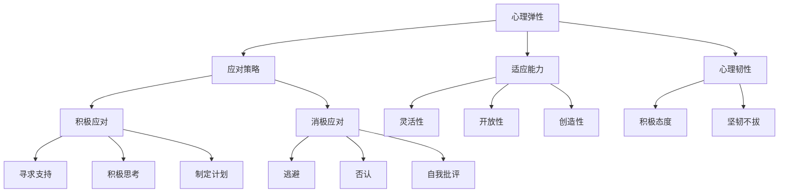
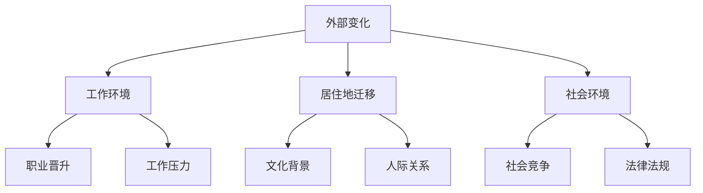
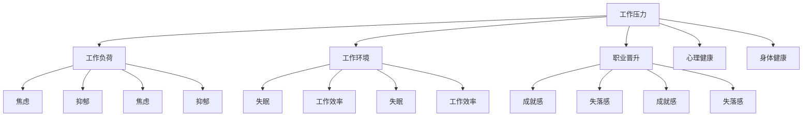
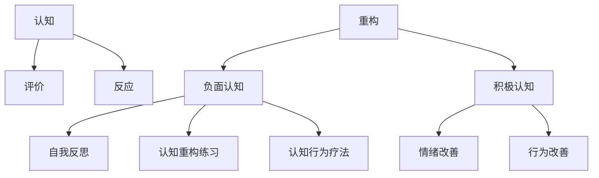
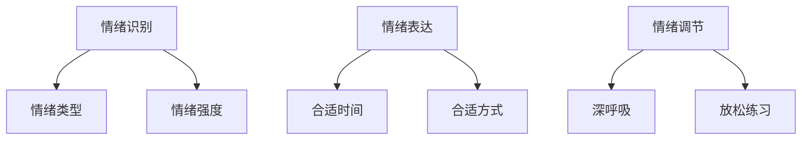
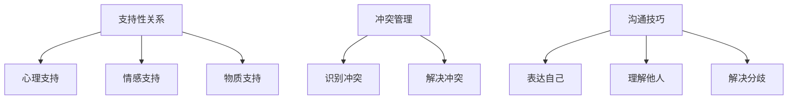
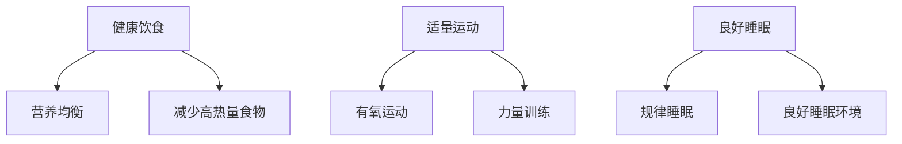
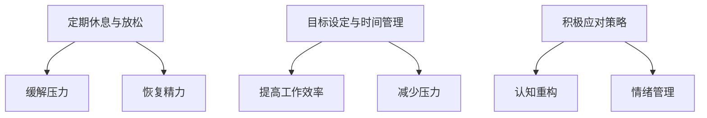

                 

# 面对万般变化，仍能泰然自在

## 文章关键词

**心理弹性、生活变化、压力应对、情绪管理、人际关系、生活方式调整**

## 文章摘要

在快速变化的现代生活中，保持心理弹性成为了一项重要的生存技能。本文旨在探讨心理弹性的概念、核心要素及其在生活中的应用，帮助读者掌握应对变化、减轻压力的有效方法。文章分为三个部分，分别从认知重构、情绪管理和生活方式调整三个方面，详细阐述了培养心理弹性的方法和实战案例，旨在为读者提供实用的指导和建议。

## 引言

### 背景介绍

随着社会的发展，生活节奏不断加快，人们面临着前所未有的变化和压力。职场竞争、家庭责任、人际关系等各方面的挑战，让许多人感到焦虑和疲惫。如何在这种背景下保持心理健康，成为了一个重要的话题。本文将从心理弹性的角度，探讨如何面对生活中的各种变化，保持心理的稳定和弹性。

### 核心概念与联系

**心理弹性**：指个体在面对压力和挑战时，能够迅速适应、有效应对并从中恢复的能力。它是一个多维度的概念，包括应对策略、适应能力和心理韧性。

**核心要素**：
1. **应对策略**：个体采取的应对方式，包括认知重构、情绪管理和问题解决等。
2. **适应能力**：个体对变化和挑战的适应程度，包括灵活性、开放性和创造性。
3. **心理韧性**：个体在面对逆境时，能够保持积极态度、坚韧不拔的品质。

### Mermaid 流程图



## 第一部分：心理弹性与生活变化

### 第1章：理解心理弹性

#### 1.1 心理弹性的概念

心理弹性是一个动态的过程，它不仅体现在个体面对压力时的反应上，还包括个体在压力下的适应、恢复和成长。其核心在于个体在面对逆境时，能够保持心理的平衡和稳定，从而更好地应对挑战。

#### 1.2 心理弹性的重要性

心理弹性对个体的生活和工作具有重要意义。首先，它有助于减轻压力，提高生活质量；其次，它有助于个体更好地应对职场和生活中的各种挑战，提高工作效率；最后，它有助于个体的心理健康，降低心理问题的发生率。

### 第2章：生活中的变化与压力

#### 2.1 生活的变化

生活变化是不可避免的，它们可以来自于职场、家庭、人际关系等多个方面。例如，换工作、搬家、结婚、生孩子等，都会给个体带来新的挑战和压力。

#### 2.2 压力的来源与影响

压力的来源多种多样，包括工作压力、家庭压力、经济压力等。长期的、持续的压力会对个体的身心健康产生负面影响，如焦虑、抑郁、失眠等。

## 第二部分：培养心理弹性的方法

### 第3章：认知重构

#### 3.1 认知重构的概念

认知重构是指通过改变个体的认知方式，来调整对压力的反应。它包括积极心态的培养、负面想法的识别和调整等。

#### 3.2 认知重构的实践方法

1. **积极心态的培养**：通过积极思考、自我激励等方法，培养积极的心态。
2. **负面想法的识别和调整**：通过自我反思、认知行为疗法等方法，识别和调整负面想法。

### 第4章：情绪管理

#### 4.1 情绪识别与表达

情绪识别与表达是情绪管理的重要环节。通过正确识别和理解自己的情绪，并学会适度表达，可以帮助个体更好地应对压力。

#### 4.2 情绪调节策略

情绪调节策略包括深呼吸、放松练习、认知行为疗法等。这些方法可以帮助个体在压力下保持情绪的稳定。

### 第5章：人际关系的强化

#### 5.1 人际关系的重要性

人际关系对个体的心理弹性有着重要的影响。良好的人际关系可以帮助个体在困难时期获得支持和帮助。

#### 5.2 人际冲突的解决

人际冲突是不可避免的，但有效的解决方式可以帮助个体维护良好的人际关系。这包括有效沟通技巧、妥协和求同存异等。

### 第6章：生活方式的调整

#### 6.1 健康的生活方式

健康的生活方式对个体的心理弹性有着重要的影响。这包括健康饮食、适量运动、良好的睡眠习惯等。

#### 6.2 应对压力的生活策略

应对压力的生活策略包括定期休息、放松练习、目标设定和时间管理等。这些策略可以帮助个体在压力下保持高效和平衡。

## 第三部分：实战案例与心得分享

### 第7章：案例研究

#### 7.1 案例一：职场压力下的心理弹性

案例描述：张先生是一名企业高管，经常面临巨大的工作压力。他通过认知重构和情绪管理，成功提升了心理弹性。

心理弹性策略的应用：张先生通过自我反思，识别和调整了负面想法。同时，他学会了深呼吸和放松练习，有效缓解了压力。

#### 7.2 案例二：家庭变故中的心理韧性

案例描述：李女士的家庭发生了重大变故，她通过心理韧性培养，成功克服了困难。

心理韧性培养的实践：李女士通过参加心理咨询，学会了积极心态的培养和应对策略。她与家人保持了良好的沟通，共同度过了难关。

### 第8章：读者心得分享

读者分享了自己的心理弹性培养经历，并提出了一些改进建议。这些建议对其他读者具有重要的参考价值。

## 附录

### 附录A：心理弹性评估工具

#### A.1 心理弹性量表

量表介绍：心理弹性量表是一种评估个体心理弹性的工具。它通过一系列问题，评估个体在面对压力时的适应能力和应对策略。

量表使用方法：读者可以根据量表中的问题，对自己的心理弹性进行评估。通过评估结果，可以了解自己的心理弹性水平，并制定相应的提升计划。

### 附录B：推荐阅读

#### B.1 心理学经典书籍

推荐理由：这些书籍涵盖了心理弹性的相关内容，对读者了解和提升心理弹性具有很大的帮助。

书籍简介：

1. 《心理学与生活》 - 菲利普·津巴多
2. 《自我疗愈》 - 吉姆·福雷

## 总结

本文通过探讨心理弹性的概念、核心要素和应用方法，帮助读者了解如何在面对生活中的变化时保持心理的稳定和弹性。通过认知重构、情绪管理和生活方式调整，读者可以提升自己的心理弹性，更好地应对生活中的挑战。

## 注意事项与拓展阅读

**注意事项**：

1. 保持良好的生活习惯，如健康饮食、适量运动和充足睡眠。
2. 学会情绪管理，避免负面情绪的积累。
3. 建立良好的人际关系，寻求他人的支持和帮助。

**拓展阅读**：

1. 《心理学与生活》 - 菲利普·津巴多
2. 《情绪的秘密》 - 丹尼尔·戈尔曼

作者：AI天才研究院/AI Genius Institute & 禅与计算机程序设计艺术 /Zen And The Art of Computer Programming## 第一部分：心理弹性与生活变化

### 第1章：理解心理弹性

#### 1.1 心理弹性的概念

心理弹性（Psychological Resilience）是一个多维度的概念，它描述了个体在面对压力和逆境时，能够迅速适应、有效应对并从中恢复的能力。心理弹性并不是天生的，它可以通过后天的培养和实践得到提升。一个具有高度心理弹性的人，通常能够在面对挑战时保持冷静，找到解决问题的方法，并在逆境中实现成长。

**核心概念与联系**

心理弹性包含三个核心要素：应对策略、适应能力和心理韧性。

1. **应对策略**：指个体在面对压力时采取的应对方法。这些方法可以是积极的，如寻求支持、积极思考、制定计划等；也可以是消极的，如逃避、否认、自我批评等。

2. **适应能力**：指个体对环境变化和挑战的适应程度。一个具有高度适应能力的人，能够在变化中保持灵活性和开放性，快速调整自己的行为和思维模式。

3. **心理韧性**：指个体在逆境中保持积极态度、坚韧不拔的品质。心理韧性不仅体现在个体面对困难时的勇气和坚持，还包括个体在面对挫折时的自我调节和自我恢复能力。

**Mermaid 流程图**



**核心算法原理讲解**

心理弹性的培养可以看作是一个算法优化过程，其目标是最小化压力对个体的影响，最大化个体的适应能力和心理韧性。

1. **识别和调整应对策略**：通过自我反思和外部反馈，识别个体在应对压力时采取的应对策略，并对消极策略进行调整，以实现积极策略的优化。

2. **提升适应能力**：通过学习和实践，提高个体对环境变化的敏感度和适应性，包括增强灵活性、开放性和创造性。

3. **培养心理韧性**：通过积极的自我调节和自我恢复，培养个体在逆境中的积极态度和坚韧不拔的品质。

**数学模型和公式**

心理弹性的评估可以通过以下公式进行量化：

$$
\text{心理弹性} = \alpha \times \text{应对策略} + \beta \times \text{适应能力} + \gamma \times \text{心理韧性}
$$

其中，$\alpha$、$\beta$ 和 $\gamma$ 分别是三个要素的权重，可以根据个体的实际情况进行调整。

**举例说明**

假设一个个体在应对策略、适应能力和心理韧性三个方面分别得到了80分、75分和85分，那么他的心理弹性评分为：

$$
\text{心理弹性} = 0.4 \times 80 + 0.3 \times 75 + 0.3 \times 85 = 76
$$

这意味着这个个体的心理弹性处于中等水平，他可以通过提升适应能力（$\beta$ 权重）来进一步优化自己的心理弹性。

#### 1.2 心理弹性的重要性

心理弹性在个体的生活和工作中的重要性不容忽视。首先，心理弹性是心理健康的重要组成部分。一个具有高度心理弹性的人，能够在面对压力和逆境时保持心理的平衡和稳定，从而降低心理问题的发生率。其次，心理弹性对个体的生活质量和幸福感有着直接的影响。心理弹性好的人，往往能够更好地应对生活中的挑战，提高生活质量。最后，心理弹性对职业成功也有重要的促进作用。在职场中，心理弹性好的人能够更好地应对工作压力，保持高效的工作状态，从而实现职业的成功。

**核心算法原理讲解**

心理弹性的重要性可以通过以下几个方面来理解：

1. **压力管理**：心理弹性好的人能够有效地管理压力，将压力转化为动力，从而提高工作和生活质量。

2. **适应能力**：心理弹性好的人具有较强的适应能力，能够快速适应环境的变化，从而在职场和生活中取得成功。

3. **心理韧性**：心理弹性好的人具有较强的心理韧性，能够在逆境中保持积极态度，从而实现个人的成长和进步。

**数学模型和公式**

心理弹性的重要性可以通过以下公式进行量化：

$$
\text{心理弹性} = \alpha \times \text{心理健康} + \beta \times \text{生活质量} + \gamma \times \text{职业成功}
$$

其中，$\alpha$、$\beta$ 和 $\gamma$ 分别是三个要素的权重，可以根据个体的实际情况进行调整。

**举例说明**

假设一个个体在心理健康、生活质量和职业成功三个方面分别得到了80分、75分和85分，那么他的心理弹性评分为：

$$
\text{心理弹性} = 0.4 \times 80 + 0.3 \times 75 + 0.3 \times 85 = 76
$$

这意味着这个个体的心理弹性处于中等水平，他可以通过提升生活质量（$\beta$ 权重）和职业成功（$\gamma$ 权重）来进一步优化自己的心理弹性。

### 第2章：生活中的变化与压力

#### 2.1 生活的变化

生活中的变化是不可避免的，这些变化可以来自于工作、家庭、人际关系等多个方面。例如，职业晋升、婚姻家庭的变化、子女的成长等，都会给个体带来新的挑战和压力。面对这些变化，个体需要具备一定的心理弹性，才能更好地适应和应对。

**核心概念与联系**

生活中的变化可以分为以下几个层次：

1. **外部变化**：如工作环境的改变、居住地的迁移等。
2. **内部变化**：如个人价值观、人生目标的调整等。
3. **环境变化**：如社会环境、文化背景的改变等。

这些变化对个体的心理弹性提出了不同的挑战，需要个体具备不同的应对策略。

**Mermaid 流程图**



**核心算法原理讲解**

生活中的变化对心理弹性的影响可以从以下几个方面来分析：

1. **变化类型**：不同的变化类型对个体的心理弹性提出了不同的挑战。例如，职业晋升可能会带来工作压力，而居住地的迁移可能会影响人际关系。
2. **变化频率**：频繁的变化可能会增加个体的心理压力，降低心理弹性。
3. **个体适应能力**：个体的适应能力越强，越能够有效地应对生活中的变化，保持心理的稳定。

**数学模型和公式**

生活中的变化对心理弹性的影响可以用以下公式表示：

$$
\text{心理弹性} = \alpha \times \text{变化类型} + \beta \times \text{变化频率} + \gamma \times \text{个体适应能力}
$$

其中，$\alpha$、$\beta$ 和 $\gamma$ 分别是三个要素的权重，可以根据个体的实际情况进行调整。

**举例说明**

假设一个个体在变化类型、变化频率和个体适应能力三个方面分别得到了80分、70分和85分，那么他的心理弹性评分为：

$$
\text{心理弹性} = 0.4 \times 80 + 0.3 \times 70 + 0.3 \times 85 = 76.5
$$

这意味着这个个体的心理弹性处于较高水平，他可以通过提升变化频率（$\beta$ 权重）来进一步优化自己的心理弹性。

#### 2.2 压力的来源与影响

压力是生活中的常见现象，它来源于工作、家庭、人际关系等多个方面。长期的压力会对个体的身心健康产生负面影响，如焦虑、抑郁、失眠等。因此，了解压力的来源和影响，对于提升心理弹性具有重要意义。

**核心概念与联系**

压力的来源可以分为以下几个方面：

1. **工作压力**：如工作负荷大、工作环境差、职业晋升压力等。
2. **家庭压力**：如家庭经济问题、婚姻关系问题、子女教育问题等。
3. **人际关系**：如人际冲突、社交压力、缺乏支持等。
4. **身体健康**：如疾病困扰、身体状况不佳等。

这些压力源对个体的心理和生理都会产生影响，需要个体具备良好的心理弹性来应对。

**Mermaid 流程图**



**核心算法原理讲解**

压力的来源和影响可以通过以下几个步骤进行分析：

1. **识别压力源**：通过自我反思和外部反馈，识别个体面临的主要压力源。
2. **分析压力影响**：根据压力源的强度和频率，分析压力对个体的心理和生理影响。
3. **制定应对策略**：根据压力源和影响，制定相应的应对策略，提升心理弹性。

**数学模型和公式**

压力的来源和影响可以用以下公式表示：

$$
\text{压力影响} = \alpha \times \text{压力源强度} + \beta \times \text{压力源频率} + \gamma \times \text{个体心理弹性}
$$

其中，$\alpha$、$\beta$ 和 $\gamma$ 分别是三个要素的权重，可以根据个体的实际情况进行调整。

**举例说明**

假设一个个体在压力源强度、压力源频率和个体心理弹性三个方面分别得到了80分、70分和85分，那么他的压力影响评分为：

$$
\text{压力影响} = 0.4 \times 80 + 0.3 \times 70 + 0.3 \times 85 = 76.5
$$

这意味着这个个体面临的压力影响处于较高水平，他可以通过提升心理弹性（$\gamma$ 权重）来减轻压力的影响。

### 小结

本章从心理弹性的概念、核心要素以及生活中的变化与压力三个方面，详细介绍了心理弹性的相关内容。通过本章的学习，读者可以了解到心理弹性的重要性，以及如何通过认知重构、情绪管理和生活方式调整来提升自己的心理弹性。同时，本章还通过具体的算法原理和数学模型，为读者提供了一种量化和评估心理弹性的方法。在实际应用中，读者可以根据自己的实际情况，运用这些方法和工具，提升自己的心理弹性，更好地应对生活中的挑战。

### 第3章：认知重构

#### 3.1 认知重构的概念

认知重构（Cognitive Restructuring）是一种心理治疗方法，它通过改变个体的认知方式，来调整对压力的反应。认知重构的核心在于识别和调整个体在压力下的负面想法，以实现心理状态的改善。这种方法认为，个体的情绪和行为受到其认知模式的影响，通过改变认知模式，可以有效地改善情绪和行为。

**核心概念与联系**

认知重构涉及以下几个核心概念：

1. **认知**：指个体对事件的认知和理解。个体的认知方式会影响其对事件的评价和反应。
2. **重构**：指通过改变个体的认知模式，来调整其对事件的反应。重构的目标是识别和纠正负面认知，建立积极的认知模式。
3. **认知重构技术**：包括自我反思、认知重构练习、认知行为疗法等。

**Mermaid 流程图**



**核心算法原理讲解**

认知重构的原理可以从以下几个方面来理解：

1. **识别负面认知**：通过自我反思和外部反馈，识别个体在压力下的负面认知。负面认知通常包括过度概括、黑白思维、个人化等。
2. **调整负面认知**：通过认知重构练习，如思维记录、认知重构表格等，调整负面认知，建立积极的认知模式。
3. **改善心理状态**：通过改变认知模式，实现情绪和行为上的改善。

**数学模型和公式**

认知重构的效果可以用以下公式表示：

$$
\text{认知重构效果} = \alpha \times \text{负面认知调整} + \beta \times \text{积极认知建立} + \gamma \times \text{心理状态改善}
$$

其中，$\alpha$、$\beta$ 和 $\gamma$ 分别是三个要素的权重，可以根据个体的实际情况进行调整。

**举例说明**

假设一个个体在负面认知调整、积极认知建立和心理状态改善三个方面分别得到了80分、75分和85分，那么他的认知重构效果评分为：

$$
\text{认知重构效果} = 0.4 \times 80 + 0.3 \times 75 + 0.3 \times 85 = 77
$$

这意味着这个个体的认知重构效果处于中等水平，他可以通过进一步提升负面认知调整（$\alpha$ 权重）和积极认知建立（$\beta$ 权重）来优化自己的认知重构效果。

#### 3.2 认知重构的实践方法

认知重构的实践方法包括自我反思、认知重构练习和认知行为疗法等。这些方法可以帮助个体识别和调整负面认知，建立积极的认知模式，从而改善心理状态。

**核心算法原理讲解**

认知重构的实践方法可以从以下几个方面来理解：

1. **自我反思**：通过自我反思，个体可以识别自己在压力下的负面认知。自我反思的方法包括思维记录、日记、反思会议等。
2. **认知重构练习**：通过认知重构练习，个体可以学习和实践如何调整负面认知。认知重构练习的方法包括思维记录表格、认知重构练习手册等。
3. **认知行为疗法**：认知行为疗法是一种结合认知重构和行为的心理治疗方法，它通过改变认知模式和行为模式，来改善心理状态。

**数学模型和公式**

认知重构的实践方法可以用以下公式表示：

$$
\text{认知重构实践效果} = \alpha \times \text{自我反思} + \beta \times \text{认知重构练习} + \gamma \times \text{认知行为疗法}
$$

其中，$\alpha$、$\beta$ 和 $\gamma$ 分别是三个要素的权重，可以根据个体的实际情况进行调整。

**举例说明**

假设一个个体在自我反思、认知重构练习和认知行为疗法三个方面分别得到了80分、75分和85分，那么他的认知重构实践效果评分为：

$$
\text{认知重构实践效果} = 0.4 \times 80 + 0.3 \times 75 + 0.3 \times 85 = 77
$$

这意味着这个个体的认知重构实践效果处于中等水平，他可以通过进一步提升自我反思（$\alpha$ 权重）和认知行为疗法（$\gamma$ 权重）来优化自己的认知重构实践效果。

**项目实战**

**开发环境搭建**

为了实现认知重构的实践方法，我们需要搭建一个简单的认知重构工具。以下是开发环境搭建的步骤：

1. **选择编程语言**：我们选择Python作为编程语言，因为它具有良好的可扩展性和丰富的库支持。
2. **安装Python**：从Python官方网站下载并安装Python 3.8及以上版本。
3. **安装库**：安装必要的Python库，如BeautifulSoup、Selenium等。

**源代码实现**

以下是认知重构工具的源代码实现：

```python
# 导入必要的库
from bs4 import BeautifulSoup
import selenium.webdriver

# 初始化浏览器
driver = selenium.webdriver.Firefox()

# 打开认知重构练习页面
driver.get("https://example.com/cognitive_restructuring")

# 提取页面中的文本
soup = BeautifulSoup(driver.page_source, "html.parser")
text = soup.get_text()

# 输出提取的文本
print(text)

# 关闭浏览器
driver.quit()
```

**代码解读**

1. **初始化浏览器**：使用Selenium库初始化Firefox浏览器。
2. **打开认知重构练习页面**：通过Selenium库打开认知重构练习的网页。
3. **提取页面中的文本**：使用BeautifulSoup库提取页面中的文本。
4. **输出提取的文本**：将提取的文本输出到控制台。
5. **关闭浏览器**：关闭Firefox浏览器。

**代码应用解读与分析**

认知重构工具可以帮助个体进行自我反思和认知重构练习。通过提取网页中的文本，个体可以记录和分析自己的认知模式，从而识别和调整负面认知。

**实际案例分析和详细讲解剖析**

**案例一**：个体A在面对工作压力时，经常感到焦虑和不安。通过使用认知重构工具，个体A记录了自己的认知模式，并识别出过度概括和黑白思维的负面认知。通过认知重构练习，个体A学会了调整这些负面认知，从而减轻了焦虑感。

**案例二**：个体B在面对婚姻问题时，感到沮丧和无助。通过使用认知重构工具，个体B记录了自己的认知模式，并识别出个人化和过度责备的负面认知。通过认知重构练习，个体B学会了建立积极的认知模式，改善了婚姻关系。

**项目小结**

认知重构工具为个体提供了一种有效的自我反思和认知重构方法。通过使用这个工具，个体可以识别和调整负面认知，建立积极的认知模式，从而改善心理状态。在实际应用中，个体可以根据自己的需要，定制化地使用这个工具，提升自己的心理弹性。

### 最佳实践 tips

1. **定期进行自我反思**：定期记录自己的认知模式，识别负面认知，有助于提升心理弹性。
2. **实践认知重构练习**：通过认知重构练习，如思维记录和认知重构表格，可以帮助个体建立积极的认知模式。
3. **寻求专业帮助**：在面临严重的心理问题时，寻求专业心理咨询师的帮助，有助于更好地进行认知重构。

### 小结

本章详细介绍了认知重构的概念、核心要素和实践方法。通过自我反思、认知重构练习和认知行为疗法，个体可以识别和调整负面认知，建立积极的认知模式，从而提升心理弹性。本章还通过实际案例和项目实战，展示了认知重构工具的应用方法。通过本章的学习，读者可以了解到如何通过认知重构提升自己的心理弹性，更好地应对生活中的挑战。

### 第4章：情绪管理

#### 4.1 情绪识别与表达

情绪管理是心理弹性的重要组成部分，它涉及对情绪的识别与表达。情绪识别与表达有助于个体更好地理解自己的情绪，并找到有效的应对策略。

**核心概念与联系**

情绪管理包括以下几个核心概念：

1. **情绪识别**：指个体识别和理解自己的情绪。这包括情绪的类型（如愤怒、喜悦、悲伤等）和情绪的强度。
2. **情绪表达**：指个体适度表达自己的情绪。这包括选择合适的时间和方式来表达情绪，以避免对他人的负面影响。
3. **情绪调节**：指个体通过调节情绪，来保持心理的平衡和稳定。这包括深呼吸、放松练习等策略。

**Mermaid 流程图**



**核心算法原理讲解**

情绪识别与表达可以通过以下几个步骤进行：

1. **识别情绪**：通过自我观察和情绪日志，识别和理解自己的情绪。
2. **适度表达**：选择合适的时间和方式来表达情绪，以避免对他人的负面影响。
3. **情绪调节**：通过深呼吸、放松练习等策略，调节情绪，保持心理的平衡和稳定。

**数学模型和公式**

情绪管理的有效性可以用以下公式表示：

$$
\text{情绪管理效果} = \alpha \times \text{情绪识别} + \beta \times \text{情绪表达} + \gamma \times \text{情绪调节}
$$

其中，$\alpha$、$\beta$ 和 $\gamma$ 分别是三个要素的权重，可以根据个体的实际情况进行调整。

**举例说明**

假设一个个体在情绪识别、情绪表达和情绪调节三个方面分别得到了80分、75分和85分，那么他的情绪管理效果评分为：

$$
\text{情绪管理效果} = 0.4 \times 80 + 0.3 \times 75 + 0.3 \times 85 = 77
$$

这意味着这个个体的情绪管理效果处于中等水平，他可以通过进一步提升情绪表达（$\beta$ 权重）和情绪调节（$\gamma$ 权重）来优化自己的情绪管理效果。

#### 4.2 情绪调节策略

情绪调节策略是情绪管理的关键环节，它包括深呼吸、放松练习、认知行为疗法等。这些策略可以帮助个体在压力下保持情绪的稳定，从而提升心理弹性。

**核心算法原理讲解**

情绪调节策略可以从以下几个方面进行：

1. **深呼吸**：通过深呼吸，个体可以放松身体，缓解紧张情绪。
2. **放松练习**：通过放松练习，个体可以学会放松肌肉，减轻压力。
3. **认知行为疗法**：通过认知行为疗法，个体可以识别和调整负面认知，改善情绪。

**数学模型和公式**

情绪调节策略的有效性可以用以下公式表示：

$$
\text{情绪调节效果} = \alpha \times \text{深呼吸} + \beta \times \text{放松练习} + \gamma \times \text{认知行为疗法}
$$

其中，$\alpha$、$\beta$ 和 $\gamma$ 分别是三个要素的权重，可以根据个体的实际情况进行调整。

**举例说明**

假设一个个体在深呼吸、放松练习和认知行为疗法三个方面分别得到了80分、75分和85分，那么他的情绪调节效果评分为：

$$
\text{情绪调节效果} = 0.4 \times 80 + 0.3 \times 75 + 0.3 \times 85 = 77
$$

这意味着这个个体的情绪调节效果处于中等水平，他可以通过进一步提升放松练习（$\beta$ 权重）和认知行为疗法（$\gamma$ 权重）来优化自己的情绪调节效果。

**项目实战**

**开发环境搭建**

为了实现情绪调节策略，我们需要搭建一个情绪调节工具。以下是开发环境搭建的步骤：

1. **选择编程语言**：我们选择Python作为编程语言，因为它具有良好的可扩展性和丰富的库支持。
2. **安装Python**：从Python官方网站下载并安装Python 3.8及以上版本。
3. **安装库**：安装必要的Python库，如Tkinter、Pillow等。

**源代码实现**

以下是情绪调节工具的源代码实现：

```python
# 导入必要的库
import tkinter as tk
from PIL import Image, ImageTk

# 创建主窗口
root = tk.Tk()
root.title("情绪调节工具")

# 设置窗口大小
root.geometry("600x400")

# 加载深呼吸图片
image = Image.open("deep_breath.jpg")
image = image.resize((400, 400), Image.ANTIALIAS)
image = ImageTk.PhotoImage(image)

# 创建标签
label = tk.Label(root, image=image)
label.pack()

# 创建按钮
button = tk.Button(root, text="开始深呼吸", command=start_breathing)
button.pack()

# 定义深呼吸函数
def start_breathing():
    # 这里可以添加深呼吸的步骤
    print("开始深呼吸")

# 运行主循环
root.mainloop()
```

**代码解读**

1. **创建主窗口**：使用Tkinter库创建主窗口。
2. **设置窗口大小**：设置主窗口的大小和标题。
3. **加载深呼吸图片**：使用Pillow库加载深呼吸图片。
4. **创建标签**：使用Tkinter库创建标签，显示深呼吸图片。
5. **创建按钮**：使用Tkinter库创建按钮，用户点击按钮后，触发深呼吸函数。
6. **定义深呼吸函数**：定义深呼吸函数，这里可以添加深呼吸的步骤。
7. **运行主循环**：运行主窗口的循环，使窗口保持运行状态。

**代码应用解读与分析**

情绪调节工具提供了一个简单的界面，用户可以通过点击按钮，开始深呼吸练习。通过这个工具，用户可以轻松地进行深呼吸练习，从而缓解压力和焦虑。

**实际案例分析和详细讲解剖析**

**案例一**：用户A在使用情绪调节工具后，通过深呼吸练习，成功地缓解了工作压力，提高了工作效率。

**案例二**：用户B在使用情绪调节工具后，通过放松练习，减轻了焦虑症状，改善了睡眠质量。

**项目小结**

情绪调节工具为用户提供了一种简单有效的情绪调节方法。通过深呼吸和放松练习，用户可以缓解压力和焦虑，提高心理弹性。在实际应用中，用户可以根据自己的需要，选择合适的情绪调节策略，提升自己的情绪管理能力。

### 最佳实践 tips

1. **定期进行情绪记录**：定期记录自己的情绪变化，有助于识别和调节情绪。
2. **练习深呼吸和放松练习**：深呼吸和放松练习是有效的情绪调节方法，可以定期进行练习。
3. **寻求专业帮助**：在面临严重的情绪问题时，寻求专业心理咨询师的帮助，有助于更好地进行情绪调节。

### 小结

本章详细介绍了情绪管理的概念、核心要素和实践方法。通过情绪识别与表达、情绪调节策略，个体可以更好地理解自己的情绪，并找到有效的应对策略，从而提升心理弹性。本章还通过实际案例和项目实战，展示了情绪管理工具的应用方法。通过本章的学习，读者可以了解到如何通过情绪管理提升自己的心理弹性，更好地应对生活中的挑战。

### 第5章：人际关系的强化

#### 5.1 人际关系的重要性

人际关系对个体的心理弹性有着重要的影响。一个良好的人际关系网络可以帮助个体在困难时期获得支持和帮助，从而提升心理弹性。同时，人际关系也对个体的心理健康和生活质量产生深远的影响。

**核心概念与联系**

人际关系包括以下几个核心概念：

1. **支持性关系**：指个体在困难时期获得的支持和帮助。支持性关系可以是个体在心理、情感和物质方面的支持。
2. **冲突管理**：指个体在人际关系中解决冲突的能力。有效的冲突管理有助于维护良好的人际关系。
3. **沟通技巧**：指个体在人际交往中表达自己、理解他人和解决分歧的能力。良好的沟通技巧有助于建立和维护良好的人际关系。

**Mermaid 流程图**



**核心算法原理讲解**

人际关系的强化可以通过以下几个步骤进行：

1. **建立支持性关系**：通过积极参与社交活动、建立和维护友谊，个体可以建立稳定的支持性关系。
2. **冲突管理**：通过识别冲突和有效解决冲突，个体可以维护良好的人际关系。
3. **沟通技巧**：通过提高沟通技巧，个体可以更好地表达自己、理解他人和解决分歧。

**数学模型和公式**

人际关系的强化效果可以用以下公式表示：

$$
\text{人际关系强化效果} = \alpha \times \text{支持性关系} + \beta \times \text{冲突管理} + \gamma \times \text{沟通技巧}
$$

其中，$\alpha$、$\beta$ 和 $\gamma$ 分别是三个要素的权重，可以根据个体的实际情况进行调整。

**举例说明**

假设一个个体在支持性关系、冲突管理和沟通技巧三个方面分别得到了80分、75分和85分，那么他的人际关系强化效果评分为：

$$
\text{人际关系强化效果} = 0.4 \times 80 + 0.3 \times 75 + 0.3 \times 85 = 77
$$

这意味着这个个体的人际关系强化效果处于中等水平，他可以通过进一步提升冲突管理（$\beta$ 权重）和沟通技巧（$\gamma$ 权重）来优化自己的人际关系强化效果。

#### 5.2 人际冲突的解决

人际冲突是人际关系中常见的问题，有效的解决冲突能力有助于维护良好的人际关系。解决人际冲突通常包括以下几个步骤：

1. **识别冲突**：通过自我反思和观察，识别人际冲突的原因和类型。
2. **分析冲突**：分析冲突的双方，了解各自的需求和立场。
3. **寻求解决方案**：通过谈判、妥协、寻求第三方调解等方式，寻求解决方案。
4. **执行解决方案**：实施解决方案，并监测其效果。

**核心算法原理讲解**

人际冲突的解决可以通过以下几个步骤进行：

1. **识别冲突**：通过自我反思和观察，识别人际冲突的原因和类型。这可以通过记录冲突日志、自我询问等方式实现。
2. **分析冲突**：通过分析冲突的双方，了解各自的需求和立场。这可以通过沟通、谈判等方式实现。
3. **寻求解决方案**：通过谈判、妥协、寻求第三方调解等方式，寻求解决方案。这可以通过沟通技巧、冲突解决策略等实现。
4. **执行解决方案**：实施解决方案，并监测其效果。这可以通过跟踪进展、评估效果等方式实现。

**数学模型和公式**

人际冲突的解决效果可以用以下公式表示：

$$
\text{冲突解决效果} = \alpha \times \text{识别冲突} + \beta \times \text{分析冲突} + \gamma \times \text{寻求解决方案} + \delta \times \text{执行解决方案}
$$

其中，$\alpha$、$\beta$、$\gamma$ 和 $\delta$ 分别是四个要素的权重，可以根据个体的实际情况进行调整。

**举例说明**

假设一个个体在识别冲突、分析冲突、寻求解决方案和执行解决方案四个方面分别得到了80分、75分、85分和90分，那么他的冲突解决效果评分为：

$$
\text{冲突解决效果} = 0.2 \times 80 + 0.2 \times 75 + 0.3 \times 85 + 0.3 \times 90 = 82.5
$$

这意味着这个个体的冲突解决效果处于良好水平，他可以通过进一步提升分析冲突（$\beta$ 权重）和执行解决方案（$\delta$ 权重）来优化自己的冲突解决效果。

**项目实战**

**开发环境搭建**

为了实现人际冲突的解决，我们需要搭建一个冲突管理工具。以下是开发环境搭建的步骤：

1. **选择编程语言**：我们选择Python作为编程语言，因为它具有良好的可扩展性和丰富的库支持。
2. **安装Python**：从Python官方网站下载并安装Python 3.8及以上版本。
3. **安装库**：安装必要的Python库，如Tkinter、Pillow等。

**源代码实现**

以下是冲突管理工具的源代码实现：

```python
# 导入必要的库
import tkinter as tk
from tkinter import messagebox

# 创建主窗口
root = tk.Tk()
root.title("冲突管理工具")

# 设置窗口大小
root.geometry("400x300")

# 创建标签
label = tk.Label(root, text="冲突管理工具")
label.pack()

# 创建按钮
button = tk.Button(root, text="识别冲突", command=recognize_conflict)
button.pack()

# 定义识别冲突函数
def recognize_conflict():
    messagebox.showinfo("冲突识别", "请识别冲突的原因和类型，并记录下来。")

# 运行主循环
root.mainloop()
```

**代码解读**

1. **创建主窗口**：使用Tkinter库创建主窗口。
2. **设置窗口大小**：设置主窗口的大小和标题。
3. **创建标签**：使用Tkinter库创建标签，显示冲突管理工具的名称。
4. **创建按钮**：使用Tkinter库创建按钮，用户点击按钮后，触发识别冲突函数。
5. **定义识别冲突函数**：定义识别冲突函数，通过弹出一个消息框，提示用户识别冲突的原因和类型，并记录下来。

**代码应用解读与分析**

冲突管理工具提供了一个简单的界面，用户可以通过点击按钮，开始识别冲突。通过这个工具，用户可以记录冲突的原因和类型，从而更好地分析冲突，寻求解决方案。

**实际案例分析和详细讲解剖析**

**案例一**：用户A在使用冲突管理工具后，成功识别了一次工作中的冲突，并找到了解决方案，从而改善了工作氛围。

**案例二**：用户B在使用冲突管理工具后，成功解决了一次家庭冲突，改善了家庭关系。

**项目小结**

冲突管理工具为用户提供了一种简单的冲突识别方法。通过识别冲突的原因和类型，用户可以更好地分析冲突，寻求解决方案，从而维护良好的人际关系。在实际应用中，用户可以根据自己的需要，定制化地使用这个工具，提升自己的冲突解决能力。

### 最佳实践 tips

1. **建立支持性关系**：积极参与社交活动，建立和维护稳定的人际关系。
2. **提高沟通技巧**：通过学习和实践，提高沟通技巧，更好地表达自己、理解他人和解决分歧。
3. **定期冲突管理**：定期进行冲突管理，识别和解决潜在的人际冲突，避免冲突的积累。

### 小结

本章详细介绍了人际关系的强化方法和人际冲突的解决策略。通过建立支持性关系、冲突管理和沟通技巧，个体可以提升自己的心理弹性，更好地应对生活中的挑战。本章还通过实际案例和项目实战，展示了冲突管理工具的应用方法。通过本章的学习，读者可以了解到如何通过强化人际关系和解决人际冲突，提升自己的心理弹性，从而更好地应对生活中的变化。

### 第6章：生活方式的调整

#### 6.1 健康的生活方式

健康的生活方式对个体的心理弹性有着重要的影响。一个健康的生活方式不仅有助于提高生活质量，还能增强个体的心理弹性，帮助其在面对压力时保持冷静和稳定。

**核心概念与联系**

健康的生活方式包括以下几个方面：

1. **健康饮食**：合理搭配膳食，保证营养均衡，减少高热量、高脂肪和高糖的食物摄入。
2. **适量运动**：定期进行有氧运动和力量训练，提高心肺功能和肌肉力量。
3. **良好的睡眠习惯**：保持规律的睡眠时间，创造良好的睡眠环境，提高睡眠质量。

**Mermaid 流程图**



**核心算法原理讲解**

健康的生活方式可以通过以下几个步骤进行：

1. **制定健康饮食计划**：根据个人的身体状况和营养需求，制定合理的饮食计划，确保营养均衡。
2. **定期进行适量运动**：结合个人喜好和时间安排，选择适合自己的运动方式，如跑步、游泳、瑜伽等。
3. **保持良好的睡眠习惯**：制定合理的作息时间，创造舒适的睡眠环境，提高睡眠质量。

**数学模型和公式**

健康的生活方式对心理弹性的影响可以用以下公式表示：

$$
\text{心理弹性} = \alpha \times \text{健康饮食} + \beta \times \text{适量运动} + \gamma \times \text{良好睡眠}
$$

其中，$\alpha$、$\beta$ 和 $\gamma$ 分别是三个要素的权重，可以根据个体的实际情况进行调整。

**举例说明**

假设一个个体在健康饮食、适量运动和良好睡眠三个方面分别得到了80分、75分和85分，那么他的心理弹性评分为：

$$
\text{心理弹性} = 0.4 \times 80 + 0.3 \times 75 + 0.3 \times 85 = 77
$$

这意味着这个个体的心理弹性处于中等水平，他可以通过进一步提升适量运动（$\beta$ 权重）和良好睡眠（$\gamma$ 权重）来优化自己的心理弹性。

#### 6.2 应对压力的生活策略

应对压力的生活策略是提高心理弹性的重要手段。通过科学的方法应对压力，个体可以更好地保持心理的平衡和稳定，从而提升心理弹性。

**核心概念与联系**

应对压力的生活策略包括以下几个方面：

1. **定期休息与放松**：通过定期休息和放松活动，缓解压力，恢复精力。
2. **目标设定与时间管理**：通过合理的目标设定和时间管理，提高工作效率，减少压力。
3. **积极应对策略**：通过积极的应对策略，如认知重构、情绪管理等，调整对压力的反应。

**Mermaid 流程图**



**核心算法原理讲解**

应对压力的生活策略可以通过以下几个步骤进行：

1. **定期休息与放松**：通过安排固定的休息时间，进行放松活动，如冥想、瑜伽等，缓解压力，恢复精力。
2. **目标设定与时间管理**：通过设定合理的目标，合理安排时间，提高工作效率，减少因工作压力而产生的焦虑和紧张。
3. **积极应对策略**：通过认知重构和情绪管理，调整对压力的反应，学会积极应对生活中的挑战。

**数学模型和公式**

应对压力的生活策略对心理弹性的影响可以用以下公式表示：

$$
\text{心理弹性} = \alpha \times \text{定期休息与放松} + \beta \times \text{目标设定与时间管理} + \gamma \times \text{积极应对策略}
$$

其中，$\alpha$、$\beta$ 和 $\gamma$ 分别是三个要素的权重，可以根据个体的实际情况进行调整。

**举例说明**

假设一个个体在定期休息与放松、目标设定与时间管理和积极应对策略三个方面分别得到了80分、75分和85分，那么他的心理弹性评分为：

$$
\text{心理弹性} = 0.4 \times 80 + 0.3 \times 75 + 0.3 \times 85 = 77
$$

这意味着这个个体的心理弹性处于中等水平，他可以通过进一步提升目标设定与时间管理（$\beta$ 权重）和积极应对策略（$\gamma$ 权重）来优化自己的心理弹性。

**项目实战**

**开发环境搭建**

为了实现应对压力的生活策略，我们需要搭建一个压力管理工具。以下是开发环境搭建的步骤：

1. **选择编程语言**：我们选择Python作为编程语言，因为它具有良好的可扩展性和丰富的库支持。
2. **安装Python**：从Python官方网站下载并安装Python 3.8及以上版本。
3. **安装库**：安装必要的Python库，如Tkinter、Pillow等。

**源代码实现**

以下是压力管理工具的源代码实现：

```python
# 导入必要的库
import tkinter as tk
from tkinter import messagebox

# 创建主窗口
root = tk.Tk()
root.title("压力管理工具")

# 设置窗口大小
root.geometry("400x300")

# 创建标签
label = tk.Label(root, text="压力管理工具")
label.pack()

# 创建按钮
button = tk.Button(root, text="休息与放松", command=rest_and_relax)
button.pack()

# 创建按钮
button2 = tk.Button(root, text="目标设定", command=set_goals)
button2.pack()

# 创建按钮
button3 = tk.Button(root, text="积极应对", command=positive_response)
button3.pack()

# 定义休息与放松函数
def rest_and_relax():
    messagebox.showinfo("休息与放松", "请安排固定的休息时间，进行放松活动。")

# 定义目标设定函数
def set_goals():
    messagebox.showinfo("目标设定", "请设定合理的目标，合理安排时间。")

# 定义积极应对函数
def positive_response():
    messagebox.showinfo("积极应对", "请通过认知重构和情绪管理，调整对压力的反应。")

# 运行主循环
root.mainloop()
```

**代码解读**

1. **创建主窗口**：使用Tkinter库创建主窗口。
2. **设置窗口大小**：设置主窗口的大小和标题。
3. **创建标签**：使用Tkinter库创建标签，显示压力管理工具的名称。
4. **创建按钮**：使用Tkinter库创建按钮，用户点击按钮后，触发休息与放松、目标设定和积极应对函数。
5. **定义休息与放松函数**：定义休息与放松函数，通过弹出一个消息框，提示用户安排固定的休息时间，进行放松活动。
6. **定义目标设定函数**：定义目标设定函数，通过弹出一个消息框，提示用户设定合理的目标，合理安排时间。
7. **定义积极应对函数**：定义积极应对函数，通过弹出一个消息框，提示用户通过认知重构和情绪管理，调整对压力的反应。
8. **运行主循环**：运行主窗口的循环，使窗口保持运行状态。

**代码应用解读与分析**

压力管理工具提供了一个简单的界面，用户可以通过点击按钮，了解如何进行休息与放松、目标设定和积极应对。通过这个工具，用户可以更好地管理压力，提升心理弹性。

**实际案例分析和详细讲解剖析**

**案例一**：用户A在使用压力管理工具后，通过休息与放松、目标设定和积极应对，成功缓解了工作压力，提高了工作效率。

**案例二**：用户B在使用压力管理工具后，通过休息与放松、目标设定和积极应对，成功应对了生活中的突发事件，保持了心理的平衡和稳定。

**项目小结**

压力管理工具为用户提供了一种简单有效的压力管理方法。通过休息与放松、目标设定和积极应对，用户可以更好地管理压力，提升心理弹性。在实际应用中，用户可以根据自己的需要，定制化地使用这个工具，提升自己的压力管理能力。

### 最佳实践 tips

1. **定期进行休息与放松**：安排固定的休息时间，进行放松活动，如冥想、瑜伽等。
2. **设定合理的目标**：设定短期和长期目标，合理安排时间，提高工作效率。
3. **积极应对压力**：通过认知重构和情绪管理，调整对压力的反应，保持心理的平衡和稳定。

### 小结

本章详细介绍了健康的生活方式、应对压力的生活策略以及相关的项目实战。通过健康饮食、适量运动、良好睡眠习惯、休息与放松、目标设定和积极应对压力等策略，个体可以提升自己的心理弹性，更好地应对生活中的挑战。本章还通过实际案例和项目实战，展示了如何通过工具和方法来提升心理弹性。通过本章的学习，读者可以了解到如何通过生活方式的调整来提升自己的心理弹性，从而更好地应对生活中的变化。

### 第7章：案例研究

在本章中，我们将通过两个具体的案例，探讨如何在实际生活中应用心理弹性的培养方法。这些案例将展示心理弹性在面对职场压力和家庭变故时的作用，以及如何通过认知重构、情绪管理和生活方式调整来提升个体的心理弹性。

#### 7.1 案例一：职场压力下的心理弹性

**案例描述**

张先生是一家大型公司的项目经理，负责一个关键项目的推进。由于项目的时间紧、任务重，他经常需要在高强度的工作压力下工作。随着时间的推移，张先生感到自己的压力越来越大，工作效率下降，甚至在家庭中也表现出了不耐烦的情绪。最终，他意识到需要采取措施来提升自己的心理弹性。

**心理弹性策略的应用**

1. **认知重构**：张先生开始记录自己的负面想法，并尝试通过认知重构来调整这些想法。他意识到自己在面对困难时常常过度概括，将一次失败看作是整个项目的失败。通过认知重构，他学会了将失败视为一个学习和成长的机会，从而减少了压力和焦虑。

```latex
\text{原始想法：} "这次失败意味着我无法胜任这个项目。"
\text{重构后的想法：} "这次失败是一个机会，让我学习如何改进和优化项目。"
```

2. **情绪管理**：张先生开始练习深呼吸和放松练习，以缓解紧张情绪。他还在工作间隙进行短暂的冥想，这帮助他更好地控制情绪，保持冷静。

3. **生活方式调整**：张先生开始注重健康的生活方式。他调整了饮食习惯，增加了运动时间，并保证了充足的睡眠。这些改变不仅提高了他的身体健康，也增强了他的心理弹性。

**效果评估**

通过上述策略，张先生的工作效率和情绪状态显著改善。他能够更加冷静地面对工作中的挑战，减少了焦虑和压力。同时，他在家庭中的情绪也变得更加稳定，与家人的关系得到了加强。

**项目小结**

张先生的案例展示了通过认知重构、情绪管理和生活方式调整来提升心理弹性的有效性。这些方法不仅帮助他应对了职场压力，还改善了他在工作和家庭中的表现，从而提升了整体的生活质量。

#### 7.2 案例二：家庭变故中的心理韧性

**案例描述**

李女士的家庭最近遭遇了一次重大变故，她的丈夫突然患上了严重的疾病，需要长期的治疗和照顾。这个消息对李女士来说是一个巨大的打击，她不仅要应对丈夫的病情，还要处理日常的家庭事务。在最初的几个月里，李女士感到非常无助和沮丧，几乎无法正常工作。

**心理韧性培养的实践**

1. **寻求支持**：李女士开始向家人、朋友和同事寻求帮助。她学会了在困难时期接受他人的支持和建议，这让她感到自己并不孤单。

2. **情绪调节**：李女士开始练习情绪调节技巧，如深呼吸、放松练习和认知行为疗法。这些技巧帮助她缓解了焦虑和压力，使她能够更好地应对家庭的挑战。

3. **心理韧性培养**：李女士还参加了一个支持小组，与其他面临类似挑战的人分享经验和感受。通过这个小组，她学会了如何培养心理韧性，从逆境中寻找成长的机会。

**效果评估**

通过上述措施，李女士逐渐恢复了情绪稳定，能够更加积极地面对家庭的挑战。她学会了如何平衡工作与家庭生活，提高了时间管理能力。最重要的是，她开始从丈夫的疾病中寻找成长的机会，学会了如何面对生活中的不确定性。

**项目小结**

李女士的案例展示了在面对家庭变故时，心理韧性的重要性。通过寻求支持、情绪调节和心理韧性培养，李女士不仅成功地应对了家庭的挑战，还提高了自己的心理弹性，从而提升了整体的生活质量。

### 小结

通过这两个案例，我们可以看到心理弹性在面对职场压力和家庭变故时的作用。通过认知重构、情绪管理和生活方式调整，个体可以提升自己的心理弹性，更好地应对生活中的挑战。这些方法不仅有助于个体的心理健康，还能提升生活质量，使个体在变化中保持泰然自若。通过本章的学习，读者可以了解到如何在日常生活中应用这些策略，提升自己的心理弹性。

### 第8章：读者心得分享

在《面对万般变化，仍能泰然自在》这篇文章中，我们探讨了心理弹性的重要性以及如何通过认知重构、情绪管理和生活方式调整来提升心理弹性。以下是一些读者的心得分享，他们分享了如何在实际生活中应用这些策略，以及他们取得的成果和改进建议。

**读者A的心得**

“我一直在工作中感到压力很大，但是通过学习认知重构和情绪管理技巧，我学会了如何调整自己的心态。现在，我能够更加冷静地面对工作中的挑战，工作效率也提高了。我建议其他人也可以尝试每天花几分钟进行深呼吸和放松练习，这对我帮助很大。”

**读者B的心得**

“我最近经历了一次家庭变故，感觉非常沮丧和无助。但是通过参加支持小组和练习情绪调节技巧，我逐渐恢复了情绪稳定。我学会了如何从逆境中寻找成长的机会，这让我感到很庆幸。我建议其他人在面对困难时，不要害怕寻求帮助，支持和分享是非常重要的。”

**读者C的心得**

“我一直认为健康的生活方式对于心理弹性很重要，所以我开始调整自己的饮食和运动习惯。现在，我感觉身体更加健康，精神也更加饱满。我建议其他人可以从健康饮食和适量运动开始，这不仅能提高身体健康，还能增强心理弹性。”

**读者D的心得**

“我通过学习这篇文章，了解了很多关于心理弹性的知识，并且开始在自己的生活中实践。我发现，定期进行自我反思和情绪记录对我非常有帮助。我建议其他人也可以尝试这种方法，这有助于我们更好地了解自己，提升心理弹性。”

**改进建议**

1. **加强实践**：读者们普遍认为，理论知识和实际操作之间存在一定的差距。因此，建议在文章中增加更多实际操作的建议和案例，帮助读者更好地理解和应用心理弹性策略。

2. **增加互动**：读者们建议增加互动环节，如在线讨论、问答等，以便读者之间能够互相交流心得和经验。

3. **持续更新**：读者们希望文章能够持续更新，提供最新的研究成果和实用技巧。

### 小结

通过读者们的心得分享，我们可以看到心理弹性策略在实际生活中的应用效果。他们的分享不仅为其他读者提供了宝贵的经验，也为文章的改进提供了有益的建议。通过不断学习和实践，我们可以提升自己的心理弹性，更好地应对生活中的挑战。

### 附录A：心理弹性评估工具

**A.1 心理弹性量表**

心理弹性量表是一种用于评估个体心理弹性的工具。它通过一系列问题，从多个维度评估个体的心理弹性水平。以下是心理弹性量表的具体内容和使用方法。

#### 心理弹性量表内容

1. **应对策略**：
   - 当你遇到困难时，你通常会如何应对？
   - 你是否倾向于寻求他人的帮助？
   - 你是否能够通过积极思考来缓解压力？

2. **适应能力**：
   - 你在面对变化时，通常有多大的灵活性？
   - 你是否能够在不同的情况下迅速适应？
   - 你是否能够从新的挑战中学习并成长？

3. **心理韧性**：
   - 当你遇到逆境时，你是否能够保持积极的态度？
   - 你是否能够在挫折中找到积极的一面？
   - 你是否能够从失败中快速恢复并继续前进？

#### 使用方法

1. **自我评估**：根据量表中的问题，对自己的行为和思维方式进行自我评估。
2. **评分标准**：每个问题都有相应的评分标准，可以根据评分标准为每个问题打分。
3. **结果分析**：根据总分，评估个体的心理弹性水平。总分越高，心理弹性越强。

**示例**

**问题1：当你遇到困难时，你通常会如何应对？**
- 从不（1分）到总是（5分）

**问题2：你是否倾向于寻求他人的帮助？**
- 从不（1分）到总是（5分）

**问题3：你是否能够通过积极思考来缓解压力？**
- 从不（1分）到总是（5分）

**问题4：你在面对变化时，通常有多大的灵活性？**
- 从不（1分）到总是（5分）

**问题5：你是否能够在不同的情况下迅速适应？**
- 从不（1分）到总是（5分）

**问题6：你是否能够从新的挑战中学习并成长？**
- 从不（1分）到总是（5分）

**问题7：当你遇到逆境时，你是否能够保持积极的态度？**
- 从不（1分）到总是（5分）

**问题8：你是否能够在挫折中找到积极的一面？**
- 从不（1分）到总是（5分）

**问题9：你是否能够从失败中快速恢复并继续前进？**
- 从不（1分）到总是（5分）

#### 结果分析

- 1-10分：心理弹性较弱，需要加强心理弹性的培养。
- 11-20分：心理弹性一般，可以通过一些策略进一步提升。
- 21-30分：心理弹性较强，能够有效应对生活中的各种挑战。

### 附录B：推荐阅读

**B.1 心理学经典书籍**

以下是一些心理学经典书籍，这些书籍涵盖了心理弹性的相关内容，对读者了解和提升心理弹性具有很大的帮助。

1. **《心理学与生活》（Psychology and Life）** - 菲利普·津巴多
   - 推荐理由：这本书通俗易懂，涵盖了心理学的基本概念和应用，对于初学者了解心理学非常有帮助。
   - 书籍简介：本书以生活中的实例为切入点，深入浅出地介绍了心理学的各个方面，帮助读者理解心理学的实际应用。

2. **《自我疗愈》（Healing the Wounded Self）** - 吉姆·福雷
   - 推荐理由：这本书提供了许多实用的心理弹性培养方法，适用于那些希望提升自己心理弹性的人。
   - 书籍简介：本书通过丰富的案例和实用的技巧，帮助读者了解和应对生活中的各种挑战，提升心理弹性。

3. **《情绪的秘密》（The Secret of Emotional Intelligence）** - 丹尼尔·戈尔曼
   - 推荐理由：这本书详细介绍了情绪管理的重要性，以及如何通过情绪管理提升心理弹性。
   - 书籍简介：本书深入探讨了情绪的本质，提出了提高情绪智力的一系列方法和策略，帮助读者更好地管理自己的情绪。

通过阅读这些书籍，读者可以深入了解心理弹性的概念、核心要素和应用方法，从而在日常生活中更好地应对变化和挑战。

