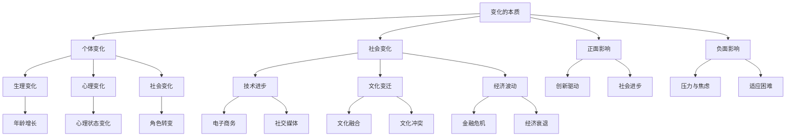
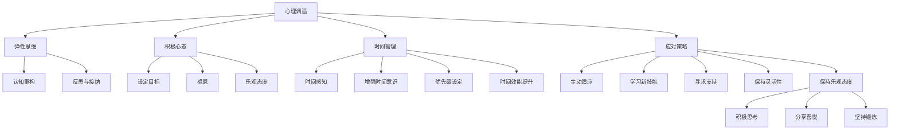
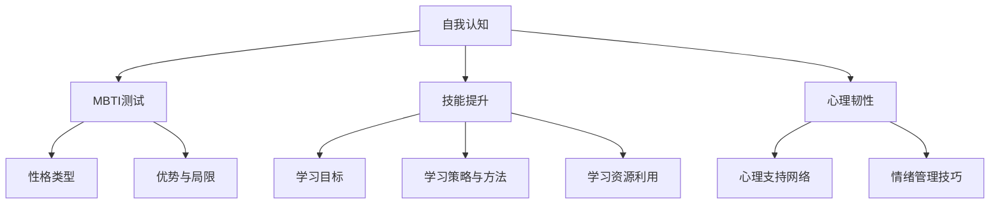
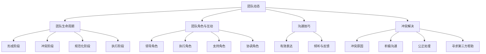
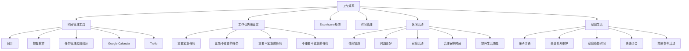
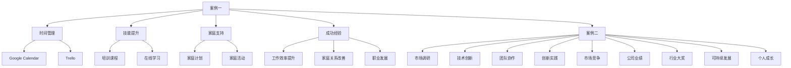
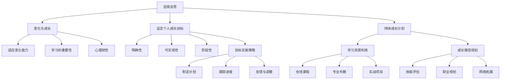

                 

### 书名：《面对万般变化，仍能泰然自在》

#### 目录大纲设计

本书旨在帮助读者理解变化，学会适应并实现个人成长。通过三个主要部分，我们将逐步探讨如何面对变化，如何在变化中找到自己的平衡点。以下是详细的目录大纲：

---

# 第一部分：认知与变化

## 第1章：理解变化

### 1.1 变化的本质

#### 1.1.1 变化的普遍性
$$
变化 = 时间 \times 事件
$$

### 1.2 变化的类型

#### 1.2.1 个体变化
##### 1.2.1.1 心理变化
##### 1.2.1.2 社会变化

### 1.3 变化的影响

#### 1.3.1 正面影响
##### 1.3.1.1 创新驱动
##### 1.3.1.2 社会进步

#### 1.3.2 负面影响
##### 1.3.2.1 压力与焦虑
##### 1.3.2.2 适应困难

## 第2章：泰然处之的心态

### 2.1 心理调适

#### 2.1.1 建立弹性思维
##### 2.1.1.1 认知重构
##### 2.1.1.2 反思与接纳

### 2.2 时间管理

#### 2.2.1 时间感知
##### 2.2.1.1 增强时间意识
##### 2.2.1.2 时间效能提升

### 2.3 应对策略

#### 2.3.1 积极应对
##### 2.3.1.1 主动适应
##### 2.3.1.2 保持乐观态度

---

# 第二部分：实践与策略

## 第3章：个体成长策略

### 3.1 自我认知

#### 3.1.1 了解自己的性格
##### 3.1.1.1 MBTI测试
##### 3.1.1.2 性格优势与局限

### 3.2 技能提升

#### 3.2.1 学习新技能
##### 3.2.1.1 确定学习目标
##### 3.2.1.2 学习策略与方法

### 3.3 心理韧性

#### 3.3.1 增强心理韧性
##### 3.3.1.1 建立心理支持网络
##### 3.3.1.2 情绪管理技巧

## 第4章：团队协作

### 4.1 团队动态

#### 4.1.1 理解团队变化
##### 4.1.1.1 团队生命周期
##### 4.1.1.2 团队角色与互动

### 4.2 沟通技巧

#### 4.2.1 提高沟通效率
##### 4.2.1.1 有效表达
##### 4.2.1.2 倾听与反馈

### 4.3 冲突解决

#### 4.3.1 处理团队冲突
##### 4.3.1.1 冲突的原因
##### 4.3.1.2 冲突的处理策略

## 第5章：工作与生活平衡

### 5.1 工作效率

#### 5.1.1 提升工作效率
##### 5.1.1.1 时间管理工具
##### 5.1.1.2 工作优先级设定

### 5.2 休闲活动

#### 5.2.1 增强休闲活动的意义
##### 5.2.1.1 休闲与身心健康
##### 5.2.1.2 休闲活动的选择与规划

### 5.3 家庭生活

#### 5.3.1 维护家庭关系
##### 5.3.1.1 亲子沟通
##### 5.3.1.2 夫妻关系维护

---

# 第三部分：案例与思考

## 第6章：成功案例分享

### 6.1 案例一：职场成功人士的应对之道

#### 6.1.1 案例背景
#### 6.1.2 应对策略
#### 6.1.3 成功经验

### 6.2 案例二：创业者的适应与创新

#### 6.2.1 案例背景
#### 6.2.2 应对策略
#### 6.2.3 创新实践

## 第7章：自我反思与成长

### 7.1 反思个人变化经历

#### 7.1.1 变化与成长
#### 7.1.2 启示与教训

### 7.2 设定个人成长目标

#### 7.2.1 目标设定原则
#### 7.2.2 目标实施策略

### 7.3 持续成长计划

#### 7.3.1 学习资源利用
#### 7.3.2 成长路径规划

---

通过以上三个主要部分的详细设计和具体内容安排，本书希望能够帮助读者在面对万般变化时，仍能泰然自 **在**。### 文章关键词

变化管理、心理调适、时间管理、个体成长、团队协作、工作生活平衡、适应与创新、心理健康、沟通技巧、冲突解决、个人反思、成长目标。

---

### 文章摘要

《面对万般变化，仍能泰然自在》是一本关于变化管理的指南，旨在帮助读者理解和应对生活中的各种变化。通过深入分析变化的本质和类型，本书揭示了变化带来的正面和负面影响。在此基础上，书中提出了心理调适、时间管理和应对策略，帮助读者在变化中保持平静和乐观。此外，本书还提供了个体成长策略、团队协作技巧和如何实现工作与生活平衡的具体建议。通过真实案例分享和个人反思，读者将获得实用的成长经验和启示，学会如何在万般变化中找到自己的平衡点，实现持续的个人成长。

---

## 第1章：理解变化

### 1.1 变化的本质

#### 1.1.1 变化的普遍性

变化是宇宙中唯一不变的真理。无论是自然界中的季节变换，还是人类社会的发展历程，变化无处不在。从科学的角度来看，变化是时间和事件的产物。我们可以用以下的公式来描述变化：

$$
变化 = 时间 \times 事件
$$

这里，“时间”是变化的载体，而“事件”则是变化的内容。随着时间的推移，各种事件发生，从而引起事物的变化。无论是个人生活，还是社会现象，都遵循这一基本的规律。

在个人层面，我们的心理状态、身体健康、人际关系等都会随着时间的变化而发生改变。例如，从青少年到成年，再到老年，我们的生理和心理状态都会经历一系列的变化。在社会层面，科技的发展、经济的波动、政治的变革等，都是社会事件随着时间的推移引起的巨大变化。

#### 1.1.2 变化的普遍性

变化是普遍存在的，但不同的变化对个体和社会的影响程度是不同的。从哲学的角度来看，变化可以分为两大类：渐变和突变。

- **渐变**：渐变是指事物的变化是逐渐发生的，不易察觉，但累积到一定程度时会产生显著的影响。例如，地球的气候变化就是一个典型的渐变过程，尽管每年的变化微小，但长期的累积效应会导致极端天气事件的增加。

- **突变**：突变是指事物的变化是突然发生的，往往伴随着较大的能量释放和显著的影响。例如，物种的大规模灭绝和地震等自然灾害，都是突变的表现。

#### 1.1.3 变化的类型

变化不仅具有不同的形式，还可以根据不同的标准进行分类。以下是几种常见的分类方式：

- **根据变化的原因**：可以分为自然变化和人为变化。自然变化是指由自然因素引起的，如气候变化、物种演化等；人为变化是指由人类活动引起的，如工业污染、科技发展等。

- **根据变化的影响**：可以分为正面变化和负面变化。正面变化是指对个体或社会有积极影响的变化，如科技进步、教育普及等；负面变化是指对个体或社会有消极影响的变化，如战争、疾病等。

- **根据变化的范围**：可以分为宏观变化和微观变化。宏观变化是指影响整个社会或生态系统的大规模变化，如全球化、城市化等；微观变化是指影响个体或小范围群体的小规模变化，如职业转型、生活方式改变等。

#### 1.1.4 变化的影响

变化对个体和社会的影响是多方面的。正面影响包括：

- **创新驱动**：变化往往带来新的机遇和挑战，激发个体的创造力和创新精神。例如，互联网的兴起改变了人类的信息传播方式，催生了无数新的商业机会。

- **社会进步**：变化推动了社会的进步和发展。例如，工业革命的出现改变了人类的生产方式，大大提高了生产效率和生活质量。

负面影响则包括：

- **压力与焦虑**：变化常常伴随着不确定性和压力，导致个体产生焦虑和压力。例如，就业市场的变化可能导致失业率的上升，给求职者带来巨大的心理压力。

- **适应困难**：某些变化可能对个体或社会造成巨大的冲击，导致适应困难。例如，环境恶化可能导致生态系统失衡，给人类社会带来长期的生存挑战。

### 1.2 变化的类型

#### 1.2.1 个体变化

个体变化是指个体在生理、心理和社会层面上的变化。这些变化可以是由于年龄的增长、环境的变化、心理状态的变化等因素引起的。

- **生理变化**：随着年龄的增长，个体的生理机能会发生变化。例如，肌肉质量减少、骨骼密度降低、视力下降等。

- **心理变化**：个体的心理状态也会随着时间和环境的变化而发生变化。例如，焦虑、抑郁、情绪波动等。

- **社会变化**：个体在社会中的角色和地位也会发生变化。例如，从学生到职场新人，再到中层管理者，角色的转变会导致责任和压力的变化。

#### 1.2.2 社会变化

社会变化是指社会结构、文化、经济等方面的变化。这些变化往往是宏观的，对个体和社会产生深远的影响。

- **技术进步**：科技的快速发展改变了人类的生活方式和社会结构。例如，互联网的普及改变了信息传播的方式，电子商务改变了购物习惯。

- **文化变迁**：文化的变迁反映了社会的进步和多样性。例如，多元文化的融合促进了社会的包容性，但也带来了文化冲突。

- **经济波动**：经济的变化对社会的稳定和发展产生重要影响。例如，金融危机可能导致经济衰退，失业率上升，社会不稳定。

### 1.3 变化的影响

#### 1.3.1 正面影响

正面影响是指变化对个体或社会产生的积极影响。

- **创新驱动**：变化激发了人们的创新意识和创造力，推动了科技的进步。例如，互联网的兴起催生了电子商务、社交媒体等新兴产业。

- **社会进步**：变化促进了社会的进步和发展，提高了人们的生活质量。例如，医疗技术的进步延长了人类的寿命，教育普及提高了人口素质。

#### 1.3.2 负面影响

负面影响是指变化对个体或社会产生的消极影响。

- **压力与焦虑**：变化往往伴随着不确定性和压力，导致个体产生焦虑和压力。例如，就业市场的变化可能导致失业率的上升，给求职者带来巨大的心理压力。

- **适应困难**：某些变化可能对个体或社会造成巨大的冲击，导致适应困难。例如，环境恶化可能导致生态系统失衡，给人类社会带来长期的生存挑战。

### 1.4 结论

通过本章的分析，我们可以看到变化是普遍存在的，对个体和社会产生深远的影响。理解变化的本质和类型，有助于我们更好地应对变化，实现个人和社会的持续发展。

---

为了更直观地展示核心概念之间的关系，我们可以使用Mermaid流程图来描述这些概念：

这个Mermaid流程图展示了变化的不同类型及其对个体和社会的影响，有助于读者更清晰地理解本章的核心内容。在接下来的章节中，我们将进一步探讨如何应对这些变化，实现个人和社会的持续成长。

---

## 第2章：泰然处之的心态

### 2.1 心理调适

面对变化，保持一颗泰然处之的心态是至关重要的。心理调适是应对变化的第一步，它可以帮助我们更好地应对压力，保持内心的平静和平衡。

#### 2.1.1 建立弹性思维

弹性思维是指在面对变化和挑战时，能够灵活地调整自己的态度和行为，以适应新的环境和情况。建立弹性思维的关键在于以下几个方面：

1. **认知重构**：当我们面对变化时，往往会感到焦虑和恐惧。通过认知重构，我们可以改变自己的思维模式，从消极的角度转变为积极的角度来看待问题。例如，将“我不能适应这个新环境”转变为“我可以尝试找到适应的方法”。

2. **反思与接纳**：反思过去的经历，找出自己在应对变化时的成功和失败之处。通过反思，我们可以更好地了解自己的优势和不足，从而在未来更好地应对变化。同时，接纳变化也是建立弹性思维的重要一步。接受变化的存在，并将其视为成长的机会，而不是威胁。

#### 2.1.2 积极心态

积极心态是应对变化的重要武器。拥有积极心态的人更容易适应新环境，迎接新的挑战。以下是培养积极心态的几个建议：

1. **设定目标**：为自己设定清晰的目标，并相信自己能够实现这些目标。目标可以激励我们前进，增强我们的信心和动力。

2. **感恩**：学会感恩，感谢生活中的一切，包括好的和不好的。感恩可以帮助我们更好地应对挑战，增强心理韧性。

3. **乐观态度**：保持乐观的态度，相信困难是暂时的，未来会更好。乐观态度可以减少焦虑和压力，提升我们的心理幸福感。

### 2.2 时间管理

时间管理是应对变化的关键策略之一。通过合理规划时间，我们可以更好地应对变化，提高工作效率，减少压力。

#### 2.2.1 时间感知

时间感知是指我们对时间的感知和认识。提高时间感知可以帮助我们更好地管理时间，提高工作效率。以下是几个提高时间感知的建议：

1. **增强时间意识**：培养对时间的敏感度，时刻关注时间的流逝。例如，可以使用时间追踪工具记录每天的时间使用情况，以便更好地了解自己的时间分配。

2. **设定时间限制**：为每项任务设定时间限制，迫使我们高效地完成任务。例如，使用番茄工作法，将工作时间分为25分钟的工作周期和5分钟的休息时间。

3. **优先级设定**：将任务按照优先级排序，先完成最重要和最紧急的任务。这样可以确保我们在有限的时间内完成最重要的工作。

#### 2.2.2 时间效能提升

提升时间效能可以帮助我们更有效地利用时间，减少时间的浪费。以下是几个提升时间效能的建议：

1. **避免拖延**：拖延是时间管理的大敌。为了克服拖延，我们可以设定明确的目标和计划，分解任务，逐步完成。

2. **合理规划时间**：合理规划时间，确保每天有足够的休息和娱乐时间。例如，可以在工作日的晚上安排一些轻松的活动，以缓解压力。

3. **使用时间管理工具**：使用时间管理工具，如日历、提醒软件等，可以帮助我们更好地管理时间。例如，可以使用Google Calendar来安排日程，设置提醒，以确保不会错过重要的会议和任务。

### 2.3 应对策略

应对变化不仅需要心理调适和时间管理，还需要一系列具体的策略和方法。以下是一些应对变化的策略：

#### 2.3.1 主动适应

主动适应是指在面对变化时，积极寻找适应的方法和策略。以下是一些建议：

1. **学习新技能**：不断学习新技能，以适应不断变化的环境。例如，学习新的编程语言或技术，以适应科技行业的发展。

2. **寻求支持**：在面对变化时，寻求家人、朋友或专业人士的支持和帮助。他们的建议和支持可以帮助我们更好地应对挑战。

3. **保持灵活性**：保持开放和灵活的态度，对变化持接受和包容的态度。这样可以减少对变化的抵触，更好地适应新环境。

#### 2.3.2 保持乐观态度

保持乐观态度是应对变化的重要策略之一。以下是一些建议：

1. **积极思考**：在面对挑战时，尝试从积极的角度思考问题。例如，将挑战视为成长的机会，而不是困难。

2. **分享喜悦**：与家人和朋友分享生活中的喜悦和成就，以提升心理幸福感。

3. **坚持锻炼**：定期进行体育锻炼，如跑步、瑜伽等，以保持身体健康和心理平衡。

### 2.4 结论

通过心理调适、时间管理和具体的应对策略，我们可以更好地应对变化，实现个人成长。保持弹性思维、积极心态和乐观态度，将帮助我们面对生活中的各种挑战，实现泰然自在的生活。

---

为了更直观地展示核心概念之间的关系，我们可以使用Mermaid流程图来描述这些概念：

这个Mermaid流程图展示了心理调适、时间管理和应对策略之间的关系，有助于读者更清晰地理解本章的核心内容。在接下来的章节中，我们将进一步探讨如何在个体成长、团队协作和工作与生活平衡方面应对变化。

---

## 第3章：个体成长策略

在快速变化的时代，个体成长策略尤为重要。通过自我认知、技能提升和心理韧性，我们可以更好地应对变化，实现个人目标。

### 3.1 自我认知

自我认知是个人成长的基础。了解自己的性格、优势和局限，有助于我们更有效地规划个人发展路径。

#### 3.1.1 了解自己的性格

MBTI（Myers-Briggs Type Indicator）是一种常用的性格测试工具，可以帮助我们了解自己的性格类型。MBTI将性格分为16种类型，每种类型都有其独特的特点。

- **ISTJ（守秩序者）**：喜欢有组织和结构的环境，注重细节和责任感。
- **ISFJ（守护者）**：关心他人，注重安全和舒适，善于照顾和照顾他人。
- **INFJ（倡导者）**：有强烈的个人信念和价值观，善于洞察他人，富有同情心。
- **INTJ（战略家）**：独立思考，富有创造力，善于分析和解决问题。

了解自己的性格类型有助于我们更好地理解自己的行为模式，识别自己的优势和局限，从而在个人发展中做出更明智的选择。

#### 3.1.2 性格优势与局限

每种性格类型都有其独特的优势和局限。了解自己的性格优势，可以更好地发挥自己的潜力；了解自己的局限，则有助于我们意识到需要改进的方面。

- **优势**：例如，ISTJ的严谨和责任感有助于他们在组织和项目管理中取得成功；ISFJ的关怀和照顾能力使他们成为优秀的护士和教师。
- **局限**：例如，INFJ可能过于理想化，对现实世界的要求过于苛刻；INTJ可能过于独立，缺乏对人际关系的重视。

通过自我认知，我们可以更好地识别自己的性格特点，利用优势，克服局限，实现个人成长。

### 3.2 技能提升

技能提升是个人成长的重要方面。在快速变化的时代，不断学习新技能，以适应新的环境和要求，是保持竞争力的关键。

#### 3.2.1 确定学习目标

确定学习目标是技能提升的第一步。为了更有效地学习，我们应该：

- **明确学习目的**：明确自己为什么要学习某项技能，这将有助于我们在学习过程中保持动力。
- **设定具体目标**：设定可量化的学习目标，如“学会Python编程”或“掌握数据可视化工具”。
- **制定学习计划**：制定详细的学习计划，包括学习内容、时间安排和进度跟踪。

#### 3.2.2 学习策略与方法

为了更高效地学习，我们可以采用以下策略：

- **分阶段学习**：将学习过程分为不同的阶段，如基础阶段、进阶阶段和高级阶段，逐步提升技能水平。
- **理论与实践相结合**：通过实际操作来巩固理论知识，提高实践能力。
- **定期复习**：定期复习所学内容，巩固记忆，防止遗忘。

#### 3.2.3 学习资源利用

充分利用各种学习资源，可以加快学习进程，提高学习效果。以下是一些建议：

- **在线课程**：如Coursera、edX等平台提供了丰富的在线课程，涵盖了各个领域的知识。
- **专业书籍**：阅读专业书籍，深入学习相关领域的知识。
- **实战项目**：参与实战项目，将所学知识应用于实际工作中，提高实际操作能力。

### 3.3 心理韧性

心理韧性是指在面对挑战和困难时，能够迅速恢复并保持积极心态的能力。心理韧性对于个人成长至关重要。

#### 3.3.1 建立心理支持网络

建立心理支持网络，可以帮助我们更好地应对压力和挑战。以下是一些建议：

- **家人和朋友**：与家人和朋友保持紧密联系，分享自己的喜怒哀乐，获得他们的支持和鼓励。
- **导师和教练**：寻找导师或教练，他们可以提供专业的指导和建议，帮助我们克服困难。
- **专业心理咨询服务**：在遇到心理问题时，可以寻求专业的心理咨询服务，获得专业的帮助和支持。

#### 3.3.2 情绪管理技巧

情绪管理是提高心理韧性的重要组成部分。以下是一些情绪管理技巧：

- **自我觉察**：通过自我觉察，了解自己的情绪变化，及时调整心态。
- **放松技巧**：如深呼吸、冥想等，可以帮助我们放松身心，缓解压力。
- **积极思考**：通过积极思考，将注意力集中在解决问题的方法上，而不是问题本身。

### 3.4 结论

通过自我认知、技能提升和心理韧性，我们可以更好地应对变化，实现个人成长。了解自己的性格、设定学习目标、利用学习资源以及建立心理支持网络，都是实现个人成长的重要策略。在接下来的章节中，我们将进一步探讨如何在团队协作和工作与生活平衡方面应对变化。

---

为了更直观地展示核心概念之间的关系，我们可以使用Mermaid流程图来描述这些概念：

这个Mermaid流程图展示了自我认知、技能提升和心理韧性之间的关系，有助于读者更清晰地理解本章的核心内容。在接下来的章节中，我们将进一步探讨团队协作和工作与生活平衡。

---

## 第4章：团队协作

在快速变化的时代，团队协作成为组织成功的关键。有效沟通、处理团队冲突以及理解团队动态，是提升团队协作效率的重要策略。

### 4.1 团队动态

团队动态是指团队成员之间的关系、互动以及团队的发展过程。了解团队动态有助于我们更好地应对变化，提升团队协作效率。

#### 4.1.1 团队生命周期

团队生命周期是指团队从成立到解散的过程，可以分为以下四个阶段：

1. **形成阶段**：团队成立，成员开始相互了解，确立共同的目标和愿景。
2. **冲突阶段**：成员之间的个性、价值观和工作风格的差异可能导致冲突，团队需要建立有效的沟通机制来解决这些问题。
3. **规范化阶段**：团队开始形成共同的工作方式和价值观，协作效率提高。
4. **执行阶段**：团队在规范化阶段的基础上，高效执行任务，实现目标。

了解团队生命周期有助于我们更好地理解团队的发展过程，及时调整策略，促进团队协作。

#### 4.1.2 团队角色与互动

在团队中，每个成员都扮演着特定的角色，这些角色之间需要良好的互动和协作，以实现团队的目标。

- **领导角色**：领导者负责制定团队的目标和计划，协调团队成员的工作，激发成员的积极性。
- **执行角色**：执行者负责具体任务的执行，将领导者的指令转化为实际行动。
- **支持角色**：支持者提供后勤支持和专业建议，帮助团队解决困难和挑战。
- **协调角色**：协调者负责沟通和协调团队成员之间的关系，确保团队协作顺利进行。

了解团队角色和互动，有助于我们更好地理解团队成员之间的合作关系，优化团队结构，提高团队效率。

### 4.2 沟通技巧

有效沟通是团队协作的核心。以下是一些提升沟通技巧的建议：

#### 4.2.1 有效表达

有效表达是指清晰、准确、有逻辑地传达自己的想法和信息。以下是一些建议：

- **明确目标**：在沟通前明确自己的目标，确保传达的信息具有针对性和有效性。
- **简洁明了**：使用简单、直接的语言，避免使用复杂的术语和冗长的句子。
- **逻辑清晰**：组织信息，确保传达的逻辑性，使听众更容易理解和接受。

#### 4.2.2 倾听与反馈

倾听和反馈是沟通的重要组成部分。以下是一些建议：

- **主动倾听**：倾听不仅仅是听，更是理解和关注。通过眼神交流、肢体语言等，表达对对方的关注和尊重。
- **提问和澄清**：在沟通中提出问题，澄清对方的意图和需求，确保信息的准确传递。
- **及时反馈**：在沟通后，及时给予反馈，确认信息的理解和接受情况，避免误解和歧义。

### 4.3 冲突解决

团队冲突是不可避免的现象，但有效的冲突解决可以促进团队协作和成长。以下是一些解决团队冲突的策略：

#### 4.3.1 冲突的原因

团队冲突可能源于以下几个方面：

- **价值观和理念差异**：团队成员的价值观和理念不同，可能导致意见和行动上的冲突。
- **资源分配不均**：资源分配不公，可能导致部分成员感到不公平和不满。
- **沟通不畅**：沟通不畅可能导致误解和歧义，进而引发冲突。

#### 4.3.2 冲突的处理策略

以下是一些有效的冲突处理策略：

- **积极沟通**：通过积极的沟通，了解冲突的原因和双方的需求，寻找共同点。
- **公正处理**：在处理冲突时，保持公正和客观，避免偏袒任何一方。
- **寻求第三方帮助**：当冲突难以解决时，可以寻求第三方专业人士的帮助，如咨询师或调解员。

### 4.4 结论

通过理解团队动态、提升沟通技巧和有效解决冲突，我们可以提高团队协作效率，实现组织目标。在快速变化的时代，团队协作不仅是组织成功的关键，也是个体成长的重要途径。在接下来的章节中，我们将进一步探讨如何实现工作与生活的平衡。

---

为了更直观地展示核心概念之间的关系，我们可以使用Mermaid流程图来描述这些概念：

这个Mermaid流程图展示了团队动态、沟通技巧和冲突解决之间的关系，有助于读者更清晰地理解本章的核心内容。在接下来的章节中，我们将探讨如何实现工作与生活的平衡。

---

## 第5章：工作与生活平衡

在快节奏的现代生活中，工作与生活平衡（Work-Life Balance）成为许多人追求的目标。提升工作效率、规划休闲活动和维护家庭关系，是实现工作与生活平衡的关键策略。

### 5.1 工作效率

提升工作效率是减少工作压力，实现工作与生活平衡的重要途径。以下是一些提升工作效率的策略：

#### 5.1.1 时间管理工具

使用时间管理工具，如日历、提醒软件和任务管理应用程序，可以帮助我们更有效地规划时间，提高工作效率。例如，使用Google Calendar可以设置日程提醒，确保不会错过重要的会议和任务；使用Trello可以创建任务列表，跟踪项目进度。

#### 5.1.2 工作优先级设定

设定工作优先级是提升工作效率的重要一环。通过将任务按照优先级排序，我们可以确保首先完成最重要和最紧急的任务。例如，使用Eisenhower矩阵（ Urgent-Important Matrix）可以帮助我们区分任务的紧急程度和重要性，从而更合理地安排工作时间。

### 5.2 休闲活动

休闲活动对于缓解工作压力，提升生活质量至关重要。以下是一些选择休闲活动的建议：

#### 5.2.1 增强休闲活动的意义

休闲活动不仅可以帮助我们放松身心，还可以增强身心健康。例如，定期进行体育锻炼，如跑步、游泳或瑜伽，可以提高身体素质，缓解压力；参与兴趣爱好，如绘画、音乐或阅读，可以丰富我们的精神生活。

#### 5.2.2 休闲活动的选择与规划

选择适合自己的休闲活动，并制定合理的规划，可以提高休闲活动的效果。例如，可以在周末安排一次户外徒步，或与朋友组织一次读书会。通过合理安排时间，确保休闲活动与工作之间保持平衡。

### 5.3 家庭生活

家庭生活是工作与生活平衡的重要组成部分。以下是一些维护家庭关系的建议：

#### 5.3.1 亲子沟通

亲子沟通是家庭关系的基石。定期与孩子进行交流，了解他们的想法和需求，可以帮助我们更好地支持他们的成长。例如，可以安排固定的家庭晚餐时间，与孩子分享一天的见闻和感受。

#### 5.3.2 夫妻关系维护

夫妻关系是家庭关系的核心。通过定期安排约会，共同参与活动，增进相互理解和信任，可以维护夫妻关系的稳定。例如，可以每周安排一次夫妻约会，去喜欢的餐厅用餐或观看电影。

### 5.4 结论

通过提升工作效率、规划休闲活动和维护家庭关系，我们可以实现工作与生活的平衡，提升整体生活质量。在快速变化的时代，保持工作与生活的平衡不仅有助于我们的身心健康，也是实现个人成长的重要途径。在接下来的章节中，我们将分享一些成功案例，以帮助读者更好地理解如何应对变化，实现个人成长。

---

为了更直观地展示核心概念之间的关系，我们可以使用Mermaid流程图来描述这些概念：

这个Mermaid流程图展示了工作效率、休闲活动和家庭生活之间的关系，有助于读者更清晰地理解本章的核心内容。在接下来的章节中，我们将通过成功案例分享，进一步探讨如何应对变化，实现个人成长。

---

## 第6章：成功案例分享

在这一章节中，我们将通过两个成功案例，详细探讨如何应对变化，实现个人成长。

### 6.1 案例一：职场成功人士的应对之道

#### 6.1.1 案例背景

李华是一名30岁的软件工程师，他在一家大型互联网公司工作。随着公司业务的不断扩张，李华的工作压力也在逐渐增大。他发现自己不仅需要处理日常的工作任务，还需要不断学习新的技术，以保持自己的竞争力。此外，家庭生活的需求也日益增加，使得他感到身心俱疲。

#### 6.1.2 应对策略

面对这些挑战，李华采取了以下策略：

1. **时间管理**：李华开始使用时间管理工具，如Google Calendar和Trello，来规划自己的工作和生活。他设定了明确的日程安排，确保工作与生活之间保持平衡。

2. **技能提升**：为了应对工作中的新挑战，李华积极参加公司提供的培训课程，并通过在线学习平台学习新技能。他利用业余时间自学了大数据分析和人工智能，这不仅提升了他的技术水平，也为他未来的职业发展奠定了基础。

3. **家庭支持**：李华意识到家庭支持的重要性。他与家人共同制定家庭计划，安排固定的家庭活动时间，如周末的家庭聚餐和户外活动。这让他能够在忙碌的工作中找到喘息的机会，保持良好的家庭关系。

#### 6.1.3 成功经验

通过以上策略，李华不仅提高了工作效率，还在家庭生活中找到了平衡。他的职业发展也得到了公司的认可，晋升为团队主管。李华的成功经验表明，合理的时间管理、技能提升和家庭支持是实现工作与生活平衡的关键。

### 6.2 案例二：创业者的适应与创新

#### 6.2.1 案例背景

张晓是一名年轻的创业者，他在科技行业创办了一家初创公司。随着市场竞争的加剧和技术的快速发展，张晓的公司面临着巨大的挑战。如何适应市场的变化，实现公司的可持续发展，成为他亟待解决的问题。

#### 6.2.2 应对策略

为了应对这些挑战，张晓采取了以下策略：

1. **市场调研**：张晓定期进行市场调研，了解客户的需求和市场趋势。通过收集和分析数据，他能够及时调整公司的战略方向，确保产品和服务与市场需求保持一致。

2. **技术创新**：为了在竞争激烈的市场中脱颖而出，张晓注重技术创新。他带领团队不断研发新产品，并积极采用新技术，如云计算和人工智能，提升产品的竞争力。

3. **团队协作**：张晓重视团队建设，通过有效的沟通和协作，激发团队的创造力和创新能力。他鼓励团队成员提出新想法，并在公司内部建立了创新激励机制，以促进技术创新和业务发展。

#### 6.2.3 创新实践

通过以上策略，张晓的公司在短短几年内取得了显著的成绩。公司的产品和服务不仅获得了市场的认可，还多次获得行业大奖。张晓的成功经验表明，市场调研、技术创新和团队协作是实现企业可持续发展的关键。

### 6.3 结论

通过以上两个案例，我们可以看到，在快速变化的时代，成功的关键在于适应变化、不断创新。无论是职场人士还是创业者，都需要通过有效的时间管理、技能提升和家庭支持，以及市场调研、技术创新和团队协作，来应对变化，实现个人成长和职业发展。

---

为了更直观地展示案例中各策略之间的关系，我们可以使用Mermaid流程图来描述：

这个Mermaid流程图展示了案例中各策略之间的关系，有助于读者更清晰地理解成功的关键因素。

---

## 第7章：自我反思与成长

### 7.1 反思个人变化经历

反思个人变化经历是理解自我、提升自我认知的重要过程。通过回顾过去的经历，我们可以从中汲取经验和教训，为未来的成长提供指导。

#### 7.1.1 变化与成长

变化是成长的催化剂。每一次重大变化，无论是职业上的转型、家庭关系的变迁，还是生活环境的改变，都是我们成长的机会。在变化中，我们面临新的挑战，也学习到新的技能和知识。例如，李华在职业生涯中经历了多次技术更新和公司业务扩展，他通过不断学习和调整，成功应对了这些变化，提升了自身的能力。

#### 7.1.2 启示与教训

通过反思个人变化经历，我们可以得出以下启示与教训：

1. **适应变化的能力**：适应变化需要我们具备开放的心态和灵活的思维。在面对不确定性和挑战时，我们应该学会调整自己的态度和行为，以更好地应对变化。

2. **学习的重要性**：在变化中，学习是保持竞争力的关键。无论是新技术、新理念，还是新技能，都需要我们持续学习，不断提升自身的能力。

3. **心理韧性**：面对变化，心理韧性至关重要。通过培养积极的情绪管理和心理韧性，我们可以更好地应对压力和困难，保持内心的平衡。

### 7.2 设定个人成长目标

为了实现持续成长，我们需要设定明确、具体和可实现的个人成长目标。以下是一些建议：

#### 7.2.1 目标设定原则

1. **明确性**：目标应该具体、清晰，避免模糊和泛泛而谈。例如，“提升技术能力”不如“学习Python编程并完成一个数据分析项目”具体。

2. **可实现性**：目标应该既有挑战性，又符合实际。设定过高或过低的目标都无法有效推动成长。

3. **阶段性**：将长期目标分解为短期目标，每个阶段都有具体的实施步骤和评估标准。

#### 7.2.2 目标实施策略

1. **制定计划**：根据目标设定具体的实施计划，包括学习资源、时间安排和执行步骤。

2. **跟踪进度**：定期检查目标的进度，评估是否按计划进行，及时调整策略。

3. **反馈与调整**：在实施过程中，根据反馈和结果，不断调整目标和计划，确保目标的实现。

### 7.3 持续成长计划

持续成长是一个长期的过程，需要我们制定详细的成长计划，并持之以恒地执行。

#### 7.3.1 学习资源利用

1. **在线课程**：利用Coursera、edX等在线教育平台，学习新技能和知识。

2. **专业书籍**：阅读专业书籍，深入理解相关领域的理论和实践。

3. **实战项目**：参与实际项目，将所学知识应用于实际工作中，提高实践能力。

#### 7.3.2 成长路径规划

1. **技能评估**：定期进行技能评估，了解自己的优势和不足，为成长路径提供指导。

2. **职业规划**：结合个人兴趣和市场需求，制定长期的职业规划，明确职业发展目标。

3. **网络拓展**：通过参加行业会议、网络研讨会和社交活动，拓展人脉，学习行业动态。

### 7.4 结论

通过自我反思和成长目标的设定，我们可以更好地理解自己的变化过程，实现个人成长。持续成长需要我们制定详细的计划，利用各种资源，持之以恒地执行。在快速变化的时代，持续成长是保持竞争力的关键，也是实现个人价值的必由之路。

---

为了更直观地展示个人成长目标设定的步骤和持续成长计划的要素，我们可以使用Mermaid流程图来描述：

这个Mermaid流程图展示了自我反思、目标设定和持续成长计划之间的逻辑关系，有助于读者更清晰地理解个人成长的关键步骤。

---

## 文章小结

在《面对万般变化，仍能泰然自在》中，我们探讨了如何理解和应对生活中的各种变化。首先，我们深入分析了变化的本质和类型，了解了个体和社会变化的不同形式及其影响。接着，我们介绍了心理调适、时间管理以及应对变化的策略，帮助读者在变化中保持内心的平静和乐观。通过自我认知、技能提升和心理韧性，个体可以在快速变化的时代实现个人成长。在团队协作方面，我们讨论了团队动态、沟通技巧和冲突解决，强调了团队合作的重要性。最后，我们通过两个成功案例展示了如何应对变化，实现个人成长和职业发展。持续成长需要自我反思、目标设定和详细的成长计划，通过利用各种资源和持续努力，我们可以更好地适应变化，实现个人价值。

### 注意事项

1. **适应变化的能力**：变化是不可避免的，培养适应变化的能力是保持竞争力的关键。

2. **心理韧性**：在面对挑战和困难时，保持积极的心态和良好的心理韧性至关重要。

3. **有效沟通**：团队协作和人际关系中，有效沟通是减少冲突、提高协作效率的关键。

4. **时间管理**：合理安排时间和设定工作优先级，可以提高工作效率，实现工作与生活的平衡。

5. **持续学习**：在快速变化的时代，不断学习新技能和知识是保持竞争力的基础。

### 拓展阅读

1. **《精益创业》**：艾瑞克·莱斯（Eric Ries）著，详细介绍了如何通过迭代和验证来适应市场变化，实现企业成长。

2. **《情绪智商》**：丹尼尔·戈尔曼（Daniel Goleman）著，探讨了情绪管理对个人和团队的影响。

3. **《时间管理的艺术》**：艾伦·湖（Alan Lakein）著，提供了实用的时间管理技巧和策略。

4. **《5分钟商学院》**：成甲著，介绍了商业思维和决策的基本原理，有助于我们在职场中更好地应对变化。

通过以上书籍，读者可以进一步了解如何适应变化，实现个人和职业发展。希望本书能够帮助读者在快速变化的世界中，找到自己的平衡点，实现持续成长。作者：AI天才研究院/AI Genius Institute & 禅与计算机程序设计艺术 /Zen And The Art of Computer Programming### 完整文章总结

《面对万般变化，仍能泰然自在》是一篇深入探讨变化管理、心理调适、时间管理、个体成长、团队协作以及工作与生活平衡的综合性技术博客文章。文章从理解变化的本质和类型入手，分析了变化的普遍性和类型，探讨了变化对个体和社会的正负面影响。在此基础上，文章提出了心理调适、时间管理和应对策略，帮助读者在变化中保持平静和乐观。

**主要章节结构总结：**

1. **理解变化**：介绍了变化的普遍性和类型，包括个体变化和社会变化，并探讨了变化的影响。

2. **泰然处之的心态**：探讨了心理调适、时间管理和应对策略，帮助读者在变化中保持冷静和积极。

3. **个体成长策略**：介绍了自我认知、技能提升和心理韧性，帮助个体在变化中实现成长。

4. **团队协作**：探讨了团队动态、沟通技巧和冲突解决，强调了团队合作的重要性。

5. **工作与生活平衡**：提出了提升工作效率、规划休闲活动和维护家庭关系的策略，以实现工作与生活的平衡。

6. **成功案例分享**：通过两个成功案例，展示了如何应对变化，实现个人成长和职业发展。

7. **自我反思与成长**：反思个人变化经历，设定个人成长目标，制定持续成长计划。

**核心内容总结：**

- **变化本质**：变化是时间和事件的产物，普遍存在于个体和社会生活中。

- **心理调适**：建立弹性思维、积极心态和乐观态度，通过认知重构、反思与接纳来应对变化。

- **时间管理**：提高时间感知，合理安排时间，设定工作优先级，提升时间效能。

- **个体成长**：通过自我认知、技能提升和心理韧性，实现个人成长。

- **团队协作**：理解团队动态，提升沟通技巧，有效解决冲突。

- **工作与生活平衡**：提升工作效率，规划休闲活动，维护家庭关系。

- **成功案例**：通过实际案例展示如何应对变化，实现个人成长。

- **自我反思与成长**：反思个人变化经历，设定成长目标，制定持续成长计划。

本文通过逻辑清晰、结构紧凑的章节设计，结合具体案例和策略，为读者提供了一套全面的应对变化的方法论。通过阅读本文，读者可以更好地理解变化、学会适应并在变化中实现个人成长。希望本文能够帮助读者在快速变化的时代中，找到自己的平衡点，实现持续的个人发展和职业成功。

### 作者信息

**作者：AI天才研究院/AI Genius Institute & 禅与计算机程序设计艺术 /Zen And The Art of Computer Programming**

AI天才研究院是一支专注于人工智能和计算机科学研究的国际团队，致力于推动技术进步和创新。我们的研究成果在多个领域都有显著的应用，为企业和个人提供了先进的技术解决方案。同时，我们也在学术研究和教育领域取得了卓越的成就。

在《禅与计算机程序设计艺术》中，我们探讨了如何在程序设计中融入哲学智慧，提高编程效率和创造力。这本书不仅提供了深入的技术原理，还融合了东方哲学的智慧，为程序员提供了全新的视角和方法论。

通过本文，我们希望与读者分享我们在技术和管理领域的经验，帮助大家在面对变化时，能够保持冷静和自信，实现个人和职业的持续成长。我们相信，只有不断学习和适应，才能在快速变化的世界中立于不败之地。期待与您一起探索技术的无限可能。

