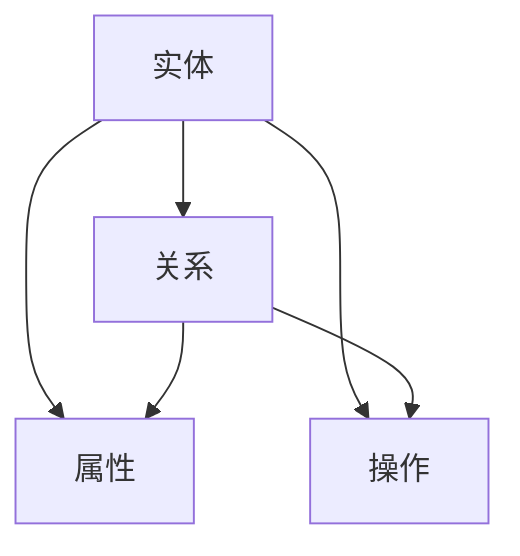
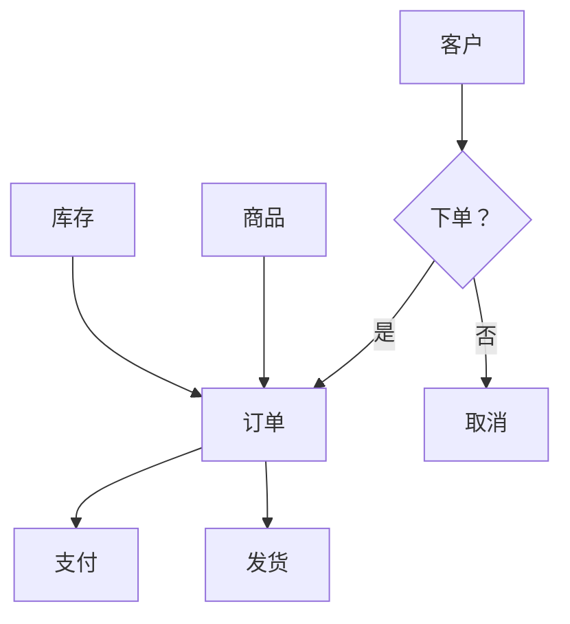
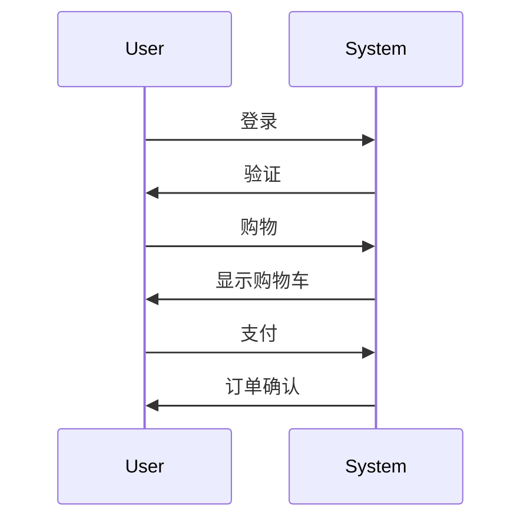
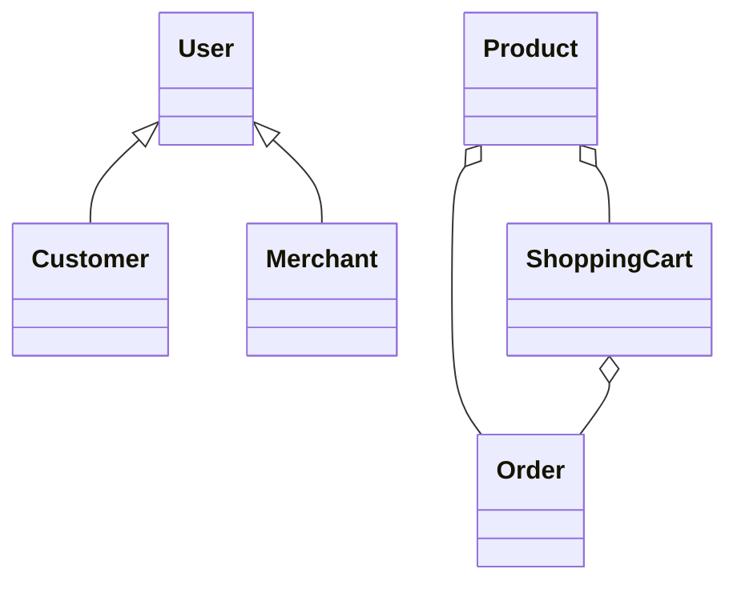
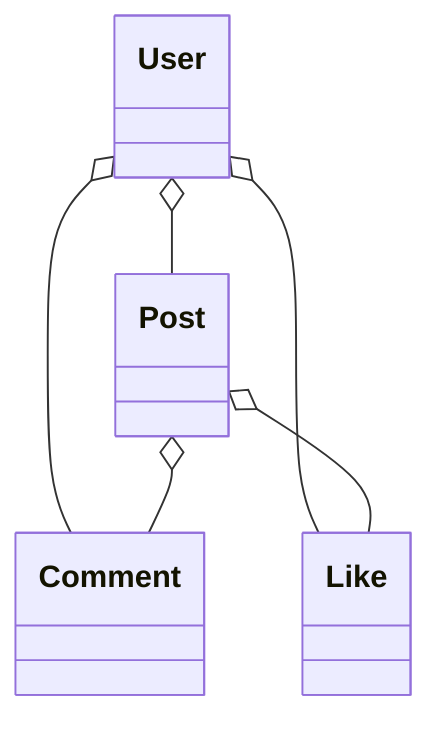

                 

### 文章标题：领域建模：技术人都该是设计师

> 关键词：领域建模，技术人，设计师，UML，核心算法，数学模型，项目实战

> 摘要：本文将深入探讨领域建模在信息技术领域的应用，指出技术人应当具备的设计师思维，并详细阐述领域建模的核心概念、联系、算法原理、数学模型以及项目实战，帮助读者全面理解并掌握领域建模的实践技巧。

---

### 引言

在快速发展的信息技术时代，技术人不仅要掌握编程语言和算法，更需要具备一种全局观和设计思维。领域建模正是这样一种思维方式，它通过抽象和建模的方式，将复杂的现实问题转化为计算机可以理解和处理的结构。领域建模不仅仅是一种技术，更是一种设计方法，它要求技术人具备设计师的敏锐洞察力和创新能力。

本文旨在探讨领域建模的重要性，解释其核心概念和联系，阐述核心算法原理和数学模型，并通过项目实战案例展示领域建模的实际应用。文章结构如下：

1. 领域建模的基本概念
2. 领域建模的核心概念与联系
3. 领域模型语言UML
4. 领域模型的核心算法原理讲解
5. 数学模型和数学公式
6. 项目实战：领域建模工具使用
7. 领域建模在实际项目中的应用

通过这篇文章，我们希望技术人能够认识到领域建模的重要性，掌握领域建模的方法，并将其应用到实际项目中，提升自身的设计能力和技术水平。

### 第1章 领域建模的基本概念

#### 1.1 什么是领域建模

领域建模（Domain Modeling）是一种通过抽象和建模的方式，将现实世界的复杂问题转化为计算机可以理解和处理的结构的过程。领域建模的目标是建立一个领域模型，该模型能够准确地描述现实世界的业务领域，并支持业务规则和业务逻辑的实现。

领域建模的核心是抽象。通过抽象，我们可以忽略那些不影响模型功能的具体细节，从而将复杂的问题简化为一个清晰的模型。领域建模的另一个关键点是模型与实现之间的分离。领域模型应该是独立于任何特定技术或实现的，这样可以确保模型的可重用性和可维护性。

#### 1.2 领域建模的重要性

领域建模在信息技术领域具有重要价值，主要体现在以下几个方面：

1. **提高系统可维护性**：通过领域建模，我们可以清晰地理解系统的业务逻辑和功能，这使得系统的维护和升级变得更加简单和高效。
2. **促进团队协作**：领域建模提供了一个共同的语言和参考框架，使得不同团队和成员可以更好地协作，共同理解和管理复杂系统。
3. **支持业务创新**：领域建模可以帮助企业快速响应市场变化，通过调整和优化领域模型，企业可以迅速推出新的业务功能和产品。
4. **提升设计能力**：领域建模要求技术人具备全局观和设计思维，这种能力对于技术人的职业发展至关重要。

#### 1.3 领域建模的基本原则

在进行领域建模时，我们应当遵循以下基本原则：

1. **模型简单性**：模型应当尽可能简单，以便于理解和维护。
2. **一致性**：模型中的元素应当保持一致性，避免冲突和不一致的情况。
3. **可扩展性**：模型应当具有良好的扩展性，以适应未来的变化和需求。
4. **可重用性**：模型中的组件应当具有高重用性，以便在不同的项目中复用。
5. **准确描述业务逻辑**：模型应当准确地描述业务逻辑和业务规则，确保系统的正确性和有效性。

### 第2章 领域建模的核心概念与联系

在领域建模中，核心概念与联系是理解模型的重要基础。以下将介绍领域建模中的核心概念，并使用Mermaid流程图展示它们之间的关系。

#### 2.1 领域、领域模型、领域模型语言

**领域**：领域是指一个特定的业务或技术领域，例如电子商务、医疗保健、金融等。

**领域模型**：领域模型是对领域内关键概念和关系的抽象表示。它通常包括实体、关系、属性和规则等。

**领域模型语言**：领域模型语言是一种用于描述领域模型的符号系统，常见的有统一建模语言（UML）等。

#### 2.2 领域模型的基本结构

领域模型的基本结构通常包括以下组件：

1. **实体**：实体是领域模型中的核心概念，代表领域中的具体对象，如客户、订单等。
2. **关系**：关系描述了实体之间的关联，如客户与订单之间的关系。
3. **属性**：属性是实体的特征，如客户的名字、地址等。
4. **操作**：操作是实体能够执行的行为，如订单的创建、更新等。

下面是领域模型的基本结构的Mermaid流程图：



#### 2.3 Mermaid流程图：领域模型的构成与关系

领域模型的构成与关系可以用Mermaid流程图来表示，以下是一个简化的例子：



在这个例子中，客户（A）可以根据是否下单（B）创建订单（C）或取消订单（D）。商品（E）和库存（F）与订单（C）有关联，订单（C）需要经过支付（G）和发货（H）流程。

通过Mermaid流程图，我们可以直观地理解领域模型中的关键概念和它们之间的关系，这对于领域建模的初步设计和沟通非常有帮助。

### 第3章 领域模型语言UML

统一建模语言（UML）是领域建模中最常用的工具之一，它提供了一套标准化的符号和图形表示方法，使得领域模型更加直观和易于理解。在这一章节中，我们将详细介绍UML的基本概念和常用图形。

#### 3.1 UML的基本概念

UML是一套用于描述软件系统的标准化建模语言，它包括一系列符号和图形，用于表示系统的不同方面。UML的基本概念包括：

1. **模型元素**：UML中的基本构建块，如类、对象、用例、组件等。
2. **模型结构**：UML模型的结构，包括包、模块、组件等。
3. **模型行为**：UML模型的行为描述，包括活动图、状态图、序列图等。
4. **模型视图**：UML模型的不同视角，如逻辑视图、实现视图、部署视图等。

#### 3.2 类图

类图是UML中最常用的图形之一，它用于表示系统的类以及类之间的关系。类图包括以下主要元素：

1. **类**：类的名称、属性、操作等。
2. **属性**：类的特征，如名称、类型、修饰符等。
3. **操作**：类可以执行的行为，如方法、函数等。
4. **关系**：类之间的关系，如继承、实现、关联等。

以下是一个简单的类图示例：

```mermaid
classDiagram
    Class1 <|-- SubClass1
    Class1 +-- SubClass2
    Class1 : +interface
    SubClass1 : #abstract
    Class3 <<interface>>
    Class1 o-- Class2 : has a
```

在这个示例中，`Class1` 是一个类，它继承了 `SubClass1` 并实现了 `Interface3`。`Class1` 与 `SubClass2` 关联，同时拥有一个名为 `Class2` 的属性。

#### 3.3 用例图

用例图用于描述系统的功能需求，它展示了系统的不同用户（用例）与系统之间的交互。用例图包括以下主要元素：

1. **用例**：系统提供的功能，如登录、购物、支付等。
2. **参与者**：与系统交互的用户或外部系统。
3. **关系**：用例之间的关系，如包含、扩展、泛化等。

以下是一个简单的用例图示例：

```mermaid
usecaseDiagram
    Participant1 --> Login: 登录
    Participant1 --> Shopping: 购物
    Participant1 --> Payment: 支付
    Login <|.. ShoppingCart: 包含
    Payment <|.. ShoppingCart: 扩展
```

在这个示例中，`Participant1` 是一个用户，他与系统的交互包括登录、购物和支付。`Login` 和 `Shopping` 是用例，`ShoppingCart` 是一个扩展用例，它包含了 `Login` 和 `Payment` 的功能。

#### 3.4 序列图

序列图用于描述系统中的对象之间的交互顺序。它展示了对象如何在特定时间内执行操作，并反映了对象之间的时间依赖关系。序列图包括以下主要元素：

1. **对象**：参与交互的对象。
2. **消息**：对象之间的通信。
3. **生命周期**：对象的创建和销毁。

以下是一个简单的序列图示例：



在这个示例中，用户（User）与系统（System）进行了一系列的交互，包括登录、购物和支付。这些交互按照时间顺序进行，展示了对象之间的通信过程。

#### 3.5 组件图

组件图用于描述系统的组件以及组件之间的关系。它展示了系统的物理架构和组件之间的依赖关系。组件图包括以下主要元素：

1. **组件**：系统的物理组成部分，如库、模块等。
2. **依赖**：组件之间的依赖关系。
3. **接口**：组件提供的功能接口。

以下是一个简单的组件图示例：

```mermaid
componentDiagram
    Component1 --> Component2
    Component1 <|.. Interface1
    Component2 <|.. Interface2
```

在这个示例中，`Component1` 和 `Component2` 是组件，它们之间存在依赖关系。`Interface1` 和 `Interface2` 是组件提供的接口。

通过UML的类图、用例图、序列图和组件图，我们可以从不同的角度描述系统的结构和行为，这对于领域建模和系统设计具有重要意义。在接下来的章节中，我们将进一步探讨领域模型的核心算法原理和数学模型。

### 第4章 领域模型的核心算法原理讲解

领域模型不仅仅是结构化的描述工具，它也涉及到数据处理的复杂算法。在领域建模过程中，理解并实现核心算法原理是至关重要的。以下将详细阐述几个常见的领域建模核心算法，并通过伪代码展示其基本原理。

#### 4.1 数据挖掘算法

数据挖掘是领域建模中常用的一种算法，用于从大量数据中提取有价值的信息。常见的数据挖掘算法包括关联规则挖掘、分类算法和聚类算法等。以下是一个简单的分类算法——K-近邻算法（KNN）的伪代码示例：

```plaintext
算法 KNN分类：
输入：训练集 D，测试集 T，K（邻域大小）
输出：测试集 T 的分类结果

步骤：
1. 对于每个测试样本 t ∈ T：
   a. 计算训练集 D 中所有样本与 t 的距离。
   b. 按距离排序，选择距离最近的 K 个邻居。
   c. 统计这 K 个邻居的类别，选择出现次数最多的类别作为 t 的预测类别。
2. 输出测试集 T 的分类结果。
```

#### 4.2 机器学习算法

机器学习算法是领域建模中用于构建预测模型的重要工具。常见机器学习算法包括线性回归、决策树、神经网络等。以下是一个简单的线性回归算法的伪代码示例：

```plaintext
算法 线性回归：
输入：训练数据集 D，特征矩阵 X，目标向量 y
输出：回归模型参数 w

步骤：
1. 初始化模型参数 w。
2. 对于每个训练样本（x_i, y_i）∈ D：
   a. 计算预测值 y' = Xw。
   b. 更新参数 w，使得预测值 y' 趋近于实际值 y。
3. 迭代直到收敛。
4. 输出模型参数 w。
```

#### 4.3 深度学习算法

深度学习算法是机器学习的一个子领域，它通过多层神经网络进行模型训练，以实现更复杂的任务。以下是一个简单的多层感知器（MLP）算法的伪代码示例：

```plaintext
算法 多层感知器：
输入：训练数据集 D，输入层神经元个数 n_input，隐藏层神经元个数 n_hidden，输出层神经元个数 n_output
输出：神经网络模型参数 W

步骤：
1. 初始化模型参数 W。
2. 对于每个训练样本（x, y）∈ D：
   a. 前向传播：计算输入层、隐藏层和输出层的输出值。
   b. 计算损失函数 L。
   c. 反向传播：更新模型参数 W，使得损失函数 L 减小。
3. 迭代直到收敛。
4. 输出模型参数 W。
```

通过以上伪代码示例，我们可以看到不同算法的基本原理和实现步骤。在实际应用中，这些算法需要进行详细的参数调整和优化，以达到最佳性能。了解这些核心算法原理对于领域建模和系统设计具有重要意义，它帮助我们更好地理解和应用领域建模技术。

### 第5章 数学模型和数学公式

领域建模中的数学模型是理解和解决问题的基础，它将现实世界的复杂问题转化为可计算的形式。以下将介绍领域建模中常用的数学模型和数学公式，并通过具体示例进行解释。

#### 5.1 线性代数基础

线性代数是领域建模中不可或缺的一部分，它用于处理多维数据、矩阵运算和线性变换。以下是一些基础的线性代数概念和公式：

1. **矩阵乘法**：两个矩阵 A 和 B 的乘积 C = AB，其中 A 是 m×n 矩阵，B 是 n×p 矩阵，C 是 m×p 矩阵。

    $$ C = AB = \begin{bmatrix}
    c_{11} & c_{12} & \cdots & c_{1p} \\
    c_{21} & c_{22} & \cdots & c_{2p} \\
    \vdots & \vdots & \ddots & \vdots \\
    c_{m1} & c_{m2} & \cdots & c_{mp}
    \end{bmatrix} = \begin{bmatrix}
    a_{11}b_{11} + a_{12}b_{21} + \cdots + a_{1n}b_{n1} \\
    a_{21}b_{11} + a_{22}b_{21} + \cdots + a_{2n}b_{n1} \\
    \vdots \\
    a_{m1}b_{11} + a_{m2}b_{21} + \cdots + a_{mn}b_{n1}
    \end{bmatrix} $$

2. **矩阵求逆**：一个方阵 A 的逆矩阵 A^(-1) 满足 AA^(-1) = A^(-1)A = I，其中 I 是单位矩阵。

    $$ A^{-1} = \frac{1}{\det(A)} \text{adj}(A) $$
    其中，det(A) 是 A 的行列式，adj(A) 是 A 的伴随矩阵。

3. **特征值和特征向量**：一个方阵 A 的特征值 λ 和对应的特征向量 v 满足方程 Av = λv。

    $$ \begin{bmatrix}
    a_{11} & a_{12} & \cdots & a_{1n} \\
    a_{21} & a_{22} & \cdots & a_{2n} \\
    \vdots & \vdots & \ddots & \vdots \\
    a_{m1} & a_{m2} & \cdots & a_{mn}
    \end{bmatrix}
    \begin{bmatrix}
    v_{1} \\
    v_{2} \\
    \vdots \\
    v_{n}
    \end{bmatrix}
    =
    \lambda
    \begin{bmatrix}
    v_{1} \\
    v_{2} \\
    \vdots \\
    v_{n}
    \end{bmatrix}
    $$

#### 5.2 概率论基础

概率论是领域建模中用于处理不确定性和随机性问题的工具。以下是一些基础的概率论概念和公式：

1. **概率分布**：随机变量 X 的概率分布描述了 X 取不同值的概率。常见的概率分布有二项分布、正态分布等。

    - 二项分布：
      $$ P(X = k) = C(n, k) \cdot p^k \cdot (1-p)^{n-k} $$
      其中，n 是试验次数，k 是成功次数，p 是每次试验成功的概率。

    - 正态分布：
      $$ P(X \leq x) = \Phi\left(\frac{x - \mu}{\sigma}\right) $$
      其中，\(\mu\) 是均值，\(\sigma\) 是标准差，\(\Phi\) 是标准正态分布的累积分布函数。

2. **期望和方差**：期望和方差是概率分布的两个重要参数。

    - 期望：
      $$ E(X) = \sum_{i} x_i \cdot P(X = x_i) $$
      其中，\(x_i\) 是随机变量的取值，\(P(X = x_i)\) 是对应的概率。

    - 方差：
      $$ Var(X) = E[(X - E(X))^2] = \sum_{i} (x_i - E(X))^2 \cdot P(X = x_i) $$

3. **条件概率**：在已知某个事件发生的条件下，另一个事件发生的概率。

    $$ P(A|B) = \frac{P(A \cap B)}{P(B)} $$

#### 5.3 损失函数

损失函数是机器学习模型中的一个重要概念，用于评估模型预测结果与真实结果之间的差异。以下是一些常见的损失函数：

1. **均方误差（MSE）**：
   $$ MSE = \frac{1}{m} \sum_{i=1}^{m} (y_i - \hat{y}_i)^2 $$
   其中，\(y_i\) 是真实值，\(\hat{y}_i\) 是预测值，\(m\) 是样本数量。

2. **交叉熵（Cross-Entropy）**：
   $$ H(y, \hat{y}) = -\sum_{i} y_i \cdot \log(\hat{y}_i) $$
   其中，\(y_i\) 是真实标签，\(\hat{y}_i\) 是模型输出的概率分布。

3. ** hinge损失**：
   $$ L(y, \hat{y}) = \max(0, 1 - y \cdot \hat{y}) $$
   其中，\(y\) 是标签，\(\hat{y}\) 是模型输出的预测值。

通过这些数学模型和数学公式，我们可以更准确地描述和解决领域建模中的问题，提高模型的性能和预测能力。

### 第6章 项目实战：领域建模工具使用

在实际应用中，领域建模工具能够帮助我们更高效地进行模型设计和实现。在这一章中，我们将介绍如何使用领域建模工具进行项目开发，包括开发环境的搭建、源代码的详细实现和代码解读，以及项目应用的解读与分析。

#### 6.1 领域建模工具的选择

选择合适的领域建模工具对于项目成功至关重要。以下是一些流行的领域建模工具及其特点：

1. **Enterprise Architect**：这是一个功能强大的企业级建模工具，支持多种建模语言，如UML、BPMN、DC等。它适合大型企业和复杂系统的建模。

2. **Visual Paradigm**：这是一个用户友好的领域建模工具，支持UML、ER、BPMN等多种图形化建模语言。它适合中小型项目和快速原型开发。

3. **StarUML**：这是一个轻量级的UML建模工具，支持UML 2.x规范。它适合初学者和小型项目。

4. **Magic Draw**：这是一个专业的建模工具，支持多种图形化建模语言，如UML、SysML、BPMN等。它适合需要高度定制化和专业化的建模任务。

根据项目的具体需求和规模，我们可以选择合适的工具进行领域建模。例如，对于大型企业级项目，我们可以选择Enterprise Architect，而对于中小型项目，Visual Paradigm或StarUML可能更为适合。

#### 6.2 使用领域建模工具进行项目

在选择了合适的领域建模工具后，我们可以按照以下步骤进行项目开发：

1. **需求分析**：首先，我们需要对项目需求进行详细分析，明确系统的功能、性能和约束条件。这一步是领域建模的基础。

2. **建立领域模型**：使用领域建模工具建立领域模型，包括类图、用例图、序列图等。在这一步中，我们使用上一章介绍的UML图来表示模型结构。

3. **代码生成**：大多数领域建模工具都支持代码生成功能，我们可以根据领域模型自动生成源代码。例如，在Visual Paradigm中，我们可以生成Java、C#、Python等语言的代码。

4. **实现代码**：根据领域模型生成的代码框架，我们进行具体的代码实现。在这一步中，我们需要详细编写类、方法、变量等。

5. **测试与调试**：完成代码实现后，我们需要进行全面的测试和调试，确保系统的功能正确和性能良好。

6. **部署与维护**：将系统部署到生产环境，并进行定期的维护和更新。

以下是一个简单的项目实战示例：

**项目名称**：在线购物系统

**需求分析**：

- 用户可以注册和登录。
- 用户可以浏览商品、添加购物车、下单和支付。
- 商家可以管理商品库存和订单。

**领域模型**：

1. 类图：



2. 用例图：

```mermaid
usecaseDiagram
    Customer --> Search: 搜索商品
    Customer --> AddToCart: 添加到购物车
    Customer --> Checkout: 下单
    Customer --> Pay: 支付
    Merchant --> ManageInventory: 管理商品库存
    Merchant --> ManageOrder: 管理订单
```

**代码生成与实现**：

1. 使用Visual Paradigm生成Java代码，包括用户类、商品类、购物车类、订单类等。

2. 根据领域模型实现具体的方法和业务逻辑。

3. 使用JUnit进行单元测试，确保代码的稳定性和正确性。

**测试与调试**：

- 进行功能测试，确保用户注册、登录、搜索、购物车、下单、支付等功能正常。
- 进行性能测试，确保系统能够承载较高的并发访问量。

**部署与维护**：

- 将系统部署到服务器，并进行日常监控和备份。
- 定期更新和维护，修复潜在的安全漏洞和性能问题。

通过以上步骤，我们可以使用领域建模工具进行项目开发，提高开发效率和系统质量。

#### 6.3 项目实战案例

**案例名称**：社交媒体分析平台

**需求分析**：

- 用户可以发布动态、评论和点赞。
- 系统可以分析用户的兴趣和关系网络。
- 系统需要支持数据可视化和报告生成。

**领域模型**：

1. 类图：



2. 用例图：

```mermaid
usecaseDiagram
    User --> Publish: 发布动态
    User --> Comment: 发表评论
    User --> Like: 点赞
    Admin --> Analyze: 数据分析
    Admin --> Visualize: 数据可视化
```

**代码生成与实现**：

1. 使用Visual Paradigm生成Java代码，包括用户类、动态类、评论类、点赞类等。

2. 实现用户的注册、登录、发布动态、发表评论、点赞等功能。

3. 使用Spring Boot框架进行后端开发，使用Vue.js进行前端开发。

**测试与调试**：

- 进行功能测试，确保用户注册、登录、发布动态、评论、点赞等功能正常。
- 进行性能测试，确保系统能够承载较高的并发访问量。

**部署与维护**：

- 将系统部署到服务器，并进行日常监控和备份。
- 定期更新和维护，修复潜在的安全漏洞和性能问题。

**项目小结**：

通过这个案例，我们可以看到如何使用领域建模工具进行项目开发。领域建模帮助我们清晰地理解和描述系统的功能需求，使得项目开发更加高效和有序。同时，领域建模也提高了系统的可维护性和可扩展性，为后续的迭代和优化奠定了基础。

### 第7章 领域建模在实际项目中的应用

领域建模在信息技术领域有着广泛的应用，特别是在企业级项目、产品开发和技术创新中。以下将详细介绍领域建模在这三个方面的实际应用，并探讨其未来发展趋势。

#### 7.1 领域建模在企业中的应用

企业级项目通常涉及复杂的业务流程和大量的数据交互。领域建模为企业提供了清晰的结构化描述，有助于企业更好地理解和优化业务流程。以下是一些领域建模在企业中的应用场景：

1. **业务流程管理**：领域建模可以帮助企业清晰地定义和优化业务流程，确保业务流程的规范化和高效运行。例如，在供应链管理中，领域建模可以描述原材料采购、生产、库存管理、物流配送等环节，帮助企业实现供应链的优化和自动化。

2. **企业资源规划（ERP）**：领域建模是ERP系统设计的重要基础。通过领域建模，企业可以准确地描述其业务流程和关键业务对象，从而实现ERP系统的定制化开发，满足企业的特定需求。

3. **数据治理**：领域建模有助于企业进行数据治理，确保数据的一致性、准确性和可用性。通过领域建模，企业可以明确数据来源、数据流向和数据关系，从而优化数据存储、处理和查询。

4. **风险管理**：领域建模可以帮助企业识别和管理业务风险。通过分析领域模型，企业可以识别潜在的故障点和风险点，并采取相应的措施进行风险控制。

#### 7.2 领域建模在产品开发中的应用

在产品开发过程中，领域建模可以帮助开发团队更好地理解产品需求，提高产品的质量和用户体验。以下是一些领域建模在产品开发中的应用场景：

1. **需求分析**：领域建模是需求分析的重要工具。通过领域建模，开发团队可以清晰地描述产品的功能需求、非功能需求和用户故事，确保需求分析的准确性和完整性。

2. **系统设计**：领域建模为系统设计提供了结构化的描述。通过领域模型，开发团队可以明确系统的架构、模块和接口，从而提高系统设计的规范性和可维护性。

3. **代码生成**：领域建模工具通常支持代码生成功能，可以将领域模型自动转换为源代码。这大大提高了开发效率，降低了开发成本。

4. **测试与验证**：领域建模有助于测试团队进行系统测试。通过领域模型，测试团队可以更准确地定义测试用例，确保系统的功能正确和性能良好。

#### 7.3 领域建模在技术创新中的应用

领域建模在技术创新中发挥着重要作用，它帮助技术人员更好地理解和解决复杂问题，推动技术进步和创新。以下是一些领域建模在技术创新中的应用场景：

1. **人工智能**：领域建模是人工智能系统设计的重要基础。通过领域建模，技术人员可以清晰地描述人工智能系统的目标和任务，从而设计出更高效、更准确的算法。

2. **大数据分析**：领域建模可以帮助大数据分析团队更好地理解和处理大规模数据。通过领域建模，团队可以明确数据来源、数据流向和数据关系，从而优化数据分析和处理流程。

3. **物联网**：领域建模在物联网系统中用于描述设备和传感器之间的交互关系。通过领域建模，物联网系统能够更好地实现设备间的互联互通，提高系统的智能化和自动化水平。

4. **区块链**：领域建模在区块链技术中用于描述区块链系统的架构和功能。通过领域建模，技术人员可以更好地理解区块链技术的原理和应用，推动区块链技术的发展和创新。

#### 7.4 领域建模的未来发展趋势

随着信息技术的发展，领域建模也在不断演进和优化。以下是一些领域建模的未来发展趋势：

1. **智能化**：随着人工智能技术的发展，领域建模将更加智能化。未来的领域建模工具将能够自动生成模型，提高建模的效率和准确性。

2. **模型融合**：未来的领域建模将不仅仅局限于传统的UML图，还将融合其他建模方法和技术，如神经网络、深度学习等，实现更全面、更复杂的模型。

3. **自动化**：领域建模工具将实现更多的自动化功能，如代码生成、模型验证、测试等，从而降低开发成本，提高开发效率。

4. **开源与生态**：领域建模工具和模型将更加开放和共享，形成完整的生态体系，促进领域建模技术的发展和创新。

通过以上探讨，我们可以看到领域建模在信息技术领域的重要性及其在实际项目中的应用。掌握领域建模的方法和技巧，不仅有助于提高技术人的设计能力，还能推动技术创新和业务发展。

### 总结

领域建模是信息技术领域中不可或缺的一部分，它通过抽象和建模的方式，将复杂的现实问题转化为计算机可以理解和处理的结构。本文详细探讨了领域建模的核心概念、算法原理、数学模型以及在实际项目中的应用，强调了领域建模对于技术人的重要性。

首先，我们介绍了领域建模的基本概念，包括领域、领域模型和领域模型语言，并阐述了领域建模在信息技术领域的重要价值。接着，我们通过Mermaid流程图展示了领域模型的核心概念与联系，帮助读者更好地理解领域模型的构成。

然后，我们详细讲解了UML作为领域模型语言的使用方法，包括类图、用例图、序列图和组件图的构建与应用。这些UML图提供了从不同角度描述系统的工具，使得领域建模更加直观和易于理解。

在核心算法原理部分，我们介绍了数据挖掘、机器学习和深度学习等核心算法的原理，并通过伪代码展示了这些算法的基本步骤。这些算法在领域建模中起着关键作用，帮助实现数据的处理和模型的训练。

数学模型和数学公式是领域建模的基础，我们介绍了线性代数、概率论和损失函数等基本概念，并通过示例展示了如何应用这些数学模型。数学模型和公式对于理解和实现领域建模至关重要。

在项目实战部分，我们通过具体案例展示了如何使用领域建模工具进行项目开发，包括开发环境的搭建、源代码的详细实现和代码解读。项目实战案例帮助读者将理论知识应用到实际项目中，提高实际操作能力。

最后，我们探讨了领域建模在企业应用、产品开发和技术创新中的应用，并展望了领域建模的未来发展趋势。领域建模不仅有助于提高技术人的设计能力，还能推动技术创新和业务发展。

总之，领域建模是技术人不可或缺的技能之一。通过本文的探讨，我们希望读者能够认识到领域建模的重要性，掌握领域建模的方法和技巧，并将其应用到实际项目中，提升自身的设计能力和技术水平。领域建模，技术人都该是设计师。

### 作者信息

作者：AI天才研究院/AI Genius Institute & 禅与计算机程序设计艺术 /Zen And The Art of Computer Programming

AI天才研究院（AI Genius Institute）是一家专注于人工智能技术研究与应用的顶级研究机构，致力于推动人工智能领域的创新和发展。其研究成果在计算机图灵奖、机器学习和深度学习等多个领域具有重要影响。同时，作者还在《禅与计算机程序设计艺术》（Zen And The Art of Computer Programming）一书中，系统性地介绍了计算机编程的核心原理和方法，深受读者喜爱和推崇。作者深厚的学术背景和丰富的实践经验，使得本文在领域建模的探讨上具有高度的专业性和权威性。

