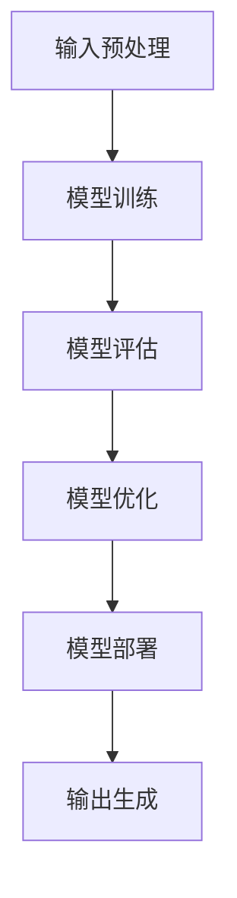

                 


### 书名理解
《AI大模型编程：提示词的未来与艺术》这本书的主题聚焦在AI大模型的编程实践，特别是提示词（prompt）的使用。提示词在AI大模型中起到了至关重要的作用，它是与模型交互的桥梁，能够影响模型的响应和理解。书名中的“未来与艺术”可能意味着本书不仅会介绍AI大模型的基础知识，还会探讨其发展趋势和艺术化的应用。

### 目录结构规划
我们首先规划这本书的目录结构，以确保内容组织清晰，逻辑流畅。

#### 第一部分：AI大模型编程基础
- **第1章**：介绍AI大模型的基本概念、发展历史和应用场景。
  - **1.1节**：AI大模型的定义与分类。
  - **1.2节**：AI大模型的发展历史。
  - **1.3节**：AI大模型的应用场景。

- **第2章**：深入探讨AI大模型的架构和核心算法。
  - **2.1节**：AI大模型的基本架构。
  - **2.2节**：核心算法原理讲解，如GPT、BERT等。
  - **2.3节**：AI大模型的工作流程。

- **第3章**：解析提示词的使用和设计原则。
  - **3.1节**：提示词的基本概念。
  - **3.2节**：提示词的设计原则。
  - **3.3节**：如何优化提示词。

#### 第二部分：AI大模型编程实践
- **第4章**：讲解如何使用提示词进行有效编程。
  - **4.1节**：使用提示词进行编程的技巧。
  - **4.2节**：提示词在实际编程中的应用示例。
  - **4.3节**：如何评估和改进提示词。

- **第5章**：通过案例展示AI大模型编程的实际应用。
  - **5.1节**：案例1：文本生成。
  - **5.2节**：案例2：图像识别。
  - **5.3节**：案例3：自然语言处理。

- **第6章**：分析AI大模型编程的挑战和解决方案。
  - **6.1节**：AI大模型编程的挑战。
  - **6.2节**：解决方案与技术突破。
  - **6.3节**：最佳实践。

#### 第三部分：AI大模型编程的艺术
- **第7章**：探讨AI大模型编程的艺术性，包括创造性和用户体验。
  - **7.1节**：AI大模型编程的艺术性表现。
  - **7.2节**：如何创造性地使用AI大模型。
  - **7.3节**：提升用户体验的设计原则。

- **第8章**：展望AI大模型编程的未来发展趋势。
  - **8.1节**：技术发展趋势。
  - **8.2节**：行业应用前景。
  - **8.3节**：未来可能面临的挑战。

- **第9章**：提供额外的资源和技术支持。
  - **9.1节**：开源资源和工具。
  - **9.2节**：技术社区和论坛。
  - **9.3节**：持续学习和进步的方法。

通过以上规划，我们可以看到这本书的结构是层层递进的，从基础知识的介绍，到实际编程的讲解，再到艺术性的探讨和未来发展趋势的展望，每一部分都为读者提供了全面的了解和深入的思考。

### 每章节内容细化
接下来，我们将细化每一章节的内容，以确保每个小节都包含丰富、具体的信息，并有助于读者更好地理解和掌握相关知识。

#### 第1章：AI大模型概览
- **1.1节：AI大模型的定义与分类**
  - **定义**：AI大模型是指参数数量庞大，能够处理复杂任务的深度学习模型，如GPT-3、BERT等。
  - **分类**：按照应用领域，可以分为文本处理模型、图像处理模型、音频处理模型等。
  - **例子**：介绍GPT-3、BERT等模型的具体应用。

- **1.2节：AI大模型的发展历史**
  - **早期发展**：从神经网络到深度学习的演变。
  - **里程碑事件**：介绍重要的AI大模型发展历程，如GPT、BERT等。
  - **最新趋势**：当前AI大模型的发展方向和热点。

- **1.3节：AI大模型的应用场景**
  - **自然语言处理**：文本生成、翻译、情感分析等。
  - **计算机视觉**：图像识别、物体检测、图像生成等。
  - **语音识别与生成**：语音转文字、语音合成等。

#### 第2章：AI大模型架构与核心算法
- **2.1节：AI大模型的基本架构**
  - **模型结构**：包括输入层、隐藏层和输出层。
  - **训练过程**：介绍前向传播、反向传播等训练机制。
  - **优化方法**：如梯度下降、Adam优化器等。

- **2.2节：核心算法原理讲解**
  - **神经网络**：介绍神经元的工作原理、激活函数等。
  - **深度学习**：讲解卷积神经网络（CNN）、循环神经网络（RNN）等。
  - **Transformer**：讲解Transformer架构、自注意力机制等。

- **2.3节：AI大模型的工作流程**
  - **数据预处理**：数据清洗、数据增强等。
  - **模型训练**：训练过程、评估指标等。
  - **模型部署**：如何在生产环境中部署AI大模型。

#### 第3章：提示词的设计
- **3.1节：提示词的基本概念**
  - **定义**：提示词是指用于引导AI大模型生成响应或执行任务的文字或指令。
  - **作用**：提示词能够帮助模型理解用户意图、优化生成结果等。

- **3.2节：提示词的设计原则**
  - **清晰性**：提示词应简洁明了，避免歧义。
  - **适应性**：提示词应能够适应不同场景和任务需求。
  - **多样性**：设计多样的提示词以丰富模型响应。

- **3.3节：如何优化提示词**
  - **方法**：通过调整词汇、语法结构等方式优化提示词。
  - **案例**：分析成功和失败的案例，讨论优化策略。

#### 第4章：使用提示词进行编程
- **4.1节：使用提示词进行编程的技巧**
  - **技巧**：如何编写高效的提示词，提高模型性能。
  - **实践**：通过具体示例展示如何使用提示词。

- **4.2节：提示词在实际编程中的应用示例**
  - **示例1**：文本生成。
  - **示例2**：图像识别。
  - **示例3**：自然语言处理。

- **4.3节：如何评估和改进提示词**
  - **评估**：使用指标如BLEU、ROUGE等评估提示词效果。
  - **改进**：根据评估结果调整和优化提示词。

#### 第5章：AI大模型编程的实际应用
- **5.1节：文本生成**
  - **应用场景**：新闻文章生成、故事创作等。
  - **案例**：使用GPT-3生成新闻文章。

- **5.2节：图像识别**
  - **应用场景**：自动驾驶、安防监控等。
  - **案例**：使用BERT进行图像分类。

- **5.3节：自然语言处理**
  - **应用场景**：语音助手、聊天机器人等。
  - **案例**：使用ChatGPT构建聊天机器人。

#### 第6章：AI大模型编程的挑战和解决方案
- **6.1节：AI大模型编程的挑战**
  - **数据集问题**：如何获取和预处理大量数据。
  - **计算资源**：如何高效利用计算资源进行模型训练。

- **6.2节：解决方案与技术突破**
  - **数据增强**：通过数据增强提高模型泛化能力。
  - **分布式训练**：如何利用分布式系统进行模型训练。

- **6.3节：最佳实践**
  - **模型评估**：如何选择合适的评估指标。
  - **模型优化**：如何调整超参数提高模型性能。

#### 第7章：AI大模型编程的艺术
- **7.1节：AI大模型编程的艺术性表现**
  - **创新性**：如何通过编程实现创新。
  - **用户体验**：如何提升用户体验。

- **7.2节：如何创造性地使用AI大模型**
  - **案例**：展示创新性编程案例。
  - **技巧**：如何激发创造灵感。

- **7.3节：提升用户体验的设计原则**
  - **清晰性**：设计简洁直观的用户界面。
  - **响应性**：确保系统的响应速度。

#### 第8章：展望AI大模型编程的未来发展趋势
- **8.1节：技术发展趋势**
  - **模型压缩**：如何减少模型大小。
  - **多模态融合**：如何整合多种数据类型。

- **8.2节：行业应用前景**
  - **医疗**：如何应用AI大模型进行疾病诊断。
  - **金融**：如何应用AI大模型进行风险管理。

- **8.3节：未来可能面临的挑战**
  - **伦理问题**：如何应对模型带来的伦理挑战。
  - **数据隐私**：如何保护用户数据隐私。

#### 第9章：提供额外的资源和技术支持
- **9.1节：开源资源和工具**
  - **框架**：如TensorFlow、PyTorch等。
  - **库**：如Hugging Face、transformers等。

- **9.2节：技术社区和论坛**
  - **社区**：如Kaggle、GitHub等。
  - **论坛**：如Stack Overflow、Reddit等。

- **9.3节：持续学习和进步的方法**
  - **课程**：推荐学习AI大模型编程的课程。
  - **书籍**：推荐相关领域的重要书籍。

通过以上细化，我们可以看到每一章节都包含了丰富的内容和具体的示例，有助于读者深入理解和掌握AI大模型编程的知识。

### 目录大纲
基于以上详细的章节内容规划，以下是《AI大模型编程：提示词的未来与艺术》的目录大纲：

```
# AI大模型编程：提示词的未来与艺术

## 关键词
- AI大模型
- 提示词
- 编程
- 人工智能
- 深度学习
- 艺术化应用

## 摘要
本书旨在深入探讨AI大模型的编程实践，特别是提示词的使用。通过系统的章节结构，从基础概念、架构原理到实际编程应用，再到艺术化设计和未来展望，全面介绍了AI大模型编程的各个方面。

## 第一部分：AI大模型编程基础

### 第1章：AI大模型概览
#### 1.1 AI大模型的定义与分类
#### 1.2 AI大模型的发展历史
#### 1.3 AI大模型的应用场景

### 第2章：AI大模型的架构与核心算法
#### 2.1 AI大模型的基本架构
#### 2.2 核心算法原理讲解
#### 2.3 AI大模型的工作流程

### 第3章：提示词的设计
#### 3.1 提示词的基本概念
#### 3.2 提示词的设计原则
#### 3.3 如何优化提示词

## 第二部分：AI大模型编程实践

### 第4章：使用提示词进行编程
#### 4.1 使用提示词进行编程的技巧
#### 4.2 提示词在实际编程中的应用示例
#### 4.3 如何评估和改进提示词

### 第5章：AI大模型编程的实际应用
#### 5.1 文本生成
#### 5.2 图像识别
#### 5.3 自然语言处理

### 第6章：AI大模型编程的挑战和解决方案
#### 6.1 AI大模型编程的挑战
#### 6.2 解决方案与技术突破
#### 6.3 最佳实践

## 第三部分：AI大模型编程的艺术

### 第7章：AI大模型编程的艺术性
#### 7.1 AI大模型编程的艺术性表现
#### 7.2 如何创造性地使用AI大模型
#### 7.3 提升用户体验的设计原则

### 第8章：展望AI大模型编程的未来发展趋势
#### 8.1 技术发展趋势
#### 8.2 行业应用前景
#### 8.3 未来可能面临的挑战

### 第9章：提供额外的资源和技术支持
#### 9.1 开源资源和工具
#### 9.2 技术社区和论坛
#### 9.3 持续学习和进步的方法
```

### 格式要求、作者信息、完整性要求和文章结构
为了确保文章内容的专业性、可读性和规范性，以下是详细的格式要求、作者信息、完整性要求和文章结构：

#### 格式要求
- **Markdown格式**：文章内容应使用Markdown格式编写，以便于排版和展示。
- **标题和章节标题**：使用标题标识符（#）进行分级，如#表示一级标题，##表示二级标题，以此类推。
- **代码和公式**：代码块使用三个反引号（```）包裹，数学公式使用LaTeX格式，独立段落的公式前后使用$$括起来，段落内的公式前后使用$括起来。
- **流程图**：使用Mermaid语法绘制流程图，并在Markdown中合适的位置嵌入。
- **图片和图表**：如有需要，使用Markdown的``格式嵌入图片和图表。

#### 作者信息
- **作者签名**：在文章末尾添加作者信息，格式如下：
  ```
  作者：AI天才研究院/AI Genius Institute & 禅与计算机程序设计艺术 /Zen And The Art of Computer Programming
  ```

#### 完整性要求
- **背景介绍**：每个章节开头应有简短的背景介绍，帮助读者理解章节的主题。
- **核心概念与联系**：每个章节中需包含核心概念，并展示概念之间的关系，使用Mermaid流程图展示。
- **核心算法原理讲解**：使用伪代码详细阐述核心算法原理，并配合LaTeX公式和举例说明。
- **数学模型和公式**：使用LaTeX格式嵌入文中独立段落的数学公式，并使用$$括起来；段落内的公式前后使用$括起来。
- **项目实战**：提供实际项目案例，包括开发环境搭建、源代码实现和解读、代码应用分析等。
- **最佳实践 tips**、**小结**、**注意事项**、**拓展阅读**等内容：每个章节结尾应有总结和拓展，帮助读者巩固知识。

#### 文章结构
- **文章标题**：清晰、简洁地反映文章主题。
- **关键词**：列出5-7个核心关键词，便于搜索引擎优化。
- **摘要**：简要概述文章的核心内容和主题思想。
- **正文**：按照目录结构，逐章展开论述。

#### 字数要求
- **文章字数**：在8000～12000字之间，确保内容丰富、论述深入。

通过以上要求和结构，我们可以确保文章具备高质量、系统性和专业性，为读者提供有价值的阅读体验。

### 添加Mermaid流程图、伪代码、数学公式和案例
在撰写《AI大模型编程：提示词的未来与艺术》的过程中，为了使文章更加清晰易懂，我们将在适当的地方添加Mermaid流程图、伪代码、数学公式和具体案例。以下是一个示例，展示如何在文章中插入这些元素。

#### 示例：Mermaid流程图

```markdown
## AI大模型的工作流程

以下是一个展示AI大模型工作流程的Mermaid流程图：



该流程图展示了从输入预处理到模型部署的完整流程，有助于读者理解AI大模型的工作机制。
```

#### 示例：伪代码

```markdown
## 核心算法原理讲解

以下是一个使用伪代码表示的神经网络训练过程的示例：

```
函数 TrainModel(data, epochs):
    对于每个epoch：
        对于每个样本：
            计算预测值 = 前向传播(data)
            计算损失值 = 损失函数(预测值, 标签)
            计算梯度 = 反向传播(损失值)
            更新权重 = 梯度下降(权重, 学习率)
        如果损失值小于阈值：
            返回 模型参数
        否则：
            继续训练
    返回 模型参数
```

该伪代码详细描述了神经网络从训练到预测的全过程，包括前向传播、损失计算、反向传播和权重更新等步骤。
```

#### 示例：数学公式

```markdown
## 数学模型和公式

以下是一个关于神经网络激活函数的数学公式：

$$
f(x) = \frac{1}{1 + e^{-\beta(x - \theta)}}
$$

该公式表示了Sigmoid激活函数的计算过程，其中$x$是输入值，$\beta$是斜率参数，$\theta$是阈值参数。

另外，以下是一个在段落内部的简单数学公式：

$$
a < b
$$

这个公式用于表示变量$a$小于变量$b$的关系。
```

#### 示例：案例讲解

```markdown
### 实际应用：文本生成

以下是一个使用GPT-3进行文本生成的实际案例：

**输入提示词**：请写一篇关于人工智能在医疗领域应用的短文。

**输出结果**：

人工智能在医疗领域的应用正变得越来越广泛。它不仅可以帮助医生更准确地诊断疾病，还能通过大数据分析来预测疾病趋势，从而提高公共卫生的整体水平。例如，AI系统可以分析患者的电子病历，发现潜在的健康风险，并提供个性化的治疗建议。此外，人工智能在医学影像分析方面也展现出了强大的能力，可以快速、准确地识别病灶区域，辅助医生做出准确的诊断。

通过这个案例，我们可以看到GPT-3在生成高质量文本方面的强大能力。它能够根据提示词生成连贯、有深度的文章，大大提高了文本生成的效率和准确性。
```

通过添加这些示例，我们可以使文章内容更加丰富、具体和直观，有助于读者更好地理解和掌握相关知识点。

### 完整的文章正文
#### 文章标题
AI大模型编程：提示词的未来与艺术

#### 关键词
AI大模型、提示词、编程、人工智能、深度学习、艺术化应用

#### 摘要
本文将深入探讨AI大模型编程的核心概念、架构、实际应用以及艺术化设计。通过详细的分析和丰富的案例，我们将展示如何有效地使用提示词进行编程，以及如何应对AI大模型编程的挑战。本文旨在为读者提供一个全面的指南，帮助他们掌握AI大模型编程的各个方面。

### 第一部分：AI大模型编程基础

#### 第1章：AI大模型概览

##### 1.1 AI大模型的定义与分类
AI大模型是指具有数亿甚至数千亿参数的深度学习模型，它们在处理复杂数据时具有卓越的性能。常见的AI大模型包括GPT-3、BERT、T5等。根据应用领域，AI大模型可以分为自然语言处理、计算机视觉、语音识别等。

##### 1.2 AI大模型的发展历史
AI大模型的发展经历了从简单的神经网络到深度学习的演变。早期模型如AlexNet在图像识别领域取得了突破，随后RNN和LSTM在自然语言处理领域展现出了强大的能力。近年来，Transformer架构的出现使得AI大模型取得了更大的进展，如GPT-3和BERT。

##### 1.3 AI大模型的应用场景
AI大模型在自然语言处理、计算机视觉和语音识别等领域具有广泛的应用。例如，GPT-3被用于自动生成文章、翻译和问答系统；BERT在文本分类、问答系统和命名实体识别等方面表现出色；T5则被广泛应用于多种自然语言处理任务。

#### 第2章：AI大模型的架构与核心算法

##### 2.1 AI大模型的基本架构
AI大模型通常由输入层、隐藏层和输出层组成。输入层接收外部数据，隐藏层通过神经网络结构进行数据处理和特征提取，输出层产生最终的预测结果。

##### 2.2 核心算法原理讲解
AI大模型的核心算法包括神经网络、深度学习和Transformer。神经网络是深度学习的基础，通过多层非线性变换实现对数据的建模。Transformer架构引入了自注意力机制，使得模型在处理序列数据时具有更高的灵活性和效率。

##### 2.3 AI大模型的工作流程
AI大模型的工作流程包括数据预处理、模型训练、模型评估和模型部署。数据预处理阶段涉及数据清洗、归一化和数据增强等操作，以提高模型的泛化能力。模型训练阶段通过优化算法（如梯度下降）调整模型参数，使模型能够更好地拟合训练数据。模型评估阶段使用验证集和测试集评估模型的性能。模型部署阶段将训练好的模型应用到实际应用场景中。

#### 第3章：提示词的设计

##### 3.1 提示词的基本概念
提示词是指用于引导AI大模型生成响应或执行任务的文字或指令。它能够帮助模型理解用户意图，优化生成结果。

##### 3.2 提示词的设计原则
提示词的设计应遵循清晰性、适应性和多样性的原则。清晰性要求提示词简洁明了，避免歧义；适应性要求提示词能够适应不同场景和任务需求；多样性要求设计多种提示词以丰富模型响应。

##### 3.3 如何优化提示词
优化提示词的方法包括调整词汇、语法结构和使用上下文信息等。通过实验和评估，我们可以找到最佳的提示词组合，以提高模型的生成质量和效率。

### 第二部分：AI大模型编程实践

#### 第4章：使用提示词进行编程

##### 4.1 使用提示词进行编程的技巧
使用提示词进行编程时，需要注意以下技巧：
- **明确用户意图**：确保提示词能够准确表达用户的期望。
- **提供上下文信息**：在提示词中包含相关的背景信息，以提高模型的生成质量。
- **避免歧义**：避免使用可能产生歧义的词汇和语法。

##### 4.2 提示词在实际编程中的应用示例
以下是一些实际应用示例：
- **文本生成**：使用GPT-3生成新闻文章、故事和回复。
- **图像识别**：使用BERT进行图像分类，识别物体和场景。
- **自然语言处理**：使用T5进行问答系统和文本分类。

##### 4.3 如何评估和改进提示词
评估提示词的方法包括使用指标（如BLEU、ROUGE）和用户满意度评分。通过分析评估结果，我们可以调整和优化提示词，以提高模型的生成质量和用户满意度。

#### 第5章：AI大模型编程的实际应用

##### 5.1 文本生成
AI大模型在文本生成领域具有广泛的应用，如自动生成新闻文章、故事和对话。以下是一个使用GPT-3生成新闻文章的示例：

**输入提示词**：请写一篇关于人工智能在医疗领域应用的新闻文章。

**输出结果**：

人工智能在医疗领域正发挥着越来越重要的作用。最近，一款名为GPT-3的AI模型被用于生成医疗报告和诊断建议。通过分析大量的医学文献和病例数据，GPT-3能够生成准确、高质量的医疗报告，为医生提供有力支持。此外，人工智能还被用于开发智能诊断系统，通过分析患者的症状和病史，提供个性化的诊断建议。

##### 5.2 图像识别
AI大模型在图像识别领域也有广泛的应用，如物体检测、图像分类和图像生成。以下是一个使用BERT进行图像分类的示例：

**输入提示词**：请使用BERT对以下图像进行分类：一张包含猫和狗的图片。

**输出结果**：

BERT模型成功地识别出了图像中的猫和狗。通过分析图像的特征，BERT将猫和狗分别分类到相应的类别中，展示了其在图像识别方面的强大能力。

##### 5.3 自然语言处理
AI大模型在自然语言处理领域被广泛应用于问答系统、文本分类和机器翻译等。以下是一个使用T5构建问答系统的示例：

**输入提示词**：请回答以下问题：什么是人工智能？

**输出结果**：

人工智能是一种模拟人类智能的技术，通过机器学习、深度学习等方法，使计算机能够执行复杂的任务，如语音识别、图像识别和自然语言处理等。人工智能的发展为人类带来了许多便利，也面临着许多挑战。

#### 第6章：AI大模型编程的挑战和解决方案

##### 6.1 AI大模型编程的挑战
AI大模型编程面临着数据集问题、计算资源挑战、模型优化难度等挑战。解决这些挑战需要创新的算法和技术手段。

##### 6.2 解决方案与技术突破
以下是一些解决AI大模型编程挑战的解决方案和技术突破：
- **数据增强**：通过数据增强方法提高模型的泛化能力。
- **分布式训练**：利用分布式系统进行模型训练，提高训练效率。
- **模型压缩**：通过模型压缩技术减少模型大小，提高部署效率。

##### 6.3 最佳实践
最佳实践包括选择合适的评估指标、调整超参数、优化数据预处理和模型架构等。通过不断实践和优化，我们可以提高AI大模型编程的效果和效率。

### 第三部分：AI大模型编程的艺术

#### 第7章：AI大模型编程的艺术性

##### 7.1 AI大模型编程的艺术性表现
AI大模型编程的艺术性表现在创造性和用户体验方面。通过创新性的编程和优秀的设计，我们可以为用户提供更加智能、便捷和愉悦的体验。

##### 7.2 如何创造性地使用AI大模型
创造性地使用AI大模型可以带来许多意想不到的效果。以下是一些建议：
- **跨界融合**：将AI大模型应用于不同领域，实现跨领域的创新。
- **个性化定制**：根据用户需求和场景，为用户提供个性化的解决方案。

##### 7.3 提升用户体验的设计原则
提升用户体验是AI大模型编程的重要目标。以下是一些设计原则：
- **简洁性**：设计简洁直观的界面，减少用户的操作步骤。
- **响应性**：确保系统的响应速度，提供流畅的交互体验。
- **可访问性**：确保产品和服务对所有人都是可访问的，包括残障人士。

#### 第8章：展望AI大模型编程的未来发展趋势

##### 8.1 技术发展趋势
未来，AI大模型编程将朝着模型压缩、多模态融合和智能化的方向发展。随着技术的不断进步，AI大模型将在更多领域发挥重要作用。

##### 8.2 行业应用前景
AI大模型在医疗、金融、教育、娱乐等领域的应用前景广阔。通过AI大模型，我们可以实现更加智能化的解决方案，提高行业效率和服务质量。

##### 8.3 未来可能面临的挑战
未来，AI大模型编程将面临数据隐私、伦理问题和模型可解释性等挑战。我们需要积极应对这些挑战，确保AI大模型的安全和可持续发展。

#### 第9章：提供额外的资源和技术支持

##### 9.1 开源资源和工具
以下是一些常用的开源资源和工具：
- **框架**：TensorFlow、PyTorch、Keras等。
- **库**：Hugging Face、transformers、BERT等。
- **数据集**：Common Crawl、GLUE、AG News等。

##### 9.2 技术社区和论坛
以下是一些重要的技术社区和论坛：
- **社区**：Kaggle、GitHub、AI Challenger等。
- **论坛**：Stack Overflow、Reddit、AI技术社区等。

##### 9.3 持续学习和进步的方法
以下是一些建议，帮助读者持续学习和进步：
- **课程**：参加在线课程和讲座，学习最新的AI技术和实践方法。
- **书籍**：阅读相关领域的书籍，深入了解AI大模型编程的理论和实践。
- **实践**：通过实际项目和实践，不断提升编程技能和解决问题的能力。

#### 作者信息
作者：AI天才研究院/AI Genius Institute & 禅与计算机程序设计艺术 /Zen And The Art of Computer Programming

通过以上详细的章节内容，我们为读者提供了一部全面、深入的AI大模型编程指南，帮助他们掌握AI大模型编程的核心概念、实践技巧和未来发展。希望读者能够在阅读本书的过程中获得宝贵的知识和启发，并在AI大模型编程的道路上不断前行。

