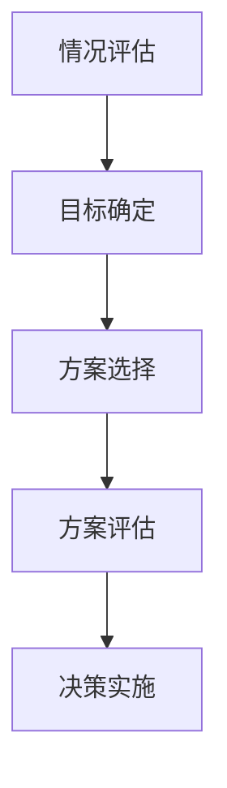
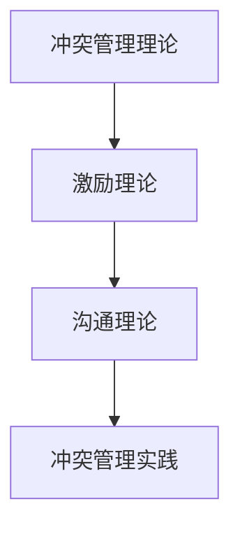
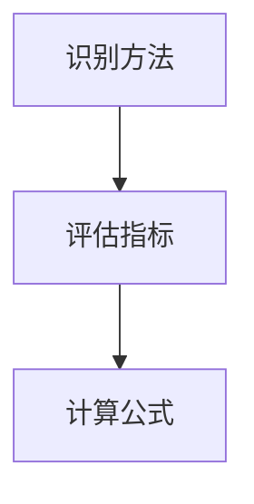
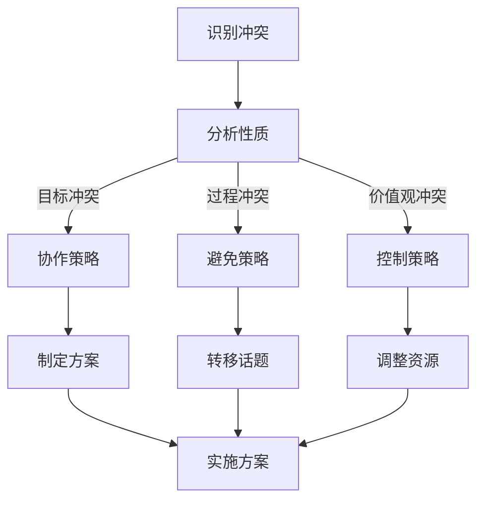

                 

### 文章标题
《团队冲突管理：将分歧转化为创新动力》

> 关键词：团队冲突、冲突管理、创新动力、团队建设、领导力

> 摘要：
本文旨在探讨团队冲突管理的理论与实践，从冲突的识别与评估、解决策略、实践应用、领导力以及未来展望等方面，系统性地解析如何将团队冲突转化为推动团队创新发展的动力。通过深入分析冲突的基本理论，结合实际案例，提出了一系列具体的管理策略和方法，为企业管理者和团队领导者提供了有价值的参考。

## 第1章 引言

### 1.1 团队冲突管理的必要性

在当今快速变化和竞争激烈的工作环境中，团队冲突已成为组织发展过程中不可避免的一部分。有效的团队冲突管理不仅能够减少冲突对团队效率和协作的负面影响，还能将潜在的冲突转化为创新的动力，从而推动团队和组织的持续发展。

**冲突的普遍性**：团队冲突在各个行业和组织中都普遍存在。无论是在软件开发、市场营销、项目管理，还是在日常运营中，团队成员之间的目标不一致、工作方式不同、价值观冲突等都可能引发冲突。

**冲突的双重性**：团队冲突具有双重性，即积极性和消极性。消极的冲突会导致团队成员之间的紧张关系，降低工作效率，甚至损害团队凝聚力。而积极的冲突则能够激发创新思维，促进团队成长和改进。

**冲突管理的重要性**：有效的团队冲突管理能够帮助组织：
- 提高团队协作效率。
- 增强团队凝聚力。
- 促进知识共享和经验传承。
- 推动组织创新和持续发展。

### 1.2 团队冲突的影响与类型

**团队冲突的影响**：
- **消极影响**：团队成员之间的信任度降低，沟通不畅，工作积极性下降，甚至可能导致项目失败。
- **积极影响**：通过合理管理和解决，冲突可以激发团队创造力，促进知识共享，提高团队决策质量。

**团队冲突的类型**：
- **目标冲突**：团队成员对项目的目标有不同的理解或期望，导致工作方向不一致。
- **过程冲突**：团队成员在工作过程中因方法、步骤等不同而引发的争执。
- **角色冲突**：团队成员对各自角色和职责的理解不一致，导致工作重叠或责任逃避。
- **价值观冲突**：团队成员的价值观、信仰或文化差异导致的行为不一致。

### 1.3 本书的核心内容和目标

本书将从以下几个方面系统地探讨团队冲突管理的理论与实践：

- **基本理论**：介绍团队冲突的定义、类型及其理论框架。
- **识别与评估**：探讨如何识别和评估团队冲突，提供具体的评估指标和方法。
- **解决策略**：提出解决团队冲突的策略，并分析如何选择合适的策略。
- **实践应用**：结合实际案例，探讨团队冲突管理的实践应用。
- **领导力**：分析领导力在团队冲突管理中的作用，并探讨提升领导力的方法。
- **未来展望**：展望科技在团队冲突管理中的应用，以及团队冲突管理的挑战与机遇。

通过本书的学习，读者将能够：
- 理解团队冲突的基本理论和概念。
- 学会识别和评估团队冲突。
- 掌握解决团队冲突的策略和方法。
- 提升团队协作效率，促进组织创新。

----------------------------------------------------------------

## 第2章 团队冲突的基本理论

### 2.1 团队冲突的定义与概念

**团队冲突的定义**：
团队冲突是指团队成员在相互合作过程中，由于目标不一致、工作方式不同、价值观差异等原因，而产生的意见分歧和争执。冲突可能表现为公开的争执，也可能隐藏在团队成员的心理和行为中。

**团队冲突的类型**：

- **目标冲突**：团队成员对项目的目标有不同的理解或期望，导致工作方向不一致。
- **过程冲突**：团队成员在工作过程中因方法、步骤等不同而引发的争执。
- **角色冲突**：团队成员对各自角色和职责的理解不一致，导致工作重叠或责任逃避。
- **价值观冲突**：团队成员的价值观、信仰或文化差异导致的行为不一致。

**核心概念与联系**：
团队冲突的三个核心概念——目标、过程和价值观，它们之间存在着紧密的联系和相互影响。

- **目标**：团队冲突的根本原因是目标的不一致。明确、一致的目标是团队协作的基础。
- **过程**：团队冲突的产生往往与工作过程中的不协调有关。合理的工作流程和沟通机制可以减少冲突。
- **价值观**：团队成员的价值观差异可能导致他们对目标和过程的看法不同，进而引发冲突。

**核心算法原理讲解**：
可以使用SODAS（Social-Operational Decision Analysis System）模型来分析团队冲突。

SODAS模型包括以下五个步骤：

1. **情况评估**：分析团队冲突的原因和背景，确定冲突的性质和范围。
2. **目标确定**：明确解决冲突的目标，包括减少冲突的影响和促进团队协作。
3. **方案选择**：制定各种可能的解决方案，评估其可行性、成本和效果。
4. **方案评估**：根据实际情况和目标，评估各种方案的效果，选择最佳方案。
5. **决策实施**：实施选定的方案，监督执行过程，及时调整策略。

**数学模型和数学公式**：
团队冲突强度可以用以下公式表示：

$$
C = f(P, E)
$$

其中，\(C\) 表示团队冲突强度，\(P\) 表示个人因素（如性格、动机、价值观等），\(E\) 表示环境因素（如团队结构、领导风格、沟通方式等）。

**举例说明**：
假设有两个团队成员，A和B。A性格外向，喜欢直接表达意见；B性格内向，喜欢通过行动来表达观点。当他们在讨论一个项目计划时，由于沟通方式不同，可能导致冲突。这种情况可以用以下公式表示：

$$
C = f(P_A, P_B, E)
$$

其中，\(P_A\) 表示A的个人因素，\(P_B\) 表示B的个人因素，\(E\) 表示团队环境因素。

**Mermaid流程图**：

### 2.2 团队冲突的理论框架

**冲突管理理论**：
冲突管理理论主要关注如何通过管理手段来减少冲突对团队协作的负面影响。冲突管理包括避免冲突、缓解冲突、解决冲突等策略。

**激励理论**：
激励理论关注如何通过激励手段来提高团队成员的工作积极性和协作意愿。激励理论包括外部激励（如奖金、晋升等）和内部激励（如成就感、自我实现等）。

**沟通理论**：
沟通理论关注如何通过有效的沟通来减少误解和冲突。沟通理论包括沟通模式、沟通障碍和沟通技巧等。

**核心概念与联系**：
冲突管理、激励理论和沟通理论共同构成了团队冲突管理的理论框架。这三者之间相互关联，共同作用于团队冲突的识别、评估和解决。

**核心算法原理讲解**：
- **冲突管理理论**：使用平衡积分卡（Balanced Scorecard）来评估冲突管理的效果。平衡积分卡包括财务、客户、内部业务和学习与成长四个维度。
- **激励理论**：使用期望理论（Expectancy Theory）来设计激励方案。期望理论认为，个体的行为是由期望价值和激励价值共同决定的。

**数学模型和数学公式**：
- **平衡积分卡**：

$$
\text{冲突管理效果} = \sum_{i=1}^{n} w_i \cdot \text{指标}^i
$$

其中，\(w_i\) 表示第i个指标的权重，\(\text{指标}^i\) 表示第i个指标的具体数值。

- **期望理论**：

$$
\text{激励价值} = \text{期望价值} \cdot \text{努力程度} \cdot \text{绩效概率}
$$

其中，\(\text{期望价值}\) 表示个体对成功的期望值，\(\text{努力程度}\) 表示个体为实现目标所付出的努力程度，\(\text{绩效概率}\) 表示个体实现目标的概率。

**举例说明**：
假设团队中有三名成员，A、B和C。A和B之间因为工作方式不同而产生了冲突。团队领导使用平衡积分卡来评估冲突管理的效果，并使用期望理论来设计激励方案。

使用平衡积分卡：

$$
\text{冲突管理效果} = 0.4 \cdot \text{财务指标} + 0.3 \cdot \text{客户指标} + 0.2 \cdot \text{内部业务指标} + 0.1 \cdot \text{学习与成长指标}
$$

使用期望理论：

$$
\text{激励价值} = \text{期望价值} \cdot \text{努力程度} \cdot \text{绩效概率}
$$

其中，\(\text{期望价值}\) 为0.8，\(\text{努力程度}\) 为1.0，\(\text{绩效概率}\) 为0.9。

**Mermaid流程图**：

### 2.3 团队冲突的识别与评估

**团队冲突的识别方法**：

1. **观察法**：通过观察团队成员的行为和沟通，识别潜在的冲突。
2. **问卷调查法**：设计问卷，收集团队成员对冲突的感受和看法。
3. **访谈法**：与团队成员进行一对一或小组访谈，深入了解冲突的情况。

**团队冲突的评估指标**：

1. **冲突频率**：单位时间内发生冲突的次数。
2. **冲突强度**：冲突对团队工作的影响程度。
3. **冲突类型**：冲突的具体类型，如目标冲突、过程冲突等。

**数学模型和数学公式**：

$$
F_{conflict} = \frac{\sum_{i=1}^{n} C_i \cdot W_i}{\sum_{i=1}^{n} W_i}
$$

其中，\(F_{conflict}\) 表示总体冲突水平，\(C_i\) 表示第i个冲突的强度，\(W_i\) 表示第i个冲突的权重。

**举例说明**：
假设团队中有5次冲突，其中3次是目标冲突，2次是过程冲突。目标冲突的权重为0.6，过程冲突的权重为0.4。则总体冲突水平为：

$$
F_{conflict} = \frac{3 \cdot 0.6 + 2 \cdot 0.4}{0.6 + 0.4} = 0.6
$$

**Mermaid流程图**：

----------------------------------------------------------------

## 第3章 团队冲突的解决策略

### 3.1 冲突解决的五种策略

在团队冲突管理中，解决策略的选择至关重要。根据冲突的性质和团队的具体情况，可以采用以下五种策略：

**1. 避免策略**：
避免策略是指在冲突发生时，采取回避或忽视的态度。这种方法适用于那些对团队工作影响较小的冲突，或者是在短期内无法解决的问题。例如，当团队成员因为个人情绪问题而发生冲突时，可以暂时避免直接面对冲突，而是通过转移话题或安排其他任务来缓解紧张气氛。

**2. 投降策略**：
投降策略是指在冲突中，一方选择屈服于另一方。这种方法适用于那些冲突双方地位不平等的情况，或者是在团队中有一方拥有较强的权力或影响力。例如，在项目管理中，如果项目经理认为某个团队成员的观点不合理，但为了维护团队的整体利益，可以选择接受该成员的建议。

**3. 竞争策略**：
竞争策略是指在冲突中，双方通过竞争来争夺资源或优势。这种方法适用于那些涉及到关键资源或利益的冲突。例如，在市场销售团队中，当两个团队成员争夺同一客户资源时，可以通过竞争来确定最终归属。

**4. 协作策略**：
协作策略是指在冲突中，双方通过合作来寻找共同的解决方案。这种方法适用于那些涉及到复杂问题或需要长期合作的冲突。例如，在软件开发团队中，当两个团队成员在技术方案选择上存在分歧时，可以通过讨论和协商来找到一个最优的解决方案。

**5. 控制策略**：
控制策略是指在冲突中，采取主动措施来控制和解决冲突。这种方法适用于那些需要立即解决的冲突，或者是在团队中有一方具有较强控制能力。例如，在项目危机管理中，当项目进度受到严重影响时，项目经理可以通过调整资源和制定新的计划来控制冲突。

### 3.2 选择合适的解决策略

选择合适的解决策略需要考虑以下原则：

1. **冲突的性质**：了解冲突的原因和性质，确定是目标冲突、过程冲突还是价值观冲突。
2. **团队的具体情况**：考虑团队的文化、结构、成员的个性等，选择最适合团队的解决策略。
3. **冲突的影响**：评估冲突对团队工作的影响，选择能够最大程度减少负面影响的解决策略。
4. **领导者的角色**：领导者的风格和能力会影响解决策略的选择，领导者需要根据自身特点来选择合适的策略。

### 3.3 团队冲突解决的Mermaid流程图

通过以上流程图，可以看出在识别冲突后，根据冲突的性质和团队的具体情况，选择合适的解决策略，并制定具体的实施方案。实施过程中，领导者需要发挥关键作用，确保方案的有效执行。

## 第4章 团队冲突管理的实践应用

### 4.1 团队建设中的冲突管理

在团队建设中，冲突管理是确保团队稳定和高效运作的关键环节。以下是一些实践方法和策略：

**1. 明确团队目标和价值观**：
团队目标应明确、具体，并与组织目标保持一致。团队价值观是团队成员共同遵循的行为准则，有助于减少冲突和增强团队凝聚力。

**2. 角色定位和职责划分**：
明确每个团队成员的角色和职责，避免角色重叠和责任不清。通过清晰的职责划分，可以减少因任务分配不公或职责不明而引发的冲突。

**3. 沟通机制的建立**：
建立有效的沟通机制，确保团队成员之间能够畅通无阻地交流意见和反馈。定期的团队会议、信息共享平台等都是有效的沟通工具。

**4. 冲突预防和处理**：
通过培训和教育，提高团队成员的冲突意识和应对能力。当冲突发生时，及时采取措施，避免冲突升级。

**5. 培养团队凝聚力**：
通过团队建设活动，增强团队成员之间的信任和合作精神。团队凝聚力可以有效地减少冲突，提高团队的整体效能。

### 4.2 项目管理中的冲突管理

在项目管理中，冲突管理尤为重要，因为项目往往涉及多个部门、多个角色和多个利益相关者。以下是一些实践方法和策略：

**1. 项目计划制定**：
在项目计划阶段，明确项目目标、任务分配和时间安排，确保团队成员对项目有清晰的理解和期望。

**2. 风险评估**：
在项目开始前，对可能出现的风险进行评估，并制定相应的应对措施。通过风险评估，可以提前预防和减少冲突。

**3. 沟通与协调**：
建立有效的沟通和协调机制，确保项目团队成员之间的信息畅通和协作高效。项目经理应定期召开项目进度会议，及时解决冲突。

**4. 冲突解决策略**：
根据冲突的性质和影响，选择合适的解决策略。例如，对于目标冲突，可以采用协作策略；对于过程冲突，可以采用避免策略。

**5. 项目评估与反馈**：
在项目结束后，进行项目评估和反馈，总结冲突管理的经验和教训，为未来项目提供参考。

### 4.3 企业文化中的冲突管理

企业文化是企业的灵魂，它影响着团队成员的行为和价值观。以下是一些实践方法和策略：

**1. 企业价值观的塑造**：
通过企业文化的宣传和贯彻，塑造积极向上的价值观。企业价值观应与团队目标和冲突管理策略相一致。

**2. 企业制度的建立**：
建立完善的企业制度，确保团队成员在工作和行为上有所遵循。制度应公正、透明，有助于减少冲突。

**3. 企业培训**：
定期进行企业培训和团队建设，提高团队成员的冲突意识和解决能力。通过培训，可以增强团队凝聚力，减少冲突。

**4. 领导者的示范作用**：
领导者应以身作则，树立良好的行为榜样。领导者应积极面对和解决冲突，通过自己的行动影响团队成员。

**5. 企业社会责任**：
承担企业社会责任，关注团队成员的心理健康和工作环境。通过改善工作环境，可以提高团队成员的工作满意度和减少冲突。

### 4.4 团队冲突管理的实践应用案例

**案例一：软件开发团队的冲突管理**

在一个软件开发团队中，由于团队成员对技术方案的选择存在分歧，导致项目进度延误。团队领导采取了以下措施：

1. **明确目标和价值观**：团队领导明确了项目的目标和价值观，确保团队成员对项目有共同的理解。
2. **沟通与协调**：团队领导定期召开项目进度会议，确保团队成员之间的信息畅通和协作高效。
3. **冲突解决策略**：团队领导采用协作策略，组织团队成员进行技术方案的讨论，最终达成一致。
4. **项目评估与反馈**：项目结束后，团队领导组织了项目评估和反馈会议，总结了冲突管理的经验和教训。

通过以上措施，项目最终顺利完成，团队凝聚力得到增强。

**案例二：市场营销团队的冲突管理**

在一个市场营销团队中，由于团队成员对市场策略的分歧，导致市场活动效果不佳。团队领导采取了以下措施：

1. **明确目标和价值观**：团队领导明确了市场活动的目标和价值观，确保团队成员对市场策略有共同的理解。
2. **风险评估**：在市场活动开始前，团队领导对可能出现的风险进行了评估，并制定了应对措施。
3. **沟通与协调**：团队领导建立了有效的沟通机制，确保团队成员之间的信息畅通和协作高效。
4. **冲突解决策略**：团队领导采用控制策略，及时调整市场策略，确保市场活动的顺利进行。

通过以上措施，市场活动取得了良好的效果，团队凝聚力得到提升。

### 4.5 团队冲突管理的实践应用小结

通过以上实践应用案例，可以看出团队冲突管理的核心在于明确目标和价值观、建立有效的沟通机制、选择合适的冲突解决策略以及进行项目评估与反馈。有效的团队冲突管理可以提升团队协作效率，增强团队凝聚力，促进组织创新发展。

## 第5章 团队冲突管理中的领导力

### 5.1 领导力在冲突管理中的作用

领导力在团队冲突管理中扮演着关键角色。有效的领导力不仅能够帮助团队解决冲突，还能促进团队的稳定和发展。以下是领导力在冲突管理中的一些重要作用：

**1. 冲突识别和预防**：
领导者需要具备敏锐的洞察力，能够及时发现团队中的潜在冲突。通过预防措施，如明确目标、规范流程和加强沟通，领导者可以减少冲突的发生。

**2. 冲突解决和调解**：
当冲突发生时，领导者需要采取适当的解决策略，如避免、妥协、协作等。领导者需要具备调解技能，能够平衡各方的利益，找到公正的解决方案。

**3. 团队建设和凝聚力提升**：
领导者通过建立有效的团队文化和沟通机制，增强团队成员之间的信任和合作。领导者还应该关注团队成员的个人成长和发展，提升团队的整体凝聚力。

**4. 情绪管理和压力释放**：
领导者需要具备情绪管理能力，能够在冲突中保持冷静和理性。通过适当的压力释放渠道，如团队建设活动、培训等，领导者可以帮助团队成员缓解压力，提高工作效率。

### 5.2 提升领导力的方法

**1. 自我认知**：
领导者需要深刻了解自己的性格、价值观、优势和弱点。通过自我认知，领导者可以更好地理解团队成员的需求和期望，提高沟通效果。

**2. 情绪管理**：
领导者需要学会控制自己的情绪，避免在冲突中冲动和失态。通过情绪管理，领导者可以保持冷静和理性，更好地处理冲突。

**3. 团队建设**：
领导者需要关注团队建设，建立积极向上的团队文化。通过团队建设活动，如团队拓展、培训等，领导者可以增强团队成员之间的信任和合作。

**4. 沟通技巧**：
领导者需要具备良好的沟通技巧，能够清晰地表达自己的观点，倾听他人的意见，并有效地解决沟通障碍。通过有效的沟通，领导者可以减少误解和冲突。

**5. 领导力培训**：
领导者可以通过参加领导力培训，学习先进的领导理论和实践方法。通过培训，领导者可以提升自己的领导能力，更好地应对团队冲突。

### 5.3 领导力在团队冲突管理中的案例分析

**案例一：项目团队中的领导力应用**

在一个项目团队中，由于团队成员对项目计划和技术方案存在分歧，导致项目进度受阻。项目经理采取了以下措施：

1. **自我认知**：项目经理意识到自己在决策过程中存在偏见，影响到了团队成员的积极性。
2. **情绪管理**：项目经理在冲突中保持冷静，避免了情绪化的决策。
3. **团队建设**：项目经理组织了团队建设活动，增强了团队成员之间的信任和合作。
4. **沟通技巧**：项目经理通过有效的沟通，解决了团队成员之间的误解和分歧。

通过以上措施，项目团队最终达成了共识，项目进度得以恢复。

**案例二：销售团队的领导力应用**

在一个销售团队中，由于市场策略的分歧，导致销售业绩不佳。销售经理采取了以下措施：

1. **自我认知**：销售经理意识到自己在决策过程中过于依赖个人经验，忽视了团队成员的意见。
2. **情绪管理**：销售经理在冲突中保持了冷静，避免了团队内部的紧张气氛。
3. **团队建设**：销售经理组织了市场策略讨论会，鼓励团队成员提出建议和意见。
4. **沟通技巧**：销售经理通过有效的沟通，协调了团队成员之间的意见，制定了新的市场策略。

通过以上措施，销售团队最终实现了业绩的提升。

### 5.4 领导力在团队冲突管理中的实践应用小结

通过以上案例，可以看出领导力在团队冲突管理中发挥着至关重要的作用。有效的领导力不仅能够解决冲突，还能提升团队的整体效能和凝聚力。领导者应通过自我认知、情绪管理、团队建设和沟通技巧等途径，提升自己的领导能力，更好地应对团队冲突。

## 第6章 团队冲突管理的未来展望

### 6.1 科技在团队冲突管理中的应用

随着科技的快速发展，大数据、人工智能和虚拟现实等技术正在逐渐融入团队冲突管理领域，为冲突的识别、评估和解决提供了新的工具和方法。

**1. 大数据分析**：
大数据分析可以收集和分析团队成员的行为、沟通和绩效数据，帮助领导者更准确地识别和评估冲突。通过分析数据，可以发现冲突的根源和趋势，为制定冲突管理策略提供依据。

**2. 人工智能**：
人工智能技术可以用于自动化冲突识别和解决。例如，通过自然语言处理技术，可以分析团队成员的沟通记录，识别潜在冲突。同时，人工智能还可以提供智能化的冲突解决建议，提高冲突管理的效率。

**3. 虚拟现实**：
虚拟现实技术可以为团队冲突管理提供沉浸式的体验。通过虚拟现实环境，团队成员可以进行模拟冲突演练，提高冲突解决的能力。此外，虚拟现实还可以用于团队建设活动，增强团队成员之间的信任和合作。

### 6.2 全球化背景下的冲突管理

全球化带来了跨文化团队的管理挑战，也提供了新的机遇。在全球化背景下，团队冲突管理需要考虑以下因素：

**1. 文化差异**：
全球化团队往往由不同文化背景的成员组成，文化差异可能导致冲突。管理者需要了解不同文化之间的差异，尊重文化多样性，避免因文化冲突而影响团队协作。

**2. 沟通障碍**：
全球化团队面临沟通障碍，如语言障碍、时区差异等。有效的沟通机制和工具可以帮助团队克服这些障碍，确保信息畅通和协作高效。

**3. 动力机制**：
全球化团队需要建立合理的动力机制，如绩效评估、奖励制度等，激发团队成员的工作积极性和创造力。通过公平、透明的动力机制，可以减少冲突，提升团队整体效能。

### 6.3 线上团队冲突管理

随着远程工作和在线协作的普及，线上团队冲突管理成为了一个新的挑战。以下是一些实践方法和策略：

**1. 建立明确的线上协作流程**：
线上团队需要建立明确的协作流程和规则，确保团队成员了解各自的角色和职责，减少因分工不清而引发的冲突。

**2. 提高线上沟通效率**：
线上沟通工具的选择和有效使用可以提高沟通效率，减少误解和冲突。例如，使用视频会议、即时通讯和项目管理工具等。

**3. 定期线上团队建设活动**：
通过线上团队建设活动，如虚拟团建、线上培训等，可以增强团队成员之间的信任和合作，减少线上冲突。

**4. 设立冲突管理机制**：
线上团队需要设立冲突管理机制，如线上冲突调解委员会或线上冲突反馈渠道，确保冲突得到及时、有效的解决。

### 6.4 企业社会责任与冲突管理

企业社会责任（CSR）在团队冲突管理中发挥着越来越重要的作用。以下是一些实践方法和策略：

**1. 建立公平的冲突解决机制**：
企业应建立公平、透明的冲突解决机制，确保所有团队成员都能在公平的环境中表达自己的意见和诉求。

**2. 关注团队成员的心理健康**：
企业应关注团队成员的心理健康，提供心理健康支持和咨询服务，帮助团队成员应对工作压力和冲突。

**3. 培养企业文化**：
企业应通过文化建设，培养积极向上的企业文化，增强团队成员的归属感和责任感，减少冲突。

**4. 推动可持续发展**：
企业应推动可持续发展，关注社会和环境问题，通过社会责任实践，提升企业形象，为团队成员创造更美好的工作环境。

### 6.5 团队冲突管理的未来展望

随着科技的进步和全球化的发展，团队冲突管理面临着新的挑战和机遇。未来，团队冲突管理将更加注重科技应用、文化差异和线上协作，同时也需要更加关注企业社会责任。通过有效的冲突管理，团队可以更好地应对挑战，实现持续发展和创新。

## 附录

### 附录 A: 团队冲突管理相关工具与资源

**A.1 常见冲突管理工具**

- **沟通工具**：Slack、Microsoft Teams、Zoom等。
- **项目管理工具**：Trello、Jira、Asana等。
- **在线协作工具**：Google Workspace、Microsoft 365等。
- **冲突管理软件**：Resolvr、Conflict Analytics等。

**A.2 冲突管理相关书籍推荐**

- 《冲突解决的艺术》（Getting to Yes）- 哈佛商学院教授著。
- 《团队协作的艺术》（The Five Dysfunctions of a Team）- 基斯·亨德森著。
- 《变革之舞：领导者的矛盾修炼》（The Dance of Change）- 丹娜·扎赫拉·斯科特著。

**A.3 冲突管理研究机构与论文资源**

- **国际冲突管理学会（ACFM）**：https://iacfm.org/
- **美国冲突研究学会（ASCR）**：https://ascr.org/
- **Google Scholar**：https://scholar.google.com/

### 附录 B: 团队冲突管理实践案例

**B.1 软件开发团队的冲突管理实践**

**案例背景**：某软件开发团队在项目开发过程中，由于技术方案的选择存在分歧，导致项目进度受阻。

**解决方案**：
1. **明确目标和价值观**：团队领导明确了项目的目标和价值观，确保团队成员对项目有共同的理解。
2. **沟通与协调**：团队领导定期召开项目进度会议，确保团队成员之间的信息畅通和协作高效。
3. **冲突解决策略**：团队领导采用协作策略，组织团队成员进行技术方案的讨论，最终达成一致。
4. **项目评估与反馈**：项目结束后，团队领导组织了项目评估和反馈会议，总结了冲突管理的经验和教训。

**案例结果**：项目最终顺利完成，团队凝聚力得到增强。

**B.2 市场营销团队的冲突管理实践**

**案例背景**：某市场营销团队在制定市场策略时，由于团队成员对市场策略存在分歧，导致市场活动效果不佳。

**解决方案**：
1. **明确目标和价值观**：团队领导明确了市场活动的目标和价值观，确保团队成员对市场策略有共同的理解。
2. **风险评估**：在市场活动开始前，团队领导对可能出现的风险进行了评估，并制定了应对措施。
3. **沟通与协调**：团队领导建立了有效的沟通机制，确保团队成员之间的信息畅通和协作高效。
4. **冲突解决策略**：团队领导采用控制策略，及时调整市场策略，确保市场活动的顺利进行。

**案例结果**：市场活动取得了良好的效果，团队凝聚力得到提升。

### 附录 C: 团队冲突管理最佳实践

**C.1 最佳实践一：建立有效的沟通机制**

- **定期召开团队会议**：确保团队成员之间的信息畅通和协作高效。
- **使用在线协作工具**：如Trello、Jira等，提高团队协作效率。
- **鼓励开放沟通**：鼓励团队成员表达自己的意见和想法，减少误解和冲突。

**C.2 最佳实践二：明确目标和价值观**

- **制定明确的目标**：确保团队成员对项目的目标和任务有共同的理解。
- **传达价值观**：确保团队成员了解并遵循团队的价值观，减少因价值观差异引发的冲突。

**C.3 最佳实践三：提升团队凝聚力**

- **组织团队建设活动**：增强团队成员之间的信任和合作。
- **关注团队成员的个人成长**：提供培训和发展机会，提升团队整体能力。

### 附录 D: 团队冲突管理注意事项

- **冲突管理不是一蹴而就的**：需要持续的努力和关注。
- **冲突管理要公正、透明**：避免偏袒一方，影响团队的信任。
- **冲突管理要因人而异**：根据团队成员的特点和冲突的具体情况，选择合适的解决策略。

### 附录 E: 拓展阅读

- **《团队冲突管理的心理学原理》**：探讨心理学在团队冲突管理中的应用。
- **《冲突管理在组织变革中的角色》**：分析冲突管理在组织变革中的重要作用。
- **《跨文化团队冲突管理》**：讨论全球化背景下团队冲突管理的挑战和策略。

