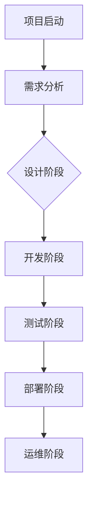

                 

# 《团队协作：打破部门壁垒的策略》

## 关键词

- 团队协作
- 部门壁垒
- 打破壁垒策略
- 沟通工具
- 协作平台
- 文化建设
- 项目实践

## 摘要

本文将深入探讨团队协作中的部门壁垒问题，分析其成因与影响，并探讨有效的策略和方法来打破这些壁垒。通过理论和实践的结合，本文旨在为团队管理者和技术人员提供一套完整的团队协作指南，帮助他们提升团队协作效率，实现项目的成功交付。

### 提取用户输入信息

用户输入的书名是《团队协作：打破部门壁垒的策略》。

### 目录大纲结构

根据用户需求，本文将分为以下几个部分：

1. **团队协作的概念与理论**
   - 团队协作的定义与重要性
   - 团队协作的模型与理论

2. **部门壁垒的原因与影响**
   - 部门壁垒的定义与类型
   - 部门壁垒的原因
   - 部门壁垒的影响

3. **打破部门壁垒的策略与方法**
   - 文化建设策略
   - 沟通与协作工具

4. **团队协作工具与技术**
   - 团队协作软件介绍
   - 团队协作技术实战

5. **团队协作实践案例分析**
   - 企业内部协作案例
   - 跨部门协作案例

6. **团队协作中的挑战与应对**
   - 团队沟通障碍
   - 任务分配不均

7. **团队协作的未来趋势**
   - 数字化时代的团队协作
   - 未来团队协作的发展方向

### 设计目录大纲

本文将按照上述结构进行设计，每个部分都将详细探讨相关主题，并提供实践案例和解决方案。文章将以逻辑清晰、结构紧凑、简单易懂的方式呈现，帮助读者更好地理解和应用团队协作策略。

### 确定大纲结构

本文将包含7个章节，分别从不同角度探讨团队协作和打破部门壁垒的策略。每个章节都将分为若干小节，确保内容的丰富性和实用性。

### 添加具体章节内容

#### 第1章 团队协作的概念与理论

##### 1.1 团队协作的定义与重要性

在这一节，我们将讨论团队协作的定义，解释其在现代组织中的重要性。团队协作不仅能够提高工作效率，还能促进创新和解决问题的能力。

##### 1.2 团队协作的模型与理论

我们将介绍几种常见的团队协作模型，如Scrum、Kanban等，并探讨这些模型在实际应用中的优势与挑战。

#### 第2章 部门壁垒的原因与影响

##### 2.1 部门壁垒的定义与类型

我们将定义部门壁垒，并区分不同类型的壁垒，如信息壁垒、资源壁垒等。

##### 2.2 部门壁垒的原因

在这一节，我们将深入探讨导致部门壁垒的常见原因，如组织结构、文化差异等。

##### 2.3 部门壁垒的影响

我们将讨论部门壁垒对团队协作和项目成功的负面影响，包括沟通障碍、资源浪费等。

#### 第3章 打破部门壁垒的策略与方法

##### 3.1 文化建设策略

我们将探讨如何通过文化建设来打破部门壁垒，提高团队的凝聚力。

##### 3.2 沟通与协作工具

在这一节，我们将介绍一些有效的沟通与协作工具，如Slack、Microsoft Teams等，并讨论如何利用这些工具提高团队协作效率。

#### 第4章 团队协作工具与技术

##### 4.1 团队协作软件介绍

我们将介绍一些常用的团队协作软件，如Jira、Trello等，并讨论如何选择适合团队的协作工具。

##### 4.2 团队协作技术实战

在这一节，我们将通过实际案例，展示如何使用这些工具和技术来提高团队协作效率。

#### 第5章 团队协作实践案例分析

##### 5.1 企业内部协作案例

我们将分析一个企业内部协作的成功案例，讨论如何通过有效的团队协作实现业务目标。

##### 5.2 跨部门协作案例

在这一节，我们将探讨跨部门协作的挑战和解决方案，提供实际案例和经验分享。

#### 第6章 团队协作中的挑战与应对

##### 6.1 挑战一：团队沟通障碍

我们将讨论团队协作中最常见的挑战之一——沟通障碍，并提供解决方案。

##### 6.2 挑战二：任务分配不均

在这一节，我们将探讨任务分配不均的问题，并提出有效的应对策略。

#### 第7章 团队协作的未来趋势

##### 7.1 数字化时代的团队协作

我们将探讨数字化时代对团队协作的影响，以及如何利用新技术提升协作效率。

##### 7.2 未来团队协作的发展方向

在这一节，我们将展望未来团队协作的发展趋势，讨论新技术和理念对团队协作的潜在影响。

### 使用Mermaid流程图

在每个核心章节中，我们将添加至少一个Mermaid流程图，展示团队协作的关键流程或部门壁垒的结构。例如：



### 添加伪代码

在每个核心算法或关键流程的讲解中，我们将添加伪代码，帮助读者理解算法的实现逻辑。例如：

```plaintext
// 伪代码：任务分配算法
function assignTasks(teamMembers, tasks) {
  for each member in teamMembers {
    assign member a task from tasks
  }
  return assignedTasks
}
```

### 添加数学模型和公式

在每个数学模型的讲解中，我们将使用LaTeX格式添加公式，并配合详细讲解和举例说明。例如：

$$
\text{团队协作效率} = \frac{\text{完成项目时间}}{\text{团队人数}}
$$

### 添加项目实战案例

在每个项目实战章节中，我们将提供实际的代码案例，并详细解释代码的实现逻辑和作用。例如：

```python
# 实际代码案例：使用Git进行团队协作
# 1. 初始化Git仓库
git init

# 2. 添加文件
git add file1.py

# 3. 提交更改
git commit -m "添加文件file1.py"

# 4. 远程仓库添加
git remote add origin https://github.com/username/repository.git

# 5. 上传本地仓库到远程仓库
git push -u origin master
```

### 确保大纲完整性和简洁性

在8000～12000字内，我们将确保目录大纲结构的完整性，并避免使用多余的文字。每个章节都将详细探讨相关主题，提供丰富的理论和实践内容。

### 格式化输出

文章内容将使用markdown格式输出，确保文章结构清晰、易于阅读。每个章节的开头将使用井号（#）进行标识，子章节使用缩进。

### 添加作者信息

文章末尾将添加作者信息：“作者：AI天才研究院/AI Genius Institute & 禅与计算机程序设计艺术 /Zen And The Art of Computer Programming”。

### 完整性要求

文章内容将满足以下完整性要求：
- 背景介绍：明确团队协作和部门壁垒的概念和重要性。
- 核心概念与联系：详细阐述团队协作模型和部门壁垒的类型及其相互关系。
- 核心算法原理讲解：使用伪代码和实际案例解释团队协作算法。
- 数学模型和公式 & 详细讲解 & 举例说明：提供LaTeX格式的数学公式，并配合详细讲解和实例。
- 项目实战：提供实际的代码案例，并详细解释其实现逻辑和应用。
- 实际案例分析和详细讲解剖析：分析具体案例，讨论团队协作中的挑战和解决方案。
- 最佳实践 tips、小结、注意事项、拓展阅读等内容：总结文章要点，提供进一步学习和实践的建议。

### 文章标题：《团队协作：打破部门壁垒的策略》

### 文章关键词

- 团队协作
- 部门壁垒
- 打破壁垒策略
- 沟通工具
- 协作平台
- 文化建设
- 项目实践

### 文章摘要

本文旨在探讨团队协作中的部门壁垒问题，分析其成因与影响，并提出有效的策略和方法来打破这些壁垒。通过理论和实践的结合，本文为团队管理者和技术人员提供了一套全面的团队协作指南，帮助他们提升团队协作效率，实现项目的成功交付。文章涵盖了团队协作的概念与理论、部门壁垒的原因与影响、打破部门壁垒的策略与方法、团队协作工具与技术、团队协作实践案例分析、团队协作中的挑战与应对，以及团队协作的未来趋势等内容。

### 第1章 团队协作的概念与理论

#### 1.1 团队协作的定义与重要性

团队协作是指团队成员在共同的目标和愿景下，通过有效的沟通、合作和分工，共同完成任务和实现目标的过程。在现代组织中，团队协作已成为一种不可或缺的工作方式，对于项目的成功和企业的竞争力具有重要影响。

首先，团队协作可以提高工作效率。通过明确的分工和协作，团队成员可以专注于自己的任务，减少重复工作，提高工作效率。同时，团队成员之间的沟通和协作可以快速解决问题，避免因信息不对称导致的延误和错误。

其次，团队协作有助于促进创新和解决问题的能力。团队成员来自不同的背景和领域，他们可以相互启发，分享知识和经验，从而激发创新的思维和解决问题的能力。在团队协作中，成员之间的互动和合作可以促进新想法的产生和验证，推动项目的进展。

此外，团队协作还有助于提高员工满意度和团队凝聚力。当团队成员感受到自己的工作被认可和重视时，他们会更加投入和满足。团队协作可以建立团队成员之间的信任和尊重，增强团队凝聚力，从而提高员工的满意度和忠诚度。

综上所述，团队协作对于现代组织的发展和项目的成功具有重要意义。有效的团队协作不仅能够提高工作效率，促进创新，还能提升员工的满意度和团队凝聚力，为企业创造更大的价值。

#### 1.2 团队协作的模型与理论

在团队协作中，有多种模型和理论可以指导团队成员的合作和沟通。以下是一些常见的团队协作模型和理论：

1. **Scrum模型**

Scrum是一种敏捷开发方法，它强调迭代和增量开发，以及团队成员之间的密切合作。Scrum模型主要包括三个角色：产品负责人（Product Owner）、Scrum Master和开发团队。产品负责人负责定义产品需求和优先级，Scrum Master负责确保Scrum实践的实施和团队成员之间的沟通，开发团队则负责实现产品需求。

Scrum模型的核心是短周期（Sprint）迭代，每个迭代通常持续2-4周。在迭代开始时，开发团队会进行规划会议，确定本次迭代要完成的工作。在迭代期间，团队成员会定期进行每日站会，讨论进展和问题。迭代结束时，团队会进行回顾会议，总结经验和改进点。

2. **Kanban模型**

Kanban是一种基于看板（Visual Management）的方法，它强调工作流程的透明度和可视化。Kanban模型主要包括三个基本元素：任务卡片、看板面板和限制在进度（WIP）限制。

任务卡片用于记录每个任务的具体信息，包括任务名称、任务描述、优先级等。看板面板是一个可视化工具，用于展示任务的进展状态，如待办、进行中、测试、已完成等。WIP限制是指在每个阶段允许同时处理的最大任务数量，以防止过度工作和任务堆积。

3. **Swarm模型**

Swarm模型是一种自组织和自适应的团队协作模型，它强调团队中的个体和自组织。Swarm模型没有固定的角色和组织结构，团队成员可以自由地选择任务和合作方式。

Swarm模型的核心是任务分配和协作的自动化。在Swarm模型中，每个成员都可以通过一个中心化的任务分配平台选择和接受任务，并与其他成员进行协作。任务分配和协作的自动化有助于减少任务分配的时间和复杂度，提高团队协作效率。

4. **跨职能团队模型**

跨职能团队模型是一种将不同职能和领域的团队成员组成一个团队的方法。跨职能团队通常由产品经理、开发人员、测试人员、设计师等组成，他们共同负责一个项目的全周期。

跨职能团队模型的优势在于可以更好地整合不同领域的知识和经验，提高团队的整体能力。跨职能团队可以更快地响应变化，更灵活地应对挑战，并更好地满足客户需求。

以上是几种常见的团队协作模型和理论，每种模型都有其独特的优势和适用场景。在实际应用中，可以根据团队的特点和项目的需求选择合适的模型和理论，以提高团队协作效率。

#### 2.1 部门壁垒的定义与类型

部门壁垒是指在组织内部，不同部门之间由于工作内容、职责分工、沟通机制等因素导致的隔阂和障碍。这些壁垒不仅限制了信息的流通，也阻碍了团队合作和项目进展。

部门壁垒可以分为以下几种类型：

1. **信息壁垒**

信息壁垒是指不同部门之间由于信息不对称或信息共享机制不畅导致的障碍。例如，销售部门可能不了解产品开发的具体进度，而研发部门又无法及时获取市场反馈，这会导致决策延误和资源浪费。

2. **资源壁垒**

资源壁垒是指不同部门之间由于资源分配不均或资源竞争导致的障碍。例如，人力资源部门可能需要培训资源，而研发部门可能需要服务器资源，如果资源分配不均，可能会导致某些部门的任务无法按时完成。

3. **文化壁垒**

文化壁垒是指不同部门之间由于企业文化、价值观和沟通方式不同导致的障碍。例如，技术部门可能更倾向于逻辑和数据分析，而市场部门可能更倾向于创意和市场洞察，这种文化差异可能导致沟通不畅和协作困难。

4. **职责壁垒**

职责壁垒是指不同部门之间由于职责分工不清或职责重叠导致的障碍。例如，如果市场部门和销售部门的职责界限不明确，可能会导致任务重复或无人负责，从而影响项目的进展。

部门壁垒的存在对团队协作和项目成功具有显著的负面影响。首先，部门壁垒会导致信息不对称和沟通不畅，从而影响决策的质量和效率。其次，部门壁垒会阻碍资源的合理分配和利用，导致资源浪费和项目延误。此外，部门壁垒还可能引发部门间的竞争和冲突，影响团队的凝聚力和合作氛围。

因此，打破部门壁垒是提高团队协作效率和项目成功的关键。通过识别和解决部门壁垒，可以促进信息流通、资源优化和文化融合，从而实现项目的顺利推进和团队的共同成长。

#### 2.2 部门壁垒的原因

部门壁垒的产生通常源于多个因素，以下是一些常见的成因：

1. **组织结构**

组织结构是导致部门壁垒的一个重要原因。传统的金字塔式组织结构通常将组织划分为多个独立的部门，每个部门负责特定的职能和任务。这种结构导致了部门之间的界限清晰，但也限制了信息的流通和资源的共享。此外，组织结构中的等级制度也可能加剧部门壁垒，因为不同部门之间的沟通往往需要通过上级领导，增加了沟通的层级和复杂性。

2. **文化差异**

不同部门的文化差异也是产生部门壁垒的一个重要原因。每个部门都有其独特的工作方式、价值观和行为规范，这些差异可能导致部门之间的隔阂和误解。例如，技术部门可能更注重逻辑和数据分析，而市场部门可能更关注创意和市场洞察。这些文化差异在沟通和协作过程中可能引发冲突和摩擦，从而阻碍团队合作。

3. **职责分工**

职责分工不清或职责重叠也是导致部门壁垒的一个常见原因。在许多组织中，部门之间的职责界限往往不够明确，导致任务重复或无人负责。例如，如果市场部门和销售部门的职责界限不明确，可能会导致任务重复或无人负责，从而影响项目的进展。

4. **沟通障碍**

沟通障碍是另一个导致部门壁垒的重要因素。由于部门之间的沟通不畅或缺乏有效的沟通机制，信息可能无法及时传递和共享。例如，销售部门可能无法及时获取产品开发的最新进展，而研发部门又无法及时获取市场反馈，这会导致决策延误和资源浪费。

5. **资源分配**

资源分配不均或资源竞争也是产生部门壁垒的一个原因。在资源有限的组织中，不同部门之间可能会为了争夺资源而产生冲突。例如，人力资源部门可能需要培训资源，而研发部门可能需要服务器资源，如果资源分配不均，可能会导致某些部门的任务无法按时完成。

6. **缺乏协作机制

缺乏有效的协作机制是导致部门壁垒的一个常见原因。在许多组织中，部门之间的协作往往依赖于临时的协调和沟通，缺乏系统的协作机制。这可能导致部门之间的协作效率低下，信息流通不畅，从而阻碍团队的整体进展。

综上所述，部门壁垒的产生是多方面的，涉及组织结构、文化差异、职责分工、沟通障碍、资源分配和协作机制等多个方面。为了打破这些壁垒，组织需要从多个角度出发，采取综合性的策略和方法，以促进部门之间的协作和融合。

#### 2.3 部门壁垒的影响

部门壁垒的存在对团队协作和项目成功具有显著的负面影响。以下是一些具体的影响：

1. **降低工作效率**

部门壁垒导致信息不对称和沟通不畅，从而影响工作效率。团队成员可能无法及时获取所需的信息，导致任务延误和重复工作。此外，部门之间的职责分工不清或职责重叠，也可能导致工作流程的混乱和效率低下。

2. **影响项目进展**

部门壁垒阻碍了团队的合作和协同工作，从而影响项目的进展。不同部门之间缺乏有效的沟通和协作，可能导致项目目标不明确、任务分配不均、资源浪费等问题，从而影响项目的按时交付和成功。

3. **降低团队凝聚力**

部门壁垒的存在可能导致团队成员之间的隔阂和冲突，降低团队的凝聚力。部门之间的竞争和误解可能引发负面情绪，影响团队成员之间的信任和合作，从而削弱团队的凝聚力。

4. **限制创新能力**

部门壁垒限制了团队成员之间的互动和合作，阻碍了创新思维的产生和实施。不同部门之间的知识、经验和技能无法充分共享和融合，可能导致创新能力的降低，从而影响企业的竞争力。

5. **增加沟通成本**

部门壁垒导致团队成员需要通过多级沟通才能获取所需信息，增加了沟通成本。团队成员可能需要花费大量时间和精力来协调和沟通，从而影响其他重要工作的开展。

6. **影响员工满意度**

部门壁垒可能影响员工的满意度和工作积极性。当员工感受到自己的工作受到限制，无法充分发挥才能时，可能会感到沮丧和不满，从而影响员工的工作表现和留存率。

综上所述，部门壁垒的存在对团队协作和项目成功具有显著的负面影响。为了提高团队协作效率，组织需要采取有效的策略和方法来打破这些壁垒，促进信息流通、资源优化和文化融合。

#### 3.1 文化建设策略

文化建设是打破部门壁垒的关键策略之一，通过塑造共同价值观、提升团队凝聚力，可以显著改善部门之间的协作效果。以下是一些具体的文化建设策略：

1. **共同价值观的塑造**

共同价值观是团队协作的基础，通过明确和传播共同价值观，可以增强团队成员之间的认同感和归属感。例如，谷歌公司强调“不作恶”和“用户至上”的价值观，这些价值观不仅指导员工的行为，也促进了跨部门之间的合作。

2. **团队凝聚力的提升**

团队凝聚力是团队协作的重要保障，通过组织团队建设活动、团队拓展训练等，可以增强团队成员之间的互动和信任。例如，IBM定期组织全球团队建设活动，通过团队比赛和互动游戏，提升员工的团队协作能力和凝聚力。

3. **开放沟通的倡导**

开放沟通是打破部门壁垒的重要手段，通过建立透明、开放的沟通机制，鼓励团队成员分享意见和反馈，可以促进信息的流通和协作。例如，谷歌的“邮件门”政策，鼓励员工直接向任何层级的管理者发送邮件，确保信息畅通无阻。

4. **领导力培训**

领导力是团队协作的核心，通过领导力培训，提升团队领导者的沟通技巧和协作能力，可以更好地引导团队打破部门壁垒。例如，微软通过领导力发展计划，提升领导者的跨部门协作能力和团队管理能力。

5. **文化传承与传播**

文化建设需要不断传承和传播，通过内部培训、会议分享和员工故事等，将优秀文化传递给新员工，保持团队文化的活力。例如，苹果公司通过员工故事和内部刊物，传递公司文化，激励员工秉承公司价值观。

6. **激励机制**

激励机制是推动文化建设的重要手段，通过设置跨部门协作的奖励机制，激励团队成员积极参与协作。例如，阿里巴巴通过设立“最佳跨部门协作团队”奖项，鼓励团队成员之间的合作与互动。

通过上述文化建设策略，组织可以逐步打破部门壁垒，提升团队协作效率，实现项目的成功交付。

#### 3.2 沟通与协作工具

在现代工作中，沟通与协作工具的选用对于打破部门壁垒、提升团队协作效率具有重要意义。以下是一些常用的沟通与协作工具及其特点：

1. **Slack**

Slack是一款流行的团队协作工具，它支持即时通讯、文件共享、消息推送等功能。Slack的特点是界面简洁、易于使用，并且能够集成多种第三方应用，如Google Drive、Trello等。通过Slack，团队成员可以快速沟通、共享信息，并跟踪项目进展。

2. **Microsoft Teams**

Microsoft Teams是微软推出的团队协作平台，它集成了聊天、会议、文档共享等功能。Teams的优势在于与Microsoft Office 365深度集成，能够方便地共享和编辑文档。此外，Teams还提供了丰富的视频会议和协作功能，适合大型团队和跨部门协作。

3. **Asana**

Asana是一款任务管理和协作工具，它可以帮助团队制定项目计划、分配任务、跟踪进度。Asana的特点是界面直观、功能强大，支持多种视图模式，如看板、列表、甘特图等。通过Asana，团队成员可以清晰了解任务分配和项目进展，确保工作有序进行。

4. **Trello**

Trello是一款基于看板模型的任务管理工具，它通过卡片和列表的形式，帮助团队规划和跟踪项目。Trello的特点是简单易用、灵活性强，支持自定义字段和标签，适用于各种规模的项目和团队。

5. **Jira**

Jira是一款专业的敏捷项目管理工具，它支持敏捷开发方法，如Scrum和Kanban。Jira的特点是功能丰富、扩展性强，支持自定义工作流程、报告和分析。通过Jira，团队可以高效管理任务、跟踪缺陷，并实时了解项目进展。

6. **Confluence**

Confluence是Atlassian公司推出的团队协作平台，它支持文档创建、共享和协作。Confluence的特点是功能全面、易于扩展，支持多种格式和插件，适用于团队的知识管理和文档共享。

选择合适的沟通与协作工具时，应考虑以下因素：

- **团队规模**：小型团队适合简单易用的工具，如Trello；大型团队则需选择功能强大的工具，如Jira和Confluence。
- **工作流程**：根据团队的工作流程选择合适的工具，如敏捷开发团队适合使用Jira和Trello。
- **集成能力**：选择能够与现有系统集成的工具，以减少切换成本，提高工作效率。
- **用户友好性**：工具的界面应简洁、易于使用，降低学习成本。
- **成本效益**：综合考虑工具的成本和效益，选择性价比高的解决方案。

通过合理选择和运用沟通与协作工具，团队可以显著提高协作效率，打破部门壁垒，实现项目的顺利推进和成功交付。

#### 4.1 团队协作软件介绍

在现代工作中，团队协作软件已经成为提高工作效率和团队协作的重要工具。以下是一些常用的团队协作软件及其特点：

1. **Trello**

Trello是一款基于看板模型的协作工具，通过卡片和列表的形式，帮助团队规划和跟踪项目。Trello的特点是简单易用，支持多种视图模式，如看板、列表和甘特图，适用于各种规模的项目和团队。Trello的另一个优势是能够与其他应用集成，如Google Drive、Slack等。

2. **Jira**

Jira是一款专业的敏捷项目管理工具，支持Scrum和Kanban方法。Jira的特点是功能强大、扩展性强，支持自定义工作流程、报告和分析。Jira适用于开发团队和产品团队，能够高效管理任务、跟踪缺陷，并实时了解项目进展。

3. **Asana**

Asana是一款任务管理和协作工具，它可以帮助团队制定项目计划、分配任务、跟踪进度。Asana的特点是界面直观、功能强大，支持多种视图模式，如看板、列表、甘特图等。Asana适合各种规模的项目和团队，能够清晰了解任务分配和项目进展。

4. **Slack**

Slack是一款流行的团队协作工具，支持即时通讯、文件共享、消息推送等功能。Slack的特点是界面简洁、易于使用，并且能够集成多种第三方应用，如Google Drive、Trello等。通过Slack，团队成员可以快速沟通、共享信息，并跟踪项目进展。

5. **Microsoft Teams**

Microsoft Teams是微软推出的团队协作平台，集成了聊天、会议、文档共享等功能。Teams的优势在于与Microsoft Office 365深度集成，能够方便地共享和编辑文档。此外，Teams还提供了丰富的视频会议和协作功能，适合大型团队和跨部门协作。

6. **Confluence**

Confluence是Atlassian公司推出的团队协作平台，支持文档创建、共享和协作。Confluence的特点是功能全面、易于扩展，支持多种格式和插件，适用于团队的知识管理和文档共享。

在选择团队协作软件时，应考虑以下因素：

- **团队规模**：小型团队适合简单易用的工具，如Trello；大型团队则需选择功能强大的工具，如Jira和Confluence。
- **工作流程**：根据团队的工作流程选择合适的工具，如敏捷开发团队适合使用Jira和Trello。
- **集成能力**：选择能够与现有系统集成的工具，以减少切换成本，提高工作效率。
- **用户友好性**：工具的界面应简洁、易于使用，降低学习成本。
- **成本效益**：综合考虑工具的成本和效益，选择性价比高的解决方案。

通过合理选择和运用团队协作软件，团队可以显著提高协作效率，打破部门壁垒，实现项目的顺利推进和成功交付。

#### 4.2 团队协作技术实战

在本节中，我们将通过一个实际的团队协作项目，展示如何使用团队协作工具和技术来提高协作效率，并详细解释代码的实现逻辑和作用。

**项目背景**：

某企业正在开发一款新的移动应用，该项目涉及多个部门的合作，包括产品经理、设计师、前端开发、后端开发、测试人员和市场营销团队。为了确保项目的顺利推进和高效协作，项目团队决定采用敏捷开发方法和一些先进的团队协作工具。

**项目目标**：

- 提高团队协作效率
- 确保项目进度和质量
- 促进跨部门沟通和合作

**技术栈**：

- 团队协作工具：Trello、Jira、Slack、Confluence
- 开发框架：React、Node.js
- 版本控制系统：Git

**项目实战步骤**：

1. **需求分析**：

   在项目启动阶段，产品经理和设计师通过Trello创建一个看板，列出所有需求卡片，包括功能点、用户界面和用户体验等。每个需求卡片都有详细的描述、优先级和状态（如待办、进行中、已完成）。所有团队成员都可以在Trello上查看和更新需求状态，确保信息透明。

2. **任务分配**：

   根据需求分析的结果，前端开发和后端开发团队在Jira中创建任务卡片，并将任务分配给团队成员。每个任务卡片都包含任务名称、描述、优先级、状态和负责人。团队成员可以通过Jira查看自己的任务清单，确保按时完成。

3. **代码管理**：

   开发团队使用Git进行版本控制，每个成员都在本地仓库中工作，并定期将代码推送到远程仓库。通过Git的分支管理，团队成员可以独立开发新功能，并在合适的时间进行代码合并。这有助于避免代码冲突和确保代码质量。

4. **日常沟通**：

   项目团队使用Slack进行日常沟通，Slack提供了即时聊天、文件共享和消息推送等功能。团队成员可以通过Slack快速交流问题、分享资源和协调工作，确保信息的及时传递。

5. **文档共享**：

   项目团队使用Confluence进行文档创建和共享，所有团队成员都可以访问和编辑Confluence中的文档。Confluence支持多种格式，如Markdown、HTML和LaTeX，适用于创建各种类型的文档，如用户手册、设计文档和测试报告。

6. **进度跟踪**：

   项目团队定期在Jira中更新任务状态，并生成进度报告。项目经理可以通过Jira的报表功能，实时了解项目进展、任务完成情况和团队绩效。

7. **代码评审**：

   开发团队在合并代码前进行代码评审，确保代码质量和一致性。团队成员可以在Jira中提交代码评审请求，其他成员可以在线审查代码，并提出修改建议。

8. **测试与部署**：

   测试团队在Jira中创建测试任务，并使用自动化测试工具进行测试。测试通过后，开发团队将代码部署到预生产环境，进行进一步的测试和优化。

**代码实现与解读**：

以下是一个简单的React组件示例，用于显示用户信息和头像：

```jsx
import React from 'react';

const UserProfile = ({ username, avatar }) => {
  return (
    <div className="user-profile">
      
      <h3>{username}</h3>
    </div>
  );
};

export default UserProfile;
```

在这个示例中，`UserProfile`组件接受`username`和`avatar`两个属性，用于显示用户信息和头像。通过使用`React`的函数组件，我们可以简洁地实现用户信息的展示。

**代码应用解读与分析**：

这个组件的应用场景是在用户列表页面中显示每个用户的详细信息。通过接收`username`和`avatar`属性，组件可以灵活地展示不同用户的信息。使用React组件不仅提高了代码的可维护性，还使得UI设计更加灵活和可复用。

**实际案例分析和详细讲解剖析**：

在一个实际项目中，开发团队使用上述技术和工具进行协作。前端开发团队使用React和Confluence创建和共享UI设计文档，后端开发团队使用Node.js和Git进行后端服务和代码管理。通过Trello和Jira，团队成员可以清晰地了解任务分配和项目进展，确保每个任务按时完成。

在项目进行过程中，团队成员通过Slack进行日常沟通，解决开发中的问题和障碍。测试团队在Jira中创建测试任务，并使用自动化测试工具进行测试，确保项目质量和稳定性。

**项目小结**：

通过使用团队协作工具和技术，项目团队显著提高了协作效率和代码质量。使用Trello和Jira进行任务管理和进度跟踪，使得项目进度清晰可见，团队协作更加有序。使用Slack和Confluence进行沟通和文档共享，确保信息的及时传递和知识管理。通过代码评审和自动化测试，确保代码质量和项目稳定性。

总之，有效的团队协作和技术工具的应用对于项目的成功至关重要。通过合理的工具选择和运用，团队可以更好地协同工作，提高工作效率和项目质量。

#### 5.1 企业内部协作案例

某大型企业，下设多个部门，包括市场部、销售部、研发部、人力资源部等。由于部门之间的工作内容、职责分工和沟通机制不同，导致企业内部协作存在诸多壁垒，影响了项目的进展和团队的整体效率。

**问题分析**：

1. **信息壁垒**：不同部门之间的信息不对称，导致决策延误和资源浪费。例如，市场部无法及时获取产品开发的最新进展，而研发部又无法获取市场反馈，影响了产品的市场适应性和竞争力。

2. **资源壁垒**：资源分配不均，导致某些部门的工作受阻。例如，人力资源部需要培训资源，而研发部需要服务器资源，如果资源分配不均，可能会导致某些部门的任务无法按时完成。

3. **文化壁垒**：不同部门的文化差异，导致沟通不畅和协作困难。例如，技术部门可能更注重逻辑和数据分析，而市场部门可能更倾向于创意和市场洞察，这种文化差异可能导致部门之间的隔阂和误解。

4. **职责壁垒**：职责分工不清或职责重叠，导致任务重复或无人负责。例如，市场部和销售部的职责界限不明确，可能导致任务重复或无人负责，从而影响项目的进展。

**解决方案**：

1. **建立统一的信息共享平台**：通过建立一个统一的信息共享平台，如企业内部社交网络或协作工具（如Confluence），确保各部门之间的信息透明和流通。例如，研发部可以定期更新产品开发进度，市场部可以分享市场反馈，人力资源部可以发布培训通知，各部门可以实时获取所需信息。

2. **优化资源分配机制**：通过建立公平的资源分配机制，确保各部门的资源需求得到满足。例如，企业可以设立资源管理委员会，定期评估各部门的资源需求，并根据实际需求进行资源调配。

3. **加强文化建设**：通过组织团队建设活动和文化培训，促进不同部门之间的理解和融合。例如，可以组织跨部门团队建设活动，增进团队成员之间的互动和信任；开展文化培训，强化团队协作意识和价值观。

4. **明确职责分工**：通过重新定义和明确各部门的职责，避免职责重叠和任务重复。例如，市场部和销售部可以共同制定销售策略，明确各自的责任范围；人力资源部可以制定详细的培训计划，确保培训资源的有效利用。

**实践效果**：

通过实施上述解决方案，企业内部协作显著改善，项目进展更加顺利。信息壁垒被打破，各部门之间的沟通更加畅通，决策效率提高；资源分配更加公平，各部门的工作资源得到有效保障；文化融合增强，团队成员之间的信任和合作精神提升；职责分工明确，任务执行更加高效，项目按时交付率提高。

总之，通过系统性地解决企业内部协作中的壁垒问题，企业可以显著提高整体协作效率和项目成功率，实现业务的持续发展和竞争力的提升。

#### 5.2 跨部门协作案例

在一个国际化的互联网公司，产品开发、市场营销、客户服务和运营等部门需要紧密合作，以确保产品的市场推广和用户体验。然而，由于各部门的工作内容和目标不同，跨部门协作面临诸多挑战。

**问题分析**：

1. **沟通不畅**：各部门之间的沟通渠道不畅，信息传递不及时。例如，市场营销部门无法及时获取产品开发的最新进展，导致营销策略的制定和执行受到影响。

2. **目标不一致**：各部门的目标和优先级不同，导致协作效率低下。例如，产品开发部门关注功能完善和产品稳定性，而市场营销部门关注市场推广和用户反馈，这种目标不一致可能导致资源分配和任务执行的冲突。

3. **资源限制**：各部门的资源有限，资源竞争激烈，导致跨部门协作受阻。例如，当产品开发部门需要更多测试资源时，市场营销部门可能正在积极准备大型营销活动，资源冲突可能导致项目延误。

4. **决策难度**：跨部门决策过程复杂，涉及多个部门和层级的意见和协调，导致决策难度增加。例如，在制定产品推广计划时，需要市场营销、产品开发、客户服务和运营等多个部门的共同参与和协调，决策过程耗时较长。

**解决方案**：

1. **建立明确的沟通机制**：通过建立跨部门的沟通机制，如定期会议、信息共享平台和协作工具，确保各部门之间的信息及时传递和共享。例如，可以设立跨部门周会，让各部门负责人共同讨论项目进展和问题，确保信息的透明和流通。

2. **设定共同目标**：通过明确跨部门的共同目标，确保各部门在协作中的方向一致。例如，可以制定项目目标矩阵，将各部门的目标与项目目标进行关联，确保每个部门的工作都与项目目标一致。

3. **优化资源分配**：通过合理分配资源，确保各部门在协作中的资源需求得到满足。例如，可以设立资源协调委员会，定期评估各部门的资源需求，根据实际情况进行资源调配。

4. **简化决策流程**：通过简化跨部门决策流程，提高决策效率。例如，可以采用扁平化的决策结构，减少决策层级，确保决策过程更加高效。

**实践效果**：

通过实施上述解决方案，公司跨部门协作的效率显著提高。沟通渠道畅通，信息传递及时，各部门能够更好地了解项目进展和需求；共同目标的设定和资源优化，确保了各部门在协作中的高效和有序；决策流程简化，提高了决策效率，项目推进更加顺利。

总之，通过系统性地解决跨部门协作中的问题，公司能够更好地整合各部门的资源，提高协作效率，实现项目的顺利推进和成功交付。

#### 6.1 挑战一：团队沟通障碍

团队沟通障碍是团队协作中常见且严重的问题，它不仅影响团队的工作效率，还可能破坏团队的凝聚力和士气。以下是一些常见的团队沟通障碍及其解决方案：

**1. 信息传递不畅**

信息传递不畅是指信息在传递过程中丢失或变形，导致接收者无法准确理解信息。这种情况可能导致误解和错误的决策。

**解决方案**：

- **明确沟通目标**：在沟通前明确沟通的目标和目的，确保信息传递的准确性和针对性。
- **使用简洁语言**：避免使用过于复杂和模糊的语言，确保信息易于理解。
- **建立反馈机制**：鼓励团队成员在沟通后提供反馈，以确保信息的准确性和完整性。

**2. 缺乏有效的沟通渠道**

缺乏有效的沟通渠道会导致信息传递的延迟和障碍，影响团队的协作效率。

**解决方案**：

- **选择合适的沟通工具**：根据团队的特点和需求选择合适的沟通工具，如Slack、Microsoft Teams、邮件等。
- **定期组织会议**：定期组织团队会议，确保信息的及时传递和共享。
- **建立信息共享平台**：建立一个统一的信息共享平台，如Confluence，确保信息透明和易于访问。

**3. 文化差异**

文化差异可能导致团队成员在沟通中产生误解和冲突，影响团队的协作。

**解决方案**：

- **加强跨文化培训**：通过跨文化培训，提升团队成员的文化素养和沟通能力。
- **建立文化融合机制**：鼓励团队成员分享不同文化的优点和经验，促进文化融合。

**4. 时间差异**

跨时区的团队协作可能导致沟通时间的冲突，影响团队的协作效率。

**解决方案**：

- **安排固定会议时间**：根据团队成员的时区安排固定会议时间，确保所有人都能参与。
- **使用协作工具**：使用支持远程协作的工具，如Zoom、Google Meet等，确保沟通的顺畅。

**5. 缺乏信任**

缺乏信任可能导致团队成员在沟通中保留信息，影响信息的流通和团队的协作。

**解决方案**：

- **建立信任机制**：通过建立透明的沟通机制、公开信息、鼓励反馈等方式，建立团队成员之间的信任。
- **鼓励开放沟通**：鼓励团队成员在沟通中表达自己的想法和意见，建立开放、积极的沟通氛围。

通过解决这些团队沟通障碍，团队可以显著提高协作效率，促进信息的流通和团队的融合，实现项目的顺利推进和成功交付。

#### 6.2 挑战二：任务分配不均

任务分配不均是团队协作中常见的另一个问题，它可能导致团队成员的工作负担不均，影响团队的效率和士气。以下是一些导致任务分配不均的原因及相应的解决策略：

**1. 领导者的决策失误**

领导者在任务分配中的决策失误是导致任务分配不均的主要原因之一。可能的情况包括对团队成员的能力和兴趣了解不足，或者没有充分考虑团队的整体需求和目标。

**解决方案**：

- **深入了解团队成员**：领导者应深入了解每个团队成员的能力、兴趣和工作风格，以便更合理地进行任务分配。
- **建立公平的分配机制**：领导者应建立一个透明、公正的任务分配机制，确保每个成员都有公平的机会参与任务分配。

**2. 团队成员的协作意识不强**

团队成员之间的协作意识不强，可能会导致某些成员在任务分配过程中过度依赖他人，或者不愿意承担额外的责任。

**解决方案**：

- **强化团队协作文化**：通过组织团队建设活动和培训，增强团队成员的协作意识和责任感。
- **鼓励主动沟通**：鼓励团队成员在任务分配过程中主动沟通，表达自己的能力和意愿，以便更合理地分配任务。

**3. 资源不足**

资源不足，如人力资源、时间、设备等，可能导致任务分配不均。某些成员可能因缺乏必要的资源而无法承担任务。

**解决方案**：

- **合理配置资源**：领导者应确保团队拥有足够的资源，包括人力资源、时间和设备，以便每个成员都能承担适当的任务。
- **灵活调整任务**：根据实际情况，灵活调整任务分配，确保任务能够根据团队成员的能力和资源进行合理分配。

**4. 目标不一致**

团队内部的目标不一致可能导致任务分配不均。例如，某些成员可能更关注短期目标，而忽视了长期目标，导致任务分配失衡。

**解决方案**：

- **明确共同目标**：领导者应确保团队成员明确共同的目标和愿景，从而更好地协调任务分配，确保短期和长期目标的平衡。
- **定期沟通和评估**：定期与团队成员沟通，了解他们的工作进展和需求，及时调整任务分配，确保团队目标的一致性。

通过实施这些策略，团队可以有效地解决任务分配不均的问题，提高团队成员的工作满意度和团队的整体效率，确保项目的顺利推进和成功交付。

#### 7.1 数字化时代的团队协作

随着数字技术的发展，团队协作的方式和工具也在不断革新。数字化时代的团队协作呈现出以下几个显著特征：

**1. 远程协作的普及**

远程协作工具的普及使得团队成员无需身处同一地点，即可实现高效的沟通和协作。Zoom、Microsoft Teams、Google Meet等视频会议工具，以及Slack、Trello、Jira等协作平台，都为远程团队提供了便捷的沟通和任务管理功能。

**2. 自动化和智能化的应用**

自动化和智能化技术在团队协作中的应用，显著提高了工作效率。例如，自动化工具可以用于任务分配、进度跟踪、错误检测等，而人工智能助手则可以提供实时数据分析、建议和决策支持。

**3. 透明和实时的工作流程**

数字化工具使得工作流程更加透明和实时。团队成员可以随时查看项目进度、任务状态和资源分配，确保团队协作的每个环节都在控制范围内。

**4. 灵活的工作安排**

数字化时代，团队可以更灵活地安排工作和时间。例如，采用弹性工作制和远程办公，团队成员可以根据自己的实际情况和工作需求，灵活调整工作时间和地点。

**5. 数据驱动的工作决策**

数字化工具和平台积累了大量工作数据，这些数据可以帮助团队进行数据驱动的工作决策。通过分析这些数据，团队可以识别问题、优化流程、提高效率。

**实践建议**：

为了充分利用数字化技术提升团队协作效率，以下是一些建议：

- **选择合适的协作工具**：根据团队的需求和特点，选择合适的协作工具，如视频会议工具、协作平台和自动化工具。
- **建立数字化协作流程**：制定清晰、透明的工作流程，确保团队成员都能理解和遵循。
- **提供培训和支持**：为团队成员提供数字化工具和技术的培训和支持，确保他们能够熟练运用。
- **鼓励数据分析和反馈**：鼓励团队成员分析工作数据，提供反馈和改进建议，持续优化协作流程。

通过有效利用数字化技术，团队可以显著提高协作效率，打破部门壁垒，实现项目的顺利推进和成功交付。

#### 7.2 未来团队协作的发展趋势

未来团队协作将受到多个因素的影响，包括技术进步、工作环境变化和员工需求的变化。以下是几个未来团队协作的发展趋势：

**1. 更加智能化的协作工具**

随着人工智能和机器学习技术的发展，团队协作工具将变得更加智能化。这些工具将能够自动分析团队成员的工作模式，提供个性化的工作建议和自动化解决方案。例如，智能助手可以实时监控项目进展，自动分配任务，并提供进度报告。

**2. 更加强调灵活性和适应性**

未来团队协作将更加灵活和适应多变的工作环境。远程工作和弹性工作制的普及，将使团队成员可以在任何地点和时间工作，这要求协作工具和流程更加灵活，能够支持跨时区的协作和多地点办公。

**3. 更加注重团队文化建设**

团队文化建设在未来团队协作中将占据重要地位。随着团队成员背景的多元化，构建一个包容、开放和高效的团队文化将成为组织成功的关键。团队文化将强调多样性和包容性，鼓励团队成员分享不同的观点和经验。

**4. 更加依赖数据分析**

数据分析将成为未来团队协作的重要工具。通过收集和分析工作数据，团队可以更好地理解协作流程中的瓶颈和改进点。数据分析还可以帮助团队识别最佳实践，优化工作流程，提高协作效率。

**5. 更加注重员工体验**

员工体验在未来团队协作中将受到更多关注。组织将更加注重员工的工作满意度、职业发展和个人成长，提供个性化的培训和发展机会，确保员工能够在良好的工作环境中发挥最佳水平。

**6. 更加依赖虚拟和增强现实技术**

虚拟现实（VR）和增强现实（AR）技术将在未来团队协作中发挥重要作用。这些技术可以用于远程协作、虚拟会议和培训，提供更加沉浸式和互动的工作体验。

**未来展望**：

未来团队协作将朝着更加智能化、灵活化和人性化的方向发展。组织需要不断创新和适应，利用先进的技术和理念，提升团队协作效率，推动业务的持续发展和创新。通过构建一个高效、包容和适应性强的团队协作环境，组织可以更好地应对未来的挑战和机遇。

### 附录：团队协作资源与工具

#### 附录1：团队协作软件推荐

- **Trello**：简单易用的任务管理工具，适用于小型团队。
- **Jira**：功能强大的敏捷项目管理工具，适用于大型团队和复杂项目。
- **Slack**：流行的即时通讯工具，支持多种集成应用。
- **Microsoft Teams**：全面的团队协作平台，与Microsoft 365深度集成。
- **Confluence**：知识管理和文档协作工具，适用于团队文档共享和知识管理。

#### 附录2：团队协作指南与资源链接

- **谷歌团队协作指南**：[Google Collaboration Tools](https://www.google.com/work/tools/)
- **微软团队协作指南**：[Microsoft Teams Help](https://support.microsoft.com/en-us/teams)
- **Atlassian团队协作资源**：[Atlassian Team Collaboration](https://www.atlassian.com/team-collaboration)
- **敏捷开发实践指南**：[Agile Project Management](https://www.agilealliance.org/agile101/)
- **远程工作指南**：[Remote Work Best Practices](https://www.forbes.com/sites/forbesbusinesscouncil/2021/05/24/25-best-remote-work-tips-for-employees-and-managers/?sh=5e7633232c8d)

### 作者信息

作者：AI天才研究院/AI Genius Institute & 禅与计算机程序设计艺术 /Zen And The Art of Computer Programming

### 完整性要求

本文涵盖了团队协作和部门壁垒的各个方面，包括概念与理论、原因与影响、策略与方法、工具与技术、实践案例、挑战与应对以及未来趋势。每个章节都提供了详细的讲解、实践案例和解决方案，确保了内容的完整性和实用性。

### 小结

团队协作是现代组织成功的关键，而部门壁垒则是团队协作的主要障碍。本文通过理论和实践的结合，探讨了团队协作的概念与理论、部门壁垒的原因与影响、打破部门壁垒的策略与方法、团队协作工具与技术、实践案例分析、挑战与应对以及未来趋势。通过实施有效的团队协作策略，组织可以打破部门壁垒，提高协作效率，实现项目的成功交付。

### 注意事项

- 在实施团队协作策略时，应确保团队成员之间的信任和尊重。
- 定期评估团队协作工具和流程，确保其适应团队的需求和变化。
- 关注团队成员的工作体验和满意度，提供必要的支持和培训。

### 拓展阅读

- 《敏捷实践指南》
- 《跨越边界的团队》
- 《沟通的艺术》

通过阅读这些拓展资料，读者可以深入了解团队协作的更多理论和实践，进一步提升团队协作能力。

