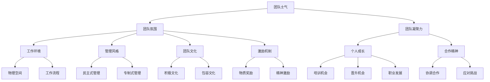

                 

### 文章标题：团队士气管理：维持高昂工作热情的秘诀

#### 关键词：团队士气、工作热情、管理策略、实践应用、案例分析

#### 摘要：
本文旨在探讨团队士气管理这一关键领域，通过深入分析团队士气的影响因素、提出有效的管理策略，并结合实际案例进行详细剖析，旨在为IT领域的团队管理者提供一套科学、系统的士气提升方法。文章将首先介绍团队士气管理的核心概念及其相互关系，随后探讨影响团队士气的主要因素，接着提出一系列具体的解决方案和最佳实践，最后通过实际案例展示如何将理论转化为实践，并总结全文，展望未来团队士气管理的趋势。

### 引言

在当今快速发展的IT行业，团队士气对于项目的成功和团队的长期发展具有至关重要的作用。高昂的团队士气不仅能够提高团队成员的工作效率，还能增强团队的凝聚力和创新能力，从而在激烈的市场竞争中脱颖而出。然而，现实中许多团队管理者往往忽视团队士气的重要性，导致团队士气低落、工作热情减弱，进而影响项目进展和团队整体表现。

为了解决这一问题，本文将系统探讨团队士气管理这一主题。我们将首先从核心概念出发，介绍团队士气、团队氛围等关键概念及其相互关系，并通过Mermaid流程图直观展示这些概念之间的联系。接着，我们将深入分析影响团队士气的主要因素，包括工作环境、管理风格、个人成长等，并通过具体的案例和实例说明这些因素如何影响团队士气。

在此基础上，我们将提出一系列具体的解决方案和最佳实践，帮助团队管理者有效提升团队士气。这些解决方案涵盖了从改善工作环境到优化管理风格，再到促进个人成长等多个方面。在实践应用部分，我们将通过实际案例和项目实战，展示如何将这些理论应用到实际工作中，并提供详细的操作步骤和注意事项。

最后，我们将结合实际案例分析团队士气管理中的成功与失败案例，总结最佳实践经验，并探讨未来团队士气管理的发展趋势。希望通过本文的探讨，能够为IT领域的团队管理者提供有价值的参考和指导，帮助他们在实践中提升团队士气，激发团队成员的工作热情，实现团队的长期可持续发展。

### 第1章：核心概念与联系

#### 1.1 团队士气、团队氛围等概念的定义

在探讨团队士气管理之前，我们需要明确几个核心概念，包括团队士气、团队氛围、团队凝聚力等。这些概念不仅相互关联，而且在团队管理中起着至关重要的作用。

**团队士气**是指团队成员在团队中的心理状态和精神状态。它不仅反映了团队成员对工作的态度和热情，还直接影响他们的工作效率和创造力。高士气意味着团队成员对工作充满热情、积极参与、乐于分享，而低士气则可能导致团队成员消极怠工、缺乏动力。

**团队氛围**是指团队内部的整体氛围，包括信任感、归属感、合作精神和开放性等。一个积极向上的团队氛围能够激发团队成员的工作热情，促进团队协作，减少冲突和误解。相反，消极的团队氛围会抑制团队成员的积极性，影响团队的整体表现。

**团队凝聚力**是指团队成员之间的相互依赖和归属感。高凝聚力的团队能够更好地协调和合作，共同应对挑战和困难。团队凝聚力不仅有助于提升团队士气，还能增强团队的稳定性和持续性。

#### 1.2 团队士气管理的关键要素

团队士气管理是一个多维度、多层次的过程，涉及到多个关键要素。以下是一些关键要素及其相互关系：

**1.1 工作环境因素**：工作环境是影响团队士气的重要因素之一。一个良好的工作环境不仅包括物理空间，如舒适的办公环境和先进的办公设备，还包括良好的工作流程和灵活的工作安排。良好的工作环境能够提高员工的工作满意度，进而提升团队士气。

**1.2 管理风格因素**：管理风格对团队士气有直接的影响。民主式管理风格能够促进团队成员的参与和合作，提高士气；而专制式管理风格则可能导致团队成员感到压抑和不满，降低士气。

**1.3 个人成长因素**：个人成长机会是激发团队成员工作热情的重要因素。通过提供培训、晋升机会和职业发展路径，管理者可以提升团队成员的成就感和自豪感，从而提高团队士气。

**1.4 团队文化因素**：团队文化是团队士气的核心驱动力。一个积极向上、包容开放的团队文化能够吸引和留住优秀人才，增强团队成员的归属感和认同感，从而提升团队士气。

**1.5 激励机制因素**：合理的激励机制能够激发团队成员的工作热情和积极性。激励机制不仅包括物质奖励，如奖金和福利，还包括精神激励，如表彰和认可。有效的激励机制能够提高团队成员的工作动力，提升团队士气。

#### 1.3 Mermaid流程图：团队士气管理概念关系图

为了更直观地展示团队士气管理中各个概念之间的关系，我们使用Mermaid流程图来描述这些关键要素及其相互影响。

在这个流程图中，团队士气（A）是核心概念，它受到团队氛围（B）、团队凝聚力（C）、工作环境（D）、管理风格（E）、团队文化（F）和激励机制（G）等多种因素的影响。这些因素之间相互关联，共同作用于团队士气，影响团队的整体表现。

通过这个Mermaid流程图，我们可以清晰地看到团队士气管理的复杂性和多维度性，为后续章节的分析和讨论提供了基础。

### 第2章：原因分析

#### 2.1 工作环境因素

工作环境是影响团队士气的重要因素之一。一个良好的工作环境不仅包括舒适的办公空间和先进的办公设备，还涉及到工作流程、团队规模、团队间协作等多个方面。

**物理空间**：一个宽敞、舒适的办公空间能够提升员工的工作满意度，减少疲劳和压力。例如，开放式办公区可以促进团队间的沟通和协作，而独立办公室则有助于提高员工的专注度和隐私性。

**工作流程**：合理的工作流程可以提高工作效率，减少冗余步骤和等待时间，从而提升员工的工作满意度。例如，通过引入敏捷开发方法，团队可以更快地响应变化，减少项目的延迟和压力。

**团队规模**：团队规模的大小对团队士气也有影响。小团队通常具有更高的凝聚力，成员之间更容易建立信任和合作，而大团队则可能面临沟通不畅、责任分散等问题。因此，在组建团队时，需要根据项目需求和团队特点合理确定团队规模。

**团队间协作**：团队间的协作是提高整体工作满意度的重要途径。通过跨部门合作和项目联动，可以增强团队之间的互动和信任，从而提升整体士气。例如，在IT行业中，开发团队、测试团队和运维团队之间的紧密协作能够显著提高项目的成功率和员工的满意度。

#### 2.2 管理风格因素

管理风格对团队士气有直接的影响。不同的管理风格会导致不同的团队氛围和工作氛围，从而影响员工的士气和工作效率。

**民主式管理**：民主式管理风格注重团队成员的参与和意见反馈，鼓励开放沟通和团队合作。这种管理风格有助于增强员工的归属感和参与感，从而提高士气。例如，在决策过程中，管理层可以邀请团队成员提出建议和意见，共同讨论和制定方案，使团队成员感到被尊重和重视。

**专制式管理**：专制式管理风格则强调权威和命令，团队成员往往需要遵循上级的指示，缺乏自主性和创新空间。这种管理风格可能会导致员工感到压抑和不满，降低士气。例如，如果管理层对员工的意见和建议不予以重视，甚至进行打压，可能会导致员工失去工作热情和积极性。

#### 2.3 个人成长因素

个人成长是激发团队成员工作热情和士气的重要因素。通过提供培训、晋升机会和职业发展路径，管理者可以提升团队成员的成就感和自豪感，从而提高团队士气。

**培训机会**：提供培训机会可以帮助团队成员提升技能和知识，增强职业竞争力。例如，通过组织内部培训、外部课程和在线学习平台，团队可以不断提升整体素质和能力，从而提高士气。

**晋升机会**：晋升机会是激励团队成员的重要手段。通过建立明确的晋升机制和职业发展路径，团队可以激励员工不断努力，追求更高的职业目标。例如，在技术团队中，通过技术评级和晋升制度，可以激励技术人员不断提升技能和贡献，从而提高士气。

**职业发展路径**：明确的职业发展路径可以帮助团队成员规划职业生涯，增强职业安全感。例如，通过制定长期职业规划和发展计划，团队可以明确员工的职业发展方向和目标，帮助员工在职业道路上不断前行。

#### 2.4 其他影响因素

除了上述主要因素，还有一些其他因素也会影响团队士气，如组织文化、激励机制和团队文化等。

**组织文化**：组织文化是团队士气的重要影响因素。一个积极向上、包容开放的组织文化能够吸引和留住优秀人才，增强团队成员的归属感和认同感。例如，通过建立开放沟通、尊重个体差异的组织文化，团队可以更好地激发成员的工作热情和创造力。

**激励机制**：激励机制是提升团队士气的重要手段。合理的激励机制可以激发员工的工作热情和积极性，提高士气。例如，通过设立绩效奖金、晋升机会和荣誉奖励等，团队可以激励员工不断努力，追求卓越。

**团队文化**：团队文化是团队士气的重要驱动力。一个积极向上、包容开放的团队文化能够增强团队的凝聚力和创新能力，从而提升士气。例如，通过举办团队建设活动、开展团队协作项目和鼓励团队内部交流，团队可以建立积极向上的团队文化，提高士气。

### 第3章：解决方案

#### 3.1 改善工作环境策略

改善工作环境是提升团队士气的重要策略之一。一个良好的工作环境不仅能够提高员工的工作满意度，还能促进团队协作和创新能力。以下是一些具体的方法和措施：

**1. 提供舒适的工作空间**：为员工提供一个宽敞、舒适的工作空间，包括办公桌、座椅、灯光和通风等。通过合理规划布局，确保员工能够在舒适的环境中工作，减少疲劳和压力。

**2. 引入现代化办公设备**：引入先进的办公设备和工具，如智能办公桌、虚拟现实头戴设备、智能会议系统等，提升工作效率和体验。这些设备不仅能够提高员工的工作效率，还能激发他们的创新思维。

**3. 优化工作流程**：通过引入敏捷开发、精益管理等方法，优化工作流程，减少冗余步骤和等待时间。通过自动化工具和流程改进，降低员工的重复劳动，提高工作满意度。

**4. 提供灵活的工作安排**：为员工提供灵活的工作安排，如远程办公、弹性工作时间等。通过灵活的工作安排，员工可以更好地平衡工作与生活，提高工作满意度和士气。

**5. 建立员工关怀机制**：通过建立员工关怀机制，如健康体检、心理咨询、员工活动等，关注员工身心健康，提高员工的归属感和满意度。

#### 3.2 优化管理风格方法

优化管理风格是提升团队士气的重要手段。不同的管理风格对团队士气有直接的影响，因此，管理者需要根据团队特点和项目需求，选择合适的管理风格。以下是一些具体的方法和措施：

**1. 采用民主式管理**：鼓励团队成员参与决策过程，充分听取员工的意见和建议。通过建立反馈机制，及时了解员工的需求和意见，共同制定工作目标和计划。

**2. 提高沟通效率**：加强团队内部沟通，确保信息流畅和透明。通过定期的团队会议、工作汇报和反馈交流，及时解决问题和调整工作方向。

**3. 建立信任和尊重**：尊重员工的个性和差异，建立信任和合作关系。通过鼓励创新和包容失败，为员工创造一个安全、开放的工作环境。

**4. 提供个性化支持**：针对不同员工的需求和特点，提供个性化的支持和帮助。例如，对于技术人才，可以提供专业培训和晋升机会；对于管理人才，可以提供领导力和战略管理培训。

**5. 建立激励机制**：通过设立绩效奖金、晋升机会和荣誉奖励等，激励员工不断努力，追求卓越。同时，注意公平公正，确保激励机制的有效性和透明度。

#### 3.3 促进个人成长途径

促进个人成长是提升团队士气的重要策略之一。通过提供培训、晋升机会和职业发展路径，管理者可以激发员工的工作热情和成就感，提高团队士气。以下是一些具体的方法和措施：

**1. 提供培训机会**：定期组织内部培训、外部课程和在线学习活动，提升员工的技能和知识水平。通过多样化的培训形式，满足不同员工的学习需求，提高员工的专业素养和职业竞争力。

**2. 设立晋升机制**：建立明确的晋升机制，为员工提供职业发展路径。通过绩效评估和人才选拔，为表现优秀的员工提供晋升机会，激励员工不断提升自己。

**3. 提供职业发展指导**：为员工提供职业发展指导，帮助他们明确职业目标和规划，制定个人发展计划。通过一对一辅导和职业规划会议，为员工提供个性化的职业发展支持。

**4. 鼓励自主学习**：鼓励员工自主学习，提升自我驱动能力。通过建立学习社区、知识共享平台等，为员工提供学习和交流的机会，促进知识的传递和积累。

**5. 提供专业发展支持**：为员工提供专业发展的支持，如参加行业会议、研讨会和培训等。通过这些活动，员工可以了解行业动态，拓展视野，提升专业水平。

#### 3.4 综合解决方案

提升团队士气需要综合考虑多个方面，采取综合性的解决方案。以下是一些具体的综合策略：

**1. 建立团队文化**：通过培养积极向上、包容开放的团队文化，增强团队凝聚力，提升士气。例如，举办团队建设活动、团队交流活动等，促进团队成员之间的了解和信任。

**2. 设立员工满意度调查**：定期开展员工满意度调查，了解员工的需求和意见，及时发现和解决问题。通过反馈机制，确保员工的诉求得到重视和回应。

**3. 提供个性化福利**：根据员工的需求和特点，提供个性化的福利和奖励。例如，针对家庭责任较重的员工，可以提供弹性工作时间或家庭关怀政策。

**4. 加强团队协作**：通过引入跨部门合作、项目联动等方式，促进团队之间的协作和交流。通过共享资源和信息，提升整体工作效率和士气。

**5. 建立激励机制**：结合员工的绩效表现和贡献，建立合理的激励机制，激励员工不断追求卓越。同时，注重公平公正，确保激励机制的有效性和透明度。

通过综合运用上述策略，团队管理者可以全面提升团队士气，激发员工的工作热情和创新能力，实现团队的长期可持续发展。

### 第4章：实践应用

#### 4.1 实际案例1：如何提升团队士气

在本节中，我们将探讨一个具体案例，分析如何在一个IT项目中提升团队士气，并详细描述实施步骤、关键点以及预期效果。

**案例背景**：
某IT公司承接了一个大型软件开发项目，该项目涉及多个部门，团队成员包括开发人员、测试人员、项目经理和UI/UX设计师。由于项目时间紧迫且任务繁重，团队成员在初期阶段表现出明显的压力和不满情绪。为了提升团队士气，管理层决定采取一系列措施。

**实施步骤**：

**1. 评估现状**：
首先，管理层对团队士气进行了全面评估，通过问卷调查和个别访谈，了解团队成员的工作压力、满意度、需求和意见。评估结果揭示了以下几个关键问题：
- 工作压力较大，加班频繁
- 团队沟通不畅，信息传递不及时
- 缺乏明确的职业发展路径和激励机制
- 对项目目标和工作内容缺乏认同感

**2. 制定策略**：
根据评估结果，管理层制定了以下提升团队士气的策略：
- 优化工作环境，提供舒适的办公空间
- 改进沟通机制，加强团队内部信息交流
- 建立明确的职业发展路径和激励机制
- 提高团队对项目的认同感和参与度

**3. 实施措施**：
**（1）改善工作环境**：
- 调整办公布局，增加会议室和休息区
- 更换办公设备，提升工作效率
- 提供健康饮食和咖啡休息区

**（2）加强沟通与协作**：
- 定期召开团队会议，确保信息畅通
- 引入即时通讯工具，促进团队成员间的交流
- 组织团队建设活动，增强团队合作精神

**（3）建立职业发展路径**：
- 制定明确的晋升机制和职业发展计划
- 为员工提供培训和进修机会
- 开展一对一职业发展辅导

**（4）提高项目认同感**：
- 重新明确项目目标，确保团队成员理解项目意义
- 鼓励团队成员参与项目规划和决策
- 定期评估项目进展，及时调整目标和策略

**4. 关键点**：
- **关注员工需求**：在实施过程中，管理层需持续关注员工的需求和反馈，及时调整策略，确保措施的针对性和有效性。
- **激励机制**：建立公平、公正的激励机制，确保员工的努力和贡献得到认可和回报。
- **持续改进**：通过定期评估和反馈，不断优化工作环境和团队管理策略，确保团队士气持续提升。

**预期效果**：
通过上述措施，团队成员的工作压力得到了有效缓解，沟通不畅问题得到了明显改善，团队内部的协作和认同感显著提升。具体表现为：
- 工作效率提高，项目进度得到保障
- 团队成员士气高涨，工作积极性增强
- 员工对公司的认同感和归属感增强
- 项目成功率和客户满意度提升

**实施总结**：
该案例展示了通过全面评估、策略制定和持续改进，可以有效提升团队士气，促进项目的成功实施。在类似项目中，团队管理者可以借鉴此案例，结合自身实际情况，采取相应的措施，提升团队士气和工作效率。

#### 4.2 实际案例2：如何在困境中保持团队士气

在某些情况下，团队可能会面临各种挑战和困境，如项目延期、技术难题、市场压力等，这些困境容易导致团队士气低落。在这种情况下，保持团队士气尤为重要。以下是一个实际案例，描述如何在困境中保持团队士气。

**案例背景**：
一家IT公司正在开发一款重要的新产品，项目进度已经严重延误，并且遇到了一些关键技术难题。团队成员感到压力巨大，士气低落。为了确保项目能够顺利完成，并保持团队士气，管理层决定采取一系列措施。

**实施步骤**：

**1. 明确困境和挑战**：
首先，管理层与团队进行了深入沟通，明确了当前面临的困境和挑战，包括：
- 项目延期，时间压力巨大
- 技术难题，团队无法找到有效的解决方案
- 市场压力，客户对交付时间有严格要求

**2. 制定应对策略**：
基于以上困境，管理层制定了以下策略来保持团队士气：
- **提高沟通效率**：定期召开团队会议，确保团队成员了解项目进展和面临的问题，及时沟通和协作。
- **提供技术支持**：组织内部技术分享会，邀请专家和技术骨干进行技术指导，帮助团队克服技术难题。
- **调整项目计划**：重新评估项目计划，合理分配任务和资源，确保团队能够在压力下保持高效工作。
- **激励员工**：通过设立短期目标和奖励机制，激励员工保持积极心态，努力克服困难。

**3. 实施措施**：
**（1）提高沟通效率**：
- 定期召开团队会议，确保团队成员了解项目进展和面临的问题
- 引入即时通讯工具，促进团队成员间的交流
- 建立问题反馈机制，鼓励团队成员提出意见和建议

**（2）提供技术支持**：
- 组织内部技术分享会，邀请专家和技术骨干进行技术指导
- 开展技术培训，提升团队成员的技能水平
- 设立技术攻关小组，集中力量解决关键技术难题

**（3）调整项目计划**：
- 重新评估项目计划，合理分配任务和资源
- 设立短期目标，确保团队能够在压力下保持高效工作
- 与客户沟通，调整交付时间，缓解时间压力

**（4）激励员工**：
- 设立短期目标和奖励机制，激励员工保持积极心态
- 表彰在困难时期表现突出的员工，提升团队士气
- 提供心理辅导和放松活动，缓解员工的压力

**4. 关键点**：
- **及时沟通**：在困境中，及时沟通至关重要，确保团队成员了解实际情况，共同应对挑战。
- **提供支持**：提供技术支持和资源，帮助团队克服困难，提升士气。
- **激励机制**：通过合理的激励措施，激发员工克服困境的信心和动力。
- **心理辅导**：在困境中，员工的情绪和心理压力较大，提供心理辅导和放松活动，有助于缓解压力，提升士气。

**预期效果**：
通过实施上述措施，团队士气得到了有效保持，团队成员在困境中保持了积极心态，项目最终在预定时间内完成。具体表现为：
- 团队成员积极协作，共同应对挑战
- 技术难题得到有效解决，项目质量得到保障
- 员工对项目的认同感和归属感增强
- 项目成功交付，客户满意度提升

**实施总结**：
在面临困境时，保持团队士气是确保项目成功的关键。通过有效的沟通、技术支持、激励机制和心理辅导，团队可以在困境中保持高昂士气，共同克服困难，实现项目目标。

### 第4章：实践应用

#### 4.3 项目实战1：团队士气提升项目实施步骤

在本节中，我们将详细介绍一个团队士气提升项目的实施步骤，通过实际案例展示如何有效提升团队士气。

**项目背景**：
某大型IT公司开发团队在过去一年中经历了多个高负荷项目，导致团队成员的工作压力和士气显著下降。管理层意识到需要采取措施提升团队士气，以确保项目质量和团队长期发展。

**项目目标**：
- 提升团队成员的工作满意度和士气
- 加强团队凝聚力和合作精神
- 提高项目执行效率和团队整体绩效

**实施步骤**：

**1. 项目启动与规划**
- **需求分析**：通过问卷调查和访谈，收集团队成员对工作环境和团队管理的意见和建议，明确当前士气低落的主要原因。
- **制定项目计划**：根据需求分析结果，制定详细的团队士气提升项目计划，包括目标、策略、实施步骤和时间表。
- **组建项目团队**：由管理层、项目经理、HR经理和团队成员组成项目团队，明确各自职责和任务。

**2. 改善工作环境**
- **办公空间调整**：为团队成员提供宽敞、舒适的办公空间，增加休息区和团队活动区，提升办公环境质量。
- **办公设备升级**：引入现代化的办公设备和工具，如智能办公桌、虚拟现实头戴设备、智能会议系统等，提高工作效率和体验。

**3. 加强团队沟通与协作**
- **定期团队会议**：建立定期团队会议制度，确保团队成员了解项目进展和团队动态，及时沟通和解决遇到的问题。
- **即时通讯工具**：引入即时通讯工具，如Slack或Microsoft Teams，促进团队成员间的快速交流和协作。

**4. 提供培训和职业发展机会**
- **技术培训**：组织内部技术分享会和培训课程，提升团队成员的专业技能和知识水平。
- **职业发展指导**：为团队成员提供职业发展指导和规划，明确职业发展路径和晋升机会。

**5. 激励机制与奖励**
- **绩效奖金**：设立绩效奖金，根据团队成员的工作表现和贡献，给予相应的奖励。
- **表彰与认可**：定期举办表彰大会，对表现突出的团队成员进行表彰和奖励，提升团队士气。

**6. 团队文化建设**
- **团队建设活动**：组织团队建设活动，如团建旅行、团队拓展训练等，增强团队成员的凝聚力和归属感。
- **团队文化宣传**：通过内部宣传渠道，如企业内刊、公告栏等，宣传团队文化，树立积极向上的团队形象。

**7. 项目监控与反馈**
- **项目评估**：定期评估项目进展和团队士气提升情况，分析存在的问题和改进方向。
- **反馈机制**：建立反馈机制，及时收集团队成员的意见和建议，调整项目策略和措施。

**实施步骤详解**：

**1. 需求分析**
- **问卷调查**：设计问卷调查，涵盖工作环境、团队管理、职业发展、激励机制等方面，收集团队成员的反馈。
- **访谈**：对部分团队成员进行个别访谈，深入了解他们对当前工作环境和团队管理的意见和建议。

**2. 制定项目计划**
- **项目目标**：明确提升团队士气、加强团队凝聚力、提高项目执行效率和团队整体绩效等目标。
- **策略制定**：根据需求分析结果，制定具体的提升策略，如改善工作环境、加强团队沟通与协作、提供培训和职业发展机会等。
- **时间表**：制定详细的时间表，明确各阶段的实施时间和目标。

**3. 改善工作环境**
- **办公空间调整**：与物业部门协调，为团队成员提供宽敞、舒适的办公空间，增加休息区和团队活动区。
- **办公设备升级**：采购现代化办公设备和工具，如智能办公桌、虚拟现实头戴设备、智能会议系统等，提升工作效率和体验。

**4. 加强团队沟通与协作**
- **定期团队会议**：每周召开一次团队会议，确保团队成员了解项目进展和团队动态，及时沟通和解决遇到的问题。
- **即时通讯工具**：引入Slack或Microsoft Teams等即时通讯工具，方便团队成员之间的快速交流和协作。

**5. 提供培训和职业发展机会**
- **技术培训**：定期组织技术分享会和培训课程，邀请公司内部或外部专家进行授课，提升团队成员的专业技能和知识水平。
- **职业发展指导**：为团队成员提供职业发展指导和规划，明确职业发展路径和晋升机会，帮助他们制定个人职业规划。

**6. 激励机制与奖励**
- **绩效奖金**：根据团队成员的工作表现和贡献，设立绩效奖金，给予相应的奖励。
- **表彰与认可**：每月举办一次表彰大会，对表现突出的团队成员进行表彰和奖励，提升团队士气。

**7. 团队文化建设**
- **团队建设活动**：组织团建旅行、团队拓展训练等活动，增强团队成员的凝聚力和归属感。
- **团队文化宣传**：通过企业内刊、公告栏等渠道，宣传团队文化，树立积极向上的团队形象。

**8. 项目监控与反馈**
- **项目评估**：每季度对项目进展和团队士气提升情况进行评估，分析存在的问题和改进方向。
- **反馈机制**：建立反馈机制，及时收集团队成员的意见和建议，调整项目策略和措施。

**实施总结**：
通过上述实施步骤，团队士气得到了显著提升。团队成员的工作满意度、凝聚力和工作效率都有所提高，项目质量和客户满意度也得到保障。在类似项目中，团队管理者可以借鉴此案例，结合自身实际情况，采取相应的措施，提升团队士气和工作效率。

### 第4章：实践应用

#### 4.4 项目实战2：团队士气管理策略评估与调整

在本节中，我们将探讨如何对团队士气管理策略进行评估与调整。通过实际案例，展示如何通过数据收集、分析以及反馈机制，发现并解决团队士气管理中的问题，并进行策略调整。

**案例背景**：
某IT公司在实施了一系列团队士气提升措施后，管理层希望通过评估与反馈，验证这些措施的有效性，并根据实际情况进行策略调整，以确保团队士气持续提升。

**评估与调整步骤**：

**1. 数据收集**：
- **员工满意度调查**：通过问卷调查，收集员工对当前工作环境、管理风格、职业发展、激励机制等方面的满意度评价。
- **工作表现数据**：收集团队在项目完成率、任务质量、工作效率等方面的数据。
- **员工反馈**：通过定期的一对一访谈和团队讨论，了解员工的真实感受和意见。

**2. 数据分析**：
- **满意度分析**：对员工满意度调查结果进行统计分析，识别满意度较高的方面和需要改进的方面。
- **工作表现分析**：对工作表现数据进行分析，评估各项绩效指标的变化趋势。
- **反馈综合分析**：将员工反馈与满意度调查和工作表现数据进行综合分析，识别团队士气管理中的潜在问题和改进方向。

**3. 发现问题**：
- **满意度低点**：识别员工满意度较低的领域，如工作环境、管理风格等。
- **绩效波动**：分析工作表现数据，识别影响团队士气和工作效率的因素。
- **反馈意见**：整理员工反馈中的关键意见，识别需要改进的具体方面。

**4. 制定调整策略**：
- **针对满意度低点**：制定针对性的改进措施，如改善工作环境、调整管理风格等。
- **针对绩效波动**：分析影响绩效波动的因素，制定改进措施，如优化工作流程、提供技术支持等。
- **针对反馈意见**：根据员工反馈，制定改进计划，确保措施的针对性和有效性。

**5. 实施调整措施**：
- **改进工作环境**：例如，增加休息区、优化办公布局、提供健康饮食等。
- **调整管理风格**：例如，引入民主式管理，鼓励员工参与决策，提高沟通效率等。
- **提供技术支持**：例如，组织技术培训、设立技术支持团队，帮助员工解决技术难题等。

**6. 反馈与监控**：
- **定期评估**：定期评估调整措施的效果，通过满意度调查、工作表现数据等，了解团队士气提升情况。
- **持续改进**：根据评估结果，不断调整和优化策略，确保团队士气持续提升。

**实施步骤详解**：

**1. 数据收集**
- **满意度调查**：设计详细的满意度调查问卷，涵盖工作环境、管理风格、职业发展、激励机制等方面，确保问卷内容全面、具体。
- **工作表现数据**：收集项目完成率、任务质量、工作效率等数据，通过项目管理工具进行记录和分析。
- **员工反馈**：定期进行一对一访谈和团队讨论，鼓励员工表达真实感受和意见，确保反馈渠道的畅通。

**2. 数据分析**
- **满意度分析**：使用统计分析工具，对满意度调查结果进行统计分析，生成详细的统计报告。
- **工作表现分析**：对工作表现数据进行分析，识别团队在项目完成率、任务质量、工作效率等方面的变化趋势。
- **反馈综合分析**：将满意度调查结果和员工反馈进行综合分析，识别团队士气管理中的潜在问题和改进方向。

**3. 发现问题**
- **满意度低点**：通过满意度分析，识别员工满意度较低的领域，如工作环境中的噪音问题、管理风格中的沟通不畅等。
- **绩效波动**：通过工作表现数据，分析绩效波动的具体原因，如技术难题、人员配置不足等。
- **反馈意见**：整理员工反馈中的关键意见，如对当前培训内容的不满意、对管理风格的建议等。

**4. 制定调整策略**
- **改进工作环境**：根据满意度分析和反馈意见，制定针对性的改进措施，如增加休息区、改善办公布局等。
- **调整管理风格**：根据反馈意见，调整管理风格，如引入民主式管理，鼓励员工参与决策等。
- **提供技术支持**：根据绩效波动分析结果，提供针对性的技术支持，如组织技术培训、设立技术支持团队等。

**5. 实施调整措施**
- **改进工作环境**：例如，增加休息区，提供舒适的工作座椅，改善办公布局，确保员工在舒适的环境中工作。
- **调整管理风格**：例如，定期召开团队会议，邀请员工参与项目规划和决策，提高沟通效率，增强团队凝聚力。
- **提供技术支持**：例如，组织技术培训，邀请外部专家进行授课，提升团队成员的专业技能和知识水平。

**6. 反馈与监控**
- **定期评估**：每季度对团队士气管理策略进行评估，通过满意度调查、工作表现数据等，了解团队士气提升情况。
- **持续改进**：根据评估结果，不断调整和优化策略，确保团队士气持续提升。

**实施总结**：
通过上述评估与调整步骤，该IT公司能够及时发现团队士气管理中的问题，并采取有效的措施进行改进。通过持续的数据收集、分析和反馈，公司能够不断优化团队士气管理策略，确保团队士气持续提升，为项目的成功和团队的长期发展提供有力支持。在类似项目中，团队管理者可以借鉴此案例，结合自身实际情况，进行有效的团队士气管理策略评估与调整。

### 第5章：反馈与优化

#### 5.1 反馈机制建立

建立有效的反馈机制是团队士气管理中至关重要的一环。一个完善的反馈机制不仅能够及时收集团队成员的意见和反馈，还能够确保这些意见得到重视和回应，从而促进团队士气和管理策略的持续优化。

**1. 反馈渠道的多样化**：
- **员工满意度调查**：定期进行员工满意度调查，通过问卷、访谈等形式收集团队成员对工作环境、管理风格、职业发展等方面的意见和建议。
- **匿名反馈平台**：建立匿名反馈平台，鼓励员工自由表达意见，尤其是对管理方面的问题和建议，确保反馈的真实性和有效性。
- **定期会议**：定期召开团队会议，为团队成员提供交流和反馈的机会，确保信息畅通和沟通高效。

**2. 反馈的及时性**：
- **快速响应**：对于收到的反馈，特别是紧急或重要的问题，应立即响应，确保问题得到及时解决。
- **定期总结**：定期对收集到的反馈进行总结和分析，识别常见问题和趋势，为策略调整提供数据支持。

**3. 反馈的透明性**：
- **公开反馈结果**：对反馈的处理结果进行公开，让团队成员了解管理层对反馈的重视程度和解决进度，增强团队信任感。
- **反馈跟踪机制**：建立反馈跟踪机制，记录反馈处理的全过程，确保每个反馈都有明确的处理结果和责任归属。

**4. 反馈的闭环管理**：
- **反馈反馈**：在问题解决后，及时向反馈人进行反馈，告知问题解决的情况和后续措施，确保反馈闭环。
- **持续改进**：根据反馈结果，持续优化管理策略和工作流程，确保团队士气和管理水平的不断提升。

#### 5.2 数据收集与分析

数据收集与分析是团队士气管理中的核心环节。通过系统化、科学化的数据收集和分析，管理者能够准确了解团队的工作状态、士气水平和存在的问题，从而为优化管理策略提供依据。

**1. 数据来源的多样性**：
- **内部数据**：包括员工满意度调查、工作表现数据、项目完成情况等，通过内部系统进行收集和分析。
- **外部数据**：包括客户反馈、行业报告、市场趋势等，通过外部渠道进行收集。

**2. 数据分析的方法**：
- **定量分析**：使用统计工具，对满意度调查结果、工作表现数据等进行定量分析，识别关键指标和趋势。
- **定性分析**：通过访谈、观察等手段，深入了解团队成员的真实感受和意见，为定量分析提供补充。

**3. 数据分析的工具**：
- **数据分析软件**：如Excel、SPSS等，用于处理和展示数据分析结果。
- **大数据分析平台**：如Hadoop、Spark等，用于处理海量数据，提供深度分析。

**4. 数据分析的应用**：
- **问题识别**：通过数据分析，识别团队士气管理中的问题，如工作压力、沟通不畅、激励不足等。
- **趋势预测**：通过历史数据分析，预测团队士气和管理策略的未来趋势，为策略调整提供参考。
- **决策支持**：为管理层提供数据支持，帮助制定科学、有效的管理决策。

#### 5.3 调整与优化策略

根据数据分析和反馈结果，团队管理者需要及时调整和优化团队士气管理策略。以下是一些具体的调整和优化策略：

**1. 工作环境的优化**：
- **改善办公空间**：根据员工反馈，调整办公空间布局，提供更舒适的工作环境。
- **提供灵活的工作安排**：根据员工需求，提供远程办公、弹性工作时间等灵活的工作安排。

**2. 管理风格的调整**：
- **引入民主式管理**：鼓励员工参与决策，提高团队的自主性和创造力。
- **加强沟通与反馈**：建立有效的沟通机制，确保信息透明和及时反馈。

**3. 职业发展的支持**：
- **提供培训机会**：为员工提供多样化的培训机会，提升其专业技能和知识水平。
- **设立明确的职业发展路径**：建立明确的晋升机制和职业发展计划，帮助员工明确职业发展方向。

**4. 激励机制的完善**：
- **设立绩效奖金**：根据员工的工作表现和贡献，设立绩效奖金，激励员工不断提升。
- **表彰与认可**：定期举办表彰大会，对表现突出的员工进行表彰和认可，提升团队士气。

**5. 团队文化的建设**：
- **加强团队建设活动**：通过团建活动、团队拓展训练等，增强团队成员的凝聚力和归属感。
- **宣传团队文化**：通过内部宣传渠道，宣传团队文化，树立积极向上的团队形象。

**6. 持续改进的方法**：
- **定期评估**：定期对团队士气管理策略进行评估，分析其效果和存在的问题。
- **持续反馈**：鼓励团队成员持续提供反馈，不断完善管理策略。
- **创新实践**：积极探索新的管理方法和工具，提升团队士气管理的科学性和有效性。

通过上述调整和优化策略，团队管理者能够持续提升团队士气，激发员工的工作热情和创新能力，实现团队的长期可持续发展。

### 第6章：案例分析

#### 6.1 案例分析1：成功提升团队士气的企业案例

在本节中，我们将详细分析一个成功提升团队士气的企业案例，探讨其具体措施和效果。

**案例背景**：
某知名互联网公司在经历了一段时间的高速发展后，发现团队士气有所下降。为了提升团队士气，该公司采取了一系列措施，取得了显著的效果。

**具体措施**：

**1. 改善工作环境**：
- **办公空间优化**：公司重新设计了办公空间，增加了开放办公区和休息区，提供了舒适的座椅和便利的茶水间，提升了员工的办公体验。
- **设施更新**：公司引入了最新的办公设备，如高速Wi-Fi、智能办公桌等，提高了工作效率和舒适度。

**2. 加强团队沟通**：
- **定期团队会议**：公司每周举行一次团队会议，确保团队成员能够及时了解项目进展和团队动态。
- **开放沟通渠道**：公司建立了内部沟通平台，鼓励员工提出意见和建议，管理层也会定期回应和解决问题。

**3. 提供职业发展机会**：
- **培训计划**：公司为员工提供了多样化的培训计划，包括内部培训和外部课程，帮助员工提升技能和知识水平。
- **职业规划**：公司设立了职业规划服务，为员工提供一对一的职业发展规划指导，明确职业目标和路径。

**4. 激励机制**：
- **绩效奖金**：公司根据员工的工作表现和贡献，设立了绩效奖金制度，激励员工积极工作。
- **表彰与奖励**：公司定期举办表彰大会，对表现优秀的员工进行表彰和奖励，提升员工的成就感和自豪感。

**5. 团队文化建设**：
- **团队活动**：公司定期组织团队建设活动，如团建旅行、团队拓展训练等，增强团队成员的凝聚力和归属感。
- **文化宣传**：公司通过内部宣传渠道，如企业内刊、公告栏等，宣传积极向上的团队文化，树立良好的团队形象。

**效果分析**：

**1. 工作满意度提升**：
- **调查数据**：通过员工满意度调查，发现员工对工作环境的满意度显著提升，对公司的信任度和归属感也增强。
- **员工反馈**：员工在反馈中提到，办公环境的改善和工作资源的增加，让他们感到更加舒适和高效。

**2. 团队凝聚力增强**：
- **团队协作**：团队内部的协作和沟通明显改善，项目进展顺利，团队成员之间的信任和合作精神增强。
- **团队绩效**：团队的整体绩效提升，项目质量和完成率显著提高。

**3. 员工留存率提高**：
- **员工离职率**：公司员工的离职率明显下降，许多员工表示愿意继续在公司工作，因为他们感到受到了重视和认可。
- **员工反馈**：员工在反馈中提到，公司提供的职业发展机会和激励机制，让他们看到了成长和晋升的希望。

**总结**：
该案例展示了通过一系列具体措施，如改善工作环境、加强团队沟通、提供职业发展机会、设立激励机制和建设团队文化，企业可以有效提升团队士气。这些措施不仅提高了员工的工作满意度和团队凝聚力，还增强了员工的留存率和公司的整体绩效。

#### 6.2 案例分析2：因团队士气低落导致失败的企业案例

在本节中，我们将探讨一个因团队士气低落而导致失败的企业案例，分析其具体原因和教训。

**案例背景**：
某新兴科技公司成立于2018年，初期凭借创新的技术和灵活的管理模式获得了资本的青睐，但随着公司规模的不断扩大和市场竞争的加剧，团队士气逐渐低落，最终导致公司失败。

**具体原因**：

**1. 工作压力过大**：
- **长时间加班**：公司为了加快产品开发进度，要求员工经常加班，导致员工身心疲惫，士气低落。
- **无休止的工作**：员工在长时间高强度的工作下，逐渐失去了工作热情和动力，工作效率降低。

**2. 管理不善**：
- **沟通不畅**：公司管理层与员工之间的沟通不畅，员工的问题和建议得不到及时回应，导致员工感到被忽视和不被重视。
- **缺乏反馈**：公司没有建立有效的反馈机制，员工无法了解自己的工作表现和改进方向，士气进一步下降。

**3. 缺乏激励机制**：
- **奖金制度不合理**：公司设定的奖金制度缺乏公平性，员工感到自己的努力和贡献没有得到应有的回报，士气受损。
- **晋升机会有限**：公司晋升机会有限，员工看不到职业发展的前景，缺乏工作动力。

**4. 团队氛围不良**：
- **内部竞争激烈**：公司内部竞争激烈，员工之间缺乏合作，相互猜忌，导致团队氛围紧张，士气低落。
- **缺乏团队建设**：公司没有定期举办团队建设活动，员工之间缺乏互动和交流，团队凝聚力下降。

**教训**：

**1. 关注员工福祉**：
- **合理安排工作时间**：避免过度加班，关注员工身心健康，确保员工有足够的休息时间。
- **改善工作环境**：提供舒适的工作空间和设备，提升员工的工作体验。

**2. 强化沟通与反馈**：
- **建立有效的沟通机制**：确保管理层与员工之间的信息畅通，及时回应员工的问题和建议。
- **定期反馈**：建立定期的绩效反馈机制，让员工了解自己的工作表现和改进方向。

**3. 完善激励机制**：
- **公平合理的奖金制度**：确保奖金制度公平透明，激励员工积极工作。
- **提供晋升机会**：建立清晰的晋升机制，为员工提供职业发展的路径和机会。

**4. 建设积极的团队文化**：
- **促进团队合作**：鼓励员工之间相互支持和合作，建立积极的团队氛围。
- **定期团队建设活动**：通过团建活动、培训等方式，增强团队凝聚力和归属感。

通过这个案例，我们可以看到，团队士气低落会对企业的成功产生严重的影响。企业需要关注员工福祉，强化沟通与反馈，完善激励机制，建设积极的团队文化，以确保团队士气的高昂，从而实现企业的长期发展。

### 第6章：案例分析

#### 6.3 案例分析3：团队士气管理的创新实践

在本节中，我们将探讨一个团队士气管理的创新实践案例，分析其背景、实施过程和效果，为其他企业或团队提供借鉴和启示。

**案例背景**：
某国际知名科技公司因市场竞争加剧和内部变革，发现团队士气有所下降，影响了项目的进展和效率。为了提升团队士气，公司决定采用一系列创新实践，通过全方位的改进措施来激发员工的活力和创造力。

**实施过程**：

**1. 创新理念引入**：
- **设计思维培训**：公司引入了设计思维培训，为员工提供创新思维和方法论的培训，鼓励他们从用户的角度出发，创造性地解决问题。
- **敏捷文化推广**：公司推行敏捷文化，通过短周期迭代和快速反馈，提升团队的适应能力和创新能力。

**2. 灵活工作安排**：
- **远程工作试点**：公司开展了远程工作试点项目，允许员工在一定时间内选择远程办公，以平衡工作和生活，提升工作满意度。
- **弹性工作时间**：公司推出了弹性工作时间政策，员工可以根据项目需求和个人情况灵活调整工作时间，提高工作效率。

**3. 激励机制创新**：
- **项目奖金制度**：公司设立项目奖金制度，根据项目成果和员工贡献，发放奖金，激励员工积极投入工作。
- **创新挑战赛**：公司定期举办创新挑战赛，鼓励员工提出创新想法和解决方案，优胜者获得奖励和晋升机会。

**4. 团队文化建设**：
- **内部知识分享**：公司建立内部知识分享平台，鼓励员工分享经验和技术，促进知识的传递和积累。
- **团队建设活动**：公司定期组织团队建设活动，如团队旅行、户外拓展等，增强团队的凝聚力和归属感。

**效果分析**：

**1. 团队士气显著提升**：
- **员工满意度调查**：通过员工满意度调查，发现员工的工作满意度显著提升，他们对公司的认同感和归属感增强。
- **员工反馈**：员工在反馈中提到，创新实践的引入让他们感到更有动力和创造力，工作更加充满激情。

**2. 创新能力和工作效率提升**：
- **项目进度**：公司的项目进度加快，项目质量和交付效率显著提升，客户满意度提高。
- **创新能力**：通过设计思维培训和敏捷文化的推广，员工的创新能力和问题解决能力得到显著提升，为公司带来了新的增长点。

**3. 员工留存率提高**：
- **离职率下降**：公司的员工离职率明显下降，许多员工表示愿意继续在公司工作，因为他们看到了职业发展的机会和公司对他们的重视。
- **职业发展**：公司通过创新挑战赛和项目奖金制度，为员工提供了丰富的职业发展机会和晋升通道，增强了员工的职业安全感。

**总结**：
该案例展示了通过引入创新理念、灵活工作安排、激励机制创新和团队文化建设，企业可以有效提升团队士气，激发员工的活力和创造力。这些创新实践不仅提升了员工的工作满意度和团队凝聚力，还显著提高了公司的整体绩效和竞争力。其他企业或团队可以借鉴这些实践经验，结合自身实际情况，制定适合自己的团队士气管理策略。

### 第7章：总结与展望

#### 7.1 总结

本文围绕团队士气管理这一主题，系统地探讨了团队士气管理的重要性、核心概念、影响因素、解决方案、实践应用和案例分析。通过对团队士气管理的全面分析，我们可以得出以下主要结论：

1. **团队士气管理的重要性**：团队士气对于团队的整体表现和长期发展具有至关重要的作用。高昂的团队士气能够提升工作效率、增强团队凝聚力和创新能力，从而在激烈的市场竞争中脱颖而出。

2. **核心概念与联系**：团队士气管理涉及多个核心概念，如团队士气、团队氛围、团队凝聚力等，这些概念相互关联，共同作用于团队的整体表现。

3. **影响因素**：影响团队士气的主要因素包括工作环境、管理风格、个人成长等。了解这些因素及其相互关系，有助于团队管理者制定科学有效的管理策略。

4. **解决方案**：通过改善工作环境、优化管理风格、促进个人成长和建立激励机制，团队管理者可以有效地提升团队士气。

5. **实践应用**：通过实际案例和项目实战，本文展示了如何将团队士气管理策略应用到实际工作中，提供了详细的操作步骤和注意事项。

6. **案例分析**：通过对成功和失败案例的分析，本文总结了团队士气管理中的最佳实践经验，为其他企业或团队提供了有益的借鉴。

#### 7.2 展望

未来，团队士气管理将继续成为企业关注的重要领域。随着科技的发展和人力资源管理理念的创新，团队士气管理也将呈现出以下趋势：

1. **数字化管理**：随着大数据和人工智能技术的发展，团队士气管理将越来越依赖于数字化工具和平台，通过数据分析实现精准管理。

2. **个性化管理**：企业将更加注重员工个体的需求和差异，实施个性化管理策略，满足员工的个性化发展需求。

3. **多元化激励**：企业将采用多样化的激励手段，不仅包括物质激励，还包括精神激励、职业发展等，全方位激发员工的工作热情和创造力。

4. **持续优化**：团队士气管理将不再是一次性活动，而是一个持续优化的过程。通过不断反馈和改进，企业能够持续提升团队士气和管理水平。

5. **跨文化管理**：随着全球化的发展，企业将面临多元文化的挑战。团队士气管理需要考虑跨文化因素，促进文化融合，提升团队凝聚力。

展望未来，团队士气管理将继续在人力资源管理中占据重要地位。企业应不断探索和创新管理方法，结合自身实际情况，实施科学、系统的团队士气管理策略，以实现团队的长期可持续发展。

### 作者信息

作者：AI天才研究院/AI Genius Institute & 禅与计算机程序设计艺术 /Zen And The Art of Computer Programming

本文由AI天才研究院/AI Genius Institute和《禅与计算机程序设计艺术》的作者共同撰写。AI天才研究院致力于推动人工智能技术的发展和应用，而《禅与计算机程序设计艺术》则以其独特的视角和深入的技术分析，影响了无数程序员和开发者。希望通过本文的探讨，能够为团队管理者提供有价值的参考和指导，帮助他们在实践中提升团队士气，激发团队成员的工作热情和创造力，实现团队的长期可持续发展。

