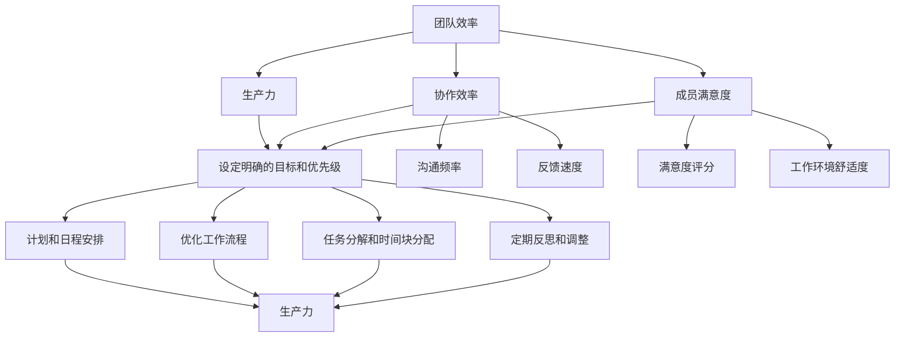

                 

## 文章标题

《团队效率：时间管理的集体应用》

关键词：团队效率、时间管理、集体应用、生产力、协作、目标设定

摘要：本文从团队效率的重要性出发，探讨了时间管理在集体应用中的关键作用。通过详细阐述团队效率的度量指标、时间管理的原则与方法、实战技巧、案例分析以及调研与评估方法，本文旨在为团队管理者提供一套系统的、实用的提升团队效率和有效管理时间的策略，以实现团队协作的优化和整体效能的提升。

## 引言与概述

在现代企业环境中，团队效率已成为企业竞争力和持续发展的核心因素。随着信息技术和全球化的发展，企业面临着更加复杂的市场环境和更快的变革速度。因此，如何提高团队效率，成为企业管理者和团队领导者亟待解决的问题。

### 1.1.1 团队效率的定义

团队效率是指团队在完成任务时所表现出来的生产力、协作和成员满意度等方面的综合表现。具体而言，它包括以下几个方面：

1. **生产力**：团队在单位时间内完成的工作量，反映了团队的工作速度和质量。
2. **协作**：团队成员之间的沟通、合作和共同完成任务的能力，体现了团队的整体配合和协作水平。
3. **成员满意度**：团队成员对工作的满意度和工作环境的舒适度，影响了团队成员的积极性和长期工作的稳定性。

### 1.1.2 时间管理的意义

时间管理是指通过合理规划和安排时间，以最大化利用时间和提高工作效率的一系列方法和技巧。对于团队来说，时间管理的意义主要体现在以下几个方面：

1. **提高生产力**：通过时间管理，团队成员能够更有效地利用时间，减少无效工作，从而提高整体的生产力。
2. **优化协作**：明确的时间安排和任务分配，有助于团队成员之间的协作和配合，提高团队的整体效率。
3. **提升成员满意度**：合理的时间管理能够减少工作压力，提高工作质量，从而提升团队成员的满意度。

### 1.2 团队效率与时间管理的现状分析

当前，许多企业在团队效率和时间管理方面仍存在诸多挑战：

#### 1.2.1 当前团队面临的挑战

1. **任务复杂度增加**：随着项目的复杂度增加，团队需要处理的信息和任务也相应增多，这对团队效率和协作提出了更高的要求。
2. **工作压力增大**：企业竞争加剧，团队成员面临的工作压力增大，这可能导致工作效率下降和团队成员的流失。
3. **沟通不畅**：团队成员之间的沟通不畅，可能导致任务误解和效率低下。

#### 1.2.2 时间管理的常见误区

1. **忽视优先级**：许多团队成员在处理任务时，容易忽视任务的优先级，导致重要任务无法及时完成。
2. **缺乏计划**：缺乏明确的计划和时间安排，团队成员可能感到无所适从，工作效率低下。
3. **过度依赖工具**：过度依赖时间管理工具，而忽视了人的因素，可能导致团队成员的工作压力增加。

综上所述，提高团队效率和有效进行时间管理对于企业的发展具有重要意义。接下来，本文将详细探讨团队效率的度量指标、时间管理的原则与方法、实战技巧以及案例分析等内容，以期为团队管理者提供实用的策略和方法。

## 核心概念

在深入探讨团队效率和时间管理的具体实践之前，有必要明确相关的核心概念和它们之间的联系。以下将介绍团队效率的度量指标、时间管理的原则与方法，并使用Mermaid流程图展示这些概念之间的关系。

### 2.1 团队效率的度量指标

团队效率的度量指标是评估团队表现的重要工具。以下是几个关键的度量指标：

1. **生产力**：衡量团队在单位时间内完成的工作量，通常以工作量（如任务数、代码行数等）为单位。
   - 公式：生产力 = 完成工作量 / 工作时间
   - **伪代码**：
     ```python
     productivity = completed_work / work_time
     ```

2. **协作效率**：衡量团队成员之间的协作效果，可以通过团队成员之间的沟通频率、反馈速度等指标来评估。
   - 公式：协作效率 = 有效沟通次数 / 沟通总次数
   - **伪代码**：
     ```python
     collaboration_efficiency = effective_communications / total_communications
     ```

3. **成员满意度**：衡量团队成员对工作的满意度和工作环境的舒适度，可以通过员工调查、满意度评分等方式来评估。
   - 公式：成员满意度 = 满意度评分 / 参与人数
   - **伪代码**：
     ```python
     member_satisfaction = average_satisfaction_score / number_of_participants
     ```

### 2.2 时间管理的原则与方法

时间管理的原则与方法是提高团队效率的基础。以下是几个关键的原则和方法：

1. **设定明确的目标和优先级**：明确团队和个人的目标，并根据优先级进行任务排序。
   - **伪代码**：
     ```python
     set_goals()
     sort_tasks_by_priority()
     ```

2. **计划和日程安排**：制定详细的计划和日程，确保团队成员了解自己的任务和时间安排。
   - **伪代码**：
     ```python
     create_plan()
     schedule_tasks()
     ```

3. **优化工作流程**：通过分析和优化工作流程，减少不必要的步骤和重复劳动，提高工作效率。
   - **伪代码**：
     ```python
     analyze_workflow()
     optimize_workflow()
     ```

4. **任务分解和时间块分配**：将大任务分解为小任务，并为每个任务分配特定的时间块，确保任务的有序完成。
   - **伪代码**：
     ```python
     decompose_task()
     allocate_time_blocks()
     ```

5. **定期反思和调整**：定期对时间管理进行反思和调整，以适应团队变化和需求。
   - **伪代码**：
     ```python
     reflect_on_time_management()
     adjust_management_plan()
     ```

### 2.3 核心概念之间的关系架构

使用Mermaid流程图来展示团队效率的度量指标、时间管理的原则与方法之间的关系，如下所示：



通过上述核心概念和关系的介绍，我们可以更好地理解团队效率和时间管理的重要性和具体实践方法。在接下来的章节中，我们将进一步探讨如何在实际操作中应用这些概念和方法，以提高团队效率和实现时间管理。

## 实战技巧

在了解了团队效率和时间管理的核心概念之后，接下来我们将探讨一些具体的实战技巧，这些技巧可以帮助团队成员在实际工作中提高效率，实现时间管理的优化。

### 3.1 提高团队效率的策略

#### 3.1.1 设定明确的目标与计划

明确的目标和详细的计划是提高团队效率的第一步。以下是几个关键步骤：

1. **明确团队目标**：首先，团队需要明确共同的目标和愿景，这有助于统一团队成员的方向和努力。

2. **分解目标**：将大目标分解为具体的、可操作的小目标，每个小目标都应该有明确的衡量标准。

3. **制定行动计划**：为每个小目标制定详细的行动计划，包括任务分配、时间节点和责任人。

4. **定期回顾和调整**：定期回顾计划执行情况，根据实际情况调整计划，确保目标的实现。

#### 3.1.2 优化工作流程与流程图

优化工作流程是提高团队效率的重要手段。以下是几个优化工作流程的步骤：

1. **分析当前流程**：详细分析当前的工作流程，找出存在的瓶颈和冗余步骤。

2. **设计改进方案**：设计改进方案，减少不必要的步骤，简化流程，提高效率。

3. **绘制流程图**：使用流程图工具（如Mermaid）绘制改进后的工作流程图，清晰展示每一步骤和责任人。

4. **实施与监控**：实施改进方案，并持续监控流程运行情况，及时调整和优化。

#### 3.1.3 提升团队协作与沟通

团队协作与沟通是提高团队效率的关键。以下是几个提升团队协作与沟通的技巧：

1. **建立有效的沟通渠道**：确保团队成员之间有畅通的沟通渠道，包括会议、邮件、即时通讯工具等。

2. **明确沟通规范**：制定明确的沟通规范，包括沟通频率、沟通内容和反馈机制。

3. **定期团队会议**：定期召开团队会议，讨论工作进展、解决问题和分享经验。

4. **鼓励开放沟通**：鼓励团队成员提出问题和建议，建立开放的沟通氛围，增强团队的凝聚力。

### 3.2 时间管理技巧

时间管理是提高个人和团队效率的关键。以下是几个实用的时间管理技巧：

#### 3.2.1 每日时间规划

1. **设置早晨任务**：每天早晨安排一些优先级较高的任务，有助于提升一天的工作效率。

2. **制定每日计划**：在每天结束时，为第二天制定一个详细的计划，包括任务、时间节点和优先级。

3. **优先级排序**：将任务按照重要性和紧急性进行排序，优先处理重要且紧急的任务。

#### 3.2.2 应对突发事件与干扰

1. **设立专注时间**：设置专注时间段，减少干扰，集中精力处理重要任务。

2. **使用番茄工作法**：将工作时间分为25分钟的工作周期和5分钟的休息时间，有助于提高专注度和工作效率。

3. **管理电子邮件和消息**：定期检查和回复电子邮件和即时消息，避免它们成为工作干扰。

#### 3.2.3 建立个人时间管理系统

1. **时间记录**：记录每天的工作时间，分析时间使用情况，找出可以优化的部分。

2. **时间日志**：定期制作时间日志，追踪时间使用情况，以改进时间管理。

3. **时间预算**：为每个任务分配时间预算，确保任务在预算内完成。

通过上述实战技巧，团队成员可以更好地管理自己的时间，提高工作效率，实现团队协作的优化。在下一部分，我们将通过案例分析，展示这些技巧在实际应用中的效果。

### 案例分析

在本部分，我们将通过几个实际案例，展示如何在实际工作中应用团队效率和时间管理的策略和技巧，并分析这些方法所带来的成效。

#### 4.1.1 案例一：如何提高团队的生产效率

**背景**：某互联网公司的一个开发团队在接手一个大型项目后，发现团队的生产效率低下，项目进度严重滞后。团队成员抱怨任务复杂，沟通不畅，压力增大。

**解决方案**：

1. **明确目标和计划**：团队首先明确了项目的最终目标，并将大目标分解为多个具体的小目标，制定了详细的行动计划。每个团队成员都清楚地知道自己的任务和时间节点。

2. **优化工作流程**：团队分析了当前的工作流程，发现多个冗余步骤和瓶颈。通过改进工作流程，减少了不必要的会议和审批流程，简化了任务执行步骤。

3. **提升团队协作**：团队建立了多种沟通渠道，如团队会议、即时通讯工具和邮件。明确沟通规范，确保信息传递及时、准确。定期召开团队会议，讨论工作进展和问题解决。

**成效**：经过一系列改进，团队的生产效率显著提高，项目进度恢复正常。团队成员的沟通变得更加顺畅，工作压力减轻，工作效率和满意度都有所提升。

#### 4.1.2 案例二：团队时间管理实践分享

**背景**：某科技公司的一个产品团队在研发一款新软件时，发现团队成员的工作时间分配不均，有些成员经常加班，而有些成员的工作时间相对较少。

**解决方案**：

1. **每日时间规划**：团队要求每个成员每天早晨制定一个详细的工作计划，包括任务、时间和优先级。这有助于团队成员更有效地安排时间，减少拖延。

2. **设立专注时间**：团队鼓励成员在工作时间设立专注时间段，减少外部干扰。使用番茄工作法，将工作时间划分为25分钟的工作周期和5分钟的休息时间，提高了成员的专注度和工作效率。

3. **时间日志和反馈**：团队要求成员每周记录自己的时间使用情况，并在团队会议上分享。通过分析时间日志，团队发现了可以优化的时间段和任务，并进行了调整。

**成效**：通过实施每日时间规划和专注时间段管理，团队成员的工作时间分配更加均衡，工作效率提升，团队成员的满意度和工作积极性也有所提高。

#### 4.1.3 案例三：时间管理的创新应用

**背景**：某创业团队在开发一个新型智能家居系统时，面临着技术复杂、任务繁多的挑战。团队意识到传统的时间管理方法已无法满足需求，需要创新的解决方案。

**解决方案**：

1. **敏捷开发方法**：团队采用了敏捷开发方法，将项目分为多个迭代，每个迭代都有明确的目标和交付成果。这种方法有助于团队更好地管理时间和任务，确保项目按计划推进。

2. **项目看板**：团队在办公室设置了项目看板，用可视化的方式展示任务状态和进度。每个团队成员都可以随时查看任务状态，确保任务透明化和管理高效化。

3. **利用工具**：团队使用了多种时间管理工具，如Trello、JIRA等，帮助团队跟踪任务、管理进度和协作。这些工具提供了良好的任务管理和协作平台，提高了团队的工作效率。

**成效**：通过敏捷开发和项目看板的应用，团队能够更好地掌控项目进度，任务管理更加高效。团队成员之间的协作更加紧密，项目按时交付，取得了良好的市场反响。

通过上述案例，我们可以看到，在实际工作中应用团队效率和时间管理的策略和技巧，能够显著提升团队的生产力和成员满意度。这些实践方法不仅适用于开发团队，也可以推广到其他类型的团队，帮助他们在复杂的业务环境中保持高效运作。

### 调研与评估

团队效率和时间管理的成功实施需要有效的评估和持续改进。本节将介绍团队效率与时间管理的评估方法，包括量化评估指标、质化评估方法以及综合评估体系，并探讨如何通过调研和实践来不断优化团队管理和提高工作效率。

#### 5.1.1 量化评估指标

量化评估指标是衡量团队效率和时间管理效果的重要工具。以下是几个常用的量化评估指标：

1. **生产力指标**：包括任务完成率、单位时间内完成的工作量、代码质量等。这些指标可以直接反映团队的工作效率和成果。

   - **任务完成率**：
     $$ \text{任务完成率} = \frac{\text{已完成的任务数}}{\text{总任务数}} \times 100\% $$
   - **单位时间内完成的工作量**：
     $$ \text{单位时间内完成的工作量} = \frac{\text{总工作量}}{\text{总工作时间}} $$

2. **协作效率指标**：包括沟通频率、反馈速度、团队协作得分等。这些指标可以衡量团队成员之间的协作效果。

   - **沟通频率**：
     $$ \text{沟通频率} = \frac{\text{沟通总次数}}{\text{总天数}} $$
   - **反馈速度**：
     $$ \text{反馈速度} = \frac{\text{平均反馈时间}}{\text{总反馈次数}} $$

3. **成员满意度指标**：包括员工满意度调查得分、员工流失率等。这些指标反映了团队成员对工作环境和团队管理的满意度。

   - **员工满意度调查得分**：
     $$ \text{员工满意度调查得分} = \frac{\sum \text{满意度评分}}{\text{调查人数}} $$

#### 5.1.2 质化评估方法

质化评估方法通过定性分析来了解团队成员的工作体验和反馈，从而发现潜在的问题和改进机会。以下是几种常用的质化评估方法：

1. **员工访谈**：通过与团队成员进行一对一访谈，深入了解他们的工作状态、困难和需求。

2. **团队会议**：定期召开团队会议，讨论工作中的问题和改进措施，促进团队成员之间的沟通和协作。

3. **工作日志**：鼓励团队成员记录自己的工作日志，分析工作中的亮点和问题，为团队管理提供参考。

4. **问卷调查**：设计详细的问卷调查，收集团队成员对工作效率、时间管理、团队协作等方面的反馈。

#### 5.1.3 综合评估体系

综合评估体系是将量化评估指标和质化评估方法相结合，形成一个全面的评估体系，以更准确地衡量团队效率和时间管理的效果。以下是构建综合评估体系的基本步骤：

1. **确定评估维度**：根据团队的具体情况，确定需要评估的维度，如生产力、协作效率、成员满意度等。

2. **制定评估标准**：为每个评估维度制定明确的评估标准，确保评估的客观性和一致性。

3. **数据收集**：通过量化指标和质化评估方法，收集相关数据，包括定量数据和定性数据。

4. **数据分析**：对收集的数据进行分析，识别优势和劣势，发现潜在的问题和改进机会。

5. **报告与反馈**：撰写评估报告，向团队成员和管理层反馈评估结果，提出改进建议。

#### 5.2 调研与实践

为了确保团队效率和时间管理的持续改进，需要进行系统的调研和实践。以下是几个关键步骤：

1. **调研问卷设计**：设计详细的调研问卷，包括定量和定性问题，以全面了解团队成员的工作体验和反馈。

2. **数据收集与处理**：通过问卷调查、访谈等方式收集数据，并对数据进行整理和分析。

3. **实践反馈与改进**：根据调研结果，制定具体的改进措施，并在实践中进行验证。定期收集反馈，不断调整和优化改进措施。

通过上述调研和实践，团队可以更好地了解自身的工作状态，发现问题，提出解决方案，并持续改进，从而实现团队效率和时间管理的优化。

### 总结与展望

在本文中，我们详细探讨了团队效率的重要性以及时间管理在集体应用中的关键作用。通过核心概念的阐述、实战技巧的介绍和实际案例的分析，我们展示了如何通过有效的策略和方法提升团队效率，实现时间管理的优化。

#### 6.1.1 团队效率与时间管理的关键要点

1. **明确目标和优先级**：设定清晰的目标，并根据优先级制定详细的计划。
2. **优化工作流程**：分析并改进工作流程，减少冗余步骤，提高效率。
3. **提升团队协作**：建立有效的沟通渠道，明确沟通规范，促进团队成员之间的协作。
4. **时间管理技巧**：运用每日时间规划、专注时间段管理、任务分解等方法，提高工作效率。
5. **持续评估与改进**：定期进行团队效率和时间的评估，通过调研和实践不断优化管理策略。

#### 6.1.2 未来的发展趋势与挑战

未来，团队效率和时间管理将继续受到广泛关注，发展趋势包括：

1. **数字化管理工具**：随着技术的进步，数字化工具将在团队管理和时间管理中发挥更大作用，如人工智能、大数据分析等。
2. **个性化时间管理**：团队和个人将更加注重个性化时间管理，以满足不同工作需求和生活方式。
3. **灵活性工作安排**：远程工作和灵活性工作安排的增加，要求团队管理者和成员适应新的工作模式。

然而，也面临着以下挑战：

1. **信息过载**：随着信息的增多，团队成员需要学会如何筛选和处理重要信息，避免信息过载。
2. **跨文化协作**：全球化背景下的跨文化协作，要求团队成员具备更强的沟通能力和文化敏感性。
3. **工作与生活的平衡**：如何在提高工作效率的同时，保持工作与生活的平衡，是企业和员工共同面临的挑战。

为了应对这些挑战，团队管理者和成员需要不断学习新的管理方法和技术，提高自身的综合素质，以适应不断变化的工作环境。

### 6.2 推荐阅读与资源

为了进一步深入了解团队效率和时间管理的理论和实践，以下推荐一些相关的书籍、在线课程和资源：

1. **书籍推荐**：
   - 《深度工作》：Cal Newport
   - 《时间管理器》：David Allen
   - 《团队协作的艺术》：Lencioni, Patrick

2. **在线课程推荐**：
   - Coursera上的《团队协作与管理》课程
   - edX上的《时间管理》课程
   - LinkedIn Learning上的《高效团队管理》课程

3. **资源推荐**：
   - Trello：项目管理工具
   - JIRA：敏捷开发工具
   - Asana：团队协作工具

通过这些资源和书籍的学习，读者可以进一步提升自己在团队效率和时间管理方面的知识和技能，为团队的成功和个人的发展奠定坚实基础。

### 附录

#### 附录A：团队效率与时间管理工具清单

1. **项目管理工具**：
   - Trello
   - JIRA
   - Asana
   - Notion

2. **时间管理工具**：
   - Todoist
   - RescueTime
   - pomodoro Timer
   - Google Calendar

3. **协作工具**：
   - Slack
   - Microsoft Teams
   - Zoom
   - Google Meet

#### 附录B：常用时间管理技巧与策略

1. **每日时间规划**：
   - 每天早晨制定计划，明确任务和时间节点。
   - 按优先级排序任务，确保重要任务优先处理。

2. **专注时间段管理**：
   - 设定专注时间段，减少干扰。
   - 使用番茄工作法，提高专注度和工作效率。

3. **任务分解**：
   - 将大任务分解为小任务，逐步完成。
   - 为每个任务分配具体的时间和责任人。

4. **定期反思与调整**：
   - 定期回顾时间管理情况，发现问题和改进点。
   - 根据实际情况调整计划，确保目标的实现。

#### 附录C：团队效率管理调研问卷模板

1. **个人基本信息**：
   - 姓名
   - 部门
   - 职位

2. **工作情况**：
   - 工作负荷：您认为当前的工作负荷是多少？（1-5分）
   - 沟通频率：您每天与同事沟通的频率是多少？（1-5分）

3. **团队协作**：
   - 团队协作效果：您认为团队的协作效果如何？（1-5分）
   - 沟通工具满意度：您对当前使用的沟通工具的满意度如何？（1-5分）

4. **时间管理**：
   - 时间规划：您是否每天制定详细的工作计划？（是/否）
   - 时间效率：您认为自己的时间管理效率如何？（1-5分）

5. **满意度**：
   - 工作满意度：您对目前的工作满意度如何？（1-5分）
   - 工作环境满意度：您对当前的工作环境满意度如何？（1-5分）

6. **建议与反馈**：
   - 请提出您对团队效率和时间管理的一些建议和反馈。

通过这些附录内容，读者可以更全面地了解团队效率与时间管理的相关工具、技巧和调研方法，为实际应用提供参考和指导。

### 作者信息

作者：AI天才研究院/AI Genius Institute & 禅与计算机程序设计艺术/Zen And The Art of Computer Programming

AI天才研究院致力于推动人工智能技术的发展和应用，专注于为企业和个人提供最前沿的技术解决方案和培训服务。同时，禅与计算机程序设计艺术作为一部经典计算机科学著作，为读者揭示了编程的深度和哲学智慧。本文作者凭借丰富的实践经验和深厚的理论基础，为读者带来了一篇全面深入探讨团队效率和时间管理的技术博客文章。希望本文能对您在团队管理和时间管理方面有所启发和帮助。

