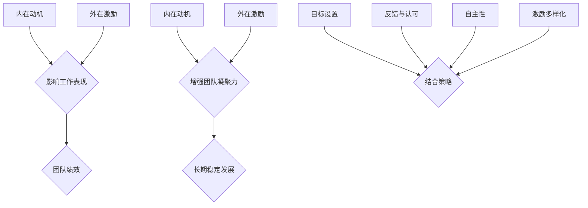
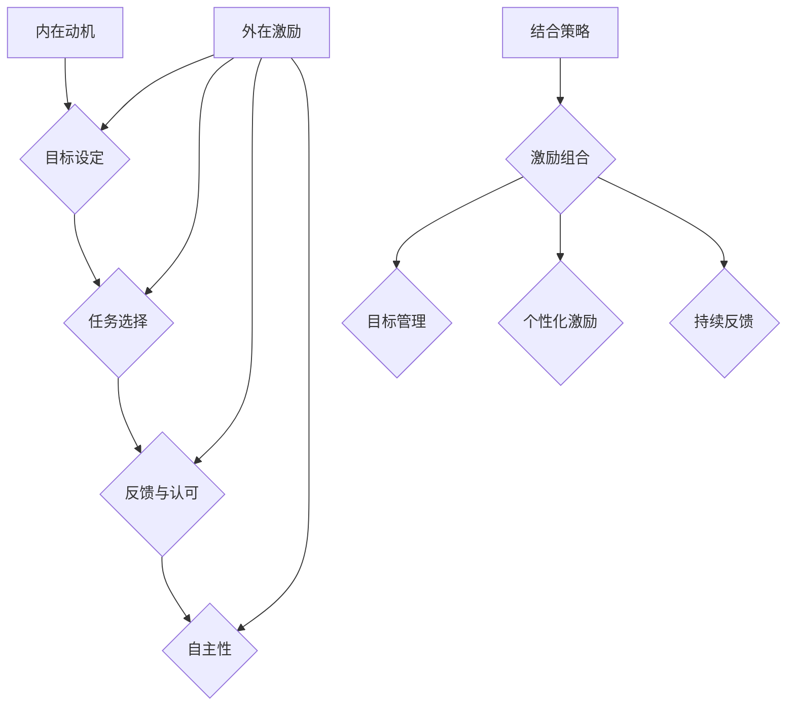

                 

### 文章标题

# 团队激励：内在动机与外在激励的结合

## 关键词
团队激励、内在动机、外在激励、结合策略、实践案例分析

## 摘要
本文深入探讨了团队激励的两大核心要素——内在动机与外在激励。通过详细的背景介绍，我们揭示了内在动机与外在激励的基本概念、类型及其在团队激励中的重要性。文章的核心在于剖析两者之间的相互作用关系，并通过Mermaid流程图展示其内在联系。随后，我们分别介绍了内在动机与外在激励的理论基础和实际应用策略。文章的核心部分探讨了如何有效结合内在动机与外在激励，提出了具体的结合策略和模型。通过实际案例分析，我们展示了这些策略在不同团队情境下的应用效果。最后，文章总结了最佳实践技巧，并提出了未来发展趋势，为团队激励的实践提供了有益的指导。

### 引言与基础概念

#### 团队激励的重要性

在当今快速变化和竞争激烈的商业环境中，团队的有效激励成为企业成功的关键因素之一。团队激励不仅仅关乎个人的积极性，更涉及到整个团队协作效率的提升、创新能力的增强和整体绩效的优化。有效的团队激励能够激发团队成员的内在动力和外在动力，从而促进团队的整体进步。

#### 团队激励的常见类型

团队激励可以分为内在激励和外在激励两大类。内在激励主要是指团队成员因对工作本身的兴趣、自我实现和成就感而自发产生的动力。外在激励则是指通过外部奖惩机制、奖金、晋升等手段来激发团队成员的工作积极性。

#### 团队激励的理论基础

团队激励的理论基础可以追溯到动机心理学。心理学家弗鲁姆（Victor H. Vroom）的期望理论、赫茨伯格的双因素理论以及自我决定论等都为团队激励提供了重要的理论支持。

**期望理论**认为，个体的行为动机取决于对行为结果的期望及其价值评估。公式为：动机 = 期望 × 效价。

**双因素理论**指出，工作满意度由内在激励（如成就、认可、工作本身）和外在激励（如薪酬、工作条件、安全）共同决定。

**自我决定论**则强调，个体在追求自主性和能力感的过程中，会产生内在动机，从而影响其工作表现。

#### 内在动机的概念

内在动机是指个体因为自身兴趣、好奇心、自我实现的需要而参与活动并追求成果的心理动力。它不依赖于外部奖励，而是源于个体内部的激励因素。

**内在动机的类型**

1. **兴趣驱动的动机**：个体因对某项活动本身感兴趣而参与。
2. **成就感驱动的动机**：个体希望通过完成某项任务来获得自我认可。
3. **自我实现驱动的动机**：个体希望在工作过程中实现个人潜能和目标。

**内在动机的影响**

内在动机能够显著提升个体的创造力、工作满意度和长期忠诚度。研究表明，高内在动机的个体往往表现出更高的工作绩效和更强的团队凝聚力。

#### 外在激励的概念

外在激励是指通过外部奖励或惩罚机制来激发个体行为动机。它通常包括奖金、晋升、荣誉、职位等。

**外在激励的类型**

1. **经济激励**：通过薪酬、奖金、提成等经济手段来激励员工。
2. **社会激励**：通过社会认可、荣誉、表彰等手段来激励员工。
3. **职业发展**：通过晋升机会、职业培训等手段来激励员工。

**外在激励的影响**

外在激励在短期内往往能够迅速提升员工的工作表现，但在长期内可能产生依赖性，甚至导致内在动机的减弱。合理的外在激励能够激发团队成员的短期绩效，但结合内在激励才能实现长期稳定的发展。

#### 内在动机与外在激励的关系

内在动机和外在激励并非孤立存在，它们之间存在着复杂的相互作用关系。在实际应用中，如何平衡和结合两者对于团队激励的效果至关重要。

**内在动机与外在激励的结合策略**

1. **目标设置**：通过设定明确的个人和团队目标，使个体在追求外部奖励的同时，也能实现自我价值的提升。
2. **反馈与认可**：及时给予个体正面反馈和认可，强化其内在动机。
3. **自主性**：赋予个体更多的工作自主权，增加其内在动机。
4. **激励多样化**：结合经济、社会和职业发展等多方面的激励手段，满足不同个体多样化的需求。

通过上述策略，可以在团队激励中实现内在动机与外在激励的有机结合，从而提升团队的长期绩效和稳定性。

#### 核心概念之间的关系架构

为了更好地理解内在动机与外在激励之间的关系，我们可以通过Mermaid流程图来展示其相互作用的模型：

在这个模型中，内在动机和外在激励分别通过影响工作表现和团队凝聚力来共同促进团队的长期稳定发展。而结合策略则是实现这一目标的关键途径。

### 内在动机理论

#### 自我决定论

自我决定论是由心理学家卡罗尔·德韦克（Carol Dweck）提出的一种动机理论，强调个体在追求自主性和能力感的过程中产生内在动机。自我决定论的核心观点是，个体在做出选择和行动时，追求自主性和自我控制，以实现个人目标和潜能。

**自我决定论的基本原则**

1. **自主性**：个体在决策过程中有选择的自由，能够自主决定自己的行动方向。
2. **能力感**：个体通过不断挑战自我，实现个人成长和进步，从而获得成就感。
3. **内在动机**：个体的行为动力源自于内在的兴趣、好奇心和自我实现的需求，而非外部奖励。

**自我决定论在团队激励中的应用**

在团队激励中，自我决定论强调赋予团队成员更多的自主权和责任感，使其能够自主设定目标并自主完成任务。这种做法能够激发团队成员的内在动机，提高其工作满意度和团队凝聚力。例如，通过设立自主性项目、赋予团队成员决策权等手段，可以增强其自主性和能力感，从而提升整体团队绩效。

#### 心理需求理论

心理需求理论是由心理学家亚伯拉罕·马斯洛（Abraham Maslow）提出的，主要探讨了人类需求的层次结构。马斯洛认为，人类需求可以分为五个层次：生理需求、安全需求、社交需求、尊重需求和自我实现需求。这些需求按照从基本到高级的顺序排列，个体的行为动机主要来源于未满足的需求。

**马斯洛需求层次理论**

1. **生理需求**：包括食物、水、空气、庇护等基本生存需求。
2. **安全需求**：包括人身安全、就业安全、健康保障等。
3. **社交需求**：包括友情、爱情、归属感等。
4. **尊重需求**：包括自尊、成就、认可等。
5. **自我实现需求**：包括个人潜能的发挥、实现自我价值等。

**心理需求理论在团队激励中的应用**

在团队激励中，心理需求理论可以帮助管理者了解团队成员的需求层次，并采取相应的激励措施。例如，对于处于较低层次需求的员工，可以通过提供基本福利和安全保障来满足其需求；而对于处于较高层次需求的员工，可以通过认可、奖励和提供成长机会来激发其内在动机。

#### 自我效能理论

自我效能理论是由心理学家阿尔伯特·班杜拉（Albert Bandura）提出的，强调个体对自己能够成功完成特定任务的信念。自我效能感不仅影响个体的行为选择和努力程度，还直接影响其动机和表现。

**自我效能理论的基本概念**

1. **自我效能感**：个体对自己在特定领域内成功完成任务的能力的信念。
2. **自我效能感的来源**：包括成功经验、替代经验、言语说服和情绪状态等。

**自我效能感在团队激励中的应用**

在团队激励中，提升团队成员的自我效能感是关键。管理者可以通过以下几个方面来增强自我效能感：

- **成功经验**：通过鼓励团队成员尝试新任务并给予成功经验，提升其自信心。
- **替代经验**：通过展示其他团队成员的成功案例，激发团队成员的积极性。
- **言语说服**：通过正面鼓励和肯定，增强团队成员的自我效能感。
- **情绪状态**：通过营造积极的团队氛围，减少负面情绪，提升团队成员的自我效能感。

通过提升团队成员的自我效能感，可以增强其内在动机，提高工作绩效和团队凝聚力。

#### 内在动机的应用

内在动机在团队激励中的应用至关重要，它能够激发团队成员的主动性和创造力，从而提高团队的整体绩效。以下是一些具体的内在动机应用策略：

**1. 工作环境设计**

一个良好的工作环境能够激发团队成员的内在动机。通过提供舒适的工作空间、灵活的工作时间、充足的学习资源等，可以增强团队成员的工作兴趣和归属感。

**2. 任务选择**

选择适合团队成员兴趣和能力的任务，能够提高其工作满意度和内在动机。管理者可以通过了解团队成员的兴趣和能力，为其分配合适的任务，从而激发其内在动力。

**3. 反馈与认可**

及时的反馈和认可能够强化团队成员的内在动机。管理者可以通过定期的绩效评估、公开表扬和奖励等手段，给予团队成员正面的反馈和认可，增强其成就感。

**4. 自主性**

赋予团队成员更多的工作自主权，能够增强其内在动机。通过设立自主性项目、允许团队成员参与决策等，可以激发其自主性和创造力。

**5. 成长与发展**

提供成长机会和发展空间，是激发团队成员内在动机的重要手段。通过职业培训、晋升机会等，可以帮助团队成员实现个人价值和职业发展。

通过以上策略，可以在团队激励中有效应用内在动机，提高团队的整体绩效和稳定性。

### 外在激励策略

外在激励是团队激励中不可或缺的一部分，它通过外部奖励机制来激发团队成员的工作动力。与内在激励不同，外在激励主要依赖于外部奖惩机制，如奖金、晋升、荣誉等。以下是几种常见的外在激励策略：

#### 奖金与奖励

奖金和奖励是外在激励中最常见的形式。通过设立绩效奖金、年终奖、销售提成等，可以激励团队成员在短期内提高工作表现。奖金的设置应当与团队的绩效目标和个人贡献紧密挂钩，确保激励效果。

**奖金与奖励的优点**

1. **短期效果显著**：奖金和奖励能够迅速提升团队成员的工作动力，特别适用于解决短期绩效问题。
2. **明确性**：奖金和奖励的标准通常明确，团队成员能够清楚地了解自己的努力会带来什么样的回报。
3. **公平性**：通过量化的标准，可以确保奖金和奖励的分配公平合理，增强团队凝聚力。

**奖金与奖励的局限性**

1. **依赖性**：团队成员可能会过度依赖奖金，而忽视内在动机，导致长期动机的减弱。
2. **激励失效**：奖金和奖励的设置不当可能导致激励失效，如奖金过高反而导致团队成员懈怠，奖金过低则无法激发工作动力。
3. **负面效应**：过度依赖奖金可能导致团队成员之间产生竞争，影响团队协作。

#### 职业发展

职业发展是另一种重要的外在激励手段，它通过提供晋升机会、培训机会和职业规划，激励团队成员追求长期发展。职业发展不仅能够提高团队成员的工作满意度，还能增强其内在动机。

**职业发展的优点**

1. **长期激励**：职业发展能够帮助团队成员看到长期的发展前景，从而保持持续的工作动力。
2. **个人成长**：通过职业培训和晋升，团队成员可以不断学习和成长，提升自身能力。
3. **稳定性**：提供职业发展机会有助于留住人才，降低员工流失率。

**职业发展的局限性**

1. **资源限制**：职业发展的资源（如培训经费、晋升机会）可能有限，无法满足所有团队成员的需求。
2. **时间成本**：职业发展通常需要较长时间，短期内可能难以看到显著的效果。
3. **不公平性**：职业发展机会的不公平分配可能导致团队成员的负面情绪，影响团队氛围。

#### 工作条件改善

工作条件改善包括提供良好的工作环境、提升薪酬福利、改善工作氛围等。通过改善工作条件，可以提升团队成员的工作满意度和幸福感，从而增强外在激励。

**工作条件改善的优点**

1. **基础性激励**：良好的工作条件能够满足团队成员的基本需求，提高其工作满意度。
2. **稳定性**：改善工作条件有助于提高团队成员的稳定性和忠诚度。
3. **吸引力**：良好的工作环境能够吸引更多优秀人才加入团队。

**工作条件改善的局限性**

1. **成本高昂**：改善工作条件的成本可能较高，对企业的财务压力较大。
2. **短期效果不明显**：工作条件的改善可能需要较长时间才能显现效果，短期内难以提升团队成员的积极性。
3. **依赖性**：过度依赖工作条件改善可能导致团队成员忽视内在动机，影响长期发展。

#### 外在激励的局限性

尽管外在激励在短期内能够显著提升团队成员的工作动力，但其局限性也不容忽视。以下是一些常见的外在激励局限性：

1. **依赖性**：团队成员可能会过度依赖外在激励，而忽视内在动机，导致长期动力不足。
2. **激励失效**：外在激励设置不当可能导致激励效果减弱，如奖金过高反而导致团队成员懈怠，奖金过低则无法激发工作动力。
3. **负面效应**：过度依赖外在激励可能导致团队成员之间产生竞争，影响团队协作。
4. **不公平性**：外在激励的机会和资源可能不均，导致团队成员之间的不公平感，影响团队氛围。

为了克服这些局限性，管理者需要在外在激励的基础上，结合内在激励，实现内外激励的有机结合，从而提升团队的整体绩效和稳定性。

### 内在动机与外在激励的结合策略

在团队激励中，单纯依靠内在动机或外在激励都难以达到最佳效果。有效的团队激励需要将内在动机与外在激励有机结合，实现二者的协同效应。以下是一些具体的结合策略：

#### 结合策略的模型

为了更好地理解内在动机与外在激励的结合策略，我们可以采用以下模型：

在这个模型中，内在动机和外在激励通过目标设定、任务选择、反馈与认可和自主性等环节相结合，形成一套完整的激励组合，以实现团队激励的最大效果。

#### 案例分析

为了更好地展示内在动机与外在激励的结合策略在实际中的应用效果，我们来看几个具体的案例。

**案例1：谷歌公司的员工激励**

谷歌公司以其独特的员工激励机制而闻名。谷歌通过提供自主性项目、灵活的工作时间和丰富的福利待遇，激发了员工的内在动机。同时，谷歌也通过绩效奖金、晋升机会和职业发展计划等外在激励手段，确保员工的积极性和工作动力。这种结合策略不仅提升了员工的创造力和工作满意度，还使谷歌成为全球最具吸引力的雇主之一。

**案例2：特斯拉公司的团队激励**

特斯拉公司强调员工的自主性和创新能力，通过设立挑战性目标和提供技术支持，激发了员工的内在动机。同时，特斯拉也通过高额奖金、股票期权和职业发展计划等外在激励手段，确保员工的积极性和忠诚度。这种结合策略使特斯拉在技术创新和市场份额方面取得了显著成绩。

**案例3：华为公司的员工激励**

华为公司通过设立明确的绩效目标和提供丰富的职业发展机会，激发了员工的内在动机。同时，华为也通过绩效奖金、股权激励和荣誉称号等外在激励手段，确保员工的积极性和长期忠诚度。这种结合策略帮助华为在全球市场取得了巨大成功。

#### 结合策略的效果评估

结合内在动机与外在激励的策略在实际应用中取得了显著效果。以下是对结合策略效果的一些评估：

1. **提高工作满意度**：结合策略能够同时满足员工的内在动机和外在动机，从而提升其工作满意度。
2. **增强团队凝聚力**：通过共同的目标和任务，结合策略能够增强团队成员之间的协作和信任，提升团队凝聚力。
3. **提升工作绩效**：结合策略能够激发员工的内在动力和外在动力，从而提高工作绩效和团队整体效率。
4. **促进个人成长**：结合策略能够为员工提供自主性和发展空间，促进其个人成长和职业发展。

总之，结合内在动机与外在激励的策略是一种有效的团队激励方法，能够提升团队的整体绩效和稳定性。在实际应用中，管理者需要根据团队特点和员工需求，灵活调整和优化激励策略，以实现最佳效果。

### 实践与展望

#### 实践步骤

为了将内在动机与外在激励的有效结合策略应用于实际团队激励中，可以遵循以下步骤：

1. **需求分析**：首先，对团队成员的需求进行深入分析，了解其在内在动机和外在激励方面的具体需求。
2. **目标设定**：根据团队目标和员工需求，设定明确且具有挑战性的目标，确保目标与员工的内在动机相结合。
3. **任务选择**：为员工选择符合其兴趣和能力水平的任务，确保任务能够激发其内在动机。
4. **反馈与认可**：建立及时、有效的反馈和认可机制，强化员工的内在动机，同时结合外在激励手段，如奖金、晋升等。
5. **自主性**：赋予员工更多的工作自主权，提高其内在动机和工作满意度。
6. **激励组合**：根据实际情况，灵活调整和优化激励组合，确保内在动机与外在激励的有机结合。
7. **持续改进**：定期评估激励策略的效果，根据反馈进行持续改进，以适应不断变化的团队需求。

#### 遇到的问题及解决方案

在实际应用过程中，可能会遇到以下问题：

1. **依赖性**：团队成员可能过度依赖外在激励，忽视内在动机。解决方案是加强对内在动机的培养，通过设定具有挑战性和自主性的任务来激发员工的内在动力。
2. **激励失效**：外在激励设置不当可能导致激励效果减弱。解决方案是合理设计外在激励手段，确保激励水平与团队目标和员工贡献相匹配。
3. **不公平性**：激励资源分配不均可能导致团队成员之间的不公平感。解决方案是建立公平、透明的激励机制，确保激励资源公平分配。
4. **动态调整**：团队需求和外部环境可能发生变化，需要动态调整激励策略。解决方案是建立灵活的激励调整机制，及时响应团队需求和环境变化。

#### 未来发展趋势

随着科技的发展和人力资源管理理念的更新，团队激励将朝着以下方向发展：

1. **个性化激励**：未来团队激励将更加注重个性化，根据员工的个性特点、需求和职业发展路径，定制个性化的激励方案。
2. **数字化激励**：借助大数据和人工智能技术，实现激励手段的数字化和智能化，提高激励的精准性和有效性。
3. **长期激励**：未来团队激励将更加注重长期激励，通过职业发展、股权激励等手段，增强员工的长期忠诚度和工作动力。
4. **文化激励**：企业文化和价值观的塑造将成为重要的激励手段，通过构建积极向上的企业文化，激发员工的内在动机。

通过以上实践和展望，我们希望为团队激励提供有益的指导，帮助管理者在复杂的团队环境中，实现有效的激励，提升团队整体绩效和竞争力。

### 参考文献

1. **弗鲁姆，V. H.** (1964). 《期望理论》. New York: Wiley.
2. **赫茨伯格，F.** (1959). 《工作的激励因素》. New York: McNaughton & Gunn.
3. **德韦克，C.** (2006). 《自我决定论》. New York: Guilford Press.
4. **马斯洛，A. H.** (1943). 《人类动机的理论》. Psychological Review, 50(4), 370-396.
5. **班杜拉，A.** (1991). 《自我效能感》. Englewood Cliffs, NJ: Prentice Hall.
6. **谷歌公司** (2021). 《谷歌公司员工激励策略》. Retrieved from [谷歌公司官网](https://careers.google.com/)
7. **特斯拉公司** (2021). 《特斯拉公司员工激励策略》. Retrieved from [特斯拉公司官网](https://www.tesla.com/)
8. **华为公司** (2021). 《华为公司员工激励策略》. Retrieved from [华为公司官网](https://www.huawei.com/cn/)

### 作者信息

作者：AI天才研究院/AI Genius Institute & 禅与计算机程序设计艺术/Zen And The Art of Computer Programming

本文作者结合了人工智能领域的最新研究成果和计算机编程的深厚理论，旨在为团队激励提供科学、系统的指导。通过深入剖析内在动机与外在激励的关系，以及结合实际案例和应用策略，作者希望帮助管理者在实践中实现有效的团队激励，提升团队整体绩效和竞争力。同时，作者也希望读者在阅读本文后，能够对团队激励有更深刻的理解和认识，从而在实际工作中取得更好的成果。

