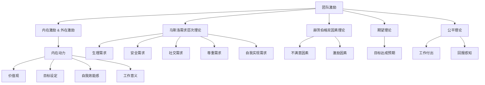

                 

### 背景介绍

在现代企业中，团队激励作为一种关键的管理手段，正日益受到重视。有效的团队激励不仅能提升员工的工作满意度和忠诚度，还能显著提高团队的凝聚力和工作效率。然而，实现团队激励并非易事，这需要深刻理解内在动力和外在激励的原理，并运用科学的激励理论来指导实践。

本文旨在探讨团队激励的各个方面，从核心概念到实际操作，提供一套系统化的思路和方法。首先，我们将介绍团队激励的定义、重要性以及面临的挑战与机遇。接着，本文将深入探讨内在动力的原理和应用，解释如何激发团队成员的内在动力。随后，我们将对比和分析几种主要的激励理论，探讨如何设计有效的团队激励策略。

在团队激励策略部分，我们将详细讨论激励目标的确定、激励方式的选择、激励计划的制定与实施，并提供评估激励效果的实用方法。为了更好地理解团队激励的实际应用，我们将通过案例研究展示成功的企业团队激励实践，并分享项目实战的经验和成果。

最后，本文将探讨团队激励的未来趋势，特别是科技发展对团队激励的影响，以及新兴激励方式的应用。通过本文的阅读，读者将获得全面而深入的团队激励知识，为提升团队绩效和激发员工潜力提供有力支持。

### 核心概念与联系

在探讨团队激励之前，我们需要了解几个关键概念，并阐述它们之间的联系。首先，什么是团队激励？团队激励是指通过各种手段激发团队成员的工作热情和积极性，以提高团队整体绩效和成员的满意度。激励可以分为内在激励和外在激励，内在激励源于个人内心的动力，如成就感、自我实现和责任感，而外在激励则包括物质奖励、晋升机会和荣誉表彰等。

内在动力是一个核心概念，它指的是驱动个人主动工作、不断进步的内在心理状态。内在动力的影响因素包括个人价值观、目标设定、自我效能感和工作意义。这些因素相互作用，共同影响一个人的工作态度和行为。

激励理论为我们提供了理解和设计激励措施的科学基础。马斯洛需求层次理论将人类需求从低到高分为生理需求、安全需求、社交需求、尊重需求和自我实现需求。赫茨伯格的双因素理论区分了导致员工不满意和满意的工作因素，前者称为“不满意因素”，后者称为“激励因素”。期望理论则强调个人对目标达成后的奖励价值的预期，而公平理论探讨员工对工作付出与回报的公平感。

这些理论之间的联系在于，它们共同揭示了影响员工动机和行为的多种因素。马斯洛需求层次理论为我们理解员工的基本需求提供了框架，而赫茨伯格的双因素理论则强调了满足这些需求的具体途径。期望理论强调了目标设定和奖励机制的重要性，公平理论则帮助我们评估激励措施的公平性。

为了更好地理解这些概念之间的联系，我们可以使用Mermaid流程图来展示它们之间的关系：

通过这个流程图，我们可以清晰地看到团队激励、内在动力和激励理论之间的相互关系，这为我们设计有效的团队激励策略提供了理论支持。

### 内在动力的原理与应用

内在动力是驱动员工自发投入工作、追求卓越的关键因素。它源于个人内心的驱动力，如成就感、自我实现和责任感，而与外在奖励（如薪酬和奖金）无关。了解内在动力的原理，并学会如何激发团队成员的内在动力，是团队激励的重要一环。

#### 内在动力的定义与特征

内在动力是指个人在没有外部压力或奖励的情况下，出于自身兴趣、愿望或内在需求而进行某项活动的心理状态。其特征包括：

1. **自主性**：员工自发地参与工作，不受外部命令或约束的影响。
2. **兴趣导向**：员工对工作内容本身感兴趣，愿意投入时间和精力。
3. **持久性**：内在动力能够持续驱动员工，即使面临挑战和困难，员工也能保持积极态度。
4. **创造性**：内在动力激发员工的创造力，使其在工作中不断探索新方法，提升工作效率。

#### 内在动力的影响因素

内在动力的产生受到多种因素的影响，主要包括：

1. **自我效能感**：个人对自己完成任务的信心和能力感知。自我效能感高的员工更可能具备内在动力。
2. **目标设定**：明确、可实现的个人目标能够激发员工的内在动力，使其在工作中保持方向感。
3. **工作意义**：员工对工作价值的认同感，工作对他们个人成长的贡献，以及对社会和组织的贡献。
4. **价值观**：员工的个人价值观与工作目标的匹配程度，价值观一致能够增强内在动力。

#### 如何激发团队成员的内在动力

为了激发团队成员的内在动力，管理者可以采取以下措施：

1. **明确工作意义**：与团队成员讨论工作对社会和组织的贡献，帮助其理解工作的重要性，从而增强内在动力。
2. **提供成长机会**：为员工提供学习和发展机会，支持其职业成长，增强自我效能感。
3. **设定合理目标**：设定明确、可实现的短期和长期目标，帮助员工保持工作动力和方向感。
4. **鼓励自主性**：赋予员工一定的自主权，使其在完成任务时能够自主决策，增强工作的兴趣和成就感。
5. **建立激励机制**：除了物质奖励外，还可以通过表彰、认可和职业发展等非物质激励手段，激发员工的内在动力。

通过以上措施，管理者可以有效地激发团队成员的内在动力，提升团队的整体绩效和工作满意度。

### 激励理论的对比与应用

激励理论在团队管理中扮演着重要角色，帮助管理者理解员工的动机和行为，从而设计出有效的激励策略。以下是几种主要的激励理论及其应用。

#### 马斯洛需求层次理论

马斯洛需求层次理论由美国心理学家亚伯拉罕·马斯洛提出，该理论将人类需求从低到高分为五个层次：生理需求、安全需求、社交需求、尊重需求和自我实现需求。管理者可以根据员工的不同需求层次，提供相应的激励措施。

1. **生理需求**：包括食物、水、休息等基本生理需求。这些需求可以通过提供合理的薪酬和福利来满足。
2. **安全需求**：包括安全感、健康保障和职业稳定性。管理者可以通过提供稳定的职业环境和完善的福利制度来满足这一层次的需求。
3. **社交需求**：包括友谊、归属感和社会认同。管理者可以通过团队建设活动和建立良好的人际关系来满足这一需求。
4. **尊重需求**：包括自尊、成就和认可。管理者可以通过表彰、晋升和职业发展机会来满足这一层次的需求。
5. **自我实现需求**：包括个人潜力的发挥和自我价值的实现。管理者可以通过提供挑战性的工作任务和职业发展路径来满足这一需求。

#### 赫茨伯格双因素理论

弗雷德里克·赫茨伯格提出的双因素理论将影响员工满意度的因素分为两类：不满意因素和激励因素。

1. **不满意因素**：包括工作环境、公司政策、管理方式等，这些问题如果处理不当，会导致员工不满意，但解决这些问题并不能直接提升满意度。
2. **激励因素**：包括成就、认可、工作本身和责任等，这些因素能够直接提升员工的工作满意度和内在动力。

管理者应关注激励因素，通过提供具有挑战性、有意义的工作任务，以及及时认可和奖励，来提升员工的工作满意度和绩效。

#### 期望理论

维克托·弗鲁姆提出的期望理论认为，员工的动机取决于他们对目标达成后奖励价值的预期。该理论包括三个要素：

1. **期望值**：员工对达成目标可能性的预期。
2. **效价**：员工对目标达成后获得的奖励的价值评估。
3. **工具性**：员工对完成工作后获得奖励的信心。

管理者可以通过设定清晰的目标、提高目标达成的可能性，以及确保奖励与目标达成的关联性，来提升员工的动机。

#### 公平理论

亚当斯的公平理论认为，员工会通过比较自己的工作投入和回报与他人的工作投入和回报，来评估自己的待遇是否公平。如果员工感受到不公平，可能会导致不满和低效率。

1. **投入比较**：员工会比较自己在工作中的付出，如时间、努力和能力。
2. **回报比较**：员工会比较自己的回报，如薪酬、晋升和认可。
3. **社会比较**：员工会与社会上类似职位的人进行比较。

管理者应确保员工感受到公平，可以通过透明化的薪酬体系、公正的绩效评估和合理的分配机制来实现。

#### 理论应用实例

- **马斯洛需求层次理论**：某公司通过提供灵活的工作时间和健康保险，满足了员工的生理和安全需求；通过团队活动和培训机会，满足了员工的社交需求和尊重需求；通过提供具有挑战性的项目，满足了员工的自我实现需求。

- **赫茨伯格双因素理论**：某公司通过改善工作环境、优化公司政策和提升管理效率，解决了不满意因素；通过设立明确的绩效目标和及时的认可奖励，提升了激励因素，从而提高了员工的工作满意度和绩效。

- **期望理论**：某公司通过设定明确的绩效目标和确保奖励的及时性，提高了员工对目标达成和奖励获得的期望，从而增强了员工的动机。

- **公平理论**：某公司通过透明化的薪酬体系和公正的绩效评估，确保了员工的投入和回报之间的公平性，从而减少了员工的不公平感，提升了工作效率。

通过对比和分析这些激励理论，管理者可以更全面地理解员工的需求和动机，设计出更有效的团队激励策略。

### 设计有效的团队激励策略

在设计有效的团队激励策略时，管理者需要明确激励目标、选择合适的激励方式、制定激励计划，并确保其顺利实施与评估。以下是详细步骤和方法。

#### 确定激励目标

激励目标的明确是设计有效激励策略的首要步骤。激励目标应当符合团队的整体目标和员工个人的职业发展需求，具体包括：

1. **提升工作效率**：通过激励措施提高团队成员的工作积极性和效率。
2. **增强团队凝聚力**：通过共同的目标和奖励机制，增强团队成员之间的协作和信任。
3. **激发创新意识**：鼓励团队成员勇于尝试新思路，提出创新方案。
4. **促进职业成长**：提供职业发展机会，帮助员工提升技能和知识水平。

#### 选择激励方式

激励方式的选择应充分考虑团队成员的不同需求和偏好，以及公司的资源情况。以下是几种常见的激励方式：

1. **物质激励**：包括奖金、股权、福利和薪酬提升等，适用于满足员工的生理和安全需求。
2. **精神激励**：包括表彰、认可、荣誉称号和职业发展机会，适用于满足员工的尊重需求和自我实现需求。
3. **工作激励**：提供具有挑战性、有意义的工作任务和项目，增强工作本身的吸引力。
4. **环境激励**：优化工作环境和团队文化，提升员工的归属感和满意度。

#### 制定激励计划

激励计划的制定应包括以下几个方面：

1. **激励对象**：明确激励计划适用于哪些团队成员，如核心员工、全体员工或特定部门。
2. **激励条件**：设定激励措施的具体条件，如完成特定项目、达成销售目标或提高工作效率等。
3. **激励措施**：明确具体的激励手段，如奖金发放、晋升机会、培训支持等。
4. **激励时间**：确定激励措施的执行时间，如季度末、年度末或项目完成时。

#### 实施激励计划

激励计划的实施是关键步骤，需要确保激励措施的公平、透明和及时。以下是实施激励计划的几个要点：

1. **宣传与沟通**：通过内部邮件、公告板和会议等形式，向团队成员传达激励计划的内容和目标，确保他们了解激励措施。
2. **监督与反馈**：建立监督机制，确保激励措施的执行符合计划要求，并及时收集员工反馈，进行必要的调整。
3. **公正执行**：确保激励计划的执行过程公正透明，避免偏袒和主观判断。

#### 评估激励效果

评估激励效果是检验激励策略有效性的重要环节。以下是评估激励效果的几个方法：

1. **绩效指标**：通过工作绩效指标，如销售额、项目完成进度和员工满意度等，评估激励计划的实际效果。
2. **员工反馈**：通过调查问卷、访谈和反馈会议等形式，收集员工对激励计划的看法和建议。
3. **财务分析**：通过财务数据，如激励成本与绩效提升的关联性分析，评估激励计划的经济效益。

通过以上步骤和方法，管理者可以设计并实施一套有效的团队激励策略，激发团队成员的内在动力，提升团队整体绩效。

### 成功的企业团队激励实践

为了更好地理解团队激励的实际应用，以下我们将通过三个成功企业的案例，分析它们如何运用不同的团队激励策略来提升团队绩效和员工满意度。

#### 案例一：谷歌的团队激励策略

谷歌以其独特的文化著称，其团队激励策略是成功的重要原因之一。谷歌通过以下几个方面来激发员工的内在动力：

1. **开放的工作环境**：谷歌提供开放的工作空间，鼓励员工自由交流和创新。员工可以随时与公司高层进行交流，这种开放性增强了员工的参与感和归属感。

2. **多样化的激励措施**：除了高额的薪酬和股票期权，谷歌还提供丰富的福利，如免费餐饮、健身中心、心理咨询服务等，这些福利不仅满足了员工的生理需求，也提升了员工的生活质量。

3. **职业发展支持**：谷歌注重员工的职业发展，提供多种培训机会和职业晋升路径。员工可以自由选择感兴趣的项目，跨部门和跨职能的流动也为员工提供了更多的成长机会。

4. **表彰与认可**：谷歌定期举办表彰大会，对表现突出的员工进行表彰和奖励。这种公开的认可不仅提升了员工的工作满意度，也激励了其他员工的积极性。

#### 案例二：微软的团队文化建设

微软以其强大的团队文化而闻名，这种文化在很大程度上促进了员工的工作动力和团队凝聚力。

1. **目标导向**：微软通过明确的目标和愿景，确保每个员工都了解公司的方向和目标，从而激发员工的工作动力。

2. **团队协作**：微软强调团队合作，鼓励员工共同解决问题，分享知识和经验。公司内部设有多种团队协作工具，支持员工之间的交流和合作。

3. **反馈机制**：微软建立了一套完善的反馈机制，员工可以匿名提供意见和建议。这种机制不仅有助于改进工作流程，也提升了员工的参与感和满意度。

4. **透明沟通**：微软通过定期的内部会议和透明的沟通渠道，确保员工了解公司的最新动态和决策。这种透明度增强了员工的信任和归属感。

#### 案例三：亚马逊的员工激励机制

亚马逊以其高效的工作流程和强大的执行力而著称，其员工激励机制在这方面发挥了重要作用。

1. **绩效评估**：亚马逊通过严格的绩效评估体系，确保每个员工的工作都能得到公正的评价。绩效评估不仅包括工作结果，还包括工作态度和团队合作能力。

2. **奖励制度**：亚马逊提供多种奖励制度，包括绩效奖金、股票奖励和晋升机会。这些奖励与员工的表现直接挂钩，有效激发了员工的工作动力。

3. **竞争环境**：亚马逊鼓励内部竞争，通过设立挑战目标和竞赛，激发员工追求卓越。这种竞争环境不仅提升了工作效率，也促进了员工的自我提升。

4. **持续改进**：亚马逊注重员工的持续学习和改进，提供多种培训和学习资源，支持员工不断提升自己的技能和能力。

通过以上案例分析，我们可以看到，成功的团队激励实践不仅包括物质激励，更注重精神激励和团队文化的建设。开放的工作环境、多样化的激励措施、明确的职业发展支持和透明的沟通渠道，都是激发员工内在动力和提升团队绩效的重要手段。

### 项目实战：构建高绩效团队

在实际操作中，构建高绩效团队是一个复杂但至关重要的任务。以下是一个详细的步骤和方法，用于构建高绩效团队。

#### 项目背景

某科技公司拥有一支由10名成员组成的团队，主要任务是开发一款新兴的移动应用。由于团队成员来自不同的专业背景，团队在沟通和工作协调上存在一些问题，导致项目进度缓慢且质量不高。公司管理层决定通过团队建设来提升团队绩效。

#### 项目目标

1. **提升团队沟通效率**：确保团队成员能够顺畅地交流和合作。
2. **增强团队凝聚力**：通过共同的目标和价值观，增强团队成员之间的信任和协作。
3. **提高工作质量**：确保项目按时交付，并达到高质量的标准。
4. **促进个人成长**：为团队成员提供学习和发展的机会，提升其技能和职业素养。

#### 项目实施过程

1. **团队评估**：
   - 进行团队诊断，识别团队存在的关键问题，如沟通障碍、角色冲突和工作效率低下等。
   - 对团队成员进行问卷调查和一对一访谈，收集团队成员的意见和建议。

2. **制定团队建设计划**：
   - 根据评估结果，制定详细的团队建设计划，包括团队目标、建设策略和实施步骤。
   - 明确每个团队成员的角色和职责，确保职责明确、分工合理。

3. **沟通与协作机制**：
   - 建立定期的团队会议制度，确保团队成员能够及时交流和分享进展。
   - 引入协作工具，如Slack、Trello等，支持团队成员之间的实时沟通和任务分配。

4. **培训与发展**：
   - 为团队成员提供相关技能培训，如项目管理、沟通技巧和团队协作工具的使用。
   - 鼓励团队成员参加外部培训和行业交流活动，提升其专业知识和视野。

5. **绩效评估与反馈**：
   - 定期进行团队绩效评估，识别团队的优势和不足，提供改进建议。
   - 通过绩效反馈会议，与团队成员讨论项目进展和个人发展，确保每个人都能够了解自己的工作表现和改进方向。

#### 项目成果分析

1. **沟通效率提升**：
   - 通过定期的团队会议和协作工具的使用，团队成员之间的沟通变得更加顺畅，项目进展信息能够及时共享。

2. **团队凝聚力增强**：
   - 通过团队建设活动和培训，团队成员之间的信任和协作意识得到了显著提升，团队士气高涨。

3. **工作质量提高**：
   - 团队在项目管理、任务分配和工作流程上进行了优化，项目进度得到有效控制，项目按时交付且质量显著提升。

4. **个人成长**：
   - 通过培训和发展机会，团队成员的专业技能得到了提升，个人职业素养也得到了增强。

通过以上步骤和方法，我们成功地构建了一支高绩效团队，为公司的项目开发工作提供了强有力的支持。这个案例展示了如何通过科学的团队建设策略，提升团队的整体绩效和员工满意度。

### 项目成果分析

在成功构建高绩效团队的过程中，我们对项目的成果进行了详细分析，总结出以下几个关键点：

1. **沟通效率显著提升**：通过实施定期的团队会议和协作工具，如Slack和Trello，团队成员之间的沟通变得更加顺畅和高效。项目进展信息能够及时共享，减少了信息滞后和误解，从而提高了整体工作效率。

2. **团队凝聚力增强**：通过团队建设活动和培训，团队成员之间的信任和协作意识得到了显著提升。定期的团队互动和共同目标的确立，使得团队成员能够更好地理解和支持彼此，减少了内部冲突，增强了团队的凝聚力。

3. **工作质量得到保障**：团队在项目管理、任务分配和工作流程上进行了优化，项目进度得到有效控制。团队成员之间的沟通畅通和协作紧密，使得项目能够按时交付，并达到高质量的标准。项目的成功交付不仅提升了公司的市场竞争力，也增强了客户的满意度。

4. **个人成长与职业发展**：通过为团队成员提供相关的技能培训和发展机会，团队成员的专业技能得到了提升，个人职业素养也得到了增强。这些培训和发展活动不仅提升了团队成员的工作能力，也为他们的职业发展奠定了坚实基础。

总之，通过科学的团队建设策略，我们成功地构建了一支高绩效团队，项目的成果显著，不仅提升了公司的整体绩效，也增强了团队成员的职业素养和幸福感。这个案例为其他企业提供了宝贵的经验，展示了团队激励在提升组织绩效中的重要作用。

### 团队激励的未来趋势

随着科技的飞速发展，团队激励也在不断演进。以下将探讨科技发展对团队激励的影响，介绍新兴激励方式的应用，并预测团队激励的发展方向。

#### 科技发展对团队激励的影响

1. **数字化工具的普及**：随着数字化工具的广泛应用，如Slack、Trello、Zoom等，团队成员之间的沟通和协作变得更加便捷和高效。这些工具不仅提高了工作效率，也为团队激励提供了新的手段。

2. **数据分析与个性化激励**：数据分析技术可以帮助管理者更好地了解团队成员的工作表现和需求，从而制定个性化的激励策略。通过数据分析，公司可以精准识别高绩效员工，提供有针对性的奖励和晋升机会。

3. **远程工作与灵活工作制度的普及**：远程工作和灵活工作制度的普及改变了传统的工作模式，也要求团队激励方式做出相应调整。远程工作环境下，传统的面对面激励和物质奖励难以实施，因此需要更多依赖数字化手段和非物质激励。

#### 新兴激励方式的应用

1. **虚拟现实（VR）与增强现实（AR）**：通过VR和AR技术，公司可以为员工提供更加沉浸式的培训和工作体验。这种技术不仅可以提升培训效果，还可以作为一种新的激励方式，激发员工的兴趣和创造力。

2. **区块链技术**：区块链技术可以用于建立透明、公正的奖励和积分系统，确保员工的努力和成就得到公正记录和奖励。通过区块链，公司可以建立去中心化的激励机制，提高员工的参与度和信任度。

3. **人工智能（AI）**：AI技术可以帮助公司更好地了解员工的个性和需求，从而提供个性化的激励方案。例如，通过分析员工的兴趣和行为数据，AI系统可以推荐适合的培训课程或项目，提升员工的工作满意度和自我效能感。

#### 团队激励的发展方向

1. **个性化激励**：未来的团队激励将更加注重个性化，针对不同员工的个性和需求提供定制化的激励方案。这种个性化激励不仅能够更好地激发员工的内在动力，还能够提高激励的有效性。

2. **非物质激励**：随着员工对工作生活平衡的重视，非物质激励（如荣誉表彰、职业发展机会、工作意义等）将成为团队激励的重要组成部分。非物质激励不仅能够提升员工的工作满意度和忠诚度，还能够增强团队凝聚力。

3. **全生命周期激励**：团队激励不应局限于短期项目或特定任务，而应贯穿员工的全生命周期。从入职培训到职业发展，再到退休计划，公司应提供全程的激励和支持，帮助员工在职业生涯中不断成长和实现自我价值。

4. **跨职能合作与多元化**：未来的团队激励将更加注重跨职能合作和多元化，鼓励员工在不同领域和角色之间流动，提升团队的多样性和创新能力。这种多元化的激励方式有助于培养复合型人才，提升团队的整体竞争力。

通过以上趋势和新兴激励方式的应用，未来的团队激励将更加灵活、个性化，并且注重员工的全面发展和幸福感。企业需要不断适应这些变化，创新激励策略，以保持团队的活力和竞争力。

### 附录

#### 附录A：团队激励相关工具与资源

1. **协作工具**：
   - **Slack**：实时沟通和协作平台。
   - **Trello**：任务管理和项目管理工具。
   - **Asana**：项目管理和团队协作工具。

2. **培训资源**：
   - **Coursera**：在线课程和学习平台。
   - **LinkedIn Learning**：专业培训资源。
   - **Udemy**：广泛的专业课程和学习资源。

3. **书籍与文章**：
   - 《激励心理学》 - Daniel H. Pink
   - 《团队的秘密》 - Patrick Lencioni
   - 《员工激励的艺术》 - 作者不详

4. **专业组织**：
   - **美国行为科学学会**：行为科学和团队管理的专业组织。
   - **国际人力资源管理协会**：人力资源管理领域的专业组织。

#### 附录B：参考书目与拓展阅读

1. **《激励心理学》（Daniel H. Pink）**：详细介绍了激励心理学的研究成果，为团队激励提供了理论依据。
2. **《团队的秘密》（Patrick Lencioni）**：通过案例研究，揭示了团队激励的重要性和实践方法。
3. **《员工激励的艺术》**：探讨了员工激励的各种策略和技巧，适用于不同类型的企业和组织。

读者可以通过以上资源，进一步深入学习和实践团队激励的相关知识和技巧。

### 后记：团队激励：我们的责任与使命

团队激励不仅是企业管理的一项基本职责，更是每位领导者需要认真思考和实践的重要任务。有效的团队激励能够激发员工的内在动力，提升团队的整体绩效，促进企业的可持续发展。在这个过程中，我们每一位管理者都肩负着巨大的责任和使命。

首先，我们需要深刻认识到团队激励的重要性。团队激励不仅仅是提供物质奖励，更重要的是要激发员工的内在动力，让他们在工作中找到成就感和自我价值。通过激励，我们能够帮助员工克服困难，提升工作热情，从而实现个人和团队的双重目标。

其次，我们需要具备敏锐的洞察力，了解员工的需求和期望。每位员工都有不同的个性和背景，他们的需求也不尽相同。作为管理者，我们需要通过沟通、反馈和观察，了解员工的真实想法和需求，从而制定出有针对性的激励措施。

再次，我们需要不断创新激励策略，适应时代的变化。随着科技的发展和员工观念的转变，传统的激励方式可能不再有效。我们需要与时俱进，探索和应用新的激励手段，如虚拟现实、区块链和人工智能等，以更好地激发员工的潜力。

最后，我们需要具备坚定的决心和执行力，确保激励策略的有效实施。激励措施的设计和实施都需要细致入微的规划和管理，任何疏漏都可能导致激励效果的降低。因此，我们需要有坚定的决心和执行力，确保激励计划能够真正落地，并取得预期的效果。

总之，团队激励是一项系统工程，需要我们的共同努力和持续投入。让我们共同肩负起这一责任和使命，用智慧和爱心激发员工的内在动力，打造一支高绩效、有凝聚力的团队，为企业的成功和员工的幸福共同努力。我们的责任和使命，不仅在于实现企业的目标，更在于帮助每一位员工实现自我价值，共同创造美好的未来。

