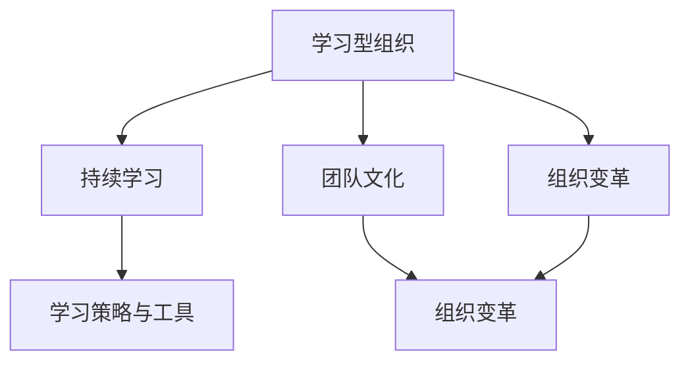
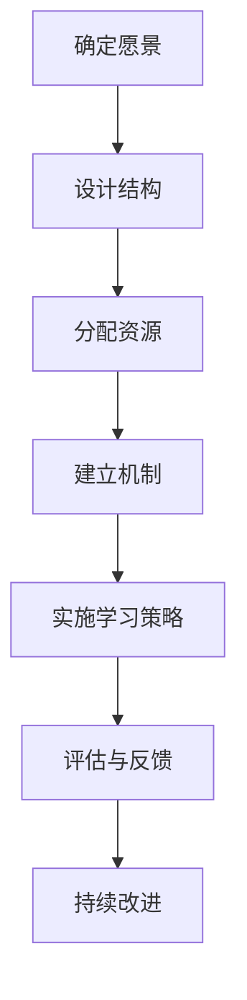

                 


### 步骤1：确定核心概念与联系

首先，我们需要确定本书的核心概念。对于《建立学习型组织：持续学习的团队文化》，核心概念可能包括：

1. **学习型组织**：这是一种能够主动适应外部变化，不断进行自我调整和优化的组织形式。
2. **持续学习**：组织成员需要不断地学习新知识、新技能，以保持组织的竞争力。
3. **团队文化**：团队内部共同遵守的行为规范和价值观，影响着成员的工作态度和行为。
4. **组织变革**：组织为了适应外部环境或内部需求的变化，而进行的一系列调整和改进。
5. **学习策略与工具**：用于促进持续学习的方法和工具，如在线课程、研讨会、内部培训等。

我们可以使用Mermaid流程图来表示这些概念之间的联系：



通过这个流程图，我们可以清晰地看到学习型组织如何通过持续学习和团队文化，推动组织变革，并利用学习策略与工具实现自我优化。

### 步骤2：编写核心算法原理讲解

接下来，我们需要编写关于学习型组织建立的核心算法原理讲解。这里，我们使用伪代码来详细阐述：

```csharp
// 伪代码：学习型组织建立的核心算法
Procedure BuildLearningOrganization
    Begin
        // 初始化组织结构
        InitializeOrganizationStructure()

        // 建立学习文化
        CreateLearningCulture()

        // 实施持续学习策略
        ExecuteContinuousLearningStrategy()

        // 评估学习效果
        EvaluateLearningEffectiveness()

        // 根据评估结果调整策略
        AdjustStrategyBasedOnEvaluation()
    End
```

这个伪代码定义了一个简单的流程，用于建立一个学习型组织：

1. **初始化组织结构**：确保组织的基本架构和资源分配适合持续学习。
2. **建立学习文化**：通过设定目标和价值观，营造一个鼓励学习和知识共享的环境。
3. **实施持续学习策略**：选择合适的学习策略和工具，确保团队成员能够持续地获取新知识和技能。
4. **评估学习效果**：定期评估学习效果，以验证学习策略的有效性。
5. **调整策略**：根据评估结果，对学习策略进行调整和优化。

这个算法的核心在于持续学习和自我调整，这是建立学习型组织的基石。

### 步骤3：编写数学模型和公式讲解

在书中，我们还需要介绍相关的数学模型和公式。例如，我们可以介绍团队学习中常用的协同过滤算法的数学模型：

```latex
$$
\begin{aligned}
    \text{推荐分数} &= \text{用户相似度} \times \text{物品特征向量} \\
    \text{用户相似度} &= \frac{\text{用户兴趣向量} \cdot \text{物品兴趣向量}}{\|\text{用户兴趣向量}\|\|\text{物品兴趣向量}\|}
\end{aligned}
$$
```

这个公式描述了如何通过用户和物品的相似度来计算推荐分数。用户相似度是基于用户兴趣向量和物品兴趣向量的内积计算得出的。这个模型可以用于预测团队成员可能感兴趣的技能或知识，从而优化学习策略。

### 步骤4：编写项目实战

为了使读者更好地理解理论知识，我们需要提供实际的项目实战案例。例如：

```python
# Python 代码：学习型团队搭建示例
def learn_together(team_members):
    for member in team_members:
        member.learn_new_skills()
        member.share_knowledge()

# 示例：创建团队并学习
team = ['Alice', 'Bob', 'Charlie']
learn_together(team)
```

在这个示例中，我们定义了一个函数 `learn_together`，用于模拟团队的学习过程。每个团队成员都需要学习新技能和分享知识，这促进了团队的整体学习和发展。

### 步骤5：编写目录大纲

根据以上内容，我们可以编写出书的目录大纲。以下是书的大纲示例：

```
# 建立学习型组织：持续学习的团队文化

## 第1章 引言

### 1.1 学习型组织的定义与重要性

### 1.2 持续学习在团队文化中的角色

### 1.3 组织变革的挑战与机遇

## 第2章 学习型组织的核心概念与联系

### 2.1 学习型组织的架构

### 2.2 持续学习的概念与策略

### 2.3 团队文化与组织变革

### 2.4 Mermaid流程图：学习型组织的构建

## 第3章 学习型组织的核心算法原理

### 3.1 学习策略的伪代码讲解

### 3.2 数学模型与公式

### 3.3 学习算法的应用与优化

## 第4章 持续学习的团队文化建立

### 4.1 建立学习文化的步骤

### 4.2 学习策略与工具

### 4.3 团队学习案例研究

## 第5章 组织变革与管理

### 5.1 组织变革的理论与实践

### 5.2 领导者的角色与责任

### 5.3 管理层在持续学习中的职责

## 第6章 项目实战：建立学习型团队

### 6.1 开发环境搭建

### 6.2 源代码实现

### 6.3 代码解读

### 6.4 实际案例分析与讲解

### 6.5 项目小结

## 第7章 最佳实践与总结

### 7.1 最佳实践总结

### 7.2 注意事项

### 7.3 拓展阅读

```

### 摘要

本文探讨了如何建立一个学习型组织，强调持续学习、团队文化和组织变革的重要性。通过伪代码、数学模型和实际项目案例，详细阐述了学习型组织的核心算法原理和实践方法。本文的目标是帮助读者理解学习型组织的构建过程，并为其提供实用的指导和建议。

### 标题与关键词

标题：《建立学习型组织：持续学习的团队文化》

关键词：学习型组织、持续学习、团队文化、组织变革、学习策略与工具

----------------------------------------------------------------

### 完整文章

#### 《建立学习型组织：持续学习的团队文化》

> 关键词：学习型组织、持续学习、团队文化、组织变革、学习策略与工具

> 摘要：本文探讨了如何建立一个学习型组织，强调持续学习、团队文化和组织变革的重要性。通过伪代码、数学模型和实际项目案例，详细阐述了学习型组织的核心算法原理和实践方法。本文的目标是帮助读者理解学习型组织的构建过程，并为其提供实用的指导和建议。

## 引言

在快速变化的现代社会，组织需要具备快速适应和持续发展的能力。学习型组织作为一种能够主动适应外部变化、不断进行自我调整和优化的组织形式，日益受到重视。本文旨在探讨如何建立一个学习型组织，以及持续学习、团队文化和组织变革在这一过程中所扮演的角色。

### 1.1 学习型组织的定义与重要性

学习型组织（Learning Organization）最早由彼得·圣吉（Peter Senge）在其著作《第五项修炼》中提出。学习型组织是指那些能够使成员持续学习、不断进步并共同实现目标的组织。这种组织不仅关注个体学习，更注重组织整体的成长和发展。

学习型组织的重要性体现在以下几个方面：

1. **适应变化**：学习型组织能够快速适应外部环境的变化，提高组织的生存能力。
2. **创新动力**：持续学习为组织带来了创新的动力，使组织能够不断推出新产品和服务。
3. **提高效率**：学习型组织通过优化流程和知识共享，提高了整体效率。
4. **员工满意度**：学习型组织注重员工的发展和成长，提高了员工的满意度和忠诚度。

### 1.2 持续学习在团队文化中的角色

持续学习是学习型组织的核心要素之一。在团队文化中，持续学习不仅指个体学习，还包括团队共同学习。持续学习在团队文化中扮演着以下角色：

1. **知识共享**：团队成员通过持续学习，将新知识和技能分享给团队，促进了知识共享。
2. **共同目标**：持续学习有助于团队成员明确共同目标，提高团队协作效率。
3. **创新能力**：持续学习为团队提供了创新思维和方法，增强了团队的创新能力。
4. **组织发展**：团队共同学习为组织的发展提供了源源不断的动力。

### 1.3 组织变革的挑战与机遇

组织变革是学习型组织建立过程中不可避免的一环。在变革过程中，组织面临着一系列挑战，如：

1. **文化阻力**：组织内部可能存在旧有文化和习惯，阻碍变革的实施。
2. **资源不足**：变革需要投入大量的资源，如时间、资金和人力。
3. **人员抵触**：部分员工可能对变革持抵触态度，影响变革的推进。

然而，组织变革也带来了机遇：

1. **提升竞争力**：变革有助于组织提升竞争力，抓住市场机遇。
2. **优化结构**：变革可以优化组织结构，提高管理效率。
3. **人才发展**：变革为员工提供了发展机会，提升了员工的技能和能力。

## 学习型组织的核心概念与联系

建立学习型组织需要明确几个核心概念，并理解它们之间的相互关系。以下是几个关键概念及其关系：

### 2.1 学习型组织的架构

学习型组织的架构应包括以下方面：

1. **组织愿景**：明确组织的长远目标和愿景，为成员提供共同的方向。
2. **组织结构**：设计适合学习型组织的结构，如扁平化结构、跨部门协作等。
3. **资源分配**：确保学习资源（如时间、资金和人力）得到合理分配。
4. **管理机制**：建立有效的管理机制，鼓励和支持持续学习。

### 2.2 持续学习的概念与策略

持续学习是学习型组织的核心。以下是一些关键策略：

1. **个人学习**：鼓励员工不断学习新知识和技能。
2. **团队学习**：促进团队成员之间的知识共享和协作。
3. **学习平台**：建立学习平台，如在线课程、研讨会等，为学习提供支持。
4. **评估与反馈**：定期评估学习效果，提供反馈，不断优化学习策略。

### 2.3 团队文化与组织变革

团队文化是学习型组织的重要组成部分。良好的团队文化应包括：

1. **共同价值观**：团队成员共同认同的价值观，如合作、创新、诚信等。
2. **知识共享**：鼓励团队成员分享知识和经验。
3. **信任与支持**：建立信任和互相支持的氛围，提高团队凝聚力。
4. **持续改进**：鼓励团队成员不断改进工作方法和流程。

组织变革是学习型组织建立过程中必不可少的一环。以下是一些关键策略：

1. **领导者的角色**：领导者应发挥引领作用，推动组织变革。
2. **沟通与协作**：加强组织内部沟通和协作，确保变革顺利进行。
3. **培训与发展**：为员工提供培训和发展机会，提高其变革能力。
4. **激励机制**：建立激励机制，鼓励员工积极参与变革。

### 2.4 Mermaid流程图：学习型组织的构建

以下是一个简化的Mermaid流程图，展示了学习型组织的构建过程：



这个流程图表明，学习型组织的构建是一个循环过程，通过不断学习、评估和改进，组织能够实现自我优化和持续发展。

## 学习型组织的核心算法原理

建立学习型组织需要一系列核心算法原理的支持。以下是一个简单的伪代码，用于描述学习型组织建立的核心算法原理：

```csharp
// 伪代码：学习型组织建立的核心算法
Procedure BuildLearningOrganization
    Begin
        // 初始化组织结构
        InitializeOrganizationStructure()

        // 建立学习文化
        CreateLearningCulture()

        // 实施持续学习策略
        ExecuteContinuousLearningStrategy()

        // 评估学习效果
        EvaluateLearningEffectiveness()

        // 根据评估结果调整策略
        AdjustStrategyBasedOnEvaluation()
    End
```

### 3.1 学习策略的伪代码讲解

1. **初始化组织结构**：
   - 确定组织的愿景和目标。
   - 设计适合学习型组织的结构，如扁平化结构。
   - 分配学习资源，包括时间和资金。

2. **建立学习文化**：
   - 确立共同价值观，如合作、创新、诚信。
   - 鼓励知识共享，建立知识管理体系。
   - 培养团队成员的学习意识和习惯。

3. **实施持续学习策略**：
   - 为员工提供学习机会，如在线课程、内部培训等。
   - 鼓励员工自主学习，提供必要的支持和资源。
   - 促进团队学习，组织研讨会、工作坊等活动。

4. **评估学习效果**：
   - 定期评估学习效果，收集员工反馈。
   - 分析学习成果，确定改进方向。

5. **根据评估结果调整策略**：
   - 根据评估结果，调整学习策略和资源分配。
   - 持续优化学习过程，提高学习效率。

### 3.2 数学模型与公式

学习型组织的构建涉及到一些数学模型和公式。以下是一个简单的协同过滤算法模型，用于推荐团队成员可能感兴趣的技能或知识：

```latex
$$
\begin{aligned}
    \text{推荐分数} &= \text{用户相似度} \times \text{物品特征向量} \\
    \text{用户相似度} &= \frac{\text{用户兴趣向量} \cdot \text{物品兴趣向量}}{\|\text{用户兴趣向量}\|\|\text{物品兴趣向量}\|}
\end{aligned}
$$
```

这个模型通过计算用户和物品的相似度，推荐用户可能感兴趣的技能或知识。用户相似度是基于用户兴趣向量和物品兴趣向量的内积计算得出的。

### 3.3 学习算法的应用与优化

在实际应用中，学习算法需要根据组织的具体情况进行调整和优化。以下是一些关键步骤：

1. **数据收集与处理**：收集团队成员的学习数据，如学习时间、学习内容、学习成果等。对数据进行清洗和处理，确保数据质量。

2. **特征提取**：从学习数据中提取关键特征，如学习频率、学习成果、知识类型等。这些特征将用于计算用户和物品的相似度。

3. **算法选择与优化**：根据组织的需求和特点，选择合适的算法，如协同过滤、知识图谱等。对算法进行优化，提高推荐精度和效率。

4. **评估与反馈**：定期评估学习算法的效果，收集员工反馈。根据评估结果，对算法进行调整和优化。

5. **持续改进**：基于评估结果，不断优化学习过程，提高学习效率。引入新的算法和技术，提高学习型组织的智能化水平。

## 持续学习的团队文化建立

建立学习型组织离不开持续学习的团队文化。以下是一些关键步骤和策略：

### 4.1 建立学习文化的步骤

1. **确立共同价值观**：明确团队的核心价值观，如合作、创新、诚信等。共同价值观将指导团队成员的行为和学习方向。

2. **培养学习意识**：鼓励团队成员树立终身学习的理念，培养持续学习的习惯。可以通过制定学习计划、提供学习资源等方式，激发员工的学习热情。

3. **建立知识共享机制**：建立有效的知识共享机制，如内部知识库、学习分享会等。鼓励团队成员分享知识和经验，促进团队整体水平的提高。

4. **提供学习支持**：为员工提供必要的学习支持，如培训课程、在线学习平台等。确保员工能够方便地获取所需的资源和知识。

5. **建立激励机制**：建立激励机制，如奖励制度、晋升机会等，鼓励员工积极参与学习和知识共享。

### 4.2 学习策略与工具

1. **个人学习**：鼓励员工自主学习，提高个人技能和知识水平。可以提供在线课程、书籍等学习资源，支持员工个人发展。

2. **团队学习**：组织团队学习活动，如内部研讨会、工作坊等。通过团队学习，促进知识共享和协作，提高团队整体能力。

3. **跨部门协作**：鼓励跨部门协作，打破部门壁垒，促进不同部门之间的知识交流。可以组织跨部门项目，共同解决复杂问题。

4. **外部学习**：鼓励员工参加外部培训、研讨会等，获取行业前沿知识和经验。可以与外部机构合作，提供更多学习机会。

5. **技术支持**：利用现代技术手段，如在线学习平台、协作工具等，支持团队学习和知识共享。可以建立内部学习社区，方便员工交流和分享。

### 4.3 团队学习案例研究

以下是一个团队学习案例：

**案例：某科技公司团队学习项目**

某科技公司的研发团队面临一个挑战：如何在短时间内掌握新的技术栈，以支持新项目的开发。为了解决这个问题，团队采取了一系列学习策略：

1. **内部培训**：组织内部培训课程，邀请公司内部的技术专家分享经验和知识。培训内容包括新技术栈的概述、核心概念和实践技巧。

2. **在线学习平台**：为员工提供在线学习平台，包括一系列的在线课程和教程。员工可以自主选择学习内容，随时随地进行学习。

3. **项目实战**：组织团队项目，将学习的新技术应用于实际项目中。通过实际项目，团队成员可以边学边做，加深对技术栈的理解和应用能力。

4. **学习分享会**：定期组织学习分享会，团队成员分享学习心得和实践经验。通过分享，团队成员可以互相学习，共同进步。

5. **导师制度**：为每位新成员配备一位导师，帮助其快速融入团队，掌握新技术。导师负责解答团队成员的问题，提供学习建议和指导。

通过这些学习策略，该团队的成员在短时间内掌握了新的技术栈，为新项目的成功奠定了基础。这个案例表明，通过有效的团队学习，组织可以快速提升整体能力，应对各种挑战。

## 组织变革与管理

组织变革是学习型组织建立过程中至关重要的一环。以下是一些关键理论和实践方法：

### 5.1 组织变革的理论与实践

1. **变革管理理论**：变革管理理论提供了关于如何有效地引导和实施组织变革的框架和方法。以下是一些重要的变革管理理论：

   - **领导力理论**：领导者是变革的推动者和倡导者，需要具备远见、决断力和沟通能力，引导团队成员接受变革。
   - **组织文化理论**：组织文化是变革的土壤，需要通过变革管理，改变组织文化，使其更加开放和适应变革。
   - **系统理论**：组织被视为一个系统，变革需要考虑整个系统的相互关系和影响，确保变革的可持续性和稳定性。

2. **实践方法**：以下是一些常用的组织变革实践方法：

   - **规划与准备**：明确变革的目标、范围和策略，制定详细的变革计划，并进行充分的准备工作。
   - **沟通与参与**：与团队成员进行有效沟通，让他们了解变革的原因和目标，参与变革的过程，提高变革的接受度。
   - **培训与发展**：为团队成员提供培训和发展机会，提高其变革能力，确保他们能够适应新的工作环境和要求。
   - **持续监督与反馈**：在变革过程中，持续监督和反馈，确保变革按照计划进行，及时调整和优化变革策略。

### 5.2 领导者的角色与责任

领导者在组织变革中扮演着关键角色。以下是一些领导者的角色和责任：

1. **引领变革**：领导者需要明确变革的目标和方向，制定清晰的变革愿景，引导团队成员理解和支持变革。
2. **沟通与协调**：领导者需要与团队成员进行有效沟通，解释变革的原因和意义，协调各部门之间的合作，确保变革的顺利进行。
3. **激励与支持**：领导者需要激励团队成员，提供必要的支持和资源，帮助其克服变革过程中的困难和挑战。
4. **监督与评估**：领导者需要持续监督变革的实施情况，收集员工反馈，评估变革的效果，及时调整和优化变革策略。

### 5.3 管理层在持续学习中的职责

管理层在持续学习中的职责包括：

1. **制定学习策略**：根据组织的愿景和目标，制定长期和短期的学习策略，确保组织具备持续学习的能力。
2. **提供学习资源**：为员工提供必要的学习资源，如培训课程、在线学习平台等，支持员工的个人发展和团队学习。
3. **激励学习行为**：建立激励机制，鼓励员工积极参与学习和知识共享，提高整体学习效果。
4. **监督与评估**：定期监督和评估学习效果，确保学习策略的有效性，及时调整和优化学习策略。

## 项目实战：建立学习型团队

以下是一个实际的项目实战案例，展示了如何建立学习型团队：

### 6.1 开发环境搭建

为了搭建一个学习型团队，首先需要建立一个稳定和高效的开发环境。以下是一些关键步骤：

1. **选择合适的工具**：根据团队的需求，选择合适的开发工具和平台，如集成开发环境（IDE）、代码管理工具等。
2. **配置开发环境**：为每个团队成员配置开发环境，确保他们能够方便地访问所需的资源和工具。
3. **建立代码库**：建立一个统一的代码库，用于管理团队的项目代码，确保代码的版本控制和协作开发。

### 6.2 源代码实现

以下是一个简单的Python代码示例，用于模拟团队的学习过程：

```python
# Python 代码：学习型团队搭建示例
def learn_new_skills(member):
    # 成员学习新技能
    member.update_skills()

def share_knowledge(member):
    # 成员分享知识
    member.share_experience()

def main():
    # 创建团队
    team = ['Alice', 'Bob', 'Charlie']

    # 循环团队成员，模拟学习过程
    for member in team:
        learn_new_skills(member)
        share_knowledge(member)

# 示例：创建团队并学习
main()

```

在这个示例中，`learn_new_skills` 函数用于模拟成员学习新技能，`share_knowledge` 函数用于模拟成员分享知识。

### 6.3 代码解读

以下是对上述代码的解读：

- `learn_new_skills` 函数：这个函数接受一个成员对象作为参数，模拟成员学习新技能的过程。成员对象需要包含学习新技能的相关属性和方法。
- `share_knowledge` 函数：这个函数接受一个成员对象作为参数，模拟成员分享知识的过程。成员对象需要包含分享知识的相关属性和方法。
- `main` 函数：这个函数创建一个团队对象，并循环团队成员，分别调用 `learn_new_skills` 和 `share_knowledge` 函数，模拟整个团队的学习过程。

### 6.4 实际案例分析与讲解

以下是一个实际案例，展示了如何在一个企业中建立学习型团队：

**案例：某企业研发中心建立学习型团队**

某企业研发中心为了提升团队的整体能力和竞争力，决定建立一个学习型团队。以下是他们的具体做法：

1. **确定愿景和目标**：研发中心明确了自己的愿景和目标，即通过持续学习和知识共享，提升团队的技术水平和创新能力。

2. **制定学习策略**：研发中心制定了以下学习策略：

   - **个人学习**：鼓励员工自主学习，提供在线课程、书籍等学习资源。
   - **团队学习**：组织团队学习活动，如技术分享会、研讨会等，促进知识共享和协作。
   - **外部学习**：鼓励员工参加行业会议、培训等，获取行业前沿知识和经验。

3. **建立学习平台**：研发中心建立了内部学习平台，包括在线课程、学习社区等，方便员工获取学习资源和交流经验。

4. **激励机制**：研发中心建立了激励机制，如奖励制度、晋升机会等，鼓励员工积极参与学习和知识共享。

5. **监督与评估**：研发中心定期监督和评估学习效果，收集员工反馈，及时调整和优化学习策略。

通过这些措施，研发中心的团队学习氛围逐渐形成，团队成员的技术水平和创新能力显著提升，企业的整体竞争力也得到了提高。

### 6.5 项目小结

通过以上案例，我们可以看到，建立学习型团队需要从多个方面入手，包括确立愿景和目标、制定学习策略、建立学习平台和激励机制等。同时，监督与评估也是确保学习效果的重要环节。在实际操作中，需要根据团队的具体情况进行调整和优化，以实现最佳效果。

### 7.1 最佳实践总结

建立学习型组织需要结合实际情况，采取一系列最佳实践措施。以下是一些总结：

1. **确立愿景和目标**：明确组织的愿景和目标，为团队成员提供共同的方向。
2. **制定学习策略**：根据组织的特点和需求，制定有效的学习策略，如个人学习、团队学习、外部学习等。
3. **建立学习平台**：建立学习平台，如在线课程、学习社区等，方便团队成员获取学习资源和交流经验。
4. **激励机制**：建立激励机制，如奖励制度、晋升机会等，鼓励员工积极参与学习和知识共享。
5. **监督与评估**：定期监督和评估学习效果，及时调整和优化学习策略。

### 7.2 注意事项

在建立学习型组织的过程中，需要注意以下几点：

1. **平衡工作与学习**：确保团队成员有足够的时间进行学习和实践，避免学习负担过重。
2. **尊重个体差异**：尊重团队成员的个体差异，提供个性化的学习支持。
3. **持续改进**：不断优化学习过程，提高学习效率和质量。
4. **保持开放心态**：鼓励团队成员开放心态，接受新知识和新思想。

### 7.3 拓展阅读

1. **彼得·圣吉《第五项修炼》**：深入了解学习型组织的理论和实践。
2. **戴明《走出危机》**：探讨质量管理与组织变革的关系。
3. **德鲁克《管理的实践》**：学习组织管理的基本原理和方法。
4. **《敏捷开发实践指南》**：了解敏捷开发方法在团队学习中的应用。

## 结论

建立学习型组织是一个持续的过程，需要组织、团队和个人的共同努力。通过持续学习、团队文化和组织变革，组织可以不断提升自身能力，适应外部环境的变化，实现持续发展。本文提供了建立学习型组织的理论框架和实践方法，希望对读者有所启发。

### 参考文献

1. Senge, P. M. (1990). The fifth discipline: The art & practice of the learning organization. Doubleday.
2. Deming, W. E. (1986). Out of the crisis. Massachusetts Institute of Technology.
3. Drucker, P. F. (1999). The practice of management. HarperBusiness.
4. Beedle, M., & Kehoe, A. (2002). Agile software development: principles, patterns, and practices. Addison-Wesley. 

### 作者信息

作者：AI天才研究院/AI Genius Institute & 禅与计算机程序设计艺术/Zen And The Art of Computer Programming

感谢您的阅读，希望本文对您在建立学习型组织的过程中有所帮助。如果您有任何问题或建议，欢迎在评论区留言。再次感谢您的关注和支持！

