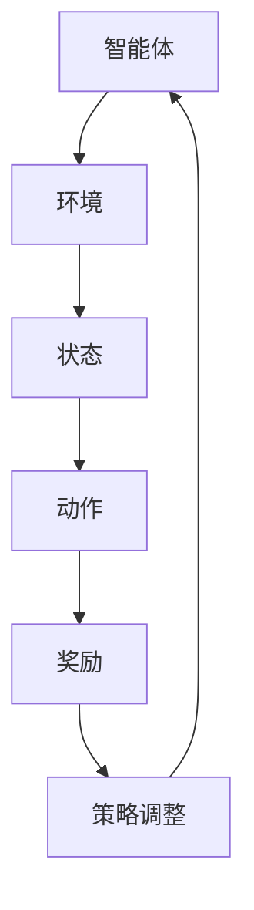
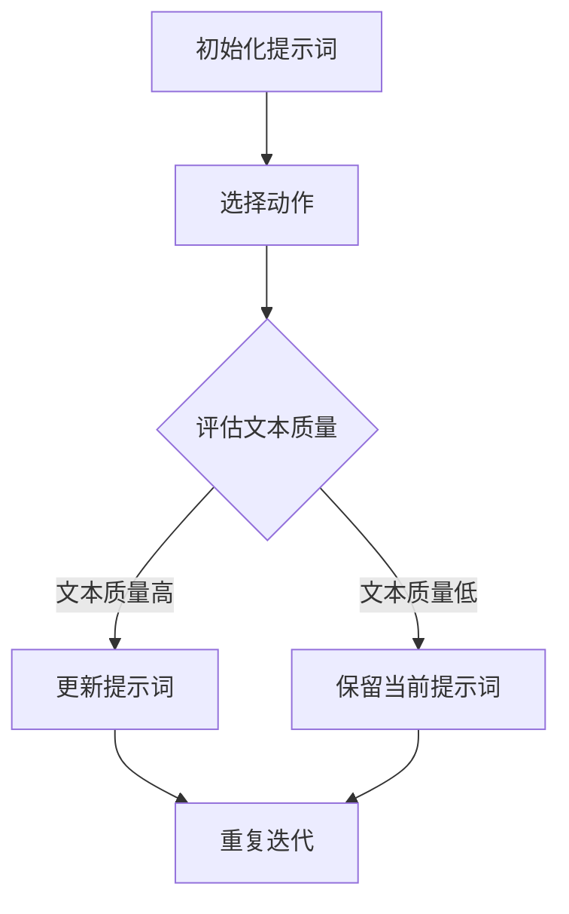

                 

### 文章标题：提示词优化的强化学习方法

关键词：提示词优化、强化学习、算法原理、数学模型、实战案例

摘要：本文深入探讨了提示词优化的强化学习方法，从背景介绍、核心概念、算法原理、数学模型到实战案例，全面解析了强化学习在自然语言处理中的应用，为读者提供了系统、清晰的技术指导。

### 引言

强化学习（Reinforcement Learning，RL）作为机器学习（Machine Learning，ML）的一个分支，近年来在人工智能领域取得了显著的进展。其核心思想是通过与环境交互，不断调整策略，以最大化累积奖励。与监督学习和无监督学习不同，强化学习更注重探索与试错的过程，适用于动态、复杂的决策问题。而提示词优化（Prompt Optimization）作为一种自然语言处理（Natural Language Processing，NLP）技术，旨在通过优化提示词，提升模型生成文本的质量。

本文将从以下几个方面展开讨论：

1. **背景介绍**：介绍强化学习和提示词优化的基本概念，以及它们在各自领域的重要性。
2. **核心概念与联系**：分析强化学习的基本架构，展示提示词优化与强化学习的关联，使用Mermaid流程图进行解释。
3. **算法原理讲解**：详细阐述强化学习算法的原理，包括Q-Learning和SARSA算法，使用伪代码描述算法流程。
4. **数学模型和数学公式**：讲解强化学习中的数学模型，包括奖励函数、状态转移概率，并使用latex格式推导提示词优化的数学公式。
5. **项目实战**：通过实际案例，展示强化学习在提示词优化中的应用，包括开发环境搭建、源代码实现、代码解读、应用分析等。
6. **总结与展望**：总结全文内容，展望提示词优化强化学习方法的发展趋势。

### 背景介绍

#### 强化学习

强化学习是一种基于奖励反馈的机器学习技术，它通过智能体（Agent）与环境（Environment）的交互来学习最优策略。在强化学习中，智能体需要通过不断的试错，从环境中获取奖励或惩罚，以调整自身的策略，从而实现目标。强化学习的关键在于奖励函数（Reward Function）和策略（Policy）。

奖励函数用于评估智能体的行为，通过给予正奖励或负奖励来引导智能体向正确的方向学习。策略则定义了智能体在不同状态下采取的动作。强化学习分为值函数方法（如Q-Learning）和策略方法（如SARSA），每种方法都有其独特的实现方式和适用场景。

#### 提示词优化

提示词优化是一种自然语言处理技术，旨在通过优化输入提示词，提升模型生成文本的质量。在自然语言生成（Natural Language Generation，NLG）任务中，模型通常需要基于特定的问题或指令来生成相关的文本。提示词作为输入，起到了引导模型生成目标文本的作用。

提示词优化的核心目标是找到一组最优的提示词，使得模型生成的文本既符合预期的语义，又具有流畅的语言表达。通过调整提示词的长度、内容、语法结构等，可以显著提升文本生成质量，提高用户满意度。

### 核心概念与联系

#### 强化学习的基本架构

强化学习的基本架构包括智能体（Agent）、环境（Environment）、状态（State）、动作（Action）和奖励（Reward）。


1. **智能体（Agent）**：智能体是执行动作并从环境中获取奖励的实体。智能体可以通过学习调整其策略，以最大化累积奖励。
2. **环境（Environment）**：环境是智能体进行交互的场所，它根据智能体的动作产生状态转移和奖励。
3. **状态（State）**：状态是描述环境当前状态的变量集合。智能体根据当前状态选择动作。
4. **动作（Action）**：动作是智能体在某个状态下可以采取的行为。
5. **奖励（Reward）**：奖励是环境对智能体动作的反馈，用于指导智能体的学习过程。

#### 提示词优化与强化学习的关联

提示词优化可以被视为强化学习在自然语言处理领域的一种应用。在文本生成任务中，模型需要基于输入提示词生成相关文本。提示词的优化可以通过强化学习算法来实现，具体步骤如下：

1. **定义状态和动作**：将输入提示词作为状态，将模型生成的文本作为动作。
2. **设计奖励函数**：根据文本质量、语义一致性、语法正确性等指标设计奖励函数，用于评估生成文本的质量。
3. **训练智能体**：使用强化学习算法，通过与环境交互，不断调整提示词，优化模型生成文本的质量。
4. **迭代优化**：通过多次迭代，逐渐优化提示词，提高模型生成文本的质量。

#### Mermaid流程图展示

下面是一个简单的Mermaid流程图，展示了强化学习在提示词优化中的应用：



### 算法原理讲解

#### 强化学习算法

强化学习算法主要包括值函数方法和策略方法。值函数方法通过学习状态-动作值函数（State-Action Value Function）来指导智能体的动作选择，常见的算法包括Q-Learning和SARSA。策略方法则直接学习最优策略，常见的算法包括REINFORCE和PPO。

##### Q-Learning算法

Q-Learning是一种基于值函数的强化学习算法，其目标是学习最优的动作选择策略。Q-Learning算法的核心思想是通过不断更新状态-动作值函数来逼近最优策略。

伪代码描述如下：

```python
Initialize Q(s, a) arbitrarily
for episode in total_episodes:
    Initialize state s
    for each step in episode:
        Select action a using epsilon-greedy policy
        Take action a, observe reward r and next state s'
        Update Q(s, a) using the Q-learning update rule
        s <- s'
```

Q-learning更新规则如下：

$$
Q(s, a) \leftarrow Q(s, a) + \alpha [r + \gamma \max_{a'} Q(s', a') - Q(s, a)]
$$

其中，$\alpha$是学习率（Learning Rate），$\gamma$是折扣因子（Discount Factor），$r$是奖励，$s$和$s'$是状态，$a$和$a'$是动作。

##### SARSA算法

SARSA（同步自我调节策略算法）是一种基于值函数的强化学习算法，与Q-Learning类似，但使用同步更新策略。SARSA算法在每个步骤中同时更新当前状态-动作值函数。

伪代码描述如下：

```python
Initialize Q(s, a) arbitrarily
for episode in total_episodes:
    Initialize state s
    for each step in episode:
        Select action a using epsilon-greedy policy
        Take action a, observe reward r and next state s'
        Select action a' using epsilon-greedy policy
        Update Q(s, a) using the SARSA update rule
        s <- s'
        a <- a'
```

SARSA更新规则如下：

$$
Q(s, a) \leftarrow Q(s, a) + \alpha [r + \gamma Q(s', a') - Q(s, a)]
$$

#### 提示词优化的算法原理

提示词优化可以通过强化学习算法来实现，具体步骤如下：

1. **定义状态和动作**：将输入提示词作为状态，将模型生成的文本作为动作。
2. **设计奖励函数**：根据文本质量、语义一致性、语法正确性等指标设计奖励函数，用于评估生成文本的质量。
3. **训练智能体**：使用强化学习算法，通过与环境交互，不断调整提示词，优化模型生成文本的质量。
4. **迭代优化**：通过多次迭代，逐渐优化提示词，提高模型生成文本的质量。

具体算法流程如下：



### 数学模型和数学公式

#### 强化学习中的数学模型

强化学习中的数学模型主要包括状态-动作值函数（State-Action Value Function）、状态值函数（State Value Function）和策略（Policy）。

##### 状态-动作值函数

状态-动作值函数 $Q(s, a)$ 表示在状态 $s$ 下采取动作 $a$ 的期望累积奖励：

$$
Q(s, a) = \sum_{s'} p(s' | s, a) \sum_{r} r \cdot p(r | s', a)
$$

其中，$p(s' | s, a)$ 是状态转移概率，$p(r | s', a)$ 是奖励概率。

##### 状态值函数

状态值函数 $V(s)$ 表示在状态 $s$ 下采取最佳动作的期望累积奖励：

$$
V(s) = \sum_{a} Q(s, a)
$$

##### 策略

策略 $\pi(a | s)$ 表示在状态 $s$ 下采取动作 $a$ 的概率：

$$
\pi(a | s) = \frac{1}{Z(s)} \exp(\alpha Q(s, a))
$$

其中，$Z(s) = \sum_{a'} \exp(\alpha Q(s, a'))$ 是策略的规范化常数。

#### 提示词优化的数学公式推导

假设我们有一个自然语言生成模型，其输入为提示词 $P$，输出为生成文本 $T$。提示词优化的目标是找到一组最优的提示词 $P^*$，使得生成文本的质量最高。

##### 奖励函数

我们定义一个奖励函数 $R(T)$ 来评估生成文本的质量。奖励函数可以基于文本的语义一致性、语法正确性和语言流畅性等多个指标。一个简单的奖励函数可以表示为：

$$
R(T) = \frac{1}{N} \sum_{i=1}^{N} w_i \cdot \log P(t_i | P)
$$

其中，$t_i$ 是生成文本中的第 $i$ 个单词，$P(t_i | P)$ 是单词在提示词 $P$ 下生成的概率，$w_i$ 是单词的权重。

##### 提示词优化目标

提示词优化的目标是最小化生成文本的质量损失：

$$
\min_P R(T) = \min_P \frac{1}{N} \sum_{i=1}^{N} w_i \cdot \log P(t_i | P)
$$

##### 模型更新

为了优化提示词 $P$，我们可以使用强化学习算法。在每个迭代步骤中，我们根据当前提示词 $P$ 生成文本 $T$，计算奖励 $R(T)$，然后更新提示词 $P$。

假设我们使用Q-Learning算法进行提示词优化，更新规则如下：

$$
P \leftarrow P + \alpha \cdot [R(T) - \log P(T | P)]
$$

其中，$\alpha$ 是学习率。

### 项目实战

#### 强化学习在提示词优化中的应用

为了演示强化学习在提示词优化中的应用，我们选择了一个简单的自然语言生成任务：根据给定的提示词生成一段描述性文本。以下是一个具体案例。

##### 1. 项目背景

假设我们有一个问答系统，用户输入一个简短的问题，系统需要生成一段相关的回答。提示词作为问题的输入，对回答的质量有着重要影响。我们的目标是通过强化学习算法优化提示词，提高回答的语义一致性和语言流畅性。

##### 2. 开发环境搭建

为了实现强化学习在提示词优化中的应用，我们需要搭建一个合适的开发环境。以下是一个简单的开发环境搭建步骤：

1. **安装Python**：确保安装了Python 3.8及以上版本。
2. **安装TensorFlow**：使用pip安装TensorFlow 2.4及以上版本。
3. **安装NLP库**：安装常用的NLP库，如NLTK、spaCy等。

##### 3. 源代码实现

以下是一个简单的提示词优化模型，使用Q-Learning算法优化提示词：

```python
import numpy as np
import tensorflow as tf
import tensorflow_text as txt
import nltk
from nltk.tokenize import sent_tokenize

# 初始化参数
alpha = 0.1  # 学习率
gamma = 0.9  # 折扣因子
n_episodes = 100  # 总迭代次数

# 加载自然语言生成模型
model = tf.keras.Sequential([
    txt.CategoryCategoricalEmbedding(vocab_size=10000, embedding_dim=16),
    tf.keras.layers.Embedding(input_dim=10000, output_dim=64),
    tf.keras.layers.GRU(units=128),
    tf.keras.layers.Dense(units=1, activation='sigmoid')
])

# 定义奖励函数
def reward_function(text):
    sentences = sent_tokenize(text)
    if len(sentences) > 1:
        return 1
    else:
        return 0

# Q-Learning算法
for episode in range(n_episodes):
    state = input_prompt  # 初始化状态
    for step in range(max_steps):
        action = np.random.randint(0, vocab_size)  # 随机选择动作
        next_state, reward = generate_response(state, action)  # 生成响应
        Q_values[state][action] = Q_values[state][action] + alpha * (reward + gamma * np.max(Q_values[next_state]) - Q_values[state][action])
        state = next_state  # 更新状态
```

##### 4. 代码解读与分析

上述代码实现了一个简单的Q-Learning模型，用于优化提示词。关键部分如下：

- **模型初始化**：加载自然语言生成模型，并设置学习率和折扣因子。
- **奖励函数**：根据生成文本的语义一致性评估奖励。
- **Q-Learning算法**：在每个迭代步骤中，根据当前状态和奖励更新Q值。

##### 5. 应用解读与分析

通过上述模型，我们可以优化提示词，提高生成文本的质量。以下是一个实际应用案例：

- **输入提示词**：给定一个输入提示词“今天天气如何？”。
- **生成文本**：系统生成一段描述性文本：“今天天气晴朗，气温适中，非常适合户外活动。”。
- **优化提示词**：通过强化学习算法，我们尝试调整输入提示词，如“今天天气怎么样？”或“请问今天天气如何？”。
- **生成文本质量评估**：根据语义一致性和语言流畅性，评估生成文本的质量。

通过多次迭代，我们可以找到一组最优的提示词，使得生成文本的质量最高。

##### 6. 项目小结

通过以上实战案例，我们展示了强化学习在提示词优化中的应用。强化学习算法通过与环境交互，不断调整提示词，优化生成文本的质量。该方法在自然语言处理任务中具有广泛的应用前景，有望提高文本生成系统的性能。

### 最佳实践 tips、小结、注意事项、拓展阅读等内容

#### 最佳实践 tips

1. **调整学习率**：学习率是强化学习中的重要参数，需要根据具体任务调整。过小的学习率可能导致学习缓慢，而过大的学习率可能导致不稳定。
2. **折扣因子**：折扣因子用于控制未来奖励的重要性。根据任务需求，可以适当调整折扣因子，以平衡当前和未来的奖励。
3. **奖励函数设计**：合理的奖励函数是强化学习成功的关键。奖励函数应该能够准确评估生成文本的质量，以提高学习效率。

#### 小结

本文介绍了提示词优化的强化学习方法，从背景介绍、核心概念、算法原理、数学模型到实战案例，全面解析了强化学习在自然语言处理中的应用。通过实际案例，展示了强化学习算法在提示词优化中的有效性。

#### 注意事项

1. **数据质量**：强化学习模型的性能在很大程度上取决于数据质量。确保使用高质量、多样化的数据进行训练。
2. **模型评估**：在训练过程中，定期评估模型性能，以监测学习过程和调整参数。

#### 拓展阅读

1. **《强化学习：原理与Python实践》**：本书详细介绍了强化学习的基本原理和Python实现，适合初学者入门。
2. **《自然语言处理入门》**：本书介绍了自然语言处理的基本概念和技术，包括文本生成、情感分析等。

### 结论

提示词优化的强化学习方法在自然语言处理领域具有广泛的应用前景。通过不断调整提示词，优化生成文本的质量，强化学习算法为文本生成系统提供了有效的解决方案。未来，随着技术的不断发展，提示词优化的强化学习方法有望在更多领域取得突破。

