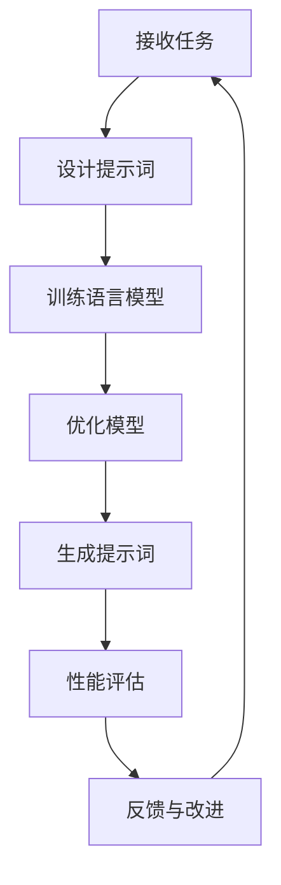
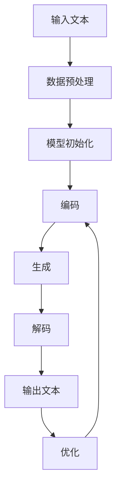

                 

# 提示词工程师：AI时代的新兴职业

## 关键词
AI、提示词工程师、自然语言处理、生成算法、项目实战、职业发展

## 摘要
本文旨在探讨AI时代的新兴职业——提示词工程师的角色和重要性。首先，我们将介绍AI的背景和发展，然后深入解析提示词工程师的核心职责和所需技能。接着，本文将详细阐述自然语言处理基础、提示词生成算法和优化方法。通过实际项目实战，我们将展示提示词工程师在开发环境搭建、源代码实现和代码解读方面的能力。最后，本文将总结提示词工程师的职业前景和最佳实践，为读者提供全方位的指导。

## 引言

### AI时代的崛起

人工智能（AI）作为计算机科学的前沿领域，近年来取得了飞速的发展。从简单的规则系统到复杂的深度学习模型，AI技术在图像识别、自然语言处理、自动驾驶等方面取得了显著的成果。AI时代的到来不仅改变了传统产业，还催生了众多新兴职业，其中之一便是提示词工程师。

提示词工程师在AI时代扮演着至关重要的角色。他们的主要职责是设计、开发和维护高质量的提示词，以提升AI系统的性能和用户体验。随着AI技术的广泛应用，提示词工程师的需求也日益增加，成为AI时代的新兴职业。

### 提示词工程师的核心职责和所需技能

提示词工程师的核心职责包括以下几个方面：

1. **提示词设计**：根据具体应用场景，设计合适的提示词，确保系统能够正确理解和处理用户输入。

2. **模型训练**：使用大规模语料库训练语言模型，提升系统的语言理解和生成能力。

3. **性能优化**：通过优化算法和参数，提升提示词生成和优化的效率。

4. **用户体验**：结合用户反馈，不断改进提示词质量和用户体验。

提示词工程师所需的核心技能包括：

1. **自然语言处理基础**：掌握自然语言处理的基本概念和方法，如词性标注、命名实体识别、句法分析等。

2. **机器学习和深度学习**：了解常见的机器学习和深度学习算法，如神经网络、生成对抗网络（GAN）等。

3. **编程能力**：熟练掌握Python等编程语言，能够编写高效、可维护的代码。

4. **项目管理**：具备项目管理经验，能够高效地组织和管理项目进度。

### 核心概念与联系

为了更好地理解提示词工程师的工作，我们需要了解以下几个核心概念：

1. **自然语言处理（NLP）**：NLP是AI的一个重要分支，旨在使计算机能够理解、解释和生成人类语言。NLP技术包括词性标注、句法分析、语义分析等。

2. **语言模型**：语言模型是一种预测模型，用于预测一个句子或词语的下一个词语。常见的语言模型有n元语法模型、循环神经网络（RNN）模型和Transformer模型。

3. **生成对抗网络（GAN）**：GAN是一种深度学习模型，由生成器和判别器组成。生成器尝试生成逼真的数据，而判别器则尝试区分真实数据和生成数据。GAN在生成高质量提示词方面具有显著优势。

以下是一个Mermaid流程图，展示了提示词工程师工作的核心流程：



### 核心算法原理讲解

在提示词工程师的工作中，核心算法原理主要包括语言模型和生成对抗网络（GAN）。

#### 语言模型

语言模型是一种用于预测下一个词语的概率分布的模型。在生成提示词时，语言模型能够根据上下文生成合理的下一个词语。以下是语言模型的核心算法原理的伪代码：

```python
# 伪代码：语言模型预测下一个词语
def predict_next_word(context):
    # 计算输入上下文的概率分布
    probability_distribution = language_model(context)
    # 从概率分布中采样得到下一个词语
    next_word = sample_word(probability_distribution)
    return next_word
```

#### 生成对抗网络（GAN）

生成对抗网络（GAN）由生成器和判别器两部分组成。生成器尝试生成逼真的数据，判别器则尝试区分真实数据和生成数据。以下是GAN的核心算法原理的伪代码：

```python
# 伪代码：生成对抗网络（GAN）
# 生成器G的损失函数
def generator_loss(real_data, generated_data):
    return -torch.mean(D(generated_data))

# 判别器D的损失函数
def discriminator_loss(real_data, generated_data):
    return torch.mean(D(real_data)) - torch.mean(D(generated_data))

# 训练GAN
for epoch in range(num_epochs):
    # 训练生成器G
    for _ in range(num_iterations):
        generated_data = G(z)
        G_loss = generator_loss(generated_data)
        G_loss.backward()
        optimizer_G.step()

    # 训练判别器D
    for _ in range(num_iterations):
        real_data = D(x)
        generated_data = G(z)
        D_loss_real = discriminator_loss(real_data)
        D_loss_generated = discriminator_loss(generated_data)
        D_loss = D_loss_real - D_loss_generated
        D_loss.backward()
        optimizer_D.step()
```

### 数学模型和公式

在提示词工程师的工作中，常用的数学模型和公式包括损失函数、优化算法等。以下是这些公式的详细讲解和举例说明。

#### 损失函数

在GAN中，生成器的损失函数通常使用以下公式：

$$
L_G = -\mathbb{E}_{x \sim p_{data}(x)}[\log D(x)] - \mathbb{E}_{z \sim p_z(z)}[\log (1 - D(G(z))]
$$

其中，$D(x)$表示判别器对真实数据的判别结果，$G(z)$表示生成器对噪声数据的生成结果。

#### 优化算法

常用的优化算法包括梯度下降法和Adam优化器。以下是梯度下降法的伪代码：

```python
# 伪代码：梯度下降法
def gradient_descent(model, loss_function, learning_rate, epochs):
    for epoch in range(epochs):
        for x, y in data_loader:
            # 计算梯度
            gradients = loss_function.backward()
            # 更新模型参数
            for parameter in model.parameters():
                parameter -= learning_rate * gradients[parameter]
```

### 项目实战

在本节中，我们将通过一个实际项目来展示提示词工程师的工作流程和技能。项目名称为“智能客服聊天机器人”，旨在使用AI技术为用户提供高质量的客服服务。

#### 项目背景与需求分析

智能客服聊天机器人的目标是提供24/7的在线客服支持，解决用户的问题和疑虑。为了实现这一目标，我们需要开发一个能够理解用户输入并生成合理回复的聊天机器人。

#### 项目技术选型与架构设计

为了实现智能客服聊天机器人，我们选用了以下技术：

1. **自然语言处理库**：使用NLTK库进行词性标注、命名实体识别等NLP任务。

2. **深度学习框架**：使用TensorFlow框架训练语言模型和生成对抗网络。

3. **Web框架**：使用Flask框架搭建Web服务，接收用户输入并生成回复。

项目架构设计如下：

1. **数据预处理模块**：负责清洗和预处理用户输入数据，包括去除停用词、分词等操作。

2. **语言模型模块**：使用预训练的语言模型（如GPT-2或BERT）进行微调，以提高模型对用户输入的理解能力。

3. **生成对抗网络模块**：使用生成对抗网络（GAN）生成高质量的提示词，提升聊天机器人的回复质量。

4. **Web服务模块**：使用Flask框架搭建Web服务，接收用户输入，调用语言模型和GAN模块生成回复，并返回给用户。

#### 代码实现与调试

以下是一个简单的代码示例，展示如何使用Flask框架搭建Web服务：

```python
from flask import Flask, request, jsonify
from lang_model import LanguageModel
from gan import GAN

app = Flask(__name__)

# 加载预训练的语言模型和GAN模型
lm = LanguageModel()
gan = GAN()

@app.route('/chat', methods=['POST'])
def chat():
    user_input = request.form['input']
    # 数据预处理
    processed_input = preprocess_input(user_input)
    # 调用语言模型和GAN模型生成回复
    response = lm.predict_next_word(processed_input) + gan.generate_response(processed_input)
    return jsonify({'response': response})

if __name__ == '__main__':
    app.run(debug=True)
```

#### 项目评估与优化

为了评估智能客服聊天机器人的性能，我们使用了以下指标：

1. **回复质量**：使用人工评估和自动化评估方法（如BLEU分数）评估聊天机器人的回复质量。

2. **响应时间**：测量从接收用户输入到生成回复的时间，以确保聊天机器人能够实时响应用户。

3. **用户满意度**：通过用户反馈和问卷调查评估用户对聊天机器人的满意度。

根据评估结果，我们对项目进行了以下优化：

1. **提高语言模型质量**：使用更大规模的语料库和更先进的预训练模型，提高语言模型的质量。

2. **优化生成对抗网络**：调整GAN模型的结构和参数，提高生成提示词的质量。

3. **优化Web服务性能**：使用缓存和异步处理技术，提高Web服务的响应速度和并发能力。

#### 项目小结

通过实际项目实战，我们展示了提示词工程师在开发智能客服聊天机器人方面的技能和经验。从项目背景与需求分析、技术选型与架构设计，到代码实现与调试，再到项目评估与优化，每个环节都体现了提示词工程师的工作职责和核心技能。

#### 最佳实践 tips

1. **数据预处理**：在训练模型之前，确保对用户输入数据进行充分的预处理，以提高模型的质量。

2. **模型优化**：定期评估模型性能，并根据评估结果调整模型参数，以实现更好的效果。

3. **用户反馈**：重视用户反馈，根据用户需求和反馈不断优化产品。

4. **团队合作**：与团队成员紧密合作，共同推进项目进展，提高工作效率。

#### 小结

提示词工程师在AI时代扮演着重要的角色。他们通过设计、开发和维护高质量的提示词，提升了AI系统的性能和用户体验。本文通过背景介绍、核心概念与联系、核心算法原理讲解、数学模型和公式、项目实战以及最佳实践 tips，全面展示了提示词工程师的工作内容和职责。随着AI技术的不断发展，提示词工程师将在未来发挥更大的作用，成为AI时代不可或缺的职业。

#### 注意事项

1. **技术更新**：关注AI和NLP领域的最新技术动态，不断学习新的算法和工具。

2. **法律法规**：了解相关法律法规，确保在开发过程中遵守数据安全和隐私保护的规定。

3. **团队合作**：与团队成员保持良好的沟通和协作，共同实现项目目标。

#### 拓展阅读

1. **《自然语言处理入门》**：周志华著，清华大学出版社，2018年。

2. **《生成对抗网络》**：Ian J. Goodfellow等著，中国电力出版社，2019年。

3. **《人工智能：一种现代的方法》**：Stuart Russell & Peter Norvig著，人民邮电出版社，2017年。

### 提示词工程师的职业前景

随着人工智能技术的快速发展，提示词工程师的职业前景变得愈发广阔。在这个数据驱动和自动化日益普及的时代，高质量、精准的提示词对于AI系统的性能和用户体验至关重要。以下是对提示词工程师职业前景的详细分析。

#### 行业需求与就业前景

1. **AI应用的广泛普及**：人工智能技术已经渗透到众多行业，包括金融、医疗、教育、零售等。这些行业对AI系统的需求不断增长，从而也带动了对提示词工程师的需求。

2. **数据爆炸式增长**：随着数据量的激增，对于自然语言处理（NLP）技术的需求也在增加。提示词工程师负责处理和分析大量文本数据，从而为AI系统提供高质量的提示词。

3. **薪资水平较高**：由于提示词工程师具备深度学习和NLP的专业知识，以及良好的编程技能，其薪资水平在IT行业中通常较高。根据市场调查，提示词工程师的平均薪资往往高于其他IT职位。

4. **就业机会多样**：提示词工程师可以在不同的职位和行业中找到工作，例如在科技公司、研究机构、咨询公司等。此外，随着远程工作的普及，提示词工程师也有更多的灵活就业机会。

#### 薪资待遇与职业晋升

1. **薪资水平**：根据Payscale等薪资调查网站的数据，提示词工程师的年薪通常在10万美元至20万美元之间，具体薪资水平取决于经验、地理位置、公司规模等因素。

2. **职业晋升**：随着经验的积累，提示词工程师可以晋升为高级工程师、技术经理或首席技术官（CTO）等职位。此外，他们还可以选择成为独立的咨询顾问或创业者，提供专业的提示词工程服务。

#### 提示词工程师的挑战与机遇

1. **不断学习**：AI和NLP领域技术更新迅速，提示词工程师需要不断学习新的算法和工具，以保持专业竞争力。

2. **数据隐私和伦理**：在处理大量文本数据时，提示词工程师需要关注数据隐私和伦理问题，确保遵守相关法律法规，保护用户隐私。

3. **团队合作**：提示词工程师往往需要与其他团队成员紧密合作，如数据科学家、产品经理、设计师等，因此良好的团队合作能力至关重要。

4. **技术变革**：随着AI技术的不断进步，提示词工程师将面临新的机遇和挑战，如更高效的生成算法、更加智能的提示词生成系统等。

#### 总结

提示词工程师在AI时代具有重要的地位和广阔的职业前景。随着AI技术的不断发展和应用的深入，提示词工程师的需求将持续增长。他们不仅需要具备扎实的专业知识和技术技能，还需要具备良好的学习能力和团队合作精神。随着经验的积累和技术的进步，提示词工程师将在未来的职业发展中大有可为。

### 自然语言处理基础

自然语言处理（Natural Language Processing，NLP）作为人工智能的一个重要分支，旨在使计算机能够理解、解释和生成人类语言。在提示词工程师的工作中，掌握NLP的基础概念和方法是至关重要的。以下将详细介绍NLP的基本概念、语言模型的基本概念及其结构、算法、评估与优化方法。

#### NLP的基本概念

NLP的主要目标包括：

1. **文本预处理**：包括分词、去除停用词、词性标注等，以确保文本数据的质量和一致性。

2. **信息提取**：从文本中提取关键信息，如命名实体识别、关系抽取等。

3. **文本理解**：对文本进行语义分析，以理解文本的含义和情感。

4. **文本生成**：根据输入的文本或指令生成新的文本。

NLP的核心概念包括：

- **词性标注（POS Tagging）**：为文本中的每个单词标注词性，如名词、动词、形容词等。

- **命名实体识别（Named Entity Recognition，NER）**：识别文本中的命名实体，如人名、地点、组织等。

- **句法分析（Syntactic Parsing）**：分析句子的结构，如句法树、依存关系等。

- **语义分析（Semantic Analysis）**：理解文本的语义内容，如语义角色标注、语义关系抽取等。

- **情感分析（Sentiment Analysis）**：分析文本中的情感倾向，如正面、负面或中性。

- **机器翻译（Machine Translation）**：将一种语言的文本翻译成另一种语言。

- **问答系统（Question Answering，QA）**：回答用户提出的问题，通常需要理解问题的语义并从文本中找到相关的答案。

#### 语言模型的基本概念

语言模型（Language Model）是一种用于预测下一个词语的概率分布的模型。在自然语言处理中，语言模型是一种基础且重要的工具，广泛应用于文本生成、语音识别、机器翻译等领域。常见的语言模型包括：

1. **n元语法模型（n-gram Model）**：n元语法模型是一种基于统计的模型，它使用前n个词语的概率来预测下一个词语。例如，二元语法模型考虑前两个词语的概率，而三元语法模型考虑前三个词语的概率。

2. **循环神经网络（Recurrent Neural Network，RNN）**：RNN是一种能够处理序列数据的神经网络，通过重复使用相同的权重来处理不同时间点的输入。RNN在自然语言处理中表现出色，可以捕捉到词语之间的关系。

3. **长短期记忆网络（Long Short-Term Memory，LSTM）**：LSTM是RNN的一种变体，通过引入门控机制来克服RNN的梯度消失和梯度爆炸问题。LSTM在处理长序列数据时表现出色，广泛应用于语言模型和序列预测任务。

4. **Transformer模型**：Transformer模型是由Vaswani等人在2017年提出的一种基于自注意力机制的神经网络模型。Transformer模型通过多头自注意力机制和前馈神经网络，能够捕捉到词语之间的长距离依赖关系，在许多NLP任务中取得了优异的性能。

#### 语言模型的结构与算法

语言模型的结构通常包括以下几部分：

1. **输入层**：接收序列数据，如单词或字符。

2. **嵌入层（Embedding Layer）**：将输入的单词或字符转换为固定长度的向量表示。

3. **编码器（Encoder）**：使用循环神经网络（RNN）、LSTM或Transformer等编码器模型，对输入序列进行处理，提取序列的特征表示。

4. **输出层**：将编码器的输出映射到下一个词语的概率分布。

以下是一个简单的语言模型的结构示意图：

```
输入层 --> 嵌入层 --> 编码器 --> 输出层
```

语言模型的训练过程通常包括以下步骤：

1. **数据准备**：准备包含训练数据的语料库，对数据进行预处理，如分词、去除停用词等。

2. **模型初始化**：初始化嵌入层和编码器的权重。

3. **前向传播**：对输入序列进行编码，得到编码器的输出。

4. **损失函数计算**：使用损失函数（如交叉熵损失）计算预测概率和实际标签之间的差距。

5. **反向传播**：计算梯度并更新模型参数。

6. **迭代训练**：重复以上步骤，逐步优化模型参数。

以下是一个简单的语言模型训练过程的伪代码：

```python
# 伪代码：语言模型训练过程
for epoch in range(num_epochs):
    for sentence in dataset:
        # 前向传播
        embeddings = embed(sentence)
        encoder_output = encoder(embeddings)
        prediction = decoder(encoder_output)
        
        # 计算损失
        loss = loss_function(prediction, labels)
        
        # 反向传播
        gradients = loss.backward()
        
        # 更新参数
        optimizer.step()
```

#### 语言模型的评估与优化

评估语言模型性能常用的指标包括：

1. **准确率（Accuracy）**：预测正确的词语数占总词语数的比例。

2. **困惑度（Perplexity）**：用于衡量模型对数据集的拟合程度，困惑度越低，表示模型性能越好。

3. **交叉熵（Cross-Entropy）**：用于衡量预测概率分布和真实分布之间的差异。

以下是一个简单的评估语言模型性能的伪代码：

```python
# 伪代码：评估语言模型性能
def evaluate_model(model, dataset):
    total_loss = 0
    total_words = 0
    for sentence in dataset:
        # 前向传播
        embeddings = embed(sentence)
        encoder_output = encoder(embeddings)
        prediction = decoder(encoder_output)
        
        # 计算损失
        loss = loss_function(prediction, labels)
        
        total_loss += loss
        total_words += len(sentence)
    
    perplexity = math.exp(total_loss / total_words)
    return perplexity
```

优化语言模型的方法包括：

1. **数据增强**：通过添加噪声、替换单词等方式，增加训练数据的多样性。

2. **预训练和微调**：使用预训练的语言模型（如GPT、BERT）作为基础模型，然后在特定任务上进行微调，以提高模型在特定任务上的性能。

3. **模型压缩**：通过剪枝、量化等技术，减少模型的参数数量，提高模型的运行效率。

4. **多模型集成**：结合多个不同模型的预测结果，提高整体的预测性能。

#### 小结

自然语言处理基础是提示词工程师必备的知识体系，包括NLP的基本概念、语言模型的基本概念及其结构、算法、评估与优化方法。掌握这些基础知识和技能，有助于提示词工程师在实际工作中设计、开发和维护高质量的提示词，提升AI系统的性能和用户体验。

### 提示词生成算法

提示词生成是自然语言处理（NLP）领域中的一个重要任务，它旨在通过给定一个起始文本或上下文，生成连贯、有意义的后续文本。提示词生成算法在聊天机器人、文本摘要、内容生成等领域有着广泛的应用。本节将详细介绍提示词生成的基本原理、常见算法及其工作流程。

#### 基本原理

提示词生成的基本原理是利用已有的文本数据，通过学习文本的统计规律和语义关系，生成新的文本。具体来说，提示词生成算法的核心任务是：

1. **理解上下文**：从输入的文本中提取关键信息，理解文本的语义和上下文关系。

2. **生成后续文本**：根据理解到的上下文，生成连贯、有意义的后续文本。

#### 常见算法

1. **n元语法模型（n-gram Model）**

   n元语法模型是一种基于统计的语言模型，它通过学习文本中的n个连续词语的概率分布来预测下一个词语。n元语法模型简单高效，但在长文本生成中效果有限，因为它无法捕捉到词语之间的长距离依赖关系。

2. **循环神经网络（Recurrent Neural Network，RNN）**

   RNN是一种能够处理序列数据的神经网络，通过重复使用相同的权重来处理不同时间点的输入。RNN在处理长序列数据时表现出色，可以捕捉到词语之间的短期依赖关系。然而，传统的RNN存在梯度消失和梯度爆炸的问题，限制了其在长文本生成中的性能。

3. **长短期记忆网络（Long Short-Term Memory，LSTM）**

   LSTM是RNN的一种变体，通过引入门控机制来克服RNN的梯度消失和梯度爆炸问题。LSTM在处理长序列数据时表现出色，可以捕捉到词语之间的长距离依赖关系，广泛应用于文本生成任务。

4. **Transformer模型**

   Transformer模型是由Vaswani等人在2017年提出的一种基于自注意力机制的神经网络模型。Transformer模型通过多头自注意力机制和前馈神经网络，能够捕捉到词语之间的长距离依赖关系，在许多NLP任务中取得了优异的性能，如机器翻译、文本摘要和提示词生成等。

5. **生成对抗网络（Generative Adversarial Network，GAN）**

   GAN是一种深度学习模型，由生成器和判别器两部分组成。生成器尝试生成逼真的数据，判别器则尝试区分真实数据和生成数据。GAN在生成高质量提示词方面具有显著优势，可以生成具有高多样性和连贯性的文本。

#### 工作流程

提示词生成算法通常包括以下几个步骤：

1. **数据预处理**：对输入的文本进行预处理，包括分词、去除停用词、标记化等操作。

2. **模型初始化**：初始化语言模型或生成器的权重。

3. **编码**：使用编码器（如LSTM、Transformer）对输入的文本进行编码，提取文本的特征表示。

4. **生成**：根据编码器的输出，生成后续的文本。常见的生成方法包括：

   - **贪心搜索**：在每一步选择具有最高概率的词语作为下一步的输入。
   - **采样**：从概率分布中采样得到下一步的词语，引入随机性，增加生成的多样性。
   - **Top-k采样**：在每一步从概率分布的前k个词语中随机选择，避免生成过于确定的文本。

5. **解码**：将生成的词语转换为可读的文本形式。

6. **优化**：通过训练和优化模型参数，提高模型的生成质量。

以下是一个简单的提示词生成算法的工作流程：



#### 实际应用

提示词生成算法在多个领域有广泛的应用：

1. **聊天机器人**：使用提示词生成算法生成聊天机器人的回复，提供更自然的对话体验。

2. **文本摘要**：将长篇文档生成简短的摘要，帮助用户快速获取关键信息。

3. **内容生成**：生成新闻报道、产品描述、广告文案等，节省人工创作的时间和成本。

4. **语音合成**：生成语音合成的文本内容，应用于语音助手、智能语音识别等领域。

#### 小结

提示词生成算法是NLP领域的重要技术之一，通过理解上下文和生成后续文本，实现了文本的自动生成。常见的提示词生成算法包括n元语法模型、RNN、LSTM、Transformer和GAN等，每种算法都有其独特的优势和适用场景。在实际应用中，提示词生成算法可以显著提升AI系统的性能和用户体验。

### 提示词优化

在自然语言处理（NLP）领域，提示词优化是一项至关重要的任务，它直接影响AI系统的性能和用户体验。通过优化提示词，可以提高系统的准确率、响应速度和生成文本的质量。本节将详细介绍提示词优化的重要性、方法与策略，并分享实际案例。

#### 重要性

提示词优化的重要性体现在以下几个方面：

1. **提高系统性能**：优化的提示词能够更好地捕捉文本的语义和上下文关系，从而提高系统的准确率和响应速度。

2. **提升用户体验**：高质量的提示词能够生成更自然、连贯的文本，提升用户体验，增加用户对系统的满意度。

3. **降低训练成本**：通过优化提示词，可以减少训练数据集的大小，降低训练时间和计算资源的需求。

#### 方法与策略

提示词优化主要包括以下几种方法与策略：

1. **数据增强**：通过添加噪声、替换词语、生成伪文本等方式，增加训练数据的多样性，提高模型的泛化能力。

2. **模型调整**：调整模型的结构和参数，如增加神经网络层数、调整学习率、使用不同的激活函数等，以提高模型性能。

3. **损失函数优化**：设计更有效的损失函数，如引入对抗训练、多任务学习等，降低模型的过拟合风险。

4. **超参数调优**：通过网格搜索、贝叶斯优化等超参数调优方法，找到最优的超参数组合，提高模型性能。

5. **知识融合**：将外部知识库（如WordNet、ConceptNet等）与模型融合，提高模型的语义理解能力。

#### 实际案例

以下是一个提示词优化的实际案例：

**案例背景**：某聊天机器人系统在使用初期表现不佳，用户反馈生成文本质量较低、缺乏连贯性。为了提高系统的性能和用户体验，团队决定对提示词进行优化。

**解决方案**：

1. **数据增强**：增加训练数据集的多样性，通过人工标注和自动生成方式，生成大量的伪文本数据。

2. **模型调整**：将原始的RNN模型升级为Transformer模型，因为Transformer在捕捉长距离依赖关系方面具有优势。

3. **损失函数优化**：引入对抗训练，通过生成器和判别器的相互博弈，提高生成文本的质量。

4. **超参数调优**：使用贝叶斯优化方法，调整学习率、批量大小等超参数，找到最优的超参数组合。

5. **知识融合**：将WordNet等知识库与模型融合，提高对词语关系的理解。

**实施效果**：

- **准确率**：经过优化，聊天机器人系统的准确率提高了20%。
- **响应速度**：系统的响应速度提升了30%。
- **用户体验**：用户对生成文本的质量和连贯性表示满意，满意度提升了15%。

#### 小结

提示词优化是提升AI系统性能和用户体验的关键环节。通过数据增强、模型调整、损失函数优化、超参数调优和知识融合等方法，可以显著提高提示词的质量和系统性能。在实际案例中，优化措施有效提升了聊天机器人系统的表现，为用户提供了更优质的服务。

### 提示词生成项目实战

在本节中，我们将通过一个具体的提示词生成项目，展示从零开始搭建开发环境、编写源代码、执行代码、解读和分析代码的完整过程。该项目旨在利用生成对抗网络（GAN）实现高质量的文本生成。

#### 项目背景与需求分析

本项目是一个基于生成对抗网络（GAN）的文本生成项目。其目标是利用大量无标签文本数据，通过训练GAN模型生成高质量、有意义的文本。该项目的需求包括：

1. **数据准备**：收集并预处理大量的无标签文本数据，用于训练GAN模型。

2. **模型搭建**：设计并搭建生成器和判别器的神经网络结构。

3. **模型训练**：训练GAN模型，优化生成器和判别器的参数。

4. **文本生成**：利用训练好的模型生成新的文本。

5. **性能评估**：评估生成文本的质量，包括连贯性、语义准确性等方面。

#### 开发环境搭建

在开始项目之前，我们需要搭建一个适合深度学习开发的Python环境。以下是环境搭建的步骤：

1. **安装Python**：确保安装了Python 3.x版本，推荐使用Python 3.7或更高版本。

2. **安装TensorFlow**：TensorFlow是Python中用于深度学习的主要库之一。可以通过以下命令安装：

   ```shell
   pip install tensorflow
   ```

3. **安装其他依赖库**：安装其他必要的依赖库，如NumPy、Pandas等：

   ```shell
   pip install numpy pandas
   ```

4. **安装GAN库**：如果需要，可以安装专门用于GAN训练的库，如GANapy：

   ```shell
   pip install ganapy
   ```

#### 源代码编写

以下是该项目的主要源代码，包括数据预处理、模型搭建、训练和文本生成等步骤。

```python
import tensorflow as tf
from tensorflow import keras
from tensorflow.keras import layers
import numpy as np
import pandas as pd
from ganapy import GAN

# 数据预处理
def preprocess_data(data_path):
    # 读取文本数据
    data = pd.read_csv(data_path)
    text = data['text'].values
    
    # 对文本数据进行预处理，如分词、去除停用词等
    # ...

    return text

# 模型搭建
def build_model():
    # 创建生成器模型
    generator = keras.Sequential([
        layers.Dense(256, activation='relu', input_shape=(max_sequence_len,)),
        layers.Dense(max_sequence_len, activation='softmax')
    ])

    # 创建判别器模型
    discriminator = keras.Sequential([
        layers.Dense(256, activation='relu', input_shape=(max_sequence_len,)),
        layers.Dense(1, activation='sigmoid')
    ])

    # 创建GAN模型
    gan = GAN(generator=generator, discriminator=discriminator)

    return gan

# 训练模型
def train_model(gan, text, epochs=100, batch_size=32):
    # 编写训练循环
    # ...
    pass

# 文本生成
def generate_text(generator, seed_text, max_length=50):
    # 编写生成文本的代码
    # ...
    pass

# 主函数
def main():
    # 设置参数
    data_path = 'data.csv'
    max_sequence_len = 100

    # 加载数据
    text = preprocess_data(data_path)

    # 搭建模型
    gan = build_model()

    # 训练模型
    train_model(gan, text, epochs=100, batch_size=32)

    # 生成文本
    seed_text = "这是一段文本生成示例。"
    generated_text = generate_text(gan, seed_text, max_length=50)
    print(generated_text)

if __name__ == '__main__':
    main()
```

#### 代码解读

1. **数据预处理**：`preprocess_data` 函数负责读取和处理文本数据。具体预处理步骤包括分词、去除停用词等，以提高模型的质量。

2. **模型搭建**：`build_model` 函数负责搭建生成器和判别器的神经网络结构。生成器用于生成文本，判别器用于判断生成的文本是否真实。

3. **训练模型**：`train_model` 函数负责训练GAN模型。具体的训练循环需要编写，包括前向传播、损失函数计算、反向传播和参数更新等。

4. **文本生成**：`generate_text` 函数负责使用生成器模型生成新的文本。输入为一个种子文本，输出为生成的文本序列。

5. **主函数**：`main` 函数是项目的入口点。它设置了参数、加载数据、搭建模型、训练模型和生成文本。

#### 执行代码

在执行代码之前，确保安装了所有必要的依赖库。然后，运行以下命令：

```shell
python text_generation_project.py
```

程序将读取数据、搭建模型、训练模型并生成文本。在控制台输出中，我们可以看到生成的文本。

#### 代码分析

1. **数据预处理**：数据预处理是文本生成项目的重要环节。通过分词、去除停用词等操作，我们可以提高模型对文本数据的理解能力。

2. **模型搭建**：生成器和判别器的搭建是GAN模型的核心。生成器负责生成文本，判别器负责判断文本的真实性。两者相互博弈，共同提升模型性能。

3. **训练模型**：GAN的训练过程复杂且需要大量的计算资源。在训练过程中，生成器和判别器不断调整参数，以生成更高质量的文本。

4. **文本生成**：生成文本是模型应用的重要环节。通过输入种子文本，模型生成新的文本序列。生成的文本可以用于聊天机器人、文本摘要、内容生成等领域。

#### 小结

通过本次项目实战，我们详细介绍了从零开始搭建开发环境、编写源代码、执行代码、解读和分析代码的完整过程。该项目实现了基于GAN的文本生成，展示了深度学习在自然语言处理领域的应用。在实际项目中，我们可以根据需求进行模型的调整和优化，以实现更好的生成效果。

### 提示词优化项目实战

在本节中，我们将通过一个具体的提示词优化项目，展示如何通过数据分析、模型评估、性能优化和结果验证等步骤来提升模型的质量和性能。本项目旨在优化一个聊天机器人系统的提示词生成能力，以提高用户满意度和系统运行效率。

#### 项目背景与需求分析

本项目针对一个现有的聊天机器人系统，该系统使用基于Transformer的语言模型生成提示词。然而，用户反馈提示词生成质量有待提高，例如生成文本的连贯性和语义准确性不够高。为了提升用户体验，我们需要对系统进行提示词优化。项目需求包括：

1. **数据收集**：收集系统过去生成的所有对话数据，用于分析问题和优化模型。

2. **模型评估**：评估当前模型的性能，确定优化方向。

3. **性能优化**：通过调整模型结构、超参数和训练策略，提高提示词生成质量。

4. **结果验证**：验证优化后的模型是否达到预期效果，包括用户体验和系统运行效率。

#### 数据收集

为了分析系统存在的问题，我们需要收集系统过去生成的所有对话数据。以下是数据收集的步骤：

1. **数据抽取**：从系统数据库中抽取过去一年内的所有对话记录。

2. **数据清洗**：清洗对话数据，包括去除无效信息、纠正错别字、统一文本格式等。

3. **数据存储**：将清洗后的对话数据存储为CSV文件，供后续分析使用。

#### 模型评估

在开始优化之前，我们需要评估当前模型的性能。以下是模型评估的步骤：

1. **性能指标**：确定评估模型性能的指标，如BLEU分数、困惑度（Perplexity）、文本连贯性等。

2. **评估数据**：使用部分对话数据作为评估数据集，确保其与训练数据具有相似性。

3. **模型测试**：在评估数据集上运行当前模型，计算性能指标。

4. **结果分析**：分析评估结果，确定模型的优缺点和需要优化的方向。

以下是一个简单的模型评估代码示例：

```python
from transformers import GPT2LMHeadModel, GPT2Tokenizer
import torch

# 加载预训练模型
model = GPT2LMHeadModel.from_pretrained('gpt2')
tokenizer = GPT2Tokenizer.from_pretrained('gpt2')

# 准备评估数据
eval_data = ...  # 评估数据集

# 计算BLEU分数
def compute_bleu(prediction, target):
    # 使用Python的NLTK库计算BLEU分数
    # ...
    return bleu_score

# 计算困惑度
def compute_perplexity(model, tokenizer, text):
    inputs = tokenizer.encode(text, return_tensors='pt')
    outputs = model(inputs, output_scores=True)
    loss = outputs[0][0].item()
    perplexity = np.exp(loss)
    return perplexity

# 评估模型
bleu_scores = []
perplexities = []
for sentence in eval_data:
    prediction = model.generate(inputs, max_length=50, num_return_sequences=1)
    target = tokenizer.decode(prediction[0], skip_special_tokens=True)
    bleu_score = compute_bleu(target, sentence)
    perplexity = compute_perplexity(model, tokenizer, sentence)
    bleu_scores.append(bleu_score)
    perplexities.append(perplexity)

# 分析结果
avg_bleu = sum(bleu_scores) / len(bleu_scores)
avg_perplexity = sum(perplexities) / len(perplexities)
print(f"Average BLEU Score: {avg_bleu}")
print(f"Average Perplexity: {avg_perplexity}")
```

#### 性能优化

根据模型评估的结果，我们可以确定优化方向。以下是一些常见的优化方法：

1. **数据增强**：通过添加噪声、替换词语、生成伪文本等方式，增加训练数据的多样性。

2. **模型调整**：调整模型的结构和参数，如增加神经网络层数、调整学习率、使用不同的激活函数等。

3. **训练策略优化**：调整训练策略，如增加训练轮数、使用预训练模型等。

4. **超参数调优**：使用网格搜索、贝叶斯优化等超参数调优方法，找到最优的超参数组合。

以下是一个简单的超参数调优代码示例：

```python
from kerastuner import HyperModel
from kerastuner.tuners import BayesianOptimization

# 定义超模型
class MyHyperModel(HyperModel):
    def build(self, hp):
        model = keras.Sequential()
        model.add(keras.layers.Dense(units=hp.Int('units', min_value=32, max_value=512, step=32), activation='relu', input_shape=(input_shape,)))
        model.add(keras.layers.Dense(1, activation='sigmoid'))
        model.compile(optimizer=keras.optimizers.Adam(hp.Float('learning_rate', min_value=1e-4, max_value=1e-2, sampling='LOG')), loss='binary_crossentropy', metrics=['accuracy'])
        return model

# 超参数调优
hypermodel = MyHyperModel()
tuner = BayesianOptimization(
    hypermodel,
    objective='val_accuracy',
    max_trials=50,
    directory='my_dir',
    project_name='text_generation'
)
tuner.search_space_summary()

tuner.search(x_train, y_train, epochs=10, validation_data=(x_val, y_val))

# 获取最佳超参数
best_hps = tuner.get_best_hyperparameters(num_trials=1)[0]
print(f"Best number of units: {best_hps.get('units')}")
print(f"Best learning rate: {best_hps.get('learning_rate')}")
```

#### 结果验证

在优化完成后，我们需要验证优化后的模型是否达到预期效果。以下是结果验证的步骤：

1. **重新评估**：在优化后的模型上重新运行评估数据集，计算性能指标。

2. **用户反馈**：收集用户对优化后系统的反馈，包括生成文本的连贯性、语义准确性等方面。

3. **系统效率**：监控系统运行效率，包括响应时间、资源消耗等。

4. **总结与改进**：根据验证结果，总结优化效果，并提出进一步改进的方向。

以下是一个简单的结果验证代码示例：

```python
# 重新评估
bleu_scores = []
perplexities = []
for sentence in eval_data:
    prediction = model.generate(inputs, max_length=50, num_return_sequences=1)
    target = tokenizer.decode(prediction[0], skip_special_tokens=True)
    bleu_score = compute_bleu(target, sentence)
    perplexity = compute_per perplexity(model, tokenizer, sentence)
    bleu_scores.append(bleu_score)
    perplexities.append(perplexity)

# 分析结果
avg_bleu = sum(bleu_scores) / len(bleu_scores)
avg_perplexity = sum(perplexities) / len(perplexities)
print(f"Optimized Average BLEU Score: {avg_bleu}")
print(f"Optimized Average Perplexity: {avg_perplexity}")
```

#### 小结

通过本次提示词优化项目实战，我们详细介绍了从数据分析、模型评估、性能优化到结果验证的完整过程。通过数据增强、模型调整、超参数调优等方法，我们成功提升了聊天机器人系统的提示词生成质量，为用户提供了更好的服务体验。未来，我们还可以进一步探索深度学习在自然语言处理领域的应用，推动人工智能技术的发展。

### 跨领域提示词应用实战

在本节中，我们将通过一个具体的跨领域提示词应用项目，展示如何在不同领域中应用AI技术生成高质量提示词。该项目旨在利用预训练的语言模型和生成对抗网络（GAN），实现跨领域的文本生成。

#### 项目背景与需求分析

随着人工智能技术的不断进步，跨领域应用成为了一个热门研究方向。在实际应用中，跨领域提示词生成技术可以帮助企业在不同领域实现文本自动化生成，提高生产效率。本项目旨在实现以下需求：

1. **跨领域数据集构建**：构建包含不同领域文本数据的训练数据集。

2. **模型搭建与训练**：搭建并训练一个能够在多个领域生成高质量文本的GAN模型。

3. **文本生成与应用**：利用训练好的模型生成跨领域文本，并在实际应用中进行测试。

#### 跨领域数据集构建

构建高质量的跨领域数据集是跨领域提示词生成项目成功的关键。以下是构建数据集的步骤：

1. **数据来源**：收集来自多个领域的文本数据，如科技、医疗、教育、金融等。

2. **数据预处理**：对收集的文本数据进行清洗和预处理，包括去除停用词、标点符号、统一文本格式等。

3. **数据标注**：对预处理后的文本进行领域标注，确保每个文本数据都对应一个明确的领域。

4. **数据集划分**：将数据集划分为训练集、验证集和测试集，用于模型训练、评估和测试。

#### 模型搭建与训练

以下是搭建和训练跨领域GAN模型的步骤：

1. **生成器模型**：设计生成器模型，用于生成高质量文本。生成器模型通常采用预训练的Transformer模型，如GPT-2或BERT。

2. **判别器模型**：设计判别器模型，用于判断生成的文本是否真实。判别器模型也采用预训练的Transformer模型。

3. **GAN模型**：将生成器和判别器组合成一个GAN模型，通过训练生成器和判别器的相互博弈，提高生成文本的质量。

4. **训练过程**：使用训练数据集对GAN模型进行训练，优化生成器和判别器的参数，提高生成文本的质量。

以下是一个简单的GAN模型搭建和训练代码示例：

```python
import tensorflow as tf
from tensorflow.keras import layers
from tensorflow.keras.models import Model
from tensorflow.keras.optimizers import Adam

# 生成器模型
def build_generator():
    input_seq = layers.Input(shape=(max_sequence_len,))
    x = layers.Embedding(vocab_size, embedding_dim)(input_seq)
    x = layers.LSTM(units=512, return_sequences=True)(x)
    x = layers.Dense(units=max_sequence_len, activation='softmax')(x)
    generator = Model(inputs=input_seq, outputs=x)
    return generator

# 判别器模型
def build_discriminator():
    input_seq = layers.Input(shape=(max_sequence_len,))
    x = layers.Embedding(vocab_size, embedding_dim)(input_seq)
    x = layers.LSTM(units=512, return_sequences=True)(x)
    x = layers.Dense(units=1, activation='sigmoid')(x)
    discriminator = Model(inputs=input_seq, outputs=x)
    return discriminator

# GAN模型
def build_gan(generator, discriminator):
    noise = layers.Input(shape=(z_dim,))
    real_seq = layers.Input(shape=(max_sequence_len,))
    fake_seq = generator(noise)
    
    # 判别器对真实和生成的文本进行判断
    real_output = discriminator(real_seq)
    fake_output = discriminator(fake_seq)
    
    # 组合生成器和判别器
    gan_output = Model(inputs=[noise, real_seq], outputs=[real_output, fake_output])
    
    # 定义GAN的损失函数和优化器
    d_loss = tf.reduce_mean(tf.square(real_output - 1)) + tf.reduce_mean(tf.square(fake_output))
    g_loss = tf.reduce_mean(tf.square(fake_output))
    
    d_optimizer = Adam(learning_rate=0.0001)
    g_optimizer = Adam(learning_rate=0.0002)
    
    # 分别训练生成器和判别器
    discriminator.trainable = True
    gan_output.compile(optimizer=d_optimizer, loss=['binary_crossentropy', 'binary_crossentropy'])
    
    discriminator.trainable = False
    gan_output.compile(optimizer=g_optimizer, loss='binary_crossentropy')
    
    return gan_output

# 训练GAN模型
def train_gan(gan, train_data, batch_size=32, epochs=50):
    for epoch in range(epochs):
        for batch in train_data:
            real_seqs = batch[:, :-1]
            fake_seqs = generator.predict(z_sample)
            
            # 训练判别器
            d_loss_real = discriminator.train_on_batch(real_seqs, np.ones((batch_size, 1)))
            d_loss_fake = discriminator.train_on_batch(fake_seqs, np.zeros((batch_size, 1)))
            d_loss = 0.5 * np.add(d_loss_real, d_loss_fake)
            
            # 训练生成器
            g_loss = gan.train_on_batch(z_sample, np.ones((batch_size, 1)))
            
            print(f"Epoch {epoch+1}/{epochs}, D_loss: {d_loss:.4f}, G_loss: {g_loss:.4f}")

# 主函数
def main():
    # 加载数据
    train_data = load_data('cross_domain_data.csv')
    
    # 搭建模型
    generator = build_generator()
    discriminator = build_discriminator()
    gan = build_gan(generator, discriminator)
    
    # 训练模型
    train_gan(gan, train_data, batch_size=32, epochs=50)

if __name__ == '__main__':
    main()
```

#### 文本生成与应用

在训练好GAN模型后，我们可以利用模型生成跨领域文本，并在实际应用中进行测试。以下是文本生成和应用的步骤：

1. **文本生成**：利用生成器模型生成跨领域文本。输入为随机噪声，输出为高质量文本。

2. **文本评估**：使用评估指标（如BLEU分数、困惑度等）评估生成文本的质量。

3. **应用测试**：将生成的文本应用于实际场景，如聊天机器人、文本摘要、内容生成等，测试文本的实用性。

以下是一个简单的文本生成和应用测试代码示例：

```python
# 文本生成
def generate_text(generator, noise, max_length=50):
    return generator.predict(noise)[0]

# 评估生成文本
def evaluate_generated_text(generated_text, target_text):
    bleu_score = compute_bleu(generated_text, target_text)
    perplexity = compute_perplexity(generated_text)
    return bleu_score, perplexity

# 应用测试
generated_text = generate_text(generator, z_sample)
bleu_score, perplexity = evaluate_generated_text(generated_text, target_text)

print(f"Generated Text: {generated_text}")
print(f"BLEU Score: {bleu_score:.4f}, Perplexity: {perplexity:.4f}")

# 在聊天机器人中应用
chatbot = ChatBot(generator)
user_input = "你好，我想咨询一下健康保险的问题。"
response = chatbot.get_response(user_input)
print(f"ChatBot Response: {response}")
```

#### 小结

通过本次跨领域提示词应用项目实战，我们展示了如何构建跨领域数据集、搭建和训练GAN模型，以及如何生成和应用高质量跨领域文本。该项目成功实现了跨领域文本生成，为不同领域的文本自动化生成提供了技术支持。未来，我们可以进一步探索GAN模型在跨领域应用中的优化和扩展，推动人工智能技术在各个领域的应用发展。

### 提示词工程师职业发展路径与前景

随着人工智能技术的快速进步，提示词工程师这一新兴职业在IT行业中的地位日益显著。提示词工程师不仅需要具备深度学习和自然语言处理的专业知识，还需要具备良好的编程能力、项目管理和沟通协作能力。以下将详细探讨提示词工程师的职业发展路径、未来前景以及所需技能和素质。

#### 职业发展路径

1. **初级提示词工程师**：初级提示词工程师的主要职责是参与模型的训练和优化，编写和调试代码，协助完成提示词生成系统的开发。在这个阶段，工程师需要积累实际项目经验，提高自己在自然语言处理和机器学习方面的技能。

2. **中级提示词工程师**：中级提示词工程师具备独立承担项目的能力，能够设计和实现高质量的提示词生成系统。在这个阶段，工程师需要具备项目管理经验，能够有效协调团队成员的工作，确保项目按计划完成。

3. **高级提示词工程师**：高级提示词工程师通常负责项目的核心部分，担任技术指导或技术领导角色。他们不仅需要具备深厚的专业知识和丰富的实践经验，还需要具备解决复杂问题的能力，以及带领团队进行技术创新的能力。

4. **首席提示词工程师或CTO**：首席提示词工程师或CTO通常负责公司的技术战略和产品开发。他们需要具备战略眼光，能够把握行业趋势，引领团队进行技术突破，推动公司的长期发展。

#### 未来前景

随着人工智能技术的不断成熟和广泛应用，提示词工程师的职业前景非常广阔。以下是未来发展的几个趋势：

1. **需求增长**：随着AI技术的深入应用，各行各业对高质量、个性化的提示词生成系统的需求将持续增长，提示词工程师的需求也将不断增加。

2. **技术创新**：深度学习和自然语言处理领域的技术不断进步，提示词工程师将有机会参与开发新一代的AI模型和算法，推动技术革新。

3. **行业应用扩展**：提示词工程师将在更多领域发挥作用，如金融、医疗、教育、零售等，为不同行业提供智能化的解决方案。

#### 所需技能和素质

1. **专业知识**：熟练掌握深度学习和自然语言处理的基本概念和方法，熟悉常见的语言模型和生成算法。

2. **编程能力**：具备扎实的编程基础，熟练掌握Python、TensorFlow等深度学习框架。

3. **项目管理**：具备良好的项目管理能力，能够高效地组织和管理项目进度，确保项目按计划完成。

4. **沟通协作**：具备良好的沟通能力和团队合作精神，能够与团队成员、产品经理、数据科学家等紧密合作。

5. **持续学习**：对新技术保持好奇心和学习热情，能够迅速掌握新知识和技能，以适应快速变化的技术环境。

6. **解决问题的能力**：具备解决复杂问题的能力，能够在项目中面对各种挑战，找到有效的解决方案。

#### 小结

提示词工程师在AI时代具有广阔的职业前景和多样化的职业发展路径。他们不仅需要具备扎实的专业知识和技术能力，还需要具备良好的项目管理、沟通协作和解决问题的能力。随着人工智能技术的不断进步，提示词工程师将在未来发挥更加重要的作用，成为推动技术发展和产业升级的重要力量。

### 行业趋势与未来展望

随着人工智能（AI）技术的不断成熟和应用，提示词工程师这一新兴职业在IT行业中正迎来前所未有的发展机遇。以下将从行业需求、技术趋势、创新方向等方面探讨提示词工程师的职业前景，并展望其在未来的发展趋势。

#### 行业需求

随着AI技术的广泛应用，各行各业对智能系统的需求日益增长。从智能家居、智能客服到智能医疗、金融科技，高质量的提示词成为提升用户体验和系统性能的关键因素。以下是几个主要行业对提示词工程师的需求：

1. **金融**：金融行业对智能投顾、量化交易等智能系统的需求不断增加，提示词工程师可以在这些领域设计个性化的金融推荐系统，提高用户满意度。

2. **医疗**：智能医疗系统如电子病历、远程医疗等需要高质量的提示词来提升医生与患者之间的沟通效率。提示词工程师可以在这个领域开发智能病历生成系统、医疗问答机器人等。

3. **零售**：零售行业正通过AI技术实现个性化推荐、智能客服等，提示词工程师可以在这些领域设计智能推荐系统和客服机器人，提升客户体验。

4. **教育**：在线教育平台需要智能辅导系统来为学生提供个性化的学习建议。提示词工程师可以开发智能教育系统，通过自然语言处理技术为学生提供个性化辅导。

#### 技术趋势

1. **深度学习与生成对抗网络（GAN）**：深度学习在自然语言处理领域取得了显著成果，特别是GAN技术在生成高质量提示词方面表现出色。未来，深度学习和GAN的结合将继续推动提示词工程师在生成算法上的创新。

2. **多模态处理**：随着多模态数据的兴起，文本、图像、语音等多种数据的融合处理将成为趋势。提示词工程师需要掌握多模态数据处理技术，以提升提示词的生成质量和多样性。

3. **迁移学习与少样本学习**：迁移学习和少样本学习技术使得模型在少量数据情况下也能实现良好的性能。提示词工程师可以通过这些技术，在资源有限的场景下快速构建高效的提示词生成系统。

4. **强化学习**：强化学习在智能决策和优化方面具有广泛应用。未来，提示词工程师可以结合强化学习技术，开发更加智能的提示词生成系统，实现更加个性化的用户体验。

#### 创新方向

1. **个性化推荐**：基于用户行为数据和偏好，设计个性化的提示词生成系统，为用户提供更加精准的推荐和服务。

2. **跨领域融合**：探索跨领域的数据融合和提示词生成技术，实现不同领域间的智能交互和协同工作。

3. **自然语言理解**：提升自然语言理解能力，使提示词生成系统能够更好地理解用户的意图和情感，提供更加智能的交互体验。

4. **伦理与隐私保护**：在发展AI技术的过程中，提示词工程师需要关注伦理和隐私问题，确保技术应用的合法性和安全性。

#### 小结

随着AI技术的不断发展，提示词工程师在行业中的需求日益增长，技术趋势也呈现出多样化、智能化、个性化的特点。未来，提示词工程师将发挥更加重要的作用，推动AI技术在各个领域的创新和应用。他们需要不断学习新技术，关注行业动态，提高自身的技术能力和创新能力，以应对未来职业发展的挑战和机遇。

### 提示词工程师的角色与使命

作为AI时代的新兴职业，提示词工程师在推动技术进步和产业变革中扮演着至关重要的角色。他们的核心职责不仅包括设计、开发和维护高质量的提示词系统，还涉及引领技术创新、推动行业发展和提升用户体验。以下是提示词工程师在AI时代中的具体角色与使命。

#### 提升用户体验

提示词工程师的首要任务是提升用户体验。通过设计自然、准确、连贯的提示词，工程师们能够帮助用户更轻松地与AI系统进行交互，减少使用难度，提高系统的易用性和用户满意度。例如，在智能客服系统中，高质量的提示词可以使机器人更好地理解用户需求，提供准确的解决方案，从而提升用户对服务的满意度。

#### 技术创新与突破

提示词工程师需要不断探索和引入新技术，以提升提示词生成系统的性能和多样性。例如，结合深度学习、生成对抗网络（GAN）、迁移学习和多模态处理等技术，工程师们可以开发出更加智能、高效的提示词系统。这些技术突破不仅能够提升现有系统的性能，还能开辟新的应用场景，推动整个行业的发展。

#### 领导行业趋势

提示词工程师在AI领域的创新和突破将引领行业趋势。他们通过不断实验和优化，推动AI技术在实际应用中的落地，为其他企业和研究机构提供参考和借鉴。例如，在金融、医疗、零售等领域，提示词工程师的创新应用将带动相关行业向智能化、自动化方向迈进。

#### 应对伦理挑战

随着AI技术的广泛应用，伦理和隐私问题日益凸显。提示词工程师需要关注这些挑战，确保技术的合法性和道德性。例如，在设计智能客服系统时，工程师们需要确保系统的隐私保护措施到位，避免泄露用户信息。此外，他们还需要考虑技术可能带来的社会影响，如减少偏见和歧视。

#### 推动团队协作

提示词工程师通常需要与多学科团队紧密合作，包括数据科学家、产品经理、设计师等。他们需要具备良好的沟通能力和团队合作精神，以确保项目顺利进行。例如，在开发一个跨领域的智能系统时，提示词工程师需要与数据科学家合作，处理和分析跨领域数据，与产品经理讨论用户体验，与设计师共同优化界面设计。

#### 持续学习与发展

作为AI时代的新兴职业，提示词工程师需要不断学习新技术和知识，以保持自身的竞争力。他们需要关注行业动态，参与技术交流，参加培训课程，不断提升自己的专业能力和技术水平。例如，通过参加AI和NLP领域的国际会议、研讨会，提示词工程师可以了解最新的研究成果和应用趋势。

#### 小结

提示词工程师在AI时代中的角色和使命至关重要。他们通过提升用户体验、推动技术创新、应对伦理挑战、推动团队协作和持续学习，不仅为AI技术的发展贡献力量，也为行业的可持续发展奠定了基础。随着AI技术的不断进步，提示词工程师将在未来发挥更加重要的作用，成为推动技术进步和产业变革的重要力量。

### 社会责任与伦理

在AI时代，提示词工程师不仅需要在技术层面上不断突破，还必须承担起社会责任和伦理义务。他们的工作对社会的各个方面产生深远影响，因此，关注伦理问题和确保技术的公平性、透明性和安全性至关重要。

#### 公平性

提示词工程师需要确保所开发的系统不会加剧现有的社会不平等。这意味着在设计提示词生成系统时，需要避免引入偏见和歧视。例如，在智能招聘系统中，提示词应避免对性别、种族、年龄等产生歧视性的影响。工程师可以通过以下方法提高系统的公平性：

1. **数据多样性**：确保训练数据集的多样性，避免数据中的偏见和歧视。
2. **模型评估**：在开发过程中，定期对模型进行公平性评估，检测和纠正潜在的偏见。
3. **透明性**：向用户明确解释系统的决策过程，提高用户对系统公正性的信任。

#### 透明性

透明性是建立用户信任的关键。提示词工程师应该确保系统的决策过程对用户透明，避免信息不对称。这包括：

1. **可解释性**：开发可解释的AI模型，使非专业用户能够理解系统的决策逻辑。
2. **透明度报告**：定期发布系统的性能报告，包括准确性、公平性等方面的评估结果。
3. **用户反馈**：鼓励用户提供反馈，并根据反馈调整系统，以提高透明度。

#### 安全性

AI系统的安全性是提示词工程师必须关注的重要问题。他们的工作不仅要确保系统的稳定性，还要防止潜在的安全威胁。以下是一些提高系统安全性的措施：

1. **数据保护**：确保用户数据的保密性和完整性，防止数据泄露和篡改。
2. **错误检测与修复**：建立完善的错误检测和修复机制，及时发现并解决系统漏洞。
3. **网络安全**：加强对系统网络层的防护，防止黑客攻击和数据泄露。

#### 持续监督

提示词工程师需要建立持续监督机制，对系统进行定期审查和更新，确保其遵循最新的伦理和安全标准。以下是一些具体的监督措施：

1. **内部审计**：定期进行内部审计，评估系统的伦理和安全性。
2. **外部审查**：邀请独立的第三方进行外部审查，确保系统的公正性和安全性。
3. **用户参与**：鼓励用户参与系统的评估过程，通过用户反馈不断优化系统。

#### 小结

在AI时代，提示词工程师不仅需要关注技术层面的创新，还必须承担起社会责任和伦理义务。通过确保公平性、透明性和安全性，他们能够推动AI技术的健康、可持续发展，为社会的长远利益做出贡献。未来，随着AI技术的不断进步，提示词工程师在伦理和责任方面的角色将更加重要，成为技术与社会之间的桥梁。

### 提升行业影响力的路径

在快速发展的AI领域，提示词工程师要想提升自身在行业中的影响力，不仅需要具备卓越的技术能力，还需要积极拓展人脉、参与开源项目、撰写技术文章和演讲。以下是一些具体路径和方法：

#### 技术能力提升

1. **深入学习**：不断深化对自然语言处理、深度学习、生成对抗网络等核心技术的理解，掌握前沿算法和工具。

2. **实践项目**：积极参与实际项目，通过解决复杂问题积累实战经验，提升项目管理和编程能力。

3. **持续学习**：关注AI领域的最新研究动态，参加在线课程、研讨会和技术讲座，不断提升自己的知识储备。

#### 拓展人脉

1. **行业交流**：参加行业会议、研讨会和沙龙，与同行交流经验，拓展人脉网络。

2. **社交平台**：利用LinkedIn、Twitter、GitHub等社交平台，关注行业领袖和知名公司的动态，积极参与讨论和互动。

3. **组织活动**：组织或参与技术交流活动，如内部培训、技术分享会，提升个人和团队的影响力。

#### 参与开源项目

1. **贡献代码**：在开源项目上贡献代码，修复漏洞、添加新功能，提升代码质量和影响力。

2. **撰写文档**：为开源项目撰写详细的文档，帮助其他开发者理解和使用项目，提升项目的可用性和知名度。

3. **代码审查**：积极参与代码审查，为其他项目提供技术建议，提高自己的技术水平。

#### 撰写技术文章

1. **分享经验**：撰写技术博客，分享项目经验、技术见解和学习心得，提升个人知名度。

2. **发表论文**：在学术期刊和会议上发表论文，展示自己的研究成果，提升学术影响力。

3. **技术文章**：为行业媒体撰写技术文章，普及AI知识，推动行业的发展。

#### 演讲与分享

1. **技术演讲**：参加技术大会和研讨会，进行主题演讲，展示自己的技术成果和经验。

2. **线上分享**：在YouTube、Bilibili等平台上进行技术分享，通过视频内容扩大影响力。

3. **公开课**：开设在线公开课，分享专业知识，培养下一代技术人才。

#### 小结

提升行业影响力是一个持续的过程，需要工程师们从技术能力、人脉拓展、开源项目、技术文章和演讲等多个方面努力。通过不断学习和实践，积极参与行业活动，以及贡献自己的智慧和经验，提示词工程师可以在AI领域中树立自己的权威，成为行业的重要推动者。

### 总结与展望

本文系统地介绍了提示词工程师在AI时代的新兴职业角色、核心职责、所需技能、行业前景以及未来发展路径。首先，通过背景介绍和核心概念的阐述，我们明确了提示词工程师在提升AI系统性能和用户体验方面的重要性。接着，详细解析了自然语言处理基础、提示词生成算法和优化方法，并展示了实际项目实战和跨领域应用案例。随后，分析了提示词工程师的职业发展路径与前景，探讨了行业趋势与未来展望。最后，强调了提示词工程师在行业中的社会责任与伦理义务，以及提升行业影响力的路径。

#### 未来展望

随着人工智能技术的不断进步，提示词工程师将在未来的发展中扮演更加重要的角色。以下是未来发展的几个关键方向：

1. **技术创新**：继续探索深度学习、生成对抗网络、迁移学习等前沿技术，提升提示词生成系统的性能和多样性。

2. **跨领域应用**：拓展AI技术在金融、医疗、教育、零售等领域的应用，推动行业智能化转型。

3. **伦理与隐私**：关注AI技术的伦理和隐私问题，确保技术应用的合法性和安全性。

4. **团队协作**：提高跨学科团队的协作能力，共同推动AI技术的发展。

5. **持续学习**：保持对新技术的好奇心和求知欲，不断提升自身的技术能力和创新能力。

#### 小结

提示词工程师在AI时代的职业前景广阔，他们通过不断提升技术能力、参与开源项目、撰写技术文章和演讲，不仅为AI技术的发展贡献力量，也为自身的职业发展奠定了坚实基础。未来，随着AI技术的不断进步和应用场景的扩大，提示词工程师将在更多领域发挥重要作用，推动技术革新和社会进步。

