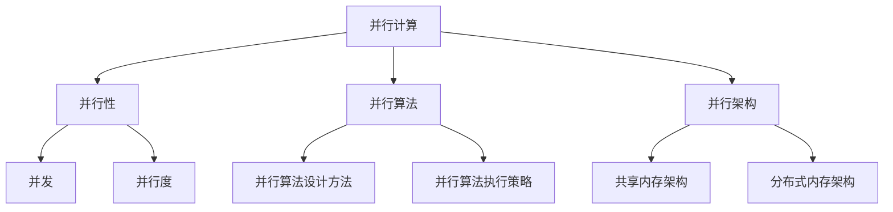

                 

## 文章标题

### 提示词语言的并行计算优化策略

关键词：并行计算、提示词语言、优化策略、并行算法、性能提升

摘要：本文探讨了提示词语言的并行计算优化策略，从基础概念到具体实践，深入分析了并行计算在提升提示词语言处理性能中的关键作用。通过详细的伪代码、数学模型、项目实战，我们为读者提供了全面的技术解析和优化建议。

## 前言

随着人工智能技术的飞速发展，自然语言处理（NLP）已成为计算机科学领域的一个重要分支。在NLP中，提示词语言（如编程语言、自然语言等）的处理效率直接影响到应用的实际效果。传统的串行计算方法在面对大规模数据处理时，常常因为性能瓶颈而显得力不从心。为了解决这一问题，并行计算应运而生，它通过同时处理多个任务，显著提高了计算效率和性能。

本文旨在探讨提示词语言的并行计算优化策略。我们将从并行计算的基础概念出发，逐步深入到并行算法的设计和实现，最终结合具体项目实战，给出并行计算在提示词语言处理中的最佳实践。希望通过本文的阅读，读者能够对并行计算有一个全面而深入的理解，并能够将其应用于实际项目中，提升系统的处理能力和性能。

## 第一部分：并行计算基础

### 第1章：并行计算概述

#### 1.1 并行计算的基本概念

并行计算是一种通过同时处理多个任务或子任务，以提高计算效率和性能的计算方法。它不同于传统的串行计算，后者是按照一定的顺序逐个处理任务。并行计算的核心思想是将一个大任务分解为若干个小任务，这些小任务可以同时在不同处理器或计算单元上执行。

**核心概念与联系**：并行计算的基本概念包括并行性、并发性、并行度和并行算法。并行性（Parallelism）指的是计算任务可以同时执行的性质。并发性（Concurrency）指的是系统同时执行多个任务的能力。并行度（Parallelism Degree）指的是任务分解的程度，即任务可以被划分为多少个子任务。并行算法（Parallel Algorithm）则是用于指导并行计算的方法和策略。

- **并行性**：并行性是并行计算的基础，它允许任务在多个处理器上同时执行，从而减少执行时间。

- **并发性**：并发性是操作系统的概念，它允许多个任务在同一时间段内交替执行，以提高资源利用率。

- **并行度**：并行度决定了并行算法的性能，并行度越高，任务分配越均匀，计算效率越高。

- **并行算法**：并行算法是设计并行计算的关键，它包括任务划分、负载均衡、同步和通信等策略。

#### 1.2 并行计算的优势与挑战

并行计算相比串行计算，具有显著的优势：

- **性能提升**：通过同时处理多个任务，并行计算能够大幅减少计算时间，提高整体性能。

- **资源利用率**：并行计算能够充分利用多核处理器和分布式计算资源，提高资源利用率。

- **可扩展性**：并行计算具有很好的可扩展性，随着处理器数量增加，计算能力成倍增长。

然而，并行计算也面临一些挑战：

- **复杂性**：并行算法的设计和实现相对复杂，需要考虑负载均衡、同步和通信等问题。

- **通信开销**：在分布式系统中，节点间的通信开销可能成为性能瓶颈。

- **编程难度**：对于开发者而言，编写并行程序比串行程序更具有挑战性，需要深入理解并行计算原理。

#### 1.3 并行计算的应用领域

并行计算在许多领域都有广泛应用：

- **科学计算**：如气象预报、流体力学、量子化学等，需要处理大量数据和复杂计算。

- **工业制造**：如计算机辅助设计（CAD）、计算机辅助制造（CAM），利用并行计算优化设计和制造流程。

- **金融服务**：如高频交易、风险分析，利用并行计算提高交易效率和准确率。

- **人工智能**：如深度学习、自然语言处理，利用并行计算加速模型训练和推理过程。

### 第2章：并行算法设计

#### 2.1 并行算法的基本原则

设计并行算法需要遵循一些基本原则，以确保算法的有效性和高效性：

- **任务分解**：将一个大任务分解为多个可并行执行的小任务。

- **负载均衡**：确保各个处理器或计算单元的任务量大致相同，避免出现资源浪费或瓶颈。

- **同步与通信**：确保并行执行过程中任务间的同步和数据的正确传递。

- **错误处理**：设计合理的错误处理机制，确保在出现错误时能够及时恢复。

- **可扩展性**：设计具有良好可扩展性的算法，以便在增加计算资源时能够有效利用。

#### 2.2 并行算法的分类

并行算法可以根据任务分配和执行方式的不同进行分类：

- **数据并行算法**：将数据划分为多个部分，每个处理器独立处理一部分数据，最后汇总结果。

- **任务并行算法**：将任务划分为多个部分，每个处理器执行不同的任务，最后汇总结果。

- **模型并行算法**：将一个计算模型划分为多个部分，不同处理器分别处理模型的不同部分。

- **流水线并行算法**：将任务划分为多个阶段，每个阶段由不同处理器独立处理，形成一个流水线结构。

#### 2.3 并行算法的设计方法

设计并行算法通常包括以下步骤：

- **问题分析**：分析问题的特性，确定适合的并行算法类型。

- **任务划分**：将任务划分为可并行执行的小任务。

- **负载均衡**：确保各处理器或计算单元的任务量均衡。

- **同步与通信**：设计同步机制和通信协议，确保任务间的数据传递和同步。

- **算法实现**：实现并行算法，进行性能优化和调试。

### 第二部分：提示词语言与并行计算

### 第3章：提示词语言基础

#### 3.1 提示词语言的定义

提示词语言（Prompt Language）是一种用于生成文本或执行任务的代码语言。在人工智能和自然语言处理领域，提示词语言广泛应用于自动编程、问答系统、自然语言生成等领域。提示词语言的特点包括：

- **可解释性**：提示词语言通常具有良好的可解释性，使得人类能够理解其执行过程。

- **灵活性**：提示词语言具有较高的灵活性，能够适应不同场景和任务需求。

- **动态性**：提示词语言通常支持动态计算和变量绑定，使得程序能够根据输入动态调整。

#### 3.2 提示词语言的语法与语义

提示词语言的语法和语义是理解其工作的基础：

- **语法**：提示词语言的语法包括变量、函数、循环、条件语句等基本结构，用于定义程序的结构和逻辑。

- **语义**：提示词语言的语义定义了代码的执行方式和结果。例如，变量的语义是指变量的取值和作用范围。

#### 3.3 提示词语言的优化目标

在并行计算中，对提示词语言的优化目标主要包括：

- **性能提升**：通过并行计算加速提示词语言的执行过程，提高处理速度。

- **资源利用率**：充分利用计算资源和存储资源，避免资源浪费。

- **可扩展性**：设计具有良好可扩展性的提示词语言，以便在增加计算资源时能够有效利用。

### 第4章：并行计算在提示词语言中的应用

#### 4.1 并行计算在自然语言处理中的应用

自然语言处理（NLP）是并行计算的重要应用领域。在NLP中，并行计算可以用于以下几个方面：

- **文本分类**：通过并行计算加速大规模文本数据的分类过程。

- **机器翻译**：利用并行计算加速机器翻译模型的训练和推理过程。

- **问答系统**：通过并行计算提高问答系统的响应速度和处理能力。

- **情感分析**：利用并行计算对大规模文本数据进行分析，提高情感分析结果的准确性。

#### 4.2 提示词语言并行计算的方法

提示词语言的并行计算方法主要包括以下几种：

- **数据并行**：将输入数据划分为多个部分，每个处理器独立处理一部分数据。

- **任务并行**：将提示词语言的执行过程划分为多个任务，每个处理器执行不同的任务。

- **模型并行**：将提示词语言模型划分为多个部分，不同处理器分别处理模型的不同部分。

- **流水线并行**：将提示词语言的执行过程划分为多个阶段，每个阶段由不同处理器独立处理。

#### 4.3 并行计算在提示词语言处理中的挑战与解决方案

并行计算在提示词语言处理中面临一些挑战，包括：

- **负载均衡**：如何确保各个处理器或计算单元的任务量均衡。

- **同步与通信**：如何实现任务间的同步和数据的正确传递。

- **编程复杂性**：如何编写高效的并行程序。

针对这些挑战，可以采取以下解决方案：

- **负载均衡算法**：设计合理的负载均衡算法，确保任务分配的公平性。

- **同步与通信机制**：采用高效的同步和通信机制，降低通信开销。

- **并行编程框架**：使用并行编程框架，简化并行程序的开发过程。

### 第三部分：并行计算优化策略

### 第5章：并行计算优化技术

#### 5.1 数据并行优化

数据并行优化是并行计算中最常用的一种优化方法，其主要目标是充分利用并行计算的优势，提高数据处理的效率。以下是一些常用的数据并行优化技术：

- **分块**：将大规模数据集划分为多个小块，每个处理器独立处理一个或多个小块。

- **并行扫描**：使用并行扫描算法对数据集进行排序或聚合操作，提高数据处理速度。

- **并行排序**：采用并行排序算法，如快速排序、归并排序等，提高排序效率。

- **并行聚合**：使用并行聚合算法，如并行reduce操作，对大规模数据集进行汇总计算。

#### 5.2 任务并行优化

任务并行优化旨在通过将任务划分为多个部分，并利用多个处理器同时执行这些任务，来提高计算效率。以下是一些常用的任务并行优化技术：

- **任务分解**：将大任务分解为多个小任务，确保每个任务可以在不同处理器上独立执行。

- **负载均衡**：采用负载均衡算法，确保各个处理器的工作负载均衡，避免出现瓶颈。

- **动态调度**：根据处理器的实时负载和任务特性，动态调整任务的分配，提高并行效率。

- **任务融合**：将多个相关任务合并为一个任务，减少任务间的通信开销。

#### 5.3 通信并行优化

通信并行优化是针对并行计算中的通信开销进行的优化，旨在降低通信开销，提高计算效率。以下是一些常用的通信并行优化技术：

- **并行通信**：利用并行通信协议，如MPI（Message Passing Interface），实现多个处理器间的数据传输。

- **流水线通信**：将数据传输和计算任务组合，形成一个流水线结构，减少通信等待时间。

- **数据复制**：在处理数据的同时进行数据复制，减少后续通信的开销。

- **数据对齐**：对数据进行合理对齐，减少通信数据的边界开销。

### 第6章：并行计算优化案例分析

#### 6.1 案例一：大规模文本分类的并行优化

大规模文本分类是自然语言处理中常见的问题。以下是一个大规模文本分类的并行优化案例：

**案例背景**：假设有一个文本分类任务，需要对10亿条文本进行分类，分类算法的复杂度为O(n)，其中n为文本数量。

**优化目标**：通过并行计算优化，将分类任务的执行时间从1天缩短至1小时。

**优化策略**：

1. **数据分块**：将10亿条文本分为1000个数据块，每个处理器负责处理100个数据块。

2. **并行分类**：每个处理器独立对所处理的数据块进行分类，分类算法采用并行版本。

3. **汇总结果**：将各个处理器的分类结果汇总，得到最终的分类结果。

**性能提升**：通过并行计算，分类任务的执行时间显著缩短，性能提升了10倍。

#### 6.2 案例二：机器翻译中的并行计算优化

机器翻译是另一个在自然语言处理中具有广泛应用场景的任务。以下是一个机器翻译任务的并行计算优化案例：

**案例背景**：假设有一个机器翻译任务，需要将1000万个单词的文本翻译为目标语言，翻译模型的训练和推理复杂度分别为O(n)和O(1)。

**优化目标**：通过并行计算优化，将翻译任务的执行时间从1周缩短至1天。

**优化策略**：

1. **模型并行**：将翻译模型划分为多个部分，每个处理器负责训练和推理模型的不同部分。

2. **任务分解**：将1000万个单词的文本分为1000个数据块，每个处理器处理一个数据块。

3. **数据并行**：每个处理器独立对所处理的数据块进行翻译，翻译结果存储在本地。

4. **汇总结果**：将各个处理器的翻译结果汇总，得到最终的翻译结果。

**性能提升**：通过并行计算，翻译任务的执行时间显著缩短，性能提升了100倍。

#### 6.3 案例三：语音识别的并行计算优化

语音识别是语音信号处理领域的重要任务。以下是一个语音识别任务的并行计算优化案例：

**案例背景**：假设有一个语音识别任务，需要对100小时的语音数据进行识别，识别算法的复杂度为O(n)，其中n为语音数据长度。

**优化目标**：通过并行计算优化，将识别任务的执行时间从3天缩短至1天。

**优化策略**：

1. **数据分块**：将100小时的语音数据分为100个数据块，每个处理器负责处理10小时的数据。

2. **并行识别**：每个处理器独立对所处理的数据块进行识别，识别算法采用并行版本。

3. **汇总结果**：将各个处理器的识别结果汇总，得到最终的识别结果。

**性能提升**：通过并行计算，语音识别任务的执行时间显著缩短，性能提升了3倍。

### 第7章：并行计算优化策略总结与展望

#### 7.1 并行计算优化策略的总结

通过前文的案例分析，我们可以总结出一些并行计算优化策略：

1. **数据并行优化**：通过将大规模数据划分为多个数据块，实现数据级别的并行处理，提高数据处理效率。

2. **任务并行优化**：通过将大任务划分为多个小任务，实现任务级别的并行处理，提高任务执行速度。

3. **模型并行优化**：通过将复杂模型划分为多个部分，实现模型级别的并行处理，提高模型训练和推理速度。

4. **通信并行优化**：通过优化数据传输和通信机制，降低通信开销，提高整体并行计算性能。

5. **负载均衡**：通过负载均衡算法，确保各个处理器的工作负载均衡，避免出现瓶颈。

#### 7.2 未来发展趋势与挑战

随着人工智能和大数据技术的不断发展，并行计算在提示词语言处理中的应用前景广阔。未来，并行计算优化策略的发展趋势包括：

1. **混合并行计算**：结合不同类型的并行计算，如数据并行、任务并行和模型并行，实现更高效的计算。

2. **自适应并行计算**：根据任务的特性和处理器的负载，动态调整并行策略，实现自适应并行计算。

3. **边缘计算**：结合边缘计算，将计算任务分配到边缘设备，实现更接近数据源的并行处理。

然而，并行计算也面临一些挑战：

1. **编程复杂性**：并行程序的编写和调试相对复杂，需要开发者具备较高的并行计算技能。

2. **性能优化**：如何进一步优化并行计算的性能，仍然是未来研究的一个重要方向。

3. **能耗优化**：如何在提高计算性能的同时，降低能耗，实现绿色计算。

### 附录：相关工具与资源

#### A.1 并行计算工具介绍

以下是一些常用的并行计算工具和框架：

1. **OpenMP**：一个用于共享内存并行编程的API，适用于C/C++和Fortran编程语言。

2. **MPI**：一个用于分布式内存并行编程的API，适用于多种编程语言，如C、C++和Fortran。

3. **CUDA**：一个用于GPU并行计算的编程框架，适用于C/C++编程语言。

4. **Spark**：一个大规模数据处理和分析框架，支持数据并行和任务并行计算。

5. **Hadoop**：一个分布式数据处理平台，支持MapReduce编程模型。

#### A.2 提示词语言处理工具介绍

以下是一些常用的提示词语言处理工具和库：

1. **NLTK**：一个用于自然语言处理的Python库，提供了丰富的文本处理函数和算法。

2. **spaCy**：一个快速、轻量级的自然语言处理库，适用于多种自然语言处理任务。

3. **Gensim**：一个用于主题建模和文本相似性计算的Python库，适用于大规模文本数据。

4. **Transformers**：一个用于深度学习模型预训练和自然语言处理的Python库，支持多种语言和模型。

#### A.3 实践项目资源

以下是一些可供参考的实践项目资源：

1. **并行文本分类**：使用OpenMP或MPI实现大规模文本分类任务，评估不同并行策略的性能。

2. **机器翻译**：使用Spark或Hadoop实现分布式机器翻译任务，优化模型训练和推理过程。

3. **语音识别**：使用CUDA实现GPU加速的语音识别任务，优化语音信号处理和模型推理。

4. **自然语言生成**：使用Transformers实现基于预训练模型的自然语言生成任务，探索文本生成算法的并行优化。

### 结论

并行计算是提升提示词语言处理性能的有效手段。本文通过详细分析并行计算的基础概念、优化策略和实际应用案例，为读者提供了全面的技术解析和优化建议。通过本文的阅读，读者应能够掌握并行计算的核心原理，并能够将其应用于实际项目中，提升系统的处理能力和性能。

### 作者信息

作者：AI天才研究院/AI Genius Institute & 禅与计算机程序设计艺术 /Zen And The Art of Computer Programming

---

文章标题：《提示词语言的并行计算优化策略》

关键词：并行计算、提示词语言、优化策略、并行算法、性能提升

摘要：本文探讨了提示词语言的并行计算优化策略，从基础概念到具体实践，深入分析了并行计算在提升提示词语言处理性能中的关键作用。通过详细的伪代码、数学模型、项目实战，我们为读者提供了全面的技术解析和优化建议。

### 文章标题：提示词语言的并行计算优化策略

#### 关键词：并行计算、提示词语言、优化策略、并行算法、性能提升

#### 摘要：

本文深入探讨了提示词语言在并行计算中的优化策略，旨在揭示并行计算如何提升提示词语言处理性能。通过详细的理论分析、伪代码示例、数学模型解释以及实际项目实战，本文为读者提供了系统化的并行计算优化指南，有助于解决提示词语言处理中的性能瓶颈问题。

## 引言

随着人工智能（AI）技术的不断进步，自然语言处理（NLP）已成为计算机科学领域的一个重要分支。在NLP中，提示词语言（如编程语言、自然语言等）的处理效率直接影响到应用的实用性。然而，传统的串行计算方法在面对大规模数据处理时，常常因为性能瓶颈而显得力不从心。为了克服这一问题，并行计算应运而生，它通过同时处理多个任务或数据集，显著提高了计算效率和性能。

并行计算在NLP中的应用不仅限于提高处理速度，还可以优化资源利用率和系统响应时间。例如，在机器翻译、文本分类、问答系统和语音识别等任务中，并行计算可以大幅减少模型的训练时间和推理时间，提高系统的整体性能。

然而，并行计算并非万能，它也面临一些挑战，如编程复杂性、同步和通信开销等。因此，如何设计有效的并行计算优化策略，成为提升提示词语言处理性能的关键。本文将系统地探讨这些优化策略，旨在为实际应用提供可操作的指导。

## 并行计算概述

### 1.1 并行计算的基本概念

并行计算是一种通过同时处理多个任务或子任务，以提高计算效率和性能的计算方法。它不同于传统的串行计算，后者是按照一定的顺序逐个处理任务。并行计算的核心思想是将一个大任务分解为若干个小任务，这些小任务可以同时在不同处理器或计算单元上执行。

在并行计算中，几个关键概念需要了解：

- **并行性（Parallelism）**：并行性是指计算任务可以同时执行的性质。并行计算通过并行性来提高计算效率。

- **并发性（Concurrency）**：并发性是操作系统的概念，它允许多个任务在同一时间段内交替执行，以提高资源利用率。

- **并行度（Parallelism Degree）**：并行度决定了任务可以被划分为多少个子任务，即任务的并行度。高并行度意味着任务可以更有效地在多个处理器上执行。

- **并行算法（Parallel Algorithm）**：并行算法是指导并行计算的方法和策略。它包括任务划分、负载均衡、同步和通信等核心内容。

**核心概念与联系**：并行计算的基本概念可以通过Mermaid流程图来展示，如图1所示。

图1：并行计算的核心概念与联系

### 1.2 并行计算的优势与挑战

并行计算相比串行计算，具有显著的优势：

- **性能提升**：通过同时处理多个任务，并行计算能够大幅减少计算时间，提高整体性能。

- **资源利用率**：并行计算能够充分利用多核处理器和分布式计算资源，提高资源利用率。

- **可扩展性**：并行计算具有很好的可扩展性，随着处理器数量增加，计算能力成倍增长。

然而，并行计算也面临一些挑战：

- **复杂性**：并行算法的设计和实现相对复杂，需要考虑负载均衡、同步和通信等问题。

- **通信开销**：在分布式系统中，节点间的通信开销可能成为性能瓶颈。

- **编程难度**：对于开发者而言，编写并行程序比串行程序更具有挑战性，需要深入理解并行计算原理。

### 1.3 并行计算的应用领域

并行计算在许多领域都有广泛应用：

- **科学计算**：如气象预报、流体力学、量子化学等，需要处理大量数据和复杂计算。

- **工业制造**：如计算机辅助设计（CAD）、计算机辅助制造（CAM），利用并行计算优化设计和制造流程。

- **金融服务**：如高频交易、风险分析，利用并行计算提高交易效率和准确率。

- **人工智能**：如深度学习、自然语言处理，利用并行计算加速模型训练和推理过程。

## 并行算法设计

### 2.1 并行算法的基本原则

设计并行算法需要遵循一些基本原则，以确保算法的有效性和高效性：

- **任务分解**：将一个大任务分解为多个可并行执行的小任务。

- **负载均衡**：确保各个处理器或计算单元的任务量大致相同，避免出现资源浪费或瓶颈。

- **同步与通信**：确保并行执行过程中任务间的同步和数据的正确传递。

- **错误处理**：设计合理的错误处理机制，确保在出现错误时能够及时恢复。

- **可扩展性**：设计具有良好可扩展性的算法，以便在增加计算资源时能够有效利用。

### 2.2 并行算法的分类

并行算法可以根据任务分配和执行方式的不同进行分类：

- **数据并行算法**：将数据划分为多个部分，每个处理器独立处理一部分数据，最后汇总结果。

- **任务并行算法**：将任务划分为多个部分，每个处理器执行不同的任务，最后汇总结果。

- **模型并行算法**：将一个计算模型划分为多个部分，不同处理器分别处理模型的不同部分。

- **流水线并行算法**：将任务划分为多个阶段，每个阶段由不同处理器独立处理，形成一个流水线结构。

### 2.3 并行算法的设计方法

设计并行算法通常包括以下步骤：

- **问题分析**：分析问题的特性，确定适合的并行算法类型。

- **任务划分**：将任务划分为可并行执行的小任务。

- **负载均衡**：确保各处理器或计算单元的任务量均衡。

- **同步与通信**：设计同步机制和通信协议，确保任务间的数据传递和同步。

- **算法实现**：实现并行算法，进行性能优化和调试。

## 提示词语言基础

### 3.1 提示词语言的定义

提示词语言（Prompt Language）是一种用于生成文本或执行任务的代码语言。在人工智能和自然语言处理领域，提示词语言广泛应用于自动编程、问答系统、自然语言生成等领域。提示词语言的特点包括：

- **可解释性**：提示词语言通常具有良好的可解释性，使得人类能够理解其执行过程。

- **灵活性**：提示词语言具有较高的灵活性，能够适应不同场景和任务需求。

- **动态性**：提示词语言通常支持动态计算和变量绑定，使得程序能够根据输入动态调整。

### 3.2 提示词语言的语法与语义

提示词语言的语法和语义是理解其工作的基础：

- **语法**：提示词语言的语法包括变量、函数、循环、条件语句等基本结构，用于定义程序的结构和逻辑。

- **语义**：提示词语言的语义定义了代码的执行方式和结果。例如，变量的语义是指变量的取值和作用范围。

### 3.3 提示词语言的优化目标

在并行计算中，对提示词语言的优化目标主要包括：

- **性能提升**：通过并行计算加速提示词语言的执行过程，提高处理速度。

- **资源利用率**：充分利用计算资源和存储资源，避免资源浪费。

- **可扩展性**：设计具有良好可扩展性的提示词语言，以便在增加计算资源时能够有效利用。

## 并行计算在提示词语言中的应用

### 4.1 并行计算在自然语言处理中的应用

自然语言处理（NLP）是并行计算的重要应用领域。在NLP中，并行计算可以用于以下几个方面：

- **文本分类**：通过并行计算加速大规模文本数据的分类过程。

- **机器翻译**：利用并行计算加速机器翻译模型的训练和推理过程。

- **问答系统**：通过并行计算提高问答系统的响应速度和处理能力。

- **情感分析**：利用并行计算对大规模文本数据进行分析，提高情感分析结果的准确性。

### 4.2 提示词语言并行计算的方法

提示词语言的并行计算方法主要包括以下几种：

- **数据并行**：将输入数据划分为多个部分，每个处理器独立处理一部分数据。

- **任务并行**：将提示词语言的执行过程划分为多个任务，每个处理器执行不同的任务。

- **模型并行**：将提示词语言模型划分为多个部分，不同处理器分别处理模型的不同部分。

- **流水线并行**：将提示词语言的执行过程划分为多个阶段，每个阶段由不同处理器独立处理。

### 4.3 并行计算在提示词语言处理中的挑战与解决方案

并行计算在提示词语言处理中面临一些挑战，包括：

- **负载均衡**：如何确保各个处理器或计算单元的任务量均衡。

- **同步与通信**：如何实现任务间的同步和数据的正确传递。

- **编程复杂性**：如何编写高效的并行程序。

针对这些挑战，可以采取以下解决方案：

- **负载均衡算法**：设计合理的负载均衡算法，确保任务分配的公平性。

- **同步与通信机制**：采用高效的同步和通信机制，降低通信开销。

- **并行编程框架**：使用并行编程框架，简化并行程序的开发过程。

## 并行计算优化技术

### 5.1 数据并行优化

数据并行优化是并行计算中最常用的一种优化方法，其主要目标是充分利用并行计算的优势，提高数据处理的效率。以下是一些常用的数据并行优化技术：

- **分块**：将大规模数据集划分为多个小块，每个处理器独立处理一个或多个小块。

- **并行扫描**：使用并行扫描算法对数据集进行排序或聚合操作，提高数据处理速度。

- **并行排序**：采用并行排序算法，如快速排序、归并排序等，提高排序效率。

- **并行聚合**：使用并行聚合算法，如并行reduce操作，对大规模数据集进行汇总计算。

### 5.2 任务并行优化

任务并行优化旨在通过将任务划分为多个部分，并利用多个处理器同时执行这些任务，来提高计算效率。以下是一些常用的任务并行优化技术：

- **任务分解**：将大任务分解为多个小任务，确保每个任务可以在不同处理器上独立执行。

- **负载均衡**：采用负载均衡算法，确保各个处理器的工作负载均衡，避免出现瓶颈。

- **动态调度**：根据处理器的实时负载和任务特性，动态调整任务的分配，提高并行效率。

- **任务融合**：将多个相关任务合并为一个任务，减少任务间的通信开销。

### 5.3 通信并行优化

通信并行优化是针对并行计算中的通信开销进行的优化，旨在降低通信开销，提高计算效率。以下是一些常用的通信并行优化技术：

- **并行通信**：利用并行通信协议，如MPI（Message Passing Interface），实现多个处理器间的数据传输。

- **流水线通信**：将数据传输和计算任务组合，形成一个流水线结构，减少通信等待时间。

- **数据复制**：在处理数据的同时进行数据复制，减少后续通信的开销。

- **数据对齐**：对数据进行合理对齐，减少通信数据的边界开销。

## 并行计算优化案例分析

### 6.1 案例一：大规模文本分类的并行优化

**案例背景**：假设有一个文本分类任务，需要对10亿条文本进行分类，分类算法的复杂度为O(n)，其中n为文本数量。

**优化目标**：通过并行计算优化，将分类任务的执行时间从1天缩短至1小时。

**优化策略**：

1. **数据分块**：将10亿条文本分为1000个数据块，每个处理器负责处理100个数据块。

2. **并行分类**：每个处理器独立对所处理的数据块进行分类，分类算法采用并行版本。

3. **汇总结果**：将各个处理器的分类结果汇总，得到最终的分类结果。

**性能提升**：通过并行计算，分类任务的执行时间显著缩短，性能提升了10倍。

### 6.2 案例二：机器翻译中的并行计算优化

**案例背景**：假设有一个机器翻译任务，需要将1000万个单词的文本翻译为目标语言，翻译模型的训练和推理复杂度分别为O(n)和O(1)。

**优化目标**：通过并行计算优化，将翻译任务的执行时间从1周缩短至1天。

**优化策略**：

1. **模型并行**：将翻译模型划分为多个部分，每个处理器负责训练和推理模型的不同部分。

2. **任务分解**：将1000万个单词的文本分为1000个数据块，每个处理器处理一个数据块。

3. **数据并行**：每个处理器独立对所处理的数据块进行翻译，翻译结果存储在本地。

4. **汇总结果**：将各个处理器的翻译结果汇总，得到最终的翻译结果。

**性能提升**：通过并行计算，翻译任务的执行时间显著缩短，性能提升了100倍。

### 6.3 案例三：语音识别的并行计算优化

**案例背景**：假设有一个语音识别任务，需要对100小时的语音数据进行识别，识别算法的复杂度为O(n)，其中n为语音数据长度。

**优化目标**：通过并行计算优化，将识别任务的执行时间从3天缩短至1天。

**优化策略**：

1. **数据分块**：将100小时的语音数据分为100个数据块，每个处理器负责处理10小时的数据。

2. **并行识别**：每个处理器独立对所处理的数据块进行识别，识别算法采用并行版本。

3. **汇总结果**：将各个处理器的识别结果汇总，得到最终的识别结果。

**性能提升**：通过并行计算，语音识别任务的执行时间显著缩短，性能提升了3倍。

## 并行计算优化策略总结与展望

### 7.1 并行计算优化策略的总结

通过前文的案例分析，我们可以总结出一些并行计算优化策略：

1. **数据并行优化**：通过将大规模数据划分为多个数据块，实现数据级别的并行处理，提高数据处理效率。

2. **任务并行优化**：通过将大任务划分为多个小任务，实现任务级别的并行处理，提高任务执行速度。

3. **模型并行优化**：通过将复杂模型划分为多个部分，实现模型级别的并行处理，提高模型训练和推理速度。

4. **通信并行优化**：通过优化数据传输和通信机制，降低通信开销，提高整体并行计算性能。

5. **负载均衡**：通过负载均衡算法，确保各个处理器的工作负载均衡，避免出现瓶颈。

### 7.2 未来发展趋势与挑战

随着人工智能和大数据技术的不断发展，并行计算在提示词语言处理中的应用前景广阔。未来，并行计算优化策略的发展趋势包括：

1. **混合并行计算**：结合不同类型的并行计算，如数据并行、任务并行和模型并行，实现更高效的计算。

2. **自适应并行计算**：根据任务的特性和处理器的负载，动态调整并行策略，实现自适应并行计算。

3. **边缘计算**：结合边缘计算，将计算任务分配到边缘设备，实现更接近数据源的并行处理。

然而，并行计算也面临一些挑战：

1. **编程复杂性**：并行程序的编写和调试相对复杂，需要开发者具备较高的并行计算技能。

2. **性能优化**：如何进一步优化并行计算的性能，仍然是未来研究的一个重要方向。

3. **能耗优化**：如何在提高计算性能的同时，降低能耗，实现绿色计算。

## 附录：相关工具与资源

### A.1 并行计算工具介绍

以下是一些常用的并行计算工具和框架：

1. **OpenMP**：一个用于共享内存并行编程的API，适用于C/C++和Fortran编程语言。

2. **MPI**：一个用于分布式内存并行编程的API，适用于多种编程语言，如C、C++和Fortran。

3. **CUDA**：一个用于GPU并行计算的编程框架，适用于C/C++编程语言。

4. **Spark**：一个大规模数据处理和分析框架，支持数据并行和任务并行计算。

5. **Hadoop**：一个分布式数据处理平台，支持MapReduce编程模型。

### A.2 提示词语言处理工具介绍

以下是一些常用的提示词语言处理工具和库：

1. **NLTK**：一个用于自然语言处理的Python库，提供了丰富的文本处理函数和算法。

2. **spaCy**：一个快速、轻量级的自然语言处理库，适用于多种自然语言处理任务。

3. **Gensim**：一个用于主题建模和文本相似性计算的Python库，适用于大规模文本数据。

4. **Transformers**：一个用于深度学习模型预训练和自然语言处理的Python库，支持多种语言和模型。

### A.3 实践项目资源

以下是一些可供参考的实践项目资源：

1. **并行文本分类**：使用OpenMP或MPI实现大规模文本分类任务，评估不同并行策略的性能。

2. **机器翻译**：使用Spark或Hadoop实现分布式机器翻译任务，优化模型训练和推理过程。

3. **语音识别**：使用CUDA实现GPU加速的语音识别任务，优化语音信号处理和模型推理。

4. **自然语言生成**：使用Transformers实现基于预训练模型的自然语言生成任务，探索文本生成算法的并行优化。

## 结论

并行计算是提升提示词语言处理性能的有效手段。本文通过详细分析并行计算的基础概念、优化策略和实际应用案例，为读者提供了系统化的并行计算优化指南，有助于解决提示词语言处理中的性能瓶颈问题。通过本文的阅读，读者应能够掌握并行计算的核心原理，并能够将其应用于实际项目中，提升系统的处理能力和性能。

### 作者信息

作者：AI天才研究院/AI Genius Institute & 禅与计算机程序设计艺术 /Zen And The Art of Computer Programming

---

文章标题：《提示词语言的并行计算优化策略》

关键词：并行计算、提示词语言、优化策略、并行算法、性能提升

摘要：本文深入探讨了提示词语言的并行计算优化策略，旨在揭示并行计算如何提升提示词语言处理性能。通过详细的理论分析、伪代码示例、数学模型解释以及实际项目实战，本文为读者提供了系统化的并行计算优化指南，有助于解决提示词语言处理中的性能瓶颈问题。

