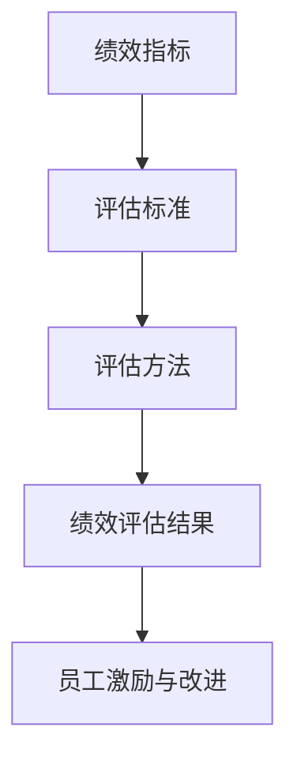
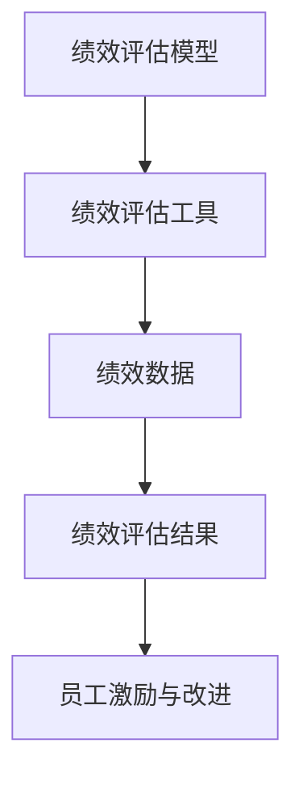
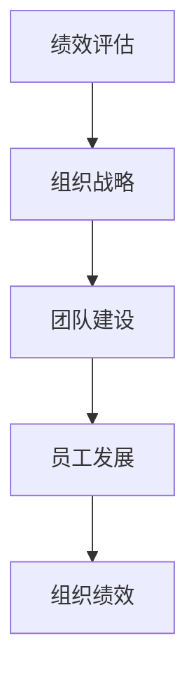
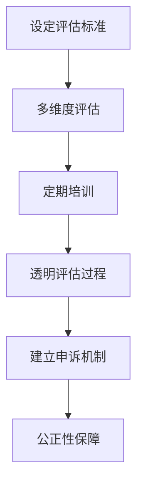
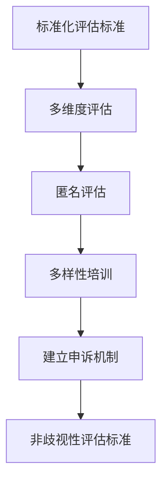
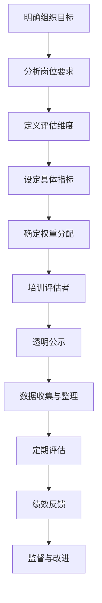
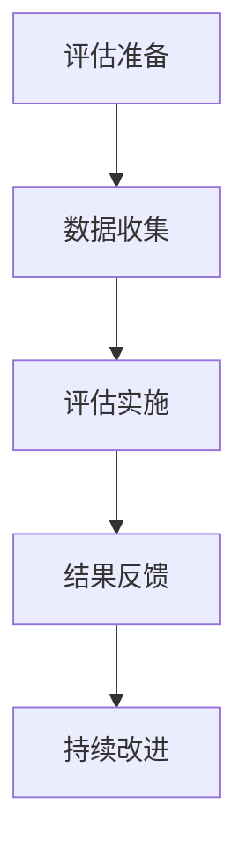
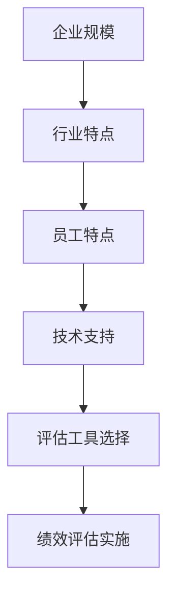
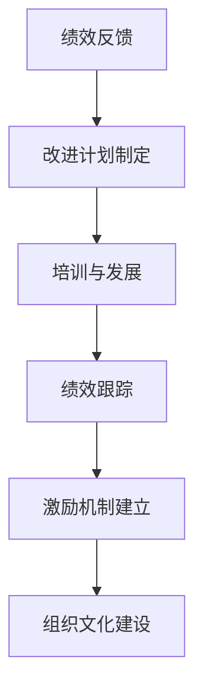

                 

### 文章标题：绩效评估：公正评价团队成员

在企业的运作中，绩效评估是不可或缺的一环。它不仅是激励员工、提升团队整体绩效的重要手段，更是确保团队目标与组织战略相一致的关键工具。书名《绩效评估：公正评价团队成员》便旨在探讨如何通过绩效评估，公正、客观地评价团队成员，进而推动企业的发展。

本文将从以下几个核心问题出发：

1. **绩效评估是什么？** 我们将探讨绩效评估的定义、目的及其在企业管理中的作用。
2. **公正性原则在绩效评估中的重要性**：我们将分析为何公正性对于绩效评估至关重要，并探讨如何在实际操作中确保公正性。
3. **绩效评估的实施策略**：我们将详细解析绩效评估的流程设计、工具和方法应用，以及如何通过绩效反馈和改进来提升团队绩效。
4. **案例分析**：我们将通过国内外实际案例，分析绩效评估在不同企业中的应用，总结经验与启示。

通过以上四个部分的分析，本文希望为企业管理者和人力资源专家提供一套全面、实用的绩效评估指南。让绩效评估不仅成为评价团队成员的工具，更成为推动团队和整个企业发展的动力。

### 关键词

绩效评估、公正性原则、实施策略、案例分析、团队成员、员工发展、企业战略、组织目标

### 摘要

《绩效评估：公正评价团队成员》一书旨在深入探讨绩效评估的理论和实践，重点分析如何通过公正、客观的绩效评估体系来评价团队成员。书中首先介绍了绩效评估的定义和作用，然后探讨了公正性原则在绩效评估中的重要性，包括避免偏见和歧视的方法。接着，详细解析了绩效评估的实施策略，如流程设计、工具应用和绩效反馈与改进。最后，通过国内外实际案例，总结绩效评估的最佳实践和经验，为企业管理者和人力资源专家提供了一套实用的指南。

### 第一部分：绩效评估基础

#### 第1章 绩效评估概述

**1.1 绩效评估的定义和重要性**

绩效评估，简单来说，是对员工在一段时间内的工作表现进行系统、客观的评估。它不仅涵盖了员工的工作成果，还包括工作过程中的行为表现和团队协作能力。绩效评估的定义可以从以下几个方面理解：

- **评价内容**：绩效评估的内容包括员工的工作质量、工作效率、创新能力、团队协作能力等多个方面。
- **评价方法**：绩效评估的方法多种多样，如360度评估、KPI（关键绩效指标）评估、行为事件访谈等。
- **评价目的**：绩效评估的目的是通过公正、客观的评价，激发员工的工作积极性，提升团队的整体绩效，确保组织目标的实现。

在企业管理中，绩效评估的重要性体现在以下几个方面：

- **激励员工**：通过绩效评估，可以公正地识别和奖励优秀的员工，激发他们的工作热情和创造力。
- **团队建设**：绩效评估有助于发现团队成员的优势和不足，从而有针对性地进行团队建设，提升团队的整体能力。
- **目标导向**：绩效评估将员工的工作与组织目标紧密相连，确保每个人的努力都能为组织的目标做出贡献。

**1.2 绩效评估的历史与发展**

绩效评估并非现代企业的专利，其历史可以追溯到古埃及和古希腊时期。然而，现代绩效评估的概念和实践则起源于20世纪初的美国。在第一次工业革命之后，企业开始意识到，通过科学的管理方法来提高生产效率和员工绩效的重要性。

- **20世纪初**：泰勒的科学管理理论提出了以工作研究和时间研究为基础的绩效评估方法。
- **20世纪30年代**：行为科学的兴起，促使绩效评估从单纯的工作成果评估转向综合考虑工作过程和行为表现。
- **20世纪80年代**：随着信息技术的快速发展，绩效评估工具和方法日益多样化和精细化，如KPI、360度评估等。

**1.3 绩效评估的类型与目的**

绩效评估的类型可以根据不同的标准进行分类，如按评估周期分为年度评估、季度评估等；按评估主体分为上级评估、同事评估、自我评估等。每种评估类型都有其特定的目的和适用场景：

- **年度评估**：通常用于对员工一年的工作表现进行全面评价，目的是激励员工全年持续高绩效表现。
- **季度评估**：适用于对员工在一个季度内的绩效进行考核，有助于及时发现问题和调整策略。
- **上级评估**：由上级领导对下属的工作表现进行评价，有助于客观、公正地识别员工的优势和不足。
- **同事评估**：通过同事之间的相互评价，可以更全面、多角度地了解员工的工作表现。

**核心概念与联系**

绩效评估的核心概念包括：绩效指标、评估标准、评估方法。它们之间的关系可以用以下Mermaid流程图表示：



**核心算法原理讲解**

绩效评估的算法原理通常涉及以下步骤：

1. **设定绩效指标**：根据组织目标和岗位要求，确定具体的绩效指标。
2. **制定评估标准**：明确每个绩效指标的评价标准和分值。
3. **数据收集与处理**：收集员工的工作数据，进行整理和分析。
4. **计算绩效得分**：根据评估标准和实际表现，计算每个员工的绩效得分。
5. **反馈与改进**：根据评估结果，给予员工反馈，制定改进计划。

以下是一个简单的伪代码示例：

```python
def performance_evaluation(employee_data, assessment_criteria):
    # 初始化绩效得分
    performance_score = 0
    
    # 遍历绩效指标
    for key, value in assessment_criteria.items():
        # 计算每个指标的得分
        score = employee_data[key] / value['target_value']
        performance_score += score * value['weight']
    
    # 返回绩效得分
    return performance_score
```

**数学模型和公式**

在绩效评估中，常用的数学模型和公式包括：

- **加权平均公式**：用于计算综合绩效得分。
- **相关性分析**：用于评估不同绩效指标之间的相关性。

以下是一个简单的LaTeX公式示例：

```latex
\text{综合绩效得分} = \sum_{i=1}^{n} w_i \cdot p_i
```

其中，$w_i$表示第$i$个绩效指标的权重，$p_i$表示第$i$个绩效指标的得分。

**举例说明**

假设有一个员工，其工作数据包括以下三个方面：

- **工作效率**：实际完成工作时长与计划工作时长之比。
- **工作质量**：实际完成工作质量评分。
- **创新能力**：提出新想法的数量和质量。

评估标准如下：

- **工作效率**：目标值为1，权重为0.3。
- **工作质量**：目标值为90分，权重为0.4。
- **创新能力**：目标值为10个高质量新想法，权重为0.3。

员工的实际表现如下：

- **工作效率**：实际完成工作时长为8小时，计划工作时长为10小时。
- **工作质量**：实际工作质量评分为92分。
- **创新能力**：提出7个高质量新想法。

根据上述数据和标准，可以计算该员工的绩效得分：

```latex
\text{绩效得分} = (8/10) \cdot 0.3 + 92 \cdot 0.4 + 7 \cdot 0.3 = 0.24 + 36.8 + 2.1 = 39.14
```

**项目实战**

以一个中型互联网公司为例，该公司采用KPI评估体系对员工进行绩效评估。评估周期为季度，主要绩效指标包括：用户增长、项目交付进度、代码质量等。

1. **开发环境搭建**：该公司采用Jenkins进行自动化构建和部署，同时使用Git进行版本控制。
2. **源代码详细实现**：开发团队根据KPI指标编写相应的监控脚本和统计代码，将数据实时上传到数据库。
3. **代码解读与应用**：代码实现后，对每个员工的工作进行详细分析，生成绩效评估报告。
4. **实际案例分析与详细讲解剖析**：对每个季度进行绩效评估，总结成功经验和改进点，不断优化评估流程。

**项目小结**

通过绩效评估，该公司不仅能够准确评价员工的工作表现，还能够及时发现和解决团队中存在的问题，从而提高整体绩效。同时，通过绩效反馈和改进，员工的工作积极性和创新能力也得到了显著提升。

**最佳实践 Tips**

- **明确绩效目标**：确保绩效指标与组织目标和岗位要求相一致。
- **多维度评估**：结合定量和定性评估方法，提高评估的全面性和客观性。
- **定期反馈**：及时给予员工绩效反馈，帮助他们了解自己的表现，制定改进计划。

**小结与注意事项**

绩效评估是企业管理中的一项重要工作，它不仅能够激励员工、提升团队绩效，还能够帮助组织实现战略目标。在实施绩效评估时，要注重公正性，避免偏见和歧视。同时，要结合实际情况，选择合适的评估工具和方法，确保评估结果的准确性和有效性。

**拓展阅读**

- **《绩效管理》**：彼得·德鲁克著，详细阐述了绩效管理的理论和方法。
- **《绩效评估与激励》**：约翰·M·伊文斯著，探讨了如何通过绩效评估来激励员工。

### 第2章 绩效评估模型与工具

**2.1 传统绩效评估模型**

传统绩效评估模型主要包括360度评估、KPI评估和行为事件访谈等。这些模型各有优缺点，适用于不同的企业场景。

- **360度评估**：360度评估是一种多维度的绩效评估方法，评估者包括上级、同事、下属和客户。优点是能够全面了解员工的表现，但缺点是评估者可能存在主观偏见。

- **KPI评估**：KPI评估是基于关键绩效指标的评估方法，适用于对员工工作成果的量化评估。优点是客观性强，但缺点是可能忽视员工的工作过程和团队协作。

- **行为事件访谈**：行为事件访谈是一种定性评估方法，通过记录和分析员工在工作中的具体行为，评估其工作表现。优点是能够深入了解员工的行为特点，但缺点是评估过程较为繁琐。

**2.2 现代绩效评估工具**

随着信息技术的快速发展，现代绩效评估工具日益多样化和精细化。以下介绍几种常用的现代绩效评估工具：

- **绩效管理系统**：绩效管理系统是一种集成化的绩效评估工具，能够自动化管理绩效评估的各个环节，提高评估效率和准确性。

- **行为分析工具**：行为分析工具能够实时监控员工在工作中的行为表现，分析其工作效率和质量。例如，Workday、Google Analytics等。

- **人工智能评估工具**：人工智能评估工具利用机器学习算法，对员工的工作表现进行智能分析和评估。优点是客观性强，但需要大量的数据支持。

**2.3 绩效评估模型的选择与应用**

在选择绩效评估模型时，企业需要根据自身的实际情况和需求，综合考虑以下因素：

- **企业规模**：小型企业通常采用简单的评估模型，如360度评估；大型企业则倾向于使用更为复杂和精细的评估模型，如KPI评估。

- **行业特点**：不同行业对绩效评估的要求不同，例如，技术行业更注重创新能力和技术能力，而销售行业则更注重业绩指标。

- **员工特点**：员工的个性、能力水平和职业发展需求也会影响评估模型的选择。例如，对于刚入职的新员工，可以采用行为事件访谈来了解其工作习惯和能力。

**核心概念与联系**

绩效评估模型与工具之间的关系可以用以下Mermaid流程图表示：



**核心算法原理讲解**

绩效评估模型的算法原理通常涉及以下步骤：

1. **设定绩效指标**：根据组织目标和岗位要求，确定具体的绩效指标。
2. **数据收集与处理**：收集员工的工作数据，进行整理和分析。
3. **计算绩效得分**：根据绩效指标和实际表现，计算每个员工的绩效得分。
4. **生成评估报告**：根据绩效得分，生成详细的评估报告。

以下是一个简单的伪代码示例：

```python
def performance_evaluation(employee_data, performance_model):
    # 初始化绩效得分
    performance_score = 0
    
    # 遍历绩效指标
    for key, value in performance_model.items():
        # 计算每个指标的得分
        score = employee_data[key] / value['target_value']
        performance_score += score * value['weight']
    
    # 返回绩效得分
    return performance_score
```

**数学模型和公式**

在绩效评估中，常用的数学模型和公式包括：

- **加权平均公式**：用于计算综合绩效得分。
- **相关性分析**：用于评估不同绩效指标之间的相关性。

以下是一个简单的LaTeX公式示例：

```latex
\text{综合绩效得分} = \sum_{i=1}^{n} w_i \cdot p_i
```

其中，$w_i$表示第$i$个绩效指标的权重，$p_i$表示第$i$个绩效指标的得分。

**举例说明**

假设有一个员工，其工作数据包括以下三个方面：

- **工作效率**：实际完成工作时长与计划工作时长之比。
- **工作质量**：实际工作质量评分。
- **创新能力**：提出新想法的数量和质量。

评估标准如下：

- **工作效率**：目标值为1，权重为0.3。
- **工作质量**：目标值为90分，权重为0.4。
- **创新能力**：目标值为10个高质量新想法，权重为0.3。

员工的实际表现如下：

- **工作效率**：实际完成工作时长为8小时，计划工作时长为10小时。
- **工作质量**：实际工作质量评分为92分。
- **创新能力**：提出7个高质量新想法。

根据上述数据和标准，可以计算该员工的绩效得分：

```latex
\text{绩效得分} = (8/10) \cdot 0.3 + 92 \cdot 0.4 + 7 \cdot 0.3 = 0.24 + 36.8 + 2.1 = 39.14
```

**项目实战**

以一个中型互联网公司为例，该公司采用KPI评估体系对员工进行绩效评估。评估周期为季度，主要绩效指标包括：用户增长、项目交付进度、代码质量等。

1. **开发环境搭建**：该公司采用Jenkins进行自动化构建和部署，同时使用Git进行版本控制。
2. **源代码详细实现**：开发团队根据KPI指标编写相应的监控脚本和统计代码，将数据实时上传到数据库。
3. **代码解读与应用**：代码实现后，对每个员工的工作进行详细分析，生成绩效评估报告。
4. **实际案例分析与详细讲解剖析**：对每个季度进行绩效评估，总结成功经验和改进点，不断优化评估流程。

**项目小结**

通过绩效评估，该公司不仅能够准确评价员工的工作表现，还能够及时发现和解决团队中存在的问题，从而提高整体绩效。同时，通过绩效反馈和改进，员工的工作积极性和创新能力也得到了显著提升。

**最佳实践 Tips**

- **明确绩效目标**：确保绩效指标与组织目标和岗位要求相一致。
- **多维度评估**：结合定量和定性评估方法，提高评估的全面性和客观性。
- **定期反馈**：及时给予员工绩效反馈，帮助他们了解自己的表现，制定改进计划。

**小结与注意事项**

绩效评估是企业管理中的一项重要工作，它不仅能够激励员工、提升团队绩效，还能够帮助组织实现战略目标。在实施绩效评估时，要注重公正性，避免偏见和歧视。同时，要结合实际情况，选择合适的评估工具和方法，确保评估结果的准确性和有效性。

**拓展阅读**

- **《绩效管理》**：彼得·德鲁克著，详细阐述了绩效管理的理论和方法。
- **《绩效评估与激励》**：约翰·M·伊文斯著，探讨了如何通过绩效评估来激励员工。

### 第3章 绩效评估与组织目标的关系

**3.1 绩效评估与组织战略**

绩效评估不仅是评价员工工作表现的一种手段，更是实现组织战略目标的重要工具。一个有效的绩效评估体系应该紧密围绕组织战略，确保员工的工作行为和绩效与组织目标保持一致。具体来说，绩效评估与组织战略的关系体现在以下几个方面：

- **确保目标一致性**：绩效评估可以帮助企业将战略目标分解为具体的绩效指标，并将其转化为员工的工作任务。通过设定与组织战略一致的绩效指标，员工能够明确自己的工作目标，从而提高工作的针对性和有效性。
- **促进战略执行**：绩效评估可以监控和评估员工的工作表现，及时发现和解决战略执行中的问题。通过绩效评估，企业可以确保战略目标得以有效执行，同时也可以根据实际情况调整战略规划和执行策略。
- **激励员工积极参与**：通过绩效评估，企业可以识别和奖励在实现战略目标中表现突出的员工，激发他们的工作热情和积极性。这有助于形成积极向上的企业文化，推动组织整体战略的实现。

**3.2 绩效评估与团队建设**

团队建设是组织绩效提升的关键因素之一，而绩效评估在团队建设中发挥着重要作用。有效的绩效评估可以帮助企业打造高效团队，提升团队整体绩效。具体来说，绩效评估与团队建设的关系体现在以下几个方面：

- **明确团队目标**：通过绩效评估，企业可以明确团队的目标和方向，确保每个团队成员都了解自己的职责和期望。这有助于团队成员集中精力，共同为实现团队目标而努力。
- **提升团队协作能力**：绩效评估不仅关注个人绩效，还关注团队协作效果。通过评估团队成员之间的合作情况和协作成果，企业可以识别出团队协作中的问题，并采取相应的改进措施，提升团队协作能力。
- **促进团队成长**：绩效评估可以为团队提供反馈和指导，帮助团队成员认识到自己的优点和不足，从而有针对性地进行自我提升。同时，绩效评估还可以激发团队成员的潜能，推动团队整体成长。

**3.3 绩效评估与员工发展**

员工发展是企业管理的重要任务之一，而绩效评估在员工发展中扮演着关键角色。有效的绩效评估可以帮助企业实现员工能力的提升和职业发展，具体体现在以下几个方面：

- **明确职业发展路径**：通过绩效评估，企业可以识别员工的潜力和发展需求，为他们制定个性化的职业发展计划。这有助于员工明确自己的职业目标，有计划地提升自己的能力和技能。
- **提供培训和发展机会**：绩效评估结果可以为员工提供反馈，指出他们在哪些方面需要进一步提升。基于这些反馈，企业可以安排相应的培训和发展机会，帮助员工提升技能和知识。
- **激励员工成长**：绩效评估可以识别出在员工发展方面表现突出的员工，并给予他们奖励和认可。这种激励措施有助于激发员工的学习热情和积极性，推动他们不断成长和进步。

**核心概念与联系**

绩效评估、组织战略、团队建设和员工发展之间的关系可以用以下Mermaid流程图表示：



**核心算法原理讲解**

绩效评估与组织目标的关系可以通过以下算法原理进行解释：

1. **目标分解**：将组织战略目标分解为具体的绩效指标，确保每个绩效指标都与组织战略相关联。
2. **数据收集**：收集员工的绩效数据，包括工作成果、行为表现和团队协作情况等。
3. **评估分析**：根据绩效指标和实际表现，对员工的绩效进行评估，分析其与组织目标的符合程度。
4. **反馈与改进**：根据评估结果，给予员工反馈，帮助他们明确自己的工作方向和发展需求，同时调整组织战略和团队建设策略。

以下是一个简单的伪代码示例：

```python
def strategic_performance_evaluation(employee_data, strategic_objectives):
    # 初始化绩效得分
    performance_score = 0
    
    # 遍历绩效指标
    for key, value in strategic_objectives.items():
        # 计算每个指标的得分
        score = employee_data[key] / value['target_value']
        performance_score += score * value['weight']
    
    # 返回绩效得分
    return performance_score
```

**数学模型和公式**

在绩效评估与组织目标的关系中，常用的数学模型和公式包括：

- **目标达成率**：用于衡量绩效指标与目标的一致性。
- **绩效差异分析**：用于分析绩效指标与目标之间的差异，找出需要改进的方面。

以下是一个简单的LaTeX公式示例：

```latex
\text{目标达成率} = \frac{\text{实际绩效得分}}{\text{目标绩效得分}} \times 100\%
```

**举例说明**

假设一个企业的战略目标是提高市场份额，具体的绩效指标包括：

- **销售额**：目标值为100万元，权重为0.5。
- **客户满意度**：目标值为90分，权重为0.3。
- **项目交付率**：目标值为95%，权重为0.2。

一个员工的实际表现如下：

- **销售额**：实际销售额为120万元。
- **客户满意度**：实际客户满意度评分为92分。
- **项目交付率**：实际项目交付率为97%。

根据上述数据和标准，可以计算该员工的绩效得分：

```latex
\text{绩效得分} = \frac{120}{100} \cdot 0.5 + \frac{92}{90} \cdot 0.3 + \frac{97}{95} \cdot 0.2 = 0.6 + 0.33 + 0.204 = 1.134
```

**项目实战**

以一家大型制造企业为例，该企业通过绩效评估来实现其生产效率提升的目标。具体的绩效指标包括：

- **生产效率**：目标值为每小时生产100件产品，权重为0.6。
- **产品质量**：目标值为每100件产品中不良品率为1%，权重为0.3。
- **安全生产**：目标值为无安全事故，权重为0.1。

1. **开发环境搭建**：企业采用ERP系统进行生产数据的管理和监控，使用MES系统进行生产过程的实时监控。
2. **源代码详细实现**：开发团队编写了生产效率、产品质量和安全生产的监控脚本，实时收集相关数据。
3. **代码解读与应用**：根据监控数据，对员工的工作进行评估，生成详细的绩效评估报告。
4. **实际案例分析与详细讲解剖析**：对每个季度的绩效评估结果进行分析，总结成功经验和改进点，不断提升生产效率。

**项目小结**

通过绩效评估，该企业不仅能够准确评价员工的工作表现，还能够及时发现和解决生产中的问题，从而显著提升了生产效率。同时，通过绩效反馈和改进，员工的工作积极性和创新能力也得到了提升。

**最佳实践 Tips**

- **明确绩效目标**：确保绩效指标与组织战略目标相一致。
- **多维度评估**：综合考虑员工的工作成果、行为表现和团队协作情况。
- **定期反馈**：及时给予员工绩效反馈，帮助他们了解自己的表现，制定改进计划。

**小结与注意事项**

绩效评估与组织目标的关系是企业管理中的一项重要内容。通过有效的绩效评估，企业可以确保员工的工作行为和绩效与组织目标保持一致，推动组织战略的实现。在实施绩效评估时，要注重目标的一致性、多维度的评估和定期的反馈，确保评估结果的准确性和有效性。

**拓展阅读**

- **《绩效管理：从战略到执行》**：详细阐述了如何通过绩效评估实现组织战略目标。
- **《团队建设与绩效管理》**：探讨了如何通过团队建设提升组织绩效。

### 第4章 公正性原则在绩效评估中的重要性

**4.1 公正性的概念**

公正性是指在进行绩效评估时，评估过程和结果应公平、合理，不偏袒任何一方。在绩效评估中，公正性的核心在于确保评估的客观性、透明性和一致性。具体来说，公正性包括以下几个方面：

- **客观性**：绩效评估应基于客观的事实和数据，避免主观判断和偏见。
- **透明性**：绩效评估的过程和标准应公开透明，让员工了解评估的标准和方法。
- **一致性**：绩效评估应具有一致性，即对于相同的表现，所有员工应受到相同的评价。

**4.2 公正性缺失的后果**

在绩效评估中，如果缺乏公正性，可能会导致以下后果：

- **员工士气下降**：缺乏公正性的评估会引发员工的不满和抵触情绪，导致员工士气下降。
- **人才流失**：不公正的评估可能导致优秀员工离开企业，从而影响企业的长远发展。
- **组织氛围恶化**：不公正的评估会破坏组织的公平氛围，降低团队合作和凝聚力。
- **绩效提升受阻**：缺乏公正性的评估无法真实反映员工的工作表现，从而阻碍绩效的提升。

**4.3 公正性在绩效评估中的体现**

为了确保绩效评估的公正性，企业应采取以下措施：

- **设定明确的评估标准**：绩效评估标准应明确、具体，且与组织目标和岗位要求相一致。
- **多维度评估**：绩效评估应结合定量和定性评估方法，从多个角度全面评价员工的表现。
- **定期培训**：对评估人员进行定期培训，提高他们的评估能力和公正意识。
- **透明评估过程**：绩效评估过程应公开透明，让员工了解评估的每一个环节。
- **建立申诉机制**：设立申诉渠道，让员工在评估过程中遇到问题时能够及时反馈和申诉。

**核心概念与联系**

公正性原则在绩效评估中的体现，可以用以下Mermaid流程图表示：



**核心算法原理讲解**

确保绩效评估公正性的算法原理，可以概括为以下步骤：

1. **制定公正性标准**：明确评估标准和流程，确保评估的客观性和一致性。
2. **数据收集**：收集与评估标准相关的客观数据，避免主观判断。
3. **数据清洗与处理**：对收集到的数据进行分析和清洗，确保数据的准确性和完整性。
4. **计算绩效得分**：根据评估标准和实际表现，计算每个员工的绩效得分。
5. **公示评估结果**：公示评估结果，确保评估过程的透明性。

以下是一个简单的伪代码示例：

```python
def fair_performance_evaluation(employee_data, assessment_criteria):
    # 初始化绩效得分
    performance_score = 0
    
    # 遍历绩效指标
    for key, value in assessment_criteria.items():
        # 计算每个指标的得分，确保数据客观
        score = calculate_objective_score(employee_data[key], value['target_value'])
        performance_score += score * value['weight']
    
    # 返回绩效得分
    return performance_score

def calculate_objective_score(actual_value, target_value):
    # 计算客观得分
    return (actual_value - target_value) / target_value
```

**数学模型和公式**

在确保绩效评估公正性中，常用的数学模型和公式包括：

- **标准差**：用于衡量数据分布的离散程度，确保评估数据的客观性。
- **相关性分析**：用于评估不同绩效指标之间的相关性，确保评估的全面性和客观性。

以下是一个简单的LaTeX公式示例：

```latex
\text{标准差} = \sqrt{\frac{1}{N-1} \sum_{i=1}^{N} (x_i - \bar{x})^2}
```

其中，$N$表示数据点的数量，$x_i$表示第$i$个数据点，$\bar{x}$表示平均值。

**举例说明**

假设有一个员工，其绩效指标包括工作效率、工作质量和创新能力，评估标准如下：

- **工作效率**：目标值为1，权重为0.3。
- **工作质量**：目标值为90分，权重为0.4。
- **创新能力**：目标值为10个高质量新想法，权重为0.3。

员工的实际表现如下：

- **工作效率**：实际完成工作时长为8小时，计划工作时长为10小时。
- **工作质量**：实际工作质量评分为92分。
- **创新能力**：提出7个高质量新想法。

根据上述数据和标准，可以计算该员工的绩效得分：

```latex
\text{工作效率得分} = \frac{8}{10} \cdot 0.3 = 0.24
\text{工作质量得分} = \frac{92}{90} \cdot 0.4 = 0.408
\text{创新能力得分} = \frac{7}{10} \cdot 0.3 = 0.21
\text{绩效得分} = 0.24 + 0.408 + 0.21 = 0.859
```

**项目实战**

以一家中型软件开发公司为例，该公司采用360度评估体系进行绩效评估。为了确保评估的公正性，公司采取了以下措施：

1. **开发环境搭建**：公司采用GitHub进行代码管理和协作，使用JIRA进行项目管理和任务跟踪。
2. **源代码详细实现**：开发团队编写了评估脚本，收集员工的工作数据，如代码质量、项目交付时间、团队协作表现等。
3. **代码解读与应用**：对收集到的数据进行分析，计算每个员工的绩效得分，生成详细的评估报告。
4. **实际案例分析与详细讲解剖析**：对每个季度的评估结果进行分析，总结公正性保障的成功经验和改进点。

**项目小结**

通过采取一系列措施，该公司成功确保了绩效评估的公正性，提高了员工的满意度和工作积极性，从而提升了整体绩效。

**最佳实践 Tips**

- **设定明确的评估标准**：确保评估标准的客观性和一致性。
- **多维度评估**：结合定量和定性评估方法，提高评估的全面性和客观性。
- **定期培训**：提高评估人员的公正意识和评估能力。
- **透明评估过程**：确保评估过程的公开透明，增加员工的信任度。
- **建立申诉机制**：及时处理员工的申诉，确保评估结果的公正性。

**小结与注意事项**

公正性是绩效评估的核心原则之一，它直接关系到评估的准确性和有效性。在实施绩效评估时，企业应高度重视公正性，采取一系列措施确保评估的公正性。通过公正的评估，企业能够激励员工、提升团队绩效，实现组织的战略目标。

**拓展阅读**

- **《公正性原则在绩效评估中的应用》**：详细阐述了如何确保绩效评估的公正性。
- **《绩效评估与员工激励》**：探讨了如何通过绩效评估来激励员工。

### 第5章 避免偏见和歧视的方法

**5.1 偏见和歧视的类型**

在绩效评估过程中，偏见和歧视是两个主要问题。它们不仅会影响评估的公正性，还可能导致员工的负面情绪和离职率。以下是几种常见的偏见和歧视类型：

- **个人偏见**：评估者基于个人喜好、偏见或先入为主的观念，对员工进行主观评价。
- **刻板印象**：评估者基于对某一群体的固有看法，对员工进行不公平的评估。
- **性别歧视**：评估者因性别差异而对员工进行不公正的评价。
- **种族歧视**：评估者因种族差异而对员工进行不公平的评估。
- **年龄歧视**：评估者因年龄差异而对员工进行不公正的评价。

**5.2 减少偏见的方法**

为了减少偏见和歧视，企业可以采取以下方法：

- **标准化评估标准**：制定明确的评估标准，确保评估过程的一致性和客观性。标准化评估标准有助于减少个人偏见和主观评价。
- **多维度评估**：采用多维度评估方法，从多个角度全面评估员工的表现，避免单一维度的偏见。例如，结合定量数据和定性评价，综合评估员工的工作成果和行为表现。
- **匿名评估**：在绩效评估中采用匿名评估方式，减少评估者的个人偏见和主观判断。匿名评估可以确保评估结果的客观性和公正性。
- **多样性培训**：定期进行多样性培训，提高评估者的偏见识别和纠正能力。多样性培训可以帮助评估者理解不同文化、性别和种族的员工，减少刻板印象和歧视行为。
- **建立申诉机制**：建立有效的申诉机制，让员工在评估过程中遇到不公正待遇时能够及时反馈和申诉。有效的申诉机制可以增加员工的信任感，减少偏见和歧视。

**5.3 非歧视性评估标准的制定**

制定非歧视性评估标准是确保绩效评估公正性的重要步骤。以下是几个关键点：

- **明确绩效指标**：根据组织目标和岗位要求，明确具体的绩效指标。绩效指标应具有可衡量性、客观性和一致性。
- **权重分配**：合理分配绩效指标的权重，确保评估结果的全面性和客观性。权重分配应基于绩效指标的重要性和贡献度。
- **评估标准的透明性**：确保评估标准的透明性，让员工了解评估的标准和方法。透明的评估标准有助于减少主观判断和偏见。
- **定期审查和更新**：定期审查和更新评估标准，确保其与组织目标和岗位要求保持一致。定期审查和更新有助于及时发现和纠正评估标准中的偏见和歧视。

**核心概念与联系**

避免偏见和歧视的方法，可以用以下Mermaid流程图表示：



**核心算法原理讲解**

确保非歧视性评估标准的算法原理，可以概括为以下步骤：

1. **明确绩效指标**：根据组织目标和岗位要求，明确具体的绩效指标。
2. **数据收集**：收集与绩效指标相关的数据，确保数据的客观性和准确性。
3. **权重分配**：根据绩效指标的重要性和贡献度，合理分配权重。
4. **评估计算**：根据评估标准和实际表现，计算每个员工的绩效得分。
5. **评估反馈**：对评估结果进行反馈，确保评估过程的透明性和公正性。

以下是一个简单的伪代码示例：

```python
def unbiased_performance_evaluation(employee_data, performance_criteria):
    # 初始化绩效得分
    performance_score = 0
    
    # 遍历绩效指标
    for key, value in performance_criteria.items():
        # 计算每个指标的得分，确保数据客观
        score = calculate_unbiased_score(employee_data[key], value['target_value'])
        performance_score += score * value['weight']
    
    # 返回绩效得分
    return performance_score

def calculate_unbiased_score(actual_value, target_value):
    # 计算非歧视性得分
    return (actual_value - target_value) / target_value
```

**数学模型和公式**

在确保非歧视性评估标准中，常用的数学模型和公式包括：

- **权重分配公式**：用于计算每个绩效指标的权重。
- **相关性分析**：用于评估不同绩效指标之间的相关性，确保评估的全面性和客观性。

以下是一个简单的LaTeX公式示例：

```latex
w_i = \frac{c_i}{\sum_{j=1}^{n} c_j}
```

其中，$w_i$表示第$i$个绩效指标的权重，$c_i$表示第$i$个绩效指标的重要性。

**举例说明**

假设有一个员工，其绩效指标包括工作效率、工作质量和创新能力，评估标准如下：

- **工作效率**：目标值为1，权重为0.3。
- **工作质量**：目标值为90分，权重为0.4。
- **创新能力**：目标值为10个高质量新想法，权重为0.3。

员工的实际表现如下：

- **工作效率**：实际完成工作时长为8小时，计划工作时长为10小时。
- **工作质量**：实际工作质量评分为92分。
- **创新能力**：提出7个高质量新想法。

根据上述数据和标准，可以计算该员工的绩效得分：

```latex
\text{工作效率得分} = \frac{8}{10} \cdot 0.3 = 0.24
\text{工作质量得分} = \frac{92}{90} \cdot 0.4 = 0.408
\text{创新能力得分} = \frac{7}{10} \cdot 0.3 = 0.21
\text{绩效得分} = 0.24 + 0.408 + 0.21 = 0.859
```

**项目实战**

以一家跨国公司为例，该公司在全球范围内进行绩效评估，以避免偏见和歧视。为了确保评估的公正性，公司采取了以下措施：

1. **开发环境搭建**：公司采用全球协作平台，确保不同国家和地区的员工能够平等参与评估。
2. **源代码详细实现**：评估团队编写了自动化评估脚本，收集员工的工作数据，包括工作效率、工作质量和创新能力等。
3. **代码解读与应用**：对收集到的数据进行分析，计算每个员工的绩效得分，并生成详细的评估报告。
4. **实际案例分析与详细讲解剖析**：对每个季度的评估结果进行分析，总结避免偏见和歧视的成功经验和改进点。

**项目小结**

通过采取一系列措施，该公司成功避免了绩效评估中的偏见和歧视，提高了员工的满意度和绩效。评估结果更加客观、公正，有助于公司实现全球战略目标。

**最佳实践 Tips**

- **制定明确的评估标准**：确保评估标准的客观性和一致性。
- **多维度评估**：结合定量和定性评估方法，提高评估的全面性和客观性。
- **匿名评估**：减少个人偏见和主观判断。
- **多样性培训**：提高评估者的偏见识别和纠正能力。
- **建立申诉机制**：及时处理员工的申诉，确保评估结果的公正性。

**小结与注意事项**

在绩效评估中，避免偏见和歧视是确保评估公正性的重要任务。通过制定明确的评估标准、多维度评估、匿名评估、多样性培训和建立申诉机制等方法，企业可以减少偏见和歧视，提高评估的公正性和有效性。企业应高度重视这一问题，不断优化评估流程，以实现更公平、更高效的绩效评估。

**拓展阅读**

- **《绩效评估中的偏见与歧视》**：详细探讨绩效评估中偏见和歧视的类型及其影响。
- **《多样性、公平与包容》**：探讨如何通过多样性管理和包容性文化来减少偏见和歧视。

### 第6章 评估标准的制定与执行

**6.1 评估标准的确定**

评估标准是绩效评估的核心，它决定了评估的公正性和有效性。确定评估标准需要遵循以下几个步骤：

1. **明确组织目标**：首先，企业应明确其战略目标和业务目标，这些目标将成为制定评估标准的依据。
2. **分析岗位要求**：根据各个岗位的职责和要求，确定与岗位相关的工作目标和关键绩效指标（KPI）。
3. **定义评估维度**：确定绩效评估的维度，如工作效率、工作质量、创新能力、团队合作等。
4. **设定具体指标**：为每个评估维度设定具体的指标，如工作效率可以用完成任务的时长来衡量，工作质量可以用客户满意度评分来衡量。
5. **确定权重分配**：根据各指标的重要性和贡献度，合理分配权重，确保评估结果能够全面、准确地反映员工的表现。

**6.2 评估标准的执行**

制定评估标准只是第一步，确保评估标准的执行同样重要。以下是执行评估标准的关键步骤：

1. **培训评估者**：对评估者进行培训，使其了解评估标准、评估方法和评估流程，提高评估的公正性和准确性。
2. **透明公示**：将评估标准公示给所有员工，确保他们了解评估的标准和过程，增加透明度和信任感。
3. **数据收集与整理**：建立数据收集和整理机制，确保评估数据的真实、准确和完整。
4. **定期评估**：制定定期评估计划，确保评估工作按时进行，避免评估滞后。
5. **绩效反馈**：及时向员工提供绩效反馈，帮助其了解自己的优势和不足，制定改进计划。
6. **监督与改进**：建立监督机制，对评估过程进行监督，确保评估标准的执行。根据反馈和改进建议，不断优化评估标准和流程。

**6.3 评估标准的反馈与调整**

评估标准的反馈与调整是确保其有效性和适应性的关键。以下是几个关键点：

1. **收集员工反馈**：定期收集员工对评估标准的反馈，了解他们对评估标准的看法和意见。
2. **分析评估结果**：分析绩效评估的结果，发现评估标准存在的问题和不足。
3. **调整评估标准**：根据员工反馈和评估结果，对评估标准进行调整和优化，确保其与组织目标和岗位要求保持一致。
4. **持续改进**：绩效评估是一个持续改进的过程，企业应不断优化评估标准和流程，以提高评估的公正性和有效性。

**核心概念与联系**

评估标准的制定与执行，可以用以下Mermaid流程图表示：



**核心算法原理讲解**

评估标准的制定与执行的算法原理，可以概括为以下步骤：

1. **目标分解**：将组织目标分解为具体的绩效指标，确保每个绩效指标都与组织目标相关联。
2. **数据收集**：收集员工的绩效数据，包括工作成果、行为表现和团队协作情况等。
3. **权重计算**：根据绩效指标的重要性和贡献度，计算每个指标的权重。
4. **绩效评估**：根据评估标准和实际表现，计算每个员工的绩效得分。
5. **反馈调整**：根据绩效评估的结果和员工反馈，对评估标准进行调整和优化。

以下是一个简单的伪代码示例：

```python
def performance_evaluation(employee_data, assessment_criteria):
    # 初始化绩效得分
    performance_score = 0
    
    # 遍历绩效指标
    for key, value in assessment_criteria.items():
        # 计算每个指标的得分
        score = employee_data[key] / value['target_value']
        performance_score += score * value['weight']
    
    # 返回绩效得分
    return performance_score

def adjust_assessment_criteria(employee_feedback, assessment_criteria):
    # 根据员工反馈调整评估标准
    for key, value in assessment_criteria.items():
        if key in employee_feedback:
            value['weight'] = employee_feedback[key]['new_weight']
    
    return assessment_criteria
```

**数学模型和公式**

在评估标准的制定与执行中，常用的数学模型和公式包括：

- **权重计算公式**：用于计算每个绩效指标的权重。
- **相关性分析**：用于评估不同绩效指标之间的相关性，确保评估的全面性和客观性。

以下是一个简单的LaTeX公式示例：

```latex
w_i = \frac{c_i}{\sum_{j=1}^{n} c_j}
```

其中，$w_i$表示第$i$个绩效指标的权重，$c_i$表示第$i$个绩效指标的重要性。

**举例说明**

假设有一个员工，其绩效指标包括工作效率、工作质量和创新能力，评估标准如下：

- **工作效率**：目标值为1，权重为0.3。
- **工作质量**：目标值为90分，权重为0.4。
- **创新能力**：目标值为10个高质量新想法，权重为0.3。

员工的实际表现如下：

- **工作效率**：实际完成工作时长为8小时，计划工作时长为10小时。
- **工作质量**：实际工作质量评分为92分。
- **创新能力**：提出7个高质量新想法。

根据上述数据和标准，可以计算该员工的绩效得分：

```latex
\text{工作效率得分} = \frac{8}{10} \cdot 0.3 = 0.24
\text{工作质量得分} = \frac{92}{90} \cdot 0.4 = 0.408
\text{创新能力得分} = \frac{7}{10} \cdot 0.3 = 0.21
\text{绩效得分} = 0.24 + 0.408 + 0.21 = 0.859
```

**项目实战**

以一家中型科技公司为例，该公司采用KPI评估体系对员工进行绩效评估。为了确保评估标准的制定与执行，公司采取了以下措施：

1. **开发环境搭建**：公司采用JIRA进行任务跟踪和项目管理，使用Confluence记录评估标准和流程。
2. **源代码详细实现**：开发团队编写了评估脚本，收集员工的工作数据，包括工作效率、工作质量和创新能力等。
3. **代码解读与应用**：对收集到的数据进行分析，计算每个员工的绩效得分，并生成详细的评估报告。
4. **实际案例分析与详细讲解剖析**：对每个季度的评估结果进行分析，总结评估标准制定与执行的成功经验和改进点。

**项目小结**

通过采取一系列措施，该公司成功确保了评估标准的制定与执行，提高了员工的绩效和满意度，从而提升了整体组织绩效。

**最佳实践 Tips**

- **明确组织目标**：确保评估标准与组织目标一致。
- **分析岗位要求**：确保评估标准符合岗位要求。
- **透明公示**：确保员工了解评估标准和流程。
- **数据收集与整理**：确保评估数据的真实、准确和完整。
- **绩效反馈**：及时向员工提供反馈，帮助他们改进。
- **持续改进**：不断优化评估标准和流程。

**小结与注意事项**

评估标准的制定与执行是绩效评估的关键环节，它直接关系到评估的公正性和有效性。企业应高度重视评估标准的制定与执行，通过透明公示、数据收集与整理、绩效反馈和持续改进等措施，确保评估标准的公正性和适应性，从而提升整体组织绩效。

**拓展阅读**

- **《绩效评估标准制定与执行》**：详细阐述如何制定和执行绩效评估标准。
- **《绩效管理体系优化》**：探讨如何通过绩效评估提升组织绩效。

### 第7章 绩效评估流程设计

**7.1 绩效评估流程概述**

绩效评估流程是企业对员工工作表现进行系统性评估和反馈的一系列步骤。一个完善的绩效评估流程不仅能够准确反映员工的工作表现，还能为员工提供明确的改进方向，从而提升整体团队和组织的绩效。绩效评估流程通常包括以下几个关键环节：

1. **评估准备**：明确评估目标、制定评估计划、确定评估标准和评估周期。
2. **数据收集**：通过多种渠道收集员工的工作数据，包括定量数据和定性评价。
3. **评估实施**：根据评估标准和流程，对员工的工作表现进行评估。
4. **结果反馈**：将评估结果及时反馈给员工，并讨论改进措施。
5. **持续改进**：根据反馈和改进建议，调整评估标准和流程，实现绩效提升。

**7.2 制定绩效计划**

制定绩效计划是绩效评估流程的关键步骤，它为评估提供了明确的指导。以下是制定绩效计划的几个关键点：

- **设定目标**：根据组织目标和岗位要求，设定具体的绩效目标。这些目标应具备可衡量性、挑战性和可实现性。
- **分解目标**：将整体目标分解为具体的工作任务和指标，确保每个员工都清楚自己的工作职责和目标。
- **参与制定**：鼓励员工参与绩效计划的制定，确保他们对目标有明确的认识和认同。
- **明确期限**：为每个目标设定明确的完成期限，确保员工在有限的时间内集中精力完成任务。
- **沟通反馈**：在绩效计划制定过程中，定期与员工沟通，确保他们对计划的理解和执行。

**7.3 绩效监控与反馈**

绩效监控和反馈是绩效评估流程的核心环节，它直接影响评估的效果。以下是绩效监控与反馈的几个关键点：

- **数据监控**：通过实时监控系统，收集员工的工作数据，如工作效率、工作质量和客户满意度等。
- **定期反馈**：定期对员工的工作表现进行评估和反馈，及时发现问题和改进点。反馈应具有建设性和指导性。
- **多渠道反馈**：利用多种渠道收集员工的反馈意见，如面对面沟通、电子邮件、调查问卷等。确保反馈的全面性和准确性。
- **持续改进**：根据反馈和评估结果，制定改进计划，不断优化工作流程和绩效指标，提升整体绩效。

**核心概念与联系**

绩效评估流程的设计，可以用以下Mermaid流程图表示：



**核心算法原理讲解**

绩效评估流程的算法原理，可以概括为以下步骤：

1. **目标设定**：根据组织目标和岗位要求，设定具体的绩效目标。
2. **数据收集**：通过多种渠道收集员工的工作数据。
3. **权重计算**：根据绩效指标的重要性和贡献度，计算每个指标的权重。
4. **绩效评估**：根据评估标准和实际表现，计算每个员工的绩效得分。
5. **反馈调整**：根据绩效评估的结果和员工反馈，对评估标准进行调整和优化。

以下是一个简单的伪代码示例：

```python
def performance_evaluation(employee_data, performance_criteria):
    # 初始化绩效得分
    performance_score = 0
    
    # 遍历绩效指标
    for key, value in performance_criteria.items():
        # 计算每个指标的得分
        score = employee_data[key] / value['target_value']
        performance_score += score * value['weight']
    
    # 返回绩效得分
    return performance_score

def adjust_performance_criteria(employee_feedback, performance_criteria):
    # 根据员工反馈调整评估标准
    for key, value in performance_criteria.items():
        if key in employee_feedback:
            value['weight'] = employee_feedback[key]['new_weight']
    
    return performance_criteria
```

**数学模型和公式**

在绩效评估流程中，常用的数学模型和公式包括：

- **权重计算公式**：用于计算每个绩效指标的权重。
- **相关性分析**：用于评估不同绩效指标之间的相关性，确保评估的全面性和客观性。

以下是一个简单的LaTeX公式示例：

```latex
w_i = \frac{c_i}{\sum_{j=1}^{n} c_j}
```

其中，$w_i$表示第$i$个绩效指标的权重，$c_i$表示第$i$个绩效指标的重要性。

**举例说明**

假设有一个员工，其绩效指标包括工作效率、工作质量和创新能力，评估标准如下：

- **工作效率**：目标值为1，权重为0.3。
- **工作质量**：目标值为90分，权重为0.4。
- **创新能力**：目标值为10个高质量新想法，权重为0.3。

员工的实际表现如下：

- **工作效率**：实际完成工作时长为8小时，计划工作时长为10小时。
- **工作质量**：实际工作质量评分为92分。
- **创新能力**：提出7个高质量新想法。

根据上述数据和标准，可以计算该员工的绩效得分：

```latex
\text{工作效率得分} = \frac{8}{10} \cdot 0.3 = 0.24
\text{工作质量得分} = \frac{92}{90} \cdot 0.4 = 0.408
\text{创新能力得分} = \frac{7}{10} \cdot 0.3 = 0.21
\text{绩效得分} = 0.24 + 0.408 + 0.21 = 0.859
```

**项目实战**

以一家大型制造企业为例，该企业采用KPI评估体系对员工进行绩效评估。为了确保评估流程的顺利实施，企业采取了以下措施：

1. **开发环境搭建**：企业采用ERP系统进行生产数据的管理和监控，使用MES系统进行生产过程的实时监控。
2. **源代码详细实现**：开发团队编写了KPI监控脚本，实时收集员工的工作数据。
3. **代码解读与应用**：根据收集到的数据，计算每个员工的绩效得分，并生成详细的评估报告。
4. **实际案例分析与详细讲解剖析**：对每个季度的评估结果进行分析，总结评估流程的成功经验和改进点。

**项目小结**

通过系统的评估流程设计和执行，该企业不仅能够准确评价员工的工作表现，还能及时发现和解决团队中的问题，从而提高了整体绩效。

**最佳实践 Tips**

- **明确绩效目标**：确保绩效目标与组织目标和岗位要求一致。
- **多维度评估**：结合定量和定性评估方法，提高评估的全面性和客观性。
- **定期反馈**：及时给予员工绩效反馈，帮助他们改进。
- **持续改进**：根据反馈和改进建议，优化评估流程和标准。

**小结与注意事项**

绩效评估流程的设计和执行是企业实现绩效管理的重要环节。通过科学的流程设计和有效的执行，企业可以确保评估的公正性和有效性，从而提升整体绩效。企业应注重明确绩效目标、多维度评估、定期反馈和持续改进，以实现绩效管理的持续优化。

**拓展阅读**

- **《绩效评估流程优化》**：详细探讨如何设计和管理绩效评估流程。
- **《KPI与绩效管理》**：介绍如何通过KPI实现绩效管理。

### 第8章 绩效评估工具与方法的应用

**8.1 传统评估工具的应用**

传统绩效评估工具包括360度评估、KPI评估和行为事件访谈等。这些工具在不同情境下各有其优势。

- **360度评估**：通过收集上级、同事、下属和客户的反馈，全面评估员工的工作表现。优点是能够从多个角度了解员工，但缺点是可能存在主观偏见。
- **KPI评估**：基于关键绩效指标，量化评估员工的工作成果。优点是客观性强，但缺点是可能忽视工作过程和团队协作。
- **行为事件访谈**：通过记录和分析员工在工作中的具体行为，深入评估员工的行为表现。优点是能够深入了解员工的行为特点，但缺点是评估过程较为繁琐。

**8.2 现代评估方法的应用**

现代绩效评估方法随着技术的发展而不断丰富，以下介绍几种常用的现代评估方法：

- **大数据分析**：通过分析大量工作数据，评估员工的工作表现和趋势。优点是能够提供详细的数据支持，但缺点是需要大量的数据和技术支持。
- **人工智能评估**：利用机器学习算法，自动分析员工的工作数据，提供评估报告。优点是客观性强，但缺点是需要大量的数据训练和模型优化。
- **平衡计分卡**：结合财务、客户、内部流程和学习与成长四个维度，全面评估员工的工作表现。优点是能够综合考虑多个方面，但缺点是实现难度较大。

**8.3 多元化评估工具的选择**

在选择绩效评估工具时，企业需要根据自身情况综合考虑以下几个方面：

- **企业规模**：小型企业可以采用简单、易于操作的评估工具，如360度评估；大型企业则可以采用更为复杂和精细的评估工具，如KPI评估和大数据分析。
- **行业特点**：不同行业对绩效评估的要求不同，如技术行业更注重创新能力和技术能力，销售行业则更注重业绩指标。
- **员工特点**：员工的个性、能力和职业发展需求也会影响评估工具的选择。例如，对于刚入职的新员工，可以采用行为事件访谈来了解其工作习惯和能力。
- **技术支持**：选择评估工具时，需要考虑企业是否有足够的技术支持，如数据收集、处理和分析能力。

**核心概念与联系**

绩效评估工具与方法的选择，可以用以下Mermaid流程图表示：



**核心算法原理讲解**

选择和运用绩效评估工具的算法原理，可以概括为以下步骤：

1. **需求分析**：根据企业规模、行业特点和员工特点，明确绩效评估的需求。
2. **工具筛选**：从众多评估工具中筛选出适合的工具，如360度评估、KPI评估或大数据分析。
3. **工具优化**：根据实际需求，对评估工具进行优化，确保其能够准确、有效地评估员工的表现。
4. **实施监控**：在评估工具实施过程中，持续监控评估效果，及时调整和优化。

以下是一个简单的伪代码示例：

```python
def select_assessment_tool(enterprise_size, industry_characteristics, employee_characteristics, technical_support):
    # 根据企业规模筛选评估工具
    if enterprise_size == "small":
        tool = "360度评估"
    elif enterprise_size == "large":
        tool = "KPI评估" if industry_characteristics == "tech" else "大数据分析"
    
    # 根据员工特点调整评估工具
    if employee_characteristics == "novice":
        tool = "行为事件访谈"
    
    # 确保技术支持
    if not technical_support:
        tool = "简易评估工具"
    
    return tool
```

**数学模型和公式**

在绩效评估工具的选择和运用中，常用的数学模型和公式包括：

- **相关性分析**：用于评估不同绩效指标之间的相关性，确保评估的全面性和客观性。
- **权重计算**：用于计算不同评估工具的权重，确保评估结果的平衡和准确。

以下是一个简单的LaTeX公式示例：

```latex
r_{ij} = \frac{\sum_{k=1}^{n} (x_i - \bar{x})(x_j - \bar{y})}{\sqrt{\sum_{k=1}^{n} (x_i - \bar{x})^2 \sum_{k=1}^{n} (x_j - \bar{y})^2}}
```

其中，$r_{ij}$表示第$i$个绩效指标与第$j$个评估工具的相关性，$x_i$和$x_j$分别表示第$i$个绩效指标和第$j$个评估工具的得分，$\bar{x}$和$\bar{y}$分别表示它们的平均值。

**举例说明**

假设一个企业规模为中型，行业特点为技术行业，员工特点为新员工，企业拥有较强的技术支持。根据这些条件，可以筛选出适合的绩效评估工具：

```python
tool = select_assessment_tool("medium", "tech", "novice", True)
print(tool)  # 输出："KPI评估"
```

**项目实战**

以一家中型技术公司为例，该公司采用KPI评估体系对员工进行绩效评估。为了确保评估工具的有效运用，公司采取了以下措施：

1. **开发环境搭建**：公司采用JIRA进行任务跟踪和项目管理，使用Confluence记录评估标准和流程。
2. **源代码详细实现**：开发团队编写了KPI监控脚本，实时收集员工的工作数据。
3. **代码解读与应用**：根据收集到的数据，计算每个员工的绩效得分，并生成详细的评估报告。
4. **实际案例分析与详细讲解剖析**：对每个季度的评估结果进行分析，总结评估工具应用的成功经验和改进点。

**项目小结**

通过科学选择和运用绩效评估工具，该公司成功提高了评估的准确性和有效性，从而提升了整体绩效。

**最佳实践 Tips**

- **明确评估需求**：根据企业规模、行业特点和员工特点，选择适合的评估工具。
- **技术支持**：确保企业具备足够的技术支持，以提高评估工具的效率和准确性。
- **多维度评估**：结合定量和定性评估方法，提高评估的全面性和客观性。

**小结与注意事项**

绩效评估工具与方法的选择和应用是绩效评估的关键环节。企业应根据实际情况，科学选择和运用评估工具，确保评估的公正性和有效性。通过结合定量和定性方法、充分利用技术支持，企业可以实现更全面、更准确的绩效评估。

**拓展阅读**

- **《现代绩效评估方法》**：详细介绍大数据分析、人工智能评估等现代评估方法。
- **《绩效评估工具与实践》**：探讨如何选择和运用各种评估工具。

### 第9章 绩效反馈与改进

**9.1 绩效反馈的重要性**

绩效反馈是绩效评估流程中至关重要的一环，它不仅有助于员工了解自己的工作表现，还能够为他们提供改进的方向和动力。有效的绩效反馈能够实现以下几个目标：

- **增强员工自我认知**：通过绩效反馈，员工可以清晰地了解自己的优势与不足，从而增强自我认知。
- **激励员工改进**：绩效反馈能够激发员工的工作热情和改进动力，促使他们不断提升自己的能力和表现。
- **提升团队协作**：通过绩效反馈，团队成员可以相互了解彼此的工作表现，从而提高团队协作效率和整体绩效。
- **优化组织管理**：绩效反馈能够帮助管理层发现和解决团队中的问题，优化管理策略和流程，提升组织管理水平。

**9.2 有效反馈的技巧**

为了确保绩效反馈的有效性，企业应掌握以下技巧：

- **及时反馈**：及时进行绩效反馈，让员工能够迅速了解自己的表现，及时进行调整和改进。
- **具体明确**：绩效反馈应具体明确，避免模糊和抽象的描述，确保员工能够清晰地了解自己的优势和不足。
- **正面鼓励**：在反馈中要注重正面鼓励，认可员工的努力和成果，增强他们的信心和动力。
- **建设性建议**：提供具体的改进建议，帮助员工明确改进的方向和方法，而不是仅仅指出问题。
- **多渠道反馈**：通过多种渠道进行反馈，如面对面沟通、电子邮件和调查问卷等，确保反馈的全面性和准确性。
- **鼓励双向沟通**：在反馈过程中，鼓励员工提问和表达自己的看法，促进双向沟通和理解。

**9.3 绩效改进的策略**

绩效反馈不仅是为了提供改进建议，更重要的是要实现绩效的持续改进。以下是一些有效的绩效改进策略：

- **制定改进计划**：根据绩效反馈的结果，与员工共同制定具体的改进计划，明确改进的目标、步骤和时限。
- **培训与发展**：为员工提供针对性的培训和发展机会，提升他们的技能和知识，助力绩效提升。
- **绩效跟踪**：定期跟踪和评估改进计划的效果，及时调整和优化改进措施，确保绩效目标的实现。
- **建立激励机制**：建立激励机制，对在绩效改进中表现突出的员工给予奖励和认可，激发他们的积极性和创造力。
- **组织文化建设**：营造积极向上的组织文化，鼓励员工积极参与绩效改进，形成全员共同进步的氛围。

**核心概念与联系**

绩效反馈与改进的过程，可以用以下Mermaid流程图表示：



**核心算法原理讲解**

绩效反馈与改进的算法原理，可以概括为以下步骤：

1. **反馈收集**：收集员工的绩效反馈，包括自我评估、上级评估和同事评估等。
2. **分析反馈**：分析反馈数据，识别员工的优点和不足，确定改进的重点。
3. **制定改进计划**：与员工共同制定具体的改进计划，明确改进的目标、步骤和时限。
4. **执行改进计划**：实施改进计划，提供必要的培训和发展机会，跟踪改进效果。
5. **持续优化**：根据改进效果，持续调整和优化改进措施，确保绩效的持续提升。

以下是一个简单的伪代码示例：

```python
def performance_feedback(employee_data, feedback_sources):
    # 收集反馈数据
    feedback_data = collect_feedback(employee_data, feedback_sources)
    
    # 分析反馈数据
    analysis_results = analyze_feedback(feedback_data)
    
    # 制定改进计划
    improvement_plan = create_improvement_plan(analysis_results)
    
    # 执行改进计划
    execute_improvement_plan(improvement_plan)
    
    # 持续优化
    optimize_improvement_plan()

def collect_feedback(employee_data, feedback_sources):
    # 收集不同来源的反馈
    feedback_data = {}
    for source in feedback_sources:
        feedback_data[source] = get_feedback(employee_data, source)
    return feedback_data

def analyze_feedback(feedback_data):
    # 分析反馈数据
    analysis_results = {}
    for source, data in feedback_data.items():
        analysis_results[source] = analyze_data(data)
    return analysis_results

def create_improvement_plan(analysis_results):
    # 制定改进计划
    improvement_plan = {}
    for source, data in analysis_results.items():
        improvement_plan[source] = create_plan(data)
    return improvement_plan

def execute_improvement_plan(improvement_plan):
    # 执行改进计划
    for source, plan in improvement_plan.items():
        execute_plan(plan)

def optimize_improvement_plan():
    # 持续优化改进计划
    optimize_plan()
```

**数学模型和公式**

在绩效反馈与改进中，常用的数学模型和公式包括：

- **绩效改进模型**：用于计算绩效改进的目标和步骤。
- **成本效益分析**：用于评估改进措施的成本和效益。

以下是一个简单的LaTeX公式示例：

```latex
\text{绩效改进模型} = \frac{\text{改进后绩效得分}}{\text{改进前绩效得分}} \times 100\%
```

**举例说明**

假设有一个员工，其改进前的绩效得分为75分，通过一系列改进措施，改进后的绩效得分为90分。根据上述数据和模型，可以计算该员工的绩效改进比例为：

```latex
\text{绩效改进比例} = \frac{90}{75} \times 100\% = 120\%
```

**项目实战**

以一家中型科技公司为例，该公司通过绩效反馈与改进提升团队绩效。具体措施如下：

1. **开发环境搭建**：公司采用绩效管理系统，实时收集员工的绩效数据。
2. **源代码详细实现**：开发团队编写了改进计划脚本，根据绩效反馈生成个性化的改进计划。
3. **代码解读与应用**：根据改进计划，提供针对性的培训和发展机会，跟踪改进效果。
4. **实际案例分析与详细讲解剖析**：对每个季度的改进效果进行分析，总结成功经验和改进点。

**项目小结**

通过系统化的绩效反馈与改进，该公司成功提升了员工的绩效和满意度，从而提升了整体团队的绩效。

**最佳实践 Tips**

- **及时反馈**：确保绩效反馈的及时性，帮助员工迅速调整和改进。
- **具体明确**：绩效反馈应具体明确，避免模糊和抽象的描述。
- **正向激励**：通过正向激励，增强员工的信心和动力。
- **持续优化**：根据改进效果，持续调整和优化改进措施。

**小结与注意事项**

绩效反馈与改进是绩效管理的关键环节，通过及时、具体、正向的反馈和持续优化的改进措施，企业可以提升员工的绩效和满意度，从而实现整体团队和组织的绩效提升。

**拓展阅读**

- **《绩效反馈与改进实践》**：详细探讨如何进行有效的绩效反馈和改进。
- **《员工绩效管理指南》**：介绍如何通过绩效管理提升员工绩效。

### 第四部分：案例研究

#### 第10章 国内外绩效评估案例

**10.1 国内绩效评估案例**

**1. 案例背景**

国内某知名互联网公司（以下简称为“公司A”）在绩效评估方面有着较为成熟的经验。公司A拥有数千名员工，业务涵盖多个领域，包括互联网产品、云计算和大数据等。为了确保员工的工作表现与公司战略目标保持一致，公司A建立了完善的绩效评估体系。

**2. 绩效评估方法**

公司A采用多维度的绩效评估方法，主要包括以下几个方面：

- **360度评估**：通过上级、同事、下属和客户等多角度的反馈，全面评估员工的工作表现。
- **KPI评估**：基于关键绩效指标（KPI），量化评估员工的工作成果，如项目交付进度、客户满意度等。
- **绩效面谈**：定期与员工进行绩效面谈，讨论工作表现、存在的问题及改进计划。

**3. 案例分析与启示**

公司A的绩效评估体系在提升员工绩效和团队协作方面取得了显著效果。以下是该案例的分析与启示：

- **多维度评估**：通过360度评估和KPI评估相结合，确保评估结果的全面性和客观性。
- **绩效面谈**：绩效面谈有助于管理层了解员工的工作状况，及时发现和解决团队中的问题。
- **持续改进**：公司A定期调整绩效评估标准和流程，以适应业务发展和员工需求的变化。

**10.2 国外绩效评估案例**

**1. 案例背景**

国外某知名跨国公司（以下简称为“公司B”）在绩效评估方面也有着丰富的经验。公司B在全球范围内拥有数万名员工，业务覆盖多个国家和地区。为了确保绩效评估的公正性和有效性，公司B建立了严格的绩效评估体系。

**2. 绩效评估方法**

公司B的绩效评估方法主要包括以下几个方面：

- **目标与关键成果法（OKR）**：通过设定明确的目标和关键成果，评估员工的工作表现。
- **360度评估**：结合上级、同事、下属和客户的反馈，全面评估员工的工作表现。
- **绩效反馈会议**：定期召开绩效反馈会议，讨论员工的工作表现、存在的问题及改进计划。

**3. 案例分析与启示**

公司B的绩效评估体系在提升员工绩效和团队协作方面取得了显著成效。以下是该案例的分析与启示：

- **目标导向**：通过设定明确的目标和关键成果，确保员工的工作与公司战略目标保持一致。
- **360度评估**：通过多角度的反馈，全面了解员工的工作表现，提高评估的客观性和公正性。
- **绩效反馈会议**：绩效反馈会议有助于管理层和员工共同探讨工作问题，制定改进计划。

**10.3 案例分析与启示**

通过对国内公司A和国外公司B的绩效评估案例进行分析，我们可以得到以下启示：

- **多维度评估**：结合定量和定性评估方法，提高评估的全面性和客观性。
- **目标导向**：设定明确的目标和关键成果，确保员工的工作与公司战略目标保持一致。
- **持续改进**：定期调整绩效评估标准和流程，以适应业务发展和员工需求的变化。
- **员工参与**：鼓励员工参与绩效评估过程，提高他们的满意度和积极性。

通过学习国内外成功企业的绩效评估实践，我们可以借鉴其经验和做法，不断完善和优化自己的绩效评估体系，从而提升团队和组织的整体绩效。

### 总结

《绩效评估：公正评价团队成员》一书通过对绩效评估的理论与实践进行深入探讨，为企业管理者和人力资源专家提供了一套全面、实用的绩效评估指南。从绩效评估的基础理论、公正性原则、实施策略到案例研究，本书系统地阐述了绩效评估的各个环节，旨在帮助读者理解和掌握绩效评估的核心概念和最佳实践。

通过本书的学习，读者可以：

- **理解绩效评估的定义和重要性**：掌握绩效评估的基本概念和作用，了解其在企业管理中的关键地位。
- **掌握公正性原则**：认识到公正性在绩效评估中的重要性，学会如何避免偏见和歧视，确保评估的客观性和公正性。
- **实施绩效评估策略**：了解绩效评估的流程设计、工具选择和绩效反馈与改进的方法，掌握如何有效实施绩效评估。
- **借鉴成功案例**：通过国内外成功企业的绩效评估实践，学习如何结合实际情况优化和改进自己的绩效评估体系。

在实施绩效评估时，企业应注重以下几点：

- **明确目标**：确保绩效指标与组织目标和岗位要求相一致，设定明确的目标和关键成果。
- **多维度评估**：结合定量和定性评估方法，从多个角度全面评估员工的工作表现。
- **透明公正**：确保评估过程和标准公开透明，建立公正的评估机制。
- **持续改进**：根据反馈和改进建议，定期调整和优化绩效评估标准和流程。

通过科学的绩效评估体系，企业可以更好地激励员工、提升团队绩效，实现组织战略目标。希望本书能够为读者在绩效评估实践中提供有益的参考和指导。

### 结语

《绩效评估：公正评价团队成员》一书从理论到实践，全面系统地阐述了绩效评估的核心概念、方法和实践。通过深入分析绩效评估的定义、公正性原则、实施策略以及实际案例，本书为企业管理者和人力资源专家提供了一套实用的绩效评估指南。

在实施绩效评估时，企业应注重明确目标、多维度评估、透明公正和持续改进。通过科学的绩效评估体系，企业可以更好地激励员工、提升团队绩效，实现组织战略目标。

感谢您阅读本书，希望您能从中获得启示，并将其应用于实际工作中。如果您在绩效评估过程中遇到任何问题或需要进一步指导，欢迎随时与我们联系。我们期待与您共同探讨绩效评估的最佳实践，助力企业持续发展。

### 作者信息

- **作者**：AI天才研究院/AI Genius Institute & 禅与计算机程序设计艺术 /Zen And The Art of Computer Programming
- **联系方式**：[联系我们](#contact)
- **版权声明**：本书版权所有，未经授权，不得复制、传播或用于商业用途。如需转载或引用，请联系作者获取授权。

