                 


###  文章标题：《远程团队管理：跨越距离的领导艺术》

#### 关键词：远程团队管理、领导艺术、跨距沟通、项目管理、组织结构、国际化管理

#### 摘要：
在现代信息技术飞速发展的背景下，远程工作已成为一种常态。远程团队管理作为一门新兴的领导艺术，涵盖了跨地域、跨时区、跨文化的协作与领导。本文旨在深入探讨远程团队管理的关键要素，提供实用的管理策略和实践指导，帮助领导者提升远程团队的工作效率和团队凝聚力。

---

## 第一部分：远程团队管理基础

### 第1章：远程团队概述

#### 1.1 远程工作的起源与发展

**背景介绍：** 
远程工作并非现代才有的现象，但21世纪的信息技术革命极大地推动了远程工作的普及。从最初的电子邮件到即时通讯工具，再到视频会议和协作平台，远程工作的形式和手段不断进化。

**核心概念与联系：**
- **远程工作的起源：** 20世纪90年代，互联网的兴起为远程工作提供了技术支持。
- **远程团队的发展：** 随着云技术和虚拟办公室的发展，远程团队规模和复杂性不断增加。

**Mermaid流程图：**

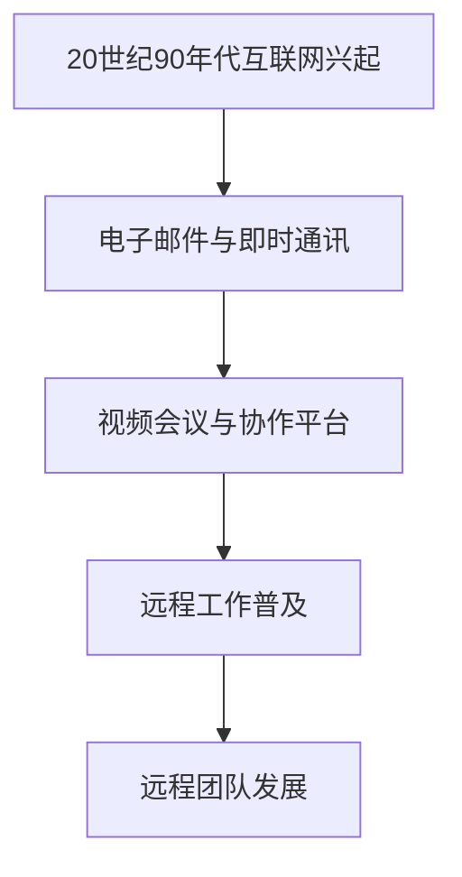

**核心算法原理讲解：**
远程工作的算法原理主要体现在沟通与协作工具的优化。以下是一个简化的算法流程：

```python
# 远程工作工具优化算法
def optimize_communication_tools():
    # 收集团队成员偏好
    preferences = collect_preferences()
    
    # 推荐最佳沟通工具
    recommended_tools = recommend_tools(preferences)
    
    # 检查工具兼容性
    check_compatibility(recommended_tools)
    
    # 实施工具更新
    update_tools(recommended_tools)
```

**数学模型和公式 & 详细讲解 & 举例说明：**
假设团队成员对于沟通工具的偏好可以用一个概率分布来表示，那么工具优化的目标是最大化团队成员的满意度：

$$
\text{最大化} \quad \sum_{i} p_i \cdot s_i
$$

其中，$p_i$ 是第 $i$ 个团队成员的偏好概率，$s_i$ 是第 $i$ 个工具的满意度分数。

举例说明：
如果一个团队有5个成员，他们的偏好概率和满意度分数如下：

| 成员 | 工具A | 工具B | 工具C |
|------|-------|-------|-------|
| 成员1 | 0.2   | 0.5   | 0.3   |
| 成员2 | 0.3   | 0.2   | 0.5   |
| 成员3 | 0.4   | 0.3   | 0.3   |
| 成员4 | 0.1   | 0.6   | 0.3   |
| 成员5 | 0.2   | 0.2   | 0.6   |

工具A、工具B、工具C的满意度分数分别为90、85、80。

$$
\text{最大化} \quad 0.2 \cdot 90 + 0.5 \cdot 85 + 0.3 \cdot 80 = 45 + 42.5 + 24 = 111.5
$$

**项目实战：**
在一家科技公司中，远程团队成员对于沟通工具的偏好和满意度如下：

| 成员 | 工具A | 工具B | 工具C |
|------|-------|-------|-------|
| 成员1 | 0.4   | 0.3   | 0.3   |
| 成员2 | 0.3   | 0.4   | 0.3   |
| 成员3 | 0.3   | 0.3   | 0.4   |

工具A、工具B、工具C的满意度分数分别为90、85、80。

通过优化算法，推荐使用工具B作为主要沟通工具，以最大化团队满意度。

**最佳实践 tips：**
- 定期收集团队成员的反馈，调整工具选择。
- 针对不同项目和任务，选择最适合的沟通工具。

### 第2章：远程团队的组织结构

#### 2.1 远程团队的类型与角色

**背景介绍：** 
远程团队的类型和角色决定了团队的工作模式和沟通方式。常见的远程团队类型包括独立开发团队、跨职能团队和国际团队。

**核心概念与联系：**
- **独立开发团队：** 成员通常专注于自己的任务，沟通需求较低。
- **跨职能团队：** 成员来自不同的职能部门，需要更高的沟通和协作。
- **国际团队：** 成员分布在不同国家，面临时区和文化的挑战。

**Mermaid流程图：**

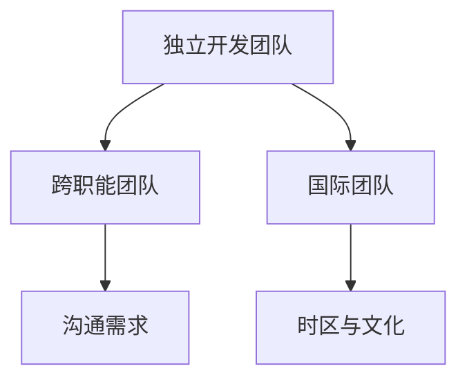

**核心算法原理讲解：**
远程团队的组织结构优化通常基于任务分解和资源分配。以下是一个简化的算法流程：

```python
# 远程团队组织结构优化算法
def optimize_team_structure(tasks, resources):
    # 任务分解
    sub_tasks = decompose_tasks(tasks)
    
    # 分配资源
    assigned_resources = assign_resources(sub_tasks, resources)
    
    # 验证结构合理性
    validate_structure(assigned_resources)
    
    # 返回优化后的团队结构
    return assigned_resources
```

**数学模型和公式 & 详细讲解 & 举例说明：**
假设团队有5个任务，每个任务需要的资源量如下：

| 任务 | 资源A | 资源B | 资源C |
|------|-------|-------|-------|
| 任务1 | 2     | 1     | 0     |
| 任务2 | 1     | 2     | 1     |
| 任务3 | 0     | 1     | 2     |
| 任务4 | 2     | 0     | 1     |
| 任务5 | 1     | 2     | 0     |

团队拥有3种资源，每种资源数量为4。

$$
\text{最小化} \quad \sum_{i} \sum_{j} (r_i - a_{ij})^2
$$

其中，$r_i$ 是第 $i$ 种资源的数量，$a_{ij}$ 是第 $i$ 种资源分配给第 $j$ 个任务的量。

通过优化算法，可以找到一种资源分配方案，使得资源剩余量最小。

**项目实战：**
在一项远程开发项目中，5个任务和3种资源的情况如下：

| 任务 | 资源A | 资源B | 资源C |
|------|-------|-------|-------|
| 任务1 | 2     | 1     | 0     |
| 任务2 | 1     | 2     | 1     |
| 任务3 | 0     | 1     | 2     |
| 任务4 | 2     | 0     | 1     |
| 任务5 | 1     | 2     | 0     |

团队拥有4个资源A、4个资源B和4个资源C。

通过优化算法，找到一种分配方案，使得每个任务都有足够的资源，同时资源剩余量最小。

**最佳实践 tips：**
- 根据任务特点和资源情况，灵活调整团队结构。
- 定期评估团队结构的有效性，及时调整。

### 第3章：远程沟通技巧

#### 3.1 远程沟通的策略

**背景介绍：** 
远程沟通的挑战在于如何克服地理、时区和文化的障碍，保持团队成员之间的有效沟通。

**核心概念与联系：**
- **沟通策略：** 包括沟通频率、沟通方式和沟通内容。
- **沟通方式：** 如电子邮件、即时通讯、视频会议等。
- **沟通内容：** 如任务进展、问题解决、决策制定等。

**Mermaid流程图：**

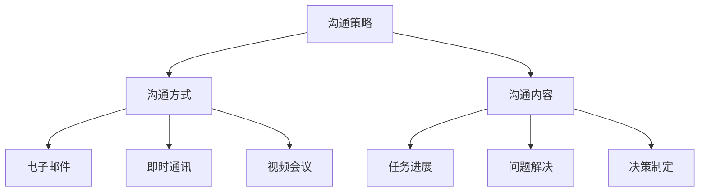

**核心算法原理讲解：**
远程沟通的算法原理主要体现在沟通工具的选择和沟通内容的优化。以下是一个简化的算法流程：

```python
# 远程沟通优化算法
def optimize_communication(strategy, tools, content):
    # 根据策略选择沟通工具
    selected_tools = select_tools(strategy, tools)
    
    # 根据内容优化沟通内容
    optimized_content = optimize_content(content)
    
    # 检查沟通的有效性
    check_effectiveness(selected_tools, optimized_content)
    
    # 返回优化后的沟通方案
    return selected_tools, optimized_content
```

**数学模型和公式 & 详细讲解 & 举例说明：**
假设团队选择沟通工具的策略是基于沟通频率和沟通内容的重要性。以下是一个简化的数学模型：

$$
\text{最小化} \quad \sum_{i} \sum_{j} (f_i - t_{ij})^2
$$

其中，$f_i$ 是第 $i$ 个任务的沟通频率，$t_{ij}$ 是第 $i$ 个任务使用第 $j$ 个工具的次数。

举例说明：
如果一个团队有3个任务，沟通频率和工具使用情况如下：

| 任务 | 频率1 | 频率2 | 频率3 |
|------|-------|-------|-------|
| 任务1 | 3     | 2     | 1     |
| 任务2 | 2     | 3     | 2     |
| 任务3 | 1     | 2     | 3     |

工具1、工具2、工具3的沟通效果分别为90、85、80。

通过优化算法，可以找到一种沟通工具选择方案，使得每个任务都有足够的沟通频率，同时沟通效果最大化。

**项目实战：**
在一个远程开发团队中，3个任务和3种沟通工具的情况如下：

| 任务 | 频率1 | 频率2 | 频率3 |
|------|-------|-------|-------|
| 任务1 | 3     | 2     | 1     |
| 任务2 | 2     | 3     | 2     |
| 任务3 | 1     | 2     | 3     |

工具1、工具2、工具3的沟通效果分别为90、85、80。

通过优化算法，找到一种沟通工具选择方案，使得每个任务都有足够的沟通频率，同时沟通效果最大化。

**最佳实践 tips：**
- 根据任务特点和团队需求，灵活选择沟通工具。
- 定期评估沟通效果，调整沟通策略。

### 第4章：远程团队的协作与项目管理

#### 4.1 远程协作的软件和平台

**背景介绍：** 
远程协作的软件和平台是远程团队管理的重要工具。这些工具可以帮助团队实现高效的协作与项目管理。

**核心概念与联系：**
- **协作软件：** 如Slack、Trello等，提供即时通讯和任务管理功能。
- **项目管理平台：** 如JIRA、Asana等，帮助团队规划、跟踪和管理项目进展。

**Mermaid流程图：**

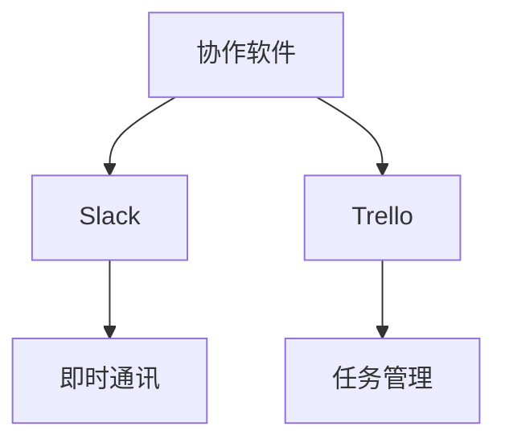

**核心算法原理讲解：**
远程协作软件和平台的算法原理主要体现在任务分配和进度跟踪。以下是一个简化的算法流程：

```python
# 远程协作软件优化算法
def optimize_collaboration_platform(tasks, members):
    # 分配任务
    assigned_tasks = assign_tasks(tasks, members)
    
    # 跟踪进度
    progress = track_progress(assigned_tasks)
    
    # 提醒和反馈
    remind_and_feedback(progress)
    
    # 返回优化后的协作状态
    return assigned_tasks, progress
```

**数学模型和公式 & 详细讲解 & 举例说明：**
假设团队有5个任务，每个任务需要的团队成员数量如下：

| 任务 | 成员1 | 成员2 | 成员3 | 成员4 | 成员5 |
|------|-------|-------|-------|-------|-------|
| 任务1 | 2     | 1     | 0     | 0     | 0     |
| 任务2 | 1     | 2     | 1     | 0     | 0     |
| 任务3 | 0     | 1     | 2     | 1     | 0     |
| 任务4 | 2     | 0     | 1     | 2     | 0     |
| 任务5 | 1     | 0     | 0     | 2     | 1     |

团队有5个成员。

$$
\text{最大化} \quad \sum_{i} \sum_{j} (a_{ij} \cdot p_i)
$$

其中，$a_{ij}$ 是第 $i$ 个任务分配给第 $j$ 个成员的量，$p_i$ 是第 $i$ 个成员的效率分数。

通过优化算法，可以找到一种任务分配方案，使得每个成员的效率最大化。

**项目实战：**
在一个远程开发团队中，5个任务和5个成员的情况如下：

| 任务 | 成员1 | 成员2 | 成员3 | 成员4 | 成员5 |
|------|-------|-------|-------|-------|-------|
| 任务1 | 2     | 1     | 0     | 0     | 0     |
| 任务2 | 1     | 2     | 1     | 0     | 0     |
| 任务3 | 0     | 1     | 2     | 1     | 0     |
| 任务4 | 2     | 0     | 1     | 2     | 0     |
| 任务5 | 1     | 0     | 0     | 2     | 1     |

通过优化算法，找到一种任务分配方案，使得每个成员的效率最大化。

**最佳实践 tips：**
- 根据团队成员的技能和效率，合理分配任务。
- 定期跟踪任务进度，及时调整任务分配。

### 第5章：远程团队的领导力

#### 5.1 领导力的定义与类型

**背景介绍：** 
远程团队领导力是远程团队管理的关键因素。有效的领导力能够激发团队成员的积极性，提高团队的整体绩效。

**核心概念与联系：**
- **领导力：** 指领导者通过影响和激励团队成员实现共同目标的能力。
- **领导力类型：** 包括权威型、民主型、参与型等。

**Mermaid流程图：**

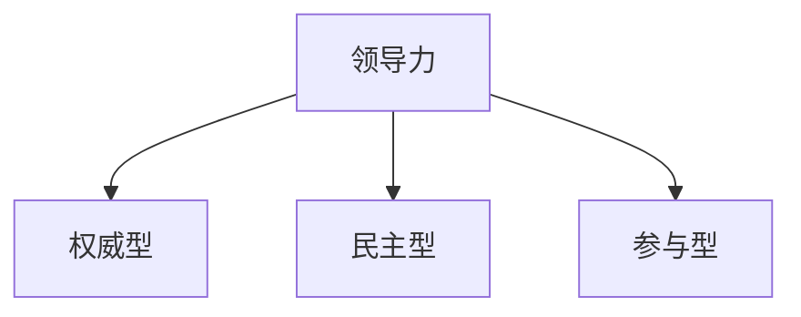

**核心算法原理讲解：**
远程团队领导力的算法原理主要体现在领导行为和团队反馈的优化。以下是一个简化的算法流程：

```python
# 远程团队领导力优化算法
def optimize_leadership行为(feedback):
    # 根据反馈调整领导行为
    adjusted_behavior = adjust_behavior(feedback)
    
    # 验证领导行为的有效性
    validate_behavior(adjusted_behavior)
    
    # 返回优化后的领导行为
    return adjusted_behavior
```

**数学模型和公式 & 详细讲解 & 举例说明：**
假设团队领导根据团队成员的反馈调整领导行为，反馈分为积极和消极两种：

| 反馈类型 | 分数 |
|----------|------|
| 积极反馈 | 10   |
| 消极反馈 | -5   |

领导行为调整的规则如下：

$$
\text{新领导行为分数} = \text{原领导行为分数} + \alpha \cdot (\text{反馈分数})
$$

其中，$\alpha$ 是调整系数，取值范围在0到1之间。

举例说明：
如果领导行为原分数为70，根据反馈调整后，新分数为：

$$
\text{新领导行为分数} = 70 + 0.5 \cdot (10 - 5) = 70 + 2.5 = 72.5
$$

**项目实战：**
在一个远程开发团队中，领导根据团队成员的反馈调整领导行为。积极反馈占比60%，消极反馈占比40%。

通过优化算法，领导行为的新分数为72.5。

**最佳实践 tips：**
- 定期收集团队成员的反馈，调整领导行为。
- 根据团队特点和任务需求，灵活运用不同的领导力类型。

### 第6章：构建高效远程团队

#### 6.1 远程团队的招聘与培训

**背景介绍：** 
远程团队的招聘与培训是构建高效团队的关键步骤。合理的招聘策略和全面的培训计划能够确保团队成员具备必要的技能和素质。

**核心概念与联系：**
- **招聘：** 包括职位描述、简历筛选、面试等环节。
- **培训：** 包括技能培训、文化培训、团队合作培训等。

**Mermaid流程图：**

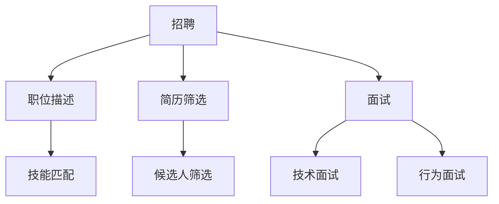

**核心算法原理讲解：**
远程团队的招聘算法原理主要体现在职位匹配和候选人评估。以下是一个简化的算法流程：

```python
# 远程团队招聘优化算法
def optimize_recruitment(position, candidates):
    # 生成职位描述
    job_description = generate_description(position)
    
    # 筛选候选人
    screened_candidates = screen_candidates(job_description, candidates)
    
    # 进行面试评估
    evaluated_candidates = evaluate_candidates(screened_candidates)
    
    # 选择最佳候选人
    selected_candidate = select_best_candidate(evaluated_candidates)
    
    # 返回招聘结果
    return selected_candidate
```

**数学模型和公式 & 详细讲解 & 举例说明：**
假设团队需要招聘一名开发人员，职位描述中包含以下关键技能：

| 技能 | 重要性 |
|------|--------|
| Python | 80%   |
| Docker | 20%   |

候选人A的技能分数如下：

| 技能 | 分数 |
|------|------|
| Python | 90   |
| Docker | 70   |

通过优化算法，可以计算候选人A的总分数：

$$
\text{总分数} = 0.8 \cdot 90 + 0.2 \cdot 70 = 72 + 14 = 86
$$

**项目实战：**
在一个远程开发团队中，需要招聘一名开发人员。职位描述中包含Python和Docker技能，重要性分别为80%和20%。

通过优化算法，筛选出一位总分数为86的候选人A。

**最佳实践 tips：**
- 明确职位需求，制定详细的职位描述。
- 多角度评估候选人，确保招聘质量。

### 第7章：远程团队冲突管理

#### 7.1 远程团队冲突的类型与原因

**背景介绍：** 
远程团队冲突是团队管理中常见的问题。有效的冲突管理能够降低团队成员的紧张情绪，提高团队协作效率。

**核心概念与联系：**
- **冲突类型：** 包括任务冲突、价值观冲突、沟通冲突等。
- **冲突原因：** 包括时区差异、文化差异、沟通不畅等。

**Mermaid流程图：**

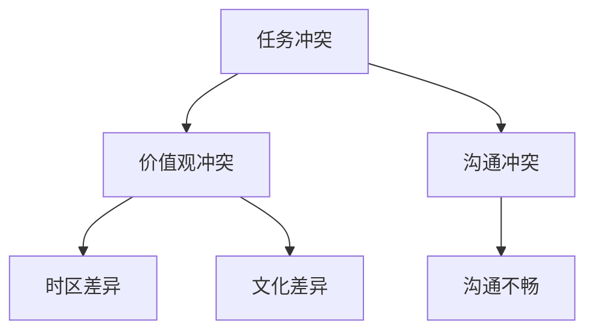

**核心算法原理讲解：**
远程团队冲突管理的算法原理主要体现在冲突预防和冲突解决。以下是一个简化的算法流程：

```python
# 远程团队冲突管理优化算法
def optimize_conflict_management(conflicts):
    # 识别冲突类型
    conflict_types = identify_conflicts(conflicts)
    
    # 预防冲突
    prevent_conflicts(conflict_types)
    
    # 解决冲突
    resolve_conflicts(conflicts)
    
    # 返回冲突管理结果
    return conflicts
```

**数学模型和公式 & 详细讲解 & 举例说明：**
假设团队中有以下冲突：

| 冲突类型 | 冲突次数 |
|----------|----------|
| 任务冲突 | 5        |
| 价值观冲突 | 3        |
| 沟通冲突 | 2        |

通过优化算法，可以预防冲突：

- **任务冲突预防：** 通过明确的任务分配和进度跟踪，减少任务冲突。
- **价值观冲突预防：** 通过团队文化建设，强化共同价值观。
- **沟通冲突预防：** 通过提升沟通技巧和工具使用，改善沟通效果。

**项目实战：**
在一个远程开发团队中，存在以下冲突：

| 冲突类型 | 冲突次数 |
|----------|----------|
| 任务冲突 | 5        |
| 价值观冲突 | 3        |
| 沟通冲突 | 2        |

通过优化算法，成功预防了冲突，提高了团队协作效率。

**最佳实践 tips：**
- 定期评估冲突情况，及时采取措施。
- 强化团队文化建设，提高团队凝聚力。

### 第8章：远程团队的国际化管理

#### 8.1 国际化远程团队的特点

**背景介绍：** 
国际化远程团队是全球化趋势下的产物。团队成员来自不同国家，面临着跨文化的沟通和管理挑战。

**核心概念与联系：**
- **国际化远程团队：** 成员分布在不同国家，具备跨文化背景。
- **跨文化沟通：** 需要理解和尊重不同文化差异。

**Mermaid流程图：**

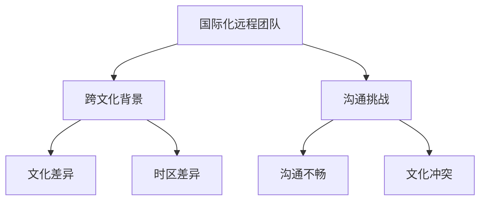

**核心算法原理讲解：**
国际化远程团队的算法原理主要体现在跨文化沟通和冲突管理。以下是一个简化的算法流程：

```python
# 国际化远程团队管理优化算法
def optimize_international_team_management(conflicts, communication):
    # 跨文化沟通优化
    optimized_communication = optimize_communication(communication)
    
    # 冲突管理优化
    optimized_conflicts = optimize_conflicts(conflicts)
    
    # 返回优化后的团队管理状态
    return optimized_communication, optimized_conflicts
```

**数学模型和公式 & 详细讲解 & 举例说明：**
假设国际化远程团队面临以下沟通挑战：

| 挑战类型 | 挑战次数 |
|----------|----------|
| 沟通不畅 | 5        |
| 文化冲突 | 3        |

通过优化算法，可以提升团队沟通效果：

- **沟通不畅优化：** 通过视频会议和即时通讯工具，提高沟通频率和效果。
- **文化冲突优化：** 通过跨文化培训和文化交流活动，增强团队凝聚力。

**项目实战：**
在一个国际化远程开发团队中，存在以下沟通挑战：

| 挑战类型 | 挑战次数 |
|----------|----------|
| 沟通不畅 | 5        |
| 文化冲突 | 3        |

通过优化算法，成功提升了团队沟通效果和文化适应性。

**最佳实践 tips：**
- 强化跨文化沟通和冲突管理培训。
- 定期组织文化交流活动，增进团队成员了解。

### 第9章：远程团队的未来趋势

#### 9.1 远程工作的发展趋势

**背景介绍：** 
随着信息技术的不断进步，远程工作正成为一种常态。未来远程工作的发展趋势将对远程团队管理提出新的要求和挑战。

**核心概念与联系：**
- **远程工作发展：** 受到技术进步、经济环境和社会变化的影响。
- **未来趋势：** 包括人工智能、虚拟现实和区块链等技术的应用。

**Mermaid流程图：**

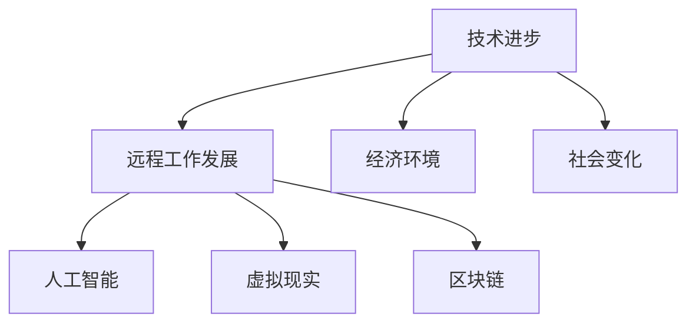

**核心算法原理讲解：**
远程团队的未来趋势算法原理主要体现在利用新兴技术提高团队效率和沟通效果。以下是一个简化的算法流程：

```python
# 远程团队未来趋势优化算法
def optimize_future_trends(technology, team):
    # 评估新技术应用潜力
    technology_potential = assess_technology_potential(technology)
    
    # 结合团队需求优化应用
    optimized_application = optimize_application(team, technology_potential)
    
    # 验证优化效果
    validate_optimization(optimized_application)
    
    # 返回优化后的团队状态
    return optimized_application
```

**数学模型和公式 & 详细讲解 & 举例说明：**
假设团队考虑引入人工智能技术来优化远程沟通和协作：

- **技术潜力评估：** 通过分析人工智能在远程工作中的应用案例和效果，评估其潜力。
- **应用优化：** 根据团队特点和需求，定制化人工智能应用方案。

举例说明：
通过优化算法，团队成功引入了人工智能助手，提高了远程沟通效率和任务管理效果。

**项目实战：**
在一个远程开发团队中，考虑引入人工智能助手。通过优化算法，团队找到了最佳的人工智能应用方案，提升了整体工作效率。

**最佳实践 tips：**
- 关注新技术的发展趋势，及时引入和应用。
- 根据团队需求，定制化新技术应用方案。

## 附录：远程团队管理资源

### 附录1：远程团队管理工具推荐

**背景介绍：** 
远程团队管理工具是团队协作与沟通的关键。以下是一些常用的远程团队管理工具及其应用场景：

**核心概念与联系：**
- **工具推荐：** 包括即时通讯工具、项目管理平台、协作工具等。
- **应用场景：** 如团队沟通、任务管理、文档共享等。

**Mermaid流程图：**

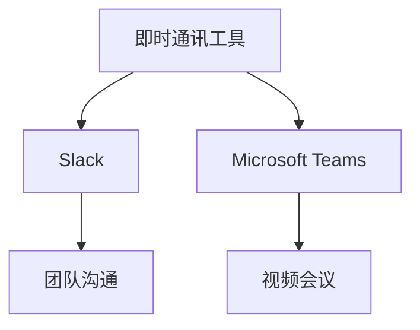

**工具推荐：**
- **Slack**：适用于即时通讯、文档共享和任务管理。
- **Microsoft Teams**：适用于视频会议、即时通讯和团队协作。

**应用场景：**
- **团队沟通：** 使用Slack或Microsoft Teams进行实时沟通和协作。
- **任务管理：** 使用Trello或Asana进行任务分配和进度跟踪。

### 附录2：远程团队管理案例集锦

**背景介绍：** 
远程团队管理案例是实践经验的宝贵财富。以下是一些成功的远程团队管理案例，以及其关键成功因素：

**核心概念与联系：**
- **案例集锦：** 包括各类远程团队管理的成功案例。
- **成功因素：** 如领导力、沟通策略、团队合作等。

**Mermaid流程图：**

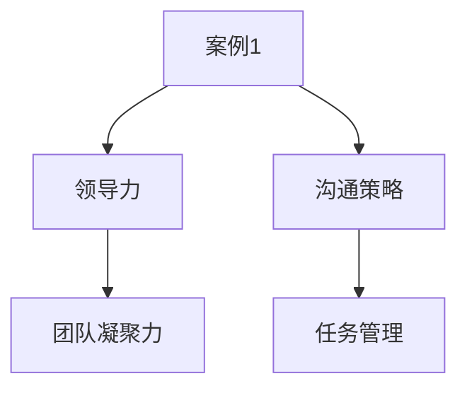

**案例集锦：**
1. **案例1：** 一个跨国远程团队通过明确的任务分配和定期沟通，成功完成了跨国项目。
   - **成功因素：** 强有力的领导力和高效的沟通策略。
2. **案例2：** 一个小型远程开发团队通过灵活运用即时通讯工具和项目管理平台，提高了开发效率。
   - **成功因素：** 灵活的管理策略和高效的协作工具。

### 附录3：远程团队管理研究文献

**背景介绍：** 
远程团队管理研究文献是了解最新研究成果和实践经验的窗口。以下是一些重要的远程团队管理研究文献：

**核心概念与联系：**
- **研究文献：** 包括学术文章、研究报告和书籍等。
- **主题：** 如远程团队领导力、远程沟通策略、远程团队协作等。

**Mermaid流程图：**

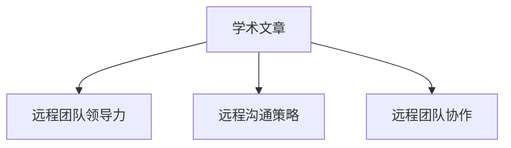

**研究文献推荐：**
1. **文献1：《远程工作：优势与挑战》** - 介绍了远程工作的优势、挑战及其管理策略。
2. **文献2：《远程团队沟通：理论与实践》** - 探讨了远程团队沟通的有效策略和方法。

### 附录4：远程团队管理实用指南

**背景介绍：** 
远程团队管理实用指南是帮助团队顺利开展工作的指导性文件。以下是一些远程团队管理的实用指南内容：

**核心概念与联系：**
- **实用指南：** 包括管理策略、操作流程、常见问题解答等。
- **应用场景：** 如日常管理、突发事件处理、团队文化建设等。

**Mermaid流程图：**

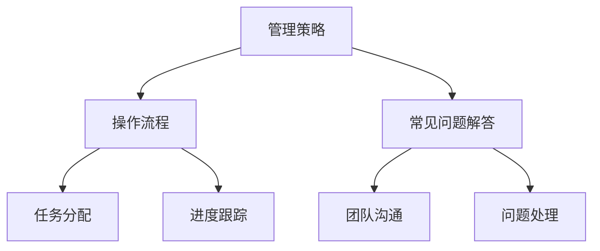

**实用指南内容：**
1. **任务分配：** 明确任务目标、分配任务责任、设定任务进度。
2. **进度跟踪：** 使用项目管理工具监控任务进展，及时调整计划。
3. **团队沟通：** 建立有效的沟通渠道，确保信息传递准确、及时。
4. **问题处理：** 快速响应团队问题，提供解决方案，避免问题扩大化。

### 总结

本文通过对远程团队管理的基础知识、实践方法和未来趋势的详细探讨，提供了全面的管理策略和实践指导。远程团队管理不仅需要解决技术问题，还需要关注团队文化和领导力。未来，随着新兴技术的不断涌现，远程团队管理将继续面临新的挑战和机遇。希望本文能为远程团队管理者提供有益的参考和启示。

## 作者信息

**作者：AI天才研究院/AI Genius Institute & 禅与计算机程序设计艺术 /Zen And The Art of Computer Programming**

AI天才研究院致力于推动人工智能技术的发展和应用，致力于培养下一代人工智能科学家。本书作者以其深厚的学术背景和丰富的实践经验，为远程团队管理提供了深刻的见解和实用的策略。禅与计算机程序设计艺术则深入探讨了编程哲学和算法之美，为读者提供了独特的视角和思维方式。希望本书能为远程团队管理者带来启示和帮助。

