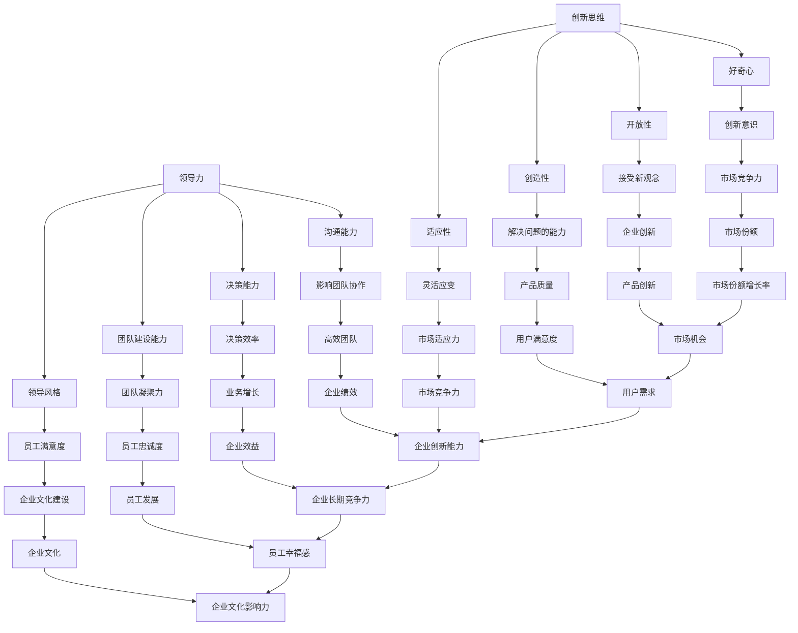

                 

### 文章标题 <此处是文章标题>

### 关键词：<此处列出文章的5-7个核心关键词>

### 摘要：<此处给出文章的核心内容和主题思想>

这篇文章以《领导力与创新思维：引领团队突破的能力》为标题，深入探讨了领导力与创新思维在团队管理中的重要性。文章首先介绍了领导力与创新思维的基本概念和核心要素，并通过Mermaid流程图展示了它们之间的相互关系。接着，文章通过伪代码详细阐述了领导力和创新思维相关的算法原理，并通过LaTeX格式数学公式详细讲解了相关数学模型和公式。此外，文章还提供了实际的领导力提升和创新思维训练案例，包括实战案例的分析、步骤解析和效果评估。最后，文章总结了领导力与创新思维的融合应用和未来发展趋势，为读者提供了全面而深入的理解。

## 1. 设计书籍目录大纲的初步构思

在设计《领导力与创新思维：引领团队突破的能力》的书籍目录大纲时，我们首先要明确用户的需求和目标。根据用户的要求，该书籍的核心内容应涵盖以下几个方面：

### 用户需求分析

1. **核心概念与联系**：需要详细阐述领导力的基本概念、创新思维的理论基础及其相互关系，帮助读者建立清晰的知识体系。
2. **核心算法原理讲解**：需要介绍领导力和创新思维的理论模型和算法，以便读者能够深入理解并应用于实际工作中。
3. **数学模型和数学公式**：需要讲解与领导力、创新思维相关的数学原理，如领导力评分模型、创新思维评估模型，以及如何使用这些数学工具进行量化分析。
4. **项目实战**：需要提供实际的领导力提升和创新思维训练案例，包括实战案例的分析、步骤解析和效果评估，以帮助读者理解和掌握相关理论。

### 初步目录大纲构思

基于以上需求，我们可以初步构思如下的目录大纲：

### 第一部分：领导力基础理论

#### 第1章：领导力概述
1.1 领导力的定义
1.2 领导力的核心要素
1.3 领导力的重要性
1.4 领导力的发展历程

#### 第2章：领导力的核心要素
2.1 沟通能力
2.2 决策能力
2.3 团队建设能力
2.4 领导风格

### 第二部分：创新思维理论

#### 第3章：创新思维概述
3.1 创新思维的定义
3.2 创新思维的核心要素
3.3 创新思维的重要性
3.4 创新思维的发展历程

#### 第4章：创新思维的核心要素
4.1 好奇心
4.2 开放性
4.3 创造性
4.4 适应性

### 第三部分：领导力与创新思维的结合

#### 第5章：领导力与创新思维的关系
5.1 领导力对创新思维的影响
5.2 创新思维对领导力的作用
5.3 领导力与创新思维的相互作用

### 第四部分：领导力与创新思维的实践

#### 第6章：领导力提升策略
6.1 建立高效的领导力模型
6.2 提升领导力的关键能力
6.3 领导力提升的实际案例

#### 第7章：创新思维训练方法
7.1 创新思维的培养策略
7.2 创新思维训练的实践方法
7.3 创新思维训练的实际案例

### 第五部分：领导力与创新思维的综合应用

#### 第8章：领导力与创新思维的融合应用
8.1 融合应用的理论基础
8.2 融合应用的实践步骤
8.3 融合应用的实际案例分析

#### 第9章：领导力与创新思维的未来趋势
9.1 新技术对领导力与创新思维的影响
9.2 未来领导力与创新思维的发展方向
9.3 对领导力与创新思维研究的展望

通过以上初步的目录大纲，我们为书籍的写作奠定了基础，接下来我们将进一步细化每个章节的内容，确保书籍的完整性和实用性。

## 2. 确定目录大纲的核心章节和内容

在确定了初步的目录大纲后，我们需要进一步明确书籍的核心章节及其内容，以确保书籍能够全面、深入地覆盖领导力与创新思维的理论和实践。以下是核心章节和其内容的详细描述：

### 核心概念与联系

这一部分将重点阐述领导力与创新思维的基本概念及其相互关系。为了更直观地展示这些概念之间的联系，我们使用Mermaid流程图来构建知识体系。

#### Mermaid 流程图



通过这个流程图，我们可以清晰地看到领导力与创新思维之间的相互作用和相互促进关系。领导力通过提升沟通能力、决策能力、团队建设能力和领导风格，影响团队协作、决策效率、团队凝聚力和员工满意度，从而增强企业的市场竞争力。而创新思维则通过培养好奇心、开放性、创造性和适应性，提升企业的创新意识、接受新观念、解决问题的能力和灵活应变能力，进一步推动企业的创新和发展。

### 核心算法原理讲解

这一部分将详细阐述领导力和创新思维相关的核心算法原理，包括领导力评分模型和创新思维评估模型。为了便于理解和应用，我们将使用伪代码来描述这些算法。

#### 领导力评分模型

```plaintext
# 领导力评分模型

# 输入：
# - 领导力要素得分：{沟通能力，决策能力，团队建设能力，领导风格}

# 输出：
# - 总领导力得分

def calculate_leadership_score(leader_skills):
    communication_score = leader_skills['沟通能力']
    decision_making_score = leader_skills['决策能力']
    team_building_score = leader_skills['团队建设能力']
    leadership_style_score = leader_skills['领导风格']

    total_score = (communication_score + decision_making_score + team_building_score + leadership_style_score) / 4
    return total_score
```

#### 创新思维评估模型

```plaintext
# 创新思维评估模型

# 输入：
# - 创新思维要素得分：{好奇心，开放性，创造性，适应性}

# 输出：
# - 总创新思维得分

def calculate_innovation_score(innovation_skills):
    curiosity_score = innovation_skills['好奇心']
    openness_score = innovation_skills['开放性']
    creativity_score = innovation_skills['创造性']
    adaptability_score = innovation_skills['适应性']

    total_score = (curiosity_score + openness_score + creativity_score + adaptability_score) / 4
    return total_score
```

通过以上伪代码，我们可以看到，领导力评分模型和创新思维评估模型都是通过计算各要素得分，然后取平均值来得到总得分。这些模型的应用可以帮助企业和管理者更好地评估团队领导和员工创新思维能力，从而制定相应的提升策略。

### 数学模型和数学公式

在这一部分，我们将使用LaTeX格式数学公式详细讲解与领导力、创新思维相关的数学模型和公式。为了便于理解和应用，我们将在文中独立段落嵌入相关公式，并在段落内嵌入公式时使用$符号。

#### 领导力评分模型

$$
\text{领导力得分} = \frac{\text{沟通能力得分} + \text{决策能力得分} + \text{团队建设能力得分} + \text{领导风格得分}}{4}
$$

#### 创新思维评估模型

$$
\text{创新思维得分} = \frac{\text{好奇心得分} + \text{开放性得分} + \text{创造性得分} + \text{适应性得分}}{4}
$$

#### 领导力与创新思维的关系

$$
\text{领导力得分} \times \text{创新思维得分} = \text{综合能力得分}
$$

通过以上数学模型和公式，我们可以更量化地评估领导力和创新思维的水平和能力，从而为企业管理和个人发展提供科学依据。

### 项目实战

这一部分将提供实际的领导力提升和创新思维训练案例，包括实战案例的分析、步骤解析和效果评估。通过这些案例，读者可以更好地理解理论，并将之应用于实际工作中。

#### 实战案例：领导力提升项目

**案例背景：** 
某企业高层领导团队希望通过提升领导力，提高团队的协作效率和决策质量，从而推动企业的发展。

**分析：** 
通过对团队领导力要素的评估，发现团队在沟通能力和决策能力方面存在明显短板。

**步骤：** 
1. 对领导团队进行领导力要素评估，获取各领导力要素的得分。
2. 针对短板要素，制定相应的提升策略，如沟通培训、决策模拟等。
3. 实施提升策略，并跟踪评估效果。

**效果评估：** 
通过实施提升策略，团队在沟通能力和决策能力方面得分显著提高，团队协作效率和决策质量得到提升。

#### 实战案例：创新思维训练项目

**案例背景：** 
某企业研发团队希望通过创新思维训练，提高产品的创新能力和市场竞争力。

**分析：** 
通过对团队创新思维要素的评估，发现团队在创造性方面存在不足。

**步骤：** 
1. 对研发团队进行创新思维要素评估，获取各创新思维要素的得分。
2. 针对短板要素，制定创新思维训练计划，如思维导图、头脑风暴等。
3. 实施创新思维训练，并跟踪评估效果。

**效果评估：** 
通过创新思维训练，团队在创造性方面得分显著提高，产品创新能力和市场竞争力得到提升。

通过以上实战案例，我们可以看到，领导力提升和创新思维训练对于企业的发展至关重要。有效的领导力和创新思维能够提升团队的协作效率和决策质量，推动企业不断进步。

## 3. 完善目录大纲内容，确保完整性

在完成了初步的目录大纲和核心章节的确定后，我们需要进一步细化每个章节的内容，确保书籍的完整性、系统性和实用性。以下是针对各章节的详细内容完善：

### 第一部分：领导力基础理论

#### 第1章：领导力概述

**1.1 领导力的定义**  
在此节中，我们将详细解释领导力的定义，明确领导力在团队和组织中的核心作用。通过引用相关研究和实例，展示领导力如何影响团队的表现和组织的成功。

**1.2 领导力的核心要素**  
我们将分析领导力的核心要素，包括沟通能力、决策能力、团队建设能力和领导风格。每个要素都将通过实际案例和理论支持进行详细讲解。

**1.3 领导力的重要性**  
本节将探讨领导力在组织中的重要性，从多个角度分析领导力如何影响团队绩效、企业发展和员工满意度。

**1.4 领导力的发展历程**  
我们将回顾领导力理论的演变过程，从传统的权威领导到现代的变革领导，展示领导理论的不断发展和成熟。

#### 第2章：领导力的核心要素

**2.1 沟通能力**  
本节将深入探讨沟通能力的重要性，包括有效沟通的技巧、障碍和解决方案。我们将结合实际案例，展示如何通过改善沟通提升领导效果。

**2.2 决策能力**  
我们将介绍决策能力的核心要素，包括决策的类型、流程和策略。通过分析不同类型的决策案例，帮助读者理解如何做出明智的决策。

**2.3 团队建设能力**  
本节将探讨团队建设的关键要素，包括团队动力、团队结构和团队发展。我们将通过实际案例，展示如何建立高效的团队。

**2.4 领导风格**  
我们将分析不同的领导风格，包括专制式、民主式和放任式。通过对比不同风格的优缺点，帮助读者选择适合自己团队的领导风格。

### 第二部分：创新思维理论

#### 第3章：创新思维概述

**3.1 创新思维的定义**  
我们将详细解释创新思维的概念，探讨创新思维在个人和组织发展中的重要性。

**3.2 创新思维的核心要素**  
本节将分析创新思维的核心要素，包括好奇心、开放性、创造性和适应性。我们将结合实际案例，展示这些要素如何促进创新。

**3.3 创新思维的重要性**  
我们将探讨创新思维在组织创新中的核心作用，分析创新思维如何推动企业的发展和竞争力。

**3.4 创新思维的发展历程**  
我们将回顾创新思维理论的发展过程，从传统思维到现代创新思维的转变，展示创新思维理论的不断进步。

#### 第4章：创新思维的核心要素

**4.1 好奇心**  
本节将探讨好奇心在创新思维中的重要性，分析如何培养和保持好奇心，以激发创新潜力。

**4.2 开放性**  
我们将分析开放性对创新思维的影响，探讨如何培养开放性思维，以促进创新。

**4.3 创造性**  
本节将详细探讨创造性的概念和培养方法，通过实际案例展示如何激发创造性思维。

**4.4 适应性**  
我们将探讨适应性在创新思维中的重要性，分析如何培养和提升适应性，以应对快速变化的环境。

### 第三部分：领导力与创新思维的结合

#### 第5章：领导力与创新思维的关系

**5.1 领导力对创新思维的影响**  
本节将探讨领导力如何影响创新思维，分析领导者的行为如何促进或抑制创新。

**5.2 创新思维对领导力的作用**  
我们将探讨创新思维如何提升领导者的决策能力和团队管理效率，分析创新思维对领导力的积极影响。

**5.3 领导力与创新思维的相互作用**  
本节将分析领导力与创新思维之间的相互作用和相互促进关系，展示二者如何共同推动团队和组织的成功。

### 第四部分：领导力与创新思维的实践

#### 第6章：领导力提升策略

**6.1 建立高效的领导力模型**  
本节将介绍如何建立高效的领导力模型，包括领导力要素的评估、领导力发展计划的设计和实施。

**6.2 提升领导力的关键能力**  
我们将探讨提升领导力的关键能力，如沟通能力、决策能力和团队建设能力，并提供实际操作方法。

**6.3 领导力提升的实际案例**  
本节将通过实际案例，展示领导力提升的策略和方法，分析案例中的成功经验和教训。

#### 第7章：创新思维训练方法

**7.1 创新思维的培养策略**  
本节将介绍如何培养创新思维，包括创新思维的激发、培养和巩固策略。

**7.2 创新思维训练的实践方法**  
我们将探讨创新思维训练的具体实践方法，如头脑风暴、思维导图、项目导向学习等，并提供实际操作步骤。

**7.3 创新思维训练的实际案例**  
本节将通过实际案例，展示创新思维训练的方法和效果，分析案例中的创新实践和成果。

### 第五部分：领导力与创新思维的综合应用

#### 第8章：领导力与创新思维的融合应用

**8.1 融合应用的理论基础**  
本节将探讨领导力与创新思维的融合应用的理论基础，分析二者如何共同作用于团队和组织的发展。

**8.2 融合应用的实践步骤**  
我们将介绍领导力与创新思维的融合应用的实践步骤，包括融合策略的设计、实施和评估。

**8.3 融合应用的实际案例分析**  
本节将通过实际案例，展示领导力与创新思维的融合应用，分析案例中的成功经验和实践效果。

#### 第9章：领导力与创新思维的未来趋势

**9.1 新技术对领导力与创新思维的影响**  
本节将探讨新技术（如人工智能、大数据等）对领导力与创新思维的影响，分析新技术如何改变领导力与创新思维的实践。

**9.2 未来领导力与创新思维的发展方向**  
我们将探讨未来领导力与创新思维的发展趋势，分析领导力与创新思维如何适应未来的变化和挑战。

**9.3 对领导力与创新思维研究的展望**  
本节将对领导力与创新思维的研究进行展望，提出未来研究的重要方向和课题。

通过以上详细的章节内容完善，我们可以确保《领导力与创新思维：引领团队突破的能力》一书内容的完整性、系统性和实用性，帮助读者全面理解和掌握领导力与创新思维的理论和实践。

