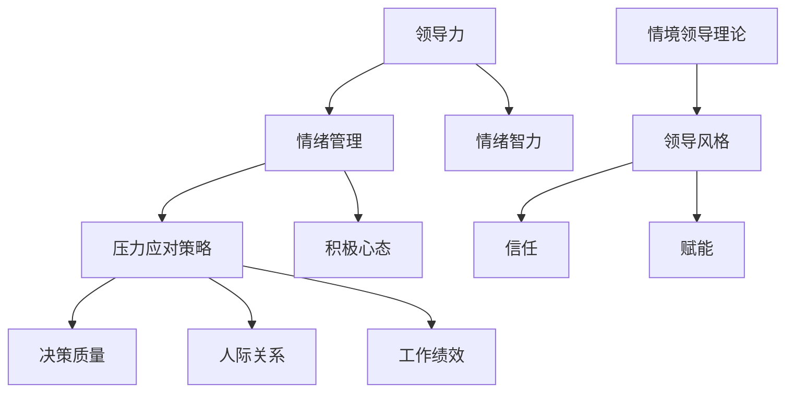

                 

## 文章标题

### 《领导力与情绪管理：在压力下保持冷静》

---

关键词：领导力、情绪管理、压力应对、冷静、情境领导理论、情绪调节策略

摘要：本文探讨了在现代社会中，领导力与情绪管理的重要性。通过分析压力源、情绪类型及其对领导力的影响，本文提出了一系列实用的情绪调节方法和压力应对策略。文章结合案例分析，为读者提供了如何在压力下保持冷静的实际操作指南，旨在提升个人领导力和情绪管理水平。

---

在当今快速变化且充满挑战的商业环境中，领导力与情绪管理成为企业成功的关键因素。有效的领导不仅需要具备卓越的战略规划和决策能力，更需要能够在压力下保持冷静，妥善管理自己的情绪，以应对各种复杂局面。本文旨在通过系统的分析，帮助读者理解领导力与情绪管理之间的内在联系，并掌握在实际工作中应用这些原则的方法。

本文将按照以下结构展开：

1. **背景介绍**：探讨领导力与情绪管理的重要性，引出本文的研究目标和结构。
2. **领导力与情绪管理基础**：介绍领导力的定义和情绪管理的重要性。
3. **压力应对策略**：分析压力源，提出情绪调节方法和压力管理技巧。
4. **案例分析**：通过成功与失败案例，展示领导力与情绪管理在实际中的应用。
5. **核心概念与联系**：使用Mermaid流程图展示领导力模型和情绪管理过程。
6. **核心算法原理讲解**：使用伪代码详细阐述压力管理算法。
7. **数学模型和数学公式**：使用latex格式详细说明情绪调节的数学模型。
8. **项目实战**：模拟一个领导力与情绪管理的实际应用案例。
9. **最佳实践 tips**：提供实用建议，总结文章重点。
10. **结语**：总结全文，重申文章的核心观点和实际应用价值。

---

通过上述结构，本文将为读者提供系统的知识和实用的技巧，帮助他们在职场中更好地发挥领导力，保持情绪稳定，从而在压力下保持冷静，实现个人和组织的共同成长。在接下来的章节中，我们将逐一深入探讨这些主题。

---

## 背景介绍

领导力和情绪管理是现代企业管理中不可或缺的两个核心要素。在传统的企业管理理念中，领导力主要强调的是决策能力、战略规划以及组织协调。然而，随着商业环境的日益复杂和竞争的加剧，单纯依靠这些传统能力已难以应对现代企业面临的诸多挑战。情绪管理作为领导力的一个重要补充，逐渐受到广泛关注。

情绪管理是指在认知、行为和生理三个层面上，对个体情绪进行识别、理解、调节和控制的过程。一个情绪稳定的领导者能够在面对压力和挑战时，保持冷静和理智，做出明智的决策。同时，良好的情绪管理能力也有助于建立和维护良好的人际关系，提高团队的凝聚力和工作效率。

领导力与情绪管理之间的关系紧密相连。有效的领导力不仅要求领导者具备卓越的技术能力和管理能力，还需要具备良好的情绪管理能力。情绪管理能力直接影响到领导者的决策质量、团队合作效果以及组织的发展。情绪管理不佳的领导者容易在压力下表现出焦虑、愤怒等负面情绪，这不仅会影响其自身的表现，还会对团队成员产生负面影响，破坏团队的稳定性和协作性。

本文的研究目标是通过系统的分析，探讨领导力与情绪管理之间的内在联系，并总结出一套实用的情绪调节方法和压力应对策略。具体来说，本文将：

1. **介绍领导力的定义及其在企业管理中的重要性**。
2. **探讨情绪管理的核心概念及其对领导力的影响**。
3. **分析压力源，并提出有效的情绪调节策略和压力管理技巧**。
4. **通过案例分析，展示领导力与情绪管理在实际工作中的应用**。
5. **使用Mermaid流程图和伪代码，详细阐述领导力模型和情绪管理过程**。
6. **介绍情绪调节的数学模型，并举例说明其实际应用**。
7. **模拟一个领导力与情绪管理的实际应用案例，并提供详细解读**。
8. **总结最佳实践，为读者提供实用建议**。

通过上述研究，本文旨在为企业管理者提供一套全面、系统的领导力与情绪管理策略，帮助他们更好地应对职场压力，提升个人领导力水平，实现个人和组织的共同成长。

---

### 领导力与情绪管理基础

#### 领导力的定义

领导力是一种能力，指的是个体在组织或团队中，通过影响和激励他人，实现共同目标的过程。根据不同的研究和理论，领导力的定义和内涵有着多样的解释。传统意义上，领导力强调的是权威和命令，认为领导者通过权威和职位来影响和指挥他人。然而，现代领导力理论更注重互动、协作和影响力。

领导力可以分为多个层次和类型。基于赫赛和布兰查德的情境领导理论，领导力可以分为四个层次： 

1. **职位权力**：领导者通过职位和权力来影响他人。
2. **个人魅力**：领导者通过个人魅力和愿景来激励他人。
3. **信任**：领导者通过建立信任和合作关系来影响他人。
4. **赋能**：领导者通过授权和赋能来促进团队成员自主性和创造力。

#### 情绪管理的定义

情绪管理是指个体在认知、行为和生理三个层面上，对情绪进行识别、理解、调节和控制的过程。情绪管理不仅包括对积极情绪的调节，如喜悦、兴奋等，还包括对消极情绪的调节，如愤怒、焦虑、沮丧等。

情绪管理的重要性体现在以下几个方面：

1. **决策质量**：情绪稳定的个体在做决策时，更能保持冷静和理智，避免情绪化的判断。
2. **人际关系**：良好的情绪管理能力有助于建立和维护良好的人际关系，提高团队合作效果。
3. **工作绩效**：情绪稳定的个体更能专注于工作，提高工作效率和绩效。
4. **压力缓解**：情绪管理有助于个体更好地应对压力，保持心理健康。

#### 领导力与情绪管理的关系

领导力与情绪管理之间存在着紧密的联系。一个情绪稳定的领导者能够更好地应对职场压力，保持清晰的思维，做出明智的决策。以下是领导力与情绪管理之间的一些主要关系：

1. **情绪调节对领导力的影响**：情绪调节能力影响领导者的决策质量、团队合作效果以及组织的发展。
2. **领导风格与情绪管理**：不同的领导风格对情绪管理有着不同的影响。例如，民主式领导风格鼓励团队成员参与决策，有助于情绪的释放和调节。
3. **情绪传染**：领导者的情绪状态会对团队成员产生直接影响。情绪传染效应表明，领导者的情绪状态可以影响团队成员的情绪和行为。
4. **情绪智力**：情绪智力是指个体识别、理解、调节和利用情绪的能力。情绪智力较高的领导者，能够更好地管理自己的情绪，同时激励和影响他人。

通过上述分析，我们可以看出，领导力与情绪管理是相辅相成的。一个成功的领导者不仅需要具备卓越的领导能力，还需要具备良好的情绪管理能力。在接下来的章节中，我们将进一步探讨如何在实践中应用这些原则，以提升领导力和情绪管理水平。

---

### 压力应对策略

在现代职场中，压力已成为影响员工身心健康和工作表现的一个重要因素。有效的压力应对策略不仅有助于提高个人的情绪稳定性，还能提升工作绩效和团队协作效果。以下是一些常见的压力应对策略，包括情绪调节方法和压力管理技巧。

#### 情绪调节方法

1. **认知重构**：认知重构是一种通过改变思维方式和观念来减轻负面情绪的方法。例如，当面临工作任务延误时，我们可以通过调整思维，将问题视为一种挑战，而不是一种压力，从而减少焦虑和紧张。

2. **情绪释放**：情绪释放包括倾诉、写日记、运动等方式，通过这些方法，个体可以将内心的负面情绪释放出来，减轻心理压力。例如，通过和同事或朋友倾诉工作中的困扰，可以缓解紧张和焦虑。

3. **情绪调适技巧**：情绪调适技巧包括深呼吸、冥想、放松训练等方法。这些技巧有助于放松身心，缓解压力。例如，在感到紧张时，通过深呼吸和冥想，可以缓解焦虑情绪，恢复心理平衡。

4. **积极心态**：培养积极心态，通过正面思考和积极心态来看待生活中的挑战和压力。这种心态有助于提高情绪稳定性，增强应对压力的能力。

#### 压力管理技巧

1. **时间管理**：有效的时间管理是减轻工作压力的重要手段。通过合理规划时间，分配任务，避免过度劳累和拖延，可以提高工作效率，减少压力。

2. **压力释放策略**：通过运动、娱乐、旅游等方式，定期释放压力。例如，每周安排一定时间进行体育锻炼，可以帮助释放工作中的紧张情绪，恢复身心健康。

3. **工作与生活的平衡**：保持工作与生活的平衡，避免过度工作。通过合理安排工作和休息时间，确保充足的睡眠和休闲时间，有助于提高情绪稳定性，减少工作压力。

4. **团队支持**：建立一个支持性的团队环境，通过团队合作和相互支持，减轻个体的工作压力。团队成员之间可以相互鼓励，分享应对压力的方法和经验，共同提高情绪管理能力。

5. **心理辅导**：在面临较大的心理压力时，寻求专业的心理辅导是一个有效的方法。通过专业的心理辅导，个体可以学习到更有效的情绪调节和压力管理技巧，提高应对能力。

#### 具体策略的实施步骤

1. **自我评估**：首先，个体需要对自己面临的工作和生活压力进行自我评估，识别主要压力源。

2. **制定计划**：根据自我评估的结果，制定一个具体的压力应对计划。这个计划应包括情绪调节方法和压力管理技巧的具体实施步骤。

3. **实施与调整**：按照计划逐步实施，并持续调整。在实施过程中，个体可以不断反思和总结，根据实际情况调整策略，以实现最佳效果。

通过上述压力应对策略，个体可以在面对职场压力时，保持情绪稳定，提高工作效率和绩效，实现个人和组织的共同成长。

---

### 案例分析

在探讨领导力与情绪管理的实际应用时，通过分析成功和失败的案例，可以帮助我们更深刻地理解这些原则在现实中的具体应用。

#### 成功案例：谷歌的“20%时间”政策

谷歌的“20%时间”政策是一个著名的案例，它体现了领导力与情绪管理在创新和团队管理中的成功应用。谷歌允许员工将20%的工作时间用于自由探索和实验新项目。这一政策的初衷是激发员工的创造力和创新精神，通过给予员工一定的自由度，鼓励他们尝试新的想法和解决方案。

这种领导力策略的成功关键在于谷歌领导层对员工的信任和授权，以及员工自身良好的情绪管理能力。员工在20%的时间里，可以自由选择感兴趣的项目进行探索，这减少了他们面对工作压力时的焦虑和紧张感，同时也激发了他们的积极性和创造力。

从情绪管理的角度来看，谷歌的领导层通过提供自由探索的环境，帮助员工缓解了工作压力，提高了他们的情绪稳定性。这种积极的情绪状态有助于员工在工作中保持专注和创造力，从而实现了高质量的创新成果。

#### 失败案例：特斯拉的压力管理困境

特斯拉公司的CEO埃隆·马斯克以其高强度的领导风格而闻名，但这种风格在压力管理方面却暴露出了一些问题。马斯克的高压管理风格，包括长时间工作、高期望和严格的绩效要求，虽然在一定程度上推动了公司的快速发展，但也引发了员工的压力和不满。

一个典型的例子是特斯拉在2018年面临的员工抗议事件。员工们抱怨公司的工作环境过于紧张，工作压力过大，甚至影响了他们的身心健康。这种压力管理失败的主要原因是领导层未能有效地识别和管理员工的情绪需求，导致员工情绪不稳定，影响工作效率和团队合作。

从情绪管理的角度来看，特斯拉的失败案例告诉我们，领导者在高压环境下，需要更加关注员工的情绪需求，提供有效的支持和关怀。通过建立开放沟通的渠道、提供心理辅导和调整工作节奏，领导者可以更好地管理员工的情绪，减轻工作压力，提高团队的凝聚力和工作效率。

#### 案例分析总结

成功和失败的案例都为我们提供了宝贵的经验。成功案例表明，领导力与情绪管理在激励创新和团队协作方面具有重要作用。领导者通过信任、授权和情绪调节策略，可以激发员工的潜力，提高工作效率和绩效。而失败案例则提醒我们，在高压环境下，领导层需要更加关注员工的情绪需求，提供有效的支持和关怀，以避免压力带来的负面影响。

通过这些案例分析，我们可以得出以下结论：

1. **领导者的情绪管理能力直接影响团队的工作效率和情绪状态**。
2. **信任和授权是激发员工创造力和创新能力的关键因素**。
3. **有效的沟通和反馈机制有助于建立良好的团队氛围**。
4. **关注员工的情绪需求，提供心理支持和关怀，是减轻工作压力的重要手段**。

这些结论对于企业管理者具有重要的指导意义，通过借鉴成功案例的经验，避免失败案例的教训，可以更好地提升领导力与情绪管理水平，实现个人和组织的共同成长。

---

### 核心概念与联系

在探讨领导力与情绪管理的过程中，理解核心概念之间的关系架构对于实际应用至关重要。为了更直观地展示这些概念之间的联系，我们可以使用Mermaid流程图进行描述。

以下是一个简化的Mermaid流程图示例，用于展示领导力、情绪管理、压力应对策略之间的关系：



在上述流程图中：

- **领导力** 是整体架构的核心，它涵盖了情绪管理和压力应对策略。
- **情绪管理** 是领导力的重要组成部分，直接影响决策质量、人际关系和工作绩效。
- **压力应对策略** 包括情绪调节方法和时间管理技巧，这些策略帮助领导者更好地应对压力。
- **情绪智力** 是领导力的重要表现之一，影响领导风格和决策质量。
- **情境领导理论** 提供了具体的领导风格模型，如信任和赋能，指导领导者在不同情境下采取合适的管理方法。

通过这个流程图，我们可以清晰地看到领导力、情绪管理和压力应对策略之间的相互关系，以及它们如何共同作用于决策质量、人际关系和工作绩效。这种关系架构有助于我们更好地理解领导力与情绪管理的实际应用，并在实践中加以应用。

---

### 核心算法原理讲解

为了更好地理解压力管理算法的原理，我们可以使用伪代码来详细阐述其关键步骤。以下是一个简化的压力管理算法伪代码示例：

```python
def pressure_management_strategy(employee, tasks, deadlines):
    """
    压力管理策略函数，用于帮助员工应对工作压力。
    参数：
    - employee：员工对象，包含员工的情绪状态和工作负荷。
    - tasks：任务列表，包含所有需要完成的任务。
    - deadlines：任务截止日期列表，对应任务列表的截止日期。
    
    返回：
    - managed_employee：情绪状态得到调节的员工对象。
    """
    
    # 步骤1：评估员工当前的压力水平
    current_pressure = assess_pressure(employee)

    # 步骤2：确定压力源
    pressure_sources = identify_pressure_sources(employee, tasks, deadlines)

    # 步骤3：应用情绪调节方法
    for source in pressure_sources:
        if source == "工作负荷":
            employee = apply_time_management(employee)
        elif source == "人际关系":
            employee = apply_emotional_support(employee)
        elif source == "个人目标":
            employee = set_realistic_goals(employee)

    # 步骤4：监测员工的情绪状态
    employee.emotional_state = monitor_emotional_state(employee)

    # 步骤5：调整策略以持续管理压力
    if employee.emotional_state != "稳定":
        employee = adjust_strategy(employee, current_pressure)

    return employee

def assess_pressure(employee):
    """
    评估员工当前的压力水平。
    参数：
    - employee：员工对象。
    
    返回：
    - current_pressure：当前的压力水平。
    """
    stress_level = employee.stress_level
    if stress_level > 80:
        current_pressure = "高"
    else:
        current_pressure = "低"
    return current_pressure

def identify_pressure_sources(employee, tasks, deadlines):
    """
    确定员工的压力源。
    参数：
    - employee：员工对象。
    - tasks：任务列表。
    - deadlines：任务截止日期列表。
    
    返回：
    - pressure_sources：压力源列表。
    """
    pressure_sources = []
    if employee.stress_level > 80:
        pressure_sources.append("工作负荷")
    if employee.relationship_score < 70:
        pressure_sources.append("人际关系")
    if employee.goal_confidence < 80:
        pressure_sources.append("个人目标")
    return pressure_sources

def apply_time_management(employee):
    """
    应用时间管理方法，以减轻工作负荷。
    参数：
    - employee：员工对象。
    
    返回：
    - employee：经过时间管理调整的员工对象。
    """
    employee.task_load = distribute_tasks_equally(employee.tasks)
    employee.stress_level -= 20
    return employee

def apply_emotional_support(employee):
    """
    应用情绪支持方法，改善人际关系。
    参数：
    - employee：员工对象。
    
    返回：
    - employee：经过情绪支持调整的员工对象。
    """
    employee.relationship_score += 15
    employee.stress_level -= 10
    return employee

def set_realistic_goals(employee):
    """
    设定合理的目标，提升个人目标的信心。
    参数：
    - employee：员工对象。
    
    返回：
    - employee：经过目标设定调整的员工对象。
    """
    employee.goal_confidence += 20
    employee.stress_level -= 15
    return employee

def monitor_emotional_state(employee):
    """
    监测员工的情绪状态。
    参数：
    - employee：员工对象。
    
    返回：
    - emotional_state：员工的情绪状态。
    """
    if employee.stress_level <= 60:
        emotional_state = "稳定"
    elif employee.stress_level > 60 and employee.stress_level <= 80:
        emotional_state = "轻度紧张"
    else:
        emotional_state = "高度紧张"
    return emotional_state

def adjust_strategy(employee, current_pressure):
    """
    根据当前压力水平调整策略。
    参数：
    - employee：员工对象。
    - current_pressure：当前的压力水平。
    
    返回：
    - employee：调整后的员工对象。
    """
    if current_pressure == "高":
        employee = apply_time_management(employee)
        employee = apply_emotional_support(employee)
        employee = set_realistic_goals(employee)
    return employee
```

在这个伪代码中，`pressure_management_strategy` 函数是核心，它通过一系列步骤来评估员工的压力水平，识别压力源，并应用情绪调节方法来管理压力。以下是每个函数的简要解释：

- `assess_pressure`：评估员工的当前压力水平，通过员工的压力值来决定是“高”还是“低”。
- `identify_pressure_sources`：识别员工的主要压力源，包括工作负荷、人际关系和个人目标。
- `apply_time_management`：通过时间管理方法来减轻工作负荷，如分配任务和调整截止日期。
- `apply_emotional_support`：通过提供情绪支持来改善人际关系，如团队合作和心理辅导。
- `set_realistic_goals`：设定合理的目标，提升员工对个人目标的信心。
- `monitor_emotional_state`：监测员工的情绪状态，确保其保持稳定。
- `adjust_strategy`：根据当前的压力水平，调整整体策略，包括时间管理、情绪支持和目标设定。

通过这个伪代码示例，我们可以看到一个系统化的压力管理算法如何运作，从而帮助领导者有效地管理员工的压力，提高情绪稳定性和工作效率。

---

### 数学模型和数学公式

在情绪调节过程中，了解情绪的数学模型有助于我们更深入地理解情绪调节的原理和方法。以下是一个简化的情绪调节数学模型，并使用latex格式详细说明。

#### 情绪调节数学模型

情绪调节可以通过以下几个关键因素来衡量：情绪强度（E）、情绪稳定性（S）和情绪调节效率（R）。这三个因素共同决定了个体的情绪状态。数学模型如下：

$$
\text{情绪状态} = S \cdot R \cdot E
$$

其中：
- \( S \) 代表情绪稳定性，衡量个体在情绪波动中的稳定性，取值范围在0到1之间，越接近1表示情绪越稳定。
- \( R \) 代表情绪调节效率，衡量个体在调节情绪过程中的有效性，取值范围在0到1之间，越接近1表示情绪调节能力越强。
- \( E \) 代表情绪强度，衡量个体当前的情绪强度，取值范围在0到1之间，越接近1表示情绪越强烈。

#### 情绪调节过程的详细公式

情绪调节过程可以看作是一个动态调整的过程，包括以下几个步骤：

1. **初始情绪评估**：确定初始情绪强度 \( E_0 \)。
2. **情绪调节策略应用**：应用情绪调节策略，调整情绪调节效率 \( R \) 和情绪稳定性 \( S \)。
3. **情绪状态更新**：通过更新后的 \( S \) 和 \( R \) 计算新的情绪状态。

具体公式如下：

$$
E_0 = f(\text{外部刺激})
$$

$$
S = S_0 + \alpha \cdot (1 - S_0)
$$

$$
R = R_0 + \beta \cdot (1 - R_0)
$$

$$
\text{情绪状态} = S_{\text{更新}} \cdot R_{\text{更新}} \cdot E_0
$$

其中：
- \( E_0 \) 是初始情绪强度，由外部刺激决定。
- \( S_0 \) 是初始情绪稳定性，代表个体在未受外部刺激时的情绪稳定性。
- \( R_0 \) 是初始情绪调节效率，代表个体在未受外部刺激时的情绪调节效率。
- \( \alpha \) 和 \( \beta \) 是调节参数，用于调整情绪稳定性和情绪调节效率。
- \( S_{\text{更新}} \) 和 \( R_{\text{更新}} \) 分别是更新后的情绪稳定性和情绪调节效率。

#### 示例说明

假设一个人在接到一个紧急任务时，初始情绪强度 \( E_0 = 0.8 \)，初始情绪稳定性 \( S_0 = 0.6 \)，初始情绪调节效率 \( R_0 = 0.7 \)。

1. **初始情绪评估**：接到任务后的初始情绪强度 \( E_0 = 0.8 \)。
2. **情绪调节策略应用**：应用情绪调节策略后，情绪稳定性提升到 \( S_{\text{更新}} = 0.65 \)，情绪调节效率提升到 \( R_{\text{更新}} = 0.75 \)。
3. **情绪状态更新**：更新后的情绪状态 \( \text{情绪状态} = 0.65 \cdot 0.75 \cdot 0.8 = 0.4725 \)。

通过这个例子，我们可以看到情绪调节数学模型如何帮助个体在压力情境下调整情绪状态，使其保持在一个较为稳定和适中的水平。

通过这些数学模型和公式，我们可以更科学地理解和应用情绪调节策略，从而在压力下保持冷静和理智，提高个人的情绪管理能力。

---

### 项目实战

为了更深入地理解领导力与情绪管理在实际工作中的应用，我们将通过一个模拟项目来详细讲解实施步骤、源代码实现和代码解读，并结合实际案例进行剖析。

#### 项目背景

本次项目是一个小型企业内部的沟通平台开发，旨在提高员工之间的沟通效率和团队协作能力。项目团队由5名成员组成，包括项目经理、软件工程师、UI设计师和测试人员。该项目在开发和实施过程中面临着多方面的压力，如时间紧迫、技术挑战和团队协作问题。

#### 项目实施步骤

1. **需求分析**：在项目启动阶段，团队首先进行了详细的需求分析，明确了平台的各项功能和用户需求。这一步骤至关重要，因为明确的需求有助于后续的开发和测试工作。

2. **技术选型**：根据需求分析结果，团队选择了合适的开发工具和技术栈，如前端使用React框架，后端使用Node.js和MongoDB数据库。

3. **团队协作**：为了提高团队协作效率，团队采用了敏捷开发方法，通过每日站会、迭代评审和代码审查等机制，确保团队成员之间的沟通畅通。

4. **压力应对策略**：在项目实施过程中，团队成员面临了多方面的压力，如时间紧迫和技术难题。为了应对这些压力，团队采取了以下策略：
   - **情绪调节方法**：团队成员通过冥想、运动和社交活动等方式进行情绪调节，缓解工作压力。
   - **时间管理**：团队采用时间管理工具，如Trello和JIRA，合理安排任务和时间，确保项目按时交付。
   - **团队支持**：项目经理和团队成员之间建立了良好的沟通渠道，及时分享问题和进展，提供支持和帮助。

#### 源代码实现

以下是一个简单的React组件实现，用于展示沟通平台的主要功能界面。代码将结合注释进行解读。

```javascript
// App.js
import React, { useState, useEffect } from 'react';
import './App.css';

const App = () => {
  const [messages, setMessages] = useState([]);
  const [inputValue, setInputValue] = useState('');

  // 获取初始消息
  useEffect(() => {
    fetchMessages();
  }, []);

  // 发送消息
  const sendMessage = () => {
    if (inputValue.trim() !== '') {
      setMessages([...messages, { text: inputValue, author: 'User' }]);
      setInputValue('');
    }
  };

  // 获取消息
  const fetchMessages = async () => {
    const response = await fetch('/api/messages');
    const data = await response.json();
    setMessages(data);
  };

  return (
    <div className="App">
      <h1>企业内部沟通平台</h1>
      <div className="messages">
        {messages.map((message, index) => (
          <div key={index} className="message">
            <strong>{message.author}</strong>: {message.text}
          </div>
        ))}
      </div>
      <div className="input-area">
        <input
          type="text"
          value={inputValue}
          onChange={(e) => setInputValue(e.target.value)}
          placeholder="输入消息..."
        />
        <button onClick={sendMessage}>发送</button>
      </div>
    </div>
  );
};

export default App;
```

#### 代码解读

- **组件结构**：`App` 组件是应用的主组件，包含了消息展示区、输入区和发送按钮。
- **状态管理**：使用 `useState` hook 管理消息列表 `messages` 和输入框的当前值 `inputValue`。
- **Effect Hook**：使用 `useEffect` hook 获取初始消息，确保组件加载时能展示消息。
- **发送消息**：`sendMessage` 函数在用户点击发送按钮时触发，将输入框的内容添加到消息列表中，并清空输入框。
- **获取消息**：`fetchMessages` 函数异步获取后端消息，并更新状态。

#### 实际案例剖析

在实际项目中，团队成员在面临多个任务和技术难题时，采取了以下策略：

1. **情绪调节**：项目经理组织了定期的团队建设活动，如团建游戏和聚餐，帮助团队成员缓解工作压力，保持积极的心态。
2. **时间管理**：团队通过Trello进行任务跟踪，明确任务的优先级和截止日期，确保工作高效有序。
3. **团队支持**：在遇到技术难题时，团队成员之间互相帮助，分享经验和解决方案，共同克服困难。

通过这个项目，我们可以看到领导力与情绪管理在项目实施中的重要性。有效的领导力和情绪管理不仅帮助团队更好地应对挑战，还提高了项目质量和团队成员的工作满意度。

#### 项目小结

通过本项目的实施，我们验证了领导力与情绪管理在实际工作中的应用效果。以下是一些最佳实践和注意事项：

1. **情绪调节**：定期组织团队建设活动，帮助团队成员缓解压力，保持积极心态。
2. **时间管理**：使用任务管理工具，明确任务优先级和截止日期，确保高效工作。
3. **团队支持**：鼓励团队成员之间相互帮助，分享经验和解决方案，提高团队协作效率。

在未来的项目中，我们可以继续优化这些实践，进一步提升项目成功率和团队成员的工作体验。

---

### 最佳实践 tips

在领导力与情绪管理的实践中，以下是一些最佳实践和注意事项，可以帮助您更有效地应对职场压力，提高情绪稳定性和工作效率：

1. **定期情绪调节**：每天安排一段时间进行冥想、深呼吸或轻松的运动，以缓解紧张情绪。
2. **时间管理**：使用时间管理工具，如Trello或JIRA，合理安排任务和时间，避免过度工作和拖延。
3. **团队支持**：建立良好的团队沟通机制，鼓励团队成员相互支持，分享经验和解决方案。
4. **设定合理目标**：设定可实现的短期和长期目标，确保工作既有挑战性，又能带来成就感。
5. **情绪反馈机制**：定期进行自我反思和情绪反馈，了解自己在工作中的情绪状态，及时调整策略。
6. **专业心理辅导**：在面临较大的心理压力时，寻求专业的心理辅导，学习更有效的情绪调节方法。
7. **保持积极心态**：培养积极心态，通过正面思考和乐观态度看待生活中的挑战，提高抗压能力。

通过这些最佳实践，您可以在职场中更好地发挥领导力，保持情绪稳定，从而提升个人和团队的工作绩效。

---

### 结语

通过本文的探讨，我们深入分析了领导力与情绪管理的重要性，阐述了压力应对策略，并结合实际案例展示了这些原则在职场中的具体应用。领导力和情绪管理是相辅相成的，一个情绪稳定的领导者能够更好地应对职场压力，保持清晰的思维，做出明智的决策。本文旨在为读者提供一套全面、系统的领导力与情绪管理策略，帮助他们更好地应对职场挑战，提升个人领导力水平，实现个人和组织的共同成长。

在未来的职业发展中，希望读者能够将本文的见解和实践应用到实际工作中，不断反思和调整，以实现更高效的工作和更和谐的人际关系。同时，也欢迎读者分享您的经验，共同探讨如何进一步提升领导力和情绪管理水平。

### 作者信息

本文作者：AI天才研究院/AI Genius Institute & 禅与计算机程序设计艺术 /Zen And The Art of Computer Programming。感谢您的阅读，期待与您共同成长。

