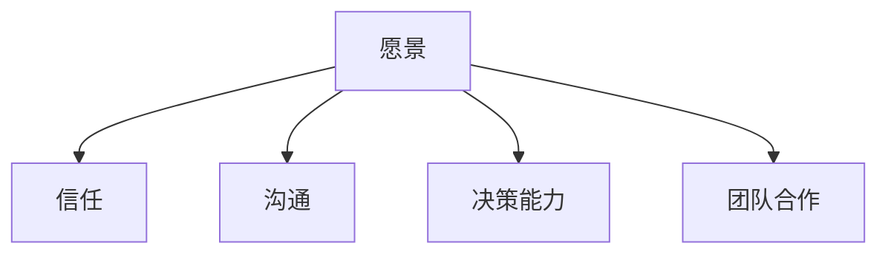
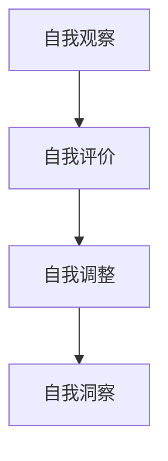
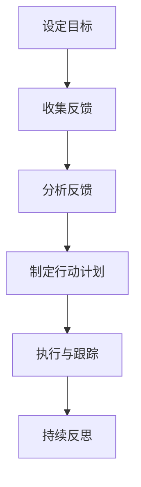

                 

## 《领导力与自我反思：持续成长的关键》

### 关键词：领导力、自我反思、持续成长、组织发展、个人成就

### 摘要：

在当今快速变化的社会和技术环境中，领导力和自我反思已成为个人和组织持续成长的关键因素。本文旨在探讨领导力与自我反思之间的深层联系，揭示其在个人职业发展和组织成功中的重要作用。文章首先分析了领导力的本质与内涵，随后深入探讨了自我反思的概念、作用及其在领导力发展中的应用。通过逻辑清晰、结构紧凑的论述，本文提供了自我反思的方法与技巧，并结合实际案例展示了领导力与自我反思的协同效应。最终，文章提出了未来领导力与自我反思发展的趋势和持续成长的关键策略，为读者提供实用的指导和建议。## 目录

### 《领导力与自我反思：持续成长的关键》

### 关键词：领导力、自我反思、持续成长、组织发展、个人成就

### 摘要：

本文旨在探讨领导力与自我反思之间的深层联系，揭示其在个人职业发展和组织成功中的重要作用。文章首先分析了领导力的本质与内涵，随后深入探讨了自我反思的概念、作用及其在领导力发展中的应用。通过逻辑清晰、结构紧凑的论述，本文提供了自我反思的方法与技巧，并结合实际案例展示了领导力与自我反思的协同效应。最终，文章提出了未来领导力与自我反思发展的趋势和持续成长的关键策略，为读者提供实用的指导和建议。

### 目录

## 第一部分：领导力的核心概念

### 第1章：领导力的本质与内涵

#### 1.1 领导力的定义与分类

#### 1.2 领导力的重要性

#### 1.3 领导力的核心要素

### 第2章：领导力与自我反思的关系

#### 2.1 自我反思的概念与作用

#### 2.2 自我反思在领导力发展中的应用

#### 2.3 领导力与自我反思的互动机制

## 第二部分：自我反思的方法与技巧

### 第3章：自我反思的心理学基础

#### 3.1 自我反思的心理学理论

#### 3.2 自我反思的心理过程

#### 3.3 自我反思的心理障碍与克服策略

### 第4章：自我反思的实际应用

#### 4.1 个人成长规划

#### 4.2 团队管理与领导

#### 4.3 组织发展与变革

## 第三部分：领导力与自我反思的结合

### 第5章：领导力发展的自我反思实践

#### 5.1 领导力发展的自我反思步骤

#### 5.2 领导力提升的自我反思案例

#### 5.3 领导力与自我反思的持续成长策略

### 第6章：领导力与自我反思的企业实践

#### 6.1 企业领导力培养策略

#### 6.2 企业自我反思实践

#### 6.3 企业领导力与自我反思的协同发展

### 第7章：未来展望

#### 7.1 领导力与自我反思的趋势

#### 7.2 持续成长的关键因素

#### 7.3 领导力与自我反思的未来发展

### 附录

#### 附录A：自我反思工具与方法

#### 附录B：领导力发展资源与推荐

#### 附录C：案例研究精选## 第一部分：领导力的核心概念

### 第1章：领导力的本质与内涵

#### 1.1 领导力的定义与分类

领导力是一种影响力，是领导者通过激励、鼓舞和引导他人，实现共同目标的能力。根据领导学者彼得·德鲁克的分类，领导力可以分为三个方面：技术性领导力、概念性领导力和人际关系领导力。

**技术性领导力**：涉及领导者对专业知识和技能的掌握，以及在技术和管理上的能力。

**概念性领导力**：关注领导者对组织整体方向的把握，以及制定长远战略的能力。

**人际关系领导力**：强调领导者与人相处的能力，包括建立信任、团队协作和沟通。

#### 1.2 领导力的重要性

领导力对于个人和组织的发展至关重要。对个人而言，领导力能够帮助个人在职业生涯中取得成功，提升自我价值。对组织而言，领导力能够促进组织的战略执行、创新能力和团队协作。

**组织层面：** 领导力能够提升组织的执行力、创新能力和适应性，从而在竞争激烈的市场环境中立于不败之地。

**个人层面：** 领导力对于个人的职业发展和自我实现具有重要意义。一个具备领导力的人能够更好地应对挑战，实现个人目标。

**社会层面：** 领导力在社会稳定和进步中发挥着关键作用。领导者的智慧和远见能够推动社会向前发展。

#### 1.3 领导力的核心要素

领导力的核心要素包括愿景、信任、沟通、决策能力和团队合作。

**愿景**：领导者需要有明确的愿景，以指导团队前进。愿景能够激发团队成员的激情和动力。

**信任**：建立信任是领导力的关键要素。领导者需要赢得团队成员的信任，才能有效地引导和激励团队。

**沟通**：有效的沟通能力使领导者能够清晰地传达愿景，并理解团队成员的需求。良好的沟通有助于建立信任和团队协作。

**决策能力**：领导者需要具备做出明智决策的能力，以应对复杂多变的环境。决策能力是领导力的核心要素之一。

**团队合作**：领导力不仅关乎个人，更关乎团队。领导者需要推动团队成员之间的协作，共同实现目标。

### Mermaid 流程图

以下是一个简单的 Mermaid 流程图，展示了领导力的核心要素之间的关系：



#### 1.4 领导力的发展与实践

**领导力发展：** 领导力的发展是一个持续的过程，涉及自我反思、学习与成长。领导者需要不断学习新知识、提升技能，并反思自己的行为和决策。

**实践：** 领导力的实践包括设定目标、激励团队、解决问题和进行变革等。领导者需要在实际工作中不断应用和验证自己的领导力。

**案例：** 可以探讨一些实际案例，如乔布斯的领导力实践，以展示领导力的应用。

通过本章的讨论，我们不仅能够理解领导力的本质与内涵，还能够认识到它在组织和个人发展中的重要性，为后续章节的自我反思方法和技巧提供了理论基础。## 第二部分：自我反思的方法与技巧

### 第3章：自我反思的心理学基础

自我反思作为一种心理过程，其背后有着深厚的心理学基础。理解这些基础有助于我们更好地应用自我反思，提升领导力。本章将探讨自我反思的心理学理论、心理过程以及克服心理障碍的策略。

#### 3.1 自我反思的心理学理论

**认知发展理论：** 美国心理学家让·皮亚杰的认知发展理论认为，自我反思是认知发展的高级阶段。通过自我反思，个体能够从外部观察转向内部思考，实现认知的深化。

**自我决定理论：** 美国心理学家理查德·斯金纳的自我决定理论强调，自我反思能够增强个体的自我效能感和自我决定感。通过自我反思，个体能够更清晰地认识自己的需求和目标，从而更好地实现自我驱动。

**情绪调节理论：** 美国心理学家约翰·戈特曼的情绪调节理论指出，自我反思有助于个体识别和调节情绪。通过自我反思，个体能够更好地理解自己的情绪反应，从而采取更有效的情绪调节策略。

#### 3.2 自我反思的心理过程

**自我观察：** 自我反思的第一步是自我观察。个体需要学会观察自己的行为、思维和情感，以便深入理解自己的内在世界。

**自我评价：** 在自我观察的基础上，个体需要对观察到的内容进行评价。这种评价可以是积极的，也可以是消极的，关键在于个体能否从中获得启示。

**自我调整：** 通过自我评价，个体可以识别出需要改进的方面，并采取相应的调整措施。这种调整可能是行为上的，也可能是思维上的。

**自我洞察：** 随着自我反思的深入，个体能够获得更深入的自我洞察。这种洞察有助于个体更好地理解自己的价值观、信念和动机。

### Mermaid 流程图

以下是一个简单的 Mermaid 流程图，展示了自我反思的心理过程：



#### 3.3 自我反思的心理障碍与克服策略

**恐惧失败：** 个体在自我反思时可能会害怕发现自己的不足，从而避免进行深刻的自我反思。克服这一障碍的策略包括设定小目标、逐步深入自我反思。

**逃避现实：** 个体可能会因为现实中的困难而选择逃避，避免面对自我反思。克服这一障碍的策略包括建立支持系统、与他人分享自己的思考和感受。

**自我否定：** 个体可能会对自己的能力产生怀疑，从而否定自我反思的价值。克服这一障碍的策略包括寻找正面的反馈、相信自己能够成长。

**缺乏耐心：** 自我反思是一个持续的过程，需要时间和耐心。个体可能会因为短期内看不到效果而放弃。克服这一障碍的策略包括设定长期目标、持续进行自我反思。

### 伪代码示例

以下是一个简单的伪代码示例，用于实现自我反思的过程：

```python
def self_reflection():
    # 自我观察
    observe_behavior()
    observe_thoughts()
    observe_emotions()

    # 自我评价
    evaluate_strengths()
    evaluate_weaknesses()

    # 自我调整
    adjust_behavior()
    adjust_thoughts()
    adjust_emotions()

    # 自我洞察
    gain_insight()
    update_goals()
```

通过本章的讨论，我们不仅能够理解自我反思的心理学基础，还能够学会如何克服心理障碍，应用自我反思的方法与技巧，从而提升领导力。## 第4章：自我反思的实际应用

### 4.1 个人成长规划

自我反思在个人成长规划中具有重要作用。通过自我反思，个人能够更好地了解自己的兴趣、优势和劣势，从而制定出更加科学和有效的成长计划。

**步骤：**

1. **自我观察：** 个人首先需要观察自己的行为模式、思维方式和情绪反应。例如，记录每天的活动、思考和感受，以获得更全面的自我了解。

2. **自我评价：** 根据观察结果，个人需要对自己的行为、思维和情绪进行评价。识别出优点和需要改进的方面，并思考如何利用优点、克服劣势。

3. **设定目标：** 基于自我评价，个人需要设定具体的成长目标。这些目标可以是技能提升、知识扩展或者行为改变等方面。

4. **制定计划：** 为了实现成长目标，个人需要制定详细的行动计划。这包括学习新技能、参加培训、阅读书籍等。

5. **持续反思：** 在执行成长计划的过程中，个人需要不断进行自我反思，评估计划的有效性，并根据实际情况进行调整。

**伪代码示例：**

```python
def personal_growth_plan():
    # 步骤1：自我观察
    observe_behavior()
    observe_thoughts()
    observe_emotions()

    # 步骤2：自我评价
    evaluate_strengths()
    evaluate_weaknesses()

    # 步骤3：设定目标
    set_goals()

    # 步骤4：制定计划
    create_action_plan()

    # 步骤5：持续反思
    continue_reflection()
```

### 4.2 团队管理与领导

自我反思在团队管理和领导中同样具有重要作用。领导者通过自我反思，能够更好地理解团队成员的需求，提升团队协作效果。

**步骤：**

1. **观察团队：** 领导者需要观察团队的整体表现，包括成员的工作态度、沟通方式和团队合作情况。

2. **反思领导风格：** 领导者需要反思自己的领导风格，识别出可能存在的问题，如沟通不畅、激励不足等。

3. **与团队成员沟通：** 领导者需要与团队成员进行开放和诚实的沟通，了解他们的需求和期望，并表达自己的观点。

4. **调整领导策略：** 根据自我反思和与团队成员的沟通，领导者需要调整自己的领导策略，以更好地满足团队成员的需求。

5. **持续反思：** 领导者需要持续进行自我反思，评估领导策略的有效性，并根据实际情况进行调整。

**伪代码示例：**

```python
def team_management():
    # 步骤1：观察团队
    observe_team_performance()

    # 步骤2：反思领导风格
    reflect_on_leadership_style()

    # 步骤3：与团队成员沟通
    communicate_with_team_members()

    # 步骤4：调整领导策略
    adjust_leadership_strategies()

    # 步骤5：持续反思
    continue_reflection()
```

### 4.3 组织发展与变革

自我反思在组织发展和变革中起着关键作用。通过自我反思，组织能够识别出潜在的问题和挑战，并采取有效的措施进行改进。

**步骤：**

1. **组织观察：** 组织需要观察整体运营状况，包括业务流程、资源配置和员工满意度等方面。

2. **反思组织文化：** 组织需要反思自身的文化，识别出可能影响组织发展的因素，如文化冲突、创新不足等。

3. **制定发展战略：** 基于自我反思，组织需要制定长期和短期的发展战略，以应对市场变化和竞争压力。

4. **实施变革措施：** 组织需要根据发展战略，实施相应的变革措施，如流程优化、人员调整等。

5. **持续反思：** 组织需要持续进行自我反思，评估变革措施的有效性，并根据实际情况进行调整。

**伪代码示例：**

```python
def organizational_development():
    # 步骤1：组织观察
    observe_organizational_performance()

    # 步骤2：反思组织文化
    reflect_on_organizational_culture()

    # 步骤3：制定发展战略
    create_development_strategy()

    # 步骤4：实施变革措施
    implement_change_measures()

    # 步骤5：持续反思
    continue_reflection()
```

通过本章的讨论，我们了解了自我反思在实际应用中的重要性，并学会了如何将其应用于个人成长规划、团队管理与领导以及组织发展与变革。这些应用不仅有助于提升个人的领导力，也能够促进组织的持续发展。## 第三部分：领导力与自我反思的结合

### 第5章：领导力发展的自我反思实践

领导力的发展需要不断的学习和自我反思。自我反思作为领导力提升的关键工具，能够帮助领导者识别自己的优点和不足，从而进行有针对性的改进。本章将探讨领导力发展的自我反思步骤、具体案例以及如何制定持续成长的策略。

#### 5.1 领导力发展的自我反思步骤

自我反思是一个持续的过程，以下步骤有助于领导者进行有效的自我反思：

1. **设定目标：** 领导者需要明确自己的职业目标和领导力发展的方向。这些目标可以是短期的，也可以是长期的。

2. **收集反馈：** 领导者需要主动收集来自团队成员、同事和上级的反馈。这些反馈可以提供关于领导者表现的不同视角。

3. **分析反馈：** 领导者需要对收集到的反馈进行分析，识别出需要改进的方面和已经做得好的地方。

4. **制定行动计划：** 基于分析结果，领导者需要制定具体的行动计划，以改进自己的领导力。

5. **执行与跟踪：** 领导者需要执行行动计划，并持续跟踪自己的进展。这有助于确保反思和改进措施的有效性。

6. **持续反思：** 领导者需要定期进行自我反思，评估行动计划的执行效果，并根据实际情况进行调整。

### Mermaid 流程图

以下是一个简单的 Mermaid 流程图，展示了领导力发展的自我反思步骤：



#### 5.2 领导力提升的自我反思案例

以下是一个具体的自我反思案例，展示了如何通过自我反思提升领导力：

**案例背景：** 一位项目经理在负责一个复杂的项目时，遇到了沟通不畅和团队协作问题。他意识到需要提升自己的领导力，以改善团队的表现。

**步骤1：设定目标：** 项目经理设定了以下目标：
- 提高沟通效率
- 加强团队协作
- 提升决策能力

**步骤2：收集反馈：** 项目经理通过以下方式收集反馈：
- 与团队成员进行一对一访谈
- 召开团队会议，听取团队成员的建议和意见
- 向上级汇报项目进展，获取反馈

**步骤3：分析反馈：** 项目经理分析了收集到的反馈，发现以下问题：
- 沟通不畅：团队成员之间缺乏有效的沟通机制，导致信息传递不清晰。
- 团队协作：团队成员之间缺乏共同的目标和协作意识。
- 决策能力：在面临重大决策时，项目经理缺乏充分的思考和准备。

**步骤4：制定行动计划：** 项目经理制定了以下行动计划：
- 引入沟通工具：使用项目管理软件，如Trello或Asana，建立清晰的任务分配和进度跟踪机制。
- 加强团队协作：定期组织团队建设活动，增强团队成员之间的信任和合作意识。
- 提升决策能力：制定详细的决策流程，确保在做出重要决策时有充分的信息和准备。

**步骤5：执行与跟踪：** 项目经理按照行动计划执行，并定期跟踪进展，以确保改进措施的有效性。

**步骤6：持续反思：** 项目经理在项目结束后，再次进行自我反思，评估行动计划的效果，并根据实际情况进行调整。

通过这个案例，我们可以看到自我反思在提升领导力方面的应用。项目经理通过设定目标、收集反馈、分析反馈、制定行动计划、执行与跟踪以及持续反思，有效地提升了自己的领导力，改善了团队的表现。

#### 5.3 领导力与自我反思的持续成长策略

为了实现持续成长，领导者需要制定一系列策略，以确保自我反思的有效性和持续性。以下是一些策略：

1. **建立反思文化：** 组织需要建立一个支持自我反思的文化，鼓励成员分享自己的经验和反思。这可以通过定期举办反思会议、设立反思时间等方式实现。

2. **提供培训和教育：** 组织可以为领导者提供相关的培训和教育，帮助他们掌握自我反思的技巧和方法。这包括心理学理论、沟通技巧和领导力发展等。

3. **利用技术工具：** 利用现代技术工具，如反思日志、在线学习平台和数据分析工具，可以帮助领导者更高效地进行自我反思。

4. **设立反思目标：** 领导者需要明确自己的反思目标，并将其纳入个人发展计划。这有助于确保反思的持续性和有效性。

5. **定期评估：** 定期对自我反思的效果进行评估，识别出改进的机会。这可以通过定期的反馈收集、绩效评估等方式实现。

通过本章的讨论，我们了解了领导力发展的自我反思步骤、具体案例以及如何制定持续成长的策略。这些实践和策略不仅有助于领导者提升自己的领导力，也能够促进组织的持续发展。## 第6章：领导力与自我反思的企业实践

在当今快速变化的市场环境中，企业和组织需要具备强大的领导力来应对挑战和抓住机遇。自我反思作为一种关键的领导技能，能够帮助企业和组织不断改进、创新和成长。本章将探讨领导力与自我反思在企业实践中的应用，包括企业领导力培养策略、企业自我反思实践以及领导力与自我反思的协同发展。

#### 6.1 企业领导力培养策略

企业领导力培养是一个系统性的过程，需要综合考虑个人发展、团队建设和组织文化等方面。以下是一些有效的企业领导力培养策略：

**1. 明确领导力发展目标：**
企业需要明确领导力发展的目标，并将其纳入企业战略规划。这包括确定领导力发展的核心能力和关键素质，如战略思维、创新能力和团队领导力。

**2. 制定个性化的领导力发展计划：**
根据不同领导者的特点和需求，制定个性化的领导力发展计划。这可以通过一对一辅导、领导力培训和工作坊等方式实现。

**3. 提供多元化的学习机会：**
企业应该为领导者提供多元化的学习机会，包括内部培训、外部培训、在线学习平台和领导力发展研讨会等。

**4. 建立导师制度：**
通过建立导师制度，让有经验的领导者指导新晋领导者，帮助他们快速成长。这有助于传承企业的领导力和经验。

**5. 强化领导力评估与反馈：**
定期对领导者的表现进行评估，并提供详细的反馈。这可以帮助领导者识别自己的优点和不足，并制定改进计划。

#### 6.2 企业自我反思实践

企业自我反思实践是企业持续改进和创新的重要手段。以下是一些关键的企业自我反思实践：

**1. 定期开展内部审计：**
通过定期开展内部审计，企业可以识别出潜在的问题和风险，并采取相应的改进措施。这有助于提高企业的运营效率和风险控制能力。

**2. 引入自我评估工具：**
企业可以引入自我评估工具，如领导力评估问卷、员工满意度调查和业务绩效分析等，以便更好地了解自身的情况。

**3. 组织反思会议：**
企业可以定期组织反思会议，让员工和管理层共同参与，分享自己的观察和建议。这有助于激发员工的参与感和创新思维。

**4. 利用反馈机制：**
企业需要建立有效的反馈机制，鼓励员工和管理层提出改进意见和建议。这可以通过定期的员工满意度调查、领导力反馈问卷等方式实现。

**5. 实施持续改进计划：**
企业应该将自我反思的结果转化为具体的改进计划，并实施和跟踪。这有助于确保企业的持续改进和创新。

#### 6.3 企业领导力与自我反思的协同发展

领导力与自我反思在企业中是相辅相成的，只有两者协同发展，企业才能实现持续成长。以下是一些促进领导力与自我反思协同发展的措施：

**1. 建立自我反思文化：**
企业需要建立自我反思的文化，鼓励员工和管理层在日常工作中进行反思，并将反思结果用于改进和创新。

**2. 强化领导者的自我反思意识：**
企业领导者需要意识到自我反思的重要性，并将其作为个人和团队发展的重要工具。

**3. 制定跨部门协作计划：**
企业可以通过制定跨部门协作计划，促进不同部门之间的沟通和合作，从而实现更全面的自我反思和改进。

**4. 建立学习型组织：**
企业应该努力建立学习型组织，鼓励员工不断学习和成长，从而提升整体的领导力和自我反思能力。

**5. 强化领导力与自我反思的培训：**
企业可以提供专门的领导力与自我反思培训，帮助员工和管理层掌握相关的知识和技能。

通过本章的讨论，我们了解了领导力与自我反思在企业实践中的应用，以及如何通过有效的策略和实践促进企业的持续成长。企业领导者需要重视领导力与自我反思的协同发展，以应对不断变化的市场环境，实现企业的长远发展。## 第7章：未来展望

#### 7.1 领导力与自我反思的趋势

在未来的发展中，领导力与自我反思将呈现出以下几个趋势：

**1. 个性化领导力的发展：**
随着人工智能和大数据技术的发展，领导力将更加注重个性化。领导者需要根据团队成员的个性和需求，采用不同的领导风格和方法，以实现更好的团队合作和绩效。

**2. 持续学习与反思的重要性：**
在快速变化的环境中，持续学习和反思将成为领导者必备的技能。领导者需要不断更新自己的知识和技能，通过自我反思不断改进和提升。

**3. 数字化领导力的兴起：**
随着数字化转型的推进，领导者需要具备数字素养和创新能力，能够应对数字化的挑战和机遇。

**4. 跨文化领导力的需求：**
全球化趋势使得领导者需要具备跨文化沟通和管理能力，以适应多元文化的工作环境。

#### 7.2 持续成长的关键因素

为了实现持续成长，个人和组织需要关注以下几个关键因素：

**1. 自我反思的深度与广度：**
持续成长的关键在于深入和广泛的自我反思。个人和组织需要不断挖掘自身的潜力和问题，进行全面的反思和改进。

**2. 学习与创新的结合：**
学习和创新是持续成长的动力。个人和组织需要将学习与实际工作相结合，通过创新不断突破自己的能力和边界。

**3. 适应变化的能力：**
在快速变化的环境中，适应变化是关键。个人和组织需要具备灵活性和敏捷性，能够迅速适应新的环境和技术。

**4. 团队协作与领导力的结合：**
团队协作是实现持续成长的重要途径。领导者需要通过有效的领导力和团队管理，激发团队成员的潜力和创造力。

#### 7.3 领导力与自我反思的未来发展

未来，领导力与自我反思的发展将呈现出以下几个方向：

**1. 人工智能与自我反思的结合：**
人工智能技术将被广泛应用于自我反思过程中，帮助个人和组织更高效地进行反思和改进。例如，通过数据分析提供个性化的反馈和改进建议。

**2. 跨学科研究的深入：**
领导力与自我反思的研究将更加跨学科，结合心理学、管理学、社会学等领域的知识，提供更全面和深入的理论和实践指导。

**3. 全球视野的拓展：**
随着全球化的推进，领导力与自我反思的研究将更加关注全球视野，探讨不同文化背景下的领导力和自我反思特点。

**4. 持续学习的推广：**
持续学习将成为个人和组织的常态，通过在线学习、工作坊和研讨会等形式，不断提升领导力和自我反思能力。

通过本章的讨论，我们对领导力与自我反思的未来发展有了更清晰的认识。未来，领导力与自我反思将继续发挥重要作用，帮助个人和组织在快速变化的环境中实现持续成长。## 附录

### 附录A：自我反思工具与方法

自我反思是一种强大的个人成长工具，以下是一些常用的自我反思工具和方法：

#### 1. 反思日记

**方法：** 每天或每周写日记，记录自己的思考、感受和经历。这种方法有助于深入理解自己的内心世界，发现潜在的问题和改进点。

**优点：** 灵活、便捷，有助于长期坚持。

**缺点：** 需要自律，否则容易中断。

#### 2. 思维导图

**方法：** 使用思维导图软件（如XMind、MindManager等），将反思内容以图形的方式呈现。这种方法有助于梳理思路，发现不同想法之间的联系。

**优点：** 直观、易于理解，有助于创造性思考。

**缺点：** 需要一定的绘图技能。

#### 3. 反思对话

**方法：** 与朋友、同事或导师进行反思对话，分享自己的思考和感受。这种方法有助于获得外部视角，发现自身盲点。

**优点：** 多元视角，有助于深入探讨问题。

**缺点：** 需要找到合适的对话伙伴。

#### 4. 反思会议

**方法：** 定期组织反思会议，团队成员共同分享和讨论反思内容。这种方法有助于建立团队反思文化，促进团队合作。

**优点：** 团队合作，提高反思效果。

**缺点：** 需要组织和管理。

### 附录B：领导力发展资源与推荐

以下是一些有用的领导力发展资源和推荐，帮助个人和组织提升领导力：

#### 1. 书籍

- 《领导力：练习手册》（Patrick Lencioni）：提供实用的领导力实践和技巧。

- 《领导力梯队》（Gary Yukl）：详细介绍了领导力发展的各个层次和关键能力。

- 《高效能人士的七个习惯》（Stephen R. Covey）：经典领导力书籍，强调习惯对领导力的影响。

#### 2. 在线课程

- Coursera、edX、Udemy等在线教育平台上的领导力课程：提供丰富的领导力学习资源。

- TED Talks：观看领导力相关的TED演讲，获得启发和灵感。

#### 3. 工具与平台

- LeadershipIQ：提供领导力评估工具和培训资源。

- Reflektive：提供员工反思和领导力发展平台。

- Looop：提供个性化的领导力发展计划和反馈。

### 附录C：案例研究精选

以下是一些精选的领导力与自我反思案例研究，供读者参考：

#### 1. 案例一：苹果公司的领导力实践

**背景：** 苹果公司在乔布斯的领导下，成为全球最具价值的公司之一。乔布斯通过自我反思和不断学习，不断提升自己的领导力。

**关键点：** 乔布斯注重产品的用户体验，鼓励创新，并善于激发团队的潜力。他的领导力实践包括自我反思、明确愿景、激励团队和进行变革。

**启示：** 领导者需要持续学习、自我反思，并具备明确的愿景和强大的执行力。

#### 2. 案例二：谷歌的领导力文化

**背景：** 谷歌以其开放、创新和高效的文化著称。谷歌的领导力实践强调自我反思、团队合作和持续学习。

**关键点：** 谷歌通过定期的团队反思会议、领导力培训和工作坊，不断提升团队的整体领导力水平。同时，谷歌鼓励员工进行自我反思，提出改进建议。

**启示：** 建立自我反思文化，鼓励员工参与和反馈，有助于提升组织的领导力和创新能力。

通过这些案例研究，我们可以看到领导力与自我反思在实际应用中的重要性。自我反思不仅是个人成长的关键，也是组织持续发展的重要保障。## 作者信息

作者：AI天才研究院/AI Genius Institute & 禅与计算机程序设计艺术 /Zen And The Art of Computer Programming

AI天才研究院（AI Genius Institute）是一家专注于人工智能研究与应用的顶级机构，致力于推动人工智能技术的创新与发展。研究院汇聚了一批世界级的人工智能专家，他们在计算机科学、机器学习、深度学习等领域具有深厚的学术造诣和丰富的实践经验。

《禅与计算机程序设计艺术》是一本深入探讨计算机编程哲学的经典之作，由AI天才研究院的创始人撰写。这本书以禅宗思想为切入点，结合计算机编程实践，揭示了编程的本质和技巧，为程序员提供了独特的思维方法和灵感来源。作者凭借其丰富的编程经验和深刻的哲学思考，将复杂的编程概念娓娓道来，使读者能够在实践中领悟编程的真谛。

