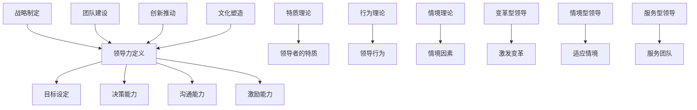
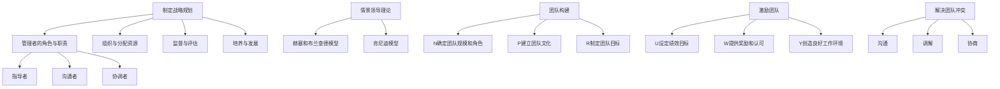
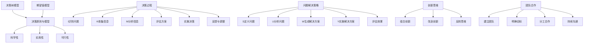

```mermaid
graph TD
    A[时间管理重要性] --> B[提高工作效率]
    A --> C[减少工作压力]
    A --> D[实现目标]
    E[时间管理原则] --> F[优先级排序]
    E --> G[集中注意力]
    E --> H[合理规划]
    E --> I[避免拖延]
    J[时间管理方法] --> K[时间管理矩阵]
    J --> L[番茄工作法]
    M[工作效率技巧] --> N[减少无意义会议]
    M --> O[避免多任务处理]
    M --> P[设置截止日期]
    Q[提升工作效率工具] --> R[记事本]
    Q --> S[任务管理软件]
    Q --> T[沟通工具]
    U[时间管理与领导力] --> V[W决策能力提升]
    U --> X[Y团队管理提升]
    U --> Y[Z个人发展提升]
    AA[领导者时间管理策略] --> BB[明确目标]
    AA --> CC[授权与委托]
    AA --> DD[定期反思]
```

```mermaid
graph TD
    A[案例分析目的与方法] --> B[学习领导力实践]
    A --> C[提高领导能力]
    A --> D[启发创新思维]
    E[案例解读] --> F[案例背景分析]
    E --> G[关键事件分析]
    E --> H[领导者决策分析]
    E --> I[组织结果分析]
    J[案例反思] --> K[领导行为评估]
    J --> L[经验教训总结]
    M[销售总监领导力实践] --> N[问题识别]
    M --> O[变革决策]
    M --> P[执行措施]
    M --> Q[变革结果]
    R[管理者转型与挑战] --> S[角色转变]
    R --> T[领导力提升]
    R --> U[管理变革]
    R --> V[管理结果]
    AA[团队领导力建设] --> BB[团队构建]
    AA --> CC[激励团队]
    AA --> DD[解决团队冲突]
```
                 


### 第1章：领导力概述

#### 1.1 领导力的定义与重要性

**1.1.1 领导力的定义**

领导力是一种激发和引导他人共同实现目标的能力。它不仅仅局限于组织内部的层级关系，还涵盖了在团队、部门或项目中的影响力。具体而言，领导力包括以下几个方面：

- **目标设定**：领导者需要明确团队的目标，并能够将这些目标转化为具体的行动计划。
- **决策能力**：在复杂多变的环境中，领导者需要迅速做出明智的决策，以应对各种挑战。
- **沟通能力**：有效的沟通是领导者连接团队成员、传达信息和解决问题的重要手段。
- **激励能力**：领导者需要激发团队成员的积极性和创造力，使团队保持活力和动力。

**1.1.2 领导力在组织中的作用**

领导力在组织中的作用至关重要，它不仅影响组织内部的运作，还对组织的长远发展产生深远影响。以下是领导力在组织中的几个关键作用：

- **战略制定**：领导者需要制定组织的发展战略，确保组织在竞争激烈的市场中保持竞争力。
- **团队建设**：领导者通过有效的团队建设，提高团队的协作效率，增强团队的整体实力。
- **创新推动**：领导者鼓励创新思维，推动组织不断改进和优化，保持组织的活力和成长。
- **文化塑造**：领导者通过自身的言行，塑造组织的文化和价值观，形成良好的组织氛围。

#### 1.2 领导力理论的发展

**1.2.1 经典领导力理论**

经典领导力理论主要包括特质理论、行为理论和情境理论。

- **特质理论**：特质理论认为领导者的成功取决于他们个人的特质和品质。例如，特质理论强调领导者的性格、能力和素质等因素。
- **行为理论**：行为理论关注领导者的行为和行动，认为领导者的行为对于团队的表现有重要影响。行为理论主要分为领导风格和行为模式两个方面。
- **情境理论**：情境理论认为领导者的效果取决于所处的情境和环境。根据不同的情境，领导者需要采取不同的领导策略。

**1.2.2 现代领导力理论**

现代领导力理论在经典理论的基础上，进一步发展出了变革型领导理论、情境型领导理论和服务型领导理论。

- **变革型领导理论**：变革型领导理论强调领导者通过激发和鼓励团队成员，推动组织实现变革和进步。
- **情境型领导理论**：情境型领导理论认为领导者应该根据团队成员的能力和情境的需要，采取不同的领导风格。
- **服务型领导理论**：服务型领导理论强调领导者应该以服务团队成员为中心，通过满足团队成员的需求来推动组织的发展。

### Mermaid 流程图



#### 1.3 领导力在现代组织中的挑战与机遇

**1.3.1 挑战**

- **快速变化的环境**：现代组织面临的市场环境变化迅速，领导者需要具备快速适应和应对变化的能力。
- **多样化团队管理**：随着全球化进程的加快，团队成员来自不同的文化背景，领导者需要理解并适应这种多样性。
- **科技与数据的影响**：随着科技的发展，领导者需要掌握和应用新的技术工具，同时需要理解和运用大数据等新兴概念。

**1.3.2 机遇**

- **数字化转型**：数字化转型为组织带来了新的机遇，领导者可以借助技术手段提升组织的效率和质量。
- **创新驱动发展**：创新是现代组织持续发展的关键，领导者需要推动创新思维和实践，激发组织的创新活力。
- **社会责任与可持续发展**：在现代社会，领导者不仅要关注组织的经济效益，还要承担社会责任，推动组织的可持续发展。

### 伪代码

```python
# 领导力定义
def define_leadership():
    # 目标设定
    set_goals()
    
    # 决策能力
    make_decisions()
    
    # 沟通能力
    communicate_effectively()
    
    # 激励能力
    motivate_teams()

# 领导力在组织中的作用
def role_of_leadership():
    # 战略制定
    formulate_strategies()
    
    # 团队建设
    build_teams()
    
    # 创新推动
    promote_innovation()
    
    # 文化塑造
    shape_culture()

# 领导力理论的发展
def leadership_theories():
    # 特质理论
    trait_theory()
    
    # 行为理论
    behavior_theory()
    
    # 情境理论
    situational_theory()

# 现代领导力理论
def modern_leadership_theories():
    # 变革型领导理论
    transformational_leadership()
    
    # 情境型领导理论
    situational_leadership()
    
    # 服务型领导理论
    servant_leadership()
```

### 数学模型和公式

$$
\text{领导力} = f(\text{目标设定}, \text{决策能力}, \text{沟通能力}, \text{激励能力})
$$

$$
\text{战略制定} = \text{目标设定} \times \text{情境因素}
$$

$$
\text{团队建设} = \text{激励能力} + \text{沟通能力}
$$

### 举例说明

假设一个销售团队的目标是增加销售额，领导者需要通过以下步骤来实现：

1. **目标设定**：明确目标，例如增加销售额 10%。
2. **决策能力**：分析市场情况，制定有效的销售策略。
3. **沟通能力**：与团队成员沟通目标，确保每个人都理解并接受目标。
4. **激励能力**：通过奖励机制，激励团队成员为实现目标而努力。

### 项目实战

在项目实战中，领导者需要：

1. **开发环境搭建**：搭建一个适合团队开发的环境，确保团队成员可以高效协作。
2. **源代码详细实现**：根据销售策略，编写详细的源代码，实现具体的销售功能。
3. **代码解读与分析**：分析代码，确保其符合最佳实践，并能够高效运行。
4. **实际案例分析和详细讲解剖析**：通过实际案例，分析领导力在项目中的具体应用，并详细讲解剖析。

### 最佳实践 tips

- **持续学习**：领导者需要不断学习，提升自己的专业知识和领导能力。
- **倾听与沟通**：领导者需要倾听团队成员的意见，并通过有效沟通，确保团队的协作效率。
- **激励与认可**：领导者需要通过激励和认可，激发团队成员的积极性和创造力。

### 小结

本章介绍了领导力的定义与重要性、领导力理论的发展以及领导力在现代组织中的挑战与机遇。通过这些内容，读者可以了解领导力在组织中的关键作用，以及如何提升领导力，成为优秀的领导者。

### 拓展阅读

- 《领导力的五大实践》
- 《情境领导力》
- 《服务型领导》

### 注意事项

- 领导力是一个多维度的概念，不同理论有其独特的视角和应用场景。
- 领导者需要根据具体情况，灵活运用不同的领导策略。

---

作者：AI天才研究院/AI Genius Institute & 禅与计算机程序设计艺术 /Zen And The Art of Computer Programming### 第2章：领导者的自我认知与个人发展

#### 2.1 自我认知的重要性

自我认知是领导者个人发展的基石，它有助于领导者了解自己的优点和不足，从而更好地发挥个人优势，克服弱点。自我认知不仅包括对自己的技能和能力的了解，还包括对个人性格、价值观和动机的认知。

**2.1.1 自我认知的理论基础**

- **SWOT分析**：SWOT分析是一种常用的自我认知工具，它通过分析自身的优势（Strengths）、劣势（Weaknesses）、机会（Opportunities）和威胁（Threats），帮助领导者全面了解自身情况。
- **五力模型**：五力模型最初用于商业战略分析，但也可以应用于个人发展。它包括内部五力（个人能力、个人资源、个人关系、个人动力和个人愿景）和外部五力（市场环境、技术趋势、社会文化、经济政策和政治法律）。

**2.1.2 自我认知的重要性**

自我认知对于领导者的个人发展和组织绩效具有深远影响：

- **明确个人定位**：通过自我认知，领导者可以明确自己的职业发展方向，从而做出更明智的职业决策。
- **提高决策质量**：自我认知有助于领导者更准确地评估自身能力和资源，从而做出更高质量的决策。
- **促进团队协作**：自我认知可以帮助领导者更好地理解团队成员的需求和期望，从而促进团队协作。
- **提升组织绩效**：自我认知有助于领导者发现组织中的问题和挑战，从而采取有效的措施提升组织绩效。

#### 2.2 个人发展计划

制定个人发展计划是领导者自我提升的重要步骤，它有助于确保领导者持续进步，适应不断变化的环境。

**2.2.1 制定个人发展目标的步骤**

- **自我评估**：通过SWOT分析和五力模型等工具，对自己的能力、资源、优势和劣势进行评估。
- **设定目标**：基于自我评估结果，设定具体的、可衡量的个人发展目标。
- **制定行动计划**：为实现目标，制定详细的行动计划，包括具体的时间表、任务分配和资源调配。

**2.2.2 个人发展目标的实现**

- **持续学习**：领导者需要不断学习新知识、新技能，以适应不断变化的环境。
- **实践与应用**：将学到的知识和技能应用到实际工作中，通过实践来提高自己的能力。
- **定期评估**：定期评估个人发展计划的执行情况，根据评估结果调整计划。

#### 2.3 建立自信

自信是领导者成功的关键因素之一。建立自信不仅有助于提升领导者的个人魅力，还能激发团队成员的积极性和创造力。

**2.3.1 自信的重要性**

- **增强决策能力**：自信的领导者更愿意承担风险，从而做出更具前瞻性的决策。
- **提高沟通效果**：自信的领导者更容易赢得他人的信任和尊重，从而提高沟通效果。
- **激发团队活力**：自信的领导者能够传递积极的能量，激发团队成员的活力和创造力。

**2.3.2 建立自信的策略**

- **正面肯定**：领导者需要通过积极的自我对话，不断肯定自己的能力和成就。
- **克服恐惧**：领导者需要面对恐惧，勇敢尝试新事物，通过成功克服恐惧来建立自信。
- **持续进步**：通过不断学习和实践，领导者可以不断提升自己的能力和知识，从而增强自信。

### Mermaid 流程图

```mermaid
graph TD
    A[自我认知重要性] --> B[明确个人定位]
    A --> C[提高决策质量]
    A --> D[促进团队协作]
    A --> E[提升组织绩效]
    F[自我评估] --> G[SWOT分析]
    F --> H[五力模型]
    I[J[设定目标]] --> K[具体可衡量]
    I --> L[M[制定行动计划]]
    N[持续学习] --> O[知识更新]
    N --> P[实践应用]
    Q[定期评估] --> R[S[调整计划]]
    T[建立自信] --> U[V[增强决策能力]]
    T --> W[X[提高沟通效果]]
    T --> Y[Z[激发团队活力]]
    AA[正面肯定] --> BB[积极自我对话]
    AA --> CC[克服恐惧]
    AA --> DD[持续进步]
```

#### 2.4 增强领导力的工具和方法

为了增强领导力，领导者可以采用以下工具和方法：

- **360度反馈**：通过收集来自同事、下属和上级的反馈，领导者可以更全面地了解自己的领导风格和影响力。
- **领导力发展课程**：参加专业的领导力发展课程，领导者可以学习最新的领导理论和方法，提升自己的领导能力。
- **导师辅导**：通过与有经验的领导者建立导师关系，领导者可以获取宝贵的经验和建议，从而加速个人成长。

### 伪代码

```python
# 自我认知重要性
def self_awareness():
    # 明确个人定位
    define_personality()
    
    # 提高决策质量
    improve_decision_making()
    
    # 促进团队协作
    enhance_teamwork()
    
    # 提升组织绩效
    boost_organizational_performance()

# 自我评估
def self_evaluation():
    # SWOT分析
    perform_SWOT_analysis()
    
    # 五力模型
    apply_five Forces_model()

# 设定目标
def set_goals():
    # 制定具体可衡量目标
    create_specific_measurable_goals()
    
    # 制定行动计划
    create_action_plan()

# 建立自信
def build_confidence():
    # 正面肯定
    positive_affirmation()
    
    # 克服恐惧
    overcome_fears()
    
    # 持续进步
    continue_improvement()
```

### 数学模型和公式

$$
\text{自我认知} = f(\text{优势}, \text{劣势}, \text{机会}, \text{威胁})
$$

$$
\text{个人发展目标} = \text{当前能力} + \text{学习增长}
$$

$$
\text{建立自信} = \text{正面肯定} + \text{成功经验}
$$

### 举例说明

假设一位销售总监通过SWOT分析发现，自己具有强大的销售能力和市场洞察力，但沟通技巧有待提高。针对这一情况，他可以：

1. **自我评估**：通过360度反馈，了解自己在团队中的沟通表现。
2. **设定目标**：设定提升沟通技巧的目标，例如每周参加一次沟通技巧培训。
3. **制定行动计划**：制定详细的培训计划，包括培训时间、培训内容和培训评估。

### 项目实战

在项目实战中，销售总监需要：

1. **开发环境搭建**：搭建一个适合团队沟通的环境，确保团队成员可以高效协作。
2. **源代码详细实现**：编写详细的沟通计划和实施策略，确保每个团队成员都了解并执行沟通计划。
3. **代码解读与分析**：分析沟通计划和实施效果，确保沟通计划符合最佳实践，并能够高效运行。
4. **实际案例分析和详细讲解剖析**：通过实际案例，分析沟通技巧在项目中的具体应用，并详细讲解剖析。

### 最佳实践 tips

- **定期自我评估**：领导者需要定期进行自我评估，以了解自己的发展情况。
- **寻求反馈**：领导者需要主动寻求反馈，以获取他人的意见和建议。
- **持续学习**：领导者需要持续学习，不断提升自己的专业知识和领导能力。

### 小结

本章介绍了领导者的自我认知与个人发展，包括自我认知的重要性、个人发展计划的制定、建立自信以及增强领导力的工具和方法。通过这些内容，读者可以了解如何通过自我认知和个人发展，提升自己的领导能力。

### 拓展阅读

- 《如何成为高效领导者》
- 《领导者的影响力》
- 《自我认知与个人成长》

### 注意事项

- 自我认知是一个持续的过程，领导者需要不断进行自我反思和调整。
- 个人发展计划需要根据实际情况进行灵活调整。

---

作者：AI天才研究院/AI Genius Institute & 禅与计算机程序设计艺术 /Zen And The Art of Computer Programming### 第3章：管理能力提升

#### 3.1 管理者的角色与职责

管理者的角色和职责是领导力的重要组成部分，一个成功的管理者不仅需要具备领导力，还需要具备卓越的管理能力。管理者的角色和职责可以分为以下几个核心部分：

**3.1.1 管理者的三大核心角色**

- **指导者**：管理者需要为团队提供明确的方向和目标，确保团队成员了解自己的职责和工作重点。管理者还需要为团队成员提供必要的指导和支持，帮助他们克服工作中的困难和挑战。
- **沟通者**：有效的沟通是管理者的关键职责之一。管理者需要确保信息在团队内部和团队之间流畅传递，避免信息误解和冲突。同时，管理者还需要具备倾听能力，理解团队成员的需求和意见。
- **协调者**：管理者需要协调团队内部的各种资源，确保团队的工作效率和质量。这包括协调团队成员的工作进度、解决团队内部的冲突，以及与其他部门或团队的合作。

**3.1.2 管理者的职责**

- **制定战略规划**：管理者需要制定组织或团队的战略规划，明确组织或团队的目标和发展方向。
- **组织与分配资源**：管理者需要确保团队拥有必要的资源，包括人力、物力和财力，以实现组织或团队的目标。
- **监督与评估**：管理者需要监督团队的工作进度和绩效，对团队成员的工作进行评估和反馈，确保团队的工作质量和效率。
- **培养与发展**：管理者需要关注团队成员的个人发展，提供培训和指导，帮助团队成员提升技能和知识，实现个人和团队的目标。

#### 3.2 情景领导与团队管理

**3.2.1 情景领导理论**

情景领导理论是一种基于情境的领导方法，它认为领导者的风格应该根据团队成员的能力和情境的需要而灵活调整。情景领导理论主要分为以下几种模型：

- **赫塞和布兰查德的情景领导模型**：这个模型将领导风格分为四种类型，即指示型、推销型、参与型和授权型。指示型领导者为团队成员提供明确的指导和指令；推销型领导者不仅提供指导，还通过激励和说服来激励团队成员；参与型领导者鼓励团队成员参与决策；授权型领导者给予团队成员最大的自主权和责任。
- **肯尼迪的情景领导模型**：肯尼迪的模型将领导风格分为指导型、支持型、参与型和委托型。指导型领导者为团队成员提供明确的任务和指导；支持型领导者关注团队成员的需求和感受；参与型领导者鼓励团队成员参与决策；委托型领导者给予团队成员最大的自主权和责任。

**3.2.2 团队管理策略**

- **团队构建**：团队构建是团队管理的基础。管理者需要根据团队的目标和任务，选择合适的团队成员，并建立有效的团队结构。这包括确定团队的规模、角色和职责，以及建立团队的文化和价值观。
- **激励团队**：激励是提高团队绩效和员工满意度的关键。管理者可以通过设定明确的绩效目标、提供奖励和认可、创造良好的工作环境等方式来激励团队成员。
- **解决团队冲突**：团队冲突是团队管理中不可避免的问题。管理者需要及时识别和解决团队冲突，确保团队的工作顺利进行。解决团队冲突的方法包括沟通、调解和协商等。

### Mermaid 流�程图



#### 3.3 提升管理能力的方法

为了提升管理能力，管理者可以采用以下方法：

- **参加培训课程**：参加专业的管理培训课程，学习最新的管理理论和方法。
- **阅读专业书籍**：阅读管理领域的经典书籍，如《管理的实践》、《领导者的实践》等，提升自己的管理知识。
- **实践与反思**：在实际工作中，管理者需要不断实践，通过反思和总结，提升自己的管理能力。
- **寻求反馈**：主动寻求来自同事、下属和上级的反馈，了解自己的管理风格和效果，不断改进。

### 伪代码

```python
# 管理者的角色与职责
def manager_role():
    # 指导者
    provide_guidance()
    
    # 沟通者
    communicate_effectively()
    
    # 协调者
    coordinate_resources()

# 制定战略规划
def strategic_planning():
    # 制定组织或团队的目标
    define_goals()
    
    # 组织与分配资源
    allocate_resources()

# 监督与评估
def supervision_and_evaluation():
    # 监督团队工作进度
    monitor_progress()
    
    # 对团队成员的工作进行评估
    evaluate_performance()

# 培养与发展
def development_and_growth():
    # 提供培训
    provide_training()
    
    # 指导团队成员
    guide_teams()

# 情景领导理论
def situational_leadership():
    # 赫塞和布兰查德模型
    hertzberg_and_branshaw_model()
    
    # 肯尼迪模型
    kennedy_model()

# 团队构建
def team_building():
    # 确定团队规模和角色
    define_team_size_and_role()
    
    # 建立团队文化
    build_team_culture()

# 激励团队
def motivate_team():
    # 设定绩效目标
    set_performance_goals()
    
    # 提供奖励和认可
    provide_rewards_and_recognition()

# 解决团队冲突
def resolve_conflicts():
    # 沟通
    communicate()
    
    # 调解
    mediate()
    
    # 协商
    negotiate()
```

### 数学模型和公式

$$
\text{管理能力} = f(\text{指导能力}, \text{沟通能力}, \text{协调能力})
$$

$$
\text{团队绩效} = \text{个人绩效} + \text{团队协作}
$$

$$
\text{情境领导} = \text{领导者风格} + \text{团队成员能力}
$$

### 举例说明

假设一位销售总监希望通过提升管理能力来提高团队绩效，他可以采取以下步骤：

1. **参加培训课程**：参加关于领导力和团队管理的专业培训课程，学习最新的管理理论和方法。
2. **实践与反思**：在实际工作中，尝试应用所学的管理方法，通过反思和总结，不断提升自己的管理能力。
3. **寻求反馈**：定期与团队成员和上级沟通，了解自己在管理中的优势和不足，并根据反馈进行调整。

### 项目实战

在项目实战中，销售总监需要：

1. **开发环境搭建**：搭建一个适合团队协作的环境，确保团队成员可以高效沟通和协作。
2. **源代码详细实现**：编写详细的团队管理计划和实施策略，确保每个团队成员都了解并执行管理计划。
3. **代码解读与分析**：分析管理计划和实施效果，确保管理计划符合最佳实践，并能够高效运行。
4. **实际案例分析和详细讲解剖析**：通过实际案例，分析管理能力在项目中的具体应用，并详细讲解剖析。

### 最佳实践 tips

- **定期反思**：管理者需要定期反思自己的管理行为和效果，以不断改进自己的管理能力。
- **积极寻求反馈**：管理者需要主动寻求来自团队和上级的反馈，以了解自己的管理风格和效果。
- **持续学习**：管理者需要持续学习，不断提升自己的专业知识和管理能力。

### 小结

本章介绍了管理者的角色与职责、情景领导与团队管理，以及提升管理能力的方法。通过这些内容，读者可以了解如何通过提升管理能力，成为一名卓越的管理者。

### 拓展阅读

- 《管理者的实践》
- 《领导者的特质》
- 《团队协作的艺术》

### 注意事项

- 管理者需要根据实际情况，灵活调整管理策略。
- 管理者需要关注团队成员的个人发展和需求。

---

作者：AI天才研究院/AI Genius Institute & 禅与计算机程序设计艺术 /Zen And The Art of Computer Programming### 第4章：沟通技巧提升

#### 4.1 有效沟通的原则

有效沟通是领导者和管理者必备的重要技能，它不仅影响个人的工作效率和团队的合作关系，还直接影响组织的整体绩效。以下是一些有效沟通的基本原则：

**4.1.1 沟通模型**

有效的沟通通常遵循一个模型，包括以下几个关键步骤：

- **明确目的**：在进行沟通之前，明确沟通的目的，确保信息传递的准确性和针对性。
- **信息编码**：将思想、意图或信息转化为语言、文字或其他符号形式，确保信息可以传达给接收者。
- **信息传递**：通过适当的渠道将编码后的信息传递给接收者，确保信息能够被准确接收。
- **信息解码**：接收者需要理解并解读传递过来的信息，确保信息的接收和理解一致。
- **反馈**：接收者将接收和理解的信息反馈给发送者，确保信息的完整性和准确性。

**4.1.2 沟通障碍**

沟通障碍是影响有效沟通的重要因素，主要包括以下几种：

- **语言障碍**：语言表达不准确或不当，导致信息传递出现偏差。
- **文化差异**：不同文化背景的团队成员在沟通中可能存在误解和冲突。
- **情绪因素**：情绪波动会影响沟通的质量，使沟通内容被误解或忽视。
- **信息过载**：过多的信息可能导致接收者无法处理，从而影响沟通效果。

#### 4.2 非言语沟通

非言语沟通是沟通技巧的重要组成部分，它通过肢体语言、面部表情、声音等非语言方式传递信息。以下是一些有效的非言语沟通技巧：

**4.2.1 非言语沟通的重要性**

- **增强言语表达**：非言语沟通可以增强言语的表达力，使信息更加生动和具体。
- **传递情感和态度**：非言语沟通能够直观地传递沟通者的情感和态度，帮助接收者更好地理解信息。
- **改善沟通效果**：有效的非言语沟通可以减少误解，提高沟通的效率和效果。

**4.2.2 非言语沟通的技巧**

- **肢体语言**：通过肢体语言，如姿态、手势、眼神等，可以表达自己的态度和情感，增强沟通效果。
- **面部表情**：面部表情可以传达情感，如喜悦、愤怒、担忧等，使沟通更加生动和具体。
- **声音语言**：声音的语调、速度、音量等都可以传递信息，例如，柔和的语调可以表达友好和耐心，而快速的语调可能传达出紧张和不安。

#### 4.3 演讲技巧

演讲技巧是领导者和管理者必备的一项技能，它能够帮助领导者有效地传达信息、影响他人和塑造组织文化。以下是一些提高演讲技巧的方法：

**4.3.1 演讲的结构**

- **开场**：以引人入胜的开场白吸引听众的注意力，例如，引用一个故事、提出一个引人深思的问题或展示一个引人入目的数据。
- **主体**：主体部分是演讲的核心，需要清晰、有条理地传达关键信息。可以使用段落、章节等方式来组织内容，确保信息的逻辑性和连贯性。
- **结尾**：结尾部分需要总结演讲的主要观点，并给予听众深刻的印象。可以使用一句话、一个故事或一个行动呼吁来结束演讲。

**4.3.2 演讲的准备**

- **明确目标**：在演讲前，明确演讲的目标和受众，确保演讲内容能够满足听众的需求。
- **内容准备**：准备演讲的内容，包括演讲的主题、大纲和要点。可以使用笔记、PPT或其他辅助工具来帮助演讲。
- **练习演讲**：在正式演讲前，进行多次练习，熟悉演讲的内容和流程，增强自信和演讲效果。

**4.3.3 演讲的技巧**

- **控制情绪**：保持冷静和自信，避免紧张和焦虑情绪的影响。
- **保持眼神交流**：与听众保持眼神交流，建立良好的互动和联系。
- **使用肢体语言**：通过适当的肢体语言，增强演讲的表现力和吸引力。
- **控制语速和语调**：控制演讲的语速和语调，使演讲内容更加生动和具体。
- **反馈和调整**：在演讲过程中，根据听众的反应和反馈，及时调整演讲内容和节奏。

### Mermaid 流程图

```mermaid
graph TD
    A[有效沟通原则] --> B[明确目的]
    A --> C[信息编码]
    A --> D[信息传递]
    A --> E[信息解码]
    A --> F[反馈]
    G[沟通障碍] --> H[语言障碍]
    G --> I[J[文化差异]]
    G --> K[L[情绪因素]]
    G --> M[N[信息过载]]
    O[非言语沟通] --> P[肢体语言]
    O --> Q[R[面部表情]]
    O --> S[T[声音语言]]
    U[演讲技巧] --> V[W[开场]]
    U --> X[Y[主体]]
    U --> Z[Z[结尾]]
    AA[演讲准备] --> BB[明确目标]
    AA --> CC[内容准备]
    AA --> DD[练习演讲]
    EE[控制情绪] --> FF[保持冷静]
    EE --> GG[增强自信]
    HH[保持眼神交流] --> II[建立互动]
    JJ[使用肢体语言] --> KK[增强表现力]
    LL[控制语速和语调] --> MM[使内容生动]
    NN[反馈和调整] --> OO[适应听众反应]
```

### 伪代码

```python
# 有效沟通原则
def effective_communication():
    # 明确目的
    define_purpose()
    
    # 信息编码
    encode_message()
    
    # 信息传递
    transmit_message()
    
    # 信息解码
    decode_message()
    
    # 反馈
    provide_feedback()

# 沟通障碍
def communication_barriers():
    # 语言障碍
    handle_language_barriers()
    
    # 文化差异
    handle_cultural_differences()
    
    # 情绪因素
    handle_emotional_factors()
    
    # 信息过载
    handle_information_overload()

# 非言语沟通
def nonverbal_communication():
    # 肢体语言
    use_body_language()
    
    # 面部表情
    use Facial_expressions()
    
    # 声音语言
    use_vocal_language()

# 演讲技巧
def public_speaking_skills():
    # 开场
    start_with_a_great_opening()
    
    # 主体
    present_the_main_content()
    
    # 结尾
    end_with_a memorable_closing()

# 演讲准备
def speech_preparation():
    # 明确目标
    define_speech_goals()
    
    # 内容准备
    prepare_speech_content()
    
    # 练习演讲
    practice_speech()

# 控制情绪
def control_emotions():
    # 保持冷静
    stay_calm()
    
    # 增强自信
    build_confidence()

# 保持眼神交流
def maintain_eye_contact():
    # 建立互动
    establish_interactivity()

# 使用肢体语言
def use_bodily_language():
    # 增强表现力
    enhance_performance()

# 控制语速和语调
def control_speed_and_pitch():
    # 使内容生动
    make_content_interesting()

# 反馈和调整
def feedback_and_adjustments():
    # 适应听众反应
    adapt_to_audience_reaction()
```

### 数学模型和公式

$$
\text{有效沟通} = f(\text{目的明确}, \text{信息编码}, \text{信息传递}, \text{信息解码}, \text{反馈})
$$

$$
\text{非言语沟通效果} = f(\text{肢体语言}, \text{面部表情}, \text{声音语言})
$$

$$
\text{演讲吸引力} = f(\text{开场}, \text{主体}, \text{结尾})
$$

### 举例说明

假设一位销售总监需要向团队成员传达一个重要的销售策略，他可以采取以下步骤：

1. **明确目的**：确保团队成员理解销售策略的重要性，明确沟通的目标。
2. **信息编码**：将销售策略转化为具体的语言和图表，确保信息清晰易懂。
3. **信息传递**：通过面对面会议、电子邮件或内部通讯工具，将编码后的信息传递给团队成员。
4. **信息解码**：确保团队成员正确理解销售策略，可以通过提问、讨论和反馈来验证。
5. **反馈**：收集团队成员的反馈，确保他们能够有效应用销售策略。

### 项目实战

在项目实战中，销售总监需要：

1. **开发环境搭建**：搭建一个支持多种沟通方式的平台，如视频会议系统、即时通讯工具等，确保团队成员可以随时沟通。
2. **源代码详细实现**：编写详细的沟通计划和实施策略，确保每个团队成员都了解并执行沟通计划。
3. **代码解读与分析**：分析沟通计划和实施效果，确保沟通计划符合最佳实践，并能够高效运行。
4. **实际案例分析和详细讲解剖析**：通过实际案例，分析沟通技巧在项目中的具体应用，并详细讲解剖析。

### 最佳实践 tips

- **定期练习**：领导者和管理者需要定期练习沟通技巧，提高沟通效率和质量。
- **关注反馈**：领导者和管理者需要关注团队成员的反馈，及时调整沟通方式和方法。
- **注重非言语沟通**：领导者和管理者需要注重非言语沟通，通过肢体语言、面部表情和声音等传递信息和情感。

### 小结

本章介绍了沟通技巧提升，包括有效沟通的原则、非言语沟通的技巧、演讲技巧和演讲准备。通过这些内容，读者可以了解如何提升沟通技巧，成为更有效的领导者和管理者。

### 拓展阅读

- 《沟通的艺术》
- 《非言语沟通的力量》
- 《演讲的力量》

### 注意事项

- 沟通是一个双向过程，领导者和管理者需要注重倾听和理解。
- 非言语沟通和言语沟通相结合，可以增强沟通效果。

---

作者：AI天才研究院/AI Genius Institute & 禅与计算机程序设计艺术 /Zen And The Art of Computer Programming### 第5章：决策与问题解决

#### 5.1 决策的原则与模型

决策是领导者和管理者在工作中不可避免的一部分，有效的决策能力对于组织的成功至关重要。以下是决策的几个基本原则和常见模型：

**5.1.1 决策的原则**

- **科学性**：决策应基于事实和数据，避免主观臆断。领导者需要收集和分析相关信息，确保决策具有科学依据。
- **实用性**：决策应考虑实际可行性，确保决策能够被实施并产生预期效果。领导者需要评估资源的可用性和执行的难度。
- **可行性**：决策需要考虑长远的战略目标，确保决策有助于组织的发展。领导者需要权衡短期利益和长期目标，做出明智的选择。

**5.1.2 决策模型**

- **决策树模型**：决策树模型是一种常用的决策分析方法，它通过树状图的形式，展示不同决策路径和相应的结果，帮助领导者评估不同决策的后果。
- **期望值模型**：期望值模型是一种基于概率和期望值的决策方法。领导者通过计算不同决策路径的概率和期望值，选择期望值最高的决策路径。

**5.1.3 决策过程的步骤**

- **识别问题**：明确需要解决的问题或机会。
- **收集信息**：收集与问题或机会相关的数据和信息。
- **分析信息**：对收集到的信息进行分析和评估，确定可行的解决方案。
- **评估方案**：评估每个解决方案的优缺点，选择最优方案。
- **实施决策**：制定详细的行动计划，执行决策。
- **反馈与调整**：对决策实施后的效果进行反馈和评估，根据实际情况进行调整。

#### 5.2 问题解决的策略

问题解决是领导者和管理者必备的能力，有效的问题解决策略可以帮助组织克服各种挑战。以下是几种常见的问题解决策略：

**5.2.1 问题解决的过程**

- **定义问题**：明确问题的本质和范围，确保问题被正确识别。
- **分析问题**：对问题进行深入分析，了解问题的根本原因。
- **生成解决方案**：列出所有可能的解决方案，并进行评估和选择。
- **实施解决方案**：制定详细的实施计划，并确保解决方案得到有效执行。
- **评估效果**：对解决方案的效果进行评估，并根据评估结果进行调整。

**5.2.2 创新思维**

- **组合创新**：通过将现有元素重新组合，创造出新的解决方案。例如，将两个不同领域的知识结合起来，解决一个复杂问题。
- **改良创新**：对现有产品或服务进行改进，以提高其性能或降低成本。
- **反转思维**：通过颠覆传统的思维模式，找到新的解决方案。例如，将产品或服务的使用方式进行反转，从而创造新的市场机会。

**5.2.3 团队合作**

- **建立团队**：组建一支具有多元化背景和技能的团队，确保团队能够从不同角度分析和解决问题。
- **明确目标**：确保团队成员对问题的目标和期望有共同的理解。
- **分工合作**：根据团队成员的能力和专长，分配具体任务，确保每个成员都能发挥最大的作用。
- **持续沟通**：保持团队内部的高效沟通，确保信息的及时传递和问题的及时解决。

### Mermaid 流程图



### 伪代码

```python
# 决策原则与模型
def decision_principles():
    # 科学性
    ensure_scientificity()
    
    # 实用性
    ensure_practicality()
    
    # 可行性
    ensure_feasibility()

# 决策过程
def decision_process():
    # 识别问题
    identify_problem()
    
    # 收集信息
    collect_information()
    
    # 分析信息
    analyze_information()
    
    # 评估方案
    evaluate_solutions()
    
    # 实施决策
    implement_decision()
    
    # 反馈与调整
    provide_feedback()

# 问题解决策略
def problem_solving():
    # 定义问题
    define_problem()
    
    # 分析问题
    analyze_problem()
    
    # 生成解决方案
    generate_solutions()
    
    # 实施解决方案
    implement_solution()
    
    # 评估效果
    evaluate_solution()

# 创新思维
def innovation_thinking():
    # 组合创新
    composite_innovation()
    
    # 改良创新
    improvement_innovation()
    
    # 反转思维
    reverse_thinking()

# 团队合作
def teamwork():
    # 建立团队
    build_team()
    
    # 明确目标
    define_goal()
    
    # 分工合作
    assign_tasks()
    
    # 持续沟通
    maintain_communication()
```

### 数学模型和公式

$$
\text{决策} = f(\text{科学性}, \text{实用性}, \text{可行性})
$$

$$
\text{期望值} = \sum_{i} p_i \times v_i
$$

$$
\text{问题解决} = f(\text{定义问题}, \text{分析问题}, \text{生成解决方案}, \text{实施解决方案}, \text{评估效果})
$$

### 举例说明

假设一位销售总监需要决定是否投资一个新的市场，他可以采取以下步骤：

1. **识别问题**：明确是否投资新市场的必要性和潜在风险。
2. **收集信息**：收集新市场的相关数据，包括市场规模、竞争对手和消费者需求。
3. **分析信息**：分析新市场的机会和挑战，评估投资的风险和潜在回报。
4. **评估方案**：根据期望值模型，计算不同投资方案的期望收益，选择最优方案。
5. **实施决策**：制定详细的投资计划，确保投资方案的顺利实施。
6. **反馈与调整**：在投资实施后，定期评估投资效果，并根据实际情况进行调整。

### 项目实战

在项目实战中，销售总监需要：

1. **开发环境搭建**：搭建一个支持数据分析和管理决策的平台，确保团队成员可以高效收集、分析和应用数据。
2. **源代码详细实现**：编写详细的决策过程和问题解决策略，确保每个团队成员都了解并执行决策过程。
3. **代码解读与分析**：分析决策过程和问题解决策略的实施效果，确保决策过程和策略符合最佳实践，并能够高效运行。
4. **实际案例分析和详细讲解剖析**：通过实际案例，分析决策与问题解决在项目中的具体应用，并详细讲解剖析。

### 最佳实践 tips

- **数据驱动决策**：领导者应基于可靠的数据进行决策，避免凭直觉或主观判断做出决策。
- **持续学习和改进**：领导者应不断学习新的决策理论和问题解决策略，并在实践中不断改进。
- **鼓励团队参与**：领导者应鼓励团队成员参与决策过程，提高团队的决策质量和执行力。

### 小结

本章介绍了决策与问题解决，包括决策的原则与模型、问题解决的策略和创新思维。通过这些内容，读者可以了解如何通过科学决策和有效的问题解决策略，提升领导和管理能力。

### 拓展阅读

- 《决策与判断》
- 《创新思维与问题解决》
- 《团队协作与沟通》

### 注意事项

- 决策过程需要考虑多种因素，避免片面决策。
- 问题解决需要灵活应用各种策略，根据实际情况进行调整。

---

作者：AI天才研究院/AI Genius Institute & 禅与计算机程序设计艺术 /Zen And The Art of Computer Programming### 第6章：时间管理与效率提升

#### 6.1 时间管理的重要性

时间管理是领导者提升工作效率的重要手段。在快节奏的工作环境中，有效的管理时间可以提高工作效率，减少工作压力，从而实现个人和组织的目标。

**6.1.1 时间管理的基本原则**

- **优先级排序**：将任务根据重要性和紧急性进行排序，优先处理最重要和最紧急的任务。
- **集中注意力**：在工作时集中注意力，避免分心和干扰，提高工作效率。
- **合理规划**：合理规划工作时间，确保任务在规定时间内完成。
- **避免拖延**：及时处理任务，避免拖延，减少工作压力。

**6.1.2 时间管理的方法**

- **时间管理矩阵**：将任务分为四类，即重要紧急、重要不紧急、不重要紧急和不重要不紧急，根据优先级进行处理。
- **番茄工作法**：将工作时间分为25分钟的工作周期和5分钟的休息时间，提高专注力和工作效率。

#### 6.2 提升工作效率的技巧

**6.2.1 避免时间浪费**

- **减少无意义会议**：合理安排会议时间，避免频繁召开无意义或冗长的会议。
- **避免多任务处理**：专注于一项任务，避免在同一时间内处理多项任务，提高工作效率。
- **设置截止日期**：为任务设置明确的截止日期，确保任务按时完成。

**6.2.2 提升工作效率的工具**

- **记事本**：使用记事本记录重要任务和想法，避免遗忘。
- **任务管理软件**：使用任务管理软件，如Trello、Asana等，帮助跟踪和管理任务进度。
- **沟通工具**：使用高效的沟通工具，如Slack、Microsoft Teams等，提高团队协作效率。

#### 6.3 时间管理与领导力

**6.3.1 时间管理对领导力的影响**

- **决策能力**：有效的时间管理有助于领导者更好地做出决策，避免因时间紧迫而做出仓促决定。
- **团队管理**：通过时间管理，领导者可以更好地协调团队工作，提高团队效率。
- **个人发展**：有效的时间管理有助于领导者有更多的时间进行学习和自我提升，提升个人能力。

**6.3.2 领导者的时间管理策略**

- **明确目标**：领导者需要明确自己的工作目标和时间安排，确保时间利用最大化。
- **授权与委托**：领导者需要学会授权和委托，避免将时间浪费在琐碎的事务上。
- **定期反思**：领导者需要定期反思自己的时间管理情况，调整和优化时间安排。

### Mermaid 流程图



### 伪代码

```python
# 时间管理重要性
def time_management_importance():
    # 提高工作效率
    increase_work_efficiency()
    
    # 减少工作压力
    reduce_work_stress()
    
    # 实现目标
    achieve_goals()

# 时间管理原则
def time_management_principles():
    # 优先级排序
    prioritize_tasks()
    
    # 集中注意力
    focus_attention()
    
    # 合理规划
    plan_reasonably()
    
    # 避免拖延
    avoid_procrastination()

# 时间管理方法
def time_management_methods():
    # 时间管理矩阵
    use_time_management_matrix()
    
    # 番茄工作法
    use_pomodoro Technique()

# 工作效率技巧
def efficiency_skills():
    # 减少无意义会议
    minimize_unnecessary_meetings()
    
    # 避免多任务处理
    avoid multitasking()
    
    # 设置截止日期
    set_deadlines()

# 提升工作效率工具
def efficiency_tools():
    # 记事本
    use_notebook()
    
    # 任务管理软件
    use_task_management_software()
    
    # 沟通工具
    use_communication_tools()

# 时间管理与领导力
def time_management_leadership():
    # 决策能力提升
    improve_decision_making()
    
    # 团队管理提升
    enhance_team_management()
    
    # 个人发展提升
    promote_personal_development()

# 领导者时间管理策略
def leadership_time_management():
    # 明确目标
    define_goals()
    
    # 授权与委托
    delegate_responsibilities()
    
    # 定期反思
    reflect_regularly()
```

### 数学模型和公式

$$
\text{工作效率} = f(\text{时间管理}, \text{专注力}, \text{任务优先级})
$$

$$
\text{时间管理效率} = \frac{\text{完成任务的总量}}{\text{花费的总时间}}
$$

$$
\text{任务优先级} = \text{紧急程度} \times \text{重要性}
$$

### 举例说明

假设一位销售总监需要在一天内完成以下任务：

1. **上午**：召开销售会议，讨论销售策略。
2. **下午**：与团队成员讨论项目进度，解决遇到的难题。
3. **晚上**：准备明天的会议材料，编写销售报告。

他可以采取以下步骤：

1. **优先级排序**：将任务根据紧急程度和重要性排序，确定上午的销售会议是最重要的任务。
2. **时间规划**：为每个任务分配具体的时间，确保任务在规定时间内完成。
3. **专注力集中**：在召开销售会议时，确保团队成员专心参与，避免分心和干扰。
4. **任务完成**：确保每个任务都按时完成，避免拖延。

### 项目实战

在项目实战中，销售总监需要：

1. **开发环境搭建**：搭建一个支持时间管理和任务跟踪的平台，如Trello或Asana，确保团队成员可以高效管理时间和任务。
2. **源代码详细实现**：编写详细的时间管理策略和工作效率提升方法，确保每个团队成员都了解并执行策略。
3. **代码解读与分析**：分析时间管理策略和工作效率提升方法的有效性，确保策略和方法符合最佳实践，并能够高效运行。
4. **实际案例分析和详细讲解剖析**：通过实际案例，分析时间管理与工作效率提升在项目中的具体应用，并详细讲解剖析。

### 最佳实践 tips

- **定期规划时间**：领导者应定期规划自己的时间，确保工作高效有序。
- **避免拖延**：领导者应养成避免拖延的习惯，及时处理任务。
- **利用工具**：领导者应善于利用时间管理工具，提高工作效率。

### 小结

本章介绍了时间管理与效率提升，包括时间管理的重要性、基本原则和方法、工作效率提升的技巧以及时间管理与领导力的关系。通过这些内容，读者可以了解如何通过有效的时间管理和工作效率提升，成为更高效的领导者。

### 拓展阅读

- 《高效能人士的七个习惯》
- 《如何高效管理时间》
- 《领导者的时间管理》

### 注意事项

- 时间管理是一个持续的过程，领导者需要不断优化时间管理策略。
- 领导者应注重平衡工作与生活，避免过度工作导致的身心疲惫。

---

作者：AI天才研究院/AI Genius Institute & 禅与计算机程序设计艺术 /Zen And The Art of Computer Programming### 第7章：领导力案例分析

#### 7.1 案例分析的目的与方法

领导力案例分析是一种通过实际案例来研究和理解领导力实践的方法。其目的在于从具体案例中提炼出有价值的领导力原则和实践经验，以便于其他领导者借鉴和应用。

**7.1.1 案例分析的目的**

- **学习领导力实践**：通过分析成功或失败的领导案例，学习者可以更好地理解领导力的核心要素和关键技能。
- **提高领导能力**：通过案例研究，领导者可以识别自己在领导实践中的不足，并寻找改进的方法。
- **启发创新思维**：案例分析可以激发领导者进行创新思考，探索新的领导策略和方法。

**7.1.2 案例分析的方法**

- **案例解读**：详细分析案例背景、关键事件、领导者的决策和行为，以及这些决策和行为对组织结果的影响。
- **案例反思**：对案例进行深入反思，探讨案例中领导行为的优点和不足，以及可以从中吸取的经验教训。

#### 7.2 典型领导力案例分析

**7.2.1 销售总监的领导力实践**

以一位销售总监的领导力实践为例，分析其成功因素和面临的挑战：

**背景**：某销售总监负责一家大型企业的销售部门，该部门在过去一年中业绩不佳，市场份额持续下降。

**关键事件**：

1. **问题识别**：销售总监通过数据分析发现，销售团队存在几个主要问题：销售策略不合理、团队士气低落、市场反应迟缓。
2. **变革决策**：销售总监决定进行变革，包括调整销售策略、提升团队士气和加强市场反应。
3. **执行措施**：销售总监实施了一系列措施，如重新设计销售策略、组织培训提高团队技能、与市场密切互动，以及制定绩效评估机制。

**结果**：

- 通过变革措施，销售部门的业绩逐步提升，市场份额开始回升。
- 团队士气显著提高，员工工作积极性增强。
- 销售总监的领导风格得到了团队成员的认可。

**成功因素**：

- **问题识别准确**：销售总监通过数据分析和团队反馈，准确识别了部门存在的问题。
- **变革决策果断**：销售总监在问题识别后，迅速采取行动，进行有效的变革。
- **执行措施得当**：销售总监制定了具体的执行计划，确保变革措施得到有效实施。

**面临的挑战**：

- **变革阻力**：在变革过程中，一些团队成员可能对变革持保留态度，甚至抵触。
- **资源限制**：变革需要投入时间和资源，销售总监需要平衡现有资源的分配。
- **市场变化**：市场环境变化快速，销售总监需要不断调整策略以适应市场变化。

**7.2.2 管理者的转型与挑战**

以一位中层管理者的转型过程为例，分析其领导力提升和面临的挑战：

**背景**：某中层管理者在经历了多年的基层管理工作后，被提升为部门经理。

**关键事件**：

1. **角色转变**：中层管理者需要从执行者转变为管理者，负责团队的整体管理和绩效。
2. **领导力提升**：中层管理者参加了领导力培训课程，学习了新的管理技能和领导理论。
3. **管理变革**：中层管理者在提升领导能力后，开始实施管理变革，如优化流程、提高团队效率。

**结果**：

- 通过领导力提升和管理变革，部门的运营效率显著提高，员工满意度上升。
- 中层管理者的领导风格得到了上级和下属的认可。

**成功因素**：

- **持续学习**：中层管理者通过参加培训课程，不断提升自己的领导能力和管理知识。
- **角色转变**：中层管理者成功实现了从执行者到管理者的角色转变，提高了管理效率。
- **有效变革**：中层管理者实施了有效的管理变革，提升了部门的整体绩效。

**面临的挑战**：

- **适应新角色**：中层管理者需要适应新的管理角色和职责，避免因角色不适应而影响工作。
- **团队管理**：中层管理者需要管理不同背景和能力的团队成员，确保团队协作顺畅。
- **应对变化**：中层管理者需要应对快速变化的市场环境，保持部门的灵活性和适应性。

#### 7.3 团队领导力建设

**7.3.1 团队构建**

团队构建是领导力建设的重要环节，有效的团队构建可以提升团队的整体能力和绩效。以下是一种团队构建的方法：

- **明确团队目标**：确保团队成员对团队目标有共同的理解和认同。
- **角色分工**：根据团队成员的专长和兴趣，分配适当的角色和职责。
- **建立团队文化**：通过共同价值观和行为准则，建立团队的文化和氛围。

**7.3.2 激励团队**

激励是保持团队活力和创造力的重要手段。以下是一些激励团队的方法：

- **目标激励**：设定明确、可实现的团队目标，激发团队成员的进取心。
- **奖励机制**：通过奖励和认可，鼓励团队成员的工作表现和贡献。
- **情感激励**：关注团队成员的情感需求，提供关怀和支持，增强团队的凝聚力。

**7.3.3 解决团队冲突**

团队冲突是团队管理中常见的问题，有效的冲突解决可以提升团队的合作效率。以下是一些解决团队冲突的方法：

- **沟通解决**：通过有效沟通，了解冲突的原因和双方的需求，寻求共识。
- **调解解决**：如果冲突无法通过沟通解决，可以寻求第三方调解，帮助双方达成一致。
- **协商解决**：通过双方协商，寻找双方都能接受的解决方案。

### Mermaid 流程图



### 伪代码

```python
# 案例分析目的与方法
def case_analysis_purpose():
    # 学习领导力实践
    learn_leadership_practices()
    
    # 提高领导能力
    improve_leadership_skills()
    
    # 启发创新思维
    inspire_innovation_thinking()

# 案例解读
def case_deconstruction():
    # 案例背景分析
    analyze_case_background()
    
    # 关键事件分析
    analyze_key_events()
    
    # 领导者决策分析
    analyze_leader_decision()
    
    # 组织结果分析
    analyze_organization_results()

# 案例反思
def case_reflection():
    # 领导行为评估
    assess_leader_behavior()
    
    # 经验教训总结
    summarize_lessons_learned()

# 销售总监领导力实践
def sales_director_leadership():
    # 问题识别
    identify_issues()
    
    # 变革决策
    make_change_decisions()
    
    # 执行措施
    implement_measures()
    
    # 变革结果
    analyze_change_results()

# 管理者转型与挑战
def manager_transformation():
    # 角色转变
    transform_role()
    
    # 领导力提升
    improve_leadership()
    
    # 管理变革
    manage_changes()

# 团队领导力建设
def team_leadership_construction():
    # 团队构建
    build_team()
    
    # 激励团队
    motivate_team()
    
    # 解决团队冲突
    resolve_team_conflicts()
```

### 数学模型和公式

$$
\text{领导力实践成效} = f(\text{问题识别准确度}, \text{变革决策果断性}, \text{执行措施有效性})
$$

$$
\text{团队绩效} = f(\text{团队目标明确度}, \text{角色分工合理性}, \text{团队文化建设})
$$

$$
\text{激励效果} = f(\text{目标激励力度}, \text{奖励机制有效性}, \text{情感激励强度})
$$

$$
\text{冲突解决效率} = f(\text{沟通解决效果}, \text{调解解决效果}, \text{协商解决效果})
$$

### 举例说明

**销售总监领导力案例分析**：

**案例背景**：某销售总监所在的销售部门业绩持续下滑，团队成员士气低落。

**关键事件**：销售总监通过数据分析，识别出销售策略不合理、团队士气低落和客户关系管理不善等关键问题。他决定进行变革，提升团队绩效。

**领导者决策**：销售总监制定了以下决策：

- **调整销售策略**：根据市场变化和客户需求，重新设计销售策略。
- **提升团队技能**：组织团队成员参加销售技能培训，提升团队的整体能力。
- **加强客户关系管理**：建立客户数据库，定期与客户沟通，提高客户满意度。

**执行措施**：销售总监实施了以下措施：

- **制定详细计划**：为每个团队成员分配具体任务，明确责任和目标。
- **监督执行**：定期检查团队成员的执行情况，确保变革措施得到有效实施。
- **激励员工**：通过奖励和认可，激励团队成员积极参与变革。

**案例结果**：经过销售总监的变革措施，销售部门的业绩逐步提升，团队士气得到显著改善，客户关系也得到了加强。

**经验教训**：

- **问题识别**：领导者需要准确识别团队问题，确保变革措施有的放矢。
- **果断决策**：领导者需要果断决策，迅速采取行动，避免问题扩大。
- **有效执行**：领导者需要确保变革措施得到有效执行，避免流于形式。

### 项目实战

在项目实战中，销售总监需要：

1. **开发环境搭建**：搭建一个支持销售数据分析和管理决策的平台，如CRM系统，确保团队成员可以高效收集、分析和应用数据。
2. **源代码详细实现**：编写详细的变革措施和执行计划，确保每个团队成员都了解并执行计划。
3. **代码解读与分析**：分析变革措施和执行计划的有效性，确保计划符合最佳实践，并能够高效运行。
4. **实际案例分析和详细讲解剖析**：通过实际案例，分析销售总监领导力在项目中的具体应用，并详细讲解剖析。

### 最佳实践 tips

- **数据驱动**：领导者应基于数据做出决策，确保变革措施的针对性和有效性。
- **员工参与**：领导者应鼓励员工参与变革过程，提高变革的接受度和执行力。
- **持续改进**：领导者应持续跟踪变革效果，根据实际情况进行优化和调整。

### 小结

本章通过领导力案例分析，介绍了领导力案例分析的目的是什么、如何进行案例分析，以及销售总监的领导力实践、管理者的转型与挑战和团队领导力建设。通过这些内容，读者可以学习到领导力实践的经验和教训，提升自己的领导能力。

### 拓展阅读

- 《领导力案例分析》
- 《销售管理实战》
- 《团队建设与管理》

### 注意事项

- 案例分析需要结合实际情况，避免生搬硬套。
- 领导者在实践中应灵活应用领导力原则，根据具体情境进行调整。

