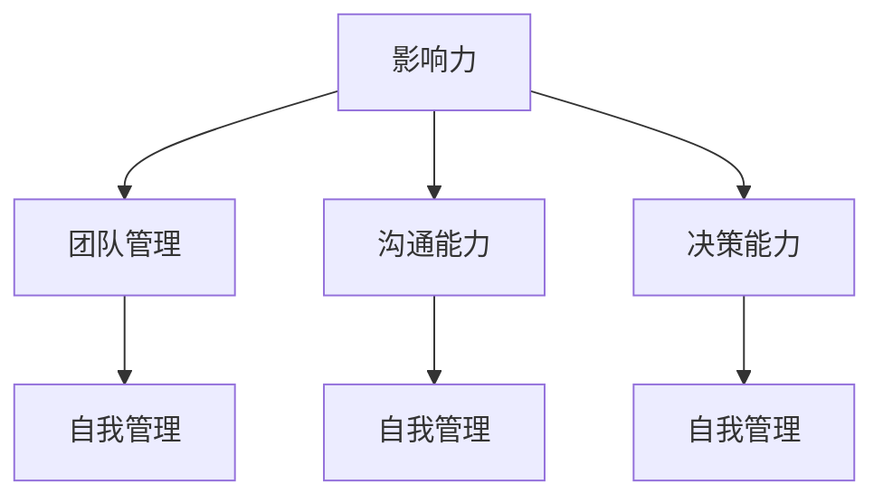

                 

### 背景介绍

在当今复杂多变的社会和商业环境中，领导力已成为决定个人、团队和组织成败的关键因素。领导力不仅仅是管理职位的人所应具备的能力，而是每个人在生活中都可能需要的重要技能。无论是企业家、项目经理、团队领导，还是普通员工，领导力都在不同程度上影响着他们所处环境的发展与进步。

领导力的重要性体现在多个方面。首先，它能够激发团队成员的潜力，提高团队的整体效率与创新能力。其次，领导力能够帮助团队在面对挑战和危机时保持稳定，做出明智的决策。此外，领导力还关乎组织的文化塑造，影响员工的满意度和忠诚度，进而影响组织的长期发展。

然而，领导力并非一蹴而就，而是一个持续修炼和提升的过程。从新手到大师，这一成长之路充满了挑战与机遇。本文旨在探讨领导力从新手到大师的成长之路，通过逻辑清晰、结构紧凑、简单易懂的专业技术语言，帮助读者理解领导力的本质，掌握提升领导力的方法，并最终成为一位卓越的领导者。

本文将分为三个主要部分：

**第一部分：领导力基础**  
在此部分，我们将探讨领导力的定义、重要性以及领导者应具备的角色与职责。通过详细阐述这些基础概念，读者将初步了解领导力的本质和其在实际应用中的重要性。

**第二部分：领导力提升**  
这一部分将深入探讨如何提升领导力。我们将讨论自我领导力与团队领导力的培养，以及战略规划与决策制定的方法。通过这一部分的阅读，读者将掌握提升领导力的具体策略和实用技巧。

**第三部分：领导力实践**  
在最后一部分，我们将通过案例分析，展示领导力在不同组织中的应用，并探讨领导力面临的挑战及应对策略。这部分内容将帮助读者将所学知识应用于实际工作中，提升自身的领导力水平。

通过本文的逐步引导，我们将一起探索领导力的深度与广度，帮助读者从新手成长为大师。现在，让我们开始这段领导力修炼的旅程吧。

### 核心概念与联系

在探讨领导力的本质与重要性时，有必要先明确几个核心概念，并理解它们之间的联系。以下将通过Mermaid流程图、数学公式和伪代码来详细阐述这些概念，以帮助读者更好地理解领导力的构成和运作机制。

#### 核心概念与联系

1. **影响力**（Influence）
   - **定义**：影响力是领导者通过个人魅力、专业知识和行为规范，影响他人思想和行为的能力。
   - **联系**：影响力是领导力的核心要素之一，它决定了领导者在团队中的影响范围和深度。

2. **团队管理**（Team Management）
   - **定义**：团队管理是指领导者通过规划、组织、领导和控制团队活动，以实现组织目标的过程。
   - **联系**：团队管理是领导力的具体体现，它直接关系到领导者的能力和团队绩效。

3. **沟通能力**（Communication Skills）
   - **定义**：沟通能力是领导者通过有效传递信息、建立信任和理解，以实现沟通目标的能力。
   - **联系**：沟通能力是团队管理的重要工具，它有助于协调团队成员之间的关系，促进团队协作。

4. **决策能力**（Decision-making Skills）
   - **定义**：决策能力是领导者在面对不确定性和复杂情况时，能够做出合理和有效的选择的能力。
   - **联系**：决策能力是领导力的关键组成部分，它直接影响组织的战略方向和业务成果。

5. **自我管理**（Self-management）
   - **定义**：自我管理是指领导者能够自我激励、自我约束，保持积极心态和高效工作状态。
   - **联系**：自我管理是领导力的基础，它有助于领导者保持持续发展和创新的能力。

#### Mermaid 流程图



#### 数学模型和公式

1. **领导力公式**：
   $$ \text{领导力} = \frac{\text{影响力} + \text{团队管理} + \text{沟通能力} + \text{决策能力} + \text{自我管理}}{5} $$

2. **影响力与团队管理关系**：
   $$ \text{团队管理} = \text{影响力} \times \text{团队规模} $$

3. **沟通能力与决策能力关系**：
   $$ \text{决策能力} = \text{沟通能力} \times \text{信息准确性} $$

#### 伪代码

```python
def leadership_score(influence, team_management, communication, decision_making, self_management):
    leadership = (influence + team_management + communication + decision_making + self_management) / 5
    if leadership > 4.0:
        return "大师"
    elif leadership > 2.0:
        return "高手"
    else:
        return "新手"
```

通过这些核心概念与联系、流程图、数学模型和伪代码的详细阐述，读者可以更深入地理解领导力的构成和运作机制。这些工具和方法不仅有助于理论上的理解，也为实际应用提供了具体的指导。接下来，我们将进一步探讨领导力的本质与重要性，以帮助读者更好地掌握这一关键能力。

### 领导力的本质与重要性

领导力是一种复杂且多维度的能力，它不仅仅是个人魅力的体现，更是领导者综合素质的反映。从本质上来说，领导力是一种能够影响和激励他人，实现共同目标的能力。这种能力不仅涉及到个人特质，还包括领导行为、团队管理、沟通技巧、决策能力等多个方面。

首先，领导力的定义与内涵可以从以下几个方面进行理解：

1. **个人特质**：领导者需要具备一定的个人特质，如自信、责任感、正直、热情和决断力。这些特质是领导力的重要基础，能够帮助领导者建立信任和权威。

2. **领导行为**：领导行为是指领导者如何通过实际行动来影响和引导团队成员。这包括激励员工、设定目标、分配资源、解决问题等。有效的领导行为能够提升团队的士气和绩效。

3. **团队管理**：团队管理是领导力的重要组成部分，它涉及到如何协调团队成员之间的关系，激发团队潜力，实现团队目标。良好的团队管理能够促进团队合作，提高团队整体效能。

4. **沟通技巧**：沟通技巧是领导力的重要工具，它包括如何有效地传达信息、倾听他人意见、建立信任和解决冲突。有效的沟通能够促进团队内部的合作，减少误解和矛盾。

5. **决策能力**：领导者在面对复杂问题时，需要具备决策能力，能够做出合理和有效的决策。这种能力涉及到对信息的分析、风险评估和战略规划。

接下来，我们将探讨领导力的重要性。领导力的重要性体现在以下几个方面：

1. **影响力和激励作用**：领导者通过个人魅力和影响力，能够激励团队成员发挥最佳水平，实现团队目标。这种影响力和激励作用是推动团队前进的重要动力。

2. **团队绩效和组织成功**：领导力的强弱直接关系到团队的绩效和组织的成功。一个优秀的领导者能够带领团队克服困难，实现卓越的业绩，推动组织发展。

3. **组织文化和价值观**：领导力在塑造组织文化和价值观方面起着关键作用。领导者通过自己的行为和决策，传递组织的价值观，塑造积极向上的组织文化。

4. **应对变化和挑战**：在快速变化和充满不确定性的环境中，领导力成为组织应对挑战和抓住机遇的关键能力。一个具备强领导力的领导者能够带领团队迅速适应变化，抓住市场机遇。

为了更好地理解领导力的本质和重要性，我们可以使用数学公式和伪代码进行描述。

1. **领导力公式**：
   $$ \text{领导力} = \frac{\text{个人特质} + \text{领导行为} + \text{团队管理} + \text{沟通技巧} + \text{决策能力}}{5} $$

2. **伪代码**：
   ```python
   def leadership_score(personal_traits, leadership_behavior, team_management, communication_skills, decision_making):
       leadership = (personal_traits + leadership_behavior + team_management + communication_skills + decision_making) / 5
       if leadership > 4.0:
           return "大师"
       elif leadership > 2.0:
           return "高手"
       else:
           return "新手"
   ```

通过这些公式和代码，我们可以更直观地理解领导力的构成和评价标准。接下来，我们将深入探讨领导力的三个层次，以帮助读者进一步了解领导力的深度和广度。

### 领导力的三个层次

领导力并非一成不变，而是随着个人成长和组织环境的变化而不断演变。通常，领导力可以分为三个层次：基层领导力、中层领导力和高层领导力。这三个层次分别代表了领导者在不同组织层级中的职责和作用。

1. **基层领导力**

基层领导力是指领导者负责直接管理团队或小组，确保团队成员能够高效地完成具体任务。在这一层次，领导者需要具备以下能力：

   - **任务导向**：基层领导者需明确任务目标，确保团队成员了解任务要求和预期成果。
   - **执行力**：领导者需要具备强烈的执行能力，能够监督和指导团队成员完成任务。
   - **沟通技巧**：基层领导者需要与团队成员保持良好的沟通，确保信息传递的准确性和及时性。
   - **激励能力**：领导者需要激励团队成员，提高团队士气和积极性。

   **Mermaid 流程图**：
   ```mermaid
   graph TD
   A[任务目标] --> B[执行监督]
   A --> C[团队沟通]
   B --> D[任务评估]
   C --> E[成员激励]
   ```

2. **中层领导力**

中层领导力是指领导者负责协调多个团队或部门，确保组织目标的实现。在这一层次，领导者需要具备以下能力：

   - **战略思维**：中层领导者需要具备战略思维，能够从全局角度考虑问题，制定和实施战略计划。
   - **决策能力**：领导者需要具备较强的决策能力，能够在复杂和不确定的情况下做出明智的决策。
   - **团队协调**：中层领导者需要协调不同团队之间的关系，确保资源合理分配和协作。
   - **管理沟通**：领导者需要建立有效的管理沟通机制，确保信息的顺畅传递和反馈。

   **Mermaid 流程图**：
   ```mermaid
   graph TD
   A[战略计划] --> B[决策制定]
   A --> C[团队协调]
   B --> D[管理沟通]
   ```

3. **高层领导力**

高层领导力是指领导者负责整个组织的战略方向和长期发展。在这一层次，领导者需要具备以下能力：

   - **愿景**：高层领导者需要具备远见和愿景，能够为组织制定明确的战略目标和方向。
   - **领导文化**：领导者需要塑造组织文化，推动组织价值观的传承和发展。
   - **创新精神**：高层领导者需要具备创新精神，能够推动组织在技术和市场方面的创新。
   - **风险管理**：领导者需要具备风险管理能力，能够在面对不确定性和风险时保持组织稳定。

   **Mermaid 流程图**：
   ```mermaid
   graph TD
   A[愿景战略] --> B[组织文化]
   A --> C[创新驱动]
   B --> D[风险管理]
   ```

通过理解这三个层次的领导力，我们可以看到领导力的演变过程。基层领导力注重具体任务的执行，中层领导力注重团队和部门的协调，而高层领导力则注重组织的长远发展和战略规划。每个层次都有其独特的职责和挑战，领导者需要不断学习和提升，才能在不同的领导层次中取得成功。

### 领导者角色与职责

领导者不仅是团队的核心，更是组织发展的关键推动者。为了充分发挥领导力，领导者需要明确自己的角色和职责，并在具体行动中予以实践。以下是领导者应具备的特质、角色定位以及具体职责和任务。

#### 领导者应具备的特质

1. **自信与决心**：领导者必须具备自信心，能够坚定地面对挑战和压力。同时，决心是领导者克服困难的动力源泉，只有具备坚定的决心，才能在困境中保持冷静，引领团队走向成功。

2. **沟通能力**：有效的沟通是领导者必须具备的基本能力。领导者需要能够清晰、准确地传达信息，同时也要善于倾听他人的意见和需求，建立互信和协作的关系。

3. **决策能力**：领导者需要具备迅速而明智的决策能力。在复杂多变的环境中，领导者必须能够快速分析问题，制定并实施有效的决策，确保团队和组织目标的实现。

4. **激励与鼓舞**：领导者需要能够激励团队成员，鼓舞他们的士气。通过认可和奖励，领导者可以激发团队成员的积极性和创造力，提高团队的整体绩效。

5. **创新能力**：在快速变化的市场环境中，领导者必须具备创新精神。创新能力不仅可以帮助组织适应市场变化，还能推动组织在技术和业务模式上的创新，保持竞争优势。

#### 领导者的角色定位

1. **愿景制定者**：领导者需要具备远见和洞察力，为团队和组织制定明确的愿景和目标。愿景是团队前进的方向，它能够激发团队成员的斗志和动力。

2. **战略规划者**：领导者需要根据组织的愿景，制定具体的战略规划。战略规划包括资源分配、目标设定和实施步骤，它为团队和组织的发展提供了行动指南。

3. **团队协调者**：领导者需要协调不同团队之间的关系，确保团队之间的协作顺畅。通过有效的沟通和协调，领导者可以消除团队间的隔阂，提高整体效能。

4. **变革推动者**：在面临变革时，领导者需要推动团队和组织适应变革。领导者需要具备变革思维，能够带领团队克服变革中的困难和阻力，实现组织的转型和升级。

5. **文化建设者**：领导者需要塑造和传承组织文化。组织文化是团队凝聚力的源泉，它决定了团队成员的行为方式和价值观。领导者通过自己的行为和决策，传递组织文化，推动团队的发展。

#### 领导者的职责与任务

1. **团队管理**：
   - **任务分配**：领导者需要根据团队成员的能力和特长，合理分配任务，确保每个人都能在适合自己的岗位上发挥最大潜力。
   - **绩效评估**：领导者需要定期评估团队成员的绩效，提供反馈和指导，帮助他们不断提升。

2. **目标设定**：
   - **短期目标**：领导者需要设定短期目标，确保团队在短期内能够实现具体成果。
   - **长期目标**：领导者需要制定长期目标，为团队和组织的发展提供方向。

3. **资源管理**：
   - **资源分配**：领导者需要合理分配资源，确保团队在完成目标的过程中得到充分的资源支持。
   - **预算管理**：领导者需要有效管理预算，确保资源的使用效率。

4. **决策制定**：
   - **问题解决**：领导者需要能够迅速识别和解决问题，确保团队在面临挑战时能够保持稳定和高效。
   - **策略制定**：领导者需要制定有效的策略，确保团队在实现目标的过程中能够抓住机遇，应对挑战。

5. **文化建设**：
   - **价值观传递**：领导者需要通过自己的行为和决策，传递组织的价值观，塑造积极向上的组织文化。
   - **团队氛围**：领导者需要营造良好的团队氛围，增强团队成员之间的信任和协作。

通过明确领导者的角色和职责，领导者可以更有效地发挥领导力，推动团队和组织的发展。接下来，我们将探讨如何提升沟通技巧，这是领导者成功的重要保障。

### 沟通技巧

沟通技巧是领导力的重要组成部分，对于领导者来说，有效的沟通不仅能够传达信息，还能建立信任、减少误解，提升团队的整体效率。以下是提升沟通技巧的几个关键要素和策略。

#### 沟通的重要性

1. **信息传递**：沟通是信息传递的重要手段。领导者需要确保信息能够准确、清晰地传达给团队成员，避免因为信息传达不清而导致的误解和错误。

2. **建立信任**：良好的沟通能够建立团队成员之间的信任，促进团队合作。信任是团队高效运作的基础，领导者通过积极沟通，可以增强团队成员对团队和组织目标的认同感。

3. **减少冲突**：有效的沟通可以帮助领导者及时解决团队成员之间的分歧和冲突，避免因沟通不畅而导致的团队分裂。

4. **激励员工**：通过沟通，领导者可以激励团队成员，提升他们的工作动力和士气。良好的沟通能够让员工感受到领导者的关心和支持，从而更加积极地投入到工作中。

#### 有效沟通的四个要素

1. **明确目标**：在进行沟通之前，领导者需要明确沟通的目标，确保信息传达的方向和重点。明确的目标有助于沟通的针对性，提高沟通效率。

2. **倾听**：倾听是有效沟通的关键。领导者需要认真倾听团队成员的意见和需求，了解他们的想法和感受。倾听不仅能够帮助领导者做出更全面的决策，还能增强团队成员的参与感和认同感。

3. **表达清晰**：领导者需要用清晰、简洁的语言表达自己的观点和意见。清晰的表达能够避免误解和混淆，提高沟通的准确性。领导者可以通过练习，提高自己的表达能力和逻辑思维能力。

4. **反馈**：沟通是双向的，领导者需要给予团队成员及时的反馈。反馈不仅能够帮助团队成员了解自己的工作表现，还能鼓励他们持续改进和提升。

#### 沟通障碍及解决策略

1. **文化差异**：文化差异是沟通中的一个常见障碍。不同文化背景的人可能对同一信息的理解和解读存在差异，导致沟通不畅。解决策略包括加强跨文化培训，提高团队成员对文化差异的认识和敏感度。

2. **语言障碍**：语言障碍可能影响沟通的流畅性。解决策略包括使用简单明了的语言，避免过于专业或复杂的词汇。如果存在语言障碍，可以考虑引入翻译或其他辅助工具。

3. **情绪干扰**：情绪干扰可能会影响沟通的效果。领导者需要学会控制自己的情绪，避免在沟通过程中因情绪波动而影响信息传达。解决策略包括情绪管理和压力缓解技巧，如深呼吸、冥想等。

4. **信息过载**：信息过载可能导致团队成员接收和处理信息的能力受限，从而影响沟通效果。解决策略包括简化信息，突出关键点，避免冗长和复杂的陈述。

#### 案例分享

**案例一：团队项目沟通**

在一个团队项目中，领导者需要定期召开项目会议，确保团队成员对项目的进展和目标有清晰的了解。以下是一个项目沟通的示例：

1. **明确目标**：在每次会议上，首先明确会议的目标，确保所有成员对会议议程有清晰的认识。

2. **倾听**：领导者需要认真倾听每个成员的报告和问题，确保每个人都能够表达自己的意见。

3. **表达清晰**：领导者需要用简洁明了的语言总结项目进展，并提出下一步行动计划。

4. **反馈**：对每个成员的贡献和问题进行反馈，鼓励他们持续改进。

通过这些策略，领导者可以有效地提升团队的沟通效率，确保项目顺利推进。

#### 小结

有效的沟通技巧是领导者成功的重要保障。通过明确目标、倾听、表达清晰和给予反馈，领导者可以克服沟通障碍，提升团队的协作能力。在实际工作中，领导者需要不断练习和提升自己的沟通技巧，以更好地发挥领导力。

### 自我领导力

自我领导力是领导者成长过程中不可或缺的一部分，它关乎个人自我认知、自我提升以及个人影响力的培养。自我领导力不仅能够帮助领导者更好地管理自己，还能为团队和组织创造积极的影响。

#### 自我认知

自我认知是自我领导力的基础。一个具备自我领导力的领导者需要深入了解自己的个性、优点和不足，明确自己的价值观和信念。以下是一些自我认知的方法：

1. **反思**：通过定期反思自己的行为和决策，领导者可以深入了解自己的思维模式和习惯。反思不仅可以帮助领导者发现自己的优点，还能帮助他们在面对挑战时找到改进的方向。

2. **心理测试**：心理测试工具，如MBTI、DISC等，可以帮助领导者了解自己的个性类型和行为模式。这些工具提供了科学的分析方法，有助于领导者更好地理解自己，并在团队合作中发挥优势。

3. **反馈**：他人的反馈是自我认知的重要来源。领导者可以定期向同事、下属或导师寻求反馈，了解自己在他人眼中的表现和影响。通过反馈，领导者可以发现自己的盲点和改进空间。

#### 自我提升

自我提升是自我领导力的关键。一个领导者需要不断地学习和成长，以适应不断变化的环境和挑战。以下是一些自我提升的方法：

1. **学习**：领导者需要保持学习的热情，不断更新自己的知识和技能。这包括阅读专业书籍、参加培训课程、参加行业研讨会等。通过学习，领导者可以拓宽视野，提升自己的专业素养。

2. **实践**：理论知识需要通过实践来检验和应用。领导者可以通过参与实际项目、担任跨职能团队的角色，将所学知识应用于实际工作中。通过实践，领导者可以积累经验，提升自己的能力。

3. **反思与改进**：在实践过程中，领导者需要不断地反思自己的行为和决策，从中吸取教训，并进行改进。通过反思与改进，领导者可以不断提高自己的领导水平和影响力。

#### 个人影响力

个人影响力是自我领导力的重要体现。一个具备高个人影响力的领导者能够在团队和组织中产生深远的影响，推动团队和组织的发展。以下是一些提升个人影响力的方法：

1. **建立信任**：信任是影响力的重要基础。领导者需要通过诚实、透明和负责任的行为，建立团队成员的信任。信任的建立需要时间和持续的努力，但一旦建立，就会成为领导者影响力的源泉。

2. **展示领导力**：领导者需要通过实际行动展示自己的领导力。这包括制定和实现目标、应对挑战和解决问题。通过展示领导力，领导者可以树立榜样，激发团队成员的信心和动力。

3. **建立网络**：建立广泛的人脉网络是提升个人影响力的有效方法。领导者可以通过参加社交活动、行业会议和培训课程，结识更多的同行和专家。通过建立网络，领导者可以获取更多的资源和信息，提升自己的影响力。

#### 伪代码示例

为了帮助读者更好地理解自我领导力的方法和技巧，以下是一个简单的伪代码示例：

```python
def self_leadership():
    # 自我认知
    reflect_on_actions() # 反思行为
    take_psychological_tests() # 参加心理测试
    seek_feedbacks() # 寻求反馈
    
    # 自我提升
    continue_learning() # 持续学习
    engage_in_practice() # 参与实践
    reflect_and_improve() # 反思与改进
    
    # 个人影响力
    build_trust() # 建立信任
    demonstrate_leadership() # 展示领导力
    establish_networks() # 建立人脉网络
```

通过自我领导力的修炼，领导者可以更好地管理自己，提升个人影响力，为团队和组织创造更大的价值。自我领导力不仅关乎个人的成长，更是团队和组织成功的基石。接下来，我们将探讨团队领导力，这是领导者必须掌握的另一个重要方面。

### 团队领导力

团队领导力是领导者必须掌握的一项核心能力，它关乎如何有效管理和激励团队，实现团队目标。团队领导力不仅涉及到团队的组织和管理，还包括培养团队文化、提升团队效能和解决团队冲突等方面。

#### 团队领导力概述

1. **定义**：团队领导力是指领导者通过有效的方式，引导和激励团队成员，实现团队目标的能力。团队领导力不仅包括技术和管理方面的能力，还包括人际沟通和情感管理能力。

2. **要素**：团队领导力包括以下几个关键要素：
   - **目标设定**：领导者需要明确团队的目标，并确保团队成员对目标有清晰的认识。
   - **团队建设**：领导者需要建立良好的团队关系，增强团队凝聚力。
   - **沟通技巧**：领导者需要具备良好的沟通能力，确保信息传递的准确性和及时性。
   - **激励与反馈**：领导者需要通过激励和反馈，激发团队成员的积极性和潜力。
   - **冲突管理**：领导者需要有效解决团队内部冲突，维护团队的和谐。

#### 团队建设与团队文化

1. **团队建设**：团队建设是指通过一系列活动和措施，增强团队成员之间的信任和协作，提高团队的整体效能。以下是一些团队建设的方法：
   - **团队活动**：通过组织团队建设活动，如团队拓展训练、团队聚餐等，增强团队成员之间的互动和信任。
   - **共同目标**：确保团队成员对团队目标有共同的理解和认同，通过共同目标的实现，增强团队的凝聚力。
   - **角色定位**：明确团队成员的角色和职责，确保每个成员都清楚自己的工作任务和期望。

2. **团队文化**：团队文化是团队价值观和行为规范的集合，它决定了团队成员的行为方式和团队氛围。以下是一些培养团队文化的方法：
   - **价值观传递**：领导者需要通过自己的行为和决策，传递团队的价值观，确保团队成员认同并践行这些价值观。
   - **积极氛围**：领导者需要营造积极向上的团队氛围，鼓励团队成员相互支持和合作。
   - **荣誉与认可**：通过设立荣誉和认可机制，激发团队成员的积极性和创造力。

#### 提升团队领导力的策略

1. **明确目标**：领导者需要明确团队的目标，并确保每个成员都清楚这些目标。这可以通过定期召开会议、制定目标和发布任务通知等方式实现。

2. **培养信任**：领导者需要通过实际行动建立团队成员之间的信任。这包括保持透明、诚实和负责任，以及鼓励团队成员相互支持和合作。

3. **提升沟通技巧**：领导者需要通过有效的沟通技巧，确保团队成员之间的信息传递准确、及时。这可以通过定期召开团队会议、开展沟通培训以及使用现代化的沟通工具等方式实现。

4. **激励与反馈**：领导者需要通过激励和反馈，激发团队成员的积极性和潜力。这可以通过设立奖励机制、提供成长机会以及及时反馈成员的工作表现等方式实现。

5. **解决冲突**：领导者需要具备解决团队冲突的能力，确保团队内部的和谐和稳定。这可以通过倾听、理解、调解和制定解决方案等方式实现。

#### 案例分析

**案例一：谷歌的团队领导力实践**

谷歌是一家全球知名的科技公司，其成功很大程度上归功于其卓越的团队领导力实践。以下是谷歌在团队领导力方面的几个关键点：

1. **创新文化**：谷歌鼓励员工提出创新的想法，并为员工提供了广泛的发展机会。这种创新文化激发了团队成员的创造力和积极性。
2. **团队建设**：谷歌定期组织团队建设活动，如团队聚餐、团队拓展训练等，增强团队成员之间的信任和协作。
3. **透明沟通**：谷歌通过定期的团队会议、内部邮件和谷歌文档等方式，确保信息传递的准确性和及时性，增强了团队的凝聚力。
4. **激励机制**：谷歌设立了多种激励机制，如绩效奖金、股权奖励等，激发员工的积极性和创造力。

通过这些实践，谷歌成功地培养了一支高效、创新和充满活力的团队，为公司的发展做出了巨大贡献。

#### 小结

团队领导力是领导者必须掌握的一项关键能力。通过明确目标、培养信任、提升沟通技巧、激励与反馈以及解决冲突，领导者可以有效地提升团队的效能和凝聚力。在实际工作中，领导者需要不断学习和实践，以提升自己的团队领导力，为团队和组织创造更大的价值。

### 战略规划与决策

战略规划与决策是领导者不可或缺的能力，它关乎组织的长远发展和市场竞争力。有效的战略规划和明智的决策能够帮助组织应对外部挑战，抓住市场机遇，实现可持续发展。

#### 战略规划的重要性

战略规划是指组织为了实现长期目标而制定的一系列目标和行动方案。它具有以下几个重要作用：

1. **明确目标**：战略规划可以帮助组织明确长期目标和愿景，确保所有团队成员对目标有共同的理解和认同。
2. **资源配置**：战略规划可以帮助组织合理分配资源，确保资源能够有效地支持组织目标的实现。
3. **指导行动**：战略规划为组织提供了行动指南，确保团队成员在实现目标的过程中能够协调一致、高效行动。
4. **应对变化**：战略规划使组织能够灵活应对外部环境的变化，抓住市场机遇，避免潜在的风险。

#### 战略规划的过程

战略规划通常包括以下步骤：

1. **环境分析**：领导者需要对外部环境进行深入分析，了解市场趋势、竞争态势和潜在机遇与风险。
2. **内部评估**：领导者需要评估组织的内部资源、能力和优势，确定组织在实现目标中的优势和短板。
3. **目标设定**：基于环境分析和内部评估，领导者需要设定明确的长期和短期目标。
4. **策略制定**：领导者需要根据目标，制定具体的策略和行动方案，确保目标的实现。
5. **执行与监控**：领导者需要制定详细的执行计划，确保策略的有效实施，并建立监控机制，及时调整策略。

#### 决策制定与执行

1. **决策类型**：
   - **战略决策**：涉及组织的长期发展方向和重大变革，如市场进入、产品研发、投资决策等。
   - **战术决策**：涉及组织的日常运营和管理，如人员配置、流程优化、预算分配等。

2. **决策过程**：
   - **问题识别**：领导者需要识别和明确需要解决的问题或挑战。
   - **信息收集**：领导者需要收集和分析相关信息，了解问题的各个方面。
   - **方案评估**：领导者需要评估不同的解决方案，选择最佳方案。
   - **决策执行**：领导者需要制定详细的执行计划，确保决策的顺利实施。
   - **监控与反馈**：领导者需要监控决策的执行情况，并根据反馈进行调整和优化。

#### 伪代码示例

以下是一个简单的伪代码示例，用于展示战略规划和决策制定的过程：

```python
def strategic_planning():
    # 环境分析
    analyze_environment()
    # 内部评估
    assess_internal_capabilities()
    # 目标设定
    set_long_term_goals()
    set_short_term_goals()
    # 策略制定
    develop_strategies()
    # 执行与监控
    implement_strategies()
    monitor_performance()
    adjust_strategies_if_needed()

def decision_making():
    # 问题识别
    identify_issue()
    # 信息收集
    collect_information()
    # 方案评估
    evaluate_solutions()
    # 决策执行
    execute_decision()
    # 监控与反馈
    monitor_execution()
    provide_feedback()
```

通过战略规划和决策制定，领导者可以确保组织在复杂多变的环境中保持竞争力，实现可持续发展。接下来，我们将通过案例分析，探讨战略规划与决策在不同组织中的应用。

### 领导力案例分析

在探讨领导力实践时，案例分析是一种非常有效的工具，可以帮助我们深入理解领导力在不同组织中的应用和效果。在本节中，我们将分析两个知名企业——苹果公司和谷歌公司的领导力实践，了解它们如何在各自的领域取得成功，并从中汲取经验和教训。

#### 案例一：苹果公司的领导力实践

苹果公司（Apple Inc.）是一家全球领先的科技公司，以其创新的产品和卓越的领导力而闻名。以下是苹果公司领导力实践的关键特点：

1. **愿景与战略规划**：苹果公司的领导力始于其创始人史蒂夫·乔布斯（Steve Jobs）的远见和愿景。乔布斯始终坚持简洁而优雅的设计理念，并通过明确的产品愿景和战略规划，引领苹果公司不断发展。例如，iPod、iPhone和iPad等产品的成功，都是基于苹果公司对市场趋势的深刻洞察和长期规划。

2. **创新文化**：苹果公司致力于创造一种鼓励创新的企业文化。在乔布斯的领导下，苹果公司不仅重视技术上的创新，还注重用户体验的设计。通过设立创新实验室和鼓励员工提出新想法，苹果公司始终保持其市场领先地位。

3. **人才管理**：苹果公司深知人才的重要性，因此重视人才的培养和激励。公司为员工提供了良好的工作环境和广阔的发展空间，并通过股权激励和奖金等手段，激发员工的积极性和创造力。

4. **领导风格**：乔布斯以其独到的领导风格著称，他既具有强烈的愿景和执行力，又善于倾听员工的意见。他通过直接参与产品设计、市场推广和公司管理，确保苹果公司始终保持高效和专注。

#### 案例二：谷歌公司的领导力实践

谷歌公司（Google LLC）是全球最大的搜索引擎公司，以其开放的创新文化和灵活的工作环境而著称。以下是谷歌公司领导力实践的关键特点：

1. **创新文化**：谷歌公司一直强调创新，并鼓励员工提出新想法。谷歌的“20%时间政策”允许员工将20%的工作时间用于自己感兴趣的项目，这极大地激发了员工的创造力和创新能力。

2. **员工福利**：谷歌为员工提供了一流的工作环境和福利，如免费的餐饮、健身房、洗浴中心和医疗保健等。这种关怀不仅提升了员工的工作满意度，还增强了员工的归属感和忠诚度。

3. **领导力发展**：谷歌重视领导力的发展，为员工提供了丰富的培训和晋升机会。公司设有领导力发展计划，通过导师制度、领导力工作坊和领导力研讨会等，帮助员工提升领导力和管理能力。

4. **透明沟通**：谷歌公司强调透明沟通，鼓励员工在不同层级之间自由交流和反馈。公司通过内部邮件、博客和员工论坛等渠道，确保信息的畅通传递和及时反馈。

#### 从案例分析中汲取的经验和教训

通过苹果公司和谷歌公司的案例，我们可以总结出以下几点经验和教训：

1. **明确愿景和战略**：领导者需要具备远见和洞察力，为组织设定清晰的愿景和战略规划。这有助于组织在复杂多变的环境中保持方向和竞争力。

2. **培养创新文化**：创新是企业发展的关键驱动力。领导者应鼓励员工提出新想法，并提供支持和资源，激发员工的创造力和创新能力。

3. **重视人才管理**：人才是组织最宝贵的资产。领导者需要关注员工的成长和发展，提供良好的工作环境和激励措施，以吸引和留住优秀人才。

4. **领导风格与团队文化**：领导者应具备合适的领导风格，能够激发团队成员的积极性和创造力。同时，领导者还需要塑造积极向上的团队文化，增强团队的凝聚力和协作能力。

通过这些经验和教训，领导者可以更好地理解和实践领导力，推动组织的发展和创新。

### 领导力面临的挑战与应对策略

在领导力的实践过程中，领导者常常会面临各种挑战。这些挑战不仅考验领导者的能力和智慧，也影响着团队和组织的发展。以下是一些常见的领导力挑战以及应对策略。

#### 领导力挑战

1. **变革管理**：在快速变化的市场环境中，领导者需要推动组织进行变革以适应新的形势。然而，变革往往面临员工的抵触和不确定性，导致变革难以顺利实施。

2. **团队冲突**：团队成员之间的差异和利益冲突是不可避免的。领导者需要有效解决这些冲突，确保团队内部的和谐和稳定。

3. **员工激励**：在高度竞争的市场环境中，如何激励员工保持积极性和创造力是一个重要挑战。领导者需要找到合适的激励方式，提高员工的工作满意度和忠诚度。

4. **决策压力**：领导者需要做出明智的决策，以应对复杂多变的环境和挑战。然而，决策过程往往面临信息不足、时间紧迫等压力，可能导致决策失误。

5. **领导力发展**：领导者需要不断提升自己的能力和素养，以应对不断变化的环境和挑战。然而，个人成长和职业发展的过程往往充满挑战和不确定性。

#### 应对策略

1. **变革管理策略**：
   - **沟通与透明**：领导者需要与团队成员进行充分的沟通，解释变革的原因和目标，确保团队成员理解并支持变革。
   - **培训与支持**：提供培训和资源支持，帮助员工适应新的工作环境和要求。
   - **逐步实施**：将变革分解为小步骤，逐步实施，减少员工的不确定性和抵触情绪。

2. **团队冲突解决策略**：
   - **倾听与理解**：领导者需要倾听团队成员的意见和需求，了解冲突的根源，以便采取有效的解决方案。
   - **调解与协调**：通过调解和协调，帮助团队成员找到共同点，化解冲突。
   - **建立团队文化**：塑造积极向上的团队文化，增强团队成员之间的信任和协作。

3. **员工激励策略**：
   - **认可与奖励**：通过认可和奖励，激励员工的积极性和创造力。
   - **成长与发展**：提供成长机会和发展空间，鼓励员工不断提升自己的能力和素养。
   - **沟通与反馈**：建立有效的沟通机制，及时给予员工反馈，增强他们的工作动力。

4. **决策压力应对策略**：
   - **信息收集与分析**：在决策前，充分收集和分析相关信息，确保决策有充分的支持。
   - **团队协作**：通过团队协作，分担决策压力，提高决策的准确性和有效性。
   - **风险管理**：制定风险应对策略，降低决策失误带来的负面影响。

5. **领导力发展策略**：
   - **持续学习**：领导者需要持续学习和提升自己的能力，适应新的环境和挑战。
   - **反思与改进**：通过反思自己的行为和决策，不断改进和提升自己的领导水平。
   - **角色定位**：明确领导者的角色和职责，确保领导者能够专注于关键任务和活动。

通过有效的策略，领导者可以应对各种挑战，提升自身的领导力水平，推动团队和组织的发展。持续的学习和改进是领导者应对挑战的关键，只有不断进步，才能在激烈的竞争中保持领先地位。

### 附录

在本篇技术博客的最后，我们将为读者提供一些有益的领导力发展资源，以便他们能够在实践中更好地应用所学知识。

#### 附录A：领导力发展资源

1. **在线课程**：
   - Coursera（https://www.coursera.org/）：提供了多门关于领导力的在线课程，包括“领导力和团队管理”、“有效沟通技巧”等。
   - Udemy（https://www.udemy.com/）：提供了丰富的领导力相关课程，包括“卓越领导力技巧”、“激励员工”等。

2. **书籍推荐**：
   - 《领导力五项修炼》（The Five Dysfunctions of a Team）作者：帕特里克·莱西奥尼（Patrick Lencioni）
   - 《如何成为领导者》（How to Win Friends and Influence People）作者：戴尔·卡耐基（Dale Carnegie）
   - 《领导力不是天生的》（Leadership Is Not a T-shirt）作者：约翰·库提斯（John Kotter）

3. **专业组织**：
   - 国际领导力协会（International Leadership Association，ILA）：提供领导力研究和教育资源。
   - 美国领导力学院（American Leadership Academy，ALA）：专注于领导力培训和教育。

4. **领导力博客和网站**：
   - Inc.（https://www.inc.com/）：提供关于领导力的最新资讯和案例分析。
   - Harvard Business Review（https://hbr.org/）：发表关于领导力、管理策略的高质量文章。

#### 附录B：领导力评估工具

1. **360度反馈**：
   - LPI（Leadership Practices Inventory）：评估领导者的行为和价值观。
   - Thomas-Kilmann Conflict Mode Instrument（TKI）：评估个人在冲突解决中的行为模式。

2. **领导力量表**：
   - MLQ（Multifactor Leadership Questionnaire）：评估领导者的领导风格和影响力。
   - Fiedler Model of Leadership：评估领导者的领导风格和情境适应性。

3. **在线评估工具**：
   - 360评估平台（https://www.360assessments.com/）：提供多种领导力评估工具，包括自我评估、360度反馈和团队评估。

#### 附录C：推荐阅读

- **《智能时代：领导力的未来》（Smart Leaders, Smarter Teams）作者：阿图·葛文德（Atul Gawande）**：探讨智能领导力在团队协作中的重要性。
- **《领导者的语言：如何用语言影响他人》（The Language of Leaders）作者：乔恩·凯斯（Jon Kuyper）和里克·惠顿（Rick Wright）**：提供关于如何通过语言建立领导影响力的实用技巧。
- **《领导力的影响力》（The Power of Influence）作者：罗伯特·希斯（Robert H. Schaffer）**：深入探讨领导力在组织中的影响力及其实现途径。

通过这些资源和工具，读者可以进一步深化对领导力的理解和应用，提升自身的领导力水平。不断学习和实践，是每位领导者成长的必由之路。希望本文能为读者提供有价值的指导和启示。

### 小结

本文通过系统的分析和讲解，探讨了领导力从新手到大师的成长之路。我们首先介绍了领导力的定义、重要性以及三个层次，帮助读者理解领导力的构成和层次性。接着，我们详细阐述了领导者应具备的特质、角色与职责，并探讨了沟通技巧、自我领导力以及团队领导力等核心概念。通过战略规划与决策的探讨，我们了解了领导力在实际应用中的关键作用。随后，通过苹果公司和谷歌公司的案例分析，我们汲取了优秀的领导力实践经验和教训。最后，我们还介绍了领导力面临的挑战及应对策略，并提供了一些有用的领导力发展资源和评估工具。

领导力不仅是一种能力，更是一种艺术。它需要领导者不断学习和实践，通过自我认知和提升，培养个人影响力，并有效管理团队和做出明智的决策。只有不断进步和成长，领导者才能在变化多端的环境中保持竞争力，推动团队和组织的成功。

让我们记住，领导力不是一蹴而就的，而是一个持续修炼和提升的过程。希望本文能为您在领导力成长之路上提供有益的指导和启示，助力您成为一位卓越的领导者。让我们继续努力，不断追求卓越，开启新的领导力篇章。

