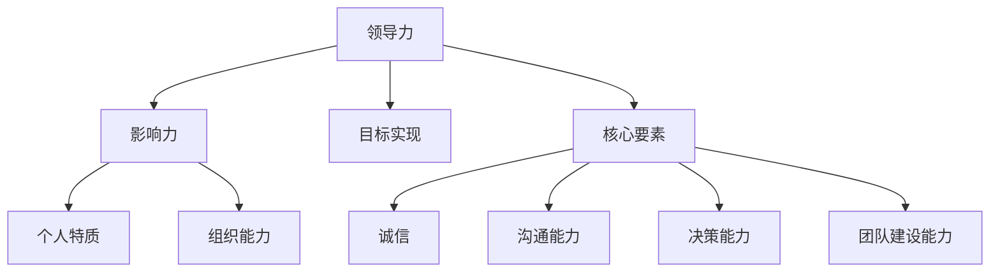
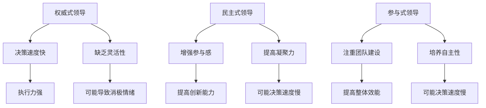
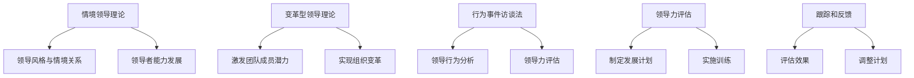
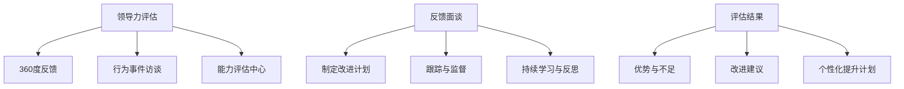
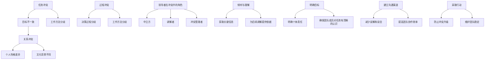
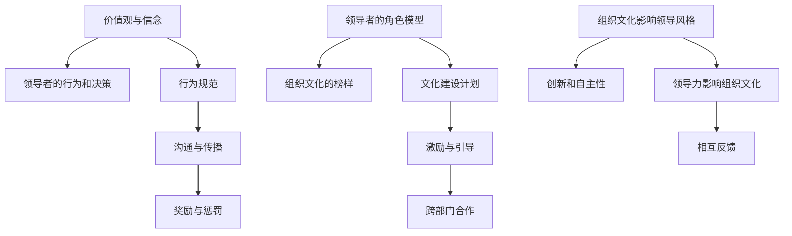
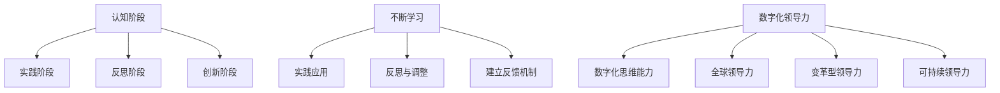

                 

### 文章标题

# 《领导力训练：让你的团队如虎添翼》

### 文章关键词

- 领导力
- 团队效能
- 领导风格
- 领导力训练
- 领导力评估
- 组织文化

### 文章摘要

本文旨在深入探讨领导力训练对于团队效能提升的重要性。通过分析领导力的核心概念、领导风格对团队的影响、领导力训练的方法与实践、领导力评估与反馈机制、团队冲突管理、组织文化塑造以及领导力发展的持续旅程，本文为读者提供了一套完整的领导力训练指南。文章以实际案例为依据，结合数学模型和算法原理，为领导者提供了实用的工具和方法，以帮助他们在实际工作中提升领导力，从而让团队如虎添翼，实现组织目标的最大化。

## 第1章 领导力的核心概念与基础

### 背景介绍

领导力，作为一种重要的组织能力，一直是学术界和实务界关注的焦点。它不仅关乎个体的成功，更关乎整个团队的效能和组织的目标实现。在现代企业中，领导力被视为一种核心竞争力，它能够激发团队成员的潜力，提升团队协作效率，促进创新和变革。因此，领导力的培养和提升变得尤为重要。

#### 核心概念

领导力是指通过影响和激励他人，实现共同目标的能力。它不仅仅包括对下属的管理和指导，更重要的是能够激发团队成员的内在动力，使他们在实现组织目标的过程中发挥最大的潜力。

#### 领导力的重要性

领导力的重要性体现在以下几个方面：

1. **提升团队效能**：有效的领导能够激发团队成员的积极性，提高团队的协作效率，从而实现更高的目标。
2. **推动创新和变革**：领导者的愿景和创新能力能够推动组织的持续发展和进步。
3. **增强组织凝聚力**：领导力能够增强团队成员之间的信任和合作，提升组织的凝聚力。
4. **实现个人成长**：领导力的提升不仅能够帮助团队成员实现职业发展，更能够促进个人的成长和自我实现。

### 领导力的发展历程

领导力的发展历程可以分为几个阶段，从传统的权威领导到现代的参与式领导，再到未来的智能领导。

1. **传统领导**：以权威和命令为主，领导者通过强制手段管理团队。
2. **现代领导**：强调沟通和激励，领导者与团队成员建立互信关系，共同实现目标。
3. **智能领导**：利用大数据和人工智能等先进技术，实现个性化管理和决策。

#### 领导力的核心要素

领导力的核心要素包括诚信、沟通能力、决策能力、团队建设能力等。

1. **诚信**：诚信是领导者最基本的素质，它能够赢得团队成员的信任和尊重。
2. **沟通能力**：有效的沟通是领导者必备的技能，它能够确保信息的准确传递和理解。
3. **决策能力**：领导者需要具备快速做出明智决策的能力，以应对复杂多变的环境。
4. **团队建设能力**：领导者需要能够激发团队成员的潜力，建立高效的团队。

### 核心概念与联系

为了更好地理解领导力的核心概念和其之间的关系，我们可以使用Mermaid流程图来展示它们之间的联系：

通过这个流程图，我们可以清晰地看到领导力的核心概念和要素之间的关系，以及它们如何共同作用，实现组织的成功。

## 第2章 领导风格与团队效能

### 背景介绍

领导风格是指领导者行使权力、做出决策、管理团队的方式。不同的领导风格会对团队效能产生不同的影响。了解和掌握不同领导风格的特点及其适用场景，对于提升团队效能具有重要意义。

### 领导风格的类型与特点

1. **权威式领导**：领导者拥有绝对的权力和决策权，团队成员主要执行领导者的指令。
    - **特点**：决策速度快，执行力强，但可能缺乏灵活性，容易导致团队成员的消极情绪。
    - **适用场景**：在紧急情况下或需要迅速采取行动时，权威式领导可以有效提高团队效能。

2. **民主式领导**：领导者鼓励团队成员参与决策，重视团队成员的意见和建议。
    - **特点**：增强团队成员的参与感和责任感，提高团队的凝聚力和创新能力。
    - **适用场景**：在需要集体智慧和长时间决策时，民主式领导可以提升团队效能。

3. **参与式领导**：领导者与团队成员共同参与决策，建立互信和合作关系。
    - **特点**：注重团队建设，培养团队成员的自主性和创造力，提高团队的整体效能。
    - **适用场景**：在需要长期合作和持续创新的项目中，参与式领导可以发挥最大的作用。

### 领导风格对团队效能的影响

不同的领导风格会对团队效能产生不同的影响。权威式领导在紧急情况下可以提高决策速度和执行力，但在长期项目中可能缺乏灵活性和创新性。民主式领导和参与式领导则更加注重团队成员的参与感和责任感，能够提高团队的凝聚力和创新能力，但在决策速度上可能稍慢。

### 如何选择适合的领导风格

选择适合的领导风格需要考虑以下几个因素：

1. **项目特点**：根据项目的复杂程度、紧急程度和目标，选择合适的领导风格。
2. **团队状况**：了解团队成员的能力、经验和价值观，选择能够激发团队成员潜力的领导风格。
3. **领导者个人特点**：领导者需要根据自己的个性、经验和能力，选择最适合自己的领导风格。

### 核心概念与联系

为了更好地理解领导风格对团队效能的影响，我们可以使用Mermaid流程图来展示它们之间的联系：

通过这个流程图，我们可以清晰地看到不同领导风格的特点和对团队效能的影响，以及如何根据具体情况选择适合的领导风格。

## 第3章 领导力训练方法与实践

### 背景介绍

领导力训练是提升领导者能力的重要途径，通过系统的培训和实践，领导者可以掌握有效的领导方法和技巧，提升自身的领导力。本章将介绍领导力训练的理论基础、具体步骤和方法，并通过实际案例来说明领导力训练的应用。

### 领导力训练的理论基础

领导力训练的理论基础包括心理学、管理学和行为科学等多个领域。以下是一些关键的领导力训练理论：

1. **情境领导理论**：由赫塞和布兰查德提出，认为领导力取决于领导者与团队成员之间的情境关系。领导者需要根据不同情境选择不同的领导风格。
    - **核心概念**：领导者需要根据团队成员的能力和动机来选择合适的领导风格。

2. **变革型领导理论**：由伯恩斯提出，认为领导者通过激励和启发团队成员实现变革。变革型领导者具有愿景、激励和道德领导力等特点。
    - **核心概念**：领导者需要具备激发团队成员潜力和实现组织变革的能力。

3. **行为事件访谈法**：由斯皮兰和哈蒙德提出，用于评估领导者的行为和表现。通过分析领导者在特定情境下的行为事件，可以评估其领导力水平。
    - **核心概念**：通过行为事件访谈，可以深入了解领导者的领导风格和行为习惯。

### 领导力训练的步骤与方法

领导力训练通常包括以下步骤：

1. **评估现有领导力水平**：通过行为事件访谈、360度反馈等方法，评估领导者的现有领导力水平。
    - **核心算法原理**：使用行为事件访谈法，分析领导者在不同情境下的行为事件，确定其领导风格和能力。
    - **数学模型**：使用统计方法，如因子分析，确定领导力的关键维度。

2. **制定领导力发展计划**：根据评估结果，制定个性化的领导力发展计划，包括培训课程、实践项目和导师指导等。
    - **核心概念**：制定计划时需要考虑领导者的个人需求、团队需求和组织目标。

3. **实施领导力训练**：通过参加培训课程、参与实践项目和接受导师指导，提升领导者的领导力。
    - **核心算法原理**：使用案例研究法和角色扮演法，帮助领导者理解不同情境下的领导策略。

4. **跟踪和反馈**：通过定期跟踪和反馈，评估领导力训练的效果，并根据反馈进行调整。
    - **核心概念**：通过跟踪和反馈，可以确保领导力训练的有效性和持续性。

### 领导力训练的实践案例

以下是一个领导力训练的实践案例：

**案例背景**：某科技公司高管参加了一场为期两周的领导力训练课程，内容包括领导力理论、情境领导、变革型领导和行为事件访谈等。

**核心算法原理**：通过角色扮演法和案例研究法，高管们学习了如何在不同情境下应用不同的领导风格，以及如何通过行为事件访谈法评估自身的领导力水平。

**数学模型**：使用因子分析，确定领导力的关键维度，如诚信、沟通能力和决策能力。

**案例结果**：高管们在培训结束后，通过实践项目和导师指导，逐步提升了自身的领导力。在随后的领导力评估中，高管们的领导力水平有了显著提升，团队的协作效率和创新能力也得到提高。

### 核心概念与联系

为了更好地理解领导力训练的理论基础和步骤，我们可以使用Mermaid流程图来展示它们之间的联系：

通过这个流程图，我们可以清晰地看到领导力训练的理论基础、步骤和方法，以及它们之间的联系。

## 第4章 领导力评估与反馈

### 背景介绍

领导力评估是领导力发展的重要环节，它不仅可以帮助领导者了解自身的领导能力，还能为领导力提升提供依据。本章将介绍领导力评估的方法与工具，以及如何利用评估结果进行反馈与改进。

### 领导力评估的重要性

领导力评估的重要性体现在以下几个方面：

1. **了解自身优势与不足**：通过领导力评估，领导者可以清晰地了解自己的优势与不足，从而有针对性地进行改进。
2. **提升领导能力**：领导力评估能够帮助领导者发现自身在领导能力上的短板，通过针对性的培训和实践提升领导水平。
3. **促进组织发展**：领导力评估有助于组织识别领导力发展需求，制定相应的培训和发展计划，从而促进组织整体绩效的提升。

### 领导力评估的方法与工具

常见的领导力评估方法与工具有以下几种：

1. **360度反馈**：360度反馈是一种通过收集团队成员、上级、下属和同事的意见，全面评估领导者能力的方法。
    - **核心概念**：360度反馈提供了一个多维度的视角，帮助领导者了解自己在不同方面的表现。
    - **适用场景**：适用于中高层管理者的领导力评估。

2. **行为事件访谈（BEI）**：行为事件访谈是一种通过深入访谈，了解领导者在过去工作中的具体行为和事件，评估其领导能力的评估方法。
    - **核心概念**：BEI侧重于领导者在实际工作情境中的表现，能够提供具体的领导行为分析。
    - **适用场景**：适用于需要详细了解领导者工作表现的情况。

3. **能力评估中心**：能力评估中心是一种通过模拟实际工作情境，评估领导者在具体任务中的表现的方法。
    - **核心概念**：能力评估中心能够提供实际的领导情境，帮助领导者体验和应用所学知识。
    - **适用场景**：适用于新任领导者或需要提升特定技能的领导者。

### 如何利用评估结果进行反馈与改进

利用评估结果进行反馈与改进是领导力提升的关键环节。以下是一些建议：

1. **反馈面谈**：与评估者进行一对一的反馈面谈，详细讨论评估结果，了解自己的优势和不足。
    - **核心算法原理**：通过反馈面谈，领导者可以获取具体的改进建议，制定个性化的提升计划。

2. **制定改进计划**：根据评估结果，制定具体的改进计划，包括参加培训课程、实践项目和导师指导等。
    - **核心概念**：制定计划时，需要考虑领导者的个人需求、团队需求和组织目标。

3. **跟踪与监督**：定期跟踪和监督改进计划的实施情况，确保领导力的提升。
    - **核心算法原理**：通过跟踪与监督，领导者可以及时发现问题并进行调整。

4. **持续学习与反思**：领导力提升是一个持续的过程，领导者需要不断学习新知识、反思自身行为，持续提升领导能力。
    - **核心概念**：持续学习与反思是领导力提升的内在动力。

### 核心概念与联系

为了更好地理解领导力评估与反馈的过程，我们可以使用Mermaid流程图来展示它们之间的联系：

通过这个流程图，我们可以清晰地看到领导力评估与反馈的过程，以及它们如何相互联系和作用。

## 第5章 领导者在团队冲突中的角色

### 背景介绍

团队冲突在组织中是常见现象，有效的冲突管理对团队协作和效能至关重要。领导者作为团队的领袖，在处理冲突中扮演着关键角色。本章将探讨团队冲突的类型与原因，以及领导者在冲突中的应对策略。

### 团队冲突的类型与原因

1. **任务冲突**：由于团队成员在任务目标、工作方法或职责分工上存在分歧，导致工作进展受阻。
    - **原因**：任务分配不明确、工作流程不畅、目标不一致等。

2. **关系冲突**：团队成员之间的个人关系紧张，导致沟通不畅和工作不配合。
    - **原因**：个人性格差异、文化背景不同、人际关系复杂等。

3. **过程冲突**：团队成员在执行任务过程中因工作方法、决策过程等问题产生分歧。
    - **原因**：决策机制不完善、沟通渠道不畅通、资源分配不公等。

### 领导者在冲突中的角色

领导者是团队冲突的调解者和协调者，其主要角色包括：

1. **中立方**：在冲突中保持中立，不偏袒任何一方，确保公正。
2. **调解者**：通过沟通和协商，帮助冲突双方找到共同点，达成和解。
3. **冲突管理者**：识别冲突类型，制定合适的解决方案，确保团队稳定。

### 如何管理团队冲突

以下是一些有效的团队冲突管理策略：

1. **倾听与理解**：主动倾听冲突双方的诉求，了解冲突的根源和背后的原因。
    - **核心算法原理**：通过倾听，领导者可以获取关键信息，为后续调解提供依据。

2. **明确目标**：明确团队目标和个体责任，确保团队成员对任务有清晰的认识。
    - **核心概念**：明确目标是解决任务冲突的基础，有助于团队成员协同工作。

3. **建立沟通渠道**：确保团队成员之间有畅通的沟通渠道，避免误解和误会的发生。
    - **核心算法原理**：建立有效的沟通机制，可以减少关系冲突，提高团队协作效率。

4. **采取行动**：针对不同类型的冲突，采取合适的解决措施，确保冲突得到妥善处理。
    - **核心概念**：及时采取行动，防止冲突升级，维护团队稳定。

### 核心概念与联系

为了更好地理解团队冲突的类型与领导者的角色，我们可以使用Mermaid流程图来展示它们之间的联系：

通过这个流程图，我们可以清晰地看到团队冲突的类型、领导者的角色以及如何管理团队冲突，以及它们之间的相互联系。

## 第6章 领导力与组织文化

### 背景介绍

组织文化是组织的灵魂，它影响着组织成员的行为和价值观，进而影响组织的整体绩效。领导力与组织文化之间存在密切的互动关系。领导者的行为和决策不仅塑造组织文化，同时组织文化也会反过来影响领导者的领导风格和行为。本章将探讨领导力如何塑造与改变组织文化，以及组织文化与领导力的相互影响。

### 领导力塑造组织文化的原理

1. **价值观与信念**：领导者的价值观和信念是组织文化的核心。领导者的行为和决策反映了他们的价值观和信念，这些价值观和信念会逐渐渗透到组织的方方面面。

2. **行为规范**：领导者的行为规范是组织文化的重要体现。领导者的行为会影响团队成员的行为，如果领导者表现出诚信、公正和透明的行为，这些行为规范会逐渐成为组织的文化特征。

3. **沟通与传播**：领导者的沟通方式和传播方式会直接影响组织文化的传播和深化。领导者通过会议、培训、邮件等方式传递组织文化，使其深入人心。

4. **奖励与惩罚**：领导者的奖励与惩罚机制会影响团队成员的行为，进而影响组织文化。如果领导者奖励那些符合组织文化价值观的行为，同时惩罚那些违背组织文化价值观的行为，组织文化就会得到巩固和加强。

### 领导力改变组织文化的方法

1. **领导者的角色模型**：领导者需要以身作则，通过自身的行动来展示和传播组织文化。领导者应该成为组织文化的榜样，让团队成员看到组织文化的价值和意义。

2. **文化建设计划**：领导者可以制定系统性的文化建设计划，包括明确的组织文化目标、具体的实施策略和评估机制。通过这样的计划，可以系统地改变和塑造组织文化。

3. **激励与引导**：领导者需要通过激励和引导来推动组织文化的变革。激励可以通过奖励制度来实现，引导则需要通过沟通和培训来实现。

4. **跨部门合作**：领导力塑造组织文化需要跨部门的合作。领导者应该鼓励不同部门之间的沟通和合作，通过跨部门的项目来促进组织文化的融合。

### 组织文化与领导力的相互影响

1. **组织文化影响领导风格**：组织文化会影响领导者的行为和决策。例如，在一个强调创新和自主性的组织中，领导者的风格可能更加偏向于放权和鼓励创新。

2. **领导力影响组织文化**：领导力可以塑造和改变组织文化。例如，一个领导者可以通过推行变革型领导来促进组织文化的创新和变革。

3. **相互反馈**：组织文化和领导力之间存在相互反馈的关系。领导者的行为和决策会影响组织文化，同时组织文化也会影响领导者的行为和决策。

### 核心概念与联系

为了更好地理解领导力与组织文化之间的关系，我们可以使用Mermaid流程图来展示它们之间的联系：

通过这个流程图，我们可以清晰地看到领导力如何塑造和改变组织文化，以及组织文化如何影响领导力，以及它们之间的相互关系。

## 第7章 领导力发展的持续旅程

### 背景介绍

领导力发展是一个持续的过程，它不仅需要领导者在特定情境下的表现，更需要长期的培养和自我提升。本章将探讨领导力发展的阶段性、持续提升领导力的方法和领导力发展的未来趋势。

### 领导力发展的阶段性

领导力发展可以分为以下几个阶段：

1. **认知阶段**：领导者开始意识到领导力的重要性，并开始学习相关的理论和知识。
2. **实践阶段**：领导者将学到的知识和理论应用于实际工作中，通过实践来提升自己的领导能力。
3. **反思阶段**：领导者通过反思自己的行为和决策，不断调整和改进，形成自己的领导风格。
4. **创新阶段**：领导者通过不断学习和尝试新的方法，推动领导力的发展和组织的变革。

### 持续提升领导力的方法

1. **不断学习**：领导者需要不断学习新的知识和技能，通过阅读书籍、参加培训、交流经验等方式来提升自己的专业素养。
2. **实践应用**：将学到的知识和技能应用到实际工作中，通过实践来验证和提升自己的领导能力。
3. **反思与调整**：定期反思自己的行为和决策，找出不足并进行调整，形成有效的领导风格。
4. **建立反馈机制**：通过建立反馈机制，如360度反馈、同事和下属的建议等，及时了解自己的表现，进行改进。

### 领导力发展的未来趋势

1. **数字化领导力**：随着数字化技术的发展，领导者需要具备数字化思维能力，能够利用数字化工具和平台来提升团队效率和创新能力。
2. **全球领导力**：全球化趋势要求领导者具备跨文化沟通和协作能力，能够带领多元文化背景的团队实现共同目标。
3. **变革型领导力**：面对快速变化的环境，领导者需要具备变革型领导力，能够推动组织变革和创新。
4. **可持续领导力**：领导者需要关注组织的可持续发展，包括环境、社会和经济的平衡，推动组织的可持续发展。

### 核心概念与联系

为了更好地理解领导力发展的阶段性、持续提升领导力的方法和未来趋势，我们可以使用Mermaid流程图来展示它们之间的联系：

通过这个流程图，我们可以清晰地看到领导力发展的阶段性、持续提升领导力的方法和未来趋势，以及它们之间的相互联系。

## 总结与展望

### 总结

本文系统地探讨了领导力训练的重要性，包括领导力的核心概念、领导风格与团队效能、领导力训练的方法与实践、领导力评估与反馈、团队冲突管理、组织文化塑造以及领导力发展的持续旅程。通过详细的分析和案例实践，我们了解了如何通过有效的领导力训练提升团队效能和组织绩效。

### 展望

未来，领导力的发展将更加注重数字化、全球化和变革型领导力的培养。领导者需要不断提升自身的数字素养、跨文化沟通能力和变革型领导力，以应对快速变化的环境和挑战。同时，领导力的发展也将更加注重可持续性，关注组织的长期发展和社会责任。

我们鼓励读者在实践过程中，不断反思和调整自己的领导风格，持续提升领导力。通过本文的学习，希望能够为读者提供一套实用的领导力训练指南，帮助他们在实际工作中更好地发挥领导力，实现组织目标的最大化。

## 作者信息

作者：AI天才研究院/AI Genius Institute & 禅与计算机程序设计艺术 /Zen And The Art of Computer Programming

AI天才研究院致力于推动人工智能领域的研究与应用，研究院的专家们以深入的技术洞察和创新的思维，为读者提供了丰富、实用的高质量内容。同时，作者出版的《禅与计算机程序设计艺术》深受读者喜爱，该书以深刻的哲理和独特的视角，探讨了计算机程序设计的艺术和科学。希望通过本文，能够为读者在领导力提升方面带来新的启示和帮助。

