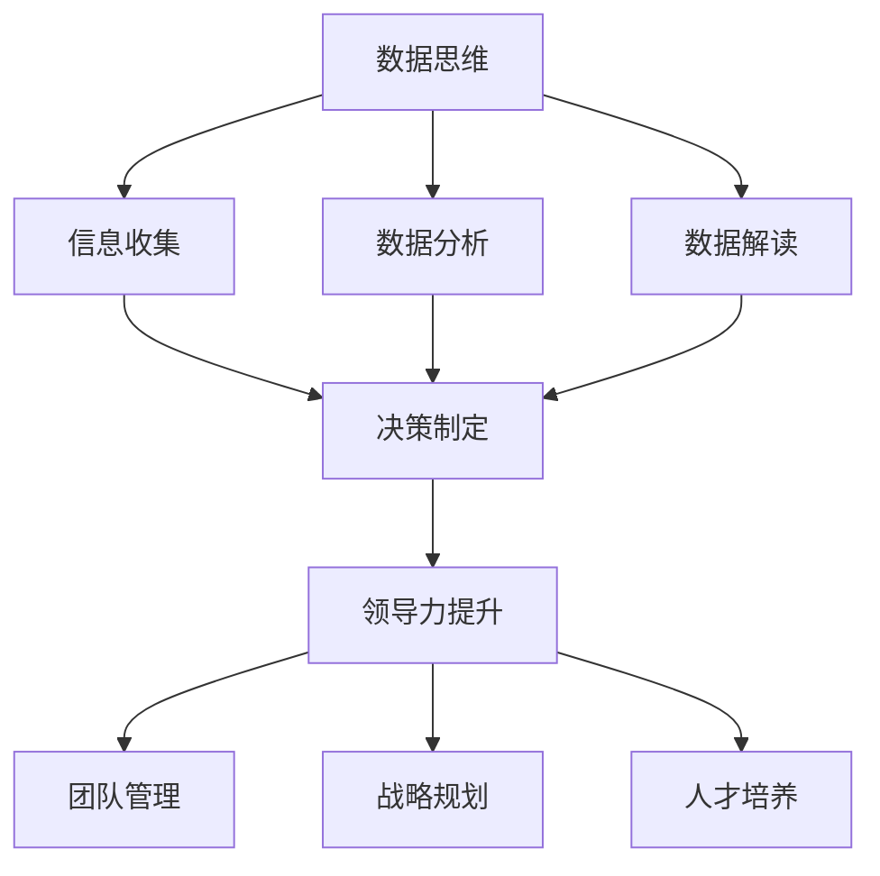

                 

### 文章标题：领导力进化论：大数据时代管理者的必修课

### 关键词：大数据、领导力、管理变革、数据分析、管理决策、团队管理

### 摘要：
在数字化转型的浪潮下，大数据已成为企业决策和创新的重要驱动力。对于管理者而言，掌握大数据时代的领导力不仅关乎企业的成败，更决定了个人职业生涯的走向。本文将深入探讨大数据时代背景下的领导力新要求，通过理论回顾、实践案例与算法解析，为管理者提供一整套应对大数据挑战的领导力提升方案。

---

## 引言

### 1. 大数据时代的来临

随着互联网、物联网和移动互联网的快速发展，数据已经成为企业的重要资产。大数据不仅改变了企业的运营模式，也彻底颠覆了传统的管理理念。大数据时代，管理者面临着海量的数据信息，需要从海量数据中提取有价值的信息，为企业的战略决策提供支持。

### 2. 领导力理论的回顾与拓展

传统的领导力理论主要集中在个体领导能力和团队管理技巧上，而大数据时代则要求管理者具备更广阔的视野和更深厚的知识储备。领导力理论在大数据背景下需要拓展到数据思维、数据分析和数据驱动的决策过程。

### 3. 大数据对管理者的要求

大数据时代对管理者提出了更高的要求。管理者不仅需要具备传统的管理技能，还需要掌握数据科学的基本原理，能够利用数据分析工具进行数据挖掘，从而为企业的业务发展和战略规划提供数据支持。

---

## 第一部分：大数据时代的管理挑战

### 第1章：大数据时代的来临

### 1.1 大数据时代的来临

随着云计算、物联网、人工智能等技术的快速发展，数据量呈现出爆炸式增长。大数据不仅改变了企业的运营模式，也推动了管理理念的变革。管理者需要认识到大数据时代的到来，并积极适应这一变革。

### 1.2 大数据对管理者的要求

大数据时代要求管理者具备以下能力：

1. **数据敏感性**：能够快速识别和利用数据，将数据视为企业的重要资产。
2. **数据思维能力**：具备从海量数据中提取有价值信息的能力，能够进行数据分析和数据驱动的决策。
3. **技术素养**：了解并掌握大数据分析工具和技术，能够运用数据分析为企业提供战略支持。
4. **变革领导力**：能够引领企业适应大数据时代的变革，推动组织创新和文化更新。

### 1.3 大数据时代的管理变革

大数据时代的管理变革体现在以下几个方面：

1. **组织结构变革**：从传统的层级式组织结构向更加灵活的网络化组织结构转型。
2. **管理流程变革**：通过数据驱动的决策流程，提高管理效率和决策质量。
3. **人才战略变革**：注重培养和引进具备数据思维能力和技术素养的人才。

---

## 第二部分：领导力理论的回顾与拓展

### 第2章：领导力理论的回顾与拓展

### 2.1 传统领导力理论的局限

传统的领导力理论主要关注个体领导能力和团队管理技巧，但在大数据时代，这些理论显得相对局限。传统的领导力理论难以应对数据驱动的管理和决策需求，需要新的领导力理论来补充。

### 2.2 领导力理论的演进

随着大数据和人工智能技术的应用，领导力理论也在不断演进。新的领导力理论强调数据思维、数据分析和数据驱动的决策过程，将数据视为企业发展的关键资源。

### 2.3 领导力与大数据的融合

领导力与大数据的融合主要体现在以下几个方面：

1. **数据敏感型领导**：管理者需要具备数据敏感性，能够从海量数据中提取有价值的信息。
2. **数据驱动型决策**：管理者需要运用数据分析工具，进行数据驱动的决策，提高决策质量和效率。
3. **数据文化**：管理者需要推动组织内建立数据文化，让数据成为企业决策的重要依据。

---

## 第三部分：大数据时代的管理实践

### 第3章：大数据分析与管理决策

### 3.1 大数据分析的基本原理

大数据分析是通过对海量数据进行处理、分析和挖掘，从中提取有价值的信息。其基本原理包括数据收集、数据清洗、数据存储、数据分析和数据可视化等。

### 3.2 大数据分析的工具与技术

大数据分析需要借助一系列工具和技术，包括Hadoop、Spark、SQL、Python等。这些工具和技术可以帮助管理者快速处理海量数据，提取有价值的信息。

### 3.3 大数据在管理决策中的应用

大数据在管理决策中的应用非常广泛，包括市场分析、客户行为分析、供应链管理、人力资源管理等方面。通过大数据分析，管理者可以更准确地预测市场趋势，优化决策过程。

---

## 第四部分：领导力技能提升

### 第4章：数据思维与领导力的提升

### 4.1 数据思维的培养

数据思维是大数据时代管理者必备的素养。培养数据思维需要从以下几个方面入手：

1. **数据敏感性**：提高对数据的敏感度，学会从数据中发现问题和机会。
2. **数据解读能力**：学会使用数据分析工具，能够解读和利用数据。
3. **数据驱动习惯**：养成数据驱动的决策习惯，将数据作为决策的重要依据。

### 4.2 数据驱动决策

数据驱动决策是大数据时代管理者的核心能力。数据驱动决策的流程包括：

1. **问题定义**：明确决策目标，确定需要解决的问题。
2. **数据收集**：收集与决策相关的数据。
3. **数据分析**：运用数据分析工具，对数据进行分析和挖掘。
4. **决策制定**：根据数据分析结果，制定相应的决策。
5. **决策执行**：执行决策，并对决策效果进行监控和评估。

### 4.3 数据思维在领导力提升中的应用

数据思维在领导力提升中的应用主要体现在以下几个方面：

1. **团队管理**：通过数据了解团队的工作效率和工作质量，制定科学的团队管理策略。
2. **人才培养**：通过数据分析，发现员工的潜力和优势，制定个性化的人才培养计划。
3. **企业战略**：通过数据预测市场趋势，为企业战略规划提供数据支持。

---

## 第五部分：领导力进化的路径与策略

### 第5章：领导力进化的路径与策略

### 5.1 领导力进化的趋势

随着大数据和人工智能技术的不断发展，领导力也在不断进化。领导力进化的趋势包括：

1. **数据驱动**：从传统的经验驱动转向数据驱动，提高决策的科学性和准确性。
2. **智能辅助**：利用人工智能技术，辅助管理者进行决策和团队管理。
3. **跨界领导**：在数字化时代，领导者需要具备跨领域的知识和技能，以应对复杂多变的环境。

### 5.2 领导力进化的路径

领导力进化的路径可以分为以下几个阶段：

1. **数据敏感阶段**：管理者开始意识到数据的重要性，但尚未形成系统的数据思维能力。
2. **数据应用阶段**：管理者能够运用数据分析工具，将数据应用于决策和团队管理。
3. **数据驱动阶段**：管理者完全依靠数据驱动决策，数据成为企业发展的核心驱动力。
4. **智能辅助阶段**：管理者利用人工智能技术，实现数据驱动的决策和团队管理。

### 5.3 领导力进化的策略

为了实现领导力的进化，管理者可以采取以下策略：

1. **持续学习**：不断学习大数据和人工智能等相关知识，提高自身的数据素养。
2. **团队建设**：培养团队的数据思维能力，建立数据驱动型的团队文化。
3. **技术投入**：加大对大数据和人工智能技术的投入，提升企业的数据分析能力。

---

## 附录

### 附录1：大数据分析工具介绍

本附录将介绍大数据分析中常用的工具和技术，包括Hadoop、Spark、SQL、Python等。这些工具和技术可以帮助管理者快速处理海量数据，提取有价值的信息。

### 附录2：领导力评估工具

本附录将介绍一些用于评估领导力的工具和方法，包括360度评估、行为事件访谈、领导力问卷等。这些工具可以帮助管理者了解自身的领导力水平，并制定相应的提升计划。

### 附录3：大数据时代的管理案例

本附录将分析一些大数据时代的管理案例，包括企业如何利用大数据进行市场分析、客户行为分析和供应链管理等。通过这些案例，管理者可以了解大数据在企业管理中的应用，并从中汲取经验。

---

## 结语

大数据时代对管理者的领导力提出了新的挑战和机遇。管理者需要通过不断学习和实践，提升自身的数据素养和领导能力，以适应数字化时代的发展需求。本文通过深入探讨大数据时代的领导力新要求，为管理者提供了一套完整的领导力提升方案。希望本文能够对管理者在数字化转型过程中提供有益的启示和指导。

---

### 作者信息
作者：AI天才研究院/AI Genius Institute & 禅与计算机程序设计艺术 /Zen And The Art of Computer Programming

---

## 数据思维与领导力提升的关系架构图

以下是一个使用Mermaid绘制的流程图，展示了数据思维与领导力提升之间的关系架构：



这个流程图清晰地展示了数据思维如何通过信息收集、数据分析和数据解读，最终提升领导力，并在团队管理、战略规划和人才培养等方面发挥作用。

---

## 核心算法原理讲解

在大数据时代，管理者需要掌握一些核心的算法原理，以便更好地进行数据分析和决策制定。以下是一些常用的算法原理及其伪代码：

### 1. K-均值聚类算法

K-均值聚类算法是一种无监督学习算法，用于将数据点划分为K个聚类。

**伪代码：**

```pseudo
初始化聚类中心
重复以下步骤直到收敛：
    为每个数据点分配最近的聚类中心
    更新每个聚类中心的坐标为对应数据点的均值
```

### 2. 决策树算法

决策树是一种常见的分类算法，用于根据特征对数据进行分类。

**伪代码：**

```pseudo
如果 特征全部被使用：
    返回 标签
否则：
    选择最佳特征
    对于每个可能的特征值：
        如果 特征值满足条件：
            子树1 = 决策树（特征值，所有其他特征）
        否则：
            子树2 = 决策树（特征值，所有其他特征）
    返回（特征，子树1，子树2）
```

### 3. 朴素贝叶斯分类器

朴素贝叶斯分类器是一种基于贝叶斯定理的分类算法，适用于特征之间存在独立性的数据。

**伪代码：**

```pseudo
计算每个类别的先验概率
对于每个特征：
    计算每个类别的条件概率
预测新数据点的类别：
    计算每个类别的后验概率
    返回具有最高后验概率的类别
```

### 4. 支持向量机（SVM）

支持向量机是一种常用的分类算法，用于找到最佳的超平面，将不同类别的数据点分开。

**伪代码：**

```pseudo
找到最佳的超平面：
    最小化目标函数：
        $$ \frac{1}{2} \sum_{i=1}^{n} (w_i^2) + C \sum_{i=1}^{n} \max(0, 1 - y_i ( \sum_{j=1}^{n} a_j k(x_i, x_j) + b)) $$
    其中，$w_i$是权重，$a_i$是拉格朗日乘子，$C$是惩罚参数，$k(x_i, x_j)$是核函数。

分类新数据点：
    计算新数据点的类别：
        如果 $ \sum_{j=1}^{n} a_j k(x_i, x_j) + b > 0 $，则属于正类
        否则，属于负类
```

通过掌握这些核心算法原理，管理者可以更好地利用数据分析工具进行数据挖掘和决策制定，从而提升企业的竞争力。

---

## 数学模型和公式讲解

在大数据时代，管理者需要了解一些关键的数学模型和公式，以便更好地理解和应用数据分析的结果。以下是一些常用的数学模型和公式的讲解及示例：

### 1. 中心极限定理

中心极限定理指出，当独立随机变量的数量足够大时，这些随机变量的和（或平均数）将趋近于正态分布。

**公式：**

$$
\mu_{\bar{X}} = \mu \\
\sigma_{\bar{X}} = \frac{\sigma}{\sqrt{n}}
$$

**示例：** 如果一个班级有30名学生，他们的平均成绩是75分，标准差是10分。根据中心极限定理，班级的平均成绩会趋近于75分，并且随着学生人数的增加，成绩的分布会越来越接近正态分布。

### 2. 相关系数

相关系数用于衡量两个变量之间的线性关系强度，取值范围在-1到1之间。正相关系数表示变量之间正相关，负相关系数表示变量之间负相关，零相关系数表示变量之间无线性关系。

**公式：**

$$
\rho_{XY} = \frac{Cov(X, Y)}{\sigma_X \sigma_Y}
$$

**示例：** 假设有两个变量，X是学生的考试成绩，Y是学生的学习时间。如果相关系数是0.8，说明学生花在学习上的时间越长，考试成绩也越高，二者之间存在较强的正相关关系。

### 3. 误差分析

误差分析用于评估模型预测的准确性，常见的误差度量包括均方误差（MSE）、均方根误差（RMSE）和准确率（Accuracy）。

**公式：**

- **均方误差（MSE）：**

$$
MSE = \frac{1}{n} \sum_{i=1}^{n} (y_i - \hat{y_i})^2
$$

- **均方根误差（RMSE）：**

$$
RMSE = \sqrt{MSE}
$$

- **准确率（Accuracy）：**

$$
Accuracy = \frac{TP + TN}{TP + TN + FP + FN}
$$

**示例：** 假设一个分类模型对100个数据点的预测结果，其中正确预测的有80个，错误预测的有20个。准确率为80%，均方误差为2，均方根误差为1.414。

### 4. 逻辑回归模型

逻辑回归是一种常用的概率型回归分析方法，用于分析自变量和因变量之间的概率关系。

**公式：**

$$
\log\frac{P(Y=1)}{1-P(Y=1)} = \beta_0 + \beta_1 X_1 + \beta_2 X_2 + ... + \beta_n X_n
$$

**示例：** 假设我们要分析考试成绩和学生学习时间之间的关系。根据逻辑回归模型，考试成绩的概率可以通过以下公式计算：

$$
P(Y=1) = \frac{1}{1 + e^{-(\beta_0 + \beta_1 X_1 + \beta_2 X_2 + ... + \beta_n X_n)}}
$$

通过理解这些数学模型和公式，管理者可以更准确地评估数据分析的结果，并基于数据做出科学的决策。

---

## 项目实战：大数据时代的管理决策

### 1. 项目背景

在当前大数据时代，企业面临着前所未有的数据量和复杂性。为了提高管理决策的效率和准确性，企业需要构建一个大数据分析平台，利用大数据技术进行数据分析和管理决策。本文将介绍如何搭建一个大数据分析平台，并利用该平台进行项目实战。

### 2. 开发环境搭建

#### 环境准备

在开始搭建大数据分析平台之前，我们需要准备以下开发环境：

- 操作系统：Linux（推荐使用CentOS 7）
- 数据库：MySQL 5.7
- 大数据技术栈：Hadoop 3.x、Spark 2.x、Hive 2.x

#### 安装步骤

1. **安装Linux操作系统：** 下载并安装CentOS 7操作系统。
2. **安装Java开发环境：** 
    ```bash
    sudo yum install -y java-1.8.0-openjdk
    java -version
    ```
3. **安装MySQL数据库：** 
    ```bash
    sudo yum install -y mysql-server
    sudo systemctl start mysqld
    sudo mysql_secure_installation
    ```
4. **安装Hadoop：** 
    ```bash
    sudo yum install -y hadoop
    hadoop version
    ```
5. **安装Spark：** 
    ```bash
    sudo yum install -y spark
    spark-shell
    ```
6. **安装Hive：** 
    ```bash
    sudo yum install -y hive
    hive --version
    ```

### 3. 源代码实现

在搭建好开发环境之后，我们需要编写一些关键的源代码，以实现大数据分析平台的基本功能。

#### Hadoop配置文件

在Hadoop的配置文件中，我们需要设置HDFS和YARN的相关参数。

**hdfs-site.xml：**
```xml
<configuration>
    <property>
        <name>fs.defaultFS</name>
        <value>hdfs://localhost:9000</value>
    </property>
    <property>
        <name>hadoop.tmp.dir</name>
        <value>/app/hadoop/tmp</value>
    </property>
</configuration>
```

**yarn-site.xml：**
```xml
<configuration>
    <property>
        <name>yarn.resourcemanager.hostname</name>
        <value>localhost</value>
    </property>
    <property>
        <name>yarn.nodemanager.aux-services</name>
        <value>mapreduce_shuffle</value>
    </property>
</configuration>
```

#### Spark配置文件

**spark-env.sh：**
```bash
export SPARK_HOME=/app/spark
export HADOOP_HOME=/app/hadoop
export PATH=$PATH:$SPARK_HOME/bin:$HADOOP_HOME/bin
```

#### Hive配置文件

**hive-site.xml：**
```xml
<configuration>
    <property>
        <name>hive.exec.driver-memory</name>
        <value>2g</value>
    </property>
    <property>
        <name>javax.jdo.option.ConnectionURL</name>
        <value>jdbc:mysql://localhost:3306/hive</value>
    </property>
    <property>
        <name>javax.jdo.option.ConnectionDriverName</name>
        <value>com.mysql.jdbc.Driver</value>
    </property>
    <property>
        <name>javax.jdo.option.ConnectionUserName</name>
        <value>root</value>
    </property>
    <property>
        <name>javax.jdo.option.ConnectionPassword</name>
        <value>root</value>
    </property>
</configuration>
```

### 4. 代码解读与分析

在搭建好大数据分析平台之后，我们需要编写一些数据处理的代码，以实现具体的数据分析功能。

#### 数据清洗与预处理

在数据处理之前，我们需要对原始数据进行清洗和预处理。以下是一个简单的数据清洗脚本，使用Python和Pandas库实现。

```python
import pandas as pd

# 读取数据
data = pd.read_csv('data.csv')

# 数据清洗
data.dropna(inplace=True)
data[data >= 0] = 1
data[data < 0] = 0

# 数据预处理
data['age'] = data['age'].astype('int')
data['income'] = data['income'].astype('int')
```

#### 数据分析

接下来，我们可以使用Hive进行数据分析，提取有价值的信息。以下是一个简单的Hive查询示例。

```sql
CREATE TABLE IF NOT EXISTS user_income (
    user_id INT,
    age INT,
    income INT
) ROW FORMAT DELIMITED
FIELDS TERMINATED BY ','
STORED AS TEXTFILE;

LOAD DATA INPATH '/user/data/in.csv' INTO TABLE user_income;

SELECT
    age,
    COUNT(income) as total_income
FROM
    user_income
GROUP BY
    age;
```

#### 数据可视化

最后，我们可以使用Python的Matplotlib库对数据分析结果进行可视化。

```python
import matplotlib.pyplot as plt
import pandas as pd

# 读取数据
data = pd.read_csv('data.csv')

# 数据预处理
data['age'] = data['age'].astype('int')
data['income'] = data['income'].astype('int')

# 可视化
plt.scatter(data['age'], data['income'])
plt.xlabel('Age')
plt.ylabel('Income')
plt.show()
```

### 5. 实际案例分析与详细讲解剖析

假设我们有一个关于用户购买行为的数据集，包含用户ID、年龄、收入和购买金额等字段。我们可以使用以上方法对这个数据集进行清洗、预处理和分析。

1. **数据清洗：** 去除缺失值和异常值，将年龄和收入转换为整数类型。
2. **数据分析：** 使用Hive对用户购买金额进行分组统计，分析不同年龄段的用户购买金额分布。
3. **数据可视化：** 使用Matplotlib对数据分析结果进行可视化，直观展示不同年龄段用户的购买行为。

通过以上步骤，我们可以获得关于用户购买行为的有价值信息，为企业制定精准营销策略提供支持。

### 6. 项目小结

通过搭建大数据分析平台和实际项目实战，我们了解了大数据时代的管理决策过程。项目实战不仅提高了我们的编程能力，还让我们深刻体会到数据分析在企业管理中的重要性。在未来，我们将继续探索大数据技术的应用，为企业的数字化转型提供更多的支持。

---

## 最佳实践 Tips

1. **数据安全与隐私保护**：在处理大数据时，要严格遵守数据安全和隐私保护的相关法律法规，确保用户数据的安全和隐私。

2. **数据质量的重要性**：确保数据质量是进行有效数据分析的基础。定期对数据进行检查和清洗，以避免数据误差影响决策。

3. **培养数据思维**：作为管理者，要培养数据思维，学会从数据中发现问题和机会，将数据作为决策的重要依据。

4. **技术持续更新**：大数据技术更新迅速，管理者需要不断学习新技术，保持技术领先。

5. **团队协作与培训**：建立数据驱动的团队文化，定期对团队成员进行数据分析和大数据技术的培训。

---

## 小结

大数据时代为管理者带来了前所未有的挑战和机遇。通过本文的探讨，我们了解到大数据时代对领导力的新要求，掌握了数据思维、数据分析和管理决策的核心原理。通过项目实战，我们深入了解了大数据分析的应用，并为未来的数字化转型提供了有益的启示。希望本文能够为管理者在数字化转型过程中提供指导和帮助。

---

## 注意事项与拓展阅读

1. **注意事项**：
   - 在进行大数据分析时，确保数据来源的可靠性和数据的完整性。
   - 在数据处理过程中，注意数据安全和隐私保护。
   - 定期对大数据分析工具和技术进行更新，以适应不断变化的技术环境。

2. **拓展阅读**：
   - 《大数据时代：生活、工作与思维的大变革》/[美] 伯尼·莫兰
   - 《数据化管理：企业数据驱动的转型之道》/[美] 布兰妮·凯斯
   - 《数据分析：实现企业数据价值的实战指南》/[美] 斯科特·阿特金斯

通过拓展阅读，管理者可以深入了解大数据时代的领导力提升方法，为企业的数字化转型提供更全面的指导。

