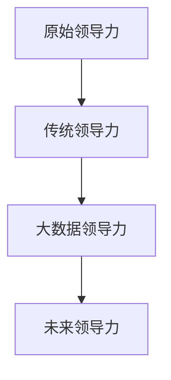
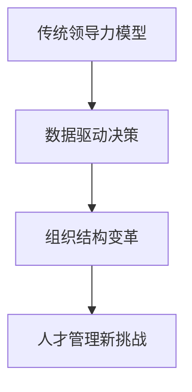

                 

### 目录大纲

**领导力进化论：大数据时代管理者的必修课**

## 引言

- **关键词：领导力、大数据、管理、时代、挑战**
- **摘要：** 本文将探讨大数据时代领导力的演变，以及管理者在这一变革中所需掌握的新技能和知识。

### 引言

#### 书的背景和目的

在快速发展的现代社会中，领导力的定义和实施方式正在经历深刻的变革。大数据技术的崛起，极大地改变了信息获取和处理的方式，也对管理者的角色和技能提出了新的要求。本书旨在揭示领导力在新时代的演变轨迹，为大数据时代的管理者提供实用的指南和策略。

领导力不仅是影响团队和组织绩效的关键因素，更是推动企业创新和应对不确定性的核心动力。然而，随着信息环境的复杂化，传统的领导力模型和策略逐渐显得力不从心。大数据的引入，使得管理者能够更加深入地了解业务环境，优化决策过程，提升组织效能。因此，理解大数据时代领导力的进化，对于管理者来说尤为重要。

#### 领导力进化的必要性

领导力的进化是必然趋势，主要源于以下几个方面的因素：

1. **技术变革**：大数据、人工智能等新兴技术的迅猛发展，极大地改变了信息获取和处理的方式，要求管理者具备更高的技术敏感度和适应能力。

2. **商业环境变化**：全球化、市场动态化以及竞争加剧，使得企业面临更大的不确定性，需要管理者具备更强的应变能力和创新思维。

3. **员工需求升级**：随着员工对工作环境的期望不断提高，管理者需要更加注重员工的个人成长和发展，以激发团队的潜能。

4. **社会责任**：企业在追求经济效益的同时，还需关注社会和环境责任，这要求管理者具备更广泛的社会视野和道德责任。

#### 大数据时代的特点和管理者的挑战

大数据时代具有以下几个显著特点：

1. **数据量的爆炸性增长**：海量的数据为管理者提供了丰富的信息资源，但也带来了数据管理和分析的新挑战。

2. **数据类型的多样性**：不仅包括结构化数据，还包括非结构化数据，如文本、图像、视频等，这对数据分析能力提出了更高的要求。

3. **数据时效性的要求**：在快速变化的市场环境中，数据的时效性至关重要，管理者需要实时获取和分析数据，以快速响应市场变化。

4. **数据隐私和安全问题**：随着数据量的增加，数据隐私和安全问题变得越来越重要，管理者需要采取有效的措施保护数据安全。

面对这些特点，大数据时代的管理者面临以下挑战：

- **技术技能的升级**：需要掌握数据分析、机器学习等新技术，以提高数据处理和分析能力。

- **决策模式的转变**：从经验驱动转向数据驱动，更加依赖数据分析和预测模型做出决策。

- **人才管理的挑战**：需要具备吸引、培养和保留具备数据素养和创新思维的人才的能力。

- **企业文化的建设**：需要推动开放、透明和协作的企业文化，以促进数据共享和知识创新。

### 总结

本文引出了大数据时代领导力的重要性和必要性，以及大数据时代的特点和管理者所面临的挑战。在接下来的章节中，我们将深入探讨领导力进化的理论基础，大数据时代对领导力的影响，以及管理者应如何应对这些挑战。希望通过本文的阐述，能够为大数据时代的管理者提供一些有益的启示和指导。

## 领导力进化论

### 关键词：领导力、进化、管理、变革

### 核心概念与联系

#### Mermaid 流程图



### 原始领导力

原始领导力可以追溯到人类社会早期的部落和家族组织。在这个阶段，领导力主要依赖于个人的魅力、力量和资源。领导者的主要任务是确保群体的生存和安全，通常通过权威和传统来进行管理。

#### 传统领导力

随着工业革命的发展，领导力逐渐从经验导向转变为制度导向。在这个阶段，领导力主要体现在组织结构和流程的优化上，领导者的角色是确保组织目标的实现。传统领导力的核心特征包括：

- **权威性**：领导者拥有明确的权威和决策权。
- **执行力**：强调执行力和纪律性，以确保组织目标的实现。
- **层级结构**：组织结构通常呈现明显的层级关系，领导者的任务是协调和管理不同层级的工作。

### 大数据领导力

大数据技术的崛起，推动了领导力的进一步演变。大数据领导力强调数据驱动的决策和创新。在这个阶段，领导者的角色是利用数据和技术来优化决策过程，提升组织效能。大数据领导力的核心特征包括：

- **数据素养**：领导者需要具备基本的数据素养，能够理解和分析数据。
- **数据驱动**：决策过程更加依赖数据分析，而非纯粹的经验或直觉。
- **创新思维**：领导者需要具备创新思维，能够推动组织在数据和技术领域的突破。
- **敏捷性**：领导者需要具备快速响应变化的能力，以应对市场和技术环境的不确定性。

### 未来领导力

未来领导力将更加注重人性的发展和组织生态的构建。随着人工智能和物联网等技术的进一步发展，领导力将进入一个新的阶段。未来领导力的核心特征包括：

- **人性导向**：领导者将更加关注员工的情感和需求，推动组织的全面发展。
- **生态构建**：领导者需要关注组织内部和外部的生态关系，推动组织与社会、环境的和谐共生。
- **智能辅助**：人工智能和智能工具将成为领导者的有力助手，提升领导效率。

### 领导力进化的驱动力

领导力的进化受到以下几个因素的驱动：

- **技术变革**：技术的不断进步，特别是大数据和人工智能技术的应用，改变了领导力的实施方式和效果。
- **商业环境变化**：全球化、市场动态化和竞争加剧，要求领导力具备更强的适应性和创新性。
- **社会变革**：员工需求的变化和社会责任的要求，促使领导力更加注重人性和可持续发展。
- **领导实践**：领导实践的不断探索和总结，推动领导力理论的创新和发展。

### 领导力进化的趋势

领导力的进化趋势主要体现在以下几个方面：

- **数据素养提升**：领导者需要不断提高数据素养，以更好地利用数据做出决策。
- **创新思维培养**：领导者需要培养创新思维，以推动组织的持续创新和进步。
- **人才驱动**：领导者需要关注人才的培养和发展，以构建高绩效的团队。
- **生态构建**：领导者需要关注组织内外部的生态关系，推动组织的可持续发展。

### 总结

领导力的进化是一个持续的过程，大数据时代对领导力提出了新的要求。领导者需要不断学习和适应，才能在变革中保持竞争力。通过理解领导力的进化路径和趋势，管理者可以更好地应对大数据时代的挑战，提升组织的领导力和效能。

## 大数据时代对领导力的影响

### 关键词：大数据、领导力、影响、变革

### 核心概念与联系

#### Mermaid 流程图



### 数据驱动决策

在大数据时代，数据成为决策的重要依据，传统的领导力模型需要发生重大变革。数据驱动决策的核心在于：

- **数据分析能力**：领导者需要具备分析大量数据的能力，以便从数据中提取有价值的信息。
- **数据素养**：领导者需要具备基本的数据素养，能够理解数据的含义和影响。
- **算法思维**：领导者需要了解基本的算法原理，能够利用算法优化决策过程。

#### 伪代码示例

```python
# 数据分析伪代码
def analyze_data(data):
    # 数据预处理
    preprocessed_data = preprocess(data)
    
    # 数据分析
    insights = analyze(preprocessed_data)
    
    # 决策制定
    decision = make_decision(insights)
    
    return decision
```

### 组织结构变革

大数据时代要求组织结构更加灵活和扁平化，以适应快速变化的环境。传统的层级结构往往导致信息传递滞后和决策效率低下，而扁平化的组织结构能够：

- **提高决策效率**：减少决策层级，缩短决策路径。
- **促进创新**：鼓励跨部门合作，促进创新思维。
- **增强适应性**：快速响应市场变化，提高组织的敏捷性。

#### 组织结构变革的数学模型

```latex
\text{组织效率} = f(\text{信息传递速度}, \text{决策层级}, \text{团队协作})
```

### 人才管理新挑战

大数据时代对人才管理提出了新的挑战，领导者需要关注以下几个方面：

- **数据技能**：招聘和培养具备数据技能的员工，以提升组织的数据分析能力。
- **创新思维**：培养员工的创新思维，以推动组织的持续创新。
- **多元文化**：建立多元文化的组织环境，以吸引和保留多元化的优秀人才。

#### 人才管理的数学模型

```latex
\text{人才管理效率} = f(\text{数据技能水平}, \text{创新思维}, \text{多元文化})
```

### 大数据对管理决策的影响

大数据不仅改变了决策的过程，也改变了决策的内容和方向。领导者需要关注以下几个方面：

- **预测分析**：利用大数据进行预测分析，提前识别潜在的风险和机会。
- **优化决策**：通过大数据分析，优化决策模型，提高决策的准确性和效率。
- **实时反馈**：利用大数据实现实时反馈，快速调整决策方向。

#### 预测分析的数学模型

```latex
\text{预测分析} = f(\text{历史数据}, \text{现有数据}, \text{预测模型})
```

### 数据隐私和安全问题

大数据时代的另一个重要挑战是数据隐私和安全问题。领导者需要采取有效的措施保护数据安全，包括：

- **数据加密**：对敏感数据进行加密，防止数据泄露。
- **权限管理**：实施严格的权限管理，确保只有授权人员能够访问数据。
- **安全监控**：建立数据安全监控体系，及时发现和应对安全威胁。

#### 数据安全监控的数学模型

```latex
\text{数据安全监控} = f(\text{数据流量分析}, \text{异常检测}, \text{安全响应})
```

### 总结

大数据时代对领导力产生了深远的影响，领导者需要具备数据素养、创新思维和敏捷性，以适应快速变化的环境。通过数据驱动决策、组织结构变革和人才管理新挑战，领导者可以提升组织的效能和竞争力。同时，数据隐私和安全问题也是大数据时代领导者需要关注的重要议题。

## 管理者在大数据时代的技能与知识

### 关键词：大数据、管理者、技能、知识

### 数据素养的重要性

在大数据时代，数据素养成为管理者必备的核心技能。数据素养不仅涉及对数据的理解和分析能力，还包括对数据隐私和安全问题的认识。以下是对数据素养重要性的详细讲解：

#### 数据素养的定义

数据素养是指个体能够有效地理解、解释和应用数据的能力。它包括以下几个方面的内容：

- **数据理解**：能够解读数据的含义和背景，理解数据背后的故事。
- **数据分析**：能够运用统计学和数据分析方法，从数据中提取有价值的信息。
- **数据解释**：能够将数据分析结果转化为具体的行动指南和决策依据。
- **数据应用**：能够将数据分析结果应用于实际业务场景，解决实际问题。

#### 数据素养的层次

数据素养可以分为以下三个层次：

1. **基础数据素养**：个体能够理解数据的定义、类型和来源，具备基本的统计分析能力。
2. **中级数据素养**：个体能够运用高级数据分析方法，如回归分析、聚类分析等，对复杂的数据集进行分析。
3. **高级数据素养**：个体能够运用机器学习和人工智能技术，进行数据挖掘和预测分析，为业务决策提供深度洞察。

#### 数据素养对管理者的影响

数据素养对管理者的决策过程和组织效能有深远的影响：

1. **决策优化**：具备数据素养的管理者能够更准确地识别业务问题，并利用数据进行分析，制定更为科学的决策方案。
2. **风险控制**：管理者能够通过数据监控和分析，及时发现潜在的风险和问题，并采取有效的措施进行风险控制。
3. **创新驱动**：管理者能够利用数据分析结果，推动组织的创新和发展，寻找新的商业机会。
4. **团队协作**：具备数据素养的管理者能够更好地与团队成员沟通，推动跨部门的数据共享和知识创新。

#### 举例说明

假设一家电商企业需要制定新的促销策略，具备数据素养的管理者会首先收集和分析以下数据：

- **历史销售数据**：分析不同促销活动的历史表现，了解用户对不同促销方式的反应。
- **用户行为数据**：分析用户的购买行为、浏览记录和搜索关键词，了解用户的偏好和需求。
- **竞争对手数据**：分析竞争对手的促销策略和市场份额，评估自身在市场中的定位。

通过这些数据的综合分析，管理者可以制定出更符合市场需求的促销策略，从而提高销售业绩。

### 大数据时代的领导力模型

在大数据时代，领导力模型需要从传统的经验导向转向数据驱动，以适应新的商业环境和挑战。以下是对大数据时代领导力模型的详细阐述：

#### 数据驱动的领导力模型

数据驱动的领导力模型强调数据在决策过程中的核心地位，以下是该模型的主要组成部分：

1. **数据意识**：领导者需要具备强烈的数据意识，认识到数据对于决策的重要性，并将其融入到日常管理中。
2. **数据文化**：领导者需要推动组织内部建立数据文化，鼓励员工运用数据分析和思考问题，形成以数据为基础的决策共识。
3. **数据工具**：领导者需要掌握和应用各种数据工具和技能，如数据分析软件、机器学习算法等，以便有效地利用数据。
4. **数据责任**：领导者需要对数据的准确性和完整性负责，确保数据的可靠性和决策的科学性。

#### 数据驱动领导力的特征

数据驱动领导力具有以下特征：

- **数据驱动决策**：领导者依据数据分析和预测结果做出决策，而非纯粹依赖经验和直觉。
- **敏捷响应**：领导者能够快速获取和分析数据，及时响应市场变化，调整战略和战术。
- **创新思维**：领导者鼓励员工运用数据创新，推动组织的持续创新和进步。
- **跨部门协作**：领导者推动跨部门的数据共享和协作，打破信息孤岛，提高组织的整体效能。

#### 数据驱动领导力的应用案例

某公司是一家快速消费品企业，面对激烈的市场竞争，公司领导者决定采用数据驱动领导力模型进行决策。以下是具体的应用案例：

1. **产品优化**：领导者通过数据分析，识别消费者对产品的偏好，优化产品组合，提高市场竞争力。
2. **促销策略**：领导者通过数据分析，制定精准的促销策略，提高销售转化率和市场份额。
3. **库存管理**：领导者通过数据分析，优化库存管理，减少库存积压，提高资金周转率。
4. **市场需求预测**：领导者通过数据分析，预测市场需求趋势，提前布局新产品，抢占市场先机。

### 管理者必备的数据技能

在大数据时代，管理者不仅需要数据素养，还需要掌握一系列具体的数据技能，以有效地利用数据推动组织发展。以下是对管理者必备的数据技能的详细阐述：

#### 数据分析技能

数据分析技能是管理者必备的核心技能，主要包括：

- **统计分析**：掌握基本的统计分析方法，如均值、方差、回归分析等，能够对数据进行分析和解释。
- **数据可视化**：能够使用数据可视化工具，如Tableau、PowerBI等，将数据以图形化方式呈现，帮助团队更好地理解数据。
- **机器学习**：了解基本的机器学习算法，如决策树、随机森林、神经网络等，能够运用机器学习技术进行数据分析和预测。

#### 数据处理技能

数据处理技能是确保数据质量和可靠性的关键，主要包括：

- **数据清洗**：能够清洗和整理数据，去除重复、错误和缺失的数据，确保数据的准确性和完整性。
- **数据整合**：能够将来自不同来源和格式的数据整合在一起，建立统一的数据仓库。
- **数据存储**：了解数据库技术，能够设计和维护高效的数据库系统，确保数据的安全性和可扩展性。

#### 数据应用技能

数据应用技能是管理者将数据分析结果应用于实际业务的关键，主要包括：

- **业务理解**：能够深入理解业务需求和痛点，将数据分析结果转化为具体的业务策略和行动计划。
- **数据报告**：能够编写清晰、简洁的数据报告，向管理层和团队传达数据分析结果和结论。
- **数据驱动决策**：能够依据数据分析结果，制定科学的决策方案，并推动决策的实施和跟踪。

#### 举例说明

假设一家制造企业需要评估其生产线的效率，管理者可以运用以下数据技能：

1. **数据分析技能**：通过收集生产数据，运用统计分析方法，分析生产线的运行效率，识别瓶颈和改进点。
2. **数据处理技能**：对生产数据进行清洗和整合，确保数据的准确性和完整性，建立统一的数据仓库。
3. **数据应用技能**：基于数据分析结果，制定优化生产流程的策略，如调整生产节拍、优化设备配置等，并跟踪实施效果。

### 总结

在大数据时代，管理者需要具备数据素养和数据技能，以应对新的商业环境和挑战。数据素养是管理者理解和运用数据的基础，包括数据理解、数据分析、数据解释和数据应用等方面。数据技能则是管理者具体运用数据分析工具和技术，将数据转化为业务价值的能力。通过掌握数据素养和技能，管理者可以更有效地推动组织的创新和发展，提升组织的竞争力。

## 大数据时代领导力实践案例

### 关键词：大数据、领导力、案例、实践

### 国内成功领导力实践案例

#### 案例一：阿里巴巴集团

阿里巴巴集团作为中国电商行业的领军企业，在大数据时代领导力方面取得了显著成就。以下是阿里巴巴集团在大数据时代领导力实践中的几个关键点：

1. **数据驱动文化**：阿里巴巴注重数据驱动文化的建设，鼓励员工利用数据分析和决策。公司的领导层通过数据报告和数据分析会议，向员工传达数据的重要性和分析方法。

2. **创新人才管理**：阿里巴巴通过数据化人才管理，识别和培养高潜力人才。通过数据分析，公司能够精准识别员工的优点和不足，制定个性化的培训和发展计划。

3. **敏捷组织结构**：阿里巴巴采用扁平化的组织结构，减少决策层级，提高响应速度。公司通过数据化工具和平台，实现跨部门协作和数据共享，提高组织的整体效能。

4. **数据安全与隐私**：阿里巴巴高度重视数据安全和隐私保护，建立完善的数据安全管理体系，确保数据的安全性和合规性。

#### 案例二：腾讯控股

腾讯控股作为全球领先的互联网科技公司，在大数据时代领导力方面也有诸多实践：

1. **数据驱动战略**：腾讯通过大数据分析和预测，制定公司的战略方向。例如，通过分析用户行为数据，腾讯能够准确预测市场趋势，提前布局新兴领域。

2. **创新能力培养**：腾讯鼓励员工创新，通过数据分析和人工智能技术，推动产品的迭代和创新。公司内部设有创新实验室，为员工提供创新的试验环境和资源。

3. **跨界合作与生态构建**：腾讯通过大数据和人工智能技术，与各行各业进行跨界合作，构建开放的创新生态。例如，腾讯与医疗健康领域的合作，利用大数据和人工智能技术提升医疗服务水平。

4. **社会责任与可持续发展**：腾讯在大数据时代领导力实践中，注重企业的社会责任和可持续发展。公司通过数据分析，优化资源利用，减少碳排放，推动绿色办公。

### 国外成功领导力实践案例

#### 案例一：亚马逊公司

亚马逊公司作为全球电商和云计算领域的领导者，在大数据时代领导力方面具有丰富的实践：

1. **数据驱动的供应链管理**：亚马逊通过大数据分析和预测，优化供应链管理，提高物流效率和客户满意度。公司运用机器学习算法，预测市场需求，调整库存和配送策略。

2. **个性化用户体验**：亚马逊利用用户行为数据，提供个性化的产品推荐和购物体验。通过大数据分析，公司能够精准识别用户偏好，提高用户的购物转化率和满意度。

3. **创新业务拓展**：亚马逊通过数据分析，识别潜在的商业机会，拓展新的业务领域。例如，通过分析消费者需求，亚马逊推出了亚马逊音乐、亚马逊视频等服务。

4. **数据安全与隐私**：亚马逊高度重视数据安全和隐私保护，建立全球领先的数据安全管理体系。公司采取严格的数据保护措施，确保客户数据的隐私和安全。

#### 案例二：谷歌公司

谷歌公司作为全球领先的科技公司，在大数据时代领导力方面有诸多成功实践：

1. **数据驱动的产品创新**：谷歌通过大数据分析和用户反馈，持续改进产品和服务。公司利用机器学习和人工智能技术，推动产品的创新和优化。

2. **敏捷开发与迭代**：谷歌采用敏捷开发方法，快速响应市场需求和技术变化。通过数据分析和用户反馈，谷歌能够快速调整产品方向和功能。

3. **全球协作与知识共享**：谷歌注重全球协作和知识共享，通过数据平台和协作工具，实现全球团队的紧密合作。公司鼓励员工跨部门、跨地域交流，促进知识的共享和创新。

4. **社会责任与环境保护**：谷歌在大数据时代领导力实践中，积极承担社会责任，推动环境保护。公司通过数据分析，优化资源利用，减少碳排放，推动可持续发展。

### 案例分析与总结

通过对国内外大数据时代领导力实践案例的分析，我们可以总结出以下几个成功要素：

1. **数据驱动的决策**：成功的领导力实践强调数据在决策过程中的核心地位，通过数据分析和预测，制定科学的决策方案。

2. **创新人才管理**：成功的领导力实践注重人才的培养和发展，通过数据化的人才管理，识别和培养高潜力人才。

3. **敏捷组织结构**：成功的领导力实践采用扁平化的组织结构，提高组织的敏捷性和响应速度。

4. **数据安全与隐私**：成功的领导力实践高度重视数据安全和隐私保护，建立完善的数据安全管理体系。

5. **跨界合作与生态构建**：成功的领导力实践注重跨界合作和生态构建，通过数据和技术，推动产业和社会的协同发展。

通过借鉴这些成功经验，管理者可以更好地应对大数据时代的挑战，提升组织的领导力和竞争力。

## 总结与展望

### 关键词：大数据、领导力、未来、挑战

### 总结

大数据时代为领导力带来了深刻的变革，管理者需要具备数据素养、创新思维和敏捷性，以应对快速变化的环境。通过数据驱动决策、组织结构变革和人才管理新挑战，领导者可以提升组织的效能和竞争力。同时，数据隐私和安全问题也是大数据时代领导者需要关注的重要议题。

### 展望

在未来，领导力将继续进化，更加注重人性和可持续发展。随着人工智能和物联网等技术的进一步发展，领导力将更加智能化和个性化。领导者需要不断提升自身的数据素养和技术能力，以适应未来的挑战。

### 管理者应如何应对未来挑战

1. **持续学习**：领导者应保持对新技术和趋势的敏锐洞察，持续学习和更新知识，以适应不断变化的环境。

2. **数据驱动**：领导者应将数据驱动的理念融入日常管理，通过数据分析和预测，做出更加科学和有效的决策。

3. **创新思维**：领导者应鼓励员工创新，推动组织的持续创新和进步，以应对市场的变化和挑战。

4. **跨部门协作**：领导者应推动跨部门的协作和数据共享，打破信息孤岛，提高组织的整体效能。

5. **社会责任**：领导者应关注企业的社会责任和可持续发展，通过数据分析和技术创新，推动社会的和谐发展和进步。

### 拓展阅读

- 《大数据时代：生活、工作与思维的大变革》
- 《智能时代：数据驱动管理变革》
- 《领导力与新科学：跨学科视角》

通过阅读这些书籍和资料，管理者可以深入了解大数据时代领导力的进化路径和实践方法，提升自身的领导力和管理能力。

## 作者信息

作者：AI天才研究院/AI Genius Institute & 禅与计算机程序设计艺术 /Zen And The Art of Computer Programming

