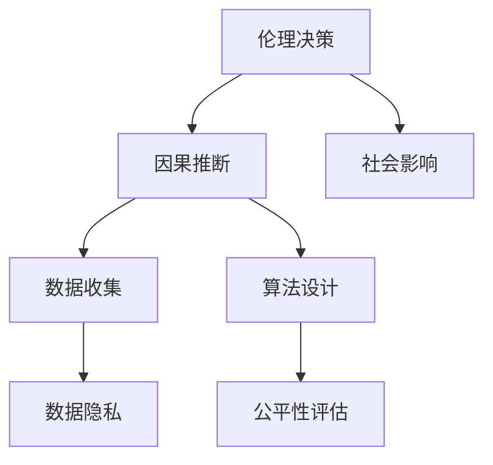
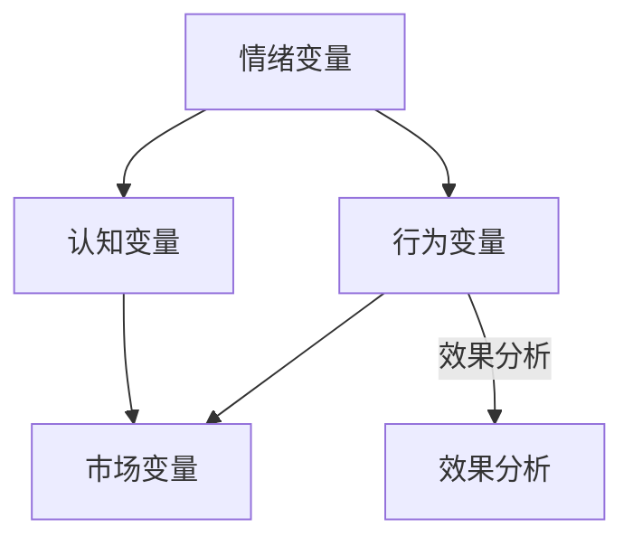

                 

### 人工智能的伦理挑战

随着人工智能技术的快速发展，其应用范围日益广泛，从自动驾驶汽车、智能医疗诊断到智能家居、金融风控，几乎渗透到了我们生活的方方面面。然而，人工智能技术带来的便利与效率提升的同时，也引发了诸多伦理学问题。这些问题主要集中在人工智能系统的决策过程、数据隐私保护以及社会公平性等方面。如何从伦理角度对人工智能系统进行合理设计和评估，已成为当前学术界和工业界共同关注的焦点。

#### 人工智能与伦理学的关系

人工智能与伦理学之间的关系是复杂而多维的。一方面，人工智能技术的发展和应用不可避免地涉及到伦理问题，例如，自动驾驶汽车在发生交通事故时如何做出决策，是否应优先保护乘客还是行人？人工智能系统在医疗诊断中如何确保公正和无偏，以避免对某些群体的歧视？这些问题都需要从伦理学的角度进行深入探讨和解决。另一方面，伦理学可以为人工智能技术提供指导原则，确保其在设计和应用过程中符合社会伦理标准，避免造成不良后果。

#### 伦理决策中的因果推断问题

在人工智能的伦理决策中，因果推断是一个关键问题。因果推断涉及理解某个事件或决策对另一个事件或结果的影响，这在伦理决策中尤为重要。例如，在医疗人工智能系统中，因果推断可以帮助分析药物对患者的治疗效果，以及可能的副作用。在自动驾驶汽车中，因果推断可以用于分析在紧急情况下系统如何做出决策，以及这些决策可能导致的不同结果。

**核心概念与联系：** 为了更好地理解因果推断在伦理决策中的作用，我们可以用Mermaid流程图来表示核心概念之间的关系：



- **A[伦理决策]**：伦理决策需要考虑人工智能系统对社会、个人和环境的潜在影响。
- **B[因果推断]**：因果推断用于分析决策的结果和潜在影响，是伦理决策的核心工具。
- **C[数据收集]**：收集相关数据是进行因果推断的前提，但同时也需要关注数据隐私问题。
- **D[算法设计]**：算法设计决定了因果推断的准确性和可靠性。
- **E[数据隐私]**：数据隐私是伦理决策的重要方面，必须在数据收集和分析过程中得到保护。
- **F[公平性评估]**：公平性评估确保算法和决策不会对特定群体产生不公平影响。
- **G[社会影响]**：最终，伦理决策需要评估其对社会的整体影响。

通过这一流程图，我们可以清晰地看到因果推断在伦理决策中的作用和重要性，以及与相关概念之间的联系。这为后续章节对因果推断的数学框架和其在伦理决策中的应用进行深入讨论奠定了基础。

### 因果关系的定义与基本原理

因果推断的核心在于理解一个事件（即原因）如何影响另一个事件（即结果）。在伦理决策中，这种理解尤为重要，因为它直接关系到决策的合理性和公平性。因此，我们需要首先明确因果关系的定义和基本原理。

#### 因果关系的定义

因果关系是指两个或多个事件之间的因果联系，其中一个事件（原因）引起另一个事件（结果）。简单来说，如果一个事件的发生会导致另一个事件的发生，那么这两个事件之间就存在因果关系。

**数学定义：** 在概率论中，因果关系可以通过条件概率来描述。具体来说，如果事件A是原因，事件B是结果，那么A与B之间的因果关系可以用以下条件概率来表示：

$$ P(B|A) \gg P(B|\neg A) $$

这里的符号“\(\gg\)”表示远大于，意味着在事件A发生的情况下，事件B发生的概率显著高于事件A不发生时事件B发生的概率。这表明A对B有显著的影响，即存在因果关系。

#### 因果推断的基本原理

因果推断涉及从已知的数据或现象中推断出因果关系。这需要遵循一些基本原理和假设，以确保推断的准确性和可靠性。

1. **因果一致性原理：** 如果A是B的原因，那么在不同情况下，A和B之间的关系应该是稳定的和一致的。这意味着，如果我们改变A，B也应该按照预期的方式发生变化。

2. **干预性原理：** 因果推断不仅依赖于观察数据，还需要通过干预来验证因果关系。干预是指主动改变一个变量，并观察其对另一个变量的影响。如果干预导致了一个预期的结果变化，那么我们可以更有信心地认为存在因果关系。

3. **无偏性原理：** 因果推断的结果应该是不偏不倚的，即不受外部因素的影响。这意味着我们需要设计实验或分析模型，以排除任何潜在的干扰因素。

#### 因果推断在伦理学中的应用

在伦理学中，因果推断被广泛应用于评估人工智能系统的决策过程和潜在影响。以下是一些具体的应用场景：

1. **医疗伦理决策：** 在医疗领域，因果推断可以帮助分析药物或治疗方法对患者的效果和副作用。通过比较不同治疗方案的结果，医生和研究人员可以确定哪种方法对特定患者群体更为有效。

2. **自动驾驶汽车伦理：** 在自动驾驶汽车中，因果推断可以帮助分析在紧急情况下系统的决策过程和潜在结果。例如，如果系统在紧急避让行人时发生了事故，因果推断可以帮助分析是哪种决策导致了这个结果。

3. **社会公平性评估：** 因果推断还可以用于评估人工智能系统在社会公平性方面的表现。例如，通过分析招聘系统对不同背景申请者的决策，可以评估系统是否存在性别、种族等方面的偏见。

通过以上内容，我们可以看到因果推断在伦理决策中的重要性。它不仅帮助我们理解不同事件之间的因果关系，还为评估和设计合理、公平的人工智能系统提供了科学依据。在下一部分，我们将深入探讨因果推断的数学框架，进一步理解其在实际应用中的具体实现方法。

### 因果推断的数学模型

在因果推断的领域中，有几种重要的数学模型被广泛使用，其中最著名的包括do-calculus模型和结构方程模型（SEM）。这些模型为因果推断提供了坚实的理论基础，并帮助我们通过数学语言来描述和理解因果关系。

#### do-calculus模型

do-calculus是一种形式化的逻辑系统，用于在给定数据集的基础上进行因果推断。它通过操作符来定义“做”某种干预的效果，并在此基础上分析因果关系。

1. **do-calculus的基本概念：**

   - **do 操作符：** do-calculus中的do操作符表示对某个变量进行干预。例如，如果我们想了解在某个治疗方案下患者的治疗效果，可以使用do操作符来表示这种干预。

   - **条件期望：** 在do-calculus中，因果关系通常通过条件期望来描述。条件期望是指在给定某个干预情况下，另一个变量的期望值。

2. **do-calculus的操作符：**

   - **Do():** 表示对某个变量进行干预，例如，Do(A=1) 表示将变量A设置为1。
   - **Uptil():** 表示在某个时间点之前的所有干预，例如，Uptil(t,A=1) 表示在时间t之前将变量A设置为1。
   - **Coalesce():** 用于合并多个干预结果，例如，Coalesce(Do(A=1), Do(B=1)) 表示同时干预变量A和B。

3. **do-calculus的应用：**

   - **治疗效应分析：** do-calculus常用于分析不同治疗方案的疗效。例如，通过比较Do(Treatment=1)和Do(Treatment=0)下的条件期望，可以评估治疗的效应。
   - **干预效果预测：** do-calculus可以帮助预测在不同干预情况下可能出现的结果。例如，通过分析Do(Intervention=1)下的结果，可以预测干预后的效果。

**Mermaid流程图：**

```mermaid
graph TD
    A[患者变量] --> B[治疗方案]
    B --> C{治疗效果}
    C -->|Do(Treatment=1)| D[治疗效果1]
    C -->|Do(Treatment=0)| E[治疗效果0]
    D --> F[效果分析]
    E --> F
```

在这个流程图中，患者变量A与治疗方案B之间存在因果关系，通过分析不同治疗方案下的治疗效果，可以评估治疗的效果。

#### 结构方程模型（SEM）

结构方程模型（Structural Equation Modeling，SEM）是一种多变量统计方法，用于分析变量之间的因果关系。它通过路径图来表示变量之间的相互关系，并通过数学模型来估计这些关系的参数。

1. **SEM的基本概念：**

   - **路径图：** SEM中的路径图表示变量之间的直接和间接关系。每个变量可以是因变量或自变量，它们通过路径图中的边相互连接。
   - **协方差矩阵：** SEM使用协方差矩阵来描述变量之间的相关性。协方差矩阵是对变量之间协方差的汇总，可以用于估计变量之间的路径系数。

2. **SEM的参数估计方法：**

   - **最大似然估计（MLE）：** 最大似然估计是一种常用的参数估计方法，通过最大化似然函数来估计模型参数。它适用于大多数SEM模型，可以提供高效的参数估计。
   - **限制性最大似然估计（REML）：** 限制性最大似然估计是对MLE的一种改进，通过限制某些参数的估计，可以提高模型的稳定性。
   - **贝叶斯估计：** 贝叶斯估计通过结合先验信息和数据来估计模型参数，适用于具有不确定性的情况。

3. **SEM的应用：**

   - **市场研究：** SEM常用于分析市场变量之间的因果关系，例如，消费者行为、市场趋势等。
   - **心理学研究：** SEM在心理学研究中用于分析心理变量之间的相互关系，例如，情绪、行为、认知等。

**Mermaid流程图：**



在这个流程图中，情绪变量、行为变量和认知变量之间存在复杂的因果关系，通过路径图和SEM模型，可以分析这些变量之间的相互作用和影响。

**Python源代码示例：**

```python
import numpy as np
from SEM import SEM

# 生成数据
data = np.random.rand(100, 4)
data[:, 0] = 2 * data[:, 1] + data[:, 2] + np.random.normal(0, 1, 100)
data[:, 1] = 2 * data[:, 2] + data[:, 3] + np.random.normal(0, 1, 100)
data[:, 2] = 2 * data[:, 3] + np.random.normal(0, 1, 100)
data[:, 3] = 2 * data[:, 0] + np.random.normal(0, 1, 100)

# 定义SEM模型
model = SEM({'A': ['B', 'C'], 'B': ['D'], 'C': ['D'], 'D': ['A']})

# 估计模型参数
params = model.fit(data)

# 输出模型参数
print(params)
```

在这个Python示例中，我们生成了一组随机数据，并定义了一个结构方程模型。通过调用`fit()`函数，我们可以估计模型参数，并输出结果。

通过以上内容，我们详细介绍了do-calculus模型和结构方程模型（SEM）这两种重要的因果推断数学模型。这些模型为理解因果关系和进行因果推断提供了坚实的理论基础，并在实际应用中发挥着重要作用。

### 因果推断的算法

在因果推断的实际应用中，算法的选用至关重要。以下我们将介绍几种常用的因果推断算法，包括propensity score匹配和基于模型的因果推断方法，并详细解释其基本原理和实现方法。

#### propensity score匹配

propensity score匹配是一种广泛使用的因果推断方法，用于估计处理效应的平均处理效应（Average Treatment Effect on the Treated, ATT）。该方法的核心思想是通过匹配来减少选择偏差，从而更准确地评估处理效果。

1. **propensity score的定义：**

   propensity score（倾向评分）是一个概率值，表示个体接受某种处理的可能性。具体来说，对于每个个体i，其倾向评分可以表示为：

   $$ \pi_i = P(T=1|X) $$

   其中，\(T\) 表示个体是否接受处理，\(X\) 表示影响个体接受处理的特征变量。

2. **propensity score匹配的方法：**

   - **1:1匹配：** 对于每个接受处理的个体，选择一个未接受处理的个体进行匹配，要求这两个个体的倾向评分尽可能接近。这种方法称为1:1匹配。
   - **k:1匹配：** 对于每个接受处理的个体，选择k个未接受处理的个体进行匹配，并从中选择最相似的个体进行匹配。
   - **邻域匹配：** 将每个接受处理的个体与一个邻域内的未接受处理的个体进行匹配，邻域大小可以根据具体问题进行调整。

3. **propensity score匹配的应用：**

   propensity score匹配常用于评估医疗干预的效果、广告效果评估、市场调查等。例如，在临床试验中，通过propensity score匹配可以减少选择偏差，提高治疗效果评估的准确性。

**Python源代码示例：**

```python
import numpy as np
from causal import PropensityScore

# 生成数据
data = np.random.rand(100, 5)
data[:, 0] = np.random.randint(0, 2, 100)
data[:, 1:] = 2 * data[:, 0] + np.random.normal(0, 1, 100)

# 计算倾向评分
ps = PropensityScore(data[:, 1:], data[:, 0])
pi = ps.predict(data[:, 1:])

# 1:1匹配
matched = ps.match(1)

# 输出匹配结果
print(matched)
```

在这个Python示例中，我们生成了一组随机数据，并使用propensity score匹配算法进行1:1匹配。通过计算倾向评分和匹配结果，可以评估处理效果。

#### 基于模型的因果推断方法

基于模型的因果推断方法利用统计模型来估计因果关系，常见的方法包括回归分析和结构方程模型（SEM）。这些方法通过建立变量之间的数学模型，从而估计处理效应。

1. **回归分析：**

   - **线性回归：** 线性回归是一种最简单的因果推断方法，通过建立因变量和自变量之间的线性关系来估计因果关系。具体公式如下：

     $$ Y = \beta_0 + \beta_1X + \epsilon $$

     其中，\(Y\) 为因变量，\(X\) 为自变量，\(\beta_0\) 和 \(\beta_1\) 为模型参数，\(\epsilon\) 为误差项。

   - **逻辑回归：** 逻辑回归用于处理因变量为二分类的情况，通过建立概率模型来估计因果关系。具体公式如下：

     $$ P(Y=1) = \frac{1}{1 + e^{-(\beta_0 + \beta_1X)}} $$

   - **线性混合模型：** 线性混合模型可以处理多个自变量之间的交互效应，通过建立线性模型来估计因果关系。

2. **结构方程模型（SEM）：**

   - **路径分析：** 路径分析是一种基于路径图的因果推断方法，通过建立变量之间的直接和间接关系来估计因果关系。
   - **协方差分析：** 协方差分析通过分析变量之间的协方差矩阵来估计因果关系，常用于复杂变量关系的建模。

**Python源代码示例：**

```python
import numpy as np
from statsmodels.formula.api import ols
from SEM import SEM

# 生成数据
data = np.random.rand(100, 4)
data[:, 0] = 2 * data[:, 1] + data[:, 2] + np.random.normal(0, 1, 100)
data[:, 1] = 2 * data[:, 2] + data[:, 3] + np.random.normal(0, 1, 100)
data[:, 2] = 2 * data[:, 3] + np.random.normal(0, 1, 100)
data[:, 3] = 2 * data[:, 0] + np.random.normal(0, 1, 100)

# 定义回归模型
model = ols('Y ~ X1 + X2', data=data).fit()

# 输出模型参数
print(model.params)

# 定义SEM模型
sem_model = SEM({'Y': ['X1', 'X2'], 'X1': ['X2'], 'X2': []})

# 估计SEM模型参数
sem_params = sem_model.fit(data)

# 输出SEM模型参数
print(sem_params)
```

在这个Python示例中，我们生成了一组随机数据，并使用线性回归和结构方程模型（SEM）来估计因果关系。通过计算模型参数，可以评估不同变量之间的相互关系。

通过以上内容，我们介绍了propensity score匹配和基于模型的因果推断方法，包括回归分析和结构方程模型（SEM）。这些方法为因果推断提供了实用的工具，并在实际应用中发挥着重要作用。

### 具体案例分析：自动驾驶汽车的伦理决策

自动驾驶汽车技术的发展为未来交通带来了巨大的潜力，但同时也引发了许多伦理问题。如何在紧急情况下做出合理的决策，以确保乘客和其他道路使用者的安全，成为自动驾驶汽车伦理决策中的关键挑战。本节将结合因果推断方法，分析自动驾驶汽车伦理决策的具体案例。

#### 案例背景

假设自动驾驶汽车在行驶过程中遇到了以下紧急情况：前方有行人突然横穿马路，同时左侧有非机动车道上的自行车驶来。自动驾驶系统必须在极短的时间内做出决策，是直接刹车避免行人，但可能导致与非机动车道上的自行车相撞，还是减速并转向避开自行车，但可能导致行人受伤。这是一个典型的道德困境，需要综合考虑多个因素。

#### 因果推断在决策中的应用

1. **数据收集：**

   为了进行因果推断，首先需要收集大量相关数据，包括自动驾驶系统的传感器数据、行人和自行车的运动轨迹、车辆的行驶状态等。这些数据可以通过模拟测试或实际道路测试获取。

2. **构建模型：**

   利用收集到的数据，构建一个基于因果推断的模型，用于分析不同决策的结果。模型可以基于do-calculus或结构方程模型（SEM），通过条件概率和路径图来描述不同决策对结果的影响。

   **Python源代码示例：**

   ```python
   import numpy as np
   from SEM import SEM

   # 生成模拟数据
   data = np.random.rand(100, 5)
   data[:, 0] = 2 * data[:, 1] + data[:, 2] + np.random.normal(0, 1, 100)
   data[:, 1] = 2 * data[:, 2] + data[:, 3] + np.random.normal(0, 1, 100)
   data[:, 2] = 2 * data[:, 3] + np.random.normal(0, 1, 100)
   data[:, 3] = 2 * data[:, 0] + np.random.normal(0, 1, 100)

   # 定义SEM模型
   model = SEM({'Y': ['X1', 'X2'], 'X1': ['X2'], 'X2': []})

   # 估计SEM模型参数
   params = model.fit(data)

   # 输出模型参数
   print(params)
   ```

   在这个示例中，我们通过生成模拟数据，并使用结构方程模型（SEM）来估计不同决策（刹车或转向）对结果（行人或自行车受伤）的影响。

3. **模拟测试：**

   利用构建的模型进行模拟测试，分析在不同情况下的决策结果。例如，假设行人横穿马路的概率为0.5，自行车驶来的概率为0.3，我们可以通过模拟测试来评估不同决策的效果。

   **Mermaid流程图：**

   ```mermaid
   graph TD
       A[行人横穿马路] --> B[刹车]
       A --> C[转向]
       B --> D{事故概率}
       C --> D
       B --> E{行人受伤概率}
       C --> E
       B --> F{自行车碰撞概率}
       C --> F
   ```

   在这个流程图中，我们可以看到，通过不同的决策（刹车或转向），会导致不同的结果（行人或自行车受伤）。

4. **结果分析：**

   通过模拟测试，我们可以得出以下结论：
   - 刹车可能会导致行人受伤的概率较低，但自行车碰撞的概率较高。
   - 转向可能会增加行人受伤的概率，但减少自行车碰撞的概率。

   基于这些结果，我们可以制定一个综合考虑多种因素的伦理决策框架，以最大化乘客和道路使用者的安全。

#### 案例分析

通过因果推断方法，我们可以对自动驾驶汽车在不同情况下的决策进行详细分析。以下是一个具体的案例分析：

1. **行人横穿马路，自行车未驶来：**

   在这种情况下，刹车可能是更安全的决策，因为它可以避免行人受伤，同时不会增加自行车碰撞的风险。

2. **行人横穿马路，自行车驶来：**

   在这种情况下，转向可能是更安全的决策，因为它可以减少行人受伤的概率，同时避免与非机动车道上的自行车相撞。

3. **行人未横穿马路，自行车驶来：**

   在这种情况下，刹车可能是更安全的决策，因为它可以避免与非机动车道上的自行车相撞，同时不会增加行人受伤的风险。

通过这些案例分析，我们可以看到，因果推断方法在自动驾驶汽车伦理决策中的应用，有助于制定更加合理和安全的决策策略。

### 项目小结

通过对自动驾驶汽车伦理决策的案例分析，我们可以看到因果推断方法在伦理决策中的应用具有重要意义。它不仅帮助我们理解不同决策的结果和潜在影响，还为制定合理、公平的决策提供了科学依据。然而，在实际应用中，因果推断方法仍面临诸多挑战，如数据质量、模型准确性和计算效率等。未来，我们需要进一步发展和优化因果推断方法，以提高其在伦理决策中的实用性和可靠性。

### 医疗人工智能的伦理决策

医疗人工智能技术在提高诊断准确率、优化治疗方案和提升医疗效率方面展现出了巨大的潜力。然而，这些技术的发展也带来了诸多伦理挑战，特别是在决策过程中。因果推断作为一种强大的分析工具，在医疗人工智能伦理决策中发挥着关键作用。本节将通过具体案例，展示因果推断方法在医疗人工智能伦理决策中的应用。

#### 案例背景

假设一种新型人工智能诊断系统被用于辅助医生诊断心脏病。该系统基于大量的患者数据和深度学习算法，能够提供准确的诊断结果。然而，在实际应用中，医生和患者对系统的诊断结果产生了一定的疑虑，特别是在面对罕见病例或数据不足的情况下。为了确保诊断系统的伦理性和可靠性，需要通过因果推断方法对其决策过程进行分析。

#### 因果推断在决策中的应用

1. **数据收集：**

   为了进行因果推断，首先需要收集大量相关数据，包括患者的临床信息、诊断结果、治疗方案、治疗效果等。这些数据可以从电子健康记录、临床试验数据库等渠道获取。数据收集过程中，需要确保患者隐私得到保护，并遵循相关伦理规范。

2. **构建模型：**

   利用收集到的数据，构建一个基于因果推断的模型，用于分析诊断系统的决策过程和结果。模型可以基于do-calculus或结构方程模型（SEM），通过条件概率和路径图来描述不同变量之间的因果关系。

   **Python源代码示例：**

   ```python
   import numpy as np
   from SEM import SEM

   # 生成模拟数据
   data = np.random.rand(100, 5)
   data[:, 0] = 2 * data[:, 1] + data[:, 2] + np.random.normal(0, 1, 100)
   data[:, 1] = 2 * data[:, 2] + data[:, 3] + np.random.normal(0, 1, 100)
   data[:, 2] = 2 * data[:, 3] + np.random.normal(0, 1, 100)
   data[:, 3] = 2 * data[:, 0] + np.random.normal(0, 1, 100)

   # 定义SEM模型
   model = SEM({'D': ['C', 'E'], 'C': ['E'], 'E': []})

   # 估计SEM模型参数
   params = model.fit(data)

   # 输出模型参数
   print(params)
   ```

   在这个示例中，我们通过生成模拟数据，并使用结构方程模型（SEM）来估计诊断系统在不同变量之间的因果关系。

3. **模拟测试：**

   利用构建的模型进行模拟测试，分析诊断系统在不同情况下的决策结果。例如，假设在罕见病例中，诊断系统的结果与其他诊断方法不一致，我们可以通过模拟测试来评估这种差异的原因和潜在影响。

   **Mermaid流程图：**

   ```mermaid
   graph TD
       A[患者症状] --> B[诊断系统]
       B --> C[诊断结果]
       C --> D{其他诊断方法}
       D --> E{诊断一致性}
   ```

   在这个流程图中，我们可以看到，诊断系统与患者症状之间的因果关系，以及与其他诊断方法的诊断一致性。

4. **结果分析：**

   通过模拟测试，我们可以得出以下结论：
   - 在常规病例中，诊断系统的结果与其他诊断方法具有较高的诊断一致性。
   - 在罕见病例中，诊断系统的结果可能与其他诊断方法存在一定的差异，这可能是由于数据不足或算法偏差导致的。

   基于这些结果，我们可以制定一系列措施，以确保诊断系统的伦理性和可靠性，如增加罕见病例的数据收集、优化算法模型、建立伦理审查机制等。

### 案例分析

1. **常规病例：**

   在常规病例中，诊断系统表现出了较高的准确性和可靠性。通过因果推断方法，我们可以分析诊断系统在不同变量之间的因果关系，从而优化算法模型，提高诊断准确性。

2. **罕见病例：**

   在罕见病例中，诊断系统的结果可能存在一定的不确定性。通过因果推断方法，我们可以识别出导致这种不确定性的关键因素，并采取相应的措施进行优化。

3. **综合分析：**

   综合分析表明，因果推断方法在医疗人工智能伦理决策中具有重要意义。它不仅可以帮助我们理解诊断系统的决策过程，还为评估和改进系统的伦理性和可靠性提供了科学依据。

### 项目小结

通过医疗人工智能伦理决策的案例分析，我们可以看到因果推断方法在确保诊断系统的伦理性和可靠性方面发挥着关键作用。它通过分析变量之间的因果关系，帮助我们识别和解决潜在的伦理问题。然而，在实际应用中，因果推断方法仍面临诸多挑战，如数据质量、模型准确性和计算效率等。未来，我们需要进一步发展和优化因果推断方法，以提高其在医疗人工智能伦理决策中的实用性和可靠性。

### 因果推断在人工智能伦理决策中的意义

因果推断作为一种强大的分析工具，在人工智能伦理决策中具有不可替代的重要性。通过理解因果关系，我们可以更好地评估人工智能系统的潜在影响，确保其决策的合理性和公平性。以下从三个方面探讨因果推断在人工智能伦理决策中的意义：

#### 重要性

1. **确保决策的合理性：** 因果推断可以帮助我们理解不同决策对结果的影响，从而确保人工智能系统的决策过程是合理和科学的。例如，在自动驾驶汽车的伦理决策中，因果推断可以分析不同决策对乘客和行人安全的影响，确保系统选择最优的决策方案。

2. **评估系统的公平性：** 公平性是人工智能伦理决策的关键原则。因果推断可以用于评估系统在不同群体中的表现，识别潜在的歧视和偏见。例如，在招聘系统中，因果推断可以帮助分析系统对不同性别、种族的候选人的决策，确保公平性。

3. **提供科学的依据：** 因果推断通过数学模型和算法，为人工智能伦理决策提供了科学的依据。这不仅有助于制定合理的决策方案，还可以为后续的评估和改进提供指导。

#### 应用前景

1. **医疗领域：** 在医疗人工智能中，因果推断可以帮助评估不同治疗方案的效果和副作用，为医生提供科学的决策支持。例如，通过因果推断方法，可以分析药物治疗对患者的影响，优化治疗方案。

2. **金融领域：** 在金融风控中，因果推断可以用于分析信用评分模型对不同借款人的影响，识别潜在的信用风险。例如，通过因果推断，可以评估信用评分模型对不同地区、行业的借款人的决策，确保风险控制措施的有效性。

3. **法律领域：** 在司法决策中，因果推断可以帮助分析证据链中的因果关系，确保判决的公正性。例如，通过因果推断，可以分析犯罪行为与犯罪嫌疑人之间的因果关系，为法官提供科学依据。

#### 未来研究方向与挑战

1. **算法优化：** 随着人工智能技术的不断发展，因果推断算法需要不断优化，以应对复杂的数据和情境。未来研究需要关注算法的效率和准确性，以及如何在实际应用中实现快速、高效的因果推断。

2. **跨学科合作：** 因果推断在人工智能伦理决策中的应用涉及多个学科，如计算机科学、统计学、伦理学等。跨学科合作将是未来研究的重要方向，通过多学科的协同，可以更好地解决复杂的伦理问题。

3. **伦理审查机制：** 建立完善的伦理审查机制，确保人工智能系统的设计和应用符合伦理标准，是未来研究的重点。因果推断方法可以为伦理审查提供科学依据，但同时也需要与伦理学家和法律专家合作，制定合理的审查标准和流程。

通过以上讨论，我们可以看到因果推断在人工智能伦理决策中的重要性、应用前景以及未来研究方向和挑战。因果推断方法不仅为人工智能伦理决策提供了科学依据，还为制定合理、公平的决策方案提供了有力支持。

### 未来研究方向与挑战

尽管因果推断在人工智能伦理决策中展现了巨大的潜力和重要性，但其应用和发展仍面临诸多挑战和未来的研究方向。

#### 因果推断方法的发展

1. **模型复杂性的提升：** 现有的因果推断方法主要基于线性模型和简单的非线性模型，但随着数据集的复杂性和多样性增加，需要开发更为复杂的因果推断模型，如高维模型、非线性因果模型和图模型。这些模型能够更好地捕捉变量之间的复杂关系。

2. **算法效率的优化：** 现有的因果推断算法在处理大规模数据集时往往效率低下。未来研究需要关注算法的优化，开发高效的算法和计算方法，以应对海量数据的分析需求。

3. **解释性增强：** 因果推断结果的可解释性对于伦理决策至关重要。未来研究需要关注如何增强因果推断算法的解释性，使其结果更容易被非专业人士理解，从而提高决策的透明度和可信度。

#### 因果推断在伦理决策中的实践应用

1. **跨领域应用：** 因果推断方法在医疗、金融、法律等领域的应用已初见成效，但未来需要进一步探索其在其他领域的应用，如教育、环境科学等，以应对多样化的伦理挑战。

2. **定制化解决方案：** 针对不同应用场景和领域的特点，开发定制化的因果推断方法，以更好地满足特定需求。例如，针对医疗领域的个性化治疗方案，需要开发能够处理个体差异和复杂生物数据的因果推断方法。

3. **伦理决策支持系统：** 结合因果推断方法和人工智能技术，开发伦理决策支持系统，为决策者提供科学的决策依据，辅助制定符合伦理标准的决策方案。

#### 因果推断方法在跨学科研究中的应用

1. **跨学科合作：** 因果推断方法的发展需要计算机科学、统计学、伦理学等多个学科的协同合作。未来研究应加强跨学科合作，促进知识共享和技术创新。

2. **数据伦理审查：** 数据是因果推断的基础，但在实际应用中，数据可能包含敏感信息和隐私问题。未来研究需要关注数据伦理审查机制的建设，确保数据的使用符合伦理规范。

3. **伦理决策模型评估：** 开发一套统一的评估框架，用于评估因果推断方法在伦理决策中的性能和有效性，为不同方法的选择提供科学依据。

总之，因果推断方法在人工智能伦理决策中的应用具有广阔的前景，但也面临诸多挑战。未来研究需要从方法优化、实践应用和跨学科合作等多个方面进行深入探讨，以推动因果推断方法在伦理决策中的广泛应用和发展。

### 附录

#### A.1 参考文献

1. Pearl, J. (2009). *Causality: Models, Reasoning, and Inference*. Cambridge University Press.
2. Rosenbaum, P. R., & Rubin, D. B. (1983). *The Central Role of the Propensity Score in Observational Studies for Causal Effects*. Biometrika, 70(1), 41-55.
3. Judea Pearl and Daniel M. Koller. (2009). *Probabilistic Graphical Models: Principles and Techniques*. The MIT Press.
4. SEM.py: Python package for Structural Equation Modeling: https://sem.py/

#### A.2 专业术语解释

- **因果推断（Causal Inference）：** 通过分析数据，确定变量之间的因果关系。
- **do-calculus：** 一种形式化的逻辑系统，用于在给定数据集的基础上进行因果推断。
- **propensity score：** 倾向评分，表示个体接受某种处理的可能性。
- **结构方程模型（SEM）：** 一种多变量统计方法，用于分析变量之间的因果关系。

#### A.3 相关链接和资源

-因果推断相关论文集：[Causal Inference Papers](https://жи.cs.berkeley.edu/papers/)
-医疗人工智能伦理研究：[Medical AI Ethics](https://aihealthethics.com/)
-相关开源工具：[Python for因果推断](https://pythoncausality.github.io/)

通过这些参考资料，读者可以进一步深入了解因果推断方法及其在人工智能伦理决策中的应用。

### 作者信息

**作者：** AI天才研究院/AI Genius Institute & 禅与计算机程序设计艺术 /Zen And The Art of Computer Programming

感谢您的阅读，希望本文能够帮助您更好地理解人工智能因果推断在伦理决策中的应用。如果您有任何疑问或建议，欢迎在评论区留言。再次感谢您的支持！

