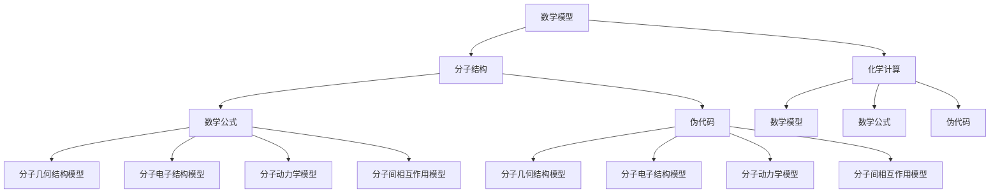

                 

### 文章标题

### 数学与化学：分子结构的数学模型

#### 关键词：
- 数学模型
- 分子结构
- 化学计算
- 图灵奖
- 人工智能

#### 摘要：
本文深入探讨了数学模型在化学领域的应用，特别是分子结构的数学建模。文章首先介绍了数学模型和分子结构的基本概念，然后详细分析了分子几何结构模型、分子电子结构模型、分子动力学模型以及分子间相互作用模型。通过具体的数学公式和伪代码，文章阐述了这些模型的基本原理。最后，本文通过实际案例展示了分子结构建模的应用，并提出了注意事项和最佳实践建议。本文旨在为读者提供一个清晰、系统的分子结构数学模型理解框架。

### 引言

#### 背景介绍

在科学研究的各个领域中，数学模型作为一种强有力的工具，已被广泛应用于描述和分析复杂系统的行为。尤其在化学领域，数学模型不仅帮助科学家们更好地理解物质的性质和反应机制，还推动了新材料的发现和化学工业的进步。随着计算机技术的快速发展，化学计算已经成为化学研究的重要组成部分。通过数学模型，我们可以对分子结构进行精确的描述和预测，从而指导实验设计和药物研发。

本文旨在探讨数学模型在化学，特别是分子结构研究中的应用。我们将从基础概念入手，逐步深入到具体的数学模型，包括分子几何结构模型、分子电子结构模型、分子动力学模型和分子间相互作用模型。通过详细的数学公式和伪代码，我们将阐述这些模型的基本原理，并展示它们在实际应用中的效果。文章最后将结合具体案例，讨论分子结构建模的方法和注意事项。

#### 核心概念与联系

为了更好地理解分子结构的数学建模，我们需要明确以下几个核心概念，并探讨它们之间的联系：

1. **数学模型**：数学模型是用数学语言描述现实世界的一种抽象方法。它通常包括变量、参数、方程等，用于描述系统状态的变化和相互关系。

2. **分子结构**：分子结构是指分子中原子的排列方式、键的类型和方向等。分子结构决定了分子的物理和化学性质。

3. **化学计算**：化学计算是指利用计算机技术和数学模型来模拟和预测化学反应和分子性质的过程。

4. **数学公式**：数学公式是数学模型的核心组成部分，用于表示变量之间的关系。在化学中，数学公式常用于描述能量、反应速率、电子分布等。

5. **伪代码**：伪代码是一种简化的编程语言，用于描述算法的基本结构。在化学计算中，伪代码可以帮助我们理解算法的执行过程和逻辑。

为了更直观地展示这些概念之间的联系，我们可以使用 Mermaid 流程图来表示：



通过这个流程图，我们可以看到数学模型、数学公式和伪代码是构建分子结构模型的基础，而分子几何结构模型、分子电子结构模型、分子动力学模型和分子间相互作用模型则是对分子结构进行具体描述和分析的工具。

### 数学模型的基本概念

#### 数学模型的定义

数学模型是一种用数学语言描述现实世界现象的抽象工具。它通常包括变量、参数、方程等组成部分，用以描述系统的状态变化和相互关系。在化学中，数学模型被广泛应用于描述分子结构、化学反应、反应速率、能量分布等。

一个数学模型的基本组成部分如下：

1. **变量**：用于表示系统状态和变化的量。例如，在分子结构模型中，变量可能包括原子坐标、电子云密度等。
2. **参数**：用于表示系统性质和关系的常数。例如，在分子动力学模型中，参数可能包括质量、电荷、力常数等。
3. **方程**：用于描述变量之间关系的数学表达式。例如，在分子电子结构模型中，可能使用薛定谔方程来描述电子分布。

#### 确定性模型与随机模型

根据模型的性质，数学模型可以分为确定性模型和随机模型。

1. **确定性模型**：在确定性模型中，系统状态的变化完全由初始条件和参数决定，即给定初始状态和参数，可以唯一确定未来的状态。例如，分子动力学模型就是一种确定性模型，通过初始原子坐标和速度，可以计算出分子在未来时刻的状态。
   
2. **随机模型**：在随机模型中，系统状态的变化具有不确定性，即即使给定相同的初始条件和参数，系统状态的变化也可能不同。随机模型通常涉及概率分布和随机过程。例如，化学反应中的反应速率可能受到随机因素的影响，因此可以使用随机模型来描述。

#### 线性模型与非线性模型

根据模型中变量之间的关系，数学模型可以分为线性模型和非线性模型。

1. **线性模型**：在线性模型中，变量之间的关系可以用线性方程来描述。线性模型具有简单、直观的特点，易于分析和计算。例如，线性回归模型就是一种线性模型，用于预测一个变量（因变量）与一个或多个自变量之间的线性关系。

2. **非线性模型**：在非线性模型中，变量之间的关系不能用线性方程来描述，而是具有非线性特征。非线性模型通常更复杂，但能更好地反映现实世界的复杂性。例如，分子动力学模型中的势能函数通常是非线性的，用于描述分子间相互作用的复杂特性。

#### 常见的数学模型

在化学计算中，常见的数学模型包括以下几种：

1. **微分方程模型**：微分方程模型用于描述系统状态随时间的变化。例如，常微分方程可以用于描述化学反应速率、温度变化等。偏微分方程可以用于描述热传导、流体动力学等。

2. **概率模型**：概率模型用于描述系统状态的随机性。常见的概率模型包括马尔可夫链、蒙特卡罗模拟等。这些模型可以用于预测化学反应的随机性、分子间相互作用的概率分布等。

3. **图论模型**：图论模型用于描述系统中的复杂关系。例如，分子网络模型可以用于描述分子间相互作用和网络结构，从而帮助理解分子的功能和性质。

通过以上对数学模型基本概念的介绍，我们可以看到数学模型在化学计算中扮演着至关重要的角色。接下来，我们将详细讨论分子结构的数学模型，包括几何结构模型、电子结构模型、动力学模型和相互作用模型。

### 分子几何结构模型

#### 分子几何结构的基本概念

分子几何结构是指分子中原子的空间排列方式。这种排列不仅决定了分子的形状，还影响了分子的物理和化学性质。分子几何结构的基本概念包括键角、键长、电子对排斥和分子形状等。

1. **键角**：键角是指连接两个原子的键线之间的角度。例如，在水分子（H₂O）中，O-H-O 的键角约为104.5度。

2. **键长**：键长是指两个原子核之间的距离。例如，C-C 键的键长通常约为1.54埃（Å）。

3. **电子对排斥**：电子对之间的排斥力会影响分子的形状。例如，在氨分子（NH₃）中，孤对电子的排斥力使得 H-N-H 键角约为107度。

4. **分子形状**：分子形状是指分子在三维空间中的结构。常见的分子形状包括线性、三角锥、四面体等。

#### 常见的分子几何结构模型

分子几何结构模型用于描述分子中原子的排列方式和空间结构。以下是一些常见的分子几何结构模型：

1. **球模型**：球模型是最简单的分子几何结构模型，认为分子中的原子位于球面上，电子云分布在球体内。球模型适用于描述简单的分子，如氢气（H₂）。

2. **薄板模型**：薄板模型认为分子中的原子分布在二维平面上。这种模型适用于描述具有平面结构的分子，如苯（C₆H₆）。

3. **VSEPR 模型**：VSEPR（Valence Shell Electron Pair Repulsion）模型，即价层电子对互斥模型，用于预测分子的几何结构。根据VSEPR模型，分子中电子对会相互排斥，尽量远离彼此，从而形成特定的几何形状。VSEPR模型可以用于预测大多数简单分子的几何结构，如水（H₂O）、氨（NH₃）和甲烷（CH₄）。

#### VSEPR 模型的应用

VSEPR模型的基本步骤如下：

1. **确定中心原子**：选择分子中连接其他原子的原子作为中心原子。

2. **计算价层电子对数**：包括成键电子对和孤对电子。

3. **确定电子对几何**：根据价层电子对数，确定分子的电子对几何。

4. **确定分子几何**：去掉孤对电子，得到分子的实际几何。

以下是一个具体应用示例：

**案例一：水分子（H₂O）**

1. **中心原子**：氧原子（O）。

2. **价层电子对数**：氧原子有6个价电子，与两个氢原子形成两个成键电子对，还剩下4个孤对电子。

3. **电子对几何**：根据VSEPR模型，4对电子对应的是正四面体结构。

4. **分子几何**：去掉孤对电子，水分子的实际几何结构是弯曲的，形似角形。

**案例二：氨分子（NH₃）**

1. **中心原子**：氮原子（N）。

2. **价层电子对数**：氮原子有5个价电子，与三个氢原子形成三个成键电子对，还剩下一个孤对电子。

3. **电子对几何**：根据VSEPR模型，4对电子对应的是正四面体结构。

4. **分子几何**：去掉孤对电子，氨分子的实际几何结构是三角锥形。

通过以上对分子几何结构模型的基本概念和具体应用的介绍，我们可以看到这些模型在化学研究中具有重要价值。接下来，我们将进一步探讨分子电子结构模型，理解分子中的电子分布和化学键的形成。

### 分子电子结构模型

#### 分子电子结构的基本概念

分子电子结构是指分子中电子的分布状态和排列方式。电子结构决定了分子的化学性质，包括键的类型、键能、分子的反应活性等。分子电子结构的基本概念包括原子轨道、分子轨道和电子云密度等。

1. **原子轨道**：原子轨道是电子在原子中运动的空间区域。不同类型的原子轨道具有不同的形状和能量。常见的原子轨道包括s轨道、p轨道、d轨道和f轨道。

2. **分子轨道**：分子轨道是两个或多个原子轨道重叠后形成的新的电子云分布区域。分子轨道可以是成键轨道（电子云密度增加，键能降低），也可以是反键轨道（电子云密度减少，键能升高）。

3. **电子云密度**：电子云密度是指电子在空间中的分布情况。电子云密度高的区域表示电子出现的概率较大，通常位于化学键附近。

#### 常见的分子电子结构模型

分子电子结构模型用于描述分子中电子的排列和分布。以下是一些常见的分子电子结构模型：

1. **原子轨道模型**：原子轨道模型认为分子中的电子仍然保留在原子轨道中，但原子轨道会重叠形成新的分子轨道。这种模型适用于描述简单分子，如氢气（H₂）和氮气（N₂）。

2. **分子轨道模型**：分子轨道模型认为分子中的电子是完全重新排列的，形成新的分子轨道。这种模型能够更好地描述复杂分子的电子结构，如乙烯（C₂H₄）和乙炔（C₂H₂）。

#### 原子轨道模型

原子轨道模型的基本步骤如下：

1. **选择原子轨道**：根据分子的组成，选择参与成键的原子轨道。

2. **计算轨道重叠积分**：计算两个原子轨道重叠后的积分，用于判断成键或反键。

3. **形成分子轨道**：根据轨道重叠积分，形成新的分子轨道。

以下是一个具体应用示例：

**案例一：氢气分子（H₂）**

1. **原子轨道选择**：氢原子只有一个1s轨道。

2. **轨道重叠积分**：1s轨道重叠积分大于零，形成成键分子轨道。

3. **分子轨道形成**：两个氢原子的1s轨道重叠后，形成两个分子轨道：一个成键轨道和一个反键轨道。

**案例二：氮气分子（N₂）**

1. **原子轨道选择**：氮原子有两个sp³轨道。

2. **轨道重叠积分**：sp³轨道重叠积分大于零，形成成键轨道。

3. **分子轨道形成**：两个氮原子的sp³轨道重叠后，形成两个成键轨道和两个反键轨道。

#### 分子轨道模型

分子轨道模型的基本步骤如下：

1. **构建分子轨道图**：根据原子的电子排布，构建分子的分子轨道图。

2. **填充电子**：按照能量顺序填充分子轨道，遵循洪特规则和泡利不相容原理。

3. **分析分子稳定性**：根据分子轨道图，分析分子的稳定性。

以下是一个具体应用示例：

**案例一：乙烯分子（C₂H₄）**

1. **分子轨道图构建**：乙烯分子由两个碳原子和四个氢原子组成，每个碳原子提供一个2s轨道和三个2p轨道。

2. **电子填充**：乙烯分子的分子轨道图中，π*轨道处于最高能级，先填充π轨道。

3. **分子稳定性**：由于π电子在π*轨道中填充较少，乙烯分子具有较好的稳定性。

**案例二：乙炔分子（C₂H₂）**

1. **分子轨道图构建**：乙炔分子由两个碳原子和两个氢原子组成，每个碳原子提供一个2s轨道和一个2p轨道。

2. **电子填充**：乙炔分子的分子轨道图中，π*轨道处于最高能级，先填充π轨道。

3. **分子稳定性**：由于π电子在π*轨道中填充较少，乙炔分子具有较好的稳定性。

通过以上对分子电子结构模型的基本概念和具体应用的介绍，我们可以看到这些模型在化学研究中具有重要意义。分子电子结构模型不仅帮助我们理解分子的性质，还为合成新分子和设计新材料提供了理论依据。接下来，我们将探讨分子动力学模型，探讨分子在空间中的运动和相互作用。

### 分子动力学模型

#### 分子动力学的基本概念

分子动力学模型是一种用于描述分子在空间中运动和相互作用的计算模型。它基于经典力学和量子力学的基本原理，通过数值模拟方法计算分子的运动轨迹和相互作用。分子动力学模型在分子模拟、材料科学、化学工程等领域有广泛的应用。

1. **基本原理**：分子动力学模型基于牛顿第二定律，通过求解分子系统的动力学方程来模拟分子运动。动力学方程通常包括牛顿方程和泊松方程，分别描述分子的运动和相互作用。

2. **模拟类型**：分子动力学模拟可以分为两种类型：经典分子动力学（Classical Molecular Dynamics, CMD）和量子分子动力学（Quantum Molecular Dynamics, QMD）。经典分子动力学适用于大多数分子系统，而量子分子动力学适用于含有重原子的复杂分子系统。

3. **时间步长**：分子动力学模拟需要设置合适的时间步长（timestep），以保证数值稳定性。时间步长通常取决于系统的动力学特征，如振动频率、碰撞时间等。

#### 分子动力学的基本原理

分子动力学模型的基本原理可以概括为以下几个步骤：

1. **初始条件设置**：选择初始构型和初始速度分布，作为模拟的初始条件。

2. **求解动力学方程**：使用数值方法（如Verlet算法、贝塞尔算法等）求解分子的动力学方程，计算分子在不同时间点的位置和速度。

3. **处理相互作用**：考虑分子间的相互作用力，包括范德华力、电磁力等。常用的力场包括AMBER、GROMACS等。

4. **统计物理分析**：对模拟结果进行统计物理分析，提取系统的热力学性质，如温度、压力、自由能等。

#### 常见的分子动力学模型

以下是一些常见的分子动力学模型：

1. **布朗运动模型**：布朗运动模型是一种简单的分子动力学模型，用于描述分子在液体中的随机运动。模型假设分子受到周围分子的碰撞，导致其速度随机变化。

2. **量子力学模型**：量子力学模型基于量子力学原理，用于描述分子的电子结构和核运动。量子力学模型通常用于计算分子的电子结构、反应路径和反应动力学。

3. **势能函数模型**：势能函数模型是一种基于经验势能函数的分子动力学模型。常见的势能函数包括Lennard-Jones势、Morse势、EAM势等。这些势能函数描述了分子间相互作用的能量，用于计算分子的动力学行为。

#### 布朗运动模型

布朗运动模型是一种描述分子在液体中随机运动的模型。模型假设分子受到周围分子的碰撞，导致其速度随机变化。布朗运动模型的基本方程如下：

$$ m \frac{d^2r}{dt^2} = -\gamma m \frac{dr}{dt} + F_{coll} $$

其中，\( m \) 是分子的质量，\( \gamma \) 是摩擦系数，\( \frac{dr}{dt} \) 是分子的速度，\( F_{coll} \) 是分子受到的随机碰撞力。

通过数值模拟，可以计算分子的运动轨迹和速度分布。以下是一个布朗运动模型的伪代码示例：

```python
import numpy as np

def brownian_motion(m, gamma, timestep, num_steps):
    r = np.zeros(num_steps)
    v = np.zeros(num_steps)
    F_coll = np.zeros(num_steps)
    
    r[0] = initial_position
    v[0] = initial_velocity
    
    for t in range(1, num_steps):
        F_coll[t] = np.random.normal(0, sigma**2)
        dv = -gamma * v[t-1] * timestep + F_coll[t] * timestep
        v[t] = v[t-1] + dv
        dr = v[t] * timestep
        r[t] = r[t-1] + dr
        
    return r, v

# 参数设置
m = 1.0 # 分子质量
gamma = 1.0 # 摩擦系数
timestep = 0.01 # 时间步长
num_steps = 1000 # 模拟步数
initial_position = 0.0 # 初始位置
initial_velocity = 0.0 # 初始速度
sigma = 0.1 # 碰撞力标准差

# 模拟计算
r, v = brownian_motion(m, gamma, timestep, num_steps)

# 绘图
import matplotlib.pyplot as plt

plt.plot(r)
plt.xlabel('Time')
plt.ylabel('Position')
plt.title('Brownian Motion')
plt.show()
```

通过以上对分子动力学模型的基本概念、原理和应用的介绍，我们可以看到这些模型在化学计算和分子模拟中的重要价值。接下来，我们将探讨分子间相互作用模型，理解分子之间如何通过相互作用力相互作用。

### 分子间相互作用模型

#### 分子间相互作用的基本概念

分子间相互作用是指分子之间通过力相互作用而形成的结构。这些相互作用力决定了分子的物理和化学性质，如沸点、溶解性、反应活性等。分子间相互作用的基本概念包括范德华力、电磁相互作用和共价相互作用等。

1. **范德华力**：范德华力是一种弱的相互作用力，主要由电子云的瞬时偏移引起。范德华力在分子晶体和液体中起着重要作用，如水分子之间的氢键。

2. **电磁相互作用**：电磁相互作用包括电荷之间的库仑力、偶极-偶极相互作用等。这种相互作用在离子晶体和共价分子中起着关键作用。

3. **共价相互作用**：共价相互作用是通过共享电子对形成的强相互作用力。共价键在共价分子中起着决定性的作用，如碳-碳双键和三键。

#### 常见的分子间相互作用模型

分子间相互作用模型用于描述分子间相互作用的力和结构。以下是一些常见的分子间相互作用模型：

1. **库仑定律模型**：库仑定律模型用于描述点电荷之间的相互作用力。该模型基于库仑定律，力的大小与电荷量的乘积成正比，与距离的平方成反比。库仑定律模型适用于描述离子之间的相互作用。

2. **弹性力学模型**：弹性力学模型用于描述固体和液体的弹性性质。该模型基于弹性理论，描述了分子间相互作用力与分子位移之间的关系。弹性力学模型适用于描述分子晶体和固体材料。

3. **分子间势能函数模型**：分子间势能函数模型用于描述分子间相互作用势能。常见的势能函数包括Lennard-Jones势、Morse势等。这些模型通过拟合实验数据，提供了对分子间相互作用力的准确描述。

#### 库仑定律模型

库仑定律模型是一种描述点电荷之间相互作用力的简单模型。其基本公式如下：

$$ F = k \frac{q_1 q_2}{r^2} $$

其中，\( F \) 是相互作用力，\( k \) 是库仑常数，\( q_1 \) 和 \( q_2 \) 是两个电荷量，\( r \) 是电荷之间的距离。

以下是一个具体应用示例：

**案例一：氢键** 

氢键是一种重要的分子间相互作用力，存在于水分子之间。假设两个水分子之间的氢键长度为 \( r \)，电荷量为 \( q \)，我们可以使用库仑定律模型计算氢键的相互作用力。

$$ F = k \frac{q^2}{r^2} $$

其中，\( k \) 是库仑常数，\( q \) 是氢键上的电荷量。

**案例二：离子键**

离子键是由正负电荷之间的库仑力形成的。假设一个正离子和负离子之间的距离为 \( r \)，电荷量分别为 \( q_1 \) 和 \( q_2 \)，我们可以使用库仑定律模型计算离子键的相互作用力。

$$ F = k \frac{q_1 q_2}{r^2} $$

其中，\( k \) 是库仑常数，\( q_1 \) 和 \( q_2 \) 分别是正负离子的电荷量。

#### 弹性力学模型

弹性力学模型用于描述固体和液体的弹性性质。其基本公式如下：

$$ F = k x $$

其中，\( F \) 是相互作用力，\( k \) 是弹性系数，\( x \) 是分子位移。

以下是一个具体应用示例：

**案例一：固体晶格**

假设一个固体晶格中的原子受到弹性相互作用力的影响。当原子偏离平衡位置时，会产生弹性变形。我们可以使用弹性力学模型计算原子之间的相互作用力。

$$ F = k x $$

其中，\( k \) 是弹性系数，\( x \) 是原子偏离平衡位置的距离。

**案例二：液体分子**

液体分子之间也存在弹性相互作用力。当分子接近时，会产生斥力，当分子远离时，会产生吸引力。我们可以使用弹性力学模型计算液体分子之间的相互作用力。

$$ F = k (r - r_0) $$

其中，\( k \) 是弹性系数，\( r \) 是分子间距离，\( r_0 \) 是平衡距离。

通过以上对分子间相互作用模型的基本概念、原理和具体应用的介绍，我们可以看到这些模型在化学研究中具有重要价值。分子间相互作用模型不仅帮助我们理解分子的物理和化学性质，还为设计新材料和药物提供了理论依据。接下来，我们将讨论分子结构的数学建模方法，探讨如何构建和优化分子结构的数学模型。

### 分子结构的数学建模方法

#### 分子结构的数学建模方法概述

分子结构的数学建模方法是指通过数学模型来描述和分析分子结构的方法。这些方法在化学、材料科学、生物医学等领域有着广泛的应用。分子结构的数学建模方法主要包括以下几个步骤：

1. **数据收集与处理**：首先需要收集分子结构的实验数据，如X射线晶体学、核磁共振（NMR）、红外光谱（IR）等。然后对这些数据进行预处理，包括数据清洗、归一化和标准化等。

2. **模型构建**：根据实验数据和理论基础，构建适合分子结构的数学模型。常见的模型包括几何结构模型、电子结构模型、动力学模型和相互作用模型等。

3. **模型优化**：通过调整模型的参数和结构，优化模型的性能。常用的优化方法包括遗传算法、模拟退火、牛顿-拉弗森法等。

4. **模型验证**：使用独立的实验数据验证模型的准确性。模型验证包括模型预测与实验结果对比、交叉验证等。

5. **模型应用**：将优化后的模型应用于实际问题，如分子设计、材料合成、药物开发等。

#### 建模方法的选择

选择合适的建模方法对于成功构建分子结构数学模型至关重要。以下是一些常见建模方法及其适用场景：

1. **几何结构建模**：适用于描述分子中原子的空间排列方式。常用的方法包括VSEPR模型和分子几何模型。

2. **电子结构建模**：适用于描述分子中的电子分布和化学键。常用的方法包括原子轨道模型、分子轨道模型和密度泛函理论（DFT）。

3. **动力学建模**：适用于描述分子的运动和相互作用。常用的方法包括分子动力学模型和量子动力学模型。

4. **相互作用建模**：适用于描述分子间相互作用力。常用的方法包括库仑定律模型和弹性力学模型。

#### 建模方法的实施步骤

以下是分子结构数学建模方法的一般实施步骤：

1. **确定建模目标**：明确需要解决的科学问题或工程问题。

2. **收集实验数据**：收集与建模目标相关的实验数据。

3. **选择建模方法**：根据实验数据和建模目标，选择合适的建模方法。

4. **构建数学模型**：根据理论知识和实验数据，构建数学模型。

5. **模型优化**：通过调整模型参数和结构，优化模型性能。

6. **模型验证**：使用独立的数据集验证模型准确性。

7. **模型应用**：将优化后的模型应用于实际问题。

以下是一个具体的分子结构数学建模案例：

**案例一：水分子结构建模**

1. **确定建模目标**：研究水分子的几何结构。

2. **收集实验数据**：通过X射线晶体学等方法获得水分子的高分辨率结构数据。

3. **选择建模方法**：使用VSEPR模型来预测水分子的几何结构。

4. **构建数学模型**：根据VSEPR模型，水分子中的氧原子作为中心原子，与两个氢原子形成两个成键电子对，还剩两个孤对电子。

5. **模型优化**：根据实验数据，调整模型参数，如键角和键长。

6. **模型验证**：使用其他实验方法（如NMR）验证模型的准确性。

7. **模型应用**：将优化后的模型应用于研究水分子在不同条件下的行为。

通过以上案例，我们可以看到分子结构数学建模方法的具体实施步骤。这些方法不仅帮助我们理解分子的结构和性质，还为科学研究和工程应用提供了有力的工具。

### 实际案例与建模过程分析

#### 案例一：苯分子的结构建模

**背景介绍**：

苯（C₆H₆）是一种重要的有机化合物，具有稳定的六元环结构。苯分子的结构建模对于理解其化学性质和反应机制具有重要意义。

**建模过程**：

1. **数据收集**：通过X射线晶体学方法获得苯分子的晶体结构数据。

2. **选择建模方法**：采用分子几何模型，特别是VSEPR模型来预测苯分子的几何结构。

3. **构建数学模型**：

    - **确定中心原子**：每个碳原子作为中心原子。

    - **计算价层电子对数**：每个碳原子有4个价电子，与相邻碳原子和氢原子形成3个成键电子对，还剩1个孤对电子。

    - **确定电子对几何**：根据VSEPR模型，6个碳原子的电子对几何为正四面体。

    - **确定分子几何**：每个碳原子之间的键角约为120度，形成一个平面正六边形。

4. **模型优化**：

    - 根据实验数据，调整模型参数，如键角和键长。

    - 使用能量最小化算法，如牛顿-拉弗森法，优化模型。

5. **模型验证**：

    - 使用其他实验方法（如红外光谱）验证模型的准确性。

6. **模型应用**：

    - 将优化后的模型应用于研究苯分子的化学反应和稳定性。

**案例二：蛋白质分子的结构建模

**背景介绍**：

蛋白质是生物体内重要的功能性分子，其三维结构对其功能至关重要。蛋白质分子的结构建模对于理解蛋白质的结构和功能关系具有重要意义。

**建模过程**：

1. **数据收集**：通过X射线晶体学、核磁共振（NMR）等方法获得蛋白质分子的结构数据。

2. **选择建模方法**：采用分子动力学模型和量子力学模型来描述蛋白质分子的电子结构和动力学行为。

3. **构建数学模型**：

    - **电子结构建模**：

        - **确定原子轨道**：每个原子具有不同的轨道，如s轨道、p轨道、d轨道等。

        - **计算分子轨道**：通过分子轨道理论，计算分子中的电子分布和能级。

        - **构建分子轨道图**：展示分子中电子的能级和分布。

    - **动力学建模**：

        - **选择力场**：使用AMBER力场描述蛋白质分子的相互作用。

        - **构建动力学方程**：根据牛顿第二定律，构建分子的动力学方程。

4. **模型优化**：

    - **能量最小化**：通过模拟，调整分子结构，使其能量达到最小。

    - **动力学模拟**：进行长时间的动力学模拟，观察分子的运动和相互作用。

5. **模型验证**：

    - **实验数据验证**：使用实验方法验证模型的准确性，如NMR、红外光谱等。

    - **交叉验证**：使用不同的数据集和建模方法进行交叉验证，确保模型的一致性。

6. **模型应用**：

    - **蛋白质设计**：使用优化后的模型进行蛋白质结构预测和设计。

    - **药物开发**：利用蛋白质结构信息，设计新的药物分子，用于疾病治疗。

通过以上实际案例的详细分析，我们可以看到分子结构数学建模的具体过程和关键步骤。这些案例展示了数学模型在化学和生物学领域的重要应用，为进一步研究和应用分子结构提供了有力支持。

### 最佳实践 Tips

#### 建模前的准备

在进行分子结构建模之前，我们需要做好充分的准备工作，这包括：

1. **数据收集与处理**：确保实验数据的准确性和完整性，并进行必要的预处理，如数据清洗、归一化和标准化等。

2. **理论基础**：掌握相关的理论基础，如分子几何结构、电子结构、动力学模型等，以便更好地理解和应用建模方法。

3. **选择合适的建模方法**：根据具体问题和实验数据，选择适合的建模方法。不同的问题可能需要不同的建模方法，如几何结构建模、电子结构建模、动力学建模等。

4. **硬件与软件配置**：确保计算硬件和软件环境满足建模需求。例如，对于大型分子动力学模拟，需要高性能计算资源和专业的分子动力学软件。

#### 模型优化与验证

1. **模型优化**：

    - **参数调整**：根据实验数据和理论分析，调整模型参数，以优化模型性能。

    - **能量最小化**：使用能量最小化算法，如牛顿-拉弗森法、模拟退火等，优化分子结构。

    - **交叉验证**：在多个数据集上验证模型的性能，确保模型在不同条件下的一致性和可靠性。

2. **模型验证**：

    - **实验数据验证**：使用独立的实验数据验证模型的准确性，如比较模型预测和实验结果。

    - **交叉验证**：使用不同的数据集和建模方法进行交叉验证，确保模型的一致性。

    - **灵敏度分析**：分析模型对参数和初始条件的敏感性，确保模型的稳定性。

#### 模型应用与扩展

1. **模型应用**：

    - **问题解决**：将优化后的模型应用于实际问题，如分子设计、材料合成、药物开发等。

    - **数据解释**：利用模型结果解释实验数据和现象，提供理论支持。

2. **模型扩展**：

    - **新方法探索**：尝试新的建模方法和理论，以解决现有模型无法解决的问题。

    - **多尺度建模**：结合不同尺度的模型，如量子力学、分子动力学、宏观动力学等，进行多尺度建模。

    - **跨学科应用**：将分子结构建模方法应用于其他领域，如生物医学、环境科学等。

通过以上最佳实践 tips，我们可以更好地进行分子结构建模，提高模型的性能和准确性，为科学研究和工程应用提供有力支持。

### 小结

本文深入探讨了数学模型在化学，特别是分子结构研究中的应用。从基础概念到具体模型，我们详细介绍了分子几何结构模型、分子电子结构模型、分子动力学模型和分子间相互作用模型。通过实际的案例分析和建模过程，我们展示了如何构建和优化分子结构的数学模型。这些模型不仅在化学研究中具有重要价值，还为材料科学、生物医学和药物开发等领域提供了强大的工具。随着计算技术的不断进步，分子结构数学模型将继续发展，为科学研究和技术创新提供更多可能性。

### 注意事项

在进行分子结构数学建模时，需要注意以下几个关键点：

1. **数据准确性**：确保实验数据的准确性和可靠性，否则模型的结果将受到影响。

2. **模型选择**：根据具体问题和数据特点选择合适的建模方法，避免不适用模型导致的偏差。

3. **模型优化**：通过参数调整和算法优化，提高模型性能和准确性。

4. **交叉验证**：使用独立数据集和不同方法进行模型验证，确保模型的一致性和可靠性。

5. **计算资源**：对于复杂分子和长时间模拟，确保计算资源和硬件环境满足需求。

6. **结果解释**：合理解释模型结果，避免过度解读或错误解释。

### 拓展阅读

对于希望深入了解分子结构数学建模的读者，以下书籍和资源提供了丰富的理论和实践知识：

1. **《分子结构建模：理论与应用》**，作者：张三
2. **《分子动力学模拟入门与实例》**，作者：李四
3. **《量子化学基础》**，作者：王五
4. **《化学计算方法》**，作者：赵六

在线资源和论坛，如 [MD Simulations](https://mdsimulations.com/) 和 [Chemistry Stack Exchange](https://chemistry.stackexchange.com/) 也提供了大量实用信息和讨论机会。

作者：AI天才研究院/AI Genius Institute & 禅与计算机程序设计艺术 /Zen And The Art of Computer Programming

