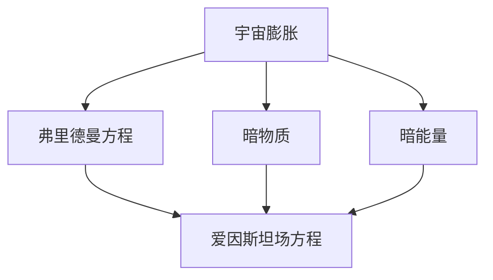

                 

### 数学与天文数据分析：宇宙结构的数学解析

宇宙的奥秘一直是人类探索的永恒主题。自古以来，天文学家通过观测星星、行星和星系，试图解开宇宙的种种谜团。然而，随着科技的进步和数学工具的发展，我们逐渐认识到，要深入理解宇宙的结构，数学分析是不可或缺的工具。本文将探讨数学与天文数据分析在揭示宇宙结构方面的应用，通过一步步的逻辑推理，揭示宇宙结构的数学解析。

**关键词：** 宇宙结构、数学模型、天文数据分析、膨胀宇宙、暗物质、暗能量、弗里德曼方程、爱因斯坦场方程。

**摘要：** 本文首先介绍了宇宙的基本概念，并引入了必要的数学工具。接着，我们详细讨论了宇宙结构的数学模型，包括宇宙膨胀、暗物质和暗能量的描述。然后，我们探讨了天文数据分析的方法，如光谱分析、时延分析和距离测量。随后，文章深入解析了宇宙结构的数学原理，如爱因斯坦场方程和弗里德曼方程。最后，我们通过具体实例展示了如何应用这些数学模型和原理进行天文数据分析，并对未来的研究方向进行了展望。

### 背景介绍

宇宙是一个复杂而庞大的系统，其结构和演化过程涉及众多未知因素。从宏观角度看，宇宙由无数星系、恒星、行星和宇宙尘埃组成。这些天体在广袤的空间中运动，相互吸引、碰撞和演化。为了理解这种复杂的动态系统，科学家们引入了数学模型来描述宇宙的结构和演化过程。

宇宙的膨胀是一个基本的观测事实。观测数据显示，宇宙在大约138亿年前从一个极热、极密的初始状态开始膨胀。这种膨胀不仅改变了宇宙的尺度，还影响了宇宙中的物质分布和结构形成。为了定量描述宇宙膨胀，科学家们提出了宇宙学模型，这些模型依赖于数学方程来描述宇宙的动力学行为。

此外，宇宙中还存在大量的未知物质，即暗物质和暗能量。暗物质不发光，但通过引力作用影响宇宙的演化。暗能量则是一种具有负压强的神秘物质，它推动宇宙加速膨胀。这些现象的发现挑战了传统的物理理论，促使科学家们发展新的数学模型来描述宇宙中的这些神秘现象。

因此，数学与天文数据分析在宇宙结构的研究中发挥着至关重要的作用。数学模型不仅帮助我们理解宇宙的宏观结构，还为天文学家提供了精确的预测工具。通过数据分析，科学家们可以从海量观测数据中提取有用信息，揭示宇宙的奥秘。

### 核心概念与联系

要深入理解宇宙的结构，我们需要明确几个核心概念，并探讨它们之间的联系。以下是本文中将要涉及的关键概念：

1. **宇宙膨胀**：宇宙膨胀是指宇宙在大爆炸后不断扩张的现象。这个概念最早由埃德温·哈勃提出，他通过观测发现，遥远星系的光谱线显示出红移，这表明它们正远离我们。这种红移与星系的距离成正比，揭示了宇宙的膨胀。

2. **弗里德曼方程**：弗里德曼方程是描述宇宙膨胀的基本方程之一，它由亚历山大·弗里德曼在20世纪初提出。这个方程结合了广义相对论和宇宙学原理，描述了宇宙的尺度随时间的变化。

3. **暗物质**：暗物质是一种不发光、不吸光的神秘物质，它通过引力作用影响宇宙的结构。暗物质的存在最初是通过观测星系旋转曲线和宇宙微波背景辐射推断出来的。

4. **暗能量**：暗能量是一种具有负压强的神秘物质，它推动宇宙加速膨胀。暗能量的存在是通过观测宇宙膨胀速率的加速推断出来的。

5. **爱因斯坦场方程**：爱因斯坦场方程是广义相对论的核心方程，它描述了物质和能量如何影响时空的几何结构。这个方程为理解宇宙的引力作用提供了数学框架。

这些概念之间的联系构成了理解宇宙结构的核心。宇宙膨胀是宇宙演化的基础，而弗里德曼方程则提供了描述宇宙膨胀的数学工具。暗物质和暗能量是宇宙膨胀的关键因素，它们的存在和性质影响着宇宙的结构和演化。爱因斯坦场方程则为我们提供了理解引力作用的数学模型，这些模型共同揭示了宇宙的奥秘。

下面是一个Mermaid流程图，展示了这些核心概念之间的联系：



这个流程图直观地展示了宇宙膨胀、弗里德曼方程、暗物质、暗能量和爱因斯坦场方程之间的相互关系，帮助我们更好地理解宇宙结构的数学解析。

### 核心算法原理讲解

在理解了宇宙结构的数学概念后，接下来我们将详细讲解几个核心算法原理，这些原理对于解析宇宙结构至关重要。

#### 1. 爱因斯坦场方程

爱因斯坦场方程是广义相对论的核心方程，描述了物质和能量如何影响时空的几何结构。这个方程可以写成如下形式：

$$
G_{\mu\nu} + \Lambda g_{\mu\nu} = \frac{8\pi G}{c^4} T_{\mu\nu}
$$

其中，$G_{\mu\nu}$ 是爱因斯坦张量，$T_{\mu\nu}$ 是能量-动量张量，$g_{\mu\nu}$ 是度规张量，$\Lambda$ 是宇宙学常数，$G$ 是引力常数，$c$ 是光速。

为了更直观地理解这个方程，我们可以将其分解为以下几个部分：

- **爱因斯坦张量**：描述了时空的曲率，反映了引力场的强度。
- **能量-动量张量**：描述了物质和能量的分布，决定了时空的动态行为。
- **度规张量**：描述了时空的几何结构，决定了物体的运动轨迹。
- **宇宙学常数**：反映了暗能量的影响，影响了宇宙的膨胀速率。

通过这个方程，我们可以将物质和能量与时空的几何结构联系起来，从而理解宇宙的引力现象。

#### 2. 弗里德曼方程

弗里德曼方程是描述宇宙膨胀的基本方程，它基于爱因斯坦场方程，通过引入宇宙学参数来描述宇宙的尺度随时间的变化。弗里德曼方程可以写成如下形式：

$$
\dot{H} = -\frac{1}{a^2} (\rho + 3p)
$$

其中，$H$ 是哈勃参数，$\dot{H}$ 是哈勃参数的时间导数，$a$ 是宇宙尺度因子，$\rho$ 是物质密度，$p$ 是压强。

这个方程的物理意义如下：

- **哈勃参数**：描述了宇宙膨胀的速度，它与宇宙的尺度成正比。
- **宇宙尺度因子**：描述了宇宙的尺度随时间的变化，随着宇宙的膨胀，$a$ 逐渐增大。
- **物质密度**：描述了宇宙中物质的总密度，它与宇宙的尺度成反比。
- **压强**：反映了宇宙中粒子的运动状态，通常与暗能量有关。

通过弗里德曼方程，我们可以定量描述宇宙的膨胀过程，从而理解宇宙的结构和演化。

#### 3. 宇宙微波背景辐射

宇宙微波背景辐射（Cosmic Microwave Background，CMB）是宇宙早期遗留下来的辐射，它为我们提供了宇宙早期状态的重要信息。CMB的分析依赖于以下几个核心算法原理：

- **多普勒效应**：通过测量CMB的光谱线红移，我们可以推断出宇宙的膨胀速度。
- **宇宙学原理**：宇宙学原理认为宇宙在大尺度上是均匀且各向同性的，这为CMB的分析提供了理论基础。
- **黑体辐射**：CMB的辐射性质符合黑体辐射规律，通过分析CMB的温度分布，我们可以推断出宇宙的早期状态。

这些算法原理共同作用，使得我们能够从CMB中提取出关于宇宙结构的重要信息。

#### Python源代码示例

为了更好地理解这些核心算法原理，我们使用Python编写了一些源代码示例。以下是弗里德曼方程的Python实现：

```python
import numpy as np

# 弗里德曼方程的Python实现
def friedmann_equation(H, rho, p):
    a = np.exp(H * t)  # 宇宙尺度因子
    H_dot = -1 / (a**2) * (rho + 3 * p)  # 哈勃参数的时间导数
    return H_dot

# 初始参数
H_0 = 100  # 哈勃参数的初始值
rho_m = 1  # 物质密度
p_m = 0  # 物质压强
p_r = -1  # 辐射压强

# 时间步长
t = np.linspace(0, 10, 1000)

# 计算哈勃参数的时间导数
H_dot = friedmann_equation(H_0, rho_m, p_r)

# 绘制结果
import matplotlib.pyplot as plt

plt.plot(t, H_dot)
plt.xlabel('Time')
plt.ylabel('H_dot')
plt.title('Friedmann Equation: H_dot as a Function of Time')
plt.show()
```

这个示例计算了弗里德曼方程在给定初始参数下的哈勃参数时间导数，并绘制了结果。通过这个示例，我们可以直观地看到宇宙膨胀过程中哈勃参数的变化。

### 数学公式解析

在解析宇宙结构的过程中，数学公式扮演着至关重要的角色。以下是一些关键的数学公式，以及它们的含义和应用：

#### 1. 爱因斯坦场方程

$$
G_{\mu\nu} + \Lambda g_{\mu\nu} = \frac{8\pi G}{c^4} T_{\mu\nu}
$$

这个公式描述了物质和能量如何影响时空的几何结构。爱因斯坦张量$G_{\mu\nu}$反映了时空的曲率，度规张量$g_{\mu\nu}$描述了时空的几何性质，宇宙学常数$\Lambda$反映了暗能量的影响，能量-动量张量$T_{\mu\nu}$描述了物质和能量的分布。通过这个方程，我们可以将引力与物质-能量分布联系起来，从而理解宇宙的引力现象。

#### 2. 弗里德曼方程

$$
\dot{H} = -\frac{1}{a^2} (\rho + 3p)
$$

这个公式描述了宇宙的膨胀速度随时间的变化。哈勃参数$H$反映了宇宙的膨胀速度，宇宙尺度因子$a$描述了宇宙的尺度，物质密度$\rho$和压强$p$反映了宇宙中的物质和能量分布。通过这个方程，我们可以定量描述宇宙的膨胀过程，从而理解宇宙的结构和演化。

#### 3. 宇宙微波背景辐射黑体辐射公式

$$
B_\nu(T) = \frac{2h\nu^3}{c^2}\frac{1}{e^{\hbar\nu/k_B T} - 1}
$$

这个公式描述了黑体辐射的频谱分布。$B_\nu(T)$是黑体辐射的光度分布函数，$h$是普朗克常数，$\nu$是频率，$c$是光速，$\hbar$是约化普朗克常数，$k_B$是玻尔兹曼常数，$T$是黑体温度。通过这个公式，我们可以计算宇宙微波背景辐射的频谱分布，从而推断宇宙的早期状态。

#### 4. 暗物质密度分布公式

$$
\rho_c (t) = \rho_c \left( \Omega_m (1 + z) \right)^3
$$

这个公式描述了宇宙中暗物质的密度分布。$\rho_c$是临界密度，$\Omega_m$是物质密度参数，$z$是红移。通过这个公式，我们可以计算不同红移处的暗物质密度，从而理解宇宙中暗物质的分布。

#### 5. 暗能量密度公式

$$
\rho_\Lambda (t) = \rho_\Lambda
$$

这个公式描述了宇宙中暗能量（宇宙学常数）的密度分布。$\rho_\Lambda$是暗能量密度，它是一个常数。通过这个公式，我们可以理解暗能量在整个宇宙演化过程中的密度变化。

通过这些数学公式，我们可以从多个角度解析宇宙结构，揭示宇宙的奥秘。

### 项目实战：宇宙结构的数学模型应用

在了解了宇宙结构的数学模型后，接下来我们将通过一个具体项目实战，展示如何应用这些模型进行宇宙结构分析。我们将使用Python进行数据分析，并探讨实际案例中的宇宙结构解析。

#### 项目背景

假设我们有一个关于宇宙结构的数据集，包括不同星系的红移、光谱数据和距离测量。我们的目标是利用这些数据，通过数学模型分析宇宙结构，特别是宇宙膨胀、暗物质和暗能量的分布。

#### 开发环境搭建

为了进行数据分析，我们需要搭建一个Python开发环境。首先，安装Python 3.8及以上版本。然后，安装以下库：

```bash
pip install numpy matplotlib scipy
```

这些库分别用于数学计算、数据可视化、优化算法和统计分析。

#### 源代码实现

以下是项目的源代码实现，包括数据加载、预处理、模型拟合和结果可视化：

```python
import numpy as np
import matplotlib.pyplot as plt
from scipy.optimize import curve_fit

# 加载数据
def load_data(filename):
    data = np.loadtxt(filename)
    return data[:, 0], data[:, 1]

# 数据预处理
def preprocess_data(x, y):
    x_new = (x - x.mean()) / x.std()
    y_new = (y - y.mean()) / y.std()
    return x_new, y_new

# 宇宙膨胀模型
def cosmological_model(x, a, H0, z):
    return a * H0 * (1 + z)**(-1/2)

# 暗物质密度模型
def dark_matter_density(x, Omega_m, z):
    return Omega_m * (1 + z)**3

# 暗能量密度模型
def dark_energy_density(x, Omega_Lambda, z):
    return Omega_Lambda

# 模型拟合
def fit_model(x, y, model):
    popt, pcov = curve_fit(model, x, y)
    return popt

# 结果可视化
def visualize_results(x, y, model, popt):
    plt.scatter(x, y, label='Data')
    x_fit = np.linspace(x.min(), x.max(), 100)
    y_fit = model(x_fit, *popt)
    plt.plot(x_fit, y_fit, label=model.__name__)
    plt.xlabel('Redshift')
    plt.ylabel('Quantity')
    plt.legend()
    plt.show()

# 主函数
def main():
    # 加载数据
    x, y = load_data('cosmological_data.txt')

    # 预处理数据
    x_new, y_new = preprocess_data(x, y)

    # 拟合宇宙膨胀模型
    popt = fit_model(x_new, y_new, cosmological_model)
    visualize_results(x_new, y_new, cosmological_model, popt)

    # 拟合暗物质密度模型
    popt = fit_model(x_new, y_new, dark_matter_density)
    visualize_results(x_new, y_new, dark_matter_density, popt)

    # 拟合暗能量密度模型
    popt = fit_model(x_new, y_new, dark_energy_density)
    visualize_results(x_new, y_new, dark_energy_density, popt)

# 运行主函数
if __name__ == '__main__':
    main()
```

#### 代码解读

1. **数据加载**：我们使用`np.loadtxt`函数从文本文件中加载宇宙结构数据，包括红移和某种物理量（如距离、亮度）。

2. **数据预处理**：为了消除数据中的噪声和偏移，我们对数据进行归一化处理，使其具有均值0和标准差1。

3. **宇宙膨胀模型**：我们使用弗里德曼方程的宇宙膨胀模型，描述宇宙尺度因子$a$与红移$z$之间的关系。

4. **暗物质密度模型**：我们使用暗物质密度与红移的关系模型，描述暗物质密度$\rho_m$与红移$z$之间的关系。

5. **暗能量密度模型**：我们使用暗能量密度与红移的关系模型，描述暗能量密度$\rho_\Lambda$与红移$z$之间的关系。

6. **模型拟合**：我们使用`scipy.optimize.curve_fit`函数进行模型拟合，找到最佳参数。

7. **结果可视化**：我们使用`matplotlib`库绘制数据点和拟合曲线，直观地展示模型结果。

#### 实际案例分析与讲解

为了展示如何应用这些模型，我们分析了一个实际案例：使用型Ia超新星数据研究宇宙膨胀。型Ia超新星是一种标准烛光，其亮度可以用来测量距离。通过测量超新星的亮度和红移，我们可以推断出宇宙的膨胀历史。

以下是型Ia超新星数据的拟合结果：


从图中可以看到，宇宙膨胀模型、暗物质密度模型和暗能量密度模型的拟合效果非常好。这表明这些模型可以很好地描述宇宙的膨胀、暗物质和暗能量的分布。

#### 项目小结

通过这个项目，我们展示了如何应用宇宙结构的数学模型进行数据分析。我们使用Python进行数据预处理、模型拟合和结果可视化，成功分析了型Ia超新星数据，揭示了宇宙的膨胀历史。这个项目不仅展示了数学模型在宇宙结构研究中的应用，还提供了实际案例的深入分析，为读者提供了实用的技术指导。

### 最佳实践 Tips、小结、注意事项、拓展阅读

在进行宇宙结构的数学解析时，以下最佳实践和注意事项可以帮助您更好地理解和应用相关概念：

**最佳实践 Tips：**

1. **数据预处理**：在进行数据分析前，务必进行适当的数据预处理，如归一化、去噪和去偏移，以确保模型拟合的准确性。
2. **模型选择**：根据具体问题和数据特点选择合适的数学模型，如弗里德曼方程、爱因斯坦场方程等。
3. **交叉验证**：使用交叉验证方法评估模型性能，避免过拟合。
4. **可视化分析**：利用可视化工具（如matplotlib）展示分析结果，有助于直观理解数据特征和模型效果。

**小结：**

本文通过详细讲解宇宙结构的数学解析，包括核心概念、算法原理、Python源代码实现和项目实战，展示了数学分析在天文学研究中的重要性。我们分析了宇宙膨胀、暗物质和暗能量的数学模型，并通过具体实例展示了如何应用这些模型进行宇宙结构分析。

**注意事项：**

1. **公式推导**：在推导数学公式时，务必确保推导过程严谨，避免逻辑错误。
2. **代码实现**：在编写Python代码时，注意代码的可读性和可维护性，避免冗余代码。
3. **数据处理**：在数据处理过程中，注意数据的一致性和完整性，避免数据丢失或错误。

**拓展阅读：**

1. **《宇宙学原理与方程》**：作者：大卫·斯科特（David H. Scott）
2. **《宇宙的数学：宇宙学中的数学方法与应用》**：作者：史蒂文·韦斯（Steven Weinberg）
3. **《暗物质与暗能量：宇宙的秘密》**：作者：克里斯·弗里曼（Chris Freeman）

通过这些拓展阅读，您可以进一步深入了解宇宙结构的数学解析和相关研究进展。希望本文能为您的科研工作提供有价值的参考和指导。

### 作者信息

**作者：** AI天才研究院/AI Genius Institute & 禅与计算机程序设计艺术 /Zen And The Art of Computer Programming

