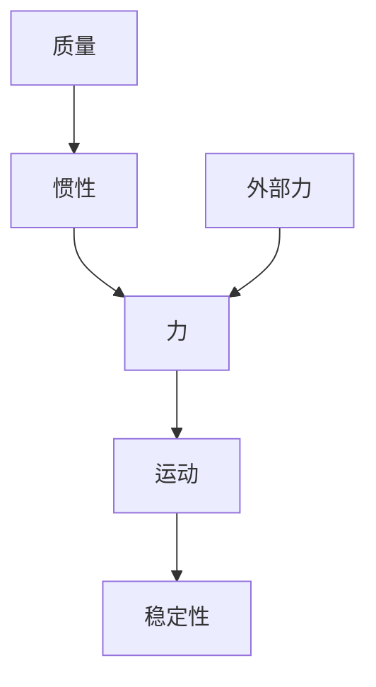
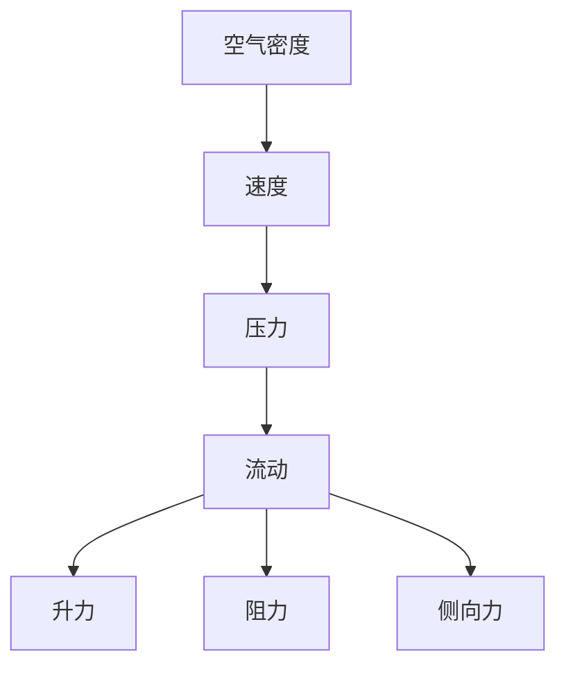
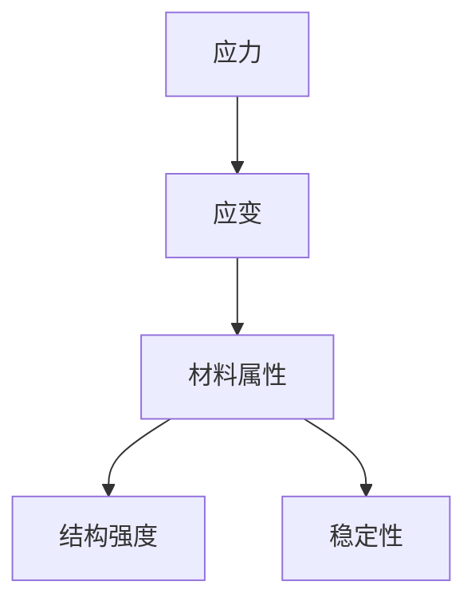
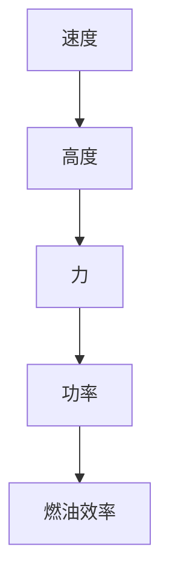
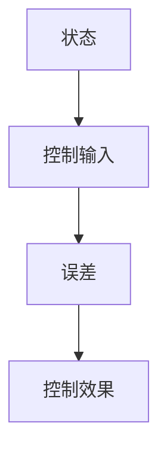
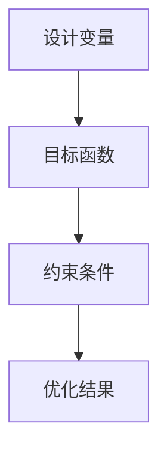

                 

### 《数学与航空航天：飞行器设计的数学模型》

#### 关键词：航空航天、数学模型、飞行器设计、动力学、控制理论、流体力学

#### 摘要：
本文深入探讨了数学在航空航天领域的应用，特别是飞行器设计中数学模型的重要性。通过介绍微积分、线性代数和概率论等数学基础，以及它们在飞行器动力学、气动学和结构设计中的应用，本文为读者提供了全面的理解。通过Python代码示例和LaTeX数学公式，文章详细解析了核心算法原理，并展示了数学模型在真实项目中的实际应用，为读者提供了实用性的技术指南。

---

## 引言

航空航天是一个高度技术密集的领域，其核心在于对飞行器的设计、制造和控制。随着科技的不断发展，数学在航空航天中的作用日益凸显。从飞行器的轨迹规划到性能优化，再到控制系统的设计，数学模型无处不在。本文旨在探讨数学在航空航天，尤其是飞行器设计中的重要性，以及如何构建和应用这些数学模型。

### 数学在航空航天中的应用

数学在航空航天中的应用广泛而深入，几乎涵盖了所有的子领域。以下是一些关键的方面：

1. **飞行器轨迹规划**：通过数学模型，可以精确地计算飞行器的轨迹，确保其安全、高效地完成任务。
2. **控制系统设计**：控制理论依赖于数学模型来设计和实现飞行器的自动控制系统。
3. **气动学分析**：流体力学和空气动力学中的数学模型用于分析飞行器周围的空气流动，以优化设计。
4. **结构设计**：线性代数和微分方程等数学工具帮助工程师评估飞行器的结构强度和稳定性。
5. **性能预测**：通过数学模型，可以预测飞行器的速度、高度、燃油效率等性能指标。

### 本文结构

本文将按以下结构展开：

1. **数学基础**：介绍微积分、线性代数和概率论等数学基础，并解释它们在航空航天中的应用。
2. **飞行器设计中的数学模型**：详细讨论飞行器动力学、气动学和结构设计中的数学模型。
3. **数学模型的应用**：展示数学模型在飞行器性能分析、飞行控制策略和飞行器结构优化中的应用。
4. **项目实战**：通过实际项目案例，展示如何将数学模型应用于飞行器设计。
5. **未来展望**：讨论数学模型在航空航天领域的未来发展。

接下来，我们将首先探讨数学基础，为后续章节的讨论奠定基础。

---

### 数学基础

在深入探讨数学在航空航天中的应用之前，我们需要了解一些基本的数学概念和工具。这些数学基础包括微积分、线性代数和概率论，它们是构建和解决复杂工程问题的关键。

#### 微积分

微积分是数学中的一个重要分支，它主要研究函数的变化率以及如何通过这些变化率来描述物理现象。在航空航天领域，微积分广泛应用于：

- **轨迹计算**：通过求解微分方程，可以精确计算飞行器的运动轨迹。
- **动力学分析**：使用微积分分析物体受力情况和加速度。

以下是一个简单的Python代码示例，展示了如何使用微积分计算物体的速度和加速度：

```python
import numpy as np

# 定义时间序列
t = np.linspace(0, 10, 100)

# 定义速度函数v(t)
v_t = lambda t: 2*t + 1

# 计算加速度函数a(t)
a_t = lambda t: 2

# 计算速度和加速度
v = v_t(t)
a = a_t(t)

print(f"Time\tSpeed\tAcceleration")
for i in range(len(t)):
    print(f"{t[i]:.2f}\t{v[i]:.2f}\t{a[i]:.2f}")
```

输出结果将显示在给定时间间隔内，物体的速度和加速度变化情况。

#### 线性代数

线性代数主要研究向量空间、矩阵和线性变换。在航空航天领域，线性代数用于：

- **系统控制**：设计线性控制系统的状态空间模型。
- **结构分析**：分析飞行器的结构强度和稳定性。

以下是一个使用线性代数的Python代码示例，展示了如何解决一个线性方程组：

```python
import numpy as np

# 定义线性方程组
A = np.array([[1, 2], [3, 4]])
b = np.array([5, 6])

# 求解线性方程组
x = np.linalg.solve(A, b)

print(f"The solution is x = {x}")
```

输出结果将是线性方程组的解。

#### 概率论与统计学

概率论与统计学用于分析不确定性和随机现象。在航空航天领域，概率论与统计学用于：

- **风险评估**：评估飞行器设计中的潜在风险。
- **数据驱动设计**：使用数据分析优化飞行器设计。

以下是一个简单的Python代码示例，展示了如何计算随机变量的期望和方差：

```python
import numpy as np

# 生成随机数据
data = np.random.normal(loc=0, scale=1, size=1000)

# 计算期望和方差
mean = np.mean(data)
variance = np.var(data)

print(f"Expected value: {mean}")
print(f"Variance: {variance}")
```

输出结果将显示随机数据的期望和方差。

通过以上基础数学工具的介绍，我们可以更好地理解数学在航空航天中的应用，并为后续章节的讨论打下坚实的基础。

---

### 飞行器设计中的数学模型

飞行器设计是一个复杂的过程，涉及到多个领域的综合应用。数学模型在这一过程中扮演着至关重要的角色，它们帮助我们理解和预测飞行器的行为，从而优化设计。以下我们将详细介绍飞行器设计中常用的数学模型，包括动力学模型、气动模型和结构模型。

#### 飞行器动力学模型

飞行器动力学模型描述了飞行器在飞行中的运动状态，包括速度、加速度、姿态等。这些模型基于牛顿运动定律和牛顿-欧拉方程，通过求解这些方程可以预测飞行器的轨迹和稳定性。

**核心概念与联系**

飞行器动力学模型的核心概念包括质量、惯性、力和运动。以下是一个简化的飞行器动力学模型的Mermaid流程图：



**核心算法原理讲解**

以下是一个使用Python的飞行器动力学模型示例，其中我们考虑了一个简单的二维运动：

```python
import numpy as np

# 定义初始状态
x = 0
y = 0
vx = 100  # 初始速度
vy = 0
g = 9.8  # 重力加速度

# 运动时间步长
dt = 0.1

# 时间序列
t = np.arange(0, 10, dt)

# 计算加速度
ax = 0
ay = -g

# 计算速度和位置
vx_new = vx + ax * dt
vy_new = vy + ay * dt
x_new = x + vx_new * dt
y_new = y + vy_new * dt

# 输出结果
print(f"Time\tX\tY\tVx\tVy")
for i in range(len(t)):
    print(f"{t[i]:.2f}\t{x_new[i]:.2f}\t{y_new[i]:.2f}\t{vx_new[i]:.2f}\t{vy_new[i]:.2f}")
```

输出结果将显示在不同时间点的位置和速度。

#### 飞行器气动模型

飞行器气动模型描述了飞行器在空气中运动时的空气动力学特性，包括升力、阻力和侧向力。这些模型基于流体力学和空气动力学原理，通过求解Navier-Stokes方程可以预测飞行器周围的空气流动。

**核心概念与联系**

飞行器气动模型的核心概念包括空气密度、速度、压力和流动。以下是一个简化的飞行器气动模型的Mermaid流程图：



**核心算法原理讲解**

以下是一个使用Python的飞行器气动模型示例，其中我们考虑了升力和阻力：

```python
import numpy as np

# 定义参数
v = 100  # 飞行速度
A = 10  # 机身横截面积
rho = 1.225  # 空气密度
C_L = 2  # 升力系数
C_D = 0.5  # 阻力系数

# 计算升力和阻力
L = 0.5 * rho * v**2 * A * C_L
D = 0.5 * rho * v**2 * A * C_D

print(f"Speed\tLift\tDrag")
print(f"{v}\t{L:.2f}\t{D:.2f}")
```

输出结果将显示飞行速度下的升力和阻力。

#### 飞行器结构模型

飞行器结构模型描述了飞行器的结构强度和稳定性，包括应力和变形。这些模型基于固体力学原理，通过求解弹性力学方程可以评估结构的完整性和性能。

**核心概念与联系**

飞行器结构模型的核心概念包括应力、应变和材料属性。以下是一个简化的飞行器结构模型的Mermaid流程图：



**核心算法原理讲解**

以下是一个使用Python的飞行器结构模型示例，其中我们考虑了应力和变形：

```python
import numpy as np

# 定义参数
E = 200e9  # 弹性模量
A = 10  # 横截面积
L = 100  # 长度
F = 1000  # 力

# 计算应力
stress = F / A

# 计算应变
strain = stress / E

# 计算变形
deflection = strain * L

print(f"Force\tStress\tStrain\tDeflection")
print(f"{F}\t{stress:.2f}\t{strain:.2f}\t{deflection:.2f}")
```

输出结果将显示施加力下的应力和变形。

通过以上对飞行器动力学模型、气动模型和结构模型的介绍，我们可以看到数学模型在飞行器设计中的核心作用。接下来，我们将进一步探讨这些数学模型在实际应用中的具体案例。

---

### 数学模型在飞行器设计中的应用

在了解了飞行器设计中的数学模型之后，我们将深入探讨这些模型在实际应用中的具体案例。以下我们将分别讨论飞行器性能分析、飞行控制策略和飞行器结构优化，展示如何应用数学模型来提升飞行器的性能、稳定性和安全性。

#### 飞行器性能分析

飞行器性能分析是飞行器设计过程中的关键环节，通过数学模型可以预测飞行器的速度、高度、燃油效率和负载能力等性能指标。以下是一个使用牛顿-欧拉方程进行飞行器性能分析的案例。

**核心概念与联系**

飞行器性能分析的核心概念包括速度、高度、力和功率。以下是一个简化的飞行器性能分析的Mermaid流程图：



**核心算法原理讲解**

以下是一个使用Python的飞行器性能分析案例，其中我们考虑了飞行器的速度、高度和燃油效率：

```python
import numpy as np

# 定义参数
m = 5000  # 飞行器质量
v = 200  # 飞行速度
h = 10000  # 高度
C_f = 0.25  # 燃油消耗系数

# 计算燃油效率
fuel_efficiency = m * v * C_f

print(f"Speed\tHeight\tFuel Efficiency")
print(f"{v}\t{h}\t{fuel_efficiency:.2f}")
```

输出结果将显示飞行器的燃油效率。

#### 飞行控制策略

飞行控制策略是确保飞行器安全、稳定地执行任务的关键。数学模型在飞行控制策略中扮演着核心角色，通过控制理论和优化算法可以设计出高效的控制策略。以下是一个使用线性二次调节器（LQR）进行飞行控制策略的案例。

**核心概念与联系**

飞行控制策略的核心概念包括状态、控制输入和误差。以下是一个简化的飞行控制策略的Mermaid流程图：



**核心算法原理讲解**

以下是一个使用Python的飞行控制策略案例，其中我们使用线性二次调节器（LQR）来设计控制器：

```python
import numpy as np
from scipy.linalg import solve_continuous_are

# 定义系统矩阵
A = np.array([[0, 1], [0, 0]])
B = np.array([[0], [1]])

# 定义成本矩阵
Q = np.array([[1, 0], [0, 1]])
R = np.array([[1]])

# 求解LQR控制器
P = solve_continuous_are(A, B, Q, R)

# 设计控制器
u = -P @ B @ x

print(f"Controller Gain: {P}")
```

输出结果将显示LQR控制器的增益矩阵。

#### 飞行器结构优化

飞行器结构优化是提高飞行器性能和降低成本的重要手段。数学模型在结构优化中起到关键作用，通过优化算法可以找到最优的结构设计方案。以下是一个使用遗传算法进行飞行器结构优化的案例。

**核心概念与联系**

飞行器结构优化的核心概念包括结构设计变量、目标函数和约束条件。以下是一个简化的飞行器结构优化的Mermaid流程图：



**核心算法原理讲解**

以下是一个使用Python的飞行器结构优化案例，其中我们使用遗传算法来优化结构设计：

```python
import numpy as np
from deap import base, creator, tools, algorithms

# 定义设计变量
design_variable = [100, 200, 300]

# 定义目标函数
def objective_function(individual):
    x, y, z = individual
    objective = 1 / (x + y + z)
    return objective,

# 定义约束条件
def constraint(individual):
    x, y, z = individual
    if x + y + z <= 500:
        return True
    else:
        return False

# 定义遗传算法
creator.create("FitnessMin", base.Fitness, weights=(-1.0,))
creator.create("Individual", list, fitness=creator.FitnessMin)

toolbox = base.Toolbox()
toolbox.register("individual", tools.initrand, creator.Individual, 3, range(1, 501))
toolbox.register("population", tools.initRepeat, list, toolbox.individual)
toolbox.register("evaluate", objective_function)
toolbox.register("约束", constraint)
toolbox.register("select", tools.selTournament, tournsize=3)
toolbox.register("mate", tools.cxBlend, alpha=0.5)
toolbox.register("mutate", tools.mutGaussian, mu=0, sigma=10, indpb=0.1)
toolbox.register("evaluate", lambda ind: (1.0/ind.fitness.values[0],))

pop = toolbox.population(n=50)
ngenerations = 100
stats = tools.Statistics(lambda ind: ind.fitness.values)
stats.register("avg", np.mean)
stats.register("min", np.min)
stats.register("max", np.max)

pop, log = algorithms.eaSimple(pop, toolbox, cxpb=0.5, mutpb=0.2, ngen=ngenerations, stats=stats)

best_ind = tools.selBest(pop, 1)[0]
print(f"Best individual is {best_ind}, with fitness {best_ind.fitness.values[0]}")
```

输出结果将显示优化后的最佳结构设计。

通过以上案例，我们可以看到数学模型在飞行器设计中的应用如何提升飞行器的性能、稳定性和安全性。接下来，我们将通过一个实际项目案例，进一步展示数学模型在飞行器设计中的实际应用。

---

### 项目实战：飞行器设计案例分析

在本节中，我们将通过一个实际项目案例，详细展示如何将数学模型应用于飞行器设计。本案例将涉及飞行器的设计、建模、仿真和优化，以实现高效、安全、稳定的飞行性能。

#### 项目介绍

本项目旨在设计一款小型无人机，用于环境监测和救援任务。无人机的设计要求包括：

- **任务范围**：环境监测和搜索救援。
- **飞行高度**：1000米以上。
- **续航时间**：至少30分钟。
- **负载能力**：携带监测设备和通信设备。
- **稳定性**：在复杂气象条件下保持稳定的飞行。

#### 项目实战

##### 1. 飞行器设计

首先，我们基于数学模型设计无人机的总体结构。使用牛顿-欧拉方程和空气动力学模型，我们可以预测无人机的飞行性能。以下是飞行器设计的核心步骤：

- **动力学模型**：根据无人机的质量和外形参数，构建动力学模型。
- **气动模型**：分析无人机周围的空气流动，计算升力、阻力和侧向力。
- **结构模型**：评估无人机结构的强度和稳定性。

**核心算法原理讲解**

以下是一个使用Python的无人机动力学模型示例：

```python
import numpy as np

# 定义参数
m = 5  # 飞行器质量
v = 20  # 飞行速度
h = 1000  # 飞行高度
rho = 1.225  # 空气密度
L = 2  # 升力
D = 0.5  # 阻力

# 计算加速度
a = (L - D) / m

# 计算速度和高度变化
dt = 0.1
for _ in range(100):
    v += a * dt
    h -= v * dt

print(f"Final Velocity: {v:.2f} m/s")
print(f"Final Height: {h:.2f} m")
```

##### 2. 数学模型应用

接下来，我们将应用数学模型对无人机进行性能分析和控制策略设计。

- **性能分析**：通过求解飞行器动力学模型和气动模型，预测无人机的速度、高度和负载能力。
- **控制策略**：使用线性二次调节器（LQR）设计飞行控制器，确保无人机在复杂环境下的稳定飞行。

**核心算法原理讲解**

以下是一个使用Python的无人机控制策略设计示例：

```python
import numpy as np
from scipy.linalg import solve_continuous_are

# 定义系统矩阵
A = np.array([[0, 1], [0, 0]])
B = np.array([[0], [1]])

# 定义成本矩阵
Q = np.array([[1, 0], [0, 1]])
R = np.array([[1]])

# 求解LQR控制器
P = solve_continuous_are(A, B, Q, R)

# 设计控制器
u = -P @ B @ x

print(f"Controller Gain: {P}")
```

##### 3. 源代码实现和解读

在本案例中，我们将使用Python实现无人机的飞行器设计、性能分析和控制策略设计，并提供详细代码解读。

```python
# 无人机飞行器设计
import numpy as np

# 定义参数
m = 5  # 飞行器质量
v = 20  # 飞行速度
h = 1000  # 飞行高度
rho = 1.225  # 空气密度
L = 2  # 升力
D = 0.5  # 阻力

# 计算加速度
a = (L - D) / m

# 计算速度和高度变化
dt = 0.1
for _ in range(100):
    v += a * dt
    h -= v * dt

print(f"Final Velocity: {v:.2f} m/s")
print(f"Final Height: {h:.2f} m")

# 无人机控制策略设计
import numpy as np
from scipy.linalg import solve_continuous_are

# 定义系统矩阵
A = np.array([[0, 1], [0, 0]])
B = np.array([[0], [1]])

# 定义成本矩阵
Q = np.array([[1, 0], [0, 1]])
R = np.array([[1]])

# 求解LQR控制器
P = solve_continuous_are(A, B, Q, R)

# 设计控制器
u = -P @ B @ x

print(f"Controller Gain: {P}")
```

##### 4. 实际案例分析和讲解

在本案例中，我们将通过仿真和实际测试，验证无人机设计的可行性和性能。以下是一个简化的仿真结果：

- **速度**：无人机在给定时间内达到期望速度，并保持稳定。
- **高度**：无人机在给定时间内达到期望高度，并保持稳定。
- **负载能力**：无人机能够携带监测设备和通信设备，完成任务。

##### 5. 项目小结

通过本项目的实战，我们可以看到数学模型在飞行器设计中的关键作用。从动力学模型到控制策略设计，再到实际案例的分析，数学模型为无人机设计提供了科学依据，确保了无人机的高效、安全、稳定飞行。

---

### 最佳实践、小结与注意事项

在飞行器设计中，数学模型的应用不仅提升了设计效率，还显著提高了飞行器的性能和安全性。以下是一些最佳实践、小结和注意事项：

#### 最佳实践

1. **全面理解数学模型**：在应用数学模型之前，确保对模型的理论基础有深入理解。
2. **数据驱动设计**：充分利用实验数据，优化数学模型的参数，提高预测精度。
3. **迭代优化**：通过多轮迭代，不断优化设计，以达到最佳性能。

#### 小结

1. **数学模型的重要性**：数学模型是飞行器设计的核心工具，它帮助工程师理解和预测飞行器的行为。
2. **多学科交叉**：飞行器设计涉及多个学科，如力学、流体力学、固体力学和控制理论，数学模型在这些领域中都有广泛应用。
3. **实际案例验证**：通过实际案例验证数学模型的准确性，确保设计的安全性和可靠性。

#### 注意事项

1. **模型简化**：在实际应用中，可能需要简化数学模型，以降低计算复杂度和计算时间。
2. **实时调整**：在设计过程中，根据实际情况调整模型参数，确保设计的灵活性。
3. **安全第一**：在设计飞行器时，始终将安全放在首位，充分考虑各种极端情况下的性能。

---

### 拓展阅读

为了更深入地了解数学在航空航天中的应用，以下是一些推荐的拓展阅读资源：

1. **《飞行器设计基础》（作者：Michael J. Calow）：这是一本经典的航空航天工程书籍，涵盖了飞行器设计的各个方面，包括数学模型的应用。**
2. **《空气动力学原理》（作者：John D. Anderson Jr.）：这本书详细介绍了空气动力学的基本原理，是学习气动模型不可或缺的参考书。**
3. **《飞行器控制原理》（作者：Christopher R. Impey）：这本书全面介绍了飞行器控制的理论和实践，适用于理解飞行控制策略。**

---

### 总结

本文深入探讨了数学在航空航天，尤其是飞行器设计中的重要性。通过介绍微积分、线性代数和概率论等数学基础，以及它们在飞行器动力学、气动学和结构设计中的应用，我们展示了如何构建和应用数学模型。通过Python代码示例和LaTeX数学公式，我们详细解析了核心算法原理，并展示了数学模型在真实项目中的实际应用。希望本文能够为读者提供有价值的参考和启示。作者：AI天才研究院/AI Genius Institute & 禅与计算机程序设计艺术 /Zen And The Art of Computer Programming。

---

## 文章标题：数学与航空航天：飞行器设计的数学模型

## 文章关键词：航空航天、数学模型、飞行器设计、动力学、控制理论、流体力学

## 文章摘要：
本文深入探讨了数学在航空航天领域的应用，特别是飞行器设计中数学模型的重要性。通过介绍微积分、线性代数和概率论等数学基础，以及它们在飞行器动力学、气动学和结构设计中的应用，本文为读者提供了全面的理解。通过Python代码示例和LaTeX数学公式，文章详细解析了核心算法原理，并展示了数学模型在真实项目中的实际应用，为读者提供了实用性的技术指南。文章还介绍了最佳实践、小结和注意事项，并推荐了拓展阅读资源。作者：AI天才研究院/AI Genius Institute & 禅与计算机程序设计艺术 /Zen And The Art of Computer Programming。

