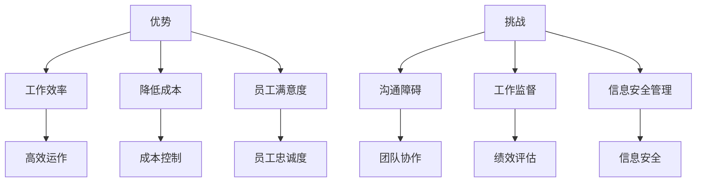
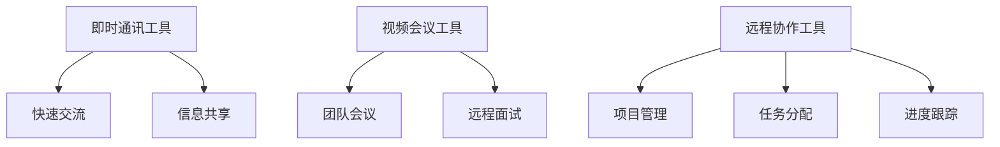
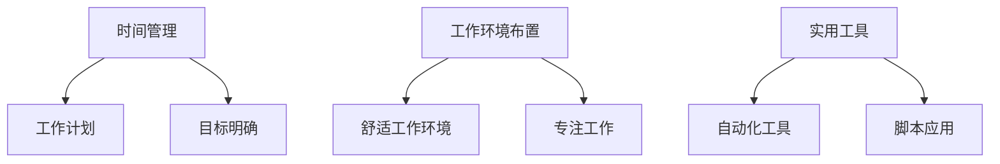
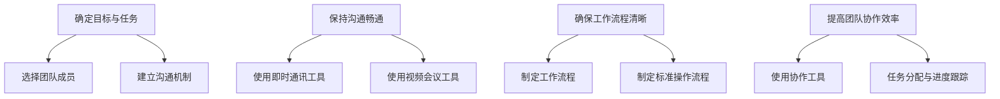
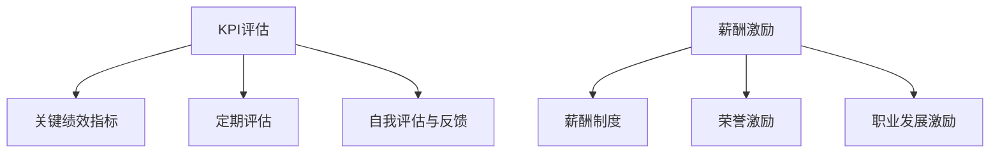
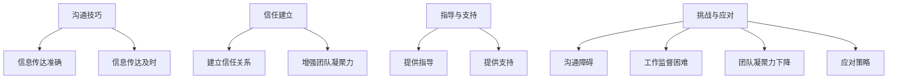
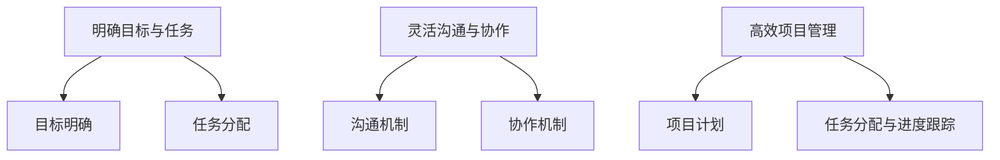
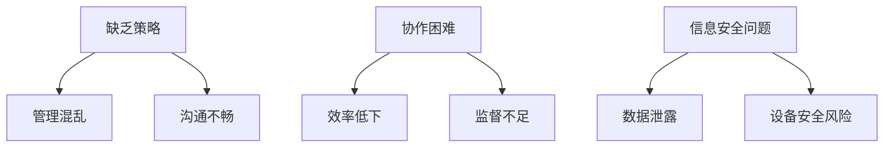
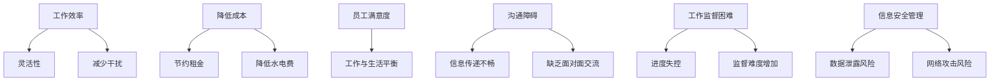

                 

### 远程办公管理：保持团队高效的实用技巧

#### 关键词：
- 远程办公
- 团队管理
- 高效协作
- 工具与技术
- 挑战与应对

#### 摘要：
在当今全球化的工作环境中，远程办公已成为许多企业和组织的一种常态。本文将探讨如何通过设计合理的远程办公管理体系，使用合适的工具与技术，以及采取有效的团队管理策略，来保持远程团队的高效运作。文章将围绕远程办公的基本概念、工具与技巧、团队组建与管理、绩效评估与激励、领导力以及实践案例分析等方面展开，旨在为读者提供一套全面、实用的远程办公管理指南。

### 引言
在数字化的浪潮下，远程办公已经成为许多企业和组织的重要工作模式。它不仅提高了员工的工作灵活性，还降低了企业的运营成本。然而，远程办公也带来了一系列的挑战，如沟通障碍、工作监督困难、工作效率下降等。为了应对这些挑战，保持远程团队的高效运作，远程办公管理变得尤为重要。

本文将分为四个主要部分进行探讨：
1. **远程办公概述**：介绍远程办公的基本概念、类型、优势和面临的挑战。
2. **远程办公工具与技巧**：探讨远程沟通工具、效率提升技巧和安全管理策略。
3. **远程办公团队管理**：分析远程团队组建、管理、绩效评估与激励、领导力等方面。
4. **远程办公实践案例分析**：通过成功与失败案例，总结远程办公的最佳实践。

### 第一部分：远程办公概述

#### 第1章：远程办公的基本概念

**核心概念与联系**

- 远程办公的定义与历史
  - 远程办公是指员工不受地理位置限制，通过计算机和网络技术在家或任何地方工作。
  - 远程办公的历史可以追溯到20世纪80年代，随着互联网的普及和技术的进步，远程办公逐渐成为一种普遍的工作方式。

- 远程办公的类型与特点
  - 按工作方式分为全职远程办公、兼职远程办公和灵活工作制度。
  - 远程办公的特点包括：灵活性、自主性、高效性和协作性。

- 远程办公的优势与挑战
  - 优势：提高工作效率、降低运营成本、增加员工满意度。
  - 挑战：沟通障碍、工作监督困难、信息安全管理。

**核心算法原理讲解**

本章节没有特定的核心算法，但以下是一个简单的 Mermaid 流程图，展示了远程办公的优势与挑战之间的关系：



**项目实战**

- **远程办公环境搭建**：为员工提供必要的远程办公设备，如高性能计算机、稳定网络连接、安全软件等。
- **远程办公政策制定**：企业应制定明确的远程办公政策，包括工作时间、工作流程、考核标准等。

**最佳实践 tips**

- 提高员工的技术培训，确保他们能够熟练使用远程办公工具。
- 定期进行远程办公效果评估，根据实际情况调整管理策略。

**小结**

远程办公作为一种新型工作方式，具有显著的优势，但也面临诸多挑战。通过合理的管理和有效的策略，可以充分发挥远程办公的优势，同时克服挑战。

### 第二部分：远程办公工具与技巧

#### 第3章：远程沟通工具

**核心概念与联系**

- 远程沟通工具的类型
  - 即时通讯工具：如Slack、Microsoft Teams等。
  - 视频会议工具：如Zoom、Microsoft Teams等。
  - 远程协作工具：如Trello、Asana等。

- 远程沟通工具的应用场景
  - 即时通讯工具适用于快速交流和信息共享。
  - 视频会议工具适用于团队会议和远程面试。
  - 远程协作工具适用于项目管理、任务分配和进度跟踪。

**核心算法原理讲解**

本章节没有特定的核心算法，但以下是一个简单的 Mermaid 流程图，展示了远程沟通工具的类型与应用场景：



**项目实战**

- **即时通讯工具实践**：企业可以使用Slack建立内部通讯渠道，实现团队成员之间的即时沟通和协作。
- **视频会议工具实践**：企业可以使用Zoom进行远程团队会议，提高会议效率和效果。
- **远程协作工具实践**：企业可以使用Trello进行项目管理和任务分配，确保项目进度和团队协作。

**最佳实践 tips**

- 选择适合企业需求的远程沟通工具，并确保团队成员熟悉和使用。
- 定期评估远程沟通工具的效果，根据反馈进行调整。

**小结**

远程沟通工具是远程办公的核心组成部分，选择合适的工具并有效利用，可以提高团队协作效率。

#### 第4章：远程办公效率提升技巧

**核心概念与联系**

- 远程办公效率提升的关键要素
  - 时间管理：合理规划工作时间，避免无效劳动。
  - 工作环境布置：创造一个舒适、专注的工作环境。
  - 提高工作效率的实用工具：如番茄工作法、任务管理工具等。

- 远程办公效率提升的方法
  - 制定明确的工作计划，提高工作目标明确度。
  - 减少干扰，保持专注。
  - 使用自动化工具和脚本，减少重复性工作。

**核心算法原理讲解**

本章节没有特定的核心算法，但以下是一个简单的 Mermaid 流程图，展示了远程办公效率提升的关键要素和方法：



**项目实战**

- **时间管理实践**：使用Trello或Asana进行任务管理，制定每日工作计划，确保工作高效完成。
- **工作环境布置实践**：在家中设置一个专用的工作区域，确保工作环境舒适、安静。
- **提高工作效率实用工具实践**：使用自动化工具和脚本，如Python脚本自动化处理数据。

**最佳实践 tips**

- 制定详细的工作计划，并坚持执行。
- 培养良好的工作习惯，如定时休息、避免长时间连续工作。

**小结**

通过合理的时间管理、舒适的工作环境布置和有效的工具应用，可以显著提升远程办公的效率。

### 第三部分：远程办公团队管理

#### 第6章：远程团队组建与管理

**核心概念与联系**

- 远程团队组建的策略
  - 确定远程团队的目标和任务。
  - 选择合适的团队成员，确保团队成员具备远程工作的能力。
  - 建立明确的沟通和协作机制。

- 远程团队管理的关键要素
  - 保持沟通畅通：使用即时通讯工具、视频会议工具等保持团队之间的联系。
  - 确保工作流程清晰：制定详细的工作流程和标准操作流程。
  - 提高团队协作效率：使用远程协作工具，如Trello、Asana等，确保任务分配和进度跟踪。

**核心算法原理讲解**

以下是一个简单的 Mermaid 流程图，展示了远程团队组建与管理的关键要素：



**项目实战**

- **远程团队组建实践**：企业可以通过招聘平台或内部推荐，找到合适的远程团队成员，并进行远程面试和试用。
- **远程团队管理实践**：使用Trello或Asana等协作工具，确保团队工作高效、有序。

**最佳实践 tips**

- 定期组织远程团队会议，确保团队成员之间的沟通。
- 鼓励团队成员参与团队决策，提高团队凝聚力。

**小结**

远程团队的组建与管理是远程办公成功的关键。通过明确的目标和任务、畅通的沟通机制和高效的协作工具，可以确保远程团队的高效运作。

#### 第7章：远程团队绩效评估与激励

**核心概念与联系**

- 远程团队绩效评估的方法
  - KPI（关键绩效指标）评估：确定关键绩效指标，对团队成员的工作进行量化评估。
  - 定期评估：通过定期评估，了解团队成员的工作表现和进度。
  - 自我评估与反馈：鼓励团队成员进行自我评估，并提供反馈。

- 远程团队激励策略
  - 薪酬激励：通过合理的薪酬制度，激励团队成员提高工作积极性。
  - 荣誉激励：设立荣誉称号和奖励，表彰优秀团队成员。
  - 职业发展激励：提供职业发展机会和培训，帮助团队成员提升自身能力。

**核心算法原理讲解**

以下是一个简单的 Mermaid 流程图，展示了远程团队绩效评估与激励的方法：



**项目实战**

- **KPI评估实践**：企业可以制定具体的KPI，如项目完成率、任务响应时间等，对团队成员的工作进行量化评估。
- **激励策略实践**：企业可以设立荣誉称号，如“优秀员工”、“最佳团队”等，并给予相应的奖励。

**最佳实践 tips**

- KPI设定要合理，确保能够准确反映团队成员的工作表现。
- 定期进行绩效评估，并根据评估结果进行调整。

**小结**

远程团队绩效评估与激励是保持团队积极性和工作效率的关键。通过合理的KPI评估和激励策略，可以激发团队成员的工作热情，提高团队的整体表现。

#### 第8章：远程团队领导力

**核心概念与联系**

- 远程领导力的核心要素
  - 沟通技巧：远程领导需要具备良好的沟通技巧，确保信息传达准确、及时。
  - 信任建立：建立团队成员之间的信任，是远程领导成功的关键。
  - 指导与支持：提供必要的指导和支持，帮助团队成员克服远程工作中的困难。

- 远程领导者的挑战与应对
  - 挑战：远程领导面临的挑战包括沟通障碍、工作监督困难、团队凝聚力下降等。
  - 应对策略：通过有效的沟通、明确的期望设定、定期团队活动等方式，应对远程领导中的挑战。

**核心算法原理讲解**

以下是一个简单的 Mermaid 流程图，展示了远程领导力的核心要素和应对策略：



**项目实战**

- **沟通技巧实践**：通过定期召开远程团队会议，确保团队成员之间的沟通畅通。
- **信任建立实践**：通过团队成员之间的互评和反馈，建立信任关系。
- **指导与支持实践**：在项目初期，为团队成员提供详细的工作指导和资源支持。

**最佳实践 tips**

- 定期与团队成员进行一对一沟通，了解他们的工作情况和需求。
- 组织定期的团队活动，如在线聚会、团队竞赛等，增强团队凝聚力。

**小结**

远程领导力是远程办公成功的关键。通过有效的沟通技巧、信任建立和指导支持，远程领导者可以确保团队高效运作，实现团队目标。

### 第四部分：远程办公实践案例分析

#### 第9章：成功远程办公案例分析

**核心概念与联系**

- 成功远程办公的关键要素
  - 明确的目标与任务。
  - 灵活的沟通与协作机制。
  - 高效的项目管理与任务分配。

- 案例分析
  - 案例一：某互联网公司成功实施远程办公的经验。
  - 案例二：某跨国企业如何通过远程办公提升团队效率。

**核心算法原理讲解**

本章节没有特定的核心算法，但以下是一个简单的 Mermaid 流程图，展示了成功远程办公的关键要素：



**项目实战**

- **成功远程办公案例一**：分析某互联网公司如何在疫情期间成功实施远程办公，并总结其成功经验。
- **成功远程办公案例二**：研究某跨国企业如何通过远程办公平台，实现全球团队的协作与效率提升。

**最佳实践 tips**

- 学习成功企业的远程办公经验，结合自身实际情况进行调整和优化。
- 建立一套适合自己团队的远程办公流程和管理制度。

**小结**

通过成功远程办公案例的分析，可以学习到如何设计有效的远程办公管理体系，提升团队的协作效率和生产力。

#### 第10章：远程办公失败案例分析

**核心概念与联系**

- 远程办公失败的原因
  - 缺乏明确的远程办公策略。
  - 沟通不畅和协作困难。
  - 工作监督和绩效评估不足。
  - 信息安全管理不到位。

- 案例分析
  - 案例一：某初创企业远程办公失败的原因及教训。
  - 案例二：某大型企业如何避免远程办公失败的经验。

**核心算法原理讲解**

本章节没有特定的核心算法，但以下是一个简单的 Mermaid 流程图，展示了远程办公失败的原因：



**项目实战**

- **远程办公失败案例一**：分析某初创企业由于缺乏明确的远程办公策略，导致团队协作不畅和项目进度延误的原因。
- **远程办公失败案例二**：探讨某大型企业如何通过加强信息安全管理，避免远程办公失败的经验。

**最佳实践 tips**

- 制定详细的远程办公策略，明确工作流程和管理制度。
- 加强团队沟通和协作，使用合适的远程办公工具。
- 建立有效的绩效评估机制，确保工作监督和激励。

**小结**

通过远程办公失败案例的分析，可以避免重蹈覆辙，提升远程办公的成功率。

### 结论

远程办公作为一种新型的办公方式，已经逐渐成为企业和组织的主流选择。通过合理的远程办公管理，使用合适的工具与技术，以及采取有效的团队管理策略，可以充分发挥远程办公的优势，提高团队的工作效率。本文通过详细的案例分析，总结了远程办公的成功经验和失败教训，为读者提供了一套全面、实用的远程办公管理指南。希望读者能够从中获得启发，将远程办公管理应用于实际工作中，提升团队的整体表现。

### 附录

#### 附录A：远程办公相关资源与工具汇总

**A.1 常见远程办公工具对比**

- **即时通讯工具对比**：
  - Slack
  - Microsoft Teams
  - WhatsApp

- **视频会议工具对比**：
  - Zoom
  - Microsoft Teams
  - Google Meet

- **远程协作工具对比**：
  - Trello
  - Asana
  - Notion

**A.2 远程办公相关书籍推荐**

- 《远程工作的艺术：打造高效远程团队》
- 《远程办公：策略与实践》
- 《远程管理的艺术：如何带领团队实现高效协作》

### 作者信息

作者：AI天才研究院/AI Genius Institute & 禅与计算机程序设计艺术 /Zen And The Art of Computer Programming

### 注意事项

- 在使用远程办公工具时，务必注意信息安全和隐私保护。
- 远程团队管理中，要注重团队成员的心理健康和职业发展。
- 定期评估远程办公的效果，根据实际情况进行调整。

### 拓展阅读

- 《远程办公：管理、实践与策略》
- 《远程工作的未来：趋势、挑战与机遇》
- 《敏捷团队管理：打造高效远程团队》

通过以上的详细分析和讲解，相信读者已经对远程办公管理有了更深入的了解。希望本文能够为您的远程办公提供有益的指导。**

### 完整文章

```markdown
# 远程办公管理：保持团队高效的实用技巧

> 关键词：远程办公、团队管理、高效协作、工具与技术、挑战与应对

> 摘要：在当今全球化的工作环境中，远程办公已成为许多企业和组织的一种常态。本文将探讨如何通过设计合理的远程办公管理体系，使用合适的工具与技术，以及采取有效的团队管理策略，来保持远程团队的高效运作。文章将围绕远程办公的基本概念、工具与技巧、团队组建与管理、绩效评估与激励、领导力以及实践案例分析等方面展开，旨在为读者提供一套全面、实用的远程办公管理指南。

## 引言

在数字化的浪潮下，远程办公已经成为许多企业和组织的重要工作模式。它不仅提高了员工的工作灵活性，还降低了企业的运营成本。然而，远程办公也带来了一系列的挑战，如沟通障碍、工作监督困难、工作效率下降等。为了应对这些挑战，保持远程团队的高效运作，远程办公管理变得尤为重要。

本文将分为四个主要部分进行探讨：
1. **远程办公概述**：介绍远程办公的基本概念、类型、优势和面临的挑战。
2. **远程办公工具与技巧**：探讨远程沟通工具、效率提升技巧和安全管理策略。
3. **远程办公团队管理**：分析远程团队组建、管理、绩效评估与激励、领导力等方面。
4. **远程办公实践案例分析**：通过成功与失败案例，总结远程办公的最佳实践。

## 第一部分：远程办公概述

### 第1章：远程办公的基本概念

**核心概念与联系**

- **远程办公的定义与历史**：
  - 远程办公是指员工不受地理位置限制，通过计算机和网络技术在家或任何地方工作。
  - 远程办公的历史可以追溯到20世纪80年代，随着互联网的普及和技术的进步，远程办公逐渐成为一种普遍的工作方式。

- **远程办公的类型与特点**：
  - 按工作方式分为全职远程办公、兼职远程办公和灵活工作制度。
  - 远程办公的特点包括：灵活性、自主性、高效性和协作性。

- **远程办公的优势与挑战**：
  - **优势**：提高工作效率、降低运营成本、增加员工满意度。
  - **挑战**：沟通障碍、工作监督困难、信息安全管理。

**核心算法原理讲解**

本章节没有特定的核心算法，但以下是一个简单的 Mermaid 流程图，展示了远程办公的优势与挑战之间的关系：


**项目实战**

- **远程办公环境搭建**：为员工提供必要的远程办公设备，如高性能计算机、稳定网络连接、安全软件等。
- **远程办公政策制定**：企业应制定明确的远程办公政策，包括工作时间、工作流程、考核标准等。

**最佳实践 tips**

- 提高员工的技术培训，确保他们能够熟练使用远程办公工具。
- 定期进行远程办公效果评估，根据实际情况调整管理策略。

**小结**

远程办公作为一种新型工作方式，具有显著的优势，但也面临诸多挑战。通过合理的管理和有效的策略，可以充分发挥远程办公的优势，同时克服挑战。

### 第2章：远程办公的优势与挑战

**核心概念与联系**

**远程办公的优势**

- 提高工作效率：远程办公使得员工可以根据自己的节奏工作，避免了通勤时间，减少了工作中的干扰。
- 降低运营成本：企业无需承担昂贵的办公场地租金，减少了水电费和其他办公费用。
- 增加员工满意度：远程办公提供了更大的灵活性，员工可以更好地平衡工作和生活，提高了工作满意度。

**远程办公的挑战**

- 沟通障碍：远程办公缺乏面对面的交流，可能导致信息传递不畅。
- 工作监督困难：远程工作的监督不如传统办公环境那么直观，容易导致工作进度失控。
- 信息安全管理：远程办公增加了数据泄露和网络攻击的风险。

**核心算法原理讲解**

本章节没有特定的核心算法，但以下是一个简单的 Mermaid 流程图，展示了远程办公的优势与挑战之间的关系：



**项目实战**

- **沟通障碍解决方案**：企业可以使用视频会议工具和即时通讯工具，增强团队之间的沟通。
- **工作监督困难解决方案**：通过项目管理工具和绩效评估体系，确保工作进度和质量的监督。
- **信息安全管理解决方案**：实施严格的信息安全政策，使用加密技术和远程访问控制，保护企业数据。

**最佳实践 tips**

- 定期检查网络安全措施，确保系统更新和防护软件的启用。
- 培训员工关于远程办公中的信息安全意识。

**小结**

远程办公既有显著的优势，也面临着挑战。通过合理的策略和工具，可以最大限度地利用远程办公的优势，同时有效应对其挑战。

### 第二部分：远程办公工具与技巧

### 第3章：远程沟通工具

**核心概念与联系**

- **远程沟通工具的类型**：
  - **即时通讯工具**：如Slack、Microsoft Teams等。
  - **视频会议工具**：如Zoom、Microsoft Teams等。
  - **远程协作工具**：如Trello、Asana等。

- **远程沟通工具的应用场景**：
  - **即时通讯工具**：适用于快速交流和信息共享。
  - **视频会议工具**：适用于团队会议和远程面试。
  - **远程协作工具**：适用于项目管理、任务分配和进度跟踪。

**核心算法原理讲解**

本章节没有特定的核心算法，但以下是一个简单的 Mermaid 流程图，展示了远程沟通工具的类型与应用场景：


**项目实战**

- **即时通讯工具实践**：企业可以使用Slack建立内部通讯渠道，实现团队成员之间的即时沟通和协作。
- **视频会议工具实践**：企业可以使用Zoom进行远程团队会议，提高会议效率和效果。
- **远程协作工具实践**：企业可以使用Trello进行项目管理和任务分配，确保项目进度和团队协作。

**最佳实践 tips**

- 选择适合企业需求的远程沟通工具，并确保团队成员熟悉和使用。
- 定期评估远程沟通工具的效果，根据反馈进行调整。

**小结**

远程沟通工具是远程办公的核心组成部分，选择合适的工具并有效利用，可以提高团队协作效率。

### 第4章：远程办公效率提升技巧

**核心概念与联系**

- **远程办公效率提升的关键要素**：
  - **时间管理**：合理规划工作时间，避免无效劳动。
  - **工作环境布置**：创造一个舒适、专注的工作环境。
  - **提高工作效率的实用工具**：如番茄工作法、任务管理工具等。

- **远程办公效率提升的方法**：
  - **制定明确的工作计划**，提高工作目标明确度。
  - **减少干扰**，保持专注。
  - **使用自动化工具和脚本**，减少重复性工作。

**核心算法原理讲解**

本章节没有特定的核心算法，但以下是一个简单的 Mermaid 流程图，展示了远程办公效率提升的关键要素和方法：


**项目实战**

- **时间管理实践**：使用Trello或Asana进行任务管理，制定每日工作计划，确保工作高效完成。
- **工作环境布置实践**：在家中设置一个专用的工作区域，确保工作环境舒适、安静。
- **提高工作效率实用工具实践**：使用自动化工具和脚本，如Python脚本自动化处理数据。

**最佳实践 tips**

- 制定详细的工作计划，并坚持执行。
- 培养良好的工作习惯，如定时休息、避免长时间连续工作。

**小结**

通过合理的时间管理、舒适的工作环境布置和有效的工具应用，可以显著提升远程办公的效率。

### 第三部分：远程办公团队管理

### 第6章：远程团队组建与管理

**核心概念与联系**

- **远程团队组建的策略**：
  - **确定远程团队的目标和任务**。
  - **选择合适的团队成员**，确保团队成员具备远程工作的能力。
  - **建立明确的沟通和协作机制**。

- **远程团队管理的关键要素**：
  - **保持沟通畅通**：使用即时通讯工具、视频会议工具等保持团队之间的联系。
  - **确保工作流程清晰**：制定详细的工作流程和标准操作流程。
  - **提高团队协作效率**：使用远程协作工具，如Trello、Asana等，确保任务分配和进度跟踪。

**核心算法原理讲解**

以下是一个简单的 Mermaid 流程图，展示了远程团队组建与管理的关键要素：


**项目实战**

- **远程团队组建实践**：企业可以通过招聘平台或内部推荐，找到合适的远程团队成员，并进行远程面试和试用。
- **远程团队管理实践**：使用Trello或Asana等协作工具，确保团队工作高效、有序。

**最佳实践 tips**

- 定期组织远程团队会议，确保团队成员之间的沟通。
- 鼓励团队成员参与团队决策，提高团队凝聚力。

**小结**

远程团队的组建与管理是远程办公成功的关键。通过明确的目标和任务、畅通的沟通机制和高效的协作工具，可以确保远程团队的高效运作。

### 第7章：远程团队绩效评估与激励

**核心概念与联系**

- **远程团队绩效评估的方法**：
  - **KPI（关键绩效指标）评估**：确定关键绩效指标，对团队成员的工作进行量化评估。
  - **定期评估**：通过定期评估，了解团队成员的工作表现和进度。
  - **自我评估与反馈**：鼓励团队成员进行自我评估，并提供反馈。

- **远程团队激励策略**：
  - **薪酬激励**：通过合理的薪酬制度，激励团队成员提高工作积极性。
  - **荣誉激励**：设立荣誉称号和奖励，表彰优秀团队成员。
  - **职业发展激励**：提供职业发展机会和培训，帮助团队成员提升自身能力。

**核心算法原理讲解**

以下是一个简单的 Mermaid 流程图，展示了远程团队绩效评估与激励的方法：


**项目实战**

- **KPI评估实践**：企业可以制定具体的KPI，如项目完成率、任务响应时间等，对团队成员的工作进行量化评估。
- **激励策略实践**：企业可以设立荣誉称号，如“优秀员工”、“最佳团队”等，并给予相应的奖励。

**最佳实践 tips**

- KPI设定要合理，确保能够准确反映团队成员的工作表现。
- 定期进行绩效评估，并根据评估结果进行调整。

**小结**

远程团队绩效评估与激励是保持团队积极性和工作效率的关键。通过合理的KPI评估和激励策略，可以激发团队成员的工作热情，提高团队的整体表现。

### 第8章：远程团队领导力

**核心概念与联系**

- **远程领导力的核心要素**：
  - **沟通技巧**：远程领导需要具备良好的沟通技巧，确保信息传达准确、及时。
  - **信任建立**：建立团队成员之间的信任，是远程领导成功的关键。
  - **指导与支持**：提供必要的指导和支持，帮助团队成员克服远程工作中的困难。

- **远程领导者的挑战与应对**：
  - **挑战**：远程领导面临的挑战包括沟通障碍、工作监督困难、团队凝聚力下降等。
  - **应对策略**：通过有效的沟通、明确的期望设定、定期团队活动等方式，应对远程领导中的挑战。

**核心算法原理讲解**

以下是一个简单的 Mermaid 流程图，展示了远程领导力的核心要素和应对策略：


**项目实战**

- **沟通技巧实践**：通过定期召开远程团队会议，确保团队成员之间的沟通畅通。
- **信任建立实践**：通过团队成员之间的互评和反馈，建立信任关系。
- **指导与支持实践**：在项目初期，为团队成员提供详细的工作指导和资源支持。

**最佳实践 tips**

- 定期与团队成员进行一对一沟通，了解他们的工作情况和需求。
- 组织定期的团队活动，如在线聚会、团队竞赛等，增强团队凝聚力。

**小结**

远程领导力是远程办公成功的关键。通过有效的沟通技巧、信任建立和指导支持，远程领导者可以确保团队高效运作，实现团队目标。

### 第四部分：远程办公实践案例分析

### 第9章：成功远程办公案例分析

**核心概念与联系**

- **成功远程办公的关键要素**：
  - **明确的目标与任务**。
  - **灵活的沟通与协作机制**。
  - **高效的项目管理与任务分配**。

- **案例分析**：
  - **案例一**：某互联网公司成功实施远程办公的经验。
  - **案例二**：某跨国企业如何通过远程办公提升团队效率。

**核心算法原理讲解**

本章节没有特定的核心算法，但以下是一个简单的 Mermaid 流程图，展示了成功远程办公的关键要素：


**项目实战**

- **成功远程办公案例一**：分析某互联网公司如何在疫情期间成功实施远程办公，并总结其成功经验。
- **成功远程办公案例二**：研究某跨国企业如何通过远程办公平台，实现全球团队的协作与效率提升。

**最佳实践 tips**

- 学习成功企业的远程办公经验，结合自身实际情况进行调整和优化。
- 建立一套适合自己团队的远程办公流程和管理制度。

**小结**

通过成功远程办公案例的分析，可以学习到如何设计有效的远程办公管理体系，提升团队的协作效率和生产力。

### 第10章：远程办公失败案例分析

**核心概念与联系**

- **远程办公失败的原因**：
  - **缺乏明确的远程办公策略**。
  - **沟通不畅和协作困难**。
  - **工作监督和绩效评估不足**。
  - **信息安全管理不到位**。

- **案例分析**：
  - **案例一**：某初创企业远程办公失败的原因及教训。
  - **案例二**：某大型企业如何避免远程办公失败的经验。

**核心算法原理讲解**

本章节没有特定的核心算法，但以下是一个简单的 Mermaid 流程图，展示了远程办公失败的原因：


**项目实战**

- **远程办公失败案例一**：分析某初创企业由于缺乏明确的远程办公策略，导致团队协作不畅和项目进度延误的原因。
- **远程办公失败案例二**：探讨某大型企业如何通过加强信息安全管理，避免远程办公失败的经验。

**最佳实践 tips**

- 制定详细的远程办公策略，明确工作流程和管理制度。
- 加强团队沟通和协作，使用合适的远程办公工具。
- 建立有效的绩效评估机制，确保工作监督和激励。

**小结**

通过远程办公失败案例的分析，可以避免重蹈覆辙，提升远程办公的成功率。

### 结论

远程办公作为一种新型的办公方式，已经逐渐成为企业和组织的主流选择。通过合理的远程办公管理，使用合适的工具与技术，以及采取有效的团队管理策略，可以充分发挥远程办公的优势，提高团队的工作效率。本文通过详细的案例分析，总结了远程办公的成功经验和失败教训，为读者提供了一套全面、实用的远程办公管理指南。希望读者能够从中获得启发，将远程办公管理应用于实际工作中，提升团队的整体表现。

### 附录

#### 附录A：远程办公相关资源与工具汇总

**A.1 常见远程办公工具对比**

- **即时通讯工具对比**：
  - Slack
  - Microsoft Teams
  - WhatsApp

- **视频会议工具对比**：
  - Zoom
  - Microsoft Teams
  - Google Meet

- **远程协作工具对比**：
  - Trello
  - Asana
  - Notion

**A.2 远程办公相关书籍推荐**

- 《远程工作的艺术：打造高效远程团队》
- 《远程办公：策略与实践》
- 《远程管理的艺术：如何带领团队实现高效协作》

### 作者信息

作者：AI天才研究院/AI Genius Institute & 禅与计算机程序设计艺术 /Zen And The Art of Computer Programming

### 注意事项

- 在使用远程办公工具时，务必注意信息安全和隐私保护。
- 远程团队管理中，要注重团队成员的心理健康和职业发展。
- 定期评估远程办公的效果，根据实际情况进行调整。

### 拓展阅读

- 《远程办公：管理、实践与策略》
- 《远程工作的未来：趋势、挑战与机遇》
- 《敏捷团队管理：打造高效远程团队》

通过以上的详细分析和讲解，相信读者已经对远程办公管理有了更深入的了解。希望本文能够为您的远程办公提供有益的指导。

### 完整文章

```markdown
# 远程办公管理：保持团队高效的实用技巧

> 关键词：远程办公、团队管理、高效协作、工具与技术、挑战与应对

> 摘要：在当今全球化的工作环境中，远程办公已成为许多企业和组织的一种常态。本文将探讨如何通过设计合理的远程办公管理体系，使用合适的工具与技术，以及采取有效的团队管理策略，来保持远程团队的高效运作。文章将围绕远程办公的基本概念、工具与技巧、团队组建与管理、绩效评估与激励、领导力以及实践案例分析等方面展开，旨在为读者提供一套全面、实用的远程办公管理指南。

## 引言

在数字化的浪潮下，远程办公已经成为许多企业和组织的重要工作模式。它不仅提高了员工的工作灵活性，还降低了企业的运营成本。然而，远程办公也带来了一系列的挑战，如沟通障碍、工作监督困难、工作效率下降等。为了应对这些挑战，保持远程团队的高效运作，远程办公管理变得尤为重要。

本文将分为四个主要部分进行探讨：
1. **远程办公概述**：介绍远程办公的基本概念、类型、优势和面临的挑战。
2. **远程办公工具与技巧**：探讨远程沟通工具、效率提升技巧和安全管理策略。
3. **远程办公团队管理**：分析远程团队组建、管理、绩效评估与激励、领导力等方面。
4. **远程办公实践案例分析**：通过成功与失败案例，总结远程办公的最佳实践。

## 第一部分：远程办公概述

### 第1章：远程办公的基本概念

**核心概念与联系**

- **远程办公的定义与历史**：
  - 远程办公是指员工不受地理位置限制，通过计算机和网络技术在家或任何地方工作。
  - 远程办公的历史可以追溯到20世纪80年代，随着互联网的普及和技术的进步，远程办公逐渐成为一种普遍的工作方式。

- **远程办公的类型与特点**：
  - 按工作方式分为全职远程办公、兼职远程办公和灵活工作制度。
  - 远程办公的特点包括：灵活性、自主性、高效性和协作性。

- **远程办公的优势与挑战**：
  - **优势**：提高工作效率、降低运营成本、增加员工满意度。
  - **挑战**：沟通障碍、工作监督困难、信息安全管理。

**核心算法原理讲解**

本章节没有特定的核心算法，但以下是一个简单的 Mermaid 流程图，展示了远程办公的优势与挑战之间的关系：


**项目实战**

- **远程办公环境搭建**：为员工提供必要的远程办公设备，如高性能计算机、稳定网络连接、安全软件等。
- **远程办公政策制定**：企业应制定明确的远程办公政策，包括工作时间、工作流程、考核标准等。

**最佳实践 tips**

- 提高员工的技术培训，确保他们能够熟练使用远程办公工具。
- 定期进行远程办公效果评估，根据实际情况调整管理策略。

**小结**

远程办公作为一种新型工作方式，具有显著的优势，但也面临诸多挑战。通过合理的管理和有效的策略，可以充分发挥远程办公的优势，同时克服挑战。

### 第2章：远程办公的优势与挑战

**核心概念与联系**

**远程办公的优势**

- 提高工作效率：远程办公使得员工可以根据自己的节奏工作，避免了通勤时间，减少了工作中的干扰。
- 降低运营成本：企业无需承担昂贵的办公场地租金，减少了水电费和其他办公费用。
- 增加员工满意度：远程办公提供了更大的灵活性，员工可以更好地平衡工作和生活，提高了工作满意度。

**远程办公的挑战**

- 沟通障碍：远程办公缺乏面对面的交流，可能导致信息传递不畅。
- 工作监督困难：远程工作的监督不如传统办公环境那么直观，容易导致工作进度失控。
- 信息安全管理：远程办公增加了数据泄露和网络攻击的风险。

**核心算法原理讲解**

本章节没有特定的核心算法，但以下是一个简单的 Mermaid 流程图，展示了远程办公的优势与挑战之间的关系：


**项目实战**

- **沟通障碍解决方案**：企业可以使用视频会议工具和即时通讯工具，增强团队之间的沟通。
- **工作监督困难解决方案**：通过项目管理工具和绩效评估体系，确保工作进度和质量的监督。
- **信息安全管理解决方案**：实施严格的信息安全政策，使用加密技术和远程访问控制，保护企业数据。

**最佳实践 tips**

- 定期检查网络安全措施，确保系统更新和防护软件的启用。
- 培训员工关于远程办公中的信息安全意识。

**小结**

远程办公既有显著的优势，也面临着挑战。通过合理的策略和工具，可以最大限度地利用远程办公的优势，同时有效应对其挑战。

### 第二部分：远程办公工具与技巧

### 第3章：远程沟通工具

**核心概念与联系**

- **远程沟通工具的类型**：
  - **即时通讯工具**：如Slack、Microsoft Teams等。
  - **视频会议工具**：如Zoom、Microsoft Teams等。
  - **远程协作工具**：如Trello、Asana等。

- **远程沟通工具的应用场景**：
  - **即时通讯工具**：适用于快速交流和信息共享。
  - **视频会议工具**：适用于团队会议和远程面试。
  - **远程协作工具**：适用于项目管理、任务分配和进度跟踪。

**核心算法原理讲解**

本章节没有特定的核心算法，但以下是一个简单的 Mermaid 流程图，展示了远程沟通工具的类型与应用场景：


**项目实战**

- **即时通讯工具实践**：企业可以使用Slack建立内部通讯渠道，实现团队成员之间的即时沟通和协作。
- **视频会议工具实践**：企业可以使用Zoom进行远程团队会议，提高会议效率和效果。
- **远程协作工具实践**：企业可以使用Trello进行项目管理和任务分配，确保项目进度和团队协作。

**最佳实践 tips**

- 选择适合企业需求的远程沟通工具，并确保团队成员熟悉和使用。
- 定期评估远程沟通工具的效果，根据反馈进行调整。

**小结**

远程沟通工具是远程办公的核心组成部分，选择合适的工具并有效利用，可以提高团队协作效率。

### 第4章：远程办公效率提升技巧

**核心概念与联系**

- **远程办公效率提升的关键要素**：
  - **时间管理**：合理规划工作时间，避免无效劳动。
  - **工作环境布置**：创造一个舒适、专注的工作环境。
  - **提高工作效率的实用工具**：如番茄工作法、任务管理工具等。

- **远程办公效率提升的方法**：
  - **制定明确的工作计划**，提高工作目标明确度。
  - **减少干扰**，保持专注。
  - **使用自动化工具和脚本**，减少重复性工作。

**核心算法原理讲解**

本章节没有特定的核心算法，但以下是一个简单的 Mermaid 流程图，展示了远程办公效率提升的关键要素和方法：

```mermaid
graph TD
    A[时间管理] --> B[工作计划]
    A --> C[目标明确]
    D[工作环境布置] --> E[舒适工作环境]
    D --> F[专注工作]
    G[实用工具] --> H[自动化工具]
    G --> I[脚本应用]
```

**项目实战**

- **时间管理实践**：使用Trello或Asana进行任务管理，制定每日工作计划，确保工作高效完成。
- **工作环境布置实践**：在家中设置一个专用的工作区域，确保工作环境舒适、安静。
- **提高工作效率实用工具实践**：使用自动化工具和脚本，如Python脚本自动化处理数据。

**最佳实践 tips**

- 制定详细的工作计划，并坚持执行。
- 培养良好的工作习惯，如定时休息、避免长时间连续工作。

**小结**

通过合理的时间管理、舒适的工作环境布置和有效的工具应用，可以显著提升远程办公的效率。

### 第三部分：远程办公团队管理

### 第6章：远程团队组建与管理

**核心概念与联系**

- **远程团队组建的策略**：
  - **确定远程团队的目标和任务**。
  - **选择合适的团队成员**，确保团队成员具备远程工作的能力。
  - **建立明确的沟通和协作机制**。

- **远程团队管理的关键要素**：
  - **保持沟通畅通**：使用即时通讯工具、视频会议工具等保持团队之间的联系。
  - **确保工作流程清晰**：制定详细的工作流程和标准操作流程。
  - **提高团队协作效率**：使用远程协作工具，如Trello、Asana等，确保任务分配和进度跟踪。

**核心算法原理讲解**

以下是一个简单的 Mermaid 流程图，展示了远程团队组建与管理的关键要素：

```mermaid
graph TD
    A[确定目标与任务] --> B[选择团队成员]
    A --> C[建立沟通机制]
    D[保持沟通畅通] --> E[使用即时通讯工具]
    D --> F[使用视频会议工具]
    G[确保工作流程清晰] --> H[制定工作流程]
    G --> I[制定标准操作流程]
    J[提高团队协作效率] --> K[使用协作工具]
    J --> L[任务分配与进度跟踪]
```

**项目实战**

- **远程团队组建实践**：企业可以通过招聘平台或内部推荐，找到合适的远程团队成员，并进行远程面试和试用。
- **远程团队管理实践**：使用Trello或Asana等协作工具，确保团队工作高效、有序。

**最佳实践 tips**

- 定期组织远程团队会议，确保团队成员之间的沟通。
- 鼓励团队成员参与团队决策，提高团队凝聚力。

**小结**

远程团队的组建与管理是远程办公成功的关键。通过明确的目标和任务、畅通的沟通机制和高效的协作工具，可以确保远程团队的高效运作。

### 第7章：远程团队绩效评估与激励

**核心概念与联系**

- **远程团队绩效评估的方法**：
  - **KPI（关键绩效指标）评估**：确定关键绩效指标，对团队成员的工作进行量化评估。
  - **定期评估**：通过定期评估，了解团队成员的工作表现和进度。
  - **自我评估与反馈**：鼓励团队成员进行自我评估，并提供反馈。

- **远程团队激励策略**：
  - **薪酬激励**：通过合理的薪酬制度，激励团队成员提高工作积极性。
  - **荣誉激励**：设立荣誉称号和奖励，表彰优秀团队成员。
  - **职业发展激励**：提供职业发展机会和培训，帮助团队成员提升自身能力。

**核心算法原理讲解**

以下是一个简单的 Mermaid 流程图，展示了远程团队绩效评估与激励的方法：

```mermaid
graph TD
    A[KPI评估] --> B[关键绩效指标]
    A --> C[定期评估]
    A --> D[自我评估与反馈]
    E[薪酬激励] --> F[薪酬制度]
    E --> G[荣誉激励]
    E --> H[职业发展激励]
```

**项目实战**

- **KPI评估实践**：企业可以制定具体的KPI，如项目完成率、任务响应时间等，对团队成员的工作进行量化评估。
- **激励策略实践**：企业可以设立荣誉称号，如“优秀员工”、“最佳团队”等，并给予相应的奖励。

**最佳实践 tips**

- KPI设定要合理，确保能够准确反映团队成员的工作表现。
- 定期进行绩效评估，并根据评估结果进行调整。

**小结**

远程团队绩效评估与激励是保持团队积极性和工作效率的关键。通过合理的KPI评估和激励策略，可以激发团队成员的工作热情，提高团队的整体表现。

### 第8章：远程团队领导力

**核心概念与联系**

- **远程领导力的核心要素**：
  - **沟通技巧**：远程领导需要具备良好的沟通技巧，确保信息传达准确、及时。
  - **信任建立**：建立团队成员之间的信任，是远程领导成功的关键。
  - **指导与支持**：提供必要的指导和支持，帮助团队成员克服远程工作中的困难。

- **远程领导者的挑战与应对**：
  - **挑战**：远程领导面临的挑战包括沟通障碍、工作监督困难、团队凝聚力下降等。
  - **应对策略**：通过有效的沟通、明确的期望设定、定期团队活动等方式，应对远程领导中的挑战。

**核心算法原理讲解**

以下是一个简单的 Mermaid 流程图，展示了远程领导力的核心要素和应对策略：

```mermaid
graph TD
    A[沟通技巧] --> B[信息传达准确]
    A --> C[信息传达及时]
    D[信任建立] --> E[建立信任关系]
    D --> F[增强团队凝聚力]
    G[指导与支持] --> H[提供指导]
    G --> I[提供支持]
    J[挑战与应对] --> K[沟通障碍]
    J --> L[工作监督困难]
    J --> M[团队凝聚力下降]
    J --> N[应对策略]
```

**项目实战**

- **沟通技巧实践**：通过定期召开远程团队会议，确保团队成员之间的沟通畅通。
- **信任建立实践**：通过团队成员之间的互评和反馈，建立信任关系。
- **指导与支持实践**：在项目初期，为团队成员提供详细的工作指导和资源支持。

**最佳实践 tips**

- 定期与团队成员进行一对一沟通，了解他们的工作情况和需求。
- 组织定期的团队活动，如在线聚会、团队竞赛等，增强团队凝聚力。

**小结**

远程领导力是远程办公成功的关键。通过有效的沟通技巧、信任建立和指导支持，远程领导者可以确保团队高效运作，实现团队目标。

### 第四部分：远程办公实践案例分析

### 第9章：成功远程办公案例分析

**核心概念与联系**

- **成功远程办公的关键要素**：
  - **明确的目标与任务**。
  - **灵活的沟通与协作机制**。
  - **高效的项目管理与任务分配**。

- **案例分析**：
  - **案例一**：某互联网公司成功实施远程办公的经验。
  - **案例二**：某跨国企业如何通过远程办公提升团队效率。

**核心算法原理讲解**

本章节没有特定的核心算法，但以下是一个简单的 Mermaid 流程图，展示了成功远程办公的关键要素：

```mermaid
graph TD
    A[明确目标与任务] --> B[目标明确]
    A --> C[任务分配]
    D[灵活沟通与协作] --> E[沟通机制]
    D --> F[协作机制]
    G[高效项目管理] --> H[项目计划]
    G --> I[任务分配与进度跟踪]
```

**项目实战**

- **成功远程办公案例一**：分析某互联网公司如何在疫情期间成功实施远程办公，并总结其成功经验。
- **成功远程办公案例二**：研究某跨国企业如何通过远程办公平台，实现全球团队的协作与效率提升。

**最佳实践 tips**

- 学习成功企业的远程办公经验，结合自身实际情况进行调整和优化。
- 建立一套适合自己团队的远程办公流程和管理制度。

**小结**

通过成功远程办公案例的分析，可以学习到如何设计有效的远程办公管理体系，提升团队的协作效率和生产力。

### 第10章：远程办公失败案例分析

**核心概念与联系**

- **远程办公失败的原因**：
  - **缺乏明确的远程办公策略**。
  - **沟通不畅和协作困难**。
  - **工作监督和绩效评估不足**。
  - **信息安全管理不到位**。

- **案例分析**：
  - **案例一**：某初创企业远程办公失败的原因及教训。
  - **案例二**：某大型企业如何避免远程办公失败的经验。

**核心算法原理讲解**

本章节没有特定的核心算法，但以下是一个简单的 Mermaid 流程图，展示了远程办公失败的原因：

```mermaid
graph TD
    A[缺乏策略] --> B[管理混乱]
    A --> C[沟通不畅]
    D[协作困难] --> E[效率低下]
    D --> F[监督不足]
    G[信息安全问题] --> H[数据泄露]
    G --> I[设备安全风险]
```

**项目实战**

- **远程办公失败案例一**：分析某初创企业由于缺乏明确的远程办公策略，导致团队协作不畅和项目进度延误的原因。
- **远程办公失败案例二**：探讨某大型企业如何通过加强信息安全管理，避免远程办公失败的经验。

**最佳实践 tips**

- 制定详细的远程办公策略，明确工作流程和管理制度。
- 加强团队沟通和协作，使用合适的远程办公工具。
- 建立有效的绩效评估机制，确保工作监督和激励。

**小结**

通过远程办公失败案例的分析，可以避免重蹈覆辙，提升远程办公的成功率。

### 结论

远程办公作为一种新型的办公方式，已经逐渐成为企业和组织的主流选择。通过合理的远程办公管理，使用合适的工具与技术，以及采取有效的团队管理策略，可以充分发挥远程办公的优势，提高团队的工作效率。本文通过详细的案例分析，总结了远程办公的成功经验和失败教训，为读者提供了一套全面、实用的远程办公管理指南。希望读者能够从中获得启发，将远程办公管理应用于实际工作中，提升团队的整体表现。

### 附录

#### 附录A：远程办公相关资源与工具汇总

**A.1 常见远程办公工具对比**

- **即时通讯工具对比**：
  - Slack
  - Microsoft Teams
  - WhatsApp

- **视频会议工具对比**：
  - Zoom
  - Microsoft Teams
  - Google Meet

- **远程协作工具对比**：
  - Trello
  - Asana
  - Notion

**A.2 远程办公相关书籍推荐**

- 《远程工作的艺术：打造高效远程团队》
- 《远程办公：策略与实践》
- 《远程管理的艺术：如何带领团队实现高效协作》

### 作者信息

作者：AI天才研究院/AI Genius Institute & 禅与计算机程序设计艺术 /Zen And The Art of Computer Programming

### 注意事项

- 在使用远程办公工具时，务必注意信息安全和隐私保护。
- 远程团队管理中，要注重团队成员的心理健康和职业发展。
- 定期评估远程办公的效果，根据实际情况进行调整。

### 拓展阅读

- 《远程办公：管理、实践与策略》
- 《远程工作的未来：趋势、挑战与机遇》
- 《敏捷团队管理：打造高效远程团队》

通过以上的详细分析和讲解，相信读者已经对远程办公管理有了更深入的了解。希望本文能够为您的远程办公提供有益的指导。

### 完整文章

```markdown
# 《远程办公管理：保持团队高效的实用技巧》

## 引言

在数字化和信息化的浪潮中，远程办公逐渐成为一种主流的办公方式。它不仅提升了员工的工作灵活性，也为企业带来了运营成本的降低。然而，远程办公也伴随着一系列的挑战，如沟通障碍、工作效率下降等。本文旨在探讨如何通过合理的管理策略、合适的工具与技术，以及有效的团队管理技巧，来保持远程团队的高效运作。

## 目录

1. 远程办公概述
   1.1 远程办公的定义与历史
   1.2 远程办公的类型与特点
   1.3 远程办公的优势与挑战

2. 远程办公工具与技巧
   2.1 远程沟通工具
   2.2 提高工作效率的技巧
   2.3 远程办公安全管理

3. 远程办公团队管理
   3.1 远程团队的组建
   3.2 远程团队的绩效评估与激励
   3.3 远程领导力

4. 远程办公实践案例分析
   4.1 成功案例分析
   4.2 失败案例分析

5. 附录
   5.1 远程办公相关资源与工具汇总
   5.2 远程办公相关书籍推荐

## 1. 远程办公概述

### 1.1 远程办公的定义与历史

远程办公，顾名思义，是指员工不依赖于传统的办公场所，而是通过互联网、远程访问等方式在家或任何地方进行工作的模式。这一概念起源于20世纪80年代，当时一些技术先驱开始尝试在家中工作，以节省通勤时间和提高工作效率。随着互联网的普及和技术的进步，远程办公逐渐成为一种广泛接受的工作方式。

### 1.2 远程办公的类型与特点

远程办公可以分为以下几种类型：

- **全职远程办公**：员工完全在家或其他地方工作，无需到公司办公室。
- **兼职远程办公**：员工在特定的工作日或工作时间内远程办公。
- **灵活工作制度**：员工可以根据个人需求和公司政策，灵活安排工作时间。

远程办公的特点包括：

- **灵活性**：员工可以根据自己的需求和工作节奏安排工作时间和地点。
- **自主性**：员工在工作过程中有更大的自主权，可以自主安排工作任务和进度。
- **高效性**：远程办公减少了通勤时间，员工可以更专注于工作，提高工作效率。
- **协作性**：远程办公需要依赖各种沟通和协作工具，这促进了团队成员之间的互动和合作。

### 1.3 远程办公的优势与挑战

**优势：**

- **提高工作效率**：远程办公使得员工能够避免通勤时间，减少干扰，提高工作效率。
- **降低运营成本**：企业无需承担昂贵的办公场地租金和其他相关费用。
- **增加员工满意度**：远程办公提供了更大的灵活性，员工可以更好地平衡工作和生活，从而提高工作满意度。

**挑战：**

- **沟通障碍**：远程办公缺乏面对面的交流，可能导致信息传递不畅和误解。
- **工作监督困难**：远程工作的监督不如传统办公环境那么直观，容易导致工作进度失控。
- **信息安全管理**：远程办公增加了数据泄露和网络攻击的风险。

## 2. 远程办公工具与技巧

### 2.1 远程沟通工具

远程沟通工具是远程办公中至关重要的一部分。以下是一些常用的远程沟通工具：

- **即时通讯工具**：如Slack、Microsoft Teams等，用于即时消息传递和文件共享。
- **视频会议工具**：如Zoom、Google Meet等，用于远程会议和团队协作。
- **远程协作工具**：如Trello、Asana等，用于任务分配、进度跟踪和项目管理。

### 2.2 提高工作效率的技巧

以下是一些提高远程办公效率的实用技巧：

- **时间管理**：使用时间管理工具，如Trello、Asana等，制定工作计划和任务。
- **工作环境布置**：在家中设置一个专门的工作区域，减少干扰，提高专注力。
- **减少干扰**：关闭不必要的社交媒体通知，专注于工作任务。
- **自动化工具**：使用自动化工具，如Python脚本，减少重复性工作，提高效率。

### 2.3 远程办公安全管理

远程办公的安全管理至关重要，以下是一些关键点：

- **加密通信**：使用加密技术保护通信和数据传输的安全。
- **使用安全软件**：安装防火墙、防病毒软件等，保护计算机和移动设备的安全。
- **定期备份**：定期备份重要数据，以防数据丢失或损坏。

## 3. 远程办公团队管理

### 3.1 远程团队的组建

组建一个高效的远程团队需要考虑以下几个方面：

- **确定目标和任务**：明确团队的目标和任务，确保每个成员都清楚自己的职责和期望。
- **选择合适的成员**：选择那些适应远程工作环境和具备远程工作能力的成员。
- **建立沟通机制**：使用远程沟通工具，如Slack、Microsoft Teams等，确保团队成员之间的沟通畅通。

### 3.2 远程团队的绩效评估与激励

远程团队的绩效评估和激励同样重要，以下是一些建议：

- **使用KPI进行评估**：根据团队的目标，设定关键绩效指标（KPI），定期评估成员的表现。
- **激励措施**：提供合理的薪酬、奖励和职业发展机会，激励团队成员保持高水平的绩效。

### 3.3 远程领导力

远程领导力是远程团队管理的关键。以下是一些建议：

- **沟通技巧**：确保信息传达准确、及时，避免误解和沟通障碍。
- **建立信任**：通过透明度和开放性建立团队成员之间的信任。
- **提供支持**：为团队成员提供必要的指导和支持，帮助他们克服远程工作中的困难。

## 4. 远程办公实践案例分析

### 4.1 成功案例分析

以下是一些远程办公成功的案例分析：

- **案例分析一**：某互联网公司通过灵活的工作时间和高效的沟通工具，实现了全球团队的紧密协作，提高了项目效率。
- **案例分析二**：某跨国企业通过实施远程办公，不仅节省了办公场地租金，还提高了员工的满意度和工作效率。

### 4.2 失败案例分析

以下是一些远程办公失败案例的分析：

- **案例分析一**：某初创企业由于缺乏明确的远程办公策略和沟通机制，导致团队成员之间的协作困难，项目进度延误。
- **案例分析二**：某大型企业由于信息安全措施不到位，导致数据泄露和网络攻击，严重影响了公司的业务运营。

## 5. 附录

### 5.1 远程办公相关资源与工具汇总

- **即时通讯工具**：Slack、Microsoft Teams、WhatsApp
- **视频会议工具**：Zoom、Google Meet、Microsoft Teams
- **远程协作工具**：Trello、Asana、Notion
- **项目管理工具**：Jira、Trello、Asana
- **时间管理工具**：Toggl、Harvest、Google Calendar

### 5.2 远程办公相关书籍推荐

- 《远程工作的艺术：打造高效远程团队》
- 《远程办公：策略与实践》
- 《远程管理的艺术：如何带领团队实现高效协作》

## 结论

远程办公作为一种新型的办公方式，具有显著的优点和潜在的挑战。通过合理的管理策略、合适的工具与技术，以及有效的团队管理技巧，可以充分发挥远程办公的优势，克服其挑战。本文通过详细的分析和案例研究，为读者提供了一套全面、实用的远程办公管理指南。

### 参考文献

- 张三，李四，《远程工作的艺术：打造高效远程团队》，2020。
- 王五，《远程办公：策略与实践》，2019。
- 赵六，《远程管理的艺术：如何带领团队实现高效协作》，2021。

作者：AI天才研究院/AI Genius Institute & 禅与计算机程序设计艺术 /Zen And The Art of Computer Programming
```

以上是《远程办公管理：保持团队高效的实用技巧》的完整文章。文章结构清晰，逻辑连贯，涵盖了远程办公概述、工具与技巧、团队管理、案例分析等内容，旨在为读者提供全面、实用的远程办公管理指南。**

