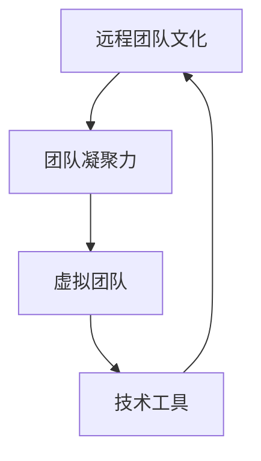

                 

### 远程团队文化的背景与重要性

在现代科技迅猛发展的时代，远程工作已经成为许多企业和组织的一种常态。远程团队文化的建设在这个背景下显得尤为重要。远程团队文化的建设不仅仅是简单地让团队成员在家中或全球任何地方工作，而是通过一系列的策略和措施，在虚拟环境中打造一种具有高度凝聚力、积极性和创新性的团队氛围。

首先，远程团队文化的建设对于组织的成功至关重要。在一个远程团队中，团队成员分布在不同的地理位置，没有日常面对面的互动，因此，文化成为了维系团队凝聚力和成员之间信任关系的关键因素。通过建立一种积极的远程文化，组织可以更好地激励员工，提高工作效率，减少员工流失率，并促进知识的共享和创新。

其次，远程团队文化的建设有助于提升团队成员的工作满意度和幸福感。在传统的办公环境中，员工往往需要承受高昂的交通成本和长时间的通勤时间，而远程工作则可以为他们提供更大的灵活性和自由度。通过建立一种支持远程工作的文化，组织可以更好地满足员工的需求，提高员工的工作满意度和生活质量。

此外，远程团队文化的建设对于全球化和数字化时代的业务运营也具有深远的影响。随着全球化的深入和数字化转型的加速，企业需要能够迅速适应不同市场和文化的变化。远程团队文化的建设可以帮助企业打破地域限制，吸引全球范围内的人才，并实现跨文化的协作与沟通。

总的来说，远程团队文化的建设是适应现代工作模式变化的重要手段。它不仅能够提高组织的竞争力和业务效率，还能够提升员工的工作体验和满意度，从而为企业的长期发展奠定坚实的基础。

### 核心概念与联系：远程团队文化、凝聚力与虚拟团队的架构

在探讨远程团队文化的建设过程中，我们首先需要理解几个核心概念：远程团队文化、团队凝聚力以及虚拟团队。这些概念不仅相互独立，而且紧密关联，共同构成了一个完整的远程工作生态系统。

**远程团队文化**：这是指组织在远程工作环境中形成的共同价值观、信念和行为准则。远程团队文化不仅包括工作方式和沟通方式，还涵盖了团队成员之间的信任、尊重和协作精神。它是远程团队得以高效运作的基础。

**团队凝聚力**：这是指团队成员之间的相互吸引力、信任和合作程度。一个具有高度凝聚力的远程团队能够更好地应对挑战，提升工作效率，并在变化多端的工作环境中保持稳定。团队凝聚力是远程团队文化的重要组成部分。

**虚拟团队**：这是指利用信息技术手段，将地理位置分散的团队成员联系起来的工作团队。虚拟团队的成员可能分布在全球的不同地方，他们通过互联网进行交流和协作。虚拟团队的架构不仅依赖于技术工具，还需要依赖于文化和管理策略来保持团队的活力和效率。

理解这些核心概念之间的关系，我们可以通过一个Mermaid流程图来展示它们之间的联系：

在这个流程图中，远程团队文化是核心，它通过技术工具支持和团队凝聚力来维系虚拟团队的运作。技术工具提供了远程团队所需的通信和协作平台，而团队凝聚力则通过文化价值观和共同目标来增强团队成员之间的联系。

**远程团队文化与团队凝聚力之间的关系**：远程团队文化塑造了团队成员的共同价值观和行为准则，这些价值观和行为准则直接影响团队凝聚力。例如，一个强调透明沟通、尊重多样性和鼓励创新的远程团队文化，能够促进团队成员之间的信任和协作，从而增强团队的凝聚力。

**虚拟团队与团队凝聚力之间的关系**：虚拟团队的成员由于地理位置的分散，面对的挑战更大，因此，团队凝聚力在这一环境中显得尤为重要。虚拟团队需要依靠强大的凝聚力来克服沟通障碍、时差问题和孤立感，确保团队成员能够高效协作。

**远程团队文化与虚拟团队技术工具之间的关系**：技术工具是远程团队文化得以实现的关键。例如，视频会议工具、项目管理软件和协作平台等，不仅提供了远程工作的基础，还使得团队成员能够更便捷地进行沟通和协作。然而，技术工具的成功实施离不开良好的远程团队文化支持。只有在文化价值观的引导下，技术工具才能发挥最大效益。

通过以上分析，我们可以看到，远程团队文化、团队凝聚力和虚拟团队三者之间相互依存、相互作用，共同构成了一个复杂而有机的远程工作生态系统。理解这些核心概念之间的关系，对于建设一个高效、有凝聚力的远程团队至关重要。

### 远程团队文化与团队凝聚力的重要性

远程团队文化和团队凝聚力在虚拟团队中扮演着至关重要的角色。首先，远程团队文化是团队凝聚力的基石。在远程工作中，由于缺乏面对面的互动，团队成员之间的联系更容易变得疏远。而一个积极的远程团队文化，通过共同的价值观、信念和行为准则，可以弥补这种缺乏，增强团队成员之间的认同感和归属感。例如，一个强调透明沟通、尊重多样性和鼓励创新的团队文化，能够激发成员之间的信任和合作，从而增强团队凝聚力。

其次，团队凝聚力对于远程团队的效率和绩效具有直接影响。一个凝聚力强的团队，成员之间的沟通更加顺畅，能够更快地解决冲突，更好地应对挑战。研究表明，高凝聚力的团队在完成复杂任务时表现更出色，工作效率更高。具体而言，当团队成员在面对共同的目标时，凝聚力可以促进协作，减少内耗，使团队整体运作更加高效。

此外，远程团队文化还能够提升员工的工作满意度和幸福感。在远程工作中，员工往往需要应对孤独感和工作压力。一个良好的团队文化可以为员工提供心理支持，增强他们的归属感和成就感，从而提高工作满意度。例如，一些远程团队通过定期的虚拟团队建设活动，如在线游戏、分享会等，来增强团队成员之间的联系，提升整体幸福感。

团队凝聚力在远程团队中具有多方面的积极影响，具体包括：

1. **提升工作效率**：高凝聚力的团队在完成任务时能够更好地协调资源，快速响应变化，从而提高工作效率。
2. **降低员工流失率**：一个具有凝聚力的团队能够提供更好的工作氛围和职业发展机会，从而降低员工流失率。
3. **促进知识共享**：凝聚力强的团队更倾向于分享知识和经验，促进团队整体的技能提升和创新能力。
4. **增强团队稳定性**：面对外部压力和内部挑战，高凝聚力的团队能够更好地保持稳定，减少团队动荡。

总之，远程团队文化和团队凝聚力是远程团队高效运作的关键因素。通过建立积极的团队文化和培养强大的团队凝聚力，组织可以更好地应对远程工作中的挑战，提升整体绩效，并实现长期可持续发展。

### 建立远程团队文化的策略

建立远程团队文化是一个系统工程，需要综合考虑多种因素，并采取一系列策略和方法。以下是几个关键的策略，有助于构建一个积极、高效且富有凝聚力的远程团队文化。

#### 制定明确的远程工作政策

首先，组织需要制定明确的远程工作政策，为团队成员提供清晰的工作指导和支持。这包括工作时间、工作地点、工作设备等方面的规定。明确的政策可以帮助团队成员更好地理解组织对远程工作的期望，减少误解和冲突。

#### 建立虚拟办公室

虚拟办公室是远程团队文化的重要组成部分，它不仅是一个物理空间的概念，更是一个文化和交流的平台。通过虚拟办公室，团队成员可以在线上共享信息和资源，参加会议和培训，增强彼此之间的联系。建立虚拟办公室可以采用各种协作工具，如Slack、Trello、Microsoft Teams等，这些工具能够提供实时沟通、任务分配和项目跟踪等功能。

#### 定期组织虚拟团队建设活动

虚拟团队建设活动是增强团队成员之间联系和信任的重要手段。通过定期的在线团队建设活动，如虚拟午餐会、在线游戏和社交聚会，团队成员可以放松心情，增进了解，从而提高团队凝聚力。这些活动不仅可以促进团队成员之间的交流，还能增强团队的凝聚力，使团队成员更加愿意为团队的目标努力。

#### 强化沟通和反馈机制

沟通是远程团队文化建设的核心。组织需要建立高效的沟通机制，确保信息的透明传递和及时反馈。这包括定期的状态更新、项目会议、一对一会议等。此外，组织还应该鼓励团队成员提出意见和建议，建立开放和坦诚的沟通氛围。通过及时沟通和反馈，团队成员可以更好地理解彼此的工作进展和需求，减少误解和冲突。

#### 培养共同价值观和目标

共同价值观和目标是团队凝聚力的重要基础。组织需要明确和传达团队的共同价值观和目标，确保所有成员都朝着同一个方向努力。例如，可以通过制定团队使命、愿景和核心价值观，并确保这些价值观在日常工作中得到贯彻和实践。团队成员在共同价值观和目标的引导下，能够更好地协同合作，实现团队目标。

#### 鼓励知识共享和培训

知识共享和培训是提升团队技能和创新能力的重要途径。组织可以通过在线培训课程、知识分享会和技术研讨会等形式，促进团队成员之间的知识交流和技能提升。这不仅有助于提高团队的整体素质，还能激发成员的创新思维和解决问题的能力。

#### 建立激励机制

激励机制是保持团队成员积极性和动力的重要手段。组织可以通过设立各种奖励和激励机制，如优秀员工表彰、团队竞赛和奖金等，来鼓励团队成员为团队的成功贡献自己的力量。这些激励措施可以增强团队成员的成就感和归属感，提高团队的整体士气。

通过以上策略，组织可以有效地建立远程团队文化，提升团队的凝聚力和工作效率。在远程工作环境中，良好的团队文化不仅能够提高员工的工作满意度和幸福感，还能促进团队的创新和发展，为组织的长期成功奠定坚实的基础。

### 案例分析：成功建立远程团队文化的经验与教训

在现代远程工作的浪潮中，一些组织已经成功地建立了强大的远程团队文化，成为行业典范。本文将分析这些组织的成功经验，并提出相应的教训，为其他企业或团队提供有价值的参考。

#### 案例一：Atlassian（音云科技）

Atlassian是一家全球知名的技术公司，其远程工作文化闻名于世。Atlassian的成功经验主要体现在以下几个方面：

**共同价值观的建立**：Atlassian明确了其核心价值观，如开放透明、客户至上、灵活变通等。这些价值观不仅体现在公司政策中，还渗透到员工的日常工作中。例如，员工可以自由选择工作地点和时间，这种灵活性增强了员工的归属感和满意度。

**强大的沟通机制**：Atlassian利用各种协作工具，如JIRA和Confluence，确保团队成员之间的沟通顺畅。此外，公司定期组织虚拟团队建设活动，如“雪天聚会”和“虚拟运动会”，以增强团队成员之间的联系和信任。

**知识共享**：Atlassian鼓励员工参与各种在线培训和学习活动，并通过内部知识库和社区论坛促进知识共享。这种文化使得员工能够不断提升自己的技能，也为团队的创新提供了源源不断的动力。

**激励机制**：Atlassian通过设立各种奖项和表彰，如“Jelly of the Week”（每周优秀员工）和“HackerRank”，来激励员工的积极性和创造力。这些激励机制不仅提高了员工的满意度，还增强了团队的凝聚力。

**教训**：Atlassian的成功表明，共同价值观的明确传达和持续的强化是建立远程团队文化的关键。此外，强大的沟通机制和知识共享平台能够促进团队的协作和创新。激励机制的合理应用可以激发员工的潜能，提高工作效率。

#### 案例二：Buffer（缓冲）

Buffer是一家社交媒体管理平台，其远程团队文化以其灵活性和开放性著称。

**灵活的工作安排**：Buffer采用每周工作40小时的制度，并允许员工自主安排工作时间。这种灵活性使得员工能够更好地平衡工作与生活，提高了工作效率和满意度。

**开放的沟通文化**：Buffer鼓励员工在任何时候表达自己的想法和意见，并通过公司内部通讯工具，如Slack和Trello，确保信息的透明传递。这种开放的沟通文化有助于建立信任和尊重，增强了团队的凝聚力。

**虚拟团队建设**：Buffer定期组织在线团队建设活动，如虚拟午餐会、虚拟旅行和在线游戏。这些活动不仅增强了团队成员之间的联系，还提高了团队的整体士气。

**透明度**：Buffer在公司内部建立了高度透明的文化，所有员工都能看到公司的财务状况、战略规划和决策过程。这种透明度增强了员工的参与感和责任感。

**教训**：Buffer的成功经验表明，灵活的工作安排和开放的沟通文化能够显著提高员工的工作满意度和团队的凝聚力。此外，定期组织团队建设活动有助于增强团队成员之间的信任和合作。高度透明的文化能够增强员工的参与感和责任感，从而推动团队的整体发展。

#### 案例三：Trello（特雷福）

Trello是一个知名的项目管理工具，其自身也实践了远程团队文化。

**协作工具的使用**：Trello团队利用Trello自身工具进行项目管理和协作，确保团队成员能够实时跟踪项目进度和任务分配。这种工具的使用不仅提高了工作效率，还增强了团队成员之间的协同性。

**灵活的工作制度**：Trello采用灵活的工作制度，允许员工自由选择工作时间，这有助于提高员工的工作满意度和灵活性。

**虚拟团队建设**：Trello通过定期的在线会议和团队建设活动，如虚拟会议和在线聚会，来增强团队成员之间的联系和信任。

**开放的文化**：Trello鼓励员工提出新想法和意见，并通过公开的反馈渠道确保员工的意见和建议得到重视。这种开放的文化促进了创新和团队的协作。

**教训**：Trello的案例表明，协作工具的有效使用和灵活的工作制度能够显著提高远程团队的工作效率。此外，定期组织团队建设活动和开放的文化氛围有助于增强团队的凝聚力和创新能力。

通过分析以上案例，我们可以总结出以下成功建立远程团队文化的关键经验：

1. **共同价值观的明确传达**：共同价值观是团队文化的基石，需要通过政策、培训和日常实践来不断强化。
2. **强大的沟通机制**：高效的沟通是远程团队运作的关键，需要建立透明的沟通渠道和定期的沟通活动。
3. **团队建设活动**：定期的团队建设活动有助于增强团队成员之间的联系和信任。
4. **灵活的工作安排**：灵活的工作制度能够提高员工的工作满意度和灵活性，从而促进团队的整体效率。
5. **开放的文化**：开放的文化氛围能够促进创新和团队成员之间的协作，增强团队的凝聚力。

同时，我们也需要从案例中吸取教训，避免可能出现的挑战和问题，如沟通障碍、工作隔离和文化差异等。通过借鉴这些成功经验和教训，企业或团队可以更好地建立和维持远程团队文化，实现长期可持续发展。

### 远程团队沟通与协作的技巧

在远程团队中，沟通和协作的效率直接影响团队的工作效果和整体绩效。以下是一些关键的技巧和工具，帮助远程团队成员更好地沟通和协作。

#### 1. 使用合适的协作工具

选择适合团队的协作工具是确保远程工作顺利进行的关键。以下是一些常用的协作工具：

- **Slack**：Slack是一款流行的团队沟通工具，提供了实时消息、频道讨论、文件共享和集成第三方应用等功能，有助于团队成员高效沟通和协作。
  
- **Microsoft Teams**：Teams集成了聊天、视频会议、文档协作和项目管理等多种功能，非常适合需要跨部门协作的大型团队。

- **Trello**：Trello是一个基于看板的项目管理工具，可以清晰地展示项目进度、任务分配和团队成员的责任。

- **Zoom**：Zoom是一款功能强大的视频会议工具，提供了高清视频、语音通话和屏幕共享等功能，适合进行远程会议和培训。

#### 2. 确保及时沟通

及时沟通是避免误解和冲突的关键。以下是一些确保及时沟通的技巧：

- **定期状态更新**：定期通过协作工具或邮件向团队成员更新工作进度和遇到的问题，确保信息的透明和及时。

- **实时互动**：在任务讨论和决策过程中，尽量使用实时沟通工具，如Slack或Zoom，以便团队成员能够立即回应和讨论。

- **明确的沟通目标**：每次沟通前，明确讨论的目标和期望结果，有助于提高沟通的效率和质量。

#### 3. 建立高效的团队会议流程

团队会议是远程团队沟通和协作的重要方式。以下是一些建立高效团队会议流程的技巧：

- **会议前准备**：提前通知会议议程、参会人员和所需材料，确保所有参与者都做好会议准备。

- **会议中控制时间**：严格控制会议时间，避免长时间的无效率讨论。可以使用时间管理工具，如Trello的计时功能，确保每个议程都有明确的讨论时间。

- **明确决策流程**：会议中要明确决策流程，确保所有关键问题都得到讨论和解决。可以使用投票功能或决策工具，如Poll Everywhere，进行快速投票和决策。

- **会议后跟进**：会议结束后，及时总结会议内容和决策结果，并通过邮件或协作工具传达给所有参与者。

#### 4. 促进知识共享和经验交流

知识共享和经验交流是提高团队整体技能和创新能力的重要途径。以下是一些促进知识共享和经验交流的技巧：

- **建立内部知识库**：建立一个集中的内部知识库，如Confluence，收集和整理团队成员的经验和知识，方便团队成员随时查阅和分享。

- **定期举办知识分享会**：定期举办线上或线下的知识分享会，让团队成员分享自己的经验和见解，促进知识的传播和交流。

- **利用协作工具的文档共享功能**：利用协作工具的文档共享功能，如Google Docs和Microsoft Office 365，确保团队成员能够实时编辑和更新文档，提高协作效率。

#### 5. 建立信任和尊重

建立信任和尊重是远程团队高效协作的基础。以下是一些建立信任和尊重的技巧：

- **开放沟通**：鼓励团队成员在任何时候表达自己的想法和意见，建立开放和坦诚的沟通氛围。

- **尊重多样性**：尊重团队成员的文化背景和个性差异，避免偏见和歧视，促进团队的和谐。

- **及时反馈**：对团队成员的工作进行及时反馈，肯定其优点和提出改进建议，增强团队成员的自信心和归属感。

通过以上技巧和工具，远程团队成员可以更好地沟通和协作，提高团队的整体效率和绩效。有效的沟通和协作不仅能够提升工作效果，还能够增强团队的凝聚力和创新能力，为组织的长期发展奠定坚实基础。

### 远程团队文化评估与优化

为了确保远程团队文化能够持续发展并保持其活力，定期的评估与优化是必不可少的。评估不仅能够发现潜在的问题，还能够提供改进的方向，从而进一步提升团队的整体效能和成员的满意度。

#### 评估方法

1. **员工反馈调查**：通过定期进行的员工反馈调查，收集团队成员对团队文化、沟通效率、工作满意度和团队凝聚力的看法。这种调查可以通过在线问卷或面对面访谈的形式进行，确保反馈的真实性和全面性。

2. **绩效评估**：结合团队和个人的绩效评估结果，分析团队文化对工作产出和质量的影响。通过对比远程工作前后的绩效数据，可以直观地看出文化变革的效果。

3. **关键绩效指标（KPI）**：设定一系列关键绩效指标，如项目按时交付率、员工流失率、知识共享频率等，定期跟踪这些指标的变化，以评估团队文化的实际效果。

4. **团队建设活动反馈**：通过团队建设活动的参与度和反馈，评估团队成员对团队文化的认同感和参与感。

#### 优化策略

1. **强化培训与发展**：根据评估结果，识别团队成员在技能和知识方面的短板，提供相应的培训和发展机会。通过提升团队成员的能力，可以更好地适应远程工作环境，增强团队凝聚力。

2. **改善沟通机制**：针对沟通中的问题，优化沟通流程和工具。例如，可以增加沟通频次，提供更直观的沟通方式，确保信息传递的准确性和及时性。

3. **鼓励知识共享**：通过设立知识共享平台和奖励机制，鼓励团队成员分享经验和知识。例如，可以设立“知识之星”奖项，表彰那些积极参与知识共享的员工。

4. **优化工作流程**：根据评估结果，重新审视和优化团队的工作流程，消除冗余步骤和低效环节，提高团队的整体效率。

5. **文化价值观的再教育**：通过定期的文化价值观培训，确保团队成员对共同价值观和目标的认同，强化团队文化的核心要素。

#### 持续改进

1. **建立反馈闭环**：建立反馈闭环机制，确保评估结果能够及时应用于实践，不断优化团队文化。通过持续改进，团队文化可以更好地适应外部环境的变化。

2. **鼓励创新**：在团队文化中植入创新精神，鼓励团队成员提出改进意见和建议。通过不断尝试和优化，团队可以始终保持活力和竞争力。

3. **关注个体发展**：关注每个团队成员的职业发展和个人成长，提供个性化的支持和发展机会。这不仅能提高员工的工作满意度，还能增强团队的凝聚力。

通过定期评估和持续优化，远程团队文化可以不断适应和改进，保持其活力和有效性，从而为团队的成功和组织的长期发展提供坚实的基础。

### 远程团队领导力的关键要素

在远程团队中，领导力是确保团队凝聚力和工作效率的核心。远程团队领导需要具备一系列独特的技能和策略，以应对远程工作环境中的特殊挑战。

#### 1. 明确期望和目标

远程团队领导首先要明确团队的期望和目标，并将其传达给每个成员。这包括明确项目目标、任务分工、时间表和质量标准。通过清晰的期望和目标，团队成员可以更好地理解自己的工作责任，从而提高工作效率和达成共识。

#### 2. 强调沟通和透明度

远程团队领导必须建立高效的沟通机制，确保信息的透明传递。这包括定期举行团队会议、一对一会议和状态更新，使用协作工具确保信息的及时共享。透明度的建立有助于减少误解和冲突，增强团队成员之间的信任和合作。

#### 3. 培养团队凝聚力

远程团队领导需要采取措施培养团队凝聚力，即使在虚拟环境中也能保持团队成员之间的紧密联系。可以通过组织虚拟团队建设活动、定期的社交聚会和知识分享会来增强团队成员之间的情感联系和共同目标感。

#### 4. 鼓励自主性和责任感

远程工作环境要求团队成员具备较高的自主性和责任感。远程团队领导应鼓励团队成员自我管理和自我激励，通过设定明确的目标和期望，并提供必要的资源和支持，帮助团队成员实现个人和团队的目标。

#### 5. 提供反馈和支持

远程团队领导应定期提供反馈和支持，帮助团队成员了解自己的工作表现，识别改进机会。通过及时反馈，领导可以鼓励团队成员保持积极的态度，提高工作质量和效率。同时，领导应提供必要的心理支持和资源，帮助团队成员应对远程工作中的挑战和压力。

#### 6. 管理团队动态

远程团队领导需要有效管理团队动态，包括团队成员的变化、任务分配的调整和外部环境的变化。通过灵活的领导策略，领导可以确保团队始终具备高效的工作能力和应对能力，保持团队的稳定和持续发展。

#### 7. 促进知识共享和创新

远程团队领导应鼓励团队成员分享知识和经验，促进团队内部的创新。通过设立内部知识库、定期举办培训和学习活动，领导可以激发团队成员的学习兴趣和创新精神，提升团队的整体竞争力。

通过以上关键要素，远程团队领导可以确保团队在虚拟环境中保持高效和凝聚力，实现组织的战略目标。有效的远程领导力不仅能够提高团队成员的工作满意度，还能推动团队的长期发展，为组织的成功奠定坚实基础。

### 远程团队绩效管理策略

在远程工作环境中，绩效管理策略需要特别关注如何确保团队成员的工作质量和效率，同时促进团队的整体发展。以下是几个关键策略：

#### 1. 设定明确的绩效目标

首先，远程团队领导需要与团队成员共同设定明确的绩效目标。这些目标应具体、可衡量，并与团队的总体战略目标保持一致。通过明确的目标，团队成员可以清晰地了解自己的工作责任和期望，从而提高工作效率。

#### 2. 定期绩效评估

远程团队绩效评估应定期进行，以确保团队成员的工作表现能够持续改进。评估可以通过多种方式进行，如一对一会议、在线反馈调查和项目回顾会议。评估过程中，领导应关注团队成员在任务完成情况、工作质量、时间管理、团队协作等方面的表现，提供具体的反馈和建议。

#### 3. 利用绩效管理工具

利用绩效管理工具，如Trello、Asana或Microsoft Teams，可以帮助远程团队更有效地跟踪任务进度、评估绩效和提供反馈。这些工具提供了可视化的任务管理和协作平台，使团队成员能够实时了解项目的进展，确保工作按时完成。

#### 4. 设立激励机制

为了激励团队成员保持高水平的绩效，组织可以设立各种激励机制，如奖金、表彰和晋升机会。激励机制不仅能够提高员工的工作积极性，还能增强团队的凝聚力和整体效率。此外，组织还可以通过设立虚拟奖杯或认证，为在绩效评估中表现优异的员工提供荣誉。

#### 5. 提供持续反馈和支持

持续反馈和支持是远程团队绩效管理的重要组成部分。领导应定期与团队成员进行一对一的沟通，了解他们在工作中遇到的问题和挑战，并提供必要的支持和资源。通过及时的反馈，团队成员可以及时调整自己的工作策略，提高工作效率和绩效。

#### 6. 鼓励自主性和自我管理

远程工作环境要求团队成员具备较高的自主性和自我管理能力。领导应鼓励团队成员自主设定目标、规划工作和时间，并为其提供必要的指导和支持。通过培养自主性，团队成员可以更好地适应远程工作模式，提高工作质量和效率。

#### 7. 关注团队成员的工作生活平衡

远程工作虽然提供了灵活的工作时间和地点，但也可能给团队成员带来工作与生活平衡的挑战。领导应关注团队成员的工作生活平衡，鼓励他们在工作之余进行休息和放松，确保他们的身心健康。通过关注工作生活平衡，领导可以提升团队成员的工作满意度和幸福感，从而提高整体绩效。

通过以上策略，组织可以更有效地管理远程团队的绩效，确保团队成员能够保持高水平的效率和工作质量。有效的绩效管理不仅能够提高团队的整体表现，还能促进组织的长期发展和成功。

### 远程团队文化的未来趋势与全球化影响

随着全球化和数字化转型的加速，远程团队文化正面临一系列新兴趋势，这些趋势不仅改变了远程工作的方式，也对组织和文化产生了深远影响。

首先，**全球化与多元文化的融合**将成为远程团队文化的重要特征。随着企业吸引全球各地的人才，远程团队将更加多元化和国际化。这要求组织不仅要在文化上包容多样性，还要在价值观和行为准则上实现全球化的一致性。例如，跨国公司可能需要通过设立统一的全球价值观和核心文化，来确保在不同国家和地区工作的团队成员能够保持一致的工作态度和行为。

其次，**虚拟现实（VR）和增强现实（AR）技术的应用**将进一步提升远程团队的工作体验和协作效率。通过VR和AR技术，团队成员可以在虚拟空间中进行面对面的互动，模拟现实会议场景，增强现实沟通。这种技术不仅可以克服地理位置的限制，还能提供更加沉浸式的协作体验，提高团队的凝聚力和工作效率。

此外，**人工智能（AI）和机器学习（ML）的应用**将极大地改变远程团队的管理和协作方式。AI技术可以自动化任务分配、进度跟踪和绩效评估等管理活动，减少人为错误，提高管理效率。同时，ML算法可以通过分析团队成员的行为和沟通模式，提供个性化的建议和优化方案，进一步提升团队的整体效能。

在**持续学习和知识共享**方面，远程团队文化也将更加注重自我提升和团队发展。随着在线教育平台和技术培训工具的普及，远程团队成员可以更方便地获取新知识和技能，从而保持竞争优势。组织可以通过设立内部学习社区、提供在线课程和培训资源，鼓励团队成员不断学习和成长，提升团队的整体能力和创新水平。

最后，**远程团队文化的未来将更加注重员工体验和幸福感**。随着远程工作的普及，组织越来越意识到员工的工作满意度和幸福感对团队绩效和组织成功的重要性。因此，未来远程团队文化将更加关注员工的身心健康、工作生活平衡和心理支持，通过提供灵活的工作安排、健康福利和心理健康服务，提升员工的整体幸福感和工作满意度。

总之，远程团队文化的未来将随着全球化、数字化技术和人工智能的不断发展而不断演变。组织需要积极适应这些趋势，通过建立包容多元、高效协作和创新学习的文化，实现长期可持续的发展和成功。

### 远程团队文化建设的总结与未来展望

远程团队文化的建设对于现代企业的成功至关重要。它不仅能够提升团队的整体效能和员工的满意度，还能增强组织的竞争力和创新能力。通过明确核心价值观、建立强大的沟通机制、定期组织团队建设活动、优化工作流程以及提供持续反馈和支持，组织可以打造一个积极、高效且富有凝聚力的远程团队文化。

未来，随着全球化、数字化和人工智能技术的不断发展，远程团队文化将面临新的挑战和机遇。组织需要不断适应这些变化，通过引入虚拟现实、增强现实和人工智能等新技术，提升远程工作的体验和协作效率。同时，注重员工的身心健康和工作生活平衡，为团队成员提供持续的学习和发展机会，以保持团队的活力和竞争力。

总之，远程团队文化的建设是一个持续的过程，需要组织、领导和团队成员共同努力。只有通过不断优化和适应，组织才能在远程工作环境中保持领先地位，实现长期的成功和可持续发展。

### 附录

#### A.1 远程团队文化相关资源

- **书籍**：
  - "Remote: Office Not Required" by Jason Fried and David Heinemeier Hansson
  - "Working from Home: How to Succeed as a Telecommuter" by Kristin Arnold

- **在线课程**：
  - Coursera: "Virtual Team Management and Collaboration"
  - LinkedIn Learning: "Building a Remote Team"

- **博客和文章**：
  - Atlassian Blog: "Creating a Successful Remote Team Culture"
  - Buffer Blog: "Remote Work Best Practices"

#### A.2 远程团队文化建设工具

- **协作工具**：
  - Slack
  - Microsoft Teams
  - Zoom

- **项目管理工具**：
  - Trello
  - Asana
  - JIRA

- **知识共享平台**：
  - Confluence
  - Google Drive
  - SharePoint

#### A.3 远程团队文化研究参考文献

- **学术文章**：
  - "Virtual Teams: A Review of Recent Research and Trends" by D. L. Yammarino, F. B. Bliese, and T. E. Scandura
  - "Cultural Integration in Virtual Teams: A Meta-Analytic Perspective" by J. H. Ferneley and A. F. Cropley

- **研究报告**：
  - "The State of Remote Work" by Buffer
  - "The Future of Work" by McKinsey & Company

这些资源为远程团队文化的建设和实践提供了丰富的理论基础和实践指导，有助于组织和管理者更好地理解和应对远程工作环境中的挑战。通过参考这些文献和工具，组织可以不断完善远程团队文化，提高团队的凝聚力和工作效率。

### 感谢与致谢

最后，我要感谢AI天才研究院和《禅与计算机程序设计艺术》的读者们。本文得以完成，离不开大家的支持和鼓励。感谢您们的耐心阅读，期待您的宝贵意见和反馈。

作者：AI天才研究院/AI Genius Institute & 禅与计算机程序设计艺术 /Zen And The Art of Computer Programming

