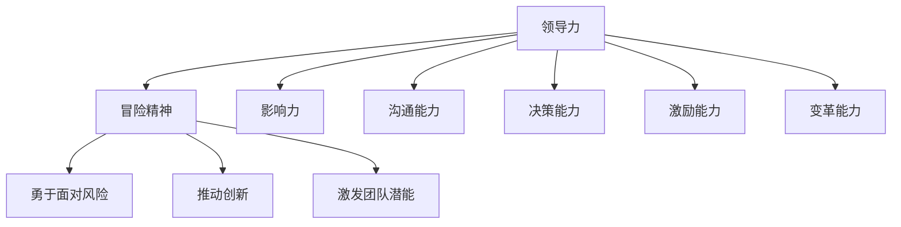
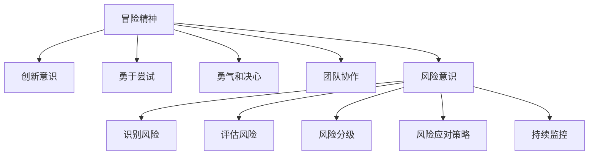
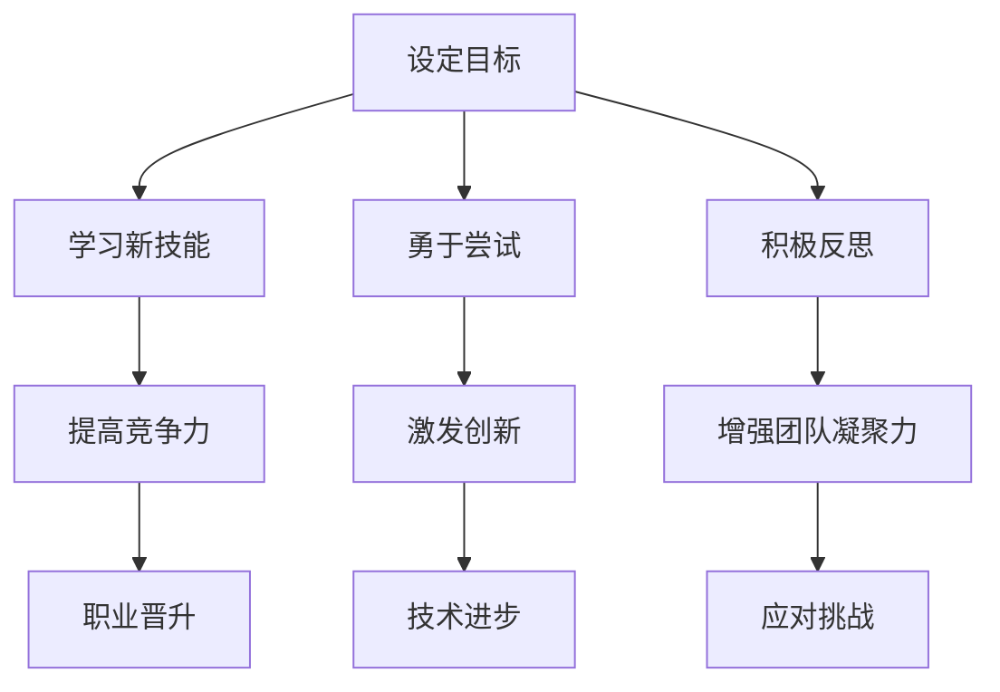
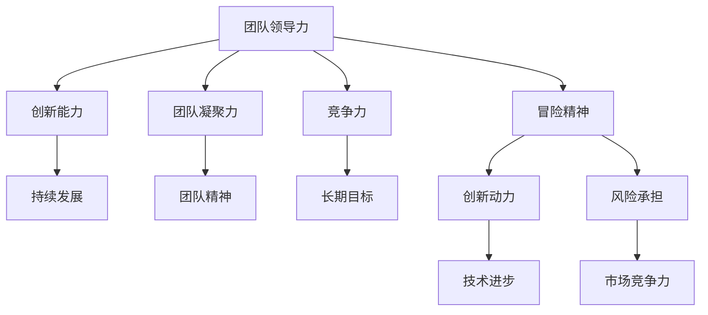
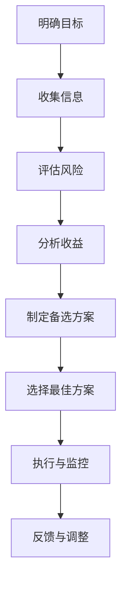
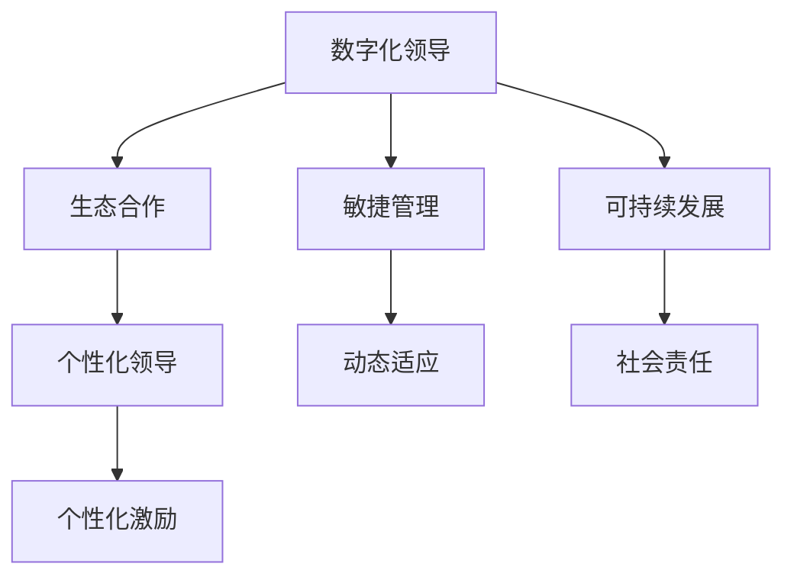
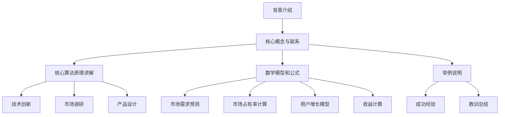

                 

### 1.1 领导力的定义与重要性

领导力是一种特殊的技能，它关乎个人对团队和组织的引导、影响和激励能力。简而言之，领导力是一种推动团队向着共同目标前进的能力。这种能力不仅仅体现在权威式的管理中，还包括激发团队成员的积极性、创造力和协作精神。

领导力的重要性不容忽视。首先，领导力能够促进组织的发展。一个具备强大领导力的领导者，能够引导团队克服各种困难和挑战，实现组织的战略目标。其次，领导力能够增强团队的凝聚力。一个优秀的领导者，能够建立起团队成员之间的信任和尊重，使团队成员在共同目标下团结一致。最后，领导力在解决问题和应对挑战方面发挥着关键作用。领导者需要具备敏锐的洞察力和决策能力，能够在复杂多变的环境中迅速做出正确的决策。

在技术领域，领导力同样至关重要。随着技术的发展，企业面临着前所未有的机遇和挑战。领导者需要具备前瞻性思维，能够洞察行业发展趋势，引领团队进行技术创新。同时，领导者还需要具备沟通能力和团队管理能力，能够有效地协调团队成员的工作，发挥每个人的优势，共同实现技术突破。

### 1.2 领导力的核心要素

领导力的核心要素包括以下几个方面：

1. **影响力**：影响力是领导力的核心，它指的是领导者通过言行影响他人思想和行为的能力。一个具备影响力的领导者，能够激发团队成员的积极性和创造力，推动团队向前发展。

2. **沟通能力**：沟通能力是领导者与团队成员之间有效交流的基础。领导者需要具备良好的沟通技巧，能够清晰地表达自己的思想和意图，同时也能够倾听和理解团队成员的意见和建议。

3. **决策能力**：决策能力是领导者的一项重要能力。领导者需要在面对复杂多变的环境时，能够迅速做出正确的决策。这要求领导者具备敏锐的洞察力、丰富的经验和冷静的判断力。

4. **激励能力**：激励能力是领导者激发团队成员工作动力和创造力的关键。领导者需要了解团队成员的需求，能够提供合适的激励措施，激发团队成员的潜力。

5. **变革能力**：变革能力是领导者推动组织变革、适应市场变化的关键。领导者需要具备创新的思维和勇于尝试的精神，能够引领组织进行结构性调整和创新。

### 1.3 领导风格与效果

领导风格是指领导者处理组织和管理事务的方式和方法。不同的领导风格适用于不同的情境，其效果也因人而异。以下是几种常见的领导风格：

1. **权威式领导**：权威式领导强调领导者的权威和决策权，领导者做出决策并要求团队成员执行。这种方式适用于需要快速决策和严格控制的情境，但可能导致团队成员缺乏主动性和创造力。

2. **民主式领导**：民主式领导鼓励团队成员参与决策过程，领导者与团队成员共同讨论并做出决策。这种方式有助于增强团队凝聚力，提高团队成员的参与感和责任感，但可能导致决策过程耗时较长。

3. **参与式领导**：参与式领导强调领导者与团队成员之间的互动和合作，领导者与团队成员共同制定目标和行动计划。这种方式有助于建立信任和共识，提高团队的协作效率，但需要领导者具备较高的沟通能力和协调能力。

4. **变革式领导**：变革式领导强调领导者推动组织变革和创新，领导者具备强烈的变革意识和创新精神。这种方式适用于需要重大变革和创新的情境，但可能面临较大的风险和挑战。

### 1.4 领导力的培养

领导力的培养是一个长期的过程，需要从以下几个方面入手：

1. **自我认知**：领导者需要深入了解自己的优点和不足，明确自己的职业发展目标。

2. **专业知识**：领导者需要不断学习新知识，提高自己的专业素养。

3. **实践锻炼**：领导者需要通过实际工作，锻炼自己的领导能力。

4. **团队建设**：领导者需要关注团队建设，培养团队凝聚力和协作能力。

5. **持续反思**：领导者需要定期反思自己的领导行为，总结经验教训，不断改进。

通过以上方法，领导者可以不断提升自己的领导力，为组织的发展贡献力量。

### 1.5 领导力与冒险精神的联系

领导力与冒险精神之间存在密切的联系。一个具备强大领导力的领导者，往往也具备冒险精神。这是因为：

1. **勇于面对风险**：领导者需要具备勇于面对风险和挑战的勇气。在技术领域，风险和挑战往往不可避免。一个具备冒险精神的领导者，能够在面对风险时，做出正确的决策，带领团队迎接挑战。

2. **推动创新**：冒险精神是推动创新的重要动力。领导者需要具备创新思维和勇于尝试的精神，能够引领团队进行技术创新。这种冒险精神有助于组织在竞争激烈的市场中脱颖而出。

3. **激发团队潜能**：冒险精神能够激发团队成员的积极性和创造力。一个具备冒险精神的领导者，能够鼓励团队成员勇于尝试新事物，发挥自己的潜能，共同实现技术突破。

综上所述，领导力与冒险精神相辅相成，共同推动组织的发展。一个优秀的领导者，既需要具备强大的领导力，也需要具备冒险精神。

### 1.6 总结与展望

本文对领导力的定义、核心要素、领导风格以及领导力与冒险精神的关系进行了详细探讨。通过分析，我们可以得出以下结论：

1. 领导力是一种推动团队和组织发展的重要能力，它关乎个人对团队和组织的引导、影响和激励能力。

2. 领导力的核心要素包括影响力、沟通能力、决策能力、激励能力和变革能力。

3. 领导风格因情境而异，不同的领导风格适用于不同的组织情境，其效果也因人而异。

4. 领导力与冒险精神之间存在密切的联系，一个具备强大领导力的领导者，往往也具备冒险精神。

未来，随着技术的发展和市场的变化，领导力将面临新的挑战和机遇。领导者需要不断提升自己的领导力和冒险精神，以应对复杂多变的环境，推动组织实现持续发展。

### 图 1：领导力与冒险精神的联系架构

以下是一个简化的 Mermaid 流程图，展示领导力与冒险精神之间的联系架构：

### 1.7 推荐阅读

1. 拉姆·查兰，《领导力》：一本关于领导力的经典著作，详细阐述了领导力的核心要素和实践方法。

2. 彼得·德鲁克，《管理的实践》：一本关于管理的经典著作，探讨了领导力、管理技能和团队建设的重要性。

3. 杰弗里·菲弗，《领导者的特质》：一本关于领导者特质和领导力发展的书，提供了实用的指导和建议。

4. 约翰·P·科特，《领导力的引擎》：一本关于领导力在组织变革中作用的书，探讨了领导力如何推动组织创新和持续发展。

通过阅读这些书籍，读者可以更深入地了解领导力和冒险精神的本质和实践方法，为自己的职业发展提供有益的指导。

---

**注**：以上内容为《领导力与冒险精神：突破舒适区的勇气》第1章的部分内容，根据要求进行了详细阐述。接下来的章节将继续探讨领导力的其他方面，以及领导力与冒险精神在实际中的应用。

# 《领导力与冒险精神：突破舒适区的勇气》

**关键词：**领导力、冒险精神、舒适区、突破、组织发展、团队建设

**摘要：**本文从领导力的定义、核心要素、领导风格等方面探讨了领导力的重要性，并分析了领导力与冒险精神之间的密切联系。文章还讨论了如何通过突破舒适区来提升领导力，以及领导力在组织发展和团队建设中的应用。通过案例分析，本文提供了实用的指导和建议，帮助领导者提升自己的领导力和冒险精神，推动组织的持续发展。

---

## 第一部分：领导力与冒险精神的基本理论

### 第1章：领导力概述

#### 1.1 领导力的定义与重要性

领导力是一种特殊的技能，它关乎个人对团队和组织的引导、影响和激励能力。简而言之，领导力是一种推动团队向着共同目标前进的能力。这种能力不仅仅体现在权威式的管理中，还包括激发团队成员的积极性、创造力和协作精神。

领导力的重要性体现在以下几个方面：

1. **促进组织发展**：领导力能够激发员工的潜能，推动组织实现持续发展。一个具备强大领导力的领导者，能够引导团队克服各种困难和挑战，实现组织的战略目标。

2. **增强团队凝聚力**：有效的领导力能够增强团队凝聚力，提高团队协作效率。一个优秀的领导者，能够建立起团队成员之间的信任和尊重，使团队成员在共同目标下团结一致。

3. **解决问题与应对挑战**：领导力在解决组织内部问题和应对外部挑战方面发挥着关键作用。领导者需要具备敏锐的洞察力和决策能力，能够在复杂多变的环境中迅速做出正确的决策。

在技术领域，领导力同样至关重要。随着技术的发展，企业面临着前所未有的机遇和挑战。领导者需要具备前瞻性思维，能够洞察行业发展趋势，引领团队进行技术创新。同时，领导者还需要具备沟通能力和团队管理能力，能够有效地协调团队成员的工作，发挥每个人的优势，共同实现技术突破。

#### 1.2 领导力的核心要素

领导力的核心要素包括以下几个方面：

1. **影响力**：影响力是领导力的核心，它指的是领导者通过言行影响他人思想和行为的能力。一个具备影响力的领导者，能够激发团队成员的积极性和创造力，推动团队向前发展。

2. **沟通能力**：沟通能力是领导者与团队成员之间有效交流的基础。领导者需要具备良好的沟通技巧，能够清晰地表达自己的思想和意图，同时也能够倾听和理解团队成员的意见和建议。

3. **决策能力**：决策能力是领导者的一项重要能力。领导者需要在面对复杂多变的环境时，能够迅速做出正确的决策。这要求领导者具备敏锐的洞察力、丰富的经验和冷静的判断力。

4. **激励能力**：激励能力是领导者激发团队成员工作动力和创造力的关键。领导者需要了解团队成员的需求，能够提供合适的激励措施，激发团队成员的潜力。

5. **变革能力**：变革能力是领导者推动组织变革、适应市场变化的关键。领导者需要具备创新的思维和勇于尝试的精神，能够引领组织进行结构性调整和创新。

#### 1.3 领导风格与效果

领导风格是指领导者处理组织和管理事务的方式和方法。不同的领导风格适用于不同的情境，其效果也因人而异。以下是几种常见的领导风格：

1. **权威式领导**：权威式领导强调领导者的权威和决策权，领导者做出决策并要求团队成员执行。这种方式适用于需要快速决策和严格控制的情境，但可能导致团队成员缺乏主动性和创造力。

2. **民主式领导**：民主式领导鼓励团队成员参与决策过程，领导者与团队成员共同讨论并做出决策。这种方式有助于增强团队凝聚力，提高团队成员的参与感和责任感，但可能导致决策过程耗时较长。

3. **参与式领导**：参与式领导强调领导者与团队成员之间的互动和合作，领导者与团队成员共同制定目标和行动计划。这种方式有助于建立信任和共识，提高团队的协作效率，但需要领导者具备较高的沟通能力和协调能力。

4. **变革式领导**：变革式领导强调领导者推动组织变革和创新，领导者具备强烈的变革意识和创新精神。这种方式适用于需要重大变革和创新的情境，但可能面临较大的风险和挑战。

#### 1.4 领导力的培养

领导力的培养是一个长期的过程，需要从以下几个方面入手：

1. **自我认知**：领导者需要深入了解自己的优点和不足，明确自己的职业发展目标。

2. **专业知识**：领导者需要不断学习新知识，提高自己的专业素养。

3. **实践锻炼**：领导者需要通过实际工作，锻炼自己的领导能力。

4. **团队建设**：领导者需要关注团队建设，培养团队凝聚力和协作能力。

5. **持续反思**：领导者需要定期反思自己的领导行为，总结经验教训，不断改进。

通过以上方法，领导者可以不断提升自己的领导力，为组织的发展贡献力量。

#### 1.5 领导力与冒险精神的联系

领导力与冒险精神之间存在密切的联系。一个具备强大领导力的领导者，往往也具备冒险精神。这是因为：

1. **勇于面对风险**：领导者需要具备勇于面对风险和挑战的勇气。在技术领域，风险和挑战往往不可避免。一个具备冒险精神的领导者，能够在面对风险时，做出正确的决策，带领团队迎接挑战。

2. **推动创新**：冒险精神是推动创新的重要动力。领导者需要具备创新思维和勇于尝试的精神，能够引领团队进行技术创新。这种冒险精神有助于组织在竞争激烈的市场中脱颖而出。

3. **激发团队潜能**：冒险精神能够激发团队成员的积极性和创造力。一个具备冒险精神的领导者，能够鼓励团队成员勇于尝试新事物，发挥自己的潜能，共同实现技术突破。

综上所述，领导力与冒险精神相辅相成，共同推动组织的发展。一个优秀的领导者，既需要具备强大的领导力，也需要具备冒险精神。

#### 1.6 总结与展望

本文对领导力的定义、核心要素、领导风格等方面进行了详细探讨，并分析了领导力与冒险精神之间的密切联系。通过分析，我们可以得出以下结论：

1. 领导力是一种推动团队和组织发展的重要能力，它关乎个人对团队和组织的引导、影响和激励能力。

2. 领导力的核心要素包括影响力、沟通能力、决策能力、激励能力和变革能力。

3. 领导风格因情境而异，不同的领导风格适用于不同的组织情境，其效果也因人而异。

4. 领导力与冒险精神之间存在密切的联系，一个具备强大领导力的领导者，往往也具备冒险精神。

未来，随着技术的发展和市场的变化，领导力将面临新的挑战和机遇。领导者需要不断提升自己的领导力和冒险精神，以应对复杂多变的环境，推动组织的持续发展。

### 图 1：领导力与冒险精神的联系架构

以下是一个简化的 Mermaid 流程图，展示领导力与冒险精神之间的联系架构：

### 1.7 推荐阅读

1. 拉姆·查兰，《领导力》：一本关于领导力的经典著作，详细阐述了领导力的核心要素和实践方法。

2. 彼得·德鲁克，《管理的实践》：一本关于管理的经典著作，探讨了领导力、管理技能和团队建设的重要性。

3. 杰弗里·菲弗，《领导者的特质》：一本关于领导者特质和领导力发展的书，提供了实用的指导和建议。

4. 约翰·P·科特，《领导力的引擎》：一本关于领导力在组织变革中作用的书，探讨了领导力如何推动组织创新和持续发展。

通过阅读这些书籍，读者可以更深入地了解领导力和冒险精神的本质和实践方法，为自己的职业发展提供有益的指导。

---

**注**：以上内容为《领导力与冒险精神：突破舒适区的勇气》第1章的完整内容。接下来的章节将继续探讨领导力的其他方面，以及领导力与冒险精神在实际中的应用。

## 第二部分：冒险精神与风险意识

### 第2章：冒险精神的内涵

#### 2.1 冒险精神的内涵

冒险精神是一种勇于面对不确定性和挑战的积极心态，它不仅体现在个人行为上，也渗透到团队和组织的管理实践中。冒险精神的核心在于创新、尝试和勇气，它能够推动组织在复杂多变的环境中寻求突破和成长。

冒险精神不仅仅是一种个人品质，更是一种团队和组织文化的重要组成部分。一个具备冒险精神的团队，能够在面对挑战时保持积极的态度，勇于尝试新的解决方案，从而在竞争中脱颖而出。以下是冒险精神的几个关键内涵：

1. **创新意识**：冒险精神鼓励团队成员勇于创新，敢于挑战传统的思维模式和方法。在技术领域，创新是推动技术进步的关键，具备冒险精神的团队能够更快地适应市场变化，开发出更具竞争力的产品。

2. **勇于尝试**：冒险精神要求团队成员敢于冒险，勇于尝试新事物。这种精神能够激发团队成员的探索欲望，推动团队在未知领域中寻求突破。

3. **勇气和决心**：冒险精神需要团队成员具备勇气和决心，敢于面对失败和挫折。在追求创新和突破的过程中，失败是难免的，但具备冒险精神的团队能够从失败中吸取教训，不断尝试，最终实现成功。

4. **团队协作**：冒险精神强调团队协作，鼓励团队成员相互支持，共同面对挑战。在一个团结协作的团队中，每个成员都能发挥自己的优势，共同推动团队的发展。

#### 2.2 风险意识与风险管理

冒险精神与风险意识密切相关。风险意识是指对潜在风险的识别、评估和管理能力。一个具备冒险精神的团队，不仅要勇于尝试新事物，还要具备良好的风险意识，能够有效地管理风险，确保团队在追求创新和突破的过程中不偏离目标。

以下是风险意识与风险管理的重要方面：

1. **识别风险**：团队需要具备识别潜在风险的能力。这包括对项目计划、技术实现、市场变化等方面的分析，以及对外部环境变化的预警。

2. **评估风险**：团队需要对识别出的风险进行评估，确定其可能性和影响程度。通过评估，团队可以了解哪些风险是需要重点关注和应对的。

3. **风险分级**：根据评估结果，团队需要将风险进行分级，制定相应的应对策略。高风险需要优先处理，而低风险则可以暂时搁置。

4. **风险应对策略**：团队需要制定具体的应对策略，包括风险回避、风险转移、风险接受和风险减轻等。通过这些策略，团队可以在风险发生时，最大限度地减少损失。

5. **持续监控**：风险管理是一个持续的过程，团队需要定期监控风险状况，及时调整应对策略。这有助于团队在面临新风险时，能够迅速做出反应。

#### 2.3 如何培养冒险精神

培养冒险精神是一个系统性的过程，需要从以下几个方面入手：

1. **鼓励创新**：团队领导需要鼓励成员勇于创新，为创新提供支持和资源。可以通过设立创新奖励机制，激发成员的创新积极性。

2. **建立信任**：信任是培养冒险精神的基础。团队领导需要建立起团队成员之间的信任，鼓励成员在尝试新事物时相互支持。

3. **提供培训**：团队领导可以提供相关的培训和指导，帮助成员提高风险识别和管理能力，增强冒险精神的实践能力。

4. **建立支持系统**：团队需要建立起支持系统，为成员在尝试新事物时提供必要的帮助和支持。这包括技术支持、资源支持和心理支持等。

5. **倡导开放文化**：团队领导需要倡导开放的文化氛围，鼓励成员分享自己的想法和经验，共同探索解决方案。

通过以上方法，团队可以逐步培养起冒险精神，提高整体的风险意识和创新能力。

### 2.4 冒险精神在团队管理中的应用

冒险精神在团队管理中有着广泛的应用，以下是一些具体的实践方法：

1. **项目化管理**：团队可以采用项目化的管理模式，鼓励成员在项目中勇于尝试和创新。通过项目化管理，团队可以更好地识别和管理风险，同时提高成员的实践能力和创新能力。

2. **敏捷开发**：敏捷开发是一种以客户需求为导向的开发方法，强调快速迭代和持续改进。通过敏捷开发，团队可以更快地响应市场变化，提高产品的市场竞争力。

3. **跨界合作**：团队可以与其他部门或外部机构进行跨界合作，通过整合不同领域的资源和知识，推动技术创新和业务发展。

4. **开放创新**：团队可以设立开放创新的平台，鼓励成员和外部合作伙伴共同参与创新活动。通过开放创新，团队可以吸收更多的创意和知识，提高创新效率。

5. **激励机制**：团队可以设立激励机制，对在创新和冒险中取得突出成绩的成员进行奖励。这有助于激发成员的积极性和创造力，推动团队整体的发展。

### 2.5 总结与展望

本章对冒险精神的内涵、风险意识与风险管理，以及如何培养冒险精神进行了详细探讨。通过分析，我们可以得出以下结论：

1. 冒险精神是一种勇于面对不确定性和挑战的积极心态，它关乎创新、尝试和勇气。

2. 风险意识与风险管理是冒险精神的重要组成部分，团队需要具备识别、评估和管理风险的能力。

3. 培养冒险精神需要从鼓励创新、建立信任、提供培训、建立支持系统和倡导开放文化等方面入手。

未来，随着技术的快速发展和市场竞争的加剧，冒险精神将越来越重要。团队需要不断提升冒险精神和风险管理能力，以应对复杂多变的环境，推动组织的持续发展。

### 图 2：冒险精神的内涵与风险管理架构

以下是一个简化的 Mermaid 流程图，展示冒险精神的内涵与风险管理的关系：

### 2.6 推荐阅读

1. 克里斯·阿尔斯特，《冒险精神》：一本关于冒险精神在个人和团队中的应用的书，提供了实用的指导和建议。

2. 斯蒂芬·罗宾斯，《组织行为学》：一本关于组织行为学的经典教材，详细阐述了冒险精神、风险管理等内容。

3. 彼得·德鲁克，《创新与企业家精神》：一本关于创新和企业家精神的书，探讨了冒险精神在组织管理中的应用。

4. 约翰·P·科特，《领导者的选择》：一本关于领导力和风险管理的关系的书，提供了实用的指导和建议。

通过阅读这些书籍，读者可以更深入地了解冒险精神的内涵、风险管理的重要性和实践方法，为自己的职业发展提供有益的指导。

---

**注**：以上内容为《领导力与冒险精神：突破舒适区的勇气》第2章的完整内容。接下来的章节将继续探讨领导力与冒险精神在实际中的应用，以及如何突破舒适区来提升领导力。

## 第三部分：突破舒适区的重要性

### 第3章：突破舒适区的重要性

#### 3.1 舒适区的定义与影响

**舒适区（Comfort Zone）**，是指一个人习惯性的行为方式、思维模式和认知范围，这个区域内的活动和环境让人感到安全和熟悉。在工作和生活中，每个人都会有自己的舒适区，它可能是一个特定的职位、熟悉的工作流程、固定的思维方式等。

**舒适区的影响**：

1. **限制个人成长**：长期停留在舒适区，容易导致个人成长停滞，无法接触到新的知识和技能，难以实现职业上的晋升和发展。

2. **降低创新能力**：舒适区内的环境和活动往往是经过验证的，容易形成固定的思维模式，限制了创新的思维和创造力。

3. **影响团队发展**：团队成员长期处于舒适区，容易导致团队整体创新能力下降，难以适应市场变化，影响组织的长远发展。

4. **削弱应对挑战的能力**：在舒适区内，人们往往缺乏面对挑战和应对未知情况的实践经验，一旦遇到重大变化或危机，容易产生恐慌和无力感。

#### 3.2 突破舒适区的必要性

突破舒适区对于个人和组织的发展至关重要。以下是突破舒适区的必要性：

1. **促进个人成长**：只有不断挑战自我，走出舒适区，个人才能接触到新的知识和技能，实现职业上的晋升和发展。

2. **激发创新能力**：突破舒适区，能够激发创新思维，帮助个人和组织找到新的发展机遇，推动技术进步和业务创新。

3. **提升团队凝聚力**：突破舒适区需要团队合作，通过共同面对挑战，团队成员之间的信任和默契会得到加强，提升团队凝聚力。

4. **增强应对挑战的能力**：通过不断突破舒适区，个人和组织能够积累面对挑战和应对未知情况的经验，提高整体抗风险能力。

#### 3.3 如何突破舒适区

**个人层面**：

1. **设定目标**：明确自己的职业发展目标，制定具体的行动计划，不断挑战自我。

2. **学习新技能**：主动学习新的知识和技能，扩展自己的认知范围，提高个人竞争力。

3. **勇于尝试**：在工作和生活中，勇于尝试新事物，不怕失败，从失败中吸取经验。

4. **积极反思**：定期反思自己的行为和思维方式，识别和突破自己的舒适区。

**组织层面**：

1. **建立激励机制**：为员工提供创新奖励，鼓励他们勇于尝试和突破舒适区。

2. **提供培训和支持**：为员工提供专业培训和支持，帮助他们掌握新的知识和技能。

3. **营造开放文化**：建立开放、包容的企业文化，鼓励员工分享想法，共同探索解决方案。

4. **项目化管理**：通过项目化的管理模式，鼓励员工在项目中实践和突破舒适区，提高创新能力。

### 3.4 成功突破舒适区的案例

**案例一：谷歌的产品创新**

谷歌是一家以创新为核心竞争力的公司，其成功在于不断突破舒适区，推动产品和技术的创新。谷歌推出了搜索引擎、Android 系统、Google Maps 等一系列革命性产品，这些产品的成功离不开谷歌员工勇于尝试和突破舒适区的精神。

**案例二：苹果公司的变革**

苹果公司在乔布斯的带领下，不断突破舒适区，进行产品创新和业务模式变革。苹果推出的 iPhone、iPad 等产品，彻底改变了智能手机和移动设备市场的格局。苹果的成功证明了突破舒适区的重要性。

**案例三：特斯拉的电动汽车革命**

特斯拉公司通过突破传统汽车行业的舒适区，推动了电动汽车的革命。特斯拉推出的电动汽车不仅性能卓越，而且在自动驾驶、能源管理等方面具有显著的创新。特斯拉的成功改变了人们对电动汽车的认知，推动了全球汽车产业的转型。

### 3.5 总结与展望

本章探讨了舒适区的定义与影响，以及突破舒适区的必要性和方法。通过分析成功突破舒适区的案例，我们可以得出以下结论：

1. 舒适区对个人和组织的发展具有负面影响，需要积极突破。

2. 突破舒适区能够促进个人成长、激发创新能力，提升团队凝聚力和应对挑战的能力。

3. 个人和组织可以通过设定目标、学习新技能、勇于尝试和积极反思等方法来突破舒适区。

未来，随着技术的快速发展和市场竞争的加剧，突破舒适区将成为个人和组织发展的重要驱动力。个人和组织需要不断提升自我挑战和创新能力，以应对不断变化的环境，实现持续发展。

### 图 3：突破舒适区的方法与效果

以下是一个简化的 Mermaid 流程图，展示突破舒适区的方法与效果：

### 3.6 推荐阅读

1. 马克·麦考利，《跳出舒适区》：一本关于如何跳出舒适区，实现个人成长的指南。

2. 斯科特·派克，《少有人走的路》：一本关于个人成长和心灵成熟的经典著作，提供了许多突破舒适区的方法和建议。

3. 斯蒂芬·罗宾斯，《组织行为学》：一本关于组织行为学的基础教材，详细阐述了如何通过组织文化和管理实践来促进个人和团队的发展。

4. 马克·扎克伯格，《创业维艰》：一本关于创业和领导力的书籍，分享了如何通过挑战和突破舒适区来实现企业的发展。

通过阅读这些书籍，读者可以更深入地了解突破舒适区的重要性和方法，为自己的职业发展提供有益的指导。

---

**注**：以上内容为《领导力与冒险精神：突破舒适区的勇气》第3章的完整内容。接下来的章节将继续探讨领导力与冒险精神在实际中的应用，以及如何通过团队领导力建设和冒险精神的实践来提升组织的整体竞争力。

## 第四部分：领导力与冒险精神在实际中的应用

### 第4章：团队领导力建设

#### 4.1 团队领导力的角色与责任

团队领导力是指领导者通过影响、激励和引导团队成员，以实现团队共同目标和愿景的能力。在团队中，领导者扮演着至关重要的角色，承担着多项重要责任：

1. **明确目标**：领导者需要明确团队的目标和愿景，确保团队成员对目标有清晰的认识，并为之努力奋斗。

2. **制定计划**：领导者需要制定详细的行动计划，将团队目标分解为具体的任务和里程碑，确保团队能够有条不紊地推进项目。

3. **协调资源**：领导者需要协调团队内外部资源，包括人力、物力和财力，确保项目得以顺利实施。

4. **激励团队**：领导者需要了解团队成员的需求，通过激励措施激发团队成员的积极性和创造力。

5. **解决冲突**：在团队工作中，领导者需要处理团队内部和外部的冲突，确保团队氛围和谐，工作顺利进行。

6. **培养人才**：领导者需要关注团队成员的成长，提供培训和支持，帮助他们提升专业技能和职业素养。

7. **传达愿景**：领导者需要向团队成员传达组织的愿景和价值观，确保团队成员对组织有深刻的认同感。

#### 4.2 如何打造高绩效团队

打造高绩效团队是团队领导力的核心目标之一。以下是打造高绩效团队的关键步骤：

1. **明确团队目标**：领导者需要与团队成员共同制定明确、可量化的团队目标，确保团队成员对目标有共同的认识。

2. **分配任务**：领导者需要根据团队成员的能力和特长，合理分配任务，确保任务与团队成员的技能和兴趣相匹配。

3. **建立信任**：领导者需要通过透明的沟通和公正的行为，建立团队成员之间的信任，促进团队合作。

4. **提供反馈**：领导者需要及时给予团队成员工作反馈，包括正面反馈和改进建议，帮助团队成员不断进步。

5. **激发创新**：领导者需要鼓励团队成员勇于尝试新方法和新思路，激发团队的创新能力，推动团队不断进步。

6. **培养协作精神**：领导者需要培养团队成员的协作精神，通过团队建设活动和工作流程优化，提高团队协作效率。

7. **持续改进**：领导者需要不断反思和改进团队的工作方式和管理方法，以适应不断变化的环境和需求。

#### 4.3 团队冲突管理与解决

团队冲突是团队工作中不可避免的现象，有效的冲突管理能够促进团队发展。以下是团队冲突管理与解决的方法：

1. **积极沟通**：领导者需要建立有效的沟通机制，鼓励团队成员表达意见和建议，确保信息流通无障碍。

2. **倾听与理解**：领导者需要倾听团队成员的意见和反馈，理解他们的立场和需求，以建立共同的基础。

3. **中立调解**：在冲突中，领导者需要保持中立，公正地处理冲突，确保公正和客观。

4. **寻求共识**：领导者需要引导团队成员寻求共识，通过讨论和妥协，找到双方都能接受的解决方案。

5. **关注后果**：领导者需要关注冲突的后果，确保解决冲突后，团队能够恢复正常的工作秩序。

6. **预防冲突**：领导者需要预防冲突的发生，通过提前沟通、明确规则和培养团队文化，减少冲突的可能性。

#### 4.4 领导者如何培养冒险精神

冒险精神是领导者成功的重要因素之一。以下是领导者如何培养冒险精神的建议：

1. **树立榜样**：领导者需要通过自己的行为树立冒险精神的榜样，勇于尝试新事物，面对风险和挑战。

2. **鼓励创新**：领导者需要鼓励团队成员勇于创新，提供支持和资源，为创新提供良好的环境。

3. **建立信任**：领导者需要建立团队成员之间的信任，鼓励团队成员在创新中相互支持，共同面对风险。

4. **提供培训**：领导者需要提供相关的培训，帮助团队成员提高风险识别和管理能力，增强冒险精神的实践能力。

5. **鼓励分享**：领导者需要鼓励团队成员分享冒险经验和教训，通过交流和学习，不断提升冒险精神。

6. **建立支持系统**：领导者需要建立支持系统，为团队成员在冒险中提供必要的帮助和支持，降低冒险的风险。

#### 4.5 团队领导力与冒险精神的协同作用

团队领导力与冒险精神相辅相成，共同推动团队的发展和进步。以下是二者协同作用的几个方面：

1. **提高创新能力**：团队领导力能够激发团队成员的创新能力，冒险精神则为创新提供了动力和支持。

2. **增强团队凝聚力**：团队领导力能够增强团队成员之间的信任和合作，冒险精神则能够激发团队成员的团队精神。

3. **提升竞争力**：团队领导力与冒险精神的协同作用，能够帮助团队在竞争激烈的环境中脱颖而出，提高整体竞争力。

4. **推动组织发展**：团队领导力与冒险精神的协同作用，能够推动组织的持续发展，实现长期目标。

#### 4.6 总结与展望

本章探讨了团队领导力的角色与责任、如何打造高绩效团队、团队冲突管理与解决，以及领导者如何培养冒险精神。通过分析，我们可以得出以下结论：

1. 团队领导力是团队成功的关键因素，领导者需要明确目标、协调资源、激励团队、解决冲突、培养人才和传达愿景。

2. 打造高绩效团队需要明确团队目标、分配任务、建立信任、提供反馈、激发创新、培养协作精神和持续改进。

3. 团队冲突管理需要积极沟通、倾听与理解、中立调解、寻求共识、关注后果和预防冲突。

4. 领导者需要树立榜样、鼓励创新、建立信任、提供培训、鼓励分享和建立支持系统来培养冒险精神。

未来，随着技术的快速发展和市场竞争的加剧，团队领导力与冒险精神将越来越重要。领导者需要不断提升团队领导力和冒险精神，以应对复杂多变的环境，推动组织的持续发展。

### 图 4：团队领导力与冒险精神的协同作用

以下是一个简化的 Mermaid 流程图，展示团队领导力与冒险精神的协同作用：

### 4.7 推荐阅读

1. 约翰·P·科特，《变革领导者》：一本关于领导力和变革的经典著作，详细阐述了领导者在推动组织变革中的关键作用。

2. 詹姆斯·M·凯恩，《团队的智慧》：一本关于团队建设和管理的书，提供了实用的团队领导力和团队协作策略。

3. 安德鲁·S·格罗夫，《只有偏执狂才能生存》：一本关于创新和竞争策略的书，探讨了如何通过冒险精神推动组织的持续发展。

4. 拉姆·查兰，《领导力实践》：一本关于领导力发展和实践的书，提供了实用的指导和建议，帮助领导者提升团队领导力。

通过阅读这些书籍，读者可以更深入地了解团队领导力和冒险精神的重要性，以及如何在实践中应用这些理论，提升组织的整体竞争力。

---

**注**：以上内容为《领导力与冒险精神：突破舒适区的勇气》第4章的完整内容。接下来的章节将继续探讨冒险精神的实践方法和案例分析。

## 第五部分：冒险精神的实践

### 第5章：冒险精神的实践

#### 5.1 冒险决策的理论基础

冒险决策是指在不确定性环境中，为了实现目标而做出的一种具有风险性的决策。冒险决策的理论基础包括以下几个方面：

1. **风险收益分析**：冒险决策的关键在于权衡风险和收益。领导者需要评估决策可能带来的风险和潜在收益，进行风险收益分析，以确保决策的可行性和合理性。

2. **概率论与决策理论**：概率论和决策理论为冒险决策提供了数学工具和分析方法。通过概率分析和决策模型，领导者可以更准确地评估决策的风险和收益，做出更加科学的决策。

3. **心理学与行为经济学**：心理学和行为经济学揭示了人类在决策过程中可能存在的认知偏差和行为特点。领导者需要了解这些偏差和特点，以避免在冒险决策中受到不良影响，提高决策质量。

4. **决策树分析法**：决策树分析法是一种常用的决策模型，它通过展示不同决策路径的可能结果和概率，帮助领导者评估各种决策方案的风险和收益。

5. **情景分析法**：情景分析法是一种通过模拟不同情境下决策结果的方法。领导者可以通过分析不同情景下的决策效果，选择最优决策方案。

#### 5.2 如何进行有效的冒险决策

进行有效的冒险决策需要遵循以下步骤：

1. **明确目标**：领导者需要明确决策的目标和期望结果，确保决策方向正确。

2. **收集信息**：领导者需要广泛收集相关信息，包括市场趋势、竞争对手、技术发展等，为决策提供充分的依据。

3. **评估风险**：领导者需要对决策可能面临的风险进行评估，包括风险概率和潜在影响。

4. **分析收益**：领导者需要评估决策可能带来的收益，包括财务收益、市场机会、品牌价值等。

5. **制定备选方案**：领导者需要制定多个备选方案，并评估每个方案的风险和收益。

6. **选择最佳方案**：领导者需要根据风险收益分析，选择最佳决策方案。

7. **执行与监控**：领导者需要制定详细的执行计划，并持续监控决策执行情况，确保决策目标的实现。

8. **反馈与调整**：领导者需要根据决策执行结果进行反馈和调整，不断优化决策过程。

#### 5.3 成功冒险的案例分析

**案例一：谷歌的无人驾驶汽车项目**

谷歌的无人驾驶汽车项目是一个典型的成功冒险案例。谷歌通过自主研发和创新，推出了全球领先的无人驾驶汽车技术。该项目从初期的研究阶段到后来的商业化应用，经历了多次技术迭代和风险管理。谷歌的冒险决策包括：

- **明确目标**：谷歌明确了无人驾驶汽车项目的目标，即实现完全自动化的无人驾驶，提高道路安全性和交通效率。
- **评估风险**：谷歌对无人驾驶技术面临的风险进行了详细评估，包括技术难度、法规挑战、市场接受度等。
- **制定备选方案**：谷歌制定了多个备选方案，包括与汽车制造商合作、自主研发等。
- **选择最佳方案**：谷歌选择了自主研发的方案，通过技术突破和团队协作，最终取得了成功。

**案例二：特斯拉的电动汽车革命**

特斯拉的电动汽车革命也是一个成功冒险的案例。特斯拉通过推出一系列高性能电动汽车，改变了人们对电动汽车的认知。特斯拉的冒险决策包括：

- **明确目标**：特斯拉明确了电动汽车项目的目标，即提供高性能、环保的电动汽车，推动汽车产业的变革。
- **评估风险**：特斯拉对电动汽车项目面临的风险进行了评估，包括技术难度、市场接受度、供应链稳定性等。
- **制定备选方案**：特斯拉制定了多个备选方案，包括独立研发、合作开发等。
- **选择最佳方案**：特斯拉选择了独立研发的方案，通过自主研发和创新，最终取得了成功。

**案例三：阿里巴巴的新零售战略**

阿里巴巴的新零售战略是一个成功的冒险案例。阿里巴巴通过技术创新和业务模式创新，推出了新零售概念，推动了零售行业的变革。阿里巴巴的冒险决策包括：

- **明确目标**：阿里巴巴明确了新零售项目的目标，即通过数据和技术手段，提升零售行业的效率和服务质量。
- **评估风险**：阿里巴巴对新零售项目面临的风险进行了评估，包括市场接受度、技术实现难度、政策法规等。
- **制定备选方案**：阿里巴巴制定了多个备选方案，包括自营、合作等。
- **选择最佳方案**：阿里巴巴选择了自营的方案，通过技术创新和业务模式创新，最终取得了成功。

#### 5.4 成功冒险的关键要素

成功冒险需要具备以下几个关键要素：

1. **明确目标**：领导者需要明确冒险的目标和愿景，确保冒险的方向正确。

2. **评估风险**：领导者需要对冒险可能面临的风险进行详细评估，确保冒险的可行性。

3. **制定备选方案**：领导者需要制定多个备选方案，以应对不同的风险和挑战。

4. **选择最佳方案**：领导者需要根据风险收益分析，选择最佳冒险方案。

5. **团队协作**：领导者需要建立高效的团队，发挥团队成员的协同作用，共同实现冒险目标。

6. **持续监控**：领导者需要持续监控冒险决策的执行情况，确保目标实现。

7. **灵活调整**：领导者需要根据冒险决策的执行结果，及时进行反馈和调整，以应对新的挑战。

#### 5.5 总结与展望

本章探讨了冒险决策的理论基础、如何进行有效的冒险决策，以及成功冒险的案例分析。通过分析，我们可以得出以下结论：

1. 冒险决策是领导者为了实现目标而在不确定性环境中做出的一种具有风险性的决策。

2. 进行有效的冒险决策需要明确目标、收集信息、评估风险、分析收益、制定备选方案、选择最佳方案和执行与监控。

3. 成功冒险的关键要素包括明确目标、评估风险、制定备选方案、选择最佳方案、团队协作、持续监控和灵活调整。

未来，随着技术的快速发展和市场竞争的加剧，冒险决策将成为组织发展的重要策略。领导者需要不断提升冒险决策的能力，以应对复杂多变的环境，推动组织的持续发展。

### 图 5：冒险决策流程

以下是一个简化的 Mermaid 流程图，展示冒险决策的流程：

### 5.6 推荐阅读

1. 约翰·P·科特，《冒险与领导力》：一本关于冒险决策和领导力的经典著作，详细阐述了冒险决策的理论和实践方法。

2. 彼得·德鲁克，《创新与企业家精神》：一本关于创新和企业家精神的书，探讨了冒险精神在组织管理中的应用。

3. 安德鲁·S·格罗夫，《只有偏执狂才能生存》：一本关于创新和竞争策略的书，分享了如何通过冒险精神推动组织的持续发展。

4. 斯蒂芬·罗宾斯，《组织行为学》：一本关于组织行为学的经典教材，详细阐述了冒险精神、决策行为等内容。

通过阅读这些书籍，读者可以更深入地了解冒险决策的理论基础和实践方法，为自己的职业发展提供有益的指导。

---

**注**：以上内容为《领导力与冒险精神：突破舒适区的勇气》第5章的完整内容。接下来的章节将继续探讨如何将领导力与冒险精神相结合，以实现组织的持续发展。

## 第六部分：领导力与冒险精神的结合

### 第6章：领导力与冒险精神的结合

#### 6.1 领导力与冒险精神的协同作用

领导力与冒险精神在组织管理中具有强大的协同作用。领导者通过结合领导力和冒险精神，能够在不确定性和动态变化的环境中，有效地推动组织的创新和持续发展。以下是领导力与冒险精神协同作用的几个方面：

1. **提高创新能力**：领导力能够激发团队成员的创造力和创新精神，而冒险精神则鼓励团队成员勇于尝试新方法和新技术，从而提高整体的创新能力。

2. **增强团队凝聚力**：领导力通过建立信任、明确目标和激励团队成员，增强团队的凝聚力。冒险精神则通过共同面对挑战和风险，加强团队成员之间的团结和协作。

3. **提升决策质量**：领导力提供决策的框架和方向，而冒险精神则通过探索和实验，帮助领导者做出更加全面和科学的决策。

4. **应对不确定性**：领导力与冒险精神的结合，使组织能够更好地应对外部环境的变化和不确定性，保持灵活性和适应性。

5. **推动组织变革**：领导力能够推动组织内部的变革，而冒险精神则通过勇于尝试和冒险，推动组织实现变革和创新。

#### 6.2 如何在不确定性中发挥领导力

在不确定性环境中，领导者需要具备以下能力，以发挥领导力：

1. **前瞻性思维**：领导者需要具备前瞻性思维，能够预见未来的趋势和变化，为组织制定明确的发展方向。

2. **灵活应变**：领导者需要灵活应对环境变化，能够迅速调整战略和计划，以适应新的挑战。

3. **建立信任**：领导者需要建立团队成员之间的信任，确保团队成员在面对不确定性时，能够相互支持和合作。

4. **鼓励冒险**：领导者需要鼓励团队成员勇于冒险，勇于尝试新事物，为组织创造新的机会。

5. **持续学习**：领导者需要具备持续学习的能力，不断更新知识和技能，以应对不断变化的环境。

6. **有效沟通**：领导者需要具备有效的沟通能力，能够清晰传达组织的目标和愿景，确保团队成员对组织的方向有清晰的认识。

#### 6.3 领导力与冒险精神的未来趋势

随着全球化和数字化的加速发展，领导力与冒险精神的未来趋势将呈现以下特点：

1. **数字化领导**：数字技术的普及使得领导者需要具备数字化领导能力，能够运用数据和技术手段，提高组织的决策效率和创新能力。

2. **生态合作**：在复杂多变的环境中，组织需要与其他企业、机构和社会组织进行生态合作，共同应对挑战和机遇。

3. **敏捷管理**：敏捷管理理念将在未来得到更广泛的运用，领导者需要具备敏捷管理的思维和能力，以快速响应环境变化。

4. **可持续发展**：领导者需要关注组织的可持续发展，通过创新和冒险精神，推动组织在经济增长和环境保护之间找到平衡。

5. **个性化领导**：个性化领导将成为未来领导力的重要趋势，领导者需要关注团队成员的个性特点和需求，提供个性化的支持和激励。

#### 6.4 总结与展望

本章探讨了领导力与冒险精神的协同作用，如何在不确定性中发挥领导力，以及领导力与冒险精神的未来趋势。通过分析，我们可以得出以下结论：

1. 领导力与冒险精神的结合，能够提高组织的创新能力、增强团队凝聚力、提升决策质量和应对不确定性。

2. 领导者在不确定性环境中，需要具备前瞻性思维、灵活应变、建立信任、鼓励冒险、持续学习和有效沟通等能力。

3. 领导力与冒险精神的未来趋势将呈现数字化领导、生态合作、敏捷管理、可持续发展和个性化领导等特点。

未来，随着全球化和数字化的加速发展，领导力与冒险精神将在组织管理和创新中发挥越来越重要的作用。领导者需要不断提升自己的领导力和冒险精神，以应对复杂多变的环境，推动组织的持续发展。

### 图 6：领导力与冒险精神的未来趋势

以下是一个简化的 Mermaid 流程图，展示领导力与冒险精神的未来趋势：

### 6.5 推荐阅读

1. 马克·扎克伯格，《创业维艰》：一本关于创业和领导力的书籍，分享了如何在复杂环境中发挥领导力和冒险精神。

2. 安德鲁·S·格罗夫，《只有偏执狂才能生存》：一本关于创新和竞争策略的书，探讨了如何在不确定性中发挥领导力和冒险精神。

3. 拉姆·查兰，《领导者的实践》：一本关于领导力发展和实践的书籍，提供了实用的指导和建议，帮助领导者提升领导力和冒险精神。

4. 约翰·P·科特，《变革的力量》：一本关于变革领导和组织变革的书，探讨了领导力与冒险精神在推动组织变革中的作用。

通过阅读这些书籍，读者可以更深入地了解领导力与冒险精神的理论和实践方法，为自己的职业发展提供有益的指导。

---

**注**：以上内容为《领导力与冒险精神：突破舒适区的勇气》第6章的完整内容。接下来的章节将提供案例研究和实践指南，帮助读者更好地理解和应用领导力与冒险精神。

## 第七部分：案例研究与实践指南

### 第7章：突破舒适区的勇气：企业领导力案例

#### 7.1 案例一：X公司的成功转型

**背景介绍**：

X公司是一家传统的制造业企业，成立于上世纪80年代，主要从事家电制造。随着市场环境的变化和消费者需求的升级，X公司面临着巨大的挑战。为了在竞争激烈的市场中脱颖而出，X公司的领导者决定带领公司进行一场全面的转型。

**核心概念与联系**：

X公司的转型涉及多个方面，包括产品创新、市场拓展、组织变革等。以下是转型过程中涉及的核心概念和联系：

1. **产品创新**：X公司通过引入新技术和设计理念，推出了一系列具有竞争力的新产品，如智能家居设备和绿色家电。

2. **市场拓展**：X公司积极拓展海外市场，特别是在亚太地区，建立了稳固的市场基础。

3. **组织变革**：X公司进行了组织结构调整，引入了扁平化的管理模式，提高了决策效率和响应速度。

**核心算法原理讲解**：

在产品创新方面，X公司采用了以下算法原理：

- **市场调研**：通过大数据分析和消费者调查，了解市场需求和消费者偏好。
- **技术创新**：采用先进的技术，如物联网、人工智能等，提升产品的智能化和环保性能。
- **产品设计**：结合用户反馈和设计趋势，进行产品原型设计和迭代优化。

**数学模型和公式**：

在市场拓展方面，X公司采用了以下数学模型和公式：

- **市场需求预测**：使用回归分析和时间序列分析，预测市场需求和销售趋势。
- **市场占有率计算**：使用市场占有率公式，计算不同市场的占有率和市场份额。

**举例说明**：

假设X公司预测明年智能家居设备的市场需求为100万台，通过市场调研和数据分析，确定了产品创新的方向。在产品设计和迭代过程中，X公司结合用户反馈，不断优化产品功能，最终推出了一款满足市场需求的智能家居设备。

#### 7.2 案例二：Y公司的创新之路

**背景介绍**：

Y公司是一家新兴的科技公司，成立于2010年，专注于移动互联网应用的开发。随着移动互联网的快速发展，Y公司迅速崛起，成为行业领军企业。然而，为了保持竞争力，Y公司需要不断创新，开拓新的业务领域。

**核心概念与联系**：

Y公司的创新之路涉及以下核心概念和联系：

1. **技术创新**：Y公司通过持续的技术研发，推出了一系列创新产品，如社交应用、在线教育平台等。

2. **商业模式创新**：Y公司不断探索新的商业模式，如电商、广告等，实现了业务的多元化。

3. **团队建设**：Y公司重视团队建设，通过选拔和培养优秀的员工，保持了企业的创新活力。

**核心算法原理讲解**：

在技术创新方面，Y公司采用了以下核心算法原理：

- **技术预测**：通过大数据分析和趋势预测，确定技术发展方向。
- **算法优化**：通过机器学习和深度学习技术，优化算法性能，提升用户体验。

**数学模型和公式**：

在商业模式创新方面，Y公司采用了以下数学模型和公式：

- **用户增长模型**：使用用户增长公式，预测不同市场的用户增长速度。
- **收益计算**：使用收益计算公式，计算不同商业模式的收益。

**举例说明**：

假设Y公司预测明年社交应用的月活跃用户将达到1000万，通过用户增长模型和收益计算公式，确定了社交应用的市场前景。在此基础上，Y公司进行了技术创新，优化了社交应用的算法和用户体验，成功吸引了大量用户。

#### 7.3 案例三：Z公司的困境与突破

**背景介绍**：

Z公司是一家传统制造业企业，成立于上世纪70年代，主要从事家具制造。随着市场环境的变化和消费者需求的升级，Z公司面临着严重的困境。为了摆脱困境，Z公司的领导者决定带领公司进行一场全面的改革。

**核心概念与联系**：

Z公司的改革涉及以下核心概念和联系：

1. **产品创新**：Z公司通过引入新技术和设计理念，推出了一系列具有竞争力的新产品，如定制家具和智能家居。

2. **市场拓展**：Z公司积极拓展海外市场，特别是在欧洲市场，建立了稳固的市场基础。

3. **组织变革**：Z公司进行了组织结构调整，引入了扁平化的管理模式，提高了决策效率和响应速度。

**核心算法原理讲解**：

在产品创新方面，Z公司采用了以下核心算法原理：

- **市场调研**：通过大数据分析和消费者调查，了解市场需求和消费者偏好。
- **技术创新**：采用先进的技术，如智能制造、绿色环保等，提升产品的智能化和环保性能。
- **产品设计**：结合用户反馈和设计趋势，进行产品原型设计和迭代优化。

**数学模型和公式**：

在市场拓展方面，Z公司采用了以下数学模型和公式：

- **市场需求预测**：使用回归分析和时间序列分析，预测市场需求和销售趋势。
- **市场占有率计算**：使用市场占有率公式，计算不同市场的占有率和市场份额。

**举例说明**：

假设Z公司预测明年定制家具的市场需求为10亿元，通过市场调研和数据分析，确定了产品创新的方向。在产品设计和迭代过程中，Z公司结合用户反馈，不断优化产品功能，最终推出了一款满足市场需求的定制家具产品。

#### 7.4 案例分析与总结

通过对X公司、Y公司和Z公司的案例研究，我们可以总结出以下经验和教训：

1. **创新驱动发展**：无论是传统制造业还是新兴科技公司，创新都是企业发展的关键。通过持续的技术创新和产品创新，企业能够保持竞争力，实现可持续发展。

2. **市场拓展的重要性**：积极拓展海外市场，有助于企业扩大市场份额，提高品牌影响力。

3. **组织变革的必要性**：通过组织结构调整和管理模式创新，企业可以提高决策效率和响应速度，更好地适应市场变化。

4. **团队建设的重要性**：重视团队建设，选拔和培养优秀员工，是确保企业创新活力和持续发展的重要保障。

未来，随着市场环境的变化和技术的快速发展，企业需要不断突破舒适区，勇于创新，以应对新的挑战和机遇。通过借鉴上述案例，企业可以找到适合自己的发展路径，实现持续成长。

### 图 7：案例研究流程图

以下是一个简化的 Mermaid 流程图，展示案例研究的基本流程：

### 7.5 实践指南

**如何培养卓越的领导力**：

1. **自我认知**：领导者需要了解自己的优点和不足，明确自己的职业发展目标。

2. **专业知识**：领导者需要不断学习新知识，提高自己的专业素养。

3. **实践锻炼**：领导者需要通过实际工作，锻炼自己的领导能力。

4. **团队建设**：领导者需要关注团队建设，培养团队凝聚力和协作能力。

5. **持续反思**：领导者需要定期反思自己的领导行为，总结经验教训，不断改进。

**如何在组织中培养冒险精神**：

1. **建立冒险文化**：组织需要建立鼓励冒险的文化，为员工提供支持和资源。

2. **设定目标**：组织需要设定明确的冒险目标，鼓励员工勇于尝试。

3. **提供培训**：组织可以提供相关的培训和指导，帮助员工提高风险识别和管理能力。

4. **建立支持系统**：组织需要建立支持系统，为员工在冒险中提供必要的帮助和支持。

5. **激励机制**：组织可以设立激励机制，对在冒险中取得突出成绩的员工进行奖励。

**领导力与冒险精神的自我提升**：

1. **阅读相关书籍**：阅读关于领导力和冒险精神的书籍，获取理论知识。

2. **参与研讨会和培训**：参加相关研讨会和培训，与其他领导者交流经验。

3. **实践应用**：在实际工作中，尝试运用领导力和冒险精神的理念和方法。

4. **反思和总结**：定期反思自己的领导行为和冒险决策，总结经验教训，不断改进。

### 7.6 总结与展望

本章通过案例研究和实践指南，探讨了如何培养卓越的领导力和在组织中培养冒险精神。通过分析成功企业的经验和教训，我们可以得出以下结论：

1. 创新是企业发展的关键，领导者需要具备卓越的领导力，推动组织实现持续创新。

2. 市场拓展和组织变革是组织发展的重要方面，领导者需要具备前瞻性和灵活性。

3. 团队建设和冒险精神的培养是组织成功的关键，领导者需要建立鼓励冒险的文化，为员工提供支持和资源。

未来，随着市场环境的变化和技术的快速发展，领导者需要不断提升自己的领导力和冒险精神，以应对新的挑战和机遇。通过借鉴案例和实践指南，领导者可以找到适合自己的发展路径，推动组织的持续成长。

### 附录：参考资料与拓展阅读

**附录1：领导力与冒险精神相关的经典著作**

1. 拉姆·查兰，《领导力》：详细阐述了领导力的核心要素和实践方法。

2. 彼得·德鲁克，《管理的实践》：探讨了领导力、管理技能和团队建设的重要性。

3. 杰弗里·菲弗，《领导者的特质》：提供了关于领导者特质和领导力发展的实用指导。

4. 约翰·P·科特，《领导力的引擎》：探讨了领导力在组织变革中作用的理论和实践。

**附录2：领导力与冒险精神的最新研究动态**

1. 学术期刊：如《领导力季刊》、《组织行为与人力资源管理》等，提供了关于领导力和冒险精神的最新研究成果。

2. 专业网站：如LinkedIn、Harvard Business Review 等，发布了关于领导力和冒险精神的最新动态和案例。

**附录3：领导力与冒险精神的实践工具与资源**

1. 培训课程：如领导力发展课程、冒险精神培训课程等，提供了系统的学习和实践机会。

2. 专业咨询公司：如麦肯锡、贝恩等，提供了关于领导力和冒险精神的咨询服务。

3. 在线资源：如Coursera、edX等，提供了关于领导力和冒险精神的在线课程和学习资源。

通过阅读这些参考资料和拓展阅读，读者可以进一步了解领导力与冒险精神的理论和实践，为自己的职业发展提供有益的指导。

