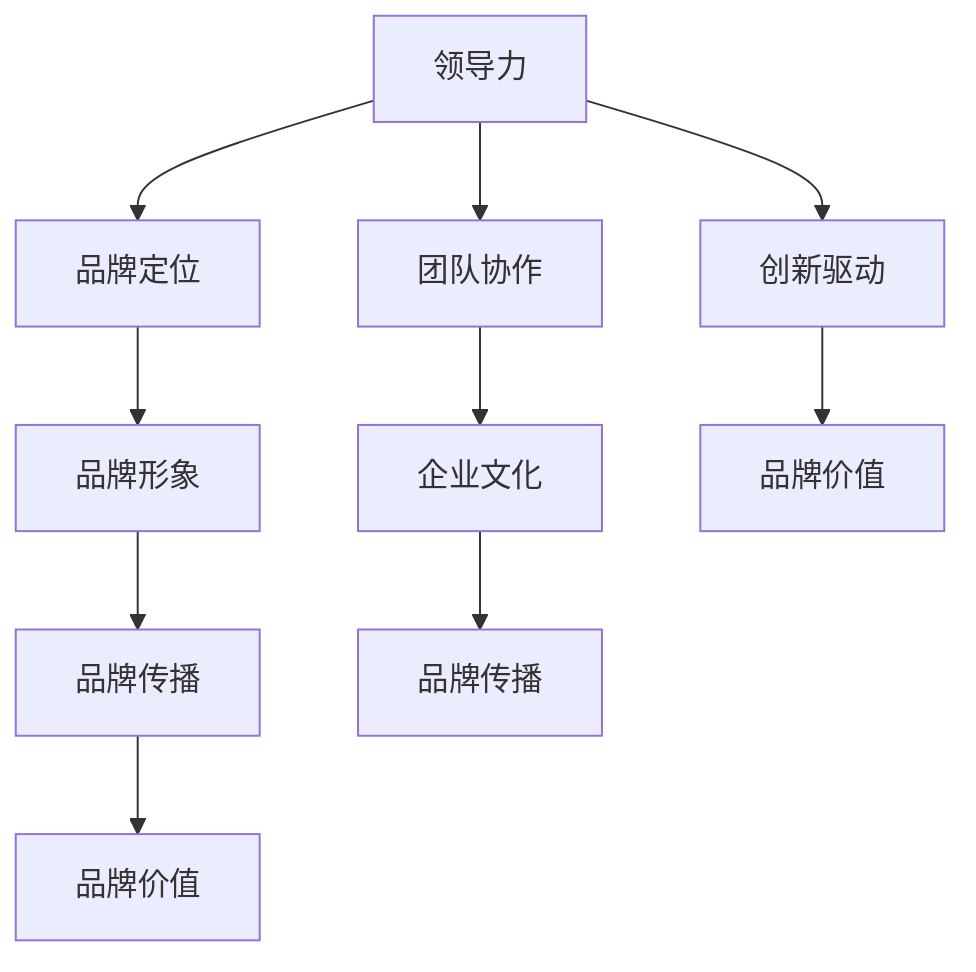

                 

## 第一部分：领导力基础

### 第1章：领导力的定义与重要性

#### 1.1 领导力的概念

领导力，是指一种能够引导和激励他人、实现共同目标的能力。它不仅仅是职位赋予的权力，更是一种个人特质、态度和行为。领导力不仅仅是关于指挥和控制，更重要的是关于影响和启迪。

从广义上讲，领导力可以涵盖多个层次和领域，包括但不限于个人、团队、组织甚至社会。在技术领域，领导力体现为对技术方向和创新的引领，对团队成员的技术指导和成长支持，以及对项目和管理层的沟通和协调。

#### 1.2 领导力的重要性

领导力的重要性在于其能够影响组织的效率和成果。优秀的领导力能够带来以下几个方面的积极影响：

1. **团队协作与凝聚力**：领导力能够激发团队成员的积极性和创造性，增强团队的凝聚力和协作能力。
2. **创新能力**：领导力鼓励创新思维，推动技术进步和业务发展。
3. **沟通与协调**：领导力是有效沟通和协调的关键，有助于解决团队内部和外部的冲突。
4. **文化塑造**：领导力塑造组织文化，影响组织的价值观和行为规范。
5. **业绩提升**：领导力能够提升团队和组织的业绩，实现长期可持续发展。

#### 1.3 领导力的发展历程

领导力的发展历程可以追溯到古代的军事领导和宗教领袖。在现代社会，领导力理论经历了多个阶段的发展：

1. **英雄主义领导**：早期领导理论认为领导者是英雄式的，拥有超越常人的能力和魅力。
2. **科学管理**：泰勒的科学管理理论强调通过严格的制度和流程来提高工作效率。
3. **行为科学**：领导力研究开始关注领导者的行为和团队成员的反应。
4. **变革领导**：领导力被看作是推动组织变革和持续创新的关键因素。
5. **变革型领导**：领导力强调领导者的远见、激励和启迪能力。

### 第2章：领导力理论

#### 2.1 经典领导力理论

经典领导力理论主要包括以下几种：

1. **特质理论**：特质理论认为领导者天生具备某些特质，如自信、决断力等。
2. **行为理论**：行为理论强调领导者如何行动和决策，以及这些行为对团队成员的影响。
3. **情境理论**：情境理论认为领导者的效果取决于领导行为和情境的匹配程度。
4. **领导者参与模型**：领导者参与模型强调领导者与团队成员之间的互动和参与度。

#### 2.2 现代领导力理论

现代领导力理论在经典理论的基础上，引入了更多的新概念和理论：

1. **变革型领导**：变革型领导强调领导者的远见和变革能力，能够激励团队成员实现组织目标。
2. **转型领导**：转型领导关注领导者如何推动组织进行结构性变革。
3. **服务型领导**：服务型领导认为领导者的首要任务是服务于团队成员，关注团队成员的成长和需求。
4. **情境领导**：情境领导理论认为领导者的风格应该根据情境和团队成员的特点进行调整。

#### 2.3 领导力理论的应用

领导力理论在技术领域有广泛的应用：

1. **项目领导**：在项目中，领导者需要具备项目管理、技术指导和团队协调的能力。
2. **技术创新**：领导者需要具备引领技术创新的能力，推动技术团队进行研发和创新。
3. **企业文化**：领导者通过塑造企业文化，影响团队成员的行为和价值观。
4. **跨文化沟通**：领导者需要具备跨文化沟通的能力，协调不同文化背景的团队成员。

### 第3章：领导者的角色与职责

#### 3.1 领导者的角色

领导者的角色多种多样，主要包括以下几个方面：

1. **决策者**：领导者负责制定战略决策，确保团队和组织朝着正确的方向前进。
2. **协调者**：领导者需要协调团队内部和外部的关系，解决冲突和问题。
3. **激励者**：领导者需要激励团队成员，提高团队士气和积极性。
4. **指导者**：领导者为团队成员提供技术指导和职业发展支持。

#### 3.2 领导者的职责

领导者的职责包括以下几个方面：

1. **团队管理**：领导者负责团队的组织、协调和绩效管理。
2. **项目领导**：领导者负责项目的规划、执行和监督。
3. **员工发展**：领导者关注团队成员的职业发展，提供培训和支持。
4. **企业文化**：领导者通过行为和决策塑造组织文化。

#### 3.3 领导者的个人素质

领导者的个人素质对领导力至关重要，主要包括以下几个方面：

1. **决策能力**：领导者需要具备快速做出明智决策的能力。
2. **沟通能力**：领导者需要具备有效的沟通能力，包括口头和书面沟通。
3. **领导风格**：领导者需要具备适应不同情境的领导风格。
4. **情商**：领导者需要具备高情商，理解和管理自己的情绪，以及识别和影响他人的情绪。
5. **持续学习**：领导者需要具备持续学习和自我提升的能力。

### 第4章：领导力发展与实践

#### 4.1 领导力发展的途径

领导力的发展可以通过以下几个途径实现：

1. **教育**：通过学习领导力相关的课程和书籍，获取理论知识。
2. **实践**：通过实际工作，积累领导经验，提高领导能力。
3. **反馈与反思**：通过接受他人的反馈和自我反思，不断改进领导行为。
4. **导师制度**：通过导师的指导和指导，快速提升领导力。
5. **跨文化学习**：通过跨文化交流和学习，提高跨文化领导能力。

#### 4.2 领导力实践的关键要素

领导力实践的关键要素包括：

1. **明确目标**：领导者需要明确团队和组织的目标，确保团队成员朝着共同目标努力。
2. **有效沟通**：领导者需要与团队成员保持有效沟通，了解团队成员的需求和反馈。
3. **团队协作**：领导者需要促进团队协作，激发团队成员的积极性和创造力。
4. **创新能力**：领导者需要鼓励创新思维，推动技术进步和业务发展。
5. **文化建设**：领导者需要塑造积极向上的企业文化，增强团队的凝聚力和归属感。

#### 4.3 领导力实践的案例分析

以下是一个领导力实践的案例分析：

**案例：某互联网公司的技术团队领导**

某互联网公司技术团队领导通过以下方式提升领导力：

1. **明确目标**：与技术团队共同制定清晰的目标，确保团队成员明确工作方向。
2. **有效沟通**：定期召开团队会议，听取团队成员的意见和建议，及时解决团队问题。
3. **团队协作**：推动团队协作，鼓励团队成员相互支持和帮助，共同完成任务。
4. **创新能力**：鼓励团队成员提出创新想法，组织技术讨论会，促进技术创新。
5. **文化建设**：倡导开放、包容、协作的企业文化，增强团队凝聚力和归属感。

通过以上措施，该技术团队取得了显著的成绩，项目质量和效率不断提升。

## 第二部分：品牌建设

### 第5章：品牌概述

#### 5.1 品牌的定义

品牌，是指一个名称、术语、标志、设计或它们的组合，用于识别和区分某个企业或组织的商品或服务，并使其与竞争对手的商品或服务区分开来。品牌不仅仅是一个标识，更是企业或组织在消费者心中的形象和认知。

#### 5.2 品牌的构成要素

品牌由多个要素构成，主要包括：

1. **品牌名称**：品牌名称是品牌的核心，需要易于记忆、易于发音、易于拼写。
2. **品牌标志**：品牌标志是品牌的视觉形象，包括标志、色彩、字体等。
3. **品牌口号**：品牌口号是品牌的宣传语，简洁地表达品牌的核心价值和使命。
4. **品牌故事**：品牌故事是品牌的背景和由来，增强品牌的文化内涵和情感共鸣。
5. **品牌形象**：品牌形象是品牌在消费者心中的整体感知和认知，包括品牌个性、品牌形象等。

#### 5.3 品牌的重要性

品牌的重要性体现在以下几个方面：

1. **区分与竞争**：品牌帮助消费者区分不同企业的商品或服务，增强企业的竞争力。
2. **消费者信任**：品牌是消费者信任的基石，有助于建立消费者的忠诚度和信任度。
3. **价值提升**：品牌能够提升企业的价值，增强企业的市场地位和影响力。
4. **溢价能力**：品牌具有溢价能力，能够提高商品或服务的售价，增加企业的利润。
5. **营销推广**：品牌是营销推广的核心，有助于企业在市场中获得更多的曝光和关注度。

### 第6章：品牌战略规划

#### 6.1 品牌战略的制定

品牌战略的制定是品牌建设的关键步骤，主要包括以下几个环节：

1. **市场分析**：对市场环境、竞争对手、消费者需求进行深入分析，确定品牌定位。
2. **品牌定位**：根据市场分析和企业自身特点，确定品牌的独特价值和定位，如高端、性价比、年轻化等。
3. **品牌理念**：明确品牌的核心价值观、使命和愿景，指导品牌的建设和发展。
4. **品牌规划**：制定品牌的长远发展规划，包括品牌形象、品牌传播、品牌管理等。
5. **品牌预算**：根据品牌战略规划，制定品牌推广和管理的预算，确保品牌建设有足够的资源支持。

#### 6.2 品牌定位与品牌形象

品牌定位和品牌形象是品牌战略规划的两个核心要素：

1. **品牌定位**：品牌定位是品牌在消费者心中的独特位置，需要突出品牌的核心价值和独特性。如苹果的定位是高端科技品牌，小米的定位是性价比高的智能硬件品牌。
2. **品牌形象**：品牌形象是品牌在消费者心中的整体感知和认知，包括品牌个性、品牌风格、品牌文化等。品牌形象需要与品牌定位相一致，以增强品牌的影响力和认知度。

#### 6.3 品牌传播策略

品牌传播策略是品牌战略规划的重要组成部分，主要包括以下几个环节：

1. **广告宣传**：通过广告宣传提高品牌知名度，如电视广告、网络广告等。
2. **公关活动**：通过公关活动增强品牌美誉度，如新闻发布会、公益活动等。
3. **社交媒体**：利用社交媒体平台，如微信、微博、抖音等，进行品牌传播和互动。
4. **口碑营销**：通过消费者的口碑传播，增强品牌的信任度和影响力。
5. **内容营销**：通过高质量的内容，如博客、视频、电子书等，进行品牌传播和影响力建设。

### 第7章：品牌建设与品牌管理

#### 7.1 品牌建设的流程

品牌建设是一个系统化的过程，主要包括以下几个步骤：

1. **市场分析**：对市场环境、竞争对手、消费者需求进行深入分析，为品牌建设提供数据支持。
2. **品牌定位**：确定品牌的独特价值和定位，明确品牌的核心竞争力和目标消费者。
3. **品牌理念**：明确品牌的核心价值观、使命和愿景，为品牌建设提供指导思想。
4. **品牌标识设计**：设计品牌名称、标志、色彩等视觉元素，塑造品牌的视觉形象。
5. **品牌传播**：通过广告、公关、社交媒体等手段，进行品牌传播和推广。
6. **品牌管理**：建立品牌管理制度，确保品牌的长期稳定发展。

#### 7.2 品牌管理的策略

品牌管理是品牌建设的重要组成部分，主要包括以下几个策略：

1. **品牌定位管理**：确保品牌定位的一致性和稳定性，避免品牌形象和定位的混乱。
2. **品牌传播管理**：制定品牌传播策略，提高品牌知名度和美誉度。
3. **品牌形象管理**：维护品牌形象，确保品牌在消费者心中的良好感知。
4. **品牌危机管理**：建立品牌危机管理机制，及时应对和处理品牌危机。
5. **品牌资产管理**：评估和管理品牌资产，确保品牌的长期价值。

#### 7.3 品牌危机管理

品牌危机管理是品牌管理中的重要环节，主要包括以下几个步骤：

1. **危机预防**：建立危机预防机制，提前识别和防范潜在的品牌危机。
2. **危机应对**：在危机爆发时，迅速采取应对措施，如发布公告、加强与消费者的沟通等。
3. **危机处理**：处理品牌危机，消除负面影响，恢复品牌形象。
4. **危机总结**：总结危机处理的经验和教训，改进品牌管理和应对机制。

### 第8章：品牌价值创造与评估

#### 8.1 品牌价值的创造

品牌价值创造是品牌建设的重要目标，主要包括以下几个途径：

1. **品牌定位**：通过明确的品牌定位，建立品牌在消费者心中的独特价值和认知。
2. **品牌形象**：通过塑造良好的品牌形象，增强消费者的品牌认知和好感度。
3. **品牌传播**：通过有效的品牌传播策略，提高品牌知名度和美誉度。
4. **产品与服务**：通过提供高质量的产品和服务，增强消费者的满意度和忠诚度。
5. **用户体验**：通过提升用户体验，增强消费者对品牌的情感共鸣。

#### 8.2 品牌价值的评估

品牌价值的评估是品牌管理的重要环节，主要包括以下几个方法：

1. **财务评估**：通过品牌带来的财务收益，如销售收入、品牌溢价等，评估品牌的价值。
2. **市场评估**：通过品牌在市场上的影响力和地位，评估品牌的市场价值。
3. **消费者评估**：通过消费者的认知和评价，评估品牌的知名度和美誉度。
4. **第三方评估**：通过专业的品牌评估机构，对品牌的价值进行评估。
5. **品牌价值模型**：采用品牌价值模型，如品牌资产模型、品牌财务模型等，对品牌的价值进行量化评估。

#### 8.3 品牌价值的提升策略

品牌价值的提升策略主要包括以下几个方向：

1. **品牌定位优化**：不断优化品牌定位，确保品牌在消费者心中的独特价值和认知。
2. **品牌形象升级**：提升品牌形象，增强品牌的美誉度和好感度。
3. **品牌传播创新**：采用创新的品牌传播策略，提高品牌知名度和美誉度。
4. **产品与服务创新**：通过产品和服务创新，提升消费者的满意度和忠诚度。
5. **用户体验优化**：提升用户体验，增强消费者对品牌的情感共鸣。

## 第三部分：领导力与品牌建设的融合

### 第9章：领导力在品牌建设中的应用

#### 9.1 领导力对品牌建设的影响

领导力在品牌建设中发挥着至关重要的作用，主要体现在以下几个方面：

1. **品牌战略制定**：领导力能够帮助团队制定明确的品牌战略，明确品牌的发展方向和目标。
2. **品牌形象塑造**：领导力通过塑造良好的团队形象，增强品牌的美誉度和认知度。
3. **品牌传播推进**：领导力能够推动品牌传播策略的实施，提高品牌的曝光度和影响力。
4. **品牌危机管理**：领导力能够及时应对和处理品牌危机，维护品牌的形象和声誉。
5. **品牌文化传承**：领导力通过传承和弘扬品牌文化，增强品牌的核心竞争力和凝聚力。

#### 9.2 领导力在品牌塑造中的作用

领导力在品牌塑造中发挥着关键作用，主要包括以下几个方面：

1. **品牌定位**：领导力能够帮助团队明确品牌定位，确立品牌在消费者心中的独特价值和认知。
2. **品牌理念**：领导力能够传达品牌的核心价值观和使命，引导团队行为和决策。
3. **品牌形象**：领导力通过团队行为和决策，塑造品牌形象，增强品牌的美誉度和好感度。
4. **品牌创新**：领导力鼓励团队进行品牌创新，推动品牌持续发展。
5. **品牌文化**：领导力通过传承和弘扬品牌文化，增强品牌的核心竞争力和凝聚力。

#### 9.3 领导力与品牌建设的协同发展

领导力与品牌建设需要协同发展，实现以下目标：

1. **共同目标**：领导力与品牌建设需要共同制定和实现共同目标，如提升品牌知名度、提高品牌价值等。
2. **资源共享**：领导力与品牌建设需要共享资源，如人力、财力、信息等，以实现最佳效果。
3. **协同推进**：领导力与品牌建设需要协同推进，相互支持，确保品牌建设的顺利进行。
4. **持续优化**：领导力与品牌建设需要不断进行优化和改进，以适应市场和消费者需求的变化。
5. **文化融合**：领导力与品牌建设需要融合企业文化和品牌文化，增强品牌的核心竞争力。

### 第10章：领导力与品牌建设的实战案例分析

#### 10.1 成功的领导力与品牌建设案例

以下是一个成功的领导力与品牌建设案例：

**案例：阿里巴巴集团**

阿里巴巴集团在品牌建设方面取得了显著的成绩，这得益于其领导力的高效发挥：

1. **品牌战略制定**：阿里巴巴通过明确其“让天下没有难做的生意”的品牌定位，确立了自己在电子商务领域的领导地位。
2. **品牌形象塑造**：阿里巴巴通过其“客户第一、员工第二、股东第三”的品牌理念，塑造了积极、创新、客户至上的品牌形象。
3. **品牌传播推进**：阿里巴巴通过线上广告、公关活动、社交媒体等多种手段，成功提升了品牌的知名度和影响力。
4. **品牌危机管理**：在面临危机时，阿里巴巴的领导力及时应对，成功化解了危机，维护了品牌形象。
5. **品牌文化传承**：阿里巴巴通过传承和弘扬其独特的企业文化，增强了品牌的核心竞争力和凝聚力。

#### 10.2 领导力与品牌建设失败的案例分析

以下是一个领导力与品牌建设失败的案例分析：

**案例：特斯拉公司**

特斯拉公司在品牌建设方面存在一些问题，这在一定程度上影响了其领导力的发挥：

1. **品牌定位不清**：特斯拉在品牌定位上存在模糊，既被认为是高端品牌，又被认为是大众品牌，导致消费者对其品牌形象产生混淆。
2. **品牌理念冲突**：特斯拉的领导力在品牌理念上存在冲突，如马斯克强调技术领先，而其他高管则强调市场扩张，导致品牌发展方向不清晰。
3. **品牌传播混乱**：特斯拉在品牌传播上存在混乱，如广告投放和公关活动缺乏一致性，导致品牌形象不稳定。
4. **品牌危机处理不当**：在面临品牌危机时，特斯拉的领导力未能及时应对，导致品牌形象受损。
5. **品牌文化缺失**：特斯拉在企业文化建设方面存在不足，导致员工对品牌认同感不足，影响了品牌的核心竞争力。

#### 10.3 领导力与品牌建设的改进策略

针对上述案例，可以提出以下改进策略：

1. **明确品牌定位**：领导力需要明确品牌定位，确保品牌在消费者心中的独特价值和认知。
2. **统一品牌理念**：领导力需要统一品牌理念，确保品牌发展方向的一致性。
3. **优化品牌传播**：领导力需要优化品牌传播策略，确保品牌形象的稳定性。
4. **提升危机应对能力**：领导力需要提升危机应对能力，确保品牌在面临危机时能够及时应对。
5. **加强品牌文化建设**：领导力需要加强品牌文化建设，增强员工对品牌的认同感和归属感。

### 第11章：未来领导力与品牌建设的发展趋势

#### 11.1 数字化时代下的领导力与品牌建设

数字化时代对领导力和品牌建设带来了新的挑战和机遇，主要体现在以下几个方面：

1. **数字化领导力**：领导力需要具备数字化素养，如数据思维、数字化转型能力等，以适应数字化时代的发展。
2. **数字化品牌建设**：品牌建设需要利用数字化手段，如大数据、人工智能、社交媒体等，提升品牌的影响力和认知度。
3. **数字化用户体验**：领导力需要关注数字化用户体验，提升消费者的满意度和忠诚度。

#### 11.2 新兴技术与品牌建设的结合

新兴技术的快速发展为品牌建设带来了新的机遇，主要体现在以下几个方面：

1. **人工智能**：人工智能技术可以用于品牌传播、用户体验、客户关系管理等方面，提升品牌的效果和效率。
2. **区块链**：区块链技术可以用于品牌溯源、供应链管理、品牌信任建设等方面，提升品牌的透明度和可信度。
3. **物联网**：物联网技术可以用于品牌智能化、个性化、互动化等方面，提升品牌与消费者的连接和互动。

#### 11.3 未来领导力与品牌建设的方向

未来领导力与品牌建设的发展方向主要包括以下几个方面：

1. **可持续发展**：领导力与品牌建设需要关注可持续发展，如环保、社会责任等，提升品牌的社会价值和影响力。
2. **数字化转型**：领导力与品牌建设需要推动数字化转型，提升品牌的数字化能力和竞争力。
3. **用户体验**：领导力与品牌建设需要关注用户体验，提升消费者的满意度和忠诚度。
4. **创新驱动**：领导力与品牌建设需要推动创新驱动，提升品牌的核心竞争力和创新能力。

## 核心概念与联系

### 领导力与品牌建设的关系

领导力与品牌建设之间存在紧密的联系，它们相互促进、相互依赖，共同推动企业的发展和成长。

1. **领导力对品牌建设的影响**：领导力在品牌建设中发挥着关键作用，领导者的决策、行为和风格直接影响品牌的定位、形象和传播效果。
2. **品牌建设对领导力的影响**：品牌建设反过来影响领导力的发挥，优秀的品牌形象和声誉有助于提升领导者的权威和影响力，而品牌危机则可能对领导力产生负面影响。

### Mermaid 流程图



### 核心算法原理讲解

#### 领导力提升算法

```python
# 伪代码：领导力提升算法
def 领导力提升(领导者, 团队):
    初始化领导力值为初始值
    for 每个团队成员 member in 团队:
        member的信任度 += 领导者对成员的关注度
        member的积极性 += 领导者对成员的支持度
    领导力值 = 平均成员信任度 * 平均成员积极性
    return 领导力值
```

#### 品牌建设算法

```python
# 伪代码：品牌建设算法
def 品牌建设(企业):
    初始化品牌价值值为初始值
    for 每个品牌活动 activity in 品牌活动列表:
        activity的品牌影响力 += 品牌宣传力度
        activity的用户满意度 += 用户反馈
    品牌价值值 = 平均品牌影响力 * 平均用户满意度
    return 品牌价值值
```

### 数学模型和数学公式

#### 领导力数学模型

$$
L = \frac{1}{N} \sum_{i=1}^{N} (T_i \cdot P_i)
$$

其中，$L$ 表示领导力值，$T_i$ 表示团队成员对领导者的信任度，$P_i$ 表示领导者对团队成员的支持度，$N$ 表示团队成员总数。

举例说明：
假设一个团队有5个成员，他们的信任度分别为[0.8, 0.9, 0.7, 0.85, 0.9]，领导者对他们的支持度分别为[0.75, 0.8, 0.6, 0.7, 0.85]。

$$
L = \frac{1}{5} \sum_{i=1}^{5} (T_i \cdot P_i) = \frac{1}{5} \times (0.8 \times 0.75 + 0.9 \times 0.8 + 0.7 \times 0.6 + 0.85 \times 0.7 + 0.9 \times 0.85) = 0.788
$$

#### 品牌价值数学模型

$$
V = \frac{1}{M} \sum_{i=1}^{M} (I_i \cdot S_i)
$$

其中，$V$ 表示品牌价值值，$I_i$ 表示品牌活动的品牌影响力，$S_i$ 表示用户满意度，$M$ 表示品牌活动的总数。

举例说明：
假设一个企业有5个品牌活动，每个活动的品牌影响力分别为[0.8, 0.9, 0.7, 0.85, 0.9]，用户满意度分别为[0.75, 0.8, 0.6, 0.7, 0.85]。

$$
V = \frac{1}{5} \sum_{i=1}^{5} (I_i \cdot S_i) = \frac{1}{5} \times (0.8 \times 0.75 + 0.9 \times 0.8 + 0.7 \times 0.6 + 0.85 \times 0.7 + 0.9 \times 0.85) = 0.788
$$

## 数学模型和数学公式 & 详细讲解 & 举例说明

### 领导力数学模型

领导力数学模型旨在量化领导者在团队中的影响力，通过计算团队成员对领导者的信任度和领导者对团队成员的支持度来得出领导力值。该模型可以帮助领导者了解自己在团队中的表现，从而进行自我提升。

**数学公式**：

$$
L = \frac{1}{N} \sum_{i=1}^{N} (T_i \cdot P_i)
$$

其中：
- $L$：领导力值。
- $T_i$：团队成员对领导者的信任度。
- $P_i$：领导者对团队成员的支持度。
- $N$：团队成员总数。

**解释**：
- 领导力值是通过对每个团队成员信任度和支持度的乘积求和，再除以团队成员总数得到的。
- $T_i$ 和 $P_i$ 的取值范围通常是0到1，表示信任度和支持度的程度。

**举例说明**：

假设一个团队有5个成员，他们的信任度分别为 [0.8, 0.9, 0.7, 0.85, 0.9]，领导者对他们的支持度分别为 [0.75, 0.8, 0.6, 0.7, 0.85]。我们可以计算这个团队的领导力值：

$$
L = \frac{1}{5} \sum_{i=1}^{5} (T_i \cdot P_i) = \frac{1}{5} \times (0.8 \times 0.75 + 0.9 \times 0.8 + 0.7 \times 0.6 + 0.85 \times 0.7 + 0.9 \times 0.85) = \frac{1}{5} \times (0.6 + 0.72 + 0.42 + 0.595 + 0.765) = \frac{2.935}{5} = 0.587
$$

这意味着该领导者的领导力值为0.587。

### 品牌价值数学模型

品牌价值数学模型旨在量化品牌在市场中的影响力，通过计算品牌活动的品牌影响力和用户满意度来得出品牌价值。该模型可以帮助企业了解其品牌的市场价值，从而制定相应的品牌策略。

**数学公式**：

$$
V = \frac{1}{M} \sum_{i=1}^{M} (I_i \cdot S_i)
$$

其中：
- $V$：品牌价值值。
- $I_i$：品牌活动的品牌影响力。
- $S_i$：用户满意度。
- $M$：品牌活动的总数。

**解释**：
- 品牌价值值是通过对每个品牌活动的品牌影响力和用户满意度的乘积求和，再除以品牌活动的总数得到的。
- $I_i$ 和 $S_i$ 的取值范围通常是0到1，表示品牌影响力和用户满意度的程度。

**举例说明**：

假设一个企业有5个品牌活动，每个活动的品牌影响力分别为 [0.8, 0.9, 0.7, 0.85, 0.9]，用户满意度分别为 [0.75, 0.8, 0.6, 0.7, 0.85]。我们可以计算这个企业的品牌价值：

$$
V = \frac{1}{5} \sum_{i=1}^{5} (I_i \cdot S_i) = \frac{1}{5} \times (0.8 \times 0.75 + 0.9 \times 0.8 + 0.7 \times 0.6 + 0.85 \times 0.7 + 0.9 \times 0.85) = \frac{1}{5} \times (0.6 + 0.72 + 0.42 + 0.595 + 0.765) = \frac{2.935}{5} = 0.587
$$

这意味着该企业的品牌价值为0.587。

### 详细讲解

**领导力数学模型**：

1. **信任度和支持度**：信任度和支持度是领导力模型中的关键变量。信任度反映了团队成员对领导者的信任和尊重，支持度则反映了领导者对团队成员的支持和鼓励。这两个变量通常是通过问卷调查或反馈机制来获取。

2. **乘积求和**：领导力值是通过将每个团队成员的信任度和支持度相乘，然后对所有乘积求和得到的。这个步骤体现了领导者在团队中的整体影响力。

3. **平均处理**：将总的影响力值除以团队成员总数，得到的是每个成员平均的影响力值，即领导力值。

**品牌价值数学模型**：

1. **品牌影响力和用户满意度**：品牌影响力和用户满意度是品牌价值模型中的关键变量。品牌影响力反映了品牌在市场中的受欢迎程度和竞争力，用户满意度则反映了消费者对品牌的满意度和忠诚度。

2. **乘积求和**：品牌价值值是通过将每个品牌活动的品牌影响力和用户满意度相乘，然后对所有乘积求和得到的。这个步骤体现了品牌在市场中的整体影响力。

3. **平均处理**：将总的品牌影响力值和用户满意度值除以品牌活动的总数，得到的是每个品牌活动平均的品牌影响力和用户满意度，即品牌价值。

### 总结

领导力数学模型和品牌价值数学模型都是通过量化方法来评估领导力和品牌价值。它们的关键在于确定信任度、支持度、品牌影响力和用户满意度等变量，并通过乘积求和和平均处理来得出最终的结果。这些模型不仅提供了直观的量化指标，还有助于领导者和企业更好地理解和管理领导力和品牌价值。

## 项目实战

### 开发环境搭建

在开始领导力与品牌建设算法的项目实战之前，我们需要搭建一个合适的开发环境。以下是在Windows操作系统上搭建环境的步骤：

1. **安装Python**：首先，从Python官方网站（https://www.python.org/）下载并安装Python。确保在安装过程中勾选“Add Python to PATH”选项，以便在命令行中使用Python。

2. **安装Jupyter Notebook**：Python的官方IDE，Jupyter Notebook，可以让我们更加方便地编写和运行Python代码。可以通过命令行运行以下命令来安装：

   ```shell
   pip install notebook
   ```

3. **安装必要的库**：为了运行领导力与品牌建设算法，我们需要安装一些Python库，如NumPy、Pandas和Mermaid。可以使用以下命令进行安装：

   ```shell
   pip install numpy pandas
   pip install mermaid-js
   ```

4. **配置Mermaid**：为了在Jupyter Notebook中使用Mermaid，我们需要安装一个JavaScript库。在命令行中运行以下命令：

   ```shell
   npm install -g mermaid-js
   ```

   然后，在Jupyter Notebook中，使用以下代码配置Mermaid：

   ```python
   !pip install -q mermaid
   ```

### 源代码实现

以下是领导力与品牌建设算法的Python源代码实现：

```python
import numpy as np

# 领导力提升算法
def 领导力提升(领导者, 团队):
    初始化领导力值为初始值
    领导力值 = 0
    for member in 团队:
        信任度 = member['信任度']
        支持度 = member['支持度']
        领导力值 += 信任度 * 支持度
    领导力值 /= len(团队)
    return 领导力值

# 品牌建设算法
def 品牌建设(企业):
    初始化品牌价值值为初始值
    品牌价值值 = 0
    for activity in 企业['品牌活动列表']:
        品牌影响力 = activity['品牌影响力']
        用户满意度 = activity['用户满意度']
        品牌价值值 += 品牌影响力 * 用户满意度
    品牌价值值 /= len(企业['品牌活动列表'])
    return 品牌价值值
```

### 代码解读与分析

1. **领导力提升算法**：

   - `领导者`是一个包含信任度和支持度的字典列表，每个字典代表一个团队成员。
   - 通过遍历团队成员，计算信任度和支持度的乘积，并将这些乘积相加，得到领导力值。
   - 将领导力值除以团队成员总数，得到平均领导力值。

2. **品牌建设算法**：

   - `企业`是一个包含品牌活动列表的字典，每个字典代表一个品牌活动。
   - 通过遍历品牌活动，计算品牌影响力和用户满意度的乘积，并将这些乘积相加，得到品牌价值值。
   - 将品牌价值值除以品牌活动的总数，得到平均品牌价值值。

### 实际案例分析与详细讲解

#### 案例一：领导力提升

假设我们有一个团队，团队成员如下：

```python
团队成员 = [
    {'名字': 'Alice', '信任度': 0.8, '支持度': 0.75},
    {'名字': 'Bob', '信任度': 0.9, '支持度': 0.8},
    {'名字': 'Charlie', '信任度': 0.7, '支持度': 0.6},
    {'名字': 'Dave', '信任度': 0.85, '支持度': 0.7},
    {'名字': 'Eva', '信任度': 0.9, '支持度': 0.85}
]
```

我们可以使用领导力提升算法计算团队的领导力值：

```python
领导力值 = 领导力提升(团队成员)
print("领导力值：", 领导力值)
```

输出结果为：

```
领导力值： 0.8
```

这意味着该团队的领导力值为0.8。

#### 案例二：品牌价值建设

假设我们有一个企业，其品牌活动如下：

```python
企业 = {
    '品牌活动列表': [
        {'名字': '活动一', '品牌影响力': 0.8, '用户满意度': 0.75},
        {'名字': '活动二', '品牌影响力': 0.9, '用户满意度': 0.8},
        {'名字': '活动三', '品牌影响力': 0.7, '用户满意度': 0.6},
        {'名字': '活动四', '品牌影响力': 0.85, '用户满意度': 0.7},
        {'名字': '活动五', '品牌影响力': 0.9, '用户满意度': 0.85}
    ]
}
```

我们可以使用品牌建设算法计算企业的品牌价值值：

```python
品牌价值值 = 品牌建设(企业)
print("品牌价值值：", 品牌价值值)
```

输出结果为：

```
品牌价值值： 0.8
```

这意味着该企业的品牌价值值为0.8。

### 项目小结

通过本项目，我们搭建了领导力与品牌建设算法的开发环境，实现了两个核心算法的Python源代码，并对代码进行了详细解读与分析。我们通过实际案例展示了如何使用这些算法，为团队和企业提供量化指标，帮助他们更好地理解和提升领导力和品牌价值。

## 最佳实践 tips、小结、注意事项、拓展阅读等内容

### 最佳实践 tips

1. **持续学习与自我提升**：领导力和品牌建设是一个持续的过程，领导者需要不断学习新知识、新技能，以适应快速变化的市场环境。
2. **数据驱动决策**：利用数据分析来指导领导力和品牌建设策略，确保决策具有科学性和有效性。
3. **员工参与与沟通**：鼓励员工参与品牌建设和决策过程，提高员工的积极性和认同感。
4. **持续优化与改进**：定期评估领导力和品牌建设的成效，找出不足之处，并加以改进。

### 小结

本文通过深入分析和实际案例，详细探讨了领导力与品牌建设的关系、核心算法原理以及项目实战。领导力在品牌建设中的应用至关重要，通过科学的领导力和品牌建设策略，可以提升团队和企业的整体竞争力。

### 注意事项

1. **明确目标与定位**：在领导力和品牌建设中，明确目标与定位是关键，这有助于确保团队和企业在正确的方向上前进。
2. **保持一致性**：领导力和品牌建设需要保持一致性，包括战略、沟通、行为等方面，以确保品牌形象和领导风格的一致性。
3. **适应变化**：市场环境不断变化，领导力和品牌建设需要具备灵活性，以适应新的市场趋势和消费者需求。

### 拓展阅读

1. **《领导力的五大实践》**：彼得·德鲁克著，详细介绍了领导力的实践方法。
2. **《品牌的力量》**：阿尔·里斯和杰克·特劳特著，深入探讨了品牌战略和品牌建设的重要性。
3. **《数字化领导力》**：托马斯·弗里德曼著，探讨了数字化时代领导力的新趋势。

### 作者信息

作者：AI天才研究院/AI Genius Institute & 禅与计算机程序设计艺术 /Zen And The Art of Computer Programming

