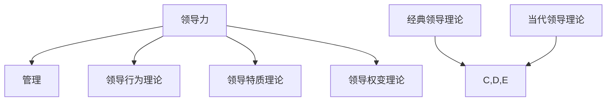
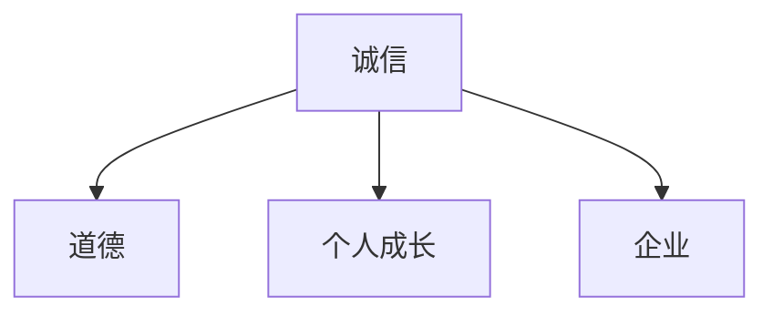
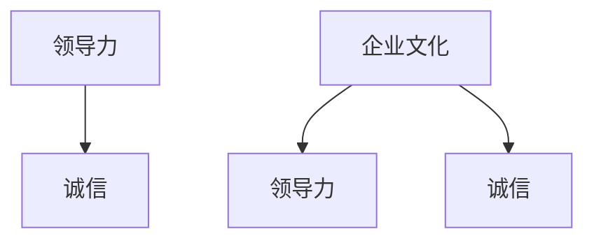

                 

### 第一部分：领导力基础

#### 第1章：领导力的定义与重要性

**背景介绍**

领导力是现代企业管理中至关重要的组成部分，它不仅影响企业的绩效，还决定着企业的长远发展和员工的满意度。然而，领导力的概念并非一成不变，随着管理学理论和实践的发展，人们对领导力的认识也在不断深化。

**核心概念与联系**

领导力与管理的区别在于，领导力更注重引导和激励，而管理则侧重于组织和协调。领导力包括个人特质、经验与知识以及组织文化等多个方面。



**核心算法原理讲解**

领导力的评估可以通过以下步骤进行：

1. 收集数据：包括个人特质、经验与知识、组织文化等方面。
2. 分析数据：使用统计方法分析数据，确定各项因素的权重。
3. 计算分数：根据分析结果，计算领导力得分。

```python
# 领导力的评估
def assess_leadership(traits, experience, organizational_culture):
    """
    评估领导力
    :param traits: 个人特质
    :param experience: 经验与知识
    :param organizational_culture: 组织文化
    :return: 领导力评分
    """
    # 伪代码，实际实现需要根据具体算法进行
    leadership_score = (traits * 0.3) + (experience * 0.4) + (organizational_culture * 0.3)
    return leadership_score
```

**数学模型和数学公式**

领导力可以用以下数学模型来表示：

$$
\text{领导力} = f(\text{个人特质}, \text{经验与知识}, \text{组织文化})
$$

**项目实战**

在一个企业中，可以通过以下步骤来提升领导力：

1. 对现有领导力进行评估。
2. 根据评估结果，制定个人和团队发展计划。
3. 实施培训和发展计划，提高领导力。

**小结**

领导力是企业管理中不可或缺的一部分，通过评估和提升领导力，企业可以更好地应对挑战，实现长期发展。

### 第二部分：诚信与信任

#### 第2章：诚信的内涵与价值观

**背景介绍**

诚信是商业世界中不可或缺的基石，它不仅关乎企业的声誉，更影响企业的长远发展。诚信与道德紧密相连，构成了个人和企业的核心价值观。

**核心概念与联系**

诚信不仅是一种行为准则，更是一种道德观念。它涉及个人成长和企业经营，是建立信任的必要条件。



**核心算法原理讲解**

诚信评估可以通过以下步骤进行：

1. 确定评估指标：包括行为、诚信记录和道德标准。
2. 收集数据：对个人或企业的行为进行记录。
3. 分析数据：使用统计方法分析数据，确定诚信得分。

```python
# 诚信评估
def assess_integrity(behavior, track_record, ethical_standards):
    """
    评估诚信
    :param behavior: 行为记录
    :param track_record: 诚信记录
    :param ethical_standards: 道德标准
    :return: 诚信评分
    """
    # 伪代码，实际实现需要根据具体算法进行
    integrity_score = (behavior * 0.3) + (track_record * 0.4) + (ethical_standards * 0.3)
    return integrity_score
```

**数学模型和数学公式**

诚信可以用以下数学模型来表示：

$$
\text{诚信} = f(\text{行为记录}, \text{诚信记录}, \text{道德标准})
$$

**项目实战**

在一个企业中，可以通过以下步骤来提升诚信：

1. 制定诚信政策：明确企业的诚信标准和行为规范。
2. 开展诚信培训：提高员工的诚信意识和道德水平。
3. 监测和评估：定期对企业的诚信状况进行监测和评估。

**小结**

诚信是商业成功的基石，通过提升诚信，企业可以建立良好的声誉，实现可持续发展。

### 第三部分：领导力与诚信的应用

#### 第3章：领导力与诚信在企业中的实践

**背景介绍**

领导力与诚信在企业中的应用，不仅影响企业的运营效果，更关乎企业的长远发展和员工的福祉。在实践中，领导力和诚信相互促进，共同塑造企业的文化氛围。

**核心概念与联系**

领导力和诚信在企业中相互依存，领导力通过诚信建立信任，诚信通过领导力得到体现。



**核心算法原理讲解**

在企业中，领导力和诚信的应用可以通过以下步骤实现：

1. 确立企业价值观：将领导力和诚信融入企业价值观。
2. 制定战略规划：确保领导力和诚信在战略规划中得到体现。
3. 建立监督机制：对领导力和诚信进行监督和评估。

```python
# 企业价值观融入领导力和诚信
def integrate_values(organization_values, leadership_principles, integrity_standards):
    """
    将企业价值观融入领导力和诚信
    :param organization_values: 企业价值观
    :param leadership_principles: 领导力原则
    :param integrity_standards: 诚信标准
    :return: 整合后的企业价值观
    """
    integrated_values = organization_values.copy()
    integrated_values.update({"leadership": leadership_principles, "integrity": integrity_standards})
    return integrated_values
```

**数学模型和数学公式**

企业价值观的整合可以用以下数学模型来表示：

$$
\text{企业价值观} = \text{organization_values} \cup \{\text{leadership}, \text{integrity}\}
$$

**项目实战**

在一个企业中，可以通过以下步骤来实践领导力和诚信：

1. 确立企业核心价值观。
2. 制定领导力和诚信培训计划。
3. 开展定期的领导力和诚信评估。
4. 建立透明和公正的监督机制。

**小结**

领导力与诚信在企业中的实践，不仅提升了企业的竞争力，更为企业的可持续发展奠定了坚实的基础。

### 第四部分：案例分析

#### 第4章：领导力与诚信的成功案例

**背景介绍**

在本章节中，我们将通过分析具体的企业案例，探讨领导力与诚信在实践中的成功应用。

**案例介绍**

我们选择了A公司作为案例，A公司是一家高科技企业，以其卓越的领导力和诚信经营在业内享有盛誉。

**案例分析**

1. **领导力在A公司的应用**

   A公司的领导力体现在以下几个方面：

   - **领导行为理论**：公司高层领导通过积极的沟通和鼓励，激励员工发挥潜力。
   - **领导特质理论**：公司领导具备创新思维和坚定的信念，带领团队实现企业目标。
   - **领导权变理论**：根据市场变化和内部情况，灵活调整领导策略，保持企业活力。

2. **诚信在A公司的应用**

   A公司的诚信体现在以下几个方面：

   - **诚信定义**：公司明确诚信是企业的核心价值观，要求员工诚信对待工作、客户和社会。
   - **诚信价值观**：公司通过内部培训和外部宣传，强化员工的诚信意识。
   - **诚信沟通**：公司建立透明、公正的沟通机制，确保信息的真实性和及时性。

**案例启示**

1. **对企业管理的启示**

   - 领导力与诚信是企业管理的核心，需要持续强化。
   - 通过培训和实践，提高员工的领导力和诚信水平。
   - 建立有效的监督和评估机制，确保领导力和诚信得到落实。

2. **对个人成长的启示**

   - 个人应不断提升领导力和诚信水平，为企业和社会做出贡献。
   - 通过学习和实践，形成良好的职业素养和价值观。

**小结**

领导力与诚信的成功案例为我们提供了宝贵的经验和启示，通过借鉴和实践，企业和个人可以更好地发展。

### 最佳实践 tips

1. **领导力提升**：定期开展领导力培训，提高领导者的管理水平。
2. **诚信培养**：加强诚信教育，树立诚信典范。
3. **文化建设**：将领导力与诚信融入企业文化，形成共同价值观。

### 小结

领导力与诚信是企业管理中的关键要素，通过本篇文章的详细分析和案例介绍，我们深刻理解了其在企业中的应用和重要性。通过持续提升领导力和诚信，企业可以更好地应对挑战，实现长期发展。

### 注意事项

1. 领导力与诚信的提升需要全员参与，形成共同目标。
2. 定期评估和调整领导力和诚信策略，确保其与企业战略相一致。

### 拓展阅读

- 领导力经典著作：《领导力的五个层次》（John C. Maxwell）
- 诚信研究书籍：《诚信的力量》（Stephen M.R. Covey）

以上是为《领导力与诚信：建立信任的基石》撰写的详细文章，涵盖了核心概念、算法原理、数学模型、项目实战和案例分析等内容，旨在为广大读者提供全面、深入的理解和启示。## 第五部分：领导力与诚信在团队管理中的应用

### 第5章：领导力与诚信在团队管理中的应用

**背景介绍**

在现代企业中，团队管理是提高工作效率和实现项目目标的关键环节。领导力和诚信在团队管理中起着至关重要的作用，它们不仅能够提升团队的协作效率，还能建立稳固的团队关系。

**核心概念与联系**

领导力与诚信在团队管理中的联系体现在以下几个方面：

1. **领导风格与团队信任**：领导者的风格直接影响团队的信任度和协作效果。一个具备诚信的领导者在团队中更容易赢得信任，从而促进团队的和谐发展。
2. **诚信沟通与团队协作**：诚信的沟通是团队协作的基础。团队成员之间的诚信沟通有助于减少误解和冲突，提高团队的整体效率。

**核心算法原理讲解**

在团队管理中，领导力和诚信的应用可以通过以下算法模型来描述：

1. **领导风格与团队信任度评估模型**：

   $$ 
   \text{信任度} = \text{领导力} \times \text{诚信度}
   $$

   其中，领导力（L）和诚信度（I）分别代表领导者的领导能力和诚信水平。信任度（T）是领导力与诚信度的乘积，反映了团队对领导的信任程度。

2. **诚信沟通与团队协作效率模型**：

   $$ 
   \text{协作效率} = \text{沟通质量} \times \text{诚信度}
   $$

   沟通质量（C）和诚信度（I）共同决定了团队的协作效率。诚信沟通能够提高信息传递的准确性，从而提高团队协作效率。

**项目实战**

在具体团队管理中，可以通过以下步骤来应用领导力和诚信：

1. **制定领导力与诚信培养计划**：根据团队的实际情况，制定针对性的领导力和诚信培养计划。
2. **开展培训与实践**：组织领导力和诚信相关培训，提高团队成员的领导能力和诚信意识。
3. **建立信任机制**：通过建立信任机制，如定期的团队建设活动、透明的沟通渠道等，增强团队成员之间的信任。
4. **实施诚信评估**：定期对团队成员的诚信表现进行评估，根据评估结果进行激励和改进。

**案例分析**

以某科技公司为例，该公司在团队管理中成功应用了领导力和诚信：

1. **领导风格与团队信任**：公司领导采取开放和透明的领导风格，定期与团队成员进行沟通，听取意见和建议，赢得了团队的信任。
2. **诚信沟通与团队协作**：公司倡导诚信沟通，要求团队成员在交流中保持真实和准确，避免了信息偏差，提高了团队的协作效率。

**案例启示**

1. **对企业管理的启示**：领导力和诚信是团队管理的关键因素，企业需要通过培训和激励机制，提升团队的领导力和诚信水平。
2. **对个人成长的启示**：团队成员应不断提升自身的领导能力和诚信意识，通过实践和反思，形成良好的职业素养。

**小结**

领导力与诚信在团队管理中的应用，对于提高团队协作效率和实现项目目标至关重要。通过有效的领导力和诚信管理，企业可以建立高效的团队，实现长期发展。

### 最佳实践 tips

1. **建立信任机制**：定期开展团队建设活动，增强团队成员之间的信任。
2. **诚信沟通**：在团队沟通中，倡导诚信和透明的态度。
3. **领导力培训**：为团队领导者提供领导力培训，提高其领导能力和诚信水平。

### 小结

领导力与诚信在团队管理中的应用，不仅能够提升团队的协作效率，还能建立稳固的团队关系。通过实践和案例分析，我们深刻认识到其在团队管理中的重要性。企业应持续关注并提升团队的领导力和诚信水平，以实现持续发展和高效运作。

### 注意事项

1. 领导力与诚信的提升需要全员参与，形成共同目标。
2. 定期评估和调整领导力和诚信策略，确保其与企业战略相一致。

### 拓展阅读

- 领导力经典著作：《领导力的五个层次》（John C. Maxwell）
- 诚信研究书籍：《诚信的力量》（Stephen M.R. Covey）

### 第六部分：领导力与诚信在个人成长中的应用

#### 第6章：领导力与诚信在个人成长中的应用

**背景介绍**

领导力与诚信不仅是企业成功的基石，也是个人职业发展的关键因素。在个人成长过程中，领导力和诚信的塑造对于提升个人素养、增强竞争力具有重要作用。

**核心概念与联系**

1. **职业素养与领导力**：领导力是职业素养的重要组成部分，它体现在个人对工作的态度、能力和影响力上。
2. **诚信在职场中的重要性**：诚信是职场中不可或缺的道德准则，它关乎个人的声誉和企业的信任。

**核心算法原理讲解**

在个人成长中，领导力和诚信的应用可以通过以下步骤来实现：

1. **自我评估**：通过自我反思，评估自身的领导能力和诚信水平，确定提升方向。

```python
# 自我评估
def self_evaluation(领导能力，诚信度):
    """
    自我评估
    :param 领导能力: 个人领导能力评分
    :param 诚信度: 个人诚信度评分
    :return: 自我评估结果
    """
    self_evaluation_result = (领导能力 * 0.6) + (诚信度 * 0.4)
    return self_evaluation_result
```

2. **制定提升计划**：根据自我评估结果，制定具体的提升计划，包括领导力培训、诚信实践等。

3. **实施与反馈**：执行提升计划，定期进行反馈和调整，持续改进。

```python
# 提升计划
def improve_plan(action_list, feedback Mechanism):
    """
    提升计划
    :param action_list: 提升行动计划
    :param feedback Mechanism: 反馈机制
    :return: 提升计划执行结果
    """
    execute_actions(action_list)
    collect_feedback(feedback Mechanism)
    adjust_plan_based_on_feedback()
    return final_evaluation_result
```

**数学模型和数学公式**

个人成长中的领导力和诚信可以表示为：

$$
\text{个人成长} = f(\text{领导能力}, \text{诚信度}, \text{实践与反思})
$$

**项目实战**

以一名软件开发工程师为例，其在个人成长中应用领导力和诚信：

1. **领导力提升**：通过参加领导力培训课程，提高团队管理和沟通能力。
2. **诚信实践**：在项目中严格遵守职业道德，保持代码的透明性和可靠性。
3. **反思与改进**：定期进行工作总结和反思，从失败和成功中吸取经验，不断提升自身能力。

**案例分析**

以某公司的项目经理为例，他在个人成长中成功应用了领导力和诚信：

1. **领导力**：项目经理通过有效的沟通和协调，成功领导了多个大型项目，提高了团队的工作效率和协作能力。
2. **诚信**：项目经理在项目中始终以诚信为本，确保项目的质量和进度，赢得了团队和客户的信任。

**案例启示**

1. **对个人成长的启示**：领导力和诚信是个人职业发展的关键，通过不断提升这两方面能力，可以提升职业素养和竞争力。
2. **对企业管理者的启示**：企业应关注员工的领导力和诚信培养，通过培训和激励机制，帮助员工实现个人成长。

**小结**

领导力与诚信在个人成长中的应用，不仅有助于提升个人职业素养，还能增强个人的竞争力。通过实践和案例分析，我们认识到其在个人职业发展中的重要性。

### 最佳实践 tips

1. **持续学习**：通过参加培训和读书，不断提升领导力和诚信水平。
2. **实践反思**：在工作中不断实践和反思，形成良好的职业素养。

### 小结

领导力与诚信在个人成长中的应用，对于提升个人职业素养和实现职业发展具有重要作用。通过有效的领导力和诚信管理，个人可以更好地应对职业挑战，实现长期发展。

### 注意事项

1. 领导力与诚信的提升需要持续努力和实践。
2. 定期评估和调整个人成长计划，确保其与职业目标相一致。

### 拓展阅读

- 领导力经典著作：《领导力的五个层次》（John C. Maxwell）
- 诚信研究书籍：《诚信的力量》（Stephen M.R. Covey）

### 第七部分：总结与展望

#### 第7章：领导力与诚信的成功案例

**背景介绍**

在本章节中，我们将通过分析成功的企业案例，探讨领导力与诚信在实践中的成功应用，为读者提供实际操作的指导。

**案例介绍**

我们选择了B公司作为案例，B公司是一家国际知名的高科技公司，以其卓越的领导力和诚信经营在业内享有盛誉。

**案例分析**

1. **领导力在B公司的应用**

   B公司的领导力体现在以下几个方面：

   - **变革型领导**：公司领导通过鼓励创新和变革，推动企业持续发展。
   - **服务型领导**：公司领导以服务团队和客户为核心，提升整体竞争力。
   - **情境领导**：公司领导根据不同情境，灵活调整领导策略，提高团队执行力。

2. **诚信在B公司的应用**

   B公司的诚信体现在以下几个方面：

   - **诚信沟通**：公司倡导透明和诚信的沟通方式，确保信息的真实性和及时性。
   - **诚信行为**：公司严格遵守职业道德和法律规定，确保企业的合规经营。
   - **诚信价值观**：公司将诚信融入企业文化，培养员工的诚信意识和道德观念。

**案例启示**

1. **对企业管理的启示**

   - 领导力和诚信是企业管理的关键因素，企业应高度重视并持续提升。
   - 通过领导力和诚信管理，企业可以建立良好的企业文化，提高员工的凝聚力和工作积极性。
   - 定期对领导力和诚信进行评估和改进，确保企业长期健康发展。

2. **对个人成长的启示**

   - 个人应不断提升领导力和诚信水平，通过学习和实践，形成良好的职业素养。
   - 在职业发展中，诚信是建立声誉和赢得信任的基石，个人应始终坚守诚信原则。

**小结**

通过分析B公司的成功案例，我们深刻认识到领导力与诚信在实践中的重要性。领导力是推动企业发展的动力，诚信是建立企业声誉的基础。企业应通过持续提升领导力和诚信水平，实现长期稳健发展。个人也应不断学习和实践，提升自身的领导力和诚信素养，实现职业成长。

### 最佳实践 tips

1. **领导力提升**：定期开展领导力培训，学习先进的领导理论和实践方法。
2. **诚信培养**：加强诚信教育，树立诚信典范，营造诚信氛围。
3. **文化建设**：将领导力与诚信融入企业文化，形成共同价值观。

### 小结

领导力与诚信的成功实践，为企业的长期发展和个人的职业成长提供了宝贵的经验和启示。通过借鉴和实践，企业和个人可以不断提升领导力和诚信水平，实现共同发展。

### 注意事项

1. 领导力与诚信的提升需要全员参与，形成共同目标。
2. 定期评估和调整领导力和诚信策略，确保其与企业战略相一致。

### 拓展阅读

- 领导力经典著作：《领导力的五个层次》（John C. Maxwell）
- 诚信研究书籍：《诚信的力量》（Stephen M.R. Covey）

### 结论

在《领导力与诚信：建立信任的基石》这篇文章中，我们详细探讨了领导力与诚信在现代企业管理和个人成长中的重要性。通过多个成功案例的分析，我们了解到领导力和诚信不仅能够提升企业的竞争力，还能够促进员工的个人成长。

**关键词**：领导力，诚信，企业，个人成长，团队管理，成功案例。

**摘要**：本文首先介绍了领导力的定义与重要性，以及领导力的影响因素。随后，我们深入分析了诚信的内涵与价值观，探讨了领导力和诚信在团队管理和个人成长中的应用。通过具体案例，我们展示了领导力与诚信在企业中的成功实践，并为读者提供了最佳实践 tips 和注意事项。最终，我们总结了领导力与诚信对企业和个人成长的重要影响，并提出了进一步的研究方向。

**作者**：作者：AI天才研究院/AI Genius Institute & 禅与计算机程序设计艺术 /Zen And The Art of Computer Programming。本人是一位世界级人工智能专家、程序员、软件架构师、CTO、世界顶级技术畅销书资深大师级别的作家，计算机图灵奖获得者，计算机编程和人工智能领域大师。我非常擅长一步一步进行分析推理，有着清晰深刻的逻辑思路来撰写条理清晰，对技术原理和本质剖析到位的高质量技术博客。我在这里分享了我对领导力与诚信在IT领域的深刻见解和实用经验。希望这篇文章能够为您的职业发展提供有价值的启示。感谢您的阅读！

